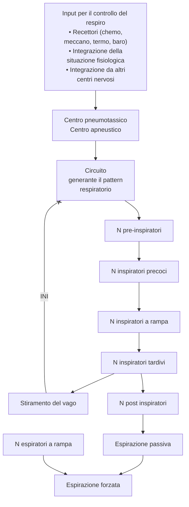

<!-- Mon 27 Apr 2020 01:03:10 PM CEST -->

\clearpage
\part{Fisiologia respiratoria}

# Anatomia delle vie aeree {-}

## Macro {-}
1. Vie aeree superiori
	- Naso
		- 50% della resistenza totale al flusso
		- Filtra e condiziona l'aria
	- Laringe
		- Tratto comune tra apparato respiratorio e digerente (ecco perché epiglottide chiude trachea)
		- Termina con \tol{epiglottide} e \a{corde vocali}
2. Vie aeree inferiori
	- Trachea
		- Si divide in 2 bronchi principali, che si ramificano in 3 o 2 bronchi lobari
			- Bronco di dx → 3 ramificazioni → 3 lobi polmonari (sup, interm, inf)
			- Bronco di sx → 2 ramificazioni → 2 lobi polmonari (sup, inf)
	- Vie aeree di conduzione (bronchi > bronchioli) \asidefigure{img/diramazioni-respiratorie.png}{}
		- Costituite dalle prime 16 generazioni di ramificazioni dei bronchi lobari ("_spazio morto respiratorio_"^[Volume non adibito allo scambio] di 150 ml)
			- Bronchi di conduzione (generazioni 2^[0 è trachea, 1 sono i bronchi dx e sx]--9)
			- Bronchioli non respiratori (generazioni 10--16)
	- Vie respiratorie terminali (bronchioli respiratori > dotti alveolari > alveoli)
		- Costituite dalle ultime 7 generazioni (tot: 23) di ramificazioni dei bronchioli
		- Alveoli: struttura in cui avvengono realmente gli scambi respiratori (~ 100 mq di superficie di scambio)
			- Parete alveolare è estremamente sottile ([1 strato di cellule](#micro), ~ 0.3 μm) strettissimamente accoppiata ai capillari

## Micro {-}
- Epitelio respiratorio __è ciliato__ (ma dimensioni delle ciglia ↓ progressivamente, fino a sparire negli alveoli)
	- Ciglia immerse in __liquido periciliare__ (a base mucosa, prodotto da cellule mucipare)
	- Obiettivo: ciglia + muco trattengono materiale in sospensione e, mediante movimento coordinato, permettono la risalita verso la laringe dove verrà deglutito e smaltito nello stomaco (_ascensore mucoso_)
- Lo strato cellulare che compone gli alveoli è composto da 3 tipi di pneumociti:
	1. Pneumociti di 1/o tipo --- responsabili degli scambi gassosi (piatti e molto sottili)
	2. Pneumociti di 2/o tipo --- sintetizzano `tensioattivo polmonare`^[Necessario perché gli alveoli sono talmente piccoli che, se non fossero ricoperti da tensioattivo, non riuscirebbero ad espandersi per la [Legge di Laplace](https://it.wikipedia.org/wiki/Relazione_di_Laplace)] (piccole e cuboidali)
	3. Pneumociti di 3/o tipo --- verosimilmente chemocettori per sondare la composizione dell'aria (
- Matrice extracellulare che separa gli alveoli molto abbondante in fibre elastiche (per permettere rientro passivo del parenchima durante l'espirazione)
- A livello alveolare si nota la componente immunitaria (s

| Volume | L (entrambi i polmoni) |
|---|---|
|Spazio morto respiratorio | 150 ml |
|Volume del parenchima respiratorio (efficace) | 2.5--3 L |

## Circolazione {-}
- Ci sono 2 reti circolatorie polmonari
	1. Circolazione polmonare (da \art{arteria polmonare}): destinata all'ossigenazione del sangue
	2. Circolazione bronchiale (da \art{aorta}): destinata alla sopravvivenza del parenchima
		- 30% del refluo torna all'atrio destro tramite vene bronchiali
		- 60% del refluo torna all'atrio _sinistro_ tramite le \ven{vene polmonari} ⇒ ↓ pO~2~ del sangue in uscita dal cuore sinistro^[Infatti SpO~2~ normale è ~ 99%, non 100%]
- La circolazione bronchiale è ~ 70 ml, ma può variare a seconda dello stato funzionale dell'individuo, reclutando o abbandonando capillari
	- Può aumentare (mediante il __reclutamento di nuovi capillari__) durante esercizio fisico (max 200 ml)^[Ecco perché si dice che bisogna "rompere il fiato", o perché chi è allenato ha più fiato -- in aggiunta al fatto che individui allenati hanno un compenso cardiorespiratorio più rapido e tollerano molto meglio l'ipossia indotta dall'esercizio]
	- Può diminuire se alcune zone polmonari vengano cronicamente non ventilate
- __Le pressioni idrostatiche dei circoli polmonari sono nettamente inferiori__ (~ 15 mmHg), per evitare fenomeni di filtrazione ingente
	- Debolissima tendenza alla filtrazione, tranquillamente risolta da circolo linfatico
	- Se ↑ pressione circolo (insufficienza cardiaca sinistra, stenosi mitralica, ipertensione polmonare, ...) ⇒ ↑ filtrazione ⇒ edema polmonare

- La resistenza complessiva della rete vasale polmonare varia in funzione del grado di espansione del parenchima
	- __Vasi alveolari__: hanno andamento bimodale: per ↑ V~C~, prima vengono espansi (↓ resistenza vascolare) poi vengono compressi mano a mano che gli alveoli si espandono (↑ resistenza vascolare)
	- __Vasi extra-alveolari__: per ↑ V~C~ si ha ↓ della resistenza (perché la riduzione della pressione intratoracica permette un aumento della pressione transmurale a livello del vaso)

### Regolazione del circolo polmonare {-}

| Vasocostrittori polmonari | Vasodilatatori|
|---|---|
|Bassa pO~2~|Alta pO~2~|
|Bassa pCO~2~ |Alta pCO~2~|
|Trombossano A~2~|Prostacicline|
|Catecolammine b-adrenergiche| NO|
|Angiotensina| ACh|
|Leucotrieni |Bradicnina|

1. __pO~2~__ e __pCO~2~__
	- ↓ pO~2~ alveolare ⇒ vasocostrizione nella zona ⇒ ↑ aumento di resistenza della zona ⇒ ↓ perfusione
		- Questo _aumenta l'efficienza_: non viene sprecato sangue per irrorare una zona del polmone che non porta O~2~, e quel sangue viene rediretto dove invece c'è un buon accoppiamento tra ventilazione e irrorazione
	- ↑ pCO~2~ alveolare ⇒ vasodilatazione ⇒ ↓ resistenze ⇒ ↑ perfusione (per favorire la ventilazione della CO~2~)
2. __Sostanze che modulano le resistenze del circolo polmonare__

# Meccanica polmonare
- La funzione dell'apparato respiratorio è quella di __consentire lo scambio di gas__
- La funzionalità respiratoria è profondamente collegata con la funzionalità cardiovascolare ⇒ funzionalità _cardiorespiratoria_

## Meccanica polmonare dinamica

### Azione dei muscoli respiratori
- L'obiettivo dei muscoli respiratori è quello di __alterare la pressione all'interno del parenchima polmonare__ in 2 modi, a seconda del momento nel ciclo respiratorio
    - In modo da diminuirla rispetto alla pressione ambientale e permettere il momento inspiratorio
    - In modo da aumentarla rispetto alla pressione ambientale e permettere il momento espiratorio
- __L'alterazione della pressione è causata _solamente_ da una modificazione del volume__ \marginnote{\textbf{Legge di Boyle}\\ \hspace{0.3cm} $P_1V_1=P_2V_2$}
    - ↑ volume in fase inspiratoria ⇒ depressione ambiente alveolare ⇒ flusso in entrata dal parenchima
    - ↓ volume in fase espiratoria ⇒ compressione degli alveoli ⇒ flusso in uscita dal parenchima

### Muscoli e dinamica inspiratoria
- Muscoli coinvolti
	1. Principali --- \mus{diaframma}^[Innervato dal \ner{nervo frenico}, che origina con contributi dalle primo tratto cervicale (\textsc{c3, c4,c5})], \mus{mm. intercostali esterni}^[Innervati dai \ner{nn. intercostali}, che originano da \textsc{t1} a \textsc{t11}] (ed interni), \mus{mm. intercartilaginei parasternali}
    2. Accessori --- \mus{mm. scaleni}, \mus{sternocleidomastoideo}
- __Il diaframma e i mm.intercostali__, in condizioni eupnoiche, __sono i soli responsabili dell'inspirazione__, mediante un aumento del volume della gabbia toracica in 2 fasi
	1. __Pompa di bicicletta__ --- contrazione del \mus{diaframma}, che fa punto fisso sui \a{pilastri}. La dimensione verticale della gabbia toracica aumenta, e inizia la depressione
	2. __Manico di secchio__ --- entrano in gioco gli \mus{intercostali esterni} \marginnote{Gli intercostali sono orientati \emph{a mani in tasca}, ovvero dall'indietro all'avanti e dall'alto al basso} che fanno punto fisso sulla costa dalla quale partono (leva di III tipo). In questa maniera, sollevano il margine superiore della costa sottostante, aumentando la profondità della gabbia toracica
- Nel caso sia necessario un > apporto di ossigeno diventa importante l'azione dei muscoli acccessori
    - Scaleni e sternocleido: sollevano le prime coste e lo sterno
    - Piccoli muscoli del collo
    - Muscoli che aprono le pinne nasali, per ↓ la resistenza offerta dalle prime vie aeree\marginnote{Il 50\% della resistenza che incontra l'aria nel passaggio delle vie aeree è di responsabilità della zona nasale, specialmente a livello delle coane e dei turbinati}
	- A volte, in caso di dispnea grave, si nota anche un contributo dei muscoli addominali^[Il classico respiro di pancia di pancia che trovi in ambulanza mezzo secondo prima di confermare l'automedica. A volte si produce anche una situazione di [_respiro paradosso_](https://www.youtube.com/watch?v=JRwON_VwCWA&ab_channel=PaoloChinellato)], che tirano verso il basso il diaframma (retto dell'addome, obliquo est. ed int., trasverso dell'addome)

### Muscoli e meccanica espiratoria
- In __eupnea l'espirazione è passiva__, dovuta solo al ritorno elastico verso l'equilibrio del sistema toraco-polmonare (muscoli + pleura + parenchima)
    1. Si rilasciano i muscoli intercostali esterni, che tendono a chiudere le coste l'una sull'altra riducendo la profondità della gabbia toracica
    2. Si rilassa il diaframma, che tende a rialzarsi verso la sua posizione di equilibrio
- In __dispnea__ l'espirazione è forzata
    - __Muscoli addominali__ spingono in alto il diaframma (retto e trasverso dell'addome, obliquo est ed int)
    - Muscoli intercostali interni (orientati e funzionanti in maniera opposta rispetto agli omologhi esterni)

## Meccanica polmonare statica

### Volumi e capacità polmonari

\ 

|      | Volume o Capacità              | Descrizione                                             |                       | Litri |
|------|--------------------------------|---------------------------------------------------------|-----------------------|-------|
| VRI  | Volume di riserva inspiratoria | Volume _in più_ durante una inspirazione forzata        |                       | 3.0   |
| VRE  | Volume di riserva espiratoria  | Volume _in più_ durante una espirazione forzata         |                       | 1.5   |
| VR   | Volume residuo                 | Volume che sg. non è in grado di espellere              |                       | 1.0   |
| V~C~ | Volume Corrente                | Volume di aria scambiata in eupnea                      |                       | 0.5   |
| CV   | Capacità vitale                | Volume scambiabile (inspirazione + espirazione forzate) | VC + VRI + VRE        | 5.0   |
| CPT  | Capacità polmonare totale      | Volume che il polmone contiene                          | VR + VRE + V~C~ + VRI | 6.0   |
| CI   | Capacità inspiratoria          | Volume inspirabile dopo una espirazione forzata         | VC + VRI              | 3.5   |
| CFR  | Capacità funzionale residua    | Volume al termine di una espirazione eupnoica           | VR + VRE              | 2.5   |

### Componenti elastiche del sistema toracopolmonare

#### Pressioni che influenzano le proprietà elastiche
- In condizioni di riposo, il sistema toracopolmonare è in equilibrio ad un punto e ad una pressione che non è né il punto di equilibrio del solo parenchima polmonare (che tenderebbe a rimpicciolirsi, di suo^[La ragione di questo è che nel parenchima polmonare interalveolare sono particolarmente abbondanti le fibre elastiche che, una volta estese con l'inspirazione, tendono a rilasciare l'energia elastica accumulata ritornando alla posizione di equilibrio]), né il solo punto di equilibrio della gabbia toracica (che tenderebbe ad allargarsi, invece): __è il punto in cui le forze di espansione e di ritorno di entrambi i componenti si equilibrano__ \asidefigure{img/pneumotorace.png}{Uno pneumotorace sx. La differente tendenza della gabbia toracica ad espandersi e del parenchima polmonare a ritrarsi è estremamente evidente in condizioni di PNX, dove l'aria scolla il foglietto pleurico interno da quello esterno. In figura si vede come la gabbia toracica si assesti nel suo punto di equilibrio, e il polmone faccia altrettanto.}
	- L'accoppiamento dei due sistemi (parenchima + gabbia toracica) è garantito dalla __pleura__, che con i 2 foglietti (adesi tramite il liquido pleurico) agisce da raccordo rispetto ai due sistemi (il primo che tenderebbe a ritrarsi e il secondo che tenderebbe ad espandersi)
- 3 pressioni, quindi, entrano in gioco nel determinare l'equilibrio del sistema toracopolmonare
    - __Pressione barometrica__ (P~bar~)\ = 760 mmHg --- pressione atmosferica, dell'ambiente
    - __Pressione alveolare__ (P~alv~)\ = 760 mmHg --- pressione alveolare. Se la glottide è aperta e non c'è flusso, è uguale alla pressione barometrica
	- __Pressione pleurica__ (P~ple~)\ = 757 ÷ 754 mmHg --- pressione dello spazio pleurico
		-  All'equilibrio è subatmosferica a causa della contemporanea tendenza del parenchima ad ritrarsi e della gabbia toracica ad espandersi^[La pressione pleurica è misurabile tramite una sonda esofagea (di fatto un palloncino in esofago che permette di registrare variazioni di pressione). Questo perché i valori di pressione pleurica si trasmettono all'esofago, che decorre anteriormente allo spazio pleurico ]
			- Pressione dovuta al ritorno elastico del parenchima polmonare a fine espirazione = 3 mmHg
			- Pressione dovuta al ritorno elastico del parenchima polmonare a fine inspirazione = 6 mmHg

\begin{figure}[H]
	\centering
	\includegraphics[width=4cm]{img/papplb.png}
\end{figure}

### Curve pressione/volume

\footnotesize
Obiettivo: valutare la relazione che intercorre tra pressioni del sistema toracopolmonare e volumi di aria che riempiono il parenchima. Concettualmente questo è identico rispetto a quanto abbiamo già fatto con il cuore, fatto salvo per gli aggiustamenti dimensionali: per il cuore avevamo valutato la relazione tra forza contrattile e lunghezza delle fibre muscolari dovute al volume; per il sistema toracopolmonare abbiamo l'obiettivo di valutare la pressione in funzione del volume di espansione. Tra l'altro, dal punto di vista dimensionale $F \cdot l = P \cdot V$, infatti $ms^{-2}\cdot{m} = \frac{ms^{-2}}{m}\cdot{m^3}$
\normalsize

- Essendo il parenchima polmonare una struttura in funzione del volume si valutano le __pressioni transmurali__: le pressioni differenziali che si instaurano attraverso una struttura cava (P~TM~ = P~int~ - P~ext~) \marginnote{P\textsubscript{TM} \textgreater{} 0 ⇒ svuotamento dei polmoni\\ P\textsubscript{TM} \textless{} 0 ⇒ riempimento dei polmoni}
	1. Pressione transmurale polmonare (P~P~) = P~alv~ - P ~ple~
		- +3 mmHg a fine espirazione
	2. Pressione transumurale troacica (P~pt~) = P~ple~ - P~bar~
		- -3 mmHg a fine espirazione
	3. Pressione del sistema respiratorio (P~sr~) \begin{align*} P_{sr} &= P_p + P_{pt}\\ &= (P_{alv} - P_{ple} + (P_{ple} - P_{bar})\\ &= P_{alv} - P_{bar} \end{align*}
		- 0 mmHg a fine espirazione
- Curve pressione/volume dipenderanno dalla __complianza__ del sistema toracopolmonare
- Nelle curve pressione/volume individuiamo 3 regioni
	1. Una regione di _espansione_ del sistema toracopolmonare (P~TM~ < 0)
	2. Un punto di equilibrio (P~TM~ = 0)
	3. Una regione di _retrazione_ del sistema toracopolmonare (P~TM~ > 0)
- Essendo il sistema toracopolmonare composto da 2 componenti accoppiati (sistema toracico + parenchima polmonare) troviamo 3 curve \marginnote{Notare come tutte e 3 le curve hanno un punto di equilibrio differente: la curva polmonare non raggiunge mai lo 0 (i polmoni non si svuotano mai del loro volume residuo); la curva toracica raggiunge l'equilibrio se svincolata completamente dal polmone e il sistema toracopomonare raggiunge l'equilibrio lo abbiamo con volumi di aria uguali alla Capacità Funzionale Residua}\
^[NB: questo non è un grafico teorico, ma si costruisce studiando il pz. La misurazione va fatta collegando il sg. con uno spirometro che insuffla o aspira aria, avendo cura che il sg. _mantenga i muscoli completamente rilassati_ per non mascherare l'elasticità naturale della parete toracica. Al sg. viene poi comandato di aprire o chiudere la glottide, a seconda della curva che si vuole ottenere (a glottide aperta si costruisce la curva polmonare -- mentre per la curva toracica è necessario mantenere la glottide chiusa per "tappare" il sistema polmonare ed evitare il suo contributo elastico, che in questo momento non ci interessa misurare)]\ 
	2. Curva del parenchima polmonare (verde) --- qui P~TM~ è la pressione transpolmonare (P~TM~ è P~P~)
	1. Curva della parete toracica (nera) --- qui P~TM~ è la pressione transtoracica (P~TM~ è P~pt~)
	3. Curva del sistema toracopolmonare, in cui gli elementi sono accoppiati dalla presenza della pleura (rossa) --- qui P~TM~ è realmente la pressione transmurale del sistema toracopolmonare

#### Curva del polmone
- Misurazione: inspirazione ed espirazione _attiva_ del pz. a glottide aperta + misura pressione pleurica (indiretta)
	- Importante _escludere_ il contributo del torace ⇒ il sg. deve _contrarre i muscoli e irrigidire la parete toracica_
	- Misurazione della pressione pleurica con palloncino esofageo
	- P~P~ = P~bar~ - P~ple~ (ecco perché indiretta)
- Durante la misurazione la pressione transpolmonare varia in 2 momenti
	1. Un primo momento in cui abbiamo una crescita lineare fino a P~P~ = 20 cmH~2~O
	2. Un secondo momento di plateau (P~P~ > 20 cmH~2~O) dovuto a repentino ↓ della compliance polmonare (volume ~ 90% CV)
- Un polmone che raggiunge la posizione di equilibrio (quindi [atelettasico](https://it.wikipedia.org/wiki/Atelectasia), completamente svincolato rispetto alla pleura e al torace) contiene comunque un volume residuo di aria (~ 10% del VR)
	- Per avere un completo svuotamento del parenchima polmonare occorre uno schiacciamento _attivo_ del parenchima (pes con PNX iperteso)

#### Curva del torace
- Misurazione: spirometria a glottide chiusa
	- Importante che sg. sia con _muscoli toracici rilassati_ (per non alterare elasticità di parete)
	- Misurazione della pressione pleurica con palloncino esofageo
	- P~pt~ = P~bar~ - P~ple~
- Se il sistema si svuota ⇒ ↓ complianza e si arriva ad una pressione transmurale molto negativa
- Oltrepassata la parete tende ad espandersi per ritornare nel punto di equilibrio ⇒ 

#### Curva del sistema toracopolmonare
- Costruita sommando punto a punto la curva polmonare a quella toracica
- In inspirazione: pressione transmurale negativa; in espirazione: pressione transmurale positiva
- Perturbazioni dal punto di equilibrio statico ($\sum forze = 0$) del sistema toracopolmonare ⇒ forze elastiche toracopolmonari tendono a contrastare il movimento, per riportare il sistema nel punto di equilibrio

### Complianza polmonare
- La compliance dei polmoni è variabile
	- Per normali escursioni respiratorie (= volumi e flussi fisiologici) la compliance polmonare è alta (questo è ottimale per l'accoppiamento toracopolmonare
	- Per volumi respiratori molto grandi o molto piccoli la compliance è bassa (ci vuole molta pressione per fare variare di poco il volume polmonare)
- La compliance polmonare dipende dal volume iniziale della struttura polmonare^[Infatti sarebbe meglio parlare di __complianza per unità di volume__] (__complianza specifica__) ⇒ patologie restrittive o ostruttive causano variazioni di complianza
	- Patologie restrittive → ↓ compliance (es: fibrosi)
		- I volumi polmonari tendono a ridursi ( ≡ ↓ CFR) ⇒ ↑ FR per ventilare più frequentemente (quindi spesso ipocapnia)
	- Patologie ostruttive ⇒ ↑ compliance (es: enfisema) \asidefigure{img/patologie-polmonari-volume-compliance.png}{})
		- I volumi polmonari tendono ad aumentare (≡ ↑ CFR) ⇒ ↓ FR perché non è necessario ventilare altrettanto frequentemente (quindi spesso ipercapnia
- La compliance polmonare dipende da 2 fattori
	1. Le __fibre elastiche proprie del parenchima__ (1/3)
	2. La __tensione superficiale che si crea sulla parete alveolare__, nel momento in cui questi vengono reclutati e si crea l'interfaccia aria - surfattante liquido - parete alveolo (2/3)\marginnote{Laplace: $$P_{tm} = \frac{2T}{r}$$ con $T$ = tensione di parete ([dine/cm] = [N/m\textsuperscript{2}]), $P_{tm}$ = pressione transmurale}

#### Tensione superficiale, surfattante ed elasticità polmonare
- Laplace ci dice che _per $T$ costante_ ⇒ P~tm~ in un alveolo piccolo > P~tm~ di un alveolo grande ⇒
	- Alveoli piccolo tendono a svuotarsi più di quelli grandi(= si gonfiano più difficilmente), mentre alveoli grandi tendono a gonfiarsi più facilmente di quelli piccoli \marginnote{Questo significa che, se non si mitigasse questo problema \textbf{gli alveoli più piccoli si svuoterebbero dentro quelli più grandi}}
	- Alveoli piccoli tendono a collassare facilmente
	- In generale il parenchima polmonare si espande più difficilmente e si contrae facilmente ("_isteresi_"^[Sostanzialmente esattamente come succede quando voglio gonfiare un palloncino])
	- Se l'alveolo è molto piccolo la grande tensione superficiale prodotta all'interno tende a richiamare liquido interstiziale, allagandolo di fluido (male!)
- Per mitigare questo effetto gli alveoli sono __ricoperti da un surfactante (o tensioattivo) che ↓ la tensione superficiale in maniera inversamente proporzionale alle loro dimensioni__, permettendo che gli alveoli si comportino allo stesso modo in maniera indipendente rispetto al loro raggio
	- Miscela^[90% lipidi, 10% proteine] di sostanze anfipatiche che ha come obiettivo quello di ↓ la densità dell'acqua nei dintorni della parete alveolare per via dell'azione di repulsione prodotta dalla porzione idrofoba della molecola, ma si miscela bene per via della porzione idrofila (+ proteine con funzione principalmente immunitaria)
	- Prodotto da \a{pneumociti di tipo 2}, che lo esocitano in maniera costitutiva e regolata^[\att da iperespansione polmonare (⇒ forte distensione alveolare), agonisti β-adrenergici, sbadiglio ($\leadsto$ distensione polmonare), esercizio fisico]

## Flusso d'aria lungo le vie respiratorie
- Gli aspetti dinamici della respirazione vengono valutati tramite la spirometria
	- Volume espirato/Tempo, con FEV~1~, TLC, RV e FVC \marginnote{ FEV\textsubscript{1} = volume di aria espulso nel primo secondo \\ TLC = Total Lung Capacity \\ RV = Volume di Riserva \\ FVC = Capacità Vitale Forzata \\ FEF = Flusso Espiratorio Forzato (al 25\%, al 50\% e al 75\% del tempo per concludere l'espirazione)}

	- Flusso/Volume, con FEF~25~, FEF~50, FEF~75~ e RV

\ 

- \asidefigure{img/curva-spirometria-differente-sforzo.png}{} L'analisi delle grandezze spirometriche dipende dall'entità dello sforzo che il sg. compie (massimo, moderato, assente) mentre esegue la rilevazione. Mentre le curve sono molto diverse nella parte iniziale, convergono nella parte finale: questo ci dice che esiste un limite, verso la fine dell'atto inspiratorio, oltre il quale non si va, indipendentemente dallo sforzo del soggetto
	- Il primo 20 % della curva è sforzo-dipendente
	- Nella porzione terminale la curva spirometrica è sforzo-indipendente

## Pressioni e resistenze durante il ciclo respiratorio eupnoico

\marginfig{pressioniresistenzegraficoesame}

^[La variazione di pressione intrapleurica non è lineare, ma curva per via del fatto che, in condizioni _dinamiche_ una parte della pressione pleurica viene spesa per espandere gli alveoli polmonari (cosa che non è necessario che accada in una situazione statica). Questo spiega anche l'andamento a campana: all'inizio si reclutano i pochi alveoli grandi (bassa tensione superficiale) poi la maggioranza e poi si reclutano i pochi alveoli piccoli rimasti]

### Resistenze delle vie respiratorie

- $R = \frac{P_{atm} - P_{alv}}{Q}$
	- Per grandi volumi di aria spostata (= grandi flussi), la resistenza tende a ridursi
	- Resistenza complessiva $\simeq$ 2 cm H~2~O/L/s
- 80% della resistenza è legata alle prime 8 suddivisioni bronchiali, poi decresce, poi crolla nella zona respiratoria (per ↑ parallelizzazione della conduzione)

\ 

#### Fattori che modificano la resistenza delle vie aeree
- Resistenza e conduttanza polmonare ($G$) sono inversamente proporzionali \marginnote{$G= \frac{1}{R}$}
	- ↑ conduttanza polmonare (per ↑ volume) ⇒ ↓ resistenza (per espansione del parenchima e quindi anche del raggio delle strutture ⇒ ↑ Q)
	- ↓ conduttanza polmonare (patologie ostruttive, infiammazione, patologie restrittive, muco, fluido, ↓ espansività toracica­) ⇒ ↑ resistenza (per ↓ raggio delle strutture ⇒ ↓ Q)

## Lavoro respiratorio
- Il lavoro respiratorio è usato per vincere le resistenze elastiche e le resistenze viscose \marginnote{La dipendenza del lavoro da volume e frequenza respiratoria spiega come mai ci si attesta a respirare attorno ad una data frequenza e con un dato volume inspiratorio: perché le situazioni eupnoiche (12/15 atti/min scambiando ~ 500 ml) sono quelle che minimizzano il lavoro respiratorio. Se per esempio scambiassi volumi più piccoli facendo 60 atti/min il lavoro che compirei sarebbe maggiore, e l'atto respiratorio sarebbe meno efficiente}
    1. Superare la forza di __retrazione elastica__ del sistema toracopolmonare (lavoro elastico)
        - Questa quota di lavoro aumenta all'aumentare del volume: pazienti con ridotta complianza tendono ad aumentare la frequenza respiratoria, diminuendo il volume inspirato
    2. Superare le __resistenze viscose__ del flusso d'aria e dei tessuti (lavoro resistivo)
        - Questa quota di lavoro aumenta con la frequenza respiratoria: pazienti con aumentata resistenza tendono a fare respiri lenti e profondi
- __Lavoro = pressione $\cdot$ volume__ (complessivamente è area AXBC: la parte ABC è per vincere le forze elastiche, mentre la parte nella semiluna ABY è relativa ad attriti e resistenze)\

	- Fase inspiratoria (AYBC + AXBY) --- lavoro per vincere le forze elastiche e le resistenze non elastiche (attriti, resistenze al flusso)
    - Fase espiratoria (AYBZ + AZBC) ---  lavoro per vincere le resistenze al flusso in uscita + lavoro dissipato come calore
- Patologie ostruttive o fibrotiche alterano la compliance polmonare o la resistenza offerta al passaggio del fluido, e quindi alterano anche la facilità con la quale si ottiene una data variazione di volume
    - \pat{fibrosi} ⇒ ↓ compliance ⇒ ↑ del lavoro
    - \pat{asma} ⇒ ↑ resistenza vie aeree ⇒ ↑ lavoro resistivo

## Regolazione nervosa della respirazione

\footnotesize
Cfr innervazione autonomica
\normalsize

- La regolazione si esplica mediante rilassamento o costrizione della muscolatura liscia (essenzialmente da SNA)
	- __SN ortosimpatco__ tramite `nora` agisce sui recettori β2 ⇒ rilassamento della muscolatura liscia bronchiale ⇒ ↓ resistenza ventilatoria (broncodilatazione)
	- __SN parasimpatico__ mediante _azione vagale riflessa_ (spesso secondaria a stimolanti irritanti ↑ tono della muscolatura liscia ⇒ broncocostrizione
- Situazioni patologiche di ↓ del lume o ↑ pressione transmurale alterano di molto le resistenze
	- Ricordare: solo le strutture alte sono circondate da cartilaginei che mantengono un certo grado di pervietà: le strutture distali sono prone al collasso in situazioni patologiche di riduzione del lume o di aumento di pressione transmurale ⇒ si bloccano tanti condotti in parallelo ⇒ ↑↑ resistenza

# Scambi gassosi polmonari
- Per una efficace respirazione, il sistema circolatorio e respiratorio devono funzionare in maniera accoppiata
- Nella dinamica degli scambi gassosi 4 elementi sono essenziali
	1. Composizione del gas che si respira
	2. Ventilazione (sforzo meccanico per far entrare il gas nei polmoni)
	3. Scambio alveolare (processo di diffusione del gas tra alveoli e sangue)
	

## Composizione dell'aria

|Gas | \% |
|---|---|
|Azoto| 78|
|Ossigeno|20.9|
|Argon| 0,93|
|Anidride carbonica|0,03|
|Gas inerti| tracce|

- Il calcolo della pressione parziale dei gas va eseguito _togliendo la quota che, in condizioni reali, occupa il vapore acqueo_ \marginnote{Pressione parziale dei gas $$P_{gas} = F_{gas} \cdot P_{bar}$$ dove F\textsubscript{gas} indica la frazione del gas nella miscela}
    - Mano a mano che l'aria procede nelle vie aeree viene umidificata ⇒ ↓ pressione parziale dei gas (O~2~ in primis) poiché nella miscela aumenta il contenuto di vapore acqueo

<!-- Fri 08 May 2020 11:17:42 AM CEST -->
## Ventilazione

| Dati sulla ventilazione | |
|-|-|
| Volume per atto respiratorio (volume corrente - VC) | ~ 500 ml (6--8 ml/kg) |
| Frequenza respiratoria (adulto) | 14 ± 2 atti/min|
| Ventilazione totale | fino a 7500 ml/min |
| Ventilazione alveolare | 5250 ml/min |
| Spazio morto respiratorio | 150 ml |

- L'attività ventilatoria dipende essenzialmente da 2 parametri fisiologici
	1. VC
	2. FR
- [Come abbiamo visto](#lavoro-respiratorio) la condizione che consente il minor dispendio energetico è quella nella quale si scambiano 4--5 l/min in 12 atti/min
	- Ventilazione a bassa frequenza: non conveniente, perché necessita di grande VC (ma espandere il polmone è costoso, sopratutto all'inizio)
	- Ventilazione ad alta frequenza: non conveniente, perché porta a ↓ VC. Tuttavia, per bassi VC, diventa percentualmente sempre più rilevante il volume dello spazio morto, che però non essendo deputato agli scambi non produrrà una ventilazione efficace

### Misura dello spazio morto
- Spazio morto = spazio ventilato in cui non avviene scambio respiratorio
	- Spazio morto anatomico (alte vie aeree)
	- Spazio morto fisiologico (spazio morto anatomico + spazio alveolare non perfuso)
- Per misurare lo spazio morto ci sono 2 tecniche
	1. __Metodo di Fowler__ per misurazione dello spazio morto anatomico
	2. __Metodo di Bohr__ per misurazione dello spazio morto fisiologico (spazio alveolare non perfuso)

#### Metodo di Flower

\ 

1. l sg. inspira una miscela di O~2~ e N~2~ a concentrazioni definite (aria ambiente è perfetta) in un condotto che misura la concentrazione di azoto
2. Il sg. esegue __una singola inspirazione di O~2~ puro__ con un volume di 500 ml (⇒ 350 ml vanno in alveoli)
3. Il sg. espira, esalando una miscela di gas con concentrazione di N~2~ ridotta rispetto a quella ambientale
4. Si misura la concentrazione di N~2~ espirato nei vari cicli respiratori e il volume scambiato durante l'atto
	- In primis [O~2~] espirato ↑ ⇒ [N~2~] espirato = 0 (perché O~2~ puro che riempie lo spazio morto fa da rserva)
	- Quando [N~2~] espirato comincia a ↑: sappiamo che è stata esaurita la riserva di O~2~ che saturava lo spazio morto: il volume di espirazione a cui questo succede corrisponde al volume dello spazio morto ($V_M$)\

#### Metodo di Bohr
- Misura dello spazio morto _fisiologico_
- Idea: Il volume morto fisiologico è di fatto il volume che non è attivo negli scambi ⇒ se so il VC e vedo quanta CO~2~ viene scambiata con il 100% degli alveoli reclutati, posso poi trovare il volume morto quando non tutti gli alveoli sono perfusi andando a vedere quanta CO~2~ in meno viene immessa negli alveoli, e quindi quanta CO~2~ in meno viene esalata $$\frac{V_M}{V_C} = \frac{PA_{CO_2} - PE_{CO_2}}{PA_{CO_2}}$$
	- $PA_{CO_2}$ → 0 ⇒ assenza assoluta di perfusione (V~M~/V~C~ → $\infty$)
	- $PA_{CO_2} = PE_{CO_2}$ ⇒ ogni zona ventilata è perfusa (V~M~/V~C~ = 0)

## Scambio alveolare
- Lo scambio alveolare è il processo di diffusione dei gas tra sangue ↔ alveolo
- 3 cose sono importanti, nello scambio alveolare
	1. Il gas --- Quanto gas c'è negli alveoli (o disciolto nel sangue)
	2. La barriera ---  Capacità di diffusione
	3. Il sangue --- Perfusione (quanto sangue passa vicino agli alveoli perché ci possa essere effettivamente diffusione

### Quantità di gas negli alveoli

| Valori dei gas in alveolo | mmHg |
|-|-|
| $P_{O_2}$ | 102 |
| $P_{CO_2}$ | 40 |
| $P_{H_{2}O}$ | 47 |

- Per quantificare __quanta aria nell'unità di tempo viene scambiata a livello _alveolare_, in funzione di quanta CO~2~ viene prodotta e la $P_{CO_2}$ alveolare__:\marginnote{Equazione della ventilazione alveolare} $$\dot{V}_A = K \frac{\dot{V_{CO_2}}}{PA_{CO_2}}$$ \asidefigure{img/ventilazione-paco2.png}{}
	- $\dot{V}_A$ = Flusso alveolare (volume/min), rilevabile con spirometro
	- $\dot{V}_{CO_2}$ = Flusso di CO~2~ scambiato (~ 200 ml/min)
	- $PA_{CO_2}$ = Pressione parziale di CO~2~ negli alveoli
	- $K$ = $P_{ATM, CO_2} - P_{H_2O}$ = Frazione di CO~2~ in aria _secca_
- L'equazione della ventilazione alveolare dice essenzialmente che __se la ventilazione alveolare si riduce, la pressione alveolare di CO~2~ aumenta__
- La $PA_{O_2}$ (pressione alveolare di O~2~) è correlata direttamente con la $PA_{CO_2}$ \marginnote{Equazione dei gas alveolari} $$\boxed{PA_{O_2} = PI_{O_2} - \frac{PA_{CO_2}}{QR}}$$
	- $PA_{O_2}$ = pressione alveolare di O~2~
	- $PI_{O_2}$ = pressione parziale di O~2~ inspirato (quanto ossigeno inspiro)
	- $\frac{PA_{CO_2}}{QR}$ = quanto O~2~ viene consumato nella respirazione cellulare per produrre energia e CO~2~
		- $PA_{CO_2}$ = pressione alveolare di CO~2~ (prodotta dal metabolismo cellulare, che ritroviamo poi nel sangue e poi nei polmoni, e usiamo come misura indiretta di quanto O~2~ viene consumato dal metabolismo)
		- $QR$ = Quoziente Respiratorio (numero puro variabile a seconda del metabolismo) \marginnote{Dove $$QR = \frac{\text{Molecole di CO\textsubscript{2} prodotte dal metabolismo}}{\text{Molecole di O\textsubscript{2} consumate dal metabolismo}}$$}
			- Mediamente: QR = 0.83
			- Metabolismo glucidico: QR = 1
			- Metabolismo lipidico: QR= 0.7

\normalbox{Il ruolo della CO\textsubscript{2}}{
La quantità di CO~2~ nell'organismo va regolata finemente, perché è prodotta/va ad influire in numerosi processi

\begin{itemize}
\tightlist
\item
  CO\textsubscript{2} \(\propto\) attività metabolica (infatti esercizio
  ⇒ ↑ FR)
\item
  CO\textsubscript{2} è funzionale nel regolare il pH dell'organismo ↔
  compenso respiratorio degli stati di acidosi/alcalosi
\end{itemize}

In aggiunta a questo bisogna sottolineare che, essendo la
CO\textsubscript{2} essenziale nel mantenimento dell'equilibrio
acido-base, in eupnea comunque un po' di CO\textsubscript{2} viene
mantenuta nell'aria polmonare. Questo fa sì che comunque la
\textbf{pCO\textsubscript{2} si aggiri nei dintorni dei 35--45 mmHg}
}

### Diffusione alveolare
- Processo passivo
- Sia O~2~ che CO~2~ sono ben diffusibili per via
	- Ridotta dimensione (__Legge di Graham__) \marginnote{\textbf{Legge di Graham} --- \footnotemark $$\text{velocità diffusione}\\ \propto \frac{1}{\sqrt{\text{peso molecolare}}}$$} \footnotetext{⇒ Molecole piccole diffondono/effondono molto facilmente}
	- Alta solubilità
- La diffusione di un gas attraverso una lamina di tessuto è quantificata dalla legge di Fick \begin{align*}V_{gas} &= AD^{\star}\frac{\Delta P}{\Delta X} \\ &= D_p(P_{alv} - P{sangue})\end{align*}
	- $A$ = area di diffusione (superficie alveolare assoluta: 70--80 m^2^, ma superficie fisiologicamente ben perfusa e ben ventilata è <)
	- $D^{\star}$ = diffusibilità di membrana ($D^{\star} = \beta D$, con β che è un coefficiente 
	- $\Delta X$ = spessore di parete (0,5 --1 μm, costituita da \a{pneumociti i}, lamina basale sottilissima ed endotelio super sottile)
	- $D_p$ = capacità di diffusione polmonare \marginnote{$D_p$ è un indice sintetico che contiene i parametri della legge di Fick $D_p=AD/T$: area, spessore e diffusibilità (a sua volta dipendente da ingombro sterico della molecola, viscosità e temperatura)}
- La CO~2~ diffonde tra alveolo e plasma x20 rispetto all'O~2~

#### Come misurare sperimentalmente $D_p$
- La misurazione viene solitamente effettuata con il _metodo del singolo respiro_, che si basa sul valutare quanto velocemente una miscela di CO diluita sparisce dai polmoni (applicando, sostanzialmente, la legge di Fick)
    1. _Singola inspirazione_ di miscela di CO^[Scelta top perché ha una concentrazione facile da valutare + si lega bene agli eritrociti] + aria
    2. Il sg. trattiene il respiro per 10 secondi, e nel mentre si valuta la velocità di scomparsa del CO dagli alveoli
    3. Conoscendo la pressione di CO alveolare e quella ematica (= 0) si ricava $D_p$ usando la _legge di Fick_
- __Valore normale: $D_{p, CO}$ = 25 ml/min/mmHg__

### Limitazioni allo scambio di gas
- Limitazioni dovute alla __diffusione__
    - Se c'è buona perfusione, il collo di bottiglia è la diffusione. Questo succede se
		1. Il gas non si lega all'Hb
		2. Ci sono alterazioni nella $D_p$ (↑ spessore di parete [edema, fibrosi, infiammazione], ↓ A [fibrosi, enfisema]...)
- Limitazioni dovute alla __perfusione__
    - Se c'è buona diffusione, il collo di bottiglia è la perfusione. Questo succede se
        1. Il gas è estremamente affine all'Hb, per cui diffonde talmente velocemente da non riempire mai l'ambiente alveolare
        2. La gittata cardiaca aumenta troppo, ↓ il tempo di contatto con l'alveolo (di fatto non c'è il tempo perché tutta l'Hb si saturi con il gas)

### Perfusione polmonare
- Vedi [cp. sul circolo polmonare](#circolazione-polmonare)

\ 

- Essendo molto bassa, la pressione dei capillari polmonari risente molto della componente idrostatica (+1 cm di sangue $\simeq$ +0.77 mmHg)
	- All'apice, pressione alveolare > pressione vasi ⇒ vasi tendono ad essere compressi ⇒ apice perfuso peggio che base
	- Alle basi, pressione vascolare > pressione alveolare (per via della gravità) ⇒ basi meglio perfuse rispetto agli apici
	- Nei lobi medi la situazione è intermedia

#### Rapporto ventilazione/perfusione
- Mediamente, la ventilazione alveolare è 4 L/minuto, mentre la perfusione si aggira attorno ai 5 L/minuto ⇒ $$\frac{V}{Q} = \frac{4}{5} \simeq 0.8$$
- __Apice e base hanno accoppiamenti ventilazione/perfusione diversi__ \asidefigure{img/rapporto-ventilazione-perfusione.png}{Gli apici godono di un rapporto ventilazione/perfusione più sfavorevole rispetto alla base}
	- Gli apici hanno gli alveoli distesi e sono meno perfusi ⇒ gli alveoli sono vicini al plateau della complianza e quindi si gonfiano più difficilmente, in più sono generalmente meno perfusi ⇒ rapporto V/Q sfavorevole (tipicamente > 1)
	- Le basi hanno gli alveoli compressi ma sono meglio perfusi ⇒ quando si riescono ad espandere, vincendo la difficoltà iniziale, gli alveoli si espandono molto; in più sono ben perfusi ⇒ rapporto V/Q favorevole (tipicamente < 1)

#### Modifiche del rapporto ventilazione/perfusione tra apice e base

\ 

- 3 situazioni emblematiche
    - (A) --- situazione normale
    - (B) --- situazione con ↓ rapporto ventilazione/perfusione: l'alveolo tende a mettersi in equilibrio, dal punto di vista delle pressioni parziali di O~2~ e CO~2~, con il sangue
    - (C) --- situazione con ↑ rapporto ventilazione/perfusione: l'alveolo tende a mettersi in equilibrio, dal punto di vista delle pressioni parziali di O~2~ e CO~2~, con l'ambiente
- A livello di base polmonare e apice polmonare la situazione risente delle differenze di perfusione e ventilazione
	- La base è ben perfusa, ma meno ventilata ⇒ il rapporto tende a situazione B (V/Q $\simeq$ 0.63)
	- L'apice è ben ventilato, ma meno perfuso ⇒ il rapporto tende a situazione C (V/Q $\simeq$ 3.3)

## Trasporto dei gas nel sangue

### Trasporto dell'O~2~
- __Per soddisfare la domanda metabolica basale sono necessari 250 ml/min di O~2~__
- O~2~ nel sangue viene trasportato secondo 2 modalità
	1. Disciolto (3 ml/L/min)
	2. Legato all'Hb ($\star$)

\ 

#### Trasporto dell'O~2~ disciolto
- La quantità di O~2~ che si solubilizza nel sangue dipende dalla sua pressione parziale (__legge di Henry__) $$[O_2]_{sangue} = K_{O_2} PA_{O_2}$$
- La legge di Henry ci dice che __in un litro di sangue si disciolgono 3 ml di O~2~__
	- $K_{O_2}$ = costante di solubilità dell'ossigeno = __0.03 ml/100 ml__
	- $PA_{O_2} \simeq$ 97 mmHg

#### Trasporto dell'O~2~ legato all'Hb
- Hb è necessaria per avere un trasporto di O~2~ _marcatamente_ più efficiente rispetto alla sola diffusione $$Hb + O_2 \leftrightarrow HbO_2$$
	- 1 grammo di Hb si combina con 1,34 ml O~2~
	- Normale concentrazione Hb: 15 g/dl (16 uomo, 14 dona) ⇒ 20.1 ml di O~2~ disciolti in 100 ml
- La molecola di Hb è composta da 4 catene (2 catene α + 2 catene β), ognuna delle quali __contiene un gruppo `eme`__ a base di Fe^2+^
	- Atomo di O~2~ ossida gruppo `eme`: Fe^2+^ diventa Fe^3+^ (_meta-Hb_, o Hb in forma _tesa_)
- Hb è un'ottima molecola per trasportare O~2 (lo dimostra che la curva di dissociazione è sigmoide, con __P~50~ = 27 mmHg, P~75~ = 40 mmHg, P~97~ = 97 mmHg__)\

	- __Per alte pO~2~__ (distretto alveolare): O~2~ è ben affine a Hb, permettendo che le molecole di Hb si saturino con ossigeno (pO~2~ > 97 mmHg ⇒ SpO~2~ $\simeq$ 97%)
	- __Per basse pO~2~__ (distretti periferici poco ossigenati): O~2~ è sempre meno affine ad Hb mano a mano che ↓ pO~2~, permettendo che l'Hb rilasci le molecole di O~2~ dove c'è una bassa pressione parziale di ossigeno (pO~2~ < 40 mmHg ⇒ SpO~2~ $\simeq$ 75%)
- La curva di dissociazione dell'Hb si modifica in funzione delle condizioni in cui si trova quel particolare distretto corporeo \marginnote{Tendenzialmente questo significa che distretti in cui l'ossigeno è consumato (caldi, con alto pH (effetto Bohr, box pagina \pageref{effetto-bohr}), bassa pressione parziale di ossigeno, alta pressione parziale di anidride carbonica, metaboliti) diminuiranno l'affinità Hb-ossigeno, in modo che questo venga ceduto; il viceversa succede in distretti molto ossigenati (freddi per ventilazione, con basso pH per elimiazione di CO\textsubscript{2}, alta pressione parziale di ossigeno, bassa pressione parziale di anidride carbonica...)}

\begin{figure}{H}
\centering
\includegraphics[width=0.5\textwidth,height=\textheight]{img/shift-curva-dissociazione-hb.png}
\end{figure} \footnote{Il 2,3-DPG è una molecola che si forma negli eritrociti come prodotto della glicolisi anaerobica. Questa molecola è un anione che si lega alle catene beta dell'emoglobina e questo legame favorisce il rilascio dell'ossigeno}

\redbox{Intossicazione da CO}{
Il CO è estremamente affine all'Hb: questo significa che una volta legato non la molla più, rendendo di fatto inservibile quella molecola di Hb (clinicamente la SpO\textsubscript{2} rimane al 100\%, però!)

La terapia è quindi la camera iperbarica, per aumentare le pO\textsubscript{2} ambientali ad un livello tale da rendere l'O\textsubscript{2} di nuovo competitivo con il CO per tentare di spiazzare il legame.

Una cosa analoga succede anche con l'NO, con la differenza che è perfino più affine del CO all'Hb.
}

\normalbox{La mioglobina}{
La \texttt{mioglobina} è una molecola simile all'Hb, ma ha una curva molto spostata verso sx (affinità per O\textsubscript{2} di Mb \textgreater\textgreater{} affinità Hb). Questo riflette il differente ruolo fisiologico: Mb è presente nei muscoli, e deve fungere da \emph{riserva} di O\textsubscript{2} in loco: ha senso quindi che rilasci l'O\textsubscript{2} nel muscolo solamente se la pressione parziale di O\textsubscript{2} è effettivamente mooolto bassa (segno che il muscolo sta usando molto O\textsubscript{2} ed è bene aprire le riserve prima di switchare verso un metabolismo anaerobio).
}

\redbox{Ipossia}{
A seconda dell'eziologia ritroviamo 4 tipi di ipossia

\begin{enumerate}
\def\labelenumi{\arabic{enumi}.}
\tightlist
\item
  Ipossia ipossica (il sangue non è ossigenato a livello polmonare)
\item
  Ipossia anemica (normale pO\textsubscript{2} alveolare, ma incapacità
  di trasporto degli eritrociti)
\item
  Ipossia circolatoria (disaccoppiamento cardio-respiratorio)
\item
  Ipossia istotossica (normale pO\textsubscript{2} ematica, ma
  incapacità dei tessuti di usare O\textsubscript{2} per deficit nella
  respirazione cellulare)
\end{enumerate}
}

### Trasporto della CO~2~
- La CO~2~ viene trasportata dalla periferia ai polmoni in 3 modi
	1. Fisicamente disciolta nel sangue
	2. Come ione bicarbonato ($\star \star$)
	3. Come carbo-amino-composti legati alle catene terminali dell'Hb ($\star$)
- Siccome la CO~2~ comunque è essenziale nel regolare l'equilibrio acido-base, e il bicarbonato è _il_ sistema tampone più efficace, la quantità di CO~2~ negli alveoli viene comunque regolata in eupnea in modo da __garantire una pCO~2~ arteriosa di fine espirazione (etCO~2~) nei dintorni dei 35--45 mmHg__
	- pCO~2~ arteriosa = ~ 40 mmHg
	- pCO~2~ venosa = ~ 46 mmHg
	- pCO~2~ art/ pCO~2~ ven = 40/46 $\simeq$ 0.86 (__= QR__!!) \marginnote{QR = Quoziente Respiratorio (rapporto tra O~2~ consumato e CO~2~ prodotta, dipende dalla tipologia di metabolismo (glucidico aerobio vs anaerobio vs lipidico vs proteico)

#### CO~2~ disciolta
- Come per O~2~, dipende dalla $K_{CO_2}$ (costante di solubilità) e dalla $P_{CO_2}$ (pressione parziale di CO~2~ \marginnote{Legge di Henry}
	- $K_{CO_2} = K_{O_2} \times 22$ ⇒ CO~2~ si scioglie bene, 22 volte meglio dell'O~2~ per essere precisi
	- $PA_{CO_2}$ = 40 mmHg
- __100 ml di sangue rimuovono 0.3 ml di CO~2~ disciolta__

#### CO~2~ come ione bicarbonato

\ 

- Negli eritrociti si trova l'enzima __`anidrasi carbonica`__ che catalizza la reazione $$CO_2 + H_2O \leftrightarrows H^{+} + HCO_3^{-} \leftrightarrows H-Hb$$
	0. La CO~2~ diffonde all'interno degli eritrociti
	1. L'`anidrasi carbonica` catallizza la reazione $CO_2 + H_2O \leftrightarrows H_2CO_3$
	2. Il bicarbonato si mette in equilibrio spontaneamente: $H_2CO_3 \leftrightarrows H^{+} + HCO_3^{-}$
	3. Da qui lo ione bicarbonato e l'H^+^ vengono gestiti diversamente
		- Mediante uno scambiatore __HCO~3~^-^ out/Cl^-^ in__ (processo di _scambio dei cloruri_ viene disciolto nel sangue lo ione carbonato
		- Mediante acidificazione dell'Hb ($H^{+} + Hb \leftrightarrow H-Hb$) viene minimizzato l'impatto dello ione H^+^ libero (ecco perché ↓ pH fa calare l'affinità dell'Hb per l'O~2~)
- Nei polmoni succede esattamente l'opposto
	0. Il cloro esce, il bicarbonato entra
	1. Nell'eritrocita si riforma H~2~CO~3~
	2. H~2~CO~3~ $xrightarrow{\texttt{anidrasi carbonica}}$ CO~2~ + H~2~O
	3. CO~2~ e H~2~O vengono esalati con le ventilazioni

- __100 ml di sangue rimuovono 2.5 ml di CO~2~ sotto forma di bicarbonato__

#### CO~2~ come carboaminocomposti
- Una parte della CO~2~ reagisce reversibilmente con i __gruppi amminici terminali__ dell'Hb per formare i carboamminocomposti $$Hb-NH_2 + CO_2 \leftrightarrows Hb-NH-COOH \leftrightarrows Hb-NH-COO^{-} + H^{+}$$
- I carbamminocomposti si formano con più facilità se l'Hb non è ossigenata, perché l'Hb libera è acido debole (buon accettore di protoni) \marginnote{Effetto Haldane}
- __100 ml di sangue rimuovono 0.8 ml di CO~2~ sotto forma di carbaminocomposti__

\greenbox{Effetto Bohr\, oppure: come l'affinità Hb-ossigno dipenda dal pH, label=effetto-bohr}{
\textbf{Effetto Bohr} --- pH acido tende a diminuire l'affinità dell'Hb
per l'O\textsubscript{2}, mentre pH basico tende ad aumentarne
l'affinità

Questo perché la presenza di CO\textsubscript{2} acidifica l'ambiente e
l'Hb stessa, e pertanto è indice della necessità di ossigenare
l'ambiente, in quanto tendenzialmente alta pCO\textsubscript{2} è
associata con bassa pO\textsubscript{2}. Viceversa, ambienti a bassa
CO\textsubscript{2} sono tendenzialmente molto ossigenati, pertanto
ambienti basici tendono ad aumentare l'affinità Hb-O\textsubscript{2},
non essendo necessaria la cessione di ossigeno in quel distretto

Operativamente, l'effetto Bohr sposta verso destra, rendendola meno sigmoide (se ambiente basico) o verso sinistra, rendendola più sigmoide (ambiente acido) la curva di dissociazione dell'Hb.

\begin{figure}[H]
\centering
\includegraphics{img/effetto-bohr.png}
\end{figure}
}

#### Curva di trasporto della CO~2~
- Non esiste un effetto di saturazione, la curva di trasporto è molto "morbida" e al limite della linearità in ambito fisiologico (pCO~2~ 35--50 mmHg)
	- Naturalmente plateau esiste mano a mano che ↑ pCO~2~, per esaurimento delle specie chimiche coinvolte nel trasporto, ma il sistema ha ampie capacità di adattamento in crescita)
	- Curva CO~2~ disciolta non ha plateau e non dipende da pO~2~
- Fissata una pO~2~ (pO~2~ = 100 in curva sangue arterioso, pO~2~ = 40 in curva sangue venoso) si ottengono una famiglia di curve che dipendono linearmente dalla pCO~2~ \marginnote{\textbf{La ragione per cui bisogna fissare una pO\textsubscript{2}} è che l'Hb deossigenata agisce come acido debole, e visto che il trasporto di anidride carbonica gioca proprio su questo, la curva della CO\textsubscript{2} dipende dalla pO\textsubscript{2}, ma quella dell'O\textsubscript{2} in linea di massima non dipende da quella della CO\textsubscript{2} (al netto del pH che in realtà influenza anche la curva di dissociazione dell'Hb rispetto all'ossigeno)}

\ 

# Controllo della respirazione
- La respirazione è sotto il controllo essenzialmente di una __rete nervosa bulbopontina__ (_centri del respiro_)
- La rete nervosa bulbopontina ha un'attività intrinseca di __generazione del pattern respiratorio__
- L'attività intrinseca della rete nervosa ([regolazione nervosa](#regolazione-nervosa)) viene modulata integrando numerosi stimoli
	- Apparato recettoriale
		- Chemocettori centrali e periferici per PaO~2~, PaCO~2~, pH ([regolazione chimica](#regolazione-chimica))
		- Recettori delle prime vie aeree
		- [Meccanocettori polmonari](#riflessi-polmonari)
		- Recettori dolorifici
		- Termocettori
		- Barocettori
	- Situazione fisiologica dell'organismo
		- Masticazione/deglutizione
		- Temperatura^[Es: polipnea termica, ovvero polipnea per abbassare la temperatura corporea (si fanno respiri superficiali e rapidi per ventilare principalmente lo _spazio morto_ e usare questo come metodica per raffreddarsi]
		- Ormoni e arousal
		- Domanda metabolica
		- Dolore ed effetto _fight or fly_
	- Centri nervosi superiori
		- Corteccia (sensitiva + motoria)
		- Lobo limbico
		- Amigdala
		- Ipotalamo
		- Cervelletto

## Regolazione nervosa

### Centri del respiro
- Il respiro è regolato _esclusivamente_^[Non ci sono centri più bassi, una sezione a livello di C~1~ chiude la partita] dai __centri respiratori del tronco encefalico__ (porzione bulbo-pontina) \marginnote{Sezione rostropontina → eupnea \\ sezione mediopontina → dispnea (inspirazione profonda, ↓ FR) \\ Sezione rostrobulbare → gasping}
	- L'attività generata è __automatica e ritmica__, indipendente dalla volontà (ma possibile override)
	- Componenti vagali hanno la funzione di _interrompere_ l'inspirazione (lesioni vagali portano ad atti inspiratori abnormemente lunghi)

\ 

- I centri respiratori bulbopontini sono 4
	1. __Centro pneumotassico__ (o _gruppo respiratorio pontino_, \ner{grp})
		- Costituito da neuroni misti, inspiratori + espiratori
	2. __Centro apneustico__
		- Costituito da neuroni inspiratori
	3. __Gruppo respiratorio dorsale__ (\ner{grd})
		- Costituito da neuroni inspiratori
		- Riceve afferenze vagali e glossofaringee (barocettori del IX e X nervo cranico → nucleo del tratto solitario → \ner{grd}
	4. __Gruppo respiratorio ventrale__ (\ner{grv})
		- Costituito da porzioni con neuroni inspiratori + porzioni con neuroni espiratori
		- Invia proiezioni ai muscoli inspiratori ed espiratori

\normalbox{Pattern respiratori risultanti da lesioni dei centri del respiro}{

\begin{figure}[H]
\centering
\includegraphics{img/lesioni-pontine-pattern-respiratori.png}
\end{figure}

}

### Meccanismo alla base della genesi del ritmo respiratorio (drive respiratorio)

  

- Il circuito generante il pattern respiratorio è teso tra i nuclei \a{grd} e \a{grv}, ma la ritmogenesi in sé per sé sembra dipendere __principalmente^[Se si escissa \ner{grd} la ritmogenesi rimane, ma viene alterata in qualità: lesioni localizzate a GRD hanno dimostrato che se il polmone si iperespande non viene ripresa una efficace attività espiratoria, cosa che sembrerebbe sostenere l'idea che GRD contribuisce a modulare in qualità l'attività ritmica che GRV invece sostiene] da \ner{grv}__
	- Alcuni complessi di \ner{grv} (\a{complesso pre-botzinger} hanno _pacemaker-like properties_ (in vitro!)
	- Alcuni neuroni di \a{grv} hanno recettori μ per oppioidi (ecco perché oppioidi deprimono il drive respiratorio)

#### Fasi della respirazione
1. __Inspirazione__ (inizia per scarica di tutti i neuroni inspiratori di \ner{grv} e \ner{grd}; cessa per inibizione vagale su detti nuclei)
	1. firing dei __neuroni pre-inspiratori__
	2. Firing dei __neuroni inspiratori precoci__, attivati dai pre-inspiratori
	3. Firing crescente dei __neuroni inspiratori a rampa__
	4. Firing breve dei __neuroni inspiratori tardivi__, per rallentare l'inspirazione
	5. Contestualmente, l'espansione toracica porta ad uno stiramento del \ner{vago}, che inibisce i neuroni inspiratori di \ner{grd} per terminare gradualmente lo sforzo inspiratorio (già rallentato dai neuroni inspiratori tardivi)
2. __Espirazione__
	- Fase post-inspiratoria (E1)
		1. Firing dei __neuroni post-inspiratori__, per mantenere una contrazione del \mus{diaframma} gradualmente decrescente che smorzi il ritorno elastico (che almeno inizialmente sarebbe troppo brusco)
	- Fase espiratoria propriamente detta (E2)
		2. Espirazione passiva
		3. Opzionale firing dei __neuroni espiratori a rampa__, ma intervengono solo nell'espirazione forzata, attivando i muscoli addominali

## Regolazione chimica
- Obiettivo: regolare la ventilazione in funzione essenzialmente di 3 cose (a livello arterioso o del liquor)
	1. pO~2~ (attiva _solo chemocettori periferici_)
	2. pCO~2~
	3. pH

\ 

### Chemocettori periferici
- Sono 2: chemocettori del __glomo aortico__ e del __glomo carotideo__
	1. Chemocettori del \a{glomo aortico}
		- Numerosi
		- Situati al termine dell'arco aortico
		- Monitorano sangue in uscita verso organismo
	2. Chemocettori del \a{glomo carotideo}
		- Pari
		- Localizzati nella biforcazione della carotide comune
		- Monitorano sangue che va ad encefalo
		- Costituiti da 2 specie di cellule
			- __Cellule di 1/o tipo__, o __cellule glomiche__ --- cellule con funzione chemocettiva, in diretta continuità con fibre afferenti. Il segnale viene trasmesso mediante ACh, Nora e Dopa -- contenute nelle vescicole delle cellule glomiche stesse. I neurotrasmettitori vengono liberati in modo proporzionale alle variazioni chimiche registrate, agendo di fatto dal punto di vista funzionale come un recettore sensitivo
			- __Cellule di 2/o tipo__  --- sostegno e parenchima
- Ogni glomo è irrorato da una propria arteria, per cui monitora la composizione del sangue di quell'arteria (che parte da aorta o carotide) per valutare \marginnote{Flusso: 0.04 ml/min, ma peso = 2 mg ⇒ Flusso/peso: 2L/min/100gr! Per proporzione, è un flusso comparabile, tenendo conto del diverso peso, a 10 volte quello del cervello! L'obiettivo di un flusso così elevato è quello di evitare l'\textbf{effetto osservatore} -- evitare, cioè, che la quantità di ossigeno, anidride carbonica e ioni idrogeno sia alterato dallo stesso metabolismo delle cellule del glomo. Questo diventa un problema in caso di marcata ipotensione: in questa situazione il metabolismo dei glomi interferisce con la misurazione della pO\textsubscript{2} e della pCO\textsubscript{2}. Questo contribuisce a sostenere la risposta di vasocostrizione periferica compensatoria già iniziata dall'ortosimpatico, perché la scarica sul nucleo del tratto solitario attiva il SN simpatico}
	- __PaO~2~__
	- PaCO~2~
	- pH arterioso
- Le info dei chemocettori centrali convergono verso il \ner{nucleo del tratto solitario}
- I chemocettori preriferici __non rispondono ad ipossia anemica__, ma __solo ad ipossia ipossica__ (perché nel primo caso non cala la PaO~2~, mentre nel secondo sì)

\greenbox{Meccanismo di attivazione dei chemiocettori periferici in caso di ipossia}{
\begin{enumerate}
\def\labelenumi{\arabic{enumi}.}
\setcounter{enumi}{-1}
\tightlist
\item
  I chemocettori presentano \textbf{canali per il K\textsuperscript{+}
  accoppiato a proteine contenenti un gruppo \texttt{eme}} (non Hb)

  \begin{itemize}
  \tightlist
  \item
    Se manca O\textsubscript{2} ⇒ chiusura dei canali per
    K\textsuperscript{+} ⇒ ↓ permeabilità al K\textsuperscript{+} ⇒
    depolarizzazione della cellula glomica
  \item
    Se c'è O\textsubscript{2} ⇒ canale K\textsuperscript{+} pervio ⇒
    mantenimento della normale polarità di membrana
  \end{itemize}
\item
  Se la cellula glomica si depolarizza si ha la liberazione dei
  neurotrasmettitori

  \begin{itemize}
  \tightlist
  \item
    Depolarizzazione ⇒ liberazione delle vescicole contenenti i
    neurotrasmettitori preformati (ACh, Nora, Dopa)
  \end{itemize}
\item
  ↑ frequenza di scarica a livello dell'afferenza vagale/glossofaringea
  e il segnale arriva al centro
\end{enumerate}

\footnotesize
Un meccanismo simile si sviluppa in caso di ↑ protoni all'interno della cellula
\normalsize
}

### Chemocettori centrali
- Chemcoettori che si trovano sulla superficie centrale del \ner{bulbo}
	- Chemocettori dell'area rostrale
	- Chemocettori dell'area intermedia
	- Chemocettori dell'area caudale
- I chemocettori centrali rilevano pCO~2~ e pH del LCS e del LEC dei tessuti nervosi centrali
	- pCO~2~ e pH del LCS sono comparativamente simili a quelli del comparto venoso
- Una regolazione fine e aggiuntiva della pCO~2~ e pH a livello del LCS è necessaria per 2 ragioni
	- La \a{bee} è molto permeabile a CO~2~, ma molto meno a ioni H^+^ e a ioni bicarbonato
	- Il potere tamponante del LCS è < di quello del distretto vascolare
- I chemocettori centrali __non percepiscono acidosi metabolica__ (perché l'aumento del pH plasmatico !⇒ ↑ pH LCS per via della \a{bee})

## Esempi di risposte a variazioni

### Risposta ventilatoria a variazioni di PaCO~2~ e di pH
- Valori omeostatici da difendere contemporaneamente:
	- __PaCO~2~ $\simeq$ 40 mmHg__ (35 mmHg ≤ PaCO~2~ ≤ 45 mmHg) __con una ventilazione di 4--5 L/min__
	- 7.38 ≤ pH ≤ 7.42
- La ventilazione viene aggiustata (in FR e V~C~) per mantenere contemporaneamente i valori di CO~2~ e pH in un range compatibile con le funzioni metaboliche dell'organismo (__CO~2~ e pH vanno a braccetto per via del sistema tampone e del sistema di trasporto della CO~2~ mediante `anidrasi carbonica`__)
	- PaCO~2~ > 40 mmHg ⇒ ↑ ventilazioe (~50%)
	- PaCO~2~ < 40 mmHg ⇒ ↓ ventilazione \marginnote{\textbf{Attenzione}! PaCO~2~ < 35 mmHg, i centri respiratori vengono temporaneamente inibiti il sg. va in apnea (\emph{soglia apneica}) finché la PaCO~2~ non torna sopra soglia. Male male!}
	- PaCO~2~ > 60 mmHg _deve_ indurre respiro riflesso (è _riflesso_ di salvaguardia) \marginnote [Test dell'apnea](http://rc.rcjournal.com/content/58/3/532#sec-4)

\ 

#### Fattori che alterano la risposata alle variazioni di PaCO~2~

\ 

- L'ipossia amplifica la risposta compensatoria alle variazioni di CO~2~ (↓ PaO~2~ ⇒ shift verso sx)
	- Abbassa la soglia dopo la qale si attiva la risposta compensatoria (≡ PaCO~2~ più alte indurranno una ventilazione compensatoria che in condizioni di normossia non ci sarebbe, o non sarebbe altrettanto importante)
	- Aumenta la sensibilità alla CO~2~ (ma questo vuol dire che viene anche diminuita la soglia apneica, per fare sì che la ventilazione prosegua anche in caso di grave ipocapnia [sarebbe altrimenti un clamoroso autogol andare in apnea per basse PaCO~2~ quando si è in ipossia grave])
- Uno stato di acidosi amplifica la risposta compensatoria alle variazioni di CO~2~ (↓ pH ⇒ shift verso sx)
	- L'acidosi abbassa la soglia dopo la quale si attiva la risposta compensatoria (perché un aumento di ioni H^+^ porta ad un aumento ematico della CO~2~ disciolta, visto che la reazione dell'`anidrasi carbonica` è $\leftrightarrows$)
 Sonno, alcalosi, oppioidi e barbiturici, anestetici: spostano verso dx la curva (riducono la risposta compensatoria alle variazioni di CO~2~
 	- In queste situazioni la ventilazione e la PaCO~2~ va monitorata perché il corpo perde capacità di mantenere omeostasi della CO~2~

### Risposta all variazione della pO~2~
- La risposta ventilatoria varia in funzione della PaO~2~, ma non esiste una soglia apneica in condizioni di iperossia
	- ↑ ventilazioni se PaO~2~ < 60 mmHg (per Pa > l'Hb viene comunque sufficientemente saturata)
- Situazioni di ipercapnia/acidosi amplificano la risposta a variazioni di O~2~, rendendo più aggressivo lo sforzo di mantenimento dell'omeostasi (≡ si alza la PaO~2~ sotto la quale viene iniziato lo sforzo compensatorio, spostando la curva verso dx)

\yellowbox{Differenze tra risposta ventilatoria in funzione della PaO\textsubscript{2} e della PaCO\textsubscript{2}}{
\begin{itemize}
\tightlist
\item
  La curva di ventilazione per la CO\textsubscript{2} è
  \textbf{lineare}, con uno sforzo ventilatorio che aumenta in caso di
  ipercapnia e diminuisce (fino all'apnea) in caso di ipocapnia
\item
  La curva di ventilazione per l'O\textsubscript{2} è \textbf{piatta},
  con un grande plateau di sforzo ventilatorio per PaO\textsubscript{2}
  che mantengono ben saturata l'Hb, per diventare poi lineare per
  PaO\textsubscript{2} criticamente basse
\end{itemize}
}

\redbox{Acclimtatazione in ambienti poveri di ossigeno}{
In ambienti con bassa concentrazione di ossigeno (es: alta quota) è
necessario entrarvi con calma, ``acclimatandosi''. Questo perché se la
{[}O\textsubscript{2}{]} ambientale è troppo bassa, i centri respiratori
cominciano ad aumentare lo sforzo ventilatorio, arrivando a produrre
ipocapnia se manca un efficace override volontario della respirazione.
L'ipocapnia può arrivare a deprimere lo sforzo ventilatorio, ostacolando
il tentativo di compenso dell'ipossia ambientale. Occorre quindi entrare
in questi ambienti diminuendo progressivamente la concentrazione di
O\textsubscript{2} ambientale, abituandosi all'ipossia ambientale e
proseguire solo dopo che questo è successo, per ``abituarsi'' a livelli
bassi di O\textsubscript{2} ambientale senza poi virare verso
un'ipocapnia da aumentata ventilazione.
}

\redbox{Ossigeno e ventilazione in pz. con PaCO\textsubscript{2} cronicamente elevati (es: \pat{bpco})}{
Se un sg. è progressivamente e cronicamente esposto a basse
PaO\textsubscript{2} ed alte PaCO\textsubscript{2} (es: pz. con
\pat{copd}) i chemocettori si abituano a livelli cronicamente alterati.

Questo succede \emph{in particolare con i chemocettori per la
CO\textsubscript{2}}: la conseguenza è che il meccanismo di regolazione
ventilatoria in queste categorie di pazienti si sposta verso l'uso dei
chemocettori periferici di O\textsubscript{2}, sfruttando principalmente
loro per decidere quando respirare. In queste categorie di pazienti,
quindi, somministrare livelli particolarmente alti di O\textsubscript{2}
può arrivare a \textbf{deprimere completamente lo sforzo respiratorio},
per via del fatto che i chemocettori per l'ossigeno inibiscono i centri
del respiro (cosa che in pz normali non succede, visto che a loro si
somma anche il controllo operato dai chemocettori per la
CO\textsubscript{2} -- che però in questi pazienti sono non funzionanti
a causa di livelli di anidride carbonica cronicamente alti --.
}

### Risposta all'esercizio fisico (aumento del metabolismo)
- L'aumento metabolico (↑ _domanda_ O~2~, ↑ produzione di CO~2~, ↑ pH, ↑ lattati) porta ad un aumento compensatorio dello sforzo respiratorio
	- Durante esercizio fisico intenso: ventilazione 20x condizioni basali (fino a 100 L/min, fino a 140 L/min per atleta!!)
	- La curva di ventilazione vs metabolismo ha un andamento bimodale: c'è un __break-point ventilatorio__ (che coincide con l'aumento dei lattati > 2 mM) oltre il quale l'aumento ventilatorio è più marcato:\
	
- L'aumento compensatorio viene indotto anche da __segnali anticipatori della corteccia motoria__
- Dopo la fine dell'esercizio fisico, nella fase di recupero, si ha un momentaneo mantenimento dell'iperventilazione per normalizzare il pH durante lo smaltimento dei lattati

## Riflessi polmonari
- Riflessi di regolazione della respirazione in funzione dell'input di meccanocettori a livello del parenchima polmonare, input trasportate da afferenze vagali
- Ci sono 3 tipi di recettori polmonari
	1. __Meccanocettori a lento adattamento__, collocati tra la muscolatura liscia delle grandi vie aeree, afferiscono al \ner{grd}
		- __Riflesso di Hering--Beruer da insufflazione__ --- interruzione dell'attività dei muscoli inspiratori per iperestensione delle vie aeree per V~C~ > 1 L
		- __Riflesso di Hering--Breuer da desufflazione__ --- ???
	2. __Meccanocettori a rapido adattamento__, collocati a livello sub-epiteliali nelle vie aeree grandi e medie
		- __Riflesso di broncocostrizione di difesa__ per stimoli chimici esogeni (irritanti) o endogeni (istamina...)
		- __Riflesso paradosso di Head__ --- iperespansione produce insufflazione ulteriore per reclutare tutti gli alveoli
	3. __Recettori juxta-capilari__, collocati nell'interfaccia bronco--alveolare in vicinanza dei vasi. Sono sensibili a stimoli meccanici di _iperinsufflazione_, situazioni che _alterano l'interstizio_ (edema polmponare) o _particolari sostanze chimiche_ (capsaicina, prostaglandine...)
		- Riflesso producente dispnea/dolore

### Recettori in altre strutture
- __Fusi neuromuscolari del Golgi__ nei muscoli della gabbia toracica (arresto in inspirazione se iperdistensione muscolare)
- __Recettori rinofaringei__ sensibili a stimoli irritativi → starnuto
- __Termocettori rinofaringei__ che producono il __riflesso da immersione__^[Acqua fredda in faccia/naso ⇒ apnea (per non affogare) + bradicardia (per risparmiare risorse) + vasocostrizione periferica (risparmiare calore)]
