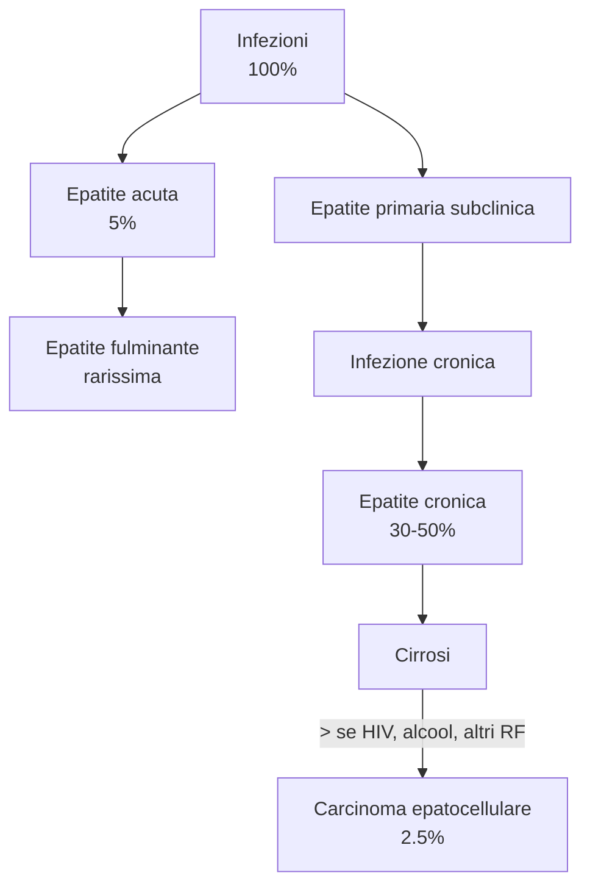

\clearpage
\part{Virologia speciale}

# Virus influenzali e parainfluenzali
- 2 famiglie di virus
    - Orthomixoviridae (virus influenzali)
		- Influenzavirus A (ceppo A)
		- Influenzavirus B (ceppo B)
		- Influenzavirus C (ceppo C)
		- Altri
    - Paramyxoviridae (virus parainfluenzali)
		- Paramyxovirus --- parainfluenzale umano 1 e 3
		- Rubulavirus --- parainfluenzale umano 2, 4a, 4b, parotite
		- Morbillovirus --- morbillo
		- Pneumovirus --- virus respiratorio sinciziale umano
- Sono __ribovirus a genoma negativo__^[I virus a genoma negativo hanno RNA che non è in grado di funzionare da messaggero, per via del fatto che l'RNA prodotto ha polarità opposta rispetto al messaggero che produce la cellula. È necessaria una RNA polimerasi RNA-dipendente (`RNApRNAd`, codificata nel genoma del virus stesso) per poter trascrivere l'RNA a polarità negativa e produrre il trascritto su cui attivare la sintesi proteica]
	- Alto tasso di mutazioni (RNA molto instabile rispetto a DNA)^[I virus a RNA e quelli a DNA mutano entrambi con la stessa frequenza (la mutazione in sé è un evento stocastico). La differenza risiede nel fatto che è molto più probabile che la mutazione in un virus a DNA porti alla morte della progenie virale, perché il codice dell'RNA è degenerato e si ha una maggiore probabilità di mutazioni silenti]
- Trasmissione: principalmente airborne, ridotta importanza a contatto^[Esperimento con le carte, in cui alcuni sg. che giocavano avevano virus influenzale]

## Orthomixoviridae (Influenzavirus)
- Famiglia di ribovirus con genoma a polarità negativa segmentato
- Nomenclatura: composta da 3 parti. Es: A/Hong Kong/1/68 (H3N2)
	1. Ceppo di virus (`A`|`B`|`C`)
	2. Luogo in cui il virus è stato isolato per la prima volta
	3. Anno in cui il ceppo virale è stato isolato
	4. Tipo di emoagglutinina (H) e neuroamminidasi (N) \marginnote{Nella denominazione del ceppo influenzale, la denominazione \texttt{HxNy} si riferisce al tipo di emoagglutinina e al tipo di neuroamminidasi (significa, in particolare, che quel ceppo ha emoagglutinina x e neuroamminidasi y). Ci sono numerosi ceppi di emoagglutinina e di neuroamminidasi (11 e 20 fin'ora riconosciuti): questo è un riflesso del grande tasso di mutazioni che caratterizza questo virus}

### Anatomia
- __Ribovirus con genoma ad RNA monocatenario con polarità negativa diviso in 7/8 segmenti__^[7 segmenti in virus influenzale C; 8 segmenti in virus influenzale A e B] \asidefigure{img/orthomixovirus.png}{}
- Involucro lipidico dalla forma sferica, con incastonate 3 classi di glicoproteine^[Le proteine di membrana sono quelle maggiormente soggette a mutamenti]
	1. __`Emoagglutinina`__ (in verde in figura)
		- Permette al virone di attaccarsi alle glicoproteine di membrana delle cellule bersaglio (acido sialico)^[È l'antirecettore che lega il virione all'_acido sialico_ (Acido `5-N-acetilneuramminico`) presente come glicoproteina di membrana della  parete cellulare delle cellule target] con un legame α2,6--galattoso
	2. __`Neuroamminidasi`__ (in giallo in figura)
        - Impedisce che il virione venga neutralizzato dal legame con acido sialico che è contenuto nelle glicoproteine mucose
		- Favorisce il contratto con le mucose delle vie respiratorie
        - Libera il virione dalla membrana cellulare quando si forma, per staccarlo dalla cellula oramai morente e permettere la diffusione dell'infezione
	3. __Proteine di matrice `M2`__ (in arancione in figura)
		- Permette l'adesione del virus alla cellula target
- 3 classi di proteine interne
	1. __Proteina di matrice M1__ (in nero in figura) --- protege il genoma virale, racchiudendolo
    2. __Proteine `PB1`, `PB2`, `PA`__ --- formano il complesso trascrittasico. Sono normalmente legate ai vari frammenti di RNA
    3. __Proteina `NS`__ (in marrone in figura) --- proteine non strutturali, necessarie per proteggere il genoma una volta esportato, in maniera da evitare che, nella cellula host, sia soggetto a splicing
- Si replicano nel nucleo

### Rapidità di mutazione
- I virus influenzali sono soggetti ad altissimi tassi di mutazione, spesso molto profonde ⇒ sono tra i protagonisti di eventi pandemici
	- Fino ad ora: 11 tipologie diverse di neuroamminidasi, 20 tipologie diverse di emoagglutinina
	- Mutazione profonda delle proteine di membrana ⇒ uomo non ha anticorpi!
- Animali sono il Reservoir naturale di alcuni sottotipi di virus influenzale (sopratutto __uccelli__ per virus influenzali di tipo A) \marginnote{Nonostante i volatili siano il reservoir principale dei virus influenzali (particolarmente di tipo A) anche altre specie animali, selvagge e domestiche, costituiscono un reservoir naturale: cavalli, suine, balene, foche...}
	- Ambienti con convivenza stretta di uomo e animali (particolarmente se scarse condizionai igieniche) sono __grande fattore di rischio per salto di specie__
	- Se salto di specie possono verificarsi fenomeni pandemici
	- Per riportare sotto controllo eventuali situazioni di rischio l'unica soluzione è fare lo _stamping out_ (abbattimento completo) del reservoir^[Un esempio lo abbiamo avuto proprio questo autunno, dove [si è reso necessario abbattere milioni di visoni in allevamento](https://www.repubblica.it/esteri/2020/10/16/news/virus_visoni_danimarca-270749112/) per evitare che potessero continuare ad essere un efficace serbatoio per varianti del Sars-CoV-2. Virus diverso, ma stesso problema]

\normalbox{Le grandi influenze della storia}{

Gli orthomixovirus sono stati responsabili delle principali epidemie. Al di là di quelle conosciute, i morti imputabili ad ogni outbreak si aggirano nell'ordine delle centinaia di migliaia (milioni per il caso specifico della spagnola)

\begin{itemize}
\tightlist
\item \textbf{Spagnola} (H1N1) --- 1918
\item \textbf{Asiatica} (H2N2) --- 1957
\item \textbf{Influenze ad Hong Kong} (H5N1) --- 1990--2003
  \begin{itemize}
  \tightlist
  \item Re-insorgenza in sudest asiatico nel 2003
  \item Re-insorgenza in Vietnam nel 2016 (mortalità \textasciitilde{} 50\%)
  \end{itemize}
\item \textbf{Pandemia A} o influenza aviaria (H1N1) --- 2009
  \begin{itemize}
  \tightlist
  \item 100K ÷ 400K morti nel solo primo anno
  \end{itemize}
\item Cina, \textasciitilde{} anni 2000 (H7N9)
\item Ritorno dell'influenza aviaria, Cina, 2018 (H7N4)
  \begin{itemize}
  \tightlist
  \item Mortalità particolarmente alta se comorbidità croniche importanti
  \end{itemize}
\item Altri ceppi
  \begin{itemize}
  \tightlist
  \item H3N2 \textasciitilde{} 1870
  \item H3N8 pre 1918
  \item H1N2 (da antigenic shift di H3N2 e H1N1) nel 2003
  \end{itemize}
\end{itemize} }

- La variabilità degli orthomixovirus ha la causa nel __genoma segmentato del virus__, prono ad essere facilmente riarrangiato. Questo avviene con 2 metodiche
	1. Antigenic shift: processo per il quale in un soggetto infettato da più ceppi virali si possono originare virus mutati con un pool di geni combinato
	2. Antigenic drift: processo per il quale variazioni _casuali_ nel genoma portano a piccole variazioni nelle caratteristiche antigeniche

#### Antigenic shift
- Sostituzione __totale__ di tutti i caratteri antigenici di emoagglutinina e neuroamminidasi __per ricombinazione con altri virus__ che infettano in quello stesso momento l'host ("_swap of genes_")^[Esempio: l'influenza suina contiene un gene tipico dell'influenza aviaria e  un gene tipico dell'influenza umana]
	1. Un ceppo virale da un animale infetta un host intermedio
	2. Un ceppo virale da un uomo infetta un host intermedio
	3. Quando entrambi i ceppi virali infettano la medesima cellula nell'host intermedio, il materiale genetico si mescola (_swap of genes_)
	4. Si produce un virus con il pool genetico necessario per infettare l'host umano
- Non è evento estremamente frequente per 2 ragioni
	- Necessita di intervalli di tempo lunghi
	- Necessita una contemporanea infezione dell'host con più ceppi virali
- Riguarda prevalentemente emoagglutinina (che tra tutte ha > potere antigenico)
- È meccanismo alla base delle modificazioni più consistenti ed importanti del virus (in termini di potenzialità patogenetica)

#### Antigenic drift
- Modificazione __parziale__ di alcuni caratteri antigenici di emoagglutinina e neuroamminidasi dovute a piccole __modifiche del tutto casuali__ del materiale genetico
- Più frequente in virus a RNA rispetto a quelli a DNA, per > reattività intrinseca dei ribonucleotidi rispetto ai desossiribonucleotidi^[Dovuta alla presenza del gruppo -OH anziché del solo gruppo -H]

<!-- Tue 28 Apr 2020 02:14:08 PM CEST -->

### Manifestazione clinica
- Incubazione 18-72 ore post inalazione respiratoria, con esordio acuto
- Febbre solitamente < 38.5°C, più elevata nel bambino (tendenzialmente < 4 gg)
- Tosse
- Mialgia
- Possibili manifestazioni GI^[Questo perché l'acido sialico è presente anche sulla parete dell'epitelio del tratto gastrointestinale] (sopratutto bambino)
- Si risolve in 7gg circa, con persistenza di tosse anche per dopo

### Epidemiologia
- __Ha andamento stagionale__ perché il virus si replica bene a temperature più basse (33°C): questa situazione nelle prime vie aeree è più probabile si verifichi durante stagione fredda
	- Picco: gennaio
- Ogni anno in EU: ~ 40K persone muoiono per influenza stagionale
- Immunità non altamente protettive
    - Si sviluppa principalmente tramite IgA (non IgG o IgM), che non sono super efficaci
    - I virus mutano molto rapidamente (_antigenic shift_)

#### Vaccinazione antinfluenzale
- Vaccino rimane mezzo più efficace per prevenzione. Una buona fetta di popolazione purtroppo non risponde al vaccino (efficacia: 70--90% vaccinati)
    - \goldstandard Vaccino a componenti inattivate mediante formalina
    - Vaccino con soli antigeni (H ed N)
- Tendenzialmente la vaccinazione è per 2 gruppi di virus influenzali
	1. H1N1 + H3N2 (sia Ceppo A che Ceppo B)
    2. Ceppi di isolamento recente/rilevanti nell'anno passato
- Importante vaccinare/proporre vaccinazione a categorie a rischio o chi convive con categorie a rischio
    - Anziani (+ conviventi)
    - Donatori/operatori sanitari
    - Immunocompromessi, a seconda del tipo di vaccino (+ conviventi)
    - Neonati (+ conviventi)

### Diagnosi
- Diagnosi: solitamente clinica
	- Particolare attenzione a pz. immunocompromessi o se esito dubbio, dove una diagnosi precisa è _fondamentale_ ⇒ in questi casi meglio __PRC multiplex con pannello respiratorio__^[Legionella + virus influenzali + virus parainfluenzali + Coronavirus + Metapeumovirus + Pneumococco] (batteri + virus)
- Metodiche
    - Ricerca diretta di antigeni su tampone naso/faringe, aspirati n/f, lavaggio BA (BAL)
    - \goldstandard PCR multiplex (pannello respiratorio)
	- Sierologia con ricerca di IgA secretorie nelle mucose (meno utile per diagnosi, più per capire prevalenza [ottimo per avere indicazione su ceppi da includere nella vaccinazione!])

## Paramyxoviridae
- Famiglia di ribovirus a genoma monocatenario con polarità negativa che contiene, tra gli altri
    - Paramyxovirus --- parainfluenzale umano 1 e 3
    - Rubulavirus --- parainfluenzale umano 2, 4a, 4b, parotite
    - Morbillovirus --- morbillo
    - Pneumovirus --- virus respiratorio sinciziale umano

### Anatomia generale
- __Ribovirus con RNA monocatenario a polarità negativa non segmentato__
	- Il genoma __non è segmentato__ (⇒ > stabilità)
    - Polarità negativa ⇒ necessitano di complesso transcrittasico
    - RNA
- Nel peplos si trova
	1. Il __complesso trascrittasico__, composto da 2 famiglie proteiche
		- __Proteina L__ (large), con alto PM
		- __Proteina P__ (fosfoproteina)
	2. La __proteina V__ (_fattore di virulenza_)
		- Impedisce la trascrizione di geni dell'host che codificano per IFNα e IFNβ
	3. Catena di RNA, legata a __proteine NP__ (p. del nucleocapside)
- La membrana è lipidica e di origine cellulare: a due facce e con 2 tipi di proteine spike
	- È a due facce
		- Una faccia interna, costruita da __proteina M__
		- Una faccia esterna
	- Nella membrana ci sono le proteine di spike
		- __Proteina F__ (di fusione^[Da studi di citochimica si è visto che colture cellulari miste a colture di virus parainfluenzali determinano una situazione per la quale le cellule si fondono tra loro]) --- stimola la fusione del corpo del virione con la parete cellulare della cellula host. Tipica e caratteristica della famiglia dei Paramixovirus
		- __Glicoproteina HN__ --- a funzione composta: sia neuroamminidasica che emoagglutinasica (come negli orthomyxovirus agisce da antirecettore per l'acido sialico)

### Ciclo replicativo
\footnotesize
I paramyxovirus si replicano nel _citoplasma_
\normalsize

1. Legame con cellula target grazie a glicoproteina HN -- che si lega con acido sialico
2. Fusione del virione con la cellula target (grazie all'azione proteina F)
3. Il virione si apre nel citoplasma e si libera del nucleocapside
4. Il materiale genetico contenuto nel nucleocapside + il complesso trascrittasico ⇒ sintesi delle macromolecole specifiche per il virus
5. Gemmazione dalla cellula dei virioni neoformati

### Manifestazione clinica
- Tendenzialmente breve periodo di incubazione (4-6gg) e manifestazione clinica che si esaurisce solitamente in pochi gg
- Clearance virale: 4-5 settimane
- L'infezione in soggetti competenti è solitamente limitata all'epitelio delle vie respiratorie superiori (mucosa nasofaringea in adulto, territorio più esteso in pz. ped), raramente si diffonde in distretti inferiori
    - 25% dei casi infezione prosegue verso laringe/trachea/bronchi (⇒ laringo-tracheo-bronchiti) + edema laringeo
    - In rarissimi casi prosegue verso le vie profonde con bronchite/bronchiolite/polmonite
- Ruolo importante, nel determinare la gravità della risposta, dal sistema immunitario dell'host
	- ↑ livelli di citochine infiammatorie e chemochine (IL6, TNFα) ⇒ risposta infiammatoria pesante ⇒ sintomatologia pesante

### Diagnosi
- Interesse in pz. altrimenti sano: scarso
    - In adulto solitamente non viene fatta
    - In pz. ped diventa rilevante, perché può avere complicazioni (discesa nelle vie profonde) che vanno considerate
- Come
    - Ricerca antigeni in secrezioni nasofaringee
    - __PCR con pannello respiratorio__
	- NO: coltivazione, sierologia (Elisa) \marginnote{Sierologia è usata per capire prevalenza}

## Focus su alcuni paramyxovirus diffusi

### Rubulavirus (parotite)
- Uomo è unico serbatoio naturale
- Virus della famiglia dei Paramyxovirus che causa la \pat{parotite}
- Trasmissione: airborne

#### Patogenesi
0. Infezione tramite goccioline di saliva
1. Colonizzazione del tratto respiratorio superiore e dei linfonodi regionali
2. Replicazione all'interno dei linfonodi regionali
3. Diffusione _per via ematica_ alle \a{ghiandole parotidi} e alle \a{ghiandole salivari} -- o, meno frequentemente, ad altri distretti (organi sessuali, SNC)
4. Eliminazione del virus tramite saliva/urine
5. Presentazione dei primi sintomi

#### Clinica
- Incubazione lunga ed asintomatica \asidefigure{img/parotite.png}{}
	- L'eliminazione del virus con la saliva/urine _precede_ la comparsa dei sintomi
	- Infettività: 4--5 gg giorni _prima_ della comparsa dei sintomi
	- Alla scomparsa dei sintomi si ha già avuto completa clearance virale
- Clinica: sintomatologia parainfluenzare + dolore in zona delle parotidi
	- Febbre non elevata
	- Stanchezza, anoressia, perdita appetito
	- Dolore in zona collo, e dietro alle orecchie
	- Ingrossamento anche molto evidente delle parotidi

#### Complicazioni
- Orchite^[Non frequente in maschi prepuberi, frequente in maschi post-puberi]/ooforite^[In femmine puberi]  che raramente esita in sterilità
- Encefalite e/o meningite asettica (10/15% dei casi). Possibile anche se infezione parotidea rimane subclinica (paucisintomatica) e, quindi, misconosciuta
- Sordità temporanea/permanente

#### Diagnosi
- Clinica (se c'è, a volte la manifestazione è subclinica) + PCR su saliva (specialmente se sg. paucisintomatico)
- PCR su tampone salivare
- PCR su urine
- Sierologia per IgM abbastanza accurata, ma non ha molto senso per diagnosi (a sto punto si sceglie PCR, no?)

### Morbillovirus
- Paramyxvirus responsabile del \pat{morbillo}
- Trasmissione: airborne con droplet/aerosol

#### Patogenesi
1. Contatto con virus (trasmissione aerea) e infezione della mucosa respiratoria
2. Diffusione ai linfonodi regionali e alle cellule del [__sistema reticoloendoteliale__](https://it.wikipedia.org/wiki/Sistema_reticoloendoteliale)
3. Le cellule dei linfonodi e del sistema reticoloendoteliale che vengono infettate dal virus si danneggiano, e si producono policariociti^[Sincizio cellulare con più nuclei]

#### Presentazione clinica
- Incubazione: 6--21 gg (media 13 gg) \asidefigure{img/koplik.jpg}{\emph{Macchie di Koplik} --- Lesioni della mucosa biancastre ("granuli di sale su fondo rossastro"), a grappolo, tendenzialmente riscontrabili nelle vicinanze del \a{dotto di stenone}. Sono patognomoniche per il morbillo, e si sviluppano nel periodo di massima contagiosità del sg. (12--48 ore prima dello sviluppo del rash tipico da morbillo). Il rash parte dalla zona faringea, per estendersi al viso e al volto}
	- Il soggetto è infettante per tutto il periodo di incubazione e sintomatico
	- Contagiosità, riferita all'evento centrale della patologia (esantema)
		- Da 5 gg prima dell'esantema
		- A 6-21 gg dopo l'esantema, con viremia che si abbassa costantemente da dopo esantema
- Prodromi (~ 4 gg)
	- Febbre alta (≥ 40°C), tosse, mal di gola, congiuntivite (da auto-inoculazione)
    - Se prodromi persistono è verosimile che si tratti di forma complicata
- Macchie di Koplik nella mucosa buccale (per 12--48h)
- Esantema _maculopapuloso_ (rash cutaneo) rosso vivo su tutto il corpo (per 6--7gg) \asidefigure{img/esantema-morbillo.png}{}
	- Direzione: retro orecchie e attaccatura dei capelli → viso → resto del corpo^[NB: il rash tipico da varicella è tronco → volto, e risparmia tendenzialmente gli arti]
	- Tipicamente 3-5 gg dopo prodromi

##### Complicazioni
- Complicanze in 1/3 dei casi, 1/4 necessita del ricovero (spesso se pz. ≤ 5aa)
- Causa principale di complicazioni: disseminazione sistemica
- 2 cause principali di complicazione
	1. Disseminazione sistemica
		- Otite media ($\leadsto$ sordità)
		- Polmonite
		- Encefalite in fase post-acuta (0.5/1%)
		- Encefalite post-infettiva ritardata (probabilmente per sovrapposizione di azione auto-immune)
		- \pat{pess} (panencefalite subacuta sclerosante a placche)
		- Episodi di auto-immunità
	2. Sovrainfezione batterica in soggetti debilitati

###### \pat{PESS}
- Risultato di una rara (~ 1:300K infetti) infezione cronica, che si manifesta tardivamente (anche molto)
- Malattia neurodegenerativa in cui il virus si riproduce nel distretto encefalico
- Segni
	- Anticorpi liquorali (⇐ BEE alterata, non deve succedere!)
    - ↑↑ Ig sieriche
    - Nucleocapsidi del paramyxovirus in neuroni e cellule gliali + ag morbillo^[In realtà non proprio morbillo, ma leggermente differente, quasi come se si fosse "modificato" nel tessuto cerebrale, per questo viene indicato come __virus PESS__] (⇐ biopsia)
- 2 fasi
    - Fase prodromica: disturbi attenzione, umore, comportamento
    - Fase di stato: deterioramento progressivo e non arrestabile di vigilanza, coscienza, attenzione e linguaggio
		- Termina in afasia completa e totale assenza di vigilanza
- Nei morbillovirus che causano PESS il genoma virale è __mutato__, con interessamento di:
    - Proteina F
    - Emoagglutinina
    - Proteina M

#### Diagnosi
- Siccome sintomatologia è caratteristica, la diagnosi è normalmente clinica (macchie di Koplik sono patognomoniche)
- Sierologici possibili da 3 giorni _prima_ dell'esantema (meglio per forme paucisintomatiche)

#### Epidemiologia
- In Italia: 1333 casi di morbillo nel 2017, di cui l'88% in sg. non vaccinati (altri vaccinati erano paucisintomatici)
	- Distribuiti omogeneamente tra regioni del nord e del sud (triste)
	- Riemergenza preoccupante (~ 2.5K/anno) in Italia
- La manifestazione è possibile a qualsiasi età (prevalente, ma non limitata, a bambini)

#### Vaccinazione e prevenzione
- La vaccinazione costituisce __principale e più efficace mezzo preventivo__
- Si usa vaccino trivalente (MPR, morbillo + parotite + rosolia)
- Vaccinazione obbligatoria dal 2001, in 2 dosi successive (2aa + 6aa)

<!-- Thu 30 Apr 2020 09:26:22 AM CEST -->
# Togavirus
- Famiglia di virus che presenta un mantello lipidico esterno al capside
	- ⇒ inattivato bene da detergenti e/o solventi organici

## Rubella virus
- Togavirus a RNA con polarità positiva
- Unico ospite è uomo
- Trasmissione: airborne tramite droplets

### Anatomia
- __Virus a RNA con polarità positiva__
- Con envelope
- Bilayer lipidico esterno al capside (30% del peso del virione è lipidi)
	- Nel mantello sono incastonate le glicoproteine di membrana

### Epidemiologia e trasmissione
- Trasmissione attraverso secrezioni nasofaringee (droplets)
	- Il picco di contagiosità lo si ha __la settimana precedente lo sviluppo dell'esantema__ \marginnote{Perché in questo momento si ha il picco di viremia, causato dalla notevole replicazione virale che precede l'eventuale sviluppo della manifestazione sintomatica}
- Particolarmente preoccupante l'infezione in gravidanza (specie se primo periodo)
	- Rosolia ⇒ alterazioni nello sviluppo fetale
	- Possibile trasmissione verticale (rosolia congenita -- CRS)
	- Essenziale vaccino in prima infanzia, per avere sicurezza della copertura durante gestazione
- 100K bambini/anno nascono con CRS
    - 50% bambini non hanno accesso al vaccino per rosolia

### Patogenesi

### Clinica

\ 

- Spesso paucisintomatica ⇒ misconosciuta. Non tutte le forme portano a esantema \asidefigure{img/esantema-rosolia.png}{Esantema da rosolia}
- Sintomatologia classica:
	- Modesto rialzo febbrile
	- Esantema roseo^[Il morbillo ha un esantema più rosso, che si sviluppa _prima_ sul viso e poi si estende al corpo], non pruriginoso
	- Linfoadenopatia (sopratutto orecchie e nuca)

#### Complicazioni
- Trombocitopenia
- Encefalite, specialmente nel bambino (se diffusione del virus a SNC)

#### Rosolia in gravidanza
- __Rosolia in gravidanza (specie se contratta nel 1/o trimestre) può portare ad avere malformazioni fetali o anomalie nello sviluppo__ \marginnote{La possibilità di trasmissione verticale cala con il progredire della gravidanza: massima all'inizio e calante verso la fine}
	- Alterazioni uditive → sordità (virus si annida nella \a{coclea})
	- Alterazioni oculari: cecità, glaucoma, cataratta, retinopatia
	- Microcefalia, ritardo mentale
	- Epatosplenomegalia, possibilità di polmonite interstiziale (ancora nell'utero)
	- ↑ mortalità
- La possibilità di trasmissione verticale in madre infetta è ~ 90%
	- 1/o e 2/o trimestre: ↑↑ possibilità di trasmissione verticale
	- 3/o trimestre: possibilità di trasmissione verticale diminuita
- Naturalmente diventa _imperativo_ capire lo stato immunologico _pre-gravidanza_ e l'eventuale timing dell'infezione (⇒ sierologia per IgG e IgM)
  - IgG specifiche ⇒ immunità
  - No IgG specifiche ⇒ suscettibilità
  - IgM specifiche ⇒ infezione in corso, preoccuparsi

### Diagnosi

#### Diagnosi di rosolia congenita (CRS)
1. Determinazione dello stato immunologico pre gravidanza della madre (sierologia)
2. Se la madre è suscettibile (sierologia negativa/molto scarsa)
    - Diagnosi pre-natale per giocare di anticipo
        - Amniocentesi → __PCR__ + isolamento per coltura virale
        - Prelievo di sangue fetale → __Titolo IgM e IgG__ + isolamento virale + PCR
    - Diagnosi post-natale
        - Sangue → __Titolo IgG IgM__ + PCR
        - Urina/Tampone n/f → __PCR__ + isolamento virale
		- Followup continuo ogni 3/6 mesi (il bambino espelle virus per periodi particolarmente lunghi)

### Prevenzione e vaccinazione
- Vaccinazione preventiva costituisce il metodo più efficace per prevenire la rosolia nei bambini e la rosolia in gravidanza
- Test per Rubella virus andrebbe fatto ad inizio gravidanza (insieme a test per altre infezioni: sifilide, HIV, toxoplasma...)

# Papillomavirus (HPV)
- Virus correlato definitivamente allo sviluppo di forme cancerose
    - \pat{cercvico-carcinoma}
    - Cancro pene, ano vulva
    - Tumori testa/collo
- Infezione principalmente tramite __contatto diretto (HPV è MTS)__, ma non si possono escludere anche contagi per via indiretta^[Il virus è stato ritrovato anche in bocca o nel letto ungueale]
    - Ricerca in corso, ma non evidenze di trasmissione verticale
	- Ricerca in corso, ma non sembra che il virus diffonda per via ematica \marginnote{Sono però state individuate tracce di HPV in carcinoma al seno, e questo sembra sostenere una diffusione per via ematica o linfatica. Tuttavia, in questi soggetti, il sangue è sempre risultato privo di virus}

\greenbox{Altri virus oncogeni}{
\begin{longtable}[]{@{}ll@{}}
\toprule
\begin{minipage}[b]{0.28\columnwidth}\raggedright
Virus\strut
\end{minipage} & \begin{minipage}[b]{0.66\columnwidth}\raggedright
Tumore provocato\strut
\end{minipage}\tabularnewline
\midrule
\endhead
\begin{minipage}[t]{0.28\columnwidth}\raggedright
HPV\strut
\end{minipage} & \begin{minipage}[t]{0.66\columnwidth}\raggedright
Carcinoma della cervice uterina, ano, vulva,vagina,pene, orofaringe,
cute\strut
\end{minipage}\tabularnewline
\begin{minipage}[t]{0.28\columnwidth}\raggedright
HCV e HBV\strut
\end{minipage} & \begin{minipage}[t]{0.66\columnwidth}\raggedright
Tumori epatici, linfoma non Hodgkin\strut
\end{minipage}\tabularnewline
\begin{minipage}[t]{0.28\columnwidth}\raggedright
HTLV1\strut
\end{minipage} & \begin{minipage}[t]{0.66\columnwidth}\raggedright
Leucemie e linfoma a cellule T\strut
\end{minipage}\tabularnewline
\begin{minipage}[t]{0.28\columnwidth}\raggedright
HHV8 (Herpesvirus)\strut
\end{minipage} & \begin{minipage}[t]{0.66\columnwidth}\raggedright
Sarcoma di Kaposi\strut
\end{minipage}\tabularnewline
\begin{minipage}[t]{0.28\columnwidth}\raggedright
EBV\strut
\end{minipage} & \begin{minipage}[t]{0.66\columnwidth}\raggedright
Tumori n/f, linfoma di Hogkin, linfomi dello stomaco\strut
\end{minipage}\tabularnewline
\begin{minipage}[t]{0.28\columnwidth}\raggedright
MCV (Merkel Cell Polyomavirus)\strut
\end{minipage} & \begin{minipage}[t]{0.66\columnwidth}\raggedright
Tumore cellule di Merkel\strut
\end{minipage}\tabularnewline
\bottomrule
\end{longtable}

Naturalmente anche batteri (\emph{Helicobacter} in primis) sono relati con lo sviluppo di patologie oncologiche (cancro dello stomaco)
}

## Anatomia e tassonomia
- 2 gruppi di Papillomavirus, che rispecchiano i 2 gruppi di papillomi che conosciamo (cutanei + mucosi)
	- α papillomavirus (papillomi mucosi)
		- Condilomi/carcinomi ano-genitali
		- Papillomi/carcinomi orofaringei
	- β, γ, μ, ν papillomavirus (papillomi cutanei)
		- Verruche e carcinomi cutanei
- Virus a DNA double strand 8K bp, composto da 3 regioni \asidefigure{img/genoma-papillomavirus.png}{}
    1. Regione LCR (Long Control Region)
        - Origine replicativa
        - Elementi di controllo per processo trascrizionale
    2. Regione E (Early): codifica per proteine regolative
		- `E1` --- necessaria nella replicazione del virus
		- `E2` --- permette la trascrizione delle proteine virali
		- `E4` --- sconosciuta
		- `E5` --- funzione non chiara, presente solo nei papillomavirus mucosi (α). Sembra stimoli fattori di crescita
        - _Oncoproteina_ `E6` ed `E7` --- \ini p53 e Rb
    3. Regione L (Late): codifica per proteine strutturali
		- Proteina L1: proteina capsidica esterna (maggiormente immunogena)
        - Proteina L2: proteina capsidica interna
- Il genoma presenta molte omologie tra tipi di papillomi
- Capside a struttura icosaedrica (?g

## Contagio ed infezione
0. __Contatto diretto su citotipi cellulari__ appropriati
	- Penetrazione favorita se è epitelio di transizione o se epitelio non è perfettamente integro
    - Legame: proteine capsidiche con `eparan-solfato`
1. Penetra nelle cellule, approfondandosi per tutto l'epitelio, infettando gli __epiteliociti basali__. A seconda dello strato dell'epitelio il virus si comporta in modo differente \asidefigure{img/hpv-storia.png}{}
    - Nelle cellule dello strato basale: mantenimento del genoma e replicazione lenta
    - Nello strato soprabasale/spinoso: amplificazione del genoma
	- Nello strato granulare: assemblaggio di nuovi virioni (espressione dei fattori tardivi e formazione del capside)
	- Nello strato squamoso: rilascio del virus (le cellule morte non costituiscono una barriera efficiente)

## Storia naturale dell'infezione
1. Infezione
2. Prosecuzione dell'infezione nel tempo
    - Infezione transitoria (80% dei casi)
        - Tendenzialmente 2aa per completa clearance virale
		- In questo stadio: raccomandati test frequenti (ogni 2 mesi)
    - Infezione persistente (20%)
		- Progressiva displasia dell'epitelio (displasia localizzata → carcinoma in situ → forma invasiva) \marginnote{10\% del totale degli infetti. 0.8\% del totale degli infetti mostra CIN 
			1. Neoplasia cervicale intraepiteliale (CIN) di grado 1, 2, 3^[Se grado ≥ 2 è raccomandato intervento per rimuovere la parte di epitelio interessata dalla neoplasia in crescita]
			2. Sviluppo di una forma invasiva con potenziale metastatico (1.6K/1M infetti)
		- In alcuni casi avviene regressione, ma probabilità cala con aumentare del grado della lesione

\ 

<!-- Mon 04 May 2020 09:15:56 AM CEST -->
## Epidemiologia
- Ita: incidenza relativamente bassa (9.7/100K donne) rispetto ad EU (11.2/100K donne)
	- ER è sotto la media (8/100K donne)
- MA: carcinoma della cervice rimane 3/a neoplasia maligna per incidenza (anche perché alcuni serovar di HPV sono più oncogeni di altri^[Sopratutto HPV16 e HPV18]: 10 serovar di HPV sono responsabili del 97% delle neoplasie da HPV)

## Prevenzione e screening

### Test
1. Test di primo livello (adeguati per screening)
	- HPV-test
		- Diagnosi basata su PCR, con l'obiettivo di identificare i ceppi di papillomi eventualmente presenti
		- Elevata sensibilità ma bassa specificità: si accompagna al PAP test nel caso sia necessario approfondire l'iter diagnostico
			- ↑ specificità per donne ≥ 30aa
	- PAP test (Test di Papanicolau -- 1946)
		- __Screening citologico__ adeguatamente specifico (80%), ma non troppo sensibile (60%) \marginnote{Livelli ottimi di sensibilità o specificità si attestano attorno al 98\%}
		- Consiste nel prelievo di materiale citologico per la ricerca di lesioni pre-cancerose
			- Riduzione della quantità di citoplasma
			- Aumento nel numero di cellule
		- Se positivo (_"ASCUS +"_) ≡ individuazione di cellule squamose atipiche con significato indeterminato
2. Test di secondo livello
	- Colposcopia con eventuale biopsia o per sorveglianza della lesione

#### Modelli di prevenzione e screening sulla popolazione
- Modello classico
    1. PAP test
    2. Colposcopia
    3. Biopsia mirata
- __Modello attuale__ \marginnote{Centro Screening AUSL Bo disponibile (screening@ausl.bologna.it, 800 31 48 58) per dare informazioni}
	1. Screening con test di primo livello appropriato per l'età (PAP test o HPV-DNA)
		- 25 < età ≤ 29 → PAP test ogni 3 anni
		- 30 < età ≤ 64 → HPV-DNA test ogni 5 anni
	2. Altro test di primo livello, per confermare la lesione (HPV-DNA o PAP test)
	3. Colposcopia (con eventuale biopsia) se anche la citologia conferma la lesione
    4. Valutazione del rischio e individuazione della strategia appropriata
        - Sorveglianza
		- Terapia (spesso exeresi chirurgica)
- Screening consigliato anche a chi è vaccinato (il vaccino è stato introdotto recentemente)

\begin{figure}
\centering
Tra i 25 e i 29 anni ↓ \\
\includegraphics{img/pap-test-modelllo-screening.png}\\
Tra i 30 e i 64 anni ↓\\
\includegraphics{img/hpv-screening-dopo-30aa.png}
\caption{Algoritmo di screening per l'HPV a seconda dell'età}
\end{figure}

\yellowbox{HPV nel maschio}{
\begin{itemize}
\tightlist
\item Ora la vaccinazione è offerta anche ai ragazzi
\item L'infezione nel maschio
  \begin{itemize}
  \tightlist
  \item Ha probabilità di infezione più alta nell'arco di tutta la vita
  \item Clearance più veloce (6 mesi)
  \end{itemize}
  \item No programma di screening al momento (inattuabili perché statisticamente l'uomo ha probabilità di insorgenza più alta per tutta la vita ⇒ ha poco senso ideare un programma di screening se poi non si fa in modo che questo programma duri tutta la vita)\footnote{Statisticamente l'andamento dell'infezione nelle donne ha un picco tra i 15 e i 30aa, per poi calare stabilmente: ecco perché in questo caso, invece, un programma di screening ha senso}
\end{itemize}
}

## Carcinogenesi

### Cofattori nella carcinogenesi
- Deficit immunitari
- Non uso di profilattici \marginnote{L'uso del profilattico purtroppo non esclude la possibilità di infezione, perché se il virus si trova nella mucosa di uno dei due partner c'è una concreta possibilità che questo si depositi sulla parte esterna del profilattico, aumentando poi il rischio di contagio nel momento in cui questo viene maneggiato}
- Uso a lungo termine di contraccettivi orali^[Contengono sostanze che agevolano la replicazione virale, sopratutto in donne ≥ 40aa]
- Multiparità
- HIV^[Si registra una elevata presenza di HPV in soggetti HIV+]
    - Minor competenza immunitaria
    - Effetto additivo del virus dell'HIV nel processo di progressione neoplasica di HPV
- Consueti fattori di rischio per patologie neoplastiche
	- Esposizione a cancerogeni inizianti o promuoventi (fumo, alcool, alimentazione eccessiva...)
	- \ini oncosoppressori
	- \att oncogeni

### Tipologie di tumori indotti da HPV
- Cancro alla cervice uterina
- Cancro anale
	- Incidenza limitata in paesi occidentali (0.8/100K individui)
	- Interessa sia M (40%) che F (60%)
- Carcinomi squamosi nella regione testa/collo (faringe e orofaringe)
	- 5% del totale delle neoplasie
	- Sopravvivenza a 5 anni: 50%
	- Maggioranza dovuti a infezione da HPV, di questi il 95% da HPV16

## Vaccinazione e prevenzione
- Necessario che la vaccinazione preceda l'esposizione, ovvero prima dell'inizio dei rapporti sessuali (~ 12 aa, M e F)
- Ottima efficacia: ≥ 90--95% in entrambi i sessi e tra le varie età
- Inducono alti titoli di Ig (sia nelle secrezioni cervicali che sieriche)
- Vaccino è a componenti purificate (in questo caso, proteina `L1` di superficie), ma esistono preparazioni diverse con ceppi differenti
	- Fortunatamente in questo caso si ha cross-protezione tra i ceppi, quindi l'allestimento specifico è poco rilevante
	- Questo succede perché varie zone del genoma sono omologhe in vari tipi di Papillomi
- Vaccinazione in adulti ha senso (da incoraggiare) solo se sono HPV-DNA -
- Programmi di screening raccomandati anche per vaccinati

# Hepatovirus
- Gruppo di virus _eterogeneo_ (di famiglie molto diverse), ma tutti responsabili di __epatiti primarie__^[Molti altri virus oltre a questi causano epatite, ma come conseguenza secondaria. Es: citomegalovirus, e tanti altri virus che portano a lesioni epatiche che possono esitare in epatite]

| Virus (genoma)    | Patologia | Via di trasmissione |
|-------------------|-----------|---------------------|
| HAV (RNA)         | epatite A | Via orofecale       |
| HBV (DNA)         | epatite B | Via parenterale     |
| HCV (RNA)         | epatite C | Via parenterale     |
| HEV (DNA)         | epatite E | Via orofecale       |
| Virus delta (RNA) | epatite D |                     |

## HAV
- Virus a RNA della famiglia dei _Picornaviridae_
- Trasmissione orofecale

### Anatomia
- 1 molecola di ssRNA+
- Capside


### Patogenesi
- Il virus danneggia gli epatociti, replicandosi nel loro citoplasma
    1. Introduzione attraverso cibo nel tratto g/i
	2. _Prima replicazione_ a livello dell'intestino (e contestuale eliminazione attraverso le feci)
	3. Diffusione nel torrente ematico
    4. Ingresso negli epatociti, mediante un recettore (probabilmente glicoproteico) e __seconda replicazione__ nel loro citoplasma
	

### Clinica
- Incubazione lunga (14--28gg)
	- Nel periodo di incubazione/prima parte del periodo sintomatico: virus in torrente ematico e nelle feci (nel passaggio 2 e 3 della patogenesi)
- Sintomatologia classica: danno epatico + sintomi gastrointestinali + sintomi infiammatori generici
	- Nausea, vomito, diarrea, dolore addominale
	- Ittero (↓ funzionalità epatica ⇒ ↑ bilirubinemia oltre i 2--3 mg/dl)
	- ↑ ALT (marker di alterata funzione epatica)
	- Febbre
- Complicazioni rare
	- Epatite fulminante
	- Epatite colestatica (epatite + stasi biliare, ittero persistente, ↑ fosfatasi alcalina, prurito cutaneo intenso)
- Infezione NON cronicizza

\ 

### Epidemiologia e trasmissibilità
- Trasmissione oro-fecale
- Diagnosi va notificata a ISS per monitoraggio
- ITA: < 1K casi/anno, sopratutto in regioni del centro-nord
- Picco in EU nel 2017, poi sotto controllo nel 2018. Ha riguardato principalmente MSM

### Vaccinazione e prevenzione
- Vaccino molto efficace, anche se immunità corta (necessari richiami)
- Possibile somministrazione a qualsiasi età
- Somministrazione tendenzialmente per viaggi in posti con igiene scarsa e/o HAV endemico

## HBV
- Famiglia: _Orthoepadnaviridae_
- Trasmissione: parenterale
	- __Via ematica__ \marginnote{Tendenzialmente questo esclude il setting ospedaliero, per via del fatto che ad oggi le sacche di sangue sono estremamente controllate. Aiutami a dire estremamente}
	- Via sessuale (liquido spermatico, secrezioni vaginali)
    - Altri liquidi biologici (essudati da ferita, saliva...)
	- Trasmissione verticale (transplacentare, ma anche allattamento)
- È oncovirus: può portare a carcinoma epatocellulare in una percentuale di sg. infetti

### Anatomia
- __Genoma a DNA composto da 4 regioni codificanti__^[Alcune di queste regioni sono sovrapposte, e si differenziano principalmente sulla base di dove viene posizionata la ORF corrispondente] \asidefigure{img/HBV_genome.png}{}
    1. __Core (C)__ --- codifica per le 2 proteine del core virale
		- `C`: proteina che forma il capside virale (antigene di superficie: `HBcAg`)
		- `preC`: proteina che è necessaria per l'uscita del virus dalla cellula infetta (antigene di superficie: `HBeAg`)
    2. __Polimerasi (P)__ --- Codifica per la polimerasi RNA dipendente di 90KD che il virus usa per trascriversi
	3. __Superficie (S)__ --- Codifica per le 3 glicoproteine di superficie (antigeni di superficie: `HBsAg`^[Naturalmente questi sono gli antigeni maggiormente immunogenici ed efficaci, una volta prodotti, nel contenere l'infezione e garantire una immunità stabile])
		- `p24`: il principale antigene di superficie del virus
		- `p33`: proteina a funzione incerta
		- `p39`: glicoproteina che funge da antirecettore per il virione
    4. __Proteina transattivante (X)__ --- codifica per la proteina transattivante
		- Attiva il genoma virale, permettendone la replicazione
        - \ini oncosoppressori (p53 e altri)

<!-- Tue 05 May 2020 02:30:30 PM CEST -->
### Patogenesi
1. Ingresso del virus nel corpo del pz. mediante vie prevalentemente paraenterali
2. Il virus si lega agli epatociti umani mediante il recettore `p170`, che lega le glicoproteine di superficie. Entra nella cellula
3. _Uncoating virale_: il genoma si libera delle proteine capsidiche e va nel nucleo
4. Il genoma virale viene trascritto dalla polimerasi dell'host. Si creano 2 categorie di mRNA
	- mRNA subgenomici: codificano per proteine virus-specifiche
	- mRNA pregenomici: codificano per la DNA polimerasi RNA dipendente e per le proteine del capside
5. Danni agli epatociti
	- Parziale effetto citopatico dovuto alla produzione dei virioni
	- I prodotti virali ostacolano l'azione dei principali oncosoppressori (proteina transattivante)
	- \goldstandard Sviluppo di una situazione di __infiammazione cronica__ nel distretto epatico ⇒ danni prolungati da infiammazione

### Clinica
- Infezione è paucisintomatica nella maggioranza dei casi: la sua evoluzione dipende dall'efficacia del contenimento immunitario \marginfig{stohbv}
    - 90% --- infezione acuta silente
    - 10% --- epatite acuta
		- 0.001%: epatite fulminante (⇐ estrema sovrarisposta del SI)
- Nel 10% del totale degli infetti l'infezione cronicizza (durata ≥ 6 mesi) per via della risposta subottimale del SI^[Alcuni pz cronicizzano perché una mutazione nel genoma virale porta al blocco della produzione della proteina E necessaria per l'uscita del virus dalla cellula (forme __e-minus__)]
    - 4% portatori asintomatici
    - 6% epatite cronica (50% severa e 50% moderata)
        - 50% cirrosi
			- 10% carcinoma epatocellulare (0.03% dei casi totali che cronicizzano)

```{.mermaid height=500}
flowchart
	infettati[Infettati\n 100%] --> infacuta[Infezione acuta silente] --> infcron
	infettati --> epacuta[Epatite acuta\n 10%]

	epacuta --> infcron[Infezione cronica\n 10%]
	epacuta --> epafulm[Epatite fulminante\n 1%, > se HDV+]

	infcron --> asint[Portatori asintomatici e-\n 4%]
	infcron --> epacron[Epatite cronica] -->|50%| epasevera[Epatite severa\n 6%] --> cirrosi[Cirrosi\n 0.03%] --> carcinoma[Carcinoma epatocellulare\n 0.003%]

	epacron -->|50%| epamoderata[Epatite moderata] --> cirrosi
```
- Il periodo di incubazione dipende dalla carica virale e dalla via d'infezione
- Quadro clinico: sintomi da infiammazione generale + da danno epatico
	- Malessere, febbre, nausea, vomito, dolori addominali, brividi, inappetenza
	- Ittero, urine scure, feci chiare, ↑ transaminasi
- Possibile coinfezione con HDV (HDV è covirus: si replica solo nelle cellule infettate da HBV)

#### Marcatori e manifestazione clinica
- Nella _prima_ fase dell'infezione acuta si trovano diversi antigeni virali (⇒ momento d'oro per la diagnosi), antigeni che ↓ mano a mano che si costruisce la risposta immunitaria (quando invece troveremo ↑ Ab)
	- Nel momento in cui si cominciano a rilevare livelli apprezzabili di Ig sieriche anti __`HBeAg`__ (≡ blocco replicazione virale, ~ 5 mesi) il soggetto smette di essere contagioso e si ha miglioramento del quadro clinico, biochimico e istologico
	- Infezione completamente risolta nel momento i cui si producono `HBsAb` (Ig anti-HBsAg)

\ 

#### Infezione occulta da HBV
- Infezione da HBV a bassissima carica virale (0.2 copie/ml sangue)
    - Livelli di HbsAg talmente bassi che non sono evidenziabili con tecniche analitiche commerciali
    - Possibile riattivazione
    - Evento veramente raro

### HBV e carcinoma del fegato
- Se infezione persistente: rischio x200 di sviluppare carcinoma primitivo del fegato rispetto ai non infetti
- 2 meccanismi: ruolo diretto di HBV e azione immunitaria
    1. Ruolo diretto di HBV
		- Il DNA virale si integra nel genoma dell'ospite ⇒ instabilità genetica
		- Ruolo della proteina X: \ini p53 e \att c-mic, c-fos, c-jun (↑↑ replicazione cellulare)
    2. Ruolo indiretto di HBV
		- Distruzione dell'epatocita dovuta alla produzione virale ⇒ infiammazione importante e prolungata ⇒ danno cellulare

### Diagnosi
- Diagnosi diretta: ricerca di antigeni
- Diagnosi indiretta (sierologia): ricerca anticorpi

### Epidemiologia
- 8 diversi genotipi (identificati con le lettere A-H)
- In EU i principali genotipi sono A, D e G \marginpar{\vspace{-2.5cm}\includegraphics{img/serovar-hpv.png}}
- Infezione e casi di carcinoma epatocellulare sono in calo da anni '90 grazie all'introduzione della vaccinazione obbligatoria

### Vaccinazione e prevenzione
- Vaccino a DNA ricombinante in lievito, con __proteine codificate dal gene S__ (in modo che venga espresso HBsAg)
    - No effetti collaterali
	- Ottima risposta: efficacia ≥ 95% (ma ↓ se viene somministrato a > 20--25aa)
    - 3 dosi
        1. Tempo 0
        2. +1 mese
        3. +5/6 mesi da 2/a dose
	- Optimum: Verificare seroconversione al termine del ciclo di vacciniazione
- Obbligatoria nel 3/o mese di vita. Unica eccezione: vaccinazione + Ig anti-HBV preformati alla nascita (entro 12 h) se madre è HBV+ (presenta HBsAg)
- Vaccino consigliato per personale sanitario a rischio, ma somministramble a tutte le fasce d'età (anche in gravidanza)

## HCV
- Virus a RNA con polarità positiva della famiglia _Flaviviridae_^[Famiglia che comprende HCV; virus della febbre Gialla, della Dengue... Vettori principali: artropodi]
- Trasmissione
    - Sangue infetto (principale)
		- Iatrogena (trapianti, trasfusioni, strumentistica contaminata...)
    - Via sessuale
	- Verticale (ridotto, 6% dei nati da madre infetta)
- Oncovirus

\greenbox{Trasmissione verticale di HCV}{
\begin{itemize}
\tightlist
\item
  Se no cofattori o comorbidità importanti, la gravidanza non
  costituisce rischio di aggravamento di una potenziale patologia
  epatica
\item
	Occorre considerare la possibilità di trasmissione verticale, anche se generalmente questo è ridotto in madre da HCV con infezione sotto controllo

  \begin{itemize}
  \tightlist
  \item
    Viremia materna (PCR + ⇒ 1 nato infetto/20, \textasciitilde 5\%)
  \item
    Tossicodipendenza materna attiva o pregressa (sembra dovuto dal
    fatto che lfc materni sono spesso infettati e funzionano da
    serbatoio)
  \item
    Coinfezione con HIV ⇒ 1 nato infetto/10, 10\%

    \begin{itemize}
    \tightlist
    \item
      Immunodepressione
    \item
      Spesso tossicodipendenza
    \end{itemize}
  \end{itemize}
\end{itemize}
}

### Anatomia
- Anatomia del virus \TODO{}
- Genoma a RNA con polarità positiva\

	- Proteine del core (C)
		- Proteina coinvolta nell'apoptosi della cellula host (?!) + \ini p53 \marginnote{Questo spiega come mai HCV abbia un potere oncogeno pur essendo a RNA (non potendosi quindi integrare nel genoma cellulare)}
	- Proteine strutturali (E)
		- `E1` ed `E2` formano i _peplomeri_: proteine spike con funzioni di antirecettore per il recettore delle cellule target (recettore `CD81`)
		- Presentano al loro interno un __sito ipervariabile__ - ⇒ ottima abilità di evasione immunitaria^[Sono per questo _pessime_ scelte per allestire un eventuale vaccino. Peccato.]
	- Proteine non strutturali (NSP)
		- Coinvolte nella replicazione virale (ottimo target farmacologico)
		- Costituiscono un _complesso_ proteasico (tranne `NS5` che codifica per l'RNA polimerasi RNA-dipendente)
- Genoma a RNA ⇒ alto^[È tra i più elevati in ambito virale, anche superiore a quello dell'HIV. Non come gli Influenzvirus (e per fortuna): quelli avendo pure il genoma segmentato sono una roba a parte] tasso di mutazioni ⇒ esistenza di genotipi differenti (1--7)
	- ↓ capacità di correggere errori trascrizionali (RNApol-RNAdip è meno efficiente, non ha grandi meccanismi di proofreading))
	- ↑ capacità di tollerare anomalie genetiche
	- ↑ reattività intrinseca dell'acido ribonucleico

### Clinica



- Manifestazione clinica è spesso paucisintomatica, e termina quando si comincia ad avere una produzione di anticorpi consistente (viremia spesso no! __Infezione tende a cronicizzare__)
	- ↑ ALT, alterazione della funzione epatica (⇐ danno epatico)
	- Infezione tende a cronicizzare
		- Marker di alterata funzione epatica ↑ in fase acuta, poi calano durante la remissione per __riportarsi su livelli elevati al perdurare dell'infezione in cronicizzazione__
		- Conteporanea presenza di alti livelli di anticorpi

### Terapia
- __Spesso dati più farmaci__ (dello stesso gruppo o di gruppi differenti, a seconda del particolare schema terapeutico) per ↓ probabilità che insorgano farmacoresistenze \marginnote{Farmacoresistenze: stanno cominciando ad emergere, anche se ancora in forma lieve. Rischio concreto di trasmettere varianti, sopratutto se trattamento viene interrotto a fronte di una infezione non correttamente controllata (il farmaco è come se esercitasse una pressione evolutiva nei confronti del virus, selezionando di fatto ceppi virali resistenti a quel particolare principio attivo)}
	1. Antivirale ad azione diretta (DAA) --- \ini `NS*` per bloccare la replicazione virale
		- \goldstandard \far{sofosbuvir}: sostituto nucleotidico inibitore di `NS5` (che, essendo una RNA polimerasi RNA-dipendente, se viene inibita blocca la replicazione virale). Attivo contro tutti i genotipi virali (farmaco _pan-genotipico_)
		- \far{simeprivir}: attivo con genotipi 1 e 4, ha `NS3` come target
		- \far{daclatisvir}: \ini NS, è pangenotipico. Primo utilizzato
	2. \far{ribavirina} (antivirale generico) + \far{peg-ifn} (vedi box pagina \pageref{epcantivirali}) \marginnote{Il gruppo 2 era l'approccio usato prima che fossero disponibili i DAA}
		- Ribavirina è analogo nucleotidico della guanosina
		- IFN pegilato ⇒ ↑ risposta SI (Pegilato per ↓ clearance renale)

### Epidemiologia
- Siti ipervariabili, genoma a RNA e scarso impianto di proofreading ⇒ problema. Problema bello grosso
	- Numerosi genotipi
	- Immunità scarsamente protettiva
	- Produrre vaccino è complicato
- In ITA: genotipo prealente è 1B > 2 > 3 > 4 > altri. Fortunatamente non siamo in una zona a rischio elevato

## HDV
- HDV (o virus Delta) è un _covirus_: non è in grado di replicarsi in modo autonomo, ma si replica solamente in presenza di HBV
- Trasmissione
	- Parenterale
	- Sessuale
	- Verticale (raramente perinatale)

### Anatomia
- Genoma a singola molecola di RNA circolare con polarità negativa
- Il genoma ha caratteristiche simili a quello dei _viroidi_^[Piccoli agenti patogeni con genoma circolare e _devono_ usare per forza apparato cellulare della cellula host]
	- Genoma circolare e molto semplice
	- Riesce comunque a esprimere proteina specifica (anche se di piccolissime dimensioni)
- Capside sferico, che presenta l'__antigene delta__, presente in 2 isoforme:
	- Forma lunga: `HDAg-l` (27 kD)
	- Forma breve: `HDAg-s`
- Involucro lipoproteico esterno, con incastonate le glicoproteine (`HDsAg`)

### Patogenesi
- L'infezione da HDV diventa problematica in presenza di una contemporanea infezione da HBV, dove può dare scenari di epatite acuta e cronica
	- Se coinfezione (infezione contemporanea di HBV e HDV)
		- Epatite acuta che normalmente si risolve favorevolmente, e cronicizza nella percentuale dei casi tipica dell'HDV
	- Se superinfezione (infezione prima di HBV e poi di HDV)
		- Decorso clinico grave, con possibilità di epatite fulminante
		- 80% di probabilità di cronicizzazione

### Clinica
- L'infezione da HDV accertata presuppone una contemporanea infezione anche da HBV
- La manifestazione dell'epatite acuta da HDV + HBV e quella da HBV sono sovrapponibili
- Possibilità di cronicizzazione molto maggiore se superinfezione di HDV in sg. HBV+. C'è, in questo caso, possibilità di epatite fulminante


### Diagnosi
- __HDV si manifesta clinicamente sse sg. è HBV+__
- Bisogna distinguere se superinfezione o coinfezione di HBV e HDV, tramite il decorso sierologico e valutando i marker virali (sia di HBV che di HDV)\

	1. In caso di superinfezione
		- ↑ transaminasi permanente (picco iniziale, poi variazione altalenante con baseline elevato)
		- Elementi di presenza virale (HDV-RNA e HBsAg) rilevabili _permentemente_: in fase preacuta, in fase acuta e in fase postacuta
		- Sierologia
			- IgM anti HDV: picco in fase acuta, calo e mantenimento (su livelli bassi ma rilevabili) in fase postacuta
			- Ab generici anti HDV: alti livelli permanenti
			- Ab anti HBV: seguono la [sierologia tipica](#marcatori-e-manifestazione-clinica) di HBV (vedi)
	2. In caso di coinfezione
		- ↑ transaminasi nella prima parte della storia clinica (in fase acuta)
		- Elementi di presenza virale (HDV-RNA e HBsAg) rilevabili _contemporaneamente_, ma solamente nella fase con sintomatologia acuta (in particolare, HDV-RNA < HBsAg)
		- Sierologia
			- Ab anti HDV (sopratutto IgM) sono precoci e presenti nella prima fase, poi ↓ ⇒ buoni marker di infezione acuta
			- Ab anti HBs presenti più tardivamente, particolarmente se infezione severa

### Terapia
- Attualmente non esiste terapia antivirale efficace specifica per HDV: si usa \far{inf} a dosi massiccie
	- Terapia poco efficace, solo una minoranza dei casi va in remissione (i più lievi)
	- Pz. con HDV in forma grave (rischio di epatite fulminante): in lista per trapianto di fegato

### Prevenzione
- Non esiste vaccino HDV
- Siccome HDV si replica solamente da HBV nei soggetti _già_ HBV- si ha una cross protezione anche da HDV
	- HBV - vaccinato: è protetto da HDV
	- HBV + vaccinato: non è protetto da HDV

## HEV
- Virus a RNA della famiglia degli _Hepaviridae_, composta da 2 generi
	- _Piscihepevirus_ (da trote americane)
	- _Orthohepevirus_ (da mammiferi o uccelli)
- Trasmissione
	- Alimentare (ingestione di carni crude di animali infette)
	- Orofecale
- Dà occasionale cluster epidemici in paesi in via di sviluppo

### Patogenesi
1. Contatto con il virus
2. Incubazione di 2--9 settimane e prima replicazione a livello intestinale
3. Disseminazione ematica e colonizzazione del \a{fegato}, per il quale il virus ha tropismo spiccato
4. _Seconda replicazione_ negli epatociti
5. Diffusione per via ematica _e nella bile_ __per ritornare all'intestino__, \marginnote{Si genera quindi un primo circolo intestino → fegato e un secondo circolo fegato → intestino} dove verrà eliminato tramite le feci

### Clinica (presentazione e storia)
- Nei bambini l'infezione è paucisintomatica, in adolescenti e adulti è sintomatica
- Presentazione tipica
	- Epatomegalia (⇒ alterazione marker funzionalità epatica)
	- Sintomi infiammatori generici
- Se sg. immunocompetente il virus viene efficacemente contenuto

#### Complicazioni
- Ittero nel 60% dei casi con epatomegalia
- Forma severa (3--4% dei casi)
	- ↑ probabilità se gravidanza (situazione di _lieve_ compromissione immunitaria)
	- Rischio di cronicizzazione dell'infezione se scarsa immunocompetenza
- _Rarissimo_: epatite fulminante

### Diagnosi
- Ricerca di genoma virale nelle feci e/o nel sangue (PCR)
- Sierologia per IgM e IgG (tecniche immunoenzimatiche)

### Epidemiologia e trasmissibilità
- Ubiquitario in tutto il mondo
- ITA: pochi casi di epatite E
	- Pochi anni fa cluster collegato a consumo di carne di maiale poco cotta

### Prevenzione

### Caratteristiche particolari

# Herpesvirus (HHV)
- Famiglia di virus a DNA lineare e bicatenario
- Ogni virus di questa famiglia produce una infezione che latentizza (≡ esemplari virali persistono in alcune sedi cellulari dopo l'esaurimento dell'infezione primaria)
	1. Fase primaria (spesso clinica)
		- Ciclo litico + inclusioni nel genoma dell'host ⇒ danno cellulare
		- Alta espressione dei geni virali
		- Possibile reinfezione (spesso immunità non è protettiva)
	2. Fase di latenza
	   - Il virus rimane nella cellula in forma episomica^[[__Episoma__](https://it.wikipedia.org/wiki/Episoma) -- un plasmide che si è potuto integrare nel DNA della cellula ospite e quindi non costituisce più DNA extra-cromosomale. Una volta integrato l'episoma può replicarsi insieme a tutto il cromosoma della cellula che lo ospita]
	   - Bassissima espressione dei geni virali
	3. Possibile riattivazione, spesso con manifestazioni sintomatiche (uguali o diversi rispetto a quelli in fase 1)
	  - Spesso associata a fasi di ↓ competenza immunitaria
- La famiglia è divisa in 3 sottofamiglie in base al sito di latenza (tutti siti protetti dall'attacco del SI)

| Sottofamiglia | Distretto di latenza    |                 |
|---------------|-------------------------|-----------------|
| Herpesvirus α | Gangli o radici nervose | HSV, VZV        |
| Herpesvirus β | Monociti, Cellule T     | CMV, alcuni HHV |
| Herpesvirus γ | Cellule B               | EBV, alcuni HHV |

- Amplissima circolazione interumana (virus praticamente ubiquitari)
	- Prevalenza HSV1 ~ 70%
	- Prevalenza VZV  > 90%
	- Prevalenza EBV  ~ 90%

\normalbox{Anatomia comune degli \emph{Herpesviridae}, label=anaherpes}{
\begin{itemize}
\tightlist
\item Virus a DNA bicatenario
  \begin{itemize}
  \tightlist
  \item Replicazione a livello nucleare ⇒ possibile inclusione del genoma virale nella cellula host
  \item Azione citopatica: inducono la formazione di sincizi ⇒ favoriscono alterazioni in senso neoplastico
  \end{itemize}
\item Capside icosaedrico (162 nucleocapsidi)
\item \textbf{Tegumento} (materiale virale situato tra envelope e capside, contenente enzimi virali con funzione protettiva)
\item Envelope ⇒ gemmazione delle particelle immature attraverso la membrana
\end{itemize}
}

## Herpes simplex (HSV)
- Individuiamo 2 tipologie principali di HSV, a seconda del loro tropismo
	- HSV-1: tropismo per i \ner{gangli del trigemino} ⇒ lesioni nella zona servita dal [trigemino](https://it.wikipedia.org/wiki/Nervo_trigemino) (branca oftalmica + mascellare + mandibolare)
	- HSV-2: tropismo per i \ner{gangli sacrali} ⇒ lesioni ano-genitali
- Trasmissione
	- Contatto diretto (mucosa)

### Anatomia
- Box pagina \pageref{anaherpes}
- HSV-1 e HSV-2 sono _molto simili_
- Genoma codifica per molte glicoproteine
	- Attacco/fusione
	- Struttura
	- Evasione della risposta immunitaria (glicoproteine `C`, `E`, `I`)

### Patogenesi
0. Contatto con la progenie virale
1. Migrazione lungo le terminazioni nervose _sensitive_ verso il ganglio (quale ganglio dipende dal tipo di virus)
2. Replicazione nelle cellule epiteliali a valle del ganglio e manifestazione clinica
	- Replicazione virale ⇒ danneggiamento e lisi cellulare ⇒ infiammazione e formazione di vescicole tra derma e epidermide
		- Distruzione cellulare ⇐ replicazione virale (ciclo litico) + inclusioni intranucleari (\a{corpuscoli di cowdry}) \marginnote{I \a{corpuscoli di cowdry} sono un reperto istopatologico tipico di svariati virus di questa famiglia (anche CMV, VZV...)}
	- Le vescicole sono _estremamente_ ricche di virioni (molto contagiose!)
3. Fase di latenza nel ganglio (_forma episomale_)
4. Occasionale ricomparsa della sintomatologia in periodi di particolare compromissione immunitaria

### Clinica
- HSV-1
	- Classica vescicola erpetica nelle zone epiteliali/mucosali servite dal \ner{trigemino}
	- Possibile diffusione alla congiuntiva, spesso per auto-inoculazione (_cheratocongiuntivite_)
	- Possibile auto-inoculazione a livello genitale^[Ma è infezione _secondaria_: dell'infezione primaria è responsabile HSV-2]
- HSV-2
	- Se non è paucisintomatica (raro)
		- Febbre
		- Dolore
		- Lesioni della cute nella regione ano-genitale
	- Possibile trasmissione verticale durante il parto ⇒ herpes neonatale (male male)
- Spesso guarigione spontanea e buon contenimento dell'infezione primaria da parte del SI (sopratutto ad opera del comparto cellulare (CMI^[CMI -- Cell--Mediated Immunity]))
	- __Lfc T__ citotossici
	- Produzione di Ig neutralizzanti
- Infezione può diventare grave in sg. non immunocompetente, perché può esitare in forme che interessano l'SNC (\pat{encefalite erpetica})
    - Esordio acuto
	- Liquor con pleiocitosi^[Alto numero di cellule], glucosio normale (reperti tipici di infezione virale dell'SNC)

##### HSV-2 neonatale
- Infezione a termine della gravidanza o durante il parto ⇒ consigliato parto cesareo, se madre è infetta, per prevenire trasmissione dell'infezione
- Prognosi grama (no CMI efficace): exitus o lesioni (neurologiche) permanenti
	- \pat{encefalite erpetica} nel neonato
	- Diffusione sistemica del virus (fegato, polmone...)

| Infezione materna                          | Probabilità di trasmissione al feto       |
|--------------------------------------------|-------------------------------------------|
| Infezione primaria a termine di gravidanza | 50%                                       |
| Reinfezione/slatentizzazione               | 30%                                       |
| Infezione ricorrente                       | ~ 0% (SI materno attivo nel contenimento) |


#### Riattivazione
- Herpes si ripresenta (riattivazione virale) se si ha un calo delle difese immunitarie che prima controllavano senza problemi la replicazione virale e avevano costretto il virus in fase latente
    - Stress/emozioni forti
    - Traumi
    - Febbre
	- Esposizione alla luce solare (UV)
- Spesso sintomatologia più localizzata e ridotta

### Terapia
- Forme lievi: terapia topica, se proprio necessaria
- Bloccanti della DNA polimerasi (\far{aciclovir}, \far{famciclovir})
    - No terapia che permette di rimuovere il virus latente
- Misure di prevenzione generica e buona igiene
    - Evitare il contatto diretto con le lesioni erpetiche
    - Buon lavaggio delle mani

## Varicella Zoster Virus (VZV)
- Virus responsabile del quadro clinico della \pat{varicella} e dello \pat{zoster}
- Trasmissione
	- Airborne (droplet + aerosol)
	- Per contatto dal fluido delle vescicole (varicella è _communicable disease_)

### Storia clinica
0. Infezione tramite inalazione
1. Il virus si localizza, per l'infezione primaria, a livello delle mucose respiratorie e delle tonsille
2. Diffonde per via ematica, stabilendosi principalmente negli organi di derivazione ectodermica e nella cute (⇒ _rash_)
3. Manifestazione patologica primaria
4. Latentizzazione del VZV
	- Gangli craniali e sacrali
	- Radici dorsali
4. Possibile riattivazione (infezione secondaria) ⇒ \pat{zoster} (o _fuoco di S. Antonio_)

### Clinica
- Infezione primaria (\pat{varicella})\asidefigure{img/rash-varicella.png}{Tipico rash da varicella. Notare la contemporanea presenza di lesioni a diverso stadio}
	- Rash cutaneo caratteristico e pruriginoso
		- Direzione: tronco → viso (direzione è patognomonica e ha valore diagnostico)
		- Contemporaneamente presenti lesioni a diverso stadio di guarigione (macula → papule [2] → vescicole [3] → pustola [4] → crosta [5])
		- Non toccare le papule! Esiti cicatriziali. Aspettare che si eliminino spontaneamente 
	- Febbre
	- Possibile autoinoculazione oculare (⇒ cheratocongiuntivite)
	- Rare complicazioni a SNC e polmone
- Infezione secondaria (\pat{zoster})
	- Nevralgie molto dolorose^["Fuoco di Sant'Antionio"]
    - Prevenibile con vaccino, che viene eseguito anche secondariamente ad infezione
	- 10-20% pz. può sviluppare recidiva in età anziana. ↑ se non completa immunocompetenza

### Terapia
- Nel bambino: no terapia. Prognosi: 5--7 gg, poi comincia il processo di guarigione spontanea
- Nell'adulto
    - Immunocompentente: no terapia
	- Immunocompromesso o pz. in recidiva (pz. con zoster)
        - Antivirali
        - \far{vzv-ig}: ig specificihe vs VZV
        - Anestetici/analgesici locali per contrastare nevralgia
        - Vaccino

#### Vaccinazione e prevenzione
- Importante per prevenire _zoster_ (↓ del 70% il rischio di recidiva)
- Offerto a categorie a rischio per _zoster_
	- A pz. > 65 aa con infezione da varicella precedente
	- A sg. non pienamente immunocompetenti (> rischio di recidiva)
- Vaccino a _virus vivo attenuato_


## Epstein Barr Virus (EBV)
- Virus responsabile della \pat{mononucleosi}. È anche stato correlato con svariate forme tumorali (\pat{linfoma di burkitt}, \pat{carcinoma nasofaringeo}, \pat{linfoma di hodgkin})
- Trasmissione
    - Via orale (saliva)
	- Documentati casi di trasmissione ematica o attraverso trapianti^[Virus latente non viene ricercato nel controllo sulla donazione di sangue o d'organo. Tuttavia nel primo caso il problema è solitamente piuttosto contenuto; può invece diventare un problema nel trapianto d'organo, a causa della terapia immunosoppressiva che segue]

### Anatomia
- Box pagina \pageref{anaherpes}
- Produce 3 classi di proteine
	1. Proteine precocissime (IEA, Immediate Early Antigens) \marginnote{IEA producono un ambiente, all'interno della cellula nella quale vengono espresse, che aumenta la probabilità di una deriva neoplastica}
		- `EBNA`: Epstein--Barr Nuclear Antigen
			- Promuove la trascrizione del genere `c-fgr`, che codifica una proteina che ↑ proliferazione cellulare
			- Promuove la trascrizione dei geni `CD21` e `CD23`, coinvolti nel processo di blastizzazione \marginnote{\emph{Blastizzazione} --- Processo per il quale una cellula differenziata riacquista lo stato indifferenziato}
			- Transattiva i geni stessi di EBV che permettono la trascrizione delle LPM
		- `LPM`: Latent Membrane Proteins
			- Quando trascritte in quantità elevate \att `bcl2` ⇒ ↑ proliferazione cellulare
	2. Proteine precoci (EA, Early Antigens)
	3. Proteine tardive (LA, Late Antigens)

### Patogenesi
1. Contatto con il virus (solitamente per via respiratoria)
2. Il virus si lega alle cellule che presentano il recettore `CD21`
	- Lfc B
	- Cellule epiteliali delle alte vie respiratorie
	- Cellule tonsillari
3. I lfc B sono semipermissivi nei confronti dell'infezione ⇒ il virus sopravvive al loro interno in forma episomale e si replica contemporaneamente alla divisione cellulare dei lfc stessi
	- Durante il ciclo litico (replicazione attiva) sono particolarmente importanti le proteine late (LA)
4. Latentizzazione, sopratutto all'interno dei lfc B (ciclo di latenza)
	- La maggioranza delle proteine espresse sono quelle del complesso EBNA (IEA)

### Clinica
- Infezione acquisita normalmente nella prima infanzia, spesso paucisintomatica. Sintomatica solo in adolescente/adulto
	- Fase prodromica con astenia/letargia, malessere generale
	- Linfoadenopatia
	- Angina (a volte anche importante)
	- Splenomegalia (se diffusione al fegato, ma evento molto raro)
		- Alterati marker epatici
	- Leucocitosi
- Prognosi: lunga (2--3 mesi per completa remissione dei sintomi) ma estremamente favorevole
- L'infezione produce anche un disordine linfoproliferativo: essenzialmente immortalizza alcune filiere linfocitarie ⇒ ↑ rischio di linfomi
	- ↑ lfc B (che vengono immortalizzati dall'infezione virale)
	- ↑ di poche linee clonali di lfc T CD8+

#### Neoplasie associate a EBV
- Linfomi
	- Linfoma di Burkitt (Africa occidentale, dove è endemica la malaria^[È verosimile che l'infezione malarica concluda, stimolandola, la trasformazione in senso neoplastico che EBV latentizzato comincia. Il plasmodio della malaria porta a traslocazioni cromosomiche: particolarmente rilevante è la traslocazione 8 ↔ 14, che coinvolge una zona nei dintorni della quale è codificato `c-myc` e una zona che codifica per Ig. Come conseguenza, ogni volta che la cellula B viene stimolata a produrre Ig, in realtà viene prodotto `c-myc`. Questo comporta che si alzi estremamente la probabilità che si verifichi una perdita di controllo sul ciclo cellulare -- probabilità già aumentata dalla presenza in forma episomica di EBV: infatti il linfoma di Burkitt è la neoplasia umana con più alto indice di accrescimento])
	- Linfoma di Hodgkin
	- Linfomi a cellule T periferiche
	- Linfomi nasali a cellule T
	- Disordini linfoproliferativi post trapianto
- Neoplasie di origine non linfoide
	- Carcinomi nasofaringei
	- Alcuni carcinomi dello stomaco
	- Leiomiosarcomi in pz. immunodepressi

\yellowbox{Fattori predisponenti allo sviluppo di neoplasie derivanti da EBV}{
\begin{itemize}
\tightlist
\item Coinfezioni con altri patogeni che provocano alterazioni al genoma e/o nella replicazione cellulare
\item Fattori genetici
\item Immunocompromissione
\end{itemize}
}

### Diagnosi
- Test antigenici (diagnosi diretta)
- Sierologia (diagnosi indiretta)
	- Ig anti VCA +, \marginnote{Viral Capside Antigen} Ig anti EBNA - ⇒ infezione primaria acuta
	- Ig anti EBNA ⇒ infezione primaria in fase avanzata o infezione secondaria

\ 

\footnotesize
Notare che, se si ha riattivazione, non si avrà un picco di IgM e di IgG, ma solo uno spike nelle IgG rilevate
\normalsize

### Epidemiologia
- 80--90% adulti è sieropositivo per EBV

## Citomegalovirus (CMV)
- Il nome deriva dal fatto che le cellule infettate si rigonfiano
- Trasmissione
	- Contatto con fluidi infetti (saliva, urine, sangue)
		- Via sessuale
		- Allattamento
	- Trasmissione verticale


### Anatomia
- Singola molecola di dsDNA ~ 200 kbp

### Patogenesi
1. Contatto con il virus
2. Il virus infetta le cellule target
	- Quelle che possiedono il recettore `CD14`
	- Quelle che possiedono il recettore `CD33` (cellule midollari ancora uncommitted)

### Clinica (presentazione e storia)
- Clinica solitamente mooooolto lieve, tranne che in certe categorie -- che sono _molto_ a rischio
	- Donne in gravidanza
	- Neonati (CMV congenito)
	- Sg. non pienamente immunocompetenti
- Quadro sintomatico (le poche volte che c'è): forma simil--mononucleosica
	- Linfoadenopatia regionale (testa/collo)
	- Linfocitosi atipica
	- Lieve alterazione marker epatici
- Quadro clinico più grave in sg. fragili
	- Polmoniti
	- Alterazioni epatiche → epatiti secondarie
	- Manifestazioni gastrointestinali
	- Manifestazioni renali
	- Manifestazioni SNC

#### Infezione in gravidanza
- Infezione da CMV in gravidanza va monitorata: rischio di trasmissione verticale con anomalie per il feto
	- Il virus si replica lentamente: sono necessarie ~ 8 settimane per trasmissione verticale tramite circolo materno--fetale
- Se pz. è IgG+ per CMV: molto molto utile sapere stato infettivo _prima_ della gravidanza. Obiettivo: capire se è infezione da CMV acquisita in gestazione
	- Donna sieronegativa con infezione primaria acquisita in gestazione (~ 20--30%)
		- ↑ possibilità di trasmissione verticale
		- Tendenzialmente manifestazioni più gravi (competenza immunitaria della gravida è lievemente ridotta)
	- Donna già sieropositiva con infezione secondaria (~ 70--80%)
		- ↓ possibilità di trasmissione verticale
		- Tendenzialmente manifestazioni più contenute

#### Infezione nel neonato (CMV congenito)
- Circa 2/1k neonati ha CMV congenito
- Da trasmissione verticale (madre infetta)
	- ↑ probabilità se madre acquisisce infezione primaria durante gestazione
- Nella > dei casi di CMV congenito: infezione non sintomatica
	- Infezione non sintomatica (~ 80%)
		- Rara possibilità di sequela tradiva
		- Situazione tendenzialmente tranquilla
	- Infezione sintomatica (~ 20%)
		- Tendenzialmente situazione complicata
		- Quadro clinico più rilevante (sia per manifestazione acuta, sia perché può portare a deficit nello sviluppo dei vari organi e/o sistemi durante la crescita)
			- Petecchie
			- Alterazioni cardiache
			- Alterazioni epatiche
			- Polmonite
			- Ipoacusie → sordità
- In caso di neonato con CMV congenito: CMV viene eliminato attraverso saliva/urine per tempi molto lunghi
- Monitoraggio del bambino (sintomatico o non sintomatico che sia) fino a compimento di 2--6aa, per escludere sequele tardive^[Che di fatto sono le stesse che avremmo subito alla nascita, solo che in alcuni casi si è visto che l'infezione congenita, pur non essendo apparente alla nascita, dà una manifestazione tardiva che si evidenzia nel periodo 2--6aa]

#### CMV e trapianto d'organo
- Alta sieroprevalenza di CMV ⇒ alta % di donatori CMV+
- Se il ricevente è CMV-- si hanno 2 alternative (il donatore sarà poi immunosoppresso ⇒ ad alto rischio!)
	- Ricerca di un donatore CMV-- (ma questo limita % di donatori)
	- Terapia preemptive su donatore CMV+ per ridurre/_eliminare_ carica virale
- Infezione acuta di CMV post trapianto è una delle cause principali di rigetto dell'organo/exitus del ricevente

### Diagnosi
- Solitamente: sierologia + test dell'avidità anticorpale per timing dell'infezione (se la clinica lo richiede)
	- IgM: scompaiono dopo 2 mesi dal contatto^[Comunque attenzione: i test per le IgM devono essere scelti con alta specificità, perché le IgM per il CMV cross-reagiscono con svariate cose, tra cui ad esempio il `fattore reumatoide`]
	- IgG: permangono per tempi elevati (~ anni)
		- IgG molto avide ⇒ infezione tarda
		- IgG poco avide ⇒ infezione recente (e ci preoccupiamo se sg. è a rischio)
- Diagnostichiamo una infezione secondaria o riattivata se abbiamo alti livelli di IgG ma IgM basse/non rilevabili

#### Diagnosi di CMV congenito prima del termine della gravidanza
0. Controllare se nella madre è in corso una infezione primaria recente (IgM+ e IgG+)
1. Amniocentesi per controllare se si ha avuta trasmissione verticale
	- Ma: attendere che feto > 20 settimane (prima non produce quantitativo di urina tale da rendere il virus rilevabile nel liquido amniotico)
	- PCR sul reperto amniotico + stima della carica virale^[La stima viene fatta tramite il conteggio dei cicli di PCR necessari ad evidenziare la presenza di DNA virale]
2. Ecografia (con operatore capace)

\ 

3. Analisi delle urine a bambino nato per confermare la diagnosi effettuata in gestazione

### Epidemiologia
- Sieroprevalenza: ~ 80%

## Altri herpesvirus

### HHV-6
- β-herpesvirus
- Agente eziologico della \pat{sesta malattia}: forma esantematica della prima infanzia
- 2 forme virali con genoma praticamente identico
	- HHV-6a (tropismo per SNC)
		- Liquor positivo per virus
	- HHV-6b (forma prevalente
- Ha target molto svariati
	- Cellule epiteliali
	- Cellule endoteliali
	- Cellule nervose
	- Lfc CD8 e NK
	- Cellule CD46+^[Proteina di membrana coinvolta nella regolazione della cascata del complemento]
- Clinica: generalmente autolimitante in sg. immunocompetente
	- Febbre
	- Rash
	- Rare epatiti secondarie
- È problema nel post-trapianto

### HHV-7
- Virus ubiquitario
- Isolato in bambini con sintomi febbrili (forma esantematica infantile?)
- Target: lfc CD4+

### HHV-8
- Identificato per la prima volta all'interno di un \pat{sarcoma di kaposi} umano, correlato con la sua insorgenza più avanti
- Correlato con
	- Linfomi estremamente rari (a cellule B, spesso ritrovato insieme a EBV)
	- Sarcoma di Kaposi
		- Come in altre circostanze, virus è condizione _necessaria_ per il sarcoma (sarcoma ⇒ HHV-8+), ma non sufficiente (grazie a Dio)
		- Ritrovato nelle cellule endoteliali associate alle lesioni tipiche del sarcoma
- Virus diffuso, ma prevalenza molto minore rispetto ad altri herpesvirus  10--25%)
- Diagnosi
	- Test antigenici

# Arbovirus
- Gruppo di virus di famiglie diverse __trasmessi mediante artropodi ematofagi__ (ARtropode-BOrne virus)
	1. Arbovirus "importati"
		- Virus Dengue (DENV)
		- Virus Chikungunya (CHIKV)
		- Virus Zika (ZIKV)
	2. Arbovirus "autoctoni"
		- Virus West Nile (WNV)
		- Virus Usutu (USUV)
- Individuiamo 2 cicli di trasmissione
	1. __Ciclo zoonotico__ --- artropodo infetto → uomo
	2. __Ciclo con reservoir__ --- artropodo infetto → host intermedio (reservoir) → uomo
- Essendo il vettore dell'infezione un animale, l'ecosistema gioca un ruolo chiave nel contenere la diffusione del virus o permettere che si dilaghi
	- Globalizzazione ⇒ ↑ diffusione dei patogeni
	- Cambiamento climatico/deforestazione ⇒ ↑ contatto uomo--animale
	- Allevamenti intensivi ⇒ contatto uomo animale in un contesto _perfetto_ per lo spillover
	- Centri densamente popolati ⇒ ↑ contatto uomo--uomo
- L'infezione da arbovirus è legata alla stagionalità del vettore (sorveglianza continua degli artropodi è chiave per anticipare il rischio di contatto!)
	- __Inizio maggio__: cattura degli artropodi + indagini biologiche per valutare eventuale presenza di virus/situazioni con potenziale epidemiologico che vanno contenute
	- __Metà maggio__: controllo di reservoir animali (cavalli o altri animali sentinella)
	- __Estate__: monitoraggio dei casi umani

## West--Nile Virus (WNV)
- _Flavivirus_ a RNA +
- Trasmissione
	- Zoonotica (zanzara del genere _Culex_, reservoir in cavalli e uccelli selvatici)
	- Trasfusioni di sangue infetto/donazione di organo
	- Possibile trasmissione verticale

### Anatomia
- Virus a RNA a singolo filamento con polarità +

\ 

- Genoma codifica per
	- Proteine strutturali
		- Proteina E --- glicoprotiena immunogena con funzione di antirecettore
		- Proteina M --- proteina di membrana che permette la penetrazione nella cellula host
		- Proteina C --- capsidica
	- Proteine non strutturali (NS)
		- Funzioni importanti durante la replicazione 
		- Funzioni di contrasto della risposta immunitaria dell'host (es: \ini IFN
		- Funzioni di supporto all'assemblaggio virale (alcune proteasi servono a preparare le proteine utili nell'assemblaggio virale)

### Patogenesi
0. Zinzella bastarda che ha fatto pasto con sangue contaminato ci punge, contagiando l'host
1. Infezione iniziale di cheratinociti e delle cellule dendritiche locali
2. Raggiungimento dei linfonodi locali
3. Diffusione sistemica

### Clinica
- Incubazione: 2--14 gg (max 21 se bassa fitness immunitaria)
- Ci sono 3 quadri clinici di diversa gravità
	- Infezione asintomatica (~ 80%)
	- Forma paucisintomatica, o \pat{wn fever} (~ 20%)
		- Febbre bassa
		- Cefalea
		- Nausea
		- Sfoghi cutanei
	- Forma severa, o \pat{wnnd} (< ~ 1%) \marginnote{West Nile Neurological Desease}
		- Febbre alta
		- Cefalee forti
		- Astenia, torpore
		- Disturbi del sensorio (vista)
		- Disturbi neurologici: meningo--encefalite, convulsioni, paralisi flaccida, coma (1/150 infetti^[Il tropismo per il tessuto nervoso non si verifica spesso, ma WNV è uno degli agenti eziologici più importanti per le encefaliti virali])
- Sg. a rischio per \pat{wnnd}: > 65aa, immunodepressi, sg. con patologie croniche persistenti

#### Complicazioni

### Diagnosi
- Clinica + indagine epidemiologica + biologia molecolare su sangue/urine
	- Sierologia (IgM + IgG, 1 settimana per switch isotipico)
	- PCR su sangue (se si è in finestra di viremia) e/o urine (il virus viene escreto con urine)

\ 

- Rachicentesi + PCR su liquor se si ha sospetto per forma neuroinvasiva

### Epidemiologia
- Reservoir: cavalli e uccelli selvatici
- Trasmissione a host finale: zanzara _Culex_
- Molto diffuso: presente in tutti i continenti tranne l'antartide
	- ITA: primi casi animali dal 1998, primi casi umani dal 2008 (ER e Veneto)
- Operazioni di sorveglianza (e collaborazione veterinari + medici) sono essenziali per prevenire cluster di diffusione
	- PCR + sierologia su pool di zanzare, uccelli e cavalli

## Virus Dengue (DENV)
- _Flavivirus_ con RNA a singolo filamento
- Trasmissione
	- Zoonotica (zanzara _Aegypt_)

### Anatomia
- ssRNA con polarità +
- 4 sierotipi antigenicamente abbastanza diversi ⇒ cross-reagiscono poco

### Clinica (presentazione e storia)
- Quadro clinico simile a West Nile Fever
- Se infezione secondaria, causata da un secondo serotipo: possibile manifestazione in forma severa
	- Colonizzazione epatica
	- Colonizzazione del midollo osseo ⇒ piastrinopenia (anche marcata) ⇒ gravi alterazioni emodinamiche
- Incubazione: 4--7gg

### Diagnosi
- 3 strategie (entra in d/d con WNV)
	- PCR su sangue o su urine
	- Sierologia: dopo 5/7 gg
	- Test antigenico (< 10gg da insorgenza dei sintomi) per ricercare la proteina `NS1`

\ 

### Epidemiologia
- 4 sierotipi, cross-reagiscono poco
- Se più serotipi sono presenti in uno stesso territorio: __iperendemia__
- Aree endemiche: Asia, Sud America, Caraibi, Africa
	- MA: dal 2018 casi in Spagna e Italia (incidenza in ↑↑ x30 volte rispetto 1950)

### Prevenzione
- C'è vaccino allestito per tutti e 4 i serovar
	- Sg. a rischio
	- Lunghe permanenze in aree in cui DENV è endemico

# Coronavirus
- Vedi sbobina in fondo

# Enterovirus

# HIV
- Human Immunodeficiency Virus, responsabile del quadro clinico \pat{aids} (Acquired ImmunoDeficiency Syndrome)
- _Retrovirus_ a RNA della famiglia _Lentiviridae_
- Trasmissione
	- Trasmissione sessuale (rapporto anale > vaginale > orale)
	- Trasmissione ematica
	- Trasmissione verticale (oggi molto rara se madre HIV+ è in terapia ed è compliante)

## Anatomia
- Genoma: 2 molecole di RNA a polarità +. L'RNA viene poi __retrotrascritto__ e il DNA bicatenario risultante viene integrato nell'host
- Il genoma trascrive\

	- Geni strutturali \marginnote{Tutte le proteine strutturali sono immunogeniche}
		1. Gene `gag`^[Group AntiGen] --- codifica per proteine che racchiudono il core (\a{nucleocapside})
			- `p24` --- forma il capside virale
			- `p9/7`, `p7/6` --- RNA-binding
			- `p17` --- essenziale per la gemmazione dei virioni neoformati
		2. Gene `pol` --- codifica per enzimi
			- __`Trascrittasi inversa`__ (DNA polimerasi RNA dipendente)
			- `Proteasi` necessarie nella formazione dei virioni
			- `Integrasi` necessarie per l'integrazione del genoma
			- `Ribonucleasi H`, necessaria nella replicazione
		3. Gene `env` --- codifica per le proteine dell'envelope/di membrana (unica proteina, scissa in 2 parti):
			- __`gp120`__ --- antirecettore per CD4 (specificamente per `CCR5` e `CXCR4`)
			- __`gp41`__ --- proteina idrofobica transmembrana che permette la fusione dell'envelope con la membrana cellulare dell'host
	- Geni regolatori/funzionali
		1. __Gene `vif`__ (Virion Infectivity Factor) --- codifica per `p23`, indispensabile nel processo di assemblaggio del core^[Virus defettivi per `p23` sono scarsamente infettanti per lfc e/o macrofagi]
		2. Gene `vpu` (Viral Protein U) --- codifica per proteina necessaria in assmeblaggio/liberazione degli ioni
		3. Gene `vpr` (Viral Protein R) --- codifica per una proteina che si occupa del trasporto intranucleare del genoma virale
		4. __Gene `nef`__ (NEgative Factor) --- ↓ l'espressione di CD4 e ↓ espressione di MHC  ⇒ __↓ efficacia della CMI__
		5. Gene `tat` (Trans--Activator of Transcription) --- codifica per proteina che è essenziale nell'attivazione della trascrizione delle proteine -- virali, ma non solo -- (HIV `tat`^-^ non si replicano), tramite l'instaurazione di un feedback che sostiene la replicazione:
			- Loop autocrino
			- Loop paracrino
		6. Gene `rev` (Regulator of Expression of Virion proteins) --- codifica per `p19`, una proteina che lega gli mRNA virali e ne regola la traduzione (favorendo il passaggio nucleo → citoplasma)
- Con envelope (pericapside lipidico), prodotto sfruttando la membrana cellulare dell'host

\yellowbox{Perché non abbiamo ancora vaccini anti-HIV}{
\begin{itemize}
\tightlist
\item \texttt{gp120} ha alcune regioni supervariabili
  \begin{itemize}
  \tightlist
  \item Le regioni \emph{binding} sono conservate, ma sono inframezzate da
    regioni supervariabili ⇒ impossibile indurre protettività completa
  \end{itemize}
\item HIV ha molteplici strategie per infettare la cellula: bloccarne una sola non è abbastanza
  \begin{itemize}
  \tightlist
  \item Es: vaccini anti-\texttt{tat} non hanno mostrato efficacia
  \end{itemize}
\item Variabilità dei ceppi HIV e facilità nell'insorgenza di mutazioni
\end{itemize}
}

### Ceppi e varianti
- __Il processo di retrotrascrizione è poco accurato__, e non ci sono meccanismi di proofreading ⇒ grande variabilità del genoma integrato ⇒ __comparsa di stipiti virali con caratteri diversi__ (HIV è detto _fast evolving virus_)
- Un virus HIV viene categorizzato in funzione di 4 caratteristiche
	1. Ceppi di HIV
		- HIV-1: responsabile della maggioranza dei casi di AIDS
		- HIV-2: molto meno virulento, ma anche meno alternative farmacologiche
	2. 11 sottotipi differenti (A--K) con differenze principalmente nei geni `env` e `gag`, poco in geni funzionali o regolatori^[Verosimilmente perché evolutivamente è poco vantaggioso alterare geni essenziali nella riproduzione virale] (tipo `tat`)
	3. Tropismo differente a seconda del ceppo
		- Ceppi linfotropi (tropismo per linfociti T)
		- Ceppi macrofagotropi (tropismo per monociti/macrofagi)
	4. Capacità sinciziogena
		- Stipiti rapid/high: crescita rapida
		- Stipiti slow/low: crescita lenta

## Patogenesi

\ 

1. Contatto con il virus
2. Il virus, tramite antirecettore `gp120`, lega il recettore `CD4` e un corecettore (\texttt{CCR5} o \texttt{CXCR4}) a seconda del loro tropismo
	- HIV del ceppo macrofagotropico si lega preferenzialmente a `CD4` e `CCR5`
	- HIV del ceppo linfotropico si lega preferenzialmente a `CD4` e `CXCR4`
3.Tramite la proteina di membrana `gp41` l'envelope si fonde con la membrana e il virus entra nel citoplasma
4. Nel _citoplasma_ il virus si apre e l'__RNA virale va incontro a retrotrascrizione in un DNA bicatenario circolare__
	- Enzima: `DNA polimerasi RNA dipendente` (`trascrittasi inversa`)
	- DNApolRNAdip è codificata dal virus stesso
5. Il DNA così prodotto viene __integrato nel genoma dell'host__, e comincia la trascrizione delle proteine virali \marginnote{Il fatto che il DNA retrotrascritto venga stabilmente integrato nelle cellule dell'host è il motivo per il quale una infezione di HIV è permanente: non esiste, al momento, una terapia farmacologica che sia in grado di revertire questo processo. Ci sono rarissimi casi in cui questo succede, non ben compresi}
	- Il prodotto proteico del gene `tat` favorisce la trascrizione delle proteine virali (con loop autocrini e paracrini)
	- Il prodotto proteico del gene `rev` favorisce l'esportazione dal nucleo degli RNA delle proteine viral
6. Vengono trascritte proteine virali e assemblato il virione
	- Qui hanno ruolo fondamentale le proteine ad attività proteasica prodotte dal gene `pol`
7. Il virione esce mediante _gemmazione_ (ecco come si forma l'envelope), infettando altre cellule
8. L'infezione determina un __drastico calo della popolazione di cellule infettate__ (lfc T e macrofagi) ⇒ ↓ funzione del comparto immunitario (fino a esitare in completa immunodeficienza se non viene controllata tramite terapia). Questo avviene essenzialmente per 2 motivi
	- __Un processo citopatico diretto__ che porta alla morte delle cellule infette (caratteristica sopratutto del ceppo linfotropico)
	- __Un processo indiretto__ che impedisce la differenziazione dei __progenitori delle cellule CD4+__
		- Le cellule infette producono la proteina `tat`
		- La proteina `tat` ha funzione autocrina e paracrina
			- Autocrina ⇒ ↑ trascrizione proteica (tra cui le cellule virali)
			- Paracrina ⇒ blocca la differenziazione delle cellule progenitrici dei lfc CD4+ (ovvero le cellule `CD34+`)
				- `tat` induce i macrofagi a iper-produrre `IL6`
				- ↑ IL6 ⇒ cellule CD34+ a produrre `TGF-β`
				- __Alti livelli di TGF-β \ini la differenziazione delle CD34+ in CD4+__

## Clinica (presentazione e storia)
- L'infezione procede per 3 fasi
	1. Fase di latenza clinica (~ anni)
		- Progressiva e sostenuta replicazione del virus, ma non sintomi se il contenimento immunitario iniziale è efficace
		- Asintomatica nel 50% dei casi
		- ↓ conta dei lfc T CD4+
	2. Sviluppo della malattia conclamata (> 95% dei casi)
		- Sindrome simil--mononucleosica
		- Febbre
		- Linfadenopatia
		- Diarrea, astenia
		- ↓ conta dei lfc T CD4+
	3. \pat{aids} (Acquired ImmunoDeficiency Syndrome)
		- __Conta linfocitaria < 500/ml__ (valori minimali: 2--3/ml!)
		- Sviluppo di sovrainfezioni opportuniste progressivamente ingravescenti (batteri, protozoi, virus)
		- Comparsa di tumori non usuali per ↓ immunosorveglianza (linfomi cerebrali primitivi, \pat{sarcoma di kaposi})
		- AIDS dementia complex (HIV danneggia o attiva indirettamente microglia e popolazione di macrofagi del SNC ⇒ produzione di tossine che danneggiano cellule SNC)
			- Encefaliti/meningiti/neuropatie
			- Danneggiamento della microglia
			- Danneggiamento della sinapsi
			- Neurolisi/apoptosi dei neuroni
- La velocità di progressione è in rapporto alla carica virale e al tipo specifico di virus (vedi capitolo su [ceppi e varianti](#ceppi-e-varianti))
- __HIV non è diretta causa di morte__: si ha exitus a causa degli esiti patologici che si sovrappongono a causa della competenza immunitaria inesistente
- Possibili sovrainfezioni anche di più ceppi di HIV ⇒ ↓ efficacia terapeutica e ↑ insorgenza di ceppi resistenti alla terapia

## Diagnosi
- __Se sospetto clinico: meglio sierologia__ (ELISA/CLIA) per ricerca di IgG (il virus ha, inizialmente, una finestra di viremia molto ristretta di 15--17 gg dal contatto, prima che esploda)
	- Periodo finestra (per sieroconversione): 15/17 gg, anche se ancora meglio sono ~ 6 settimane
	- Test di avidità per avere timing
- __PCR ha senso se è verosimile che ci sia viremia__
	- Se siamo nel periodo finestra (< 10gg da contatto sospetto)
	- Se abbiamo una infezione in fase sintomatica (conclamata), in cui è passato il primo periodo di latenza
- Per legge, __la diagnosi di infezione va confermata con un saggio Western--Blot__ che ricerca anticorpi contro proteine strutturali del virus
- Se bambino nato da madre infetta
	- PCR su sangue per ricerca/quantificazione della viremia alla nascita
	- PCR su sangue ogni mese fino ad avere 3 PCR -
	- Non ha senso sierologia perché IgG attraversano la placenta

## Terapia
- Più la terapia è precoce, meglio è
- Si usa cocktail di farmaci di varie classi (schema a seconda dello stipite virale e della fase dell'infezione)
	- Inibitori nucleosidici e nucleotidici della trascrittasi inversa
	- Inibitori non nucleosidici della trascrittasi inversa
	- Inibitori della proteasi
	- Inibitori della fusione
	- Inibitori della integrasi
- Follow-up periodici per quantificare il livello di RNA virale e vedere se la tp. sta funzionando?
- Si usano svariati farmaci per ↓ probabilità che si verifichi farmacoresistenza
- La terapia è a vita (per via del fatto che non elimina le inclusioni di DNA nelle cellule host). Se viene interrotta si ha __rebound__ dell'infezione (ripresa della replicazione virale)
	- Rebound possibile anche se terapia smette di essere efficace per farmacoresistenza
- Se la terapia è efficace: RNA undetectable, il pz. ha vita tutto sommato assolutamente normale

## Epidemiologia
- 2 varianti del virus
	- __HIV-1: diffuso in tutto il mondo (> casi)__
	- HIV-2: Africa occidentale, Caraibi, sud America (< casi)
- Retrotrascrizione ⇒ comparsa di svariati stipiti virali (HIV è _fast evolving virus_)
	- Ogni sottotipo ha specifica localizzazione geografica
	- Alcuni sottotipi sono associati con specifiche modalità di trasmissione

| Sottotipo       | Localizzazione geografica                     |
|-----------------|-----------------------------------------------|
| __Sottotipo B__ | America, Giappone, Caraibi e Europa           |
| Sottotipo A e D | Africa sub-sahariana                          |
| Sottotipo C     | Sud-Africa, India                             |
| Sottotipo E     | Africa centrale, Thailandia, Sud Est asiatico |
| Sottotipo F     | Brasile, Romania                              |
| Sottotipo G e H | Russia, Africa centrale                       |
| Sottotipo I     | Cipro                                         |
| Sottotipo J     | Caraibi, Africa centrale                      |
| Sottotipo K     | Congo, Camerun.                               |

## Prevenzione

## Caratteristiche particolari

\clearpage

# Bibliografia {-}

