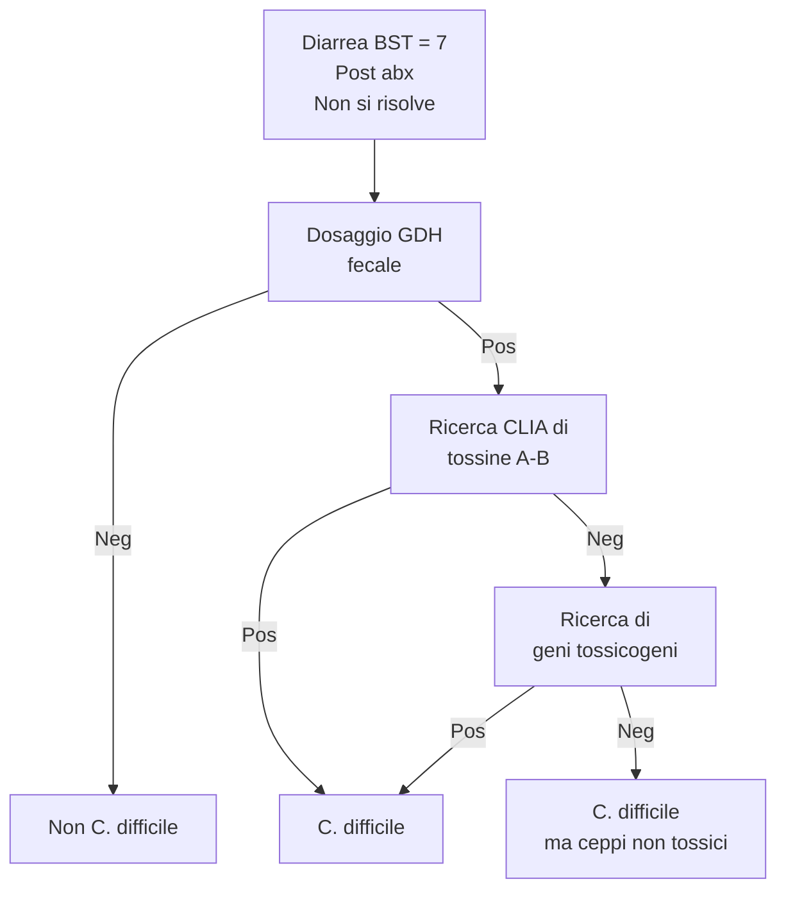
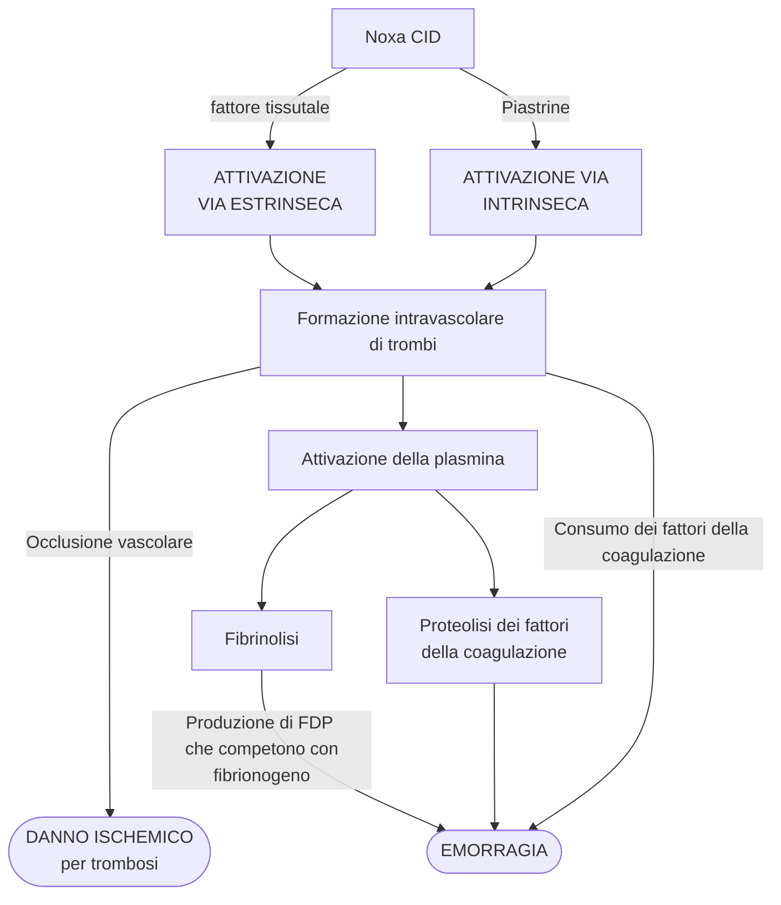
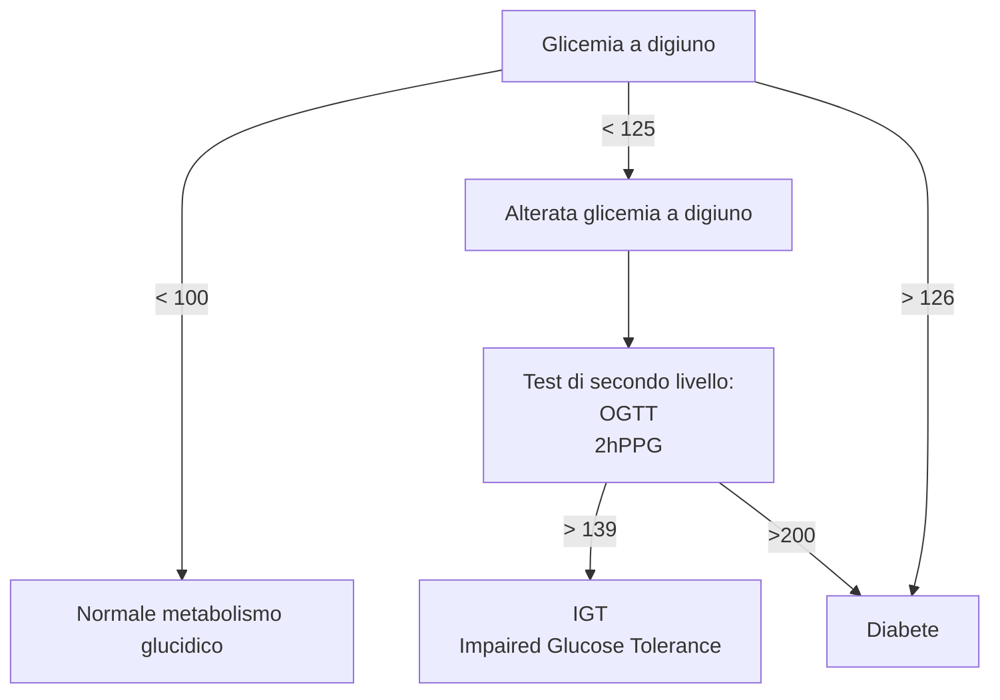
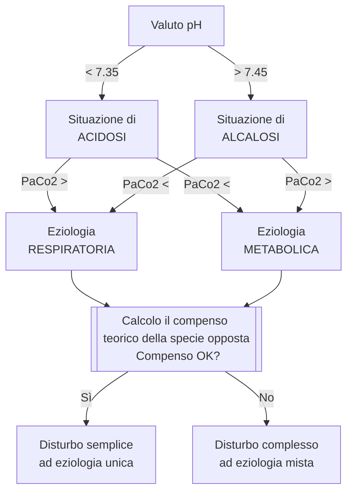

```{=html}
<!-- Nuova geometria per avere la copertina centrata -->
```
```{=tex}
\newgeometry{top=4cm, bottom=4cm, left=4cm, right=4cm}
```
```{=tex}
\title{Medicina di Laboratorio}
\author{Emanuele Vicinelli}
\date{a.a. 2019/2020}
```
```{=tex}
\maketitle
```

------------------------------------------------------------------------

```{=tex}
\begin{figure}[H]
\vspace{2cm}
\centering
\includegraphics[width=8cm]{../head.pdf}
\end{figure}
```
```{=html}
<!-- Data in cui il pdf è stato compilato-->
```
```{=tex}
\thispagestyle{fancy}
\fancyhead{}
\fancyfoot{}
\renewcommand{\headrulewidth}{0pt}
\rfoot{\today}
```
```{=tex}
\restoregeometry
```
```{=tex}
\newpage
```
```{=tex}
\tableofcontents
```
```{=tex}
\newpage
```
```{=tex}
\listoffigures
```
```{=tex}
\newpage
```
```{=tex}
\clearpage
\part{Microbiologia Clinica}
```
# Introduzione

-   Obiettivo della microbiologia *clinica* è mettere il microorganismo
    **nel quadro clinico di un paziente**

## Concetti sparsi da tenere a mente

-   *Colonizzato* da un morg e *infettato* da un morg sono due cose
    mooolto diverse. Nessuna di queste è sinonimo con malattia
    -   **Colonizzazione** --- presenza di morg nei tessuti. Non è detto
        che porti automaticamente a patologia, perché la colonizzazione
        è solo *uno dei tanti* fattori che sono necessari ma non
        sufficienti per produrre patologia
        -   Non va *mai* trattata[^1]
        -   Colonizzazione *può venire sorvegliata* in funzione di
            -   Contesto clinico
            -   **Il morg colonizzante è abx resistente** (*sempre*
                osservazione)
    -   **Infezione** --- processo caratterizzato da *penetrazione e
        moltiplicazione nei tessuti* di microorganismi patogeni
    -   **Malattia** --- quadro di segni e sintomi che derivano da una
        infezione

> **Colonizzazione vs infezione: un esempio** --- lo *Pseudomonas
> aeruginosa* è un batterio spesso presente nel condotto uditivo esterno
> di persone adulte sane (lo si ritrova nel 60% della popolazione) ma in
> alcuni casi può divenire la causa di otiti esterne purulente. In caso
> di otite può essere utile effettuare un tampone auricolare a seguito
> del quale un antibiogramma mostrerebbe la presenza dello pseudomonas
> plurisensibile. Solo in tal caso, quando il paziente è chiaramente
> sintomatico, possiamo somministrare una terapia antibiotica (es.
> Augmentin), mentre è assolutamente da evitare l'utilizzo di
> antibiotico contro pseudomonas aeruginosa quando il paziente è sano e
> non presenta sintomi. La colonizzazione a differenza dell'infezione
> non va trattata.
>
> Non solo: prendiamo l'esempio dello *Strepto pneumoniae* che può
> portare, se infetta, alle CAP[^2] (il 75% delle CAP sono imputabili
> allo Strepto). Ora, un paziente che sviluppa i sintomi tipici della
> polmonite si reca in genere in pronto soccorso, dove viene effettuata
> emocoltura ed esame dell'escreato. Immaginiamo che risulti la presenza
> di pneumococco nell'espettorato: la prima cosa che può saltare in
> mente è diagnosticare la polmonite da pneumococco e trattare la
> malattia come tale; tuttavia, per evitare errori è bene considerare
> che c'è una percentuale (0-50%) di individui in cui lo pneumococco
> colonizza di norma le alte vie aeree e in questo caso si deve
> assolutamente evitare l'errore di trattare una colonizzazione. Per
> questo motivo è importantissimo quantificare il numero delle colonie
> presenti sulla placca di coltura e scegliere di conseguenza la giusta
> soluzione terapeutica, eventualmente corroborata poi dal risultato
> dell'emocultura. *È bene tenere a mente che la semplice colonizzazione
> da Strepto pneumoniae non costituisce un fattore di rischio per lo
> sviluppo della polmonite.*

-   La carica batterica viene quantificata in *Colony-Forming Unit*,
    ovvero unità batteriche capaci di replicarsi. **La carica batterica
    è il fattore da guardare per tracciare la linea tra colonizzazione e
    infezione**
    -   **Si considera come potenzialmente patogeno un microorganismo
        presente \> 1 $\times$ 10\^5 CFU/ml** -- perché siamo
        normalmente *colonizzati* da moltissime specie batteriche
        differenti
    -   Si considera come patogeno un morg presente in \< CFU/ml se è in
        un *pz* sintomatico *con anamnesi positiva per pregressa abx
        tp..* (Es: ho pz. che ha già cominciato abx per sospetta UTI 3gg
        fa che si presenta oggi con sintomi da UTI)
    -   Alcuni pz. possono essere costitutivamente a rischio di
        ipercolonizzazione (anziani, pz cateterizzati --urinario,
        vascolare, PEG...--, sg. con stili di vita a rischio...)
-   Sg. *colonizzati* da patogeni abx-resistenti necessitano di
    particolari cautele operative per evitare cross-colonizzazione di
    altri pz. tramite operatore. Se pz. viene *infettato* da patogeno
    abx-resistente siamo nei cazzi
    -   Abx-resistenza si sviluppa molto in fretta: entro 6m--3aa da
        uscita di nuova molecola si trovano già i primi ceppi resistenti
    -   Problema tremendo: **morg che producono carbapenemasi** (*CPE*),
        contro cui i `carbapenemi` (ultima frontiera) non sono più
        sufficienti
    -   🚨 In pz. a rischio **bisogna fare sorveglianza attiva e isolare
        pz. colonizzati da ceppi abx-res!**

> **Geni che vanno sempre cercati per resistenza ai `carbapenemi`** ---
> Solitamente da *tampone rettale* da fare a tutti i ricoverati. SI
> cerca
>
>   Gene     
>   -------- -----------------------------------------------
>   KPC      Klebsiella pneumoniae carbapenemase
>   VIM      Verona Integration-encoded Metallo βlactamase
>   NDIM     New Delhi Metallo βlactamase
>   IMP      IMiPenemase
>   OXA-48   Carbapenem-hydrolising OXAciclinase-48
>
> tramite metodiche rapide (*test molecolari*, risultato in \~ 2h)

-   🧠 **TRATTARE IL PAZIENTE, NON IL REFERTO/MONITOR. Il referto ha
    senso se è supportato da un quesito e un quadro clinico ben
    preciso**
    -   Se manca il quadro clinico che supporta il referto, farsi bene
        qualche domanda: ci stiamo prendendo? Le due cose sono
        correlate? Non ci stiamo capendo un tubo di quello che sta
        succedendo? Ragionare!
    -   Se c'è un sintomo ma manca il risultato del referto, farsi bene
        qualche domanda: ci stiamo prendendo? Non ci stiamo capendo un
        tubo? Il risultato è attendibile? Ragionareeeee!
    -   CHIEDERE UN ESAME SSE SAPPIAMO COSA FARE CON IL RISULTATO,
        QUALUNQUE ESSO SIA. Non chiedere tutti gli esami possibili
        perché vuol dire che stiamo andando a caso[^3]

> **Una storiella sulla pretest probability e sul chiedere esami alla
> boia** --- Si immagini di studiare 2 popolazioni molto diverse tra
> loro: una popolazione è costituita da un convento di suore di
> clausura, chiuse in clausura dalla fine della Seconda guerra mondiale,
> l'altra popolazione è costituita da un gruppo di ballerine del Crazy
> Horse di Parigi. Si procede ad effettuare uno screening per la
> sifilide (per il quale ipotizziamo -- come peraltro è la realtà -- che
> specificità e sensibilità siano \< 100%). In seguito al test risultano
> positive 3 suore e 3 ballerine: cosa concludiamo? L'ipotesi più
> probabile, considerando l'habitus di questi due gruppi, è che le 3
> suore risultate positive siano 3 falsi positivi. MA attenzione: non è
> detto (😏), quindi SEMPRE TESTA COLLEGATA

# Infezioni respiratorie

## Infezioni delle basse vie respiratorie

-   Infezioni di trachea bassa, bronchi, polmoni e annessi (pleure)
-   Identifichiamo 6 quadri clinici principali
    1.  Polmonite
    2.  Bronchiolite
    3.  Tracheo-bronchite
    4.  Pleurite
    5.  Empiema pleurico
    6.  Ascesso polmonare

### Tracheo--bronchiti

-   Infezione "di confine" tra alte e basse vie respiratorie
-   Quadro di *flu-like illness*
-   Periodo: ottobre--primavera

> **Flu--like illness vs influenza** --- bisogna distinguere le forme
> simil-influenzali (comuni) da reale influenza (meno comune)
>
> -   Flu-like: forme da raffreddamento che si contraggono in periodo
>     ottobre--marzo. Meno gravi che influenza
> -   Influenza: forma tendenzialmente molto più grave. Eziologia: virus
>     influenzali. Si contrae durante lo specifico picco epidemico

-   L'eziologia è in funzione dell'età
    -   Bambino in età prescolare (ez *tendenzialmente* virale)
        -   **RSV**
        -   hMPV (Human MetaPneumoVirus)
        -   Rhinovirus
        -   Adenovirus
        -   Coxakievirus
        -   Virus influenzali e parainfluenzali
    -   Adulti, anziani, immunodepressi (ez *tendenzialmente* batterica)
        -   Haemophilus influenzae B
        -   Streptococcus pneumoniae
        -   Bordetella pertussis
        -   Moraxella catarrhalis

> **Considerazioni particolari su sg. immunodepressi** --- Il soggetto
> immunodepresso è un soggetto con una parziale competenza del sistema
> immunitario: le cellule immunitarie sono numerose, dunque, un soggetto
> può avere un deficit che interessa solo alcune branche della risposta
> immunitarie, oppure può avere un deficit di tipo globale. **Il tipico
> esempio di paziente immunodepresso è il soggetto che riceve un
> trapianto di cellule staminali ematopoietiche, il quale deve andare
> incontro ad una forte terapia immunosoppressiva per garantire un
> corretto sviluppo cellulare; ancora, altri esempi sono dal paziente
> neoplastico e dal paziente in dialisi**. Il soggetto immunodepresso è
> un soggetto abbastanza difficile da trattare ed è opinione comune che
> sia IL paziente, ovvero, il paziente su cui bisogna investire, proprio
> perché è difficile trattarlo e perché rischia di morire. Tuttavia
> bisogna sempre tenere presente che essi sono numericamente poco
> rilevanti (meno dell'1% dei pazienti che frequentano un normale
> ospedale) e caratterizzati da una "microbiologia collaterale", ovvero,
> circoscritta unicamente al soggetto immunodepresso stesso e non
> considerabile per la maggioranza.

### Bronchioliti

-   Se un pz. ha bronchiolite, ha anche la bronchite (continuo
    anatomico)
-   Eziologie principali sono virali
    -   Virali
        -   **RSV** (Periodo RSV: nov--mar, quadri particolarmente
            rilevanti per severità (fino a insufficienza respiratoria)
            in \< 6aa. Molto contagioso. Recentemente, per via di
            aumento dell'uso della PCR multiplex, si è scoperto che in
            realtà è responsabile di molti quadri anche dell'adulto,
            precedentemente sottodiagnosticati)
        -   hMPV
        -   Virus parainfluenzali
    -   Batteriche
        -   Mycoplasma pneumoniae
        -   Bordetella pertussis

> **Bordetella pertussis**
>
> Batterio che attualmente ha buona copertura vaccinale, ma in calo ⇒ ↑
> casi neonatali in periodo pre-vaccinale (\< 3m) o adulti
> particolarmente gravi[^4]. I dati in Ita sulla pertosse sono *molto*
> sottostimati, causa del fatto che solo 1 caso su 3 viene notificato
> (in ER)
>
> La diagnosi si fa attraverso (sensibilità ↓)
>
> -   **Ricerca di anticorpi anti-tossina** (metodo diagnostico di
>     riferimento, in quanto la patologia sintomatica è causata dalla
>     tossina prodotta dalla *Bordetella* e si manifesta con ritardo,
>     quando l'infezione è già in fase calante)
> -   PCR su reperto di alte/basse vie aeree (come al solito, più è
>     basso meglio è; ma è più invasivo -- inoltre potrebbe essere
>     oversensibile e portare a trattare colonizzazioni concomitanti e
>     non infezioni)
> -   Esame colturale su terreno

### Polmoniti

#### Breve patofisiologia

0.  In qualche modo il patogeno supera le barriere meccaniche (anatomia
    delle vie aeree, ciglia, muco, diramazioni bronchiali, macrofagi
    residenti, ascensore mucociliare)
1.  Inizio della risposta infiammatoria locale e sistemica
    -   TNF, IL1 ⇒ febbre
    -   IL8 e chemochine infiammatorie ⇒ leucocitosi
    -   Mediatori infiammatori ⇒ stravaso dai capillari ⇒ edema a vario
        grado di intensità (aspetto all'RX, rantoli, ipossiemia, ↑ drive
        respiratorio, emottisi o emoftoe...)
    -   Possibile broncospasmo mediato dai fattori infiammatori
    -   Si può avere attivazione di piastrine e cascata della
        coagulazione ⇒ ↑ rischio CV/cerebrovascolare
2.  Risposta infiammatoria ⇒ ↓ compliance polmonare E ↓ capacità di
    scambio ⇒ insufficienza respiratoria
3.  Insufficienza respiratoria ⇒ ☠️

#### Classificazione della polmonite

1.  Classificazione epidemiologica
    -   CAP (Community Acquired Pneumonia)
        -   Community ⇒ non ricovero nei 15gg precedenti comparsa
            sintomi
        -   3 casi di CAP/1K abitanti
        -   Epidemiologia tipica: 90% anziani, 10% bambini
        -   Picco di casi: ott-apr
    -   HAP (Hospital Acquired Pneumonia)
        -   Polmonite insorta dopo 48h dall'assistenza
        -   Pz. a rischio di aspirazione sono a \> rischio
    -   VAP (Ventilator Acquired Pneumonia
        -   In pz. intubati: x4 RR di sviluppare polmonite. Rischio
            maggiore nei primi 5gg, plateau a \~2s; ma il 70% dei pz.
            intubati \> 30gg ha VAP
        -   Pz. più a rischio:
            -   Colonizzazione flora orale (per rischio di trasmissione
                diretta durante IOT)
            -   Aspirazione
            -   Compromissione immunocompetenza
    -   H-CAP (Healtcare-related Community Acquired Pneumonia)[^5]

  -----------------------------------------------------------------------
                          Eziologia adulta        Eziologia pediatrica
  ----------------------- ----------------------- -----------------------
  CAP                     **Infezione             Principalmente virale,
                          batteriche:**           oppure per
                          *Streptococcus          Streptococcus
                          pneumoniae*, Mycoplasma agalactiae,
                          pneumoniae, Chlamydia   Streptococcus
                          pneumonae, Legionella   pneimonia,
                          pneumoniae, Haemophilus Streptococcus aueus
                          influenzae\             
                          **Infezioni virali:**   
                          Influenza A\|B\|C, hRSV 

  HAP                     **Infezioni             
                          batteriche:**           
                          Pseudomonas aeruginosa, 
                          MRSA,                   
                          Enterobatteriacea,      
                          Gram^-^ (A baumanni o   
                          Burkholderia cepacia),  
                          Klebsiella pneumonae    
                          CRE-res, Legionella     
                          pneumophila             

  VAP                     **Infezioni             
                          batteriche**: Strepto   
                          penumoniae ed altri     
                          strepto, Haemophilus    
                          influenzae, Staf        
                          aureus\                 
                          **Infezioni batteriche  
                          con MDR**: *Pseudomonas 
                          aeruginosa, MRSA*,      
                          Acinetobacter,          
                          Enterobacteriace        
                          CPE-resistenti,         
                          Legionella\             
                          **Altre infezioni**:    
                          Aspergillus             
  -----------------------------------------------------------------------

2.  Classificazione eziologica
    -   Polmoniti batteriche
    -   Polmoniti virali
    -   Polmoniti fungine
3.  Classificazione anatomo--patologica\
    
    -   Polmonite lobare o alveolare (*"tipica"*)
        -   Eziologia prevalentemente batterica
        -   Rx: radiopacità parenchima polmonare ben limitato
    -   Polmonite interstiziale (*"atipica"*)
        -   Eiologia prevalentemente virale *oppure* Mycoplasma
            pneumonae, Chlamydia pneumoniae, Legionella pneumophila
        -   Rx: radiopacità diffusa tipo "ground glass" per
            interessamento *dello stroma*, per via del processo
            infiammatorio

#### Diagnosi

-   SeS orientativi all'EO (non eccezionalmente sens/spec)
    -   Confusione nell'anziano[^6]
    -   Segni di dirstress respiratorio
    -   Segni di addensamento parenchimale
    -   Crepitii, specie alle basi
-   **Rx è suggestivo**
-   Diagnosi microbiologica: **da reperto rappresentativo delle vie
    aeree** in cui il patogeno viene *in qualche modo* (coltura, PCR,
    **PCR multiplex**) evidenziato. In generale: più un reperto è
    distale, più l'ambiente è fisiologicamente sterile e quindi più la
    diagnostica è sensible
    -   Espettorato o espettorato indotto
        -   Bisogna sempre fare, prima della coltura, il **test di
            idoneità dell'espettorato alla coltura**: un espettorato è
            idoneo se, alla microscopia ottica con blu di metilene, si
            hanno 2 caratteristiche:
            1.  $\frac{\text{Globuli bianchi}}{\text{Cellule epiteliali}} > 2$
            2.  Pochissime cellule salivari (≡ il campione non è stato
                contaminato con contenuto orale)
    -   Aspirato naso--faringeo
    -   Aspirato tracheo--bronchiale
    -   BAL
    -   Spazzolatura endobronchiale
-   Valutare sempre carica batterica (esame colturale
    *semiquantitativo*) per distinguere colonizzazione da infezione[^7]

### Focus su alcuni patogeni di interesse respiratorio

#### Legionella

-   Legionella è patogeno che produce polmoniti atipiche, con incidenza
    complessiva molto bassa (\~0.5% di tutte le polmoniti)
-   Batterio termofilo
-   Contagio tramite **inalazione di aerosol infetto**, no trasmissione
    interumana. Principale setting di contagio: ospedaliero[^8]
-   Principale sierotipi in ITA: Legionelle sierogruppo 1 (1/16)
-   Ha clinica sfumata, non si presenta come la "classica" polmonite
    -   No tosse produttiva, toracoalgia, brividi, febbre, dispnea
    -   Quadro di malessere generale: astenia, febbricola
-   Saggi per diagnosi
    -   Coltura su terreno selettivo BYCE (terreno selettivo va
        appositamente richiesto, non routinario)
    -   IgG e IgM (sia in fase acuta che convalescente)
    -   **Rilevazione ag urinario**
        -   Antigenuria comincia \> +3gg *da insorgenza sintomi*, picco
            a +5--10gg
        -   Entità dell'antigenuria è proporzionale a gravità
        -   Antigenuria può persistere per mesi in pz. immunocompromessi
    -   PCR per DNA
-   Terapia con `macrolidi`, `tetraciclina`, `chinoloni`

#### Coronavirus

-   Virus a RNA a singolo filamento con polarità + ed envelope. Hanno in
    superficie *proteine S* (*spike*) disposte a corona, da cui il nome
-   Prima comparsa: Cina, 2003 -- verosimilmente tramite salto di specie
-   Finora (gen 2020) sono conosciuti 7 ceppi di coronavirus patogeni
    per l'uomo (Human Coronavirus -- HCoV)
    1.  HCoV-229E (> prevalenza, 2/a causa di raffreddore[^9])
    2.  HCoV-0C43
    3.  HCoV-NL63
    4.  HCoV-HFU1
    5.  SARS-CoV, 2002 (Severe Acute Respiratory Syndrome)
    6.  MERS-CoV, 2012 (Middle-East Respiratory Syndrome)
    7.  SARS-CoV-2 o ancora nCoV-19 (🖕 🦠), dicembre 2019

> **SARS**\
>
> -   Polmonite atipica
> -   Febbre \> 38°C
> -   **[ARDS](https://www.msdmanuals.com/it-it/professionale/medicina-di-terapia-intensiva/insufficienza-respiratoria-e-ventilazione-meccanica/insufficienza-respiratoria-acuta-ipossiemica-insufficienza-respiratoria-acuta-ipossiemica,-sindrome-da-distress-respiratorio-acuto?query=Sindrome%20da%20distress%20respiratorio%20acuto%20(ARDS))[^10]con
>     mortalità del 9.6%**

##### SARS-CoV-2

-   Incubazione: 1--14gg, media 5--6 giorni
-   SeS caratteristici
    -   Sintomi flu-like: febbre, tosse, brividi, mialgia, faringodinia,
        rinorrea, cefalea
    -   Ageusia/anosmia
    -   Meno comuni: sintomi GI, confusione o AMS
    -   "Desaturazione felice"[^11] ± dispnea
    -   Quadro obiettivo di polmonite
-   Diagnosi: *a seconda del timing*[^12] con **rtPCR** di tampone
    rinofaringeo/BAL/aspirato tracheale, RDT-Ag su tampone
    rinofaringeo[^13] o espettorato salivare[^14], sierologia IgM o IgG\
    
-   Fattori di rischio per malattia severa
    -   \> 65aa
    -   Condizioni polmonari pre-esistenti
    -   DM
    -   Ipertensione (o storia di)
    -   Patologie cardiovascolari (o storia di)
    -   BMI ≥ 30
    -   Verosimilmente: uso di farmaci immunomodulanti (TNF-ini, IL-ini,
        agenti anti-LfcB)
    -   Verosimilmente: tp immunosoppressiva
    -   Verosimilmente: HIV con CD4 \< 200 cellule/μL o conta
        sconosciuta
-   Previsioni sul futuro (ottobre 2021, poco prima di arrivo della
    variante omicron): per uscirne Covid19 deve diventare endemia
    -   Immunità al contagio (da vaccino o post-infettiva) *dura poco*
        (\~ qualche mese)
    -   Bisogna trovare qualcosa che riduca *la trasmissione*, pena il
        ritrovarsi con virus endemico. Si può convivere con questo, se
        si trova qualcosa che freni la malattia grave
    -   Herd immunity mai raggiunta per infezioni respiratorie: immunità
        dura poco, trasmissione è troppo facile
    -   Tenere *continuo e puntuale* monitoraggio di varianti, per
        *anticipare* l'emersione di varianti potenzialmente
        incontenibili capaci di cambiare completamente le regole del
        gioco (aehm... Omicron?)

# Infezioni G/I

-   Contenuto di microorganismi intestinali pesa \~2kg in individuo
    normopeso (per la maggioranza costituisce il microbiota)
-   *Principale* meccanismo di trasmissione: circuito oro-fecale
-   Numerose difese meccaniche all'ingresso di morg esterni
    -   Bocca
        -   Saliva con lisozima
        -   Continuo passaggio di liquidi
        -   Flora residente ecologicamente competitiva
    -   Stomaco
        -   pH = 2.5 ± 1
    -   Intestino
        -   Continuo passaggio di contenuto
        -   Muco + IgA
        -   Tessuto linfoide (*placche di Peyer*)
        -   Turnover dell'epitelio
        -   Flora residente ecologicamente competitiva
-   Molti dei patogeni che infettano il tratto gastroenterico sono
    zoonotici

> **Zoonosi monitorate annualmente per direttiva EU** (2003/99/EC List
> A)
>
> A1. Campylobacter\
> A2. Salmonella\
> A3. Listeria\
> A4. E. coli Shiga-toxin producing (STEC)\
> A5. Brucella\
> A6. Trichinella\
> A7. Echinococcus

## Sindromi cliniche

  ----------- ------------------------------------
  Stomaco     Gastrite cronica (*H pylori*)\
              Ulcera peptica\

  Intestino   Diarrea (numerosi patogeni)\
              Dissenteria (numerosi patogeni)\
              Febbre enterica (*Salmonella tiphy*
              e *S. parathipy* tipo A e C\
  ----------- ------------------------------------

-   Infezioni del tratto superiore
    -   Gastrite (cronica): stato infiammatorio (continuo) della mucosa
        gastrica
    -   Ulcera peptica: lesione micro o macroscopica della mucosa
        gastrica *o duodenale*
-   Infezioni del tratto infeiore
    -   Diarrea: ↑ eliminazione e fluidità delle feci
    -   Dissenteria: diarrea mucosanguinolenta (spesso con febbre,
        tenesmo[^15], crampi addominali, riscontro istologico di tappeto
        d neutrofili)
    -   Febbre enterica: infezione sistemica causata da patogeni
        gastroenterici (*Salmonella typhi*, *S. paratyphi* tipo A e C).
        Poco frequente in primo mondo, da tenere in considerazione in
        secondo e terzo mondo)

## Patogeni responsabili di infezioni dello stomaco

### *Helicobacter pylori*

-   Bacillo Gram^-^, spiraliforme, mobile (ha flagelli polari),
    microaerofilo[^16]
-   Solitamente porta a **sindrome dispeptica**, ovvero manifestazione
    *sindromica* caratterizzata essenzialmente da *dispepsia*[^17]
    1.  Colonizzazione della mucosa gastrica
        -   Flagelli e adesine consentono di ben attaccarsi alla mucosa
        -   **Attività ureasica**[^18] che, producendo bicarbonato ⇒
            alcalinizzazione dell'ambiente (fino a pH \~ 6.5--7)
    2.  Produce tossine che ledono direttamente la mucosa
        -   Tossina *VacA* (tossina VACuolizzante A)
            -   È *porina*, induce apoptosi
        -   Tossina *CagA* (Cytotoxic Associated Gene A)
            -   Tossina citotossica, potenzia effetto lesivo
-   Non tutti gli H. pylori producono le stesse tossine, individuiamo 2
    profili essenziali

  -----------------------------------------------------------------------
  Genotipo                            Evoluzione
  ----------------------------------- -----------------------------------
  VacA^+^, CagA^+^ (tipo I)           Alta patogenicità, potenziale
                                      cancerogenesi su lungo periodo

  VacA^±^, CagA^-^                    Patogenicità ridotta

  VacA^-^, CagA^-^ (tipo II)          Evoluzione silente e/o benigna
  -----------------------------------------------------------------------

-   Diagnosi: UBT per sospetto + PCR o ricerca di Ag
    -   Test diretti
        -   Biopsia (una volta, ai tempi)
        -   PCR
        -   Ricerca di Ag (ELISA, test immunocromatografici) nelle feci,
            ma l'eliminazione dell'ag non è costante e la rilevabilità
            dipende da frequenza e volume dei moviment intestinali. Per
            ovviare al problema: rifare x3 volte il test in 10gg
    -   Test indiretti (non invasivi)
        -   *Urea breath test*: pz. ingerisce urea marcata con ^13^C. Se
            c'è H. pylori, viene metabolizzata in bicarbonato +
            ^13^CO~2~, rilevabile in espirio tramite spirometria
            apposita. Se H. pylori non c'è, si ritrova urea marcata
            nelle urine
        -   Sierologia: inutile per Dx, solo interesse epidemiologico
            (sieroprevalenza \> 60% in pz. occidentali, ↑ in Africa o
            India)

## Patogeni responsabili di infezioni del tratto intestinale

-   Le infezioni dell'intestino portano a *diarrea o dissenteria* a
    seconda della tipologia[^19]
    1.  **Non infiammatorie**: il contenuto del lume intestinale, per
        ragioni pro-osmotiche o pro-secretorie imputabili alla
        produzione di tossine del aptogeno, *diventa più liquido* ⇒ ↑
        contenuto liquido delle feci ⇒ **diarrea "osmotica"**
        -   **Azione pro--secretoria**: attivazione permanente di
            *adenilato-ciclasi* o *guanilato-ciclasi* ⇒ ↑ cAMP e cGMP ⇒
            attivazione dei canali ⇒ **secrezioni di ioni nel lume
            intestinale**
        -   **Azione pro--osmotica**: Danneggiamento o ricopertura dei
            villi ⇒ impedito riassorbimento di ioni
    2.  **Infiammatorie**: la mucosa intestinale *viene danneggiata*
        dall'azione del patogeno ⇒ infiammazione ⇒ *functio laesa* ⇒
        **dissenteria**
    3.  **Invasive**: la mucosa intestinale viene danneggiata (*functio
        laesa*) e un patogeno supera la barriera mucosale entrando in
        circolo ⇒ **dissenteria e quadro patologico più diffuso e
        severo**

  ------------------------------------------------------------------------
  Mecccanismo *primario*     Tipo        Patogeno
  -------------------------- ----------- ---------------------------------
  Non infiammatorio          Batteri     E coli ET o EP Vibrio choleare\
                                         Yersinia spp\

                             Protozoi    Giardia intestinalis\
                                         Cryptosporidium parvum\

                             Virus       Rotavirus\
                                         Norovirus\
                                         Adenovirus\

  Infiammatorio              Batteri     E coli EH\
                                         Salmonella enteritidis\
                                         Campylobacter jejuny\
                                         Shigella spp\
                                         C. difficile\

                             Elminti     Tenia solium e saginata\
                                         Echinococcus granulosus\
                                         Anisakis simples\
                                         Difillobotrium Latum\

  Invasivo                   Batteri     E coli EI o EH o STEC\
                                         Salmonella thyphi + paratyphi
                                         A\|B\|C\

                             Protozoi    Entoamoeba hystolitica\
  ------------------------------------------------------------------------

### *Campylobacter*

-   Bacilli Gram^-^, elicoidali, asporigeni, mobili, microaerofili,
    termofili (crescono a 42°C)
    -   Ossidasi^+^ (hanno catena respiratoria) ⇒ terreni selettivi per
        batteri ossidasi^+^ permettono agile distinzione dei
        Campylobacter vs altri batteri fecali
-   Campilobacteriosi è patologia g/i più frequente dal 2005 (64.1
    casi/100K abitanti IT al 2018)
-   Serbatoio zoonotico: pollame \> mucche (ingestioni di carni
    contaminate o latte non pastorizzato)
-   Diagnosi: **fecal swab**[^20] + coltura in terreno Karmali[^21] a
    42°C x8h

### Genere *Salmonella*

-   Salmonelle a seconda della specie producono 2 quadri
    1.  Salmonellosi minori --- gastroenteriti (>)
        -   Salmonellosi è seconda causa di gastroenterite dopo
            Campylobacter
        -   Trasmissione per ingestione di cibi contaminati (uova e
            carne): i serovar minori sono ubiquitari nell'allevamento.
            Particolarmente prone a trasmissione situazioni in cui si
            interrompe la catena del freddo per tempi prolungati (mense,
            meno nella ristorazione domestica)[^22]
    2.  Salmonellosi maggiori --- infezioni sistemiche (*Salmonella
        thyphi* o *Salmonella parathypi* serovar A\|B\|C)
        -   Serovar *invasivi* ⇒ infezioni sistemiche con quadri diffusi
            e potenzialmente gravi\
            
        -   Trasmissione uomo--uomo tramite circuito orofecale
-   Diagnosi: coltura su terreno di Hecktoen e conferma con
    spettrometria di massa

### Genere *Shigella*

-   Enterobatterio Gram^-^, anaerobio facoltativo, immobile parassita
    esclusivo dell'uomo
-   Produce quadri di enterite/colite emorragica + crampi addominali,
    febbre
-   Patogenesi **tossina SHIGA** (citotossica) che danneggia la mucosa,
    permettendo l'ingresso dentro gli enterociti, ma l'uscita dal polo
    vascolare è improbabile 
-   Diagnosi: coltura su terreno di Hecktoen e conferma con
    spettrometria di massa

> **Terreno di Hecktoen** Terreno sia per Shigelle che Salmonelle,
> quindi selettivo ma non conduce a ddx (⇒ deve seguire altro metodo
> diagnostico, pes spettrometria *MALDI-ToFF* o con ulteriore coltura
> specifica per singolo batterio). Terreno specifico con sali biliari
> (Shigelle e Salmonelle sono intestinali, quindi sono resistenti ai
> sali biliari)

### *Escherichia coli*

-   Bacillo Gram^-^, ve ne sono
    1.  EHEC o STEC --- Enteroemorragico o secernente tossina Shiga-like
        toxins 1\|2 ("*verotossina 1\|2"*)
    2.  EIEC --- Enteroinvasivo
    3.  ETEC --- Enterotossicogeno
    4.  EPEC --- EC enteropatogeno
    5.  EAEC --- Enteroaderente
-   Normale colone del tratto intestinale di uomo e bovini
-   Quadro di presentazione vario
    -   Infezioni alimentari da batterio esogeno
    -   Meningite neonatale (contratto da canale del parto contaminato,
        in più BEE è *estremamente* immatura, un botto di roba dà
        meningite neonatale)
    -   Infezioni che disseminano (particolarmente in pz. a rischio)
        -   UTI
        -   Infezioni addominali
        -   Infezioni respiratorie
    -   Sindrome emolitico--uremica da STEC

> **Sindrome emolitico--uremica** (HUS) da STEC o Shigelle\
> Sindrome caratterizzata da triade
>
> -   Piastrinopenia
> -   Anemia emolitica
> -   IRA
>
> La patogenesi è imputabile alla *tossina di Shiga* o *tossina
> Shiga-like*: danno emorragico ⇒ stravaso in circolo dei batteri ⇒
> tossina Shiga in circolo ⇒ **danno endoteliale** ⇒
>
> -   Attivazione piastrinica (⇒ piastrinopenia)
> -   Emolisi massiva
> -   Conseguente IRA (cui compartecipa un danno diretto della tossina
>     di Shiga all'epitelio glomerulare
>
> Sintomi a +3--8gg, mortalità 3-5%. Contaminazione da carni/prodotti
> bovini non ben cotti/pastorizzati (necessario \> 70°C, una bistecca al
> sangue raggiunge i 51--54°C...)

-   Diagnosi[^23]
    -   EPEC, ETEC, EAEC: normalmente non necessaria, quadri
        autolimitanti
    -   EHEC: PCR specifica o **test immunocromatografici per ricerca di
        Shiga-like toxins 1\|2**, *da non mancare specie se sospetto
        HUS!* (😵)

### Genere *Yersinia*

-   2 specie: *Y. enterolitica* e *Y pseudomembranosa*
-   4 quadri
    1.  Enteriti emorragiche (>)
    2.  Poliartrite reattive in sg. predisposti (HLAB27^+^)
    3.  Adenite mesenterica che sembra appendicite acuta
    4.  Setticemia in immunocompromessi
-   Poco frequenti in Ita, reservoir sono suini (carne infetta)
-   Ricerca: coltura su terreno CIN 32°C x48h, positiva se colonie rosse
    con alone trasparente

### *Vibrio Cholerae*

-   Vibrione (forma a virgola) Gram^-^
-   Svariati serovar, tutti creano forme di diarrea[^24]
    -   Pandemici (settima pandemia ancora in corso, dal 1961)
        -   Vibrio choleae 01 (principale responsabile delle panemie)
        -   Vibrio cholerae 0139 (per ora limitato a SE Asia)
    -   Non pandemici
-   Principale riserva: acque infette, intestino umano
-   Circuito orofecale

### *Clostridium difficile*

-   Gram^+^, anaerobio obbligato, mobile (ha flagelli), normale colone
    della mucosa
-   Alcuni ceppi di C difficile producono *tossina A\|B*
-   Patogeno emergente per uso sconsiderato di abx, che hanno favorito
    ceppi resistenti per pressione selettiva. *Il problema è iatrogeno*
    -   USA: 250K casi/anno con 14K morti, EU: 500K casi/anno
    -   Nei ricoverati in H con abx: 7--25% sono colonizzati, di cui il
        2--8% da un ceppo produttore di tossina
-   Pz. **colonizzati da *C. difficile*, con diarrea post abx che non
    recede** si parla di **CDAD**
    (Clostridium-Difficile-Associated-Diarrhea)
    0.  Uso sconsiderato di abx altera il microbiota
    1.  Il microbiota perde competitività verso C. difficile
    2.  C. difficile esplode: quella che era una colonizzazione diventa
        infezione e patologia
    3.  C. difficile, in seguito ad azione di tossine A\|B, infiamma e
        distrugge la mucosa ⇒ quadri diarroici che non recedono
-   Diagnosi: da sospetto di pz. con diarrea (Bristol Stool Chart = 7)
    post-abx protratta si fa sequenza di test per
    -   Verificare presenza di *glutammato deidrogenasi* (GDH), prodotta
        da tutti i ceppi di C. difficile
    -   Ricerca, se campione è GDH^+^, di tossine (C. difficile è colone
        normale, siamo interessati a specie tossiche, quindi patogene, e
        resistenti)



-   Tp.: ci vuole abx *specifico* e pregare che risolva, altrimenti FMT
    -   `metronidazolo` di solito, ma siccome il problema è causato in
        primis da abx non si può sperare che questi siano anche la
        soluzione definitiva
    -   Se abx non eradicano, si fa **Fecal Microbiota Transplant** per
        ripristinare eubiosi (efficacia \> 97%)
        1.  Tp. abx per eradicare microbiota
        2.  Recupero di flora batterica da **donatore certificato**
            (*superdonor*) che ha flora batterica sana
        3.  Coltura della flora
        4.  Inseminazione della flora in ricevente mediante endoscopia

# Infezioni del torrente cardiociroclatorio (BSI)

-   Le BSI sono causate principalmente da **batteri e funghi**
    -   Circolo è normalmente sterile, quindi sono problematiche cariche
        virali anche basse (in BSI, già 10--33 CFU/mL)
    -   Basse cariche virali sono anche problematiche per scarsa
        sensibilità della diagnostica
-   I quadri clinici di BSI sono (gravità crescente)
    1.  **Batteriemia**
    2.  **Setticemia** --- *massiccia batteriemia + tossiemia*, con
        possibilità di disseminazioni ed infezioni secondarie di organi
        e tessuti
    3.  **Sepsi** --- *setticemia + disfunzione d'organo* causata dalla
        combo infezione e risposta infiammatoria sfuggita di mano (SIRS)
    4.  **Shock settico** --- *sepsi + shock*

> **Sepsi e SIRS**
>
> Sepsi : vedi sopra\
> SIRS : Sindrome da Risposta Infiammatoria Sistemica in cui si ha \>2
> tra
>
> -   FC \> 90bpm
> -   Non eupnea (tachi/bradi)
> -   Non normotermia (\< 36 o \> 39)
> -   Leucopenia o leucocitosi o neutrofili immaturi ↑ 10%
>
> La SIRS *complica* tantissime forme di sepsi, ma complica anche quadri
> che non hanno eziologia infettiva che per altri motivi attivano
> massicciamente il sistema immunitario\
> {width="50%"}

-   Evoluzione da batteriemia verso sepsi può essere anche *molto
    rapida* (\< 24h): il management *della sepsi* nelle prime 12h è
    quindi essenziale, la giusta abxtp entro 24h riduce la letalità di
    20--30%
-   I pz. con BSI sono a grande rischio di complicazioni e di difficile
    gestione
    -   La loro fisiologia è alterata dal processo patologico ± risposta
        immunitaria stessa
    -   La loro fisiologia *può essere* alterata da intervento iatrogeno
        (es: uso di `vanco` per trattare sospetto di MDR-Gram^+^, ma
        vanco è nefrotossica e aumenta la porbabilità di danno renale
        che già l'alterazione fisiologica può aver reso dietro l'angolo)

## Batteriemia

-   Anomalia frequente (5K colture positive/giorno in ITA[^25]), con
    cause sia patologiche che iatrogene
    -   **Endocardite batterica o sostituzione valvolare**: vegetazioni
        di fibrina e batteri, in situazione in cui si ha
        pro-coagulabilità e/o disturbanza di flusso sono situazione
        ideale per creare depositi *statici* che favoriscono la crescita
        batterica[^26] *(pes: valvole stenotiche che portano a flusso
        non laminare e a coaguli colonizzabili ("emboli settici"),
        sostituzioni valvolari protesiche che aprono il fianco a
        biofilm...)*
    -   **Infezioni focali**: non è detto che contenimento immunitario
        sia immediatamente efficace, si può avere (sperabilmente poco e
        solo iniziale) stravaso
    -   **Materiali protesici o cateterismi a permanenza** (CVP,
        [Midline](https://it.wikipedia.org/wiki/Midline), PICC, CVC...):
        identico discorso rispetto all'endocardite, se non che qui si
        aggiunge anche la potenza del biofilm
    -   **Estrazioni dentarie**: la bocca fa letteralmente schifo, è
        piena di roba tremenda (anche batteri anaerobici che portano a
        sepsi se per sfiga colonizzano davvero)
    -   **Manovre strumentali invasive**: grazie mille
-   Batteriemia può essere: transitoria (👌), intermittente (😐) o
    continua (😷)
    -   Transitoria: tendenzialmente no prob, fenomeno frequente e se
        sg. imunocompetente non è preoccupante in quanto cariche
        infettanti basse sono molto efficacemente contenute da SI
    -   Intermittente: da infezioni circoscritte (ascessi) e/o focali
        (polmoniti, osteomieliti, diverticoliti)
    -   Continue: rischio di setticemia → sepsi (se capacità infettante
        \> capacità SI di arginare l'infezione)

## Sepsi

-   **Sepsi** --- Setticemia + SIRS ⇒ disfunzione multiorgano evolutiva
-   Grande problema: 27K casi/anno nel mondo con 8K morti. *Shock*
    settico ha mortalità del 70%
-   Giusta abxtp in prime 24h riduce la mortalità del 20--30%

> **Catena degli eventi della sepsi**\
> La sepsi non deriva per forza dalla batteriemia, ma tendenzialmente la
> setticemia è precursore della sepsi. La setticemia, però, non è detto
> che venga da batteriemia ma qualsiasi altra causa infiammatoria può
> portare a setticemia (sepsi da UTI, da polmoniti...)

-   Cause: infezioni tratto respiratorio (35%) \> UTI (25%) \> infezioni
    GI (11%) \> infezioni cutanee (11%) \> infezioni dei tessuti molli
    (11%)
-   I morg che portano alla sepsi sono vari, e dipendono fortemente dal
    setting assistenziale. In ITA: prevalentemente batteriche, ↓ quelle
    imputabili a Gram^+^ e ↑ quelle imputabili a Gram^-^

  --------------------------------------------------------
  Eziologia           Morg causativi principali
  ------------------- ------------------------------------
  Batteriche          **Gram^-^** (in ↑)\
                      Enterobacteriace (E. coli,
                      Klebsiella)\
                      Acinetobacter\
                      Pseudomonas\
                      **Gram^+^** (in ↓)\
                      Staf aueus, sopratutto MRSA\
                      Enterococchi (↑ sopratutto
                      `vanc`-resistenti)\

  Miceti              Candide (albicans, parapsilosis,
                      glabrata, krusei)[^27]\
  --------------------------------------------------------

## Diagnosi di BSI

-   **Per diagnosticare setticemia il gold standard è
    [l'emocoltura](#emocoltura)**
-   **Indicatori di sepsi o setticemia**
    -   Febbre
    -   Segni focali di infezione
    -   Tachicardia, ipertensione, tachipnea
    -   Brividi
    -   Alterazioni nella conta dei bianchi
    -   Stato confusionale
    -   Marker di flogosi: ↑↑ PCR, lattati, PCT[^28]

### Emocoltura

-   Test diagnostico in cui si raccoglie sangue in flacone con *brodo
    eugonico* (brodo che, in teoria, accomoda la crescita di qualsiasi
    cosa)
-   Ci sono flaconi con brodo specificamente composto per assicurare la
    crescita di determinati patogeni
    -   Aerobic
    -   Anaerobic
    -   Micobatteri
    -   Flacone pediatrico
    -   Flaconi dedicati a crescita delle candide
    -   Flaconi Plus → contengono resine o carboni che neutralizzano abx
        sierici, ma non hanno grande efficacia
-   Le cariche batteriche in CFU sono molto basse: sono necessari
    accorgimenti per condurre l'esame in modo ottimale
    -   Attenzione all'asepsi in fase di prelievo[^29]
    -   Prelevare un volume di sangue appropriato (adu: \> 10--15 ml per
        set; ped: 2--4 ml per set)
    -   Prelevare il sangue prima dell'inizio di tp. abx, anche empirica
    -   Effettuare più prelievi ravvicinati (2--3) e colturare tutti e
        tre. Considerare patogeni che positivizzano almeno il 50% dei
        flaconi
        -   Questo aumenta la sensibilità (80% con 1 prelievo, 88% con 2
            prelievi, 96% con 3 prelievi)
        -   Questo permette di differenziare contaminazioni del campione
            da batteri realmente responsabili di infezione[^30]
    -   Inviare campioni subito in microlab, se non possibile
        conservarli a *temperatura ambiente* max 16--18h: **mai
        refrigerati!** (a basse temp i batteri non crescono!)
-   Come tutti gli esami, interpretare il risultato in funzione di
    contesto clinico
    -   Il tempo di positivizzazione dell'emocoltura è proporzionale
        alla carica batterica
    -   Tenere sempre presente la posssibilità che esistano fattori
        confondenti che rendono positivo l'emocoltura pur non essendo
        causa della setticemia[^31]
    -   Tenere sempre presente che c'è una quota non evitabile di falsi
        positivi (\~ 2%)[^32]
-   Percorso diagnostico (almeno 6/12h, 24h per avere dati di
    abx-resistenza ⇒ necessario iniziare tp. empirica *prima* di sapere
    il risultato. La tp. abx viene progressivamente raffinata mano a
    mano che le info provengono da fase (1) e fase (3))
    0.  Prelievo
    1.  Incubazione automatica[^33], per rilevare solo la *positività
        del campione* (= presenza di batteri nella boccetta) se durante
        incubazione si ha produzione di CO~2~).
    2.  Boccette postiive vengono seminate su terreno di coltura (12h)
    3.  Il terreno viene esaminato
        -   Identificato il patogeno
            -   Microscopia con Gram stain per identificazione
            -   **Spettrometria di massa MALDI-ToF** (se si usa MT la
                boccetta viene incubata più aggressivamente \[37°C e
                prelevati volumi di sangue maggiorati\] in modo che le
                colonie facciano biofilm, e si studia l'analita
                prelevato dal biofilm; se si ha 1 solo morg in 6h si ha
                il risultato)
        -   Antibiogramma (necessaria coltura pura, quindi più tempo per
            operazioni di laboratorio)
        -   OPPURE **su coltura incubata viene fatta PCR multipelx pe
            identificare patogeno ± geni di resistenza (a seconda del
            tipo di pannello disponibile in LAB)**

> **Come scelgiere una tp. abx empirica**\
> La terapia empirica si dovrebbe basare sui dati locali di sorveglianza
> microbiologica, la quale dipende sia dall'area geografica in cui ci si
> trova, sia dal reparto dell'ospedale. Nel reparto di medicina interna
> dell'ospedale di Ravenna per esempio, il 95% delle sepsi sono dovute
> ad E. coli resistente ad aminoglicosidici, in un altro ospedale questa
> percentuale può essere più bassa; in un reparto di rianimazione
> post-chirurgica la maggior parte dei casi di sepsi è dovuta a
> candidosi. È quindi fondamentale che i laboratori di microbiologia
> forniscano dati aggiornati mensilmente sulle resistenze e
> l'epidemiologia delle infezioni.

# Infezioni cardiache

-   Problema clinico, ma ci sono relativamente pochi casi
-   3 quadri

  ------------------------------------------------------------------------------------
                    Regione cardiaca  Eziologia         Note
                    infiammata                          
  ----------------- ----------------- ----------------- ------------------------------
  Endocardite       Endocardio        Varia             Una delle cause che trasforma
                                                        una batteriemia transitoria in
                                                        permanente

  Miocardite        Miocardio         Principalmente    Diagnosi
                                      virale            istologica/anatomopatologica
                                                        su biopsia

  Pericardite       Pericardio        Principalmente    Diagnosi
                                      virale            istologica/anatomopatologica
                                                        su biopsia
  ------------------------------------------------------------------------------------

## Endocarditi

-   **Endocardite** (EI) --- infezione di valvole cardiache o qualsiasi
    altra area dell'endocardio
-   Sg con aumentato rischio cardiovascolare sono più a rischio
    -   Preesistenti lesioni cardiache
    -   Sg. con emodinamica peri--valvolare turbolenta[^34]
        -   Sostituzioni valvolari (meccaniche o biologiche)
        -   Malattie valvolari degenerative
    -   Esiti di malattia reumatica
-   Principale eziologia: tutti i batteri residenti sulla cute, che
    possono facilmente entrare in circolo in modo parenterale
    -   ⭐️ Streptococchi viridanti[^35]
    -   Gram^-^ HACEK
        1.  Haemophilus spp
        2.  Actinobacillus actinomycetemicomitans
        3.  Cardiobacterius hominis
        4.  Eikenella corrodens
        5.  Kingella kinage
    -   Staph aureus

## Miocarditi

-   Eziologia principalmente, ma non solo, virale
    -   Virus
        -   ⭐️ Enterovirus (particolarmente Coxackie)
        -   Parvovirus B19
        -   HHV6
    -   Batteri (miocardite non da infezione, ma dall'effetto delle
        tossine prodotte)
        -   Staf aureus
        -   Corynebacterium difphteriae
    -   Protzoi emoflagellati
        -   Trypanosoma cruzii
        -   Trichinella spiralis

### Trypanosoma cruzii e Malattia di Chagas

-   **Malattia di Chagas** --- forma severa di infezione da Trypanosoma
    cruzii
    -   Vettore: cimice ematofaga (ci infettiamo se ci punge o se caga
        su quello che poi mangiamo)
    -   Frequente in: sud America, area Amzzonica (zone in cui è
        endemico, perché lì la cimice ha la temperatura giusta per
        vivere. Al di fuori di queste zone si trovano casi in persone
        provenienti)
    -   Andamento bifasico
        1.  Fase acuta (4s--8s) --- con miocardite (100% casi), spesso
            asintomatica. Se sintomatica:
            -   Sintomi aspecifici di infezione
            -   Sintomi cardiaci (le larve colonizzano *anche* i
                cardiomiociti, che vengono danneggiati e questo
                rappresenta il principale perno patofisiologico):
                tachicardia, soffi di nuova insorgenza, ↑ rischio di
                morte improvvisa
            -   Chagoma (nodulo infiammatorio specifico in questo
                quadro) nel punto di inoculo
            -   Segno di Romaña: chagoma nell'occhio
        2.  Fase cronica (lunghissssima) --- parassitemia che rimane,
            nella maggioranza dei casi senza effetti. *Se* ci sono
            sequele a lungo termine, queste sono
            -   Cardiache: disturbi di condiuzione, della contrattilità,
                cardiomiopatia dilatativa ± scompenso, ↑ rischio di
                morte improvvisa
            -   GI: megaesofago, megacolon


## Pericarditi

-   Infiammazione del pericardio
    -   Pericardite secca: senza essudazione
    -   Pericardite umida: con versamento pericardico, spesso purulento
        (che naturalmente va rimosso il prima possibile per rischio
        ostruttivo)
-   Eziologia: virale nel 95% dei casi
    -   Virale: non è importante l'agente eziologico, tanto non cambia
        il management: `cortisone` e sorveglianza in funzione del quadro
        clinico
    -   Batterica
        -   Saph aureus
        -   Strepto pyogene
        -   Strepto pneumoniae
        -   Enterobacteriacee
        -   Pseudomonas aeruginosa
        -   Haemophilus influenzae
        -   Mycobacterium tubercolosis che dissemina (pericarditi
            croniche)

## Diagnosi

-   Di fatto: non cambia tanto da BSI

### Di endocardite

-   Diagnosi: bisogna capire qual è l'agente patogeno, quindi
    **emocoltura**
-   Ci sono anche PCR specifiche per infezioni endocardiche

### Di miocardite o pericardite

-   2 metodiche alternative
    1.  Ricerca diretta della noxa
        -   Miocarditi: Biopsia miocardica (pesare bene
            rischio/beneficio! È una procedura rischiosa)
        -   Pericarditi: Coltura su liquido pericardico (ma raramente è
            efficace, solitamente è purulento e il liquido purulento ha
            batteri uccisi)
    2.  Ricerca sierologica
        -   Miocarditi protozoarie: Ab anti-trypanosoma in sg.
            provenienti da aree in cui è endemico e con sintomi
        -   Pericarditi virali: IgG o IgM contro enterovirus (causa più
            frequente, solitamente si arriva tardi e quindi si trovano
            solo IgG -- ma tanto sempre `cortisone`e via)

# Infezioni del SNC

*In ordine di importanza clinica (gravità + frequenza) calante*

1.  Meningite --- infiammazione delle meningi
2.  Encefalite --- infezioni del parenchima encefalico
3.  Mieliti --- infiammazioni del midollo spinale
4.  Ascessi cerebrali --- Ascesso[^36] nel cervello (🤯)

## Vie di ingresso

-   SNC è (deve essere) "il più sterile tra i distretti sterili"
-   3 (+1) vie di ingresso principali
    1.  Via ematica con superamento della BEE
    2.  Continuità anatomica[^37]
    3.  Via intranervosa[^38]
    4.  Trauma con contaminazione diretta
-   Quadro non da sottovalutare assolutamente
    -   Le sequele neurologiche possono essere anche gravi!
    -   Ci può essere un importante problema epidemiologico

## Meningiti

### Classificazione

-   Modalità di insorgenza
    -   Acuta (maggioranza dei casi: PS)
    -   Subacuta e cronica (distinguerle è una competenza
        ultraspecialistica)
-   Eziologia (solite 5)
    -   Batteriche
    -   Virali
    -   Micotiche
    -   Protozoarie
    -   Elmintiche
-   **Caratteristiche obiettive del liquor** (distinzione più importante
    in MEU)
    -   Liquor limpido → eziologia virale *oppure* TBC (può anche essere
        colorato, solitamente giallo (xantocromia), per emorragie o
        farmaci). Qui studiare la noxa ha importanza relativa, se
        escludiamo TBC le meningiti virali si trattano anche senza
        sapere la noxa -- tanto tp. virali specifiche sono poche
    -   Liquor torbido → eziologia batterica (con neutrofili,
        indicazione di flogosi secondaria a batteri piogeni). Qui
        bisogna capire precisamente la noxa per impostare abxtp meno
        empirica possibile!

> **Meningite in MEU**\
> La gestione della meningite in MEU si basa su alcuni cardini
>
> -   Il sospetto iniziale è clinico, con i soliti SeS\
>     
> -   Il trattamento abx va cominciato subito, prima di sapere la reale
>     eziologia
> -   Se è a liquor torbido, l'eziologia reale va assolutamente
>     stabilita
>     -   Alcune eziologie batteriche sono molto contagiose
>         (*meningococco*) ⇒ bisogna attuare contenimento epidemiologico
>         con isolamento e abxprofilassi dei contatti -48h (trasmissione
>         tramite droplets)
>     -   Alcune eziologie batteriche non danno contatti
>     -   Impostare una abxtp il meno empirica possibile
>     -   Bisogna avere info su abxresistenza

### Focus su meningiti a liquor torbido

-   Sono tutte batteriche[^39]
-   Alla rachicentesi osserviamo la triade che rende probabile
    l'eziologia batterica: **liquor torbido + iperproteinorriaghia e
    ipoglicorrachia**
    1.  Liquor torbido → alta cellularità in un liquido che deve essere
        limpido ⇒ neutrofili
    2.  Ipeproteinorrachia → degranulazione dei granulociti ⇒ lisi
        cellulare + contenuto dei granuli stessi
    3.  Ipoglicorrachia (\< 60% glicemia) → metabolismo batterico

### Eziologia meningiti batteriche a liquor torbido


## Focus sui patogeni di interesse per il SNC

> **Arthropode--borne virus**\
> Patologie trasmesse da artropodi ematofagi, la cui *gran parte* a
> qualche punto della storia naturale interessa SNC
>
> -   Trasmessi da zinzelle
>     -   Zika Virus
>     -   Chikungunya Virus
>     -   Dengue Virus
>     -   West Nile Virus (WNV)
> -   Flebotomi
>     -   Virus Toscana (TOSV)
>     -   Leishmania
> -   Zecche
>     -   Tick-borne encephalitis virus (TBEV)
>     -   CCHFV -- Chrimean--Congo Haemorrhagic Fever

### TOSV

-   Virus trasmesso da un pappatacio estivo (picco giugno--ottobre)
-   Con aumento delle temperature l'area in cui si ritrova si sta
    espandendo
-   Toscana Virus è responsabile di 80% meningiti estive a liquor
    limpido in Ita
    -   La maggioranza delle meningiti è autolimitante
    -   Encefalite può essere complicanza

### WNV

-   WNV è Flaviviridae, ssRNA(+)
-   Trasmissione sostenuta da zanzara del genere *🍑lex* (ciclo
    zoonotico: uccelli infetti → zanzara → uomo)
    -   Outbreak in EU connessi con numero di uccelli migratori e
        zanzara *Culex* provenienti dall'Africa: in inverno in EU non ci
        sono temperature sufficienti per vita della zinzella
    -   In ITA: endemico nella stagione estiva nelle zona orientale del
        Po (per combo zanzara + uccelli migratori)
-   Picco di trasmissione ITA: apr → ott
-   Sintomatologia è molto variabile, si muove su uno spettro compreso
    tra 3 manifestazioni cardine
    1.  Asintomatica (80%)
    2.  West Nile Fever (WNF)
        -   Febbre 39°C autolimitante
        -   No sequele
    3.  West Nile Neurological Disease (\< 1%, 1/150)
        -   Quadro neurologico severo: meningoencefalite, paralisi
            flaccida, convulsioni, coma
        -   Febbre, astenia servera, torpore
        -   Disturbo sensorio
        -   Mortalità: 10% (\~0.1% casi totali)
-   Immunità post-infezione verosimilmente a vita

### TBEV

-   TBEV è Flavivirus
-   Trasmesso da zecca ematofaga (contatto con zecca continua ad essere
    evento raro)
-   Picco dei casi: lug
-   Andamento bifasico: sintomi, pausa, sintomi
    1.  Picco febbrile (+7gg)
    2.  Intervallo asintomatico (7gg)
    3.  Meningite oppure meningoencefalite oppure encefalomielite

### Rabbia

-   Trasmesso da morso (saliva) di mammiferi infetti (cani, pipistrelli,
    mucche, volpi)
-   Mortalità in assenza di trattamento: 99%
-   Necessaria *immediata* profilassi (Ig + vaccino) dopo *sospetta*
    esposizione
-   Virus, dopo essersi replicato localmente nella sede del morso,
    risale lungo le terminazioni nervose per stabilirsi nel SNC
-   SeS (incubazione 2--12 settimane)
    1.  Fase prodromica: sintomi flu-like, parestesia nella sede del
        morso
    2.  Fase di latenza: idro_fobia\_ (laringospasmo doloroso alla vista
        dell'acqua). Stato mentale alterato (maggioranza sprimenta
        paranoia, allucinazioni delirio; una parte invece sintomatologia
        opposta)
    3.  Fase terminale con sintomi neurologici: il virus *ha colonizzato
        il SNC* con sitomi neurologici + *cambio di comportamento*!

## Diagnosi

-   In infezioni SNC i materiali patologici rappresentativi sono
    **liquor e sangue**
    -   Liquor: perfetto per infezioni che si localizzano in spazio
        subaracnoideo (**meningiti**[^40])
        -   Liquor torbido
            -   Microscopia a fresco del liquor + microscopia con
                colorazione di Gram + coltura su terreni ± selettivi
                -   Agar-sangue: eugonico in funzione della tensione di
                    ossigeno (aerobici, anaerobici o microaerofili)
                -   Tayer--Martin: meningococco (nesseria)
                -   Agar--cioccolato: emofili
                -   Agar--Sabouraud: funghi e muffe
                -   Terreni di arricchimento (BHI o BSD) se necessitiamo
                    di avere \> carica
        -   Liquor limpido oppure non ci stiamo capendo una sega e
            abbiamo bisogno di un piano B oppure abbiamo una fretta
            indiavolata perché il pz. non sta proprio super bene?
            -   Tranquilli! Ci sono sempre le classiche metodiche che
                abbiamo per identificare qualcosa che proprio non si
                capisce (**PCR multiplex per batteri + virus + funghi**
                sono la risposta a ogni problema quando si hanno i
                money)
        -   Su liquor si può fare sierologia per Ig se sospettiamo
            eziologia virale (naturalmente se contatto \> 7--10gg)
            -   Valutando il rapporto Ig~liquor~/Ig~sangue~ ("indice di
                barriera") si riesce a tenere monitorato l'evoluzione
                del danneggiamento della BEE -- e quindi il progredire
                della patologia
    -   Sangue: ha senso in patologie che secondariamente interessano
        SNC per diffusione (molte meningiti), perché naturalmente non è
        indicativo in sé per sé
        -   Se richiesto, richiedere sempre emocoltura aerobi e anaerobi
        -   Sierologia su sangue per IgM\|G ha senso se si sospetta
            eziologia virale

> **Rachicentesi: indicazioni operative**
>
> -   Effettuare prima dell'inizio abxtp
> -   Prelievo tra L4--L5
> -   10ml prelevati goccia per goccia

-   Antigene urinario (immunocromatografia) per pneumococco è buon esame
    in sospetto di meningiti di comunità, visto che pneumococco è nella
    top-2 eziologie dall'1aa in su

# UTI

-   **UTI** --- qualsiasi cosa che va da pelvi renale a meato urinario
    (alte bad, basse meh
    -   Alte: nefriti, pielonefriti, ascessi renali
    -   basse: ureterite, cistite, prostatite
-   Condizioni frequentissime causate da batteri, elminti o virus
-   Le UTI si originano da morg che arrivano o per via ascendente o per
    via ematica
    -   Via ascendente: da contiguità anatomica tra retto o perineo e
        meato urinario
        -   F \> M per vicinanza anaatomica
        -   I batteri devono essere mobili
        -   I morg devono vincere il flusso di urina (continuo pelvi →
            vescica; intermittente vescica → meato)
    -   Via ematica: da batteriemia che si diffonde al rene
        -   Batteriemia persistente \> batteriemia
            transitoria/intermittente
        -   Tipicamente: *M tubercolosis* e *Stafilococcus aureus*
-   Meccanismi di difesa del tratto urinario sono molteplici
    -   Flusso urinario (diuresi protegge da colonizzazione batterica,
        perché forza ricambio)
    -   Peristalsi ureterare
    -   Valvola vescico--ureterale
    -   Turnover dell'epitelio del tratto urinario
    -   pH acido \< 6
    -   IgA secretorie prodotte dall'epitelio
    -   Competizione con flora residente (solo in tratto distale -- in
        cui concentrazione è peraltro crescente verso il meato-; il
        tratto pre-vescicale *deve essere* sterile)

  Flora maschile            Flora femminile
  ------------------------- -------------------------
  Staph spp                 Staph spp
  Corynebacterium           Corynebacterium
  Enterobacteriace          Enterobacteriace
  Mycobacterium smegmatis   Mycobacterium smegmatis
                            Lactobacillus
                            Svariati anaerobi
                            Candida spp

> **Vaginite e vaginosi**
>
> Vaginite
> :   Processo flogistico acuto caratterizato da perdite e dolore
>
> Vaginosi
> :   Disbiosi del microbiota vaginale che provoca dolori (perdite o
>     coito doloroso)
>
> Questi stati sono prevenuti dall'eubiosi del microbiota vaginale, che
> coinvolge più attori rispetto a quello maschile

### Fattori di rischio dell'host

1.  Brevità dell'uretra nelle donne
2.  Situazioni di incompleto svuotamento vescicale
3.  **Cateterizzazione** (favorisce anche la risalita microbica)
4.  Gravidanza: l'anatomia della pelvi si modifica, viene favorita la
    risalita batterica
    -   Monitorare donna in gravidanza! (urinocultura q3m)
5.  Menopausa: il microbiota vaginale viene riorganizzato, con una
    eubiosi completamente nuova

### Principali eziologie delle UTI

#### Eziologie tipiche della via ascendente

-   Batteri
    -   Patogeni convenzionali
        -   E. coli (> UTI di comunità)
        -   Staph saprofiticus
        -   Staph aureus
        -   Enterococchi
        -   Enterobatteri (Klebsiella spp, Proteus spp, Clitrobacter
            spp)
        -   Pseudomonas aeruginosa
    -   Patogeni opportunisti
        -   Candida albycans
        -   Corynebacterium urealitycum
    -   Patogeni contaminanti fisiologicamente presenti (vedi
        composizione eubiotica della flora a seconda del sesso)
        -   Lactobacilli
        -   Corinebacteri (tranne C. urealyticum, che non deve esserci)
        -   Streptococchi viridanti
        -   Stafilococchi coagulasi^-^ (tranne S saprofiticus, che non
            deve esserci)

#### Eziologie tipica della via ematogena

-   Batteri
    -   Staph aureus (ascessi renali)
    -   Mycobacterium tubercolosis (tubercolosi urinaria: rara ma da
        considerare)
    -   Leptospira interrogans (solo alcuni serovar hanno capacità
        patogene)
-   Elminti
    -   Schistosoma haematobium

> ***Leptospira interrogans* e leptospirosi**\
> La Leptospira interrogans è una spirocheta. Alcuni sierogruppi hanno
> capacità patogene ed è un batterio zoonotico. Essa circola in maniera
> inapparente, senza produrre malattia in molti animali (ad esempio
> ratto, vacca e maiale), ma in alcune situazioni si può venire a
> contatto con un sierotipo patogeno e acquisirlo. La leptospirosi è una
> malattia abbastanza seria, è invasiva e ha prognosi importante.
> Purtroppo, essendo la diagnosi difficoltosa, essa viene formulata
> tardivamente. Ne consegue che il trattamento viene somministrato
> quando la malattia è già in uno stadio avanzato, cosa che ne riduce
> l'efficacia. Solitamente, l'infezione è acquisita venendo in contatto
> con acque contaminate da urine di ratto; la congiuntiva è la porta
> d'ingresso della leptospira, da cui essa, attraverso il circolo,
> arriva al rene, dove viene ultrafiltrata, per poi passare nelle urine.

#### Eziologie virali

-   Hantavirus
-   Poliovirus umano BK (cistite emorragica in immunocompromessi)
-   Virus JC (cistite emorragica in immunocompromessi)

### Focus su patogeni principali

#### Schistosoma haematobium

-   Elminta che diffonde per via ematogena
-   Infezione ("schistosomiasi")
    1.  Forma intestinale (tipica di altre specie, presenti in in
        America centrale e Asia)
    2.  **Forma urogenitale** (tipica di Schistosoma haematobium,
        presente in alcune aree EU tra cui Corsica e Sardegna + Africa
        (90% dei casi totali) e medio oriente)
        -   Solitamente asintomatica
        -   Talvolta provoca ematuria franca a lavatura di carne (o
            macroscopica)/disuria[^41]
        -   Possibili complicanze a lungo termine: K vescicale
-   Ciclo vitale assurdamente complesso (come in tutti gli elminti) che
    coinvolge molluschi acquatici nei quali si riproduce e poi passa ai
    bacini d'acqua che ospitano detti molluschi, infettando i bagnanti
-   Diagnosi: **ricerca delle uova a livello urinario** o della parete
    vescicale
    -   Ricerca delle uova in urine
        -   Urine da mitto del primo pomeriggio
        -   Mitto deve essere post-esercizio fisico (favorisce
            contrazione parete vescicale e si ha maggior concentrazione
            delle uova
    -   Biopsia della parete vescicale per ricercare le uova
    -   Sierologia
        -   Alta sensibilità in generale, ma non si distinguono le varie
            specie
        -   Ha senso se correlata con storia epidemiologica di
            viaggi/residenza in zone in cui una *certa specie* è nota
            essere prevalente, ma diventa un approccio infattibile se
            sg. si è trovato in paesi in cui più specie sono molto
            diffusi

#### Hantavirus

-   *Famiglia* di virus che hanno serbatoio nei roditori. Specie di
    interesse medico sono 4:
    1.  Hantaan (5--15% mortalità), presente in Asia e Russia
    2.  Dobrova (5--15% mortalità, presente nei Balcani
    3.  Seoul (1% mortalità) ubiquitario
    4.  Puumala (1% mortalità) presente in EU
-   Contatto interumano per aerosolizzazione di secrezioni infette
    (feci, urine, altro)
-   Epidemiologia
    -   Infezione in ↑ (motivo non chiaro: realmente in aumento o più
        ricercata?)
    -   In ITA: tutti i casi sono stati di importazione, ma
        verosimilmente sono sottorappresentati perché non sono cercati
-   Quadro clinico da non sottovalutare: febbre emorragica con sindrome
    renale o nefropatia
-   Diagnosi: sierologia su campione ematico

#### Poliovirus umano BK

-   Responsabile di 2 quadri tipici di individui immunocompromessi (raro
    in pz. normali)
    1.  Nefropatia in trapiantati di rene *associata a casi di rigetto*
    2.  Cistite emorragica nei trapiantati di midollo
-   Diagnosi: tricky
    -   🔝 biopsia renale per ricerca di genoma a livello del tessuto
    -   Tecniche non invasive
        -   Ricerca di decoy cells nelle urine
        -   Viral-load sierico + viral-load urinario

### Diagnostica

-   Metodica principe per diagnosticare UTI è **urinocoltura + esame
    delle urine** (quest'ultimo serve per aumentare sensibilità di
    urinocoltura (conferma della flogosi) e interpretare correttamente i
    risultati colturali)

#### Urinocultura

##### Prelievo

-   Accurata detersione dei genitali esterni
-   Mitto prelevato *prima* di inizio abxtp
-   Raccogliere il mitto intermedio (parte centrale della minzione)
    -   Mitto iniziale è carico di batteri contaminanti vie delle vie
        urinarie inferiori
    -   Mitto intermedio è rappresentativo del contenuto vescicale

##### Trasporto

-   Prima possibile
-   Se non è possibile il trasporto, max 24h a temp. ambiente (ma più
    passa il tempo, più contenuto e carica batterica del campione si
    modificano, allontanandosi dalla situazione in vivo)
    -   Naturalmente ci sono tempi logistici nel trasporto del campione,
        che viene per questo tagliato con opportuna (a seconda del
        volume di urina) quantità di acido borico per *inibire* la
        crescita batterica (ma non troppo da uccidere i batteri,
        altrimenti avremo falsi negativi)

##### Diluizione e coltura

-   Diluizione e semina della piastra sono automatiche
-   Semina di 1 μL effettuata con geometria "ad alberello" su terreni
    cromogeni per velocizzare l'identificazione del genere
-   La lettura è automatizzata e il cutoff per positività è 10^4^ UCF/mL

  Risultato test     Carica            # Colonie
  ------------------ ----------------- -----------
  Piastra negativa   \< 10^4^ UCF/mL   10--40
  Piastra positiva   \> 10^4^ UCF/mL   40--70
                     \> 10^5^ UCF/mL   \> 70

-   Viene valutata la presenza di popolazione polimicrobica, situazione
    rara in quanto le UTI solitamente sono da imputare *ad una sola
    specie*
    -   ≥ 3 specie *patogene* differenti ⇔ prelievo "sporco", non
        correttamente effettuato
    -   I normali coloni del microbiota del UT vengono refertati, spetta
        al medico considerarli esclusi dal processo patologico

# Infezioni ossee e di protesi articolari

## Infezioni ossee

## Infezioni protesiche

-   Infezioni protesiche sono un problema principalmente per 2 ragioni
    -   ↑ numero complessivo di protesi impiantate (per aumento di età e
        business)
    -   **Protesi non sono vascolarizzate: non c'è risposta flogistica**
-   Epidemiologia: si infettano
    -   \~ 2% protesi del ginocchio
    -   \~ 1.5% protesi d'anca
    -   \~2% fratture chiuse riparate con dispositivi di osteosintesi
        (chiodi, placche, fili)
    -   \~30% fratture aperte riparate con dispositivi di osteosintesi
-   La diagnosi eziologica delle infezioni protesiche è complicata, e
    spesso futile (si procede senza diagnosi microbiologica certa)
    -   Eziologie microbiologiche sono tantissime, i più frequentemente
        isolati sono **strepto spp coagulasi^-^** (ma alcune specie sono
        normali coloni del microbiota umano, non sempre quindi è facile
        distinguere una infezione da una colonizzazione o da una
        contaminazione)
        -   certezza eziologica se si riscontrano Strepto aureus o
            > viridanti
    -   Spesso eziologia polimicrobica
    -   Non essendo vascolarizzate, a meno di recupero di specimen
        *direttamente dalla protesi* non è detto che infezioni
        protesiche in atto diano positività di campione microbiologico
    -   Recupero di specimen (spesso, tra l'altro, si tratta di biofilm
        -- quindi una struttura molto stabile) direttamente dalla
        protesi non è subito facile
        -   Distaccare il biofilm dal substrato protesico tramite
            sonificazione
        -   Distaccare il biofilm dal substrato protesico tramite
            solventi (eluizione in soluzione riducente)

### Classificazione delle infezioni protesiche in base al tempo di insorgenza


### Diagnosi di infezione protesica

-   Diagnosi di infezione acuta
    -   Onset \< 1m da intervento
    -   Clinica evidente: febbre e infiammazione nel sito di impianto
-   Diagnosi di infezione ritardata
    -   **Criteri diagnostici**
        -   1 maggiore; *oppure*
        -   3 minori; *oppure*
        -   1 minore + coltura positiva

  -----------------------------------------------------------------------
  Criteri maggiori                    Criteri minori
  ----------------------------------- -----------------------------------
  Fistola che collega capsula         Dolore articolare persistente +
  articolare all'esterno +            riduzione capacità di movimento
  fuoriuscita di pus                  

  Esame colturale positivo per stesso VES e PCR indicativi di flogosi
  microorganismo su ≥ 2 campioni      
  bioptici periprotesici diversi      

                                      Coltura pos su 1 campione bioptico
                                      o di liquido sinoviale (preferito
                                      per \< invasività)

                                      Alterazione chimico--fisica del
                                      liquido sinoviale con bianchi \>
                                      1000/μL oppure PMN[^42] \> 0.5
                                      mg/dL)
  -----------------------------------------------------------------------

-   Diagnosi di infezione tardiva

> **Come interpretare clinicamente un referto di un'artrocentesi**
>
> -   Isolare un germe piogenico sicuramente patogeno (eg S. aureus)
>     indica verosimilmente un'infezione
> -   Isolare un germe a patogenicità medio-bassa (eg S. coagulasi^-^) è
>     una situazione più dubbia
>     -   Richiedere più campioni. Se ho più campioni positivi, allora
>         propendo verso infezione
>     -   Considerare il quadro clinico complessivo: ha senso?

### Modalità di raccolta del campione

-   Raccolta del campione preoperatorio (solitamente per confermare
    sospetto di infezione ritardata e decidere se espiantare)
    -   Raccolta di liquido sinoviale con artrocentesi, poi coltura
    -   Emocoltura
-   Raccolta del campione intraoperatorio (solitamente se si è già
    deciso di espiantare)
    -   Artrocentesi intraoperatoria, poi coltura
    -   Biopsia periprotesica (≥ 3 biopsie distinte, il top sono 5--6)
    -   Coltura dell'elemento protesico espiantato (logisticamente è un
        po' indaginoso mantenere la protesi espiantata non contaminata
        dall'ambiente)

> **Artrocentesi: modalità di esecuzione**\
> La procedura va fatta in asepsi. La capsula articolare **va lasciata
> chiusa** durante il prelievo, quindi
>
> -   Aspirazione articolare percutanea ecoguidata
> -   Aspirazione a cielo aperto ma con capsula articolare chiusa
>     intraoperatoria
>
> In entrambi i casi il liquido sinoviale viene diviso in 2 aliquote
>
> 1.  Un'aliquota va inoculata in flaconi da emocoltura per aerobi e
>     anaerobi: verrà incubata e colturata
> 2.  Un'aliquota in contenitore sterile con anticoagulante per analisi
>     chimico--fisiche (conta dei bianchi e formula)
>
> Se si sospetta morg a crescita lenta si fa un passaggio in brodo
> eugonico di arricchimento prima della coltura (fino 14gg), per
> aumentare la carica patogena del campione -- che diventa torbido -- e
> la sensibilità dell'esame. Questo è ottimale anche se il pz. ha già
> iniziato abxtp (di fatto sempre in questi casi).

# Focus su patogeni particolari

## Mycobacterium Tubercolosis

-   Infezione primaria: tosse secca, produttiva, emottisi, febbricola,
    calo ponderale, sudorazione notturna
-   Spesso inizio graduale: non ricerca di attenzione medica fino a
    quadro conclamato
    -   Infezione apparente
    -   Età alla diagnosi: giovani adulti
    -   Privilegia contesti di povertà socioeconomica o scarsa igiene o
        maluntrizione
-   **Non solo il polmone è l'organo bersaglio!**
    -   **Polmone** (80% dei casi)
        -   TBC "aperta": il tubercolo polmonare si apre su via aerea:
            il sg. è ialtamente nfettante
        -   TBC "chiusa": il tubercolo polmonare *non* si apre su via
            aerea: il sg. non è infettante anche se tossisce
    -   Rene (con UTI)
    -   Ossa
    -   Addome
    -   Diffusa a molteplici distretti ("TBC miliare")
        -   Capace di colonizzare essenzialmente *ogni distretto
            corporeo*
-   Storia naturale
    1.  Infezione primaria
        -   SeS di cui sopra
        -   Granuloma
        -   Contenimento del granuloma con batteri *ancora vitali*
            all'interno
    2.  90--95% sviluppano forma indolente: LTBI (Latent TB Infection)
        -   Situazione "congelata": infezione continua, ma si è
            completamente asintomatici e non contagiosi
    3.  \~10% si ha riattivazione sse cala contenimento immunitario
        (HIV, immunocomp)/calo della cenestesi per qualche ragione...

### Diagnostica nella TBC

-   TBC attiva (presentante sintomi)
    -   Identificazione di batterio in *materiale biologico*
        rappresentativo[^43]
        1.  Microscopia diretta (😐)
            -   Colorazione di Ziehl--Neelsen specifica per batteri
                alcol-acido resistenti (come *tutti* i Mycobacterium
                spp)
            -   In colorazione ZN i micobatteri sono rossi su fondo blu
            -   **Utilissima per diagnosticare riattivazioni della
                malattia!** Test molecolari rimangono positivi per
                sempre, finché c'è batterio!
        2.  Coltura per *almeno 6 settimane* (con rischio di diffusione
            in comunità di TBC!) (👎)
            -   Terreno solido di Lowenstein--Jensen *oppure* terreno
                liquido
                -   Terreno solido permette, valutando la morfologia
                    della colonia, *ad un operatore esperto* di vedere
                    se si tratta di TBC
                -   Terreno liquido permette di colturare campioni anche
                    molto contaminati (terreno solido si liquefa)
            -   Coltura per tempi mooolto lunghi: i Micobatteri crescono
                molto lentamente per via del fatto che hanno la parete
                cerosa
        3.  Metodiche molecolari (🔝) con macchinari specifici (che
            costano assai, però)
            -   Pannelli PCR per cercare DNA
            -   Sono specie-specifici
            -   Permettono di valutare abx-resistenza (da anni TBC
                resiste a `rifampicina`, sta emergendo resistenza a
                `streptomicina` e `isoniazide`)
                -   TBC-MDR: resistenza a ≥ 2 abx
                -   TBC-XDR: resistenti a 3+ abx
                -   TBC completamente resistenti a farmaci
            -   Molto rapidi: \< 1h
            -   Rimangono positivi anche dopo risoluzione: in questi
                casi microscopia è significativa per vedere se c'è
                riattivazione
-   TBC latente (non presentante sintomi)
    -   Mantoux, ovvero test per la *tubercolina* in vivo nel quale si
        valuta l'ipersensibilità locale (se viene pomfo +48h) dopo
        iniezione **intradermica** di tubercolina (non più, oramai)
    -   Test IGRA (immunotest specifici ex-vivo): test immunitari in
        provetta nei quali si testa *sia* la risposta ad un Ag
        addizionato dopo il prelievo (in questo caso, Ag di TBC) che
        competenza immunitaria mediante test di stimolazione
        linfocitaria con IFNγ in provetta contenente solo linfociti. Si
        considera valido il test solo se la provetta di stimolazione
        linfocitaria vede una grande replicazione de LFC (altrimenti, se
        i lfc non sono reattivi in partenza, non posso pensare di
        diagnosticare una infezione latente usando un test che si basa
        sulla reattività linfocitaria ad un dato antigene)
        -   Test QuantiFERON
        -   T-SPOT.TB

## Infezioni fungine

### Infezioni in pz. immunocompetenti

-   Non frequenti
-   Possono portare a situaizoni problematiche


### Infezioni opportuniste

-   **Infezioni opportuniste** --- infezioni che non si hanno in pz.
    immunocompetenti, ma si hanno quando la noxa, quella bastarda,
    coglie *l'opportunità* di una ridotta performance immunitaria in
    particolari categorie di pz.
    -   Neutropenici
    -   Immunocomp non neutropenici
    -   Pz. con malattie oncoematologiche (incidenza a +1a da diagnosi:
        1.9%)
    -   Pz. peri-trapianto di midollo (incidenza a +1a da distruzione
        del SI originario: 6.22%)
    -   Pz. con MOF ricoverati in setting ad alto rischio (UTI)
-   Sono date principalmente da 3 specie di *funghi che si trovano
    normalmente nell'ambiente*
    -   Aspergilli spp
    -   Mucorales
    -   Fusarium spp
-   Infezioni invasive solitamente sono severe, peggiorano fortemente la
    prognosi del paziente: si ha crollo della sporavvivenza del 50% a
    +10m da diagnosi, del 75% a +20m poi relativa stabilizzazione

> **Infezioni opportuniste invasive in pz. oncoematologici**
>
> 
>
> 
>
> 

### Diagnostica delle infezioni fungine 

-   3 percorsi diagnostici
    1.  Diagnosi classica in 2 passi: microscopia diretta per diagnosi
        preliminare, coltura per conferma
        1.  **Microscopia diretta su specimen colorato** con Lattofenolo
            Cotton Blu
            -   I funghi sono grandi e hanno morfologia ben
                caratteristica ⇒ MO è efficace
            -   Siccome le infezioni opportuniste vengono da normali
                contaminanti ambientali, bisogna sempre considerare
                possibilità di contaminazione del campione
                -   Considerare modalità di prelievo
                -   Considerare pretest probability: chi è il pz. che
                    sto analizzando? Immunocompromesso con polmonite
                    intubato o 18enne con tossina?
                -   Considerare il tipo di specimen: BAL o sputo
                    raccolto per terra?
        2.  **Per avere certezza faccio coltura di conferma**: se cresce
            muffa, allora sono abbastanza certo che non sia stata un po'
            di muffetta dell'aria ma che sia stata presa dal pz.
            -   Consente individuazione della specie sulla base di
                caratteristiche macroscopiche (colore, geometria della
                crescita, caratteristiche microscopiche delle ife...)
    2.  Coltura + MALDI-ToF (ma + complicato rispetto a batteri)
    3.  ⭐️ **Identificazione diretta di Ag nello specimen raccolto**
        (BAL o siero) con 2 test insieme
        -   **Test del galattomannano**
            -   Galattomannano è componente di parete dei miceti che
                viene rilasciato o in circolo o nel microambiente
                circostante
            -   Marker abbastanza sensibile (🥳): precede anche di -7gg
                la manifestazione clinica
            -   Marker poco specifico (😕)
                -   Svariati morg, non solo funghi, lo rilasciano
                -   Alcuni abx prodotti da funghi ne hanno al loro
                    interno, nonostante processi di purificazione (es:
                    `piptazo`[^44]
        -   **Test del βD-glucano**
            -   Specifico ma non molto sensibile: utile per monitoraggio
                di pz. a rischio di sviluppare infezioni da lieviti, in
                particolare candidosi (test q14gg)

#### Aspergillosi

-   *Imaging* (TC): halo sign è patognomonico\
    

```{=html}
<!-- Mon  2 Nov 09:29:30 CET 2020 -->
```
```{=html}
<!-- Davide Trerè -->
```
```{=tex}
\part{Medicina di laboratorio}
```
```{=tex}
\footnotesize
```
*I vari argomenti sono stati scelti principalmente valutando in quali
ambiti le *indagini di laboratorio* svolgono un ruolo *imprescindibile*
nella clinica. Tuttavia, l'argomento di *medicina di laboratorio* è
*estremamente* più ampio e variegato: di fatto tocca ogni ambito della
clinica* `\normalsize`{=tex}

# Proteine sieriche e indici di flogosi

-   Le proteine sieriche[^45] sono qualitativamente limitate, ma
    clinicamente molto utili (e accessibili)
    -   **Poche tipologie** (2 gruppi), prodotte prevalentemente da
        fegato \> plasmacellule \> sistema monocito--macrofagico \>
        mucosa intestinale (apolipoproteine) \> proteine prodotte da
        ghiandole
        `\asidefigure{img/tracciato-elettroforetico-proteine-sieriche.png}{Questa separazione delle proteine sieriche è ottenuta mediante tecniche elettroforetiche, sfruttando lo specifico rapporto massa/carica (NB: proteine sono Pr\textsuperscript{-})}`{=tex}
        1.  Albumin`\underline{a}`{=tex}[^46] (\~ 60%, 1 banda
            elettroforetica)
        2.  Globulin`\underline{e}`{=tex}[^47] (\~ 55%, 4 bande
            elettroforetiche)
            -   α--globuline (divisa in 2 gruppi, α~1~ e α~2~)
            -   β--globuline
            -   γ--globuline
    -   Grandi informazioni cliniche a fronte di un approccio d'esame
        molto facile ed economico (prelievo venoso)


## Albumina

-   Principale trasportatrice di sostanze insolubili in acqua (è
    carrier)
    -   Bilirubina
    -   NEFA
    -   Ormoni insoluibili (TX, T3, T4, cortisolo, ADH)
    -   Farmaci (salicilati, warfarin, clofibrato, fenilbutazione
    -   Ca^++^ sierico (40% del Ca sierico gira legato)
-   Principale determinante della pressione oncotica del plasma
    -   ↓ albuminemia (*nefropatia con proteinuria, ustioni...*) ⇒ ↓ P
        oncotica plasmatica ⇒ alterazione di processi di riassorbimento
-   Emivita: 14--20gg

## Globuline

### Globuline α

-   **Gruppo α1**
    1.  `AAT` (`α1-antitripsina`)
        -   È anti--proteasi abbastanza[^48] aspecifica: ha obiettivo
            quello di controllare, inattivandone una parte, l'azione
            istolesiva delle proteasi
        -   Tipica di fase acuta di flogosi
        -   Deficit di `AAT` ⇒ enfisema polmonare ed epatopatie
            -   BPCO ed enfisema a 30--40 aa, provocata da mancata
                inibizione di elastasi rilasciata in risposta ad agenti
                irritanti aerei (quadro tipico di ambienti urbani e
                tempi moderni, con esposizione cronica)
            -   Epatopatia che può esitare in cirrosi o epatocarcinoma.
                Insorgenza in età ped. Ez: AAT viene prodotta, ma
                mutata, non venendo eliminata ⇒ accumulo nel RE di AAT ⇒
                stimolo istolesivo
        -   Il deficit è solitamente ereditario (autosomico recessivo).
            Conosciute \> 75 variazioni del gene che codifica per AAT
            (14q32.1[^49]):
            -   Variante M --- wild type. Prevalenza in omozigosi in \>
                90% popolazione sana
            -   Variante Z --- in omozigosi porta a quadro patologico,
                in eterozigosi non dà sintomi (per compensazione di
                dose)
            -   Variante S --- in omozigosi c'è comunque funzionalità
                discreta, clinicamente pericolosa se in eterozigosi con
                variante Z (⇒ enfisema in sg. particolarmente esposti
                (es: fumatori))
            -   Variante Null --- enzima non prodotto, grande rischio
                clinico
    2.  `α1-fetoproteina`
        -   Sintetizzata da sacco vitellino e dal fegato fetale (dopo
            4/o mese-16/ma settimana)
        -   Alterazioni nella quantità sono associate a patologie:
            -   ↑ in gravidanza: difetti tubo neurale, spina bifida,
                gravidanza gemellare
            -   ↓ in gravidanza: sindrome di Down
            -   ↑ in età adulta: epatocarcinoma
    3.  `α1-glicoproteina acida` (orosomucoide)
        -   *Verosimile* ruolo in risposta immunitaria (fase acuta)
        -   È inibitore del progesterone (?)
    4.  `α-lipoproteine` (HDL)
-   **Gruppo α2**
    1.  `α2-macroglobulina`
        -   Anti--proteasi decisamente aspecifica. Ha azione
            fondamentale (mai trovati deficit congeniti)
        -   Grandissimo peso molecolare (800KD): nei casi di grave
            proteinuria rimane nel sangue periferico comunque
    2.  `Aptoglobina`
        -   Legante di Hb libera circolante[^50] per evitare deplezione
            di Fe con urine (Hb è piccola, passerebbe) e
            microemoglobinuria
        -   Se Hb libera da crisi emolitica \> capacità di legame di
            aptoglobina ⇒ emoglobinuria[^51]
        -   Una variazione di aptoglobina è spia di situaizoni
            patologiche
            -   ↓ aptoglobina ⇔ emolisi intravascolare o eritrolisi
                severa (+/- emoglobinuria)
            -   ↑ aptoglobina ⇔ neoplasia, trauma, infiammazione
    3.  `α2-antiplsmina`
        -   `\ini `{=tex}fibrinolisi da `plasmina`
    4.  `ceruloplasmina`
        -   Trasportatrice di Cu
    5.  `Vit. D BP`
    6.  Lipoproteine VLDL pre-β

### Globuline β

1.  `transferrina`
    -   Principale proteina deputata a trasporto di **Fe^3+^** nel
        plasma, al quale è *estremamente* affine
    -   Variazioni di transferrina sono spia di patologie
        -   ↑: aumento compensatorio se sideropenia (per conservare Fe),
            in gravidanza, in tp. estroprogestinica
        -   ↓: sindrome nefrosica
2.  Fattore C3 del complemento
3.  `antitrombina 3`
    -   `\ini `{=tex}cascata coagulativa in risposta immunitaria innata
        (`\ini `{=tex}fattore 2 (*trombina*), 9, 10, 11, 12)
4.  `β2-microglobulina`
    -   Catena leggera degli antigeni del MHC di tipo 1[^52]
5.  β-lipoproteine LDL

### Globuline γ

1.  **Immunoglobuline** (IgG \> IgA \> IgM, IgE e IgD molto poco
    rappresentate)
2.  **Fibrinogeno**
    `\marginnote{Solo nel \emph{plasma}, non nel \emph{siero}!}`{=tex}
3.  **`PCR`** (Proteina C Reattiva)

#### `PCR`

-   Ha ruolo attivo e importante nel contesto dell'infiammazione:
    -   Reagisce con una grandissima varietà di polisaccaridi di
        membrana di molti patogeni differenti, **attivando la *via
        classica* del complemento**[^53]
    -   È opsonina (favorisce clearance cellulare)

## Quadri clinici che comportano variazione del tracciato elettroforetico


1.  Infiammazione
    -   Infiammazione acuta
        -   `\goldstandard `{=tex}**↑ aptoglobina (picco α2)**
        -   N/↑ AAT (picco α1)
    -   Infiammazione cronica
        -   ↑ *a base larga* delle γ-globuline
2.  Insufficienza epatica
    -   ↓ proteine di produzione epatica (↓ albumina, ↓ α1, ↓ α2, ↓ β)
    -   ↑ reale e/o relativo delle γ-glob
        -   ↑ reale se epatite ad ez. settica o virale
        -   ↑ relativo (calano gli altri picchi, ma non aumentano le γ)
            se epatite ad altra eziologia
            -   Rapporto albumina:γ=1.2\~1.7:1, in epatopatia
                impegnativa albumina:γ=0.5:1
3.  Sindrome nefrosica (glomerulopatia con perdita di capacità di
    filtrazione)
    -   ↓ albumina (⇒ albuminuria + edemi per ↓ p. oncotica sangue)
        -   ⇒ ↑ relativo picco α2 (per calo picco α1)
    -   ↑ picco β, principalmente VLDL (per tentativo epatico di
        mantenere pressione oncotica)
4.  Anemie sideropeniche
    -   Lieve ↑ β-glob (β1) per ↑ compensatorio della transferrina
5.  Gammopatie monoclonali
    -   Picco *"a base stretta"* nella zona delle γ-glob
6.  Deficit di AAT
    -   ↓/scomparsa di picco di α1-globuline

## Indici di flogosi

-   La flogosi non si sviluppa solo a seguito di patogeni esterni, ma a
    seguito di tutte le condizioni che producono lesione o stress
    tissutale[^54]
-   L'infiammazione si sviluppa in 2 fasi successive: fase acuta
    (coinvolge l'immunità innata) e fase prolungata (coinvolge
    l'immunità adattativa)
    1.  Fase acuta (veloce, aspecifica, standardizzata
        -   Eventi sistemici caratteristici (febbre, anoressia,
            sonnolenza, leucocitosi, ↑ ACTH, ↑ cortisolo, ↑ adrenalina)
        -   Variazione di proteine sintetizzate da fegato (\_"proteine
            della fase acuta\_")
    2.  Fase prolungata (onset lento, specifica vs patogeno, duratura e
        -- si spera -- risolutiva)

### Risposta in fase acuta

-   Durante la fase acuta il fegato, stimolato da IL-6, produce \~ 30
    proteine coinvolte a vario titolo (pro e anti infiammatorio,
    opsonine, agenti chemiotattici...) nel processo
    -   Antiproteasi con azione anti-infiammatoria
        -   AAT (α1-AAT)
        -   α1 antichimotripsina
        -   α2-macroglobulina
    -   Fattori della coagulazione favorenti l'emostasi
        -   Fibrinogeno (β e γ)
        -   Protrombina
    -   Inibitori della coagulazione
        -   Antitrombina 3[^55] (β)
        -   Plasminogeno (β2)
    -   Opsonine
        -   FC3 del complemento (β2)
        -   PCR
    -   Scavengers dei residui (↑ clearance) e Pr con azione
        antiossidante
        -   Aptoglobina (α2)
        -   Ceruloplasmina (α2)
        -   Emopressina
        -   PCR
        -   SAA -- proteina Serica dell'Amiloide[^56]
    -   Proteine leganti metalli (prevengono perdite di Fe e lo
        sottraggono ai batteri)
        -   Emopressina
        -   Ceruloplasmina
        -   Ferritina
    -   Proteine con altra azione
        -   α1 glicoproteina acida (carrier per steroidi)
-   **Gli indici di flogosi sono parametri molto sensibili, ma poco
    specifici**
    -   Se sono alterati, la ragione va *sempre* cercata, perché molto
        molto probabilmente c'è
    -   Se non sono alterati, non stiamo comunque tranquilli: potrebbe
        comunque esserci una patologia non manifesta

### PCR

-   **↑ PCR \> 10 mg/L è patognomonico** (sensibile ma poco specifico)
    **di risposta flogistica di fase acuta in atto**
    -   In assenza di infiammazione PCR $\simeq$ 1 mg/L (*sempre* \< 10
        mg/L). Non correlazione con età o fattori individuali
    -   Cala in fretta: ha emivita breve, velocità di eliminzione
        costante ⇒ PCR dipende *solo* da sintesi epatica
    -   Aumenta in fretta: Sintesi è rapida: ↑ dopo 6--8h da inizio,
        raddoppia ogni 8--9h, picco a 48h dopo inizio

### VES

-   VES (Velocità di EritroSedimentazione, \[mm/h\]) = velocità con cui
    emazie del sangue reso incoagulabile sedimentano in colonna
    verticale
    -   Fisiologicamente VES è $\propto$ massa eritrocitaria e
        $1/\propto$ viscosità del liquido:
        $$VES = \frac{2r^2(\rho_{eritrociti} - \rho_{fluido})g}{9\eta}$$[^57]
    -   Flogosi ⇒ produzione delle proteine di fase acuta ⇒ ... ⇒
        aggregazione degli eritrociti favorita ⇒ ↑ VES
        -   Svariate Pr^-^ (fibrinogeno, Ig) incasinano la carica
            superficiale degli eritrociti che, mediante *forze di Van
            der Waals*, tende a mantenerli separati ⇒ gli eritrociti si
            aggregano e formano rouleaux
        -   I rouleaux sedimentano più facilmente
-   I vn. dipendono da **sesso, età e conta eritrocitaria** (tanti er.
    sedimentano prima)

            VES (mm/h)
  --------- ----------------------------
  Neonato   2
  M \< 50   15
  F \< 50   20, ↑ durante mestruazioni
  M \> 50   20
  F \> 50   30

-   Per la sua grande influenza rispetto ad altre condizioni la VES è un
    parametro poco standardizzabile ⇒ è indice di flogosi di seconda
    scelta
    -   È debolmente proporzionale all'entità flogogena (= varia più
        approssimativamente della PCR, la correlazione con lo stimolo è
        molto più lasca) ⇒ non eccezionale per monitorare
        quantitativamente l'andamento della flogosi
    -   È più lenta della PCR a modificarsi
    -   Stati patologici, anche non manifesti, possono compensarne la
        variazione
        -   Policitemia A ↑ $\eta$ (viscosità) ⇒ ↓ VES
        -   $\rho_{fluido}$ dipende da tanti fattori
        -   $\rho_{eritrociti}$ può variare in condizioni di anemia,
            anche misconosciuta

### Risposta in fase cronica

# Funzione emostatica

-   **Emostasi** --- processo che interrompe la fuoriuscita di sangue
    -   Eccesso di emostasi ⇒ trombosi ⇒ ⚰️
    -   Emostasi inefficace ⇒ emorragia ⇒ ⚰️
-   L'emostasi è innescata dal contatto del sangue con sostanze diverse
    da quelle presenti sull'endotelio
-   L'emostasi è un processo in 2 fasi
    1.  **Emostasi primaria** (aggregazione piastrinica, pochi secondi)
        --- formazione di un tappo emostatico primario e ↓ locale della
        pressione emostatica mediante vasocostrizione a monte
    2.  **Emostasi secondaria** (sistema della coagulazione, minuti) ---
        formazione i un tappo emostatico secondario grazie alla fibrina,
        capace di resistere ad una normale pressione emostatica

## Fasi dell'emostasi

### Emostasi primaria

0.  Danno, con conseguente stravaso delle piastrine
1.  Contatto delle piastrine con il connettivo sottoendoteliale
2.  Contatto con connettivo ⇒ **attivazione delle piastrine**
    1.  Adesione al connettivo
        -   L'adesione al collagene del connettivo è mediata da
            recettori specifici (`Gp1a` e `Gp2a`). Contemporaneamente,
            il recettore `Gp1b` si lega al `vWF` (fattore di Von
            Willebrand, esposto dagli endoteliociti in caso di
            danno[^58]) il quale a sua volta è legato al collagene
            {size="50%"}
    2.  Rimaneggiamento del citoscheletro ⇒ cambiamento di forma +
        produzione di pseudopodi, per facilitare l'adesione
    3.  Rilascio di sostanze vasoattive dei *corpi densi* e *granuli α*
        (`ADP`, `TXA2` trombossano[^59])
        -   Induzione vasocostrizione a monte
        -   Agenti pro-coagulanti e `\ini `{=tex}fibrinolisi
3.  Aggregazione delle piastrine attivate grazie al `fibrinogeno`
    -   ADP unisce i rececttori `Gp2b` e `Gp3a` in un unico complesso,
        il quale è capace di legare il `fibrinogeno`
    -   Si creano i legami tra piastrine:
        piastrina-`gp2b`-`gp3a`-fibrinogeno-`gp2b`-`gp3a`-piastrina

#### Le piastrine

-   I protagonisti dell'emostasi primaria sono le sono le **piastrine**:
    frammenti cellulari che derivano dalla frammentazione dei
    **megacariociti**[^60] estremamente reattivi
    -   Sono molto *reattive e molto veloci*, e questo consegue dalla
        compresenza di una particoalre membrana molto invaginata, un
        reticolo liscio molto attivo e un sistema citoscheletrico
        dinamico
        -   La membrana delle piastrine non è circolare, ma invaginata
            centinaia di volte (**sistema canalicolare aperto**) ⇒ ↑
            superficie di contatto con ambiente esterno
        -   Il reticolo endoplasmatico liscio (**sistema tubulare
            denso**) è *subito a contatto con la membrana* e molto
            attivo nello stoccare sostanze regolanti la coagulazione
        -   Il citoscheletro è particolarmente dinamico ⇒ cambiamento
            veloce della morfologia cellulare per fare da tappo
    -   Al loro interno contengono *corpi densi* e *granuli α*[^61], che
        contengono sostanze necessarie a regolare la coagulazione
    -   150K--400K per mm^3^

### Emostasi secondaria

-   Obiettivo: **convertire il fibrinogeno in fibrina**, polimero
    filamentoso e insolubile che consolida il tappo emostatico primario
    già formato e produce il tappo emostatico secondario; più robusto,
    fitto e denso (quindi stabile e resistente)
-   La conversione del fibrinogeno in fibrina avviene grazie al fattore
    **IIa** (**`trombina`**)
-   Per arrivare a produrre la trombina (forma attiva della
    *`protrombina`*) vi è un processo a cascata (*cascata della
    coagulazione*) diviso in 2 vie (le quali convergono in una porzione
    comune
    1.  **Via intrinseca** --- via percorsa quando il sangue si trova
        con una superficie diversa da quella endoteliale
    2.  **Via estrinseca** --- via percorsa sotto lo stimolo del
        *fattore tissutale FT* (`tromboplastina`), presente in tutte le
        cellule e liberato fuori in caso di danno
-   Gli attori della cascata (*fattori della coagulazione*) sono
    prodotti dal fegato
    -   Sono tutti in bassa concentrazione nel sangue
    -   Fibrinogeno è unico fattore presente in alta concentrazione

#### Cascata della coagulazione

-   Evento centrale: attivazione della trombina che trasforma il
    fibrinogneo (già attaccato alle pareti delle piastrine) in fibrina
    solubile. Questa, mediante l'intervento del fattore XIII e del
    Ca^++^, viene stabilizzata e si forma il tappo stabile

{height="400" width="100%"}

-   La cascata coagulativa deve essere una bomba ben regolata: deve
    esplodere in fretta (tanto fibrinogeno, fast) ma solo in caso di
    necessità
    -   ⇐ Fattori presenti in bassa concentrazione
    -   ⇐ Meccanismi di auto-feedback negativo che fanno in modo che i
        fattori coinvolti terminalmente blocchino i fattori coinvolti
        preliminarmente
    -   ⇐ Sistemi di inibizione naturale
        -   `antitrombina 3` (azione potenziata da eparina)
        -   `proteina C`[^62] attivata e `proteina S` (attivata dalla
            `trombina`)
-   La cascata coagulativa produce
    -   Fibrina insolubile
    -   Firinopeptidi A e B (da taglio catalitico per attivare il
        fibrinogeno[^63] in fibrina)

> **Doppia azione pro e anticoagulante della trombina** --- La trombina
> ha azione sia anti che procoagulante, per garantire un equilibrio
> efficace nelle diverse condizioni e non solo un effetto pro-coagulante
> incontrollabile
>
> -   fibrinogeno $\xrightarrow{\texttt{trombina}}$ fibrina solubile
> -   Trombina → trombomodulina → proteina C attiva ⇒ inibizione del
>     fattore VIII

##### Dipendenza dalla vitamina K

-   Alcuni fattori della coagulazione (II, VII, IX, X) dipendono, per
    funzionare, dalla **vitamina K** (*vitamina K--dipendenti*)
    -   La vitamina K costituisce un substrato essenziale per uno degli
        enzimi che fanno modificazioni post-traduzionali[^64]
        -   La carbossilazione laterale permette ai fattori di assumere
            carica negativa, permettendo il legame con il Ca^++^, il
            quale a sua volta -- essendo positivo -- si lega alla parete
            cellulare della piastrina (caratterizzata da avere
            fosfolipidi di membrana carichi negativamente)
-   I farmaci *dicumarolici* (es `\far{warfarin}`{=tex}) bloccano la
    riduzione della vitamina K[^65], impedendone l'attivazione ⇒
    interferiscono indirettamente con cascata coagulativa

```{=tex}
\normalbox{Sostanze ad azione coagulante (in solo setting laboratoriale)}{
Svariate sostanze, che vengono scelte a seconda dell'esame ematochimico da fare per non creare interferenze durante l'esame stesso

\begin{itemize}
\tightlist
\item Sostanze chelanti il calcio
  \begin{itemize}
  \tightlist
  \item Citrato
  \item Ossalato
  \item EDTA (acido etildinamico tetracetico)
  \end{itemize}
\item Inibitori della trombina
  \begin{itemize}
  \tightlist
  \item Eparina
  \end{itemize}
\end{itemize}
}
```
##### Cascata coagulativa in vivo: modello ad una via

-   La cascata di coagulazione a 2 vie (estrinseca + intrinseca) è un
    modello corretto in lab, ma non applicabile nella clinica
    -   In vivo il fattore VII ha una rilevanza molto minore (una
        mancanza non produce emorragia, sebbene alteri il PT)
-   Clinicamente è importante principalmente **la via estrinseca, perché
    l'inizio di coagulazione in vivo si ha realmente con la liberazione
    di `tromboplastina`**
    -   Tuttavia una mancanza di fattore VII o IX produce sindrome
        emorragica
-   Si propone un modello unico, che è **essenzialmente la via
    estrinseca con l'intervento dei fattori VII e IX**, ritenuto un
    modello clinicamente accurato
    -   Notare dipendenza da fattori VII e IX
    -   Notare un effetto potenziante della trombina sui fattori
        iniziali (feedback positivo che autosostiene l'esplosione)
    -   Notare che si mantengono le medesime potenzialità di
        down-regolazione che si avevano nel modello a 2 vie

 

## Fibrinolisi

-   **Fibrinolisi** --- processo di smantellamento del tappo di fibrina
    insolubile, quando questo ha esaurito la sua funzione
-   Il protagonista della fibrinolisi è la `plasmina`, forma attiva del
    proenzima `plasminogeno` che dissolve la rete di fibrina
-   La cascata fibrinolitica è attivata da sostanze prodotte a seguito
    della riparazione cellulare: `t-PA`, fattori di contatto (`XII`,
    `XI`, `HMWK`, `callicreina`)

 

-   La fibrinolisi produce
    -   FDP (monomero della fibrina)
    -   D-dimero (dimero di *frammenti D* di fibrina)

## Deficit emostatici e manifestazione clinica

-   Deficit emostatici si traducono in 2 quadri clinici opposti:
    emorragia e trombosi

### Emorragia

-   Emorragia --- sanguinamento dovuto a incapacità di eseguire emostasi

#### Identificazione dei quadri clinici

-   **Petecchie** --- piccole emorragie rosso--violacee capillari \_"a
    capocchia di spillo\_" (1--2 mm)
-   **Porpore** --- emorragie con versamento \> 3mm formato da
    confluenza di svariate petecchie
-   **Ecchimosi** --- versamenti sottocutanei di diametro 1--2 cm. Non
    dolorosi. Colore dipendente da stadio di metabolismo dell'Hb:
    rosso-blu → viola → verde-blu → giallo oro
-   **Ematomi** --- versamenti emorragici più profondi, spesso dolorosi
    in quanto alterano l'anatomia (possono dissecare fasci muscolari)
-   **Versamenti in cavità** --- distinti in funzione della cavità
    -   Emotoace
    -   Emartro
    -   Emopericardio
    -   Emoperitoneo
-   **Sanguinamenti da distretti specifici**
    -   Gengivorragia
    -   Epistassi
    -   Emottisi (sangue nell'espettorato)
    -   Ematemesi (sangue nel vomito)
    -   Melena (sangue nelle feci)
    -   Ematochezia (feci *striate* di sangue)
    -   Ematuria (eritrociti nelle urine, micro o macro a seconda se sia
        distinguibile a occhio nudo o no)
    -   Menorragia (mestruazioni abbondanti)
    -   Metrorragia (emorragia uterina o vaginale che non corrisponde al
        flusso mestruale)
-   **Pensare a patologia dell'emostasi se manifestazione emorragica è**
    -   Non associata a trauma
    -   Non proporzionale al trauma subito

### Trombofilia

-   **Trombofilia** (*stato ipercoagulabile* o *stato di
    ipercoagulabilità*) -- abnorme e anormale tendenza a tromboembolismo
    arterovenoso

#### Deficit degli inibitori naturali della coagulazione

-   Deficit dei naturali inibitori della cascata coagulativa:
    **`antitrombina 3`**, `proteina C`, `proteina S`
    -   RR = x5--x7
    -   Pz.. tipico: sg. giovane (20aa) con trombosi ricorrenti e
        anamnesi familiare fortemente positiva
-   Condizioni autosomiche dominanti a penetranza variabile, omozigosi
    incompatibile con la vita
-   Prevalenza \< 0.5% (prevalenza \< 10% nei pz. trombofilici)

#### Mutazione del gene del fattore V (mutazione di Leiden)

-   Mutazione puntiforme in cromosma 1 nella regione codificante per il
    *fattore V*
-   Fattore V mutato mantiene capacità pro-coagulazione ma non può
    venire legato da proteina C (la mutazione è proprio nel sito di
    legame)
    -   Eterozigos: x5--7 RR di tromboembolia
    -   Omozigosi: x80 RR di tromboembolia
-   Epidemiologia: più frequente in Nord EU
    -   Incidenza \> 15% popolazione svedese
    -   Incidenza \~ 2--3% in popolazione Ita sett, ↓ Ita centrosud
    -   Incidenza in pz. affetti da tromboembolismo: 1/4

#### Mutazioni del gene della protrombina

-   Mutazione puntiforme in cromosoma 11, nella regione non codificante
    del gene per la protrombina (la mutazione è nel promoter
    3'-terminale)
-   Vengono prodotti mRNA molto stabili ⇒ ↑ sintesi di protrombina
    (130%)
-   Epidemiologia a gradiente: maggiore incidenza in sud EU, cala
    salendo verso nord

#### Iperomocisteinemia

-   Iperomocisteinemia provoca trombosi per meccanismi ancora non chiari
    -   Favorisce il rilascio di fattori tissutali ⇒ innesco per via
        estrinseca?
    -   ↓ espressione trombomodulina?
    -   `\ini `{=tex}proteina C?
    -   `\att `{=tex}diretta di fattori V e XII?
-   Causa
    -   Alterazione della via metabolica che metabolizza omocisteina
    -   ↓ coenzimi necessari al metabolismo omocisteina (B12, acido
        folico, B6)
    -   Insufficienza renale
    -   Condizioni favorenti: età, stile di vita sesso maschile
-   Epidemiologia
    -   Associata a ↑ rischio arterosclerotico
    -   Incidenza in popolazione generale: 4.8%
    -   Incidenza in pz. trombofilici: 10%

#### Sindrome da anticorpi antifosfolipidi

-   Sindrome autoimmune (spesso associata ad altre condizioni
    autoimmuni) ⇒ produzione di anticorpi che bersagliano i fosfolipidi
    (e tutti i fattori di coagulazione sono fosfolipidi 😕)
    -   Diagnosi: dosare Ab specifici prodotti
        -   Anticoagulante lupico LAC
        -   Anticorpi anticardiolipina aCL
        -   Anticorpi anti 2β-glicoproteina 1
-   Situazione paradosso: si potrebbe supporre una inabilità a
    percorrere la cascata coagulativa (infatti *in vitro* si ha ↑ PT e ↑
    aPTT), *ma in vivo si ha ↑↑ rischio tromboembolico!*
-   Condizione *acquisita*, anamnesi familiare negativa

### CID (Coagulazione Intravascolare Disseminata)

-   **CID** (*coagulopatia da consumo*, o *sindrome da defibrinazione*)
    --- Situazione di estrema gravità clinica caratterizzata dalla
    contemporanea presenza di **emorragia diffusa e trombofilia**, a
    seguito di consumo di tutti i fattori della coagulazione
    -   Emorragia diffusa ⇒ ↓ perfusione
    -   Trombosi diffusa ⇒ infarti diffusi ⇒ ipossia



-   La CID è secondaria ad una *noxa* che attiva massivamente, ed
    erroneamente, la cascata coagulativa
    1.  **CID da liberazione del fattore tissutale FT**
        -   Danno tissutale esteso (grandi traumi, grandi ustioni,
            grande chirurgia, sepsi)
        -   Complicanze ostetriche (distacco intempestivo di placenta,
            embolia di liquido amniotico...)
        -   Neoplasie (necrosi ⇒ rilascio fattore tissutale)
    2.  **CID da danno endoteliale diffuso**
        -   Immunocomplessi bersaglianti l'endotelio (eventualità
            teoricamente possibile in malattie autoimmuni sistemiche)
        -   Endotelite da varie cause (infettive, traumatiche, anossia,
            acidosi): gli endoteliociti sono molto delicati
    3.  **CID da immissione in circolo di sostanze ad azione diretta che
        attivano i fattori della coagulazione**
        -   Veleno della vipera di Russel → fattore 10
        -   Pancreatite acuta ⇒ rilascio di tripsina →
            `\att `{=tex}fattore X e fattore II
-   Si distinguono 3 manifestazioni cliniche della CID: acuta, subacuta
    e cronica
    1.  *CID acuta* --- manifestazione prevalentemente emorragica,
        mortalità consegue a emorragia
    2.  *CID subacuta* --- predomina sindrome ischemica che colpisce *il
        microcircolo* di vari distretti (cervello \> cute \> rene \>
        polmone \> intestino)
    3.  *CID cronica* --- solo laboratoristica e non clinica
-   La diagnosi è clinica e di laboratorio
    -   Eziologia/storia clinica compatibile con CID
    -   ↑ aPTT e PT (testimonianza di deplezione dei fattori della
        coagulazione)
    -   Poche piastrine (\< 50K suggestivo)
    -   ↑ D-dimero, ↑ FDP (testimonianza di fibrinolisi, quindi che ci
        sono stati trombi)
    -   Poco fibrinogeno (testimonianza di trombi)

## Diagnostica di laboratorio per valutare l'emostasi

-   Da richiedere
    -   Per ogni pz. con problemi di coagulazione (testare emostasi
        primaria *ed eventualmente* secondaria)
    -   Per ogni pz. da sottoporre a intervento chirurgico (testare
        emostasi primaria *e* secondaria)

### Diagnostica nei disturbi dell'emostasi primaria

-   Test di primo livello
    1.  Tempo di sanguinamento
    2.  Conteggio delle piastrine
-   Test di secondo livello (*ottenere consulto ematologico!*)
    3.  Test di aggregazione piastrinica
    4.  Test di adesione piastrinica

#### Tempo di sanguinamento

-   Misurazione del tempo di sanguinamento (minuti) in *condizioni std*
    `\marginnote{Il tempo di sanguinamento è un esame grossolano che non tutti considerano valido ma può essere considerato un primo esame di partenza per capire quantomeno se il problema riguarda l'emostasi primaria o secondaria}`{=tex}
    -   40 mmHg di pressione venosa (mantenute con sfigmomanometro
        impostato e chiuso=
    -   Piccola incisione (1 mm) su superficie volare (anteriore)
        dell'avambraccio (previentivamente sterilizzato)
    -   Pulire periodicamente il braccio, per rimuovere il sangue ma
        *non toccare i margini della ferita*
-   Tempo ottimale: **5--6 minuti**, se ≥ 10' ritenere emostasi
    *primaria* insufficiente
    -   N.B: questo test non ci dà nessuna indicazione in merito ad
        emostasi secondaria, che è un processo che non si osserva nelle
        prime fasi. L'arresto del flusso superficiale è imputabile
        *solo* ad emostasi primaria

#### Conteggio delle piastrine

-   Ottenibile con banale emocromo

  -----------------------------------------------------------------------
  Conta piastrinica (x10^3^/μl)       Relazione con empo di sanguinamento
  ----------------------------------- -----------------------------------
  150K-400K (normale)                 

  50K--100K                           Tempo di sanguinamento lievemente
                                      allungato, non sintomi emorragici

  \< 50 K                             Tempo d sanguniamento notevolmente
                                      allungato. Porpore cutanee dopo
                                      traumi minimi e sanguinamenti a
                                      livello mucoso in seguito a piccoli
                                      interventi

  \< 20 K                             Notevole rischio di sanguinamenti
                                      spontanei intracranici ed emorragie
                                      mortali
  -----------------------------------------------------------------------

-   La conta piastrinica permette di distinguere tra piastrinopenia vs
    piastrinopatia
    -   Piastrinopenie: ↑ tempo di sanguinamento, ↓ conta piastrinica
    -   Piastrinopatie: ↑ tempo di sanguinamento, = conta piastrinica (o
        comunque non ridotta)

#### Test di aggregazione piastrinica

-   Plasma posto in provetta con sostanze aggreganti (es: `ADP`).
    Provetta posta davanti a fonte luminosa e fotometro misura intensità
    della luce che attraversa il campione, collegata indirettamente con
    la quantità di piastrine
    -   Condizioni fisiologiche: piastrine si aggregano e precipitano
        sul fondo ⇒ ↑ limpidezza campione ⇒ ↑ intensità luce rilevata
    -   Condizioni patologiche: le piastrine non aggregano e non
        precipitano (campione rimane torbido)
-   L'aggregazione piastrinica efficace vede coinvolti 3 attori (la cui
    presenza e funzionalità è quindi valutata dal test)
    -   Complesso recettoriale `Gp2b` - `Gp3a` (se assenti:
        `\pat{tromboastenia di glanzmann}`{=tex})
    -   `fibrinogeno`

#### Test di adesione piastrinica

-   Plasma posto in provetta con antibiotico `\far{ristocetina}`{=tex},
    adiuvante l'adesione (pertanto dismesso dalla pratica). Provetta
    posta davanti a fonte luminosa e fotometro misura intensità della
    luce che attraversa il campione, collegata indirettamente con la
    quantità di piastrine
    -   Condizioni fisiologiche: `ristocetina` attiva recettori per
        `Gp1b` per il `vWF` (fattore di Von Willebrand) ⇒ le piastrine
        si legano al vWF e precipitano (normalmente sarebbero capaci di
        aderire al collagene) ⇒ ↑ limpidezza campione ⇒ ↑ intensità di
        luce rilevata

### Diagnostica nei disturbi dell'emostasi secondaria

1.  aPTT --- Tempo di Tromboplastina Parziale Attivata (via intrinseca +
    comune)
2.  PT (o INR) --- Tempo di protrombina (via estrinseca + via comune)

  -------------------- -------------------- ------------------------------
  aPTT ok              PT ok                 Corretto funzionamento della
                                                 cascata coagulativa

  aPTT ↑               PT ok                 Problema in via intrinseca:
                                             anomalie in fattori XII, XI,
                                                  **IX e VIII**[^66]

  aPTT ok              PT ↑                  Problema in via estrinseca:
                                               anomalia nel fattore VII
                                            (anche quello con emivita più
                                                corta e K dipendente)

  aPTT ↑               PT ↑                 Carenza dei fattori I, II, V,
                                             VIII, X (molto rara) OPPURE
                                             epatopatia con insufficienza
                                             (indicativo PT \> aPTT[^67])
                                             OPPURE carenza di vit K[^68]
  -------------------- -------------------- ------------------------------

#### aPTT

-   Valutazione di **via intrinseca** e **via comune** (fattori I, II,
    V, **VIII**, X, **IX, XI, XII**, HMWK, PK)
    0.  Plasma viene *citrato*: l'aggiunta di citrato (chelante del
        calcio) impedisce la coagulazione
    1.  Al plasma vengono aggiunti
        -   Calcio → riparte coagulazione
        -   Sostituti piastrinici (miscela fosfolipidica) → la
            coagulazione si sviluppa sulla parete piastrinca, e il
            plasma di piastrine non ne ha
        -   Eventauli adiuvanti (es: caolino)
    2.  Si cronometra il tempo dall'aggiunta dei fattori (inizio
        coagulazione) a quando il coagulo fibrinoso diventa visibile ad
        occhio nudo (coagulazione completa)
-   L'aPTT non viene espressa in secondi, ma in un rapporto in funzione
    dell'aPTT di un sg. sano (aPTT ratio) **⇒ vn aPTT = 1**

#### PT (INR)

-   Valutazione di **via estrinseca** e **via comune** (fattori I, II,
    V, **VII**, X)
    0.  Plasma viene *citrato*
    1.  Al plasma viene aggiunto
        -   Calcio → riparte coagulazione
        -   Tromboplastina tissutale (fattore tissutale che attiva via
            estrinseca, essendo già fosfolipidica mima sufficientemente
            bene la presenza di piastrine) o altro attivatore della via
            estrinseca
    2.  Si cronometra il tempo per raggiungere coagulazione visibile a
        occhio nudo (tendenzialmente metà di aPTT)
-   Dipende caratteristicamente dal fattore VII, che è anche quello con
    minore emivita tra tutti ⇒ sensibile a una diversità di quadri
    -   Anomalie del fattore VII
    -   Epatopatia con insufficienza (f. VII prodotto da fegato)
    -   Carenza/anomalia di vit. K, anche voluta tramite farmaci (f. VII
        è k-dipendente -- motivo per il quale si usa l'INR per
        monitorare pazienti in TAO con antagonisti della vitamina K)
-   PT espresso come ratio vs soggetto sano (PT ratio) ⇒ **vn PT = 1**
-   Quando PTratio viene corretto secondo std internazionali in funzione
    di efficacia dei reagenti pro-coagulanti si parla di INR
    (International Normalized Ratio)
    $$INR = PTratio^{ISI} = \frac{PT_{paziente}}{PT_{controllo}}^{ISI}$$[^69]
    -   INR \> 1.5 per avere effetto anticoagulante efficace (INR ≤ 1 ⇒
        tp. anticoagulante inefficace)
    -   INR \< 4 o forte rischio di emorragia spontanea

  Patologia                                                   Range accettabile   Target terapeutico
  ----------------------------------------------------------- ------------------- --------------------
  Profilassi tromboembolica venosa                            1.5--2.5            2
  Trattamento TVP, embolia polmonare, fibrillazione atriale   2--3                2.5
  Valvulopatia, cardiomiopatia dilatativa                     2--3                2.5
  IM                                                          2--3                2.5
  Protesi valvolare biologica                                 2--3                2.5
  Protesi valvolare meccanica                                 2.5--3.5            3
  Sindrome da anticorpi antifosfolipidi                       3--4                3.5

> **Emofilia** --- malattia genetica X-linked con eredità *recessiva*
> caratterizzata da quadri emorragici. È alterato il gene che porta alla
> sintesi del fattore VII (*emofilia A*) del fattore IX (*emofilia B*)
>
> \
>
> I pz. con emofilia tendono ad avere sintomi emorragici, tipicamente
> l'emartro (se non si ha manifestazione lieve, dove emartro è
> tipicamente assente). C'è un rischio continuo di emorragia anche se la
> patologia è trattata (con trasfusioni di sangue e/o di fattori VII e
> IX). Ogni caduta, specialmente trauma cranico, in questi pz. merita
> accesso in PS per imaging. Grande rischio in interventi chirurgici e
> necessaria quotidiana attenzione a traumi. Il 44% dei pazienti ha un
> livello di gravità importante, con emorragie spontanee fin dalla prima
> infanzia, emartri e una media di 35 episodi emorragici all'anno (più
> di due al mese). Il 24% dei casi ha una forma moderata di emofilia,
> con sintomatologia più sfumata, e infine il 32% ha una forma lieve, in
> cui gli emartri sono generalmente assenti.
>
> Necessario dosare quantitativamente i fattori VIII e IX per capire se
> emofilia A o B, entità e capire quale fattore mancante è da
> trasfondere.

### Diagnostica per la valutazione della fibrinolisi

-   In laboratorio si hanno essenzialmente 2 esami per valutare l'entità
    della fibrinolisi
    1.  Dosaggio dei fibrinopeptidi A e B (segno di attivazione del
        fibrinogeno ⇒ marker di coagulazione in atto)
    2.  Dosaggio del D-dimero (prodotto durante il taglio della fibrina
        ⇒ marker del fatto che c'erano trombi)
        -   **\> specificità** per attività fibrinolitica

### Recap degli esami

#### Alterazione emostasi primaria

                                Conta piastrinica   tempo di sanguinamento   pt   aptt
  ----------------------------- ------------------- ------------------------ ---- ------
  Trombocitopenie               \-                  \+                       N    N
  Trombocitopatie                                                                 
  Sindrome di Bernard-Soulier   \-                  \+                       N    N
  Malattia di von Willebrand    N                   \+                       N    \+
  Sindrome di Glanzman          N                   \+                       N    N

#### Alterazione emostasi secondaria

                   Conta piastrinica   tempo di sanguinamento   pt   aptt
  ---------------- ------------------- ------------------------ ---- ------
  Emofilia A e B   N                   N                        N    \+
  Epatopatia       N                   N                        \+   \+
  Deficit vit. K   N                   N                        \+   \+
  CID              \-                  Variabile                \+   \+

# Dislipoproteinemie

-   Le lipoproteine veicolano lipidi nel sangue periferico
-   La struttura è tipica
    -   **Un nucleo centrale**: contiene i 3g esterificati
    -   **Una superficie esterna** a 3 componenti
        -   Apolipoproteine (con ruolo strutturale e funzionale)
            -   Fungono da impalcatura e tengono insieme i lipidi
            -   Permetteno l'interazione dell'apolipoproteina con
                *appositi recettori*
            -   Funzionano da coenzimi (contribuiscono all'attivazione
                di enzimi)
        -   Fosfolipidi
        -   Colesterolo non esterificato

## Classificazione delle lipoproteine

-   Le apolipoproteine vengono classificate in 5 classi in funzione
    della densità (crescente), determinata dal rapporto lipidi/proteine

                                        Lipidi/proteine (componente prevalente)   Picco elettroforetico[^70]
  -------------- ---------------------- ----------------------------------------- ----------------------------
  Chilomicroni                          99:1 (trigliceridi esterificati)          Picco γ
  VLDL           Very Low Density       92:8 (trigliceridi)                       Picco pre-β[^71]
  IDL            Intermidiate Density   85:15 (colesterolo esterificato)          Picco pre-β
  LDL            Low Density            80:20 (colesterolo esterificato)          Picco β
  HDL            High Density           50:50 (Pr)                                Picco α

## Trasporto delle lipoproteine

-   Didatticamente si divide il trasporto dei lipidi secondo 3 sistemi
    (ma nella realtà le cose non sono separate, sono un sistema unico)
    -   Trasporto dei lipidi di origine esogena
        1.  Forniscono trigliceridi alimentari direttamente al tessuto
            muscolare e adiposo
        2.  Trasportano il colesterolo *alimentare* al fegato
            -   Sintesi della membrana cellulare degli epatociti
                (turnover)
            -   Sintesi degli acidi biliari primari
            -   Sintesi delle lipoproteine per il trasporto endogeno
    -   Trasporto dei lipidi di origine endogena
        1.  Trasportano i 3g in periferia (muscolo, adipe, tessuto
            ghiandolare, gonadi)
    -   Trasporto inverso del colesterolo
        1.  Riporta al fegato il colesterolo periferico

 

### Trasporto dei lipidi esogeni

1.  I **chilomicroni**, con colesterolo e 3g alimentari, sono
    sintetizzati negli enterociti. Espongono **ApoB-48**
2.  Vanno nel sangue periferico, dove acquisiscano apolipoproteine dalle
    HDL (**ApoC2 e ApoE**)
3.  ApoC2 attiva l'enzima `lipoproteina lipasi` (**LPL**), esposto nel
    lato luminale degli endoteliociti del tessuto muscolare e adiposo ⇒
    rilascio di quota lipidica per idrolisi dalla LPL
4.  Quello che rimane del chilomicrone (*"chilomicrone remnant"*) cede
    ApoC2 alle HDL, non ne necessita. Migrano a livello epatico, dove
    vengono captati e cedono lì le rimanenze della quota lipidica
    (colesterolo e 3g alimentari)

### Trasporto dei lipidi endogeni

5.  Il fegato è in grado sia di recuperare il colesterolo che di
    neo-sintetizzarlo (grazie ad `HMG-CoA reduttasi`[^72]). Il
    colesterolo (esogeno recuperato ed endogeno sintetizzato) viene
    montato nelle VLDL, le quali espongono **ApoB100**. Le VLDL escono
    verso il circolo
6.  Le VLDL assumono **ApoC2 e ApoE** dalle HDL circolanti
7.  ApoC2 attiva la LPL e cede quota lipidica alla periferia
    -   Di fatto si ha un 2/o passaggio verso il tessuto muscolare e
        adipe

    Per perdita di quota lipidica (poco densa) aumenta la % di quota
    proteica ⇒ cresce la densità delle apolipoproteine (VLDL → IDL)
8.  Le IDL cedono lipidi alle HDL (dalle quali ricevono in cambio
    colesterolo esterificato che hanno prelevato in periferia). La
    cessione della quota lipidica le rende LDL
    -   Le LDL cedono tutte le apolipoproteine alle HDL, non
        necessitandone più
    -   Una quota di LDL continua a cedere
9.  Le LDL ritornano al fegato dove vengono ricaptate grazie al
    recettore per la **ApoB100** (che hanno mantenuto per tutto il
    periodo

> **Recettore epatico per le LDL** --- la quantità di recettore per LDL
> espressa dagli epatociti è in funzione della quantità di colesterolo
> epatico
>
> -   Tanto colesterolo in epatocita ⇒ espressi pochi recettori ⇒ ↓
>     captazione LDL ⇒ ↑ colesterolemia
> -   Poco colesterolo in epatocita ⇒ espressi molti recettori ⇒ ↑
>     captazione LDL ⇒ ↓ colesterolemia
>
> La quantità di LDL-receptor influenza quindi inversamente la
> colesterolemia, con obiettivo di compensare la variazione di
> colesterolo epatico
>
> Farmacologicamente, per calare la colesterolemia si interviene con
> meccanismi farmacologici per ridurre il colesterolo epatico e
> incentivare quindi l'espressione di LDL-receptor
>
> -   *Colestiramina* e *colestipolo* che impediscono la ricaptazione
>     degli acidi biliari (sintetizzati a partire da colesterolo
>     epatico) → espulsione degli acidi biliari con le feci
> -   *Statine* che inibiscono l'HMG-CoA-sintasi, inibendo la sintesi di
>     colesterolo endogeno

### Trasporto inverso del colesterolo

10. In circolo nascono le HDL da colalescenza di apolipoproteine e
    fosfolipidi. A seconda del tipo di apolipoproteina si distinguono 2
    tipi di HDL
    -   **ApoA2**: sintetizzata esclusivamente da fegato
    -   **ApoA1**: sintetizzata da fegato o intestino

    Le HDL al momento sono prevalentemente vuote, mancano di quota
    lipidica (sono ancora solo impalcatura proteica)
11. Le HDL vuote (immature) prelevano il colesterolo circolante,
    compreso quello proveniente dalle **cellule schiumose** (macrofagi
    che digeriscono il colesterolo che, una volta circolante, si è
    successivamente depositato nel vaso)
    -   Il prelievo è reso possibile da specifico enzima LCAT
        (lecitina-colesterolo acil transferasi) che esterifica il
        colesterolo *dentro* la HDL

    Con l'aggiunta della quota di colesterolo sono ora mature
12. La HDL viene captata a livello epatico da apposito recettore
    scavenger **SR-B1**
13. Le HDL, quando sono mature ma ancora in circolo, cedono colesterolo
    alle IDL circolanti, nell'ambito del trasporto endogeno quando IDL →
    LDL (8). Inoltre, cedono anche apolipoproteine secondo necessità (6
    e 2) -- fungono quindi anche da serbatoio apolipoproteico, visto che
    ne abbondano

## Lipoproteine e malattia cardiovascolare

-   La lipoproteinemia è direttamente correlata con il rischio di morte
    per patologie cardiovascolari o cerebrovascolari
    -   ↑ 1% colesterolemia ⇒ incidenza di cardiopatia ischemica ↑ 2--3%
        ([studio
        Framingham](https://it.wikipedia.org/wiki/Framingham_Heart_Study),
        1948)
-   ↓ lipoproteinemia ⇒ ↓ rischio cardiovascolare (sia in sg. *con e
    senza* precedenti eventi cardiovascolari)
-   Studi prospettici concludono che colesterolo HDL ha valore
    protettivo, mentre colesterolo LDL porta ad aumento verso rischio
    cardiovascolare
    -   Le HDL portano verso il fegato il colesterolo in eccesso
    -   Le HDL hanno un ruolo antiossidante (impediscono l'ossidazione
        delle LDL subintimali) e riducono la capacità di richiamare
        monociti
    -   Le HDL inibiscono l'espressione di molecole di adesione
        nell'endotelio

### Aterogenesi

-   Aterogenesi --- genesi di placche aterosclerotiche (composte da
    quota lipidica, proteine e tessuto fibroso) che portano
    all'infiammazione, indurimento e al danneggiamento irreversibile
    (*sclerosi*) della parete arteriosa
    0.  **Danno endoteliale**
        -   Da stress meccanico ripetuto (es: ipertensione)
        -   Da perdita della permeabilità o dell'elasticità
            dell'endotelio (età)
        -   Da iperlipidemia (tante LDL possono avere esse stesse azione
            lesiva diretta nelv aso)
        -   Da fattori di rischio (alto consumo di lipidi, fumo, solita
            roba)
    1.  **Insudazione delle LDL** dal lume nello spazio subintimale
    2.  In questo ambiente, differente da quello vascolare, la quota
        lipidica viene ossidata. Questo rappresenta uno **stimolo
        flogistico**
    3.  La flogosi richiama monociti, che dal lume entrano nell'intima.
        Qui si trasformano in macrofagi e inizia la reazione flogistica
        vera e propria
        -   I macrofagi producono TNFα e IL1 ⇒ vengono espresse le
            molecole di adesione (E-selectine, VCAM, ICAM) ⇒ si sostiene
            e potenzia il processo infiammatorio richiamando altri
            monociti[^73]
    4.  Le LDL ossidate non sono un buon pasto per i macrofagi, che nel
        tentativo di fagocitarle diventano **cellule schiumose**
    5.  Le cellule schiumose e il continuo danno sono il punto di
        partenza per lo svilupparsi della placca aterosclerotica, la
        quale si consolida, viene infiltrata da altri attori, si
        ispessisce per fibrosi (come meccanismo difensivo per
        infiammazione protratta) e progressivamente occlude/altera il
        flusso (se non se ne staccano dei pezzi per *shear stress*
        dovuto al flusso ematico, o se non contribuisce a dissecare il
        vaso allargando il danno primigenio...)

```{=html}
<!-- {width=50%} -->
```
> **Potenzialità diagnostiche verso l'aterosclerosi che considerare come
> caratteristico lo stimolo flogogeno ha** -- Dal punto di vista
> laboratoristico stanno emergendo gli indici di flogosi come indicatori
> indiretti di aterosclerosi silente. La proteina C reattiva (PCR)
> potrebbe trovare applicazioni importanti anche in questo contesto, ma
> il suo grande limite è l'aspecificità. L'attenzione della ricerca si
> sta spostando su come rendere la PCR più specifica per i vari contesti

## Diagnostica di laboratorio per le dislipoproteinemie

-   Dosare le 5 classi di lipoproteine non è cost--effective nella
    maggioranza dei casi, è riservato a situazioni specifiche
-   Routinariamente si dosano i 3G totali, colesterolo totale, la
    frazione di HDL e gli altriv alori si ricavano per differenza
    (*assetto lipidico*)
    -   VLDL + IDL = 1/5 3G totali
-   La quota lipidica LDL più bassa è, meglio è (impossibile definire
    *valori normali*, ma solo soglie più o meno accettabili rispetto al
    rischio)
    -   Colesterolo totale \< 200 mg/dL adulto, \< 180 mg/dL nel giovane
        -   LDL \< 130 mg/dL
        -   HDL \> 35 mg/dL (M), HDL \> 45 mg/dL (F)
        -   Colesterolo totale/HDL \< 5
        -   LDL/HDL \< 3
    -   3G totali \> 150 mg/dL, \< 200 mg/dL
-   L'assetto lipidico entra in una *costellazione* di altri fattori di
    rischio per definire complessivamente il rischio cardiovascolare --
    e come tale andrebbe ottimizzato insieme agli altri per minimizzare
    il rischio
    -   Età, sesso, fattori genetici
    -   Lipidemia, PA, comorbidità (diabete, obesità), stile di vita,
        alimentazione)

    Sg. con RR 4--20% vanno considerati per monitoraggio in ambito cure
    primarie con opportuna frequenza (6m) per valutare tempestivamente
    variazioni nel rischio e suggerire modifiche appropriate

# Diabete

-   Diabete è quadro clinico caratterizzato, classicamente, dalla triade
    sintomatica di *iperglicemia*, *poliuria* (urine frequenti) e
    *polidipsia* (urine abbondanti)
-   Individuiamo 2 tipologie di diabete, sulla base del contenuto
    zuccherino delle urine
    -   `\pat{diabete mellito}`{=tex} (>) --- ↓ attività dell'insulina,
        porta alla produzione di urine zuccherate
    -   `\pat{diabete insipido}`{=tex} (\<) --- causato da deficit di
        ADH ⇒ urine insapori e particolarmente ipotoniche

```{=tex}
\footnotesize
```
Vista l'estrema prevalenza del diabete mellito quando ci si riferisce
generalmente al diabete ci si riferisce alla forma di diabete mellito.
`\normalsize`{=tex}

```{=tex}
\normalbox{ADH e diabete insipido}{
Ormone secreto dalla adenoipofisi, prodotto dal sovrastante ipotalamo (insieme all'\texttt{ossitocina}, dalla quale l'\texttt{ADH} differisce solo per un aa)

\texttt{ADH} ha come target il rene (tubulo distale e nefrone), \textbf{stimolando il riassorbimento tubulare di H\textsubscript{2}O} (perché ADH stimola il riassorbimento di Na\textsuperscript{+}). Questo spiega come mai vengono prodotte urine \emph{molto diluite} e \emph{molto ipotoniche}.

Il \emph{diabete insipido} ha 2 cause:

\begin{itemize}
\tightlist
\item \textbf{Causa neurogenica} (\textgreater) --- ADH non viene prodotto dall'ipotalamo
\item \textbf{Causa nefrogenica} (\textless) --- ADH viene prodotto, ma non ha effetto a livello periferico
\end{itemize}

DDx tramite contenuto di glucosio nelle urine per verificare il quadro di diabete insipido, seguita da dosaggio ADH per differenziare la forma neurogenica (ADH assente o ridotto) da quella nefrogenica (ADH conservato)
}
```
## Diabete mellito

-   Fisiologicamente lo zucchero nelle urine deve essere assente, perché
    *carrier* appositi recuperano tutto il contenuto di glucosio dalla
    preurina
-   Ad elevate glicemie, la filtrazione supera la capacità di
    riassorbimento del carrier ⇒ glicosuria
    -   Attività osmotica del glucosio ⇒ richiamo d'acqua ⇒ poliuria e
        polidipsia

### Epidemiologia

-   Diabete è *emergenza sanitaria* (secondo OMS) per incidenza (\~ 6%
    in ITA, di cui solo la metà è correttamente diagnosticato)
    `\marginnote{Circa 1 adulto ogni 16!}`{=tex}
-   Il ridotto tasso di diagnosi dipende dal fatto che il quadro clinico
    insorge in maniera lenta e silente

### Eziopatogenesi

-   Causa di base del diabete mellito è **iperglicemia**
-   Causa dell'iperglicemia: **ridotta attività biologica
    dell'insulina**, *l'ormone anabolizzante e ipoglicemizzante per
    eccellenza*[^74]
-   La causa della disfunzione insulinica è quella che distingue i 2
    tipi di DM

> **Sintesi dell'insulina** --- Tramite tagli proteolitici:
> preproinsulina (110aa) → proinsulina (86aa e 2 catene, catena A (21aa)
> e catena B (30a)) + peptide di connessione (35aa) → insulina (51aa
> bicatenaria (21 + 30)) e distacco dell'ex peptide di connessione che
> prende il nome di peptide C (31aa). Le 2 catene da 21 e 30aa sono
> unite da ponti disolfuro
>
> **Ruolo del peptide C** --- non ha azione biologica in circolo, serve
> solamente a permettere il corretto ripiegamento della proinsulina. È
> tuttavia un utile indicatore diagnostico in quanto il rapporto
> insulina:peptide C = 1:1

#### Ruolo fisiologico dell'insulina

```{=tex}
\begin{figure}[H]
\centering
\includegraphics{img/insulina-ruolo-periferico.png}
\end{figure}
```
0.  ↑ glicemia stimola l'esternalizzazione dei trasportatori `GLUT`~`2`~
    per il glucosio
1.  Nelle cellule β-pancreatiche il glucosio viene trasportato nella
    cellula dove
    -   Induce trascrizione di insulina
    -   Induce rilasciamento dell'insulina già pre-prodotta e stoccata
        in vescicole, mediante la loro fusione con la membrana cellulare
2.  L'insulina, a livlelo periferico, attiva cascate intracellulari
    mediante l'attività *tirosin--chinasica* del recettore
    -   `\att `{=tex}trascrizione di geni
    -   ↑ sintesi proteica
    -   ↑ metabolismo
    -   Esternelizzazione recettori (particolarmente GLUT-4, che erano
        preventivamente prodotti ma mantenuti interni) per glucosio ⇒ ↓
        glicemia

### Classificazione

1.  Diabete mellito di tipo 1 (T1DM)
2.  Diabete mellito di tipo 2 (T2DM)
3.  Diabete gestazionale
4.  Diabete da causa nota

#### T1DM

-   Diabete **derivante da grave mancanza di insulina** a seguito da
    riduzione della massa globale di cellule β insulari
-   Patogenesi: distruzione delle cellule β a seguito di reazione
    autoimmune, che determina un quadro di insulinite destruente e di
    produzione di autoanticorpi
    -   **Insulinite** -- cellule β si infiltrano di linfociti CD8+,
        CD4+, macrofagi che distruggono il parenchima
    -   **Autonticorpi circolanti** contro cellule insulari o contro
        insulina
-   Fortemente sintomatico: *sindrome delle 3 P* (poliuria +
    polidipsia + polifagia)
    -   Poliuria (diuresi osmotica da glicosuria)
    -   Polidipsia (sete intensa per compensare perdita della poliuria)
    -   Polifagia (aumento dell'appetito, *"fame nell'abbondanza"*[^75])
    -   Progressivo calo ponderale (consumo delle riserve lipidiche per
        produrre energia)
    -   Astenia (a riserve depauperate)
    -   Chetoacidosi (da ↑ catabolismo dei lipidi per lipolisi)
        -   βox continuativa porta alla produzione di un **eccesso di
            acetil--CoA**[^76] ⇒ accumulo e condensazione di ACoA in
            corpi chetonici (ac. aceotoacetico, β-idrossibutirrico,
            acetone) ⇒ acidosi metabolica
-   T1DM è multifattoriale: oltre alla chiara componente autoimmune nel
    determinarlo c'è predisposizione genetica e ruolo ambientale
    -   Predisposizione genetica avvalorata da una concordanza decisa
        (35--50%, in alcuni sg. fino a 70%) tra gemelli omozigoti
        -   Forte *associazione* con antigeni di istocompatibilità di
            classe II (HLA2), particolarmente forme alleliche DR3 e DR4
    -   L'importanza da fattori ambientali è avvalorata, sebbene non
        perfettamente chiara, da studi che dimostrano che pz. che vivono
        in zone a bassa insorgenza di diabete che migrano vedono
        aumentare la loro incidenza di diabete. Non si sa quali siano
        questi fattori però
        -   Infezioni batteriche?
        -   Infezioni virali? (Coxsackie B, Citomegalo, EBV, Parotite
            ROtavirus)
        -   Alimenti?
        -   Tossine?

#### T2DM

-   Diabete causato da una resistenza periferica all'azione
    dell'insulina per motivi sconosciuti
-   \~ 80--90% delle forme diabetiche
-   Manifestazione *tipica*: \> 40aa
-   Andamento a 3 fasi, con progressivo ↑ resistenza ad insulina
    1.  Glicemia normale, elevati livelli di insulina
        -   Già segno di resistenza periferica: per ottenere controllata
            glicemia sono necessari \> livelli di insulina
    2.  Aumento della resistenza all'insulina
        -   Iperglicemia postprandiale nonostante \> insulinemia
        -   Tentativo di ipersecrezione compensatoria danneggia
            progressivamente il pancreas endocrino
    3.  Riduzione della secrezione di insulina
        -   Il pancreas perde capacità compensatoria per danneggiamento
            continuo da sforzo
        -   ↓ insulinemia (sotto i valori basali per sg. sano) ⇒
            iperglicemia a digiuno
-   Complicanza più grave: **coma iperosmolare**
    -   Iperglicemia gravissima (anche \> 1000 mg/dl) ⇒ poliuria che, se
        non compensata con idratazione, produce ipovolemia ⇒
        ipernatremia e sangue iperosmolare ⇒ obnubilamento del sensorio
        fino a coma (imputabile a condizioni iperosmlari che danneggiano
        fisicamente il SNC)
    -   Difficile trattamento, quando si manifesta il danno nervoso
        tende ad essere avanzato

#### Diabete di tipo 1.5 (LADA)

-   Diabete autoimmune adulto a tarda insorgenza (LADA --- Latent
    Autoimmune Diabetes in Adults o Late-onset Autoimmune Diabetes of
    Adulthood)
-   Medesime caratteristiche di diabete di tipo 1 ma insorge in età
    adulta
    -   *Insulinodipendenza* da deficit che si sviluppa in pochi mesi,
        ma non presenta resistenza periferica (come T1)
    -   Ha genesi autoimmune, si trovano autoanticorpi (come T1)
    -   Rara la chetoacidosi (come T2)
    -   Insorgenza in età adulta, solitamente \> 25aa (come T2)

#### Diabete gestazionale

-   Iperglicemia diabetica che si sviluppa durante la gravidanza, per
    scomparire dopo e ripresentarsi, con sempre \> probabilità, in
    eventuali gravidanze successive
    -   \~ 7% delle gravidanze
    -   30--60% delle pazienti sviluppa T2DM nei 10--15 aa successivi a
        gravidanza
-   Verosimilmente imputabile ad alterazioni ormonali tipiche della
    gravidanza
-   Il feto, per via dell'**iperglicemia materna**, produce più
    insulina, la quale ha effetto anabolizzante ⇒ ↑ dimensioni e peso
    -   Complicanze nel parto (le 7 P del Parto Precipitoso)
    -   Rischio di obesità
    -   Figlio ha ↑ rischio di sviluppare DM nel corso della vita
-   Test di screening nella 24/ma--28/ma settimana

  -----------------------------------------------------------------------
  Gli                     Soglie di glicemia per  Soglie di glicemia per
                          screening (bolo 50g di  diagnosi (bolo 100g di
                          glucosio)               gluocisio)
  ----------------------- ----------------------- -----------------------
  Digiuno                 \-                      105 mg/dl

  1h                      140 mg/dl (proseguire   190 mg/dl
                          con test diagnostico)   

  2h                      \-                      165 mg/dl

  3h                      \-                      145 mg/dl
  -----------------------------------------------------------------------

### Complicanze a distanza

-   Complicanze in acuto sono rare in DM, perché tendenzialmente viene
    gestito in maniera *accettabile* tanto da avere complicanze più
    croniche che acute
    -   La chetoacidosi del T1 è sempre più rara in sg. complianti con
        tp. e capaci di self-care
    -   Il coma iperosmolare del T2 è davvero raro
-   Pz soggetto a complicanze che, progressivamente, ↓ qualità di vita e
    aspettativa -- se il DM non viene correttamente gestito
    -   **Complicanze vascolari**
        -   **Microangiopatia diabetica** --- iperglicemia persistente ⇒
            ispessimento della membrana basale capillare ⇒ ↓ diffusione
            -   Impedimento della diffusione di O~2~ e nutrimenti ⇒
                **sofferenza del parenchima**
            -   **Retinopatie, neuropatie, nefropatie**, ritardo dei
                processi di guarigione
        -   Macroangiopatia diabetica --- **aterosclerosi**
            (iperglicemia incoraggia la formazione di LDL)
            -   **Coronaropatie**
            -   **Ictus**
            -   **Vasculopatie periferiche** (arti inferiori
                soprattutto)
        -   Complicanze infettive
            -   I batteri adorano ambienti dolci: ↑ rischio settico, ↑
                UTI...
    -   Necessaria gestione medica continua
        -   Qualità della vita, tra medicine e visite di controllo
        -   Costo sociale
        -   Compliance del paziente

### Test di laboratorio

#### Test diagnostici



1.  Glicemia a digiuno (8h)

  Glicemia       Diagnosi
  -------------- -------------------------------
  \< 100 mg/dl   Normale metbaolismo glucidico
  \< 125 mg/dl   Alterata glicemia a digiuno
  ≥ 126 mg/dl    Diabete

2.  OGTT[^77] -- Curva di carico glicemico se alterata glicemia a
    digiuno (test di approfondimento o conferma)
    `\asidefigure{img/curva-carico-glucidico.png}{}`{=tex}
    -   Prelievo a digiuno
    -   Carico di glucosio (75g)
    -   Prelievo ogni 30' per dosare glicemia
    -   Studio della morfologia della curva
3.  2hPPG[^78] -- Glicemia a 2h dal pasto
    -   Purtroppo solitamente OGTT è mal tollerato da pz., in quanto
        lungo e indaginoso ⇒ possibile sostituzione con **glicemia a 2h
        dal bolo** ("*2hPPG*"[^79], sempre 75g)
        -   Particolarmente indicato se pz. è in zona a rischio (IGT)
            e/o poco compliante: meglio test meno accurato ma ripetibile
            per la collaborazione del pz. piuttosto che un test più
            accurato ma che il pz. non ripeterà mai più perché si stufa
            di farsi bucare per una mattinata

   Glicemia (2hPPG)                               Diagnosi
  ------------------ ------------------------------------------------------------------
     \< 140 mg/dl                           Normale metabolismo
     \< 200 mg/dl     Intolleranza[^80] al glucosio (IGT - Impaired Glucose Tolerance)
     ≥ 200 mg/dl                               Diabete franco

##### Test occasionali

```{=tex}
\footnotesize
```
Test condotti per altre ragioni che possono dare indicazioni in merito
al diabete `\normalsize`{=tex}

-   **Glicemia casuale** tendenzialmente poco significativa, occorre
    fare glicemia a digiuno e, se dubbia, 2hPGG
-   **Glicosuria** --- glicosuria correlata con glicemia \> 200 mg/dl.
    Routinario per ogni esame delle urine

#### Test per caratterizzare la patologia

-   Per diagnosi di T1DM
    -   Chetonemia e chetonuria
    -   Ricerca di anticorpi specifici
        -   Anti cellule β pancreatiche (ICA --- Islet Cell Antibodies)
        -   Antininsulina (IAA --- Insulin Auto Antibodies)
        -   Anti GADA[^81] (anti-GAD65)
        -   Anti-tirosinfosfatasi (IA2)
        -   Anti ZnT8
            `\marginnote{\texttt{ZnT8} è proteina di membrana presente nei granuli secretori dei granuli di insulina}`{=tex}
    -   Tipizzazione degli antigeni HLA, [a volte c'è
        correlazione](#t1dm)
-   Per diagnosi di T2DM
    -   Insulinemia (per vedere in quale fase della storia naturale si
        trova il pz.)
        -   Insulinemia = 0 → T1DM
        -   Insulinemia aumentata → fase di compenso 1 o 2, a seconda
            della glicemia (normale o aumentata postprandiale)
        -   Insulinemia ridotta → fase 3 con perdita di compenso
-   Per diabete da causa nota
    -   Diagnosi molecolare per valutare le cause genetiche

#### Test per il monitoraggio del pz. diabetico

-   Glicemia (automisurazione) e glicosuria, per verificare andamento
    della gestione e aggisutare tp.
-   Insulinemia (per valutare evoluzione clinica)
    -   ⚠️ Dosare Peptide C (per valutare la produzione di insulina
        *endogena* in pz. che fanno uso di insulina a scopo terapeutico)
-   Dosaggio Hb glicata (HbA1c)[^82]
    -   Target: \< 7% di Hb totale
    -   Hb ha 120 gg vita: Hb glicata ha valore per indicare l'andamento
        della glicemia *nell'ultimo mese/mese e mezzo*
    -   Utile per valutare la compliance del pz. su lunghi periodi
    -   Albumina glicata se difetti di Hb (eg anemie.) Tuttavia è
        indicativo dello stato glicemico per i 15--20 giorni precedenti
        il prelievo
-   Indici di funzionalità renale (per valutare danni renali)
-   Assetto lipidico (per valutare colesterolo \[totale e frazionato\],
    trigliceridi e tenere monitorate il rischio cardiovascolare)
    -   A questo si deve accompagnare una valutazione globale del
        rischio cardiovascolare

```{=tex}
\redbox{Target del trattamento del pz. diabetico}{

\begin{itemize}
\tightlist
\item Glicemia a digiuno \textless{} 120 mg/dl
\item HbA1c \textless{} 7\%
\end{itemize}

\footnotesize
Non tanto per evitare le complicanze \emph{tout court}, quanto per rimandarne l'insorgenza quanto più possibile
\normalsize
}
```
```{=tex}
\yellowbox{Screening per il diabete}{
\begin{itemize}
\tightlist
\item
  Al momento non sono previsti, ma non sarebbe una cattiva idea
  introdurli

  \begin{itemize}
  \tightlist
  \item
    Un gran numero di pz. non è consapevole dei livelli anormali di
    glicemia per via dell'esordio silente
  \item
    Mediamente: \textasciitilde{} 10aa tra glicemia elevata e prima
    insorgenza dei sintomi

    \begin{itemize}
    \tightlist
    \item 50\% pz. T2DM presentano una complicanza (spesso vascolare) come \emph{primo segno}
      clinico del diabete!
    \end{itemize}
  \end{itemize}
\item
  Proposta: screening di glicemia a digiuno

  \begin{itemize}
  \tightlist
  \item
    Glicemia a digiuno ogni 3aa per pz. ≥ 45aa (maggioranza del diabete
    è T2DM)\footnote{Questo ridurrebbe la latenza alla diagnosi a
      mediamente 1.5 anni!}
  \item
    Soggetti a rischio: opportuno iniziare screening precoce
  \end{itemize}
\end{itemize}
}
```
# Equilibrio acido--base

-   Il pH deve rimanere costante (7.4 ± 0.05) per 3 ragioni
    1.  Gli enzimi, al di fuori di questo pH, non funzionano
    2.  Le specie chimiche che agiscono da tampone non servono solo a
        tamponare le variazioni, ma anche ad altri processi fisiologici,
        e non devono esaurirsi
    3.  Bisogna mantenere una quantità di cariche tale da non impattare
        sulla conduzione elettrica (cuore, muscoli, SNC) -- e lo ione
        H^+^ è, naturalmente, carico; come tutti gli altri ioni poi

## Il sistema fisiologico per compensare variazioni di pH

-   Le variazioni di pH vengono compensate mediante un sistema di
    regolazione che prevede 3 attori

                    Tempo di attivazione   Picco di efficacia
  ----------------- ---------------------- --------------------
  Tamponi ematici   Secondi                1--2h
  Polmoni           Minuti                 12--24h
  Reni              Ore                    3--4gg

### Tamponi ematici

-   I sistemi tampone sono costituiti da una coppia acido debole + base
    forte (>\>) *oppure* acido forte + base debole (\<), per riuscire
    *sia* ad accettare *che* cedere protoni
    -   Sistemi tampone chiusi (= con componenti esauribili)
        1.  Sistema H-proteina/Na-proteina
        2.  Sistema emoglobina ridotta/emoglobina ossigenata
        3.  Sistema fosfato bisodico/fosfato monosodico
        4.  Sistema fosfato monopotassico/fosfato bipotassico
    -   Sistemi tampone aperti (= con componenti rigenerabili in quanto
        scambiabili con ambiente)
        5.  **Sistema bicarbonato/acido carbonico** (H~2~CO~3~ ↔ H^+^ +
            HCO~3~^-^ ↔ CO~2~ + H~2~O)
            $$pH = pK^{'} + \log{\frac{HCO_3^{-}}{PaCO_2}}$$
            -   Le reazioni del sistema sono catalizzate
                dall'`anidrasi carbonica`
            -   La CO~2~ viene scambiata con l'ambiente regolando la
                ventilazione (regolazione rapida, ma limitata
            -   L'HCO~3~^-^ viene eliminato tramite le urine
            -   Perché il pH venga mantenuto a 7.4, l'eq. di
                Henderson--Hasselbach ci dice che
                \[HCO~3~^-^\]:\[H~2~CO~3~\] = 20:1
-   Il sistema più efficace è quello aperto, in quanto il compenso
    polmonare e renale lo rendono estremamente più flessibile
    -   Compenso polmonare
        -   Onset rapido
        -   Efficace ma non illimitato: è comunque limitato dalla
            capacità respiratoria individuale
    -   Compenso renale
        -   Onset tardivo
        -   Ha molti meno limiti funzionali, in quanto ha 3 meccanismi
            1.  **Riassorbimento di bicarbonato** dal lume tubulare per
                riversarlo nel torrente circolatorio
                -   `Anidrasi carbonica` delle cellule del tubo recupera
                    l'acido carbonico dal versante tubulare
                    convertendolo in H^+^ e ione bicarbonato, il quale
                    entra nella cellula e viene trasportato nel versante
                    ematico
            2.  Generazione di bicarbonato ex-novo
                -   L'acido carbonico *dentro* le cellule tubulari viene
                    scisso in bicarbonato e H^+^, il primo va verso il
                    sangue, il secondo va a neutralizzare gli ioni
                    fosfato HPO~4~^-^ presenti nella preurina
                -   Questo tipo di compenso si esaurisce se si
                    esauriscono, nella preurina, gli anioni che
                    attraggono H^+^
            3.  Escrezione di specie acide
                `\label{escspecieacidecompensorenale}`{=tex}
                -   Le cellule tubulari producono verso il lume ioni
                    ammonio NH~3~
                -   Gli ioni ammonio autoprodotti fungono da antecettore
                    degli ioni H^+^ per formare NH~4~^+^ per sfruttare
                    il meccanismo (2)

## Quadri patologici

-   Acidosi/alcalosi **metaboliche**: imputate ad una variazione
    primitiva nella concentrazione di **bicarbonato**, e la CO~2~ varia
    per compenso
-   Acidosi/alcalosi **respiratoria**: imputate ad una variazione
    primitiva nella concentrazione di **CO~2~**, e il bicarbonato varia
    per compenso

### Acidosi respiratoria

-   Acidosi provocata da ↑ di paCO~2~ in sangue arterioso (*ipercapnia*)
-   Eziologia principe: diminuzione ventilazione alveolare
-   Viene compensata mediante il compenso renale che porta a ↑
    bicarbonati ematici (e ad un calo nella loro escrezione)
    -   Esaurite le capacità di compenso questo rapporto non è più
        valido!!
-   Quadro laboratoristico
    -   EGA
        -   pH \< 7.36 o normale
        -   PaCO~2~ \> 45 mmHg
            -   **↑ 10 mmHg di paCO~2~ ⇒ ↑ 1 mEq bicarbonato** (in
                acuto, ↑ 3--4 mEq in cronico)
        -   Iperkaliemia (↑ H^+^ extracellulare tende a farli entrare
            nel compartimento cellulare; per fare ciò "spingono"
            all'esterno ioni K^+^, dei quali prendono il posto[^83])
    -   Urine
        -   pH acido
        -   ↓ bicarbonati escreti
        -   ↑ NH~4~Cl (vedi meccanismo 3 del compenso renale pag.
            `\pageref{escspecieacidecompensorenale}`{=tex})

### Alcalosi respiratoria

-   Alcalosi provocata da ↓ paCO~2~ in sangue arterioso (*ipocapnia*)
-   Eziologia principe: aumento ventilazione alveolare
-   Viene compensata mediante il compenso renale che porta a ↓
    bicarbonati ematici (e ad un aumento della loro escrezione)
    -   Esaurite le capacità di compenso questo rapporto non è più
        valido!!
-   Quadro laboratoristico
    -   EGA
        -   pH \> 7.44 o normale
        -   PaCO~2~ \< 35 mmHg
            -   **↓ 10 mmHg di paCO~2~ ⇒ ↓ 2 mEq bicarbonato** (in
                acuto, ↓ 5 mEq in cronico)
        -   Ipokaliemia
    -   Urine
        -   pH alcalino
        -   ↑ bicarbonati escreti
        -   ↓ NH~4~Cl e altre specie acide escrete

### Acidosi metabolica

-   Acidosi provocata da ↓ bicarbonati ematici
-   Viene compensata in 2 modi: o iperventilando o aumentando i
    bicarbonati (se la funzionalità renale non è compromessa)
    -   **Ridurre la paCO~2~** tramite iperventilazione[^84]
    -   **Aumentare i bicarbonati ematici** tramite un aumento del
        riassorbimento (1) e una loro produzione ex-novo (2). Questo
        succede solo se il rene non è esso stesso causa della perdita di
        bicarbonati[^85]
-   Quadro laboratoristico
    -   EGA
        -   pH \< 7.36 o normale
        -   Bicarbonati diminuiti \< 23 mEq/L
            -   **↓ 1mEq bicarbonati ⇒ ↓ PaCO~2~ di 1.2 mmHg**[^86]
        -   Frequentemente iperK
    -   Urine
        -   Urine acide
        -   ↓ bicarbonati escreti
        -   ↑ specie acide escrete (NH~4~Cl)

### Alcalosi metabolica

-   Alcalosi provocata da ↑ bicarbonati ematici
-   Viene compensata in 2 modi: o ipoventilando, o aumentando
    l'escrezione di bicarbonati (se la funzionalità renale non è
    compromessa)
    -   **Aumentare la paCO~2~** riducendo la ventilazione alveolare
    -   **Diminuire i bicarbonati ematici** impedendone il
        riassorbimento. Questo succede solo se il rene non è esso stesso
        causa dell'aumento dei bicarbonati
-   Quadro laboratoristico
    -   EGA
        -   pH \> 7.44 o normale
        -   Bicarbonati aumentati \> 25 mEq/L
            -   **↑ 1 mEq bicarbonati ⇒ ↑ PaCO~2~ di 0.5--0.7 mmHg**
        -   Frequentemente ipoK
    -   Urine
        -   Urine alcaline
        -   ↑ bicarbonati escreti
        -   ↓ specie acide escrete

### Come leggere l'EGA

  EGA         V.n
  ----------- --------------
  PaCO~2~     40 ± 5 mmHg
  HCO~3~^-^   24 ± 1 mEq/L
  pH          7.4 ± 0.05



-   Pro Tips:
    -   Guardare sempre i dati *misurati* (pH e PaCO~2~)
    -   Se hai fretta: guarda le freccine!
        -   Frecce concordi ⇔ alterazione metabolica
        -   Frecce discordi ⇔ alterazione respiratoria
    -   Il compenso va calcolato sempre!! Bisogna capire se il quadro
        che vediamo è completo o c'è sotto dell'altro -- anche perché,
        leggendo l'EGA in questo modo ci sarà sempre un *bias* verso la
        diagnosi di una forma respiratoria
    -   In acidosi metabolica calcolare sempre Anion Gap, per vedere se
        l'acidosi è imputabile ad una perdita di bicabronati (problema
        renale, anion gap conservato, ipercloremia compensatoria) o ad
        una introduzione/produzione di acidi compensati dai bicarbonati
        (problema non renale, anion gap ridotto, normocloremia,
        ipobicarbonatemia compensatoria)[^87]

  -----------------------------------------------------------------------
  Disordine               Alterazione primaria    Risposta compensatoria
                                                  attesa in acuto (in
                                                  cronico)
  ----------------------- ----------------------- -----------------------
  Acidosi respiratoria    ↑ PaCo2                 +1 (+3--5) mEq/L dei
                                                  bicarbonati per ogni
                                                  +10 mmHg di Co2

  Alcalosi respiratoria   ↓ PaCO2                 -2 (-5) mEq/L dei
                                                  bicarbonati per ogni
                                                  -10 mmHg

  Acidosi metabolica      ↓ bicarbonati           -1.2 mmHg di Co2 per
                                                  ogni -1 mEq/L dei
                                                  bicarbonati

  Alcalosi metabolica     ↑ bicarbonati           \+ 0.7 mmHg di Co2 per
                                                  ogni +1 mEq/L dei
                                                  bicarbonati
  -----------------------------------------------------------------------

# Studio della funzione epatica

```{=html}
<!-- Mon 23 Nov 09:22:31 CET 2020 -->
```
-   Fegato è teatro della maggior parte delle reazioni metaboliche
    dell'organismo
    -   Metabolismo glucidico, proteico e lipidico (ana + cata)
    -   Regolazione dell'assetto lipidico
    -   Metabolismo ed escrezione della bilirubina e acidi biliari
    -   Detossificazione delle sostanze
    -   Sintesi dell'urea
    -   Deposito per vitamine e oligoelementi
-   Occorre razionalizzare la scelta dei parametri da osservare (per
    costo e dispersione della diagnosi) ⇒ selezione di un pool di
    **esami di primo livello** per individuare, indagare o seguire una
    accertata/sospetta epatopatia
    `\marginnote{Indici di funzionalità epatica}`{=tex}
    1.  Bilirubina totale e frazionata
    2.  Enzimi epatici
        -   Indicatori di danno epatocellulare (transaminasi)
        -   Enzimi sierici indicatori di colestasi
    3.  Proteine sieriche
    4.  Fattori della coagulazione

## Bilirubina

### Metabolismo fisiologico della bilirubina


0.  Eritrocita invecchia, sclerotizzandosi (= perdendo elasticità della
    membrana)
1.  ≥ 120gg l'eritrocita viene riconosiuto dal **sistema
    reticolo--endoteliale**[^88] e fagocitato
2.  L'Hb viene metabolizzata all'interno dei fagociti del SRE
    -   L'`eme` viene staccato dalla `globina`
    -   Il gruppo `eme` viene aperto e viene metabolizzato in
        `biliverdina`
    -   `biliverdina` $\xrightarrow{\texttt{biliverdina reduttasi}}$
        `bilirubina`
3.  La bilirubina (liposolubile) **viene legata all'albumina**
4.  Legata all'albumina viene immessa nel circolo e arriva
    all'epatocita, dove viene sequestrata e ne viene impedita la
    re-immissione in circolo tramite coniugazione della bilirubina con
    `proteina Z` e `ligandina` (proteine di origine extracellulare)
    5.Una volta definitivamente intrappolata nell'epatocita viene
    di-**coniugata con acido glucuronico** ⇒ diventa **idrosolubile**
    (quindi *finalmente* eliminabile)
5.  Viene escreta dal polo biliare degli epatociti e trasportata, da
    trasportatori specifici (proteina carrier `MRP2`[^89]), alle vie
    biliari dove verrà scaricata nell'intestino
6.  Nell'intestino viene de-coniugata dai carrier
7.  I batteri anaerobi intestinali la riducono, trasformandola in
    `urobilinogeno`
8.  Ulteriormente ossdidata e trasformata per diventare `stercobilina` ⇒
    eliminata con le feci (scure per la presenza di bilirubina)
    -   Feci ipocoliche/acoliche: meno colorate
    -   Feci normocolorate: scure da giusto apporto di bilinogeni fecali
9.  Una parte dell'urobilinogeno non viene escreta, ma riassorbita (per
    la normale funzione intestinale) e ritorna indietro
    -   Una parte ritorna al fegato, dove viene assorbita e
        ri-metabolizzata per l'escrezione
    -   Una parte viene eliminata direttamente dal rene (le urine sono
        gialle proprio per la presenza di urobilinogeno)

### Bilirubinemia

-   Bilirubinemia --- concentrazione ematica della bilirubinemia
    -   Bilirubina diretta (*coniugata* con ac. glucuronico ⇒
        idrosolubile)
    -   Bilirubina indiretta[^90] (*non coniugata* ⇒ non idrosolubile)
    -   Bilirubina totale o *"frazionata"* (diretta + indiretta)
-   La maggioranza della bilirubina ematica è *indiretta*: la diretta,
    essendo idrosolubile, viene efficacemente eliminata

  Misurazione               **mg/dl**
  ------------------------- ----------------
  Bilirubinemia totale      0,1--1 mg/dl
  Bilirubina diretta        0--0,2 mg/dl
  Bilirubinemia indiretta   0.1--0.8 mg/dl

### Ittero

-   Iperbilirubinemia ⇒ bilirubinemia totale \> 1 mg/dl. Se
    bilirubinemia ≥ 2--2,5) mg/dl ⇒ `\pat{ittero}`{=tex}
-   Sulla base della forma di bilirubina più abbondante individuiamo 2
    sotto-tipi
    -   **Ittero da iperbilirubinemia prevalentemente indiretta**
        (80--85% di bilirubina sierica è in forma non coniugata)
        -   🧠 *Sono, di fatto, gli itteri che derivano da un accumulo
            nella fase pre-epatica del metabolismo, perché la bilirubina
            diventa solubile dopo il passaggio epatico*
    -   **Ittero da iperbilirubinemia diretta** (> 50% bilirubina
        sierica è coniugata)
        -   🧠 *Sono, di fatto, gli itteri che derivano da una
            difficoltà nello smaltimento post-epatico*

#### Itteri da iperbilirubinemia prevalentemente indiretta

-   Ittero da accumulo di bilirubina non idrosolubile (non coniugata,
    **indiretta**)
-   Siccome la bilirubina diventa solubile *dopo* essere passata
    dall'epatocita, l'eziologia dell'ittero da iperbil. indiretta è
    *prima* del fegato
    1.  Iperproduzione di bilirubina
    2.  Difetti della captazione epatica della bilirubina
    3.  Ridotta o assente attività della *glucuronil-transferasi*

> **Bilirubina urinaria nelle forme di iperbilirubinemia indiretta** ---
> È importante considerare che nelle urine si ha un aumento di
> urobilinogeno ma una assenza di bilirubina, perché la bilirubina
> indiretta non riesce ad attraversare il filtro glomerulare, in quanto
> legata all'albumina (hanno un peso molecolare troppo altro per
> superare il filtraggio). **Quindi, nelle forme di ittero causare da
> iperbilirubinemia indiretta, non rileveremo mai tracce di bilirubina
> nelle urine, cosa che accade nel caso della iperbilirubinemia
> diretta**, quando cioè la molecola è coniugata con acido glucuronico e
> idrosolubile e riesce ad attraversare il glomerulo.

##### Itteri da iperproduzione di bilirubina (ittero *pre-epatico*)

-   Per aumentata emolisi (↓ vita media degli eritrociti per patologia
    ematologica)
    -   Sferocitosi ereditaria
    -   Anemia falciforme
    -   Deficit da G6PD[^91]
-   Per eritropoiesi inefficace ⇒ ↑ eritroblastolisi[^92]
    -   Anemie (talassemia major, anemie francamente megaloblastiche)
    -   ...
-   Degradazione dell'eme in grandi raccolte extravascolari (raro)
    -   Infarti tissutali
    -   Emorragie interne
    -   Degradazione di ematomi di dimensione estese

##### Itteri da difetti del sistema di captazione epatica

-   Estremamente rari, non trattati

##### Itteri da ridotta o assente attività della `glucuronil-transferasi`

###### Ittero fisiologico del neonato

-   \~ 5-7 gg dopo la nascita il 97% dei nati a termine ha un aumento
    della bilirubinemia ⇒ ittero
-   Eziologia
    -   Nella vita intrauterina la bilirubina fetale viene eliminata
        dalla placenta ⇒ attività glucuroniltranserasica ↓↓, in quanto
        non necessaria
    -   Alla nascita la bilirubinemia aumenta finchè non aumenta di pari
        passo l'attività della `glucuroniltransferasi` (\~ 7gg)
-   Ittero fisiologico **sse bilirubina ≤ 20 mg/dl**, altrimenti (a
    causa della BEE immatura) precipita in aree cerebrali
    particolarmente lipofile (principalmente, ma non solo, i
    `\a{nuclei encefalici della base}`{=tex} ⇒ danni irreversibili al
    neonato
-   Tp.
    -   Con farmaci induttoi della glucuronil transferasi
        (`\far{fenobarbital}`{=tex} --- meh, non proprio il top nel
        nenoato)
    -   Con **fototerapia**: illuminando il neonato con luce bianca o
        azzurra, tramite *fotoisomerizzazione* la bilirubina indiretta
        viene convertita nella forma diretta

###### Sindrome di Gilbert

-   Patologia autosomica recessiva relativamente frequente (8%
    popolazione) nella quale c'è una mutazione del gene UGT1, che
    codifica per la `glucuronil transferasi`
    -   Incidenza: 8%, \> per sesso maschile
    -   Eziologia alternativa: deficit di `ligandina`
-   Patologia cronica benigna
-   Sintomi
    -   Bilirubinemia lievemente ↑
    -   Tendenzialmente subittero, ittero franco solo in condizioni di
        accentuato stress

###### Sindrome di Crigler-Najjar

-   Patologia genetica rara che porta a deficit completi/molto marcati
    della `glucuronil transferasi`
    -   Di tipo 1 --- completo deficit
        -   Bilirubinemia: 20--50 mg/dl
    -   Di tipo 2 --- deficit severo
        -   Bilirubinemia: 6--20 mg/dl
-   Terapia essenziale per evitare encefalopatia
    -   `\far{fenobarbital}`{=tex} (induttore della `g-trasnferasi`
    -   Fototerapia
    -   Trapianto di fegato in forme tipo 1

#### Ittero da iperbilirubinemia prevalentemente diretta

-   Ittero da accumulo di bilirubinemia solubile (di-coniugata con ac.
    glucuronico, **diretta**)
-   Siccome la bilirubina diventa solubile grazie al passaggio epatico,
    l'eziologia della iperbilirub. diretta è da ricercarsi o nel
    passaggio epatico o in quello che succede dopo
    1.  Difetti ereditari della funzione escretoria epatica
    2.  Itteri da epatopatia e danno degli epatociti 3.(Sub)ostruzione
        delle vie biliari

##### Ittero da difetti ereditari nella funzione escretoria

-   Condizioni rare, ereditarie, si manifestano dalla nascita e spesso
    gli accumuli di bilirubina sono modesti (= condizioni non
    particolarmente gravi)
    -   Sindrome di Dubin--Johnson
        -   Deficit di **MRP2** che pora ad accumulo negli epatociti di
            bilirubina. Morfologicamente: deposito nerastro all'interno
            degli epatociti
    -   Sindrome di Rotor
        -   Autosomica recessiva, ha quadri più gravi, patogenesi non
            nota ma si hanno depositi intraepatocitari di bilirubina

##### Itteri epatocellulari

 

-   Epatopatie acquisite (per tossine o infezioni da microorganismi) ⇒
    danneggiamento del parenchima epatico ⇒ bilirubina diretta
    rilasciata in circolo
    -   Danno al parenchima ⇒ distruzione degli epatociti con rilascio
        del loro contenuto
    -   Danno al parenchima ⇒ non completa distruzione degli epatociti,
        ma perdita della polarità (polo vascolare vs polo biliare) e
        rilascio di quello che normalmente dovrebbe andare nel polo
        bilare verso il polo vascolare -- tra cui la bilirubina diretta
    -   Danno al parenchima ⇒ non captazione della bilirubina indiretta
-   SeS (intensità proporzionale al grado di danno degli epatociti)
    -   Feci acoliche
    -   Bilirubina diretta nelle urine (urine ipercromiche, *"color coca
        cola"*)
    -   ↑ Urobilinogeno nelle urine (viene prodotto per via di quella
        poca bilirubina che raggiunge l'intestino, ma non viene più
        ricaptato causa danno epatico)
    -   ↑ Bilirubina totale (↑ diretta, ↑ indiretta)
    -   *SeS e Lab suggestivi per epatopatia* (↑ ALT; ↑ AST)

##### Ittero ostruttivo

 

-   Ittero dovuto ad ostruzione (ma più spesso sub ostruzione) delle vie
    biliari ⇒ ↑ pressione vie biliari ⇒ retrodiffusione della bilirubina
    -   Neoplasia delle vie biliari
    -   Stenosi cicatriziale post-infiammatoria
    -   **Calcolosi elle vie biliari** (>)
    -   Tumore della papilla
    -   Tumori compressivi esterni (es: testa del pancreas)
-   SeS se ostruzione completa è patognomonico
    -   Feci acoliche
    -   Bilirubina diretta molto abbondante nelle urine
    -   Urobilinogeno urinario assente (per impedito passaggio
        intestinale)
    -   ↑ bilirubina totale
    -   Laboratorio suggestivo di ostruzione: ↑ ALP, γ-GT
-   SeS se subostruzione molto simile a quadro di ittero epatocellulare:
    occorre differenziarli con altri marker di danno epatico (↑ ALP in
    ostruzione)
    -   Feci ipocoliche se subostruzione
    -   Urobilinogeno presente se subostruzione
    -   Bilirubina diretta nelle urine
    -   ↑ bilirubinemia totale
    -   SeS e Lab suggestivo per ostruzione (↑ ALP)

## Enzimi epatici

-   **Gli enzimi** specifici degli epatociti **sono macromolecole che
    fisiologicamente si trovano, e si devono trovare, all'interno della
    cellula ⇒ titolare enzimi in circolo è *indice sensibile e
    specifico* di danno agli epatociti**

> **Enzimi intracellulari e neoplasie** --- Fisiologicamente, gli enzimi
> intracellulari nel sangue periferico non devono esserci. Produrre
> enzimi è energeticamente molto dispendioso, e la loro funzione è
> essenziale: *"le cellule custodiscono gelosamente i propri enzimi"*.
> Oltre a situazioni di necrosi cellulare, l'unico altro momento in cui
> è comprensibile ritrovare enzimi in circolo è la divisione cellulare:
> quando una cellula si divide c'è un momento in cui il citoplasma,
> prima che le due cellule figlie richiudano la propria membrana, può
> liberare in circolo enzimi. Questa è una condizione che può
> verificarsi nelle neoplasie: c'è una proliferazione incontrollata e la
> stessa divisione cellulare può liberare in circolo una notevole
> quantità di enzimi (inoltre, nella neoplasia c'è anche necrosi dovuta
> all'apporto ematico non adeguato)

### Transaminasi

-   Le `transaminasi` (o *`aminotransferasi`*) sono enzimi specifici
    degli epatociti coinvolti nel **trasporto di un gruppo amminico** da
    un amminoacido ad un chetoacido
    1.  `AST` o `GOT` (ASpartato aminoTransferasi o Transaminasi
        Glutamico--Ossalacetica Sierica)
    2.  `ALT` o `GPT` (ALanina aminoTransferasi o Transaminasi
        Glutamico--Piruvica)

**Si valutano insieme** perché mentre le **AST sono enzimi spiccatamente
epatospeicifici**, le ALT non lo sono - Le AST sono specifiche per danno
epatocitario - Le ALT aumentano la sensibilità della valutazione, pur
essendo meno epatospecifiche

### Enzimi sierici indicatori di colestasi

-   2 enzimi epatici sono indicatori di **colestasi** se sono titolati
    nel siero
    1.  **ALP** (fosfatasi alcalina)
    2.  **γ-GT** (γ-glutammil-transpeptidasi)
-   *Isoforma[^93] epatica* di ALP è specifica per danno da colestasi,
    γ-GT meno

> **γ-GT** --- enzimi associati a
>
> -   Epatite alcolica (alcolismo cronico induce enzimaticamente
>     espressione di γ-GT)
> -   Danno epatocellulare
> -   Malattia epatica
> -   Danno da colestasi
> -   Obesità, diabete
> -   Malattie pancreatiche
> -   Malattie cardiache
> -   Malattie renali
> -   Malattie polmonari

> **DDx tra ittero epatocellulare, ittero ostruttivo e ittero
> subostruttivo** --- Gli indicatori di colestasi permettono di
> distinguere un quadro di ittero epatocellulare (↑ AST, ALT) da un
> quadro di ittero subostruttivo (↑ ALP, γGT). La sola bilirubinemia
> totale non è efficace (elevata in entrambi i casi) e nemmeno la
> presenza di urobilinogeno (presente sia in caso di ittero
> epatocellulare che in caso di subostruzione biliare; assente in caso
> di ostruzione completa)

## Proteine sieriche

-   La maggior parte delle proteine sieriche è prodotta dal fegato ⇒
    titolarle (tramite [elettroforesi
    sierica](#proteine-sieriche-e-indici-di-flogosi)) permette di avere
    una sintesi dello stato funzionale del parenchima epatico
    -   Normale rapporto albumina/globuline
        $$\frac{\text{Alb}}{\text{Glob}} = 1.2--1.7$$

 

            Albumina   α          β   γ
  --------- ---------- ---------- --- ----------------------------
  Cirrosi   ↓          ↓ 1, ↓ 2   ↓   ↑ se eziologia virale (Ig)

-   In cirrosi l'aumento delle γglob è sia assoluto che relativo:
    occorre quindi valutare il rapporto albumina/globuline
    -   Relativo perché calano le α, β e albumina causa danno epatico
    -   Assoluto perché le Ig sono γglob
        -   In caso di cirrosi epatica abbiamo ↑↑ IgA ⇒ picco γ copre il
            picco β

## Fattori della coagulazione

-   La grande maggioranza di fattori che sono coinvolti nella cascata
    della coagulazione sono prodotti dal fegato
-   **Epatopatia ⇒ ↓ capacità funzionale del parenchima ⇒ ↓ capacità
    produttiva dei fattori della coagulazione** (fibrinogeno in primis)
    ⇒ **↑ tempi di coagulazione**
    -   Fattore VII è quello con \< emivita ⇒ PT si modifica prima di
        aPTT ⇒ **PT è indicatore di funzionalità epatica più sensibile
        di aPTT**, ma aPTT è da valutare perché una doppia alterazione è
        più sensibile di danno epatico (anche se non abbastanza da
        escludere, da sola, una coagulopatia)

# Studio della funzione renale

-   Esame a basso costo, di facile esecuzione e di amplissimo spettro
    diagnostico (non certamente solo indicativo della funzinalità
    renale)
-   4 categorie di esami
    1.  Esame delle urine
    2.  Azotemia[^94]
    3.  Clearance renale
    4.  Prove funzionali

## Esame delle urine

-   Caratteristiche fisiche
    1.  Colore --- giallo/giallo paglierino
    2.  Aspetto --- Limpido vs torbido
        -   Limpido (ok)
        -   Torbido (meh: infezione? Depositi? Sospensione?)
        -   \>\> 2000: poliuria
    3.  Volume prodotto (vn: 1300 ± 500 mL) --- giorno/notte = 2/1.
        **Almeno 500 ml/giorno** per eliminare i metaboliti e garantire
        la funzione renale
        -   Oliguria se \< 500 ml/giorno
        -   Anuria se arresto completo dell'eliminazione di urina
        -   Poliuria se \>\> 2000 ml/giorno
    4.  Peso specifico[^95] (vn: 1,014--1,026) --- grossolano indicatore
        della capacità di diluizione tubulare
        -   Ipostenuria: urine meno concentrate
        -   Iperstenuria: urine troppo concentrate


-   Caratteristiche chimiche
    1.  pH (vn: 6 ± 0.5)
        -   ↓ se acidosi, ↑ se alcalosi ⇒ utilissimo indicatore per
            inquadrare precocemente quadri di questo tipo (variazioni
            fisiologiche tra 4.5--8 in funzione di equilibrio
            acido--base)
        -   Possibile variazione del pH a seguito della dieta
    2.  Glucosio (vn: assente/tracce)
        -   Presente se iperglicemia costantemente \> 200 mg/dL
    3.  Corpi chetonici
        -   Molecole prodotte dal catabolismo dei lipidi, indicativo di
            stati in cui viene preferita la via lipidica per produrre
            energia (`acido β-idrossibutirrico` \> `acido acetacetico`
            \> `acetone`)
        -   La presenza è caratteristica di digiuno prolungato/ DM
            scompensato (T1 soprattutto)
    4.  Proteine (vn: assente/tracce)
        -   **Indicatore franco della funzionalità renale**
        -   Normalmente le proteine sono **presenti in tracce**[^96]
            (max 150 mg/1800 ml giornalieri). **Proteinuria** ⇒
            **alterazione glomerulare O diminuita capacità di
            riassorbimento tubulare**. Le situazioni si discriminano con
            elettroforesi proteine urinarie e valutazione del loro peso
            molecolare
            -   Problemi glomerulari ⇒ riscontro di proteine ad alto PM
                (il glomerulo lascia passare troppo)
            -   Problemi di riassorbimento tubulare ⇒ riscontro proteine
                a basso PM (il tubulo riassorbe solo la roba più grande)
            -   Problemi misti ⇒ riscontro di proteine ad alto e basso
                PM
            -   Proteinuria da overflow ⇒ riscontro di proteinuria con
                proteine che hanno *PM specifico* causata da
                sovraproduzione di quelle stesse proteine nel sangue
                (quindi è una situazione patologica, ma non conseguente
                a nefropatia)
                -   Proteinuria di Bence Jones (PM tra 25.000 e 40.000)
                    da plasmocitoma: sproporzione tra la produzione di
                    catene pesanti e catene leggere, con accumulo di
                    queste ultime nelle urine;
                -   Overflow di mioglobina (PM 17.000)
                -   Overflow di emoglobina (PM 64.000)
                -   Overflow di lisozima (PM 14.500),
                -   Overflow di α1-antitripsina (PM 45.000)
                -   Overflow di α1-glicoproteina acida (PM 44.000).
        -   Si distinguono 3 gravità di proteinuria
            -   Poteinuria lieve (\< 1g/die)
            -   Proteinuria moderata (1--3 g/die)
            -   Proteinuria grave (> 3g/die)
    5.  Hb (VR: assente)
        -   Normalmente non presente, anche perché in caso di emolisi
            viene captata dall'`aptoglobina` ⇒ emoglobinuria è indice di
            crisi emolitica importante, che ha superato le capacità di
            tamponamento dell'aptoglobina (SE contemporaneamente assenti
            eritrociti)
        -   Se gli eritrociti sono presenti possiamo tranquillamente
            supporre che la presenza di Hb sia secondaria
            all'ematuria[^97])
    6.  Bilirubina
        -   Normalmente assente
        -   Se presente indice di funzione epatica danneggiata. Se
            presente deve per forza essere diretta ⇒ alterazioni nella
            fase peri/postepatica del metabolismo della bilirubina
    7.  Urobilinogeno
        -   Normalmente presente
        -   Se in quantità anormale: sospettare alterazione della
            funzione epatica
    8.  Nitriti
        -   Normalmente assenti
        -   Se presenti: derivano da metabolismo batterico ⇒ indicatore
            *specifico ma non sensibile* della presenza di batteri
-   Esame microscopico del sedimento
    -   Normalmente presenti
        -   Sostanze minerali (eventualmente cristalli) --- no
            utilità/rilevanza diagnostica (né per patologia, né per
            valutazione del rischio -- se non in pz. con già confermata
            litiasi per definire la composizione dei calcoli stessi)
        -   *isolate/rare* cellule (dal tubulo, dall'epitelio di
            transizione, epiteliali squamose...)
    -   Reperti patologici
        -   Cilindri --- cilindri di materiale vario, formatisi "a
            stampo" a seguito della permanenza/pH/concentrazione delle
            urine nel lume del tubulo. Se abbondanti, sono indicativi di
            glomerulopatie
            -   Amorfi (composizione proteica)
            -   Cilindroidi (muco)
            -   Cilindri cellulari (a composizione cellulare epiteliale,
                ematica, leucocitaria)
        -   Muco --- non necessariamente patologico, ma è prodotto dalle
            cellule epiteliali della mucosa a seguito di stimolo
            irritativo. Se precipita nei tubulo costituisce
            *cilindroidi*
        -   Eritrociti --- ritrovamento problematico, che non va
            assolutamente sottovalutato anche se di entità
            modestissima[^98]. Va *sempre* indagata con scrupolo e
            attenzione, sopratutto se persistente. Un pz. con causa non
            definita non andrebbe dimesso fino ad accertamento (e se
            possibile trattamento) dei motivi dell'ematuria.
            `\marginnote{Ci interessa la presenza o meno di eritrociti. Una ulteriore classificazione (micro/macro) non è indicativa di una situazione meno o più patologica}`{=tex}
            -   Ematuria microscopica (non visibile ad occhio nudo)
            -   Ematuria macroscopica (visibile ad occhio nudo e
                caratterizza urine rosse \["a lavatura di carne"\] o
                marroni \[color "coca cola" o color "tè carico"\])
        -   Leucociti (leucocituria ⇒ *piuria*) --- urine di aspetto
            torbido
            -   Normalmente assenti o molto rari
        -   Batteri/parassiti --- urine di aspetto torbido. Patologica
            se \> 10^5^ unità/mL. Se presenza patologica, è necessario
            fare indagini microbiologiche (urinocoltura) per valutare
            *tipo* e *ab-resistenza*

## Azotemia

-   Si valuta la concentrazione ematica di 3 composti azotati non
    proteici che **fisiologicamente devono essere eliminati dal rene**
    in quanto tossici oppure inutili ⇒ se si riscontrano tutti e 3 nel
    sangue periferico vuol dire che il rene sta lavorando poco/male
    1.  Urea (o, alternativamente BUN[^99])
    2.  Creatinina
    3.  Acido urico
-   **Un aumento di solo una sostanza non è indicativa**, perché
    ciascuno dei 3 può variare per cause indipendenti dal rene. Un
    aumento **di tutti e 3 gli indici** è una valutazione *molto più
    specifica di una calo della funzionalità renale* (IR)
    -   Urea: può ↑ in dieta iperproteica, perché deriva dal catabolismo
        degli amminoacidi
    -   Creatinina: $\propto$ massa muscolare, essendo esclusivamente
        endogena e prodotta dal fegato come substrato specifico ad uso
        del muscolo scheletrico
    -   Acido urico: ↑ in alcuni quadri patologici (es
        `\pat{gotta}`{=tex})

## Clearance renale

-   Esame più sensibile (ma più complicato e indaginoso) dell'azotemia
    per valutare l'efficacia della funzionalità renale
    -   Clearance ridotte sono indici ben più sensibili di danno renale
        rispetto a creatininemia aumentata, che si alza tardivametne
    -   La creatininemia (*che non è la clearance della creatinina!*) si
        alza solo per clearance renali decisamente crollate. Cali
        medio--alti di clearance renale sono ben compensati, e si
        traducono in modesti aumenti della creatininemia[^100]
-   L'assunto di base è che la roba, fino a prova contraria, non
    sparisce nel nulla: **ogni sostanza completamente rimossa dal plasma
    si trova nelle urine** ⇒ $C_{X}P=U_{X}V$, con
    -   $C_X$ = Clearance renale della sostanza X (tasso di
        eliminazione/minuto specifico per la sostanza, correlata con
        grado di efficienza del rene)
    -   $P_{X}$ = Concentrazione plasmatica della sostanza *X*
    -   $U_{X}$ = Concentrazione urinaria della sostanza *X*
    -   $V$ = Quantità di urina eliminata in unità di tempo
        (ml/min)[^101]

    Da cui segue che $$Clearance = \frac{U_XV}{P_X}$$
-   Viene valutata la clearance di 2 sostanze indicatrici[^102]
    -   `\goldstandard `{=tex}`Inulina` (top del top, ma è esogena e
        quindi va iniettata, è un metodo indaginoso e ha senso farlo
        solo se necessitiamo di misurazioni estremamente precise)
    -   Creatinina (approssimativa, in quanto endogena e prodotta dal
        muscolo, ma comunque ben rappresentativa)
-   I valori di riferimento vengono calcolati in termini di altezza,
    peso e superficie corporea (valutabile tramite *normogrammi di Dubos
    e Dubois*
    ([vedi](https://www.my-personaltrainer.it/superficie-corporea.gif))

## Prove funzionali del tubulo

-   Metodiche alternative e più semplici (per il medico, non per il pz.)
    per misurare la **funzionalità tubulare** controllando intake di
    liquidi e valutando il peso specifico delle urine prodotte
    1.  Prova di concentrazione
        -   Pz. viene coscientemente disidratato: cena priva di liquidi
            alle 18, intake di liquidi o alimenti proibito fino a fine
            esame. Si raccolgono 3 campioni di urina alle 0600, 0800
            e 1000. Si valuta concentrazione e peso specifico in
            rapporto a valori std
        -   Se le urine non sono adeguatamente concentrate (*urine
            iperstenuriche[^103] in almeno uno degli ultimi due
            campioni*): il rene fa cagare
    2.  Prova di diluizione
        -   Pz. viene coscientemente iper-idratato: sg a digiuno da sera
            precedente, svuota vescica e beve 1.2L in 30'. Dopo 4h ogni
            30' si raccolgono urine
        -   Se le urine non sono adeguatamente diluite (*urine iso o
            ipostenuriche[^104] in almeno uno dei 2 primi campioni*) il
            rene fa cagare

```{=html}
<!-- lun 30 nov 2020, 09:10:39, CET -->
```
```{=tex}
\clearpage
\part{Biochimica clinica}
```
# Introduzione

-   La medicina di laboratorio studia campioni biologici (sangue, feci,
    urine, liquor, liquido sinoviale e pleurico...) in vitro per
    ottenere informazioni sui processi fisiologici e patologici che
    avvengono all'interno dell'organismo
-   Ha un ruolo centrale nel management clinico: influenza \> 70% delle
    decisioni cliniche
    -   Ricerca di biomarcatori per confermare una diagnosi
    -   Aiutare la diagnosi differenziale
    -   Valutare complicazioni
    -   Monitorare l'efficacia di una terapia o effetti collaterali
    -   Valutare la severità di un quadro clinico, o il suo progresso
    -   Stratificazione del rischio
    -   Medicina personalizzata e preventiva
-   La medicina di laboratorio deve essere a servizio della clinica:
    l'esame richiesto deve avere
    -   Una giustificazione clinica (appropriatezza, non facciamo tanto
        per vedere)
    -   Una esecuzione corretta (nella fase analitica del campione si
        verifica la maggioranza degli errori in senso assoluto)
    -   Una buona efficacia (sensibilità)
    -   Un buon feedback tra clinico e medico di laboratorio
    -   Una *rete integrata* che permetta efficienza ed efficacia (es:
        laboratorio centralizzato grande con alta automazione, grande
        repertorio di test e al quale giungono tutti i campioni degli
        ospedali circostanti) \\marginnote{Momento tirarsela: il LUM di
        Bologna è uno dei più grandi laboratori a livello europeo, fa
        22mln di test all'anno per un totale di 1500 tipi diversi di
        test possibili. Per confronto, la popolazione dell'area
        metropolitana di Bolo è \~ 1mln)

## Fonti di variabilità e standardizzazione del test

-   **Accuratezza** --- capacità che un test ha di avvicinarsi al valore
    reale che si vuole monitorare
-   **Precisione** --- il grado di dispersione (varianza, σ,
    coefficiente di variazione) all'interno di una serie di misurazioni
    dello stesso campione misurato più volte con lo stesso test in
    condizioni identiche

### Fonti di variazione individuale

1.  Dieta

2.  Periodo del giorno --- la produzione di molte sostanze varia nel
    momento della giornata

3.  Postura

4.  ```{=tex}
    \todo{Manca altra roba}
    ```

### Fonti di variazione tra individui

1.  Età
2.  Sesso
3.  Razza

## Performance di un test laboratoriale

-   La performance di un test si valuta con 4 (+1) indicatori clinici
    indicatori
    1.  Sensibilità e specificità
    2.  Valori predittivi
    3.  Curve ROC
    4.  Validazione clinica

### Sensibilità e specificità

 

-   **Sensibilità** (*sensibility*) --- quanto un test è efficace
    nell'individuare gli individui che hanno la patologia in esame
    $$Sensibility = \frac{True\ positives}{True\ positives + False\ negatives}$$
-   **Specificità** (*specificity*) --- quanto un test porta ad un
    risultato negativo in assenza della patologia in esame
    $$Specificity = \frac{True\ negatives}{True\ negatives + False\ positives}$$

### Valori predittivi

-   **Valore predittivo** (positivo \[PPV\] o negativo \[NPV\]) ---
    sicurezza che un test dà nell'affermare come vero il risultato di
    quel testo
    -   Un test con valore predittivo positivo (PPV) alto avrà pochi
        falsi positivi
    -   Un test con valore predittivo negativo (NPV) alto avrà pochi
        falsi negativi

$$PPV = \frac{True\ positives}{Positive\ calls} = \frac{True\ positives}{True\ positives + False\ positives}$$

$$NPV = \frac{True\ negatives}{Negative\ calls} = \frac{True\ negatives}{True\ negatives + False\ negatives}$$

### ROC curves e cutoff `\todo{}`{=tex}

# Medicina personalizzata

|                           *"Cura il paziente, non la malattia"*

-   Mentre la medicina tradizionale propone trattamenti standard,
    tagliati per il paziente medio, la medicina personalizzata utilizza
    strumenti per personalizzare l'approccio al paziente, in maniera da
    somministrare trattamenti appositi per quella persona, che
    migliorano l'outcome
    `\marginnote{\emph{Outcome} = risultato clinico + costo}`{=tex} e
    riducono gli effetti collaterali

```{=tex}
\clearpage
```
# Bibliografia {#bibliografia .unnumbered}

[^1]: Ogni individuo ha % differenti di colonizzazione da parte di morg
    patogeni (Nesseria meningitidis (0-15% tra 0--18aa), Staphylococcus
    aureus cutaneo (35-40%), Haemopylus influenzae (5-10%) Streptococcus
    pneumoniae (0-50%). Non per questo il 50% delle persone vive con una
    polmonite -- e questo per una miriade di ragioni: ruolo protettivo
    delle altre specie del microbiota che competono, localizzazione
    della colonizzazione, immunocompetenza, condizioni sfavorevoli per
    l'infezione, mangiamo tanta frutta, chi più ne ha più ne metta

[^2]: Community-Acquired Pneumoniae

[^3]: Peraltro, non sapremmo poi cosa fare: come possiamo correlare i
    risultati borderline che inevitabilmente troviamo? Senza contare
    tutti quei test che hanno sensibilità e/o specificità non
    esattamente stellari, e quindi vanno ordinati solo se la pretest
    probability è abbastanza alta da giustificare il rischio di falsi
    negativi, e questo lo stabiliamo CON LA CLINICAAAA e GUARDANDO IL
    PAZIENTE e PARLANDO CON LORO e FACENDO UNA VISITA COME SI DEVE

[^4]: La pertosse, così come tutte le malattie esantematiche, è una
    malattia dell'infanzia: tutte le malattie dell'infanzia se prese da
    adulti hanno severità clinica molto maggiore

[^5]: CAP acquisite da microorganismi tipici (per specie o per
    resistenza) delle HAP

[^6]: Generalmente l'anziano ha sempre clinca più sfumata

[^7]: Morg è considerato patogeno se *alla coltura* sono presenti \>
    10^5^ UFC/mL. Tenere sempre presente che test diversi hanno soglie
    di patogenicità diverse: una PCR è per sua natura estremamente più
    sensibile rispetto alla coltura, per cui considereremo patogeno un
    organismo che alla PCR ha concentrazione \> 10^9^ UFC/mL)

[^8]: Non tralasciare l'importanza degli aspetti medico--legali! In
    ambienti a rischio particolare (reparti in cui si
    ricoverano/transitano pz. particolarmente fragili) necessario
    continuo monitoraggio ambientale, controlli q.3m e filtri appositi
    nei sistemi di condizionamento dell'aria

[^9]: I virus che portano al raffreddore hanno temperatura di crescita
    ottimale tra 34 ِ± 1°C: ecco perché si dice che chi prende freddo
    prende il raffreddore: semplicemente perché raffreddando le vie
    aeree si favorisce la crescita del patogeno

[^10]: Insufficienza respiratoria acuta ipossiemica refrattaria a
    O~2~tp.

[^11]: Continua desaturazione a riposo senza dispnea, con pz. che non se
    ne accorge per compenso, fino a quando non arriva difficoltà
    respiratorie anche severe

[^12]: Bisogna scegliere molto bene il timing, pena il rischio di falsi
    negativi

[^13]: **Eseguire a profondità di 4cm in adulto o 2.5 bambino: studi
    randomizzati dimostrano ottima sensibilità**

[^14]: Meh, risultati *molto* più deludenti

[^15]: In generale: contrazione di sfintere accompagnata da continua
    urgenza (es: tenesmo vescicale, tenesmo rettale...)

[^16]: *Predilige* ambienti a minore tensione di O~2~

[^17]: Termine generico per indicare epigastralgia accompagnata da una
    qualche sintomatologia gastrica (difficoltà digestive, ulcerazioni,
    bruciore, senso di pienezza, nausea...). In questo caso si usa
    volutamente un termine generico per indicare la sindrome da
    infezione da H. pylori, perché questa da persona a persona varia
    molto in termini di intensità e manifestazione clinica

[^18]: Urea -- `ureasi` → ammonio + **bicarbonato**

[^19]: Naturalmente la divisione per meccanismo patologico non è
    esclusiva: ovviamente nella realtà c'è sovrapposizione tra i 3
    meccanismi, e un dato morg spesso provoca patologia per più di un
    meccanismo: non è che l'adenovirus, listato come patogeno che
    provoca diarrea non infiamamtoria, non riuscirà mai e poi mai a
    provocare diarrea *anche* per azione infiammatoria, anzi. La realtà
    è complicata, e la suddivisione "didatticamente netta" è una
    necessaria semplificazione della realtà, dove più categorie
    coesistono all'interno dello stesso processo patologico

[^20]: Necessario che raggiunga il lab entro 1--2h da prelievo,
    conservato a +4°C max 48h

[^21]: Terreno selettivo con `vanco` + `cefoperazone` + `cicloeximide` +
    componenti che aumentano aerotollerabilità (carbone vegetale
    \[ridurre ROX\] ematina e sodio piruvato

[^22]: Questo perché basse temperature o alte temperature impediscono la
    crescita, e l'infettività è carica batterica-dipendente ⇒ tanto
    tempo a temperatura ambiente non è buono!

[^23]: Notare bene: non ha senso colturare, E. coli è residente... Se la
    coltura viene positiva per E. coli sai che roba...

[^24]: Andiamo da forme deboli, a forme medio/moderate che diventano
    gravi --anche rapidamente-- se non si ha accesso a cure mediche di
    base (diarrea profusa/issima + vomito ⇒ **acidosi, ipokaliemia,
    crampi muscolari ⇒ disidratazione, squilibri elettroligici**)

[^25]: I dati nella sbobina sono tipci della Romagna (100 colture
    positive/1,125M abitanti), 5.3K è il numero che si ottiene scalando
    il rapporto su 60M

[^26]: Basti pensare che si usano terreni su base agar--sangue per
    crescere praticamente tutto

[^27]: Candidosi è un problema particolarmente in 2 categorie di pz.:
    (1) immunocompromessi; (2) pz. sottoposti a chirurgia addominale
    fortemente demolitiva

[^28]: Procalcitonina, suggestiva per abxtp se \> 0.5 μg/ml

[^29]: Ottima pratica di disenfezione della cute (pulire area cutanea
    centro → periferia, mai tornare indietro, alcol \> 70%;
    successivamente disinfettare cute con impacco di clorexidina 2%
    x30''), buona pratica di prelievo, disinfettare il tappo della
    bottiglia da emocoltura che non è semolice

[^30]: Se viene rilevato S. epidermidis (normale componente del
    microbiota cutaneo) solo in uno o due flaconi su sei, probabilmente
    si tratta di un falso positivo, dovuto ad una non corretta
    disinfezione della cute prima del prelievo

[^31]: Effettuando un prelievo da un catetere centrale a permanenza, se
    sul device è presente una vegetazione batterica (per esempio una
    patina di biofilm con stafilococchi) questa viene rilevata nelle
    analisi, ma non è responsabile della batteriemia

[^32]: prevalentemente costituita da STAFILOCOCCHI COAGULASI NEGATIVI,
    BACILLUS spp, CORYNEBACTERIUM spp, PROPIONIBACTERIUM spp, AEROCOCCUS
    spp, MICROCOCCUS spp)

[^33]: Per dichiarare un campione neg si deve aspettare 5gg di
    incubazione e verificare che non si abba crescita batterica durante
    l'incubazione (= non viene mai prodotta CO~2~ nell'incubatrice)

[^34]: Questo perché un flusso perturbato favorisce coagulazione, e i
    coaguli sono terreno *perfetto* per i batteri (batteri ♥️ sangue,
    basti pensare che sull'agar--sangue cresce di tutto...)

[^35]: Viridanti = **verdi** su agar--sangue. Si identificano
    colturandoli su agar-sangue con colonie verdi circondate da alone
    chiaro di parziale emolisi

[^36]: Raccolta di essudato purulento dentro ad un tessuto

[^37]: Esempio: otiti e sinusiti batteriche che possono evolvere in
    meningiti per una trasmissione "per continuità"

[^38]: Esempio: Herpes, Varicella, Rabbia

[^39]: Le meningiti a liquor limpido sono o virali o imputabili a MTB

[^40]: Meno rappresentativo per encefaliti, per quello servirebbe
    biopsia encefalica. Valutare *estremamente* bene rapporto r/b!

[^41]: Difficoltà ad iniziare minzione, nonostante stimolo minzionale

[^42]: Polimorfonucleati, termine collettivo per indicare i granulociti
    -- solitamente neutrofili

[^43]: Volutamente generale: spesso l'organo bersaglio è il polmone, per
    cui si diagnostica su espettorato; ma non è detto che sia questo il
    caso per cui bisogna scegliere un campione biologico rappresentativo
    della patologia in atto

[^44]: `piperacillina + tazobactam` (βlattamico + inibitore delle
    βlattamasi)

[^45]: Siero = plasma privato dei fattori di coagulazione. **Se** si
    facesse l'elettroforesi del plasma e non del siero si avrebbe un
    picco aggiuntivo (tra picchi β e γ) rappresentato appunto dal
    `fibrinogeno`

[^46]: Solubile in acqua

[^47]: Solubili in soluzioni saline diluite

[^48]: Ha \> specificità verso la `tripsina`, ma è efficace anche contro
    elastasi, collagenasi, chimotropsina, plasmina, trombina

[^49]: Remember *nomenclatura di Parigi*: cromosoma 14, braccio lungo,
    regione 3, banda 2, sottobanda 1

[^50]: Cosa, questa, che è marker di eritrolisi

[^51]: Clinicamente si presenta con segno caratteristico delle "urine
    color coca-cola"

[^52]: Complesso proteico costituito da 2 catene, di cui una è appunto
    la β2-microG, presente sulla membrana cellulare di *ogni cellula
    nucleata*. Ha il compito di legare gli antigeni e presentarli ai LFC
    citotossici (CD8+), funzionando di fatto come "spia" che testimonia
    l'infezione di una cellula nucleata da parte di un dato Ag. Di
    fatto, mentre MHC2 viene utilizzato per presentare tutto quello che
    viene trovato dal monitoraggio immunitario dell'ambiente
    extracellulare dalle cellule APC, MHC1 viene usato per presentare
    tutto quello che viene trovato dal monitoraggio immunitario che ogni
    cellula compie su sé stessa. In questo contesto, la microglibulina
    ha la funzione di stabilizzare la catena pesante.

[^53]: Tipicamente reagisce con il polisaccaride C della parete
    cellulare di *S. pneumoniae*, da qui il nome

[^54]: Che sono il primum movens della flogosi, di fatto. I patogeni
    esogeni producono infatti stress/lesione, ma oltre alle infezioni
    bisogna ricordare reazioni immunoallergiche, ipossia/infarto,
    traumi, ustioni, intervernti chirurgici, neoplasie...

[^55]: Proteasi che disattiva i fattori della coagulazione

[^56]: Famiglia di apolipoproteine che si legano alle HDL per rimuovere
    il colesterolo nei tessuti danneggiati dall'infiammazione

[^57]: $r$ = raggio; $\rho_{eritrociti}$ = densità degli eritrociti
    sospesi; $\rho_{fluido}$ = densità del fluido di sospensione; $g$ =
    accelerazione di gravità, $\eta$ = viscosità del fluido di
    sospensione

[^58]: Deficit congenito di questo fattore produce la
    `\pat{malattia di von Willebrand}`{=tex} (frequenza 1/1000,
    trasmissione autosomica dominante dovuta a mutazioni sul cromosoma
    12), che rappresenta la prima coagulopatia in assoluto. Molti casi
    asintomatici o paucisintomatici (per penetranza incompleta)

[^59]: La produzione di trombossani è inibita da farmaci come
    l'aspirina, i quali inibiscono (più o meno selettivamente) l'enzima
    `cicloossigenasi` (`COX`). Fisiologicamente acido arachidonico
    $\xrightarrow{\texttt{COX 1}}$ Prostaglandine (mediatori
    infiammatori) $\xrightarrow{\texttt{COX 2}}$ trombossani
    (stimolatori d'aggregazione)

[^60]: Megacarioblasto midollare → megacariocita → piastrine

[^61]: Proteine adesive, fattori della coagulazione, inibitori della
    fibrinolisi, modulatori di crescita...

[^62]: Non confondere con PCR, proteina c *reattiva*

[^63]: Come se il fibrinogeno avesse le pile inserite separate dagli
    elettrodi dalla plastichina: prima dell'uso la plastichina
    (fibrinopeptidi) va staccata, no? Una volta staccata la plastichina
    abbiamo fatto la fibrina e questa si lega (operativamente perché i
    fibrinopeptidi A e B oscuravano precedentemente i siti di legame
    della fibrina)

[^64]: Carbossilazione carbonio γ, operata dall'enzima
    `γ-glutamil-carbossilasi` in presenza di vitamina K, CO~2~, O~2~

[^65]: La vitamina K deve essere ridotta per essere usata (sia quella
    proveniente dalla dieta che quella "riciclata" dal ciclo della
    vitamina K del fegato

[^66]: Quadro tipico di pz. emofiliaco: fattore XII non ha grande
    rilevanza in vivo, fattore XI è rarissimo sia deficitario ⇒ rimane
    deficit di fattori IX e VII, tipico dell'emofilia

[^67]: Il fattore VII è quello con minore emivita ⇒ si allunga prima il
    PT di aPTT se fegato smette di produrlo, perché il fattore VII è il
    primo che muore

[^68]: Fattore VII è k-dipendente ⇒ si allunga prima PT poi segue aPTT

[^69]: ISI = International Sensitivity Index, indice che misura la
    capacità di attivare la cascata di coagulazione del reagente usato

[^70]: Notare che la distanza percorsa dalla semina è direttamente
    proporzionale alle proteine: più una apolipoproteina è ricca in
    Pr^-^, più si allontana dal punto di semina

[^71]: Posizionato tra picco α e β

[^72]: Catalizza la condensazione di Acetil-CoA

[^73]: Il fatto che ci sia una componente infiammatoria apre la strada
    per farmaci anti-infiammatori, ma l'ambiente subintimale è
    *estremamente* difficile da raggiungere, senza contare che la placca
    stessa può chiudere o impedire l'accesso

[^74]: Domanda: come mai, se l'insulina ha effetti sul metabolismo
    glucidico, proteico e lipidico una sua carenza produce subito
    effetti principalmente in ambito del metabolismo glucidico? Perché
    negli altri ambiti metabolici ci sono ormoni agonisti che vicariano
    la funzione insulinica se questa è ridotta, mentre l'unico ormone
    ipoglicemizzante è l'insulina e tantissimi altri la alzano.
    Cortisolo, glucagone, somatostatina, adrenalina, ACTH, GH e tiroxina
    ↑ glicemia.

[^75]: Dovuta a compensare il deficit anabolico che la disfunzione
    insulinica induce: la mancanza produce uno shift verso il
    metabolismo principalmente catabolico con atteggiamento
    compensatorio di polifagia per introdurre più nutrimento,
    compensando così la mancata produzione energetica a seguito di una
    impossibilitata glicolisi

[^76]: In caso di mancanza di glucidi, ACoA + acido ossalacetico entrano
    nel ciclo di Krebs. Il problema comincia quando si esauriscono le
    riserve di acido ossalacetico, che abbiamo un accumulo di ACOA

[^77]: Oral Glucose Tolerance Test

[^78]: 2h Post Prandial Glucose

[^79]: *2--hours Post Prandial Glucose*

[^80]: Alterata capacità metabolica

[^81]: Acido Glutammico Decarbossilasi, un enzima specifico delle
    cellule β-pancreatiche

[^82]:  I globuli rossi hanno un grande bisogno di zuccheri: il loro
    metabolismo dipende dalla glicolisi anaerobia che, avendo una resa
    di sole 2 molecole di ATP, non è sicuramente il metodo più
    efficiente, tra quelli esistenti, per produrre energia. La grande
    dipendenza che i globuli rossi hanno per il glucosio, ha fatto sì
    che essi si svincolassero dal controllo dell'insulina: queste
    cellule assumono glucosio indipendentemente dalla quantità di
    insulina prodotta dal pancreas. In un paziente diabetico, il globulo
    rosso vive in una "condizione di abbondanza": quantità enormi di
    zucchero entrano all'interno dell'eritrocita, legandosi
    all'emoglobina permenentemente (**glicazione** dell'Hb)

[^83]: Di fatto gli ioni K^+^ vengono buttati fuori dalla cellula
    stessa, per evitare l'accumulo intracellulare di cationi

[^84]: Notare che un pz. che iperventila può trovarsi in 2 situazioni
    diverse: se la causa è l'iperventilazione, allora parleremo di
    alcalosi respiratoria; se l'iperventilazione è una conseguenza
    allora vedremo un quadro di acidosi metabolica

[^85]: Per cui, se la causa primigenia è una disfuzione renale, si avrà
    solo il compenso respiratorio dell'acidosi metabolica

[^86]: In questo caso non distinguiamo tra condizione acuta e cronica,
    che vengono compensati sempre allo stesso modo, perché il polmone si
    attiva sempre molto velocemente

[^87]: <https://youtu.be/FA3NmUJ7Wys>

[^88]: Sistema composto da svariati citotipi immunologicamente attivi --
    circolanti e non (monociti, macrofagi, cellule di kupfer, microglia
    ecc...) -- particolarmente rappresentati nell'ambito dei vasi
    splenici

[^89]: MultiDrug Resistance Associated Protein #2

[^90]: La denominazione diretta vs indiretta non origina da un
    significato fisiologico, sebbene rispetti la divisione coniugata e
    solubile vs non coniugata e insolubile, ma laboratoristico. La
    ragione è che la bilirubina solubile reagisce *direttamente* con il
    reagente usato in laboratorio per misurarla; la bilirubina
    insolubile reagisce con il reagente solo se prima è aggiunto un
    reagente che la solubilizza (reagisce quindi *indirettamente*)

[^91]: G6PD è enzima che è coinvolto nella produzione di NADH. Il NADH,
    a sua volta, è coinvolto nell'unica reazione di detossificazione dei
    perossidi che ha luogo negli eritrociti (quella operata da
    `glutatione`, GSH) ⇒ **↓ G6PD comporta inabilità di detossificare i
    perossidi ed espone gli eritrociti al danno ossidativo**

[^92]: Distuzione degli eritrocicti per anomalie nella loro genesi

[^93]: 4 isoforme totali: epatica, ossea, intestinale, placentale

[^94]: Concentrazione ematica di prodotti azotati non proteici

[^95]: Peso specifico =
    $\frac{\text{peso in grammi}}{\text{peso uguale volume in acqua distillata}}$

[^96]: Solo quelle piccole passano il filtro glomerulare, una buona
    perte di queste poi viene riassorbita e quindi se ne devono trovare
    davvero poche

[^97]: osmolarità urine è differente da quella del sangue, per cui gli
    eritrociti eventualmente presenti possono lisarsi

[^98]: Sole condizioni "parafisiologiche": periodo mestruale o traumi da
    cateterismo vescicale

[^99]: **BUN** = Blod Urea Nitrogen: è la concentrazione delle sole
    molecole di azoto uremiche. Operativamente: si guarda uremia, e
    siccome urea (PM = 60) ha 2 atomi di azoto (PM = 14) si fa il
    rapporto $\frac{uremia}{60/2*14} = \frac{uremia}{2.14}$

[^100]: 

[^101]: Valutare correttamente il volume urinario è essenziale, ed è la
    cosa che rende più difficoltoso questo esame. Si chiede al pz.,
    mettendo in conto inevitabili approssimazioni? Si fa misurare ad un
    operatore, richiedendo che per una mattinata il pz. pisci in modo
    controllato in una stanza di ospedale? Questo rende la clearance
    renale un esame non routinario -- di consuetudine si misura la
    creatinemia -- ma riservato a selezionati pz. con quadri patologici
    particolari

[^102]: Una sostanza perché funzioni da buon indicatore deve\
    \
    - Non legarsi a proteine plasmatiche\
    - Non essere metabolizzata\
    - Essere completamente filtrata dal glomerulo\
    - Non essere riassorbita nel tubulo\
    - Essere facilmente dosabile\
    - Non uccidere il pz.

[^103]: Peso specifico \> 1025

[^104]: Peso specifico \< 1003
