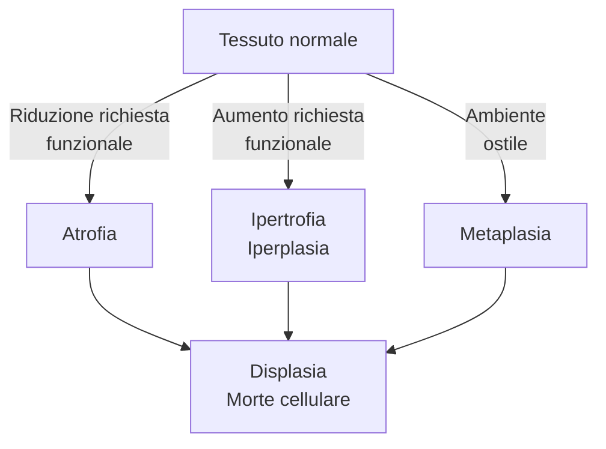
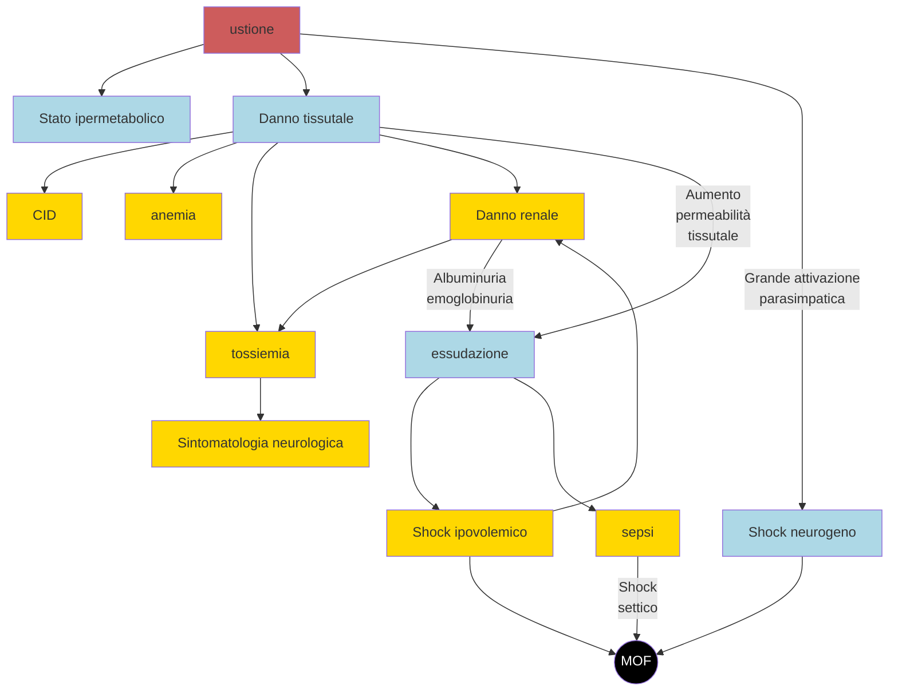

lang: it-IT
bibliography: $MED/bib.bib
nocite : |
    @
link-citations: true
urlcolor: CadetBlue
linkcolor: CadetBlue
toccolor: black
...

<!-- Nuova geometria per avere la copertina centrata -->
\newgeometry{top=4cm, bottom=4cm, left=4cm, right=4cm}

\title{Patologia e Fisiopatologia Generale (C.I.)}
\author{Emanuele Vicinelli}
\date{a.a. 2019/2020}

\maketitle

* * * *

\begin{figure}[H]
\vspace{2cm}
\centering
\includegraphics[width=8cm]{../head.pdf}
\end{figure}

<!-- Data in cui il pdf è stato compilato-->
\thispagestyle{fancy}
\fancyhead{}
\fancyfoot{}
\renewcommand{\headrulewidth}{0pt}
\rfoot{\today}

\restoregeometry

\newpage

\tableofcontents

\newpage

\listoffigures

\newpage

<!-- L’esame sarà svolto dai due professori del corso e la prof.ssa Arciola sottolinea che le sue domande verteranno esclusivamente su ciò che è stato trattato a lezione. Durante la prova di laboratorio, è richiesta l’osservazione di un preparato e una sua successiva descrizione, con particolare attenzione agli aspetti patologici. Oltre al riconoscimento del vetrino, verranno effettuate domande inerenti ad uno dei sei argomenti del laboratorio. Per superare l’esame è necessaria la sufficienza in entrambe le parti e il voto finale sarà dato dalla media matematica del parziale di Patologia e Fisiopatologia Generale del Prof. Dall’Olio, quello della prof.ssa Arciola e quello della prova di laboratorio (prova suddivisa nelle due parti precedentemente descritte). -->
<!--
DALL'OLIO

Patologia cellulare ed extracellulare
    - Radicali liberi e ROX
    - Adattamenti cellulari
    - Morte cellulare
    - Degenerazioni cellulari ed extracellulari (steatosi, degenerazione vacuolare)
    - Patologie da accumulo
-->
<!-- Mon 05 Oct 2020 11:30:04 AM CEST -->

\clearpage

\part{Patologia cellulare ed extracellulare}

# Adattamenti cellulari e meccanismi di adattamento al danno

\ 

- __Adattamenti cellulari__: processi che le cellule attuano per compensare stressor, ovvero stimoli che alterano il normale stato di omeostasi
	1. Atrofia
	2. Ipertrofia e iperplasia
	3. Metaplasia^[A volte si parla anche di __displasia__, ovvero di sviluppo anormale dovuto a stressor. Non è un vero e proprio adattamento, quanto più identifica una situazione in cui il danno viene completamente subito]
	4. Manifestazioni di fallimento nell'adattamento
		1. Displasia
		2. Morte cellulare
			- Apoptosi
			- Necrosi

> __Eziologie tipiche di danno__  
>
>- Eccessiva richiesta funzionale impossibile da soddisfare
>- Insufficiente richiesta funzionale
>- Stimolazione anormale
>- Ipossia o ischemia
>- Cause fisiche (temperatura, radiazioni, danno meccanico...)
>- Cause chimiche
>- Cause infettive
>- Cause immunitarie
>- Squilibri nutrizionali
>- Alterazioni genetiche
>- Neoplasie, che danneggiano le cellule sane circostanti

## Atrofia
- __Atrofia__ --- processo di riduzione di volume e funzionalità di un tessuto, a causa della riduzione del volume e/o del numero di cellule che compongono quel tessuto
- Il processo di atrofia può conseguire sia da cause fisiologiche che patologiche
	- Atrofia fisiologica
		- Nello sviluppo fetale: non tutti gli organi vengono portati fino alla nascita (es: notocorda, vasi ombelicali)
		- Atrofia del timo postadolescenziale
		- Atrofia di tessuti dell'apparato riproduttivo femminile (endometrio, epitelio vaginale, ghiandola mammaria) dopo la menopausa per ridotta stimolazione da estrogeni
	- Atrofia patologica
		- __Ridotta attività funzionale da disuso__: esempio classico è l'arto immobilizzato per lungo tempo, che perde massa muscolare; o gli astronauti che perdono massa dopo lunghe permanenze nello spazio
		- __Atrofia da ridotta perfusione__: atrofia conseguente ad un ridotto trofismo del tessuto (es classico atrofia a valle di una subocclusione di un'arteria)
		- __Atrofia da carenza nutrizionale__ (es: ___marasma___^[___Marasma___ = Carenza nutrizionale di proteine + carboidrati] o ___kwashiorkor___^[[___Kwashiorkor___](https://it.wikipedia.org/wiki/Kwashiorkor) = Carenza nutrizionale di proteine + micronutrienti antiossidanti])
		- __Atrofia da perdita di stimolazione endocrina__: tipica di tessuti che, per mantenere un corretto trofismo, necessitano di una continua stimolazione endocrina (es: mammella, apparato genitale)
		- __Atrofia da compressione__: se una struttura cresce (eg tumore) e comprime i tessuti circostanti, questi possono atrofizzarsi
		- __Osteoporosi__ con il progredire dell'età

### Meccanismi alla base dell'atrofia
- I meccanismi con cui si realizza l'atrofia sono essenzialmente 2
	#. La __riduzione del volume delle cellule__ si verifica o per autofagia (= autodigestione controllata) o per degradazione delle proteine intracellulari ad opera del proteasoma
	#. La __riduzione del numero di cellule__ avviene tramite morte cellulare programmata

#### Riduzione del volume delle cellule

##### Degradazione delle proteine cellulari (Unfolded Protein Response)

\ 

#. Stress ⇒ accumulo di proteine mal-ripiegate
#. C'è tentativo di adattamento: ↑ produzione di chaperonine (HSP) per ri-naturare le proteine mal ripiegate
#. Se adattamento non efficace, si hanno 2 strade a seconda dell'entità del mancato adattamento
	- Distruzione delle proteine mal ripiegate ⇒ perdita di volume della cellula ⇒ atrofia
	- Innesco dell'apoptosi ⇒ ✝

##### Autofagia
- __Autofagia__ --- processo di autodigestione _controllato_: si formano vescicole che contengono componenti cellulari da eliminare^[Obiettivo: eliminare dalla cellula i componenti _non necessari_ per ridurre gli sprechi e portare la cellula ad una composizione interna razionalizzata, più essenziale e quindi più agile nel fronteggiare gli stressor esterni]

1. Si assembla il complesso di inziazione e di nucleazione (tramite molecola `BECLIN-1`)
2. Si forma quindi una membrana all'interno del citoplasma, inizialmente a forma di mezzaluna
3. Grazie alle `ubiquitin-ligasi LC3` la membrana a mezzaluna completa la chiusura ⇒ si forma una vescicola ("__autofagosoma__")
4. Nell'autofagosoma vengono inglobati, _con intenzione_^[Come esattamente vengano "scelti" i componenti cellulari ancora non è chiaro] diversi componenti cellulari, per recuperare i componenti di base (aa, acidi grassi...). A seconda di quali componenti cellulari vengono inglobati, distinguiamo
	- Mitocondri → mitofagia (per eliminare mitocondri invecchiati che producono molti ROX)
	- Aggregati proteici poliubiquitinati → aggrefagia
	- Microorganismi patogeni → xenofagia
	- Accumuli di grassi → lipofagia

#### Riduzione del numero di cellule
- Per [apoptosi controllata (vedi)](#apoptosi)

## Ipertrofia ed iperplasia
- Sono di fatto l'opposto dell'atrofia
	- __Ipertrofia__ --- ↑ volume delle cellule (tipico di tessuti perenni [secondo Bizzozzero](#rigenerazione))
		- In realtà _ricerche_^[@smithProteinTyrosinePhosphatase2017: _"Using the adult zebrafish as a novel screening platform, we identified MSI-1436 as a first-in-class regenerative medicine drug candidate. MSI-1436 is a naturally occurring aminosterol that inhibits protein tyrosine phosphatase 1B. Treatment of adult zebrafish by intraperitoneal injection of MSI-1436 increased the rate of regeneration of the amputated caudal fin, which is comprised of bone, connective, skin, vascular and nervous tissues and also increased the rate of adult zebrafish heart regeneration. Intraperitoneal administration of MSI-1436 to adult mice for 4 weeks after induction of myocardial infarction increased survival, improved heart function, reduced infarct size, reduced ventricular wall thinning and increased cardiomyocyte proliferation. [...] Doses effective at stimulating regeneration are 5-50-times lower than the maximum well tolerated human dose"_] dimostrano che è possibile indurre rigenerazione in tessuti perenni
	- __Iperplasia__ --- ↑ numero di cellule (tipico di tessuti labili o stabili [secondo Bizzozzero](#rigenerazione))
		- Iperplasia può essere un _preludio_ a trasformazione neoplastica, in quanto, di fatto, è una situazione in cui si ha un grande tasso replicativo di un certo tessuto (sebbene si mantenga il differenziamento)

### Ipertrofie fisiologiche
#. Ipertrofia da aumentata richiesta funzionale
	- Es: muscolo scheletrico in continuo esercizio → ↑ volume fibre muscolari
	- Ipertrofia del rene per asportazione del rene controlaterale \marginnote{In realtà questo è un caso misto: in caso di asportazione, il rene rimasto aumenta sia per ipertrofia che per iperplasia (↑ lunghezza dei tubuli, ma non aumenta il numero di nefroni)}
#. Ipertrofia da variazione dei livelli ormonali
	- Ipertrofia degli organi sessuali secondari durante pubertà
	- Ipertrofia (+iperplasia) della ghiandola mammaria durante gravidanza e allattamento (per ↑ estrogeni)

### Ipertrofie patologiche
#. Ipertrofia _patologica_ da aumentata richiesta funzionale
	- Es: cardiomiopatia ipertrofica secondaria a ipertensione di lunga data
#. Ipertrofia _patologica_ da squilibrio endocrino
	- Endometrio femminile
	- Prostata
	- Gozzo tiroideo da carenza di iodio (compensata con ↑ TSH)
	- Ipertrofia della corteccia surrenalica da ↑ ACTH (\pat{iperaldosteronismo})

### Iperplasie fisiologiche
#. Iperplasia da stimoli ormonali fisiologici
	- Epitelio mammario durante pubertà e gravidanza
	- Muscolatura uterina durante gravidanza
	- Sintesi di eritrociti (ipossia ⇒ ↑ eritropoietina)
#. Iperplasia compensatoria
	- Iperplasia in risposta ad epatectomia parziale
	- Iperplasia dopo nefrectomia monolaterale (si determina sia iperplasia, tramite allungamento dei tubuli; che ipertrofia dei glomeruli per compensare la capacità di filtrazione che si è persa)
	- Iperplasia dello strato corneo della cute in risposta a stress meccanici ripetuti (i calli, per intenderci)

### Iperplasie patologiche
#. Iperplasia da stimoli ormonali patologici
	- Iperplasia adenomatosa dell'endometrio: nel periodo perimenopausale si può verificare, per squilibrio ormonale, ipertrofia dell'endometrio che produce sanguinamenti
	- Ipertrofia prostatica benigna, per squilibri nella sintesi di testosterone
#. Stimolazione iperplastica da fattori di crescita
	- Leucocitosi (↑ neutrofili) in risposta ad una infezione^[Vengono prodotti GF per avere una neutrofilia, per fronteggiare più efficacemente l'infezione]
	- Iperplasie del midollo osseo
		- \pat{morbo di cooley}: __assente o ridotta sintesi delle catene β dell'Hb__ → anemia → stimolazione dell'eritropoiesi (grazie a `HIF`^[Hypoxia-Inducible Factor] e `eritropoietina` → iperplasia del midollo per far fronte a questa richiesta → deformità ossee per aumentato volume del midollo
	- Verruche da _Papilloma virus_ (il Papilloma immortalizza le cellule)

## Metaplasia
- __Metaplasia__ --- sostituzione di un tessuto _già differenziato_ con un altro tessuto _differenziato_
- Metaplasia può essere __preludio a trasformazione neoplastica__, in quanto sono __gli elementi staminali__ di un certo tessuto che _cambiano programmazione_ e __si differenziano verso un tipo di tessuto differente__

\ 

- Esempi classici di metaplasia
	1. Metaplasia nelle vie aeree di un sg. fumatore
		- Metaplasia in risposta a continua irritazione da agenti chimici + stress meccanico del particolato sottile sospeso
		- È metaplasia pavimentosa: epitelio cilindrico monostratificato → epitelio squamoso pluristratificato
	2. Calcoli nel coledoco o colecisti
		- Calcoli ⇒ irritazione (meccanica) ⇒ danno cellulare
		- Metaplasia pavimentosa: epitelio cilindrico monostratificato → epitelio squamoso pluristratificato
	3. Esofagite di Barrett
		- Reflusso gastrico → risalita di succhi gastrici in esofago ⇒ danno da ustione chimica
		- Epitelio pavimentoso pluristratificato della mucosa esofagea → epitelio cilindrico monostratificato (simile a 

## Displasia
- __Displasia__ --- Tessuto che si sviluppa in modo anormale disorganizzato, a seguito di uno stressor al quale non _è stato_ capace di far fronte. __Non è un processo di compensazione__, quanto una delle manifestazioni di fallimento dell'adattamento allo stress
	- Tendenzialmente si ha __perdita dei meccanismi di regolazione e controllo^[Meccanismi di controllo = controllo nel differenziamento e/o velocità di replicazione e/o controllo nel numero e/o altro]__ ⇒ displasia è di fatto l'_anticamera_ della trasformazione neoplastica

## Morte cellulare
- Insieme a displasia, rappresenta il fallimento nell'adattarsi al danno \marginfig{apoptosivsnecrosi}
	1. Morte per necrosi: morte _disordinata_, che produce _infiammazione_^[= esplodono in una nuvola di fiamme, producendo quanto più casino possibile, per incoraggiare la produzione di una risposta]
	2. Morte per apoptosi: morte _ordinata_, che produce la _minima quantità di infiammazione_^[= rilasciano meno DAMPS possibile, cercano di pulire mentre stanno morendo]
	3. Morti cellulari "particolari"
		- Anoikis
		- ENTosi
- Perché fallisca l'adattamento e la cellula muoia, si deve verificare un __danno irrecuperabile__. L'idea di "irrecuperabilità" è data dalla combinazione di __intensità__ e __durata__
	- Un danno è permanente per _grande intensità_ dello stimolo lesivo
	- Un danno è permanente per il _perdurare_ dello stimolo lesivo
- I danni irrecuperabili che portano a morte cellulare sono essenzialmente 3:\

	1. \goldstandard Deplezione di ATP^[Ipossia protratta da ischemia è causa tipica ed esemplificativa: ipossia ⇒ ↓ fosforilazione ossidativa mitocondriale ⇒ non viene prodotta ATP, ma viene consumata ⇒ esaurimento delle riserve di ATP]
		- ⇒ Switch a glicolisi anaerobia ⇒ formazione di lattati ⇒ ↓ pH intracellulare ⇒ __addensamento della cromatina__ e __denaturazione delle proteine__
		- ⇒ ??? ⇒ distacco dei ribosomi ⇒ ↓ sintesi proteica ⇒ ??? ⇒ __deposizione dei lipidi intracellulari__ e formazione delle _figure di mielina_
		- ⇒ La pompa ATPasica Na^+^/K^+^ non funziona ⇒ uscita di K^+^, ingresso di Na^++^ ⇒ ingresso netto di acqua ⇒ __rigonfiamento della cellula__ (_oncosi_) e formazione dei _bleb_ di membrana
		- ⇒ Le pompe ATPasiche che, contro gradiente, devono mantenere il Ca^++^ intracellulare confinato in mitocondri e RE non funzionano più ⇒ ↑ Ca^++^ citosolico
	2. Perdita di omeostasi del Ca^++^
		- ↓ ATP ⇒ \ini pompe ATPasiche ⇒ fuoriuscita del Ca^++^ da mitocondri + RE ⇒ ↑ Ca^++^ citosolico
		- ↑ [Ca^++^] ⇒ attivazione di enzimi Ca^++^-dipendenti: ATPasi, fosfolipasi, proteasi, endonucleasi ⇒ un gran casino, viene degradata ogni cosa: ATP, membrane, proteine del citoscheletro, cromatina...
	3. Danno mitocondriale ⇒ porazione della membrana mitocondriale \marginnote{\textbf{Il tipo di pori che si vengono a creare nei mitocondri è essenziale nel decidere se succederà apoptosi o necrosi}, in quanto entrambi i fenomeni passano per la porazione della membrana mitocondriale}
		- Porazione effettiva della membrana (formazione di MPTP^[Mitochondrial Permeability Transition Pores])
			- ⇒ perdita della _ddp_ transmembrana che è essenziale per stoccare l'energia per produrre ATP^[L'energia recuperata dalle specie chimiche che vengono ossidate durante la catena di trasporto degli elettroni, viene stoccata sottoforma di ioni H^+^ nello spazio transmembrana dei mitocondri. Il gradiente protonico viene poi usato per alimentare l'`ATP-sintasi` -- che è una proteina che pesca H^+^ nello spazio intermembrana e li fa uscire all'interno dei mitocondri, facendoli quindi viaggiare secondo gradient -- per guadagnare l'energia sufficiente a legare il terzo gruppo fosfato all'ADP. Vedi Bchem Metabolica se proprio vuoi maggiori dettagli (ma perché?!).] ⇒ __inabilità a produrre ATP__
		- Apertura di pori preformati, la cui apertura è controllata dalle molecole `Bax`/`Bak` e `BCL2`
			- ⇒ fuoriuscita del __citocromo C__ ⇒ inizio della [via apoptotica](#pathway-intrinseco) (pathway intrinseco)

^[Le __figure mieliniche__ sono fosfolipidi ripiegati a formare strutture spiraliformi che ricordano la disposizione di mielina attorno ai neuroni]

\normalbox{Necrosi regolata}{
L'apoptosi è una morte regolata, tuttavia anche alcune forme di \emph{necrosi} possono essere regolate. La differenza risiede nella pulizia della morte

\begin{itemize}
\tightlist
\item Apoptosi: morte pulita, condotta cercando di minimizzare l'infiammazione. È per sua natura un processo \emph{regolato}, perché sono necessarie operazioni in sequenza appropriata per minimizzare la produzione di DAMPS
\item Necrosi: morte sporca, condotta senza preoccuparsi dei DAMPS prodotti dalla morte cellulare ⇒ infiammazione, a volte anche attivamente ricercata
\end{itemize}

La programmazione o meno della morte è un concetto che prescinde dalla strategia usata per morire: esistono, infatti, anche casi di \textbf{necrosi programmata}:

\begin{itemize}
\tightlist
\item \textbf{Necroptosi} --- Anche "apoptosi caspasi-indipendente", è una morte al confine tra necrosi e apoptosi, passa tramite la costruizone di un complesso detto \textbf{necrosoma}. Le cause possono essere le stesse dell'apoptosi, rappresentando di fatto un processo che con l'apoptosi può essere in diretta competizione
\item \textbf{Mithocondrial Pore Transition (MPT) regulated necrosis} --- Necrosi ottenuta mediante porazione intenzionale della membrana mitocondriale, che prota alla dissipazione della ddp lì accumulata, con conseguente deplezione delle riserve di ATP
\item \textbf{Parthanatos} --- morte cellulare causata da una eccessivo consumo richiesta di NAD+. Questo succede solamente quando si evidenziano danni al DNA talmente estesi che i meccanismi di riparazione (\emph{BER} in primis) non riescono a riparare \oldfootnote{BER usa il macchinario molecolare della \texttt{PARP1} per riparare i danni, la quale è \emph{estremamente} esosa di NAD+}
\item \textbf{Piroptosi} --- Morte \emph{estremamente} infiammatoria. Usa la caspasi-1, e produce una quantità di DAMP e PAMP molto elevata
\item \textbf{Ferroptosi} --- Causata da un eccesso di danno ossidativo, da perossidazione dei lipidi di membrana. Meccanismo che richiede lo ione ferro per procedere
\end{itemize}
}

### Necrosi
- Distinguiamo classicamente 5 tipi di necrosi
	1. __Necrosi coagulativa__ (_"a stampo"_) --- il tessuto preserva la propria compattezza e l'impronta del tessuto di origine^[Tipica dei tessuti infartuati, tranne il cervello]
	2. __Necrosi colliquativa__ --- il tessuto necrotico si liquefa, grazie al contributo della degranulazione dei neutrofili^[Tipica di qualsiasi cosa in cui ci sia pus]
	3. __Necrosi caseosa__ --- si arriva alla produzione di una sostanza bianca, poltacea, compatta; si preserva la compattezza ma non la forma
	4. __Necrosi gangrenosa__ --- necrosi + sovrapposizione batterica che porta a putrefazione^[Tipica di quando necrotizzano gli arti inferiori, pes da diabete]
	5. __Steatonecrosi__ --- necrosi per saponificazione dei grassi^[Tipica delle pancreatiti necrotico-emorragiche]

#### Necrosi coagulativa
- Tipica di tessuti infartuati che possono eseguire switch verso metabolismo anaerobico^[Infatti nel cervello ischemico si ha tipicamente necrosi colliquativa]
	0. Ischemia ⇒ __switch a metabolismo anaerobio__
	1. Accumulo di lattati ⇒ ↓ pH
	2. Denaturazione delle proteine, comprese le __idrolasi acide lisosomiali__
		- Blocco del metabolismo
		- Denaturazione dell'ultrastruttura del nucleo
	3. Picnosi → carioressi → cariolisi, mentre il resto della cellula rimane "cristallizzato" nella conformazione in cui si trova
- Per rimozione del tessuto (per fagocitosi) necessari alcuni giorni. Rigenerazione/riparazione dipendente da tipologia di tessuto (labile vs stabile vs perenne)
- Aspetti morfologici per riconoscerla
	- Conservazione dell'architettura microscopica MA mancanza di nuclei
	- Eventualmente rilevabile infiltrazione leucocitaria

#### Necrosi colliquativa
- Conseguente a danno di membrana + attivazione degli enzimi litici ⇒ __autolisi della cellula__. Eziologia alternativa: danno da degranulazione dei neutrofili
	1. ↑ [Ca^++^] citoplasmatico
	2. Attivazioni degli enzimi litici
	3. Danno delle membrane e morte cellulare
- Aspetti morfologici per riconoscerla
	- Architettura del tessuto difficilmente distinguibile, tutto liquefatto

#### Necrosi caseosa
- Necrosi caseosa = necrosi coagulativa + necrosi colliquativa
- Al processo misto, sia coagulativo che colliquativo, si aggiungono 3 elementi, che rendono la materia necrotica di consistenza poltacea
	- Formazione di fibre
	- Calcificazione
	- Formazione di caverne

#### Necrosi gangrenosa
- Per crescita batterica su tessuto, che ne provoca la necrosi e la putrefazione
- 3 forme, in base alla causa della necrosi
	1. Secca: necrosi coagulativa (+ crescita batterica)
	2. Umida: necrosi colliquativa (+ crescita batterica)
	3. Gassosa: necrosi per produzione di gas dalla flora batterica che sta colonizzando

#### Steatonecrosi
- Tipica del pancreas, poiché sono necessari gli enzimi pancreatici per saponificare i grassi
	0. Danno cellulare ⇒ rilascio degli enzimi pancreatici (lipasi) e Ca^++^ che era intracellulare
	1. Le lipasi scindono acidi grassi
	2. Il gruppo -COOH degli acidi grassi si lega al Ca^++^ liberato dal danno cellulare ⇒ __saponificazione degli acidi grassi__

#### Morfologia al MO della necrosi
- Aspetto principale: modificazioni progressive del nucleo (picnosi → cariolisi → carioressi) \asidefigure{img/morfologia-mo-necrosi.png}{In nero i nuclei picnotici (frecce centrali), in rosso i nuclei in carioressi (frecce in alto a dx), in blu i nuclei scomparsi per cariolisi (a sx)}
	1. Picnosi: nucleo piccolo, addensato, molto basofilo
	2. Carioressi: il nucleo picnotico si frammenta
	3. Cariolisi: i frammenti nucleari scompaiono

#### Conseguenze della necrosi
- Locali
	- Infiammazione
	- Rigenerazione (se cellule necrotiche sono labili o stabili) → morfologia conservata, funzione conservata (_restitutio ad integrum_)
	- Riparazione (se cellule necrotiche sono perenni) → morfologia conservata, perdita di funzione
- Sistemiche
	- Fuoriuscita di enzimi cellulari^[Ecco perché si dosano enzimi cellulari come _marcatori di necrosi_, es: troponina cardiaca, transaminasi (GPT, GOT), creatina-chinasi (marker di generico danno muscolare, ↑ in \pat{dmd})...]
	- Fuoriuscita di DAMPs ⇒ infiammazione anche sistemiche

### Apoptosi
- Morte cellulare _pulita_ (portata avanti in maniera da minimizzare l'infiammazione)
- Cause molto varie (il confine tra quali cause sono fisiologiche e quali sono patologiche è come al solito molto sottile ed estremamente dipendente dal contesto^[Il fenomeno apoptotico in sé è estremamente necessario alla vita, quando portato avanti _in modo regolato_: la patologia si origina quando, in eccesso o in difetto, si ha una perdita di controllo nei meccanismi apoptotici. Questo significa, per esempio, che una perdita nell'apoptosi può favorire patologie neoplastiche (per immortalizzazione di cellule e conseguente rischio elevato se si perdono i meccanismi di controllo nella replicazione cellulare); ma viceversa, anche un'apoptosi eccessivamente frequente può portare ad atrofia tissutale ed essere alla base di patologie degenerative come Alzheimer, Parkinson, Huntington... In sostanza, le due facce della medaglia (replicazione e morte cellulare) è necessario che siano in equilibrio per garantire un corretto stato di saulte. Un eccesso o un difetto dovuto alla perdita di controllo di ciascuno dei due processi (morte o replicazione) può essere causa di patologia])
	- Perdita della stimolazione continua di GF necessari alla sopravvivenza
	- Attivazione esterna da TNF, FAS
	- Apoptosi per fallimento delle pathway cellulari di riparazione dal danno
	- ...
- 2 vie per l'esecuzione dell'apoptosi, a seconda di _dove si origini l'impulso apoptotico_
	- [__Via intrinseca__](#pathway-estrinseco) --- l'impulso apoptotico proviene _da fuori_ la cellula, tramite legame con recettori di membrana^[Es: killing dei lfc T citotossici]
	- [__Via intrinseca__](#pathway-intrinseco) --- l'impulso apoptotico proviene _dall'interno_ della cellula, tramite il rilascio dei citocromi C da parte dei mitocondri

\normalbox{Frammentazione del DNA nell'apoptosi e nella necrosi: differenze osservabili all'elettroforesi del materiale genetico, label=boxelettroforesi}{
\begin{itemize}
\tightlist
\item Nell'apoptosi la frammentazione del DNA è \emph{regolare}, in quanto è eseguita da endonucleasi apposite che tagliano in maniera specifica e regolare il DNA, in appositi siti di taglio (si vedono picchi elettroforetici discreti, se si fa l'elettroforesi del materiale genetico della cellula morta per apoptosi)
\item Nella necrosi il DNA viene degradato e spezzettato in modo irregolare, in quanto il taglio viene svolto dalle endonucleasi attivate che tagliano il genoma in maniera aspecifica (si vede un \emph{continuum} all'elettroforesi, se si fa l'elettroforesi del materiale genetico della cellula morta per necrosi)
\end{itemize}
}

#### Pathways per l'esecuzione dell'apoptosi

\ 

- Ci sono 2 vie, estrinseca ed intrinseca, per l'_attivazione_ dell'apoptosi: entrambe convergono verso l'attivazione delle __caspasi esecutrici__. Da lì, l'apoptosi prosegue in modo unico
	1. Per via estrinseca o intrinseca vengono attivate le __caspasi esecutrici__
	2. Le caspasi esecutrici smantellano proteine e l'intera architettura cellulare
		- Viene tagliata e smantellata l'intera struttura cellulare ⇒ formazione di vescicole (\a{corpi apoptotici}) che contengono residui della cellula
		- Viene flippata verso l'esterno i residui di __fosfatidilserina__ di membrana: questo marca i \a{corpi apoptotici} che si stanno formando per la fagocitosi, minimizzando così la quantità di DAMPs prodotti. I macrofagi, quindi, se li pappano liberamente e senza troppo casino^[Se non si ha una fagocitosi veloce, però, dopo un po' anche i corpi apoptotici perdono la loro permeabilità di membrana, riversando il loro contenuto all'esterno e, quindi, andando a produrre un quadro di __necrosi secondaria__]
		- Viene tagliato -- e quindi perde funzione -- l'inibitore di una DNAsi tipica del processo apoptotico, che è quindi libera di smantellare il materiale genetico in maniera specifica, producendo la tipica regolarità in termini di lunghezza (vedi box pagina \pageref{boxelettroforesi})

##### Pathway estrinseco
0. Legame tra i fattori extracellulari (`TNF` e `FasL`^[Ligando del FAS], ma anche il `Garanzima B`^[Enzima iniettato dai lfc T citotossici]) e i recettori di membrana. Il legame porta i recettori a trimerizzare
1. Recettori trimerici legano il `FADD`, una molecola adattatrice che trasduce il segnale
2. FADD, con la sua __attività autocatalitica__, dà inizio alla __cascata delle caspasi__^[Le caspasi sono delle __proteasi con una -Cis nel centro funzionale__, e tagliano le proteine in corrispondenza dei residui di -Arg. Sebbene siano centrali nella catena dell'apoptosi, le caspasi sono in realtà proteasi, per cui vengono usate anche in altri pathway cellulari (es: vengono usati nella maturazione delle citochine proinfiammatorie, e la sotto-famiglia che si occupa di quello è, non a caso, quella delle _caspasi proinfiammatorie_)]
	1. Si reclutano le __caspasi iniziatrici__, che attivano il meccanismo apoptotico (caspasi-2, __-8__, -9, -10)
	2. Le caspasi iniziatrici reclutano le __caspasi esecutrici__, che effettivamente demoliscono l'architettura cellulare (caspasi-3, -6, -7)
3. L'apoptosi procede per via comune (vedi sopra)

##### Pathway intrinseco
0. In condizioni normali l'apoptosi è _impedita_ da molecole^[`BCL2`, `BCL-x`] che __chiudono i pori normalmente presenti nella parete mitocondriale__, impedendo l'uscita dei citocromi
1. In caso eventi pro-apoptotici (mancanza di segnali di sopravvivenza, danno irrecuperabile al genoma...) si attiva una classe di molecole __`BH3-only`__ (i __sensori del danno__), che mediano l'apertura dei pori mitocondriali
2. Pori mitocondriali aperti ⇒ fuoriuscita del `CytC`, che è _potente_ stimolatore pro-apoptotico
3. Ulteriore checkpoint: __perché l'apoptosi prosegua, è necessario che gli stimoli pro-apoptotici > stimoli anti-apoptotici__ \marginnote{Questo è il consueto concetto di "bilancia molecolare": da una parte ci sono i fattori pro-apoptotici che spingono per fare andare la cellula in apoptosi; dall'altra ci sono i fattori anti-apoptotici che spingono per fare sopravvivere la cellula -- quello che succederà realmente dipende da chi vince a questo "braccio di ferro molecolare"}
	- Fattori _pro-apoptotici_ (__AIFs__, Apoptosis Inducing Factors)
		- Inibitori dei fattori anti-apoptotici (es: `SMAC-DIABLO`)
		- Citocromo C
	- Fattori _anti-apoptotici_ (__IAPs__, Inhibitors of ApoPtosis)
		- Inibitori delle caspasi
4. Se fattori pro-apoptotici > fattori anti-apoptotici: si ha commitment verso apoptosi, con la __formazione dell'apoptosoma__
	- Apoptosoma è complesso eptamerico formato da 7 dimeri di APAF-1 + CytC
5. Apoptosoma attiva le caspasi iniziatrici (particolarmente la caspasi-9)
6. Le caspasi iniziatrici attivano le caspasi effettrici
7. L'apoptosi procede per via comune (vedi sopra)

### Tipi particolari di morte cellulare

#### Anoikis
- __Anoikis__ (_"essere senza casa"_) --- apoptosi indotta dalla mancata adesione ad un substrato solido
    - Tipica dei tessuti solidi
    - Anche le cellule tumorali sono solitamente sensibili all'anoikis, salvo tumori molto avanzati/maligni
- Anoikis viene evitata, da cellule normalmente adese alla ECM, tramite la mediazione dell'__actina__, che in conformazione stirata permette la migrazione nel nucleo dei fattori di trascrizione YAP/TAZ
	- Se la cellula è adesa, le integrine sono collegate all'ECM ⇒ __l'actina citoscheletrica__ (legata alle integrine) è __in conformazione stirata__
		1. __L'actina in forma stirata cattura l'_inibitore_ del dimero YAP/TAZ__, che è quindi parcheggiato lì e non fa niente
		2. Il dimero YAP/TAZ, comunemente nel citoplasma, è libero di migrare nel nucleo e avviare la via di segnalazione intracellulare (__via HIPPO__) che porta al differenziamento e alla proliferazione
	- __Se la cellula non è adesa ⇒ actina citoscheletrica è in conformazione rilassata__
		1. L'actina non lega più l'inibitore di YAP/TAZ
		2. L'inibitore sequestra il dimero YAP/TAZ, che rimane nel citoplasma
		3. La mancanza di attivazione della via HIPPO porta all'apoptosi

> __Ruolo della compattezza dell'ECM e sua influenza nelle dinamiche di vita e differenziamento cellulare__ ---
> Una ECM compatta, a differenza di una ECM lasca, impone una forza differente sulla cellula, a tutti gli effetti _stirando_ l'impalcatura cellulare. Con meccanismi analoghi a quello YAP/TAZ questo determina un differente stimolo che porta la cellula a differenziarsi in modalità differente
>
>   
>
>#. Cellule epiteliali seminate su matrice morbida → struttura cava
>#. Cellule epiteliali seminate su matrice compatta → struttura piena
>#. Cellule epiteliali seminate su matrice _molto_ compatta → capacità migrante! ⚠️
>
> In aggiunta, sempre con meccanismi di sensibilità alla forma mediati dal livello di tensione del citoscheletro, si osserva una diversa potenzialità differenziativa a seconda che tipi di cellule diverse, per varia ragione, siano adese al substrato con una superficie più o meno grande (perché la superficie di adesione influenza la forma della cellula nel suo complesso, trasferendo le forze grazie al citoscheletro)
>
>  
> Metodi di coltura cellulare su ECM progressivamente più soffici permettono di capire il grado di malignità di una cellula: è tanto maggiore quanto più la cellula riesce a sopravvivere e differenziarsi in matrici progressivamente più lasche

#### Entosi
- __Entosi__ --- Processo per il quale una cellula (detta _guest_) viene inglobata in un'altra cellula (detta _host_) senza venire digerita, per sfuggire ad un ambiente sfavorevole
	- Possibile entosi in serie, tipo matrioska di cellule
- Il destino dell'host è differente a seconda delle circostanze
	- Morte dell'host dentro il guest
	- Uscire dopo un certo periodo, quando le condizioni dell'ambiente sono mutate
	- Permanere nell'host, portando frequentissimamente ad aneuploidia -- con danni genomici del caso
	- Duplicarsi all'interno dell'host

<!-- lun 26 ott 2020, 12:06:44, CET -->
# Patologie da accumuli extracellulari

## Calcificazioni
- Depositi di __idrossiapatite__^[Ca~10~(PO~4~)~6~(OH)~2~]
- Perché ci sia deposizione si deve avere una combo di 2 fattori
	- Eventuale esposizione di centri nucleatori (ioni o strutture compatibili con ioni) che incoraggiano la formazione del reticolato cristallino
	- Aumento (se non sistemico, quantomeno localizzato) di Ca e P~i~ (~ 60--70 mg/dl), che normalmente si trova ad un livello subcritico \marginnote{Non sufficiente, in condizioni standard, per formare depositi di calcio così, alla boia. L'unico punto in cui questa deposizione a queste concentrazioni viene permesso è l'ambiente, molto particolare e controllato, dell'osso}
- 2 tipi di calcificazioni patologiche: distrofiche e metastatiche
	- __Calcificazione distrofica__ --- calcificazione di tessuti morti o danneggiati. Necessita di centri nucleatori
		- Es: calcificazione in nodulo di TBC polmonare
		- Es: calcificazione in placca ateromasica
	- __Calcificazione metstatica__ --- depositi secondari a ipercalcemia che si verifica in tessuti sani, caratterizzati da pH lievemente alcalino (ovvero dove c'è poca CO~2~)
		- Es: calcificazione nella tonaca media di una grande arteria in sg. ipercalcemico, dove ci sono ↑ pO~2~

### Calcificazioni distrofiche
- Calcificazione in ambiente necrotico o in via di degenerazione
- Procedimento di accumulo del deposito distrofico in 2 fasi
	1. __Nucleazione__: eventuali ioni di Ca^+^ o PO~4~^-^, che si trovano in ambiente favorevole^[Ricordiamoci che nel tessuto necrotico c'è la liberazione di un sacco di roba che prima era intracellulare, tra cui gli ioni in questione], fungono da centri di nucleazione per nuovo calcio o fosfato, che si monta accanto, legandosi
		- Ambiente: se non sono già presenti ioni di fosfato e calcio, basta anche che ci sia un tessuto con strutture relativamente compatibili con gli ioni stessi che possono fornire una buona base per la nucleazione pur non essendoioni (fibre elastiche, fosfolipidi, collagene, tessuti con matrice digerita, __una preesistente colonia batterica__^[Vedi tartaro su denti: si deposita proprio in questo modo, la colonia batterica funge da centro di nucleazione]). Successivamente saranno gli ioni stessi a fornire la base per la nucleazione di altri ioni → fenomeno di __eptassia__
	2. __Propagazione__: altri atomi sono incoraggiati a depositarsi su questa struttura, producendo una struttura regolare, geometrica e tridimensionale tipica della deposizione cristallina

### Calcificazioni metastatiche
- Calcificazione secondaria ad una ipercalcemia in distretti con pH (relativamente) alcalino \marginnote{Primi esempi che devono venire in mente: intima dei grandi vasi (grosse arterie, vene polmonari...), reni, polmoni, cornea}
- Eziologie per ipercalcemia
	- ↑ produzione di PTH
		- Primario per iperplasia/tumore delle paratiroidi
		- Secondario per secrezione da tumori secernenti PTH (o sostanze PTH-like)
		- In risposta a ritenzione di fosforo per insufficienza renale
	- Distruzione di tessuto osseo per processi patologici^[Es in \pat{mieloma multiplo}]
	- Eccesso di vitamina D
	- Idiopatica

## Amiloidosi
- __Amiloidosi__ --- condizione tipica di un gruppo disparato di patologie che porta a __deposizione__ (locale o sistemica in più foci) __di materiale proteico insolubile nei tessuti__

\normalbox{Colorazioni per evidenziare al MO i depositi proteici}{
\begin{itemize}
\tightlist
\item \goldstandard \textbf{Rosso Congo}: se vetrino colorato con RC viene visto illuminato da luce polarizzata, i depositi proteici cambiano colore (fenomeno della \emph{birifrangenza}), altrimenti colorazione appare rosata
\item \textbf{Coloranti basici} (cristal-violetto, blu di metilene): i depositi proteici evienziano metacromasia\oldfootnote{Coloranti a dominante blu, però nelle zone dove c’è sostanza amiloide il tessuto assume colorazione color ciclamino}. Seconda scelta, ma tutti i nostri preparati saranno colorati in questo modo
\item Basate sullo iodio: i depositi vengono colorati in blu, proprio come succede con i polisaccaridi. Questa scelta di colorazione fu alla base dell'equivoco che aveva portato i patologi di fine '800 a definire i depositi proteici come ``amiloidi'' (= fatti di amido)
\end{itemize}
}

- Il materiale proteico (_"amiloide"_) che si accumula nell'amiloidosi è così composto
	- __Proteina amiloide__ (95%) --- materiale proteico ripiegato a β-foglietto, derivato a sua volta da altre proteine che, per svariati motivi, si cambiano il loro ripiegamento verso il β-foglietto, condensano e si depositano
	- __Componente P__ (o SAP, Serum Amyloid Protein) --- proteina prodotta dal fegato durante infiammazione in fase acuta
	- __Componenti minori__
		- GAG (acido ialuronico, conditrin-solfato...)
		- Apolipoproteina E
- Conseguenze del deposito: dipendenti dal tessuto
	- Conseguenze generali
		- ↑ difficotà degli scambi tra capillari e tessuti ⇒ possibili alterazioni del trofismo
		- Parziale o totale sostituzione del tessuto con aggregati amiloidi
	- Conseguenze tessuto-specifiche
		- Tratto GI → disturbi di motilità, malassorbimenti
		- Rene → proteinuria, IR, uremia
		- Cuore → aritmie, scompenso congestizio
		- SN → polineuropatie, Alzheimer
		- Altri tessuti → disturbi specifici (es, lingua: disturbi della fonazione)

### La proteina amiloide
- Origine della proteina amiloide: __materiale proteico erroneamente ripiegato a β-foglietto__. Si creano aggregati proteici molto stabili (ad uno stato energetico molto basso) difficilissimi da eliminare

\ 

- _A seconda di quale materiale proteico dà origine alla proteine amiloide_ distinguiamo diverse amiloidosi
	1. __Amiloidosi leggera__, o _primaria_
		- Si depositano: derivati delle catene leggere degli anticorpi
		- Causa: Solitamente secondaria a discrasia (= crescita alterata) delle plasmacellule o lfc B
			- Discrasia di cellule producenti anticorpi ⇒ eccesso di catene leggere rispetto a catene pesanti ⇒ accumulo
			- Possibile che accumulo non porti necessariamente a deposito^[Questo succede in alcune gammopatie monoclonali benigne (= patologie _benigne_ con iperproduzione di γ-globuline per iperplasia (per ora ancora benigna) di _un clone_ di cellule producenti globuline, solitamente plasmacellule], ma ad ↑ escrezione delle catene leggere mal ripiegate nelle urine (⇒ proteinuria con "_proteine di Bence-Jones_")
	2. __Amiloidosi A__
		- Si depositano: derivati di frammenti di proteina `SAA` (Serum Amyloid protein A), una proteina dell'infiammazione acuta prodotta dal fegato
		- Causa: particolari infiammazioni (TBC, linfoma di Hodgkin, infiammazione intestinale, uso parenterale di droghe...) protratte nel tempo
			- Infiammazione protratta ⇒ continua stimolazione epatica ⇒ ↑ SAA
			- I macrofagi tagliano la SAA e producono frammenti
			- Un frammento particolare di SAA (76 aa.) ha capacità amiloidogena: si ripiega a β-foglietto e può accumularsi
	3. __Amiloidosi associata ad emolisi__
		- Si depositano: derivati di β2-microglobulina
		- Causa: mancata filtrazione di β2-microglobulina (una componente dell'MHC1) durante emodialisi. Materia amiloide si deposita nel \a{tunnel carpale} (non si sa perché proprio lì)
	4. __Amiloidosi endocrina__
		- Si depositano: derivati di proteine il cui accumulo è favorito da un qualche tipo di disregolazione endocrina
			- Accumulo di calcitonina in tumori tiroidei
			- Accumulo di `amilina` nelle cellule β del pancreas solo ed esclusivamente nel T2DM (non chiaro come mai, verosimilmente perché in questo quadro patologico amilina viene glicata)
	5. Forme ereditarie di amiloidosi
		- Si depositano: derivati di proteine mutate, la cui mutazione è secondaria ad anomalie genetiche ereditarie
			- Accumulo di derivati di `transtiretina`^[Proteina routinariamente coinvolta in trasporto degli ormoni tiroidei] (per mutazioni puntiformi che le danno capacità amiloidogenica)
	5. __Amiloidosi sistematica senile__
		- Si depositano: derivati di proteine che, intrinsecamente, hanno una capacità amiloidogena (= proteine per le quali è più facile che si possa alterare il loro ripiegamento in senso di β-foglietto)
			- Transtiretina (evidentemente la transtiretina ha capacità amiloidogenica di per sè)

### Un esempio particolare di amiloidosi: la malattia di Alzheimer
- Amiloidosi localizzata nell'encefalo, caratterizzata da 2 reperti caratteristici: le __placche senili__ (vera deposizione amiloide) e gli __ammassi neurofibrillari__
	- __Placche senili__ --- deposizione in forma amiloide di un frammento del `peptide A-β`
	- __Accumuli neurofibrillari__ --- fasci di filamenti elicoidali accoppiati nel citoplasma dei neuroni, che dislocano o avvolgono il nucleo. Costituiscono, verosimilmente, il culmine di svariati processi patologici che interessano il neurone. L'accoppiamento dei filamenti elicoidali è causato da una iper-fosforilazione della `proteina τ`
- Alterazioni (placche senili + accumuli neurofibrillari) ⇒ __perdita progressiva delle funzioni cerebrali superiori__^[Se si fanno delle PET per valutare il consumo di glucosio, la differenza tra un sg. sano e un sg. con Alzheimer è drammatica:\
]
	- Progressiva perdita di memoria
	- Alterazioni del comportamento
	- Alterazioni emotive
	- (Progressivo isolamento dai propri cari ⇒ loop di perdita di funzioni comportamentali ed emotive)

#### Patogenesi
- Ci sono 2 elementi concomitanti che contribuiscono alla patogenesi: le placche senili e gli ammassi neurofibrillari
- Punto comune: le modificazioni alterano il microambiente neuronale e anche le dinamiche interne del neurone, portando a perdita di funzione

##### Patogenesi della formazione delle placche senili

\ 

0. I neuroni esprimono la __proteina di membrana APP__ (Amyloid Precursor Protein)
1. La proteina APP è soggetta al taglio da parte di 3 enzimi (α-, β- e γ- _secretasi_). I 3 enzimi la tagliano in posizione differente, e a seconda della combinazione di quali enzimi producono il taglio avremo 2 vie distinte
	- __Via non patogenica__: taglio di APP da parte della __α-secretasi e γ-secretasi__ ⇒ formazione di un residui proteico di dimensioni ridotte (`peptide p3`)
	- __Via patogenica__: taglio di APP da parte di __β-secreatasi + γ-secreatasi__ ⇒ formazione di un residuo proteico di 40 o 42 aa. (`peptide Aβ`) _estremamente_ amiloidogenico e prono al deposito^[La differenza tra il peptide da 40aa e 42aa la decide la γ-secretasi, che ha 2 siti di taglio a distanza di 2aa. La versione del peptide Aβ da 42 aa è _molto_ più amiloidogenica, e spesso questo è determinante verso le fasi iniziali]
2. __Se prevale abbondantemente l'azione della β-secretasi__: peptide Aβ >> capacità routinaria di smaltimento ⇒ formazione di oligomeri di peptide Aβ  ⇒ organizzazione degli oligomeri in accumuli extracellulari molto grandi ⇒ formazione delle __placche amiloidi__
3. Le placche amilodi alterano la dinamica del microambiente cerebrale:
	- Alterazioni della funzione sinaptica, perché sono un ostacolo
	- Azione pro-flogogena: attivano le cellule della microglia ⇒ ↑ danno locale _e_ neuronale
	- Interferiscono, sempre per ostacolo, tra i normali scambi tra comparto intravascolare e tessuto cerebrale

\normalbox{Ruolo delle secretasi nella via di segnalazione Notch}{
\begin{minipage}{0.6\textwidth}
Le secretasi hanno un ruolo anche al di fuori della processazione della proteina APP: sono coinvolte nella via di segnalazione Notch.
I recettori Notch sono costituiti da due componenti a cui si lega un ligando che però non è una molecola solubile, ma è anch’essa una molecola di membrana presentata dalla cellula che emette il segnale. Uno dei classici ligandi di Notch è Delta. Una volta che è avvenuto il legame si ha l’intervento di una secretasi, ad es. un’α-secretasi che taglia il recettore Notch nella porzione extracellulare. Questo complesso, formato dalla porzione extracellulare di Notch e da Delta, viene endocitato dalla cellula emittente dove svolge diverse funzioni. La γ-secretasi, invece, taglia il recettore Notch nella porzione interna, dentro alla membrana plasmatica. Il frammento che si libera nel citosol migra nel nucleo e attiva dei meccanismi di segnalazione.
La via di segnalazione Notch è estremamente importante nei processi di embriogenesi e sviluppo embrionale, ma anche nei tumori di origine ematologica
\end{minipage}
\begin{minipage}{0.4\textwidth}
\includegraphics{img/notch.png}
\end{minipage}
}

##### Patogenesi degli ammassi neurofibrillari
1. Il danno locale e neuronale porta ad un ↑ [Ca^++^] intraneuronale
2. ↑ [Ca^++^] ⇒ \att chinasi neuronali
3. Le chinasi __iperfosforilano la `proteina τ`__
4. Proteina τ iperfosforilata si organizza in __filamenti ad elica appaiati__, i quali alterano la dinamica citosolica del neurone:
	- __Ostacolano il sistema di trasporto microtubulare__ tipico dei neuroni ⇒ ↓ funzionalità sinaptica
	- Sono insolubili e molto grandi, tanto da -- a volte -- dislocare il nucleo ⇒ rischio di portare il neurone a morte cellulare

#### Predisposizione genetica
- Alzheimer è nella maggioranza dei casi sporadica (ha patogenesi multifattoriale)
- Esistono 4 loci genici che, se mutati, possono però dare forme di A. precoce con _eredità autosomica dominante_, perché favoriscono di molto il formarsi del peptide Aβ
	1. Mutazioni di `APP`
		- Possono favorire il taglio nel sito della β-secretasi
		- Possono sfavorire il taglio nel sito della α-s
		- Possono favorire il sito di taglio della γ-s che porta al peptide Aβ da 42aa
	2. Mutazioni nel gene della `Presenilina 1` o della `Presenilina 2`
		- Sono subunità della γ-s, possono favorire la processazione di APP verso il peptide a 42aa
	3. _Polimorfismo_^[Attenzione, non è una vera e propria mutazione!] #4 del gene della proteina `ApoE` (ApoE4), correlato con una maggiore predisposizione all'A. e a fattori sfavorenti il decorso clinico
		- Favorisce l'aggregazione dei peptidi Aβ
		- ↓ capacità di eliminazione degli aggregati amiloidi
		- ↓ neurogenesi
		- ↓ funzione in trasporto e metabolismo lipidico

<!-- mer 28 ott 2020, 11:09:56, CET -->
# Malattie da alterato ripiegamento proteico

## Malattie prioniche
- Patologie del SNC caratterizzate da un accumulo a livello encefalico di proteine mal-ripiegate
    - Il tipo di patologia è vario: possono essere sia genetiche che infettive che sporadiche^[Ovvero, essenzialmente, con insorgenza in soggetti che non hanno familiarità e non hanno comportamenti che li rendono suscettibili ad infezioni da prioni]
    - In ogni caso, sono accomunate dal fatto che l'agente eziologico è un accumulo di proteine mal ripiegate
        - In alcuni casi: il materiale si accumula in depositi simil-amiloidi

### Principali patologie da prioni

|Patologia|Ospite naturale|
|---|---|
|Scrapie|Pecore e capre|
|Encefalopatia trasmissibile dei visioni|Visoni|
|Chronic wasting disease|Cervi e alci|
|Encefalopatia spongiforme bovina (BSE)|Mucche|
|Encefalopatia spongiforme felina (FSE)|Gatti|
|__Kuru__|Uomo|
|__Malattia di Creutzfeld--Jakob__ (CJD)|Uomo|
|__Sindrome di Gerstmann--Straussler--Scheinker__ (GSS)|Uomo|
|__Insonnia familiare fatale__|Uomo|

- Malattie prioniche umane fino ad ora identificate sono 4:
	1. __Kuru__ --- malattia neurologica a trasmissione alimentare
		- Tipica di tribù della Papua Nuova Guinea, che eseguivano cannibalismo rituale
		- Oramai scomparsa per scomparsa delle pratiche cannibali associate a trasmissione
	2. __CJD__ (Encefalopatia Spongiforme Bovina, o colloquialmente "Sindrome della mucca pazza") ---  malattia neurologica tendenzialmente in forma sporadica, nella quale il parenchima cerebrale viene lesionato (→ encefalopatia) e le lesioni gli conferiscono un aspetto  lacunoso e spugnoso (→ spongiforme)
	3. __Sindrome di GSS__ --- simile a CJD
	4. __Insonnia familiare fatale__ (IFF) --- malattia prionica con eredità autosomica dominante, caratterizzata dallo sviluppo di insonnia e demenza progressivamente invalidanti fino ad exitus
- Le malattie prioniche umane possono trasmettersi in 3 modi:
	1. __Su base genetica__ (cioè causate da mutazioni su gene singolo, e si propagano nella prole con eredità mendeliana) 
	2. __Come malattia infettiva__ (cioè causate dal fatto che l'host viene in qualche modo in contatto con prioni esterni che causano patologia),
	3. __In modo sporadico__ (cioè in sg. che non hanno familiarità e per i quali non si riesce a ricostruire la storia di una possibile infezione)

### Patogenesi comune delle patologie prioniche

__Proteina prionica__ --- proteina normale che, se modificata, ha azione patologica

__Prione__ --- proteina prionica che ha subito modificazioni in senso patologico

- La normale proteina prionica ha subito mutazioni (che la trasformano in _prione_) __che rendono impossibile l'azione delle proteasi__ e la rendono estremamente^[Estremamente ma davvero, nel senso che è _veramente_ difficile sterilizzare qualcosa da prioni. Anche la sterilizzazione termica, o è fatta a temperature veramente alte, o è inefficace. Più efficace è la sterilizzazione chimica con solventi organici, in grado di rimuovere le proteine. Questo vuol dire che bisogna stare super attenti a non trasferire le infezioni prioniche, magari ancora nella decennale fase latente, in modo iatrogeno (e stare particolarmente attenti sopratutto con gli equipaggiamenti riutilizzabili che vanno in contatto con SNC] stabile
	- ⇒ accumulo nei tessuti ⇒ lesione \asidefigure{img/patogenesi-comune-proteasi.png}{Si vede una proteina prionica all'elettoforesi confrontata con un prione trattato all'elettroforesi: nel primo caso, se viene aggiunta la proteasi si ha una demolizione della proteina, nel secondo caso invece no. Essendo resistente alle proteasi, il prione si accumula, la proteina prionica originale invece no}
- La modificazione della proteina prionica in prione è tendenzialmente una __modificazione del ripiegamento__: nei prioni si trova una ridotta presenza di α-elica a favore di regioni a β-foglietto
	- A seconda del particolare ripiegamento scorretto che si viene a creare si può individuare un differente fenotipo della patologia prionica, che può presentare quindi varianti differenti
- Il prione ha __azione di chaperone perverso__: induce un ripiegamento a sua immagine e somiglianza di altre proteine prioniche, trasformandole in prioni (questo spiega eziologia infettiva)
	- Azione esponenziale: le proteine prioniche che diventano prioni a loro volta agiscono da chaperone
		- Iniziale periodo di latenza, anche molto lungo (~30aa)
		- Da insorgenza dei sintomi: degenerazione molto breve e sicura, da esito fatale (non guarigione, non terapia)
	- Azione di chaperone perverso confermata sperimentalmente: topo ko per proteina prionica _non sviluppano malattia prionica se a loro viene iniettata una quantità di prione che, in un sg. non-ko, porterebbe a patologia_
- Nelle forme genetiche: a questo si sovrappone la mutazione missnenso del gene che produce la proteina prionica (solitamente in regioni ad α-elica) portando al cambio di conformazione

### Prionoidi
- __Prionoidi__: Proteine che, se inoculate da soggetto malato a soggetto sano, in opportune condizioni sperimentali sono capaci di indurre nel soggetto sano la medesima aggregazione di proteine che caratterizza la patologia del soggetto malato
- Le proteine ad azione prionoide sono generalmente __chaperonine__, e questa è la base dell'intero meccanismo patogenetico delle patologie da prioni. Tuttavia, si è visto con la ricerca che questo meccanismo è __tipico di tante altre patologie neurodegenerative__ (Alzheimer, Parkinson, SLA...)

\ 

\normalbox{Prioni ed Alzheimer}{
Prima del 1985 30K persone nel mondo hanno ricevuto somministrazioni di GH da cadavere, non opportunamente trattata per assicurarsi l'assenza di prionoidi. Di queste, il 6.3% ha sviluppato la \pat{cjd} (incubazione 5--40aa), a causa dei prioni presenti nella preparazione.

8 di questi soggetti morti per CJD (36--51 aa) presentavano in aggiunta dei depositi di Aβ in sede vascolare, depositi \emph{tipici} della fase iniziale dell'\pat{alzheimer}. Una spiegazione verosimile è che, oltre ai prioni che hanno causato la CJD, nei preparati vi fossero anche le proteine prionoidi coinvolte nella patogenesi dell'Alzheimer. L'età rende verosimilmente incompatibile la loro condizione clinica con la possibilità che l'insorgenza dell'Alzheimer fosse precoce, perché anche nell'Alzheimer a insorgenza precoce l'età di insorgenza è quantomeno \textgreater{} 45aa }

# Dislipidemie

## Steatosi
- Accumulo di trigliceridi in citoplasma di cellule di organi parenchimatosi
    - __Fegato__
    - Intestino
    - Cuore
    - Rene

\normalbox{I lipidi, breakable=true}{
\begin{itemize}
\tightlist
\item Trigliceridi --- esteri di acidi grassi con glicerolo
\item Lipoproteine --- Complessi organici di lipidi e proteine. Abitualmente adibite, tra le altre cose, anche al trasporto dei lipidi. A seconda della quota lipidica e della composizione individuiamo 5 tipologie di lipoproteine principali (in ordine ↓ di dimensioni)
  \begin{itemize}
  \tightlist
  \item Chilomicroni
  \item VLDL
  \item ILDL
  \item LDL
  \item HDL
  \end{itemize}
\end{itemize}

\begin{longtable}[]{@{}
  >{\raggedright\arraybackslash}p{(\columnwidth - 6\tabcolsep) * \real{0.1022}}
  >{\raggedright\arraybackslash}p{(\columnwidth - 6\tabcolsep) * \real{0.0876}}
  >{\raggedright\arraybackslash}p{(\columnwidth - 6\tabcolsep) * \real{0.3869}}
  >{\raggedright\arraybackslash}p{(\columnwidth - 6\tabcolsep) * \real{0.4234}}@{}}
\toprule
\begin{minipage}[b]{\linewidth}\raggedright
\end{minipage} & \begin{minipage}[b]{\linewidth}\raggedright
Dimensioni
\end{minipage} & \begin{minipage}[b]{\linewidth}\raggedright
Costituiti da
\end{minipage} & \begin{minipage}[b]{\linewidth}\raggedright
Dove e come nascono
\end{minipage} \\
\midrule
\endhead
Chilomicroni & 500-800 nm & Trigliceridi esogeni & Intestino, per
assorbimento lipidi da dieta \\
VLDL & 30-80 nm & Trigliceridi (endogeni da fegato) + 25\% colesterolo &
Fegato \\
IDL & 30 nm & 45\% colesterolo & Da lipolisi VLDL in periferia \\
LDL & 15-25 nm & 70\% colesterolo & Da lipolisi ILDL in periferia \\
HDL & 5-12 nm & \textgreater{} 25\% colesterolo (ma piccolissimi) &
Formati in periferia per riportare colesterolo al fegato \\
\bottomrule
\end{longtable}

Le varie vescicole lipoproteiche sono organizzate in 2 vie di trasporto (esogena ed endogena, a seconda che l'origine dei lipidi sia la dieta o il fegato)

\begin{figure}[H]
\centering
\includegraphics{img/metabolismo-lipidi.png}
\end{figure}

Per rimozione della quota lipidica (che viene ceduta ad altre vescicole o in periferia) le vescicole acquistano densità, fino ad arrivare alle HDL (che, fatte oramai prevalentemente da colesterolo, hanno come obiettivo quello di riportare l'eccedenza al fegato in modo che venga usato per produrre i sali biliari).

Nel trasferimento di lipidi tra lipoproteine diventa essenziale l'azione dell'\texttt{LCAT}\oldfootnote{Lecitina-Colesterolo Acil-Transferasi} plasmatica, che aggiunge gruppi acilici al colesterolo per renderlo più idrofobico e facile da inserire nelle lipoproteine

Quando i chilomicroni o le VLDL raggiungono i capillari dei tessuti target (muscolare e adiposo) mediante \textbf{lipolisi}\oldfootnote{Processo di de-esterificazione degli acidi grassi dai 3G} vengono liberati acidi grassi liberi (FFA) che vengono rilasciati nel sangue per venire poi assorbiti nel target come mezzo per riserva energetica
}

### Eziologie della steatosi
1. __Ereditaria__ --- deficit genetici ⇒ accumulo di lipidi
    - Deficit di produzione di apolipoproteine ⇒ accumulo di lipidi in intestino, per mancato trasporto
	- Deficit di lipasi acida lisosomiale (⇒ \pat{tesaurismosi}, ovvero patologie da accumulo lisosomiale)
2. __Ormonale__
    - Diabete
    - Ipersecrezione di catecolamine, cortisone, ACTH, ormoni tiroidei
    - Abuso di tè o caffè
3. __Da ipossia__
    - Ischemia
    - Insufficienza respiratoria
    - Anemia, stasi
    - Intossicazione da cianuro
4. __Da tossici__
    - Aflatossine
    - Amantine
    - Vinblastina
    - Falloidina
    - Tossina difterica
    - CCl~4~
5. __Alimentari__
    - Da dieta iperlipidica
    - Da carenza di aa essenziali
    - Da carenza proteica
    - Da carenza di PUFA
    - Da carenza di vitamine del gruppo B

### Patogenesi della steatosi epatica

\ 

- La steatosi ha 4 macro-cause
	1. Sovraccarico di trigliceridi/acidi grassi (⇐ dieta, disregolazioni ormonali)
	2. ↑ sintesi di acidi grassi (⇐ etanolo, dieta povera di PUFA)
	3. ↓ ossidazione di acidi grassi (⇐ etanolo)
	4. ↓ secrezione epatica di trigliceridi (⇐ ipossia, tossici, dieta)

#### Da sovraccarico di trigliceridi
- __Da dieta iperlipidica__ (⇐ ↑ FFA (Free Fatty Acid) che arrivano al fegato)
- __Da ↑ lipolisi__ (tendenzialmente colpa di una disregolazione ormonale (↑ glucagone, ↑ nor/adrenalina, cortisolo, ACTH, ormoni tiroidei) che attiva la `lipasi ormone-sensibile`^[L'attivazione della lipasi fa parte del sistema fight-or-fly. Un aumento del metabolismo lipolitico può essere indotto anche da un eccessivo uso di stimolanti, come tè o caffè])
- __Da carenze alimentari__
	- Carenza di colina: ↓ sintesi di fosfolipidi
	- Carenza di vitamine del gruppo B: ↓ sintesi di colina

\ 

#### Aumento della sintesi di acidi grassi
- __Da eccesso di acetato__ (_etanolo_ → acetato → acetaldeide → acetil-CoA, substrato per neosintesi di acidi grassi)
- __Da carenza di PUFA nella dieta__, che stimola la sintesi compensatoria di acidi grassi non essenziali da parte del fegato

#### Ridotta ossidazione di acidi grassi
- __Da eccesso di NADH__ (che sostituisce gli acidi grassi come fonte di energia, permettendo il loro accumulo)
- __Da ipossia__, che \ini la β-ossidazione mitocondriale degli acidi grassi

#### Ridotta esportazione di trigliceridi
- __Da ipossia__ (che \ini la produzione delle apoproteine necessarie per l'esportazione, perché manca ATP)
- __Da tossici__ (che \ini la sintesi proteica -- e quindi, anche di lipoproteine -- con meccanismi specifici)
    - Aflatossine (\ini trascrizione/duplicazione del DNA)
    - α-amanitina (\ini RNA-pol-2)
	- Tossina difterica (inibitore dell'inizio della traduzione)
    - Dalloidina (\ini polimerizzazione dell'actina)
    - CCl~4~ (disorganizza il RE e il Golgi)
- __Da carenze alimentari__
	- Carenza di aa essenziali: non sintesi proteica ⇒ non sintesi delle apolipoproteine

### Morfologia delle lesioni da steatorsi
- Cuore --- aspetto a _cor tigratum_ (strie di grasso alternate a bande di tessuto muscolare)
- Epatica
    - Macrovescicolare --- nell'epatocite vi è una sola gocciola lipidica non delimitata da membrana. Potenzialmente reversibile
    - Microvescicolare --- gocciole lipidiche dovute a danno dei fosfolipidi di membrana operato da danno radicalico

### Forme particolari di steatosi

#### Steatosi non alcolica

##### Non Alcoholic Fatty Liver Desease (NAFLD)
- Steatosi di origine non chiara, che colpisce sg. che non fanno abuso d'alcool
- Solitamente correlata con
	- Obesità (causa può essere dieta ipercalorica?)
	- T2DM (causa può essere iper-\att `lipasi ormone-sensibile`?)
		- Lipasi ormonesensibile viene \att da ormoni dello stress + glucagone
		- Lipasi ormonesensibile viene \ini da insulina^[Significato funzionale: c'è un sacco di glucidi, usiamo quelli per produrre energia e al limite sintetizziamo lipidi per stoccare questa energia per lungo periodo] ⇒ in T2DM quest'azione è ridotta a causa della ↓ sensibilità delle cellule all'insulina

##### Non-Alcoholic Steatohepatitis (NASH)
- Condizione di steatosi + epatite
- Evolve facilmente in cirrosi per combinazione degli effetti lesivi di infiammazione + steatosi
- Patogenesi: teoria "del doppio colpo"
	1. Accumulo di trigliceridi per differenti cause (ormonali, alimentari) ⇒ seatosi
	2. Danno ossidativo da radicali liberi ⇒ infiammazione

#### Steatosi da etanolo

\normalbox{Vie epatiche di degradazione dell'etanolo}{
\footnotesize
\begin{center}
In ordine decrescente di importanza quantitativa (perché l'etanolo presenta un'affinità decrescente con gli enzimi che le 3 vie usano per il suo metabolismo)
\end{center}
\normalsize

\begin{enumerate}
\def\labelenumi{\arabic{enumi}.}
\tightlist
\item L'etanolo viene metabolizzato in \textbf{acetaldeide}

  \begin{enumerate}
  \def\labelenumii{\arabic{enumii}.}
  \tightlist
  \item Via dell'\texttt{alcool\ deidrogenasi} (ADH)

    \begin{itemize}
    \tightlist
    \item Etanolo + NAD\textsuperscript{+} \(\xrightarrow{\texttt{ADH}}\) acetaldeide + NADH + H\textsuperscript{+}
    \end{itemize}
  \item Via del Sistema Microsomiale per l'Ossidazione dell'Etanolo (MEOS)

    \begin{itemize}
    \tightlist
    \item L'etanolo viene \emph{ridotto} nei microsomi (RE e Golgi) grazie ad appositi enzimi
	\item Etanolo + NADPH\textsubscript{2} + O\textsubscript{2} \(\xrightarrow{\texttt{Citocromo P450} + \texttt{ATP}}\) acetaldeide + NADP + 2H\textsubscript{2}O
    \end{itemize}
  \item Via della \texttt{catalasi}

    \begin{itemize}
    \tightlist
    \item Etanolo + \(\frac{1}{2}\) H\textsubscript{2}O\textsubscript{2} \(\xrightarrow{\texttt{catalasi}}\) acetaldeide + H\textsubscript{2}O
    \end{itemize}
  \end{enumerate}
\item Acetaldeide \(\xrightarrow{\texttt{acetaldeide deidrogenasi}}\) \textbf{acido acetico} + NADH + H\textsuperscript{+} → acetato (per escrezione tramite urine
\end{enumerate}
}

- Le cause per cui un aumentato ↑ consumo di etanolo porta a ↑ sintesi degli acidi grassi sono 5
	1. Forte produzione di NADH da metabolismo dell'etanolo ⇒ al posto di β-ossidare gli acidi grassi viene usato NADH come fonte energetica e __acidi grassi si accumulaano__
	2. __Aumento della sintesi di acidi grassi__, perché l'acetato (termine della catabolisi dell'etanolo) è substrato dell'enzima `Fatty Acid Syntase`
	3. __Aumento della sintesi dei trigliceridi__ per ↑ sintesi di glicerolo (il glicerolo deriva da vie che necessitano di NADH)
	4. __Azione tossica dell'acetaldeide__
		- Crea legami crociati tra aa. delle proteine ⇒ \ini sintesi proteica ⇒ \ini produzione di lipoproteine
		- Altera metabolosimo della metionina ⇒ ↓ sintesi `glutatione ridotto` ⇒ disregolazione dei fenomeni ossidoriduttivi intracellulari \marginnote{Il \texttt{glutatione ridotto} (GSH) è un tripeptide che ha funzionalità di controllo dei fenomeni ossidoriduttivi intracellulari}

## Ipercolesterolemia familiare
- Malattia genetica più frequente in popolazione EU (1/500 eterozigoti, 1/1M omozigoti). Eredità autosomica dominante 
- Segno clinico: notevole __ipercolesterolemia da LDL__ (che porta ↑↑ rischio CV/stroke)
	- ~ 500 mg/dL se eterozigoti per gene di ApoB100
	- ~ 1000 mg/dL (!) se omozigoti per gene (⇒ problematiche CV/stroke manifeste anche attorno a 10aa!)
- Patologia legata a __gene che codifica recettore epatico per `ApoB100`__, che diventa non funzionante o a ridotta funzione
	- ApoB100 è apolipoproteina di membrana delle LDL ⇒ __↑ quota di LDL in circolo, perché non si ha/si ha ridotta ricaptazione delle LDL__
	- Il recettore per ApoB100 è coinvolto nel signaling intracellulare degli epatociti per controllare quanto colesterolo viene prodotto ⇒ __perdita dei meccanismi per bloccare la produzione del colesterolo__
- Grande eterogeneità allelica: ci sono svariate mutazioni del gene \asidefigure{img/mutazioni-ipercolesterolemia-familiare.png}{}
	1. __Classe I__ --- \ini sintesi del colesterolo
	2. __Classe II__ -- \ini trasporto del recettore dal RER → Golgi → membrana
	3. __Classe III__ --- \ini legame recettore-LDL
	4. __Classe IV__ --- \ini legame recettore-clatrina ⇒ \ini endocitosi LDL
	5. __Classe V__ --- \ini distacco del recettore dalle LDL ⇒ viene degradato insieme a loro ⇒ ↓ numerosità dei recettori per LDL

### Metabolismo intracellulare del colesterolo

\ 

# Segnali di infiammazione sistemica
- SIRS --- Systemic Inflammatory Response Syndrome. Quadro caratterizzato da ≥ 2 di questi elementi
    - Tachicardia (> 90 bpm)
    - TC < 36°C o TC > 38.3°C
    - Tachipnea (FC > 20) oppure PaCO~2~ < 32 mmHg
	- Non eutermia (< 36 o > 38°C)
    - Conta leucocitaria < 4K o > 12K cellule/mm^3^
    - Presenza di > 10% neutrofili immaturi
- Molti DAMPS e/o PAMPS ⇒ __grande__ infiammazione _diffusa_ ⇒ "_tempesta citochinica_" ⇒ SIRS ⇒ shock settico ⇒ MOF per ipoperfusione ⇒ exitus

\part{Risposta al danno}

<!--
Risposta al danno
    x Meccanismi di rilevazione del danno
		x mediatori del danno in senso generale
    x Flogosi ed infiammazione acuta
    x Infiammazione cronica
    x Rigenerazione e riparazione dei tessuti
    x TBC
    x Pneumoconiosi
-->

# Infiammazione
- __Infiammazione__ (o __flogosi__) --- Risposta difensiva al danno. È una risposta _rapida_ ma abbastanza rudimentale (immunità innata) che ha come obiettivo quello di _rimuovere gli effetti del danno_ \marginnote{Nell'ambito complessivo della difesa immunitaria l'infiammazione ha ruolo iniziale e preparatorio: le sue caratteristiche la rendono una buona e rapida linea di \emph{difesa}, che però non è efficace o sostenibile nel lungo periodo (sia perché poco specifica che perché poco flessibile). È di fatto necessaria fin quando non monta la risposta immunitaria adattativa, che \emph{risolve} la situazione in maniera definitiva.}
    1. È localizzata --- limitata in estensione alla sede del danno, anche se coinvolge attori _sistemici_ (cellule e molecole)^[Questo di fatto evidenzia la sua natura _preparatoria_: nel caso sia necessaria una risposta più avanzata la natura _localizzata_ dell'infiammazione prepara il terreno per l'arrivo sul posto di ulteriori fronti di difesa]. In caso di infiammazione sostenuta, quindi, si vedono effetti sistemici (eg a mani basse: febbre)
    2. È stereotipica --- si manifesta secondo uno schema di eventi preciso e sempre uguale
    3. Non ha memoria --- stereotipia ⇒ assenza di memoria
    4. Ha finalità difensiva^[Può comunque essere essa stessa origine di danno anche patologico (risposta continua ma non efficace, risposta esagerata, risposta mantenuta troppo a lungo (anche se di basso grado...) Insomma, come al solito, la realtà -- e la medicina -- sono complicate, non c'è mai una situazione standard, tutto varia, tutto dipende dal come, dal quando, dal dove, dal quanto e dal perch Insomma, come al solito, la realtà -- e la medicina -- sono complicate, non c'è mai una situazione standard, tutto varia, tutto dipende dal come, dal quando, dal dove, dal quanto e dal perché] e non risolutiva
- L'infiammazione è caratterizzata da 5 segni specifici
    1. __Rossore__ (_rubor_) ⇐ iperemia
    2. __Calore__ (_calor_) ⇐ iperemia
    3. __Gonfiore__ (_tumor_) ⇐ aumento pemeabilità
    4. __Dolore__ (_dolor_) ⇐ algogeni (DAMPs + PAMPs) + edema
    5. __Funzione lesa__ (_functio laesa_) ⇐ prime 4 caratteristiche

## Eziologie
1. __Infezioni__ o __tossine__
    - Ingresso, invasione e aggressione da parte di _microorganismi_ (batteri/virus/miceti, ~ μm) o di _tossine_ da loro prodotte ⇒ DAMPS oppure danno e PAMPS
    - Spesso tossine hanno azione patogena selettiva (necessaria interazione tossina--recettore per produrre patologia)
2. __Infestazioni__
    - Ingresso, invasione o aggressione da parte di _parassiti_ (~ mm)
    - Frequenza di parassitosi è in calo, per ↑ condizioni igieniche \marginnote{Tutt'ora è comunque un meccanismo molto rilevante in zone del mondo con standard igienico--sanitari ridotti}
    - Manifestazioni cliniche -- e, naturalmente, l'infezione -- dipendono dalla sede in cui il parassita si stabilisce. Spesso sono _a più livelli_, perché il parassita colonizza distretti diversi a seconda della fase in cui si trova nel suo ciclo di vita
3. __Necrosi tissutale__
    - È morte _passiva_, violenta, improvvisa e disordinata^[Apoptosi, invece, per contrasto è morte _ordinata_, attiva e premeditata (morte altruistica), nel senso che è un processo che prevede anche che vengano appropriatamente smantellate le strutture cellulari, producendo una quantità minima di DAMPS e quindi mantenendo al minimo l'infiammazione]
    - Spesso è causa secondaria di infiammazione, nel senso che tutte le altre eziologie, quando esacerbate, possono portare anche a necrosi. In seconda battuta poi necrosi ⇒ infiammazione (per liberazione di DAMPS)
4. __Emolisi__
    - = rottura degli eritrociti ⇒ liberazione dei DAMPS ⇒ infiammazione
    - Spesso secondaria a infezioni/infestazioni di patogeni che colonizzano gli eritrociti
5. __Traumi__
    - ⇒ liberazione di DAMPS
6. __Corpi estranei__
7. __Depositi tissutali patologici__
    - Accumuli extracellulari di materiale possono stimolare i recettori dell'infiammazione:
        - Cristalli di urato (\pat{gotta})
        - Fibrille amiloidi (\pat {amiloidosi})
        - Cristalli di colesterolo (\pat{aterosclerosi})
8. __Reazioni immunopatologiche__
    - Patologie autoimmuni
    - Reazione di ipersensibilità

## Meccanismi di attivazione e del riconoscimento del danno
- L'infiammazione, indipendentemente dall'eziologia specifica, viene attivata o a seguito della produzione di danno cellulare o a seguito della presenza di un organismo patogeno
- Alle situazioni di danno e di presenza di patogeni è associata la produzione di una enorme varietà di molecole (accomunate dal presentare specifici __pattern molecolari__, ovvero DAMPs e PAMPs) che attivano i recettori dell'infiammazione (__PRR__) \marginnote{L'associazione di una classe di molecola ad una situazione di danno o patologia è, per così dire, evoluzionistica: gli esseri viventi si sono evoluti in maniera tale che la produzione di certe di molecole avvenga solamente in scenari nei quali è necessario che si attivi l'infiammazione. Tuttavia questa associazione non è con classi di molecole, perché sarebbe un'associazione troppo restrittiva per risultare efficace -- ma con \emph{pattern molecolari} che evoluzionisticamente sono stati associati con situazioni di danno o patologia}
    1. __DAMPS__ --- Damage Associated Molecular Pattern^[Esempi classici: DNA, ATP]
    2. __PAMPS__ --- Pathogen Associated Molecular Pattern
- DAMPS e PAMPS vengono riconosciute da categorie di recettori appositi a bassa specificità: i __PRR__ (Pattern Recognition Receptor) \marginnote{\emph{Essenziale}: i PRR riconoscono \emph{classi di molecole}, non molecole specifiche. In particolare, riconoscono \emph{pattern molecolari} evoluzionisticamente associati con patogeni o con danno cellulare: sono quindi recettori estremamente generali (= poco schizzinosi) e dalla rapida attivazione, non specifici e lenti a prodursi (quello lo lasciamo all'immunità adattativa, che entra in scena dopo)}
    - Toll--like receptor (recettori transmembrana presenti su cellule "sentinella" [macrofagi, dendritiche])
    - NOD--like receptor (solubili nel citoplasma)
    - C--type Lectin Receptor (recettori leganti la lectina, zucchero tipico della membrana di microorganismi patogeni)
    - RIG--like receptors (recettori citoplasmatici per acidi nucleici dei virus in replicazione)
	- ...

\greenbox{Recap su differenza tra immunità innata ed adattativa}{
\begin{longtable}[]{@{}
  >{\raggedright\arraybackslash}p{(\columnwidth - 2\tabcolsep) * \real{0.5000}}
  >{\raggedright\arraybackslash}p{(\columnwidth - 2\tabcolsep) * \real{0.5000}}@{}}
\toprule
\begin{minipage}[b]{\linewidth}\raggedright
Infiammazione e immunità innata
\end{minipage} & \begin{minipage}[b]{\linewidth}\raggedright
Immunità adattativa
\end{minipage} \\
\midrule
\endhead
Granulociti, macrofagi,\ldots{} & Lfc T e B \\
Non memoria, ma stereotipata & Memoria \\
Bassa specificità & Alta specificità \\
Repertorio recettoriale limiitato & Repertorio recettoriale enorme
(\textgreater{} 10\textsuperscript{10}) \\
Più recettori sulla stessa cellula & Distribuzione clonale (una cellula,
un recettore, una specificità) \\
Onset rapido (minuti--ore) & Onset lento (giorni--settimane) \\
Riconosce strutture essenziali ed evoluzionisticamente associate con
patogeni/danno & Riconosce epitopi casuali, la casualità e il grande
numero sono la sua forza \\
\bottomrule
\end{longtable}

Queste distinzioni ci danno ragione della scarsa specificità della risposta infiammatoria (e quindi anche della sua rapidità di azione) contro invece la grande specificità, raffinatezza e potenza della risposta adattativa (e quindi anche della sua lentezza nell'arrivare a regime)
}

## Sviluppo generale della risposta infiammatoria
0. Danno e stress tissutale (da danno o da patogeno)
1. Produzione di DAMPS e/o PAMPS
2. Interazione DAMPS/PAMPS-PRR
3. Liberazione di mediatori chimici
4. Risposta infiammatoria acuta
	1. Risposta vascolare (_angioflogosi_)
	2. Risposta cellulare (tramite leucociti)
5. Conclusione della risposta
    - Eliminazione con successo della causa del danno
		- Esito rigeneratorio (_restitutio ad integrum_: ripresa dell'integrità fisica e funzionale)
		- Esito riparatorio (ripresa della sola integrità fisica ma non funzionale)
    - Persistenza della causa ⇒  istoflogosi \marginnote{\emph{Istoflogosi} = risposta infiammatoria tipica di situazioni di angioflogosi frustrata. Definita in questo modo perché in questi contesti il processo infiammatorio cambia aspetto e il tipo di risposta smette di vedere il microcircolo come protagonista, per passare alla produzione di un recinto di cellule ben adese (quasi \"a palizzata\") per circondare con formazioni tissutali -- che con il tempo si organizzano in tessuto vero e proprio, solitamente connettivale -- l'origine dell'infiammazione e impedirne la propagazione} ⇒ cronicizzazione

### Infiammazione acuta
- Fase del processo infiammatorio in cui si sviluppa __la risposta difensiva al danno__
- Costituita da 2 momenti
	1. Fase della risposta vascolare (↑ permeabilità del microcircolo^[Segmento vascolare tra arteriola e venula, di fatto il letto capillare che li unisce])
    2. Fase della risposta cellulare (risposta cellulo--mediata guidata dalla chemotassi)

#### Fase vascolare
- __Obiettivo__: formare un ambiente (mediante accumulo di __liquidi__, __proteine__ e __cellule difensive__ = essudato) capace di __diluire__, __intrappolare__ e __distruggere__ la noxa patogena
- Si sviluppa in sequenza di 3 fasi
	1. Iperemia attiva \marginnote{Attivo = mediato principalmente da \texttt{istamina}, che agisce rilassando lo sfintere pre--capillare}
		- ↑ flusso
		- ↑ calibro dei vasi
	2. Aumento della permeabilità per rilassamento delle giunture extracellulari (_apertura dell'endotelio_) 
		- Fuoriuscita di liquido nel terzo spazio (essudato/trasudato) ⇒ edema
		- Fuoriuscita di molecole chemotattiche ⇒ formazione di un "percorso chemotattico" che attrae in loco gli attori cellulari dell'immunità innata (principalmente \a{granulociti neutrofili})
	3. Iperemia passiva (fase conclusiva della risposta vascolare)
		- Edema ⇒ ↑ viscosità del sangue locale per deplezione del contenuto acquoso (_inspissatio sanguini_) ⇒ stasi
		- Ispessimento del sangue ⇒ formazione del _rouleaux_ (pila ordinata di eritrociti, impilati "a monetine") \asidefigure{img/rouleaux.png}{↑ Rouleaux}
		- Ispessimento del sangue favorisce anche la __marginazione dei granulociti__, presupposto essenziale per la loro diapedesi

##### Meccanismi per l'aumento della permeabilità endoteliale
- Meccanismi per aumento della permeabilità controllato \marginnote{fase 2 della risposta vascolare}
	1. __Contrazione delle cellule endoteliali__, che da pavimentose si ispessiscono e accartocciano (meccanismo istantaneo ma di durata ridotta)
		- Mediatori chimici: __`istamina`__, `bradichinina`, `leucotrieni` (disponibili al volo)
		- I mediatori si legano a recettori di membrana degli endoteliociti _esclusivamente_ del distretto venulare ⇒ \att contrazione dell'endoteliocita ⇒ formazione di "varchi" tra un endoteliocita e l'altro \asidefigure{img/contrazione-endoteliociti.png}{Alla microscopia elettronica: cellule globose e non distese (com'è invece fisiologico)}
	2. __Retrazione delle giunzioni intercellulari__ (meccanismo lento ma duraturo)
		- Mediatori chimici: `IL--1`, `TNF`, `INFγ` (disponibili più tardivamente)
		- I mediatori si legano a recettori di membrana degli endoteliociti _prevalentemente_ del distretto venulare
		- _Ritiro_ delle _sole_ giunzioni intercellulari strette
- Meccanismi che portano a danno dell'endotelio ⇒ ↑ permeabilità non controllato (= pericoloso)
    3. Danno fisico all'endotelio (__ustioni__ [tipico], microorganismi che usano perforine)
        - Risposta _immediata_ E _prolungata_
        - Pericolosa in quanto il danno è fisico e non controllabile
		- Si risolve solo con meccanismi di chiusura del vaso + ricostruzione (lenti!)
    4. Danno endoteliale mediato da leucociti durante l'espletamento delle loro normali funzioni (principalmente granulociti neutrofili quando degranulano per distruggere il patogeno)
        - Richiamati in loco grazie a chemiotassi
        - Se danno grande ⇒ grande chemiotassi ⇒ presenza di numerosi granulociti in loco. Per passare dai relativamente pochi varchi aperti sono costretti a _degranulare nel vaso_
		- Diapedesi è comunque un fenomeno che produce danno cellulare

\normalbox{Aumento della permeabilità in fase di riparazione}{
Meccanismo che entra in gioco quando ormai la risposta flogistica acuta ha svolto con successo il suo compito: ha eliminato la causa del danno e i suoi effetti. Con la riparazione si vengono a formare tessuto cicatriziale e nuovi vasi, costituiti da giovanissime cellule endoteliali appena formate, \textbf{di forma globosa e senza giunzioni intercellulari} (le giunzioni si formeranno quando la cellula endoteliale diventa matura) ⇒ lasciano passare liquido e proteine. È per questo motivo che la cicatrice giovane è di solito turgida, molto rigonfia oltre che rosata: per la grande presenza di vasi appena formati ma meno continenti
}

##### Essudato
- Liquido che si accumula nel terzo spazio grazie ad ↑ permeabilità durante la fase acuta dell'infiammazione
- 3 componenti (in ordine ↓ di % relativa, ma la quantità assoluta è direttamente proporzionale all'entità della flogosi)
    1. Liquido (→ diluizione dell'agente lesivo)
    2. Proteine, tipo albumina o fibrinogeno + proteine funzionali del SI (→ contenimento dell'agente lesivo) \marginnote{Contenimento in senso lato: si parla naturalmente di contenimento fisico mediante la formazione di una maglia proteica, ma anche immunitario (opsonizzazione)}
    3. Cellule difensive (→ distruzione della noxa)
- La composizione dell'essudato (in termini di quantità e tipo di ognuna delle 3 componenti) varia a seconda dell'eziologia dell'infiammazione

#### Fase cellulo--mediata

\footnotesize
Quella che segue è una trattazione generica dei protagonisti della risposta cellulo--mediata. Siccome questa è una parte decisamente articolata, riferirsi al capitolo \ref{lblfenomenicellulariflogosi} (pagina \pageref{lblfenomenicellulariflogosi}
\normalsize

- Risposta dovuta alla migrazione dei leucociti in situ (__neutrofili in primis__), favorita dalla precedente risposta vascolare, dalle citochine e dalle modificazioni prodotte in quella fase

\asidefigure{img/formula-leucocitaria.png}{}

| \% relativa | Quanti per mm^3^| Formula leucocitaria fisiologica |
|---:|---:|---|
| 40--_70_%  | 2K--8K | Granulociti neutrofili |
| _20_--40%  | | Linfociti (T+B) |
| 3--_8_%   | | Monociti $\leadsto$  macrofagi tissutali (M~1~ e M~2~) |
| _1.5_--3% | 20--600 | Granulociti eosinofili |
| _0.5_--1% | 2--150 |Granulociti basofili|

##### Granulociti
- Distinti nelle 3 famiglie a seconda dell'affinità dei granuli per la colorazione __ematossilina--eosina__ 
    - Neutrofili: poco colorabili
    - Eosinofili: rossi (eosina, acida)
    - Basofili: blu (ematossilina, basica)
- Presentano __granuli__ citoplasmatici contenenti sostanze _preformate_ capaci di distruggere molti agenti flogogeni o di condurre la risposta immunitaria, pronte per agire una volta liberate nel tessuto (_degranulazione_)

###### Neuotrofili
- __Fisiologicamente si trova in circolo ed esce dai vasi per diapedesi se necessario__
- __Cellula battericida per eccellenza__: vita "breve ma gloriosa" quando arriva nei tessuti
    - 12--20h, ma grande potere battericida
    - Verosimilmente sono sempre sul pezzo ed attivi: sg. neutropenici hanno ↑ tasso di infezione anche in ambienti che in soggetto non neutropenico non provocano infezione (es: ascessi dentari frequenti)
- Nucleo polilobato (3--5 lobi se stato fisiologico, ≥ 5 in condizioni patologiche)
- Pochi organelli intracitoplasmatici, ma presenta uno pseudopodo per il movimento e notevoli riserve di glicogeno
    - Ha vita breve, non deve sintetizzare granché una volta uscito dal vaso: i granuli sono già pronti quando ha completato la maturazione
    - _Notevoli riserve di glicogeno_
    - Ha __pseudopodo contrattile ed estroflettibile__ per movimento di _trazione_ ⇒ ↓ funzionalità se essudato è molto abbondante, perché di fatto si trova a "nuotare" e lo pseudopodo è meno efficace
        - Movimento
        - Aiuto per l'endocitosi del patogeno
- Presenta ~ 2K granuli, divisi in 3 gruppi a seconda di quello che contengono
    1. __Granuli primari__ (o _azzurrofili_)
		- Peptidi e proteine battericide --- come `defensine`^[Peptidi piccoli che hanno azione perforante _specifica_ (!) verso la parete batterica (risparmiano le cellule eucariote)], `lisozima`^[Lisa la parete batterica. Presente anche in lacrime e saliva: non a caso ci si lecca le ferite...]
        - Idrolasi acide --- enzimi che agiscono a pH acido. Trovano impiego principale nel fagolisosoma dei granulociti stessi, acidificato mediante apposite pompe protoniche di membrana dell'organello
        - Mieloperossidasi ---  enzimi usati all'interno dei granulociti stessi per avviare processi di digestione mediante ossidazione
        - Metalloproteinasi ---  proteasi neutre (`elastasi`, `collagenasi`) necessarie nel degradare la matrice e l'ambiente extracellulare
    2. __Granuli secondari__ (o _specifici_)
		- Proteine battericide --- in questi simili ai granuli primari^[Tra queste c'è la `lattoferrina`, che sequestra Fe da ambiente (Fe è spesso necessario per sviluppo di molti microbi)]
        - `Fosfatasi` e `collagenasi`
    3. __Granuli terziari__ (o _particelle C_)
        - Metalloproteinasi
        - Fosfatasi

###### Eosinofili
- __Fisiologicamente si ritrova _anche_ nei tessuti, dove ha una vita media di qualche giorno__
- Presentano recettori a grande affinità per le IgE
    - ↑ eosinofili ci deve far pensare a 2 situazioni: _parassitosi_ o _reazione allergica_
- Presenta granuli non differenziati in gruppi (~ 200), che contengono proteine _estremamente_ lesive, usate per combattere organismi più grandi e organizzati \marginnote{Sono i killer dei vermetti e sono i responsabili delle allergie di merda. Se muoio quando accarezzo un gatto è colpa loro}
    - Proteine cationiche --- proteine cariche positivamente che si legano stabilmente alle proteine di membrana tipicamente presente sui parassiti. Hanno azione corrosiva e degradativa
        - `Proteina Basica Maggiore` (`PBM`)
        - `Proteina cationica degli eosinofili`
    - Perossidasi
    - Collagenasi, lisofosfolipasi, arilsulfatasi (degradano la matrice)
    - Altri mediatori attivi (es: agenti spasmogeni)

\normalbox{Eosinofili e asma bronchiale}{
Nei sg. affetti da asma bronchiale:

\begin{itemize}
\tightlist
\item ↑ infiltrato eosinofilo bronchiale (consistente con tipica eziologia allergica dell'asma bronchiale)
\item PBM sembra avere attività ciliostatica
\item Ritrovate proteine cationiche nell'epitelio bronchiale + cristalli proteici di lisofosfolipasi (\a{corpi di charcot-leyden}, sottili e a forma di fuso)
\item Eosinofili producono mediatori spasmogeni
\end{itemize}

Elementi che tendono a sottolinare un probabile ruolo di primo piano degli eosinofili nella patogenesi dell'asma bronchiale
}

###### Basofili

\footnotesize
Un discorso assolutamente analogo è valido per le __mastcellule__ (o _mastociti_, o _mast-zellen_). Non sono lo stesso tipo di cellula, ma si comportano esattamente allo stesso modo
\normalsize

- __Contengono `istamina`__ \marginnote{Sono pochi perché se tanti degranulano contemporaneamente... Beh, ci lasciamo le penne per shock}
- Hanno recettori per la parte costante (F~C~) delle IgE ⇒ hanno ruolo di primo piano nelle reazioni di ipersensibilità, sopratutto di tipo 1

##### Monociti e macrofagi
- __Il macrofago è la forma matura del monocita__ \marginnote{Dimensioni >, RE più sviluppato, più organelli, membrana irregolare (detta "arruffata") che si distende una volta che il macrofago si attiva per migliorarne l'adesione al substrato}
- A seconda del contesto si differenzia in uno di 2 tipi, con azione opposta. Questo permette di avere un ruolo di supervisione e governo del processo infiammatorio
    - Macrofagi M1: promuovono infiammazione
    - Macrofagi M2: spengono infiammazione e promuovono processi di riparazione
- __Producono svariate citochine, di fatto _coordinando_ svariati fenomeni riguardanti l'infiammazione e la risposta immunitaria__
    - M1
        - Citochine pro--infiammatorie (__IL-1__, __IL-6__, __TNF__, IL-12, IL-18, INFα). Stimolano la produzione di INFγ da parte dei T~H1~ (fattore che stimola gli stessi M1 in un loop positivo)
        - Fattori chemiotattici (IL-8, PAF, __MIP-1a__^[Macrophage Inflammation Protein 1a])
    - M2
        - Citochine anti--infiammatorie (__IL-10__)
		- Fattori di crescita (__EGF__, __FGF__, __TGFβ__, PDGF^[Platelets-Derived Growth Factor])

### Infiammazione cronica
- Situazione di infiammazione prolungata nel tempo, a seguito del fallimento della risposta infiammatoria acuta che non riesce ad eliminare la noxa patogena
	- L'infiammazione acuta fa "fuoco e fiamme"
	- Se fallisce, si mantiene una risposta lenta, persistente, debole -- e ultimamente inefficace
- Le ragioni del fallimento del contenimento acuto possono essere diverse, ma si dividono in 2 gruppi principali
	1. Persistenza dello stimolo lesivo
		- Stimolo lesivo eccezionalmente persistente (eg: ulcere da ernia iatale)
		- Stimolo lesivo indistruttibile per natura (eg: pneumoconiosi) o particolarmente resistente alle procedure di killing macrofagico (TBC, funghi, alcuni batteri)
		- Fitness immunitaria non appropriata in prima battuta
	2. Reazioni di ipersensibilità (connettiviti, artrite reumatoide...)
		- 1/o tipo: manifestazioni allergiche
		- 2/o tipo: dirette contro antigeni della parete cellulari
		- 3/o tipo: mediate da immunocomplessi
		- 4/o tipo: ritardate
- Portata avanti essenzialmente da __macrofagi__ (che interagiscono con linfociti)
	- Via classica tramite INFγ --- lfc T~H1~ produce INFγ che attiva macrofagi, i quali producono citochine che rinforzano in loop azione dei lfc TH
	- Via alternativa --- lfc T~H2~ produce citochine (IL4, IL5, IL13) che attivano macrofago in senso M2
- Distinguiamo 2 tipologie di processo infiammatorio cronico a seconda di caratteristiche istomorfologiche tipiche
	- Processo specifico (granulomatoso): nel sito di infezione la causa è istologicamente individuabile (presenza di polveri, corpi estranei, ecc)
	- Processo aspecifico: nel sito di infezione la causa non è istologicamente individuabile

#### Infiammazione cronica aspecifica
- Caratterizzata da quadro monotono e andamento lento
- La causa, dal punto di vista istologico, _non_ è rilevabile
- Si ha coesistenza di più aspetti istologici, una commistione di attori tipici della risposta risposta acuta e attori tipici di una risposta più avanzata
	- Molti macrofagi, che sono i protagonisti della risposta
	- Compresenza di cellule tipiche del SI adattativo (lfc e plasmacellule sono presenti per via delle tempistiche lunghe) con granulociti neutrofili
	- Compresenza di tessuto di granulazione _sia_ vascolare _che_ fibroso

\begin{figure}[H]
\centering
\includegraphics{img/lfc-vs-plasmacellule-vs-macrofagi.png}
%\caption{Infiammazione cronica aspecifica}
\footnotesize
Come distinguere i lfc dai macrofagi dalle plasmacellule? I lfc e le plasmacellule hanno nucleo circolare, ben definito, intensamente colorato; ma le plasmacellule hanno abbondantissimo citoplasma che si colora molto bene -- perché sono molto attive trascrizionalmente nella produzione di Ab -- mentre i lfc hanno pochissimo citoplasma. I macrofagi sono cellule molto grandi con un nucleo non circolare ma con margini regolari, accompagnato da un citoplasma chiaro. I granulociti hanno un nucleo polilobato (3--5 lobi a seconda del tipo specifico)
\normalsize
\end{figure}

#### Infiammazione cronica specifica (granulomatosa)
- Istologicamente la causa è ben definita. Le eziologie sono estremamente specifiche:
	1. Granuloma da infezione (TBC, sifilide, lebbra). Spesso l'istomorfologia del granuloma è patognomonica
	2. Granuloma da corpi estranei
	3. Granuloma da polveri (granuloma silicotico pes)
	4. Granuloma da cause sconosciute ("ma probabilmente se si conoscessero sarebbero comunque estremamente specifiche" -- cit. (wat?!))

##### Granuloma tubercolare

\ 

- Granuloma di tipo immunologico (= l'eziologia è da ricercarsi nell'attività del SI)
- Il granuloma tubercolare ha una morfologia precisa (qui descritta centro → periferia) \marginnote{Naturalmente questa è la morfologia istopatologica ideale, in realtà non come al solito le cose spesso sono molto più disordinate}
	- Necrosi caseosa (1 in figura)
	- Strato di macrofagi, spesso attivati (⇒ immobili, si comportano come un "rivestimento epiteliale", per questo spesso definiti cellule epitelioidi) (2 in figura)
		- Tendenza a formare sincizi (\a{cellule giganti di langhans})
		- Disposizione a corona o a ferro di cavallo
	- Strato di linfociti assiepati (_"vallo linfocitario"_, 3 in figura)
	- Fibroblasti periferici, in attiva proliferazione, che formano il \a{cercine fibroso}: lo strato fibroso che chiude e sigilla il granuloma tubercolare

##### Granuloma da corpo estraneo
- È granuloma _non immunologico_, sebbene naturalmente siano ritrovabili infiltrati cellulari del SI \marginnote{Non si trovano cellule dell'immunità specifica a patto che ci siano 2 condizioni: (a) corpo estraneo sterile; (b) corpo fatto di materiale non intrinsecamente immunogeno e/o irritante}
- Istomorfologia
	- Rinvenibile un corpo estraneo
	- Cellule dell'immunità innata, sopratutto macrofagi (anche specifica, se si verificano situazioni opportune)
		- Spesso cellularità abbondante, con disposizione disordinata e sparsa (non con precisa organizzazione)
		- I macrofagi si possono fondere, formando __cellule giganti polinucleate da corpo estraneo__
	- Eventualmente rinvenibile un processo (anche in corso d'opera) di trasformazione fibrotica

## Focus sui fenomeni cellulari nell'infiammazione acuta \label{lblfenomenicellulariflogosi}

\footnotesize
Contesto: siamo nel pieno della risposta infiammatoria, nella fase di _flogosi acuta_. Stiamo approfondendo come si sviluppa l'azione delle cellule coinvolte in questa tappa della risposta infiammatoria. Per una vista ad alto livello, riferirsi al capitolo . L'obiettivo della risposta cellulare è quello di _distruggere la noxa flogogena_
\normalsize

- Distinguiamo 2 grandi momenti della risposta cellulare
    1. Fuoriuscita della cellula dal torrente circolatorio e arrivo al sito d'infiammazione
        - Marginazione
        - Adesione
        - Extravasazione
        - Chemiotassi
    2. Distruzione della noxa patogena
        - Fagocitosi + digestione
        - Degranulazione dei granulociti
        - NETs

### Fuoriuscita dal vaso

#### Marginazione
- Fase nel quale i leucociti abbandonano la porzione centrale del vaso, per avvicinarsi ai bordi, pronti per l'adesione. Favorita da eventi di poco precedenti che avvengono nella _fase vascolare_ dell'infiammazione acuta
    - Favorita da _inspissatio sanguini_ e formazione del _rouleaux_ degli eritrociti
    - Favorita da ↓ del flusso, cosa che accade durante l'iperemesi locale

#### Adesione
\ 

- 2 fasi
	- Adesione _labile_, che inizia il _rolling_
		- Obiettivo: esporre quante più integrine possibile a i ligandi endoteliali, permettendo contestualmente l'_espansione_ del granulocita
		- Il neutrofilo è _molto resistente_ allo shear stress che il flusso del sangue gli impartisce quando si è legato all'endotelio
			- Questo è reso possibile
	- Adesione _stabile_ (dopo la quale il leucocita esce dal vaso)

##### Molecole di adesione
- 3 classi di molecole sono coinvolte nell'adesione tra il leucocita e la cellula endoteliale
    1. __Selectine__: si legano a oligosaccaridi (_carboidrati sialilati_), i quali sono legati a proteine di membrana (situate o sull'endotelio o sul leucocita a seconda del caso specifico. Protagoniste del _legame labile_ che dà inizio al rolling
		- `E-selectina` (o `ELAM1`) --- presente sulla parete dell'endoteliocita
        - `P-selectina` (o `GMP-140`) --- presente sulla parete dell'endoteliocita
        - `L-selectina` (o `LAM-1`) --- presente sulla membrana dei leucociti
    2. __Immunoglobuline di adesione__: si legano alle integrine
        - `ICAM-1`
        - `VCAM-1`
    3. __Integrine__: si legano alle Ig di adesione. Sono glicoproteine transmembrana dell'endotelio. Protagoniste del _legame stabile_ tra leucocita ed endotelio, ovvero quello che permette la diapedesi del leucocita stesso
        - `β`~`2`~`integrina` lega `ICAM-1`
        - `β`~`1`~`integrina` lega `VCAM-1`

\redbox{Deficienze di adesione leucocitarie}{
Disturbi genetici estremamente rari:

\begin{itemize}
\tightlist
\item
  \pat{deficienza di adesione leucocitaria di tipo 1} --- deficit nella
  biosintesi delle β2-integrine
\item
  \pat{deficienza di adesione leucocitaria di tipo 2} --- assenza del
  recettore oligosaccaridico per le selectine
\end{itemize}
}

##### Modulazione dell'espressione delle molecole di adesione sull'endotelio
- Non sempre le molecole di adesione sono espresse nell'endotelio. L'espressione è contestuale a momenti di infiammazione
    - Se fossero espresse costitutivamente i granulociti pavimenterebbero l'endotelio
    - Le molecole di adesione _devono essere espresse solo durante il processo infiammatorio_
- Ci sono 3 meccanismi principali che inducono l'espressione delle molecole di adesione sull'endotelio
    1. Ridistribuzione delle molecole di adesione \marginnote{È un processo molto rapido (~ minuti)}
        - Le molecole di adesione (tipicamente la `P-selectina`) si trovano fisiologicamente sulla membrana di corpuscoli intracellulari (\a{corpuscoli di weibel-palade}
        - Mediatori chimici particolari (`istamina`, `trombina`, `PAF`) provocano il _trasferimento_ delle selectine dal corpicciolo alla membrana
    2. Induzione dell'espressione di molecole di adesione
        - `TNFα` e `IL1` _inducono_ (4--6h) la produzione ex-novo di ICAM1 e VCAM1
    3. Aumento delle attività di legame (tipico esclusivamente dei neutrofili, _non_ delle cellule endoteliali)
        - Chemochine particolari ↑ l'avidità di legame delle adesine presenti sulla parete dei leucociti
            - L'aumento dell'affinità avviene per una rimodulazione della struttura quaternaria (conformazione ripiegata → conformazione estesa) di adesine già presenti sulla membrana dei leucociti

#### Extravasazione
- 1 + 1 meccanismo di extravasazione dei neutrofili
    1. __Diapedesi__ (meccanismo certo in vivo)
    2. __Meccanismo _a porta girevole_ __ (meccanismo incerto in vivo, ricerche in corso)

##### Diapedesi
0. Adesione stabile all'endotelio
1. Costruzione di uno _pseudopodo_
    - Interazione recettore-ligando \att proteina G di membrana ⇒ \att PKC ⇒ formazione di IP3 ⇒ ↑ [Ca^++^] intracellulare^[Punto comune di svariati processi infiammatori, come ad esempio l'aumento di avidità di legame, il rimaneggiamento della rete di actina e miosina, produzione di precursori di acido arachidonico...]
		- ↑ [Ca^++^] ⇒ rimaneggiamento della rete di actina e miosina
		- ↑ [Ca^++^] ⇒ ↑ affinità di legame delle integrine
		- ↑ [Ca^++^] ⇒ \att via metabolica per sintesi di acido arachidonico
    - Costruzione di una struttura di `actina` e `miosina` particolare per produrre lo pseudopodo
2. Lo pseudopodo si introduce tra due endoteliociti (il cui legame è reso più lasso dalle chemochine infiammatorie)
3. Dal pertugio prodotto dallo pseudopodo passa il resto del granulocita, reso flessibile grazie al rimaneggiamento interno della rete di actina e miosina

##### Meccanismo alternativo
- Meccanismo "a porta girevole" per cui il leucocita viene "abbracciato" dall'endoteliocita e traghettato dall'altra parte

#### Chemiotassi
- __Chemiotassi__ --- movimento orientato lungo un gradiente chimico di fattori "guida" (_chemoattraenti_)
- __Obiettivo: condurre il granulocita nel luogo sede dell'infiammazione__
- Chemoattraenti
    - Esogeni (PAMPS)
        - Particolarmente: `N-formilpeptidi`^[Peptidi con `N-formilmetionina` terminale. La N-formilmetionina è centrale nella sintesi proteica batterica] (peptidi tipicamente batterici), molto attraenti
		- Lipidi naturali (wat?)
        - ...
    - Endogeni
        - DAMPS
        - Frazioni del sistema del complemento (unità `C5a`)
        - Mediatori infiammatori endogeni/mediatori chimici
            - Leucotrieni (particolarmente il LT-B~4~), IL...
            - Fattori di crescita (TGFβ, PDGF...)

### Eliminazione della noxa patogena

#### Fagocitosi
- __Fagocitosi__ --- inglobamento di particelle solide/microbi effettuato dai fagociti. La finalità è la digestione finale di quanto fagocitato
	- Fagociti non professionali
	- Fagociti professionali: granulociti neutrofili, g. eosinofili, macrofagi

\normalbox{Opsonizzazione}{
L'opsonizzazione è un processo che solitamente precede la fagocitosi,
con l'obiettivo di rendere più facilmente inglobabile un certo oggetto
da parte del fagocita\oldfootnote{Opsonizzare = dal greco "condire, rendere
  appetitoso}. Sebbene i fagociti possano mangiare anche cose non
opsonizzate, l'opsonizzazione rende questo procedimento molto più rapido
ed efficace (↑ della capacità di fagocitosi).

Solitamente gli agenti opsonizzanti sono proteine sieriche, e sono divisi in due gruppi:

\begin{itemize}
\tightlist
\item Agenti opsonizzanti aspecifici

  \begin{itemize}
  \tightlist
  \item Opsonine seriche non specifiche: fibronectina, fibrinogeno, \texttt{PCR} (proteina C reattiva)
  \end{itemize}
\item Agenti opsonizzanti specifici\oldfootnote{Queste hanno un'ottima funzione intermedia: permettono di unire la capacità altamente selettiva degli agenti opsonizzanti (prodotti grazie all'immunità avanzata) con un meccanismo di smaltimento che invece è molto flessibile, aspecifico e già pronto all'uso}

  \begin{itemize}
  \tightlist
  \item
    \textbf{IgG}
  \item
    \textbf{Proteine del complemento} (particolarmente \texttt{C3b})
  \end{itemize}
\end{itemize}
}

- La fagocitosi avviene in 6 passi
	1. Interazione dell'oggetto da fagocitare con appositi recettori (ad esempio, quelli per gli agenti opsonizzanti^[Che è poi il motivo per cui l'opsonizzazione facilita la fagocitosi, eh, non ci inventiamo nulla])
    2. Formazione di uno pseudopodo che circonda il bagaglio da fagocitare (formando un _vacuolo_)
    3. Endocitosi dell'oggetto e formazione di un fagosoma (_vacuolo chiuso_)
    4. Fusione del fagosoma con un _lisosoma_ già formato o con _granuli primari_ o con _granuli azzurrofili_ ⇒ fagolisosoma
    5. Digestione del batterio^[Attenzione: non sempre questo è possibile --- vedi TBC (dove il batterio resiste alla digestione grazie al suo involucro ceroso) o le asbestosi (dove addirittura vengono provocati danni al macrofago). Quando la fagocitosi non ha successo si parla di __fagocitosi frustrata__]
	6. Degradazione del fagolisosoma e dei suoi prodotti di scarto
- 2 possibili esiti
    - Fagocitosi con successo (granulocita wins)
    - Fagocitosi frustrata (e sono tendenzialmente cazzi: vedi MTB, pneumoconiosi da polveri sottili...)

##### Digestione nel fagolisosoma
1. Ossigeno--indipendente
    - Idrolasi acide
    - Lisozima
    - Lattoferrina
    - Defensina
2. Ossigeno--dipendente \marginnote{Le sostanze sono indicate secondo un grossolano ordine decrescente di tossicità. Tuttavia, la produzione in ambito del fagolisosoma richiede, \textbf{centralmente, l'H\textsubscript{2}O\textsubscript{2}}: è infatti l'acqua ossigenata che risulta avere un ruolo chiave per la produzione, grazie ad altri enzimi/sostanze, di altri prodotti citotossici \\ O\textsubscript{2} $\xrightarrow{\texttt{NADPH ossidasi}}$ O\textsubscript{2}\textsuperscript{-} $\xrightarrow{\texttt{superossido dismutasi}}$ H\textsubscript{2}O\textsubscript{2}}
    - Perossinitriti^[H~2~O~2~ + NO → perossinitriti. Ricerca recente ha dimostrato che il NO può essere prodotto in autonomia dai neutrofili]
	- Prodotti altamente citotossici (ione ipoclorito (OCl^-^))^[Da H~2~O~2~ + __mieloperossidasi__ (conenuti nei granuli azzurrofili) + alogeni (Cl, appunto)]
    - Ione superossido (O~2~^-^))^[Da NADPH ossidasi]
    - Ione OH^-^^[H~2~O~2~ + Fe^++^ → OH^-^]
    - Perossido di idrogeno (H~2~O~2~)^[O~2~^-^ $\xrightarrow{superossido\ dismutasi}$ H~2~O~2~]

\normalbox{Fagocitosi difettosa}{
Fagocitosi difettosa in
\begin{itemize}
\tightlist
\item Avitaminosi
\item Malattie autoimmuni
\item Leucopenia
  \begin{itemize}
  \tightlist
  \item Da radiazioni ionizzanti
  \item Da tumori primitivi e secondari del midollo
  \item Da terapie citostatiche
  \end{itemize}
\item Per deficit funzionali del processo
  \begin{itemize}
  \tightlist
  \item Diabete (⇐ alterazione delle molecole di superficie dei granulociti, con fagocitosi e adesione difettose)
  \item Sg in terapia cortisonica (sopratutto protratte e sistemiche)
  \end{itemize}
\end{itemize}
}

#### Degranulazione
- Esocitosi, da parte dei granulociti, dei granuli _preformati_

#### NET (Neutrophil Extracellular Traps)
- __NET__ (Neutrophil Extracellular Traps) --- strutture reticolari extracellulari che intrappolano la noxa patogena impedendone la diffusione. Sono costruite costruite grazie ad un apposito suicidio altruistico dei granulociti neutrofili (NETosi), e sono formate da un intreccio di DNA, istoni e altre macromolecole dei granulociti

##### NETosi
- NETosi è morte cellulare necessaria per produzione di NET
	1. Attivazione mediante meccanismo recettoriale
	2. Il neutrofilo si appiattisce in una iniziale contrazione
	3. $\star$ __Perdita di integrità delle membrane__
		- Il nucleo perde i lobuli
		- La cromatina si decondensa
		- Si perde la compartimentazione interna alla cellule, e le membrane interne ed esterne vengono smontate
		- I granuli si disintegrano
	4. Ad involucri disgregati, il materiale cellulare formano una massa omogenea. __La membrana cellulare si rompe e l'interno della cellula viene spremuto nello spazio extracellulare__, formando la NET vera e propria

\greenbox{NETosi vitale}{
Alcune ricerche in letteratura sostengono che la NETosi non sia per forza un processo di morte cellulare, ma che possano esserci forme di NETosi in cui il granulocita poi rimane vitale. In questi processi si ipotizza che non vi sia una perdita di integrità completa delle membrane, ma che il contenuto delle NET venga \textbf{assemblato in vescicole}. Secondariamente, si ipotizza che il DNA coinvolto nella formazione sia \emph{mitocondriale e non (solamente) nucleare}.

Tuttavia i cervelloni non sono ancora d'accordo sul fatto che questo sia un fenomeno che si verifichi realmente (alcuni non credono che in vivo si verifichino le NET in toto, ritenendolo un fenomeno tipico solo degli scenari \emph{in vitro}).

Quindi sì, insomma, la situazione è confusa, necessaria ulteriore ricerca
}

\yellowbox{Ruolo delle NET in alcuni quadri patologici}{
\begin{itemize}
\tightlist
\item In \pat{les} e \pat{artrite reumatoide} NET sono una grande fonte di potenziali autoantigeni, visto che il materiale intracellulare viene riversato all'esterno
\item ↑ rischio di trombosi (sono impalcatura che favorisce adesione e aggregazione piastrinica). Questo può essere originato da quadri di sepsi in cui si ha produzione di NETs rilasciate in circolo
\item Dubbio ruolo (adiuvante o protettivo) nella cancerogenesi 
  \begin{itemize}
  \tightlist
  \item NET ritrovate infiltrate in aree di carcinogenesi: ma sono una reazione immunitaria o struttura sulla quale metastasi/cellule tumorali si ancorano e proliferano? Boh
  \item Le NET possono favorire la \emph{dormienza}\oldfootnote{Le cellule tumorali in determinate condizioni sospendono la loro attività metabolica, diventando quiescenti (anche per lungo tempo) per poi riprendere l'attività metastatica in circostanze più propizie} delle cellule tumorali quando le inglobano?
  \end{itemize}
\item Nelle ferite deiescenti del sg. diabetico è stata spesso riscontrata una grande presenza di NET. La degradazione artificiale di queste NET sembra migliorare il profilo di guarigione. Non chiaro il motivo, né il perché ci siano più NET in prima battuta. Forse iperglicemia?
\item Le NETs possono rafforzare il biofilm: le nucleasi batteriche possono sfruttare il DNA spremuto fuori dalle cellule per irrobustire il biofilm batterico
\end{itemize}
}

<!-- Arciola Tue 20 Oct 2020 11:21:50 AM CES-->
## Focus sulle conseguenze della risposta vascolare nell'infiammazione acuta
- Risposta vascolare (= ↑ permeabilità) ha come obiettivo quello di facilitare l'arrivo dei vari attori della risposta immunitaria in situ
- __↑ permeabilità ⇒ edema locale__
- A seconda della causa che ha portato all'edema individuiamo 2 tipologie: \marginnote{La reale differenza sta nella composizione: l'essudato rispetto al trasudato sarà composto anche dagli attori della risposta infiammatoria (contenuto proteico appropriato, cellule della risposta...)}
	1. Infiammazione ⇒ Edema essudatizio (_essudato_)
	2. Generico aumento della permeabilità per altra causa ⇒ Edema trasudatizio (_trasudato_)

### Edema essudatizio
- L'essudato è composto da 3 elementi: __liquido, proteine__ (albumina, globuline, fibrinogeno) __e cellule__
- Il contenuto e l'abbondanza dell'essudato variano a seconda di vari fattori
	#. Entità dello stimolo flogogeno ⇔ grado di permeabilizzazione dell'endotelio^[Questo cambia anche la composizione in termini di tipo e quantità dei componenti, perché ad esempio proteine globulari a parità di dimensione _avendo ingombro sterico minore_ passeranno più facilmente rispetto a proteine filamentose. La fibrina, quindi, passa se e quando la permeabilità è opportunamente aumentata, essendo per sua natura filamentosa.]
    #. Sede di formazione dell'essudato^[Esempio: se l'essudato si forma da un tessuto, per esempio, con abbondanza di ghiandole mucipare allora conterrà in parte anche muco]
    #. Agente eziologico (piogeno vs non piogeno)

#### Tipologie di essudato
- Si individuano 7 tipologie di essudato
    1. Sieroso
    2. Fibrinoso
    3. Purulento (o _pus_)
    4. Catarrale
    5. Necrotico
    6. Emorragico
    7. Forme miste (siero--fibrinoso, muco--purulento, necrotico--emorragico)

##### Essudato sieroso
- "Versamento" o "effusione"
- Da stimoli flogogeni non intensi
- Composizione: molta componente liquida, povero in proteine (`albumina` è la più rappresentata) e rarissimi elementi cellulari
- Esempi in cui si trova l'essudato sieroso
    - Flittena da ustione di grado ≤ 2 o da sfregamento (intraepidermica (tra strato basale e sieroso] o sottobasale)^[Uno svuotamento __sterile__ facilita la risoluzione, perché facilita il collabire dei vari strati dell'epidermide, permettendo la riparazione della lesione. Se per vuotare la vescica la infettiamo, beh... Ci tiriamo la zappa sui piedi]
    - Flogosi tra foglietti sierosi: pleurite, pericardite, peritonite (_non purulenta_) \marginnote{Può esserci compressione/functio lesa perché la raccolta di liquido ostacola la funzione d'organo}
	- Zone periferiche di flogosi che, centralmente, è invece più intensa (purulente/necrotico--emorragiche)
- Esito
    - _Restitutio ad integrum_ spontanea (se non contaminazione batterica o se forma lieve)
    - Se stimolo flogogeno permane ⇒ evoluzione verso altre forme (fibrinosa in primis, per continuo aumento della permeabilità che consente il passaggio di proteine a maggior ingombro sterico)

##### Essudato fibrinoso
- Da stimoli flogogeni maggiormente intensi
    - Solitamente: essudato sieroso → fibrinoso (se permanenza dello stimolo flogistico ⇒ ↑ permeabilità)
- Composizione: componente liquida, __molto fibrinogeno__ (che nell'essudato coagula in fibrina) e apprezzabile componente cellulare (sopratutto leucociti)
- __La fibrina è la componente più rappresentata nell'essudato__ ⇒ formazione di aderenze labili che possono anche organizzarsi diventando permanenti (_"sinechie"_) e ostacolando la normale funzione \marginnote{\textbf{Organizzazione dell'essudato fibrinoso}: trasformazione dell'essudato fibrinoso in tessuto connettivo. Quando l'essudato si organizza si creano delle briglie connettivali, o sinechie (comunemente chiamate \emph{aderenze}) che, se si trovano in sedi che normalmente sono soggette a movimento, lo ostacolano in maniera patologica}, portando notevole ostacolo in sedi che normalmente devono muoversi (pleura, pericardio...)
    - Aspetto microscopico: quasi feltroso/solido, ben colorabile
- Esempi in cui si trova l'essudato fibrinoso
    - Pleura^[Le eventuali aderenze si manifestano con un caratteristico rumore da _sfregamento_ dei foglietti (apprezzabile all'auscultazione)]
    - Pericardio^[Se l'essudato si organizza crea un quadro caratteristico, detto \pat{cor villosum} ([vedi](http://www.cresa.cat/blogs/sesc/wp-content/uploads/2014/01/SESC-130-13-2.jpg))]
    - Sinovia^[Aderenze ⇒ \pat{artrite}, artrosi]
- Esiti
    - _Restitutio ad integrum_ sse modesta aggregazione fibrosa (per fibrinolisi)
    - Se grande deposito di fibrina: _restitutio_ impossibile, la componente fibrinosa si organizzerà con esiti permanenti di functio laesa

##### Essudato purulento
- Da flogosi sostenuta da agenti patogeni _piogeni_^[Genere _Staphylococcus_ (principalmente _S. aureus_), genere _Streptococcus_ (pincipalmente _S. pyogene_ e _S. pneumoniae_), genere _Neisseria_ (principalmente _N. meningitidis_, _N. gonorrheae_), _Pseudomonas aeruginosa_, famiglia degli enterobatteri (_E. coli_ se ectopico, ovvero fuori dal tratto g/i)... Naturalmente ce ne sono anche altri]
- Composizione: ritrovabile componente liquida, componente proteica scarsissima, grandissima abbondanza di neutrofili (vivi, ma sopratutto in picnosi^[Preludio della morte cellulare. Adensamento del nucleo con perdita della lobularità. Seguita dalla carioressi, ovvero dalla frammentazione del nucleo picnotico in zolle e conclusa dalla cariolisi, ovvero completa dissoluzione del nucleo] (_piociti_)). Ritrovabili cellule necrotiche del tessuto di origine (necrosi _colliquativa_ da enzimi dei granulociti)
- Esempi in cui si trova l'essudato purulento
    - Appendicite purulenta (ostruita (ottimila cause) + colonizzata da batteri piogeni)
	- Foruncoli (da Staf aureus)
	- [Erisipela](https://it.wikipedia.org/wiki/Erisipela) (infiammazione purulenta della cute profonda (fino a derma ed ipoderma) imputabile a piogeni, solitamente _Staf._ )
	- Ascessi polmonari, cerebrali...
- A seconda di dove il pus si raccoglie individuiamo diverse condizioni cliniche
    1. Formazioni superficiali o di rivestimento
    2. Empiema --- raccolta di pus in cavità naturale (pioperitoneo, piopericardio...)
    3. Ascesso --- raccolta di pus che _causa_ la formazione di una cavità di raccolta (mediante necrosi colliquativa del tessuto infiammato)
        - Se ascesso cronicizza: formazione di una capsula fibrosa (_membrana piogena_) che circoscrive la raccolta ascessuale. Possibile formazione di fistole (per necrosi) verso l'esterno^[Se la fistola non si crea da sola (per esempio perché la cavità rivolta verso l'esterno è lontana/non raggiungibile mediante la formazione del canale necrotica) si rende necessario un drenaggio chirurgico per evacuare l'essudato]
    4. Flemmone --- _diffusione_ (non raccolta!) di pus in _tessuto connettivo lasso_, incapace di contenere l'essudato stesso ⇒ diffusione ⇒ coinvolgimento di tessuto adiposo/connettivo lasso/fasci muscolari/parenchima di organi circostanti... Insomma, dovunque il pus si propaghi succedono casini^[Situazione particolarmente incasinata. Un esempio classico (non il solo) è il _flemmone del volto_, causato da raccolta di pus diffuso dalla ghiandola lacrimale]
- Esiti
    - _RaI_ possibile se necrosi di tessuti rigenerabili, ovvero solitamente i superficiali (cute, mucose...)
    - _RaI_ impossibile se danno stromale/parenchimatoso è permanente, ovvero se interessa tessuti profondi con organizzazione complessa. In questo caso: fibrosi e RaI solo fisica, non funzionale

##### Essudato catarrale
- Da flogosi di tessuto ricco di ghiandole mucipare
- Composizione: simile a essudato sieroso/fibroso/purulento (a seconda della noxa) + muco
	- Essudato catarrale franco (componente mucosa + limitata componente sierosa)
	- Essudato catarrale muco-purulento (componente mucosa molto abbondante, ma anche componente purulenta)
- Esiti
    - _RaI_ in forme virali o catarrali franche
	- _RaI_ difficile se essudato mucopurulento (dipende essenzialmente da esito della parte purulenta dell'infezione)

##### Essudato necrotico
- Da necrosi del tessuto. Spesso si accompagna una componente emorragica
- Esempi in cui si trova l'essudato necrotico
    - Ustioni gravi (3/o grado)
    - Da cause batteriche/virali in cui eziologia è _necrosi diretta dell'endotelio_
    - Essudato pseudomembranoso: essudato _fibrinoso_ molto abbondante tenacemente attratto a mucosa necrotica (3 aspetti: fibrinogeno abbondantissimo + necrosi + emorragia). Esempio caratteristico, e particolarissimo, è \pat{difterite} (da tossina di _Corynebacterium diptheriae_) in cui si muore per soffocamento dopo essudazione pesudomenmbranosa della faringe^[O per danno diretto della tossina sul miocardio, ma questo è meno divertente]
	- Da essudazione delle ulcere, nel momento in cui la noxa^[Tipiche eziologie di ulcere sono: stimolo microbiologico, chimico, fisico, ipossia e/o ischemia che portano a morte delle cellule e ad ulcerazione dell'area morta] che prima aveva danneggiato una porzione di tessuto permane, comportando necrosi completa. Le ulcere sono lesioni fortemente essudanti

### Edema trasudatizio

#### Meccanismi
- La dinamica del terzo spazio, in termini di liquido, è stabilita dalla __legge di Starling__, la quale regola i processi di _filtrazione_ e _riassorbimento_ dei capillari in funzione di pressione idrostatica e oncotica $$Flusso = \text{Pressione di filtrazione} - \text{Pressione di riassorbimento})\\ = (P_{idrostatica\ capillare} + P_{idrostatica\ interstizio}) - (P_{oncotica\ capillare} + P_{oncotica\ interstizio}$$^[Intuizione: la pressione idrostatica del capillare e la pressione oncotica dell'interstizio tengono a far _filtrare_ acqua dal vaso (la prima per il lavoro di pompa, la seconda perché tira fuori acqua dal vaso per diluire le proteine dell'interstizio); la pressione idrostatica dell'interstizio e la pressione oncotica del vaso tendono a far _riassorbire_ acqua (la prima per definizione, la seconda perché attrae acqua nel vaso per diluire le proteine plasmatiche)]
- Il capillare è diviso in due versanti, uno arteriolare e uno venulare. In questi due versanti ci sono diversi giochi pressori, che comportano nel primo versante una fuoriuscita netta di liquido; mentre comportano un riassorbimento netto a livello del secondo versante (lievemente minore)
    - Nel versante arteriolare: _pressione idrostatica positiva_^[PA > pressione idrostatica dell'interstizio] ⇒ fuoriuscita del liquido _nel_ terzo spazio
    - Nel versante venulare: _pressione idrostatica negativa_^[Pressione oncotica interstizio > pressione oncotica plasmatica] ⇒ riassorbimento del liquido _dal_ terzo spazio
    - I due versanti sono quasi bilanciati, ma non propriamente in equilibrio ($Filtrazione - Riassorbimento = 1mmHg$): c'è una leggera eccedenza in favore della fuoriuscita  di liquido nel terzo spazio. Il sistema linfatico recupera questo eccesso mantenendo gli equilibri di volume \marginnote{Questo ci impedisce di, cito l'Arciola, "gonfiarci come una bolla"}

\normalbox{Essudato e trasudato}{
\begin{longtable}[]{@{}ll@{}}
\toprule
\begin{minipage}[b]{0.47\columnwidth}\raggedright
Essudato\strut
\end{minipage} & \begin{minipage}[b]{0.47\columnwidth}\raggedright
Trasudato\strut
\end{minipage}\tabularnewline
\midrule
\endhead
\begin{minipage}[t]{0.47\columnwidth}\raggedright
Concentrazione proteica \textgreater{} 1 g/dl (di solito
\textasciitilde{} 3 g/dl)\strut
\end{minipage} & \begin{minipage}[t]{0.47\columnwidth}\raggedright
Bassa concentrazione proteica (\textless{} 1g/dl)\strut
\end{minipage}\tabularnewline
\begin{minipage}[t]{0.47\columnwidth}\raggedright
Limpidezza e composizione variabile\strut
\end{minipage} & \begin{minipage}[t]{0.47\columnwidth}\raggedright
Limpido, giallo citrino (da plasma diluito)\strut
\end{minipage}\tabularnewline
\begin{minipage}[t]{0.47\columnwidth}\raggedright
Da poche fino ad elevata presenza di cellule\strut
\end{minipage} & \begin{minipage}[t]{0.47\columnwidth}\raggedright
Nessuna o pochissime cellule\strut
\end{minipage}\tabularnewline
\bottomrule
\end{longtable}
}

#### Formazione e localizzazione del trasudato
- Causa: __filtrazione > riassorbimento__
    1. ↑ pressione idrostatica vascolare (> filtrazione)
    2. ↓ pressione colloido--osmotica plasmatica (< riassorbimento)
    3. Drenaggio linfatico insufficiente (< riassorbimento)
- L'edema si localizza potenzialmente in qualsiasi tessuto, tranne nel connettivo compatto (palmo della mano e pianta del piede) \marginnote{L'edema, essendo una raccolta di liquido, è \emph{improntabile} (segno della fovea): se schiaccio con il dito un tessuto edematoso lascio l'impronta (\emph{segno della fovea}). Questo permette di distinguere l'edema trasudatizio da altre manifestazioni cliniche simili}
	- Nei tessuti molli che ben accomodano la presenza di liquido (volto, palpebre)
    - Spazi declivi (_edemi declivi_): caviglie, arti inferiori
    - Qualsiasi tessuto con cavità/piani sovrapposti/abbondanza di tessuto connettivo lasso^[Esempio classico è l'\pat{ascite} (accumulo di trasudato nel cavo peritoneale)]
	- Tra foglietti sierosi^[Pleura (\pat{idrotorace}, tunica vaginale del testicolo (\pat{idrocele}), pericardio (\pat{idropericardio})...] (_idròpe_)
    - Nei ventricoli cerebrali^[\pat{idrocefalo}]
    - ...
- L'edema può essere localizzato ad un distretto (circoscritto e asimmetrico) o generalizzato a tutto l'organismo^[\pat{anasarca} (letteralmente "_tutta la carne_")] (diffuso e simmetrico)

##### Aumento della pressione idrostatica
- ↑ pressione idrostatica ⇒ ↑ filtrazione
- Cause
	- __↑ pressione venosa__
		- ↑ localizzato: \pat{trombosi venosa profonda}
			1. Trombosi venosa profonda
			2. ↓ ritorno venoso ⇒ ↑ pressione idrostatica venosa circoscritta all'arto inferiore
			3. Fuoriuscita netta di fluido ⇒ edema declivio
		- ↑ generalizzato: \pat{insufficienza cardiaca congestizia dx}
			1. HF dx ⇒ ostacolo ritorno venoso (per ↑ pressione atriale dx, a sua volta derivata da una gittata destra diminuita [per HF, ipertensione polmonare...])
			2. Stasi venosa che dal cuore si propaga in tutto il circolo venoso
			3. ↑ della pressione si ripercuote a monte: ↑ diffuso pressione venosa ⇒ ↑ pressione idrostatica capillare
			4. Edema generalizzato \marginnote{Palese particolarmente in entrambe le caviglie, nel sacro e nel cavo peritoneale (questo perché sono zone declive o che accomodano il liquido particolarmente bene)}
	- Ipertensione
	- Stati ipervolemici^[Questi provocano in realtà un problema misto, in quanto producono sia un aumento della pressione idrostatica che una diminuzione della pressione oncotica plasmatica per diluizione della quota proteica]
		- Ipervolemia da ritenzione di Na^+^ e H~2~O
			0. Ipoperfusione renale (ad esempio da stenosi dell'arteria renale
			1. Attivazione _impropria_ del sistema renina--angiotensina (che tenta di ↑ la volemia, assumendo che la ipoperfusione sia sistemica) ⇒ ↑ ritenzione idrica ⇒ ↑ volemia
				- Produzione di `renina` (enzima proteolitico)
				- `angiotensinogeno` plasmatico (prodotto dal fegato $\xrightarrow{\texttt{renina}}$ `angiotensina 1`
				- `angiotensina 1` $\xrightarrow{\texttt{ACE}}$ `angiotensina 2`
				- `Angiotensina 2` ⇒ concentrazione delle urine
					- Vasocostrizione arteriolare
					- \att produzione di `aldosterone` (`ADH` o `vasopressina`)
					- `ADH` ⇒ ↓ riassorbimento renale ⇒ concentrazione delle urine
			2. ↑ volemia in una situazione pressoria sistemica normale ⇒ ipervolemia
			3. Ipervolemia
				- ⇒ diluizione proteica ⇒ __↓ pressione oncotica intravascolare__
				- ⇒ __↑ pressione idrostatica__
		- Edema della gravida (fisiologico borderline, patologico se ingente)
			1. ↑ ormoni steroidei ⇒ azione edemigena^[Fisiologicamente questo non suona strano, in quanto devono preparare un ambiente uterino che favorisca il trofismo dell'embrione: ci vuole quindi un ambiente soffice, pieno, trofico, con un interstizio bello pieno in cui l'embrione può impiantarsi tranquillamente]
			2. ↑ dimensioni utero ⇒ compressione delle vene dei distretti inferiori ⇒ ↓ ritorno venoso ⇒ ↑ pressione idrostatica intravascolare \marginnote{Notabile da edemi declivi e turgore dei vasi superficiali dei distretti inferiori}
		- Edema premestruale da ↑ di estrogeni e progesterone che precede l'inizio del ciclo

##### Diminuzione della pressione oncotica plasmatica
#. Ipoalbuminemia o ipoproteinemia per ridotta sintesi (in epatopatia)
#. Malnutrizione (↓ apporto proteico nella dieta ⇒ ipoproteinemia)
#. Perdita di proteine per enteropatia o diarrea

###### Ascite
- Cause trasudatizie
	- Epatopatie e cirrosi epatica
		- Per diminuita compliance: fibrosi ⇒ perdita di compliance ⇒ ↑ pressione in circolo epatico)
		- Per diminuita funzione: epatopatia ⇒ alterazione funzionale ⇒ ridotta sintesi delle proteine plasmaticeh
	- Scompenso cardiaco dx (↑ pressione circolo portale, fegato pulsatile...)
	- Pericardite costrittiva (↑ postcarico dx che si ripercuote a monte del circolo)
- Cause essudatizie
	- Tumori epatici
	- TBC addominale

##### Diminuzione del ritorno linfatico
- ↓ drenaggio linfatico ⇒ \pat{linfedema}
- 5 principali cause
    1. Fibrosi post--infiammatoria di un vaso linfatico ⇒ restringimento del lume
    2. Compressione del vaso da masse (spesso neoplastiche) che portano (sub)ostruzione
	3. Linfedema secondario ad asportazione chirurgica di linfonodi (solitamente per escissione di neoplasia diffusa a linfonodi regionali)^[Ora questa è una situazione in diminuzione, visto che si fa sempre l'analisi del linfonodo sentinella e si cerca di essere il più conservativo possibile (rimuovendo i linfonodi locoregionali solo in caso di effettivo interessamento anche della rete linfonodale)]
    4. Linfedema da stasi posturale prolungata
	5. Linfedema da eziologia parassitaria (\pat{elefantiasi} da _Filaria bancrofti_ -- o, più esattamente, \pat{filariasi}^[Infezione del microorganismo _Wuchereria bancrofti_. Il [ciclo vitale](https://upload.wikimedia.org/wikipedia/commons/1/19/Filariasis_01.png) prevede una fase nella zanzara, che infetta l'uomo, e una fase di replicazione nell'host (che si svolge nel circolo linfatico, che si riempie e viene ostruito dai parassiti])

#### Quadri clinici dell'edema
- \pat{edema polmonare acuto} (\pat{epa})
    - Trasudatizio (da stasi del piccolo circolo ⇒ __ipertensione polmonare__ ⇒ ↑ filtrazione) \marginnote{Perché provoca ↑ della pressione idrostatica dei vasi del circolo polmonare ⇒ trasudazione negli alveoli ⇒ ↓↓ scambio dei gas ⇒ insufficienza respiratoria acuta}
        - ⇐ HF sx (con aumento pressorio che si ripercuote a monte nel circolo polmonare)
        - ⇐ stenosi mitralica (ridotto svuotamento di atrio sx)
    - Essudatizio (da infiammazione)
        - Infezioni polmonari
        - Inalazioni di gas, vapori o polveri tossiche
        - Reazioni allergiche di particolare violenza
- \pat{edema cerebrale acuto} ⇒ ↑ pressione endocranica ⇒ erniazione del bulbo o dell'encefalo ⇒ buonanotte ai suonatori ☠️

#### Conseguenze dell'edema
- Acuto in distretti "nobili" (\pat{epa} o \pat{eca}) ⇒ acuzie pericolose per la vita
- Cronico ⇒ nocumento al trofismo tessutale
    - Atrofia e assottigliamento di epiteli e tessuti (esempio classico: _distacco dei lembi cutanei_^[È la "pelle a carta velina" che si vede in alcuni pz. anziani] ⇒ ↑ traumatismi e infezioni)
    - Inibizione dei processi riparativi
    - Ostacola la guarigione di infezioni (per ↓ perfusione tissutale)

## Mediatori chimici coinvolti nell'infiammazione
- I mediatori chimici del processo infiammatorio sono molteplici per garantire __ridondanza delle vie__ che portano all'infiammazione e una opportuna __amplificazione quando la risposta infiammatoria comincia__
- I mediatori chimici del processo infiammatorio hanno 2 origini: cellulare o plasmatica
	- Mediatori di origine cellulare
		- Mediatori preformati
			- Amine vasoattive
				- Istamina
				- Serotonina
			- ...
		- Mediatori sintetizzati al bisogno
			- Derivati da `acido arachidonico`
				- PG (prostaglandine)
				- Leucotrieni
			- PAF (Platelet-Activating Factors)
			- ROX
			- NO
			- Citochine e chemochine
	- Mediatori di origine plasmatica \marginnote{Non sono mediatori specifici dell'infiammazione, nel senso che non sono mediatori
		- Fattore di Hageman (fattore XII)
			- [Sistema delle chinine](https://it.wikipedia.org/wiki/Sistema_chinina-callicreina)
			- Sistema della coagulazione e della fibrinolisi
		- Proteine del complemento (particolarmente le anafilotossine `C3a` e `C5a`)

### Amine vasoattive
1. __Istamina__
	- Contenuta, già preformata, nei granuli dei __mastociti__ (tipicamente localizzati attorno al connettivo che circonda i vasi), nelle __piastrine__ e nei granuli dei __basofili__
	- Ha azione edemigena. Per fare questo, ↑ flusso e ↑ permeabilità capillare
		- __Vasodilatazione__ --- tramite azione su _recettori H1_ degli _sfinteri arteriolari precapillari_ ⇒ ↑ lume arteriolare ⇒ ↑ flusso
		- __Contrazione delle cellule endoteliali__ ⇒ ↑ permeabilità^[N.B: la _retrazione_ più duratura delle cellule endoteliali, invece, è legata all'azione delle citochine]
	- Rilasciata per degranulazione sotto numerosi stimoli
		- Stimoli fisici (rossore è per istamina)
		- Stimoli chimici/immunitari (anafilotossine, neuropeptide P, citochine)
	- Rilasciata per degranulazione sotto numerosi stimoli
		- Stimoli fisici (rossore è per istamina)
		- Stimoli chimici/immunitari (anafilotossine, neuropeptide P, citochine)
2. __Serotonina__
	- Contenuta, già preformata, nelle __piastrine__
	- Agisce su più fronti
		- Neurotrasmettitore tratto g/i
		- Amina vasoattiva ⇒ azione edemigena (↑ permeabilità endoteliale)

### Derivati dell'acido arachidonico
- Acido arachidonico: acido grasso _non essenziale_ a 20C che, se non assunto con la dieta, deriva per conversione dall'`acido linoleico`
- Fisiologicamente si trova esterificato nei fosfolipidi di membrana, viene scisso e usato al bisogno
	- Se stimolo flogistico: __`fosfolipasi A2`__ lo scinde dalle membrane
	- Fosfolipasi viene attivata da chinasi per fosforilaizione, a loro volta \att se ↑ [Ca^++^] citoplasmatica
- __È base per produrre 3 grandi classi di mediatori infiammatori__
	- Azione di modulazione della permeabilizzazione e di chemoattrazione
		1. Prostaglandine (poi PG → prostacicline → trombossani) (prodotte tramite [via cicloossigenasica](#via-cicloossigenasica-per-PG))
		2. Leucotrieni, LT (prodotte tramite [via 5-lipoossigenasica](#via-5-lipoossigenasica-per-LT)
	- Azione di spegnimento della risposta infiammatoria
		3. Lipossine (prodotte tramite via 12-lipoossigenasica)

\ 

#### PG: via cicloossigenasica
- Questa via porta alla produzione di 3 specie

| | Azione | Cellule produttrici | Enzima protagonista |
|-|-|-|-|
| Prostaglandine D~2~, E~2~, F~2α~ | Vasodilatazione, permeabilizzazione, iperalgesia, induzione della febbre | Leucociti | `COX1` + `COX2` |
| Prostacicline | Antitrombogena (vasodilatazione, disaggregazione piastrinica) | Cellule endoteliali | `COX2` |
| Trombossani | Pro-trombogena (vasocorstrizione, aggregazione piastrinica) | Piastrine | `COX1` |

> __Diversi ruoli delle COX e farmacoterapia__ --- Le COX hanno anche ruoli fisiologici (ragione per la quale i FANS sono in realtà farmaci da dare dietro ragionamento clinico e non alla boia):
>
>- COX1
>	- Produzione di PG e Trombossani (⇒ azione protrombotica)
>	- Essenziale per sintesi mucine protettive della mucosa gastrica
>	- Mantiene l'equilibrio idroelettrolitico renale
>- COX2
>	- Produzione di PC ⇒ azione antitrombotica
>
> Per questo motivo in clinica è preferibile usare gli __inibitori selettivi__ che inibiscono prevalentemente COX2. Tuttavia, inibendo l'azione anti-trombotica, bisogna stare attenti che si perde il bilanciamento che le prostacicline hanno nei confronti dei trombossani ⇒ rischio di effetto protrombogeno in sg. predisposti (= già con fattori di rischio \oldfootnote{Pz. immobilizzati, cardiopatici, con FA...}). Viceversa, gli imibitori selettivi della COX1 presentano un aumentato rischio di sanguinamento per via del meccanismo diametralmente opposto (ovvero emersione dell'effetto antitrombotico delle prostacicline che non viene più bilanciato dall'azione protrombotica dei trombossani)

> __Uso dei cortisonici come farmaci antiinfiammatori__ --- i farmaci steroidei e il `cortisolo` inibiscono _fortemente_ l'infiammazione perché inibiscono a monte la trascrizione dei geni codificanti gli enzimi essenziali per produrre tutte le citochine infiammatorie derivate dall'acido arachidonico (\ini `fosfolipasi-A2`, COX, \ini IL1, \ini TNFα, \ini NO)

#### LT: via 5-lipossigenasica
- Essenzialmente: `acido arachidonico` $\xrightarrow{5-lipoossigenasi}$ leucotrieni (A~4~ → C~4~, D~4~ ed E~4~)
- I leucotrieni hanno diverse azioni
	- Azione broncospastica (importante nella patogenesi dell'asma)
	- Azione chemioattraente (particolarmente forte quella del LTB~4~)

#### Lipossine: via 12-lipoossigenasica
- Mediatori che __spengono la risposta infiammatoria__
	- \ini chemiotassi
	- \ini adesione endoteliale dei neutrofili
- L'inibizione delle lipossine si incastra e coordina con gli altri fattori prodotti da neutrofili, piastrine e macrofagi
	- I neutrofili producono i precursori delle lipossine
	- Le piastrine convergono i precursori in lipossine
	- I macrofagi produono `IL10` che ha azione sinergica con le lipossine nello spegnere la risposta infiammatoria

### Ossido di azoto

\ 

- Prodotto tramite `ossido nitrico sintasi` (NOS)
	- NOS costitutivamente attiva nelle cellule endoteliali (`eNOS`)
	- NOS è inducibile (`iNOS`) nei macrofagi e neutrofili (da IFNγ)
		- Qui si ha contestuale produzione di prodotti citotossici
- Azione principale: miorilassante della muscolatura vascolare; ma nella sua sintesi vengono prodotti anche ROS battericidi

### Citochine e chemochine
- Quasi tutte azione pro-flogistica, ma `IL-10` no
	- Inducono espressione, da parte di endoteliociti, delle [Ig di adesione](#molecole-di-adesione) `I-CAM` -- ma sopratutto di `V-CAM`(che sono più tardivi)

### Fattore di Hageman

### Sistema del complemento

# Rigenerazione e riparazione a seguito del danno
- _Terminata la flogosi_ si può avere un esito __rigenerativo__ (_restitutio ad integrum_ fisica e funzionale) o __riparativo__ (formazione di connettivo di rimpiazzo, con _restitutio ad integrum_ fisica ma non funzionale)

## Rigenerazione
- __Restitutio ad integrum fisica _e_ funzionale__ (anche rigenerazione, risoluzione, restituzione)
- Perché ci sia una piena _restitutio ad integrum_ (fisica e funzionale) ci vogliono 3 precondizioni che devono essere obbligatoriamente soddisfatte
    1. Le cellule devono essere labili o stabili, non perenni (≡ le cellule devono potersi rigenerare
    2. Lo stroma deve essere rimasto intatto, per permettere un sostegno al tessuto che si sta rigenerando
    3. L'infiammazione deve essere risolta e l'essudato deve essere rimosso con successo

> __Classificazione di Bizzozzero per la capacità rigenerativa delle cellule__  
>
>- Cellule labili (≡ in continuo rinnovamento)
>	- Cellule epiteliali
>		- Epitelio intestinale
>		- Cute e cavo orale
		- Apparato respiratorio
		- Apparato urogenitale
		- Utero
		- Epitelio ghiandolare
>	- Cellule emopoietiche del tessuto osseo
>- Cellule stabili (≡ capaci di rigenerare, ma ferme in fase G~0~ a meno di stimoli)
>	- Cellule parenchimali di organi solidi (es: fegato)
>	- Cellule di origine mesenchimale^[Cellule che originano dal mesoderma. In maniera grossolana, possono differenziarsi in adipociti, osteociti e condrociti, ovvero le cellule che producono a vario titolo tessuto connettivo]
>- Cellule perenni (≡ cellule non capaci di rigenerarsi)^[La classificazione è oggetto di potenziali revisioni future: non tutte queste cellule la ricerca è sicura che siano effettivamente incapaci di rigenerarsi. _Sembra_ che ci siano cellule staminali anche in tessuti perenni, per cui questo rende non chiara la faccenda]
>	- Neuroni
>	- Cardiomiociti^[Ecco perché danni infartuali sono irreversibili]
>	- Cellule del muscolo scheletrico^[Anche se ricerca recente dimostra che ci possono essere nicchie endomisiali di cellule capaci di differenziarsi in miociti]
>	- Endotelio corneale

- Se le 3 precondizioni non sono soddisfatte l'esito sarà riparatorio (_restitutio ad integrum_ solamente fisica)^[Sinonimi: riparazione, organizzazione (particolarmente da essudato francamente fibrinoso), fibrosi]

## Riparazione
- __Restitutio ad integrum _esclusivamente_ funzionale__ (anche _"cicatrizzazione"_ o _"organizzazione"_)
- La riparazione si esplica tramite l'organizzazione del tessuto fibrotico in connettivo propriamente detto
- L'organizzazione del connettivo produce alterata funzionalità d'organo
	- Il connettivo ha < resistenza alla trazione rispetto al tessuto originale (differente compliance in organi espandibili, minore resistenza in organi che sopportano trazione [eg muscoli])

	| Tempo | Resistenza tessuto cicatriziale (% vs resistenza originale) |
	|-|-|
	| 1 settimana | 5% |
	| 1 mese | 20% |
	| 6 mesi | 60% |
	| 1 anno | 80% |

	- Il connettivo schiaccia il parenchima funzionale circostante
	- Il connettivo non ha proprietà specifiche che possono essere dirimenti (es: fibrosi cardiaca post infarto, si creano zone non conducenti l'impulso e quindi ↑ probabilità di aritmia; fibrosi polmonare, in cui fino a prova contraria il connettivo non permette lo scambio di gas con l'ambiente)
- Molecole essenziali
	- Sostanze chemoattraenti per i fibroblasti
	- Fattori di crescita specifici (sopratutto angiogenetiche e stimolanti la fibrogenesi)
		- __VEGF__ ($\star$), EGF, PDGF...
		- __Ang1 e Ang2__ ($\star$)
		- NO
	- Enzimi digestivi per rimuovere i detriti
		- Metalloproteasi (MMP)
		- Molecole _transmembrana_ con funzione metalloproteasica e proteolitica (ADAM-lisine)
### Momenti della riparazione
0. Danno e processo flogistico. Il processo flogistico termina, la noxa è eliminata
1. Arrivo dei macrofagi (specialmente di tipo M2)
	- In questo momento: [rimodellamento della matrice extracellulare](#rimodellamento), per preparare il tessuto
    - Produzione in loco di `IL10` (\ini infiammazione) e `TGFβ` (\att crescita tissutale, \att attività dei fibroblasti)
    - Produzione di stimoli chemoattraenti, per attirare in loco fibroblasti (sempre TGFβ)
2. Formazione di un trabecolato di __nuovi vasi__ (_tessuto di granulazione vascolare_): [neo-angiogenesi](#angiogenesi)
3. Arrivo dei fibroblasti in loco
	- Differenziamento in _miofibroblasti_ \marginnote{Il fenotipo paticolare \textbf{mio}fibroblastico è importante, perché qualifica il tessuto di granulazione come un \emph{tessuto contrattile temporaneo}. Fisiologicamente questo serve a ridurre i margini della ferita, per ridurre la quantità di tessuto fibroso che va formato per sigillare i margini e ripristinare la continuità dell'epitelio}
    - ⇒ fibrogenesi
	- Contrazione progressiva dei margini
4. La trama vascolare viene riempita di tessuto fibrotico ordinato, che si dispone lungo le linee di trazione del tessuto (_tessuto di granulazione fibrovascolare_)
5. Parte dei vasi neoformati regrediscono. Una parte rimane a costituire i vasi che servono il tessuto fibrotico neoformato (_giovane cicatrice_^[Non a caso è rosata, soffice ed edematosa, indice di una grande vascolarizzazione molto permeabile (nell'endotelio vascolare non si assiste ancora alla formazione di tutte le giunzioni extracellulari necessarie per mantenere una corretta permeabilità)])
6. Maturazione della cicatrice: il connettivo viene rimaneggiato^[Rimaneggiamento = successivi cicli di degradazione e ricostituzione. Mano a mano che i cicli proseguono si ha la formazione di collagene più compatto e forte] in maniera da diventare più robusto, resistente e compatto (_cicatrice definitiva_^[La morfologia della cicatrice lo dimostra: sarà dura, compatta e biancastra, perché le varie strutture saranno andate in regressione, l'edema riassorbito e la corretta permeabilità dei vasi ripristinata])

#### Rimodellamento dell'ECM {#rimodellamento}
- Processo essenziale, perché nella riparazione si assiste alla formazione di strutture di supporto, che necessitano di spazio (eg: [neoangiogenesi](#angiogenesi))
- L'ECM viene rimodellata essenzialmente grazie a degradazione del collagene operata da appositi enzimi (MMP, collagenasi, gelatinasi)
- L'integrità dell'ECM viene recuperata in un secondo momento tramite fattori di crescita
	- TGFβ, VEGF (Vascular Endothelial GF), EGF (Epidermal GF), PDGF (Platelet-Derived GF)

#### Angiogenesi
- Processo di _gemmazione di nuovi vasi da vasi preesistenti_ \asidefigure{img/neoangiogenesi.png}{}
	1. Innesco della fioritura e produzione di un varco nel connettivo
		- Produzione dei fattori di crescita (_VEGF_, _Ang1_ e _Ang2_)
		- Rilassamento della muscolatura vascolare (_NO_)
		- Scollamento dei periciti (_MMP_)
		- Esposizione della membrana basale e rimodellamento della matrice da parte di enzimi digestivi (_MMP_)
		- La crescita del vaso viene "guidata" da un'apposita _cellula guida_, posizionata alla testa dei nuovi vasi che si stanno formando
	2. Rinforzo dell'azione e fioritura vera e propria
		- _Ang1_ e _Ang2_ (angiopoietina) ⇒ ↑↑ proliferazione delle cellule endoteliali e reclutamento di nuovi periciti/miociti lisci a seconda del bisogno e del tipo di vaso che si sta formando
		- Crescita della struttura vascolare (l'ECM fa da _scaffold_ per nuovi vasi)
	3. Riconoscimento reciproco di tra due cellule guida di neoformazioni differenti e fusione delle strutture (__inosculazione__)
		- Le cellule guida in testa a due neoformazioni differenti vanno a contatto, e si riconoscono
		- Le neoformazioni si fondono in un unico vaso

### Guarigione delle ferite
- Individuiamo 2 modalità di guarigione delle ferite
	#. __Guarigione per prima intenzione__ --- tipica di ferite deterse e a margine ravvicinati (chiusura lateralmente per contatto)
	#. __Guarigione per seconda intenzione__ --- tipica di ferite aperte, con margini distanti e perdita di epitelio, oppure infette (si riempiono dal basso all'alto, solo dopo aver risolto l'eventuale infezione)

\ 

#### Considerazioni generali
#. È un processo di rigenerazione ⇒ perdita di tutti gli annessi cutanei e dei melanociti (rigenerano male)
#.  I tessuti ben irrorati guariscono più velocemente (↑ infiammazione, ↑ facilità di arrivo degli attori necessari per la riparazione)
#. La contaminazione con materiali solidi della ferita (anche sterili) costituisce un'ottima base per l'adesione batterica ⇒ ↑ rischio di infezione, ↓ carica batterica necessaria per infezione perché viene favorita la formazione del _biofilm batterico_

#### Aspetti peculiari della guarigione per seconda intenzione
#. Riprazione generalmente decisamente più difficoltosa, RaI difficile (si perde spesso lo stroma con ferite così grandi)
#. Danno maggiore ⇒ infiammazione molto più intensa
#. Possibile formazione di essudato purulento ⇒ possibile esito patologico se contenimento immunitario non efficace
#. Contrazione dei miofibroblasti particolarmente pronunciata, per provocare riduzione dei margini. Questa "contrattilità" tipica del tessuto di granulazione viene aiutata anche dalla sua progressiva disisdratazione e regressione dell'edema sottostante

#### Tempistiche della guarigione

\footnotesize
__Le tempistiche si riferiscono ad una guarigione _per prima intenzione_!__
\normalsize

- Minuti, ore --- formazione della rete di fibrina, intrappolamento delle piastrine ⇒ coagulo. Disidratazione del coagulo e formazione della _crosta_^[Occhio per l'orale: l'_escara_ è la crosta che si forma sul tessuto necrotico]
- 24--48 h --- infiltrazione di neutrofili, per i DAMPS generati dalla lesione e/o per i PAMPS dovuti all'infezione del sito. Cominciano a proliferare le cellule _epiteliali_ (+1--2 mm/giorno)
- 72 h --- i macrofagi (tipo M2) sostituiscono i neutrofili ⇒ ↓ infiammazione ⇒ produzione di stimoli angiogenetici e  del tessuto di granulazione vascolare
- 96 h --- richiamo in loco dei fibroblasti: tessuto di granulazione fibrovascolare^[Resistenza alla trazione: 5\% rispetto a tessuto originale]
- 5/o giorno --- picco di neovascolarizzazione ed edema cospicuo (sia da infiammazione che da vasi molto permeabili). Il connettivo comincia ad essere sempre più rappresentato
- 2/a settimana --- ↓ neovasi, ↓ edema, ↑ collagene ed ECM: formazione della cicatrice giovane, rosa, turgida, con poche giunzioni^[Resistenza alla trazione: ~ 30\% rispetto a tessuto originale]
- 1 mese--2 aa (mediamente 6--12 mesi) --- rimodellamento del connettivo e del tessuto fibroso, maturazione dello stesso (compattazione e sbiancamento progressivo) ⇒ cicatrice definitiva^[Resistenza alla trazione: ~ 80\% rispetto a tessuto originale]

### Aspetti patologici della riparazione
#. Condizioni del pz. che rendono la guarigione più difficoltosa
	- Alimentazione: deve essere corretta e priva di carenze proteiche e vitaminiche (particolarmente la vitamina C, necessaria per la sintesi dei precursori del collagene)^[L'alimentazione ha un ruolo essenziale, è uno dei predittori più efficaci di corretta guarigione in ferite deiescenti]
	- Diabete (↓ efficienza nella guarigione per spesso concomitante angiopatia diabetica (micro ma anche macro^[Microangiopatia = angiopatia del circolo capillare, macroangiopatia = angiopatia dei grandi vasi]), ↓ azione del SI^[La ridotta efficacia del SI è dovuta primariamente allo stato dismetabolico tipico del DM: si trovano molecole reattive capaci di interferire con i normali processi fisiologici (es: glicazione delle proteine) -- tra cui, ad esempio, i processi di fagocitosi (che nel diabetico è stentata)])
    - Irrorazione non ottimale (⇒ ↓ apporto di O~2~, quindi < azione battericida, e < metaboliti in sito)
#. Condizioni della ferita non ottimali per la riparazione
	- Grave danno particolarmente esteso
	- Persistenza di uno stimolo attivamente lesivo che sostiene la fase infiammatoria (es: infezione, ulcerazione)
    - Presenza di corpi estranei
	- Deiscenza (= ri-apertura, o mancata chiusura), più o meno continua o ripetuta, della ferita da stress meccanico per via della sua localizzazione (collo, dorso, ferite su articolazioni, ferite addominali con ↑ pressione addominale...)
    - Vascolarizzazione del distretto in cui si trova la ferita^[Alcuni tessuti sono molto meno vascolarizzati rispetto ad altri (eg: tessuto cartilagineo) ⇒ ↑ difficoltà nella guarigione]
#. Terapie concomitanti
    - Tp. antiinfiammatorie (particolarmente tp. steroidea per lungo tempo^[Questo per due motivi: potente azione \ini infiammazione tipica degli steroidi + intrinseco effetto di regolazione negativa verso la sintesi del connettivo. D'altro canto questo non ci stupisce, gli steroidi sono antiinfiammatori per eccellenza e la sintesi del connettivo è uno dei processi che concludono la risposta infiammatoria])
#. Aberrazioni di crescita del tessuto di riparazione
	#. Granulazione esuberante (o _"carne eccessiva"_) --- produzione eccessiva di _tessuto di granulazione_ che protrude oltre i margini dell'epidermide _senza epitelizzarsi_
		- Spesso se esteso danno di origine, con perdita consistente dello stroma e del materiale che fa da scaffold
		- Riducibile chirurgicamente, se necessario
	#. Cicatrici deformanti --- processo di riparazione disordinato, che non segue la guida normale del tessuto. Tipico di lesioni molto estese o molto profonde, es ustioni, in cui la riparazione non è armonica, ma caotica
	#. Formazione di aderenze (_"sinechie"_, o _"briglie aderenziali"_) per organizzazione dell'essudato fibroso (tipiche di distretti profondi). Si accompagna spessissimo, per forza di cosa, con alterazione della funzione per limitazione del movimento
	#. Cicatrice ipertrofica --- cicatrice nella quale il tessuto di riparazione rispetta i margini della ferita ma si eleva _oltre_ il piano cutaneo
		- A differenza della cicatrice cheloide non ha base genetica
        - Tende alla regressione
        - Spesso rosata all'apparenza
		- Ha sedi e forme preferite: sedi soggette a trazione (collo, volto, articolazioni in costante movimento)
		- Causa spesso iatrogena, per incorretta sutura (troppo stretta > troppo lassa)
            - La cute viene suturata in maniera troppo stretta e i margini si introflettono, producendo un contatto non sul margine nella ferita ma sul sottocute
            - La cute viene suturata in maniera troppo lassa ⇒ necessaria una maggiore granulazione per permettere il contatto dei lembi epiteliali
	#. Cicatrice cheloide --- cicatrici nelle quali il tessuto di riparazione (_non di granulazione!_) tende a crescere _molto_ oltre i margini della ferita, producendo quindi una formazione più voluminosa e globosa
		- Se escisso, si riforma (rimuovere vuol dire danneggiare, e quindi si riparte daccapo)
        - Non regredisce
        - Manifestazione successiva, a distanza di mesi
        - Osservata familiarità ⇒ verosimile base genetica
		- Istologicamente^[]: tessuto connettivo molto compatto (molto collagene), non annessi cutanei
	#. Desmoidi/fibromatosi aggressive (raro) --- formazione _simil-tumorale_ causata da un eccesso di crescita dei fibroblasti. Questo produce delle lesioni che possono facilmente sconfinare nel patologico
		- Situa grave: non abbiamo un eccesso di matrice, come nel cheloide o nella granulazione esuberante, _ma un eccesso di cellule_ (situazione molto più borderline)
        - Si osserva sopratutto in ferite chirurgiche da cesareo
        - Verosimile coinvolgimento ormonale?

# Pneumoconiosi
- __Pneumoconiosi__ --- Patologia dell'apparato respiratorio causata dall'inalazione di __polveri _non degradabili_ __
    - Tipi diversi di _p._ prendono il nome della _polvere_ inalata (silicosi, antracosi, asbestosi...). > 40 minerali se inalati possono portare a lesione
	- Tipicamente hanno decorso lungo, necessario che le particelle si accumulino (fino a ~ 10 anni per sintomi a seconda della reattività della polvere)
	- Causa non degradabile ⇒ regressione non possibile

\ 

- Spesso sono patologie professionali (setting principale in cui si ha un'esposizione continua a polveri)
- __Meccanismo patogenetico generale: inalazione polveri ⇒ fagocitosi frustrata da parte di macrofagi alveolari ⇒ infiammazione cronica ⇒ fibrosi polmonare__
- La gravità del quadro patologico dipende da 4 fattori
    1. Dimensione delle particelle
    2. Tempo di esposizione (tempo medio di esposizione--insorgenza della patologia: 10aa)
    3. Concentrazione delle particelle nell'ambiente
	4. Natura delle particelle inalate
		- Inorganiche: essendo relativamente inerti, producono quadri principalmente dovuti a fagocitosi frustrata
		- Organiche: possono anche indurre quadri infiammatori, di ipersensibilità e di asma

\normalbox{Polveri sottili\, particolato\, PM\textsubscript{10} e PM\textsubscript{2\,5}}{
Nel concetto di \emph{one health} occorre fare attenzione al crescente
livello di polveri sottili nell'ambiente. Si classificano in funzione della loro dimensione

\begin{itemize}
\tightlist
\item
  Polveri sottili con dimensione > 10μ, che si stabilizzano nella naofaringe
  PM\textsubscript{10} (con 2.5 μm \textgreater{} dimensioni
  \textgreater{} 10 μm, capaci di raggiungere i bronchi/bronchioli)
\item
  PM\textsubscript{2,5} (con dimensioni \textless{} 2.5 μn, capaci di
  raggiungere gli alveoli)
\end{itemize}

Sono spesso polveri \emph{non degradabili} ⇒ una volta inalate provocano
infiammazione, spesso cronica ⇒ danno a lungo termine.

Spesso prodotte da \emph{combustione di materiale} (biomasse legnose,
inceneritori, combustibili fossili), da \emph{usura di materiale} molto
rappresentato nelle città (freni, pneumatici, asfalto). In misura
minore, ma comunque non sottovalutabile, è il particolato prodotto
naturalmente (erosione del suolo, incendi\ldots)

\tcblower

\begin{figure}[H]
\centering
\includegraphics{img/pm10-er.png}
\footnotesize
μg registrati nelle varie città (ArpaER). Il limite di legge è 50 μg/m\textsuperscript{3}
\normalsize
\end{figure}

}

## Forme specifiche di pneumoconiosi

### Antracosi
- Patologia causata da inalazione di polvere di carbone
	- Antracosi --- da inalazione di carbone bituminoso (morbido, con poco silicio). Forma relativamente più inerte \marginnote{Non per forza quadro patologico conclamato, carbone è materiale relativamente inerte}
    - Antracosilicosi --- da inalazione di polvere di carbone duro, che contiene silicio. Situa più grave, perché silicio è flogogeno
- Tipici setting professionali: estrazione del carbone
- Decorso lungo con lungo periodo asintomatico (~10aa): polvere di carbone è poco reattiva
- Istologicamente
	- Riscontrabili macrofagi in picnosi con citoplasma nero (hanno fagocitato carbone)
	- Si trovano __macule__, ovvero aggregati di macrofagi e __noduli__ (aggregati con intorno fibrotico, spesso > 2cm di diametro)
	- Da noduli si crea fibrosi massiva progressiva
	- Deterioramento del parenchima ⇒ enfisema

#### Evoluzione clinica
0. Inalazione della polvere di carbone
1. Antracosi semplice
    - Macule
    - Noduli (macrofagi circondati da fibrosi)
2. Antracosi complicata
    - Noduli grandi (> 2 cm) e progressiva fibrosi massiva
    - Infiammazione permanente (⇒ ↑ rischio neoplastico)
    - Riduzione del parenchima polmonare funzionale
        - Danno alveolare ⇒ enfisema nelle zone perinodulari
        - Fibrosi riparatoria

### Silicosi
- Patologia causata da inalazione di SiO~2~ (biossido di silicio)
- Tipici setting professionali: fonderie, miniere, sabbiatori, lavoratori di jeans
- 3 ordini di problemi
	- Il silicio __non è eliminabile__ ⇒ se accumula, non viene fagocitato ⇒ infiammazione cronica e fagocitosi frustrata
	- Il silicio è __agente flogoeno__, non è semplicemente "inerte"
	- Il silicio ha spiccato __effetto lesivo/tossico diretto__
- Silicio può essere presente in 2 forme: cristallina (> tossica) e amorfa. Particolarmente pericolose particelle di dimensioni 0.2-2 μn, perché raggiungono alveoli ⇒ danneggiamento _diretto_ della membrana cellulare alveolare + fagocitosi frustrata da parte di macrofagi alveolari ⇒ ↑ infiammazione
- Istologicamente
	1. In un primo momento: __silicosi nodulare semplice__
		- Noduli (2-4mm) → granulomi di dimensioni maggiori man mano che passa il tempo (spesso dopo 20--40aa da prima esposizione, sempre > 10)^[]
			- Porzione interna del granuloma: fibre di collagene a spirale (struttura spiraliforme c'è sopratutto se noduli semplici si sono uniti)
			- Porzione esterna del granuloma: macrofagi, fibroblasti e linfociti
		- __Fibrosi massiva progressiva__ in un tempo relativamente minore (a effetto fibrogenico si aggiunge azione flogogena)
	2. Progredisce la fibrosi, i noduli si allargano e si fondono (__coalescenza dei noduli__)
		- Ingrandimento fino a 10cm!
		- Possibile cavitazione dei noduli
		- Distribuzione anche bilaterale, sopratutto lobi superiori
		- Danno polmonare ⇒ perdita del parenchima funzionale + enfisema + fibrosi

### Asbestosi
- __Pneumoconiosi da inalazione di amianto__
- Tipici setting professionali: esposti ad Eternit, lavoratori nell'ambito degli isolanti, estrazione mineraria
- Pilastri della patogenesi: lesione prolungata non eliminabile + azione gan
	#. Azione fibrogenica diretta (danneggia il parenchima polmonare, essendo molto accuminato e sottile; il parenchima "punto" viene poi sostituito da tessuto cicatriziale fibrotico; questo interessa progressivamente parti sempre più grandi del parenchima se l'inalazione di asbesto non si interrompe)
	#. Azione cancerogenica diretta sia su polmone _che su pleura!_
	#. La trama degli anfiboli e dei crisotili trattiene altre sostanze^[Tant'è che, se pz. è fumatore, il suo RR per k polmonare è x55 (RR per k polmonare in pz. esposto ad asbesto è x5)]
- Diagnosi di asbestosi: [__criteri di Helsinki__ (2014)](https://www.associazioneitalianaespostiamianto.org/wp-content/uploads/2014/12/20141125-traduzione_Documento-Helsinki-Finlandia.pdf) (è istologica!)
	- Fibrosi interstiziale diffusa (visibile alla microscopia)
	- Conteggio di fibre di amianto in diversi campi microscopici > soglia threshold

#### Patogenesi
1. Distruzione degli alveoli e delle strutture respiratorie
	- Fibre __molto sottili, accuminate e molto rigide__
	(lunghe fino a 100μm, spesse 0,5-1 μm)
	- Fibre sottili,  ⇒ arriva fino agli alveoli, ma si ferma anche più su nei bronchi (spesso sono fibre lunghe)
2. Fibrosi in risposta al danno + enfisema per danneggiamento fisico del parenchima elastico
3. Infiammazione sostenuta del parenchima, con successiva estensione alla pleura
	- Macrofagi internalizzano ma non digeriscono la fibra ⇒ infiammazione frustrata ⇒ fibrosi (per di più __amianto è molto fibrogenico__)
		- Generalmente infiltrante (principalmente interstiziale)
		- Generalmente diffusa

		⇒ insufficienza ventilatoria per restrizione e alterata compliance del parenchima (e questo comporta anche ↑ pressione ⇒ enfisema)
	- L'infiammazione si estende alla pleura ⇒ ispessimento pleurico caratteristico (a placche) + versamento + progressiva organizzazione delle placche e possibile loro calcificazione
3. Cancerogenesi
	- Fibre di amianto hanno __azione cancerogena__ diretta su tessuto pleurico (\pat{mesotelioma pleurico})
	- La rete di fibre di amianto ↑ probabilità che vengano trattenuti altre sostanze nocive eventualmente inalate 

##### Istologia
- ↑ componente fibrotica
- ↑ flogosi negli alveoli
- Generica devastazione della microarchitettura del parenchima
- Si notano fibre di asbesto
	- Le fibre di asbesto hanno un aspetto "rugginoso", dovuto al ferro dell'Hb che è stravasata a seguito delle microemorragie che le fibre stesse hanno provocato^[]
	- Si ritrovano le _terminazioni nodulari "a corona di rosario"_: rigonfiamenti lungo o al termine di fibre di asbesto che sono di fatto i macrofagi che stanno tentando di digerirla o che sono stati trafitti dalla fibra stessa

#### Mesotelioma pleurico
- Tendenzialmente ultima manifestazione in termini temporali (> 30aa post esposizione)
- Registrati casi anche in familiari di lavoratori (asbesto nei vestiti da lavoro? Ambientale?)
- Essendo essenzialmente patologia da esposizione professionale (e da industria del settore secondario): M > F
- Posti a maggiore incidenza
	- Piemonte (Monferrato) e Liguria
	- Taranto (ILVA)

<!-- Tue  3 Nov 12:19:04 CET 2020-->
# TBC
- Manifestazione patologica dell'infezione da _Mycobacterium tubercolosis_ (trasmesso per via aerea, tramite _droplet nuclei_) o _Mycobacterium bovis_ (trasmesso per ingestione di prodotti bovini contaminati, solitamente latte vaccino)
- È _patologia riemergente_
	- ↑ spostamenti di popolazione
	- Tp. allungano aspettativa di vita, ma questo ↑ sg. fragili
	- Emergenza di ceppi antibiotico-resistenti
- Nella TBC l'entità della patologia dipende
	- Carica batterica
	- Stato di salute generale del sg. (correlato con stato di competenza immunitaria)^[Non a caso è patologia che si correla con scarse condizioni igieniche e con povertà]
- Tubercolosi è patologia riemergente dagli anni 2000
	#. Spostamenti di popolazione
	#. Medicina ora mantiene in vita sg. più fragili, anche immunosoppressi/citostatici
	#. Emergenza di ceppi antibiotico--resistenti (😨)

> __Considerazioni generali nella trasmissione di patogeni airborne__  
>I patogeni airborne si trasmettono attraverso i nuclei delle goccioline che vengono emanati come aerosol con i colpi di tosse o gli starnuti. Le modalità con cui avviene il contagio sono differenti sulla base della sorgente che emette le gocce e del proprio comportamento:
>
>- Un articolo del 2020 mette in evidenza come i droplets __emessi con un colpo di tosse o con uno starnuto arrivano fino a 7 o 8 m di distanza__
>- Nell'atto del parlare, invece, i droplets sono in quantità minore e arrivano a una distanza minore di quanto non arrivino con il colpo di tosse e starnuti.
>- Nel grido o nel canto i droplets che vengono emessi sono in maggior numero e vanno a una maggiore distanza.
>- Anche con il respiro si emettono goccioline, definite goccioline di Plfugge (< 5 μn) o _droplets nuclei_. I droplets nuclei possono rimanere sospese nell'aria per molte ore e essere ispirati, entrare nelle vie aeree, raggiungere i polmoni.
>
> Specificamente per la TBC, un soggetto con in fase attiva, emettendo colpi di tosse, libera il Mycobacterium tubercolosis dal polmone. Più la malattia ha provocato una erosione dei bronchi, più tossendo si emettono goccioline che hanno il nucleo contenente il micobatterio vivo.

\footnotesize
\begin{center}
Segue la trattazione della sola TBC da M tubercolosis, in quanto molto più frequente. Per la TBC da M bovis i controlli (in termini di sicurezza agroalimentare e veterinari) sono decisamente serrati, tanto da renderla una realtà infrequente
\end{center}
\normalsize

> __Caratteristiche di Micobacterium tubercolosis__  
>
>- Bacillo
>- Aerobio obbligato
>- Intracellulare facoltativo
>- Asporigeno
>- Non mobile
>- Ha parete cellulare ricca di lipidi e cere (batterio __alcol-acido resistente__\oldfootnote{Infatti è necessaria una colorazione apposita (Ziehl-Neelsen), a base di carbolfuxina e blu di metilene. I batteri alcool-acido resistenti (BAAR) sono rossi su fondo blu}): non digeribile, resistente al killing macrofagico e resiste su superfici per moltissimo tempo (~ anni)

## Storia clinica
- La storia clinica della TBC ha 2 momenti
	#. TBC primaria --- in pz. _mai_ infettato precedentemente
		- Contagio _diretto_ per inalazione di droplet nuclei da pz. _"in forma aperta"_^[Ovvero da pz. con lesioni polmonari portate da Mt correntemente in atto, il cui espettorato _contiene_ Mt. Si contrappone alle "forme chiuse", in cui la lesione tubercolare aprendosi direttamente sul bronco è meno contagiosa]
		- Contagio _indiretto_ (contatto con superficie contaminata)
	#. TBC secondaria --- da infezione primaria divenuta quiescente e riacutizzata

\ 

### TBC primaria
#. Il batterio si colloca in posizione subpleurica, tendenzialmente nei lobi medio-inferiori. Si forma qui un primo focolaio (_complesso di Ghon_) costituito da:
	- Focolaio polmonare vero e proprio, costituito da _M tubercolosis_ + macrofagi alveolari impegnati nell'impossibile compito di digerirlo completamente e debellare questa prima infezione (_focolaio di Ghon_)
		- Digestione del micobatterio molto difficile per via di parete cellulare cerosa
		- Digestione del micobatterio molto difficile perché inibisce la formazione del fagolisosoma dentro i macrofagi
	- Primo coinvolgimento dei _linfonodi ilari_ + _vaso linfatico_ che drenano quel lobo (__linfoadenite satellite__)
#. Una parziale eliminazione dei _M_ ad opera dei macrofagi produce _antigeni bacillari_, i quali attivano la risposta immunitaria adattativa
	- Presentazione degli ag a Lfc T ⇒ produzione di INFγ
	- INFγ attiva i macrofagi
	- I macrofagi attivati, se la risposta immunitaria fino a quel momento non è stata sufficiente, fanno 2 robe
		- Sfasciano tutto --- Producono una grandissima quantità di ossido nitrico e derivati azotati, sfasciando praticamente tutto (tra cui anche MBT, ma anche il polmone). La forte risposta immunitaria, necessaria per vincere l'impossibilità di fagocitosi, può produrre all'interno della lesione una zona necrotica
		- Circoscrivono la lesione --- Si trasformano in _cellule epitelioidi_ immobili (__cellule giganti di langhans__), tendenti a formare sincizi che racchiudono e delimitano l'area di necrosi per impedire il propagarsi della noxa, formando il caratteristico __granuloma tubercolare__, dalla morfologia [già vista](#granuloma-tubercolare) a pagina \pageref{#granuloma-tubercolare}
#. La faccenda si conclude (esito favorevole, indolente o aggressivo)
	- Esito _favorevole_ (< 95%): si ha un efficace contenimento immunitario, a patto di foci di danno confinate (= il focolaio di Ghon viene viene circondato da fibrosi, per cui la lesione stessa va incontro a fibrosi → sclerosi → calcificazione)
	- Esito _indolente_: si ha regressione della patologia e confinamento della lesione tramite fibrosi, ma il M. non viene eradicato completamente, potendo potenzialmente produrre un quadro secondario in caso di risveglio. Vengono di fatto "murati vivi" nella lesione tubercolare anche per decenni, e non arrecano danno _a patto di una continua competenza immunitaria_
	- Esito _aggressivo_: il contenimento immunitario non è sufficiente, la patologia avanza
		- Si diffonde sistemicamente per via emolinfatica (__TBC miliare__ [= disseminata] o altre forme extrapolmonari di TBC: linfonodi, pleurica, delle vie aeree superiori, genitourinaria, scheletrica, meningite tubercolotica, gastrointestinale, pericardite tubercolotica)
		- Si sviluppa una forma _primaria progressiva essudatizia_, caratterizzata da sviluppo velocissimo e rapidissimo coinvolgimento sistemico

### TBC secondaria
- Si manifesta in pz. infettati in precedenza, per una di due cause^[Non è impossibile che la prima fase sia silente ed asintomatica, magari per una ottima competenza immunitaria. In questi casi, il sg. riferisce come prima manifestazione quella derivante dalla forma secondaria]
    1. Reinfezione
	2. Focolaio quiescente (da TBC primaria indolente) che si riattiva, per ↓ fitness SI^[Questo si manifesta in categorie particolari di soggetti: devono essere soggetti che si sono infettati, sono andati incontro a guarigione _clinica_ incompleta e che a causa di fenomeni deabilitanti (esempi classici: neoplasie, chemioterapia, AIDS) subiscono una riattivazione del focolaio prima efficacemente contenuta]
- Generalmente devastante: molto più destruente, necrotizzante e provoca un processo fibrotico (tipicamente polmonare) molto intenso. Non trattata, porta alla morte
- Si sviluppa in 3 forme distinte
    1. Fibrocaseosa
    2. TBC miliare
    3. Broncopneumopatia tubercolare diffusa (_tisi galoppante_)

#### TBC fibrocaseosa
- Provoca cavitazione del polmone (per necrosi caseosa) ⇒ erosione del bronco e distruzione del parenchima
- Lesione del parenchima polmonare patognomonica. Aspetto simile a formaggio fuso
- Questa forma è altamente contagiosa: per erosione del parenchima il micobatterio può raggiungere facilmente le vie aeree ed essere espulso con la tosse \marginnote{⇒ emottisi, dispnea molto severa, in alcune forme ritrovabili lesioni caratteristiche all'istologia o all'Rx torace}

#### TBC miliare
- Foci piccoli e molto numerosi \asidefigure{img/tbc-milza.png}{Notare gli \emph{addensamenti tipici della TBC miliare}, in questo caso nel parenchima della milza. Non sono caratterizzati da una componente fibrosa così prevalente per via del fatto che le lesioni si formano in modo estremamente rapido e disseminato}
- Diffusione linfo--ematica dei micobatteri, che si verifica per
    - ↑ carica batterica
    - Particolare virulenza del ceppo
    - Contenimento immunitario molto debole
- Le sedi di diffusione dipendono dalla via di disseminazione. Le foci possono riguardare qualsiasi distretto che viene raggiunto
    - Via ematica → meningi, polmoni, ossa, surrene, rene, tube, epididimo
    - Via linfatica → linfonodi, milza

#### Tisi galoppante
- Andamento clinico rapido e tumultuoso (aspetto clinico è tipico di infiammazione sistemica acuta)
    - Essudazione
    - Granulociti > macrofagi
- __Non individuabili chiare lesioni tubercolari__, che quando sono ritrovabili sono appena accennate
- Diagnosi: colturale su espettorato o test molecolari su espettorato
    - Colturale ⇒ ~ diverse settimane (sse ritrovato micobatterio in espettorato)
    - Test molecolari

## Clinica
- Sintomatologia molto sfumata ed aspecifica
    - Letargia/astenia
    - Inappetenza/anoressia
    - Lieve calo ponderale
    - Febbricola serale e sudorazione notturna (segno caratteristico ma non patognomonico)
    - Tosse ingravescente (in settimane ~ mesi)
	- A volte emottisi
    - A volte dispnea
- Diagnosi: almeno 2 test per conferma + rx
    1. Test cutanei (Mantoux)
        - Necessita di 3 settimane da infezione per essere indicativo (tempo per attivazione di T~H1~)
		- Inconcludente se sg. vaccinato^[Vaccino a patogeno attenuato di _M. bovis_ (vaccino mediante _bacillo di Calmette-Guérin_)] (vaccino riservato a sg. selezionati)
        - Non differenza tra forme pregresse efficacemente superate, forme latenti o forme attive
    2. Recupero e coltura dell'espettorato
        - Coltura (diverse settimane)
        - Test molecolari
    3. Test immunologici con dosaggio di TNF (Quantiferon)
        - Molto efficaci, molto sofisticati, molto indicativi e molto costosi
        - Non percorribili in paesi in cui la TBC è molto diffusa
    4. __Rx torace__
        - Lesioni cavitarie e/o lesioni calcificate
        - Ingrandimento dei linfonodi
- Terapia
    - Forme latenti: molto difficili da individuare. Prevenzione non applicabile e opportuna per rischio/beneficio a fronte di sg. a rischio standard. Ok per categorie selezionate
    - Forme attive: combinazioni di antibiotici efficaci, selezionati mediante antibiogramma
        - Attenzione: _M. tubercolosis_ è abilissimo nel creare nuove resistenze
		- Solitamente: ≥ 4 ab.^[`isoniazide` + `rifampicina` + `pirazinamide` + `etambutolo`] per 18 mesi
<!--
Patologia ambientale
    - Danni da radiazioni eccitanti e ionizzanti
    - Danni da elettrocuzione
    - Danni da alte e basse temperature
    - Danni da fumo di sigaretta
    - Danni da abuso di etanolo
    - Il microbiota in salute e malattia
-->

\clearpage

\part{Patologia ambientale}

# Danni da temperatura

## Esposizione a basse temperature

### Patogenesi dell'assideramento
- Assideramento = diminuzione _sistemica_ della temperatura incompatibile con la vita
- Mano a mano che la temperatura sistemica cala, in una prima fase il corpo mette in atto meccanismi compensatori, in una seconda fase i meccanismi compensatori non sono più sufficienti

| ~ Temperatura (°C) |                                                       |
| :---:              |:---                                                   |
| 37                 | ↑ metabolismo basale ⇒ produzione di calore           |
|                    | Vasocostrizione periferica ⇒ ↑ PA ⇒ diuresi da freddo |
|                    | Brividi                                               |
|                    | ↑ FC                                                  |
| 35                 | ↓ FC, ↓ PA, ↓ gittata cardiaca                        |
|                    | Aritmie/arresto                                       |
| 32                 | Letargia, apatia                                      |
|                    | Comportamenti irrazionali                             |
| 28                 | Perdita del polso                                     |
|                    | Depressione respiratoria                              |
|                    | Coma, morte                                           |

- L'ipotermia viene favorita principalmente da fattori ambientali e comportamentali
    - Vestiti bagnati (acqua raffredda molto efficacemente il corpo, per via del contatto e dell'alto potere termico dell'acqua)
    - Abuso alcolico (⇒ vasodilatazione periferica (⇒ ↑ dispersione di calore) + perdita di inibizione + ridotta reattività)
    - Dormire senza protezione

### Danni locali da raffreddamento prolungato
- Sopratutto mani e arti
- Non sono necessarie bassissime temperature: temperature _relativamente_ basse alle quali un sg. viene esposto per lunghi periodi possono portare a quadri clinici particolarmente gravi^[Esempio: _piede da trincea_ (piedi dei soldati soggetti ad esposizione prolungata a temperature basse, ma decisamente > 0°C ⇒ vasocostrizione periferica e danni al microcircolo ⇒ necrosi del tessuto ⇒ amputazione)]
- Patogenesi locale: freddo ⇒ vasocostrizione ⇒ ↓ apporto di sangue
    - Se protratta: possibili danni all'endotelio o ai tessuti (necrosi, trombosi^[Per necrosi dell'endotelio e attivazione della coagulazione]) \marginnote{Situazione tipica di estremità molto esposte (mani, piedi, naso)}. Possibile lesione della cute per necrosi
    - Se cute lesa: possibile gangrena umida per sovrapposizione batterica
- Al ripristino della temperatura ⇒ flogosi intensa con essudazione e dolore (_geloni_)

| Evento | Grado di lesione da freddo |
|---|---|
|Vasocostrizione | Grado 1 |
|Vasoparalisi| Grado 2 |
|Essudazione + flittene ||
|\TODO{} | Grado 3|

### Congelamento
- Necrosi del tessuto __per formazione del ghiaccio__. Necessita di temperature < 0°C
- Le cellule muoiono per 2 motivi
    - Formazione di cristalli di ghiaccio all'interno delle cellule ⇒ ↑ volume ⇒ rottura delle membrane
    - I sali si separano, visto che manca H~2~O per mantenerli disciolti
- Il processo di congelamento viene usato anche come terapia (sopratutto in ambito dermatologico, con cui alcune formazioni (verruche) vengono rimosse con uso di azoto liquido)
- In condizioni controllate cellule e tessuti^[Linee cellulari per ricerca, ovuli, spermatozoi, anche embrioni fecondati (quando costituiti da pochissime cellule)] possono essere __efficacemente congelati__ e riportati a vitalità normale anche dopo 20--25 anni
    - Necessario sospendere le cellule in sostanze con _stabilizzatori di membrana_ (`dimetilsulfossido`)
    - Congelamento lento (altrimenti abbiamo formazione di cristalli troppo grossi)

## Esposizione ad alte temperature

### Ustioni
- Lesioni _locali_ causate da esposizione ad alte temperature \todo{patogenesi dell'ustione}
    - Stimolazione dell'endotelio, che rilascia i mediatori della flogosi
    - Permeabilizzazione del microcircolo

\yellowbox{Classificazione delle ustioni}{
\begin{itemize}
\tightlist
\item Grado 1 --- coinvolta solo l'epidermide
  \begin{itemize}
  \tightlist
  \item \textbf{Iperemia}
  \item Flogosi eritematosa locale
  \item Restitutio ad integrum
  \end{itemize}
\item Grado 2 --- coinvolta l'epidermide e parte del derma

  \begin{itemize}
  \tightlist
  \item Iperemia
  \item Flogosi del derma
  \item \textbf{Essudato sieroso} che scolla l'epidermide dal derma (\emph{flittene})
  \item Restitutio ad integrum
  \end{itemize}
\item Grado 3 --- coinvolta epidermide, tutto il derma e parte del sottocutaneo

  \begin{itemize}
  \tightlist
  \item \textbf{Fenomeni di necrosi} ⇒ restitutio ad integrum impossibile, si forma solo tessuto cicatriziale
  \item \textbf{Essudato fibrinoso}
  \item Annessi cutanei distrutti
  \item Se grandi superfici: possibile formazione di cheloidi
  \end{itemize}
\end{itemize}
}

- Particolari ustioni possono portare ad effetti _sistemici_. Questo può succedere quando si combinano due fattori: gravità dell'ustione e sua estensione
    - Attivazione parasimpatica massiva ⇒ shock neurogeno
    - ↑ metabolismo basale
    - Se ustione estesa:
        - Ipoproteinemia
        - Ipovolemia (fino allo shock)
        - Insufficienza renale fino a MOF
    - Infezione, fino a possibile shock

# Danni da radiazioni
- Frequenza e lunghezza d'onda sono inversamente proporzionali: $c = \lambda \ni$
- Dividiamo le radiazioni in 2 gruppi, a seconda della loro energia^[L'energia viene misurata in _eV_. 1 eV = energia cinetica che un elettrone acquista quando viene accelerato (da fermo e nel vuoto) grazie ad una ddp di 1V]
    - Radiazioni ionizzanti: con energia tale da ionizzare un atomo/molecola \marginnote{> 10 eV}
    - Radiazioni eccitanti: con energia sufficiente da eccitare temporaneamente un elettrone e permettere che salti ad un livello energetico maggiore \marginnote{< 10 eV}

\todo{Mi sono un po' distratto}

# Danni da fumo
<!-- Mon 16 Nov 11:15:23 CET 2020 -->
- Fumo: sospensione di particelle solide in gas

\begin{figure}

\begin{minipage}{0.48\textwidth}
\begin{longtable}[]{@{}ll@{}}
\toprule
Componenti gassose & Effetti biologici\tabularnewline
\midrule
\endhead
CO & Azione ipossica\tabularnewline
Acido cianidrico &\tabularnewline
Ossidi dell'azoto & Azione ossidante\tabularnewline
Radicali liberi ossidanti &\tabularnewline
Ammoniaca & Azione flogogena\tabularnewline
Aldeidi, acroleina &\tabularnewline
Nitrosammine volatili & Azione cancerogena\tabularnewline
\bottomrule
\end{longtable}
\end{minipage}

\begin{minipage}{0.48\textwidth}
\begin{longtable}[]{@{}ll@{}}
\toprule
Componenti solide & Effetti biologici\tabularnewline
\midrule
\endhead
Nicotina & Azione colinergica e dopaminergica ⇒
dipendenza + azione cancerogena diretta\tabularnewline
Metalli e radicali liberi & Azione ossidante\tabularnewline
Polonio\textsubscript{210}\oldfootnote{È emettitore α}& Azione mutagena\tabularnewline
Catrame & Azione cancerogena\tabularnewline
Benzopirene, ammine aromatiche &\tabularnewline
\bottomrule
\end{longtable}
\end{minipage}

\caption{Componenti gassosi e solidi del fumo}
\end{figure}

## Effetti dei componenti

### Nicotina
- \todo{descrizione della molecola}
- L'azione della nicotina si sviluppa su 3 fronti
    1. Azione sui recettori colinergici nicotinici ⇒ ↑ gittata, ↑ PA
    2. Aumento dei livelli di dopamina ⇒ meccanismo di ricompensa e rinforzo positivo
        - A questo si aggiunge il meccanismo psicologico della sigaretta "socialmente accettata", spesso associata a simboli di potere, grandezza o successo, trasgressione
    3. È agente chemotattico per i neutrofili
    4. Bonus: studi recenti dimostrano un'azione cancerogena _diretta_ anche della nicotina

#### Cotinina
- Metabolita della nicotina
- Cotinina plasmatica è usata come marcatore dell'esposizione al fumo (attivo/passivo)
    - < 10 ng/ml ⇔ debole esposizione al fumo passivo
    - 10--100 ng/ml ⇔ debole fumatore attivo OPPURE sg. fortemente esposto a fumo passivo
    - > 300 ng/ml ⇔ forte fumatore

### Radicali liberi ossidanti
1. Sistema chinone--idrochinone (da fase solida)

\ 

## Patologie associate fumo

### Patologie polmonari
- \pat{bpco}\ 
    - Per azione flogogena da metaboliti dell'acido arachidonico, prodotti in seguito all'azione di infiammazione cronica che porta la fase solida all'interno degli alveoli polmonari
- \pat{enfisema polmonare}\ 
    - Per azione flogistica
    - Per richiamo dei neutrofili
    - Per inibizione dell'enzima `α1-antitripsina`
- \pat{carcinoma a piccole cellule} (_microcitoma_)\ 
- Cancro non a piccole cellule (\pat{adenocarcinoma}...)

#### Patogenesi

\ 

##### Deficit di α~1~-antitripsina

- \todo{mi sono distratto}

# Il microbiota
- __Microbiota__ --- insieme di microorganismi che popolano il tratto gastrointestinale, urogenitale e la cute
- __Microbioma__ --- insieme del genoma del microbiota
- > 90% dei batteri del colon è compreso in 4 _Phyla_

| Phylum | Generi |
|---|---|
|Protobacteria | _Escherichia_, _Salmonella_ ... |
|__Bacteroidetes__ | _Bacteroidi_, _Prevotella_ ...|
|__Firmicutes__ | _Bacilli_, _Cocchi_, _Clostridi_ ... |
|\TODO{} | \TODO{}|

- \todo{10min, topi germ free}

## Considerazioni generali sul microbiota
- Il microbiota del figlio discende naturalmente dal microbiota vaginale della madre. Se nasce da parto cesareo, il microbiota viene popolato da batteri cutanei
    - ↑ insorgenza di allergie se parto cesareo

![] (img/microbiota-prenatale-postnatale.png)\ 

- Alterazioni nel microbiota sono associate con patologie
    - Infiammatorie intestinali: morbo di Crohn, colite ulcerosa
    - Alterazioni metaboliche: DMT2, obesità
    - Patologie autoimmuni: artrite reumatoide, sclerosi multipla
- È imperativo che tra microbiota e SI si sviluppi una situazione di "pace armata": una prevalenza del microbiota potrebbe portare a patologie ad eziologia microbiologica, una prevalenza del SI potrebbe portare a patologie infiammatorie
    - Prevalenza di sistemi di risposta che non elicitano infiammazione (IgA dimeriche, T~H17~)
    - \todo{}

### Differenze tra microbiota del tenue e del colon

\ 

- \todo{spiegazione della figura}
- L'integrità della barriera epiteliale intestinale è garantita dalla presenza di `IL-22` (prodotta da T~H17~ e le analoghe ILC~3~)
- \todo{Manca di fatto la prima ora}

## Microbiota e patologia

### Ruolo del microbiota nell'obesità
- Studi suggeriscono correlazione tra composizione del microbiota e massa corporea
    - Obesità è associata ad un > rapporto Firmicutes/Bacteroidetes. Con il dimagrimento il rapporto tra i phyla ↓
    - Topi germ--free colonizzati con alte percentuali di F/B _diventano_ obesi
- Il microbiota può interferire con processi fisiologici, portando ad un aumento dell'acquisizione di energia \todo{descrizione dei processi}
    - ↓ senso di sazietà
    - ↑ infiammazione
    - ↑ accumulo di trigliceridi (adipe) e ↓ βox (nel muscolo)
    - ↑ permeabilità intestinale

### Possibile ruolo del microbiota nell'epatocarcinoma
- Una disbiosi può favorire la conversione degli acidi biliari primari prodotti dal fegato in acidi biliari secondari, alcuni dei quali sono cancerogeni inizianti
    - Fegato: produce acidi biliari, riversati in intestino
    - Il microbiota intestinale disbiotico
        1. Converte acidi biliari primari in secondari (__particolarmente producendo `acido desossicolico`__, `DOC`) \marginnote{\texttt{DOC} è cancerogeno iniziante}
        2. ↑ permeabilità intestinale ⇒
            - ↑ diffusione del DOC fino al fegato, mediante il circolo portale
        3. Infiammazione (per ↑ permeabilità a prodotti batterici)

### Microbiota e Parkinson
- Sembra che ci sia una correlazione tra microbiota e stato neuro--infiammatorio
    - Topi ingegnerizzati per sviluppare malattia simil-parkinson vedono giovamento nei sintomi nella condizione _germ--free_
    - Il ripopolamento con microbiota di pz. con Parkinson peggiora i sintomi
    - Il ripopolamento con microbiota di pz. sani non peggiora i sintomi
- \todo{meccanismo short fatty acid}

### Microbiota e apprendimento
- \todo{decondizionamento aiutato da stato germ-free}

### Microbiota e cancro
- Studi hanno mostrato che tumori pancreatici __umani__ contengono batteri del genere _Enterobacteriacee_, che producono enzimi capaci di inattivare agenti chemioterapici ⇒ ↓ efficacia terapeutica
- Eliminazioni di enterobatteri nella colonia tumorale mostrava maggiore efficacia del chemioterapico (in modelli __murini__)
    - Ipotesi: trattamento antibiotico precedente a quello chemioterapico può portare prognosi più favorevole

# Invecchiamento
- __Invecchiamento__ --- declino progressivo dell'organismo ⇒ con ↑ della difficoltà a mantenere le condizioni fisiologiche
    - Per esaurimento delle capacità proliferative delle cellule (_limite di Hayflick_^[Esperimenti in vitro dimostrano che le cellule normali possono replicarsi per un certo numero di volte prima di diventare senescenti (e comunque l'efficienza nella replicazione -- intesa come efficacia della replicazione, numero di nuove cellule ottenute e tempo in cui questo succede -- cala col tempo, fino ad arrestarsi). Il numero di volte dipende dal citotipo, dall'età dell'animale d'origine e dal tipo di animale. Questo limite non viene raggiunto se ad un punto precoce della loro vita le cellule vengono trattate con agenti cancerogeni immortalizzanti (o con virus SV40): le cellule in questo caso continuano a riprodursi senza dare nessun segno di stanchezza. Questo effetto sembra essere correlato al fenomeno di __accorciamento dei telomeri__ (sequenze `TTAGGG` ripetute > 2K volte, e organizzate in modo da terminare con un corretto insieme di proteine (_complesso SHELTERIN_) e una struttura apposita, detta a t-loop ([vedi](https://science.sciencemag.org/content/sci/326/5955/948/F2.large.jpg))): i telomeri si accorciano dopo ogni replicazione e quando sono troppo corti la cellula perde la capacità replicativa o va in apoptosi. La presenza dei telomeri ha il suo significato funzionale nel fatto che, per il fatto che i filamenti del DNA sono antiparalleli, uno dei due filamenti viene replicato in maniera discontinua, partendo da primer appositi (_frammenti di Okazaki_), poi eliminati. Mentre tutti i frammenti, una volta rimossi, possono venire riempiti allungando il filamento a monte, il primo dei frammenti dall'estremità 3' non può venire sostituito, e viene perso. Ecco perché la porzione telomerica viene persa, perché è proprio la porzione che si trova alle estremità terminali del DNA.])
    - per accumulo di danni alle cellule e alle macromolecole (indotti sopratutto da ROX [⇐ metabolismo ossidativo + infiammazione])

\begin{figure}[H]
\centering
\includegraphics{img/curve-invecchiamento.png}
\footnotesize
Notare pendenza stretta a età basse o alte (in condizioni selvatiche). Notare come in situazioni protette (cibo abbondante, igiene, medicine) la mortalità viene abbattuta e si stabilizzi a età molto più basse. Si vede anche come l'estensione della vita \emph{assoluta} è in realtà ridotta, a suggerire un limite massimo di vita "biologico"
\normalsize
\end{figure}

- La longevità estrema sembra avere _anche_ basi ereditarie
    - Fratello di centenario ha x17 volte la probabilità di diventarlo a sua volta
    - Sembrano interessanti sopratutto geni coinvolti con i pathway per il controllo dell'ossidazione

    Non dimentichiamoci che è _sicuramente_ una caratteristica __multifattoriale__ (ambiente + geni + fortuna)
- Fenomeno di compressione della morbidità per affezioni frequenti (accidenti cardiovascolari, neurologici, tumori):
    - < 90aa probabilità di affezioni frequenti ↑ con età
    - > 90aa probabilità di affezioni frequenti ↓

## Telomeri, invecchiamento e cancro
- La lunghezza dei telomeri è correlata con l'invecchiamento cellulare -- e anche, dualmente, alla situazione opposta, ovvero la crescita incontrollata
- Nelle cellule __germinali__ l'attività della telomerasi mantiene più o meno costante la lunghezza dei telomeri \asidefigure{img/telomeri-ed-età.png}{La soglia patologica è tendenzialmente variabile, solitamente arbitrariamente fissata a 100 ripetizioni}, pur comunque non impedendo una perdita netta della lunghezza dei telomeri

### Trasformazione neoplastica
- Un eventuale _allungamento_ dei telomeri è un evento associato alla trasformazione neoplastica
    - Questo è __particolarmente vero se si ha la perdita di meccanismi di controllo__ (vedi p53)
    - Una mancanza però di meccanismi di compenso (`telomerasi`) può portare alla produzione di una situazione incompatibile perfino della cellula tumorale
    - La presenza di meccanismi di compenso, però, è un fattore che favorisce la cellula tumorale: __nei tumori la telomerasi è quasi sempre riattivata__

### Patologie progeroidi
- Stress ambientali e/o genetici possono portare ad un accorciamento accelerato dei telomeri (__patologie progeroidi__)

#### \pat{discheratosi congenita} \todo{da qui alla fine del 2020-11-23}
\clearpage

\part{Fisiopatologia generale}

<!--
Fisiopatologia generale
    x Ipossia e cianosi
    x Stress e malattia
    x Edema (trattato nel file su infiammazione)
    x Termoregolazione
    x Aterosclerosi
    x Fisiopatologia del diabete + complicanze
    - Shock
    - Invecchiamento
-->

# Ipossia e cianosi
- __Ipossia__ --- carenza di ossigeno
    - Generale vs locale (_tissutale_)
    - Alcuni tessuti risentono particolarmente della mancanza di O~2~: SNC (cervello), apparato visivo, apparato uditivo^[Che non a caso sono apparati strettamente integrati e con la medesima origine embrionale]
- __Cianosi__ --- _segno_ caratterizzato da colorazione blu/viola della cute _e delle mucose_ che compare quando nel circolo capillare arterioso __Hb non legata > 5 g/dl__
    - Ipossie lievi o nelle prime fasi _non si manifestano con la cianosi!_
    - Ipossie gravi in sg. anemico si manifestano con cianosi solo in fase avanzata: 5 g/dl in sg. anemico rappresentano molto più dell'1/3 tipico del soggetto sano (il quale invece ha mediamente 14--16 g/dl di Hb circolante)
	- La cianosi in sg. policitemico può essere presente anche in assenza di ipossia: 5 mg/dl in soggetto policitemico sono una quantità relativamente scarsa, in termini relativi, rispetto alla quantità di emoglobina totale

## Classificazione dell'ipossia
- L'ipossia viene classificata in 7 gruppi a seconda della causa
    1. Ipossia ipossica (ipossiemia)
    2. Ipossia anemica (emoglobinopatie)
    3. Ipossia stagnante
    4. Ipossia ischemica
    5. Ipossia istotossica
    6. Ipossia metabolica
    7. Ipossia da avvelenamento (da competizione con CO)

### Ipossia ipossica (ipossiemia)
- Ipossia nel quale è ridotta la quantità di O~2~ che lega l'emoglobina. 2 motivi principali:
    - Per ridotto apporto di O~2~
    - Per patologie a carico dell'apparato respiratorio che ostacolano lo scambio di O~2~ a livello alveolare
- 4 eziologie
    1. ↓ O~2~ ambientale (altitudine, ambienti ostili...)
    2. Ipoventilazione
        - \ini (più o meno marcata) del centro del respiro (da sedazione o danno neurologico)
        - Difetti nella meccanica di parete (sarcopenia, astenia, deformità della parete o compromissione della ventilazione per ragioni neuromuscolari...)
        - Ostruzione delle vie aeree (laringospasmo, aspirazione, ostruzione da corpi estranei, neoplasie ostruttive nel mediastino...)
    3. Disaccoppiamento ventilazione--perfusione polmonare (_spreco_ di ventilazione o di perfusione)
        - Scarsa perfusione di zone ben ventilate^[= spazio morto polmonare] (embolia polmonare...)
        - Scarsa ventilazione di zone ben perfuse (asma bronchiale, BPCO^[⇒ ispessimento della parete bronchiale], polmonite con stravaso di essudato infiammatorio in alveoli, atelettasia...)
    4. ↓ diffusione di O~2~ da alveoli a capillari (edema polmonare, fibrosi, enfisema^[Per riduzione della superficie di scambio a causa della rottura delle pareti alveolari] o altre interstiziopatie...)

### Ipossia anemica
- Ipossia dovuta ad una disfunzione o ad una carenza quantitativa del patrimonio emoglobinico (_emoglobinopatie_)
- Esempi
    - Talassemia^[Patologia genetica che porta ad una sintesi ridotta o alterata delle catene α e β dell'Hb] (emoglobina disfunzionante ⇒ difficoltà nel trasporto di O~2~)
    - Emorragie (riduzione della quantità di emoglobina circolante)

### Ipossia stagnante
- Ipossia dovuta ad  __mancato efflusso__ del sangue, che porta ad un suo ristagno
- Il ristagno può essere per cause locali o sistemiche
    - Ristagno locale nel distretto venoso (es classico: trombosi venosa aaii)
    - Ristagno sistemico (es: scompenso cardiaco)

### Ipossia ischemica
- Ipossia conseguente ad un __mancato afflusso__ di sangue in un organo/tessuto (≡ situazione di _ischemia_)
    - Occlusione parziale o totale a monte
    - Secondaria a disfunzione c/v^[Es: scompenso cardiaco ⇒ ↓ ritorno $\leftrightarrows$ ↓ output]
- Questo meccanismo spesso si accoppia ad una stasi del circolo (per ↓ ritorno venoso) ⇒ concomitante eziologia di ristagno

### Ipossia istotossica
- Ipossia dovuta a incapacità del tessuto di usare l'ossigeno a seguito meccanismi di _tossicità locale_
- Esempio tipico: avvelenamento da cianuro -- il quale is lega alla `CytC ossidasi` bloccando di fatto la catena di trasporto degli elettroni
    - Forma inorganica particolarmente pericolosa, si lega molto bene ai citocromi (cianuro di potassio che, con idrolisi acida, porta alla produzione di acido cianidrico volatile) \marginnote{È, tra le due, la forma più pericolosa. Attenzione a esposizione professionale (orafi, lavoratori in industrie chimiche)}
    - Forma organica (`amigdalina`^[Durante la digestione, `amigdalina` $\xrightarrow{\texttt{β-glucosidasi della flora intestinale}}$ glucosio + benzaldeide + __acido cianidrico__. In aggiunta, nel seme stesso è presente l'enzima `emulsina`, che quando viene a contatto con l'amigdalina la scinde al pari di quello che fa la β-glucosidasi], contenuta nei semi delle mandorle amare (0.6--3% del peso a seconda del tipo di seme, da mela a pesca; particolarmente abbondante la presenza nei semi delle mandorle amare (> 3%)))

### Ipossia metabolica
- Ipossia dovuta a ↑↑ eccezionale della richiesta di O~2~ di un tessuto, richiesta che non viene soddisfatta dal flusso corrente di sangue
- Il quadro clinico tipico è quello della __sepsi__ (febbre elevata + monta la risposta immunitaria ⇒ ↑↑ metabolismo ⇒ ↑↑ richiesta metabolica) \marginnote{Il quadro peggiora marcatamente in gravità nel caso di sg. già proni a sviluppare ipossia da altra causa (cardiopatici, anemici, sg. con patologia)}

### Ipossia da avvelenamento da CO
- Ipossia dovuta alla competizione del CO con l'O~2~ verso l'Hb
- 2 azioni contemporanee
    - \goldstandard Il CO si lega all'Hb con un legame > x200 rispetto all'O~2~ ⇒ CO--Hb è incapace di cedere ossigeno ai tessuti (curva di rilascio spostata a sx, ovvero a pO~2~ molto più elevate) ⇒ ipossia a pO~2~ std
    - Azione istotossica: si lega al Fe dei citocromi, bloccando in maniera simile al Cn la respirazione cellulare
    - _Bonus: possibile effetto tossico diretto sul parenchima cerebrale_
- Tp: camera iperbarica per mettere il pz. in un ambiente con __pressioni parziali di O~2~ tali da spiazzare il legame CO--Hb__, rendendo nuovamente disponibile l'Hb per il legame con O~2~ e permettendo l'espirazione di CO

## Cianosi

\footnotesize\begin{center}La cianosi è un \emph{segno} che \emph{può} essere correlato con ipossia \end{center}\normalsize

1. Cianosi centrale (o _cianosi calda_) --- ↓ ossigenazione del sangue arterioso
    - Patologie polmonari
    - Shunt cardiaco dx--sx \marginnote{Condizione che richiede 2 requisiti concomitanti \begin{itemize} \tightlist \item Forame ovale pervio \item Ipertensione polmonare (altrimenti non si avrebbe lo shunt dx → sx, ma si avrebbe un passaggio da sx → dx) \end{itemize}} ⇒ ↓ % Hb ossigenata nel lato arterioso
2. Cianosi periferica (o _cianosi fredda_^[Il rallentamento del flusso porta a diminuzione della temperatura]) --- rallentamento del flusso in periferia
    - Rallentamento della funzionalità della pompa cardiaca ⇒ ↓ flusso
    - Ristagno di sangue (eg trombi)
    - Vasocostrizione periferica intensa \marginnote{Esempio tipco: fenomeno di Raynaud (vasocostrizione ⇒ cianosi ⇒ flogosi reattiva ed iperemia)}
3. Cianosi da paraemoglobinemia \marginnote{Paraemoglobinemia = Presenza nel sangue di Hb in forma patologica}
    - Metemoglobinemia (Hb con Fe^3+^, incapace di legare O~2~)
    - Solfoemoglobinemia (Hb--S^[Più stabile che HbO~2~])

\redbox{Segno della cianosi e considerazione sullo stato di ossigenazione}{
Attenzione:

\begin{itemize}
\tightlist
\item
  Non cianosi !⇒ ossigenazione normale
\item
  Cianosi !⇒ ossigenazione
  ridotta\oldfootnote{Es: sg. policitemico (aumento anomalo del numero di eritrociti) può presentare cianosi anche in caso di ossigenazione valida (5 g/dl possono benissimo essere una quantità di eritrociti non legati ma, a causa del numero aumentato degli stessi, non provocare affatto una cattiva ossigenazione. Viceversa, un soggetto anemico può essere ipossico per il semplice fatto di avere in circolo pochi eritrociti, ma non avere nessun deficit di saturazione o segno di cianosi)}
\end{itemize}

La cianosi, come tutti i \emph{segni} va correttamente inquadrata nel
contesto fisiopatologico del pz., valutandola \emph{di concerto} con
altri segni e sintomi

In un sg. \emph{sano}, la presenza di cianosi è un segno \emph{tardivo}
di inadeguata ossigenazione (perché si ritrova quando 1/3 dell'Hb
circolante è non legata.

In un soggetto anemico, la cianosi è indice di ipossie gravi, perché significa che una parte percentualmente maggiore dell'Hb non è legata -- e già il soggetto ne ha poca di suo.
In un soggetto policitemico la cianosi può non avere rilevanza clinica, in quanto anche se 5 mg/dl sono non legati, questi percentualmente sono comunque poco rilevanti data la grande quantità di Hb circolante. Questo è effettivamente un caso meno frequente però
}

# Risposta allo stress
- __Salute__ --- condizione di _completo_ benessere _fisico_, _mentale_ e _sociale_ (OMS)
- __Stress__ ---  Risposta verso _stressor_ (o _stimolo stressogeno_), ovvero situazione di risposta a turbamento di uno stato di omeostasi
    - Turbamento dell'omeostasi ⇒ situazione di _pericolo_
	- È risposta _aspecifica_ (= sempre uguale, indipendentemente dallo stressor) e _primaria_ (= entra in gioco il meccanismo _fight or fly_, in quanto legata alla sopravvivenza)
	- 2 tipi a seconda dei _mezzi del sg. stressato_
		1. Eustress (stress fisiologico) --- sollecitazione stressogena proporzionata agli strumenti che l'organismo ha per rispondervi ⇒ risposta armoniosa e rapido raggiungimento di una nuova omeostasi
		2.  Distress (stress non fisiologico) --- sollecitazione stressogena superiore alle capacità di risposta dell'organismo ⇒ non raggiungimento di una nuova omeostasi
			- E/o per durata (stress prolungato)
			- E/o per intensità (stress acuto)

## Meccanismo fisiologico di risposta allo stress
\footnotesize
Idea generale: stressor → risposta centrale (SNA ortosimpatico) → produzione di ormoni mediatori → adattamenti periferici
\normalsize

\ 

0. Stressor
    - Stressor fisici --- malattie, interventi chirurgiche, sforzi fisici intensi, traumi
    - Stressor ambientali --- esposizioni ad ambienti non ideali
    - Stressor psicologici --- elevata competitività con membri della stessa specie, conflitti prolungati, situazioni nuove, emozioni intense, sensazioni di ansia, frustrazione o inferiorità
1. Azione dell'ipotalamo e dei \a{neuroni parvocellulari} ipotalamici
    - Stimolo arriva a \a{nucleo paraventricolare} (\a{npv}) ipotalamico
    - NPV ⇒ stimolazione dei __\a{neuroni parvocellulari}__, che stimolano
        - _Sia_ il centro (amigdala + locus coeruleus)
        - _Che_ la periferia (asse ipotalamo → ipofisi → corticale del surrene)
2. Stimolazione dell'\a{amigdala} e del \a{nucleus coeruleus}: organizzazione della risposta centrale \marginnote{Risposta immediata, mediata da catecolammine (che non a caso sono anche neurotrasmettitori)}
    - __\att \a{amigdala}__ ⇒ \att del sistema ancestrale emozionale: confronto con memoria emozionale di pericoli passati ⇒ attivazione dei meccanismi _fight or fly_  (via ___simpato--adreno--midollare___) \marginnote{Notare che ancora la corteccia è ancora completamente fuori dai giochi, per cui la reazione fight or fly viene iniziata prima che ci sia coscienza della situazione in cui ci si trova}
    - \att \a{locus coeruleus} ⇒ rilascio di __`noradrenalina`__
2. Stimolazione e risposta periferica mediata dal rilascio di ormoni (___asse ipotalamo → ipofisi → surrene___) \marginnote{Risposta del secondo momento, mediata principalmente da ormoni surrenali (cortisolo)}
    - Rilascio ipotalamico di `CRH` (fattore di rilascio della corticotropina) ⇒ risposta dell'ipofisi che libera `ACTH` (`corticotropina`) ⇒ risposta del surrene che produce __`cortisolo`__
    - Ipotalamo ⇒ rilascio ipofisiario di `ADH` (`vasopressina`) ⇒ ↓ diuresi ⇒ ↑ PA e fitness cardiocircolatoria
    - Ipotalamo ⇒ produzione e rilascio di `endorfine` ⇒ ↓ sensibilità al dolore

### Effetti delle catecolammine
- Effetti cardiovascolari: ↑ fitness c/v
    - ↑ forza di contrazione, frequenza, eccitabilità (effetto batmotropo, cronotropo, dromotropo)
    - Redistribuzione del volume ematico per perfondere il centro (⇒ vascocostrizione periferica E vasodilatazione centrale)
- Effetti respiratori
    - ↑ FC per incrementare scambi e sostenere aumentato metabolismo
- Effetti muscolari
    - ↑ tono e forza muscolare
- Effetti metabolici
    - \att glicogenolisi ⇒ ↑ glicemia
    - \att lipolisi ⇒ ↑ βox
    - ↑ rate metabolico
- Effetti termogenici
    - ↑ TC ⇒ sudorazione
- Effetti neurologici
	- Midriasi pupillare (miglior visione in condizioni di luce scarsa)
- Effetti sugli organi viscerali
    - \ini  stomaco, vescica, intestino \marginnote{Attivi nello stato \emph{rest and digest}}

### Effetti del cortisolo
- __Mobilitazione generale delle risorse energetiche__
- Principale responsabile degli effetti imputabili allo stress cronico \marginnote{Effetti tipo \pat{sindrome di cushing}: sarcopenia, osteoporosi, riduzione del connettivo con aumentato rischio vascolare, obesità e diabete per iperglicemia cronica, alterazione della PA, disregolazione degli altri assi ormonali, disregolazione del sistema immunitario, cambiamenti psichici e comportamentali (verso sindrome depressiva)}
	- Produzione in secondo momento rispetto a catecolammine, se persiste stressor
	- La produzione però si può mantenere nel tempo, anche a livelli elevati

\footnotesize
Negli effetti della risposta allo stress sembra giocare un ruolo rilevante la predisposizione a comorbidità acuite dalle conseguenze della risposta stessa (eg preesistenti fattori di rischio c/v) + personalità (alcune personalità reagiscono meglio di altre allo stress)
\normalsize

> __IPERATTIVAZIONE DEL PARASIMPATICO__ --- Paradossalmente uno stimolo stressogeno può portare, invece che all'attivazione della componente simpatica, all'iperattivazione della componente __parasimpatica__ \oldfootnote{In particolari soggetti (predisposizione?)} ⇒ __stimolazione vagale intensa__ ⇒ _possibile sincope vaso--vagale_ (↓↓ PA ⇒ presincope → sincope). Si ritiene che questo tipo di risposta sia legata a meccanismi ancestrali nei quali, in condizioni in cui non fosse possibile né fuggire né lottare, l'organismo attivava questa modalità di risposta come una morte apparente grazie alla quale poteva sfuggire al pericolo. Insomma, come fanno gli opossum

\normalbox{Inibizione dell'azione}{
Esperimenti su topi sottoposti a stimoli stressogeni hanno dimostrato che uno dei fattori principali nell'insorgenza di fenomeni correlati allo stress è l'essere sottoposti a stimoli stressogeni rispetto ai quali \textbf{non si può né fuggire né attaccare} (ovvero situazioni in cui non si ha nessuna alternativa se non soccombere e \emph{subire passivamente} lo stressor.

Queste situazioni portano ad una situazione di angoscia elevata → inibizione della reazione allo stressor → depressione → morte per suicidio dei topolini. Notevole è che se due topolini erano nella medesima situazione di impotenza l'insorgenza di fenomeni stress--correlati era minore, mitigata da una neonata aggressività dei topolini verso il loro compagno, che sfogavano lo stress in questo modo
}

## Distress cronico

\footnotesize
Molti di questi effetti trovano causa nella grande e continua produzione di catecolammine e cortisolo. Tuttavia, come si vede sia cause che conseguenze dello stress sono da considerare nell'ambito di un __modello olistico dell'individuo__ (Pes, ma solo come es, alcuni aspetti patologici possono essere legati all'instaurarsi di meccanismi di coping negativi -- come fumo, errata alimentazione, alcool)
\normalsize

1. Sarcopenia, osteoporosi, _↓ del connettivo_ \marginnote{La riduzione del connettivo è spesso sottovalutata, tuttavia è particolarmente importante dal punto di vista clinico. Il primo problema da tenere sempre a mente in caso di connettivopatie è la conseguenza che queste hanno sulla parete vasale}
2. ↓ rate metabolico di zuccheri e grassi (⇒ obesità, diabete^[Spesso coesistenti, tanto che la condizione di coesistenza è stata recentemente definita _diabesità_])
3. ↑ PA, ↓ coagulazione
4. Disregolazione degli altri assi ormonali (per azione dell'asse ipotalamo-ipofisi-surrene >> a scapito di altri assi) ⇒ conseguenze sistemiche
    - Tendenza all'ipotiroidismo
    - ↓ produzione di testosterone/ormoni sessuali ⇒ ipofunzione gonadica^[Difficoltà di concepimento]
5. Disregolazione della funzione immune
	- Iniziale aumento della fitness immunitaria nella fase di eustress
	- Esaurimento e depressione della fitness immunitaria in distress, con ↓ attività dei lfc NK e di immunità cellulomediata da TH~1~
6. Danni all'ippoccampo ⇒ difficoltà nel trasferimento delle informazioni da memoria a breve termine → lungo termine
	- A seguito di stress acuto si evidenzia apoptosi dei neuroni ippocampali^[Situazione particolarmente problematica nel caso in cui a stress acuti gravi o continui siano sottoposti bambini: si è visto come l'ippocampo di bambini vittime di violenza sia di dimensioni ridotte, e questo potrebbe essere correlato con la perdita di memoria legata ad eventi traumatici. In aggiunta, alcuni studi hanno messo in evidenza come bambini sottoposti a due o più modalità di atti violenti (come violenza domestica materna, bullismo, maltrattamenti fisici) presentano una erosione dei telomeri significativamente maggiore dei telomeri rispetto a coetanei non maltrattati]
7. Effetti psichici e comportamentali
    - Spesso associato a depressione
    - Atteggiamenti dannosi per evadere/compensare (alcolismo, fumo, droga, cibo)

### Effetti patologici del distress cronico
- ⇒ ↑ insorgenza e/o riattivazione di patologie o infezione e/o condizionamento del decorso di quadri patologici preesistenti^[Eg: sindromi simil-Cushing da iperproduzione continua di cortisolo; disregolazione della risposta immunitaria, peggioramento del quadro cardiovascolare (per cui stress è fattore di rischio...)]
- ↓ fitness SI
- Alterazioni della funzione riproduttiva (↓)
- Alterazioni cutanee
- Disturbi comportamentali (diabete, alcolismo, fumo) come meccanismi di _coping_
- _Sembra_ ci sia una alterazione del microbiota mediata dallo stress -- e che questa alterazione venga propagata mediante il \ner{vago} al \textsc{snc}, modificando il comportamento dell'ospite^[La ricerca è in corso, studi molto vari e situazione non chiara. Al netto delle modificazioni comportamentali dovute allo stress, sembra oramai acclarato che la relazione SNC--microbiota sia mediata dal nervo \ner{vago}]

\yellowbox{La triade dello stress}{
Le 3 classiche (= individuate nel 1936 da Hans Selye) manifestazioni dello stress cronico sono

\begin{enumerate}
\def\labelenumi{\arabic{enumi}.}
\tightlist
\item
  Ipertrofia della corteccia surrenale (⇐ produzione elevata e continua
  di cortisolo)
\item
  Ipoplasia timo--linfatica, con conseguente ridotta maturazione dei lfc T (⇐ ↓ attività SI)
\item
  Ulcere gastro--duodenali (⇐ verosimilmente a attivazione continua
  dell'ortosimpatico ⇒ \ini irrorazione a intestino e stomaco + marcata
  acidità per ipersecrezione ghiandolare)
\end{enumerate}
}

#### Stress e immunità
- Lo stress, __mediante l'azione del `cortisolo`__ influenza l'attività del sistema immunitario \marginnote{⇒ le conseguenze si possono propagare in ogni ambito dell'immunosorveglianza (la cui fitness si trova ridotta): ↓ immunosorveglianza dei tumori, ↓ efficienza nel fronteggiare patologie (possibile riacutizzazione o insorgenza)...}
    - Stress ⇒ modificazione psicologica ⇒ modificazione dell'attività del sistema immunitario
    - Le cellule immunitarie hanno recettori specifici per i glucocorticoidi coinvolti nella risposta allo stress (quindi c'è anche un'azione diretta)
- Le modificazioni del SI su base stressogena vanno sia in senso \att che in senso \ini \marginnote{Pubblicazioni discordi, ricerca in corso}
    - Stress _acuto_: \att
        - ↑ efficienza di neutrofili
    - (Di)Stress _cronico_: \ini^[Cortisolo spegne l'infiammazione!]
        - \ini T~H1~
        - \att lfc NK^[Ecco perché lo stress è correlato con una aumentata insorgenza di patologie autoimmuni _e neoplastiche_! Ricordiamoci che i lfc NK hanno un ruolo chiave nell'immunosorveglianza dei tumori (vedi dispensa di patologia molecolare)]

### Sindrome generale di adattamento allo stress
- __Sindrome generale di adattamento allo stress__: risposta _unica_ dell'organismo a _qualsiasi_ stressor, indipendentemente dalla sua natura (fisica, ambientale o psicologica). Si sviluppa in 3 fasi
    1. Reazione di allarme --- quando c'è primo impatto con lo _stressor_
    2. Fase di resistenza --- si instaura una neo-omeostasi, che prevede un nuovo equilibrio che tenga conto del continuo fronteggiare lo stressor
    3. Fase di esaurimento --- esaurimento della risposta verso _tutti_ i possibili stressor, non solamente quello iniziale ⇒ _stress prolungato è causa di malattia o esacerba quadri patologici esistenti/ne condiziona l'esito_
        - Sse stressor perdura nel tempo
        - Sse risposta dell'organismo è esagerata
- L'attivazione della risposta dipende da svariati fattori correlati con lo stimolo
    1. Intensità
    2. Condizioni contingenti del soggetto
    3. Esperienze precedenti
    4. Fattori genetici (predisposizione all'adattamento e al fronteggiare stressor)
    5. Ambiente (alcuni ambienti permettono risposte allo stress migliori di altre (eg ambienti calmi))

#### Stress infantile
- Evidenza: bambini sottoposti a 2 o più stressor presentano erosione significativamente maggiore dei telomeri rispetto a coetanei
    - ↓ dimensioni dell'ippocampo^[Questo potrebbe spiegare la perdita di memoria legata ad eventi traumatici, oltre al fatto che la negazione è un meccanismo di coping]

## Metodologie di gestione dello stress

\footnotesize
_"Quello che conta non è l'eliminazione dello stress, che sarebbe come eliminare la vita, ma la sua gestione, per la quale non c'è una formula di successo uguale per tutti -- anche se la strada è uguale per tutti: vivere in armonia con le leggi della Natura, stabilendo il proprio personale ritmo di marcia"_ --- Hans Selye \marginnote{Obiettivo: vivere l'eustress senza il distress}
\normalsize

- Respiro
- Attività fisica _piacevole_
- Corretta alimentazione
- Esposizione alla luce solare
- Attività culturali
- Attività sociali
- Meditazione

<!--Wed 14 Oct 2020 11:20:51 AM CEST-->

# Termoregolazione
- Essere umano è __omeotermico__: capace di regolare autonomamente la sua temperatura (__37 $\pm$ 0.5°C__)
	- Variazioni fisiologiche
		- esercizio fisico, situazioni di ↑ metabolismo
		- Circadiane: Picco tra h 16--18, minimo attorno a h 04
		- Donna in età fertile: ~ +0.6°C tra 12--14gg del ciclo ovarico, in corrispondenza dell'ovulazione
	- Variazioni patologiche: ehm... tantissime

## Mantenimento della temperatura corporea
- Obiettivo della termoconservazione/termodispersione: regolare la quantità di calore che scambiamo con l'ambiente (per irraggiamento, evaporazione, convezione o conduzione)
- Il meccanismo è funzionalmente semplice, ed è di fatto esattamente __quello del termostato__: sensori periferici e centrali forniscono l'input ad un centro neuronale, il quale li elabora e, a seconda di come questi si posizionino rispetto ad una _temperatura di riferimento_ controlla appropriatamente i sistemi effettori per garantire termodispersione o termoproduzione
	- Vi è, codificata nel __centro ipotalamico__, una _temperatura di riferimento_ (_set point_, 37°C nell'uomo)
	- Vi sono __sensori di temperatura perifierici e centrali__, che recepiscono la temperatura e comunicano con il centro ipotalamico
	- Vi sono __effettori centrali e periferici__ sotto il controllo del centro ipotalamico
		- Attivati per termodispersione (vasodilatazione, sudorazione, tachipnea) se temperatura recepita > set point
		- Attivati per termoproduzione (brivido, vasocostrizione, erezione pilifera^[In animali con pelliccia, l'erezione pilifera (o _orripilazione_) serve a rendere il pelo più infoltito, e quindi più isolante. L'aria intrappolata tra il pelo agisce infatti come ottimo isolante], secrezione di ormoni (tiroidei e fattori di rilascio ipotalamici) che ↑ metabolismo, rannicchiamento) se temperatura recepita < set point

### Organizzazione del centro termoregolatore
- Situato nell'\ner{area preottica}
- I neuroni sono organizzati secondo una gerarchia: entrambi i gruppi di neuroni leader proiettano ad entrambi i gruppi di neuroni subordinati, mandando sia impulsi eccitatori che inibitori ad entrambi
	1. Neuroni leader, o sovraordinati
		- \a{neuroni W} (_Warm_, sensibili alla temperatura) --- ricevono il segnale e, in funzione della temperatura, __modulano la forza del segnale di attivazione e di inibizione che inviano ai neuroni subordinati__
		- \a{neuroni I} (_Insensitive_, insensibili alla temperatura) --- neuroni che stimolano i \a{neuroni c} effettori
	2. Neuroni effettori, o subordinati
		- \a{neuroni w} (_warm_): attivano il circuito effettore termodispersivo
		- \a{neuroni c} (_cold_): attivano il circuito effettore termoconservativo
- I circuiti di termodispersione e termoconservazione sono sempre attivi: quello che cambia, e che viene controllato a seconda del rapporto tra la TC e la temperatura di _set point_, è il grado di relativa inibizione
	- TC < setpoint: viene depresso il circuito di termoconservazione. Emerge l'attività di termoproduzione
	- TC > setpoint: viene depresso il circuito di termoproduzione. Emerge l'attività di termodispersione
	- TC = setpoint: l'attività dei circuiti si compensa

\ 

## Ipertermie
- __Ipertermia__ --- generico ↑ della TC
	- Ipertermia non febbrile: da inefficacia della termoregolazione
	- Ipertermia febbrile: da deliberato (= con ragione) ↑ del set point ipotalamico

### Ipertermie non febbrili
1. __Colpo di sole__: ipertermia per esposizione intensa e prolungata a raggi solari sul capo
	- Irraggiamento del capo ⇒ danno alle meningi ⇒ dilatazione ed iperemia ⇒ edema delle meningi e ↑ ICP, con possibili ripercussioni su parenchima encefalico
	- Danno prima reversibile, poi definitivo (fino a coma ed exitus)
	- Primo soccorso: rinfrescare l'area per ridurre edema delle meningi
2. __Colpo di calore__: ipertermia per sudorazione inefficace
    - Il meccanismo di compenso (=sudorazione), in condizioni particolarmente avverse non è efficace: il sudore viene prodotto ma non evapora ⇒ la TC non viene abbassata
		- Grave disidratazione ⇒ ↓ volume ematico fino all'ipotensione e al potenziale __shock ipovolemico__
        - Deplezione delle riserve elettrolitiche
	- Condizioni avverse che impediscono/ostacolano evaporazione del sudore
		- Alti tassi di umidità
		- Adipe in sg. obesi
		- Anziani e bambini che hanno sistemi di termoregolazione meno efficienti (con invecchiamento, tra l'altro, ↓ stimolo della sete)
3. __Ipertermia da ipertiroidismo__: ipertermia per ↑↑ rate metabolico
4. __Ipertermia maligna__
    - Eziopatogenesi: __mutazione genetica (autosomica dominante) del gene per il recettore della `rianodina`__
        - Recettore per la `rianodina` è componente dei recettori per il Ca^++^
        - Anomalia genetica ⇒ canali Ca^++^ __sempre aperti__ ⇒ attivazioni delle `ATPasi-Ca-dipendenti`
            - ↑↑ Consumo di ATP ⇒ produzione di calore (↑ TC fino a 46°C!)
            - Spasmi muscolari fino a crisi convulsiva
            - Rabdomiolisi
        - Nell'uomo causa > è procedura anestesiologica con gas. Trattata con \far{sodio dantrolene} che agisce da antagonista (iinibisce il rilascio del calcio) \marginnote{Casi di ipertermia maligna si verificano anche negli animali, dove il trigger pinricipale è però lo stress (animali al macello è setting più frequente)}

### Febbre
- Febbre: processo patologico nel quale la temperatura di riferimento ipotalamica diventa > 37°C
    0. Noxa ⇒ presenza di pirogeni esogeni ⇒ produzione di pirogeni endogeni
    1. Pirogeni esogeni + endogeni ⇒ ↑ _set point_ ipotalamico
    2. Meccanismi fisiologici per ↑ della temperatura
    3. Risoluzione della causa
    4. Ritorno della temperatura di riferimento ipotalamica a 37°C
    5. Termodispersione

#### Meccanismo di aumento della temperatura di riferimento ipotalamica
- La temperatura dell'ipotalamo può essere alzata da una categoria di sostanze, dette __`pirogeni`__
    - Pirogeni esogeni --- essenzialmente PAMPs/DAMPs^[PAMPs e DAMPs, poi, interagiscono _anche_ con PRR e altri recettori di membrana dei leucociti, stimolando ulteriormente la produzione di citochine pirogene _endogene_], tossine
        - LPS (lipopolisaccaride capsulare batterico^[È il pirogeno esogeno più potente: 2 ng/Kg di LPS _purificato_ ⇒ ↑ TC 2°C])
        - MMD (`muramil-dipeptide`, o MDP), componente degli involucri dei batteri Gram^+^
        - Virus
        - Componenti \textbf{intra}cellulari derivanti dal danno \marginnote{Infarto del miocardio, emolisi intensa, tumori... Ma anche danno di cellule infettate da batteri, o danno tissutale prodotto da tossine batteriche}
            - Frammenti di cromatina
            - DNA
            - ATP/ADP
			- `fosfatidilserina` (componente interno della membrana cellulare)
        - Fattori di crescita^[Questi fattori di crescita interagiscono con i recettori dei leucociti ⇒ produzione di pirogeni endogeni]
    - Pirogeni endogeni --- citochine prodotte dai leucociti che portano alla produzione di PG (vedi box)
        - IL--1, IL--2, IL--6, IL--8
            1. Azione diretta (passano la \a{bee} a livello dell'\a{organum vasculosum laminae terminalis}^[Aka \ner{nucleo sovraottico}, credo? È un nucleo ipotalamico, se ci ho preso vedi \nnetter{158}]}
            2. \goldstandard __Stimolazione della produzione di PGE~2~__  (ProstaGlandine E~`2`~) nelle cellule endoteliali dei vasi ipotalamici^[]
        - TNFα
			- Stimolano produzione di PG
        - INFγ
			- Stimolano produzione di PG
- La produzione di pirogeni endogeni ed esogeni è proporzionale a PAMPs e DAMPs in quel momento presenti nell'organismo

\marginnote{Ruolo centrale delle prostaglandine nell'innalzamento del set point ipotalamico}{
Le PG (specificamente PGE\textsubscript{2}) ↑ il set point ipotalamico: \textbf{c'è proporzionalità tra concentrazione di PGE\textsubscript{2}, l'incremento di cAMP e il firing dei \a{neuroni W}}.

Le PGE\textsubscript{2}, infatti, vengono legate dai recettori \texttt{EP-3}, presenti nelle cellule gliali dei \emph{neuroni del centro ipotalamico di termoregolazione} ⇒ produzione di cAMP. 

↑ {[}cAMP{]} ⇒ innalzamento della soglia di sensibilità termica dei neuroni del centro di termoregolazione E firing dei neuroni W ⇒ ↑ TC
}

#### Fasi della febbre
0. Innalzamento del set point ipotalamico
    - Pirogeni esogeni ed endogeni ⇒ ↑ PGE~2~
    - ↑ PGE~2~ ⇒ ↑ temperatura di riferimento ipotalamica
1. __Fase del rialzo termico__ (_fase prodromica_)
    - Accensione dei meccanismi per l'aumento della temperatura
        - Sensazione di freddo
        - Brividi
        - Aumento del metabolismo basale
        - Vasocostrizione periferica \marginnote{Non a caso si nota pallore ed estremità fredde in chi sta per avere la febbre}
        - Tachicardia, tachipnea
2. __Fase del fastigio__ (o _dell'acme_)
    - Mantenimento della concentrazione di PGE~2~ per mantenere costantemente aumentata la temperatura di riferimento ipotalamica
3. __Fase della defervescenza__
    - ↓ dei livelli di PGE~2~ ⇒ ↓ TC
	- Il calo della TC avviene secondo 2 modalità, a seconda di quanto velocemente/efficacemente si riesce a rimuovere la noxa patogena
        - Repentina ("_diminuzione per crisi_")
        - Lenta ("_diminuzione per lisi_")

\greenbox{Febbre ipotalamica}{
\textbf{Febbre ipotalamica} --- febbre che compare per alterazione anatomica
localizzata ai centri regolatori (trauma, alterazioni circolatorie,
tumore\ldots). È evenienza molto rara: tendenzialmente queste eziologie
portano ad ipotermia
}

\newgeometry{left=1cm, right=1cm}

| Nome                                   | Descrizione                                                                                                                                                                                                                                                                       |                                                                     | Eziologia d'esempio
|----------------------------------------|-----------------------------------------------------------------------------------------------------------------------------------------------------------------------------------------------------------------------------------------------------------------------------------|---------------------------------------------------------------------|-----------------------------------------------------------------------------------------------------------------------------------------------------------------------------------------------------------------------------------------------------------------------------------------|
| Febbre erratica                        | Unico piccolo piuttosto alto (~ 39), preannunciato da brividi, che poi scompare. Può facilmente recidivare se, per qualsiasi situazione, cala momentaneamente la fitness immunitaria o la noxa diventa improvvisamente più virulenta (solitamente perché trova nuova sede adatta) | \raisebox{-1.1\height}{\includegraphics{img/febbre-erratica.png}}   | Da microorganismi batterici ectopici (= infettano fuori dalla loro sede). Es: cistite da _E. coli_                                                                                                                                                                                      |
| Febbre periodica intermittente         | Alternanza _regolare_ di brevi periodi di apiressia e di piressia, spesso preceduta da brivido                                                                                                                                                                                    | \raisebox{-1.1\height}{\includegraphics{img/febbre-periodica.png}}  | \pat{malaria} da plasmodii^[Tipicamente la periodicità della febbre è specifica e indicativa dell'organismo causante: questo perché la febbre da plasmodio è caratterizzata da emolisi, che è secondaria agli eventi del ciclo vitale del plasmodio -- e questo è regolare e periodico] |
| Febbre ricorrente                      | Periodi (3--5gg) di piressia con varie oscillazioni, che si ripresenta dopo periodi di apiressia irregolari. Defervescenza per crisi, seguita da rialzo graduale della TC                                                                                                         | \raisebox{-1.1\height}{\includegraphics{img/febbre-ricorrente.png}} | Tendenzialmente borreliosi                                                                                                                                                                                                                                                              |
| Febbre ondulante                       | Periodi febbrili lunghi (fino 14gg) con oscillazioni consistenti seguiti da periodi più brevi di apiressia. Defervescenza per lisi                                                                                                                                                | \raisebox{-1.1\height}{\includegraphics{img/febbre-ondulante.png}}  | Tipica di infezioni da _Brucella_                                                                                                                                                                                                                                                       |
| Febbre ondulante da linfoma di Hodgkin | Febbre grossolanamente ondulante ma con frequentissima variabilità di temperatura (perché moltissimi fattori^[Necrosi, citochine, infezioni intercorrenti] concorrono alla febbre tumorale). Andamento definito a spike                                                           | \raisebox{-1.4\height}{\includegraphics{img/febbre-linfoma.png}}    | \pat{Linfoma di Hodgkin}                                                                                                                                                                                                                                                                |
| Febbre continua                        | Periodo continuo di piressia con oscillazioni giornaliere modeste (≤ 1°C). Cade per crisi                                                                                                                                                                                         | \raisebox{-1.1\height}{\includegraphics{img/febbre-continua.png}}   | _Diplococcus pneumoniae_                                                                                                                                                                                                                                                                |
| Febbre remittente                      | Periodo continuo di piressia con oscillazioni giornaliere consistenti (> 1°C). Caduta per crisi                                                                                                                                                                                   | \raisebox{-1.1\height}{\includegraphics{img/febbre-remittente.png}} | _Streptococcus β-emolitico_                                                                                                                                                                                                                                                             |

\footnotesize
\begin{center}
Differenti \emph{curve febbrili} che si possono presentare. Spesso associate ad eziologie specifiche
\end{center}
\normalsize

\restoregeometry

#### Alterazioni metaboliche nella febbre
- __↑ metabolismo basale__ \marginnote{È uno dei meccanismi chiave per il quale le infezioni vengono risolte anche grazie alla febbre (oltre, naturalmente, a sviluppare un ambiente sfavorevole alla crescita del patogeno)}
	- ↑ metabolismo glucidico (↑ glicogenolisi epatica)
	- Lipolisi
	- ↑ metabolismo proteico
- ↑ TC
- ↑ FR
- Abbondante sudorazione durante defervescenza
- Se febbre particolarmente elevata, possibile effetto lesivo su SNC ⇒ torpore, delirio

#### Perché la febbre?
- È utile la febbre? Nì, So, chi lo sa
    - Ha effetti positivi: potenzia chemiotassi e fagocitosi, ↑ rate metabolico, svantaggia la crescita di molti microorganismi (sopratutto virus)
    - Febbre è reale problema se molto alta e/o permanente
        - Astenia, cachessia
        - ↑ lavoro cardiaco
        - Deplezione delle riserve energetiche, idriche o di elettroliti
        - Effetti avversi: torpore, delirio, convulsioni
- È utile _trattare_ la febbre? Boh, dipende
    - Solitamente si usano antipiretici alla bisogna, appena si passa il 37.1. Incorretto, non necessario e irrazionale
        - Perdita di informazioni diagnostiche a fronte di non vantaggio concreto
        - Febbre ha alcuni risvolti positivi, se controllata
    - Febbre _costantemente_ > 38°C meritevole di considerazione del trattamento
        - Obiettivo: evitare effetti dannosi della febbre
        - Valutare caso per caso la probabile ipotesi eziologica: danno cellulare? → febbre meno utile. Patogeno esterno? → febbre utile
        - Valutare intensità della febbre: 40? → mmm, problema. 37.6? → mmm, possiamo sopportare. Tendenzialmente fino a 38 non si hanno danni
        - Valutare durata della febbre: 8 mesi? → paziente morto per astenia, tra un po'. Mezza giornata? → magari aspettiamo e vediamo

# Aterosclerosi
<!-- Tue 24 Nov 11:23:17 CET 2020, connesso in ritardo perché TEAMS NON ANDAVA CAZZAROLA -->
- __Arteriosclerosi__ --- gruppo di patologie accomunate da indurimento e perdita di elasticità della parete arteriosa
	- _Aterosclerosi_ è un particolare tipo di arteriosclerosi in cui la ragione dell'indurimento della parete è la formazione della _placca ateromatosa_ (o _ateroma_, o _placca aterosclerotica_)

## Fattori di rischio
- Si parla di _fattori di rischio_, in quanto evidenziati tramite trial clinici
	- Fattori di rischio maggiori
		1. Iperlipidemia ($\star$)
			- ↑ LDL e lipoproteina A sono fattori di rischio > rispetto a ipertrigliceridemia. Importante rapproto LDL/HDL
			- ↑ HDL è inversamente correlata al rischio (protettivo)
		2. Ipertensione (PA > 169/95 mmHg)
		3. Diabesità
		4. Fumo di sigaretta (1 pacchetto/die x10aa ⇒ ↑ x2 RR)
	- Fattori di rischio minori
		1. Età avanzata
		2. Sesso maschile (M > F pre menopausa, M = F post menopausa)
		3. Dieta ricca di carboidrati o grassi animali
		4. Stress, stile di vita competitivo
		5. Alti livelli ematici di PCR

## Patogenesi
0. Generico danno all'endotelio. Si ha alterata permeabilità endoteliale
	- Danno fisico (meccanico da ipertensione, da ipossia...)
	- Danno funzionale (da tossicità [eg fumo da sigaretta], da stress dismetabolico...)
1. Se concomitante iperlipidemia, si ha il passaggio dei lipidi nel sub-endotelio, tra la \a{tonaca intima} e la \a{tonaca media} (_"insudazione"_ dei lipidi)
2. I lipidi depositati nel sub-endotelio fungono da chemoattrattivo. I monociti, facilitati anche dall'esposizione di ICAM, VCAM (da parte dell'endotelio danneggiato) -- e dai chemoattrattivi -- aderiscono all'endotelio \asidefigure{img/placca-aterosclerotica-patogenesi.png}{}
3. I monociti migrano nel subendotelio e si trasformano in macrofagi attivati
4. I macrofagi fagocitano i lipidi insudati, diventando __cellule schiumose__^[Caratteristico aspetto istologico: sono rotondi e hanno un aspetto bolloso]. La presenza di macrofagi qualifica questa struttura come __stria aterosclerotica__
5. I fattori di crescita (FGF e PGDF) secreti dai macrofagi, mano a mano che la loro risposta prosegue, attirano fibrocellule muscolari liscie dalla tonaca media, le quali costruiscono intorno al _core lipidico_ un _cappuccio fibroso_ per circoscriverlo
6. Per nutrire la struttura subintimale che si sta formando, grazie ai GF dai _vasa vasorum_ parte una nuova rete vascolare che nuttre la struttura. Questo la rende _permanente_, e irreversibile, qualificandola come __placca aterosclerotica___ (o __ateroma__)

## Aspetti morfologici delle lesioni aterosclerotiche

### Strie
- Lesione vascolare reversibile
- Caratterizzata dalla compresenza di materiale lipidico e macrofagi
- In USA strie ritrovate in bambini > 10aa

### Placca aterosclerotica (_ateroma_)
- Lesione irreversibile
- Dimensioni consistenti (0.3--1.5 cm)
- Spesso protrudente ⇒ ostacolo al flusso
- Costituita da 2 parti: un nucleo molle e un cappuccio fibroso \marginnote{A seconda di quale componente prevale individuiamo uno spettro di placche che passa dalla \textbf{placca necrotico-grassosa} alla \textbf{placca fibrotica}. Naturalmente è una divisione solamente didattica, nella realtà spesso si trovano situazioni intermedie}
    - Nucleo dalla consistenza poltacea, costituito da cellule schiumose + cellule necrotiche + materiale necrotico
    - Cappuccio fibroso di connettivo denso di spessore molto variabile^[Placche con cappuccio poco spesso possono essere molto pericolose, a prescindere dalla loro grandezza, per via del fatto che possono frammentarsi molto facilmente]

### Lesioni complicate
- Lesioni preesistenti che si trasformano, risultando in lesioni più fragili (> tendenza alla frammentazione)
- 4 tipi di complicazioni principali
    1. __Calcificazione__
    2. __Neovascolarizzazione__ --- formazione di nuovi vasi dai \a{vasa vasorum}, che attraversano la placca e la vascolarizzano ⇒ ↑ volume della placca e ↓ della compattezza ⇒ possibile trasformazione in senso "occludente" o possibile frammentazione
        - Se i vasellini attraversano la placca di un grosso vaso e arrivano nel lume: __possibile dissecazione per ≠ pressione__
    3. __Rottura della placca__ (per ulcerazione o fissurazione) ⇒ immissione del torrente di trombi
    4. __Coinvolgimento della tonaca media__ ⇒ adattamento della tonaca e atrofia della parete ⇒ formazione di una dilatazione sacciforme del vaso (_aneurisma_)
        - Profonda alterazione del flusso e di trombi
        - ↓ della compliance della parete
        - ↓↓ resistenza della parete per ↓ spessore ( ⇐ ↑ lume)

# Trombosi
- __Trombosi__ --- formazione di un trombo (= coagulo formato da piastrina + fibrina e opzionalmente eritrociti) dove questo non è necessario per ostacolare un'emorragia

## Patogenesi della trombosi: Triade di Virchow
- 3 fattori causali (_triade di Virchow_^[Pr. _"virkoff"_]), ciascuno sufficiente per produrre trombosi. Spesso (ma non necessariamente) ci sono > 1 fattore
    1. Lesioni endoteliali
    2. Alterazioni del flusso (turbolenza/stasi)
    3. Ipercoagulabilità

### Lesione endoteliale
- Motivo principale: un __danno endoteliale__ (fisico o funzionale) __porta a disfunzioni dell'attività anti-coagulante/fibrinolitica che l'endotelio sano ha__^[Il passo chiave nella formazione del coagulo è la `fibrinogeno` $\xrightarrow{\texttt{trombina}}$ `fibrina`. Questo, insieme ad anche altri processi della cascata coagulativa, è fisiologicamente impedito dall'endotelio sano, attraverso la produzione della `trombomodulina`, che modula l'azione della trombina (mediante sequestro). A questo si aggiunge la produzione di `attivatore tissutale del plasminogeno`, una molecola fibrinolitica. Un endotelio danneggiato, invece, non produce nè trombomodulina nè attivatore tissutale del plasminogeno ⇒ perdita dei meccanismi di fibrinolisi e anti-aggregazione. A questo si aggiungono eventuali effetti del danno fisico (esposizione dei fattori di von Willebrand e tissutale) che _incoraggiano_ la formazione di trombi]
	- Esposizione del subendotelio e __del fattore di Von Willebrand__^[[__Fattore di von Willebrand__ (vWF)](https://it.wikipedia.org/wiki/Fattore_di_von_Willebrand) --- fattore implicato nella cascata della coagulazione. Funge da molecola di adesione per l'adesione piastrinica ] ⇒ __adesione piastrinica__
    - Liberazione del __fattore tissutale__, cosa che porta all'innesco del processo coagulativo
	- Non esposizione della __trombomodulina__^[La [__trombomodulina__](https://it.wikipedia.org/wiki/Trombomodulina) è una proteina di membrana normalmente esposta dagli endoteliociti che è cofattore insieme alla trombina nel processo di attivazione della proteina C ⇒ trombomodulina ha attività anticoagulante (proteina C è principale anticoagulante fisiologico)]
- Esempi di danno che portano ad alterata funzionalità endoteliale:
    - Danno _fisico_ (es: placca aterosclerotica)
    - Danno _meccanico_ (es: ipertensione)
    - Danno _ipossico_
    - Danno _tossico_ (es: CO)
    - Danno _dismetabolico_ (es: diabete)
    - Danno _infiammatorio_ (in patologie reumatiche o infettive)

### Alterazioni del flusso
- __Turbolenza__ ⇒ impedisce la laminarità del flusso \marginnote{⇐ placca (fungono tra l'altro anche da centro di aggregazione per piastrine), aneurisma... Se la placca è aterosclerotica poi andiamo a nozze}
    - Spinge le piastrine a contatto con endotelio
    - Favorisce un danno endoteliale da stress meccanico (moto turbolento è disordinato)
- __Stasi__
	- Favorisce il danno endoteliale da ipossia
	- ↑ concentrazione di fattori della coagulaione
	- Ristagno delle piastrine ⇒ più possibilità che si aggreghino

### Ipercoagulabilità
- Condizione distinta in _primitiva_ (per patologia) o _secondaria_ (conseguente a situazioni specifiche)
    - Ipercoagulabilità primitiva
		1. Mutazione di Leiden
			- Nel __fattore 5__ della coagulazione: 506/mo aa sostituzione Arg ↔ Glu
			- Prevalenza: 5--15% popolazione. In pz. con TVP si osserva nel 60% dei casi
		2. Ipertrombinemia
		3. Iperomocisteinemia
		4. Deficienza ereditaria di antitrombina III
    - Ipecoagulabiilità secondaria ad altra causa
		- Cancro diffuso (per continua liberazione di materiale necrotico o per prouzione di mucina [procoagulante] se cancro mucosecernente=
		- Chirurgica (danno tissutale + immobilismo è brutta combo)
		- Infarto miocardico (↓ contrattilità cardiaca ⇒ stasi)
		- \pat{fibrillazione atriale} (alterata contrattilità ⇒ stasi in atrio)
		- Ustioni con ampio danno tissutale (liberazione di tanto fattore tissutale e possibile danno vascolare)
		- Gravi traumi, sopratutto politrauma e/o da schiacciamento (vedi ustioni)
		- ↑ viscosità ematica, pes da  disidratazione o patologia specifica (↑ concentrazione fattori della coagulazione e delle piastrine)

## Evoluzioni del trombo
1. Dissoluizione per attività fibrinolitica dell'endotelio sano o riparato (risoluzione) \marginnote{Top}
1. Organizzazione del trombo (evoluzione in senso fibrotico) e ricanalizzazione del vaso (per formazione di canali traversanti il tessuto fibrotico che permettono il passaggio di sangue) \marginnote{Meh}
1. Embolizzaione (frammentazione e distacco) ⇒ liberazione di _tromboemboli_^[Emboli nei quali viene sottolineata la provenienza da un trombo (99% dei casi, molto raramente si formano per via di gocce di grasso [da midollo della diafisi delle ossa lunghe, secondariamente a frattura O dal disfacimento di placche aterosclerotiche] o gassosi [aria o azoto]). __Rischio di tromboembolia polmonare o sistemica__, con conseguenze tanto più gravi a seconda della funzione del distretto e della presenza/assenza di circoli collaterali (estremità inferiori [75%] > cervello [10%] > intestino > rene > milza)]
1. Occlusione completa del vaso per accrescimento ⇒ infarto a valle

## Embolia
- __Embolo__ --- massa estranea rispetto ai normali costituenti del sangue che viene trasportata in circolo dal sangue
- In ordine di frequenza (↓)
	- Tromboemboli (trombi distaccati che nuotano), solitamente da TVP aa.ii.
	- Embolo adiposo (da midollo osseo post frattura di ossa lunghe)
	- Embolo gassoso di aria o azoto
- Le conseguenze di un'embolia dipendono dal distretto in cui si origina l'embolo e da quanto grande è l'embolo (embolo grande ⇒ si ferma prima ⇒ > area interessata e danno più grave)
	- Se da cuore dx o versante venoso: embolo diretto a polmoni e si incastrano da qualche parte nel decorso dell'\art{arteria polmonare} (\pat{embolia polmonare})
		- Lo spettro dell'EP viaggia da quella asintomatica a quella massiva (asintomatica (occulde piccole ramificazioni periferiche) → submassiva (occlude un ramo periferico) → massiva (occulde un ramo principale)
	- Se da cuore sx o versante arterioso: embolo diretto in periferia con infarto a valle con conseguenze che dipendono da quanto vulnerabile è il distretto a valle (se verso cervello/coronarie siamo messi male male male, ma male proprio) 
		- 75% verso aa.ii.
		- 10% verso cervello
		- Intestino, rene, milza

# Diabete
- \pat{diabete mellito}: patologia ad esordio progressivo e decorso cronico, caratterizzata da __iperglicemia a seguito di un deficit quantitativo o funzionale dell'`insulina`__
	- __Diabete mellito di tipo 1__ (T1DM, o IDDM^[Insulin-Dependent Diabetes Mellitus]) --- secondario ad una carenza effettiva di insulina, che non viene più prodotta dalle _cellule β_ delle \a{isole pancreatiche di Langerhans}
	- __Diabete mellito di tipo 2__ (T2DM, o NIDDM^[Non Insulin-Dependent Diabetes Mellitus]) --- secondario ad una resistenza all'insulna da parte degli organi bersaglio
- Iperglicemia è elemento caratterizzante il DM, e punto di partenza per tutti gli aspetti patologici
	- La triade sintomatologica che prelude al diabete è __iperglicemia ⇒ glicosuria ⇒ poliuria__
	- Iperglicemia per lungo tempo è causa primigenia dei <D-è>danni e delle complicazioni](#complicanze-del-dm) del diabete, principalmente perché produce un grandissimo numero di alterazioni metaboliche
- Il diabete è condizione dalla quale non si guarisce, ma che si _mantiene compensata_ (= sotto controllo) tramite appropriata terapia

| | T1DM | T2DM |
|-|-|-|
|Età esordio|Pediatrico| Adulto |
|Esordio patologia|Brusco|Graduale|
|Peso corporeo del pz.|Normale|Aumentato|
|Genetica|Influenza medio-bassa|Influenza grande|
|Aplotipo HLA specifico|Tipico| Non rilevante|
|Anticorpi anti-cellule insulari e anti-insulina|Tipico| Non rilevante|
|Comparsa di insulite precoce e fibrosi|Tipica|Più rara. Più frequente in forme avanzate, tipico è amiloidosi|
|Numero di cellule B pancreatiche|Marcatamente ridotte|Normale nel primo periodo, ridotto in fase avanzata|

## T1DM
- __Meccanismo patogenetico__: assenza (o, raramente, estrema riduzione) della produzione di insulina (per questo è detto diabete insulinodipendente, o IDDM)
- Età di prima diagnosi: molto bassa, a partire da 4-6aa--10aa (per questo anche detto _diabete giovanile_)
- 10% dei pz. con DM ha T1DM

### Storia clinica
0. __Danno alle isole pancreatiche__ ([vedi](#patogenesi-del-danno-alle-isole-pancreatiche))
1. Improvvisa iperglicemia (tendenzialmente non notata) per improvvisa abolizione della produzione di insulina
2. Quadro sintomatico tipico conseguente ad iperglicemia. A cascata
	- Iperglicemia ⇒
	- Glicosuria ⇒
	- Poliuria ⇒
	- Disidratazione ⇒
	- Polidipsia
	- Spesso polifagia (↑ stimolo della fame)
3. Se la situazione di iperglicemia + assenza di insulina prosegue: il quadro evolve verso la __chetoacidosi__ (le cellule non possono usare il glucosio, che rimane circolante ⇒ metabolismo ossidativo degli acidi grassi ⇒ produzione di corpi chetonici^[Acido acetoacetico, acetone, acido β-idrossibutirrico] (acidi) ⇒ ↓ pH ematico
4. Se chetoacidosi prosegue: __coma diabetico chetoacidosico__ (caratteristico proprio di T1DM, specie se in pz pediatrico)

#### Patogenesi del danno alle isole pancreatiche

\ 

- Essenzialmente è danno secondario ad azione autoimmune vs cellule β delle isole pancreatiche, che vengono in questo modo irrimediabilmente danneggiate/distrutte ⇒ non più produzione di insulina
- Il danno autoimmune spesso si verifica dopo banali infezioni virali^[Coxackie gruppo B, CMV, Rubella virus, vius parotite]. Questo essenzialmente per due motivi
	1. __Smascheramento dei siti antigenici__: il virus, agendo su strutture molecolari della cellula che lo ospita, porta ad alterazioni che permettono l'esposizione di siti _self_ precedentemente nascosti al SI durante lo sviluppo del sg.
	2. __Mimetismo molecolare__: alcuni ag virali sono simili ad ag. self ⇒ anche a infezione virale conclusa l'azione immune prosegue, ma contro ag self^[A volte questo meccanismo viene sfruttato da virus che vedono davanti a loro una risposta molto ridotta, per via della loro somiglianza verso antigeni ben tollerati dal SI -- riuscendo in questo modo a produrre infezioni croniche indolenti]
- L'eziologia autoimmune del danno è suffragata da vari ordini di prove
	- \goldstandard Prove istopatologiche: si notano insule pancreatiche infiltrate da lfc (che, se trasferiti in nuovi organismi, portano un trasferimento anche dell'autoimmunità)
	- Prove epidemiologiche: in 10% di sg. con T1DM si svilupperà nel tempo un'altra patologia autoimmune

### Fattori di rischio e predisposizione genetica
- Patogenesi è (sembra essere?) multifattoriale ⇒ In T1DM sono parimenti importanti predisposizione genetica e ambiente (da studi su gemelli omozigoti separati alla nascita)
	- __Sg. con T1DM esprimono particolari aplotipi di HLA con > frequenza rispetto a popolazione generale__. Questi aplotipi particolari possono rendere più probabile l'attacco autoimmune se espressi da cellule β pancreatiche

## T2DM
- __Meccanismo patogenetico__: resistenza all'azione dell'insulina da parte degli organi bersaglio (per questo è detto diabete non insulinodipendente, o NIDDM)
- Età di prima diagnosi: una volta > 60aa, ma sempre più frequentemente età di prima diagnosi è quella del _giovane adulto_ (obesità giovanile in ↑)
- Frequentissimamente associato ad obesità, tanto che __la condizione di obesità + T2DM è detta _diabesità_ __
- 90% pz. con DM ha T2DM

### Storia clinica

1. Sovraccarico alimentare intenso e prolungato (⇒ ↑ produzione di insulina)
	- Sovraccarico alimentare ⇒ intenso stimolo per pancreas a produrre insulina
	- Sovraccarico alimentare ⇒ formazione di grasso viscerale, che ha vera e propria __azione endocrina__ (produzione di effetti dismetabolici che inducono resistenza all'insulina)
2. Sviluppo di insulinoresistenza (↑ produzione insulinica)
	- A seguito della continua produzione di insulina, ↓ la sensibilità dei bersagli ⇒ __carenza insulinica "relativa"__ (_non quantitativa, ma funzionale_)
	- Sono necessari livelli di insulina sempre > per produrre lo stesso effetto ⇒ __il pancreas iperproduce insulina__
3. Esaurimento funzionale del pancreas (↓↓ produzione insulinica)
	- Il pancreas, a furia di iperprodurre, _va incontro ad esaurimento funzionale_ ⇒ __carenza insulinica assoluta__
	- La ridotta (o assente) quantità di insulina prodotta non è più sufficiente a produrre effetto ⇒ inizio della manifestazione sintomatica

### Fattori di rischio e predisposizione genetica
1. Familiarità e predisposizione genetica
	- DM è patologia multifattoriale e multigenica
	- Non ci sono fattori genetici strettamente correlati a patologia. Da ricerca sembra esserci un quadro molto complesso e variegato^[Probabilmente perché diabete è patologia "trasversale", e risultato di una interazione di molte componenti]
2. Età
3. Obesità in senso lato (situazioni con BMI > 25) e sedentarietà
	- Sovraalimentazione/obesità/sovrappeso correlano con dislipidemia (↑ LDL, ↓ HDL, ↑ 3g)
	- Anche iperalimentazione, di per sé, è fattore di rischio
	- Obesità stessa è patologia multifattoriale, ma studiare la patogenesi è difficilissimo^[I figli di genitori obesi sono obesi per cause genetiche o per l'educazione alimentare che i genitori hanno impartito loro? (= per cause ambientali)]

\yellowbox{Lesioni tipiche che si accompagnano con il T2DM}{
\begin{itemize}
\tightlist
\item
  Fibrosi in sostituzione delle cellule β
\item
  Si riscontrano \textbf{depositi amiloidi} nelle isole pancreatiche
  (depositi di amilina, prodotta sempre dalle cellule β)
\end{itemize}
}

## Sindrome metabolica
- Sindrome caratterizzata da > 1 di 4 sintomi
	- Dislipidemia (↑ LDL, ↓ HDL, ↑ 3g)
	- Ipertensione arteriosa (> 140/85)
	- Obesità addominale (circonferenza addominale > 102 cm M e > 89 cm F)
	- Iperglicemia a digiuno (> 100 mg/dl, indicativo di insulinoresistenza)
- La presenza di questo corteo sintomatologico ↑↑ RR di sviluppare DM, IM, stroke

\yellowbox{Attività endocrina del grasso viscerale}{
\textbf{Il grasso viscerale si comporta come un vero e proprio organo
endocrino}: produce una serie di sostanze che ↓ sensibilità
all'insulina, interferendo con i suoi meccanismi di signaling (sia a
livello \emph{prerecettoriale}, producendo una ridotta espressione del
recettore; sia a livello \emph{postrecettoriale}, agendo sulla
trasduzione del segnale)

\begin{itemize}
\tightlist
\item
  Tramite lipolisi produce NEFA (Acidi Grassi Non Esterificati ⇒ liberi
  -- anche noti come FFA (Free Fatty Acid))
\item
  Producono adipochine

  \begin{itemize}
  \tightlist
  \item
    IL6, IL8, TNFα e IL1 (IL1 interferisce con trasduzione di segnale di
    insulina ⇒ facilita l'insulinoresistenza)
  \item
    \texttt{resistina}, adipochina che ↑ insulinoresistenza
  \item
    \texttt{lepitna}, che ↑ insulinoresistenza
  \item
    Stimola ↓ \texttt{adiponectina}\oldfootnote{Ormone proteico che ha
      aziona antinfiammatoria, stimola βox degli acidi grassi e promuove
      sensibilità all'insulina}
  \end{itemize}
\end{itemize}
}

## Terapia del DM
- Terapia nel T1DM
	- Necessaria somministrazione di \far{insulina} esogena
		- Somministrazione secondo dosi precise e controllate per mantenere adeguatamente sotto controllo la curva glicemica
- Terapia nel T2DM
	- \goldstandard Dieta ed esercizio fisico per mantenere sotto controllo glicemia con interventi non farmacologici
	- Ipoglicemizzanti orali
	- Insulina sse caso avanzato, 3/a fase della patogenesi dove si perde il compenso pancreatico

### Nuove frontiere terapeutiche
- Per T1DM
	- Ab monoclonali verso lfc T (ma rischio di immunodepressione generalizzata >> beneficio)
	- Induzione della soppressione antigene specifica tramite vaccino per eliminare gli antigeni self contro i quali si sviluppa l'autoimmunità
	- Ripristino della funzionalità endocrina tramite impianto di cellule staminali pancreatiche
- Per T2DM
	- Chirurgia bariatrica per ↓ grasso addominale
	- Agonisti sintetici di peptidi, per ↓ insulinoresistenza
	- Trapianto di feci per normalizzare il microbiota intestinale (che, si è visto, sembra essere collegato, oltre che con qualsiasi altra cosa del nostro organismo, anche con lo stato di nutrizione ed obesità)

## Complicanze del DM
- Le complicanze sono quelle che erodono davvero lo stato di salute
	- Microangiopatia (particolarmente del circolo retinico e del glomerulo renale) e macroangiopatia (aterosclerosi)
	- Neuropatie
	- Piede diabetico
	- Disfunzione erettile
	- Disfunzioni immunitarie e ↑ sensibilità alle infezioni
	- Coma diabetico

### Patogenesi delle complicanze
- __La patogenesi comune è la produzione di AGE__ (Advanced Glycation End-Products, o prodotti terminali della glicazione avanzata
	- Glicazione: formazione, non enzimatica, di legame covalente tra glucosio e gruppi amminici delle proteine
- AGE non possono essere eliminati o frammentati dalle cellule ⇒ si accumulano
	- __Alterazioni strutturali della cellula per alterazione delle proteine__
	- Ispessimento dell'endotelio
	- Aterosclerosi per depositi di proteine glicate
	- __Danno diretto alla matrice extra-cellulare__, molto ricca in proteine
	- __Portano alla disfunzionalità di enzimi e proteine__
	- __AGE hanno azione protrombotica__, quando a essere glicate sono le piastrine stesse

### Angiopatia diabetica
- 2 strade per patogenesi
	1. Glucosio si lega a proteine di membrana dell'endotelio, alterando la funzionalità dello stesso ⇒ producono danno endoteliale
	2. Danno endoteliale ⇒ ↑ fattori di crescita vascolari

#### Microangiopatie
- Il danno al microcircolo si ha sopratutto nel micorcircolo dell'occhio e nel glomerulo

##### Retinopatia diabetica
- Patogenesi della retinopatia diabetica
	1. Danno al microcircolo
	2. Ipoperfusione tissutale ⇒ ipossia e inizio del danno organico
	3. Ipossia ⇒ secrezione di GF per angiognesi
	4. Neoangiogenesi per sistemare la situaizone
	5. I nuovi vasi determinano uno __scollamento della retina__
- Tramite analisi del _fondo oculare_ con oftalmoscopio, si distingue la retinopatia in 2 fasi
	1. Retinopatia non proliferativa --- con neoangiogenesi non presente, per ora
		- Il danno del microcircolo è da ricercarsi nella formazione di microaneurismi, per via della sofferenza endoteliale dovuta al danno della glicazione delle proteine
		- I microaneurismi esplodono, portando a micro-emorragie (con caratteristico aspetto "a fiamma") ⇒ iniziale ↓ della vista
		- Eventuale formazione di essudato e/o zone ischemiche
			- Essudato duro, con aspetto regolare se dovuto ad accumulo di materiale proteico uscito dal vaso
			- Essudato soffice, con aspetto irregolare se determinato da zone ischemiche
		- Viene indotta la produzione di GF per arginare l'ipossia ⇒ passaggio a fase proliferativa
	2. Retinopatia proliferativa --- con neoangiogenesi presente e attiva
		- Attiva proliferazione e formazione di nuovi vasi per GF (`VEGF`)
		- Attivo scollamento della retina ⇒ peggioramento della performance visiva (irrimediabile se non si riesce a fermare la progressione con cicatrizzazione dei neovasi mediante laser [\far{fotocoagulazione laser} o somministrazione di sostanze contrastanti i GF])

\ 

##### Nefropatia diabetica
0. Iperglicemia ⇒ poliuria ⇒ ↑ funzionalità glomerulare ⇒ ipertrofia glomerulare. Alterazione iniziale e di (relativa) scarsa importanza
1. \goldstandard __I prodotti AGE si accumulano nel subendotelio (particolarmente nell'intima) dei capillari glomerulari__ ⇒ ispessimento della membrana basale ⇒ __permeabilità alterata__
	1. ⇒ \textbf{Micro}albuminuria (albuminuria ~ μg/die)
	2. ⇒ \textbf{Macro}albuminuria (albuminuria ~ mg/die)
2. Macroalbuminuria persistente ⇒ suggello del danno glomerulare ⇒ produzione di fattori di crescita per riparare il danno ⇒ __riparazione in senso fibrotico del glomerulo__
	- GF coinvolti: principalmente `TGFβ`
3. Fibrosi del glomerulo ⇒ perdita funzionale ⇒ __glomerulosclerosi progressiva__
4. Glomerulosclerosi ⇒ progressiva perdita della filtrazione ⇒ __glomerulosclerosi diffusa con insufficienza renale__
	- IR che spesso interessa _entrambi_ i reni a pochissima distanza l'uno dall'altro
5. IR, se bilaterale, è incompatibile con la vita (necessaria dialisi e/o trapianto)

#### Macroangiopatia e rischio cardiovascolare
- Macroangiopatia diabetica è per _aterosclerosi_ (diabete ⇔ dislipidemia)
- Nel diabete ↑ rischio CV
	- IM x1.8 RR in sg. diabetico (baseline in sg. non diabetico: x1)
	- Nuovi IM dopo il primo: x2.7 RR (baseline in sg. non diabetico: x1.5)

### Neuropatie
- __Neuropatia diabetica__ --- alterazioni di vario tipo su SN periferico e SN autonomo imputabili al diabete
- Patogenesi è su 2 fronti
	- AGE ⇒ alterazione diretta del rivestimento mielinico
	- Microangiopatia ⇒ danno ipossico al tessuto nervoso per alterazione del trofismo stesso del tessuto
- S&S
	- Ipoestesia (↓ percezione agli stimoli) ⇒ ↓ percezione del dolore/termica
	- Parestesia (sensazione, spesso tattile, in assenza di una reale stimolo esterno. Es classico: formicolio)
	- Disfunzioni del SNA ⇒ disfunzioni viscerali
		- Ritenzione urinaria
		- Condizioni diarroiche per incremento, non voluto, della peristalsi
		- Difficoltà ad equilibrare velocemente la PA ⇒ ipotensione ortostatica (tipica del diabete non ben compensato)

### Disfunzione erettile
- Consueta doppia patogenesi
	- Scarsa irrorazione dei tessuti locali
	- Glicazione delle proteine enzimatiche porta alla loro disfunzione. In questo caso, tramite glicazione della `ossido nitrico sintasi` non si ha produzione di NO ⇒ non miorilassamento delle arteriole ⇒ non flusso sufficiente a riempire i corpi cavernosi

### Disfunzioni immunitarie
- ↓↓ delle difese immunitarie: nel sg con DM, le infezioni sono molto più frequenti, molto più gravi, molto più radicate e molto più persistenti che nella popolazione generale
	- Infezioni comuni (polmoniti, UTI^[Con possibilità che diventino pleionefriti, se non vengono contenute], infezioni cutanee^[Candidosi superficiali (orali, vaginali), foruncoli cutanei, infezioni fungine]...) sono frequenti e di difficile guarigione
	- In popolazione diabetica si trovano anche infezioni rare e gravi (es: \pat{otite invasiva}, che parte come otite, non viene contenuta, si diffonde e diventa osteomielite/meningite...)
- Ottime condizioni per crescita batterica e per difficile contrasto immunitario
	- Elevato livello di glucosio ematico
	- Microangiopatia/arteropatia ⇒ stasi ematica
		- Gli attori dell'immunità arrivano in loco con più difficoltà
		- La noxa patogena può replicarsi e si concentra in un punto
	- Anomalie nella risposta immunitaria, sopratutto nella fagocitosi dei neutrofili

### Piede diabetico
- Condizione patologica __a patogenesi complessa__ che , partendo da un danno di lieve entità, può spesso determinare la perdita del piede o di una parte distale. Interessa tendenzialmente le strutture periferiche (spessissimo aaii e/o piede)
	1. Lesione iniziale di lieve entità
		- Spesso nemmeno avvertita per via dell'ipoestesia tipica del diabete
		- Comunissime le lesioni agli arti inferiori^[Taglio irrilevante, piccola lesione da prurito (in una pz. che mi è capitata in ambulanza la sua ulcera diabetica era cominciata per una puntura di zanzara), piccole ulcerazioni del piede legate a sfregamento della scarpa...]
	2. Peggioramento della lesione
		- Micro/macroangiopatia di partenza rende difficilissima la riparazione della ferita \marginnote{Visto che spesso la zona \emph{già prima} della lesione era ipossica, con scarso trofismo e già poco vascolarizzata. Se non già ischemica, spesso la zona degli aaii è già precedentemente in sofferenza nel sg. diabetico.}
		- Terreno fertile per crescita batterica, proprio per scarso trofismo tissutale e scarso flusso ematico
		- Ridotta fitness del SI ⇒ se si infetta, può solo peggiorare
	3. Danno irreversibile
		- Peggioramento del danno che diventa inveterato, eventuale infezione, peggioramento del quadro vascolare della zona ⇒ spesso necessaria amputazione
			- 15% pz. con T2DM sviluppa ulcera ad un piede
			- Dei pz. con ulcera, ~15% esita in amputazione (DM è 1/a causa di amputazione non traumatica di piede)
- Tipico sg. a rischio
	- M
	- Diabete > 10aa
	- Pregressa neuropatia periferica
	- Pregressa arteropatia periferica
	- Spesso struttura anomala del piede, con deformità (alluce valgo, ispessimenti ungueali)
	- Possibili fattori di rischio aspecifici
		- Tabagismo
		- Pregresse ulcere

### Coma diabetico

#### Coma chetoacidosico
- Osservabile più frequentemente in T1DM, per carenza di insulina
	1. Insulina carente ⇒ ipersecrezione di glucagone (perché una bassa quantità di glucosio intracellulare viene interpretata come una scarsità energetica)
	2. ↑ Glucagone ⇒ βox acidi grassi ⇒ produzione di corpi chetonici
	3. Acidosi metabolica, anche molto marcata
	4. Coma per alterazione del pH

#### Coma iperosmolare
- Osservabile più frequentemente in T2DM
	0. Iperglicemia basale
	1. Evento stressogeno (es: stress, febbre...) ⇒ produzione di cortisolo
	2. Il cortisolo ↑ glicemia (ulteriormente!)
	3. ↑↑ poliuria per ragioni osmotiche ⇒ __disidratazione e alterazioni elettrolitiche__
	4. Coma

\yellowbox{Coma iatrogeno}{
Coma da ipoglicemia prodotta da un uso squilibrato della terapia ipoglicemizzante (insulina o, più raramente, farmaci ipoglicemizzanti di altra natura).

Ora è una situazione che si vede più di rado, era più frequente tempo fa quando non c'erano sistemi di somministrazione così precisi e/o piani terapeutici adeguati. Ancora possibile in sg. anziani o per errore
}

# Shock
- __Shock__: situazione di danno tissutale imputabile a ipoperfusione sistemica
<!-- Mon 05 Oct 2020 11:47:58 AM CEST -->
<!-- virutalmicroscopy.patologia-sperimentale.unibo.it → med04 -->

\clearpage

\part{Istopatologia}

# Introduzione

## Concetti generali

### Preparazione del vetrino
0. Recupero del campione
1. Fissazione in formalina (cross linking delle proteine)
2. Disidratazione con soluzioni alcoliche
3. Inclusione in paraffina
4. Taglio con il microtomo (max 4 μm)
5. Microscopio

\footnotesize
_Tutti i vetrini discussi a lezione sono reperibili su [http://virtualmicroscopy.patologia-sperimentale.unibo.it](). I qr a lato sono cliccabili/scansionabili e puntano alla pagina del vetrino discusso_
\normalsize

# Istopatologia dei tumori

## Concetti generali

### Tumori benigni e maligni
- __Anaplasia__: perdita del differenziamento rispetto al tessuto di origine
    - L'entità dell'anaplasia è valutata tramite il __grading__ (grading 1--4, da ben differenziato a completamente non differenziato) \marginnote{Vedi dispensa di patologia molecolare}
- I tumori hanno una origine monoclonale, ma una evoluzione policlonale (evoluzione _pleiomorfica_)
    - Il tumore origina da una sola linea cellulare (origine monoclonale)
    - Mano a mano che progredisce le cellule si differenziano in linee _estremamente eterogenee_ (pleiomorfismo)
        - Le cellule tumorali sono molto instabili ⇒ mutazioni molto frequenti e conseguente selezione darwiniana
        - CSC (Cancer Staminal Cells) possono dare origine a linee diverse mediante _processi di differenziamento_ (aberrante, naturalmente)
- Tumori benigni vs maligni \marginnote{TIP: usare questa come guida per discutere il vetrino}
    - Benigni
        - Morfologicamente  (e a volte anche funzionalmente) simile al tessuto di origine (organizzazione del tessuto coerente con la funzione, presenza delle giuste cellule e delle giuste tipologie di tessuto di supporto, coerenza nella disposizione, nel numero e nella forma delle cellule)
        - Rapporto con lo stroma e il parenchima tendenzialmente regolare
        - Mantenimento della funzione
        - Basso indice mitotico
        - Cellule molto differenziate
        - Non infiltrazioni (crescita compressiva)
    - Maligni
        - Morfologicamente diversi (pleiomorfismo cellulare o nucleare)
        - Assenza/alterazioni delle normali strutture del tessuto
        - Perdita funzionale (necrosi, molti stravasi)
        - Rapporto stroma/parenchima non consono al tessuto
        - ↑ rapporto nucleo/citoplasma
        - Alto indice mitotico
        - Cellule molto poco differenziate
        - Infiltrazioni (crescita infiltrativa)

### Basi della crescita invasiva
- Modificazione dell'adesione cellulare
- ↑ motilità cellulare
- ↑ capacità di modificare la matrice
- Capacità di indurre angiogenesi

## Tumori epiteliali benigni
| Tessuto di origine | Tumori benigni | Tumori maligni |
|---|---|---|
| Epitelio di rivestimento| Verruca, polipo, papilloma | Epitelioma basocellulare, epitelioma spinocellulare |
| Epitelio ghiandolare (senso lato) | Adenoma | Adenocarcinoma |

### Fibroadenoma mammario

\marginqr{https://virtualmicroscopy.patologia-sperimentale.unibo.it/_contenuti/index.php?viewPage=9&bttl=1&lingua=ITA&page=2&cell_id=182}

- A grande ingrandimento: tantissime strutture tubulari annegate in fibroblasti e connettivo (⇒ fibro-adenoma)
    - Strutture tubulari (\a{tubuli mammari}) formate da 2 tipi di cellule -- situazione che è fisiologica, peraltro
        1. Epitelio che riveste il lume
        2. Cellule ad ampio citoplasma chiaro nella parte esterna (\a{cellule mioepiteliali})
    - I tubuli ci sta che ci siano, ma non così tanti. In più __non acini, solo tubuli__
    - Basso indice mitotico
    - Troppo, troppo troppo tessuto connettivale
    - Si vede un bel tubulo tagliato per il lungo

### Polipo adenomatoso intestinale^[Polipo tipico della \pat{poliposi adenomatosa familiare} da mutazione del gene `APC`]

\marginqr{https://virtualmicroscopy.patologia-sperimentale.unibo.it/_contenuti/index.php?viewPage=9&bttl=1&lingua=ITA&page=2&cell_id=180}

- Struttura peduncolata connettivale (per attacco a intestino) + estroflessione (polipo vero e proprio)
    1. Anima connettivale interna
    2. Formazione di adenomeri _indistinguibili_ dal colon normale
- Sebbene la parte degli adenomeri sia assolutamente indistinguibile da un colon normale, la struttura peduncolata non è assolutamente tipica
- Possibile ritrovare stravasi emorragici (⇒ struttura non regolare)

## Tumori mesenchimali maligni

### Sarcoma^[Tumore maligno di derivazione mesenchimale o connettiva. Si dividono in _leiomiosarcomi_ (tessuto muscolare liscio) e _rabdomiosarcomi_ (tessuto muscolare striato). Attenzione però: questa divisione _non_ vuol dire che derivano da quel tipo di tessuto muscolare, ma che _si stanno differenziando verso_ quel tessuto muscolare] fusocellulare

\marginqr{https://virtualmicroscopy.patologia-sperimentale.unibo.it/_contenuti/index.php?viewPage=9&bttl=1&lingua=ITA&page=2&cell_id=192}

- Poco tessuto muscolare
- Moltissima presenza di cellule allungate, molte delle quali in diverse fasi di mitosi^[__Come cercare le mitosi__: nuclei estremamente colorati + presenza rivelatrice di nucleo di forma bastoncellare (si sta dividendo)] ⇒ attivissima proliferazione
- Zone otticamente vuote, spesso delimitate da endotelio (_lacune ematiche_)
    - Lacune ematiche sono caratteristica _tipica_ dei sarcomi (sarcomi tendenzialmente metastatizzano per vie ematiche)
    - _Può essere_ che siano manifestazioni della neoangiogenesi tumorale, ma è davvero difficile valutarlo su un vetrino: come si fa?

### Condrosarcoma

\marginqr{https://virtualmicroscopy.patologia-sperimentale.unibo.it/_contenuti/index.php?viewPage=9&bttl=1&lingua=ITA&page=2&cell_id=191}

- Aspetto disomogeneo a piccolo ingrandimento
- Ritroviamo 3 tipologie di tessuto
    - Tessuto eosinofilo (rosa). Tessuto connettivo
    - Zone ad altissima cellularità (viola)
        - Mitosi
        - Nelle zone di passaggio notiamo una proliferazione _molto_ attiva
    - Zone molto chiare (matrice extracellulare)
        - Matrice prodotta dalle cellule tumorali che si stanno differenziando \marginnote{Condrosarcoma si riferisce proprio a questo} verso una linea condrocitica
        - Cellule molto disperse ⇒ produzione di matrice attiva
        - Alcuni nuclei sono "sbiaditi" (⇒ morenti)

### Sarcoma polimorfo

\marginqr{https://virtualmicroscopy.patologia-sperimentale.unibo.it/_contenuti/index.php?viewPage=9&bttl=1&lingua=ITA&page=2&cell_id=196}

- Notiamo tessuto muscolare striato perfettamente normale (taglio trasversale)
- Alla periferia le fibre muscolari vengono circondate, dislocate e disperse (crescita _infiltrante_) da un botto di cellule molto eterogenee
    - Un botto di mitosi
    - Almeno 3 tipi tumorali (differenza morfologica) \marginnote{TIP: Zoomare molto nelle zone a cellularità molto alta. Cercare: differenze morfologiche, grado mitotico}
        1. Cellule allungate
        2. Cellule "istiocitiche" (lontanamente somiglianti ai macrofagi per la forma)
        3. Cellule giganti polinucleate
- Lacune ematiche (favorite da tessuto poco compatto, perché è poco organizzato)

<!--Mon 12 Oct 2020 11:16:54 AM CEST-->
## Tumori epiteliali maligni

### Concetti generali

#### E-caderina e β-catenina: ruolo nella EMT (Epitelial--Mesenchimal Transition)
- __EMT__: processo che porta una cellula epiteliale ad assumere _provvisoriamente_ caratteristiche di tipo mesenchimale (↓ adesione e ↑ mobilità) ⇒ __si creano i presupposti per la migrazione__
    - \todo{Meccanismo}
- Nonostante il processo di EMT, il tumore secondario __non__ ha un aspetto mesenchimale, __ma epiteliale__. __Questo perché c'è una doppia trasformazione__
    - Tumore primario --- EMT → circolo → uscita → --- MET → tumore secondario

#### Rapporti con lo stroma
- Sempre presente lo stroma
- Cattiva organizzazione del tessuto ⇒ ampie aree necrotiche (non servite dai metaboliti necessari)
- Crescita _infiltrante_ (superamento della membrana basale)

### Adenocarcinoma intestinale

\marginqr{https://virtualmicroscopy.patologia-sperimentale.unibo.it/_contenuti/index.php?viewPage=9&bttl=1&lingua=ITA&page=2&cell_id=168}

- Tendenzialmente interessano \a{colon} e \a{retto}
- Aspetto "arboreo" è inusuale, solitamente più compatti
- Si nota un pezzetto piccolo (in basso a sx) di colon normale
    - Villi (\TODO{sono villi?}) tagliati trasversalmente
    - MALT in varie zone (follicoli linfatici)
- La parte "arborea" è costituita da uno stroma di connettivo ricoperto da cellule che formano strutture ghiandolari
    - Cellule a più strati ⇒ non epitelio classicamente inteso \TODO{È vero?}
    - Si trovano svariate cellule in mitosi
    - Non ritrovabili cellule caliciformi
- Ampie zone di _necrosi_ e presenza di numerosi stravasi (al limite dell'emorragia)
    - Necrosi visibile tramite ampie zone di tessuto riconoscibile, ma _completa assenza di nuclei_
- Infiltrazione di bianchi
    - Ritrovabili molti \a{granulociti neutrofili) (hanno il nucleo polilobato)
- Nella parte muscolare si ritrovano infiltrazioni tumorali _solo in una posizione_ ⇒ si può supporre un tumore poco infiltrante/abbastanza localizzato \marginnote{Naturalmente questo non permette di fare una diagnosi in termine di stadiazione: bisogna calcolare formalmente l'indice TNM}
    - Questa _non_ è una situazione tipica: ci sono altri preparati in cui si vedono neoplasie molto più infiltranti

### Adenocarcinoma bronchiale

\marginqr{https://virtualmicroscopy.patologia-sperimentale.unibo.it/_contenuti/index.php?viewPage=9&bttl=1&lingua=ITA&page=2&cell_id=177}

- Ahem... \todo{Commento del vetrino}
- Antracosi --- deposizione di sostanze carboniose \marginnote{Da aria inquinata/fumo. È presente in \emph{tutti} i preparati di polmone, possiamo usarlo come escamotage per individuare il tessuto bersaglio}

### Carcinoma renale

\marginqr{https://virtualmicroscopy.patologia-sperimentale.unibo.it/_contenuti/index.php?viewPage=9&bttl=1&lingua=ITA&page=2&cell_id=171}

- Nella porzione corticale si nota una abbondanza anormale di tessuto necrotico
    - Abbondante presenza di stravaso (ecco perché l'ematuria è considerata il segno d'esordio di un carcinoma renale)
    - Svariate zone necrotiche (pochissimi nuclei)
    - Zone di eritrociti svuotati dalla loro Hb ("_ghost_")
- Si nota una abbondante zona di connettivo ("_pseudo capsula fibrosa_"^[È un reperto abbastanza comune. Deriva da tessuto renale normale che, in seguito alla atrofia provocata dalla pressione del tumore che cresce, degenera e viene sostituito da connettivo]) che separa la parte normale dalla parte tumorale
- \todo{Manca qualcosina}

### Adenocarcinoma mammario

\marginqr{https://virtualmicroscopy.patologia-sperimentale.unibo.it/_contenuti/index.php?viewPage=9&bttl=1&lingua=ITA&page=2&cell_id=190}

- Ritrovabili a fatica strutture normali (acini + tubuli) ben organizzate
    - Cellule mioepiteliali (citoplasma bianco)
    - Ottima organizzazione del tessuto e della geometria delle strutture \marginnote{Questa è la chiave per valutare se una struttura che si vede è patologica o no}
- Reperto tipico dei preparati di mammella: zone di tessuto adiposo
- Numerose isole di cellule tumorali
    - ↑ presenza di cellule in mitosi (grandissima colorabilità
    - Calcificazioni^[Spessissimo le calcificazioni hanno un aspetto frammentato, e i frammenti si ritrovano nelle zone adiacenti. Questo perché il microtomo non lo taglia con la stessa facilità del resto del tessuto. Un altro indicatore è l'estrema colorabilità, dovuta al fatto che i sali di calcio assorbono _sia_ l'ematossilina _che_ l'eosina. Siccome le calcificazioni sono un reperto così caratteristico, la loro presenza (facilmente identificabile durante l'imaging) è un grande segnale di allarme per il radiologo] (spesso indice di aree necrotiche preesistenti che si sono calcificate)
    - Perdita dell'organizzazione
    - Infiltrato di _linfociti_ (nucleo _rotondo_ e ben colorato, non citoplasma rilevabile alla microscopia) \marginnote{La geometria del nucleo è il grande discrimine tra granulocita e linfocita. Un linfocita e una plasmacellula, invece, si riconscono per via del fatto che la plasmacellula ha molto citoplasma in più}
        - Questo non ci stupisce più di tanto: è una cellula tumorale (↑ infiltrato SI) e poi nel latte si trovano le IgA, quindi qualcuno le deve produrre

### Epitelioma basocellulare
- Si ritrovano strutture normali ⇒ diagnosi di tessuto possibile da questo (bocca)
    - Ghiandole sudoripare
    - Ghiandole sebacee
    - Peli
- La parte centrale è chiaramente patologica
    - ↑ colorabilità
    - Costituito da un solo tipo di cellula che assomiglia a quelle dello strato basale dell'epidermide
    - Isole di cellule compatte (non infiltranti) immerse nel connettivo \marginnote{Mai metastasi}
        - In un solo punto le cellule rompono la cute
        - \TODO{}

### Epitelioma spinocellulare
- Si ritrovano strutture fortemente eosinofile, differenziate in modo analogo alle cellule dello strato spinoso dell'epidermide
    - Cellule che hanno tendenza a corneificare (zone _estremamente_ eosinofile: è cheratina), formando "_perle cornee_"
- Possibili metastasi

<!--Mon 19 Oct 2020 11:19:45 AM CEST-->
## Metastasi

### Metastasi epatica di adenocarcinoma

\marginqr{}

- \todo{}
- Diagnosi di tessuto: si vede la triade portale ⇒fegato
    - Si nota un ramo della vena \ven{porta} e un vaso arterioso (\art{arteria epatica})
    - Si trova una struttura tubulare dall'epitelio caratteristico: un \a{canalicolo biliare} (nuclei dell'epitelio sono disposti "a collana di perle")
- Si notano gruppi di cellule disposte con struttura pseudoghiandolare, marcatamente differenti dai restanti epatociti \marginnote{Questo mi deve orientare verso l'idea di metastasi}
    - ↑ indice mitotico
    - Ricordano strutture ghiandolari del colon
    - Grandissime zone necrotiche "a stampo" nella parte centrale
- Alta infiltrazione leucocitaria (neutrofili, alcuni leucociti...)
- Si nota alta rappresentazione di tessuto fibroso (fibrobrlasti + matrice extracellulare}

### Metastasi polmonare di carcinoma

\marginqr{TODOOOOOOOOOOOOOOOO}

- Diagnosi d'organo non banale: bisogna ricercare una zona (spesso periferica) in cui si possono immaginare ex-alveoli (e abbondante presenza di stravaso)
- Si nota un _trasudato_^[Parte liquida del sangue che esce o per ragioni meccaniche (rottura dei vasi) o per un'alterazione dell'equilibrio osmotico degli stessi] (visibile come _liquido_ eosinofilo)
- Il parenchima originale è estremamente degradato: si trovano isole di tessuto _chiaramente_ epiteliale (o comunque non polmonari), con grandi mitosi
    - A piccolo ingrandimento le lesioni risultano _focali_ (specificamente polifocali, siccome sono svariate) \marginnote{Focali = organizzate in una forma}
- \todo{}
    - Origine chiaramente epiteliale ⇒ ????carcinoma. Di che tipo non si può dire da vetrino

### Metastasi linfonodale di carcinoma

\marginqr{TODOOOOOOOOOOOOOOOO}

- \todo{}

### Metastasi linfonodale di epitelioma spinocellulare

\marginqr{TODOOOOOOOOOOOOOOOO}

- \todo{}

### Metastasi renale di microcitoma

\marginqr{TODOOOOOOOOOOOOOOOO}

- \todo{}

<!--lun 26 ott 2020, 11:16:26, CET-->

# Istopatologia del danno cellulare

## Boh

### Degenerazione vacuolare epatica
\marginqr{TODOOOOOOOOOOOOOOOO}
- Colorazione maculata
- Diagnosi d'organo: da organizzazione del tessuto + individuazione delle triadi portali^[Ramo della \ven{vena porta} + arteriola epatica + canalicolo biliare]
- Si notano isole di epatociti con morfologi diversa rispetto agli epatociti normali, con elementi indice di grave sofferenza cellulare
    - Nucleo picnotico
    - Presenza di vacuoli all'interno della cellula (⇐ accumulo intracellulare di H~2~O ⇐ \ini ATPasi del sodio ⇐ ↓↓ [ATP]
    - Tutte centrate attorno alla \ven{vena centrolobulare} \todo{perché}

### Steatosi epatica
\marginqr{TODOOOOOOOOOOOOOOOO}
- Colorazione con e/e, a pelle di leopardo
- Diagnosi d'organo: ricercare la triade portale
    - Ramo della vena porta molto visibile, in trasversale
    - Ramo dell'arteria epatica
    - Canalicoli biliari, con epitelio _"a collana di perle"_
- In alcuni punti istologia del fegato ben riconoscibile
- In altri punti gli epatociti contengono uno spazio otticamente vuoto, molto simile a quello che vediamo nei trigliceridi ⇒ matrice lipidica lavata via da solventi apolari usati durante la preparazione del vetrino
    - Epatociti con morfologia _"ad anello con castone"_^[Anche se tipicamente questo riferimento è tipico di cellule del tumore del colon], perché la bolla di trigliceridi ha spinto nucleo e corpuscoli a margine della cellula
- Presenza diffusa di _globuli rossi_ (ma non stravaso: è iperemia passiva) e di depositi di bile (colestasi)
    - Gli eritrociti si trovano all'interno dei sinusoidi epatici: non abbiamo stravaso ma __iperemia passiva__ (per ↓ velocità flusso del sangue dovuto a presenza di cellule grandi per via del deposito lipidico)
    - La colestasi si manifesta come un deposito bruno alla colorazione con e/e, dovuto sempre alla presenza di ostacoli obiettivi dati dalla steatosi

#### Steatosi epatica (con SudanIII)
\marginqr{TODOOOOOOOOOOOOOOOO}
- Preparazione alternativa che evidenzia la presenza lipidica
    - Non uso di solventi apolari
    - Uso di colorante lipofilo (_SudanIII_)
- Non spazi otticamente vuoti, ma lipidi ben evidenziati
- Artefatti grossolani (bolle d'aria tra vetrino e coprioggetto)

### Amiloidosi epatica
\marginqr{TODOOOOOOOOOOOOOOOO}
- I depositi di sostanza amiloide si notano per una _evidente_ differenza di colorazione (\todo{metacromasia}), che è color violetto ciclamino \marginnote{Attenzione se vetrino è colorato di blu: è una colorazione particolare metacromatica per evidenziare la presenza dei depositi di sostanza amiloide}
    - Depositi amorfi
    - Aspetto _anisto_ (privo di struttura istologica ≡ no cellule)
    - Presenza di vari depositi in tutto il tessuto (_distribuzione polifocale_)
- Parenchima epatico ben riconoscibile

### Amiloidosi splenica
\marginqr{TODOOOOOOOOOOOOOOOO}
- Già a basso ingrandimento si vedono i depositi diffusi di sostanza amiloide in sede perivascolare
- La sostanza amiloide si dispone nei follicoli linfatici della milza (lo possiamo dedurre per l'aspetto rotondo) -- quindi nella _polpa bianca_

### Amiloidosi surrenale
\marginqr{TODOOOOOOOOOOOOOOOO}
- Diagnosi d'organo da struttura istologica
    - Parte midollare non colorata
    - Parte corticale distinta in 3 fasce (glomerulare > fascicolata > reticolare)
- Deposizione di sostanza amiloide nella regione reticolare della porzione corticale. Origine verosimilmente da circolazione sistemica

### Amiloidosi renale (da slide)
- \todo{}

# Bibliografia
---
lang: it-IT
bibliography: $MED/bib.bib
nocite : |
    @
link-citations: true
urlcolor: CadetBlue
linkcolor: CadetBlue
toccolor: black
...

<!-- Nuova geometria per avere la copertina centrata -->
\newgeometry{top=4cm, bottom=4cm, left=4cm, right=4cm}

\title{Patologia e Fisiopatologia Generale (C.I.)}
\author{Emanuele Vicinelli}
\date{a.a. 2019/2020}

\maketitle

* * * *

\begin{figure}[H]
\vspace{2cm}
\centering
\includegraphics[width=8cm]{../head.pdf}
\end{figure}

<!-- Data in cui il pdf è stato compilato-->
\thispagestyle{fancy}
\fancyhead{}
\fancyfoot{}
\renewcommand{\headrulewidth}{0pt}
\rfoot{\today}

\restoregeometry

\newpage

\tableofcontents

\newpage

\listoffigures

\newpage

<!-- L’esame sarà svolto dai due professori del corso e la prof.ssa Arciola sottolinea che le sue domande verteranno esclusivamente su ciò che è stato trattato a lezione. Durante la prova di laboratorio, è richiesta l’osservazione di un preparato e una sua successiva descrizione, con particolare attenzione agli aspetti patologici. Oltre al riconoscimento del vetrino, verranno effettuate domande inerenti ad uno dei sei argomenti del laboratorio. Per superare l’esame è necessaria la sufficienza in entrambe le parti e il voto finale sarà dato dalla media matematica del parziale di Patologia e Fisiopatologia Generale del Prof. Dall’Olio, quello della prof.ssa Arciola e quello della prova di laboratorio (prova suddivisa nelle due parti precedentemente descritte). -->
<!--
DALL'OLIO

Patologia cellulare ed extracellulare
    - Radicali liberi e ROX
    - Adattamenti cellulari
    - Morte cellulare
    - Degenerazioni cellulari ed extracellulari (steatosi, degenerazione vacuolare)
    - Patologie da accumulo
-->
<!-- Mon 05 Oct 2020 11:30:04 AM CEST -->

\clearpage

\part{Patologia cellulare ed extracellulare}

# Adattamenti cellulari e meccanismi di adattamento al danno

\ 

- __Adattamenti cellulari__: processi che le cellule attuano per compensare stressor, ovvero stimoli che alterano il normale stato di omeostasi
	1. Atrofia
	2. Ipertrofia e iperplasia
	3. Metaplasia^[A volte si parla anche di __displasia__, ovvero di sviluppo anormale dovuto a stressor. Non è un vero e proprio adattamento, quanto più identifica una situazione in cui il danno viene completamente subito]
	4. Manifestazioni di fallimento nell'adattamento
		1. Displasia
		2. Morte cellulare
			- Apoptosi
			- Necrosi

> __Eziologie tipiche di danno__  
>
>- Eccessiva richiesta funzionale impossibile da soddisfare
>- Insufficiente richiesta funzionale
>- Stimolazione anormale
>- Ipossia o ischemia
>- Cause fisiche (temperatura, radiazioni, danno meccanico...)
>- Cause chimiche
>- Cause infettive
>- Cause immunitarie
>- Squilibri nutrizionali
>- Alterazioni genetiche
>- Neoplasie, che danneggiano le cellule sane circostanti

## Atrofia
- __Atrofia__ --- processo di riduzione di volume e funzionalità di un tessuto, a causa della riduzione del volume e/o del numero di cellule che compongono quel tessuto
- Il processo di atrofia può conseguire sia da cause fisiologiche che patologiche
	- Atrofia fisiologica
		- Nello sviluppo fetale: non tutti gli organi vengono portati fino alla nascita (es: notocorda, vasi ombelicali)
		- Atrofia del timo postadolescenziale
		- Atrofia di tessuti dell'apparato riproduttivo femminile (endometrio, epitelio vaginale, ghiandola mammaria) dopo la menopausa per ridotta stimolazione da estrogeni
	- Atrofia patologica
		- __Ridotta attività funzionale da disuso__: esempio classico è l'arto immobilizzato per lungo tempo, che perde massa muscolare; o gli astronauti che perdono massa dopo lunghe permanenze nello spazio
		- __Atrofia da ridotta perfusione__: atrofia conseguente ad un ridotto trofismo del tessuto (es classico atrofia a valle di una subocclusione di un'arteria)
		- __Atrofia da carenza nutrizionale__ (es: ___marasma___^[___Marasma___ = Carenza nutrizionale di proteine + carboidrati] o ___kwashiorkor___^[[___Kwashiorkor___](https://it.wikipedia.org/wiki/Kwashiorkor) = Carenza nutrizionale di proteine + micronutrienti antiossidanti])
		- __Atrofia da perdita di stimolazione endocrina__: tipica di tessuti che, per mantenere un corretto trofismo, necessitano di una continua stimolazione endocrina (es: mammella, apparato genitale)
		- __Atrofia da compressione__: se una struttura cresce (eg tumore) e comprime i tessuti circostanti, questi possono atrofizzarsi
		- __Osteoporosi__ con il progredire dell'età

### Meccanismi alla base dell'atrofia
- I meccanismi con cui si realizza l'atrofia sono essenzialmente 2
	#. La __riduzione del volume delle cellule__ si verifica o per autofagia (= autodigestione controllata) o per degradazione delle proteine intracellulari ad opera del proteasoma
	#. La __riduzione del numero di cellule__ avviene tramite morte cellulare programmata

#### Riduzione del volume delle cellule

##### Degradazione delle proteine cellulari (Unfolded Protein Response)

\ 

#. Stress ⇒ accumulo di proteine mal-ripiegate
#. C'è tentativo di adattamento: ↑ produzione di chaperonine (HSP) per ri-naturare le proteine mal ripiegate
#. Se adattamento non efficace, si hanno 2 strade a seconda dell'entità del mancato adattamento
	- Distruzione delle proteine mal ripiegate ⇒ perdita di volume della cellula ⇒ atrofia
	- Innesco dell'apoptosi ⇒ ✝

##### Autofagia
- __Autofagia__ --- processo di autodigestione _controllato_: si formano vescicole che contengono componenti cellulari da eliminare^[Obiettivo: eliminare dalla cellula i componenti _non necessari_ per ridurre gli sprechi e portare la cellula ad una composizione interna razionalizzata, più essenziale e quindi più agile nel fronteggiare gli stressor esterni]

1. Si assembla il complesso di inziazione e di nucleazione (tramite molecola `BECLIN-1`)
2. Si forma quindi una membrana all'interno del citoplasma, inizialmente a forma di mezzaluna
3. Grazie alle `ubiquitin-ligasi LC3` la membrana a mezzaluna completa la chiusura ⇒ si forma una vescicola ("__autofagosoma__")
4. Nell'autofagosoma vengono inglobati, _con intenzione_^[Come esattamente vengano "scelti" i componenti cellulari ancora non è chiaro] diversi componenti cellulari, per recuperare i componenti di base (aa, acidi grassi...). A seconda di quali componenti cellulari vengono inglobati, distinguiamo
	- Mitocondri → mitofagia (per eliminare mitocondri invecchiati che producono molti ROX)
	- Aggregati proteici poliubiquitinati → aggrefagia
	- Microorganismi patogeni → xenofagia
	- Accumuli di grassi → lipofagia

#### Riduzione del numero di cellule
- Per [apoptosi controllata (vedi)](#apoptosi)

## Ipertrofia ed iperplasia
- Sono di fatto l'opposto dell'atrofia
	- __Ipertrofia__ --- ↑ volume delle cellule (tipico di tessuti perenni [secondo Bizzozzero](#rigenerazione))
		- In realtà _ricerche_^[@smithProteinTyrosinePhosphatase2017: _"Using the adult zebrafish as a novel screening platform, we identified MSI-1436 as a first-in-class regenerative medicine drug candidate. MSI-1436 is a naturally occurring aminosterol that inhibits protein tyrosine phosphatase 1B. Treatment of adult zebrafish by intraperitoneal injection of MSI-1436 increased the rate of regeneration of the amputated caudal fin, which is comprised of bone, connective, skin, vascular and nervous tissues and also increased the rate of adult zebrafish heart regeneration. Intraperitoneal administration of MSI-1436 to adult mice for 4 weeks after induction of myocardial infarction increased survival, improved heart function, reduced infarct size, reduced ventricular wall thinning and increased cardiomyocyte proliferation. [...] Doses effective at stimulating regeneration are 5-50-times lower than the maximum well tolerated human dose"_] dimostrano che è possibile indurre rigenerazione in tessuti perenni
	- __Iperplasia__ --- ↑ numero di cellule (tipico di tessuti labili o stabili [secondo Bizzozzero](#rigenerazione))
		- Iperplasia può essere un _preludio_ a trasformazione neoplastica, in quanto, di fatto, è una situazione in cui si ha un grande tasso replicativo di un certo tessuto (sebbene si mantenga il differenziamento)

### Ipertrofie fisiologiche
#. Ipertrofia da aumentata richiesta funzionale
	- Es: muscolo scheletrico in continuo esercizio → ↑ volume fibre muscolari
	- Ipertrofia del rene per asportazione del rene controlaterale \marginnote{In realtà questo è un caso misto: in caso di asportazione, il rene rimasto aumenta sia per ipertrofia che per iperplasia (↑ lunghezza dei tubuli, ma non aumenta il numero di nefroni)}
#. Ipertrofia da variazione dei livelli ormonali
	- Ipertrofia degli organi sessuali secondari durante pubertà
	- Ipertrofia (+iperplasia) della ghiandola mammaria durante gravidanza e allattamento (per ↑ estrogeni)

### Ipertrofie patologiche
#. Ipertrofia _patologica_ da aumentata richiesta funzionale
	- Es: cardiomiopatia ipertrofica secondaria a ipertensione di lunga data
#. Ipertrofia _patologica_ da squilibrio endocrino
	- Endometrio femminile
	- Prostata
	- Gozzo tiroideo da carenza di iodio (compensata con ↑ TSH)
	- Ipertrofia della corteccia surrenalica da ↑ ACTH (\pat{iperaldosteronismo})

### Iperplasie fisiologiche
#. Iperplasia da stimoli ormonali fisiologici
	- Epitelio mammario durante pubertà e gravidanza
	- Muscolatura uterina durante gravidanza
	- Sintesi di eritrociti (ipossia ⇒ ↑ eritropoietina)
#. Iperplasia compensatoria
	- Iperplasia in risposta ad epatectomia parziale
	- Iperplasia dopo nefrectomia monolaterale (si determina sia iperplasia, tramite allungamento dei tubuli; che ipertrofia dei glomeruli per compensare la capacità di filtrazione che si è persa)
	- Iperplasia dello strato corneo della cute in risposta a stress meccanici ripetuti (i calli, per intenderci)

### Iperplasie patologiche
#. Iperplasia da stimoli ormonali patologici
	- Iperplasia adenomatosa dell'endometrio: nel periodo perimenopausale si può verificare, per squilibrio ormonale, ipertrofia dell'endometrio che produce sanguinamenti
	- Ipertrofia prostatica benigna, per squilibri nella sintesi di testosterone
#. Stimolazione iperplastica da fattori di crescita
	- Leucocitosi (↑ neutrofili) in risposta ad una infezione^[Vengono prodotti GF per avere una neutrofilia, per fronteggiare più efficacemente l'infezione]
	- Iperplasie del midollo osseo
		- \pat{morbo di cooley}: __assente o ridotta sintesi delle catene β dell'Hb__ → anemia → stimolazione dell'eritropoiesi (grazie a `HIF`^[Hypoxia-Inducible Factor] e `eritropoietina` → iperplasia del midollo per far fronte a questa richiesta → deformità ossee per aumentato volume del midollo
	- Verruche da _Papilloma virus_ (il Papilloma immortalizza le cellule)

## Metaplasia
- __Metaplasia__ --- sostituzione di un tessuto _già differenziato_ con un altro tessuto _differenziato_
- Metaplasia può essere __preludio a trasformazione neoplastica__, in quanto sono __gli elementi staminali__ di un certo tessuto che _cambiano programmazione_ e __si differenziano verso un tipo di tessuto differente__

\ 

- Esempi classici di metaplasia
	1. Metaplasia nelle vie aeree di un sg. fumatore
		- Metaplasia in risposta a continua irritazione da agenti chimici + stress meccanico del particolato sottile sospeso
		- È metaplasia pavimentosa: epitelio cilindrico monostratificato → epitelio squamoso pluristratificato
	2. Calcoli nel coledoco o colecisti
		- Calcoli ⇒ irritazione (meccanica) ⇒ danno cellulare
		- Metaplasia pavimentosa: epitelio cilindrico monostratificato → epitelio squamoso pluristratificato
	3. Esofagite di Barrett
		- Reflusso gastrico → risalita di succhi gastrici in esofago ⇒ danno da ustione chimica
		- Epitelio pavimentoso pluristratificato della mucosa esofagea → epitelio cilindrico monostratificato (simile a 

## Displasia
- __Displasia__ --- Tessuto che si sviluppa in modo anormale disorganizzato, a seguito di uno stressor al quale non _è stato_ capace di far fronte. __Non è un processo di compensazione__, quanto una delle manifestazioni di fallimento dell'adattamento allo stress
	- Tendenzialmente si ha __perdita dei meccanismi di regolazione e controllo^[Meccanismi di controllo = controllo nel differenziamento e/o velocità di replicazione e/o controllo nel numero e/o altro]__ ⇒ displasia è di fatto l'_anticamera_ della trasformazione neoplastica

## Morte cellulare
- Insieme a displasia, rappresenta il fallimento nell'adattarsi al danno \marginfig{apoptosivsnecrosi}
	1. Morte per necrosi: morte _disordinata_, che produce _infiammazione_^[= esplodono in una nuvola di fiamme, producendo quanto più casino possibile, per incoraggiare la produzione di una risposta]
	2. Morte per apoptosi: morte _ordinata_, che produce la _minima quantità di infiammazione_^[= rilasciano meno DAMPS possibile, cercano di pulire mentre stanno morendo]
	3. Morti cellulari "particolari"
		- Anoikis
		- ENTosi
- Perché fallisca l'adattamento e la cellula muoia, si deve verificare un __danno irrecuperabile__. L'idea di "irrecuperabilità" è data dalla combinazione di __intensità__ e __durata__
	- Un danno è permanente per _grande intensità_ dello stimolo lesivo
	- Un danno è permanente per il _perdurare_ dello stimolo lesivo
- I danni irrecuperabili che portano a morte cellulare sono essenzialmente 3:\

	1. \goldstandard Deplezione di ATP^[Ipossia protratta da ischemia è causa tipica ed esemplificativa: ipossia ⇒ ↓ fosforilazione ossidativa mitocondriale ⇒ non viene prodotta ATP, ma viene consumata ⇒ esaurimento delle riserve di ATP]
		- ⇒ Switch a glicolisi anaerobia ⇒ formazione di lattati ⇒ ↓ pH intracellulare ⇒ __addensamento della cromatina__ e __denaturazione delle proteine__
		- ⇒ ??? ⇒ distacco dei ribosomi ⇒ ↓ sintesi proteica ⇒ ??? ⇒ __deposizione dei lipidi intracellulari__ e formazione delle _figure di mielina_
		- ⇒ La pompa ATPasica Na^+^/K^+^ non funziona ⇒ uscita di K^+^, ingresso di Na^++^ ⇒ ingresso netto di acqua ⇒ __rigonfiamento della cellula__ (_oncosi_) e formazione dei _bleb_ di membrana
		- ⇒ Le pompe ATPasiche che, contro gradiente, devono mantenere il Ca^++^ intracellulare confinato in mitocondri e RE non funzionano più ⇒ ↑ Ca^++^ citosolico
	2. Perdita di omeostasi del Ca^++^
		- ↓ ATP ⇒ \ini pompe ATPasiche ⇒ fuoriuscita del Ca^++^ da mitocondri + RE ⇒ ↑ Ca^++^ citosolico
		- ↑ [Ca^++^] ⇒ attivazione di enzimi Ca^++^-dipendenti: ATPasi, fosfolipasi, proteasi, endonucleasi ⇒ un gran casino, viene degradata ogni cosa: ATP, membrane, proteine del citoscheletro, cromatina...
	3. Danno mitocondriale ⇒ porazione della membrana mitocondriale \marginnote{\textbf{Il tipo di pori che si vengono a creare nei mitocondri è essenziale nel decidere se succederà apoptosi o necrosi}, in quanto entrambi i fenomeni passano per la porazione della membrana mitocondriale}
		- Porazione effettiva della membrana (formazione di MPTP^[Mitochondrial Permeability Transition Pores])
			- ⇒ perdita della _ddp_ transmembrana che è essenziale per stoccare l'energia per produrre ATP^[L'energia recuperata dalle specie chimiche che vengono ossidate durante la catena di trasporto degli elettroni, viene stoccata sottoforma di ioni H^+^ nello spazio transmembrana dei mitocondri. Il gradiente protonico viene poi usato per alimentare l'`ATP-sintasi` -- che è una proteina che pesca H^+^ nello spazio intermembrana e li fa uscire all'interno dei mitocondri, facendoli quindi viaggiare secondo gradient -- per guadagnare l'energia sufficiente a legare il terzo gruppo fosfato all'ADP. Vedi Bchem Metabolica se proprio vuoi maggiori dettagli (ma perché?!).] ⇒ __inabilità a produrre ATP__
		- Apertura di pori preformati, la cui apertura è controllata dalle molecole `Bax`/`Bak` e `BCL2`
			- ⇒ fuoriuscita del __citocromo C__ ⇒ inizio della [via apoptotica](#pathway-intrinseco) (pathway intrinseco)

^[Le __figure mieliniche__ sono fosfolipidi ripiegati a formare strutture spiraliformi che ricordano la disposizione di mielina attorno ai neuroni]

\normalbox{Necrosi regolata}{
L'apoptosi è una morte regolata, tuttavia anche alcune forme di \emph{necrosi} possono essere regolate. La differenza risiede nella pulizia della morte

\begin{itemize}
\tightlist
\item Apoptosi: morte pulita, condotta cercando di minimizzare l'infiammazione. È per sua natura un processo \emph{regolato}, perché sono necessarie operazioni in sequenza appropriata per minimizzare la produzione di DAMPS
\item Necrosi: morte sporca, condotta senza preoccuparsi dei DAMPS prodotti dalla morte cellulare ⇒ infiammazione, a volte anche attivamente ricercata
\end{itemize}

La programmazione o meno della morte è un concetto che prescinde dalla strategia usata per morire: esistono, infatti, anche casi di \textbf{necrosi programmata}:

\begin{itemize}
\tightlist
\item \textbf{Necroptosi} --- Anche "apoptosi caspasi-indipendente", è una morte al confine tra necrosi e apoptosi, passa tramite la costruizone di un complesso detto \textbf{necrosoma}. Le cause possono essere le stesse dell'apoptosi, rappresentando di fatto un processo che con l'apoptosi può essere in diretta competizione
\item \textbf{Mithocondrial Pore Transition (MPT) regulated necrosis} --- Necrosi ottenuta mediante porazione intenzionale della membrana mitocondriale, che prota alla dissipazione della ddp lì accumulata, con conseguente deplezione delle riserve di ATP
\item \textbf{Parthanatos} --- morte cellulare causata da una eccessivo consumo richiesta di NAD+. Questo succede solamente quando si evidenziano danni al DNA talmente estesi che i meccanismi di riparazione (\emph{BER} in primis) non riescono a riparare \oldfootnote{BER usa il macchinario molecolare della \texttt{PARP1} per riparare i danni, la quale è \emph{estremamente} esosa di NAD+}
\item \textbf{Piroptosi} --- Morte \emph{estremamente} infiammatoria. Usa la caspasi-1, e produce una quantità di DAMP e PAMP molto elevata
\item \textbf{Ferroptosi} --- Causata da un eccesso di danno ossidativo, da perossidazione dei lipidi di membrana. Meccanismo che richiede lo ione ferro per procedere
\end{itemize}
}

### Necrosi
- Distinguiamo classicamente 5 tipi di necrosi
	1. __Necrosi coagulativa__ (_"a stampo"_) --- il tessuto preserva la propria compattezza e l'impronta del tessuto di origine^[Tipica dei tessuti infartuati, tranne il cervello]
	2. __Necrosi colliquativa__ --- il tessuto necrotico si liquefa, grazie al contributo della degranulazione dei neutrofili^[Tipica di qualsiasi cosa in cui ci sia pus]
	3. __Necrosi caseosa__ --- si arriva alla produzione di una sostanza bianca, poltacea, compatta; si preserva la compattezza ma non la forma
	4. __Necrosi gangrenosa__ --- necrosi + sovrapposizione batterica che porta a putrefazione^[Tipica di quando necrotizzano gli arti inferiori, pes da diabete]
	5. __Steatonecrosi__ --- necrosi per saponificazione dei grassi^[Tipica delle pancreatiti necrotico-emorragiche]

#### Necrosi coagulativa
- Tipica di tessuti infartuati che possono eseguire switch verso metabolismo anaerobico^[Infatti nel cervello ischemico si ha tipicamente necrosi colliquativa]
	0. Ischemia ⇒ __switch a metabolismo anaerobio__
	1. Accumulo di lattati ⇒ ↓ pH
	2. Denaturazione delle proteine, comprese le __idrolasi acide lisosomiali__
		- Blocco del metabolismo
		- Denaturazione dell'ultrastruttura del nucleo
	3. Picnosi → carioressi → cariolisi, mentre il resto della cellula rimane "cristallizzato" nella conformazione in cui si trova
- Per rimozione del tessuto (per fagocitosi) necessari alcuni giorni. Rigenerazione/riparazione dipendente da tipologia di tessuto (labile vs stabile vs perenne)
- Aspetti morfologici per riconoscerla
	- Conservazione dell'architettura microscopica MA mancanza di nuclei
	- Eventualmente rilevabile infiltrazione leucocitaria

#### Necrosi colliquativa
- Conseguente a danno di membrana + attivazione degli enzimi litici ⇒ __autolisi della cellula__. Eziologia alternativa: danno da degranulazione dei neutrofili
	1. ↑ [Ca^++^] citoplasmatico
	2. Attivazioni degli enzimi litici
	3. Danno delle membrane e morte cellulare
- Aspetti morfologici per riconoscerla
	- Architettura del tessuto difficilmente distinguibile, tutto liquefatto

#### Necrosi caseosa
- Necrosi caseosa = necrosi coagulativa + necrosi colliquativa
- Al processo misto, sia coagulativo che colliquativo, si aggiungono 3 elementi, che rendono la materia necrotica di consistenza poltacea
	- Formazione di fibre
	- Calcificazione
	- Formazione di caverne

#### Necrosi gangrenosa
- Per crescita batterica su tessuto, che ne provoca la necrosi e la putrefazione
- 3 forme, in base alla causa della necrosi
	1. Secca: necrosi coagulativa (+ crescita batterica)
	2. Umida: necrosi colliquativa (+ crescita batterica)
	3. Gassosa: necrosi per produzione di gas dalla flora batterica che sta colonizzando

#### Steatonecrosi
- Tipica del pancreas, poiché sono necessari gli enzimi pancreatici per saponificare i grassi
	0. Danno cellulare ⇒ rilascio degli enzimi pancreatici (lipasi) e Ca^++^ che era intracellulare
	1. Le lipasi scindono acidi grassi
	2. Il gruppo -COOH degli acidi grassi si lega al Ca^++^ liberato dal danno cellulare ⇒ __saponificazione degli acidi grassi__

#### Morfologia al MO della necrosi
- Aspetto principale: modificazioni progressive del nucleo (picnosi → cariolisi → carioressi) \asidefigure{img/morfologia-mo-necrosi.png}{In nero i nuclei picnotici (frecce centrali), in rosso i nuclei in carioressi (frecce in alto a dx), in blu i nuclei scomparsi per cariolisi (a sx)}
	1. Picnosi: nucleo piccolo, addensato, molto basofilo
	2. Carioressi: il nucleo picnotico si frammenta
	3. Cariolisi: i frammenti nucleari scompaiono

#### Conseguenze della necrosi
- Locali
	- Infiammazione
	- Rigenerazione (se cellule necrotiche sono labili o stabili) → morfologia conservata, funzione conservata (_restitutio ad integrum_)
	- Riparazione (se cellule necrotiche sono perenni) → morfologia conservata, perdita di funzione
- Sistemiche
	- Fuoriuscita di enzimi cellulari^[Ecco perché si dosano enzimi cellulari come _marcatori di necrosi_, es: troponina cardiaca, transaminasi (GPT, GOT), creatina-chinasi (marker di generico danno muscolare, ↑ in \pat{dmd})...]
	- Fuoriuscita di DAMPs ⇒ infiammazione anche sistemiche

### Apoptosi
- Morte cellulare _pulita_ (portata avanti in maniera da minimizzare l'infiammazione)
- Cause molto varie (il confine tra quali cause sono fisiologiche e quali sono patologiche è come al solito molto sottile ed estremamente dipendente dal contesto^[Il fenomeno apoptotico in sé è estremamente necessario alla vita, quando portato avanti _in modo regolato_: la patologia si origina quando, in eccesso o in difetto, si ha una perdita di controllo nei meccanismi apoptotici. Questo significa, per esempio, che una perdita nell'apoptosi può favorire patologie neoplastiche (per immortalizzazione di cellule e conseguente rischio elevato se si perdono i meccanismi di controllo nella replicazione cellulare); ma viceversa, anche un'apoptosi eccessivamente frequente può portare ad atrofia tissutale ed essere alla base di patologie degenerative come Alzheimer, Parkinson, Huntington... In sostanza, le due facce della medaglia (replicazione e morte cellulare) è necessario che siano in equilibrio per garantire un corretto stato di saulte. Un eccesso o un difetto dovuto alla perdita di controllo di ciascuno dei due processi (morte o replicazione) può essere causa di patologia])
	- Perdita della stimolazione continua di GF necessari alla sopravvivenza
	- Attivazione esterna da TNF, FAS
	- Apoptosi per fallimento delle pathway cellulari di riparazione dal danno
	- ...
- 2 vie per l'esecuzione dell'apoptosi, a seconda di _dove si origini l'impulso apoptotico_
	- [__Via intrinseca__](#pathway-estrinseco) --- l'impulso apoptotico proviene _da fuori_ la cellula, tramite legame con recettori di membrana^[Es: killing dei lfc T citotossici]
	- [__Via intrinseca__](#pathway-intrinseco) --- l'impulso apoptotico proviene _dall'interno_ della cellula, tramite il rilascio dei citocromi C da parte dei mitocondri

\normalbox{Frammentazione del DNA nell'apoptosi e nella necrosi: differenze osservabili all'elettroforesi del materiale genetico, label=boxelettroforesi}{
\begin{itemize}
\tightlist
\item Nell'apoptosi la frammentazione del DNA è \emph{regolare}, in quanto è eseguita da endonucleasi apposite che tagliano in maniera specifica e regolare il DNA, in appositi siti di taglio (si vedono picchi elettroforetici discreti, se si fa l'elettroforesi del materiale genetico della cellula morta per apoptosi)
\item Nella necrosi il DNA viene degradato e spezzettato in modo irregolare, in quanto il taglio viene svolto dalle endonucleasi attivate che tagliano il genoma in maniera aspecifica (si vede un \emph{continuum} all'elettroforesi, se si fa l'elettroforesi del materiale genetico della cellula morta per necrosi)
\end{itemize}
}

#### Pathways per l'esecuzione dell'apoptosi

\ 

- Ci sono 2 vie, estrinseca ed intrinseca, per l'_attivazione_ dell'apoptosi: entrambe convergono verso l'attivazione delle __caspasi esecutrici__. Da lì, l'apoptosi prosegue in modo unico
	1. Per via estrinseca o intrinseca vengono attivate le __caspasi esecutrici__
	2. Le caspasi esecutrici smantellano proteine e l'intera architettura cellulare
		- Viene tagliata e smantellata l'intera struttura cellulare ⇒ formazione di vescicole (\a{corpi apoptotici}) che contengono residui della cellula
		- Viene flippata verso l'esterno i residui di __fosfatidilserina__ di membrana: questo marca i \a{corpi apoptotici} che si stanno formando per la fagocitosi, minimizzando così la quantità di DAMPs prodotti. I macrofagi, quindi, se li pappano liberamente e senza troppo casino^[Se non si ha una fagocitosi veloce, però, dopo un po' anche i corpi apoptotici perdono la loro permeabilità di membrana, riversando il loro contenuto all'esterno e, quindi, andando a produrre un quadro di __necrosi secondaria__]
		- Viene tagliato -- e quindi perde funzione -- l'inibitore di una DNAsi tipica del processo apoptotico, che è quindi libera di smantellare il materiale genetico in maniera specifica, producendo la tipica regolarità in termini di lunghezza (vedi box pagina \pageref{boxelettroforesi})

##### Pathway estrinseco
0. Legame tra i fattori extracellulari (`TNF` e `FasL`^[Ligando del FAS], ma anche il `Garanzima B`^[Enzima iniettato dai lfc T citotossici]) e i recettori di membrana. Il legame porta i recettori a trimerizzare
1. Recettori trimerici legano il `FADD`, una molecola adattatrice che trasduce il segnale
2. FADD, con la sua __attività autocatalitica__, dà inizio alla __cascata delle caspasi__^[Le caspasi sono delle __proteasi con una -Cis nel centro funzionale__, e tagliano le proteine in corrispondenza dei residui di -Arg. Sebbene siano centrali nella catena dell'apoptosi, le caspasi sono in realtà proteasi, per cui vengono usate anche in altri pathway cellulari (es: vengono usati nella maturazione delle citochine proinfiammatorie, e la sotto-famiglia che si occupa di quello è, non a caso, quella delle _caspasi proinfiammatorie_)]
	1. Si reclutano le __caspasi iniziatrici__, che attivano il meccanismo apoptotico (caspasi-2, __-8__, -9, -10)
	2. Le caspasi iniziatrici reclutano le __caspasi esecutrici__, che effettivamente demoliscono l'architettura cellulare (caspasi-3, -6, -7)
3. L'apoptosi procede per via comune (vedi sopra)

##### Pathway intrinseco
0. In condizioni normali l'apoptosi è _impedita_ da molecole^[`BCL2`, `BCL-x`] che __chiudono i pori normalmente presenti nella parete mitocondriale__, impedendo l'uscita dei citocromi
1. In caso eventi pro-apoptotici (mancanza di segnali di sopravvivenza, danno irrecuperabile al genoma...) si attiva una classe di molecole __`BH3-only`__ (i __sensori del danno__), che mediano l'apertura dei pori mitocondriali
2. Pori mitocondriali aperti ⇒ fuoriuscita del `CytC`, che è _potente_ stimolatore pro-apoptotico
3. Ulteriore checkpoint: __perché l'apoptosi prosegua, è necessario che gli stimoli pro-apoptotici > stimoli anti-apoptotici__ \marginnote{Questo è il consueto concetto di "bilancia molecolare": da una parte ci sono i fattori pro-apoptotici che spingono per fare andare la cellula in apoptosi; dall'altra ci sono i fattori anti-apoptotici che spingono per fare sopravvivere la cellula -- quello che succederà realmente dipende da chi vince a questo "braccio di ferro molecolare"}
	- Fattori _pro-apoptotici_ (__AIFs__, Apoptosis Inducing Factors)
		- Inibitori dei fattori anti-apoptotici (es: `SMAC-DIABLO`)
		- Citocromo C
	- Fattori _anti-apoptotici_ (__IAPs__, Inhibitors of ApoPtosis)
		- Inibitori delle caspasi
4. Se fattori pro-apoptotici > fattori anti-apoptotici: si ha commitment verso apoptosi, con la __formazione dell'apoptosoma__
	- Apoptosoma è complesso eptamerico formato da 7 dimeri di APAF-1 + CytC
5. Apoptosoma attiva le caspasi iniziatrici (particolarmente la caspasi-9)
6. Le caspasi iniziatrici attivano le caspasi effettrici
7. L'apoptosi procede per via comune (vedi sopra)

### Tipi particolari di morte cellulare

#### Anoikis
- __Anoikis__ (_"essere senza casa"_) --- apoptosi indotta dalla mancata adesione ad un substrato solido
    - Tipica dei tessuti solidi
    - Anche le cellule tumorali sono solitamente sensibili all'anoikis, salvo tumori molto avanzati/maligni
- Anoikis viene evitata, da cellule normalmente adese alla ECM, tramite la mediazione dell'__actina__, che in conformazione stirata permette la migrazione nel nucleo dei fattori di trascrizione YAP/TAZ
	- Se la cellula è adesa, le integrine sono collegate all'ECM ⇒ __l'actina citoscheletrica__ (legata alle integrine) è __in conformazione stirata__
		1. __L'actina in forma stirata cattura l'_inibitore_ del dimero YAP/TAZ__, che è quindi parcheggiato lì e non fa niente
		2. Il dimero YAP/TAZ, comunemente nel citoplasma, è libero di migrare nel nucleo e avviare la via di segnalazione intracellulare (__via HIPPO__) che porta al differenziamento e alla proliferazione
	- __Se la cellula non è adesa ⇒ actina citoscheletrica è in conformazione rilassata__
		1. L'actina non lega più l'inibitore di YAP/TAZ
		2. L'inibitore sequestra il dimero YAP/TAZ, che rimane nel citoplasma
		3. La mancanza di attivazione della via HIPPO porta all'apoptosi

> __Ruolo della compattezza dell'ECM e sua influenza nelle dinamiche di vita e differenziamento cellulare__ ---
> Una ECM compatta, a differenza di una ECM lasca, impone una forza differente sulla cellula, a tutti gli effetti _stirando_ l'impalcatura cellulare. Con meccanismi analoghi a quello YAP/TAZ questo determina un differente stimolo che porta la cellula a differenziarsi in modalità differente
>
>   
>
>#. Cellule epiteliali seminate su matrice morbida → struttura cava
>#. Cellule epiteliali seminate su matrice compatta → struttura piena
>#. Cellule epiteliali seminate su matrice _molto_ compatta → capacità migrante! ⚠️
>
> In aggiunta, sempre con meccanismi di sensibilità alla forma mediati dal livello di tensione del citoscheletro, si osserva una diversa potenzialità differenziativa a seconda che tipi di cellule diverse, per varia ragione, siano adese al substrato con una superficie più o meno grande (perché la superficie di adesione influenza la forma della cellula nel suo complesso, trasferendo le forze grazie al citoscheletro)
>
>  
> Metodi di coltura cellulare su ECM progressivamente più soffici permettono di capire il grado di malignità di una cellula: è tanto maggiore quanto più la cellula riesce a sopravvivere e differenziarsi in matrici progressivamente più lasche

#### Entosi
- __Entosi__ --- Processo per il quale una cellula (detta _guest_) viene inglobata in un'altra cellula (detta _host_) senza venire digerita, per sfuggire ad un ambiente sfavorevole
	- Possibile entosi in serie, tipo matrioska di cellule
- Il destino dell'host è differente a seconda delle circostanze
	- Morte dell'host dentro il guest
	- Uscire dopo un certo periodo, quando le condizioni dell'ambiente sono mutate
	- Permanere nell'host, portando frequentissimamente ad aneuploidia -- con danni genomici del caso
	- Duplicarsi all'interno dell'host

<!-- lun 26 ott 2020, 12:06:44, CET -->
# Patologie da accumuli extracellulari

## Calcificazioni
- Depositi di __idrossiapatite__^[Ca~10~(PO~4~)~6~(OH)~2~]
- Perché ci sia deposizione si deve avere una combo di 2 fattori
	- Eventuale esposizione di centri nucleatori (ioni o strutture compatibili con ioni) che incoraggiano la formazione del reticolato cristallino
	- Aumento (se non sistemico, quantomeno localizzato) di Ca e P~i~ (~ 60--70 mg/dl), che normalmente si trova ad un livello subcritico \marginnote{Non sufficiente, in condizioni standard, per formare depositi di calcio così, alla boia. L'unico punto in cui questa deposizione a queste concentrazioni viene permesso è l'ambiente, molto particolare e controllato, dell'osso}
- 2 tipi di calcificazioni patologiche: distrofiche e metastatiche
	- __Calcificazione distrofica__ --- calcificazione di tessuti morti o danneggiati. Necessita di centri nucleatori
		- Es: calcificazione in nodulo di TBC polmonare
		- Es: calcificazione in placca ateromasica
	- __Calcificazione metstatica__ --- depositi secondari a ipercalcemia che si verifica in tessuti sani, caratterizzati da pH lievemente alcalino (ovvero dove c'è poca CO~2~)
		- Es: calcificazione nella tonaca media di una grande arteria in sg. ipercalcemico, dove ci sono ↑ pO~2~

### Calcificazioni distrofiche
- Calcificazione in ambiente necrotico o in via di degenerazione
- Procedimento di accumulo del deposito distrofico in 2 fasi
	1. __Nucleazione__: eventuali ioni di Ca^+^ o PO~4~^-^, che si trovano in ambiente favorevole^[Ricordiamoci che nel tessuto necrotico c'è la liberazione di un sacco di roba che prima era intracellulare, tra cui gli ioni in questione], fungono da centri di nucleazione per nuovo calcio o fosfato, che si monta accanto, legandosi
		- Ambiente: se non sono già presenti ioni di fosfato e calcio, basta anche che ci sia un tessuto con strutture relativamente compatibili con gli ioni stessi che possono fornire una buona base per la nucleazione pur non essendoioni (fibre elastiche, fosfolipidi, collagene, tessuti con matrice digerita, __una preesistente colonia batterica__^[Vedi tartaro su denti: si deposita proprio in questo modo, la colonia batterica funge da centro di nucleazione]). Successivamente saranno gli ioni stessi a fornire la base per la nucleazione di altri ioni → fenomeno di __eptassia__
	2. __Propagazione__: altri atomi sono incoraggiati a depositarsi su questa struttura, producendo una struttura regolare, geometrica e tridimensionale tipica della deposizione cristallina

### Calcificazioni metastatiche
- Calcificazione secondaria ad una ipercalcemia in distretti con pH (relativamente) alcalino \marginnote{Primi esempi che devono venire in mente: intima dei grandi vasi (grosse arterie, vene polmonari...), reni, polmoni, cornea}
- Eziologie per ipercalcemia
	- ↑ produzione di PTH
		- Primario per iperplasia/tumore delle paratiroidi
		- Secondario per secrezione da tumori secernenti PTH (o sostanze PTH-like)
		- In risposta a ritenzione di fosforo per insufficienza renale
	- Distruzione di tessuto osseo per processi patologici^[Es in \pat{mieloma multiplo}]
	- Eccesso di vitamina D
	- Idiopatica

## Amiloidosi
- __Amiloidosi__ --- condizione tipica di un gruppo disparato di patologie che porta a __deposizione__ (locale o sistemica in più foci) __di materiale proteico insolubile nei tessuti__

\normalbox{Colorazioni per evidenziare al MO i depositi proteici}{
\begin{itemize}
\tightlist
\item \goldstandard \textbf{Rosso Congo}: se vetrino colorato con RC viene visto illuminato da luce polarizzata, i depositi proteici cambiano colore (fenomeno della \emph{birifrangenza}), altrimenti colorazione appare rosata
\item \textbf{Coloranti basici} (cristal-violetto, blu di metilene): i depositi proteici evienziano metacromasia\oldfootnote{Coloranti a dominante blu, però nelle zone dove c’è sostanza amiloide il tessuto assume colorazione color ciclamino}. Seconda scelta, ma tutti i nostri preparati saranno colorati in questo modo
\item Basate sullo iodio: i depositi vengono colorati in blu, proprio come succede con i polisaccaridi. Questa scelta di colorazione fu alla base dell'equivoco che aveva portato i patologi di fine '800 a definire i depositi proteici come ``amiloidi'' (= fatti di amido)
\end{itemize}
}

- Il materiale proteico (_"amiloide"_) che si accumula nell'amiloidosi è così composto
	- __Proteina amiloide__ (95%) --- materiale proteico ripiegato a β-foglietto, derivato a sua volta da altre proteine che, per svariati motivi, si cambiano il loro ripiegamento verso il β-foglietto, condensano e si depositano
	- __Componente P__ (o SAP, Serum Amyloid Protein) --- proteina prodotta dal fegato durante infiammazione in fase acuta
	- __Componenti minori__
		- GAG (acido ialuronico, conditrin-solfato...)
		- Apolipoproteina E
- Conseguenze del deposito: dipendenti dal tessuto
	- Conseguenze generali
		- ↑ difficotà degli scambi tra capillari e tessuti ⇒ possibili alterazioni del trofismo
		- Parziale o totale sostituzione del tessuto con aggregati amiloidi
	- Conseguenze tessuto-specifiche
		- Tratto GI → disturbi di motilità, malassorbimenti
		- Rene → proteinuria, IR, uremia
		- Cuore → aritmie, scompenso congestizio
		- SN → polineuropatie, Alzheimer
		- Altri tessuti → disturbi specifici (es, lingua: disturbi della fonazione)

### La proteina amiloide
- Origine della proteina amiloide: __materiale proteico erroneamente ripiegato a β-foglietto__. Si creano aggregati proteici molto stabili (ad uno stato energetico molto basso) difficilissimi da eliminare

\ 

- _A seconda di quale materiale proteico dà origine alla proteine amiloide_ distinguiamo diverse amiloidosi
	1. __Amiloidosi leggera__, o _primaria_
		- Si depositano: derivati delle catene leggere degli anticorpi
		- Causa: Solitamente secondaria a discrasia (= crescita alterata) delle plasmacellule o lfc B
			- Discrasia di cellule producenti anticorpi ⇒ eccesso di catene leggere rispetto a catene pesanti ⇒ accumulo
			- Possibile che accumulo non porti necessariamente a deposito^[Questo succede in alcune gammopatie monoclonali benigne (= patologie _benigne_ con iperproduzione di γ-globuline per iperplasia (per ora ancora benigna) di _un clone_ di cellule producenti globuline, solitamente plasmacellule], ma ad ↑ escrezione delle catene leggere mal ripiegate nelle urine (⇒ proteinuria con "_proteine di Bence-Jones_")
	2. __Amiloidosi A__
		- Si depositano: derivati di frammenti di proteina `SAA` (Serum Amyloid protein A), una proteina dell'infiammazione acuta prodotta dal fegato
		- Causa: particolari infiammazioni (TBC, linfoma di Hodgkin, infiammazione intestinale, uso parenterale di droghe...) protratte nel tempo
			- Infiammazione protratta ⇒ continua stimolazione epatica ⇒ ↑ SAA
			- I macrofagi tagliano la SAA e producono frammenti
			- Un frammento particolare di SAA (76 aa.) ha capacità amiloidogena: si ripiega a β-foglietto e può accumularsi
	3. __Amiloidosi associata ad emolisi__
		- Si depositano: derivati di β2-microglobulina
		- Causa: mancata filtrazione di β2-microglobulina (una componente dell'MHC1) durante emodialisi. Materia amiloide si deposita nel \a{tunnel carpale} (non si sa perché proprio lì)
	4. __Amiloidosi endocrina__
		- Si depositano: derivati di proteine il cui accumulo è favorito da un qualche tipo di disregolazione endocrina
			- Accumulo di calcitonina in tumori tiroidei
			- Accumulo di `amilina` nelle cellule β del pancreas solo ed esclusivamente nel T2DM (non chiaro come mai, verosimilmente perché in questo quadro patologico amilina viene glicata)
	5. Forme ereditarie di amiloidosi
		- Si depositano: derivati di proteine mutate, la cui mutazione è secondaria ad anomalie genetiche ereditarie
			- Accumulo di derivati di `transtiretina`^[Proteina routinariamente coinvolta in trasporto degli ormoni tiroidei] (per mutazioni puntiformi che le danno capacità amiloidogenica)
	5. __Amiloidosi sistematica senile__
		- Si depositano: derivati di proteine che, intrinsecamente, hanno una capacità amiloidogena (= proteine per le quali è più facile che si possa alterare il loro ripiegamento in senso di β-foglietto)
			- Transtiretina (evidentemente la transtiretina ha capacità amiloidogenica di per sè)

### Un esempio particolare di amiloidosi: la malattia di Alzheimer
- Amiloidosi localizzata nell'encefalo, caratterizzata da 2 reperti caratteristici: le __placche senili__ (vera deposizione amiloide) e gli __ammassi neurofibrillari__
	- __Placche senili__ --- deposizione in forma amiloide di un frammento del `peptide A-β`
	- __Accumuli neurofibrillari__ --- fasci di filamenti elicoidali accoppiati nel citoplasma dei neuroni, che dislocano o avvolgono il nucleo. Costituiscono, verosimilmente, il culmine di svariati processi patologici che interessano il neurone. L'accoppiamento dei filamenti elicoidali è causato da una iper-fosforilazione della `proteina τ`
- Alterazioni (placche senili + accumuli neurofibrillari) ⇒ __perdita progressiva delle funzioni cerebrali superiori__^[Se si fanno delle PET per valutare il consumo di glucosio, la differenza tra un sg. sano e un sg. con Alzheimer è drammatica:\
]
	- Progressiva perdita di memoria
	- Alterazioni del comportamento
	- Alterazioni emotive
	- (Progressivo isolamento dai propri cari ⇒ loop di perdita di funzioni comportamentali ed emotive)

#### Patogenesi
- Ci sono 2 elementi concomitanti che contribuiscono alla patogenesi: le placche senili e gli ammassi neurofibrillari
- Punto comune: le modificazioni alterano il microambiente neuronale e anche le dinamiche interne del neurone, portando a perdita di funzione

##### Patogenesi della formazione delle placche senili

\ 

0. I neuroni esprimono la __proteina di membrana APP__ (Amyloid Precursor Protein)
1. La proteina APP è soggetta al taglio da parte di 3 enzimi (α-, β- e γ- _secretasi_). I 3 enzimi la tagliano in posizione differente, e a seconda della combinazione di quali enzimi producono il taglio avremo 2 vie distinte
	- __Via non patogenica__: taglio di APP da parte della __α-secretasi e γ-secretasi__ ⇒ formazione di un residui proteico di dimensioni ridotte (`peptide p3`)
	- __Via patogenica__: taglio di APP da parte di __β-secreatasi + γ-secreatasi__ ⇒ formazione di un residuo proteico di 40 o 42 aa. (`peptide Aβ`) _estremamente_ amiloidogenico e prono al deposito^[La differenza tra il peptide da 40aa e 42aa la decide la γ-secretasi, che ha 2 siti di taglio a distanza di 2aa. La versione del peptide Aβ da 42 aa è _molto_ più amiloidogenica, e spesso questo è determinante verso le fasi iniziali]
2. __Se prevale abbondantemente l'azione della β-secretasi__: peptide Aβ >> capacità routinaria di smaltimento ⇒ formazione di oligomeri di peptide Aβ  ⇒ organizzazione degli oligomeri in accumuli extracellulari molto grandi ⇒ formazione delle __placche amiloidi__
3. Le placche amilodi alterano la dinamica del microambiente cerebrale:
	- Alterazioni della funzione sinaptica, perché sono un ostacolo
	- Azione pro-flogogena: attivano le cellule della microglia ⇒ ↑ danno locale _e_ neuronale
	- Interferiscono, sempre per ostacolo, tra i normali scambi tra comparto intravascolare e tessuto cerebrale

\normalbox{Ruolo delle secretasi nella via di segnalazione Notch}{
\begin{minipage}{0.6\textwidth}
Le secretasi hanno un ruolo anche al di fuori della processazione della proteina APP: sono coinvolte nella via di segnalazione Notch.
I recettori Notch sono costituiti da due componenti a cui si lega un ligando che però non è una molecola solubile, ma è anch’essa una molecola di membrana presentata dalla cellula che emette il segnale. Uno dei classici ligandi di Notch è Delta. Una volta che è avvenuto il legame si ha l’intervento di una secretasi, ad es. un’α-secretasi che taglia il recettore Notch nella porzione extracellulare. Questo complesso, formato dalla porzione extracellulare di Notch e da Delta, viene endocitato dalla cellula emittente dove svolge diverse funzioni. La γ-secretasi, invece, taglia il recettore Notch nella porzione interna, dentro alla membrana plasmatica. Il frammento che si libera nel citosol migra nel nucleo e attiva dei meccanismi di segnalazione.
La via di segnalazione Notch è estremamente importante nei processi di embriogenesi e sviluppo embrionale, ma anche nei tumori di origine ematologica
\end{minipage}
\begin{minipage}{0.4\textwidth}
\includegraphics{img/notch.png}
\end{minipage}
}

##### Patogenesi degli ammassi neurofibrillari
1. Il danno locale e neuronale porta ad un ↑ [Ca^++^] intraneuronale
2. ↑ [Ca^++^] ⇒ \att chinasi neuronali
3. Le chinasi __iperfosforilano la `proteina τ`__
4. Proteina τ iperfosforilata si organizza in __filamenti ad elica appaiati__, i quali alterano la dinamica citosolica del neurone:
	- __Ostacolano il sistema di trasporto microtubulare__ tipico dei neuroni ⇒ ↓ funzionalità sinaptica
	- Sono insolubili e molto grandi, tanto da -- a volte -- dislocare il nucleo ⇒ rischio di portare il neurone a morte cellulare

#### Predisposizione genetica
- Alzheimer è nella maggioranza dei casi sporadica (ha patogenesi multifattoriale)
- Esistono 4 loci genici che, se mutati, possono però dare forme di A. precoce con _eredità autosomica dominante_, perché favoriscono di molto il formarsi del peptide Aβ
	1. Mutazioni di `APP`
		- Possono favorire il taglio nel sito della β-secretasi
		- Possono sfavorire il taglio nel sito della α-s
		- Possono favorire il sito di taglio della γ-s che porta al peptide Aβ da 42aa
	2. Mutazioni nel gene della `Presenilina 1` o della `Presenilina 2`
		- Sono subunità della γ-s, possono favorire la processazione di APP verso il peptide a 42aa
	3. _Polimorfismo_^[Attenzione, non è una vera e propria mutazione!] #4 del gene della proteina `ApoE` (ApoE4), correlato con una maggiore predisposizione all'A. e a fattori sfavorenti il decorso clinico
		- Favorisce l'aggregazione dei peptidi Aβ
		- ↓ capacità di eliminazione degli aggregati amiloidi
		- ↓ neurogenesi
		- ↓ funzione in trasporto e metabolismo lipidico

<!-- mer 28 ott 2020, 11:09:56, CET -->
# Malattie da alterato ripiegamento proteico

## Malattie prioniche
- Patologie del SNC caratterizzate da un accumulo a livello encefalico di proteine mal-ripiegate
    - Il tipo di patologia è vario: possono essere sia genetiche che infettive che sporadiche^[Ovvero, essenzialmente, con insorgenza in soggetti che non hanno familiarità e non hanno comportamenti che li rendono suscettibili ad infezioni da prioni]
    - In ogni caso, sono accomunate dal fatto che l'agente eziologico è un accumulo di proteine mal ripiegate
        - In alcuni casi: il materiale si accumula in depositi simil-amiloidi

### Principali patologie da prioni

|Patologia|Ospite naturale|
|---|---|
|Scrapie|Pecore e capre|
|Encefalopatia trasmissibile dei visioni|Visoni|
|Chronic wasting disease|Cervi e alci|
|Encefalopatia spongiforme bovina (BSE)|Mucche|
|Encefalopatia spongiforme felina (FSE)|Gatti|
|__Kuru__|Uomo|
|__Malattia di Creutzfeld--Jakob__ (CJD)|Uomo|
|__Sindrome di Gerstmann--Straussler--Scheinker__ (GSS)|Uomo|
|__Insonnia familiare fatale__|Uomo|

- Malattie prioniche umane fino ad ora identificate sono 4:
	1. __Kuru__ --- malattia neurologica a trasmissione alimentare
		- Tipica di tribù della Papua Nuova Guinea, che eseguivano cannibalismo rituale
		- Oramai scomparsa per scomparsa delle pratiche cannibali associate a trasmissione
	2. __CJD__ (Encefalopatia Spongiforme Bovina, o colloquialmente "Sindrome della mucca pazza") ---  malattia neurologica tendenzialmente in forma sporadica, nella quale il parenchima cerebrale viene lesionato (→ encefalopatia) e le lesioni gli conferiscono un aspetto  lacunoso e spugnoso (→ spongiforme)
	3. __Sindrome di GSS__ --- simile a CJD
	4. __Insonnia familiare fatale__ (IFF) --- malattia prionica con eredità autosomica dominante, caratterizzata dallo sviluppo di insonnia e demenza progressivamente invalidanti fino ad exitus
- Le malattie prioniche umane possono trasmettersi in 3 modi:
	1. __Su base genetica__ (cioè causate da mutazioni su gene singolo, e si propagano nella prole con eredità mendeliana) 
	2. __Come malattia infettiva__ (cioè causate dal fatto che l'host viene in qualche modo in contatto con prioni esterni che causano patologia),
	3. __In modo sporadico__ (cioè in sg. che non hanno familiarità e per i quali non si riesce a ricostruire la storia di una possibile infezione)

### Patogenesi comune delle patologie prioniche

__Proteina prionica__ --- proteina normale che, se modificata, ha azione patologica

__Prione__ --- proteina prionica che ha subito modificazioni in senso patologico

- La normale proteina prionica ha subito mutazioni (che la trasformano in _prione_) __che rendono impossibile l'azione delle proteasi__ e la rendono estremamente^[Estremamente ma davvero, nel senso che è _veramente_ difficile sterilizzare qualcosa da prioni. Anche la sterilizzazione termica, o è fatta a temperature veramente alte, o è inefficace. Più efficace è la sterilizzazione chimica con solventi organici, in grado di rimuovere le proteine. Questo vuol dire che bisogna stare super attenti a non trasferire le infezioni prioniche, magari ancora nella decennale fase latente, in modo iatrogeno (e stare particolarmente attenti sopratutto con gli equipaggiamenti riutilizzabili che vanno in contatto con SNC] stabile
	- ⇒ accumulo nei tessuti ⇒ lesione \asidefigure{img/patogenesi-comune-proteasi.png}{Si vede una proteina prionica all'elettoforesi confrontata con un prione trattato all'elettroforesi: nel primo caso, se viene aggiunta la proteasi si ha una demolizione della proteina, nel secondo caso invece no. Essendo resistente alle proteasi, il prione si accumula, la proteina prionica originale invece no}
- La modificazione della proteina prionica in prione è tendenzialmente una __modificazione del ripiegamento__: nei prioni si trova una ridotta presenza di α-elica a favore di regioni a β-foglietto
	- A seconda del particolare ripiegamento scorretto che si viene a creare si può individuare un differente fenotipo della patologia prionica, che può presentare quindi varianti differenti
- Il prione ha __azione di chaperone perverso__: induce un ripiegamento a sua immagine e somiglianza di altre proteine prioniche, trasformandole in prioni (questo spiega eziologia infettiva)
	- Azione esponenziale: le proteine prioniche che diventano prioni a loro volta agiscono da chaperone
		- Iniziale periodo di latenza, anche molto lungo (~30aa)
		- Da insorgenza dei sintomi: degenerazione molto breve e sicura, da esito fatale (non guarigione, non terapia)
	- Azione di chaperone perverso confermata sperimentalmente: topo ko per proteina prionica _non sviluppano malattia prionica se a loro viene iniettata una quantità di prione che, in un sg. non-ko, porterebbe a patologia_
- Nelle forme genetiche: a questo si sovrappone la mutazione missnenso del gene che produce la proteina prionica (solitamente in regioni ad α-elica) portando al cambio di conformazione

### Prionoidi
- __Prionoidi__: Proteine che, se inoculate da soggetto malato a soggetto sano, in opportune condizioni sperimentali sono capaci di indurre nel soggetto sano la medesima aggregazione di proteine che caratterizza la patologia del soggetto malato
- Le proteine ad azione prionoide sono generalmente __chaperonine__, e questa è la base dell'intero meccanismo patogenetico delle patologie da prioni. Tuttavia, si è visto con la ricerca che questo meccanismo è __tipico di tante altre patologie neurodegenerative__ (Alzheimer, Parkinson, SLA...)

\ 

\normalbox{Prioni ed Alzheimer}{
Prima del 1985 30K persone nel mondo hanno ricevuto somministrazioni di GH da cadavere, non opportunamente trattata per assicurarsi l'assenza di prionoidi. Di queste, il 6.3% ha sviluppato la \pat{cjd} (incubazione 5--40aa), a causa dei prioni presenti nella preparazione.

8 di questi soggetti morti per CJD (36--51 aa) presentavano in aggiunta dei depositi di Aβ in sede vascolare, depositi \emph{tipici} della fase iniziale dell'\pat{alzheimer}. Una spiegazione verosimile è che, oltre ai prioni che hanno causato la CJD, nei preparati vi fossero anche le proteine prionoidi coinvolte nella patogenesi dell'Alzheimer. L'età rende verosimilmente incompatibile la loro condizione clinica con la possibilità che l'insorgenza dell'Alzheimer fosse precoce, perché anche nell'Alzheimer a insorgenza precoce l'età di insorgenza è quantomeno \textgreater{} 45aa }

# Dislipidemie

## Steatosi
- Accumulo di trigliceridi in citoplasma di cellule di organi parenchimatosi
    - __Fegato__
    - Intestino
    - Cuore
    - Rene

\normalbox{I lipidi, breakable=true}{
\begin{itemize}
\tightlist
\item Trigliceridi --- esteri di acidi grassi con glicerolo
\item Lipoproteine --- Complessi organici di lipidi e proteine. Abitualmente adibite, tra le altre cose, anche al trasporto dei lipidi. A seconda della quota lipidica e della composizione individuiamo 5 tipologie di lipoproteine principali (in ordine ↓ di dimensioni)
  \begin{itemize}
  \tightlist
  \item Chilomicroni
  \item VLDL
  \item ILDL
  \item LDL
  \item HDL
  \end{itemize}
\end{itemize}

\begin{longtable}[]{@{}
  >{\raggedright\arraybackslash}p{(\columnwidth - 6\tabcolsep) * \real{0.1022}}
  >{\raggedright\arraybackslash}p{(\columnwidth - 6\tabcolsep) * \real{0.0876}}
  >{\raggedright\arraybackslash}p{(\columnwidth - 6\tabcolsep) * \real{0.3869}}
  >{\raggedright\arraybackslash}p{(\columnwidth - 6\tabcolsep) * \real{0.4234}}@{}}
\toprule
\begin{minipage}[b]{\linewidth}\raggedright
\end{minipage} & \begin{minipage}[b]{\linewidth}\raggedright
Dimensioni
\end{minipage} & \begin{minipage}[b]{\linewidth}\raggedright
Costituiti da
\end{minipage} & \begin{minipage}[b]{\linewidth}\raggedright
Dove e come nascono
\end{minipage} \\
\midrule
\endhead
Chilomicroni & 500-800 nm & Trigliceridi esogeni & Intestino, per
assorbimento lipidi da dieta \\
VLDL & 30-80 nm & Trigliceridi (endogeni da fegato) + 25\% colesterolo &
Fegato \\
IDL & 30 nm & 45\% colesterolo & Da lipolisi VLDL in periferia \\
LDL & 15-25 nm & 70\% colesterolo & Da lipolisi ILDL in periferia \\
HDL & 5-12 nm & \textgreater{} 25\% colesterolo (ma piccolissimi) &
Formati in periferia per riportare colesterolo al fegato \\
\bottomrule
\end{longtable}

Le varie vescicole lipoproteiche sono organizzate in 2 vie di trasporto (esogena ed endogena, a seconda che l'origine dei lipidi sia la dieta o il fegato)

\begin{figure}[H]
\centering
\includegraphics{img/metabolismo-lipidi.png}
\end{figure}

Per rimozione della quota lipidica (che viene ceduta ad altre vescicole o in periferia) le vescicole acquistano densità, fino ad arrivare alle HDL (che, fatte oramai prevalentemente da colesterolo, hanno come obiettivo quello di riportare l'eccedenza al fegato in modo che venga usato per produrre i sali biliari).

Nel trasferimento di lipidi tra lipoproteine diventa essenziale l'azione dell'\texttt{LCAT}\oldfootnote{Lecitina-Colesterolo Acil-Transferasi} plasmatica, che aggiunge gruppi acilici al colesterolo per renderlo più idrofobico e facile da inserire nelle lipoproteine

Quando i chilomicroni o le VLDL raggiungono i capillari dei tessuti target (muscolare e adiposo) mediante \textbf{lipolisi}\oldfootnote{Processo di de-esterificazione degli acidi grassi dai 3G} vengono liberati acidi grassi liberi (FFA) che vengono rilasciati nel sangue per venire poi assorbiti nel target come mezzo per riserva energetica
}

### Eziologie della steatosi
1. __Ereditaria__ --- deficit genetici ⇒ accumulo di lipidi
    - Deficit di produzione di apolipoproteine ⇒ accumulo di lipidi in intestino, per mancato trasporto
	- Deficit di lipasi acida lisosomiale (⇒ \pat{tesaurismosi}, ovvero patologie da accumulo lisosomiale)
2. __Ormonale__
    - Diabete
    - Ipersecrezione di catecolamine, cortisone, ACTH, ormoni tiroidei
    - Abuso di tè o caffè
3. __Da ipossia__
    - Ischemia
    - Insufficienza respiratoria
    - Anemia, stasi
    - Intossicazione da cianuro
4. __Da tossici__
    - Aflatossine
    - Amantine
    - Vinblastina
    - Falloidina
    - Tossina difterica
    - CCl~4~
5. __Alimentari__
    - Da dieta iperlipidica
    - Da carenza di aa essenziali
    - Da carenza proteica
    - Da carenza di PUFA
    - Da carenza di vitamine del gruppo B

### Patogenesi della steatosi epatica

\ 

- La steatosi ha 4 macro-cause
	1. Sovraccarico di trigliceridi/acidi grassi (⇐ dieta, disregolazioni ormonali)
	2. ↑ sintesi di acidi grassi (⇐ etanolo, dieta povera di PUFA)
	3. ↓ ossidazione di acidi grassi (⇐ etanolo)
	4. ↓ secrezione epatica di trigliceridi (⇐ ipossia, tossici, dieta)

#### Da sovraccarico di trigliceridi
- __Da dieta iperlipidica__ (⇐ ↑ FFA (Free Fatty Acid) che arrivano al fegato)
- __Da ↑ lipolisi__ (tendenzialmente colpa di una disregolazione ormonale (↑ glucagone, ↑ nor/adrenalina, cortisolo, ACTH, ormoni tiroidei) che attiva la `lipasi ormone-sensibile`^[L'attivazione della lipasi fa parte del sistema fight-or-fly. Un aumento del metabolismo lipolitico può essere indotto anche da un eccessivo uso di stimolanti, come tè o caffè])
- __Da carenze alimentari__
	- Carenza di colina: ↓ sintesi di fosfolipidi
	- Carenza di vitamine del gruppo B: ↓ sintesi di colina

\ 

#### Aumento della sintesi di acidi grassi
- __Da eccesso di acetato__ (_etanolo_ → acetato → acetaldeide → acetil-CoA, substrato per neosintesi di acidi grassi)
- __Da carenza di PUFA nella dieta__, che stimola la sintesi compensatoria di acidi grassi non essenziali da parte del fegato

#### Ridotta ossidazione di acidi grassi
- __Da eccesso di NADH__ (che sostituisce gli acidi grassi come fonte di energia, permettendo il loro accumulo)
- __Da ipossia__, che \ini la β-ossidazione mitocondriale degli acidi grassi

#### Ridotta esportazione di trigliceridi
- __Da ipossia__ (che \ini la produzione delle apoproteine necessarie per l'esportazione, perché manca ATP)
- __Da tossici__ (che \ini la sintesi proteica -- e quindi, anche di lipoproteine -- con meccanismi specifici)
    - Aflatossine (\ini trascrizione/duplicazione del DNA)
    - α-amanitina (\ini RNA-pol-2)
	- Tossina difterica (inibitore dell'inizio della traduzione)
    - Dalloidina (\ini polimerizzazione dell'actina)
    - CCl~4~ (disorganizza il RE e il Golgi)
- __Da carenze alimentari__
	- Carenza di aa essenziali: non sintesi proteica ⇒ non sintesi delle apolipoproteine

### Morfologia delle lesioni da steatorsi
- Cuore --- aspetto a _cor tigratum_ (strie di grasso alternate a bande di tessuto muscolare)
- Epatica
    - Macrovescicolare --- nell'epatocite vi è una sola gocciola lipidica non delimitata da membrana. Potenzialmente reversibile
    - Microvescicolare --- gocciole lipidiche dovute a danno dei fosfolipidi di membrana operato da danno radicalico

### Forme particolari di steatosi

#### Steatosi non alcolica

##### Non Alcoholic Fatty Liver Desease (NAFLD)
- Steatosi di origine non chiara, che colpisce sg. che non fanno abuso d'alcool
- Solitamente correlata con
	- Obesità (causa può essere dieta ipercalorica?)
	- T2DM (causa può essere iper-\att `lipasi ormone-sensibile`?)
		- Lipasi ormonesensibile viene \att da ormoni dello stress + glucagone
		- Lipasi ormonesensibile viene \ini da insulina^[Significato funzionale: c'è un sacco di glucidi, usiamo quelli per produrre energia e al limite sintetizziamo lipidi per stoccare questa energia per lungo periodo] ⇒ in T2DM quest'azione è ridotta a causa della ↓ sensibilità delle cellule all'insulina

##### Non-Alcoholic Steatohepatitis (NASH)
- Condizione di steatosi + epatite
- Evolve facilmente in cirrosi per combinazione degli effetti lesivi di infiammazione + steatosi
- Patogenesi: teoria "del doppio colpo"
	1. Accumulo di trigliceridi per differenti cause (ormonali, alimentari) ⇒ seatosi
	2. Danno ossidativo da radicali liberi ⇒ infiammazione

#### Steatosi da etanolo

\normalbox{Vie epatiche di degradazione dell'etanolo}{
\footnotesize
\begin{center}
In ordine decrescente di importanza quantitativa (perché l'etanolo presenta un'affinità decrescente con gli enzimi che le 3 vie usano per il suo metabolismo)
\end{center}
\normalsize

\begin{enumerate}
\def\labelenumi{\arabic{enumi}.}
\tightlist
\item L'etanolo viene metabolizzato in \textbf{acetaldeide}

  \begin{enumerate}
  \def\labelenumii{\arabic{enumii}.}
  \tightlist
  \item Via dell'\texttt{alcool\ deidrogenasi} (ADH)

    \begin{itemize}
    \tightlist
    \item Etanolo + NAD\textsuperscript{+} \(\xrightarrow{\texttt{ADH}}\) acetaldeide + NADH + H\textsuperscript{+}
    \end{itemize}
  \item Via del Sistema Microsomiale per l'Ossidazione dell'Etanolo (MEOS)

    \begin{itemize}
    \tightlist
    \item L'etanolo viene \emph{ridotto} nei microsomi (RE e Golgi) grazie ad appositi enzimi
	\item Etanolo + NADPH\textsubscript{2} + O\textsubscript{2} \(\xrightarrow{\texttt{Citocromo P450} + \texttt{ATP}}\) acetaldeide + NADP + 2H\textsubscript{2}O
    \end{itemize}
  \item Via della \texttt{catalasi}

    \begin{itemize}
    \tightlist
    \item Etanolo + \(\frac{1}{2}\) H\textsubscript{2}O\textsubscript{2} \(\xrightarrow{\texttt{catalasi}}\) acetaldeide + H\textsubscript{2}O
    \end{itemize}
  \end{enumerate}
\item Acetaldeide \(\xrightarrow{\texttt{acetaldeide deidrogenasi}}\) \textbf{acido acetico} + NADH + H\textsuperscript{+} → acetato (per escrezione tramite urine
\end{enumerate}
}

- Le cause per cui un aumentato ↑ consumo di etanolo porta a ↑ sintesi degli acidi grassi sono 5
	1. Forte produzione di NADH da metabolismo dell'etanolo ⇒ al posto di β-ossidare gli acidi grassi viene usato NADH come fonte energetica e __acidi grassi si accumulaano__
	2. __Aumento della sintesi di acidi grassi__, perché l'acetato (termine della catabolisi dell'etanolo) è substrato dell'enzima `Fatty Acid Syntase`
	3. __Aumento della sintesi dei trigliceridi__ per ↑ sintesi di glicerolo (il glicerolo deriva da vie che necessitano di NADH)
	4. __Azione tossica dell'acetaldeide__
		- Crea legami crociati tra aa. delle proteine ⇒ \ini sintesi proteica ⇒ \ini produzione di lipoproteine
		- Altera metabolosimo della metionina ⇒ ↓ sintesi `glutatione ridotto` ⇒ disregolazione dei fenomeni ossidoriduttivi intracellulari \marginnote{Il \texttt{glutatione ridotto} (GSH) è un tripeptide che ha funzionalità di controllo dei fenomeni ossidoriduttivi intracellulari}

## Ipercolesterolemia familiare
- Malattia genetica più frequente in popolazione EU (1/500 eterozigoti, 1/1M omozigoti). Eredità autosomica dominante 
- Segno clinico: notevole __ipercolesterolemia da LDL__ (che porta ↑↑ rischio CV/stroke)
	- ~ 500 mg/dL se eterozigoti per gene di ApoB100
	- ~ 1000 mg/dL (!) se omozigoti per gene (⇒ problematiche CV/stroke manifeste anche attorno a 10aa!)
- Patologia legata a __gene che codifica recettore epatico per `ApoB100`__, che diventa non funzionante o a ridotta funzione
	- ApoB100 è apolipoproteina di membrana delle LDL ⇒ __↑ quota di LDL in circolo, perché non si ha/si ha ridotta ricaptazione delle LDL__
	- Il recettore per ApoB100 è coinvolto nel signaling intracellulare degli epatociti per controllare quanto colesterolo viene prodotto ⇒ __perdita dei meccanismi per bloccare la produzione del colesterolo__
- Grande eterogeneità allelica: ci sono svariate mutazioni del gene \asidefigure{img/mutazioni-ipercolesterolemia-familiare.png}{}
	1. __Classe I__ --- \ini sintesi del colesterolo
	2. __Classe II__ -- \ini trasporto del recettore dal RER → Golgi → membrana
	3. __Classe III__ --- \ini legame recettore-LDL
	4. __Classe IV__ --- \ini legame recettore-clatrina ⇒ \ini endocitosi LDL
	5. __Classe V__ --- \ini distacco del recettore dalle LDL ⇒ viene degradato insieme a loro ⇒ ↓ numerosità dei recettori per LDL

### Metabolismo intracellulare del colesterolo

\ 

# Segnali di infiammazione sistemica
- SIRS --- Systemic Inflammatory Response Syndrome. Quadro caratterizzato da ≥ 2 di questi elementi
    - Tachicardia (> 90 bpm)
    - TC < 36°C o TC > 38.3°C
    - Tachipnea (FC > 20) oppure PaCO~2~ < 32 mmHg
	- Non eutermia (< 36 o > 38°C)
    - Conta leucocitaria < 4K o > 12K cellule/mm^3^
    - Presenza di > 10% neutrofili immaturi
- Molti DAMPS e/o PAMPS ⇒ __grande__ infiammazione _diffusa_ ⇒ "_tempesta citochinica_" ⇒ SIRS ⇒ shock settico ⇒ MOF per ipoperfusione ⇒ exitus

\part{Risposta al danno}

<!--
Risposta al danno
    x Meccanismi di rilevazione del danno
		x mediatori del danno in senso generale
    x Flogosi ed infiammazione acuta
    x Infiammazione cronica
    x Rigenerazione e riparazione dei tessuti
    x TBC
    x Pneumoconiosi
-->

# Infiammazione
- __Infiammazione__ (o __flogosi__) --- Risposta difensiva al danno. È una risposta _rapida_ ma abbastanza rudimentale (immunità innata) che ha come obiettivo quello di _rimuovere gli effetti del danno_ \marginnote{Nell'ambito complessivo della difesa immunitaria l'infiammazione ha ruolo iniziale e preparatorio: le sue caratteristiche la rendono una buona e rapida linea di \emph{difesa}, che però non è efficace o sostenibile nel lungo periodo (sia perché poco specifica che perché poco flessibile). È di fatto necessaria fin quando non monta la risposta immunitaria adattativa, che \emph{risolve} la situazione in maniera definitiva.}
    1. È localizzata --- limitata in estensione alla sede del danno, anche se coinvolge attori _sistemici_ (cellule e molecole)^[Questo di fatto evidenzia la sua natura _preparatoria_: nel caso sia necessaria una risposta più avanzata la natura _localizzata_ dell'infiammazione prepara il terreno per l'arrivo sul posto di ulteriori fronti di difesa]. In caso di infiammazione sostenuta, quindi, si vedono effetti sistemici (eg a mani basse: febbre)
    2. È stereotipica --- si manifesta secondo uno schema di eventi preciso e sempre uguale
    3. Non ha memoria --- stereotipia ⇒ assenza di memoria
    4. Ha finalità difensiva^[Può comunque essere essa stessa origine di danno anche patologico (risposta continua ma non efficace, risposta esagerata, risposta mantenuta troppo a lungo (anche se di basso grado...) Insomma, come al solito, la realtà -- e la medicina -- sono complicate, non c'è mai una situazione standard, tutto varia, tutto dipende dal come, dal quando, dal dove, dal quanto e dal perch Insomma, come al solito, la realtà -- e la medicina -- sono complicate, non c'è mai una situazione standard, tutto varia, tutto dipende dal come, dal quando, dal dove, dal quanto e dal perché] e non risolutiva
- L'infiammazione è caratterizzata da 5 segni specifici
    1. __Rossore__ (_rubor_) ⇐ iperemia
    2. __Calore__ (_calor_) ⇐ iperemia
    3. __Gonfiore__ (_tumor_) ⇐ aumento pemeabilità
    4. __Dolore__ (_dolor_) ⇐ algogeni (DAMPs + PAMPs) + edema
    5. __Funzione lesa__ (_functio laesa_) ⇐ prime 4 caratteristiche

## Eziologie
1. __Infezioni__ o __tossine__
    - Ingresso, invasione e aggressione da parte di _microorganismi_ (batteri/virus/miceti, ~ μm) o di _tossine_ da loro prodotte ⇒ DAMPS oppure danno e PAMPS
    - Spesso tossine hanno azione patogena selettiva (necessaria interazione tossina--recettore per produrre patologia)
2. __Infestazioni__
    - Ingresso, invasione o aggressione da parte di _parassiti_ (~ mm)
    - Frequenza di parassitosi è in calo, per ↑ condizioni igieniche \marginnote{Tutt'ora è comunque un meccanismo molto rilevante in zone del mondo con standard igienico--sanitari ridotti}
    - Manifestazioni cliniche -- e, naturalmente, l'infezione -- dipendono dalla sede in cui il parassita si stabilisce. Spesso sono _a più livelli_, perché il parassita colonizza distretti diversi a seconda della fase in cui si trova nel suo ciclo di vita
3. __Necrosi tissutale__
    - È morte _passiva_, violenta, improvvisa e disordinata^[Apoptosi, invece, per contrasto è morte _ordinata_, attiva e premeditata (morte altruistica), nel senso che è un processo che prevede anche che vengano appropriatamente smantellate le strutture cellulari, producendo una quantità minima di DAMPS e quindi mantenendo al minimo l'infiammazione]
    - Spesso è causa secondaria di infiammazione, nel senso che tutte le altre eziologie, quando esacerbate, possono portare anche a necrosi. In seconda battuta poi necrosi ⇒ infiammazione (per liberazione di DAMPS)
4. __Emolisi__
    - = rottura degli eritrociti ⇒ liberazione dei DAMPS ⇒ infiammazione
    - Spesso secondaria a infezioni/infestazioni di patogeni che colonizzano gli eritrociti
5. __Traumi__
    - ⇒ liberazione di DAMPS
6. __Corpi estranei__
7. __Depositi tissutali patologici__
    - Accumuli extracellulari di materiale possono stimolare i recettori dell'infiammazione:
        - Cristalli di urato (\pat{gotta})
        - Fibrille amiloidi (\pat {amiloidosi})
        - Cristalli di colesterolo (\pat{aterosclerosi})
8. __Reazioni immunopatologiche__
    - Patologie autoimmuni
    - Reazione di ipersensibilità

## Meccanismi di attivazione e del riconoscimento del danno
- L'infiammazione, indipendentemente dall'eziologia specifica, viene attivata o a seguito della produzione di danno cellulare o a seguito della presenza di un organismo patogeno
- Alle situazioni di danno e di presenza di patogeni è associata la produzione di una enorme varietà di molecole (accomunate dal presentare specifici __pattern molecolari__, ovvero DAMPs e PAMPs) che attivano i recettori dell'infiammazione (__PRR__) \marginnote{L'associazione di una classe di molecola ad una situazione di danno o patologia è, per così dire, evoluzionistica: gli esseri viventi si sono evoluti in maniera tale che la produzione di certe di molecole avvenga solamente in scenari nei quali è necessario che si attivi l'infiammazione. Tuttavia questa associazione non è con classi di molecole, perché sarebbe un'associazione troppo restrittiva per risultare efficace -- ma con \emph{pattern molecolari} che evoluzionisticamente sono stati associati con situazioni di danno o patologia}
    1. __DAMPS__ --- Damage Associated Molecular Pattern^[Esempi classici: DNA, ATP]
    2. __PAMPS__ --- Pathogen Associated Molecular Pattern
- DAMPS e PAMPS vengono riconosciute da categorie di recettori appositi a bassa specificità: i __PRR__ (Pattern Recognition Receptor) \marginnote{\emph{Essenziale}: i PRR riconoscono \emph{classi di molecole}, non molecole specifiche. In particolare, riconoscono \emph{pattern molecolari} evoluzionisticamente associati con patogeni o con danno cellulare: sono quindi recettori estremamente generali (= poco schizzinosi) e dalla rapida attivazione, non specifici e lenti a prodursi (quello lo lasciamo all'immunità adattativa, che entra in scena dopo)}
    - Toll--like receptor (recettori transmembrana presenti su cellule "sentinella" [macrofagi, dendritiche])
    - NOD--like receptor (solubili nel citoplasma)
    - C--type Lectin Receptor (recettori leganti la lectina, zucchero tipico della membrana di microorganismi patogeni)
    - RIG--like receptors (recettori citoplasmatici per acidi nucleici dei virus in replicazione)
	- ...

\greenbox{Recap su differenza tra immunità innata ed adattativa}{
\begin{longtable}[]{@{}
  >{\raggedright\arraybackslash}p{(\columnwidth - 2\tabcolsep) * \real{0.5000}}
  >{\raggedright\arraybackslash}p{(\columnwidth - 2\tabcolsep) * \real{0.5000}}@{}}
\toprule
\begin{minipage}[b]{\linewidth}\raggedright
Infiammazione e immunità innata
\end{minipage} & \begin{minipage}[b]{\linewidth}\raggedright
Immunità adattativa
\end{minipage} \\
\midrule
\endhead
Granulociti, macrofagi,\ldots{} & Lfc T e B \\
Non memoria, ma stereotipata & Memoria \\
Bassa specificità & Alta specificità \\
Repertorio recettoriale limiitato & Repertorio recettoriale enorme
(\textgreater{} 10\textsuperscript{10}) \\
Più recettori sulla stessa cellula & Distribuzione clonale (una cellula,
un recettore, una specificità) \\
Onset rapido (minuti--ore) & Onset lento (giorni--settimane) \\
Riconosce strutture essenziali ed evoluzionisticamente associate con
patogeni/danno & Riconosce epitopi casuali, la casualità e il grande
numero sono la sua forza \\
\bottomrule
\end{longtable}

Queste distinzioni ci danno ragione della scarsa specificità della risposta infiammatoria (e quindi anche della sua rapidità di azione) contro invece la grande specificità, raffinatezza e potenza della risposta adattativa (e quindi anche della sua lentezza nell'arrivare a regime)
}

## Sviluppo generale della risposta infiammatoria
0. Danno e stress tissutale (da danno o da patogeno)
1. Produzione di DAMPS e/o PAMPS
2. Interazione DAMPS/PAMPS-PRR
3. Liberazione di mediatori chimici
4. Risposta infiammatoria acuta
	1. Risposta vascolare (_angioflogosi_)
	2. Risposta cellulare (tramite leucociti)
5. Conclusione della risposta
    - Eliminazione con successo della causa del danno
		- Esito rigeneratorio (_restitutio ad integrum_: ripresa dell'integrità fisica e funzionale)
		- Esito riparatorio (ripresa della sola integrità fisica ma non funzionale)
    - Persistenza della causa ⇒  istoflogosi \marginnote{\emph{Istoflogosi} = risposta infiammatoria tipica di situazioni di angioflogosi frustrata. Definita in questo modo perché in questi contesti il processo infiammatorio cambia aspetto e il tipo di risposta smette di vedere il microcircolo come protagonista, per passare alla produzione di un recinto di cellule ben adese (quasi \"a palizzata\") per circondare con formazioni tissutali -- che con il tempo si organizzano in tessuto vero e proprio, solitamente connettivale -- l'origine dell'infiammazione e impedirne la propagazione} ⇒ cronicizzazione

### Infiammazione acuta
- Fase del processo infiammatorio in cui si sviluppa __la risposta difensiva al danno__
- Costituita da 2 momenti
	1. Fase della risposta vascolare (↑ permeabilità del microcircolo^[Segmento vascolare tra arteriola e venula, di fatto il letto capillare che li unisce])
    2. Fase della risposta cellulare (risposta cellulo--mediata guidata dalla chemotassi)

#### Fase vascolare
- __Obiettivo__: formare un ambiente (mediante accumulo di __liquidi__, __proteine__ e __cellule difensive__ = essudato) capace di __diluire__, __intrappolare__ e __distruggere__ la noxa patogena
- Si sviluppa in sequenza di 3 fasi
	1. Iperemia attiva \marginnote{Attivo = mediato principalmente da \texttt{istamina}, che agisce rilassando lo sfintere pre--capillare}
		- ↑ flusso
		- ↑ calibro dei vasi
	2. Aumento della permeabilità per rilassamento delle giunture extracellulari (_apertura dell'endotelio_) 
		- Fuoriuscita di liquido nel terzo spazio (essudato/trasudato) ⇒ edema
		- Fuoriuscita di molecole chemotattiche ⇒ formazione di un "percorso chemotattico" che attrae in loco gli attori cellulari dell'immunità innata (principalmente \a{granulociti neutrofili})
	3. Iperemia passiva (fase conclusiva della risposta vascolare)
		- Edema ⇒ ↑ viscosità del sangue locale per deplezione del contenuto acquoso (_inspissatio sanguini_) ⇒ stasi
		- Ispessimento del sangue ⇒ formazione del _rouleaux_ (pila ordinata di eritrociti, impilati "a monetine") \asidefigure{img/rouleaux.png}{↑ Rouleaux}
		- Ispessimento del sangue favorisce anche la __marginazione dei granulociti__, presupposto essenziale per la loro diapedesi

##### Meccanismi per l'aumento della permeabilità endoteliale
- Meccanismi per aumento della permeabilità controllato \marginnote{fase 2 della risposta vascolare}
	1. __Contrazione delle cellule endoteliali__, che da pavimentose si ispessiscono e accartocciano (meccanismo istantaneo ma di durata ridotta)
		- Mediatori chimici: __`istamina`__, `bradichinina`, `leucotrieni` (disponibili al volo)
		- I mediatori si legano a recettori di membrana degli endoteliociti _esclusivamente_ del distretto venulare ⇒ \att contrazione dell'endoteliocita ⇒ formazione di "varchi" tra un endoteliocita e l'altro \asidefigure{img/contrazione-endoteliociti.png}{Alla microscopia elettronica: cellule globose e non distese (com'è invece fisiologico)}
	2. __Retrazione delle giunzioni intercellulari__ (meccanismo lento ma duraturo)
		- Mediatori chimici: `IL--1`, `TNF`, `INFγ` (disponibili più tardivamente)
		- I mediatori si legano a recettori di membrana degli endoteliociti _prevalentemente_ del distretto venulare
		- _Ritiro_ delle _sole_ giunzioni intercellulari strette
- Meccanismi che portano a danno dell'endotelio ⇒ ↑ permeabilità non controllato (= pericoloso)
    3. Danno fisico all'endotelio (__ustioni__ [tipico], microorganismi che usano perforine)
        - Risposta _immediata_ E _prolungata_
        - Pericolosa in quanto il danno è fisico e non controllabile
		- Si risolve solo con meccanismi di chiusura del vaso + ricostruzione (lenti!)
    4. Danno endoteliale mediato da leucociti durante l'espletamento delle loro normali funzioni (principalmente granulociti neutrofili quando degranulano per distruggere il patogeno)
        - Richiamati in loco grazie a chemiotassi
        - Se danno grande ⇒ grande chemiotassi ⇒ presenza di numerosi granulociti in loco. Per passare dai relativamente pochi varchi aperti sono costretti a _degranulare nel vaso_
		- Diapedesi è comunque un fenomeno che produce danno cellulare

\normalbox{Aumento della permeabilità in fase di riparazione}{
Meccanismo che entra in gioco quando ormai la risposta flogistica acuta ha svolto con successo il suo compito: ha eliminato la causa del danno e i suoi effetti. Con la riparazione si vengono a formare tessuto cicatriziale e nuovi vasi, costituiti da giovanissime cellule endoteliali appena formate, \textbf{di forma globosa e senza giunzioni intercellulari} (le giunzioni si formeranno quando la cellula endoteliale diventa matura) ⇒ lasciano passare liquido e proteine. È per questo motivo che la cicatrice giovane è di solito turgida, molto rigonfia oltre che rosata: per la grande presenza di vasi appena formati ma meno continenti
}

##### Essudato
- Liquido che si accumula nel terzo spazio grazie ad ↑ permeabilità durante la fase acuta dell'infiammazione
- 3 componenti (in ordine ↓ di % relativa, ma la quantità assoluta è direttamente proporzionale all'entità della flogosi)
    1. Liquido (→ diluizione dell'agente lesivo)
    2. Proteine, tipo albumina o fibrinogeno + proteine funzionali del SI (→ contenimento dell'agente lesivo) \marginnote{Contenimento in senso lato: si parla naturalmente di contenimento fisico mediante la formazione di una maglia proteica, ma anche immunitario (opsonizzazione)}
    3. Cellule difensive (→ distruzione della noxa)
- La composizione dell'essudato (in termini di quantità e tipo di ognuna delle 3 componenti) varia a seconda dell'eziologia dell'infiammazione

#### Fase cellulo--mediata

\footnotesize
Quella che segue è una trattazione generica dei protagonisti della risposta cellulo--mediata. Siccome questa è una parte decisamente articolata, riferirsi al capitolo \ref{lblfenomenicellulariflogosi} (pagina \pageref{lblfenomenicellulariflogosi}
\normalsize

- Risposta dovuta alla migrazione dei leucociti in situ (__neutrofili in primis__), favorita dalla precedente risposta vascolare, dalle citochine e dalle modificazioni prodotte in quella fase

\asidefigure{img/formula-leucocitaria.png}{}

| \% relativa | Quanti per mm^3^| Formula leucocitaria fisiologica |
|---:|---:|---|
| 40--_70_%  | 2K--8K | Granulociti neutrofili |
| _20_--40%  | | Linfociti (T+B) |
| 3--_8_%   | | Monociti $\leadsto$  macrofagi tissutali (M~1~ e M~2~) |
| _1.5_--3% | 20--600 | Granulociti eosinofili |
| _0.5_--1% | 2--150 |Granulociti basofili|

##### Granulociti
- Distinti nelle 3 famiglie a seconda dell'affinità dei granuli per la colorazione __ematossilina--eosina__ 
    - Neutrofili: poco colorabili
    - Eosinofili: rossi (eosina, acida)
    - Basofili: blu (ematossilina, basica)
- Presentano __granuli__ citoplasmatici contenenti sostanze _preformate_ capaci di distruggere molti agenti flogogeni o di condurre la risposta immunitaria, pronte per agire una volta liberate nel tessuto (_degranulazione_)

###### Neuotrofili
- __Fisiologicamente si trova in circolo ed esce dai vasi per diapedesi se necessario__
- __Cellula battericida per eccellenza__: vita "breve ma gloriosa" quando arriva nei tessuti
    - 12--20h, ma grande potere battericida
    - Verosimilmente sono sempre sul pezzo ed attivi: sg. neutropenici hanno ↑ tasso di infezione anche in ambienti che in soggetto non neutropenico non provocano infezione (es: ascessi dentari frequenti)
- Nucleo polilobato (3--5 lobi se stato fisiologico, ≥ 5 in condizioni patologiche)
- Pochi organelli intracitoplasmatici, ma presenta uno pseudopodo per il movimento e notevoli riserve di glicogeno
    - Ha vita breve, non deve sintetizzare granché una volta uscito dal vaso: i granuli sono già pronti quando ha completato la maturazione
    - _Notevoli riserve di glicogeno_
    - Ha __pseudopodo contrattile ed estroflettibile__ per movimento di _trazione_ ⇒ ↓ funzionalità se essudato è molto abbondante, perché di fatto si trova a "nuotare" e lo pseudopodo è meno efficace
        - Movimento
        - Aiuto per l'endocitosi del patogeno
- Presenta ~ 2K granuli, divisi in 3 gruppi a seconda di quello che contengono
    1. __Granuli primari__ (o _azzurrofili_)
		- Peptidi e proteine battericide --- come `defensine`^[Peptidi piccoli che hanno azione perforante _specifica_ (!) verso la parete batterica (risparmiano le cellule eucariote)], `lisozima`^[Lisa la parete batterica. Presente anche in lacrime e saliva: non a caso ci si lecca le ferite...]
        - Idrolasi acide --- enzimi che agiscono a pH acido. Trovano impiego principale nel fagolisosoma dei granulociti stessi, acidificato mediante apposite pompe protoniche di membrana dell'organello
        - Mieloperossidasi ---  enzimi usati all'interno dei granulociti stessi per avviare processi di digestione mediante ossidazione
        - Metalloproteinasi ---  proteasi neutre (`elastasi`, `collagenasi`) necessarie nel degradare la matrice e l'ambiente extracellulare
    2. __Granuli secondari__ (o _specifici_)
		- Proteine battericide --- in questi simili ai granuli primari^[Tra queste c'è la `lattoferrina`, che sequestra Fe da ambiente (Fe è spesso necessario per sviluppo di molti microbi)]
        - `Fosfatasi` e `collagenasi`
    3. __Granuli terziari__ (o _particelle C_)
        - Metalloproteinasi
        - Fosfatasi

###### Eosinofili
- __Fisiologicamente si ritrova _anche_ nei tessuti, dove ha una vita media di qualche giorno__
- Presentano recettori a grande affinità per le IgE
    - ↑ eosinofili ci deve far pensare a 2 situazioni: _parassitosi_ o _reazione allergica_
- Presenta granuli non differenziati in gruppi (~ 200), che contengono proteine _estremamente_ lesive, usate per combattere organismi più grandi e organizzati \marginnote{Sono i killer dei vermetti e sono i responsabili delle allergie di merda. Se muoio quando accarezzo un gatto è colpa loro}
    - Proteine cationiche --- proteine cariche positivamente che si legano stabilmente alle proteine di membrana tipicamente presente sui parassiti. Hanno azione corrosiva e degradativa
        - `Proteina Basica Maggiore` (`PBM`)
        - `Proteina cationica degli eosinofili`
    - Perossidasi
    - Collagenasi, lisofosfolipasi, arilsulfatasi (degradano la matrice)
    - Altri mediatori attivi (es: agenti spasmogeni)

\normalbox{Eosinofili e asma bronchiale}{
Nei sg. affetti da asma bronchiale:

\begin{itemize}
\tightlist
\item ↑ infiltrato eosinofilo bronchiale (consistente con tipica eziologia allergica dell'asma bronchiale)
\item PBM sembra avere attività ciliostatica
\item Ritrovate proteine cationiche nell'epitelio bronchiale + cristalli proteici di lisofosfolipasi (\a{corpi di charcot-leyden}, sottili e a forma di fuso)
\item Eosinofili producono mediatori spasmogeni
\end{itemize}

Elementi che tendono a sottolinare un probabile ruolo di primo piano degli eosinofili nella patogenesi dell'asma bronchiale
}

###### Basofili

\footnotesize
Un discorso assolutamente analogo è valido per le __mastcellule__ (o _mastociti_, o _mast-zellen_). Non sono lo stesso tipo di cellula, ma si comportano esattamente allo stesso modo
\normalsize

- __Contengono `istamina`__ \marginnote{Sono pochi perché se tanti degranulano contemporaneamente... Beh, ci lasciamo le penne per shock}
- Hanno recettori per la parte costante (F~C~) delle IgE ⇒ hanno ruolo di primo piano nelle reazioni di ipersensibilità, sopratutto di tipo 1

##### Monociti e macrofagi
- __Il macrofago è la forma matura del monocita__ \marginnote{Dimensioni >, RE più sviluppato, più organelli, membrana irregolare (detta "arruffata") che si distende una volta che il macrofago si attiva per migliorarne l'adesione al substrato}
- A seconda del contesto si differenzia in uno di 2 tipi, con azione opposta. Questo permette di avere un ruolo di supervisione e governo del processo infiammatorio
    - Macrofagi M1: promuovono infiammazione
    - Macrofagi M2: spengono infiammazione e promuovono processi di riparazione
- __Producono svariate citochine, di fatto _coordinando_ svariati fenomeni riguardanti l'infiammazione e la risposta immunitaria__
    - M1
        - Citochine pro--infiammatorie (__IL-1__, __IL-6__, __TNF__, IL-12, IL-18, INFα). Stimolano la produzione di INFγ da parte dei T~H1~ (fattore che stimola gli stessi M1 in un loop positivo)
        - Fattori chemiotattici (IL-8, PAF, __MIP-1a__^[Macrophage Inflammation Protein 1a])
    - M2
        - Citochine anti--infiammatorie (__IL-10__)
		- Fattori di crescita (__EGF__, __FGF__, __TGFβ__, PDGF^[Platelets-Derived Growth Factor])

### Infiammazione cronica
- Situazione di infiammazione prolungata nel tempo, a seguito del fallimento della risposta infiammatoria acuta che non riesce ad eliminare la noxa patogena
	- L'infiammazione acuta fa "fuoco e fiamme"
	- Se fallisce, si mantiene una risposta lenta, persistente, debole -- e ultimamente inefficace
- Le ragioni del fallimento del contenimento acuto possono essere diverse, ma si dividono in 2 gruppi principali
	1. Persistenza dello stimolo lesivo
		- Stimolo lesivo eccezionalmente persistente (eg: ulcere da ernia iatale)
		- Stimolo lesivo indistruttibile per natura (eg: pneumoconiosi) o particolarmente resistente alle procedure di killing macrofagico (TBC, funghi, alcuni batteri)
		- Fitness immunitaria non appropriata in prima battuta
	2. Reazioni di ipersensibilità (connettiviti, artrite reumatoide...)
		- 1/o tipo: manifestazioni allergiche
		- 2/o tipo: dirette contro antigeni della parete cellulari
		- 3/o tipo: mediate da immunocomplessi
		- 4/o tipo: ritardate
- Portata avanti essenzialmente da __macrofagi__ (che interagiscono con linfociti)
	- Via classica tramite INFγ --- lfc T~H1~ produce INFγ che attiva macrofagi, i quali producono citochine che rinforzano in loop azione dei lfc TH
	- Via alternativa --- lfc T~H2~ produce citochine (IL4, IL5, IL13) che attivano macrofago in senso M2
- Distinguiamo 2 tipologie di processo infiammatorio cronico a seconda di caratteristiche istomorfologiche tipiche
	- Processo specifico (granulomatoso): nel sito di infezione la causa è istologicamente individuabile (presenza di polveri, corpi estranei, ecc)
	- Processo aspecifico: nel sito di infezione la causa non è istologicamente individuabile

#### Infiammazione cronica aspecifica
- Caratterizzata da quadro monotono e andamento lento
- La causa, dal punto di vista istologico, _non_ è rilevabile
- Si ha coesistenza di più aspetti istologici, una commistione di attori tipici della risposta risposta acuta e attori tipici di una risposta più avanzata
	- Molti macrofagi, che sono i protagonisti della risposta
	- Compresenza di cellule tipiche del SI adattativo (lfc e plasmacellule sono presenti per via delle tempistiche lunghe) con granulociti neutrofili
	- Compresenza di tessuto di granulazione _sia_ vascolare _che_ fibroso

\begin{figure}[H]
\centering
\includegraphics{img/lfc-vs-plasmacellule-vs-macrofagi.png}
%\caption{Infiammazione cronica aspecifica}
\footnotesize
Come distinguere i lfc dai macrofagi dalle plasmacellule? I lfc e le plasmacellule hanno nucleo circolare, ben definito, intensamente colorato; ma le plasmacellule hanno abbondantissimo citoplasma che si colora molto bene -- perché sono molto attive trascrizionalmente nella produzione di Ab -- mentre i lfc hanno pochissimo citoplasma. I macrofagi sono cellule molto grandi con un nucleo non circolare ma con margini regolari, accompagnato da un citoplasma chiaro. I granulociti hanno un nucleo polilobato (3--5 lobi a seconda del tipo specifico)
\normalsize
\end{figure}

#### Infiammazione cronica specifica (granulomatosa)
- Istologicamente la causa è ben definita. Le eziologie sono estremamente specifiche:
	1. Granuloma da infezione (TBC, sifilide, lebbra). Spesso l'istomorfologia del granuloma è patognomonica
	2. Granuloma da corpi estranei
	3. Granuloma da polveri (granuloma silicotico pes)
	4. Granuloma da cause sconosciute ("ma probabilmente se si conoscessero sarebbero comunque estremamente specifiche" -- cit. (wat?!))

##### Granuloma tubercolare

\ 

- Granuloma di tipo immunologico (= l'eziologia è da ricercarsi nell'attività del SI)
- Il granuloma tubercolare ha una morfologia precisa (qui descritta centro → periferia) \marginnote{Naturalmente questa è la morfologia istopatologica ideale, in realtà non come al solito le cose spesso sono molto più disordinate}
	- Necrosi caseosa (1 in figura)
	- Strato di macrofagi, spesso attivati (⇒ immobili, si comportano come un "rivestimento epiteliale", per questo spesso definiti cellule epitelioidi) (2 in figura)
		- Tendenza a formare sincizi (\a{cellule giganti di langhans})
		- Disposizione a corona o a ferro di cavallo
	- Strato di linfociti assiepati (_"vallo linfocitario"_, 3 in figura)
	- Fibroblasti periferici, in attiva proliferazione, che formano il \a{cercine fibroso}: lo strato fibroso che chiude e sigilla il granuloma tubercolare

##### Granuloma da corpo estraneo
- È granuloma _non immunologico_, sebbene naturalmente siano ritrovabili infiltrati cellulari del SI \marginnote{Non si trovano cellule dell'immunità specifica a patto che ci siano 2 condizioni: (a) corpo estraneo sterile; (b) corpo fatto di materiale non intrinsecamente immunogeno e/o irritante}
- Istomorfologia
	- Rinvenibile un corpo estraneo
	- Cellule dell'immunità innata, sopratutto macrofagi (anche specifica, se si verificano situazioni opportune)
		- Spesso cellularità abbondante, con disposizione disordinata e sparsa (non con precisa organizzazione)
		- I macrofagi si possono fondere, formando __cellule giganti polinucleate da corpo estraneo__
	- Eventualmente rinvenibile un processo (anche in corso d'opera) di trasformazione fibrotica

## Focus sui fenomeni cellulari nell'infiammazione acuta \label{lblfenomenicellulariflogosi}

\footnotesize
Contesto: siamo nel pieno della risposta infiammatoria, nella fase di _flogosi acuta_. Stiamo approfondendo come si sviluppa l'azione delle cellule coinvolte in questa tappa della risposta infiammatoria. Per una vista ad alto livello, riferirsi al capitolo . L'obiettivo della risposta cellulare è quello di _distruggere la noxa flogogena_
\normalsize

- Distinguiamo 2 grandi momenti della risposta cellulare
    1. Fuoriuscita della cellula dal torrente circolatorio e arrivo al sito d'infiammazione
        - Marginazione
        - Adesione
        - Extravasazione
        - Chemiotassi
    2. Distruzione della noxa patogena
        - Fagocitosi + digestione
        - Degranulazione dei granulociti
        - NETs

### Fuoriuscita dal vaso

#### Marginazione
- Fase nel quale i leucociti abbandonano la porzione centrale del vaso, per avvicinarsi ai bordi, pronti per l'adesione. Favorita da eventi di poco precedenti che avvengono nella _fase vascolare_ dell'infiammazione acuta
    - Favorita da _inspissatio sanguini_ e formazione del _rouleaux_ degli eritrociti
    - Favorita da ↓ del flusso, cosa che accade durante l'iperemesi locale

#### Adesione
\ 

- 2 fasi
	- Adesione _labile_, che inizia il _rolling_
		- Obiettivo: esporre quante più integrine possibile a i ligandi endoteliali, permettendo contestualmente l'_espansione_ del granulocita
		- Il neutrofilo è _molto resistente_ allo shear stress che il flusso del sangue gli impartisce quando si è legato all'endotelio
			- Questo è reso possibile
	- Adesione _stabile_ (dopo la quale il leucocita esce dal vaso)

##### Molecole di adesione
- 3 classi di molecole sono coinvolte nell'adesione tra il leucocita e la cellula endoteliale
    1. __Selectine__: si legano a oligosaccaridi (_carboidrati sialilati_), i quali sono legati a proteine di membrana (situate o sull'endotelio o sul leucocita a seconda del caso specifico. Protagoniste del _legame labile_ che dà inizio al rolling
		- `E-selectina` (o `ELAM1`) --- presente sulla parete dell'endoteliocita
        - `P-selectina` (o `GMP-140`) --- presente sulla parete dell'endoteliocita
        - `L-selectina` (o `LAM-1`) --- presente sulla membrana dei leucociti
    2. __Immunoglobuline di adesione__: si legano alle integrine
        - `ICAM-1`
        - `VCAM-1`
    3. __Integrine__: si legano alle Ig di adesione. Sono glicoproteine transmembrana dell'endotelio. Protagoniste del _legame stabile_ tra leucocita ed endotelio, ovvero quello che permette la diapedesi del leucocita stesso
        - `β`~`2`~`integrina` lega `ICAM-1`
        - `β`~`1`~`integrina` lega `VCAM-1`

\redbox{Deficienze di adesione leucocitarie}{
Disturbi genetici estremamente rari:

\begin{itemize}
\tightlist
\item
  \pat{deficienza di adesione leucocitaria di tipo 1} --- deficit nella
  biosintesi delle β2-integrine
\item
  \pat{deficienza di adesione leucocitaria di tipo 2} --- assenza del
  recettore oligosaccaridico per le selectine
\end{itemize}
}

##### Modulazione dell'espressione delle molecole di adesione sull'endotelio
- Non sempre le molecole di adesione sono espresse nell'endotelio. L'espressione è contestuale a momenti di infiammazione
    - Se fossero espresse costitutivamente i granulociti pavimenterebbero l'endotelio
    - Le molecole di adesione _devono essere espresse solo durante il processo infiammatorio_
- Ci sono 3 meccanismi principali che inducono l'espressione delle molecole di adesione sull'endotelio
    1. Ridistribuzione delle molecole di adesione \marginnote{È un processo molto rapido (~ minuti)}
        - Le molecole di adesione (tipicamente la `P-selectina`) si trovano fisiologicamente sulla membrana di corpuscoli intracellulari (\a{corpuscoli di weibel-palade}
        - Mediatori chimici particolari (`istamina`, `trombina`, `PAF`) provocano il _trasferimento_ delle selectine dal corpicciolo alla membrana
    2. Induzione dell'espressione di molecole di adesione
        - `TNFα` e `IL1` _inducono_ (4--6h) la produzione ex-novo di ICAM1 e VCAM1
    3. Aumento delle attività di legame (tipico esclusivamente dei neutrofili, _non_ delle cellule endoteliali)
        - Chemochine particolari ↑ l'avidità di legame delle adesine presenti sulla parete dei leucociti
            - L'aumento dell'affinità avviene per una rimodulazione della struttura quaternaria (conformazione ripiegata → conformazione estesa) di adesine già presenti sulla membrana dei leucociti

#### Extravasazione
- 1 + 1 meccanismo di extravasazione dei neutrofili
    1. __Diapedesi__ (meccanismo certo in vivo)
    2. __Meccanismo _a porta girevole_ __ (meccanismo incerto in vivo, ricerche in corso)

##### Diapedesi
0. Adesione stabile all'endotelio
1. Costruzione di uno _pseudopodo_
    - Interazione recettore-ligando \att proteina G di membrana ⇒ \att PKC ⇒ formazione di IP3 ⇒ ↑ [Ca^++^] intracellulare^[Punto comune di svariati processi infiammatori, come ad esempio l'aumento di avidità di legame, il rimaneggiamento della rete di actina e miosina, produzione di precursori di acido arachidonico...]
		- ↑ [Ca^++^] ⇒ rimaneggiamento della rete di actina e miosina
		- ↑ [Ca^++^] ⇒ ↑ affinità di legame delle integrine
		- ↑ [Ca^++^] ⇒ \att via metabolica per sintesi di acido arachidonico
    - Costruzione di una struttura di `actina` e `miosina` particolare per produrre lo pseudopodo
2. Lo pseudopodo si introduce tra due endoteliociti (il cui legame è reso più lasso dalle chemochine infiammatorie)
3. Dal pertugio prodotto dallo pseudopodo passa il resto del granulocita, reso flessibile grazie al rimaneggiamento interno della rete di actina e miosina

##### Meccanismo alternativo
- Meccanismo "a porta girevole" per cui il leucocita viene "abbracciato" dall'endoteliocita e traghettato dall'altra parte

#### Chemiotassi
- __Chemiotassi__ --- movimento orientato lungo un gradiente chimico di fattori "guida" (_chemoattraenti_)
- __Obiettivo: condurre il granulocita nel luogo sede dell'infiammazione__
- Chemoattraenti
    - Esogeni (PAMPS)
        - Particolarmente: `N-formilpeptidi`^[Peptidi con `N-formilmetionina` terminale. La N-formilmetionina è centrale nella sintesi proteica batterica] (peptidi tipicamente batterici), molto attraenti
		- Lipidi naturali (wat?)
        - ...
    - Endogeni
        - DAMPS
        - Frazioni del sistema del complemento (unità `C5a`)
        - Mediatori infiammatori endogeni/mediatori chimici
            - Leucotrieni (particolarmente il LT-B~4~), IL...
            - Fattori di crescita (TGFβ, PDGF...)

### Eliminazione della noxa patogena

#### Fagocitosi
- __Fagocitosi__ --- inglobamento di particelle solide/microbi effettuato dai fagociti. La finalità è la digestione finale di quanto fagocitato
	- Fagociti non professionali
	- Fagociti professionali: granulociti neutrofili, g. eosinofili, macrofagi

\normalbox{Opsonizzazione}{
L'opsonizzazione è un processo che solitamente precede la fagocitosi,
con l'obiettivo di rendere più facilmente inglobabile un certo oggetto
da parte del fagocita\oldfootnote{Opsonizzare = dal greco "condire, rendere
  appetitoso}. Sebbene i fagociti possano mangiare anche cose non
opsonizzate, l'opsonizzazione rende questo procedimento molto più rapido
ed efficace (↑ della capacità di fagocitosi).

Solitamente gli agenti opsonizzanti sono proteine sieriche, e sono divisi in due gruppi:

\begin{itemize}
\tightlist
\item Agenti opsonizzanti aspecifici

  \begin{itemize}
  \tightlist
  \item Opsonine seriche non specifiche: fibronectina, fibrinogeno, \texttt{PCR} (proteina C reattiva)
  \end{itemize}
\item Agenti opsonizzanti specifici\oldfootnote{Queste hanno un'ottima funzione intermedia: permettono di unire la capacità altamente selettiva degli agenti opsonizzanti (prodotti grazie all'immunità avanzata) con un meccanismo di smaltimento che invece è molto flessibile, aspecifico e già pronto all'uso}

  \begin{itemize}
  \tightlist
  \item
    \textbf{IgG}
  \item
    \textbf{Proteine del complemento} (particolarmente \texttt{C3b})
  \end{itemize}
\end{itemize}
}

- La fagocitosi avviene in 6 passi
	1. Interazione dell'oggetto da fagocitare con appositi recettori (ad esempio, quelli per gli agenti opsonizzanti^[Che è poi il motivo per cui l'opsonizzazione facilita la fagocitosi, eh, non ci inventiamo nulla])
    2. Formazione di uno pseudopodo che circonda il bagaglio da fagocitare (formando un _vacuolo_)
    3. Endocitosi dell'oggetto e formazione di un fagosoma (_vacuolo chiuso_)
    4. Fusione del fagosoma con un _lisosoma_ già formato o con _granuli primari_ o con _granuli azzurrofili_ ⇒ fagolisosoma
    5. Digestione del batterio^[Attenzione: non sempre questo è possibile --- vedi TBC (dove il batterio resiste alla digestione grazie al suo involucro ceroso) o le asbestosi (dove addirittura vengono provocati danni al macrofago). Quando la fagocitosi non ha successo si parla di __fagocitosi frustrata__]
	6. Degradazione del fagolisosoma e dei suoi prodotti di scarto
- 2 possibili esiti
    - Fagocitosi con successo (granulocita wins)
    - Fagocitosi frustrata (e sono tendenzialmente cazzi: vedi MTB, pneumoconiosi da polveri sottili...)

##### Digestione nel fagolisosoma
1. Ossigeno--indipendente
    - Idrolasi acide
    - Lisozima
    - Lattoferrina
    - Defensina
2. Ossigeno--dipendente \marginnote{Le sostanze sono indicate secondo un grossolano ordine decrescente di tossicità. Tuttavia, la produzione in ambito del fagolisosoma richiede, \textbf{centralmente, l'H\textsubscript{2}O\textsubscript{2}}: è infatti l'acqua ossigenata che risulta avere un ruolo chiave per la produzione, grazie ad altri enzimi/sostanze, di altri prodotti citotossici \\ O\textsubscript{2} $\xrightarrow{\texttt{NADPH ossidasi}}$ O\textsubscript{2}\textsuperscript{-} $\xrightarrow{\texttt{superossido dismutasi}}$ H\textsubscript{2}O\textsubscript{2}}
    - Perossinitriti^[H~2~O~2~ + NO → perossinitriti. Ricerca recente ha dimostrato che il NO può essere prodotto in autonomia dai neutrofili]
	- Prodotti altamente citotossici (ione ipoclorito (OCl^-^))^[Da H~2~O~2~ + __mieloperossidasi__ (conenuti nei granuli azzurrofili) + alogeni (Cl, appunto)]
    - Ione superossido (O~2~^-^))^[Da NADPH ossidasi]
    - Ione OH^-^^[H~2~O~2~ + Fe^++^ → OH^-^]
    - Perossido di idrogeno (H~2~O~2~)^[O~2~^-^ $\xrightarrow{superossido\ dismutasi}$ H~2~O~2~]

\normalbox{Fagocitosi difettosa}{
Fagocitosi difettosa in
\begin{itemize}
\tightlist
\item Avitaminosi
\item Malattie autoimmuni
\item Leucopenia
  \begin{itemize}
  \tightlist
  \item Da radiazioni ionizzanti
  \item Da tumori primitivi e secondari del midollo
  \item Da terapie citostatiche
  \end{itemize}
\item Per deficit funzionali del processo
  \begin{itemize}
  \tightlist
  \item Diabete (⇐ alterazione delle molecole di superficie dei granulociti, con fagocitosi e adesione difettose)
  \item Sg in terapia cortisonica (sopratutto protratte e sistemiche)
  \end{itemize}
\end{itemize}
}

#### Degranulazione
- Esocitosi, da parte dei granulociti, dei granuli _preformati_

#### NET (Neutrophil Extracellular Traps)
- __NET__ (Neutrophil Extracellular Traps) --- strutture reticolari extracellulari che intrappolano la noxa patogena impedendone la diffusione. Sono costruite costruite grazie ad un apposito suicidio altruistico dei granulociti neutrofili (NETosi), e sono formate da un intreccio di DNA, istoni e altre macromolecole dei granulociti

##### NETosi
- NETosi è morte cellulare necessaria per produzione di NET
	1. Attivazione mediante meccanismo recettoriale
	2. Il neutrofilo si appiattisce in una iniziale contrazione
	3. $\star$ __Perdita di integrità delle membrane__
		- Il nucleo perde i lobuli
		- La cromatina si decondensa
		- Si perde la compartimentazione interna alla cellule, e le membrane interne ed esterne vengono smontate
		- I granuli si disintegrano
	4. Ad involucri disgregati, il materiale cellulare formano una massa omogenea. __La membrana cellulare si rompe e l'interno della cellula viene spremuto nello spazio extracellulare__, formando la NET vera e propria

\greenbox{NETosi vitale}{
Alcune ricerche in letteratura sostengono che la NETosi non sia per forza un processo di morte cellulare, ma che possano esserci forme di NETosi in cui il granulocita poi rimane vitale. In questi processi si ipotizza che non vi sia una perdita di integrità completa delle membrane, ma che il contenuto delle NET venga \textbf{assemblato in vescicole}. Secondariamente, si ipotizza che il DNA coinvolto nella formazione sia \emph{mitocondriale e non (solamente) nucleare}.

Tuttavia i cervelloni non sono ancora d'accordo sul fatto che questo sia un fenomeno che si verifichi realmente (alcuni non credono che in vivo si verifichino le NET in toto, ritenendolo un fenomeno tipico solo degli scenari \emph{in vitro}).

Quindi sì, insomma, la situazione è confusa, necessaria ulteriore ricerca
}

\yellowbox{Ruolo delle NET in alcuni quadri patologici}{
\begin{itemize}
\tightlist
\item In \pat{les} e \pat{artrite reumatoide} NET sono una grande fonte di potenziali autoantigeni, visto che il materiale intracellulare viene riversato all'esterno
\item ↑ rischio di trombosi (sono impalcatura che favorisce adesione e aggregazione piastrinica). Questo può essere originato da quadri di sepsi in cui si ha produzione di NETs rilasciate in circolo
\item Dubbio ruolo (adiuvante o protettivo) nella cancerogenesi 
  \begin{itemize}
  \tightlist
  \item NET ritrovate infiltrate in aree di carcinogenesi: ma sono una reazione immunitaria o struttura sulla quale metastasi/cellule tumorali si ancorano e proliferano? Boh
  \item Le NET possono favorire la \emph{dormienza}\oldfootnote{Le cellule tumorali in determinate condizioni sospendono la loro attività metabolica, diventando quiescenti (anche per lungo tempo) per poi riprendere l'attività metastatica in circostanze più propizie} delle cellule tumorali quando le inglobano?
  \end{itemize}
\item Nelle ferite deiescenti del sg. diabetico è stata spesso riscontrata una grande presenza di NET. La degradazione artificiale di queste NET sembra migliorare il profilo di guarigione. Non chiaro il motivo, né il perché ci siano più NET in prima battuta. Forse iperglicemia?
\item Le NETs possono rafforzare il biofilm: le nucleasi batteriche possono sfruttare il DNA spremuto fuori dalle cellule per irrobustire il biofilm batterico
\end{itemize}
}

<!-- Arciola Tue 20 Oct 2020 11:21:50 AM CES-->
## Focus sulle conseguenze della risposta vascolare nell'infiammazione acuta
- Risposta vascolare (= ↑ permeabilità) ha come obiettivo quello di facilitare l'arrivo dei vari attori della risposta immunitaria in situ
- __↑ permeabilità ⇒ edema locale__
- A seconda della causa che ha portato all'edema individuiamo 2 tipologie: \marginnote{La reale differenza sta nella composizione: l'essudato rispetto al trasudato sarà composto anche dagli attori della risposta infiammatoria (contenuto proteico appropriato, cellule della risposta...)}
	1. Infiammazione ⇒ Edema essudatizio (_essudato_)
	2. Generico aumento della permeabilità per altra causa ⇒ Edema trasudatizio (_trasudato_)

### Edema essudatizio
- L'essudato è composto da 3 elementi: __liquido, proteine__ (albumina, globuline, fibrinogeno) __e cellule__
- Il contenuto e l'abbondanza dell'essudato variano a seconda di vari fattori
	#. Entità dello stimolo flogogeno ⇔ grado di permeabilizzazione dell'endotelio^[Questo cambia anche la composizione in termini di tipo e quantità dei componenti, perché ad esempio proteine globulari a parità di dimensione _avendo ingombro sterico minore_ passeranno più facilmente rispetto a proteine filamentose. La fibrina, quindi, passa se e quando la permeabilità è opportunamente aumentata, essendo per sua natura filamentosa.]
    #. Sede di formazione dell'essudato^[Esempio: se l'essudato si forma da un tessuto, per esempio, con abbondanza di ghiandole mucipare allora conterrà in parte anche muco]
    #. Agente eziologico (piogeno vs non piogeno)

#### Tipologie di essudato
- Si individuano 7 tipologie di essudato
    1. Sieroso
    2. Fibrinoso
    3. Purulento (o _pus_)
    4. Catarrale
    5. Necrotico
    6. Emorragico
    7. Forme miste (siero--fibrinoso, muco--purulento, necrotico--emorragico)

##### Essudato sieroso
- "Versamento" o "effusione"
- Da stimoli flogogeni non intensi
- Composizione: molta componente liquida, povero in proteine (`albumina` è la più rappresentata) e rarissimi elementi cellulari
- Esempi in cui si trova l'essudato sieroso
    - Flittena da ustione di grado ≤ 2 o da sfregamento (intraepidermica (tra strato basale e sieroso] o sottobasale)^[Uno svuotamento __sterile__ facilita la risoluzione, perché facilita il collabire dei vari strati dell'epidermide, permettendo la riparazione della lesione. Se per vuotare la vescica la infettiamo, beh... Ci tiriamo la zappa sui piedi]
    - Flogosi tra foglietti sierosi: pleurite, pericardite, peritonite (_non purulenta_) \marginnote{Può esserci compressione/functio lesa perché la raccolta di liquido ostacola la funzione d'organo}
	- Zone periferiche di flogosi che, centralmente, è invece più intensa (purulente/necrotico--emorragiche)
- Esito
    - _Restitutio ad integrum_ spontanea (se non contaminazione batterica o se forma lieve)
    - Se stimolo flogogeno permane ⇒ evoluzione verso altre forme (fibrinosa in primis, per continuo aumento della permeabilità che consente il passaggio di proteine a maggior ingombro sterico)

##### Essudato fibrinoso
- Da stimoli flogogeni maggiormente intensi
    - Solitamente: essudato sieroso → fibrinoso (se permanenza dello stimolo flogistico ⇒ ↑ permeabilità)
- Composizione: componente liquida, __molto fibrinogeno__ (che nell'essudato coagula in fibrina) e apprezzabile componente cellulare (sopratutto leucociti)
- __La fibrina è la componente più rappresentata nell'essudato__ ⇒ formazione di aderenze labili che possono anche organizzarsi diventando permanenti (_"sinechie"_) e ostacolando la normale funzione \marginnote{\textbf{Organizzazione dell'essudato fibrinoso}: trasformazione dell'essudato fibrinoso in tessuto connettivo. Quando l'essudato si organizza si creano delle briglie connettivali, o sinechie (comunemente chiamate \emph{aderenze}) che, se si trovano in sedi che normalmente sono soggette a movimento, lo ostacolano in maniera patologica}, portando notevole ostacolo in sedi che normalmente devono muoversi (pleura, pericardio...)
    - Aspetto microscopico: quasi feltroso/solido, ben colorabile
- Esempi in cui si trova l'essudato fibrinoso
    - Pleura^[Le eventuali aderenze si manifestano con un caratteristico rumore da _sfregamento_ dei foglietti (apprezzabile all'auscultazione)]
    - Pericardio^[Se l'essudato si organizza crea un quadro caratteristico, detto \pat{cor villosum} ([vedi](http://www.cresa.cat/blogs/sesc/wp-content/uploads/2014/01/SESC-130-13-2.jpg))]
    - Sinovia^[Aderenze ⇒ \pat{artrite}, artrosi]
- Esiti
    - _Restitutio ad integrum_ sse modesta aggregazione fibrosa (per fibrinolisi)
    - Se grande deposito di fibrina: _restitutio_ impossibile, la componente fibrinosa si organizzerà con esiti permanenti di functio laesa

##### Essudato purulento
- Da flogosi sostenuta da agenti patogeni _piogeni_^[Genere _Staphylococcus_ (principalmente _S. aureus_), genere _Streptococcus_ (pincipalmente _S. pyogene_ e _S. pneumoniae_), genere _Neisseria_ (principalmente _N. meningitidis_, _N. gonorrheae_), _Pseudomonas aeruginosa_, famiglia degli enterobatteri (_E. coli_ se ectopico, ovvero fuori dal tratto g/i)... Naturalmente ce ne sono anche altri]
- Composizione: ritrovabile componente liquida, componente proteica scarsissima, grandissima abbondanza di neutrofili (vivi, ma sopratutto in picnosi^[Preludio della morte cellulare. Adensamento del nucleo con perdita della lobularità. Seguita dalla carioressi, ovvero dalla frammentazione del nucleo picnotico in zolle e conclusa dalla cariolisi, ovvero completa dissoluzione del nucleo] (_piociti_)). Ritrovabili cellule necrotiche del tessuto di origine (necrosi _colliquativa_ da enzimi dei granulociti)
- Esempi in cui si trova l'essudato purulento
    - Appendicite purulenta (ostruita (ottimila cause) + colonizzata da batteri piogeni)
	- Foruncoli (da Staf aureus)
	- [Erisipela](https://it.wikipedia.org/wiki/Erisipela) (infiammazione purulenta della cute profonda (fino a derma ed ipoderma) imputabile a piogeni, solitamente _Staf._ )
	- Ascessi polmonari, cerebrali...
- A seconda di dove il pus si raccoglie individuiamo diverse condizioni cliniche
    1. Formazioni superficiali o di rivestimento
    2. Empiema --- raccolta di pus in cavità naturale (pioperitoneo, piopericardio...)
    3. Ascesso --- raccolta di pus che _causa_ la formazione di una cavità di raccolta (mediante necrosi colliquativa del tessuto infiammato)
        - Se ascesso cronicizza: formazione di una capsula fibrosa (_membrana piogena_) che circoscrive la raccolta ascessuale. Possibile formazione di fistole (per necrosi) verso l'esterno^[Se la fistola non si crea da sola (per esempio perché la cavità rivolta verso l'esterno è lontana/non raggiungibile mediante la formazione del canale necrotica) si rende necessario un drenaggio chirurgico per evacuare l'essudato]
    4. Flemmone --- _diffusione_ (non raccolta!) di pus in _tessuto connettivo lasso_, incapace di contenere l'essudato stesso ⇒ diffusione ⇒ coinvolgimento di tessuto adiposo/connettivo lasso/fasci muscolari/parenchima di organi circostanti... Insomma, dovunque il pus si propaghi succedono casini^[Situazione particolarmente incasinata. Un esempio classico (non il solo) è il _flemmone del volto_, causato da raccolta di pus diffuso dalla ghiandola lacrimale]
- Esiti
    - _RaI_ possibile se necrosi di tessuti rigenerabili, ovvero solitamente i superficiali (cute, mucose...)
    - _RaI_ impossibile se danno stromale/parenchimatoso è permanente, ovvero se interessa tessuti profondi con organizzazione complessa. In questo caso: fibrosi e RaI solo fisica, non funzionale

##### Essudato catarrale
- Da flogosi di tessuto ricco di ghiandole mucipare
- Composizione: simile a essudato sieroso/fibroso/purulento (a seconda della noxa) + muco
	- Essudato catarrale franco (componente mucosa + limitata componente sierosa)
	- Essudato catarrale muco-purulento (componente mucosa molto abbondante, ma anche componente purulenta)
- Esiti
    - _RaI_ in forme virali o catarrali franche
	- _RaI_ difficile se essudato mucopurulento (dipende essenzialmente da esito della parte purulenta dell'infezione)

##### Essudato necrotico
- Da necrosi del tessuto. Spesso si accompagna una componente emorragica
- Esempi in cui si trova l'essudato necrotico
    - Ustioni gravi (3/o grado)
    - Da cause batteriche/virali in cui eziologia è _necrosi diretta dell'endotelio_
    - Essudato pseudomembranoso: essudato _fibrinoso_ molto abbondante tenacemente attratto a mucosa necrotica (3 aspetti: fibrinogeno abbondantissimo + necrosi + emorragia). Esempio caratteristico, e particolarissimo, è \pat{difterite} (da tossina di _Corynebacterium diptheriae_) in cui si muore per soffocamento dopo essudazione pesudomenmbranosa della faringe^[O per danno diretto della tossina sul miocardio, ma questo è meno divertente]
	- Da essudazione delle ulcere, nel momento in cui la noxa^[Tipiche eziologie di ulcere sono: stimolo microbiologico, chimico, fisico, ipossia e/o ischemia che portano a morte delle cellule e ad ulcerazione dell'area morta] che prima aveva danneggiato una porzione di tessuto permane, comportando necrosi completa. Le ulcere sono lesioni fortemente essudanti

### Edema trasudatizio

#### Meccanismi
- La dinamica del terzo spazio, in termini di liquido, è stabilita dalla __legge di Starling__, la quale regola i processi di _filtrazione_ e _riassorbimento_ dei capillari in funzione di pressione idrostatica e oncotica $$Flusso = \text{Pressione di filtrazione} - \text{Pressione di riassorbimento})\\ = (P_{idrostatica\ capillare} + P_{idrostatica\ interstizio}) - (P_{oncotica\ capillare} + P_{oncotica\ interstizio}$$^[Intuizione: la pressione idrostatica del capillare e la pressione oncotica dell'interstizio tengono a far _filtrare_ acqua dal vaso (la prima per il lavoro di pompa, la seconda perché tira fuori acqua dal vaso per diluire le proteine dell'interstizio); la pressione idrostatica dell'interstizio e la pressione oncotica del vaso tendono a far _riassorbire_ acqua (la prima per definizione, la seconda perché attrae acqua nel vaso per diluire le proteine plasmatiche)]
- Il capillare è diviso in due versanti, uno arteriolare e uno venulare. In questi due versanti ci sono diversi giochi pressori, che comportano nel primo versante una fuoriuscita netta di liquido; mentre comportano un riassorbimento netto a livello del secondo versante (lievemente minore)
    - Nel versante arteriolare: _pressione idrostatica positiva_^[PA > pressione idrostatica dell'interstizio] ⇒ fuoriuscita del liquido _nel_ terzo spazio
    - Nel versante venulare: _pressione idrostatica negativa_^[Pressione oncotica interstizio > pressione oncotica plasmatica] ⇒ riassorbimento del liquido _dal_ terzo spazio
    - I due versanti sono quasi bilanciati, ma non propriamente in equilibrio ($Filtrazione - Riassorbimento = 1mmHg$): c'è una leggera eccedenza in favore della fuoriuscita  di liquido nel terzo spazio. Il sistema linfatico recupera questo eccesso mantenendo gli equilibri di volume \marginnote{Questo ci impedisce di, cito l'Arciola, "gonfiarci come una bolla"}

\normalbox{Essudato e trasudato}{
\begin{longtable}[]{@{}ll@{}}
\toprule
\begin{minipage}[b]{0.47\columnwidth}\raggedright
Essudato\strut
\end{minipage} & \begin{minipage}[b]{0.47\columnwidth}\raggedright
Trasudato\strut
\end{minipage}\tabularnewline
\midrule
\endhead
\begin{minipage}[t]{0.47\columnwidth}\raggedright
Concentrazione proteica \textgreater{} 1 g/dl (di solito
\textasciitilde{} 3 g/dl)\strut
\end{minipage} & \begin{minipage}[t]{0.47\columnwidth}\raggedright
Bassa concentrazione proteica (\textless{} 1g/dl)\strut
\end{minipage}\tabularnewline
\begin{minipage}[t]{0.47\columnwidth}\raggedright
Limpidezza e composizione variabile\strut
\end{minipage} & \begin{minipage}[t]{0.47\columnwidth}\raggedright
Limpido, giallo citrino (da plasma diluito)\strut
\end{minipage}\tabularnewline
\begin{minipage}[t]{0.47\columnwidth}\raggedright
Da poche fino ad elevata presenza di cellule\strut
\end{minipage} & \begin{minipage}[t]{0.47\columnwidth}\raggedright
Nessuna o pochissime cellule\strut
\end{minipage}\tabularnewline
\bottomrule
\end{longtable}
}

#### Formazione e localizzazione del trasudato
- Causa: __filtrazione > riassorbimento__
    1. ↑ pressione idrostatica vascolare (> filtrazione)
    2. ↓ pressione colloido--osmotica plasmatica (< riassorbimento)
    3. Drenaggio linfatico insufficiente (< riassorbimento)
- L'edema si localizza potenzialmente in qualsiasi tessuto, tranne nel connettivo compatto (palmo della mano e pianta del piede) \marginnote{L'edema, essendo una raccolta di liquido, è \emph{improntabile} (segno della fovea): se schiaccio con il dito un tessuto edematoso lascio l'impronta (\emph{segno della fovea}). Questo permette di distinguere l'edema trasudatizio da altre manifestazioni cliniche simili}
	- Nei tessuti molli che ben accomodano la presenza di liquido (volto, palpebre)
    - Spazi declivi (_edemi declivi_): caviglie, arti inferiori
    - Qualsiasi tessuto con cavità/piani sovrapposti/abbondanza di tessuto connettivo lasso^[Esempio classico è l'\pat{ascite} (accumulo di trasudato nel cavo peritoneale)]
	- Tra foglietti sierosi^[Pleura (\pat{idrotorace}, tunica vaginale del testicolo (\pat{idrocele}), pericardio (\pat{idropericardio})...] (_idròpe_)
    - Nei ventricoli cerebrali^[\pat{idrocefalo}]
    - ...
- L'edema può essere localizzato ad un distretto (circoscritto e asimmetrico) o generalizzato a tutto l'organismo^[\pat{anasarca} (letteralmente "_tutta la carne_")] (diffuso e simmetrico)

##### Aumento della pressione idrostatica
- ↑ pressione idrostatica ⇒ ↑ filtrazione
- Cause
	- __↑ pressione venosa__
		- ↑ localizzato: \pat{trombosi venosa profonda}
			1. Trombosi venosa profonda
			2. ↓ ritorno venoso ⇒ ↑ pressione idrostatica venosa circoscritta all'arto inferiore
			3. Fuoriuscita netta di fluido ⇒ edema declivio
		- ↑ generalizzato: \pat{insufficienza cardiaca congestizia dx}
			1. HF dx ⇒ ostacolo ritorno venoso (per ↑ pressione atriale dx, a sua volta derivata da una gittata destra diminuita [per HF, ipertensione polmonare...])
			2. Stasi venosa che dal cuore si propaga in tutto il circolo venoso
			3. ↑ della pressione si ripercuote a monte: ↑ diffuso pressione venosa ⇒ ↑ pressione idrostatica capillare
			4. Edema generalizzato \marginnote{Palese particolarmente in entrambe le caviglie, nel sacro e nel cavo peritoneale (questo perché sono zone declive o che accomodano il liquido particolarmente bene)}
	- Ipertensione
	- Stati ipervolemici^[Questi provocano in realtà un problema misto, in quanto producono sia un aumento della pressione idrostatica che una diminuzione della pressione oncotica plasmatica per diluizione della quota proteica]
		- Ipervolemia da ritenzione di Na^+^ e H~2~O
			0. Ipoperfusione renale (ad esempio da stenosi dell'arteria renale
			1. Attivazione _impropria_ del sistema renina--angiotensina (che tenta di ↑ la volemia, assumendo che la ipoperfusione sia sistemica) ⇒ ↑ ritenzione idrica ⇒ ↑ volemia
				- Produzione di `renina` (enzima proteolitico)
				- `angiotensinogeno` plasmatico (prodotto dal fegato $\xrightarrow{\texttt{renina}}$ `angiotensina 1`
				- `angiotensina 1` $\xrightarrow{\texttt{ACE}}$ `angiotensina 2`
				- `Angiotensina 2` ⇒ concentrazione delle urine
					- Vasocostrizione arteriolare
					- \att produzione di `aldosterone` (`ADH` o `vasopressina`)
					- `ADH` ⇒ ↓ riassorbimento renale ⇒ concentrazione delle urine
			2. ↑ volemia in una situazione pressoria sistemica normale ⇒ ipervolemia
			3. Ipervolemia
				- ⇒ diluizione proteica ⇒ __↓ pressione oncotica intravascolare__
				- ⇒ __↑ pressione idrostatica__
		- Edema della gravida (fisiologico borderline, patologico se ingente)
			1. ↑ ormoni steroidei ⇒ azione edemigena^[Fisiologicamente questo non suona strano, in quanto devono preparare un ambiente uterino che favorisca il trofismo dell'embrione: ci vuole quindi un ambiente soffice, pieno, trofico, con un interstizio bello pieno in cui l'embrione può impiantarsi tranquillamente]
			2. ↑ dimensioni utero ⇒ compressione delle vene dei distretti inferiori ⇒ ↓ ritorno venoso ⇒ ↑ pressione idrostatica intravascolare \marginnote{Notabile da edemi declivi e turgore dei vasi superficiali dei distretti inferiori}
		- Edema premestruale da ↑ di estrogeni e progesterone che precede l'inizio del ciclo

##### Diminuzione della pressione oncotica plasmatica
#. Ipoalbuminemia o ipoproteinemia per ridotta sintesi (in epatopatia)
#. Malnutrizione (↓ apporto proteico nella dieta ⇒ ipoproteinemia)
#. Perdita di proteine per enteropatia o diarrea

###### Ascite
- Cause trasudatizie
	- Epatopatie e cirrosi epatica
		- Per diminuita compliance: fibrosi ⇒ perdita di compliance ⇒ ↑ pressione in circolo epatico)
		- Per diminuita funzione: epatopatia ⇒ alterazione funzionale ⇒ ridotta sintesi delle proteine plasmaticeh
	- Scompenso cardiaco dx (↑ pressione circolo portale, fegato pulsatile...)
	- Pericardite costrittiva (↑ postcarico dx che si ripercuote a monte del circolo)
- Cause essudatizie
	- Tumori epatici
	- TBC addominale

##### Diminuzione del ritorno linfatico
- ↓ drenaggio linfatico ⇒ \pat{linfedema}
- 5 principali cause
    1. Fibrosi post--infiammatoria di un vaso linfatico ⇒ restringimento del lume
    2. Compressione del vaso da masse (spesso neoplastiche) che portano (sub)ostruzione
	3. Linfedema secondario ad asportazione chirurgica di linfonodi (solitamente per escissione di neoplasia diffusa a linfonodi regionali)^[Ora questa è una situazione in diminuzione, visto che si fa sempre l'analisi del linfonodo sentinella e si cerca di essere il più conservativo possibile (rimuovendo i linfonodi locoregionali solo in caso di effettivo interessamento anche della rete linfonodale)]
    4. Linfedema da stasi posturale prolungata
	5. Linfedema da eziologia parassitaria (\pat{elefantiasi} da _Filaria bancrofti_ -- o, più esattamente, \pat{filariasi}^[Infezione del microorganismo _Wuchereria bancrofti_. Il [ciclo vitale](https://upload.wikimedia.org/wikipedia/commons/1/19/Filariasis_01.png) prevede una fase nella zanzara, che infetta l'uomo, e una fase di replicazione nell'host (che si svolge nel circolo linfatico, che si riempie e viene ostruito dai parassiti])

#### Quadri clinici dell'edema
- \pat{edema polmonare acuto} (\pat{epa})
    - Trasudatizio (da stasi del piccolo circolo ⇒ __ipertensione polmonare__ ⇒ ↑ filtrazione) \marginnote{Perché provoca ↑ della pressione idrostatica dei vasi del circolo polmonare ⇒ trasudazione negli alveoli ⇒ ↓↓ scambio dei gas ⇒ insufficienza respiratoria acuta}
        - ⇐ HF sx (con aumento pressorio che si ripercuote a monte nel circolo polmonare)
        - ⇐ stenosi mitralica (ridotto svuotamento di atrio sx)
    - Essudatizio (da infiammazione)
        - Infezioni polmonari
        - Inalazioni di gas, vapori o polveri tossiche
        - Reazioni allergiche di particolare violenza
- \pat{edema cerebrale acuto} ⇒ ↑ pressione endocranica ⇒ erniazione del bulbo o dell'encefalo ⇒ buonanotte ai suonatori ☠️

#### Conseguenze dell'edema
- Acuto in distretti "nobili" (\pat{epa} o \pat{eca}) ⇒ acuzie pericolose per la vita
- Cronico ⇒ nocumento al trofismo tessutale
    - Atrofia e assottigliamento di epiteli e tessuti (esempio classico: _distacco dei lembi cutanei_^[È la "pelle a carta velina" che si vede in alcuni pz. anziani] ⇒ ↑ traumatismi e infezioni)
    - Inibizione dei processi riparativi
    - Ostacola la guarigione di infezioni (per ↓ perfusione tissutale)

## Mediatori chimici coinvolti nell'infiammazione
- I mediatori chimici del processo infiammatorio sono molteplici per garantire __ridondanza delle vie__ che portano all'infiammazione e una opportuna __amplificazione quando la risposta infiammatoria comincia__
- I mediatori chimici del processo infiammatorio hanno 2 origini: cellulare o plasmatica
	- Mediatori di origine cellulare
		- Mediatori preformati
			- Amine vasoattive
				- Istamina
				- Serotonina
			- ...
		- Mediatori sintetizzati al bisogno
			- Derivati da `acido arachidonico`
				- PG (prostaglandine)
				- Leucotrieni
			- PAF (Platelet-Activating Factors)
			- ROX
			- NO
			- Citochine e chemochine
	- Mediatori di origine plasmatica \marginnote{Non sono mediatori specifici dell'infiammazione, nel senso che non sono mediatori
		- Fattore di Hageman (fattore XII)
			- [Sistema delle chinine](https://it.wikipedia.org/wiki/Sistema_chinina-callicreina)
			- Sistema della coagulazione e della fibrinolisi
		- Proteine del complemento (particolarmente le anafilotossine `C3a` e `C5a`)

### Amine vasoattive
1. __Istamina__
	- Contenuta, già preformata, nei granuli dei __mastociti__ (tipicamente localizzati attorno al connettivo che circonda i vasi), nelle __piastrine__ e nei granuli dei __basofili__
	- Ha azione edemigena. Per fare questo, ↑ flusso e ↑ permeabilità capillare
		- __Vasodilatazione__ --- tramite azione su _recettori H1_ degli _sfinteri arteriolari precapillari_ ⇒ ↑ lume arteriolare ⇒ ↑ flusso
		- __Contrazione delle cellule endoteliali__ ⇒ ↑ permeabilità^[N.B: la _retrazione_ più duratura delle cellule endoteliali, invece, è legata all'azione delle citochine]
	- Rilasciata per degranulazione sotto numerosi stimoli
		- Stimoli fisici (rossore è per istamina)
		- Stimoli chimici/immunitari (anafilotossine, neuropeptide P, citochine)
	- Rilasciata per degranulazione sotto numerosi stimoli
		- Stimoli fisici (rossore è per istamina)
		- Stimoli chimici/immunitari (anafilotossine, neuropeptide P, citochine)
2. __Serotonina__
	- Contenuta, già preformata, nelle __piastrine__
	- Agisce su più fronti
		- Neurotrasmettitore tratto g/i
		- Amina vasoattiva ⇒ azione edemigena (↑ permeabilità endoteliale)

### Derivati dell'acido arachidonico
- Acido arachidonico: acido grasso _non essenziale_ a 20C che, se non assunto con la dieta, deriva per conversione dall'`acido linoleico`
- Fisiologicamente si trova esterificato nei fosfolipidi di membrana, viene scisso e usato al bisogno
	- Se stimolo flogistico: __`fosfolipasi A2`__ lo scinde dalle membrane
	- Fosfolipasi viene attivata da chinasi per fosforilaizione, a loro volta \att se ↑ [Ca^++^] citoplasmatica
- __È base per produrre 3 grandi classi di mediatori infiammatori__
	- Azione di modulazione della permeabilizzazione e di chemoattrazione
		1. Prostaglandine (poi PG → prostacicline → trombossani) (prodotte tramite [via cicloossigenasica](#via-cicloossigenasica-per-PG))
		2. Leucotrieni, LT (prodotte tramite [via 5-lipoossigenasica](#via-5-lipoossigenasica-per-LT)
	- Azione di spegnimento della risposta infiammatoria
		3. Lipossine (prodotte tramite via 12-lipoossigenasica)

\ 

#### PG: via cicloossigenasica
- Questa via porta alla produzione di 3 specie

| | Azione | Cellule produttrici | Enzima protagonista |
|-|-|-|-|
| Prostaglandine D~2~, E~2~, F~2α~ | Vasodilatazione, permeabilizzazione, iperalgesia, induzione della febbre | Leucociti | `COX1` + `COX2` |
| Prostacicline | Antitrombogena (vasodilatazione, disaggregazione piastrinica) | Cellule endoteliali | `COX2` |
| Trombossani | Pro-trombogena (vasocorstrizione, aggregazione piastrinica) | Piastrine | `COX1` |

> __Diversi ruoli delle COX e farmacoterapia__ --- Le COX hanno anche ruoli fisiologici (ragione per la quale i FANS sono in realtà farmaci da dare dietro ragionamento clinico e non alla boia):
>
>- COX1
>	- Produzione di PG e Trombossani (⇒ azione protrombotica)
>	- Essenziale per sintesi mucine protettive della mucosa gastrica
>	- Mantiene l'equilibrio idroelettrolitico renale
>- COX2
>	- Produzione di PC ⇒ azione antitrombotica
>
> Per questo motivo in clinica è preferibile usare gli __inibitori selettivi__ che inibiscono prevalentemente COX2. Tuttavia, inibendo l'azione anti-trombotica, bisogna stare attenti che si perde il bilanciamento che le prostacicline hanno nei confronti dei trombossani ⇒ rischio di effetto protrombogeno in sg. predisposti (= già con fattori di rischio \oldfootnote{Pz. immobilizzati, cardiopatici, con FA...}). Viceversa, gli imibitori selettivi della COX1 presentano un aumentato rischio di sanguinamento per via del meccanismo diametralmente opposto (ovvero emersione dell'effetto antitrombotico delle prostacicline che non viene più bilanciato dall'azione protrombotica dei trombossani)

> __Uso dei cortisonici come farmaci antiinfiammatori__ --- i farmaci steroidei e il `cortisolo` inibiscono _fortemente_ l'infiammazione perché inibiscono a monte la trascrizione dei geni codificanti gli enzimi essenziali per produrre tutte le citochine infiammatorie derivate dall'acido arachidonico (\ini `fosfolipasi-A2`, COX, \ini IL1, \ini TNFα, \ini NO)

#### LT: via 5-lipossigenasica
- Essenzialmente: `acido arachidonico` $\xrightarrow{5-lipoossigenasi}$ leucotrieni (A~4~ → C~4~, D~4~ ed E~4~)
- I leucotrieni hanno diverse azioni
	- Azione broncospastica (importante nella patogenesi dell'asma)
	- Azione chemioattraente (particolarmente forte quella del LTB~4~)

#### Lipossine: via 12-lipoossigenasica
- Mediatori che __spengono la risposta infiammatoria__
	- \ini chemiotassi
	- \ini adesione endoteliale dei neutrofili
- L'inibizione delle lipossine si incastra e coordina con gli altri fattori prodotti da neutrofili, piastrine e macrofagi
	- I neutrofili producono i precursori delle lipossine
	- Le piastrine convergono i precursori in lipossine
	- I macrofagi produono `IL10` che ha azione sinergica con le lipossine nello spegnere la risposta infiammatoria

### Ossido di azoto

\ 

- Prodotto tramite `ossido nitrico sintasi` (NOS)
	- NOS costitutivamente attiva nelle cellule endoteliali (`eNOS`)
	- NOS è inducibile (`iNOS`) nei macrofagi e neutrofili (da IFNγ)
		- Qui si ha contestuale produzione di prodotti citotossici
- Azione principale: miorilassante della muscolatura vascolare; ma nella sua sintesi vengono prodotti anche ROS battericidi

### Citochine e chemochine
- Quasi tutte azione pro-flogistica, ma `IL-10` no
	- Inducono espressione, da parte di endoteliociti, delle [Ig di adesione](#molecole-di-adesione) `I-CAM` -- ma sopratutto di `V-CAM`(che sono più tardivi)

### Fattore di Hageman

### Sistema del complemento

# Rigenerazione e riparazione a seguito del danno
- _Terminata la flogosi_ si può avere un esito __rigenerativo__ (_restitutio ad integrum_ fisica e funzionale) o __riparativo__ (formazione di connettivo di rimpiazzo, con _restitutio ad integrum_ fisica ma non funzionale)

## Rigenerazione
- __Restitutio ad integrum fisica _e_ funzionale__ (anche rigenerazione, risoluzione, restituzione)
- Perché ci sia una piena _restitutio ad integrum_ (fisica e funzionale) ci vogliono 3 precondizioni che devono essere obbligatoriamente soddisfatte
    1. Le cellule devono essere labili o stabili, non perenni (≡ le cellule devono potersi rigenerare
    2. Lo stroma deve essere rimasto intatto, per permettere un sostegno al tessuto che si sta rigenerando
    3. L'infiammazione deve essere risolta e l'essudato deve essere rimosso con successo

> __Classificazione di Bizzozzero per la capacità rigenerativa delle cellule__  
>
>- Cellule labili (≡ in continuo rinnovamento)
>	- Cellule epiteliali
>		- Epitelio intestinale
>		- Cute e cavo orale
		- Apparato respiratorio
		- Apparato urogenitale
		- Utero
		- Epitelio ghiandolare
>	- Cellule emopoietiche del tessuto osseo
>- Cellule stabili (≡ capaci di rigenerare, ma ferme in fase G~0~ a meno di stimoli)
>	- Cellule parenchimali di organi solidi (es: fegato)
>	- Cellule di origine mesenchimale^[Cellule che originano dal mesoderma. In maniera grossolana, possono differenziarsi in adipociti, osteociti e condrociti, ovvero le cellule che producono a vario titolo tessuto connettivo]
>- Cellule perenni (≡ cellule non capaci di rigenerarsi)^[La classificazione è oggetto di potenziali revisioni future: non tutte queste cellule la ricerca è sicura che siano effettivamente incapaci di rigenerarsi. _Sembra_ che ci siano cellule staminali anche in tessuti perenni, per cui questo rende non chiara la faccenda]
>	- Neuroni
>	- Cardiomiociti^[Ecco perché danni infartuali sono irreversibili]
>	- Cellule del muscolo scheletrico^[Anche se ricerca recente dimostra che ci possono essere nicchie endomisiali di cellule capaci di differenziarsi in miociti]
>	- Endotelio corneale

- Se le 3 precondizioni non sono soddisfatte l'esito sarà riparatorio (_restitutio ad integrum_ solamente fisica)^[Sinonimi: riparazione, organizzazione (particolarmente da essudato francamente fibrinoso), fibrosi]

## Riparazione
- __Restitutio ad integrum _esclusivamente_ funzionale__ (anche _"cicatrizzazione"_ o _"organizzazione"_)
- La riparazione si esplica tramite l'organizzazione del tessuto fibrotico in connettivo propriamente detto
- L'organizzazione del connettivo produce alterata funzionalità d'organo
	- Il connettivo ha < resistenza alla trazione rispetto al tessuto originale (differente compliance in organi espandibili, minore resistenza in organi che sopportano trazione [eg muscoli])

	| Tempo | Resistenza tessuto cicatriziale (% vs resistenza originale) |
	|-|-|
	| 1 settimana | 5% |
	| 1 mese | 20% |
	| 6 mesi | 60% |
	| 1 anno | 80% |

	- Il connettivo schiaccia il parenchima funzionale circostante
	- Il connettivo non ha proprietà specifiche che possono essere dirimenti (es: fibrosi cardiaca post infarto, si creano zone non conducenti l'impulso e quindi ↑ probabilità di aritmia; fibrosi polmonare, in cui fino a prova contraria il connettivo non permette lo scambio di gas con l'ambiente)
- Molecole essenziali
	- Sostanze chemoattraenti per i fibroblasti
	- Fattori di crescita specifici (sopratutto angiogenetiche e stimolanti la fibrogenesi)
		- __VEGF__ ($\star$), EGF, PDGF...
		- __Ang1 e Ang2__ ($\star$)
		- NO
	- Enzimi digestivi per rimuovere i detriti
		- Metalloproteasi (MMP)
		- Molecole _transmembrana_ con funzione metalloproteasica e proteolitica (ADAM-lisine)
### Momenti della riparazione
0. Danno e processo flogistico. Il processo flogistico termina, la noxa è eliminata
1. Arrivo dei macrofagi (specialmente di tipo M2)
	- In questo momento: [rimodellamento della matrice extracellulare](#rimodellamento), per preparare il tessuto
    - Produzione in loco di `IL10` (\ini infiammazione) e `TGFβ` (\att crescita tissutale, \att attività dei fibroblasti)
    - Produzione di stimoli chemoattraenti, per attirare in loco fibroblasti (sempre TGFβ)
2. Formazione di un trabecolato di __nuovi vasi__ (_tessuto di granulazione vascolare_): [neo-angiogenesi](#angiogenesi)
3. Arrivo dei fibroblasti in loco
	- Differenziamento in _miofibroblasti_ \marginnote{Il fenotipo paticolare \textbf{mio}fibroblastico è importante, perché qualifica il tessuto di granulazione come un \emph{tessuto contrattile temporaneo}. Fisiologicamente questo serve a ridurre i margini della ferita, per ridurre la quantità di tessuto fibroso che va formato per sigillare i margini e ripristinare la continuità dell'epitelio}
    - ⇒ fibrogenesi
	- Contrazione progressiva dei margini
4. La trama vascolare viene riempita di tessuto fibrotico ordinato, che si dispone lungo le linee di trazione del tessuto (_tessuto di granulazione fibrovascolare_)
5. Parte dei vasi neoformati regrediscono. Una parte rimane a costituire i vasi che servono il tessuto fibrotico neoformato (_giovane cicatrice_^[Non a caso è rosata, soffice ed edematosa, indice di una grande vascolarizzazione molto permeabile (nell'endotelio vascolare non si assiste ancora alla formazione di tutte le giunzioni extracellulari necessarie per mantenere una corretta permeabilità)])
6. Maturazione della cicatrice: il connettivo viene rimaneggiato^[Rimaneggiamento = successivi cicli di degradazione e ricostituzione. Mano a mano che i cicli proseguono si ha la formazione di collagene più compatto e forte] in maniera da diventare più robusto, resistente e compatto (_cicatrice definitiva_^[La morfologia della cicatrice lo dimostra: sarà dura, compatta e biancastra, perché le varie strutture saranno andate in regressione, l'edema riassorbito e la corretta permeabilità dei vasi ripristinata])

#### Rimodellamento dell'ECM {#rimodellamento}
- Processo essenziale, perché nella riparazione si assiste alla formazione di strutture di supporto, che necessitano di spazio (eg: [neoangiogenesi](#angiogenesi))
- L'ECM viene rimodellata essenzialmente grazie a degradazione del collagene operata da appositi enzimi (MMP, collagenasi, gelatinasi)
- L'integrità dell'ECM viene recuperata in un secondo momento tramite fattori di crescita
	- TGFβ, VEGF (Vascular Endothelial GF), EGF (Epidermal GF), PDGF (Platelet-Derived GF)

#### Angiogenesi
- Processo di _gemmazione di nuovi vasi da vasi preesistenti_ \asidefigure{img/neoangiogenesi.png}{}
	1. Innesco della fioritura e produzione di un varco nel connettivo
		- Produzione dei fattori di crescita (_VEGF_, _Ang1_ e _Ang2_)
		- Rilassamento della muscolatura vascolare (_NO_)
		- Scollamento dei periciti (_MMP_)
		- Esposizione della membrana basale e rimodellamento della matrice da parte di enzimi digestivi (_MMP_)
		- La crescita del vaso viene "guidata" da un'apposita _cellula guida_, posizionata alla testa dei nuovi vasi che si stanno formando
	2. Rinforzo dell'azione e fioritura vera e propria
		- _Ang1_ e _Ang2_ (angiopoietina) ⇒ ↑↑ proliferazione delle cellule endoteliali e reclutamento di nuovi periciti/miociti lisci a seconda del bisogno e del tipo di vaso che si sta formando
		- Crescita della struttura vascolare (l'ECM fa da _scaffold_ per nuovi vasi)
	3. Riconoscimento reciproco di tra due cellule guida di neoformazioni differenti e fusione delle strutture (__inosculazione__)
		- Le cellule guida in testa a due neoformazioni differenti vanno a contatto, e si riconoscono
		- Le neoformazioni si fondono in un unico vaso

### Guarigione delle ferite
- Individuiamo 2 modalità di guarigione delle ferite
	#. __Guarigione per prima intenzione__ --- tipica di ferite deterse e a margine ravvicinati (chiusura lateralmente per contatto)
	#. __Guarigione per seconda intenzione__ --- tipica di ferite aperte, con margini distanti e perdita di epitelio, oppure infette (si riempiono dal basso all'alto, solo dopo aver risolto l'eventuale infezione)

\ 

#### Considerazioni generali
#. È un processo di rigenerazione ⇒ perdita di tutti gli annessi cutanei e dei melanociti (rigenerano male)
#.  I tessuti ben irrorati guariscono più velocemente (↑ infiammazione, ↑ facilità di arrivo degli attori necessari per la riparazione)
#. La contaminazione con materiali solidi della ferita (anche sterili) costituisce un'ottima base per l'adesione batterica ⇒ ↑ rischio di infezione, ↓ carica batterica necessaria per infezione perché viene favorita la formazione del _biofilm batterico_

#### Aspetti peculiari della guarigione per seconda intenzione
#. Riprazione generalmente decisamente più difficoltosa, RaI difficile (si perde spesso lo stroma con ferite così grandi)
#. Danno maggiore ⇒ infiammazione molto più intensa
#. Possibile formazione di essudato purulento ⇒ possibile esito patologico se contenimento immunitario non efficace
#. Contrazione dei miofibroblasti particolarmente pronunciata, per provocare riduzione dei margini. Questa "contrattilità" tipica del tessuto di granulazione viene aiutata anche dalla sua progressiva disisdratazione e regressione dell'edema sottostante

#### Tempistiche della guarigione

\footnotesize
__Le tempistiche si riferiscono ad una guarigione _per prima intenzione_!__
\normalsize

- Minuti, ore --- formazione della rete di fibrina, intrappolamento delle piastrine ⇒ coagulo. Disidratazione del coagulo e formazione della _crosta_^[Occhio per l'orale: l'_escara_ è la crosta che si forma sul tessuto necrotico]
- 24--48 h --- infiltrazione di neutrofili, per i DAMPS generati dalla lesione e/o per i PAMPS dovuti all'infezione del sito. Cominciano a proliferare le cellule _epiteliali_ (+1--2 mm/giorno)
- 72 h --- i macrofagi (tipo M2) sostituiscono i neutrofili ⇒ ↓ infiammazione ⇒ produzione di stimoli angiogenetici e  del tessuto di granulazione vascolare
- 96 h --- richiamo in loco dei fibroblasti: tessuto di granulazione fibrovascolare^[Resistenza alla trazione: 5\% rispetto a tessuto originale]
- 5/o giorno --- picco di neovascolarizzazione ed edema cospicuo (sia da infiammazione che da vasi molto permeabili). Il connettivo comincia ad essere sempre più rappresentato
- 2/a settimana --- ↓ neovasi, ↓ edema, ↑ collagene ed ECM: formazione della cicatrice giovane, rosa, turgida, con poche giunzioni^[Resistenza alla trazione: ~ 30\% rispetto a tessuto originale]
- 1 mese--2 aa (mediamente 6--12 mesi) --- rimodellamento del connettivo e del tessuto fibroso, maturazione dello stesso (compattazione e sbiancamento progressivo) ⇒ cicatrice definitiva^[Resistenza alla trazione: ~ 80\% rispetto a tessuto originale]

### Aspetti patologici della riparazione
#. Condizioni del pz. che rendono la guarigione più difficoltosa
	- Alimentazione: deve essere corretta e priva di carenze proteiche e vitaminiche (particolarmente la vitamina C, necessaria per la sintesi dei precursori del collagene)^[L'alimentazione ha un ruolo essenziale, è uno dei predittori più efficaci di corretta guarigione in ferite deiescenti]
	- Diabete (↓ efficienza nella guarigione per spesso concomitante angiopatia diabetica (micro ma anche macro^[Microangiopatia = angiopatia del circolo capillare, macroangiopatia = angiopatia dei grandi vasi]), ↓ azione del SI^[La ridotta efficacia del SI è dovuta primariamente allo stato dismetabolico tipico del DM: si trovano molecole reattive capaci di interferire con i normali processi fisiologici (es: glicazione delle proteine) -- tra cui, ad esempio, i processi di fagocitosi (che nel diabetico è stentata)])
    - Irrorazione non ottimale (⇒ ↓ apporto di O~2~, quindi < azione battericida, e < metaboliti in sito)
#. Condizioni della ferita non ottimali per la riparazione
	- Grave danno particolarmente esteso
	- Persistenza di uno stimolo attivamente lesivo che sostiene la fase infiammatoria (es: infezione, ulcerazione)
    - Presenza di corpi estranei
	- Deiscenza (= ri-apertura, o mancata chiusura), più o meno continua o ripetuta, della ferita da stress meccanico per via della sua localizzazione (collo, dorso, ferite su articolazioni, ferite addominali con ↑ pressione addominale...)
    - Vascolarizzazione del distretto in cui si trova la ferita^[Alcuni tessuti sono molto meno vascolarizzati rispetto ad altri (eg: tessuto cartilagineo) ⇒ ↑ difficoltà nella guarigione]
#. Terapie concomitanti
    - Tp. antiinfiammatorie (particolarmente tp. steroidea per lungo tempo^[Questo per due motivi: potente azione \ini infiammazione tipica degli steroidi + intrinseco effetto di regolazione negativa verso la sintesi del connettivo. D'altro canto questo non ci stupisce, gli steroidi sono antiinfiammatori per eccellenza e la sintesi del connettivo è uno dei processi che concludono la risposta infiammatoria])
#. Aberrazioni di crescita del tessuto di riparazione
	#. Granulazione esuberante (o _"carne eccessiva"_) --- produzione eccessiva di _tessuto di granulazione_ che protrude oltre i margini dell'epidermide _senza epitelizzarsi_
		- Spesso se esteso danno di origine, con perdita consistente dello stroma e del materiale che fa da scaffold
		- Riducibile chirurgicamente, se necessario
	#. Cicatrici deformanti --- processo di riparazione disordinato, che non segue la guida normale del tessuto. Tipico di lesioni molto estese o molto profonde, es ustioni, in cui la riparazione non è armonica, ma caotica
	#. Formazione di aderenze (_"sinechie"_, o _"briglie aderenziali"_) per organizzazione dell'essudato fibroso (tipiche di distretti profondi). Si accompagna spessissimo, per forza di cosa, con alterazione della funzione per limitazione del movimento
	#. Cicatrice ipertrofica --- cicatrice nella quale il tessuto di riparazione rispetta i margini della ferita ma si eleva _oltre_ il piano cutaneo
		- A differenza della cicatrice cheloide non ha base genetica
        - Tende alla regressione
        - Spesso rosata all'apparenza
		- Ha sedi e forme preferite: sedi soggette a trazione (collo, volto, articolazioni in costante movimento)
		- Causa spesso iatrogena, per incorretta sutura (troppo stretta > troppo lassa)
            - La cute viene suturata in maniera troppo stretta e i margini si introflettono, producendo un contatto non sul margine nella ferita ma sul sottocute
            - La cute viene suturata in maniera troppo lassa ⇒ necessaria una maggiore granulazione per permettere il contatto dei lembi epiteliali
	#. Cicatrice cheloide --- cicatrici nelle quali il tessuto di riparazione (_non di granulazione!_) tende a crescere _molto_ oltre i margini della ferita, producendo quindi una formazione più voluminosa e globosa
		- Se escisso, si riforma (rimuovere vuol dire danneggiare, e quindi si riparte daccapo)
        - Non regredisce
        - Manifestazione successiva, a distanza di mesi
        - Osservata familiarità ⇒ verosimile base genetica
		- Istologicamente^[]: tessuto connettivo molto compatto (molto collagene), non annessi cutanei
	#. Desmoidi/fibromatosi aggressive (raro) --- formazione _simil-tumorale_ causata da un eccesso di crescita dei fibroblasti. Questo produce delle lesioni che possono facilmente sconfinare nel patologico
		- Situa grave: non abbiamo un eccesso di matrice, come nel cheloide o nella granulazione esuberante, _ma un eccesso di cellule_ (situazione molto più borderline)
        - Si osserva sopratutto in ferite chirurgiche da cesareo
        - Verosimile coinvolgimento ormonale?

# Pneumoconiosi
- __Pneumoconiosi__ --- Patologia dell'apparato respiratorio causata dall'inalazione di __polveri _non degradabili_ __
    - Tipi diversi di _p._ prendono il nome della _polvere_ inalata (silicosi, antracosi, asbestosi...). > 40 minerali se inalati possono portare a lesione
	- Tipicamente hanno decorso lungo, necessario che le particelle si accumulino (fino a ~ 10 anni per sintomi a seconda della reattività della polvere)
	- Causa non degradabile ⇒ regressione non possibile

\ 

- Spesso sono patologie professionali (setting principale in cui si ha un'esposizione continua a polveri)
- __Meccanismo patogenetico generale: inalazione polveri ⇒ fagocitosi frustrata da parte di macrofagi alveolari ⇒ infiammazione cronica ⇒ fibrosi polmonare__
- La gravità del quadro patologico dipende da 4 fattori
    1. Dimensione delle particelle
    2. Tempo di esposizione (tempo medio di esposizione--insorgenza della patologia: 10aa)
    3. Concentrazione delle particelle nell'ambiente
	4. Natura delle particelle inalate
		- Inorganiche: essendo relativamente inerti, producono quadri principalmente dovuti a fagocitosi frustrata
		- Organiche: possono anche indurre quadri infiammatori, di ipersensibilità e di asma

\normalbox{Polveri sottili\, particolato\, PM\textsubscript{10} e PM\textsubscript{2\,5}}{
Nel concetto di \emph{one health} occorre fare attenzione al crescente
livello di polveri sottili nell'ambiente. Si classificano in funzione della loro dimensione

\begin{itemize}
\tightlist
\item
  Polveri sottili con dimensione > 10μ, che si stabilizzano nella naofaringe
  PM\textsubscript{10} (con 2.5 μm \textgreater{} dimensioni
  \textgreater{} 10 μm, capaci di raggiungere i bronchi/bronchioli)
\item
  PM\textsubscript{2,5} (con dimensioni \textless{} 2.5 μn, capaci di
  raggiungere gli alveoli)
\end{itemize}

Sono spesso polveri \emph{non degradabili} ⇒ una volta inalate provocano
infiammazione, spesso cronica ⇒ danno a lungo termine.

Spesso prodotte da \emph{combustione di materiale} (biomasse legnose,
inceneritori, combustibili fossili), da \emph{usura di materiale} molto
rappresentato nelle città (freni, pneumatici, asfalto). In misura
minore, ma comunque non sottovalutabile, è il particolato prodotto
naturalmente (erosione del suolo, incendi\ldots)

\tcblower

\begin{figure}[H]
\centering
\includegraphics{img/pm10-er.png}
\footnotesize
μg registrati nelle varie città (ArpaER). Il limite di legge è 50 μg/m\textsuperscript{3}
\normalsize
\end{figure}

}

## Forme specifiche di pneumoconiosi

### Antracosi
- Patologia causata da inalazione di polvere di carbone
	- Antracosi --- da inalazione di carbone bituminoso (morbido, con poco silicio). Forma relativamente più inerte \marginnote{Non per forza quadro patologico conclamato, carbone è materiale relativamente inerte}
    - Antracosilicosi --- da inalazione di polvere di carbone duro, che contiene silicio. Situa più grave, perché silicio è flogogeno
- Tipici setting professionali: estrazione del carbone
- Decorso lungo con lungo periodo asintomatico (~10aa): polvere di carbone è poco reattiva
- Istologicamente
	- Riscontrabili macrofagi in picnosi con citoplasma nero (hanno fagocitato carbone)
	- Si trovano __macule__, ovvero aggregati di macrofagi e __noduli__ (aggregati con intorno fibrotico, spesso > 2cm di diametro)
	- Da noduli si crea fibrosi massiva progressiva
	- Deterioramento del parenchima ⇒ enfisema

#### Evoluzione clinica
0. Inalazione della polvere di carbone
1. Antracosi semplice
    - Macule
    - Noduli (macrofagi circondati da fibrosi)
2. Antracosi complicata
    - Noduli grandi (> 2 cm) e progressiva fibrosi massiva
    - Infiammazione permanente (⇒ ↑ rischio neoplastico)
    - Riduzione del parenchima polmonare funzionale
        - Danno alveolare ⇒ enfisema nelle zone perinodulari
        - Fibrosi riparatoria

### Silicosi
- Patologia causata da inalazione di SiO~2~ (biossido di silicio)
- Tipici setting professionali: fonderie, miniere, sabbiatori, lavoratori di jeans
- 3 ordini di problemi
	- Il silicio __non è eliminabile__ ⇒ se accumula, non viene fagocitato ⇒ infiammazione cronica e fagocitosi frustrata
	- Il silicio è __agente flogoeno__, non è semplicemente "inerte"
	- Il silicio ha spiccato __effetto lesivo/tossico diretto__
- Silicio può essere presente in 2 forme: cristallina (> tossica) e amorfa. Particolarmente pericolose particelle di dimensioni 0.2-2 μn, perché raggiungono alveoli ⇒ danneggiamento _diretto_ della membrana cellulare alveolare + fagocitosi frustrata da parte di macrofagi alveolari ⇒ ↑ infiammazione
- Istologicamente
	1. In un primo momento: __silicosi nodulare semplice__
		- Noduli (2-4mm) → granulomi di dimensioni maggiori man mano che passa il tempo (spesso dopo 20--40aa da prima esposizione, sempre > 10)^[]
			- Porzione interna del granuloma: fibre di collagene a spirale (struttura spiraliforme c'è sopratutto se noduli semplici si sono uniti)
			- Porzione esterna del granuloma: macrofagi, fibroblasti e linfociti
		- __Fibrosi massiva progressiva__ in un tempo relativamente minore (a effetto fibrogenico si aggiunge azione flogogena)
	2. Progredisce la fibrosi, i noduli si allargano e si fondono (__coalescenza dei noduli__)
		- Ingrandimento fino a 10cm!
		- Possibile cavitazione dei noduli
		- Distribuzione anche bilaterale, sopratutto lobi superiori
		- Danno polmonare ⇒ perdita del parenchima funzionale + enfisema + fibrosi

### Asbestosi
- __Pneumoconiosi da inalazione di amianto__
- Tipici setting professionali: esposti ad Eternit, lavoratori nell'ambito degli isolanti, estrazione mineraria
- Pilastri della patogenesi: lesione prolungata non eliminabile + azione gan
	#. Azione fibrogenica diretta (danneggia il parenchima polmonare, essendo molto accuminato e sottile; il parenchima "punto" viene poi sostituito da tessuto cicatriziale fibrotico; questo interessa progressivamente parti sempre più grandi del parenchima se l'inalazione di asbesto non si interrompe)
	#. Azione cancerogenica diretta sia su polmone _che su pleura!_
	#. La trama degli anfiboli e dei crisotili trattiene altre sostanze^[Tant'è che, se pz. è fumatore, il suo RR per k polmonare è x55 (RR per k polmonare in pz. esposto ad asbesto è x5)]
- Diagnosi di asbestosi: [__criteri di Helsinki__ (2014)](https://www.associazioneitalianaespostiamianto.org/wp-content/uploads/2014/12/20141125-traduzione_Documento-Helsinki-Finlandia.pdf) (è istologica!)
	- Fibrosi interstiziale diffusa (visibile alla microscopia)
	- Conteggio di fibre di amianto in diversi campi microscopici > soglia threshold

#### Patogenesi
1. Distruzione degli alveoli e delle strutture respiratorie
	- Fibre __molto sottili, accuminate e molto rigide__
	(lunghe fino a 100μm, spesse 0,5-1 μm)
	- Fibre sottili,  ⇒ arriva fino agli alveoli, ma si ferma anche più su nei bronchi (spesso sono fibre lunghe)
2. Fibrosi in risposta al danno + enfisema per danneggiamento fisico del parenchima elastico
3. Infiammazione sostenuta del parenchima, con successiva estensione alla pleura
	- Macrofagi internalizzano ma non digeriscono la fibra ⇒ infiammazione frustrata ⇒ fibrosi (per di più __amianto è molto fibrogenico__)
		- Generalmente infiltrante (principalmente interstiziale)
		- Generalmente diffusa

		⇒ insufficienza ventilatoria per restrizione e alterata compliance del parenchima (e questo comporta anche ↑ pressione ⇒ enfisema)
	- L'infiammazione si estende alla pleura ⇒ ispessimento pleurico caratteristico (a placche) + versamento + progressiva organizzazione delle placche e possibile loro calcificazione
3. Cancerogenesi
	- Fibre di amianto hanno __azione cancerogena__ diretta su tessuto pleurico (\pat{mesotelioma pleurico})
	- La rete di fibre di amianto ↑ probabilità che vengano trattenuti altre sostanze nocive eventualmente inalate 

##### Istologia
- ↑ componente fibrotica
- ↑ flogosi negli alveoli
- Generica devastazione della microarchitettura del parenchima
- Si notano fibre di asbesto
	- Le fibre di asbesto hanno un aspetto "rugginoso", dovuto al ferro dell'Hb che è stravasata a seguito delle microemorragie che le fibre stesse hanno provocato^[]
	- Si ritrovano le _terminazioni nodulari "a corona di rosario"_: rigonfiamenti lungo o al termine di fibre di asbesto che sono di fatto i macrofagi che stanno tentando di digerirla o che sono stati trafitti dalla fibra stessa

#### Mesotelioma pleurico
- Tendenzialmente ultima manifestazione in termini temporali (> 30aa post esposizione)
- Registrati casi anche in familiari di lavoratori (asbesto nei vestiti da lavoro? Ambientale?)
- Essendo essenzialmente patologia da esposizione professionale (e da industria del settore secondario): M > F
- Posti a maggiore incidenza
	- Piemonte (Monferrato) e Liguria
	- Taranto (ILVA)

<!-- Tue  3 Nov 12:19:04 CET 2020-->
# TBC
- Manifestazione patologica dell'infezione da _Mycobacterium tubercolosis_ (trasmesso per via aerea, tramite _droplet nuclei_) o _Mycobacterium bovis_ (trasmesso per ingestione di prodotti bovini contaminati, solitamente latte vaccino)
- È _patologia riemergente_
	- ↑ spostamenti di popolazione
	- Tp. allungano aspettativa di vita, ma questo ↑ sg. fragili
	- Emergenza di ceppi antibiotico-resistenti
- Nella TBC l'entità della patologia dipende
	- Carica batterica
	- Stato di salute generale del sg. (correlato con stato di competenza immunitaria)^[Non a caso è patologia che si correla con scarse condizioni igieniche e con povertà]
- Tubercolosi è patologia riemergente dagli anni 2000
	#. Spostamenti di popolazione
	#. Medicina ora mantiene in vita sg. più fragili, anche immunosoppressi/citostatici
	#. Emergenza di ceppi antibiotico--resistenti (😨)

> __Considerazioni generali nella trasmissione di patogeni airborne__  
>I patogeni airborne si trasmettono attraverso i nuclei delle goccioline che vengono emanati come aerosol con i colpi di tosse o gli starnuti. Le modalità con cui avviene il contagio sono differenti sulla base della sorgente che emette le gocce e del proprio comportamento:
>
>- Un articolo del 2020 mette in evidenza come i droplets __emessi con un colpo di tosse o con uno starnuto arrivano fino a 7 o 8 m di distanza__
>- Nell'atto del parlare, invece, i droplets sono in quantità minore e arrivano a una distanza minore di quanto non arrivino con il colpo di tosse e starnuti.
>- Nel grido o nel canto i droplets che vengono emessi sono in maggior numero e vanno a una maggiore distanza.
>- Anche con il respiro si emettono goccioline, definite goccioline di Plfugge (< 5 μn) o _droplets nuclei_. I droplets nuclei possono rimanere sospese nell'aria per molte ore e essere ispirati, entrare nelle vie aeree, raggiungere i polmoni.
>
> Specificamente per la TBC, un soggetto con in fase attiva, emettendo colpi di tosse, libera il Mycobacterium tubercolosis dal polmone. Più la malattia ha provocato una erosione dei bronchi, più tossendo si emettono goccioline che hanno il nucleo contenente il micobatterio vivo.

\footnotesize
\begin{center}
Segue la trattazione della sola TBC da M tubercolosis, in quanto molto più frequente. Per la TBC da M bovis i controlli (in termini di sicurezza agroalimentare e veterinari) sono decisamente serrati, tanto da renderla una realtà infrequente
\end{center}
\normalsize

> __Caratteristiche di Micobacterium tubercolosis__  
>
>- Bacillo
>- Aerobio obbligato
>- Intracellulare facoltativo
>- Asporigeno
>- Non mobile
>- Ha parete cellulare ricca di lipidi e cere (batterio __alcol-acido resistente__\oldfootnote{Infatti è necessaria una colorazione apposita (Ziehl-Neelsen), a base di carbolfuxina e blu di metilene. I batteri alcool-acido resistenti (BAAR) sono rossi su fondo blu}): non digeribile, resistente al killing macrofagico e resiste su superfici per moltissimo tempo (~ anni)

## Storia clinica
- La storia clinica della TBC ha 2 momenti
	#. TBC primaria --- in pz. _mai_ infettato precedentemente
		- Contagio _diretto_ per inalazione di droplet nuclei da pz. _"in forma aperta"_^[Ovvero da pz. con lesioni polmonari portate da Mt correntemente in atto, il cui espettorato _contiene_ Mt. Si contrappone alle "forme chiuse", in cui la lesione tubercolare aprendosi direttamente sul bronco è meno contagiosa]
		- Contagio _indiretto_ (contatto con superficie contaminata)
	#. TBC secondaria --- da infezione primaria divenuta quiescente e riacutizzata

\ 

### TBC primaria
#. Il batterio si colloca in posizione subpleurica, tendenzialmente nei lobi medio-inferiori. Si forma qui un primo focolaio (_complesso di Ghon_) costituito da:
	- Focolaio polmonare vero e proprio, costituito da _M tubercolosis_ + macrofagi alveolari impegnati nell'impossibile compito di digerirlo completamente e debellare questa prima infezione (_focolaio di Ghon_)
		- Digestione del micobatterio molto difficile per via di parete cellulare cerosa
		- Digestione del micobatterio molto difficile perché inibisce la formazione del fagolisosoma dentro i macrofagi
	- Primo coinvolgimento dei _linfonodi ilari_ + _vaso linfatico_ che drenano quel lobo (__linfoadenite satellite__)
#. Una parziale eliminazione dei _M_ ad opera dei macrofagi produce _antigeni bacillari_, i quali attivano la risposta immunitaria adattativa
	- Presentazione degli ag a Lfc T ⇒ produzione di INFγ
	- INFγ attiva i macrofagi
	- I macrofagi attivati, se la risposta immunitaria fino a quel momento non è stata sufficiente, fanno 2 robe
		- Sfasciano tutto --- Producono una grandissima quantità di ossido nitrico e derivati azotati, sfasciando praticamente tutto (tra cui anche MBT, ma anche il polmone). La forte risposta immunitaria, necessaria per vincere l'impossibilità di fagocitosi, può produrre all'interno della lesione una zona necrotica
		- Circoscrivono la lesione --- Si trasformano in _cellule epitelioidi_ immobili (__cellule giganti di langhans__), tendenti a formare sincizi che racchiudono e delimitano l'area di necrosi per impedire il propagarsi della noxa, formando il caratteristico __granuloma tubercolare__, dalla morfologia [già vista](#granuloma-tubercolare) a pagina \pageref{#granuloma-tubercolare}
#. La faccenda si conclude (esito favorevole, indolente o aggressivo)
	- Esito _favorevole_ (< 95%): si ha un efficace contenimento immunitario, a patto di foci di danno confinate (= il focolaio di Ghon viene viene circondato da fibrosi, per cui la lesione stessa va incontro a fibrosi → sclerosi → calcificazione)
	- Esito _indolente_: si ha regressione della patologia e confinamento della lesione tramite fibrosi, ma il M. non viene eradicato completamente, potendo potenzialmente produrre un quadro secondario in caso di risveglio. Vengono di fatto "murati vivi" nella lesione tubercolare anche per decenni, e non arrecano danno _a patto di una continua competenza immunitaria_
	- Esito _aggressivo_: il contenimento immunitario non è sufficiente, la patologia avanza
		- Si diffonde sistemicamente per via emolinfatica (__TBC miliare__ [= disseminata] o altre forme extrapolmonari di TBC: linfonodi, pleurica, delle vie aeree superiori, genitourinaria, scheletrica, meningite tubercolotica, gastrointestinale, pericardite tubercolotica)
		- Si sviluppa una forma _primaria progressiva essudatizia_, caratterizzata da sviluppo velocissimo e rapidissimo coinvolgimento sistemico

### TBC secondaria
- Si manifesta in pz. infettati in precedenza, per una di due cause^[Non è impossibile che la prima fase sia silente ed asintomatica, magari per una ottima competenza immunitaria. In questi casi, il sg. riferisce come prima manifestazione quella derivante dalla forma secondaria]
    1. Reinfezione
	2. Focolaio quiescente (da TBC primaria indolente) che si riattiva, per ↓ fitness SI^[Questo si manifesta in categorie particolari di soggetti: devono essere soggetti che si sono infettati, sono andati incontro a guarigione _clinica_ incompleta e che a causa di fenomeni deabilitanti (esempi classici: neoplasie, chemioterapia, AIDS) subiscono una riattivazione del focolaio prima efficacemente contenuta]
- Generalmente devastante: molto più destruente, necrotizzante e provoca un processo fibrotico (tipicamente polmonare) molto intenso. Non trattata, porta alla morte
- Si sviluppa in 3 forme distinte
    1. Fibrocaseosa
    2. TBC miliare
    3. Broncopneumopatia tubercolare diffusa (_tisi galoppante_)

#### TBC fibrocaseosa
- Provoca cavitazione del polmone (per necrosi caseosa) ⇒ erosione del bronco e distruzione del parenchima
- Lesione del parenchima polmonare patognomonica. Aspetto simile a formaggio fuso
- Questa forma è altamente contagiosa: per erosione del parenchima il micobatterio può raggiungere facilmente le vie aeree ed essere espulso con la tosse \marginnote{⇒ emottisi, dispnea molto severa, in alcune forme ritrovabili lesioni caratteristiche all'istologia o all'Rx torace}

#### TBC miliare
- Foci piccoli e molto numerosi \asidefigure{img/tbc-milza.png}{Notare gli \emph{addensamenti tipici della TBC miliare}, in questo caso nel parenchima della milza. Non sono caratterizzati da una componente fibrosa così prevalente per via del fatto che le lesioni si formano in modo estremamente rapido e disseminato}
- Diffusione linfo--ematica dei micobatteri, che si verifica per
    - ↑ carica batterica
    - Particolare virulenza del ceppo
    - Contenimento immunitario molto debole
- Le sedi di diffusione dipendono dalla via di disseminazione. Le foci possono riguardare qualsiasi distretto che viene raggiunto
    - Via ematica → meningi, polmoni, ossa, surrene, rene, tube, epididimo
    - Via linfatica → linfonodi, milza

#### Tisi galoppante
- Andamento clinico rapido e tumultuoso (aspetto clinico è tipico di infiammazione sistemica acuta)
    - Essudazione
    - Granulociti > macrofagi
- __Non individuabili chiare lesioni tubercolari__, che quando sono ritrovabili sono appena accennate
- Diagnosi: colturale su espettorato o test molecolari su espettorato
    - Colturale ⇒ ~ diverse settimane (sse ritrovato micobatterio in espettorato)
    - Test molecolari

## Clinica
- Sintomatologia molto sfumata ed aspecifica
    - Letargia/astenia
    - Inappetenza/anoressia
    - Lieve calo ponderale
    - Febbricola serale e sudorazione notturna (segno caratteristico ma non patognomonico)
    - Tosse ingravescente (in settimane ~ mesi)
	- A volte emottisi
    - A volte dispnea
- Diagnosi: almeno 2 test per conferma + rx
    1. Test cutanei (Mantoux)
        - Necessita di 3 settimane da infezione per essere indicativo (tempo per attivazione di T~H1~)
		- Inconcludente se sg. vaccinato^[Vaccino a patogeno attenuato di _M. bovis_ (vaccino mediante _bacillo di Calmette-Guérin_)] (vaccino riservato a sg. selezionati)
        - Non differenza tra forme pregresse efficacemente superate, forme latenti o forme attive
    2. Recupero e coltura dell'espettorato
        - Coltura (diverse settimane)
        - Test molecolari
    3. Test immunologici con dosaggio di TNF (Quantiferon)
        - Molto efficaci, molto sofisticati, molto indicativi e molto costosi
        - Non percorribili in paesi in cui la TBC è molto diffusa
    4. __Rx torace__
        - Lesioni cavitarie e/o lesioni calcificate
        - Ingrandimento dei linfonodi
- Terapia
    - Forme latenti: molto difficili da individuare. Prevenzione non applicabile e opportuna per rischio/beneficio a fronte di sg. a rischio standard. Ok per categorie selezionate
    - Forme attive: combinazioni di antibiotici efficaci, selezionati mediante antibiogramma
        - Attenzione: _M. tubercolosis_ è abilissimo nel creare nuove resistenze
		- Solitamente: ≥ 4 ab.^[`isoniazide` + `rifampicina` + `pirazinamide` + `etambutolo`] per 18 mesi
<!--
Patologia ambientale
    - Danni da radiazioni eccitanti e ionizzanti
    - Danni da elettrocuzione
    - Danni da alte e basse temperature
    - Danni da fumo di sigaretta
    - Danni da abuso di etanolo
    - Il microbiota in salute e malattia
-->

\clearpage

\part{Patologia ambientale}

# Danni da temperatura

## Esposizione a basse temperature

### Patogenesi dell'assideramento
- Assideramento = diminuzione _sistemica_ della temperatura incompatibile con la vita
- Mano a mano che la temperatura sistemica cala, in una prima fase il corpo mette in atto meccanismi compensatori, in una seconda fase i meccanismi compensatori non sono più sufficienti

| ~ Temperatura (°C) |                                                       |
| :---:              |:---                                                   |
| 37                 | ↑ metabolismo basale ⇒ produzione di calore           |
|                    | Vasocostrizione periferica ⇒ ↑ PA ⇒ diuresi da freddo |
|                    | Brividi                                               |
|                    | ↑ FC                                                  |
| 35                 | ↓ FC, ↓ PA, ↓ gittata cardiaca                        |
|                    | Aritmie/arresto                                       |
| 32                 | Letargia, apatia                                      |
|                    | Comportamenti irrazionali                             |
| 28                 | Perdita del polso                                     |
|                    | Depressione respiratoria                              |
|                    | Coma, morte                                           |

- L'ipotermia viene favorita principalmente da fattori ambientali e comportamentali
    - Vestiti bagnati (acqua raffredda molto efficacemente il corpo, per via del contatto e dell'alto potere termico dell'acqua)
    - Abuso alcolico (⇒ vasodilatazione periferica (⇒ ↑ dispersione di calore) + perdita di inibizione + ridotta reattività)
    - Dormire senza protezione

### Danni locali da raffreddamento prolungato
- Sopratutto mani e arti
- Non sono necessarie bassissime temperature: temperature _relativamente_ basse alle quali un sg. viene esposto per lunghi periodi possono portare a quadri clinici particolarmente gravi^[Esempio: _piede da trincea_ (piedi dei soldati soggetti ad esposizione prolungata a temperature basse, ma decisamente > 0°C ⇒ vasocostrizione periferica e danni al microcircolo ⇒ necrosi del tessuto ⇒ amputazione)]
- Patogenesi locale: freddo ⇒ vasocostrizione ⇒ ↓ apporto di sangue
    - Se protratta: possibili danni all'endotelio o ai tessuti (necrosi, trombosi^[Per necrosi dell'endotelio e attivazione della coagulazione]) \marginnote{Situazione tipica di estremità molto esposte (mani, piedi, naso)}. Possibile lesione della cute per necrosi
    - Se cute lesa: possibile gangrena umida per sovrapposizione batterica
- Al ripristino della temperatura ⇒ flogosi intensa con essudazione e dolore (_geloni_)

| Evento | Grado di lesione da freddo |
|---|---|
|Vasocostrizione | Grado 1 |
|Vasoparalisi| Grado 2 |
|Essudazione + flittene ||
|\TODO{} | Grado 3|

### Congelamento
- Necrosi del tessuto __per formazione del ghiaccio__. Necessita di temperature < 0°C
- Le cellule muoiono per 2 motivi
    - Formazione di cristalli di ghiaccio all'interno delle cellule ⇒ ↑ volume ⇒ rottura delle membrane
    - I sali si separano, visto che manca H~2~O per mantenerli disciolti
- Il processo di congelamento viene usato anche come terapia (sopratutto in ambito dermatologico, con cui alcune formazioni (verruche) vengono rimosse con uso di azoto liquido)
- In condizioni controllate cellule e tessuti^[Linee cellulari per ricerca, ovuli, spermatozoi, anche embrioni fecondati (quando costituiti da pochissime cellule)] possono essere __efficacemente congelati__ e riportati a vitalità normale anche dopo 20--25 anni
    - Necessario sospendere le cellule in sostanze con _stabilizzatori di membrana_ (`dimetilsulfossido`)
    - Congelamento lento (altrimenti abbiamo formazione di cristalli troppo grossi)

## Esposizione ad alte temperature

### Ustioni
- Lesioni _locali_ causate da esposizione ad alte temperature \todo{patogenesi dell'ustione}
    - Stimolazione dell'endotelio, che rilascia i mediatori della flogosi
    - Permeabilizzazione del microcircolo

\yellowbox{Classificazione delle ustioni}{
\begin{itemize}
\tightlist
\item Grado 1 --- coinvolta solo l'epidermide
  \begin{itemize}
  \tightlist
  \item \textbf{Iperemia}
  \item Flogosi eritematosa locale
  \item Restitutio ad integrum
  \end{itemize}
\item Grado 2 --- coinvolta l'epidermide e parte del derma

  \begin{itemize}
  \tightlist
  \item Iperemia
  \item Flogosi del derma
  \item \textbf{Essudato sieroso} che scolla l'epidermide dal derma (\emph{flittene})
  \item Restitutio ad integrum
  \end{itemize}
\item Grado 3 --- coinvolta epidermide, tutto il derma e parte del sottocutaneo

  \begin{itemize}
  \tightlist
  \item \textbf{Fenomeni di necrosi} ⇒ restitutio ad integrum impossibile, si forma solo tessuto cicatriziale
  \item \textbf{Essudato fibrinoso}
  \item Annessi cutanei distrutti
  \item Se grandi superfici: possibile formazione di cheloidi
  \end{itemize}
\end{itemize}
}

- Particolari ustioni possono portare ad effetti _sistemici_. Questo può succedere quando si combinano due fattori: gravità dell'ustione e sua estensione
    - Attivazione parasimpatica massiva ⇒ shock neurogeno
    - ↑ metabolismo basale
    - Se ustione estesa:
        - Ipoproteinemia
        - Ipovolemia (fino allo shock)
        - Insufficienza renale fino a MOF
    - Infezione, fino a possibile shock

# Danni da radiazioni
- Frequenza e lunghezza d'onda sono inversamente proporzionali: $c = \lambda \ni$
- Dividiamo le radiazioni in 2 gruppi, a seconda della loro energia^[L'energia viene misurata in _eV_. 1 eV = energia cinetica che un elettrone acquista quando viene accelerato (da fermo e nel vuoto) grazie ad una ddp di 1V]
    - Radiazioni ionizzanti: con energia tale da ionizzare un atomo/molecola \marginnote{> 10 eV}
    - Radiazioni eccitanti: con energia sufficiente da eccitare temporaneamente un elettrone e permettere che salti ad un livello energetico maggiore \marginnote{< 10 eV}

\todo{Mi sono un po' distratto}

# Danni da fumo
<!-- Mon 16 Nov 11:15:23 CET 2020 -->
- Fumo: sospensione di particelle solide in gas

\begin{figure}

\begin{minipage}{0.48\textwidth}
\begin{longtable}[]{@{}ll@{}}
\toprule
Componenti gassose & Effetti biologici\tabularnewline
\midrule
\endhead
CO & Azione ipossica\tabularnewline
Acido cianidrico &\tabularnewline
Ossidi dell'azoto & Azione ossidante\tabularnewline
Radicali liberi ossidanti &\tabularnewline
Ammoniaca & Azione flogogena\tabularnewline
Aldeidi, acroleina &\tabularnewline
Nitrosammine volatili & Azione cancerogena\tabularnewline
\bottomrule
\end{longtable}
\end{minipage}

\begin{minipage}{0.48\textwidth}
\begin{longtable}[]{@{}ll@{}}
\toprule
Componenti solide & Effetti biologici\tabularnewline
\midrule
\endhead
Nicotina & Azione colinergica e dopaminergica ⇒
dipendenza + azione cancerogena diretta\tabularnewline
Metalli e radicali liberi & Azione ossidante\tabularnewline
Polonio\textsubscript{210}\oldfootnote{È emettitore α}& Azione mutagena\tabularnewline
Catrame & Azione cancerogena\tabularnewline
Benzopirene, ammine aromatiche &\tabularnewline
\bottomrule
\end{longtable}
\end{minipage}

\caption{Componenti gassosi e solidi del fumo}
\end{figure}

## Effetti dei componenti

### Nicotina
- \todo{descrizione della molecola}
- L'azione della nicotina si sviluppa su 3 fronti
    1. Azione sui recettori colinergici nicotinici ⇒ ↑ gittata, ↑ PA
    2. Aumento dei livelli di dopamina ⇒ meccanismo di ricompensa e rinforzo positivo
        - A questo si aggiunge il meccanismo psicologico della sigaretta "socialmente accettata", spesso associata a simboli di potere, grandezza o successo, trasgressione
    3. È agente chemotattico per i neutrofili
    4. Bonus: studi recenti dimostrano un'azione cancerogena _diretta_ anche della nicotina

#### Cotinina
- Metabolita della nicotina
- Cotinina plasmatica è usata come marcatore dell'esposizione al fumo (attivo/passivo)
    - < 10 ng/ml ⇔ debole esposizione al fumo passivo
    - 10--100 ng/ml ⇔ debole fumatore attivo OPPURE sg. fortemente esposto a fumo passivo
    - > 300 ng/ml ⇔ forte fumatore

### Radicali liberi ossidanti
1. Sistema chinone--idrochinone (da fase solida)

\ 

## Patologie associate fumo

### Patologie polmonari
- \pat{bpco}\ 
    - Per azione flogogena da metaboliti dell'acido arachidonico, prodotti in seguito all'azione di infiammazione cronica che porta la fase solida all'interno degli alveoli polmonari
- \pat{enfisema polmonare}\ 
    - Per azione flogistica
    - Per richiamo dei neutrofili
    - Per inibizione dell'enzima `α1-antitripsina`
- \pat{carcinoma a piccole cellule} (_microcitoma_)\ 
- Cancro non a piccole cellule (\pat{adenocarcinoma}...)

#### Patogenesi

\ 

##### Deficit di α~1~-antitripsina

- \todo{mi sono distratto}

# Il microbiota
- __Microbiota__ --- insieme di microorganismi che popolano il tratto gastrointestinale, urogenitale e la cute
- __Microbioma__ --- insieme del genoma del microbiota
- > 90% dei batteri del colon è compreso in 4 _Phyla_

| Phylum | Generi |
|---|---|
|Protobacteria | _Escherichia_, _Salmonella_ ... |
|__Bacteroidetes__ | _Bacteroidi_, _Prevotella_ ...|
|__Firmicutes__ | _Bacilli_, _Cocchi_, _Clostridi_ ... |
|\TODO{} | \TODO{}|

- \todo{10min, topi germ free}

## Considerazioni generali sul microbiota
- Il microbiota del figlio discende naturalmente dal microbiota vaginale della madre. Se nasce da parto cesareo, il microbiota viene popolato da batteri cutanei
    - ↑ insorgenza di allergie se parto cesareo

![] (img/microbiota-prenatale-postnatale.png)\ 

- Alterazioni nel microbiota sono associate con patologie
    - Infiammatorie intestinali: morbo di Crohn, colite ulcerosa
    - Alterazioni metaboliche: DMT2, obesità
    - Patologie autoimmuni: artrite reumatoide, sclerosi multipla
- È imperativo che tra microbiota e SI si sviluppi una situazione di "pace armata": una prevalenza del microbiota potrebbe portare a patologie ad eziologia microbiologica, una prevalenza del SI potrebbe portare a patologie infiammatorie
    - Prevalenza di sistemi di risposta che non elicitano infiammazione (IgA dimeriche, T~H17~)
    - \todo{}

### Differenze tra microbiota del tenue e del colon

\ 

- \todo{spiegazione della figura}
- L'integrità della barriera epiteliale intestinale è garantita dalla presenza di `IL-22` (prodotta da T~H17~ e le analoghe ILC~3~)
- \todo{Manca di fatto la prima ora}

## Microbiota e patologia

### Ruolo del microbiota nell'obesità
- Studi suggeriscono correlazione tra composizione del microbiota e massa corporea
    - Obesità è associata ad un > rapporto Firmicutes/Bacteroidetes. Con il dimagrimento il rapporto tra i phyla ↓
    - Topi germ--free colonizzati con alte percentuali di F/B _diventano_ obesi
- Il microbiota può interferire con processi fisiologici, portando ad un aumento dell'acquisizione di energia \todo{descrizione dei processi}
    - ↓ senso di sazietà
    - ↑ infiammazione
    - ↑ accumulo di trigliceridi (adipe) e ↓ βox (nel muscolo)
    - ↑ permeabilità intestinale

### Possibile ruolo del microbiota nell'epatocarcinoma
- Una disbiosi può favorire la conversione degli acidi biliari primari prodotti dal fegato in acidi biliari secondari, alcuni dei quali sono cancerogeni inizianti
    - Fegato: produce acidi biliari, riversati in intestino
    - Il microbiota intestinale disbiotico
        1. Converte acidi biliari primari in secondari (__particolarmente producendo `acido desossicolico`__, `DOC`) \marginnote{\texttt{DOC} è cancerogeno iniziante}
        2. ↑ permeabilità intestinale ⇒
            - ↑ diffusione del DOC fino al fegato, mediante il circolo portale
        3. Infiammazione (per ↑ permeabilità a prodotti batterici)

### Microbiota e Parkinson
- Sembra che ci sia una correlazione tra microbiota e stato neuro--infiammatorio
    - Topi ingegnerizzati per sviluppare malattia simil-parkinson vedono giovamento nei sintomi nella condizione _germ--free_
    - Il ripopolamento con microbiota di pz. con Parkinson peggiora i sintomi
    - Il ripopolamento con microbiota di pz. sani non peggiora i sintomi
- \todo{meccanismo short fatty acid}

### Microbiota e apprendimento
- \todo{decondizionamento aiutato da stato germ-free}

### Microbiota e cancro
- Studi hanno mostrato che tumori pancreatici __umani__ contengono batteri del genere _Enterobacteriacee_, che producono enzimi capaci di inattivare agenti chemioterapici ⇒ ↓ efficacia terapeutica
- Eliminazioni di enterobatteri nella colonia tumorale mostrava maggiore efficacia del chemioterapico (in modelli __murini__)
    - Ipotesi: trattamento antibiotico precedente a quello chemioterapico può portare prognosi più favorevole

# Invecchiamento
- __Invecchiamento__ --- declino progressivo dell'organismo ⇒ con ↑ della difficoltà a mantenere le condizioni fisiologiche
    - Per esaurimento delle capacità proliferative delle cellule (_limite di Hayflick_^[Esperimenti in vitro dimostrano che le cellule normali possono replicarsi per un certo numero di volte prima di diventare senescenti (e comunque l'efficienza nella replicazione -- intesa come efficacia della replicazione, numero di nuove cellule ottenute e tempo in cui questo succede -- cala col tempo, fino ad arrestarsi). Il numero di volte dipende dal citotipo, dall'età dell'animale d'origine e dal tipo di animale. Questo limite non viene raggiunto se ad un punto precoce della loro vita le cellule vengono trattate con agenti cancerogeni immortalizzanti (o con virus SV40): le cellule in questo caso continuano a riprodursi senza dare nessun segno di stanchezza. Questo effetto sembra essere correlato al fenomeno di __accorciamento dei telomeri__ (sequenze `TTAGGG` ripetute > 2K volte, e organizzate in modo da terminare con un corretto insieme di proteine (_complesso SHELTERIN_) e una struttura apposita, detta a t-loop ([vedi](https://science.sciencemag.org/content/sci/326/5955/948/F2.large.jpg))): i telomeri si accorciano dopo ogni replicazione e quando sono troppo corti la cellula perde la capacità replicativa o va in apoptosi. La presenza dei telomeri ha il suo significato funzionale nel fatto che, per il fatto che i filamenti del DNA sono antiparalleli, uno dei due filamenti viene replicato in maniera discontinua, partendo da primer appositi (_frammenti di Okazaki_), poi eliminati. Mentre tutti i frammenti, una volta rimossi, possono venire riempiti allungando il filamento a monte, il primo dei frammenti dall'estremità 3' non può venire sostituito, e viene perso. Ecco perché la porzione telomerica viene persa, perché è proprio la porzione che si trova alle estremità terminali del DNA.])
    - per accumulo di danni alle cellule e alle macromolecole (indotti sopratutto da ROX [⇐ metabolismo ossidativo + infiammazione])

\begin{figure}[H]
\centering
\includegraphics{img/curve-invecchiamento.png}
\footnotesize
Notare pendenza stretta a età basse o alte (in condizioni selvatiche). Notare come in situazioni protette (cibo abbondante, igiene, medicine) la mortalità viene abbattuta e si stabilizzi a età molto più basse. Si vede anche come l'estensione della vita \emph{assoluta} è in realtà ridotta, a suggerire un limite massimo di vita "biologico"
\normalsize
\end{figure}

- La longevità estrema sembra avere _anche_ basi ereditarie
    - Fratello di centenario ha x17 volte la probabilità di diventarlo a sua volta
    - Sembrano interessanti sopratutto geni coinvolti con i pathway per il controllo dell'ossidazione

    Non dimentichiamoci che è _sicuramente_ una caratteristica __multifattoriale__ (ambiente + geni + fortuna)
- Fenomeno di compressione della morbidità per affezioni frequenti (accidenti cardiovascolari, neurologici, tumori):
    - < 90aa probabilità di affezioni frequenti ↑ con età
    - > 90aa probabilità di affezioni frequenti ↓

## Telomeri, invecchiamento e cancro
- La lunghezza dei telomeri è correlata con l'invecchiamento cellulare -- e anche, dualmente, alla situazione opposta, ovvero la crescita incontrollata
- Nelle cellule __germinali__ l'attività della telomerasi mantiene più o meno costante la lunghezza dei telomeri \asidefigure{img/telomeri-ed-età.png}{La soglia patologica è tendenzialmente variabile, solitamente arbitrariamente fissata a 100 ripetizioni}, pur comunque non impedendo una perdita netta della lunghezza dei telomeri

### Trasformazione neoplastica
- Un eventuale _allungamento_ dei telomeri è un evento associato alla trasformazione neoplastica
    - Questo è __particolarmente vero se si ha la perdita di meccanismi di controllo__ (vedi p53)
    - Una mancanza però di meccanismi di compenso (`telomerasi`) può portare alla produzione di una situazione incompatibile perfino della cellula tumorale
    - La presenza di meccanismi di compenso, però, è un fattore che favorisce la cellula tumorale: __nei tumori la telomerasi è quasi sempre riattivata__

### Patologie progeroidi
- Stress ambientali e/o genetici possono portare ad un accorciamento accelerato dei telomeri (__patologie progeroidi__)

#### \pat{discheratosi congenita} \todo{da qui alla fine del 2020-11-23}
\clearpage

\part{Fisiopatologia generale}

<!--
Fisiopatologia generale
    x Ipossia e cianosi
    x Stress e malattia
    x Edema (trattato nel file su infiammazione)
    x Termoregolazione
    x Aterosclerosi
    x Fisiopatologia del diabete + complicanze
    - Shock
    - Invecchiamento
-->

# Ipossia e cianosi
- __Ipossia__ --- carenza di ossigeno
    - Generale vs locale (_tissutale_)
    - Alcuni tessuti risentono particolarmente della mancanza di O~2~: SNC (cervello), apparato visivo, apparato uditivo^[Che non a caso sono apparati strettamente integrati e con la medesima origine embrionale]
- __Cianosi__ --- _segno_ caratterizzato da colorazione blu/viola della cute _e delle mucose_ che compare quando nel circolo capillare arterioso __Hb non legata > 5 g/dl__
    - Ipossie lievi o nelle prime fasi _non si manifestano con la cianosi!_
    - Ipossie gravi in sg. anemico si manifestano con cianosi solo in fase avanzata: 5 g/dl in sg. anemico rappresentano molto più dell'1/3 tipico del soggetto sano (il quale invece ha mediamente 14--16 g/dl di Hb circolante)
	- La cianosi in sg. policitemico può essere presente anche in assenza di ipossia: 5 mg/dl in soggetto policitemico sono una quantità relativamente scarsa, in termini relativi, rispetto alla quantità di emoglobina totale

## Classificazione dell'ipossia
- L'ipossia viene classificata in 7 gruppi a seconda della causa
    1. Ipossia ipossica (ipossiemia)
    2. Ipossia anemica (emoglobinopatie)
    3. Ipossia stagnante
    4. Ipossia ischemica
    5. Ipossia istotossica
    6. Ipossia metabolica
    7. Ipossia da avvelenamento (da competizione con CO)

### Ipossia ipossica (ipossiemia)
- Ipossia nel quale è ridotta la quantità di O~2~ che lega l'emoglobina. 2 motivi principali:
    - Per ridotto apporto di O~2~
    - Per patologie a carico dell'apparato respiratorio che ostacolano lo scambio di O~2~ a livello alveolare
- 4 eziologie
    1. ↓ O~2~ ambientale (altitudine, ambienti ostili...)
    2. Ipoventilazione
        - \ini (più o meno marcata) del centro del respiro (da sedazione o danno neurologico)
        - Difetti nella meccanica di parete (sarcopenia, astenia, deformità della parete o compromissione della ventilazione per ragioni neuromuscolari...)
        - Ostruzione delle vie aeree (laringospasmo, aspirazione, ostruzione da corpi estranei, neoplasie ostruttive nel mediastino...)
    3. Disaccoppiamento ventilazione--perfusione polmonare (_spreco_ di ventilazione o di perfusione)
        - Scarsa perfusione di zone ben ventilate^[= spazio morto polmonare] (embolia polmonare...)
        - Scarsa ventilazione di zone ben perfuse (asma bronchiale, BPCO^[⇒ ispessimento della parete bronchiale], polmonite con stravaso di essudato infiammatorio in alveoli, atelettasia...)
    4. ↓ diffusione di O~2~ da alveoli a capillari (edema polmonare, fibrosi, enfisema^[Per riduzione della superficie di scambio a causa della rottura delle pareti alveolari] o altre interstiziopatie...)

### Ipossia anemica
- Ipossia dovuta ad una disfunzione o ad una carenza quantitativa del patrimonio emoglobinico (_emoglobinopatie_)
- Esempi
    - Talassemia^[Patologia genetica che porta ad una sintesi ridotta o alterata delle catene α e β dell'Hb] (emoglobina disfunzionante ⇒ difficoltà nel trasporto di O~2~)
    - Emorragie (riduzione della quantità di emoglobina circolante)

### Ipossia stagnante
- Ipossia dovuta ad  __mancato efflusso__ del sangue, che porta ad un suo ristagno
- Il ristagno può essere per cause locali o sistemiche
    - Ristagno locale nel distretto venoso (es classico: trombosi venosa aaii)
    - Ristagno sistemico (es: scompenso cardiaco)

### Ipossia ischemica
- Ipossia conseguente ad un __mancato afflusso__ di sangue in un organo/tessuto (≡ situazione di _ischemia_)
    - Occlusione parziale o totale a monte
    - Secondaria a disfunzione c/v^[Es: scompenso cardiaco ⇒ ↓ ritorno $\leftrightarrows$ ↓ output]
- Questo meccanismo spesso si accoppia ad una stasi del circolo (per ↓ ritorno venoso) ⇒ concomitante eziologia di ristagno

### Ipossia istotossica
- Ipossia dovuta a incapacità del tessuto di usare l'ossigeno a seguito meccanismi di _tossicità locale_
- Esempio tipico: avvelenamento da cianuro -- il quale is lega alla `CytC ossidasi` bloccando di fatto la catena di trasporto degli elettroni
    - Forma inorganica particolarmente pericolosa, si lega molto bene ai citocromi (cianuro di potassio che, con idrolisi acida, porta alla produzione di acido cianidrico volatile) \marginnote{È, tra le due, la forma più pericolosa. Attenzione a esposizione professionale (orafi, lavoratori in industrie chimiche)}
    - Forma organica (`amigdalina`^[Durante la digestione, `amigdalina` $\xrightarrow{\texttt{β-glucosidasi della flora intestinale}}$ glucosio + benzaldeide + __acido cianidrico__. In aggiunta, nel seme stesso è presente l'enzima `emulsina`, che quando viene a contatto con l'amigdalina la scinde al pari di quello che fa la β-glucosidasi], contenuta nei semi delle mandorle amare (0.6--3% del peso a seconda del tipo di seme, da mela a pesca; particolarmente abbondante la presenza nei semi delle mandorle amare (> 3%)))

### Ipossia metabolica
- Ipossia dovuta a ↑↑ eccezionale della richiesta di O~2~ di un tessuto, richiesta che non viene soddisfatta dal flusso corrente di sangue
- Il quadro clinico tipico è quello della __sepsi__ (febbre elevata + monta la risposta immunitaria ⇒ ↑↑ metabolismo ⇒ ↑↑ richiesta metabolica) \marginnote{Il quadro peggiora marcatamente in gravità nel caso di sg. già proni a sviluppare ipossia da altra causa (cardiopatici, anemici, sg. con patologia)}

### Ipossia da avvelenamento da CO
- Ipossia dovuta alla competizione del CO con l'O~2~ verso l'Hb
- 2 azioni contemporanee
    - \goldstandard Il CO si lega all'Hb con un legame > x200 rispetto all'O~2~ ⇒ CO--Hb è incapace di cedere ossigeno ai tessuti (curva di rilascio spostata a sx, ovvero a pO~2~ molto più elevate) ⇒ ipossia a pO~2~ std
    - Azione istotossica: si lega al Fe dei citocromi, bloccando in maniera simile al Cn la respirazione cellulare
    - _Bonus: possibile effetto tossico diretto sul parenchima cerebrale_
- Tp: camera iperbarica per mettere il pz. in un ambiente con __pressioni parziali di O~2~ tali da spiazzare il legame CO--Hb__, rendendo nuovamente disponibile l'Hb per il legame con O~2~ e permettendo l'espirazione di CO

## Cianosi

\footnotesize\begin{center}La cianosi è un \emph{segno} che \emph{può} essere correlato con ipossia \end{center}\normalsize

1. Cianosi centrale (o _cianosi calda_) --- ↓ ossigenazione del sangue arterioso
    - Patologie polmonari
    - Shunt cardiaco dx--sx \marginnote{Condizione che richiede 2 requisiti concomitanti \begin{itemize} \tightlist \item Forame ovale pervio \item Ipertensione polmonare (altrimenti non si avrebbe lo shunt dx → sx, ma si avrebbe un passaggio da sx → dx) \end{itemize}} ⇒ ↓ % Hb ossigenata nel lato arterioso
2. Cianosi periferica (o _cianosi fredda_^[Il rallentamento del flusso porta a diminuzione della temperatura]) --- rallentamento del flusso in periferia
    - Rallentamento della funzionalità della pompa cardiaca ⇒ ↓ flusso
    - Ristagno di sangue (eg trombi)
    - Vasocostrizione periferica intensa \marginnote{Esempio tipco: fenomeno di Raynaud (vasocostrizione ⇒ cianosi ⇒ flogosi reattiva ed iperemia)}
3. Cianosi da paraemoglobinemia \marginnote{Paraemoglobinemia = Presenza nel sangue di Hb in forma patologica}
    - Metemoglobinemia (Hb con Fe^3+^, incapace di legare O~2~)
    - Solfoemoglobinemia (Hb--S^[Più stabile che HbO~2~])

\redbox{Segno della cianosi e considerazione sullo stato di ossigenazione}{
Attenzione:

\begin{itemize}
\tightlist
\item
  Non cianosi !⇒ ossigenazione normale
\item
  Cianosi !⇒ ossigenazione
  ridotta\oldfootnote{Es: sg. policitemico (aumento anomalo del numero di eritrociti) può presentare cianosi anche in caso di ossigenazione valida (5 g/dl possono benissimo essere una quantità di eritrociti non legati ma, a causa del numero aumentato degli stessi, non provocare affatto una cattiva ossigenazione. Viceversa, un soggetto anemico può essere ipossico per il semplice fatto di avere in circolo pochi eritrociti, ma non avere nessun deficit di saturazione o segno di cianosi)}
\end{itemize}

La cianosi, come tutti i \emph{segni} va correttamente inquadrata nel
contesto fisiopatologico del pz., valutandola \emph{di concerto} con
altri segni e sintomi

In un sg. \emph{sano}, la presenza di cianosi è un segno \emph{tardivo}
di inadeguata ossigenazione (perché si ritrova quando 1/3 dell'Hb
circolante è non legata.

In un soggetto anemico, la cianosi è indice di ipossie gravi, perché significa che una parte percentualmente maggiore dell'Hb non è legata -- e già il soggetto ne ha poca di suo.
In un soggetto policitemico la cianosi può non avere rilevanza clinica, in quanto anche se 5 mg/dl sono non legati, questi percentualmente sono comunque poco rilevanti data la grande quantità di Hb circolante. Questo è effettivamente un caso meno frequente però
}

# Risposta allo stress
- __Salute__ --- condizione di _completo_ benessere _fisico_, _mentale_ e _sociale_ (OMS)
- __Stress__ ---  Risposta verso _stressor_ (o _stimolo stressogeno_), ovvero situazione di risposta a turbamento di uno stato di omeostasi
    - Turbamento dell'omeostasi ⇒ situazione di _pericolo_
	- È risposta _aspecifica_ (= sempre uguale, indipendentemente dallo stressor) e _primaria_ (= entra in gioco il meccanismo _fight or fly_, in quanto legata alla sopravvivenza)
	- 2 tipi a seconda dei _mezzi del sg. stressato_
		1. Eustress (stress fisiologico) --- sollecitazione stressogena proporzionata agli strumenti che l'organismo ha per rispondervi ⇒ risposta armoniosa e rapido raggiungimento di una nuova omeostasi
		2.  Distress (stress non fisiologico) --- sollecitazione stressogena superiore alle capacità di risposta dell'organismo ⇒ non raggiungimento di una nuova omeostasi
			- E/o per durata (stress prolungato)
			- E/o per intensità (stress acuto)

## Meccanismo fisiologico di risposta allo stress
\footnotesize
Idea generale: stressor → risposta centrale (SNA ortosimpatico) → produzione di ormoni mediatori → adattamenti periferici
\normalsize

\ 

0. Stressor
    - Stressor fisici --- malattie, interventi chirurgiche, sforzi fisici intensi, traumi
    - Stressor ambientali --- esposizioni ad ambienti non ideali
    - Stressor psicologici --- elevata competitività con membri della stessa specie, conflitti prolungati, situazioni nuove, emozioni intense, sensazioni di ansia, frustrazione o inferiorità
1. Azione dell'ipotalamo e dei \a{neuroni parvocellulari} ipotalamici
    - Stimolo arriva a \a{nucleo paraventricolare} (\a{npv}) ipotalamico
    - NPV ⇒ stimolazione dei __\a{neuroni parvocellulari}__, che stimolano
        - _Sia_ il centro (amigdala + locus coeruleus)
        - _Che_ la periferia (asse ipotalamo → ipofisi → corticale del surrene)
2. Stimolazione dell'\a{amigdala} e del \a{nucleus coeruleus}: organizzazione della risposta centrale \marginnote{Risposta immediata, mediata da catecolammine (che non a caso sono anche neurotrasmettitori)}
    - __\att \a{amigdala}__ ⇒ \att del sistema ancestrale emozionale: confronto con memoria emozionale di pericoli passati ⇒ attivazione dei meccanismi _fight or fly_  (via ___simpato--adreno--midollare___) \marginnote{Notare che ancora la corteccia è ancora completamente fuori dai giochi, per cui la reazione fight or fly viene iniziata prima che ci sia coscienza della situazione in cui ci si trova}
    - \att \a{locus coeruleus} ⇒ rilascio di __`noradrenalina`__
2. Stimolazione e risposta periferica mediata dal rilascio di ormoni (___asse ipotalamo → ipofisi → surrene___) \marginnote{Risposta del secondo momento, mediata principalmente da ormoni surrenali (cortisolo)}
    - Rilascio ipotalamico di `CRH` (fattore di rilascio della corticotropina) ⇒ risposta dell'ipofisi che libera `ACTH` (`corticotropina`) ⇒ risposta del surrene che produce __`cortisolo`__
    - Ipotalamo ⇒ rilascio ipofisiario di `ADH` (`vasopressina`) ⇒ ↓ diuresi ⇒ ↑ PA e fitness cardiocircolatoria
    - Ipotalamo ⇒ produzione e rilascio di `endorfine` ⇒ ↓ sensibilità al dolore

### Effetti delle catecolammine
- Effetti cardiovascolari: ↑ fitness c/v
    - ↑ forza di contrazione, frequenza, eccitabilità (effetto batmotropo, cronotropo, dromotropo)
    - Redistribuzione del volume ematico per perfondere il centro (⇒ vascocostrizione periferica E vasodilatazione centrale)
- Effetti respiratori
    - ↑ FC per incrementare scambi e sostenere aumentato metabolismo
- Effetti muscolari
    - ↑ tono e forza muscolare
- Effetti metabolici
    - \att glicogenolisi ⇒ ↑ glicemia
    - \att lipolisi ⇒ ↑ βox
    - ↑ rate metabolico
- Effetti termogenici
    - ↑ TC ⇒ sudorazione
- Effetti neurologici
	- Midriasi pupillare (miglior visione in condizioni di luce scarsa)
- Effetti sugli organi viscerali
    - \ini  stomaco, vescica, intestino \marginnote{Attivi nello stato \emph{rest and digest}}

### Effetti del cortisolo
- __Mobilitazione generale delle risorse energetiche__
- Principale responsabile degli effetti imputabili allo stress cronico \marginnote{Effetti tipo \pat{sindrome di cushing}: sarcopenia, osteoporosi, riduzione del connettivo con aumentato rischio vascolare, obesità e diabete per iperglicemia cronica, alterazione della PA, disregolazione degli altri assi ormonali, disregolazione del sistema immunitario, cambiamenti psichici e comportamentali (verso sindrome depressiva)}
	- Produzione in secondo momento rispetto a catecolammine, se persiste stressor
	- La produzione però si può mantenere nel tempo, anche a livelli elevati

\footnotesize
Negli effetti della risposta allo stress sembra giocare un ruolo rilevante la predisposizione a comorbidità acuite dalle conseguenze della risposta stessa (eg preesistenti fattori di rischio c/v) + personalità (alcune personalità reagiscono meglio di altre allo stress)
\normalsize

> __IPERATTIVAZIONE DEL PARASIMPATICO__ --- Paradossalmente uno stimolo stressogeno può portare, invece che all'attivazione della componente simpatica, all'iperattivazione della componente __parasimpatica__ \oldfootnote{In particolari soggetti (predisposizione?)} ⇒ __stimolazione vagale intensa__ ⇒ _possibile sincope vaso--vagale_ (↓↓ PA ⇒ presincope → sincope). Si ritiene che questo tipo di risposta sia legata a meccanismi ancestrali nei quali, in condizioni in cui non fosse possibile né fuggire né lottare, l'organismo attivava questa modalità di risposta come una morte apparente grazie alla quale poteva sfuggire al pericolo. Insomma, come fanno gli opossum

\normalbox{Inibizione dell'azione}{
Esperimenti su topi sottoposti a stimoli stressogeni hanno dimostrato che uno dei fattori principali nell'insorgenza di fenomeni correlati allo stress è l'essere sottoposti a stimoli stressogeni rispetto ai quali \textbf{non si può né fuggire né attaccare} (ovvero situazioni in cui non si ha nessuna alternativa se non soccombere e \emph{subire passivamente} lo stressor.

Queste situazioni portano ad una situazione di angoscia elevata → inibizione della reazione allo stressor → depressione → morte per suicidio dei topolini. Notevole è che se due topolini erano nella medesima situazione di impotenza l'insorgenza di fenomeni stress--correlati era minore, mitigata da una neonata aggressività dei topolini verso il loro compagno, che sfogavano lo stress in questo modo
}

## Distress cronico

\footnotesize
Molti di questi effetti trovano causa nella grande e continua produzione di catecolammine e cortisolo. Tuttavia, come si vede sia cause che conseguenze dello stress sono da considerare nell'ambito di un __modello olistico dell'individuo__ (Pes, ma solo come es, alcuni aspetti patologici possono essere legati all'instaurarsi di meccanismi di coping negativi -- come fumo, errata alimentazione, alcool)
\normalsize

1. Sarcopenia, osteoporosi, _↓ del connettivo_ \marginnote{La riduzione del connettivo è spesso sottovalutata, tuttavia è particolarmente importante dal punto di vista clinico. Il primo problema da tenere sempre a mente in caso di connettivopatie è la conseguenza che queste hanno sulla parete vasale}
2. ↓ rate metabolico di zuccheri e grassi (⇒ obesità, diabete^[Spesso coesistenti, tanto che la condizione di coesistenza è stata recentemente definita _diabesità_])
3. ↑ PA, ↓ coagulazione
4. Disregolazione degli altri assi ormonali (per azione dell'asse ipotalamo-ipofisi-surrene >> a scapito di altri assi) ⇒ conseguenze sistemiche
    - Tendenza all'ipotiroidismo
    - ↓ produzione di testosterone/ormoni sessuali ⇒ ipofunzione gonadica^[Difficoltà di concepimento]
5. Disregolazione della funzione immune
	- Iniziale aumento della fitness immunitaria nella fase di eustress
	- Esaurimento e depressione della fitness immunitaria in distress, con ↓ attività dei lfc NK e di immunità cellulomediata da TH~1~
6. Danni all'ippoccampo ⇒ difficoltà nel trasferimento delle informazioni da memoria a breve termine → lungo termine
	- A seguito di stress acuto si evidenzia apoptosi dei neuroni ippocampali^[Situazione particolarmente problematica nel caso in cui a stress acuti gravi o continui siano sottoposti bambini: si è visto come l'ippocampo di bambini vittime di violenza sia di dimensioni ridotte, e questo potrebbe essere correlato con la perdita di memoria legata ad eventi traumatici. In aggiunta, alcuni studi hanno messo in evidenza come bambini sottoposti a due o più modalità di atti violenti (come violenza domestica materna, bullismo, maltrattamenti fisici) presentano una erosione dei telomeri significativamente maggiore dei telomeri rispetto a coetanei non maltrattati]
7. Effetti psichici e comportamentali
    - Spesso associato a depressione
    - Atteggiamenti dannosi per evadere/compensare (alcolismo, fumo, droga, cibo)

### Effetti patologici del distress cronico
- ⇒ ↑ insorgenza e/o riattivazione di patologie o infezione e/o condizionamento del decorso di quadri patologici preesistenti^[Eg: sindromi simil-Cushing da iperproduzione continua di cortisolo; disregolazione della risposta immunitaria, peggioramento del quadro cardiovascolare (per cui stress è fattore di rischio...)]
- ↓ fitness SI
- Alterazioni della funzione riproduttiva (↓)
- Alterazioni cutanee
- Disturbi comportamentali (diabete, alcolismo, fumo) come meccanismi di _coping_
- _Sembra_ ci sia una alterazione del microbiota mediata dallo stress -- e che questa alterazione venga propagata mediante il \ner{vago} al \textsc{snc}, modificando il comportamento dell'ospite^[La ricerca è in corso, studi molto vari e situazione non chiara. Al netto delle modificazioni comportamentali dovute allo stress, sembra oramai acclarato che la relazione SNC--microbiota sia mediata dal nervo \ner{vago}]

\yellowbox{La triade dello stress}{
Le 3 classiche (= individuate nel 1936 da Hans Selye) manifestazioni dello stress cronico sono

\begin{enumerate}
\def\labelenumi{\arabic{enumi}.}
\tightlist
\item
  Ipertrofia della corteccia surrenale (⇐ produzione elevata e continua
  di cortisolo)
\item
  Ipoplasia timo--linfatica, con conseguente ridotta maturazione dei lfc T (⇐ ↓ attività SI)
\item
  Ulcere gastro--duodenali (⇐ verosimilmente a attivazione continua
  dell'ortosimpatico ⇒ \ini irrorazione a intestino e stomaco + marcata
  acidità per ipersecrezione ghiandolare)
\end{enumerate}
}

#### Stress e immunità
- Lo stress, __mediante l'azione del `cortisolo`__ influenza l'attività del sistema immunitario \marginnote{⇒ le conseguenze si possono propagare in ogni ambito dell'immunosorveglianza (la cui fitness si trova ridotta): ↓ immunosorveglianza dei tumori, ↓ efficienza nel fronteggiare patologie (possibile riacutizzazione o insorgenza)...}
    - Stress ⇒ modificazione psicologica ⇒ modificazione dell'attività del sistema immunitario
    - Le cellule immunitarie hanno recettori specifici per i glucocorticoidi coinvolti nella risposta allo stress (quindi c'è anche un'azione diretta)
- Le modificazioni del SI su base stressogena vanno sia in senso \att che in senso \ini \marginnote{Pubblicazioni discordi, ricerca in corso}
    - Stress _acuto_: \att
        - ↑ efficienza di neutrofili
    - (Di)Stress _cronico_: \ini^[Cortisolo spegne l'infiammazione!]
        - \ini T~H1~
        - \att lfc NK^[Ecco perché lo stress è correlato con una aumentata insorgenza di patologie autoimmuni _e neoplastiche_! Ricordiamoci che i lfc NK hanno un ruolo chiave nell'immunosorveglianza dei tumori (vedi dispensa di patologia molecolare)]

### Sindrome generale di adattamento allo stress
- __Sindrome generale di adattamento allo stress__: risposta _unica_ dell'organismo a _qualsiasi_ stressor, indipendentemente dalla sua natura (fisica, ambientale o psicologica). Si sviluppa in 3 fasi
    1. Reazione di allarme --- quando c'è primo impatto con lo _stressor_
    2. Fase di resistenza --- si instaura una neo-omeostasi, che prevede un nuovo equilibrio che tenga conto del continuo fronteggiare lo stressor
    3. Fase di esaurimento --- esaurimento della risposta verso _tutti_ i possibili stressor, non solamente quello iniziale ⇒ _stress prolungato è causa di malattia o esacerba quadri patologici esistenti/ne condiziona l'esito_
        - Sse stressor perdura nel tempo
        - Sse risposta dell'organismo è esagerata
- L'attivazione della risposta dipende da svariati fattori correlati con lo stimolo
    1. Intensità
    2. Condizioni contingenti del soggetto
    3. Esperienze precedenti
    4. Fattori genetici (predisposizione all'adattamento e al fronteggiare stressor)
    5. Ambiente (alcuni ambienti permettono risposte allo stress migliori di altre (eg ambienti calmi))

#### Stress infantile
- Evidenza: bambini sottoposti a 2 o più stressor presentano erosione significativamente maggiore dei telomeri rispetto a coetanei
    - ↓ dimensioni dell'ippocampo^[Questo potrebbe spiegare la perdita di memoria legata ad eventi traumatici, oltre al fatto che la negazione è un meccanismo di coping]

## Metodologie di gestione dello stress

\footnotesize
_"Quello che conta non è l'eliminazione dello stress, che sarebbe come eliminare la vita, ma la sua gestione, per la quale non c'è una formula di successo uguale per tutti -- anche se la strada è uguale per tutti: vivere in armonia con le leggi della Natura, stabilendo il proprio personale ritmo di marcia"_ --- Hans Selye \marginnote{Obiettivo: vivere l'eustress senza il distress}
\normalsize

- Respiro
- Attività fisica _piacevole_
- Corretta alimentazione
- Esposizione alla luce solare
- Attività culturali
- Attività sociali
- Meditazione

<!--Wed 14 Oct 2020 11:20:51 AM CEST-->

# Termoregolazione
- Essere umano è __omeotermico__: capace di regolare autonomamente la sua temperatura (__37 $\pm$ 0.5°C__)
	- Variazioni fisiologiche
		- esercizio fisico, situazioni di ↑ metabolismo
		- Circadiane: Picco tra h 16--18, minimo attorno a h 04
		- Donna in età fertile: ~ +0.6°C tra 12--14gg del ciclo ovarico, in corrispondenza dell'ovulazione
	- Variazioni patologiche: ehm... tantissime

## Mantenimento della temperatura corporea
- Obiettivo della termoconservazione/termodispersione: regolare la quantità di calore che scambiamo con l'ambiente (per irraggiamento, evaporazione, convezione o conduzione)
- Il meccanismo è funzionalmente semplice, ed è di fatto esattamente __quello del termostato__: sensori periferici e centrali forniscono l'input ad un centro neuronale, il quale li elabora e, a seconda di come questi si posizionino rispetto ad una _temperatura di riferimento_ controlla appropriatamente i sistemi effettori per garantire termodispersione o termoproduzione
	- Vi è, codificata nel __centro ipotalamico__, una _temperatura di riferimento_ (_set point_, 37°C nell'uomo)
	- Vi sono __sensori di temperatura perifierici e centrali__, che recepiscono la temperatura e comunicano con il centro ipotalamico
	- Vi sono __effettori centrali e periferici__ sotto il controllo del centro ipotalamico
		- Attivati per termodispersione (vasodilatazione, sudorazione, tachipnea) se temperatura recepita > set point
		- Attivati per termoproduzione (brivido, vasocostrizione, erezione pilifera^[In animali con pelliccia, l'erezione pilifera (o _orripilazione_) serve a rendere il pelo più infoltito, e quindi più isolante. L'aria intrappolata tra il pelo agisce infatti come ottimo isolante], secrezione di ormoni (tiroidei e fattori di rilascio ipotalamici) che ↑ metabolismo, rannicchiamento) se temperatura recepita < set point

### Organizzazione del centro termoregolatore
- Situato nell'\ner{area preottica}
- I neuroni sono organizzati secondo una gerarchia: entrambi i gruppi di neuroni leader proiettano ad entrambi i gruppi di neuroni subordinati, mandando sia impulsi eccitatori che inibitori ad entrambi
	1. Neuroni leader, o sovraordinati
		- \a{neuroni W} (_Warm_, sensibili alla temperatura) --- ricevono il segnale e, in funzione della temperatura, __modulano la forza del segnale di attivazione e di inibizione che inviano ai neuroni subordinati__
		- \a{neuroni I} (_Insensitive_, insensibili alla temperatura) --- neuroni che stimolano i \a{neuroni c} effettori
	2. Neuroni effettori, o subordinati
		- \a{neuroni w} (_warm_): attivano il circuito effettore termodispersivo
		- \a{neuroni c} (_cold_): attivano il circuito effettore termoconservativo
- I circuiti di termodispersione e termoconservazione sono sempre attivi: quello che cambia, e che viene controllato a seconda del rapporto tra la TC e la temperatura di _set point_, è il grado di relativa inibizione
	- TC < setpoint: viene depresso il circuito di termoconservazione. Emerge l'attività di termoproduzione
	- TC > setpoint: viene depresso il circuito di termoproduzione. Emerge l'attività di termodispersione
	- TC = setpoint: l'attività dei circuiti si compensa

\ 

## Ipertermie
- __Ipertermia__ --- generico ↑ della TC
	- Ipertermia non febbrile: da inefficacia della termoregolazione
	- Ipertermia febbrile: da deliberato (= con ragione) ↑ del set point ipotalamico

### Ipertermie non febbrili
1. __Colpo di sole__: ipertermia per esposizione intensa e prolungata a raggi solari sul capo
	- Irraggiamento del capo ⇒ danno alle meningi ⇒ dilatazione ed iperemia ⇒ edema delle meningi e ↑ ICP, con possibili ripercussioni su parenchima encefalico
	- Danno prima reversibile, poi definitivo (fino a coma ed exitus)
	- Primo soccorso: rinfrescare l'area per ridurre edema delle meningi
2. __Colpo di calore__: ipertermia per sudorazione inefficace
    - Il meccanismo di compenso (=sudorazione), in condizioni particolarmente avverse non è efficace: il sudore viene prodotto ma non evapora ⇒ la TC non viene abbassata
		- Grave disidratazione ⇒ ↓ volume ematico fino all'ipotensione e al potenziale __shock ipovolemico__
        - Deplezione delle riserve elettrolitiche
	- Condizioni avverse che impediscono/ostacolano evaporazione del sudore
		- Alti tassi di umidità
		- Adipe in sg. obesi
		- Anziani e bambini che hanno sistemi di termoregolazione meno efficienti (con invecchiamento, tra l'altro, ↓ stimolo della sete)
3. __Ipertermia da ipertiroidismo__: ipertermia per ↑↑ rate metabolico
4. __Ipertermia maligna__
    - Eziopatogenesi: __mutazione genetica (autosomica dominante) del gene per il recettore della `rianodina`__
        - Recettore per la `rianodina` è componente dei recettori per il Ca^++^
        - Anomalia genetica ⇒ canali Ca^++^ __sempre aperti__ ⇒ attivazioni delle `ATPasi-Ca-dipendenti`
            - ↑↑ Consumo di ATP ⇒ produzione di calore (↑ TC fino a 46°C!)
            - Spasmi muscolari fino a crisi convulsiva
            - Rabdomiolisi
        - Nell'uomo causa > è procedura anestesiologica con gas. Trattata con \far{sodio dantrolene} che agisce da antagonista (iinibisce il rilascio del calcio) \marginnote{Casi di ipertermia maligna si verificano anche negli animali, dove il trigger pinricipale è però lo stress (animali al macello è setting più frequente)}

### Febbre
- Febbre: processo patologico nel quale la temperatura di riferimento ipotalamica diventa > 37°C
    0. Noxa ⇒ presenza di pirogeni esogeni ⇒ produzione di pirogeni endogeni
    1. Pirogeni esogeni + endogeni ⇒ ↑ _set point_ ipotalamico
    2. Meccanismi fisiologici per ↑ della temperatura
    3. Risoluzione della causa
    4. Ritorno della temperatura di riferimento ipotalamica a 37°C
    5. Termodispersione

#### Meccanismo di aumento della temperatura di riferimento ipotalamica
- La temperatura dell'ipotalamo può essere alzata da una categoria di sostanze, dette __`pirogeni`__
    - Pirogeni esogeni --- essenzialmente PAMPs/DAMPs^[PAMPs e DAMPs, poi, interagiscono _anche_ con PRR e altri recettori di membrana dei leucociti, stimolando ulteriormente la produzione di citochine pirogene _endogene_], tossine
        - LPS (lipopolisaccaride capsulare batterico^[È il pirogeno esogeno più potente: 2 ng/Kg di LPS _purificato_ ⇒ ↑ TC 2°C])
        - MMD (`muramil-dipeptide`, o MDP), componente degli involucri dei batteri Gram^+^
        - Virus
        - Componenti \textbf{intra}cellulari derivanti dal danno \marginnote{Infarto del miocardio, emolisi intensa, tumori... Ma anche danno di cellule infettate da batteri, o danno tissutale prodotto da tossine batteriche}
            - Frammenti di cromatina
            - DNA
            - ATP/ADP
			- `fosfatidilserina` (componente interno della membrana cellulare)
        - Fattori di crescita^[Questi fattori di crescita interagiscono con i recettori dei leucociti ⇒ produzione di pirogeni endogeni]
    - Pirogeni endogeni --- citochine prodotte dai leucociti che portano alla produzione di PG (vedi box)
        - IL--1, IL--2, IL--6, IL--8
            1. Azione diretta (passano la \a{bee} a livello dell'\a{organum vasculosum laminae terminalis}^[Aka \ner{nucleo sovraottico}, credo? È un nucleo ipotalamico, se ci ho preso vedi \nnetter{158}]}
            2. \goldstandard __Stimolazione della produzione di PGE~2~__  (ProstaGlandine E~`2`~) nelle cellule endoteliali dei vasi ipotalamici^[]
        - TNFα
			- Stimolano produzione di PG
        - INFγ
			- Stimolano produzione di PG
- La produzione di pirogeni endogeni ed esogeni è proporzionale a PAMPs e DAMPs in quel momento presenti nell'organismo

\marginnote{Ruolo centrale delle prostaglandine nell'innalzamento del set point ipotalamico}{
Le PG (specificamente PGE\textsubscript{2}) ↑ il set point ipotalamico: \textbf{c'è proporzionalità tra concentrazione di PGE\textsubscript{2}, l'incremento di cAMP e il firing dei \a{neuroni W}}.

Le PGE\textsubscript{2}, infatti, vengono legate dai recettori \texttt{EP-3}, presenti nelle cellule gliali dei \emph{neuroni del centro ipotalamico di termoregolazione} ⇒ produzione di cAMP. 

↑ {[}cAMP{]} ⇒ innalzamento della soglia di sensibilità termica dei neuroni del centro di termoregolazione E firing dei neuroni W ⇒ ↑ TC
}

#### Fasi della febbre
0. Innalzamento del set point ipotalamico
    - Pirogeni esogeni ed endogeni ⇒ ↑ PGE~2~
    - ↑ PGE~2~ ⇒ ↑ temperatura di riferimento ipotalamica
1. __Fase del rialzo termico__ (_fase prodromica_)
    - Accensione dei meccanismi per l'aumento della temperatura
        - Sensazione di freddo
        - Brividi
        - Aumento del metabolismo basale
        - Vasocostrizione periferica \marginnote{Non a caso si nota pallore ed estremità fredde in chi sta per avere la febbre}
        - Tachicardia, tachipnea
2. __Fase del fastigio__ (o _dell'acme_)
    - Mantenimento della concentrazione di PGE~2~ per mantenere costantemente aumentata la temperatura di riferimento ipotalamica
3. __Fase della defervescenza__
    - ↓ dei livelli di PGE~2~ ⇒ ↓ TC
	- Il calo della TC avviene secondo 2 modalità, a seconda di quanto velocemente/efficacemente si riesce a rimuovere la noxa patogena
        - Repentina ("_diminuzione per crisi_")
        - Lenta ("_diminuzione per lisi_")

\greenbox{Febbre ipotalamica}{
\textbf{Febbre ipotalamica} --- febbre che compare per alterazione anatomica
localizzata ai centri regolatori (trauma, alterazioni circolatorie,
tumore\ldots). È evenienza molto rara: tendenzialmente queste eziologie
portano ad ipotermia
}

\newgeometry{left=1cm, right=1cm}

| Nome                                   | Descrizione                                                                                                                                                                                                                                                                       |                                                                     | Eziologia d'esempio
|----------------------------------------|-----------------------------------------------------------------------------------------------------------------------------------------------------------------------------------------------------------------------------------------------------------------------------------|---------------------------------------------------------------------|-----------------------------------------------------------------------------------------------------------------------------------------------------------------------------------------------------------------------------------------------------------------------------------------|
| Febbre erratica                        | Unico piccolo piuttosto alto (~ 39), preannunciato da brividi, che poi scompare. Può facilmente recidivare se, per qualsiasi situazione, cala momentaneamente la fitness immunitaria o la noxa diventa improvvisamente più virulenta (solitamente perché trova nuova sede adatta) | \raisebox{-1.1\height}{\includegraphics{img/febbre-erratica.png}}   | Da microorganismi batterici ectopici (= infettano fuori dalla loro sede). Es: cistite da _E. coli_                                                                                                                                                                                      |
| Febbre periodica intermittente         | Alternanza _regolare_ di brevi periodi di apiressia e di piressia, spesso preceduta da brivido                                                                                                                                                                                    | \raisebox{-1.1\height}{\includegraphics{img/febbre-periodica.png}}  | \pat{malaria} da plasmodii^[Tipicamente la periodicità della febbre è specifica e indicativa dell'organismo causante: questo perché la febbre da plasmodio è caratterizzata da emolisi, che è secondaria agli eventi del ciclo vitale del plasmodio -- e questo è regolare e periodico] |
| Febbre ricorrente                      | Periodi (3--5gg) di piressia con varie oscillazioni, che si ripresenta dopo periodi di apiressia irregolari. Defervescenza per crisi, seguita da rialzo graduale della TC                                                                                                         | \raisebox{-1.1\height}{\includegraphics{img/febbre-ricorrente.png}} | Tendenzialmente borreliosi                                                                                                                                                                                                                                                              |
| Febbre ondulante                       | Periodi febbrili lunghi (fino 14gg) con oscillazioni consistenti seguiti da periodi più brevi di apiressia. Defervescenza per lisi                                                                                                                                                | \raisebox{-1.1\height}{\includegraphics{img/febbre-ondulante.png}}  | Tipica di infezioni da _Brucella_                                                                                                                                                                                                                                                       |
| Febbre ondulante da linfoma di Hodgkin | Febbre grossolanamente ondulante ma con frequentissima variabilità di temperatura (perché moltissimi fattori^[Necrosi, citochine, infezioni intercorrenti] concorrono alla febbre tumorale). Andamento definito a spike                                                           | \raisebox{-1.4\height}{\includegraphics{img/febbre-linfoma.png}}    | \pat{Linfoma di Hodgkin}                                                                                                                                                                                                                                                                |
| Febbre continua                        | Periodo continuo di piressia con oscillazioni giornaliere modeste (≤ 1°C). Cade per crisi                                                                                                                                                                                         | \raisebox{-1.1\height}{\includegraphics{img/febbre-continua.png}}   | _Diplococcus pneumoniae_                                                                                                                                                                                                                                                                |
| Febbre remittente                      | Periodo continuo di piressia con oscillazioni giornaliere consistenti (> 1°C). Caduta per crisi                                                                                                                                                                                   | \raisebox{-1.1\height}{\includegraphics{img/febbre-remittente.png}} | _Streptococcus β-emolitico_                                                                                                                                                                                                                                                             |

\footnotesize
\begin{center}
Differenti \emph{curve febbrili} che si possono presentare. Spesso associate ad eziologie specifiche
\end{center}
\normalsize

\restoregeometry

#### Alterazioni metaboliche nella febbre
- __↑ metabolismo basale__ \marginnote{È uno dei meccanismi chiave per il quale le infezioni vengono risolte anche grazie alla febbre (oltre, naturalmente, a sviluppare un ambiente sfavorevole alla crescita del patogeno)}
	- ↑ metabolismo glucidico (↑ glicogenolisi epatica)
	- Lipolisi
	- ↑ metabolismo proteico
- ↑ TC
- ↑ FR
- Abbondante sudorazione durante defervescenza
- Se febbre particolarmente elevata, possibile effetto lesivo su SNC ⇒ torpore, delirio

#### Perché la febbre?
- È utile la febbre? Nì, So, chi lo sa
    - Ha effetti positivi: potenzia chemiotassi e fagocitosi, ↑ rate metabolico, svantaggia la crescita di molti microorganismi (sopratutto virus)
    - Febbre è reale problema se molto alta e/o permanente
        - Astenia, cachessia
        - ↑ lavoro cardiaco
        - Deplezione delle riserve energetiche, idriche o di elettroliti
        - Effetti avversi: torpore, delirio, convulsioni
- È utile _trattare_ la febbre? Boh, dipende
    - Solitamente si usano antipiretici alla bisogna, appena si passa il 37.1. Incorretto, non necessario e irrazionale
        - Perdita di informazioni diagnostiche a fronte di non vantaggio concreto
        - Febbre ha alcuni risvolti positivi, se controllata
    - Febbre _costantemente_ > 38°C meritevole di considerazione del trattamento
        - Obiettivo: evitare effetti dannosi della febbre
        - Valutare caso per caso la probabile ipotesi eziologica: danno cellulare? → febbre meno utile. Patogeno esterno? → febbre utile
        - Valutare intensità della febbre: 40? → mmm, problema. 37.6? → mmm, possiamo sopportare. Tendenzialmente fino a 38 non si hanno danni
        - Valutare durata della febbre: 8 mesi? → paziente morto per astenia, tra un po'. Mezza giornata? → magari aspettiamo e vediamo

# Aterosclerosi
<!-- Tue 24 Nov 11:23:17 CET 2020, connesso in ritardo perché TEAMS NON ANDAVA CAZZAROLA -->
- __Arteriosclerosi__ --- gruppo di patologie accomunate da indurimento e perdita di elasticità della parete arteriosa
	- _Aterosclerosi_ è un particolare tipo di arteriosclerosi in cui la ragione dell'indurimento della parete è la formazione della _placca ateromatosa_ (o _ateroma_, o _placca aterosclerotica_)

## Fattori di rischio
- Si parla di _fattori di rischio_, in quanto evidenziati tramite trial clinici
	- Fattori di rischio maggiori
		1. Iperlipidemia ($\star$)
			- ↑ LDL e lipoproteina A sono fattori di rischio > rispetto a ipertrigliceridemia. Importante rapproto LDL/HDL
			- ↑ HDL è inversamente correlata al rischio (protettivo)
		2. Ipertensione (PA > 169/95 mmHg)
		3. Diabesità
		4. Fumo di sigaretta (1 pacchetto/die x10aa ⇒ ↑ x2 RR)
	- Fattori di rischio minori
		1. Età avanzata
		2. Sesso maschile (M > F pre menopausa, M = F post menopausa)
		3. Dieta ricca di carboidrati o grassi animali
		4. Stress, stile di vita competitivo
		5. Alti livelli ematici di PCR

## Patogenesi
0. Generico danno all'endotelio. Si ha alterata permeabilità endoteliale
	- Danno fisico (meccanico da ipertensione, da ipossia...)
	- Danno funzionale (da tossicità [eg fumo da sigaretta], da stress dismetabolico...)
1. Se concomitante iperlipidemia, si ha il passaggio dei lipidi nel sub-endotelio, tra la \a{tonaca intima} e la \a{tonaca media} (_"insudazione"_ dei lipidi)
2. I lipidi depositati nel sub-endotelio fungono da chemoattrattivo. I monociti, facilitati anche dall'esposizione di ICAM, VCAM (da parte dell'endotelio danneggiato) -- e dai chemoattrattivi -- aderiscono all'endotelio \asidefigure{img/placca-aterosclerotica-patogenesi.png}{}
3. I monociti migrano nel subendotelio e si trasformano in macrofagi attivati
4. I macrofagi fagocitano i lipidi insudati, diventando __cellule schiumose__^[Caratteristico aspetto istologico: sono rotondi e hanno un aspetto bolloso]. La presenza di macrofagi qualifica questa struttura come __stria aterosclerotica__
5. I fattori di crescita (FGF e PGDF) secreti dai macrofagi, mano a mano che la loro risposta prosegue, attirano fibrocellule muscolari liscie dalla tonaca media, le quali costruiscono intorno al _core lipidico_ un _cappuccio fibroso_ per circoscriverlo
6. Per nutrire la struttura subintimale che si sta formando, grazie ai GF dai _vasa vasorum_ parte una nuova rete vascolare che nuttre la struttura. Questo la rende _permanente_, e irreversibile, qualificandola come __placca aterosclerotica___ (o __ateroma__)

## Aspetti morfologici delle lesioni aterosclerotiche

### Strie
- Lesione vascolare reversibile
- Caratterizzata dalla compresenza di materiale lipidico e macrofagi
- In USA strie ritrovate in bambini > 10aa

### Placca aterosclerotica (_ateroma_)
- Lesione irreversibile
- Dimensioni consistenti (0.3--1.5 cm)
- Spesso protrudente ⇒ ostacolo al flusso
- Costituita da 2 parti: un nucleo molle e un cappuccio fibroso \marginnote{A seconda di quale componente prevale individuiamo uno spettro di placche che passa dalla \textbf{placca necrotico-grassosa} alla \textbf{placca fibrotica}. Naturalmente è una divisione solamente didattica, nella realtà spesso si trovano situazioni intermedie}
    - Nucleo dalla consistenza poltacea, costituito da cellule schiumose + cellule necrotiche + materiale necrotico
    - Cappuccio fibroso di connettivo denso di spessore molto variabile^[Placche con cappuccio poco spesso possono essere molto pericolose, a prescindere dalla loro grandezza, per via del fatto che possono frammentarsi molto facilmente]

### Lesioni complicate
- Lesioni preesistenti che si trasformano, risultando in lesioni più fragili (> tendenza alla frammentazione)
- 4 tipi di complicazioni principali
    1. __Calcificazione__
    2. __Neovascolarizzazione__ --- formazione di nuovi vasi dai \a{vasa vasorum}, che attraversano la placca e la vascolarizzano ⇒ ↑ volume della placca e ↓ della compattezza ⇒ possibile trasformazione in senso "occludente" o possibile frammentazione
        - Se i vasellini attraversano la placca di un grosso vaso e arrivano nel lume: __possibile dissecazione per ≠ pressione__
    3. __Rottura della placca__ (per ulcerazione o fissurazione) ⇒ immissione del torrente di trombi
    4. __Coinvolgimento della tonaca media__ ⇒ adattamento della tonaca e atrofia della parete ⇒ formazione di una dilatazione sacciforme del vaso (_aneurisma_)
        - Profonda alterazione del flusso e di trombi
        - ↓ della compliance della parete
        - ↓↓ resistenza della parete per ↓ spessore ( ⇐ ↑ lume)

# Trombosi
- __Trombosi__ --- formazione di un trombo (= coagulo formato da piastrina + fibrina e opzionalmente eritrociti) dove questo non è necessario per ostacolare un'emorragia

## Patogenesi della trombosi: Triade di Virchow
- 3 fattori causali (_triade di Virchow_^[Pr. _"virkoff"_]), ciascuno sufficiente per produrre trombosi. Spesso (ma non necessariamente) ci sono > 1 fattore
    1. Lesioni endoteliali
    2. Alterazioni del flusso (turbolenza/stasi)
    3. Ipercoagulabilità

### Lesione endoteliale
- Motivo principale: un __danno endoteliale__ (fisico o funzionale) __porta a disfunzioni dell'attività anti-coagulante/fibrinolitica che l'endotelio sano ha__^[Il passo chiave nella formazione del coagulo è la `fibrinogeno` $\xrightarrow{\texttt{trombina}}$ `fibrina`. Questo, insieme ad anche altri processi della cascata coagulativa, è fisiologicamente impedito dall'endotelio sano, attraverso la produzione della `trombomodulina`, che modula l'azione della trombina (mediante sequestro). A questo si aggiunge la produzione di `attivatore tissutale del plasminogeno`, una molecola fibrinolitica. Un endotelio danneggiato, invece, non produce nè trombomodulina nè attivatore tissutale del plasminogeno ⇒ perdita dei meccanismi di fibrinolisi e anti-aggregazione. A questo si aggiungono eventuali effetti del danno fisico (esposizione dei fattori di von Willebrand e tissutale) che _incoraggiano_ la formazione di trombi]
	- Esposizione del subendotelio e __del fattore di Von Willebrand__^[[__Fattore di von Willebrand__ (vWF)](https://it.wikipedia.org/wiki/Fattore_di_von_Willebrand) --- fattore implicato nella cascata della coagulazione. Funge da molecola di adesione per l'adesione piastrinica ] ⇒ __adesione piastrinica__
    - Liberazione del __fattore tissutale__, cosa che porta all'innesco del processo coagulativo
	- Non esposizione della __trombomodulina__^[La [__trombomodulina__](https://it.wikipedia.org/wiki/Trombomodulina) è una proteina di membrana normalmente esposta dagli endoteliociti che è cofattore insieme alla trombina nel processo di attivazione della proteina C ⇒ trombomodulina ha attività anticoagulante (proteina C è principale anticoagulante fisiologico)]
- Esempi di danno che portano ad alterata funzionalità endoteliale:
    - Danno _fisico_ (es: placca aterosclerotica)
    - Danno _meccanico_ (es: ipertensione)
    - Danno _ipossico_
    - Danno _tossico_ (es: CO)
    - Danno _dismetabolico_ (es: diabete)
    - Danno _infiammatorio_ (in patologie reumatiche o infettive)

### Alterazioni del flusso
- __Turbolenza__ ⇒ impedisce la laminarità del flusso \marginnote{⇐ placca (fungono tra l'altro anche da centro di aggregazione per piastrine), aneurisma... Se la placca è aterosclerotica poi andiamo a nozze}
    - Spinge le piastrine a contatto con endotelio
    - Favorisce un danno endoteliale da stress meccanico (moto turbolento è disordinato)
- __Stasi__
	- Favorisce il danno endoteliale da ipossia
	- ↑ concentrazione di fattori della coagulaione
	- Ristagno delle piastrine ⇒ più possibilità che si aggreghino

### Ipercoagulabilità
- Condizione distinta in _primitiva_ (per patologia) o _secondaria_ (conseguente a situazioni specifiche)
    - Ipercoagulabilità primitiva
		1. Mutazione di Leiden
			- Nel __fattore 5__ della coagulazione: 506/mo aa sostituzione Arg ↔ Glu
			- Prevalenza: 5--15% popolazione. In pz. con TVP si osserva nel 60% dei casi
		2. Ipertrombinemia
		3. Iperomocisteinemia
		4. Deficienza ereditaria di antitrombina III
    - Ipecoagulabiilità secondaria ad altra causa
		- Cancro diffuso (per continua liberazione di materiale necrotico o per prouzione di mucina [procoagulante] se cancro mucosecernente=
		- Chirurgica (danno tissutale + immobilismo è brutta combo)
		- Infarto miocardico (↓ contrattilità cardiaca ⇒ stasi)
		- \pat{fibrillazione atriale} (alterata contrattilità ⇒ stasi in atrio)
		- Ustioni con ampio danno tissutale (liberazione di tanto fattore tissutale e possibile danno vascolare)
		- Gravi traumi, sopratutto politrauma e/o da schiacciamento (vedi ustioni)
		- ↑ viscosità ematica, pes da  disidratazione o patologia specifica (↑ concentrazione fattori della coagulazione e delle piastrine)

## Evoluzioni del trombo
1. Dissoluizione per attività fibrinolitica dell'endotelio sano o riparato (risoluzione) \marginnote{Top}
1. Organizzazione del trombo (evoluzione in senso fibrotico) e ricanalizzazione del vaso (per formazione di canali traversanti il tessuto fibrotico che permettono il passaggio di sangue) \marginnote{Meh}
1. Embolizzaione (frammentazione e distacco) ⇒ liberazione di _tromboemboli_^[Emboli nei quali viene sottolineata la provenienza da un trombo (99% dei casi, molto raramente si formano per via di gocce di grasso [da midollo della diafisi delle ossa lunghe, secondariamente a frattura O dal disfacimento di placche aterosclerotiche] o gassosi [aria o azoto]). __Rischio di tromboembolia polmonare o sistemica__, con conseguenze tanto più gravi a seconda della funzione del distretto e della presenza/assenza di circoli collaterali (estremità inferiori [75%] > cervello [10%] > intestino > rene > milza)]
1. Occlusione completa del vaso per accrescimento ⇒ infarto a valle

## Embolia
- __Embolo__ --- massa estranea rispetto ai normali costituenti del sangue che viene trasportata in circolo dal sangue
- In ordine di frequenza (↓)
	- Tromboemboli (trombi distaccati che nuotano), solitamente da TVP aa.ii.
	- Embolo adiposo (da midollo osseo post frattura di ossa lunghe)
	- Embolo gassoso di aria o azoto
- Le conseguenze di un'embolia dipendono dal distretto in cui si origina l'embolo e da quanto grande è l'embolo (embolo grande ⇒ si ferma prima ⇒ > area interessata e danno più grave)
	- Se da cuore dx o versante venoso: embolo diretto a polmoni e si incastrano da qualche parte nel decorso dell'\art{arteria polmonare} (\pat{embolia polmonare})
		- Lo spettro dell'EP viaggia da quella asintomatica a quella massiva (asintomatica (occulde piccole ramificazioni periferiche) → submassiva (occlude un ramo periferico) → massiva (occulde un ramo principale)
	- Se da cuore sx o versante arterioso: embolo diretto in periferia con infarto a valle con conseguenze che dipendono da quanto vulnerabile è il distretto a valle (se verso cervello/coronarie siamo messi male male male, ma male proprio) 
		- 75% verso aa.ii.
		- 10% verso cervello
		- Intestino, rene, milza

# Diabete
- \pat{diabete mellito}: patologia ad esordio progressivo e decorso cronico, caratterizzata da __iperglicemia a seguito di un deficit quantitativo o funzionale dell'`insulina`__
	- __Diabete mellito di tipo 1__ (T1DM, o IDDM^[Insulin-Dependent Diabetes Mellitus]) --- secondario ad una carenza effettiva di insulina, che non viene più prodotta dalle _cellule β_ delle \a{isole pancreatiche di Langerhans}
	- __Diabete mellito di tipo 2__ (T2DM, o NIDDM^[Non Insulin-Dependent Diabetes Mellitus]) --- secondario ad una resistenza all'insulna da parte degli organi bersaglio
- Iperglicemia è elemento caratterizzante il DM, e punto di partenza per tutti gli aspetti patologici
	- La triade sintomatologica che prelude al diabete è __iperglicemia ⇒ glicosuria ⇒ poliuria__
	- Iperglicemia per lungo tempo è causa primigenia dei <D-è>danni e delle complicazioni](#complicanze-del-dm) del diabete, principalmente perché produce un grandissimo numero di alterazioni metaboliche
- Il diabete è condizione dalla quale non si guarisce, ma che si _mantiene compensata_ (= sotto controllo) tramite appropriata terapia

| | T1DM | T2DM |
|-|-|-|
|Età esordio|Pediatrico| Adulto |
|Esordio patologia|Brusco|Graduale|
|Peso corporeo del pz.|Normale|Aumentato|
|Genetica|Influenza medio-bassa|Influenza grande|
|Aplotipo HLA specifico|Tipico| Non rilevante|
|Anticorpi anti-cellule insulari e anti-insulina|Tipico| Non rilevante|
|Comparsa di insulite precoce e fibrosi|Tipica|Più rara. Più frequente in forme avanzate, tipico è amiloidosi|
|Numero di cellule B pancreatiche|Marcatamente ridotte|Normale nel primo periodo, ridotto in fase avanzata|

## T1DM
- __Meccanismo patogenetico__: assenza (o, raramente, estrema riduzione) della produzione di insulina (per questo è detto diabete insulinodipendente, o IDDM)
- Età di prima diagnosi: molto bassa, a partire da 4-6aa--10aa (per questo anche detto _diabete giovanile_)
- 10% dei pz. con DM ha T1DM

### Storia clinica
0. __Danno alle isole pancreatiche__ ([vedi](#patogenesi-del-danno-alle-isole-pancreatiche))
1. Improvvisa iperglicemia (tendenzialmente non notata) per improvvisa abolizione della produzione di insulina
2. Quadro sintomatico tipico conseguente ad iperglicemia. A cascata
	- Iperglicemia ⇒
	- Glicosuria ⇒
	- Poliuria ⇒
	- Disidratazione ⇒
	- Polidipsia
	- Spesso polifagia (↑ stimolo della fame)
3. Se la situazione di iperglicemia + assenza di insulina prosegue: il quadro evolve verso la __chetoacidosi__ (le cellule non possono usare il glucosio, che rimane circolante ⇒ metabolismo ossidativo degli acidi grassi ⇒ produzione di corpi chetonici^[Acido acetoacetico, acetone, acido β-idrossibutirrico] (acidi) ⇒ ↓ pH ematico
4. Se chetoacidosi prosegue: __coma diabetico chetoacidosico__ (caratteristico proprio di T1DM, specie se in pz pediatrico)

#### Patogenesi del danno alle isole pancreatiche

\ 

- Essenzialmente è danno secondario ad azione autoimmune vs cellule β delle isole pancreatiche, che vengono in questo modo irrimediabilmente danneggiate/distrutte ⇒ non più produzione di insulina
- Il danno autoimmune spesso si verifica dopo banali infezioni virali^[Coxackie gruppo B, CMV, Rubella virus, vius parotite]. Questo essenzialmente per due motivi
	1. __Smascheramento dei siti antigenici__: il virus, agendo su strutture molecolari della cellula che lo ospita, porta ad alterazioni che permettono l'esposizione di siti _self_ precedentemente nascosti al SI durante lo sviluppo del sg.
	2. __Mimetismo molecolare__: alcuni ag virali sono simili ad ag. self ⇒ anche a infezione virale conclusa l'azione immune prosegue, ma contro ag self^[A volte questo meccanismo viene sfruttato da virus che vedono davanti a loro una risposta molto ridotta, per via della loro somiglianza verso antigeni ben tollerati dal SI -- riuscendo in questo modo a produrre infezioni croniche indolenti]
- L'eziologia autoimmune del danno è suffragata da vari ordini di prove
	- \goldstandard Prove istopatologiche: si notano insule pancreatiche infiltrate da lfc (che, se trasferiti in nuovi organismi, portano un trasferimento anche dell'autoimmunità)
	- Prove epidemiologiche: in 10% di sg. con T1DM si svilupperà nel tempo un'altra patologia autoimmune

### Fattori di rischio e predisposizione genetica
- Patogenesi è (sembra essere?) multifattoriale ⇒ In T1DM sono parimenti importanti predisposizione genetica e ambiente (da studi su gemelli omozigoti separati alla nascita)
	- __Sg. con T1DM esprimono particolari aplotipi di HLA con > frequenza rispetto a popolazione generale__. Questi aplotipi particolari possono rendere più probabile l'attacco autoimmune se espressi da cellule β pancreatiche

## T2DM
- __Meccanismo patogenetico__: resistenza all'azione dell'insulina da parte degli organi bersaglio (per questo è detto diabete non insulinodipendente, o NIDDM)
- Età di prima diagnosi: una volta > 60aa, ma sempre più frequentemente età di prima diagnosi è quella del _giovane adulto_ (obesità giovanile in ↑)
- Frequentissimamente associato ad obesità, tanto che __la condizione di obesità + T2DM è detta _diabesità_ __
- 90% pz. con DM ha T2DM

### Storia clinica

1. Sovraccarico alimentare intenso e prolungato (⇒ ↑ produzione di insulina)
	- Sovraccarico alimentare ⇒ intenso stimolo per pancreas a produrre insulina
	- Sovraccarico alimentare ⇒ formazione di grasso viscerale, che ha vera e propria __azione endocrina__ (produzione di effetti dismetabolici che inducono resistenza all'insulina)
2. Sviluppo di insulinoresistenza (↑ produzione insulinica)
	- A seguito della continua produzione di insulina, ↓ la sensibilità dei bersagli ⇒ __carenza insulinica "relativa"__ (_non quantitativa, ma funzionale_)
	- Sono necessari livelli di insulina sempre > per produrre lo stesso effetto ⇒ __il pancreas iperproduce insulina__
3. Esaurimento funzionale del pancreas (↓↓ produzione insulinica)
	- Il pancreas, a furia di iperprodurre, _va incontro ad esaurimento funzionale_ ⇒ __carenza insulinica assoluta__
	- La ridotta (o assente) quantità di insulina prodotta non è più sufficiente a produrre effetto ⇒ inizio della manifestazione sintomatica

### Fattori di rischio e predisposizione genetica
1. Familiarità e predisposizione genetica
	- DM è patologia multifattoriale e multigenica
	- Non ci sono fattori genetici strettamente correlati a patologia. Da ricerca sembra esserci un quadro molto complesso e variegato^[Probabilmente perché diabete è patologia "trasversale", e risultato di una interazione di molte componenti]
2. Età
3. Obesità in senso lato (situazioni con BMI > 25) e sedentarietà
	- Sovraalimentazione/obesità/sovrappeso correlano con dislipidemia (↑ LDL, ↓ HDL, ↑ 3g)
	- Anche iperalimentazione, di per sé, è fattore di rischio
	- Obesità stessa è patologia multifattoriale, ma studiare la patogenesi è difficilissimo^[I figli di genitori obesi sono obesi per cause genetiche o per l'educazione alimentare che i genitori hanno impartito loro? (= per cause ambientali)]

\yellowbox{Lesioni tipiche che si accompagnano con il T2DM}{
\begin{itemize}
\tightlist
\item
  Fibrosi in sostituzione delle cellule β
\item
  Si riscontrano \textbf{depositi amiloidi} nelle isole pancreatiche
  (depositi di amilina, prodotta sempre dalle cellule β)
\end{itemize}
}

## Sindrome metabolica
- Sindrome caratterizzata da > 1 di 4 sintomi
	- Dislipidemia (↑ LDL, ↓ HDL, ↑ 3g)
	- Ipertensione arteriosa (> 140/85)
	- Obesità addominale (circonferenza addominale > 102 cm M e > 89 cm F)
	- Iperglicemia a digiuno (> 100 mg/dl, indicativo di insulinoresistenza)
- La presenza di questo corteo sintomatologico ↑↑ RR di sviluppare DM, IM, stroke

\yellowbox{Attività endocrina del grasso viscerale}{
\textbf{Il grasso viscerale si comporta come un vero e proprio organo
endocrino}: produce una serie di sostanze che ↓ sensibilità
all'insulina, interferendo con i suoi meccanismi di signaling (sia a
livello \emph{prerecettoriale}, producendo una ridotta espressione del
recettore; sia a livello \emph{postrecettoriale}, agendo sulla
trasduzione del segnale)

\begin{itemize}
\tightlist
\item
  Tramite lipolisi produce NEFA (Acidi Grassi Non Esterificati ⇒ liberi
  -- anche noti come FFA (Free Fatty Acid))
\item
  Producono adipochine

  \begin{itemize}
  \tightlist
  \item
    IL6, IL8, TNFα e IL1 (IL1 interferisce con trasduzione di segnale di
    insulina ⇒ facilita l'insulinoresistenza)
  \item
    \texttt{resistina}, adipochina che ↑ insulinoresistenza
  \item
    \texttt{lepitna}, che ↑ insulinoresistenza
  \item
    Stimola ↓ \texttt{adiponectina}\oldfootnote{Ormone proteico che ha
      aziona antinfiammatoria, stimola βox degli acidi grassi e promuove
      sensibilità all'insulina}
  \end{itemize}
\end{itemize}
}

## Terapia del DM
- Terapia nel T1DM
	- Necessaria somministrazione di \far{insulina} esogena
		- Somministrazione secondo dosi precise e controllate per mantenere adeguatamente sotto controllo la curva glicemica
- Terapia nel T2DM
	- \goldstandard Dieta ed esercizio fisico per mantenere sotto controllo glicemia con interventi non farmacologici
	- Ipoglicemizzanti orali
	- Insulina sse caso avanzato, 3/a fase della patogenesi dove si perde il compenso pancreatico

### Nuove frontiere terapeutiche
- Per T1DM
	- Ab monoclonali verso lfc T (ma rischio di immunodepressione generalizzata >> beneficio)
	- Induzione della soppressione antigene specifica tramite vaccino per eliminare gli antigeni self contro i quali si sviluppa l'autoimmunità
	- Ripristino della funzionalità endocrina tramite impianto di cellule staminali pancreatiche
- Per T2DM
	- Chirurgia bariatrica per ↓ grasso addominale
	- Agonisti sintetici di peptidi, per ↓ insulinoresistenza
	- Trapianto di feci per normalizzare il microbiota intestinale (che, si è visto, sembra essere collegato, oltre che con qualsiasi altra cosa del nostro organismo, anche con lo stato di nutrizione ed obesità)

## Complicanze del DM
- Le complicanze sono quelle che erodono davvero lo stato di salute
	- Microangiopatia (particolarmente del circolo retinico e del glomerulo renale) e macroangiopatia (aterosclerosi)
	- Neuropatie
	- Piede diabetico
	- Disfunzione erettile
	- Disfunzioni immunitarie e ↑ sensibilità alle infezioni
	- Coma diabetico

### Patogenesi delle complicanze
- __La patogenesi comune è la produzione di AGE__ (Advanced Glycation End-Products, o prodotti terminali della glicazione avanzata
	- Glicazione: formazione, non enzimatica, di legame covalente tra glucosio e gruppi amminici delle proteine
- AGE non possono essere eliminati o frammentati dalle cellule ⇒ si accumulano
	- __Alterazioni strutturali della cellula per alterazione delle proteine__
	- Ispessimento dell'endotelio
	- Aterosclerosi per depositi di proteine glicate
	- __Danno diretto alla matrice extra-cellulare__, molto ricca in proteine
	- __Portano alla disfunzionalità di enzimi e proteine__
	- __AGE hanno azione protrombotica__, quando a essere glicate sono le piastrine stesse

### Angiopatia diabetica
- 2 strade per patogenesi
	1. Glucosio si lega a proteine di membrana dell'endotelio, alterando la funzionalità dello stesso ⇒ producono danno endoteliale
	2. Danno endoteliale ⇒ ↑ fattori di crescita vascolari

#### Microangiopatie
- Il danno al microcircolo si ha sopratutto nel micorcircolo dell'occhio e nel glomerulo

##### Retinopatia diabetica
- Patogenesi della retinopatia diabetica
	1. Danno al microcircolo
	2. Ipoperfusione tissutale ⇒ ipossia e inizio del danno organico
	3. Ipossia ⇒ secrezione di GF per angiognesi
	4. Neoangiogenesi per sistemare la situaizone
	5. I nuovi vasi determinano uno __scollamento della retina__
- Tramite analisi del _fondo oculare_ con oftalmoscopio, si distingue la retinopatia in 2 fasi
	1. Retinopatia non proliferativa --- con neoangiogenesi non presente, per ora
		- Il danno del microcircolo è da ricercarsi nella formazione di microaneurismi, per via della sofferenza endoteliale dovuta al danno della glicazione delle proteine
		- I microaneurismi esplodono, portando a micro-emorragie (con caratteristico aspetto "a fiamma") ⇒ iniziale ↓ della vista
		- Eventuale formazione di essudato e/o zone ischemiche
			- Essudato duro, con aspetto regolare se dovuto ad accumulo di materiale proteico uscito dal vaso
			- Essudato soffice, con aspetto irregolare se determinato da zone ischemiche
		- Viene indotta la produzione di GF per arginare l'ipossia ⇒ passaggio a fase proliferativa
	2. Retinopatia proliferativa --- con neoangiogenesi presente e attiva
		- Attiva proliferazione e formazione di nuovi vasi per GF (`VEGF`)
		- Attivo scollamento della retina ⇒ peggioramento della performance visiva (irrimediabile se non si riesce a fermare la progressione con cicatrizzazione dei neovasi mediante laser [\far{fotocoagulazione laser} o somministrazione di sostanze contrastanti i GF])

\ 

##### Nefropatia diabetica
0. Iperglicemia ⇒ poliuria ⇒ ↑ funzionalità glomerulare ⇒ ipertrofia glomerulare. Alterazione iniziale e di (relativa) scarsa importanza
1. \goldstandard __I prodotti AGE si accumulano nel subendotelio (particolarmente nell'intima) dei capillari glomerulari__ ⇒ ispessimento della membrana basale ⇒ __permeabilità alterata__
	1. ⇒ \textbf{Micro}albuminuria (albuminuria ~ μg/die)
	2. ⇒ \textbf{Macro}albuminuria (albuminuria ~ mg/die)
2. Macroalbuminuria persistente ⇒ suggello del danno glomerulare ⇒ produzione di fattori di crescita per riparare il danno ⇒ __riparazione in senso fibrotico del glomerulo__
	- GF coinvolti: principalmente `TGFβ`
3. Fibrosi del glomerulo ⇒ perdita funzionale ⇒ __glomerulosclerosi progressiva__
4. Glomerulosclerosi ⇒ progressiva perdita della filtrazione ⇒ __glomerulosclerosi diffusa con insufficienza renale__
	- IR che spesso interessa _entrambi_ i reni a pochissima distanza l'uno dall'altro
5. IR, se bilaterale, è incompatibile con la vita (necessaria dialisi e/o trapianto)

#### Macroangiopatia e rischio cardiovascolare
- Macroangiopatia diabetica è per _aterosclerosi_ (diabete ⇔ dislipidemia)
- Nel diabete ↑ rischio CV
	- IM x1.8 RR in sg. diabetico (baseline in sg. non diabetico: x1)
	- Nuovi IM dopo il primo: x2.7 RR (baseline in sg. non diabetico: x1.5)

### Neuropatie
- __Neuropatia diabetica__ --- alterazioni di vario tipo su SN periferico e SN autonomo imputabili al diabete
- Patogenesi è su 2 fronti
	- AGE ⇒ alterazione diretta del rivestimento mielinico
	- Microangiopatia ⇒ danno ipossico al tessuto nervoso per alterazione del trofismo stesso del tessuto
- S&S
	- Ipoestesia (↓ percezione agli stimoli) ⇒ ↓ percezione del dolore/termica
	- Parestesia (sensazione, spesso tattile, in assenza di una reale stimolo esterno. Es classico: formicolio)
	- Disfunzioni del SNA ⇒ disfunzioni viscerali
		- Ritenzione urinaria
		- Condizioni diarroiche per incremento, non voluto, della peristalsi
		- Difficoltà ad equilibrare velocemente la PA ⇒ ipotensione ortostatica (tipica del diabete non ben compensato)

### Disfunzione erettile
- Consueta doppia patogenesi
	- Scarsa irrorazione dei tessuti locali
	- Glicazione delle proteine enzimatiche porta alla loro disfunzione. In questo caso, tramite glicazione della `ossido nitrico sintasi` non si ha produzione di NO ⇒ non miorilassamento delle arteriole ⇒ non flusso sufficiente a riempire i corpi cavernosi

### Disfunzioni immunitarie
- ↓↓ delle difese immunitarie: nel sg con DM, le infezioni sono molto più frequenti, molto più gravi, molto più radicate e molto più persistenti che nella popolazione generale
	- Infezioni comuni (polmoniti, UTI^[Con possibilità che diventino pleionefriti, se non vengono contenute], infezioni cutanee^[Candidosi superficiali (orali, vaginali), foruncoli cutanei, infezioni fungine]...) sono frequenti e di difficile guarigione
	- In popolazione diabetica si trovano anche infezioni rare e gravi (es: \pat{otite invasiva}, che parte come otite, non viene contenuta, si diffonde e diventa osteomielite/meningite...)
- Ottime condizioni per crescita batterica e per difficile contrasto immunitario
	- Elevato livello di glucosio ematico
	- Microangiopatia/arteropatia ⇒ stasi ematica
		- Gli attori dell'immunità arrivano in loco con più difficoltà
		- La noxa patogena può replicarsi e si concentra in un punto
	- Anomalie nella risposta immunitaria, sopratutto nella fagocitosi dei neutrofili

### Piede diabetico
- Condizione patologica __a patogenesi complessa__ che , partendo da un danno di lieve entità, può spesso determinare la perdita del piede o di una parte distale. Interessa tendenzialmente le strutture periferiche (spessissimo aaii e/o piede)
	1. Lesione iniziale di lieve entità
		- Spesso nemmeno avvertita per via dell'ipoestesia tipica del diabete
		- Comunissime le lesioni agli arti inferiori^[Taglio irrilevante, piccola lesione da prurito (in una pz. che mi è capitata in ambulanza la sua ulcera diabetica era cominciata per una puntura di zanzara), piccole ulcerazioni del piede legate a sfregamento della scarpa...]
	2. Peggioramento della lesione
		- Micro/macroangiopatia di partenza rende difficilissima la riparazione della ferita \marginnote{Visto che spesso la zona \emph{già prima} della lesione era ipossica, con scarso trofismo e già poco vascolarizzata. Se non già ischemica, spesso la zona degli aaii è già precedentemente in sofferenza nel sg. diabetico.}
		- Terreno fertile per crescita batterica, proprio per scarso trofismo tissutale e scarso flusso ematico
		- Ridotta fitness del SI ⇒ se si infetta, può solo peggiorare
	3. Danno irreversibile
		- Peggioramento del danno che diventa inveterato, eventuale infezione, peggioramento del quadro vascolare della zona ⇒ spesso necessaria amputazione
			- 15% pz. con T2DM sviluppa ulcera ad un piede
			- Dei pz. con ulcera, ~15% esita in amputazione (DM è 1/a causa di amputazione non traumatica di piede)
- Tipico sg. a rischio
	- M
	- Diabete > 10aa
	- Pregressa neuropatia periferica
	- Pregressa arteropatia periferica
	- Spesso struttura anomala del piede, con deformità (alluce valgo, ispessimenti ungueali)
	- Possibili fattori di rischio aspecifici
		- Tabagismo
		- Pregresse ulcere

### Coma diabetico

#### Coma chetoacidosico
- Osservabile più frequentemente in T1DM, per carenza di insulina
	1. Insulina carente ⇒ ipersecrezione di glucagone (perché una bassa quantità di glucosio intracellulare viene interpretata come una scarsità energetica)
	2. ↑ Glucagone ⇒ βox acidi grassi ⇒ produzione di corpi chetonici
	3. Acidosi metabolica, anche molto marcata
	4. Coma per alterazione del pH

#### Coma iperosmolare
- Osservabile più frequentemente in T2DM
	0. Iperglicemia basale
	1. Evento stressogeno (es: stress, febbre...) ⇒ produzione di cortisolo
	2. Il cortisolo ↑ glicemia (ulteriormente!)
	3. ↑↑ poliuria per ragioni osmotiche ⇒ __disidratazione e alterazioni elettrolitiche__
	4. Coma

\yellowbox{Coma iatrogeno}{
Coma da ipoglicemia prodotta da un uso squilibrato della terapia ipoglicemizzante (insulina o, più raramente, farmaci ipoglicemizzanti di altra natura).

Ora è una situazione che si vede più di rado, era più frequente tempo fa quando non c'erano sistemi di somministrazione così precisi e/o piani terapeutici adeguati. Ancora possibile in sg. anziani o per errore
}

# Shock
- __Shock__: situazione di danno tissutale imputabile a ipoperfusione sistemica
<!-- Mon 05 Oct 2020 11:47:58 AM CEST -->
<!-- virutalmicroscopy.patologia-sperimentale.unibo.it → med04 -->

\clearpage

\part{Istopatologia}

# Introduzione

## Concetti generali

### Preparazione del vetrino
0. Recupero del campione
1. Fissazione in formalina (cross linking delle proteine)
2. Disidratazione con soluzioni alcoliche
3. Inclusione in paraffina
4. Taglio con il microtomo (max 4 μm)
5. Microscopio

\footnotesize
_Tutti i vetrini discussi a lezione sono reperibili su [http://virtualmicroscopy.patologia-sperimentale.unibo.it](). I qr a lato sono cliccabili/scansionabili e puntano alla pagina del vetrino discusso_
\normalsize

# Istopatologia dei tumori

## Concetti generali

### Tumori benigni e maligni
- __Anaplasia__: perdita del differenziamento rispetto al tessuto di origine
    - L'entità dell'anaplasia è valutata tramite il __grading__ (grading 1--4, da ben differenziato a completamente non differenziato) \marginnote{Vedi dispensa di patologia molecolare}
- I tumori hanno una origine monoclonale, ma una evoluzione policlonale (evoluzione _pleiomorfica_)
    - Il tumore origina da una sola linea cellulare (origine monoclonale)
    - Mano a mano che progredisce le cellule si differenziano in linee _estremamente eterogenee_ (pleiomorfismo)
        - Le cellule tumorali sono molto instabili ⇒ mutazioni molto frequenti e conseguente selezione darwiniana
        - CSC (Cancer Staminal Cells) possono dare origine a linee diverse mediante _processi di differenziamento_ (aberrante, naturalmente)
- Tumori benigni vs maligni \marginnote{TIP: usare questa come guida per discutere il vetrino}
    - Benigni
        - Morfologicamente  (e a volte anche funzionalmente) simile al tessuto di origine (organizzazione del tessuto coerente con la funzione, presenza delle giuste cellule e delle giuste tipologie di tessuto di supporto, coerenza nella disposizione, nel numero e nella forma delle cellule)
        - Rapporto con lo stroma e il parenchima tendenzialmente regolare
        - Mantenimento della funzione
        - Basso indice mitotico
        - Cellule molto differenziate
        - Non infiltrazioni (crescita compressiva)
    - Maligni
        - Morfologicamente diversi (pleiomorfismo cellulare o nucleare)
        - Assenza/alterazioni delle normali strutture del tessuto
        - Perdita funzionale (necrosi, molti stravasi)
        - Rapporto stroma/parenchima non consono al tessuto
        - ↑ rapporto nucleo/citoplasma
        - Alto indice mitotico
        - Cellule molto poco differenziate
        - Infiltrazioni (crescita infiltrativa)

### Basi della crescita invasiva
- Modificazione dell'adesione cellulare
- ↑ motilità cellulare
- ↑ capacità di modificare la matrice
- Capacità di indurre angiogenesi

## Tumori epiteliali benigni
| Tessuto di origine | Tumori benigni | Tumori maligni |
|---|---|---|
| Epitelio di rivestimento| Verruca, polipo, papilloma | Epitelioma basocellulare, epitelioma spinocellulare |
| Epitelio ghiandolare (senso lato) | Adenoma | Adenocarcinoma |

### Fibroadenoma mammario

\marginqr{https://virtualmicroscopy.patologia-sperimentale.unibo.it/_contenuti/index.php?viewPage=9&bttl=1&lingua=ITA&page=2&cell_id=182}

- A grande ingrandimento: tantissime strutture tubulari annegate in fibroblasti e connettivo (⇒ fibro-adenoma)
    - Strutture tubulari (\a{tubuli mammari}) formate da 2 tipi di cellule -- situazione che è fisiologica, peraltro
        1. Epitelio che riveste il lume
        2. Cellule ad ampio citoplasma chiaro nella parte esterna (\a{cellule mioepiteliali})
    - I tubuli ci sta che ci siano, ma non così tanti. In più __non acini, solo tubuli__
    - Basso indice mitotico
    - Troppo, troppo troppo tessuto connettivale
    - Si vede un bel tubulo tagliato per il lungo

### Polipo adenomatoso intestinale^[Polipo tipico della \pat{poliposi adenomatosa familiare} da mutazione del gene `APC`]

\marginqr{https://virtualmicroscopy.patologia-sperimentale.unibo.it/_contenuti/index.php?viewPage=9&bttl=1&lingua=ITA&page=2&cell_id=180}

- Struttura peduncolata connettivale (per attacco a intestino) + estroflessione (polipo vero e proprio)
    1. Anima connettivale interna
    2. Formazione di adenomeri _indistinguibili_ dal colon normale
- Sebbene la parte degli adenomeri sia assolutamente indistinguibile da un colon normale, la struttura peduncolata non è assolutamente tipica
- Possibile ritrovare stravasi emorragici (⇒ struttura non regolare)

## Tumori mesenchimali maligni

### Sarcoma^[Tumore maligno di derivazione mesenchimale o connettiva. Si dividono in _leiomiosarcomi_ (tessuto muscolare liscio) e _rabdomiosarcomi_ (tessuto muscolare striato). Attenzione però: questa divisione _non_ vuol dire che derivano da quel tipo di tessuto muscolare, ma che _si stanno differenziando verso_ quel tessuto muscolare] fusocellulare

\marginqr{https://virtualmicroscopy.patologia-sperimentale.unibo.it/_contenuti/index.php?viewPage=9&bttl=1&lingua=ITA&page=2&cell_id=192}

- Poco tessuto muscolare
- Moltissima presenza di cellule allungate, molte delle quali in diverse fasi di mitosi^[__Come cercare le mitosi__: nuclei estremamente colorati + presenza rivelatrice di nucleo di forma bastoncellare (si sta dividendo)] ⇒ attivissima proliferazione
- Zone otticamente vuote, spesso delimitate da endotelio (_lacune ematiche_)
    - Lacune ematiche sono caratteristica _tipica_ dei sarcomi (sarcomi tendenzialmente metastatizzano per vie ematiche)
    - _Può essere_ che siano manifestazioni della neoangiogenesi tumorale, ma è davvero difficile valutarlo su un vetrino: come si fa?

### Condrosarcoma

\marginqr{https://virtualmicroscopy.patologia-sperimentale.unibo.it/_contenuti/index.php?viewPage=9&bttl=1&lingua=ITA&page=2&cell_id=191}

- Aspetto disomogeneo a piccolo ingrandimento
- Ritroviamo 3 tipologie di tessuto
    - Tessuto eosinofilo (rosa). Tessuto connettivo
    - Zone ad altissima cellularità (viola)
        - Mitosi
        - Nelle zone di passaggio notiamo una proliferazione _molto_ attiva
    - Zone molto chiare (matrice extracellulare)
        - Matrice prodotta dalle cellule tumorali che si stanno differenziando \marginnote{Condrosarcoma si riferisce proprio a questo} verso una linea condrocitica
        - Cellule molto disperse ⇒ produzione di matrice attiva
        - Alcuni nuclei sono "sbiaditi" (⇒ morenti)

### Sarcoma polimorfo

\marginqr{https://virtualmicroscopy.patologia-sperimentale.unibo.it/_contenuti/index.php?viewPage=9&bttl=1&lingua=ITA&page=2&cell_id=196}

- Notiamo tessuto muscolare striato perfettamente normale (taglio trasversale)
- Alla periferia le fibre muscolari vengono circondate, dislocate e disperse (crescita _infiltrante_) da un botto di cellule molto eterogenee
    - Un botto di mitosi
    - Almeno 3 tipi tumorali (differenza morfologica) \marginnote{TIP: Zoomare molto nelle zone a cellularità molto alta. Cercare: differenze morfologiche, grado mitotico}
        1. Cellule allungate
        2. Cellule "istiocitiche" (lontanamente somiglianti ai macrofagi per la forma)
        3. Cellule giganti polinucleate
- Lacune ematiche (favorite da tessuto poco compatto, perché è poco organizzato)

<!--Mon 12 Oct 2020 11:16:54 AM CEST-->
## Tumori epiteliali maligni

### Concetti generali

#### E-caderina e β-catenina: ruolo nella EMT (Epitelial--Mesenchimal Transition)
- __EMT__: processo che porta una cellula epiteliale ad assumere _provvisoriamente_ caratteristiche di tipo mesenchimale (↓ adesione e ↑ mobilità) ⇒ __si creano i presupposti per la migrazione__
    - \todo{Meccanismo}
- Nonostante il processo di EMT, il tumore secondario __non__ ha un aspetto mesenchimale, __ma epiteliale__. __Questo perché c'è una doppia trasformazione__
    - Tumore primario --- EMT → circolo → uscita → --- MET → tumore secondario

#### Rapporti con lo stroma
- Sempre presente lo stroma
- Cattiva organizzazione del tessuto ⇒ ampie aree necrotiche (non servite dai metaboliti necessari)
- Crescita _infiltrante_ (superamento della membrana basale)

### Adenocarcinoma intestinale

\marginqr{https://virtualmicroscopy.patologia-sperimentale.unibo.it/_contenuti/index.php?viewPage=9&bttl=1&lingua=ITA&page=2&cell_id=168}

- Tendenzialmente interessano \a{colon} e \a{retto}
- Aspetto "arboreo" è inusuale, solitamente più compatti
- Si nota un pezzetto piccolo (in basso a sx) di colon normale
    - Villi (\TODO{sono villi?}) tagliati trasversalmente
    - MALT in varie zone (follicoli linfatici)
- La parte "arborea" è costituita da uno stroma di connettivo ricoperto da cellule che formano strutture ghiandolari
    - Cellule a più strati ⇒ non epitelio classicamente inteso \TODO{È vero?}
    - Si trovano svariate cellule in mitosi
    - Non ritrovabili cellule caliciformi
- Ampie zone di _necrosi_ e presenza di numerosi stravasi (al limite dell'emorragia)
    - Necrosi visibile tramite ampie zone di tessuto riconoscibile, ma _completa assenza di nuclei_
- Infiltrazione di bianchi
    - Ritrovabili molti \a{granulociti neutrofili) (hanno il nucleo polilobato)
- Nella parte muscolare si ritrovano infiltrazioni tumorali _solo in una posizione_ ⇒ si può supporre un tumore poco infiltrante/abbastanza localizzato \marginnote{Naturalmente questo non permette di fare una diagnosi in termine di stadiazione: bisogna calcolare formalmente l'indice TNM}
    - Questa _non_ è una situazione tipica: ci sono altri preparati in cui si vedono neoplasie molto più infiltranti

### Adenocarcinoma bronchiale

\marginqr{https://virtualmicroscopy.patologia-sperimentale.unibo.it/_contenuti/index.php?viewPage=9&bttl=1&lingua=ITA&page=2&cell_id=177}

- Ahem... \todo{Commento del vetrino}
- Antracosi --- deposizione di sostanze carboniose \marginnote{Da aria inquinata/fumo. È presente in \emph{tutti} i preparati di polmone, possiamo usarlo come escamotage per individuare il tessuto bersaglio}

### Carcinoma renale

\marginqr{https://virtualmicroscopy.patologia-sperimentale.unibo.it/_contenuti/index.php?viewPage=9&bttl=1&lingua=ITA&page=2&cell_id=171}

- Nella porzione corticale si nota una abbondanza anormale di tessuto necrotico
    - Abbondante presenza di stravaso (ecco perché l'ematuria è considerata il segno d'esordio di un carcinoma renale)
    - Svariate zone necrotiche (pochissimi nuclei)
    - Zone di eritrociti svuotati dalla loro Hb ("_ghost_")
- Si nota una abbondante zona di connettivo ("_pseudo capsula fibrosa_"^[È un reperto abbastanza comune. Deriva da tessuto renale normale che, in seguito alla atrofia provocata dalla pressione del tumore che cresce, degenera e viene sostituito da connettivo]) che separa la parte normale dalla parte tumorale
- \todo{Manca qualcosina}

### Adenocarcinoma mammario

\marginqr{https://virtualmicroscopy.patologia-sperimentale.unibo.it/_contenuti/index.php?viewPage=9&bttl=1&lingua=ITA&page=2&cell_id=190}

- Ritrovabili a fatica strutture normali (acini + tubuli) ben organizzate
    - Cellule mioepiteliali (citoplasma bianco)
    - Ottima organizzazione del tessuto e della geometria delle strutture \marginnote{Questa è la chiave per valutare se una struttura che si vede è patologica o no}
- Reperto tipico dei preparati di mammella: zone di tessuto adiposo
- Numerose isole di cellule tumorali
    - ↑ presenza di cellule in mitosi (grandissima colorabilità
    - Calcificazioni^[Spessissimo le calcificazioni hanno un aspetto frammentato, e i frammenti si ritrovano nelle zone adiacenti. Questo perché il microtomo non lo taglia con la stessa facilità del resto del tessuto. Un altro indicatore è l'estrema colorabilità, dovuta al fatto che i sali di calcio assorbono _sia_ l'ematossilina _che_ l'eosina. Siccome le calcificazioni sono un reperto così caratteristico, la loro presenza (facilmente identificabile durante l'imaging) è un grande segnale di allarme per il radiologo] (spesso indice di aree necrotiche preesistenti che si sono calcificate)
    - Perdita dell'organizzazione
    - Infiltrato di _linfociti_ (nucleo _rotondo_ e ben colorato, non citoplasma rilevabile alla microscopia) \marginnote{La geometria del nucleo è il grande discrimine tra granulocita e linfocita. Un linfocita e una plasmacellula, invece, si riconscono per via del fatto che la plasmacellula ha molto citoplasma in più}
        - Questo non ci stupisce più di tanto: è una cellula tumorale (↑ infiltrato SI) e poi nel latte si trovano le IgA, quindi qualcuno le deve produrre

### Epitelioma basocellulare
- Si ritrovano strutture normali ⇒ diagnosi di tessuto possibile da questo (bocca)
    - Ghiandole sudoripare
    - Ghiandole sebacee
    - Peli
- La parte centrale è chiaramente patologica
    - ↑ colorabilità
    - Costituito da un solo tipo di cellula che assomiglia a quelle dello strato basale dell'epidermide
    - Isole di cellule compatte (non infiltranti) immerse nel connettivo \marginnote{Mai metastasi}
        - In un solo punto le cellule rompono la cute
        - \TODO{}

### Epitelioma spinocellulare
- Si ritrovano strutture fortemente eosinofile, differenziate in modo analogo alle cellule dello strato spinoso dell'epidermide
    - Cellule che hanno tendenza a corneificare (zone _estremamente_ eosinofile: è cheratina), formando "_perle cornee_"
- Possibili metastasi

<!--Mon 19 Oct 2020 11:19:45 AM CEST-->
## Metastasi

### Metastasi epatica di adenocarcinoma

\marginqr{}

- \todo{}
- Diagnosi di tessuto: si vede la triade portale ⇒fegato
    - Si nota un ramo della vena \ven{porta} e un vaso arterioso (\art{arteria epatica})
    - Si trova una struttura tubulare dall'epitelio caratteristico: un \a{canalicolo biliare} (nuclei dell'epitelio sono disposti "a collana di perle")
- Si notano gruppi di cellule disposte con struttura pseudoghiandolare, marcatamente differenti dai restanti epatociti \marginnote{Questo mi deve orientare verso l'idea di metastasi}
    - ↑ indice mitotico
    - Ricordano strutture ghiandolari del colon
    - Grandissime zone necrotiche "a stampo" nella parte centrale
- Alta infiltrazione leucocitaria (neutrofili, alcuni leucociti...)
- Si nota alta rappresentazione di tessuto fibroso (fibrobrlasti + matrice extracellulare}

### Metastasi polmonare di carcinoma

\marginqr{TODOOOOOOOOOOOOOOOO}

- Diagnosi d'organo non banale: bisogna ricercare una zona (spesso periferica) in cui si possono immaginare ex-alveoli (e abbondante presenza di stravaso)
- Si nota un _trasudato_^[Parte liquida del sangue che esce o per ragioni meccaniche (rottura dei vasi) o per un'alterazione dell'equilibrio osmotico degli stessi] (visibile come _liquido_ eosinofilo)
- Il parenchima originale è estremamente degradato: si trovano isole di tessuto _chiaramente_ epiteliale (o comunque non polmonari), con grandi mitosi
    - A piccolo ingrandimento le lesioni risultano _focali_ (specificamente polifocali, siccome sono svariate) \marginnote{Focali = organizzate in una forma}
- \todo{}
    - Origine chiaramente epiteliale ⇒ ????carcinoma. Di che tipo non si può dire da vetrino

### Metastasi linfonodale di carcinoma

\marginqr{TODOOOOOOOOOOOOOOOO}

- \todo{}

### Metastasi linfonodale di epitelioma spinocellulare

\marginqr{TODOOOOOOOOOOOOOOOO}

- \todo{}

### Metastasi renale di microcitoma

\marginqr{TODOOOOOOOOOOOOOOOO}

- \todo{}

<!--lun 26 ott 2020, 11:16:26, CET-->

# Istopatologia del danno cellulare

## Boh

### Degenerazione vacuolare epatica
\marginqr{TODOOOOOOOOOOOOOOOO}
- Colorazione maculata
- Diagnosi d'organo: da organizzazione del tessuto + individuazione delle triadi portali^[Ramo della \ven{vena porta} + arteriola epatica + canalicolo biliare]
- Si notano isole di epatociti con morfologi diversa rispetto agli epatociti normali, con elementi indice di grave sofferenza cellulare
    - Nucleo picnotico
    - Presenza di vacuoli all'interno della cellula (⇐ accumulo intracellulare di H~2~O ⇐ \ini ATPasi del sodio ⇐ ↓↓ [ATP]
    - Tutte centrate attorno alla \ven{vena centrolobulare} \todo{perché}

### Steatosi epatica
\marginqr{TODOOOOOOOOOOOOOOOO}
- Colorazione con e/e, a pelle di leopardo
- Diagnosi d'organo: ricercare la triade portale
    - Ramo della vena porta molto visibile, in trasversale
    - Ramo dell'arteria epatica
    - Canalicoli biliari, con epitelio _"a collana di perle"_
- In alcuni punti istologia del fegato ben riconoscibile
- In altri punti gli epatociti contengono uno spazio otticamente vuoto, molto simile a quello che vediamo nei trigliceridi ⇒ matrice lipidica lavata via da solventi apolari usati durante la preparazione del vetrino
    - Epatociti con morfologia _"ad anello con castone"_^[Anche se tipicamente questo riferimento è tipico di cellule del tumore del colon], perché la bolla di trigliceridi ha spinto nucleo e corpuscoli a margine della cellula
- Presenza diffusa di _globuli rossi_ (ma non stravaso: è iperemia passiva) e di depositi di bile (colestasi)
    - Gli eritrociti si trovano all'interno dei sinusoidi epatici: non abbiamo stravaso ma __iperemia passiva__ (per ↓ velocità flusso del sangue dovuto a presenza di cellule grandi per via del deposito lipidico)
    - La colestasi si manifesta come un deposito bruno alla colorazione con e/e, dovuto sempre alla presenza di ostacoli obiettivi dati dalla steatosi

#### Steatosi epatica (con SudanIII)
\marginqr{TODOOOOOOOOOOOOOOOO}
- Preparazione alternativa che evidenzia la presenza lipidica
    - Non uso di solventi apolari
    - Uso di colorante lipofilo (_SudanIII_)
- Non spazi otticamente vuoti, ma lipidi ben evidenziati
- Artefatti grossolani (bolle d'aria tra vetrino e coprioggetto)

### Amiloidosi epatica
\marginqr{TODOOOOOOOOOOOOOOOO}
- I depositi di sostanza amiloide si notano per una _evidente_ differenza di colorazione (\todo{metacromasia}), che è color violetto ciclamino \marginnote{Attenzione se vetrino è colorato di blu: è una colorazione particolare metacromatica per evidenziare la presenza dei depositi di sostanza amiloide}
    - Depositi amorfi
    - Aspetto _anisto_ (privo di struttura istologica ≡ no cellule)
    - Presenza di vari depositi in tutto il tessuto (_distribuzione polifocale_)
- Parenchima epatico ben riconoscibile

### Amiloidosi splenica
\marginqr{TODOOOOOOOOOOOOOOOO}
- Già a basso ingrandimento si vedono i depositi diffusi di sostanza amiloide in sede perivascolare
- La sostanza amiloide si dispone nei follicoli linfatici della milza (lo possiamo dedurre per l'aspetto rotondo) -- quindi nella _polpa bianca_

### Amiloidosi surrenale
\marginqr{TODOOOOOOOOOOOOOOOO}
- Diagnosi d'organo da struttura istologica
    - Parte midollare non colorata
    - Parte corticale distinta in 3 fasce (glomerulare > fascicolata > reticolare)
- Deposizione di sostanza amiloide nella regione reticolare della porzione corticale. Origine verosimilmente da circolazione sistemica

### Amiloidosi renale (da slide)
- \todo{}

# Bibliografia
---
lang: it-IT
bibliography: $MED/bib.bib
nocite : |
    @
link-citations: true
urlcolor: CadetBlue
linkcolor: CadetBlue
toccolor: black
...

<!-- Nuova geometria per avere la copertina centrata -->
\newgeometry{top=4cm, bottom=4cm, left=4cm, right=4cm}

\title{Patologia e Fisiopatologia Generale (C.I.)}
\author{Emanuele Vicinelli}
\date{a.a. 2019/2020}

\maketitle

* * * *

\begin{figure}[H]
\vspace{2cm}
\centering
\includegraphics[width=8cm]{../head.pdf}
\end{figure}

<!-- Data in cui il pdf è stato compilato-->
\thispagestyle{fancy}
\fancyhead{}
\fancyfoot{}
\renewcommand{\headrulewidth}{0pt}
\rfoot{\today}

\restoregeometry

\newpage

\tableofcontents

\newpage

\listoffigures

\newpage

<!-- L’esame sarà svolto dai due professori del corso e la prof.ssa Arciola sottolinea che le sue domande verteranno esclusivamente su ciò che è stato trattato a lezione. Durante la prova di laboratorio, è richiesta l’osservazione di un preparato e una sua successiva descrizione, con particolare attenzione agli aspetti patologici. Oltre al riconoscimento del vetrino, verranno effettuate domande inerenti ad uno dei sei argomenti del laboratorio. Per superare l’esame è necessaria la sufficienza in entrambe le parti e il voto finale sarà dato dalla media matematica del parziale di Patologia e Fisiopatologia Generale del Prof. Dall’Olio, quello della prof.ssa Arciola e quello della prova di laboratorio (prova suddivisa nelle due parti precedentemente descritte). -->
<!--
DALL'OLIO

Patologia cellulare ed extracellulare
    - Radicali liberi e ROX
    - Adattamenti cellulari
    - Morte cellulare
    - Degenerazioni cellulari ed extracellulari (steatosi, degenerazione vacuolare)
    - Patologie da accumulo
-->
<!-- Mon 05 Oct 2020 11:30:04 AM CEST -->

\clearpage

\part{Patologia cellulare ed extracellulare}

# Adattamenti cellulari e meccanismi di adattamento al danno

\ 

- __Adattamenti cellulari__: processi che le cellule attuano per compensare stressor, ovvero stimoli che alterano il normale stato di omeostasi
	1. Atrofia
	2. Ipertrofia e iperplasia
	3. Metaplasia^[A volte si parla anche di __displasia__, ovvero di sviluppo anormale dovuto a stressor. Non è un vero e proprio adattamento, quanto più identifica una situazione in cui il danno viene completamente subito]
	4. Manifestazioni di fallimento nell'adattamento
		1. Displasia
		2. Morte cellulare
			- Apoptosi
			- Necrosi

> __Displasia__  
> __Displasia__ --- termine generico che indica tessuto che si sviluppa in modo anormale disorganizzato, a seguito di uno stressor al quale non _è stato_ capace di far fronte.  
> __Non è un processo di compensazione__, quanto una delle manifestazioni di fallimento dell'adattamento allo stress. Tendenzialmente si ha __perdita dei meccanismi di regolazione e controllo__ (nel differenziamento ± velocità di replicazione ± controllo nel numero ± altro) ⇒ displasia è di fatto l'_anticamera_ della trasformazione neoplastica

> __Eziologie tipiche di danno cellulare__  
>
>- Eccessiva richiesta funzionale impossibile da soddisfare
>- Insufficiente richiesta funzionale
>- Stimolazione anormale
>- Ipossia o ischemia
>- Cause fisiche (temperatura, radiazioni, danno meccanico...)
>- Cause chimiche
>- Cause infettive
>- Cause immunitarie
>- Squilibri nutrizionali
>- Alterazioni genetiche
>- Neoplasie, che danneggiano le cellule sane circostanti

## Atrofia
- __Atrofia__ --- processo di riduzione di volume e funzionalità di un tessuto, a causa della riduzione del volume e/o del numero di cellule che compongono quel tessuto
- Il processo di atrofia può conseguire sia da cause fisiologiche che patologiche
	- Atrofia fisiologica
		- Nello sviluppo fetale: non tutti gli organi vengono portati fino alla nascita (es: notocorda, vasi ombelicali)
		- Atrofia del timo postadolescenziale
		- Atrofia di tessuti dell'apparato riproduttivo femminile (endometrio, epitelio vaginale, ghiandola mammaria) dopo la menopausa per ridotta stimolazione da estrogeni
	- Atrofia patologica
		- __Ridotta attività funzionale da disuso__: esempio classico è l'arto immobilizzato per lungo tempo, che perde massa muscolare; o gli astronauti che perdono massa dopo lunghe permanenze nello spazio
		- __Atrofia da ridotta perfusione__: atrofia conseguente ad un ridotto trofismo del tessuto (es classico atrofia a valle di una subocclusione di un'arteria)
		- __Atrofia da carenza nutrizionale__ (es: ___marasma___^[___Marasma___ = Carenza nutrizionale di proteine + carboidrati] o ___kwashiorkor___^[[___Kwashiorkor___](https://it.wikipedia.org/wiki/Kwashiorkor) = Carenza nutrizionale di proteine + micronutrienti antiossidanti])
		- __Atrofia da perdita di stimolazione endocrina__: tipica di tessuti che, per mantenere un corretto trofismo, necessitano di una continua stimolazione endocrina (es: mammella, apparato genitale)
		- __Atrofia da compressione__: se una struttura cresce (eg tumore) e comprime i tessuti circostanti, questi possono atrofizzarsi
		- __Osteoporosi__ con il progredire dell'età

### Meccanismi alla base dell'atrofia
- I meccanismi con cui si realizza l'atrofia sono essenzialmente 2
	#. La __riduzione del volume delle cellule__ si verifica o per autofagia (= autodigestione controllata) o per degradazione delle proteine intracellulari ad opera del proteasoma
	#. La __riduzione del numero di cellule__ avviene tramite morte cellulare programmata

#### Riduzione del volume delle cellule

##### Degradazione delle proteine cellulari (Unfolded Protein Response)

\ 

#. Stress ⇒ accumulo di proteine mal-ripiegate
#. C'è tentativo di adattamento: ↑ produzione di chaperonine (HSP) per ri-naturare le proteine mal ripiegate
#. Se adattamento non efficace, si hanno 2 strade a seconda dell'entità del mancato adattamento
	- Distruzione delle proteine mal ripiegate ⇒ perdita di volume della cellula ⇒ atrofia
	- Innesco dell'apoptosi ⇒ ✝

##### Autofagia
- __Autofagia__ --- processo di autodigestione _controllato_: si formano vescicole che contengono componenti cellulari da eliminare^[Obiettivo: eliminare dalla cellula i componenti _non necessari_ per ridurre gli sprechi e portare la cellula ad una composizione interna razionalizzata, più essenziale e quindi più agile nel fronteggiare gli stressor esterni]

1. Si assembla il complesso di inziazione e di nucleazione (tramite molecola `BECLIN-1`)
2. Si forma quindi una membrana all'interno del citoplasma, inizialmente a forma di mezzaluna
3. Grazie alle `ubiquitin-ligasi LC3` la membrana a mezzaluna completa la chiusura ⇒ si forma una vescicola ("__autofagosoma__")
4. Nell'autofagosoma vengono inglobati, _con intenzione_^[Come esattamente vengano "scelti" i componenti cellulari ancora non è chiaro] diversi componenti cellulari, per recuperare i componenti di base (aa, acidi grassi...). A seconda di quali componenti cellulari vengono inglobati, distinguiamo
	- Mitocondri → mitofagia (per eliminare mitocondri invecchiati che producono molti ROX)
	- Aggregati proteici poliubiquitinati → aggrefagia
	- Microorganismi patogeni → xenofagia
	- Accumuli di grassi → lipofagia

#### Riduzione del numero di cellule
- Per [apoptosi controllata (vedi)](#apoptosi)

## Ipertrofia ed iperplasia
- Sono di fatto l'opposto dell'atrofia
	- __Ipertrofia__ --- ↑ volume delle cellule (tipico di tessuti perenni [secondo Bizzozzero](#rigenerazione))
		- In realtà _ricerche_^[@smithProteinTyrosinePhosphatase2017: _"Using the adult zebrafish as a novel screening platform, we identified MSI-1436 as a first-in-class regenerative medicine drug candidate. MSI-1436 is a naturally occurring aminosterol that inhibits protein tyrosine phosphatase 1B. Treatment of adult zebrafish by intraperitoneal injection of MSI-1436 increased the rate of regeneration of the amputated caudal fin, which is comprised of bone, connective, skin, vascular and nervous tissues and also increased the rate of adult zebrafish heart regeneration. Intraperitoneal administration of MSI-1436 to adult mice for 4 weeks after induction of myocardial infarction increased survival, improved heart function, reduced infarct size, reduced ventricular wall thinning and increased cardiomyocyte proliferation. [...] Doses effective at stimulating regeneration are 5-50-times lower than the maximum well tolerated human dose"_] dimostrano che è possibile indurre rigenerazione in tessuti perenni
	- __Iperplasia__ --- ↑ numero di cellule (tipico di tessuti labili o stabili [secondo Bizzozzero](#rigenerazione))
		- Iperplasia può essere un _preludio_ a trasformazione neoplastica, in quanto, di fatto, è una situazione in cui si ha un grande tasso replicativo di un certo tessuto (sebbene si mantenga il differenziamento)

### Ipertrofie fisiologiche
#. Ipertrofia da aumentata richiesta funzionale
	- Es: muscolo scheletrico in continuo esercizio → ↑ volume fibre muscolari
	- Ipertrofia del rene per asportazione del rene controlaterale \marginnote{In realtà questo è un caso misto: in caso di asportazione, il rene rimasto aumenta sia per ipertrofia che per iperplasia (↑ lunghezza dei tubuli, ma non aumenta il numero di nefroni)}
#. Ipertrofia da variazione dei livelli ormonali
	- Ipertrofia degli organi sessuali secondari durante pubertà
	- Ipertrofia (+iperplasia) della ghiandola mammaria durante gravidanza e allattamento (per ↑ estrogeni)

### Ipertrofie patologiche
#. Ipertrofia _patologica_ da aumentata richiesta funzionale
	- Es: cardiomiopatia ipertrofica secondaria a ipertensione di lunga data
#. Ipertrofia _patologica_ da squilibrio endocrino in tessuti ormone-sensibili
	- Endometrio femminile
	- Prostata
	- Gozzo tiroideo da carenza di iodio (compensata con ↑ TSH)
	- Ipertrofia della corteccia surrenalica da ↑ ACTH (___iperaldosteronismo___, ___morbo di Cushing___)

### Iperplasie fisiologiche
#. Iperplasia da stimoli ormonali fisiologici
	- Epitelio mammario durante pubertà e gravidanza
	- Muscolatura uterina durante gravidanza
	- Sintesi di eritrociti da ipossia (ipossia ⇒ ↑ eritropoietina)
#. Iperplasia compensatoria
	- Iperplasia in risposta ad epatectomia parziale
	- Iperplasia dopo nefrectomia monolaterale (si determina sia iperplasia, tramite allungamento dei tubuli; che ipertrofia dei glomeruli per compensare la capacità di filtrazione che si è persa)
	- Iperplasia dello strato corneo della cute in risposta a stress meccanici ripetuti (i calli, per intenderci)

### Iperplasie patologiche

> __Iperplasia patologica, metaplasia e neoplasie__  
> Entrambe _non_ sono manifestazioni neoplastiche, ma ne possono essere il preludio:
>
>- Iperplasia patologica → Se la fase della crescita massiva è già in essere, manca solo la perdita del controllo (± de-differenziamento) per rendere l'iperplasia patologica una neoplasia
>- Metaplasia → gli elementi staminali di un certo tessuto che cambiano programmazione e si differenziano verso un tipo di tessuto differente. Manca la proliferazione incontrollata per rendere la metaplasia una neoplasia

#. Iperplasia da stimoli ormonali patologici
	- Iperplasia adenomatosa dell'endometrio: nel periodo perimenopausale si può verificare, per squilibrio ormonale, ipertrofia dell'endometrio che produce sanguinamenti
	- Ipertrofia prostatica benigna, per squilibri nella sintesi di testosterone
#. Stimolazione iperplastica da fattori di crescita
	- Leucocitosi (↑ neutrofili) in risposta ad una infezione^[Vengono prodotti GF per avere una neutrofilia, per fronteggiare più efficacemente l'infezione]
	- Iperplasie del midollo osseo
		- ___Morbo di Cooley___ (una forma di β-talassemia major): __assente o ridotta sintesi delle catene β dell'Hb__ → anemia → stimolazione dell'eritropoiesi (grazie a `HIF`^[Hypoxia-Inducible Factor] e `eritropoietina` → iperplasia del midollo per far fronte a questa richiesta → deformità ossee per aumentato volume del midollo
	- Verruche da _Papilloma virus_ (il Papilloma immortalizza le cellule)
	- [Cheloidi](#aspetti-patologici-della-riparazione) (iperplasia connettivale durante la guarigione aberrante di una ferita)

## Metaplasia
- __Metaplasia__ --- sostituzione di un tessuto _già differenziato_ con un altro tessuto _differenziato_

\ 

- Esempi classici di metaplasia
	1. Metaplasia nelle vie aeree di un sg. fumatore
		- Metaplasia in risposta a continua irritazione da agenti chimici + stress meccanico del particolato sottile sospeso
		- È metaplasia pavimentosa: epitelio cilindrico monostratificato → epitelio squamoso pluristratificato
	2. Calcoli nel coledoco o colecisti
		- Calcoli ⇒ irritazione (meccanica) ⇒ danno cellulare
		- Metaplasia pavimentosa: epitelio cilindrico monostratificato → epitelio squamoso pluristratificato
	3. Esofago di Barrett
		- Reflusso gastrico → risalita di succhi gastrici in esofago ⇒ danno da ustione chimica
		- Epitelio pavimentoso pluristratificato della mucosa esofagea → epitelio cilindrico monostratificato (simile a 

## Morte cellulare
- Insieme a displasia, rappresenta il fallimento nell'adattarsi al danno \marginfig{apoptosivsnecrosi}
	1. Morte per necrosi: morte _disordinata_, che produce _infiammazione_^[= esplodono in una nuvola di fiamme, producendo quanto più casino possibile, per incoraggiare la produzione di una risposta]
	2. Morte per apoptosi: morte _ordinata_, che produce la _minima quantità di infiammazione_^[= rilasciano meno DAMPS possibile, cercano di pulire mentre stanno morendo]
	3. Morti cellulari "particolari"
		- Anoikis
		- ENTosi
- Perché fallisca l'adattamento e la cellula muoia, si deve verificare un __danno irrecuperabile__. L'idea di "irrecuperabilità" è data dalla combinazione di __intensità__ e __durata__
	- Un danno è permanente per _grande intensità_ dello stimolo lesivo
	- Un danno è permanente per il _perdurare_ dello stimolo lesivo
- I danni irrecuperabili che portano a morte cellulare sono essenzialmente 3:\

	1. \goldstandard Deplezione di ATP^[Ipossia protratta da ischemia è causa tipica ed esemplificativa: ipossia ⇒ ↓ fosforilazione ossidativa mitocondriale ⇒ non viene prodotta ATP, ma viene consumata ⇒ esaurimento delle riserve di ATP]
		- ⇒ Switch a glicolisi anaerobia ⇒ formazione di lattati ⇒ ↓ pH intracellulare ⇒ __addensamento della cromatina__ e __denaturazione delle proteine__
		- ⇒ ??? ⇒ distacco dei ribosomi ⇒ ↓ sintesi proteica ⇒ ??? ⇒ __deposizione dei lipidi intracellulari__ e formazione delle _figure di mielina_
		- ⇒ La pompa ATPasica Na^+^/K^+^ non funziona ⇒ uscita di K^+^, ingresso di Na^++^ ⇒ ingresso netto di acqua ⇒ __rigonfiamento della cellula__ (_oncosi_) e formazione dei _bleb_ di membrana
		- ⇒ Le pompe ATPasiche che, contro gradiente, devono mantenere il Ca^++^ intracellulare confinato in mitocondri e RE non funzionano più ⇒ ↑ Ca^++^ citosolico
	2. Perdita di omeostasi del Ca^++^
		- ↓ ATP ⇒ \ini pompe ATPasiche ⇒ fuoriuscita del Ca^++^ da mitocondri + RE ⇒ ↑ Ca^++^ citosolico
		- ↑ [Ca^++^] ⇒ attivazione di enzimi Ca^++^-dipendenti: ATPasi, fosfolipasi, proteasi, endonucleasi ⇒ un gran casino, viene degradata ogni cosa: ATP, membrane, proteine del citoscheletro, cromatina...
	3. Danno mitocondriale ⇒ porazione della membrana mitocondriale \marginnote{\textbf{Il tipo di pori che si vengono a creare nei mitocondri è essenziale nel decidere se succederà apoptosi o necrosi}, in quanto entrambi i fenomeni passano per la porazione della membrana mitocondriale}
		- Porazione effettiva della membrana (formazione di MPTP^[Mitochondrial Permeability Transition Pores])
			- ⇒ perdita della _ddp_ transmembrana che è essenziale per stoccare l'energia per produrre ATP^[L'energia recuperata dalle specie chimiche che vengono ossidate durante la catena di trasporto degli elettroni, viene stoccata sottoforma di ioni H^+^ nello spazio transmembrana dei mitocondri. Il gradiente protonico viene poi usato per alimentare l'`ATP-sintasi` -- che è una proteina che pesca H^+^ nello spazio intermembrana e li fa uscire all'interno dei mitocondri, facendoli quindi viaggiare secondo gradient -- per guadagnare l'energia sufficiente a legare il terzo gruppo fosfato all'ADP. Vedi Bchem Metabolica se proprio vuoi maggiori dettagli (ma perché?!).] ⇒ __inabilità a produrre ATP__
		- Apertura di pori preformati, la cui apertura è controllata dalle molecole `Bax`/`Bak` e `BCL2`
			- ⇒ fuoriuscita del __citocromo C__ ⇒ inizio della [via apoptotica](#pathway-intrinseco) (pathway intrinseco)

^[Le __figure mieliniche__ sono fosfolipidi ripiegati a formare strutture spiraliformi che ricordano la disposizione di mielina attorno ai neuroni]

\normalbox{Necrosi regolata}{
L'apoptosi è una morte regolata, tuttavia anche alcune forme di \emph{necrosi} possono essere regolate. La differenza risiede nella pulizia della morte

\begin{itemize}
\tightlist
\item Apoptosi: morte pulita, condotta cercando di minimizzare l'infiammazione. È per sua natura un processo \emph{regolato}, perché sono necessarie operazioni in sequenza appropriata per minimizzare la produzione di DAMPS
\item Necrosi: morte sporca, condotta senza preoccuparsi dei DAMPS prodotti dalla morte cellulare ⇒ infiammazione, a volte anche attivamente ricercata
\end{itemize}

La programmazione o meno della morte è un concetto che prescinde dalla strategia usata per morire: esistono, infatti, anche casi di \textbf{necrosi programmata}:

\begin{itemize}
\tightlist
\item \textbf{Necroptosi} --- Anche "apoptosi caspasi-indipendente", è una morte al confine tra necrosi e apoptosi, passa tramite la costruizone di un complesso detto \textbf{necrosoma}. Le cause possono essere le stesse dell'apoptosi, rappresentando di fatto un processo che con l'apoptosi può essere in diretta competizione
\item \textbf{Mithocondrial Pore Transition (MPT) regulated necrosis} --- Necrosi ottenuta mediante porazione intenzionale della membrana mitocondriale, che prota alla dissipazione della ddp lì accumulata, con conseguente deplezione delle riserve di ATP
\item \textbf{Parthanatos} --- morte cellulare causata da una eccessivo consumo richiesta di NAD+. Questo succede solamente quando si evidenziano danni al DNA talmente estesi che i meccanismi di riparazione (\emph{BER} in primis) non riescono a riparare \oldfootnote{BER usa il macchinario molecolare della \texttt{PARP1} per riparare i danni, la quale è \emph{estremamente} esosa di NAD+}
\item \textbf{Piroptosi} --- Morte \emph{estremamente} infiammatoria. Usa la caspasi-1, e produce una quantità di DAMP e PAMP molto elevata
\item \textbf{Ferroptosi} --- Causata da un eccesso di danno ossidativo, da perossidazione dei lipidi di membrana. Meccanismo che richiede lo ione ferro per procedere
\end{itemize}
}

### Necrosi
- Distinguiamo classicamente 5 tipi di necrosi
	1. __Necrosi coagulativa__ (_"a stampo"_) --- il tessuto preserva la propria compattezza e l'impronta del tessuto di origine^[Tipica dei tessuti infartuati, tranne il cervello]
	2. __Necrosi colliquativa__ --- il tessuto necrotico si liquefa, grazie al contributo della degranulazione dei neutrofili^[Tipica di qualsiasi cosa in cui ci sia pus]
	3. __Necrosi caseosa__ --- si arriva alla produzione di una sostanza bianca, poltacea, compatta; si preserva la compattezza ma non la forma
	4. __Necrosi gangrenosa__ --- necrosi + sovrapposizione batterica che porta a putrefazione^[Tipica di quando necrotizzano gli arti inferiori, pes da diabete]
	5. __Steatonecrosi__ --- necrosi per saponificazione dei grassi^[Tipica delle pancreatiti necrotico-emorragiche]

#### Necrosi coagulativa
- Tipica di tessuti infartuati che possono eseguire switch verso metabolismo anaerobico^[Infatti nel cervello ischemico si ha tipicamente necrosi colliquativa]
	0. Ischemia ⇒ __switch a metabolismo anaerobio__
	1. Accumulo di lattati ⇒ ↓ pH
	2. Denaturazione delle proteine, comprese le __idrolasi acide lisosomiali__
		- Blocco del metabolismo
		- Denaturazione dell'ultrastruttura del nucleo
	3. Picnosi → carioressi → cariolisi, mentre il resto della cellula rimane "cristallizzato" nella conformazione in cui si trova
- Per rimozione del tessuto (per fagocitosi) necessari alcuni giorni. Rigenerazione/riparazione dipendente da tipologia di tessuto (labile vs stabile vs perenne)
- Aspetti morfologici per riconoscerla
	- Conservazione dell'architettura microscopica MA mancanza di nuclei
	- Eventualmente rilevabile infiltrazione leucocitaria

#### Necrosi colliquativa
- Conseguente a danno di membrana + attivazione degli enzimi litici ⇒ __autolisi della cellula__. Eziologia alternativa: danno da degranulazione dei neutrofili
	1. ↑ [Ca^++^] citoplasmatico
	2. Attivazioni degli enzimi litici
	3. Danno delle membrane e morte cellulare
- Aspetti morfologici per riconoscerla
	- Architettura del tessuto difficilmente distinguibile, tutto liquefatto

#### Necrosi caseosa
- Necrosi caseosa = necrosi coagulativa + necrosi colliquativa
- Al processo misto, sia coagulativo che colliquativo, si aggiungono 3 elementi, che rendono la materia necrotica di consistenza poltacea
	- Formazione di fibre
	- Calcificazione
	- Formazione di caverne

#### Necrosi gangrenosa
- Per crescita batterica su tessuto, che ne provoca la necrosi e la putrefazione
- 3 forme, in base alla causa della necrosi
	1. Secca: necrosi coagulativa (+ crescita batterica)
	2. Umida: necrosi colliquativa (+ crescita batterica)
	3. Gassosa: necrosi per produzione di gas dalla flora batterica che sta colonizzando

#### Steatonecrosi
- Tipica del pancreas, poiché sono necessari gli enzimi pancreatici per saponificare i grassi
	0. Danno cellulare ⇒ rilascio degli enzimi pancreatici (lipasi) e Ca^++^ che era intracellulare
	1. Le lipasi scindono acidi grassi
	2. Il gruppo -COOH degli acidi grassi si lega al Ca^++^ liberato dal danno cellulare ⇒ __saponificazione degli acidi grassi__

#### Morfologia al MO della necrosi
- Aspetto principale: modificazioni progressive del nucleo (picnosi → cariolisi → carioressi) \asidefigure{img/morfologia-mo-necrosi.png}{In nero i nuclei picnotici (frecce centrali), in rosso i nuclei in carioressi (frecce in alto a dx), in blu i nuclei scomparsi per cariolisi (a sx)}
	1. Picnosi: nucleo piccolo, addensato, molto basofilo
	2. Carioressi: il nucleo picnotico si frammenta
	3. Cariolisi: i frammenti nucleari scompaiono

#### Conseguenze della necrosi
- Locali
	- Infiammazione
	- Rigenerazione (se cellule necrotiche sono labili o stabili) → morfologia conservata, funzione conservata (_restitutio ad integrum_)
	- Riparazione (se cellule necrotiche sono perenni) → morfologia conservata, perdita di funzione
- Sistemiche
	- Fuoriuscita di enzimi cellulari^[Ecco perché si dosano enzimi cellulari come _marcatori di necrosi_, es: troponina cardiaca, transaminasi (GPT, GOT), creatina-chinasi (marker di generico danno muscolare, ↑ in \pat{dmd})...]
	- Fuoriuscita di DAMPs ⇒ infiammazione anche sistemiche

### Apoptosi
- Morte cellulare _pulita_ (portata avanti in maniera da minimizzare l'infiammazione)
- Cause molto varie (il confine tra quali cause sono fisiologiche e quali sono patologiche è come al solito molto sottile ed estremamente dipendente dal contesto^[Il fenomeno apoptotico in sé è estremamente necessario alla vita, quando portato avanti _in modo regolato_: la patologia si origina quando, in eccesso o in difetto, si ha una perdita di controllo nei meccanismi apoptotici. Questo significa, per esempio, che una perdita nell'apoptosi può favorire patologie neoplastiche (per immortalizzazione di cellule e conseguente rischio elevato se si perdono i meccanismi di controllo nella replicazione cellulare); ma viceversa, anche un'apoptosi eccessivamente frequente può portare ad atrofia tissutale ed essere alla base di patologie degenerative come Alzheimer, Parkinson, Huntington... In sostanza, le due facce della medaglia (replicazione e morte cellulare) è necessario che siano in equilibrio per garantire un corretto stato di saulte. Un eccesso o un difetto dovuto alla perdita di controllo di ciascuno dei due processi (morte o replicazione) può essere causa di patologia])
	- Perdita della stimolazione continua di GF necessari alla sopravvivenza
	- Attivazione esterna da TNF, FAS
	- Apoptosi per fallimento delle pathway cellulari di riparazione dal danno
	- ...
- 2 vie per l'esecuzione dell'apoptosi, a seconda di _dove si origini l'impulso apoptotico_
	- [__Via intrinseca__](#pathway-estrinseco) --- l'impulso apoptotico proviene _da fuori_ la cellula, tramite legame con recettori di membrana^[Es: killing dei lfc T citotossici]
	- [__Via intrinseca__](#pathway-intrinseco) --- l'impulso apoptotico proviene _dall'interno_ della cellula, tramite il rilascio dei citocromi C da parte dei mitocondri

\normalbox{Frammentazione del DNA nell'apoptosi e nella necrosi: differenze osservabili all'elettroforesi del materiale genetico, label=boxelettroforesi}{
\begin{itemize}
\tightlist
\item Nell'apoptosi la frammentazione del DNA è \emph{regolare}, in quanto è eseguita da endonucleasi apposite che tagliano in maniera specifica e regolare il DNA, in appositi siti di taglio (si vedono picchi elettroforetici discreti, se si fa l'elettroforesi del materiale genetico della cellula morta per apoptosi)
\item Nella necrosi il DNA viene degradato e spezzettato in modo irregolare, in quanto il taglio viene svolto dalle endonucleasi attivate che tagliano il genoma in maniera aspecifica (si vede un \emph{continuum} all'elettroforesi, se si fa l'elettroforesi del materiale genetico della cellula morta per necrosi)
\end{itemize}
}

#### Pathways per l'esecuzione dell'apoptosi

\ 

- Ci sono 2 vie, estrinseca ed intrinseca, per l'_attivazione_ dell'apoptosi: entrambe convergono verso l'attivazione delle __caspasi esecutrici__. Da lì, l'apoptosi prosegue in modo unico
	1. Per via estrinseca o intrinseca vengono attivate le __caspasi esecutrici__
	2. Le caspasi esecutrici smantellano proteine e l'intera architettura cellulare
		- Viene tagliata e smantellata l'intera struttura cellulare ⇒ formazione di vescicole (\a{corpi apoptotici}) che contengono residui della cellula
		- Viene flippata verso l'esterno i residui di __fosfatidilserina__ di membrana: questo marca i \a{corpi apoptotici} che si stanno formando per la fagocitosi, minimizzando così la quantità di DAMPs prodotti. I macrofagi, quindi, se li pappano liberamente e senza troppo casino^[Se non si ha una fagocitosi veloce, però, dopo un po' anche i corpi apoptotici perdono la loro permeabilità di membrana, riversando il loro contenuto all'esterno e, quindi, andando a produrre un quadro di __necrosi secondaria__]
		- Viene tagliato -- e quindi perde funzione -- l'inibitore di una DNAsi tipica del processo apoptotico, che è quindi libera di smantellare il materiale genetico in maniera specifica, producendo la tipica regolarità in termini di lunghezza (vedi box pagina \pageref{boxelettroforesi})

##### Pathway estrinseco
0. Legame tra i fattori extracellulari (`TNF` e `FasL`^[Ligando del FAS], ma anche il `Garanzima B`^[Enzima iniettato dai lfc T citotossici]) e i recettori di membrana. Il legame porta i recettori a trimerizzare
1. Recettori trimerici legano il `FADD`, una molecola adattatrice che trasduce il segnale
2. FADD, con la sua __attività autocatalitica__, dà inizio alla __cascata delle caspasi__^[Le caspasi sono delle __proteasi con una -Cis nel centro funzionale__, e tagliano le proteine in corrispondenza dei residui di -Arg. Sebbene siano centrali nella catena dell'apoptosi, le caspasi sono in realtà proteasi, per cui vengono usate anche in altri pathway cellulari (es: vengono usati nella maturazione delle citochine proinfiammatorie, e la sotto-famiglia che si occupa di quello è, non a caso, quella delle _caspasi proinfiammatorie_)]
	1. Si reclutano le __caspasi iniziatrici__, che attivano il meccanismo apoptotico (caspasi-2, __-8__, -9, -10)
	2. Le caspasi iniziatrici reclutano le __caspasi esecutrici__, che effettivamente demoliscono l'architettura cellulare (caspasi-3, -6, -7)
3. L'apoptosi procede per via comune (vedi sopra)

##### Pathway intrinseco
0. In condizioni normali l'apoptosi è _impedita_ da molecole^[`BCL2`, `BCL-x`] che __chiudono i pori normalmente presenti nella parete mitocondriale__, impedendo l'uscita dei citocromi
1. In caso eventi pro-apoptotici (mancanza di segnali di sopravvivenza, danno irrecuperabile al genoma...) si attiva una classe di molecole __`BH3-only`__ (i __sensori del danno__), che mediano l'apertura dei pori mitocondriali
2. Pori mitocondriali aperti ⇒ fuoriuscita del `CytC`, che è _potente_ stimolatore pro-apoptotico
3. Ulteriore checkpoint: __perché l'apoptosi prosegua, è necessario che gli stimoli pro-apoptotici > stimoli anti-apoptotici__ \marginnote{Questo è il consueto concetto di "bilancia molecolare": da una parte ci sono i fattori pro-apoptotici che spingono per fare andare la cellula in apoptosi; dall'altra ci sono i fattori anti-apoptotici che spingono per fare sopravvivere la cellula -- quello che succederà realmente dipende da chi vince a questo "braccio di ferro molecolare"}
	- Fattori _pro-apoptotici_ (__AIFs__, Apoptosis Inducing Factors)
		- Inibitori dei fattori anti-apoptotici (es: `SMAC-DIABLO`)
		- Citocromo C
	- Fattori _anti-apoptotici_ (__IAPs__, Inhibitors of ApoPtosis)
		- Inibitori delle caspasi
4. Se fattori pro-apoptotici > fattori anti-apoptotici: si ha commitment verso apoptosi, con la __formazione dell'apoptosoma__
	- Apoptosoma è complesso eptamerico formato da 7 dimeri di APAF-1 + CytC
5. Apoptosoma attiva le caspasi iniziatrici (particolarmente la caspasi-9)
6. Le caspasi iniziatrici attivano le caspasi effettrici
7. L'apoptosi procede per via comune (vedi sopra)

### Tipi particolari di morte cellulare

#### Anoikis
- __Anoikis__ (_"essere senza casa"_) --- apoptosi indotta dalla mancata adesione ad un substrato solido
    - Tipica dei tessuti solidi
    - Anche le cellule tumorali sono solitamente sensibili all'anoikis, salvo tumori molto avanzati/maligni
- Anoikis viene evitata, da cellule normalmente adese alla ECM, tramite la mediazione dell'__actina__, che in conformazione stirata permette la migrazione nel nucleo dei fattori di trascrizione YAP/TAZ
	- Se la cellula è adesa, le integrine sono collegate all'ECM ⇒ __l'actina citoscheletrica__ (legata alle integrine) è __in conformazione stirata__
		1. __L'actina in forma stirata cattura l'_inibitore_ del dimero YAP/TAZ__, che è quindi parcheggiato lì e non fa niente
		2. Il dimero YAP/TAZ, comunemente nel citoplasma, è libero di migrare nel nucleo e avviare la via di segnalazione intracellulare (__via HIPPO__) che porta al differenziamento e alla proliferazione
	- __Se la cellula non è adesa ⇒ actina citoscheletrica è in conformazione rilassata__
		1. L'actina non lega più l'inibitore di YAP/TAZ
		2. L'inibitore sequestra il dimero YAP/TAZ, che rimane nel citoplasma
		3. La mancanza di attivazione della via HIPPO porta all'apoptosi

> __Ruolo della compattezza dell'ECM e sua influenza nelle dinamiche di vita e differenziamento cellulare__ ---
> Una ECM compatta, a differenza di una ECM lasca, impone una forza differente sulla cellula, a tutti gli effetti _stirando_ l'impalcatura cellulare. Con meccanismi analoghi a quello YAP/TAZ questo determina un differente stimolo che porta la cellula a differenziarsi in modalità differente
>
>   
>
>#. Cellule epiteliali seminate su matrice morbida → struttura cava
>#. Cellule epiteliali seminate su matrice compatta → struttura piena
>#. Cellule epiteliali seminate su matrice _molto_ compatta → capacità migrante! ⚠️
>
> In aggiunta, sempre con meccanismi di sensibilità alla forma mediati dal livello di tensione del citoscheletro, si osserva una diversa potenzialità differenziativa a seconda che tipi di cellule diverse, per varia ragione, siano adese al substrato con una superficie più o meno grande (perché la superficie di adesione influenza la forma della cellula nel suo complesso, trasferendo le forze grazie al citoscheletro)
>
>  
> Metodi di coltura cellulare su ECM progressivamente più soffici permettono di capire il grado di malignità di una cellula: è tanto maggiore quanto più la cellula riesce a sopravvivere e differenziarsi in matrici progressivamente più lasche

#### Entosi
- __Entosi__ --- Processo per il quale una cellula (detta _guest_) viene inglobata in un'altra cellula (detta _host_) senza venire digerita, per sfuggire ad un ambiente sfavorevole
	- Possibile entosi in serie, tipo matrioska di cellule
- Il destino dell'host è differente a seconda delle circostanze
	- Morte dell'host dentro il guest
	- Uscire dopo un certo periodo, quando le condizioni dell'ambiente sono mutate
	- Permanere nell'host, portando frequentissimamente ad aneuploidia -- con danni genomici del caso
	- Duplicarsi all'interno dell'host

<!-- lun 26 ott 2020, 12:06:44, CET -->
# Patologie da accumuli extracellulari

## Calcificazioni
- Depositi di __idrossiapatite__^[Ca~10~(PO~4~)~6~(OH)~2~]
- Perché ci sia deposizione si deve avere una combo di 2 fattori
	- Eventuale esposizione di centri nucleatori (ioni o strutture compatibili con ioni) che incoraggiano la formazione del reticolato cristallino
	- Aumento (se non sistemico, quantomeno localizzato) di Ca e P~i~ (~ 60--70 mg/dl), che normalmente si trova ad un livello subcritico \marginnote{Non sufficiente, in condizioni standard, per formare depositi di calcio così, alla boia. L'unico punto in cui questa deposizione a queste concentrazioni viene permesso è l'ambiente, molto particolare e controllato, dell'osso}
- 2 tipi di calcificazioni patologiche: distrofiche e metastatiche
	- __Calcificazione distrofica__ --- calcificazione di tessuti morti o danneggiati. Necessita di centri nucleatori
		- Es: calcificazione in nodulo di TBC polmonare
		- Es: calcificazione in placca ateromasica
	- __Calcificazione metstatica__ --- depositi secondari a ipercalcemia che si verifica in tessuti sani, caratterizzati da pH lievemente alcalino (ovvero dove c'è poca CO~2~)
		- Es: calcificazione nella tonaca media di una grande arteria in sg. ipercalcemico, dove ci sono ↑ pO~2~

### Calcificazioni distrofiche
- Calcificazione in ambiente necrotico o in via di degenerazione
- Procedimento di accumulo del deposito distrofico in 2 fasi
	1. __Nucleazione__: eventuali ioni di Ca^+^ o PO~4~^-^, che si trovano in ambiente favorevole^[Ricordiamoci che nel tessuto necrotico c'è la liberazione di un sacco di roba che prima era intracellulare, tra cui gli ioni in questione], fungono da centri di nucleazione per nuovo calcio o fosfato, che si monta accanto, legandosi
		- Ambiente: se non sono già presenti ioni di fosfato e calcio, basta anche che ci sia un tessuto con strutture relativamente compatibili con gli ioni stessi che possono fornire una buona base per la nucleazione pur non essendoioni (fibre elastiche, fosfolipidi, collagene, tessuti con matrice digerita, __una preesistente colonia batterica__^[Vedi tartaro su denti: si deposita proprio in questo modo, la colonia batterica funge da centro di nucleazione]). Successivamente saranno gli ioni stessi a fornire la base per la nucleazione di altri ioni → fenomeno di __eptassia__
	2. __Propagazione__: altri atomi sono incoraggiati a depositarsi su questa struttura, producendo una struttura regolare, geometrica e tridimensionale tipica della deposizione cristallina

### Calcificazioni metastatiche
- Calcificazione secondaria ad una ipercalcemia in distretti con pH (relativamente) alcalino \marginnote{Primi esempi che devono venire in mente: intima dei grandi vasi (grosse arterie, vene polmonari...), reni, polmoni, cornea}
- Eziologie per ipercalcemia
	- ↑ produzione di PTH
		- Primario per iperplasia/tumore delle paratiroidi
		- Secondario per secrezione da tumori secernenti PTH (o sostanze PTH-like)
		- In risposta a ritenzione di fosforo per insufficienza renale
	- Distruzione di tessuto osseo per processi patologici^[Es in \pat{mieloma multiplo}]
	- Eccesso di vitamina D
	- Idiopatica

## Amiloidosi
- __Amiloidosi__ --- condizione tipica di un gruppo disparato di patologie che porta a __deposizione__ (locale o sistemica in più foci) __di materiale proteico insolubile nei tessuti__

\normalbox{Colorazioni per evidenziare al MO i depositi proteici}{
\begin{itemize}
\tightlist
\item \goldstandard \textbf{Rosso Congo}: se vetrino colorato con RC viene visto illuminato da luce polarizzata, i depositi proteici cambiano colore (fenomeno della \emph{birifrangenza}), altrimenti colorazione appare rosata
\item \textbf{Coloranti basici} (cristal-violetto, blu di metilene): i depositi proteici evienziano metacromasia\oldfootnote{Coloranti a dominante blu, però nelle zone dove c’è sostanza amiloide il tessuto assume colorazione color ciclamino}. Seconda scelta, ma tutti i nostri preparati saranno colorati in questo modo
\item Basate sullo iodio: i depositi vengono colorati in blu, proprio come succede con i polisaccaridi. Questa scelta di colorazione fu alla base dell'equivoco che aveva portato i patologi di fine '800 a definire i depositi proteici come ``amiloidi'' (= fatti di amido)
\end{itemize}
}

- Il materiale proteico (_"amiloide"_) che si accumula nell'amiloidosi è così composto
	- __Proteina amiloide__ (95%) --- materiale proteico ripiegato a β-foglietto, derivato a sua volta da altre proteine che, per svariati motivi, si cambiano il loro ripiegamento verso il β-foglietto, condensano e si depositano
	- __Componente P__ (o SAP, Serum Amyloid Protein) --- proteina prodotta dal fegato durante infiammazione in fase acuta
	- __Componenti minori__
		- GAG (acido ialuronico, conditrin-solfato...)
		- Apolipoproteina E
- Conseguenze del deposito: dipendenti dal tessuto
	- Conseguenze generali
		- ↑ difficotà degli scambi tra capillari e tessuti ⇒ possibili alterazioni del trofismo
		- Parziale o totale sostituzione del tessuto con aggregati amiloidi
	- Conseguenze tessuto-specifiche
		- Tratto GI → disturbi di motilità, malassorbimenti
		- Rene → proteinuria, IR, uremia
		- Cuore → aritmie, scompenso congestizio
		- SN → polineuropatie, Alzheimer
		- Altri tessuti → disturbi specifici (es, lingua: disturbi della fonazione)

### La proteina amiloide
- Origine della proteina amiloide: __materiale proteico erroneamente ripiegato a β-foglietto__. Si creano aggregati proteici molto stabili (ad uno stato energetico molto basso) difficilissimi da eliminare

\ 

- _A seconda di quale materiale proteico dà origine alla proteine amiloide_ distinguiamo diverse amiloidosi
	1. __Amiloidosi leggera__, o _primaria_
		- Si depositano: derivati delle catene leggere degli anticorpi
		- Causa: Solitamente secondaria a discrasia (= crescita alterata) delle plasmacellule o lfc B
			- Discrasia di cellule producenti anticorpi ⇒ eccesso di catene leggere rispetto a catene pesanti ⇒ accumulo
			- Possibile che accumulo non porti necessariamente a deposito^[Questo succede in alcune gammopatie monoclonali benigne (= patologie _benigne_ con iperproduzione di γ-globuline per iperplasia (per ora ancora benigna) di _un clone_ di cellule producenti globuline, solitamente plasmacellule], ma ad ↑ escrezione delle catene leggere mal ripiegate nelle urine (⇒ proteinuria con "_proteine di Bence-Jones_")
	2. __Amiloidosi A__
		- Si depositano: derivati di frammenti di proteina `SAA` (Serum Amyloid protein A), una proteina dell'infiammazione acuta prodotta dal fegato
		- Causa: particolari infiammazioni (TBC, linfoma di Hodgkin, infiammazione intestinale, uso parenterale di droghe...) protratte nel tempo
			- Infiammazione protratta ⇒ continua stimolazione epatica ⇒ ↑ SAA
			- I macrofagi tagliano la SAA e producono frammenti
			- Un frammento particolare di SAA (76 aa.) ha capacità amiloidogena: si ripiega a β-foglietto e può accumularsi
	3. __Amiloidosi associata ad emolisi__
		- Si depositano: derivati di β2-microglobulina
		- Causa: mancata filtrazione di β2-microglobulina (una componente dell'MHC1) durante emodialisi. Materia amiloide si deposita nel \a{tunnel carpale} (non si sa perché proprio lì)
	4. __Amiloidosi endocrina__
		- Si depositano: derivati di proteine il cui accumulo è favorito da un qualche tipo di disregolazione endocrina
			- Accumulo di calcitonina in tumori tiroidei
			- Accumulo di `amilina` nelle cellule β del pancreas solo ed esclusivamente nel T2DM (non chiaro come mai, verosimilmente perché in questo quadro patologico amilina viene glicata)
	5. Forme ereditarie di amiloidosi
		- Si depositano: derivati di proteine mutate, la cui mutazione è secondaria ad anomalie genetiche ereditarie
			- Accumulo di derivati di `transtiretina`^[Proteina routinariamente coinvolta in trasporto degli ormoni tiroidei] (per mutazioni puntiformi che le danno capacità amiloidogenica)
	5. __Amiloidosi sistematica senile__
		- Si depositano: derivati di proteine che, intrinsecamente, hanno una capacità amiloidogena (= proteine per le quali è più facile che si possa alterare il loro ripiegamento in senso di β-foglietto)
			- Transtiretina (evidentemente la transtiretina ha capacità amiloidogenica di per sè)

### Un esempio particolare di amiloidosi: la malattia di Alzheimer
- Amiloidosi localizzata nell'encefalo, caratterizzata da 2 reperti caratteristici: le __placche senili__ (vera deposizione amiloide) e gli __ammassi neurofibrillari__
	- __Placche senili__ --- deposizione in forma amiloide di un frammento del `peptide A-β`
	- __Accumuli neurofibrillari__ --- fasci di filamenti elicoidali accoppiati nel citoplasma dei neuroni, che dislocano o avvolgono il nucleo. Costituiscono, verosimilmente, il culmine di svariati processi patologici che interessano il neurone. L'accoppiamento dei filamenti elicoidali è causato da una iper-fosforilazione della `proteina τ`
- Alterazioni (placche senili + accumuli neurofibrillari) ⇒ __perdita progressiva delle funzioni cerebrali superiori__^[Se si fanno delle PET per valutare il consumo di glucosio, la differenza tra un sg. sano e un sg. con Alzheimer è drammatica:\
]
	- Progressiva perdita di memoria
	- Alterazioni del comportamento
	- Alterazioni emotive
	- (Progressivo isolamento dai propri cari ⇒ loop di perdita di funzioni comportamentali ed emotive)

#### Patogenesi
- Ci sono 2 elementi concomitanti che contribuiscono alla patogenesi: le placche senili e gli ammassi neurofibrillari
- Punto comune: le modificazioni alterano il microambiente neuronale e anche le dinamiche interne del neurone, portando a perdita di funzione

##### Patogenesi della formazione delle placche senili

\ 

0. I neuroni esprimono la __proteina di membrana APP__ (Amyloid Precursor Protein)
1. La proteina APP è soggetta al taglio da parte di 3 enzimi (α-, β- e γ- _secretasi_). I 3 enzimi la tagliano in posizione differente, e a seconda della combinazione di quali enzimi producono il taglio avremo 2 vie distinte
	- __Via non patogenica__: taglio di APP da parte della __α-secretasi e γ-secretasi__ ⇒ formazione di un residui proteico di dimensioni ridotte (`peptide p3`)
	- __Via patogenica__: taglio di APP da parte di __β-secreatasi + γ-secreatasi__ ⇒ formazione di un residuo proteico di 40 o 42 aa. (`peptide Aβ`) _estremamente_ amiloidogenico e prono al deposito^[La differenza tra il peptide da 40aa e 42aa la decide la γ-secretasi, che ha 2 siti di taglio a distanza di 2aa. La versione del peptide Aβ da 42 aa è _molto_ più amiloidogenica, e spesso questo è determinante verso le fasi iniziali]
2. __Se prevale abbondantemente l'azione della β-secretasi__: peptide Aβ >> capacità routinaria di smaltimento ⇒ formazione di oligomeri di peptide Aβ  ⇒ organizzazione degli oligomeri in accumuli extracellulari molto grandi ⇒ formazione delle __placche amiloidi__
3. Le placche amilodi alterano la dinamica del microambiente cerebrale:
	- Alterazioni della funzione sinaptica, perché sono un ostacolo
	- Azione pro-flogogena: attivano le cellule della microglia ⇒ ↑ danno locale _e_ neuronale
	- Interferiscono, sempre per ostacolo, tra i normali scambi tra comparto intravascolare e tessuto cerebrale

\normalbox{Ruolo delle secretasi nella via di segnalazione Notch}{
\begin{minipage}{0.6\textwidth}
Le secretasi hanno un ruolo anche al di fuori della processazione della proteina APP: sono coinvolte nella via di segnalazione Notch.
I recettori Notch sono costituiti da due componenti a cui si lega un ligando che però non è una molecola solubile, ma è anch’essa una molecola di membrana presentata dalla cellula che emette il segnale. Uno dei classici ligandi di Notch è Delta. Una volta che è avvenuto il legame si ha l’intervento di una secretasi, ad es. un’α-secretasi che taglia il recettore Notch nella porzione extracellulare. Questo complesso, formato dalla porzione extracellulare di Notch e da Delta, viene endocitato dalla cellula emittente dove svolge diverse funzioni. La γ-secretasi, invece, taglia il recettore Notch nella porzione interna, dentro alla membrana plasmatica. Il frammento che si libera nel citosol migra nel nucleo e attiva dei meccanismi di segnalazione.
La via di segnalazione Notch è estremamente importante nei processi di embriogenesi e sviluppo embrionale, ma anche nei tumori di origine ematologica
\end{minipage}
\begin{minipage}{0.4\textwidth}
\includegraphics{img/notch.png}
\end{minipage}
}

##### Patogenesi degli ammassi neurofibrillari
1. Il danno locale e neuronale porta ad un ↑ [Ca^++^] intraneuronale
2. ↑ [Ca^++^] ⇒ \att chinasi neuronali
3. Le chinasi __iperfosforilano la `proteina τ`__
4. Proteina τ iperfosforilata si organizza in __filamenti ad elica appaiati__, i quali alterano la dinamica citosolica del neurone:
	- __Ostacolano il sistema di trasporto microtubulare__ tipico dei neuroni ⇒ ↓ funzionalità sinaptica
	- Sono insolubili e molto grandi, tanto da -- a volte -- dislocare il nucleo ⇒ rischio di portare il neurone a morte cellulare

#### Predisposizione genetica
- Alzheimer è nella maggioranza dei casi sporadica (ha patogenesi multifattoriale)
- Esistono 4 loci genici che, se mutati, possono però dare forme di A. precoce con _eredità autosomica dominante_, perché favoriscono di molto il formarsi del peptide Aβ
	1. Mutazioni di `APP`
		- Possono favorire il taglio nel sito della β-secretasi
		- Possono sfavorire il taglio nel sito della α-s
		- Possono favorire il sito di taglio della γ-s che porta al peptide Aβ da 42aa
	2. Mutazioni nel gene della `Presenilina 1` o della `Presenilina 2`
		- Sono subunità della γ-s, possono favorire la processazione di APP verso il peptide a 42aa
	3. _Polimorfismo_^[Attenzione, non è una vera e propria mutazione!] #4 del gene della proteina `ApoE` (ApoE4), correlato con una maggiore predisposizione all'A. e a fattori sfavorenti il decorso clinico
		- Favorisce l'aggregazione dei peptidi Aβ
		- ↓ capacità di eliminazione degli aggregati amiloidi
		- ↓ neurogenesi
		- ↓ funzione in trasporto e metabolismo lipidico

<!-- mer 28 ott 2020, 11:09:56, CET -->
# Malattie da alterato ripiegamento proteico

## Malattie prioniche
- Patologie del SNC caratterizzate da un accumulo a livello encefalico di proteine mal-ripiegate
    - Il tipo di patologia è vario: possono essere sia genetiche che infettive che sporadiche^[Ovvero, essenzialmente, con insorgenza in soggetti che non hanno familiarità e non hanno comportamenti che li rendono suscettibili ad infezioni da prioni]
    - In ogni caso, sono accomunate dal fatto che l'agente eziologico è un accumulo di proteine mal ripiegate
        - In alcuni casi: il materiale si accumula in depositi simil-amiloidi

### Principali patologie da prioni

|Patologia|Ospite naturale|
|---|---|
|Scrapie|Pecore e capre|
|Encefalopatia trasmissibile dei visioni|Visoni|
|Chronic wasting disease|Cervi e alci|
|Encefalopatia spongiforme bovina (BSE)|Mucche|
|Encefalopatia spongiforme felina (FSE)|Gatti|
|__Kuru__|Uomo|
|__Malattia di Creutzfeld--Jakob__ (CJD)|Uomo|
|__Sindrome di Gerstmann--Straussler--Scheinker__ (GSS)|Uomo|
|__Insonnia familiare fatale__|Uomo|

- Malattie prioniche umane fino ad ora identificate sono 4:
	1. __Kuru__ --- malattia neurologica a trasmissione alimentare
		- Tipica di tribù della Papua Nuova Guinea, che eseguivano cannibalismo rituale
		- Oramai scomparsa per scomparsa delle pratiche cannibali associate a trasmissione
	2. __CJD__ (Encefalopatia Spongiforme Bovina, o colloquialmente "Sindrome della mucca pazza") ---  malattia neurologica tendenzialmente in forma sporadica, nella quale il parenchima cerebrale viene lesionato (→ encefalopatia) e le lesioni gli conferiscono un aspetto  lacunoso e spugnoso (→ spongiforme)
	3. __Sindrome di GSS__ --- simile a CJD
	4. __Insonnia familiare fatale__ (IFF) --- malattia prionica con eredità autosomica dominante, caratterizzata dallo sviluppo di insonnia e demenza progressivamente invalidanti fino ad exitus
- Le malattie prioniche umane possono trasmettersi in 3 modi:
	1. __Su base genetica__ (cioè causate da mutazioni su gene singolo, e si propagano nella prole con eredità mendeliana) 
	2. __Come malattia infettiva__ (cioè causate dal fatto che l'host viene in qualche modo in contatto con prioni esterni che causano patologia),
	3. __In modo sporadico__ (cioè in sg. che non hanno familiarità e per i quali non si riesce a ricostruire la storia di una possibile infezione)

### Patogenesi comune delle patologie prioniche

__Proteina prionica__ --- proteina normale che, se modificata, ha azione patologica

__Prione__ --- proteina prionica che ha subito modificazioni in senso patologico

- La normale proteina prionica ha subito mutazioni (che la trasformano in _prione_) __che rendono impossibile l'azione delle proteasi__ e la rendono estremamente^[Estremamente ma davvero, nel senso che è _veramente_ difficile sterilizzare qualcosa da prioni. Anche la sterilizzazione termica, o è fatta a temperature veramente alte, o è inefficace. Più efficace è la sterilizzazione chimica con solventi organici, in grado di rimuovere le proteine. Questo vuol dire che bisogna stare super attenti a non trasferire le infezioni prioniche, magari ancora nella decennale fase latente, in modo iatrogeno (e stare particolarmente attenti sopratutto con gli equipaggiamenti riutilizzabili che vanno in contatto con SNC] stabile
	- ⇒ accumulo nei tessuti ⇒ lesione \asidefigure{img/patogenesi-comune-proteasi.png}{Si vede una proteina prionica all'elettoforesi confrontata con un prione trattato all'elettroforesi: nel primo caso, se viene aggiunta la proteasi si ha una demolizione della proteina, nel secondo caso invece no. Essendo resistente alle proteasi, il prione si accumula, la proteina prionica originale invece no}
- La modificazione della proteina prionica in prione è tendenzialmente una __modificazione del ripiegamento__: nei prioni si trova una ridotta presenza di α-elica a favore di regioni a β-foglietto
	- A seconda del particolare ripiegamento scorretto che si viene a creare si può individuare un differente fenotipo della patologia prionica, che può presentare quindi varianti differenti
- Il prione ha __azione di chaperone perverso__: induce un ripiegamento a sua immagine e somiglianza di altre proteine prioniche, trasformandole in prioni (questo spiega eziologia infettiva)
	- Azione esponenziale: le proteine prioniche che diventano prioni a loro volta agiscono da chaperone
		- Iniziale periodo di latenza, anche molto lungo (~30aa)
		- Da insorgenza dei sintomi: degenerazione molto breve e sicura, da esito fatale (non guarigione, non terapia)
	- Azione di chaperone perverso confermata sperimentalmente: topo ko per proteina prionica _non sviluppano malattia prionica se a loro viene iniettata una quantità di prione che, in un sg. non-ko, porterebbe a patologia_
- Nelle forme genetiche: a questo si sovrappone la mutazione missnenso del gene che produce la proteina prionica (solitamente in regioni ad α-elica) portando al cambio di conformazione

### Prionoidi
- __Prionoidi__: Proteine che, se inoculate da soggetto malato a soggetto sano, in opportune condizioni sperimentali sono capaci di indurre nel soggetto sano la medesima aggregazione di proteine che caratterizza la patologia del soggetto malato
- Le proteine ad azione prionoide sono generalmente __chaperonine__, e questa è la base dell'intero meccanismo patogenetico delle patologie da prioni. Tuttavia, si è visto con la ricerca che questo meccanismo è __tipico di tante altre patologie neurodegenerative__ (Alzheimer, Parkinson, SLA...)

\ 

\normalbox{Prioni ed Alzheimer}{
Prima del 1985 30K persone nel mondo hanno ricevuto somministrazioni di GH da cadavere, non opportunamente trattata per assicurarsi l'assenza di prionoidi. Di queste, il 6.3% ha sviluppato la \pat{cjd} (incubazione 5--40aa), a causa dei prioni presenti nella preparazione.

8 di questi soggetti morti per CJD (36--51 aa) presentavano in aggiunta dei depositi di Aβ in sede vascolare, depositi \emph{tipici} della fase iniziale dell'\pat{alzheimer}. Una spiegazione verosimile è che, oltre ai prioni che hanno causato la CJD, nei preparati vi fossero anche le proteine prionoidi coinvolte nella patogenesi dell'Alzheimer. L'età rende verosimilmente incompatibile la loro condizione clinica con la possibilità che l'insorgenza dell'Alzheimer fosse precoce, perché anche nell'Alzheimer a insorgenza precoce l'età di insorgenza è quantomeno \textgreater{} 45aa }

# Dislipidemie

## Steatosi
- Accumulo di trigliceridi in citoplasma di cellule di organi parenchimatosi
    - __Fegato__
    - Intestino
    - Cuore
    - Rene

\normalbox{I lipidi, breakable=true}{
\begin{itemize}
\tightlist
\item Trigliceridi --- esteri di acidi grassi con glicerolo
\item Lipoproteine --- Complessi organici di lipidi e proteine. Abitualmente adibite, tra le altre cose, anche al trasporto dei lipidi. A seconda della quota lipidica e della composizione individuiamo 5 tipologie di lipoproteine principali (in ordine ↓ di dimensioni)
  \begin{itemize}
  \tightlist
  \item Chilomicroni
  \item VLDL
  \item ILDL
  \item LDL
  \item HDL
  \end{itemize}
\end{itemize}

\begin{longtable}[]{@{}
  >{\raggedright\arraybackslash}p{(\columnwidth - 6\tabcolsep) * \real{0.1022}}
  >{\raggedright\arraybackslash}p{(\columnwidth - 6\tabcolsep) * \real{0.0876}}
  >{\raggedright\arraybackslash}p{(\columnwidth - 6\tabcolsep) * \real{0.3869}}
  >{\raggedright\arraybackslash}p{(\columnwidth - 6\tabcolsep) * \real{0.4234}}@{}}
\toprule
\begin{minipage}[b]{\linewidth}\raggedright
\end{minipage} & \begin{minipage}[b]{\linewidth}\raggedright
Dimensioni
\end{minipage} & \begin{minipage}[b]{\linewidth}\raggedright
Costituiti da
\end{minipage} & \begin{minipage}[b]{\linewidth}\raggedright
Dove e come nascono
\end{minipage} \\
\midrule
\endhead
Chilomicroni & 500-800 nm & Trigliceridi esogeni & Intestino, per
assorbimento lipidi da dieta \\
VLDL & 30-80 nm & Trigliceridi (endogeni da fegato) + 25\% colesterolo &
Fegato \\
IDL & 30 nm & 45\% colesterolo & Da lipolisi VLDL in periferia \\
LDL & 15-25 nm & 70\% colesterolo & Da lipolisi ILDL in periferia \\
HDL & 5-12 nm & \textgreater{} 25\% colesterolo (ma piccolissimi) &
Formati in periferia per riportare colesterolo al fegato \\
\bottomrule
\end{longtable}

Le varie vescicole lipoproteiche sono organizzate in 2 vie di trasporto (esogena ed endogena, a seconda che l'origine dei lipidi sia la dieta o il fegato)

\begin{figure}[H]
\centering
\includegraphics{img/metabolismo-lipidi.png}
\end{figure}

Per rimozione della quota lipidica (che viene ceduta ad altre vescicole o in periferia) le vescicole acquistano densità, fino ad arrivare alle HDL (che, fatte oramai prevalentemente da colesterolo, hanno come obiettivo quello di riportare l'eccedenza al fegato in modo che venga usato per produrre i sali biliari).

Nel trasferimento di lipidi tra lipoproteine diventa essenziale l'azione dell'\texttt{LCAT}\oldfootnote{Lecitina-Colesterolo Acil-Transferasi} plasmatica, che aggiunge gruppi acilici al colesterolo per renderlo più idrofobico e facile da inserire nelle lipoproteine

Quando i chilomicroni o le VLDL raggiungono i capillari dei tessuti target (muscolare e adiposo) mediante \textbf{lipolisi}\oldfootnote{Processo di de-esterificazione degli acidi grassi dai 3G} vengono liberati acidi grassi liberi (FFA) che vengono rilasciati nel sangue per venire poi assorbiti nel target come mezzo per riserva energetica
}

### Eziologie della steatosi
1. __Ereditaria__ --- deficit genetici ⇒ accumulo di lipidi
    - Deficit di produzione di apolipoproteine ⇒ accumulo di lipidi in intestino, per mancato trasporto
	- Deficit di lipasi acida lisosomiale (⇒ \pat{tesaurismosi}, ovvero patologie da accumulo lisosomiale)
2. __Ormonale__
    - Diabete
    - Ipersecrezione di catecolamine, cortisone, ACTH, ormoni tiroidei
    - Abuso di tè o caffè
3. __Da ipossia__
    - Ischemia
    - Insufficienza respiratoria
    - Anemia, stasi
    - Intossicazione da cianuro
4. __Da tossici__
    - Aflatossine
    - Amantine
    - Vinblastina
    - Falloidina
    - Tossina difterica
    - CCl~4~
5. __Alimentari__
    - Da dieta iperlipidica
    - Da carenza di aa essenziali
    - Da carenza proteica
    - Da carenza di PUFA
    - Da carenza di vitamine del gruppo B

### Patogenesi della steatosi epatica

\ 

- La steatosi ha 4 macro-cause
	1. Sovraccarico di trigliceridi/acidi grassi (⇐ dieta, disregolazioni ormonali)
	2. ↑ sintesi di acidi grassi (⇐ etanolo, dieta povera di PUFA)
	3. ↓ ossidazione di acidi grassi (⇐ etanolo)
	4. ↓ secrezione epatica di trigliceridi (⇐ ipossia, tossici, dieta)

#### Da sovraccarico di trigliceridi
- __Da dieta iperlipidica__ (⇐ ↑ FFA (Free Fatty Acid) che arrivano al fegato)
- __Da ↑ lipolisi__ (tendenzialmente colpa di una disregolazione ormonale (↑ glucagone, ↑ nor/adrenalina, cortisolo, ACTH, ormoni tiroidei) che attiva la `lipasi ormone-sensibile`^[L'attivazione della lipasi fa parte del sistema fight-or-fly. Un aumento del metabolismo lipolitico può essere indotto anche da un eccessivo uso di stimolanti, come tè o caffè])
- __Da carenze alimentari__
	- Carenza di colina: ↓ sintesi di fosfolipidi
	- Carenza di vitamine del gruppo B: ↓ sintesi di colina

\ 

#### Aumento della sintesi di acidi grassi
- __Da eccesso di acetato__ (_etanolo_ → acetato → acetaldeide → acetil-CoA, substrato per neosintesi di acidi grassi)
- __Da carenza di PUFA nella dieta__, che stimola la sintesi compensatoria di acidi grassi non essenziali da parte del fegato

#### Ridotta ossidazione di acidi grassi
- __Da eccesso di NADH__ (che sostituisce gli acidi grassi come fonte di energia, permettendo il loro accumulo)
- __Da ipossia__, che \ini la β-ossidazione mitocondriale degli acidi grassi

#### Ridotta esportazione di trigliceridi
- __Da ipossia__ (che \ini la produzione delle apoproteine necessarie per l'esportazione, perché manca ATP)
- __Da tossici__ (che \ini la sintesi proteica -- e quindi, anche di lipoproteine -- con meccanismi specifici)
    - Aflatossine (\ini trascrizione/duplicazione del DNA)
    - α-amanitina (\ini RNA-pol-2)
	- Tossina difterica (inibitore dell'inizio della traduzione)
    - Dalloidina (\ini polimerizzazione dell'actina)
    - CCl~4~ (disorganizza il RE e il Golgi)
- __Da carenze alimentari__
	- Carenza di aa essenziali: non sintesi proteica ⇒ non sintesi delle apolipoproteine

### Morfologia delle lesioni da steatorsi
- Cuore --- aspetto a _cor tigratum_ (strie di grasso alternate a bande di tessuto muscolare)
- Epatica
    - Macrovescicolare --- nell'epatocite vi è una sola gocciola lipidica non delimitata da membrana. Potenzialmente reversibile
    - Microvescicolare --- gocciole lipidiche dovute a danno dei fosfolipidi di membrana operato da danno radicalico

### Forme particolari di steatosi

#### Steatosi non alcolica

##### Non Alcoholic Fatty Liver Desease (NAFLD)
- Steatosi di origine non chiara, che colpisce sg. che non fanno abuso d'alcool
- Solitamente correlata con
	- Obesità (causa può essere dieta ipercalorica?)
	- T2DM (causa può essere iper-\att `lipasi ormone-sensibile`?)
		- Lipasi ormonesensibile viene \att da ormoni dello stress + glucagone
		- Lipasi ormonesensibile viene \ini da insulina^[Significato funzionale: c'è un sacco di glucidi, usiamo quelli per produrre energia e al limite sintetizziamo lipidi per stoccare questa energia per lungo periodo] ⇒ in T2DM quest'azione è ridotta a causa della ↓ sensibilità delle cellule all'insulina

##### Non-Alcoholic Steatohepatitis (NASH)
- Condizione di steatosi + epatite
- Evolve facilmente in cirrosi per combinazione degli effetti lesivi di infiammazione + steatosi
- Patogenesi: teoria "del doppio colpo"
	1. Accumulo di trigliceridi per differenti cause (ormonali, alimentari) ⇒ seatosi
	2. Danno ossidativo da radicali liberi ⇒ infiammazione

#### Steatosi da etanolo

\normalbox{Vie epatiche di degradazione dell'etanolo}{
\footnotesize
\begin{center}
In ordine decrescente di importanza quantitativa (perché l'etanolo presenta un'affinità decrescente con gli enzimi che le 3 vie usano per il suo metabolismo)
\end{center}
\normalsize

\begin{enumerate}
\def\labelenumi{\arabic{enumi}.}
\tightlist
\item L'etanolo viene metabolizzato in \textbf{acetaldeide}

  \begin{enumerate}
  \def\labelenumii{\arabic{enumii}.}
  \tightlist
  \item Via dell'\texttt{alcool\ deidrogenasi} (ADH)

    \begin{itemize}
    \tightlist
    \item Etanolo + NAD\textsuperscript{+} \(\xrightarrow{\texttt{ADH}}\) acetaldeide + NADH + H\textsuperscript{+}
    \end{itemize}
  \item Via del Sistema Microsomiale per l'Ossidazione dell'Etanolo (MEOS)

    \begin{itemize}
    \tightlist
    \item L'etanolo viene \emph{ridotto} nei microsomi (RE e Golgi) grazie ad appositi enzimi
	\item Etanolo + NADPH\textsubscript{2} + O\textsubscript{2} \(\xrightarrow{\texttt{Citocromo P450} + \texttt{ATP}}\) acetaldeide + NADP + 2H\textsubscript{2}O
    \end{itemize}
  \item Via della \texttt{catalasi}

    \begin{itemize}
    \tightlist
    \item Etanolo + \(\frac{1}{2}\) H\textsubscript{2}O\textsubscript{2} \(\xrightarrow{\texttt{catalasi}}\) acetaldeide + H\textsubscript{2}O
    \end{itemize}
  \end{enumerate}
\item Acetaldeide \(\xrightarrow{\texttt{acetaldeide deidrogenasi}}\) \textbf{acido acetico} + NADH + H\textsuperscript{+} → acetato (per escrezione tramite urine
\end{enumerate}
}

- Le cause per cui un aumentato ↑ consumo di etanolo porta a ↑ sintesi degli acidi grassi sono 5
	1. Forte produzione di NADH da metabolismo dell'etanolo ⇒ al posto di β-ossidare gli acidi grassi viene usato NADH come fonte energetica e __acidi grassi si accumulaano__
	2. __Aumento della sintesi di acidi grassi__, perché l'acetato (termine della catabolisi dell'etanolo) è substrato dell'enzima `Fatty Acid Syntase`
	3. __Aumento della sintesi dei trigliceridi__ per ↑ sintesi di glicerolo (il glicerolo deriva da vie che necessitano di NADH)
	4. __Azione tossica dell'acetaldeide__
		- Crea legami crociati tra aa. delle proteine ⇒ \ini sintesi proteica ⇒ \ini produzione di lipoproteine
		- Altera metabolosimo della metionina ⇒ ↓ sintesi `glutatione ridotto` ⇒ disregolazione dei fenomeni ossidoriduttivi intracellulari \marginnote{Il \texttt{glutatione ridotto} (GSH) è un tripeptide che ha funzionalità di controllo dei fenomeni ossidoriduttivi intracellulari}

## Ipercolesterolemia familiare
- Malattia genetica più frequente in popolazione EU (1/500 eterozigoti, 1/1M omozigoti). Eredità autosomica dominante 
- Segno clinico: notevole __ipercolesterolemia da LDL__ (che porta ↑↑ rischio CV/stroke)
	- ~ 500 mg/dL se eterozigoti per gene di ApoB100
	- ~ 1000 mg/dL (!) se omozigoti per gene (⇒ problematiche CV/stroke manifeste anche attorno a 10aa!)
- Patologia legata a __gene che codifica recettore epatico per `ApoB100`__, che diventa non funzionante o a ridotta funzione
	- ApoB100 è apolipoproteina di membrana delle LDL ⇒ __↑ quota di LDL in circolo, perché non si ha/si ha ridotta ricaptazione delle LDL__
	- Il recettore per ApoB100 è coinvolto nel signaling intracellulare degli epatociti per controllare quanto colesterolo viene prodotto ⇒ __perdita dei meccanismi per bloccare la produzione del colesterolo__
- Grande eterogeneità allelica: ci sono svariate mutazioni del gene \asidefigure{img/mutazioni-ipercolesterolemia-familiare.png}{}
	1. __Classe I__ --- \ini sintesi del colesterolo
	2. __Classe II__ -- \ini trasporto del recettore dal RER → Golgi → membrana
	3. __Classe III__ --- \ini legame recettore-LDL
	4. __Classe IV__ --- \ini legame recettore-clatrina ⇒ \ini endocitosi LDL
	5. __Classe V__ --- \ini distacco del recettore dalle LDL ⇒ viene degradato insieme a loro ⇒ ↓ numerosità dei recettori per LDL

### Metabolismo intracellulare del colesterolo

\ 

# Segnali di infiammazione sistemica
- SIRS --- Systemic Inflammatory Response Syndrome. Quadro caratterizzato da ≥ 2 di questi elementi
    - Tachicardia (> 90 bpm)
    - TC < 36°C o TC > 38.3°C
    - Tachipnea (FC > 20) oppure PaCO~2~ < 32 mmHg
	- Non eutermia (< 36 o > 38°C)
    - Conta leucocitaria < 4K o > 12K cellule/mm^3^
    - Presenza di > 10% neutrofili immaturi
- Molti DAMPS e/o PAMPS ⇒ __grande__ infiammazione _diffusa_ ⇒ "_tempesta citochinica_" ⇒ SIRS ⇒ shock settico ⇒ MOF per ipoperfusione ⇒ exitus

\part{Risposta al danno}

<!--
Risposta al danno
    x Meccanismi di rilevazione del danno
		x mediatori del danno in senso generale
    x Flogosi ed infiammazione acuta
    x Infiammazione cronica
    x Rigenerazione e riparazione dei tessuti
    x TBC
    x Pneumoconiosi
-->

# Infiammazione
- __Infiammazione__ (o __flogosi__) --- Risposta difensiva al danno. È una risposta _rapida_ ma abbastanza rudimentale (immunità innata) che ha come obiettivo quello di _rimuovere gli effetti del danno_ \marginnote{Nell'ambito complessivo della difesa immunitaria l'infiammazione ha ruolo iniziale e preparatorio: le sue caratteristiche la rendono una buona e rapida linea di \emph{difesa}, che però non è efficace o sostenibile nel lungo periodo (sia perché poco specifica che perché poco flessibile). È di fatto necessaria fin quando non monta la risposta immunitaria adattativa, che \emph{risolve} la situazione in maniera definitiva.}
    1. È localizzata --- limitata in estensione alla sede del danno, anche se coinvolge attori _sistemici_ (cellule e molecole)^[Questo di fatto evidenzia la sua natura _preparatoria_: nel caso sia necessaria una risposta più avanzata la natura _localizzata_ dell'infiammazione prepara il terreno per l'arrivo sul posto di ulteriori fronti di difesa]. In caso di infiammazione sostenuta, quindi, si vedono effetti sistemici (eg a mani basse: febbre)
    2. È stereotipica --- si manifesta secondo uno schema di eventi preciso e sempre uguale
    3. Non ha memoria --- stereotipia ⇒ assenza di memoria
    4. Ha finalità difensiva^[Può comunque essere essa stessa origine di danno anche patologico (risposta continua ma non efficace, risposta esagerata, risposta mantenuta troppo a lungo (anche se di basso grado...) Insomma, come al solito, la realtà -- e la medicina -- sono complicate, non c'è mai una situazione standard, tutto varia, tutto dipende dal come, dal quando, dal dove, dal quanto e dal perch Insomma, come al solito, la realtà -- e la medicina -- sono complicate, non c'è mai una situazione standard, tutto varia, tutto dipende dal come, dal quando, dal dove, dal quanto e dal perché] e non risolutiva
- L'infiammazione è caratterizzata da 5 segni specifici
    1. __Rossore__ (_rubor_) ⇐ iperemia
    2. __Calore__ (_calor_) ⇐ iperemia
    3. __Gonfiore__ (_tumor_) ⇐ aumento pemeabilità
    4. __Dolore__ (_dolor_) ⇐ algogeni (DAMPs + PAMPs) + edema
    5. __Funzione lesa__ (_functio laesa_) ⇐ prime 4 caratteristiche

## Eziologie
1. __Infezioni__ o __tossine__
    - Ingresso, invasione e aggressione da parte di _microorganismi_ (batteri/virus/miceti, ~ μm) o di _tossine_ da loro prodotte ⇒ DAMPS oppure danno e PAMPS
    - Spesso tossine hanno azione patogena selettiva (necessaria interazione tossina--recettore per produrre patologia)
2. __Infestazioni__
    - Ingresso, invasione o aggressione da parte di _parassiti_ (~ mm)
    - Frequenza di parassitosi è in calo, per ↑ condizioni igieniche \marginnote{Tutt'ora è comunque un meccanismo molto rilevante in zone del mondo con standard igienico--sanitari ridotti}
    - Manifestazioni cliniche -- e, naturalmente, l'infezione -- dipendono dalla sede in cui il parassita si stabilisce. Spesso sono _a più livelli_, perché il parassita colonizza distretti diversi a seconda della fase in cui si trova nel suo ciclo di vita
3. __Necrosi tissutale__
    - È morte _passiva_, violenta, improvvisa e disordinata^[Apoptosi, invece, per contrasto è morte _ordinata_, attiva e premeditata (morte altruistica), nel senso che è un processo che prevede anche che vengano appropriatamente smantellate le strutture cellulari, producendo una quantità minima di DAMPS e quindi mantenendo al minimo l'infiammazione]
    - Spesso è causa secondaria di infiammazione, nel senso che tutte le altre eziologie, quando esacerbate, possono portare anche a necrosi. In seconda battuta poi necrosi ⇒ infiammazione (per liberazione di DAMPS)
4. __Emolisi__
    - = rottura degli eritrociti ⇒ liberazione dei DAMPS ⇒ infiammazione
    - Spesso secondaria a infezioni/infestazioni di patogeni che colonizzano gli eritrociti
5. __Traumi__
    - ⇒ liberazione di DAMPS
6. __Corpi estranei__
7. __Depositi tissutali patologici__
    - Accumuli extracellulari di materiale possono stimolare i recettori dell'infiammazione:
        - Cristalli di urato (\pat{gotta})
        - Fibrille amiloidi (\pat {amiloidosi})
        - Cristalli di colesterolo (\pat{aterosclerosi})
8. __Reazioni immunopatologiche__
    - Patologie autoimmuni
    - Reazione di ipersensibilità

## Meccanismi di attivazione e del riconoscimento del danno
- L'infiammazione, indipendentemente dall'eziologia specifica, viene attivata o a seguito della produzione di danno cellulare o a seguito della presenza di un organismo patogeno
- Alle situazioni di danno e di presenza di patogeni è associata la produzione di una enorme varietà di molecole (accomunate dal presentare specifici __pattern molecolari__, ovvero DAMPs e PAMPs) che attivano i recettori dell'infiammazione (__PRR__) \marginnote{L'associazione di una classe di molecola ad una situazione di danno o patologia è, per così dire, evoluzionistica: gli esseri viventi si sono evoluti in maniera tale che la produzione di certe di molecole avvenga solamente in scenari nei quali è necessario che si attivi l'infiammazione. Tuttavia questa associazione non è con classi di molecole, perché sarebbe un'associazione troppo restrittiva per risultare efficace -- ma con \emph{pattern molecolari} che evoluzionisticamente sono stati associati con situazioni di danno o patologia}
    1. __DAMPS__ --- Damage Associated Molecular Pattern^[Esempi classici: DNA, ATP]
    2. __PAMPS__ --- Pathogen Associated Molecular Pattern
- DAMPS e PAMPS vengono riconosciute da categorie di recettori appositi a bassa specificità: i __PRR__ (Pattern Recognition Receptor) \marginnote{\emph{Essenziale}: i PRR riconoscono \emph{classi di molecole}, non molecole specifiche. In particolare, riconoscono \emph{pattern molecolari} evoluzionisticamente associati con patogeni o con danno cellulare: sono quindi recettori estremamente generali (= poco schizzinosi) e dalla rapida attivazione, non specifici e lenti a prodursi (quello lo lasciamo all'immunità adattativa, che entra in scena dopo)}
    - Toll--like receptor (recettori transmembrana presenti su cellule "sentinella" [macrofagi, dendritiche])
    - NOD--like receptor (solubili nel citoplasma)
    - C--type Lectin Receptor (recettori leganti la lectina, zucchero tipico della membrana di microorganismi patogeni)
    - RIG--like receptors (recettori citoplasmatici per acidi nucleici dei virus in replicazione)
	- ...

\greenbox{Recap su differenza tra immunità innata ed adattativa}{
\begin{longtable}[]{@{}
  >{\raggedright\arraybackslash}p{(\columnwidth - 2\tabcolsep) * \real{0.5000}}
  >{\raggedright\arraybackslash}p{(\columnwidth - 2\tabcolsep) * \real{0.5000}}@{}}
\toprule
\begin{minipage}[b]{\linewidth}\raggedright
Infiammazione e immunità innata
\end{minipage} & \begin{minipage}[b]{\linewidth}\raggedright
Immunità adattativa
\end{minipage} \\
\midrule
\endhead
Granulociti, macrofagi,\ldots{} & Lfc T e B \\
Non memoria, ma stereotipata & Memoria \\
Bassa specificità & Alta specificità \\
Repertorio recettoriale limiitato & Repertorio recettoriale enorme
(\textgreater{} 10\textsuperscript{10}) \\
Più recettori sulla stessa cellula & Distribuzione clonale (una cellula,
un recettore, una specificità) \\
Onset rapido (minuti--ore) & Onset lento (giorni--settimane) \\
Riconosce strutture essenziali ed evoluzionisticamente associate con
patogeni/danno & Riconosce epitopi casuali, la casualità e il grande
numero sono la sua forza \\
\bottomrule
\end{longtable}

Queste distinzioni ci danno ragione della scarsa specificità della risposta infiammatoria (e quindi anche della sua rapidità di azione) contro invece la grande specificità, raffinatezza e potenza della risposta adattativa (e quindi anche della sua lentezza nell'arrivare a regime)
}

## Sviluppo generale della risposta infiammatoria
0. Danno e stress tissutale (da danno o da patogeno)
1. Produzione di DAMPS e/o PAMPS
2. Interazione DAMPS/PAMPS-PRR
3. Liberazione di mediatori chimici
4. Risposta infiammatoria acuta
	1. Risposta vascolare (_angioflogosi_)
	2. Risposta cellulare (tramite leucociti)
5. Conclusione della risposta
    - Eliminazione con successo della causa del danno
		- Esito rigeneratorio (_restitutio ad integrum_: ripresa dell'integrità fisica e funzionale)
		- Esito riparatorio (ripresa della sola integrità fisica ma non funzionale)
    - Persistenza della causa ⇒  istoflogosi \marginnote{\emph{Istoflogosi} = risposta infiammatoria tipica di situazioni di angioflogosi frustrata. Definita in questo modo perché in questi contesti il processo infiammatorio cambia aspetto e il tipo di risposta smette di vedere il microcircolo come protagonista, per passare alla produzione di un recinto di cellule ben adese (quasi \"a palizzata\") per circondare con formazioni tissutali -- che con il tempo si organizzano in tessuto vero e proprio, solitamente connettivale -- l'origine dell'infiammazione e impedirne la propagazione} ⇒ cronicizzazione

### Infiammazione acuta
- Fase del processo infiammatorio in cui si sviluppa __la risposta difensiva al danno__
- Costituita da 2 momenti
	1. Fase della risposta vascolare (↑ permeabilità del microcircolo^[Segmento vascolare tra arteriola e venula, di fatto il letto capillare che li unisce])
    2. Fase della risposta cellulare (risposta cellulo--mediata guidata dalla chemotassi)

#### Fase vascolare
- __Obiettivo__: formare un ambiente (mediante accumulo di __liquidi__, __proteine__ e __cellule difensive__ = essudato) capace di __diluire__, __intrappolare__ e __distruggere__ la noxa patogena
- Si sviluppa in sequenza di 3 fasi
	1. Iperemia attiva \marginnote{Attivo = mediato principalmente da \texttt{istamina}, che agisce rilassando lo sfintere pre--capillare}
		- ↑ flusso
		- ↑ calibro dei vasi
	2. Aumento della permeabilità per rilassamento delle giunture extracellulari (_apertura dell'endotelio_) 
		- Fuoriuscita di liquido nel terzo spazio (essudato/trasudato) ⇒ edema
		- Fuoriuscita di molecole chemotattiche ⇒ formazione di un "percorso chemotattico" che attrae in loco gli attori cellulari dell'immunità innata (principalmente \a{granulociti neutrofili})
	3. Iperemia passiva (fase conclusiva della risposta vascolare)
		- Edema ⇒ ↑ viscosità del sangue locale per deplezione del contenuto acquoso (_inspissatio sanguini_) ⇒ stasi
		- Ispessimento del sangue ⇒ formazione del _rouleaux_ (pila ordinata di eritrociti, impilati "a monetine") \asidefigure{img/rouleaux.png}{↑ Rouleaux}
		- Ispessimento del sangue favorisce anche la __marginazione dei granulociti__, presupposto essenziale per la loro diapedesi

##### Meccanismi per l'aumento della permeabilità endoteliale
- Meccanismi per aumento della permeabilità controllato \marginnote{fase 2 della risposta vascolare}
	1. __Contrazione delle cellule endoteliali__, che da pavimentose si ispessiscono e accartocciano (meccanismo istantaneo ma di durata ridotta)
		- Mediatori chimici: __`istamina`__, `bradichinina`, `leucotrieni` (disponibili al volo)
		- I mediatori si legano a recettori di membrana degli endoteliociti _esclusivamente_ del distretto venulare ⇒ \att contrazione dell'endoteliocita ⇒ formazione di "varchi" tra un endoteliocita e l'altro \asidefigure{img/contrazione-endoteliociti.png}{Alla microscopia elettronica: cellule globose e non distese (com'è invece fisiologico)}
	2. __Retrazione delle giunzioni intercellulari__ (meccanismo lento ma duraturo)
		- Mediatori chimici: `IL--1`, `TNF`, `INFγ` (disponibili più tardivamente)
		- I mediatori si legano a recettori di membrana degli endoteliociti _prevalentemente_ del distretto venulare
		- _Ritiro_ delle _sole_ giunzioni intercellulari strette
- Meccanismi che portano a danno dell'endotelio ⇒ ↑ permeabilità non controllato (= pericoloso)
    3. Danno fisico all'endotelio (__ustioni__ [tipico], microorganismi che usano perforine)
        - Risposta _immediata_ E _prolungata_
        - Pericolosa in quanto il danno è fisico e non controllabile
		- Si risolve solo con meccanismi di chiusura del vaso + ricostruzione (lenti!)
    4. Danno endoteliale mediato da leucociti durante l'espletamento delle loro normali funzioni (principalmente granulociti neutrofili quando degranulano per distruggere il patogeno)
        - Richiamati in loco grazie a chemiotassi
        - Se danno grande ⇒ grande chemiotassi ⇒ presenza di numerosi granulociti in loco. Per passare dai relativamente pochi varchi aperti sono costretti a _degranulare nel vaso_
		- Diapedesi è comunque un fenomeno che produce danno cellulare

\normalbox{Aumento della permeabilità in fase di riparazione}{
Meccanismo che entra in gioco quando ormai la risposta flogistica acuta ha svolto con successo il suo compito: ha eliminato la causa del danno e i suoi effetti. Con la riparazione si vengono a formare tessuto cicatriziale e nuovi vasi, costituiti da giovanissime cellule endoteliali appena formate, \textbf{di forma globosa e senza giunzioni intercellulari} (le giunzioni si formeranno quando la cellula endoteliale diventa matura) ⇒ lasciano passare liquido e proteine. È per questo motivo che la cicatrice giovane è di solito turgida, molto rigonfia oltre che rosata: per la grande presenza di vasi appena formati ma meno continenti
}

##### Essudato
- Liquido che si accumula nel terzo spazio grazie ad ↑ permeabilità durante la fase acuta dell'infiammazione
- 3 componenti (in ordine ↓ di % relativa, ma la quantità assoluta è direttamente proporzionale all'entità della flogosi)
    1. Liquido (→ diluizione dell'agente lesivo)
    2. Proteine, tipo albumina o fibrinogeno + proteine funzionali del SI (→ contenimento dell'agente lesivo) \marginnote{Contenimento in senso lato: si parla naturalmente di contenimento fisico mediante la formazione di una maglia proteica, ma anche immunitario (opsonizzazione)}
    3. Cellule difensive (→ distruzione della noxa)
- La composizione dell'essudato (in termini di quantità e tipo di ognuna delle 3 componenti) varia a seconda dell'eziologia dell'infiammazione

#### Fase cellulo--mediata

\footnotesize
Quella che segue è una trattazione generica dei protagonisti della risposta cellulo--mediata. Siccome questa è una parte decisamente articolata, riferirsi al capitolo \ref{lblfenomenicellulariflogosi} (pagina \pageref{lblfenomenicellulariflogosi}
\normalsize

- Risposta dovuta alla migrazione dei leucociti in situ (__neutrofili in primis__), favorita dalla precedente risposta vascolare, dalle citochine e dalle modificazioni prodotte in quella fase

\asidefigure{img/formula-leucocitaria.png}{}

| \% relativa | Quanti per mm^3^| Formula leucocitaria fisiologica |
|---:|---:|---|
| 40--_70_%  | 2K--8K | Granulociti neutrofili |
| _20_--40%  | | Linfociti (T+B) |
| 3--_8_%   | | Monociti $\leadsto$  macrofagi tissutali (M~1~ e M~2~) |
| _1.5_--3% | 20--600 | Granulociti eosinofili |
| _0.5_--1% | 2--150 |Granulociti basofili|

##### Granulociti
- Distinti nelle 3 famiglie a seconda dell'affinità dei granuli per la colorazione __ematossilina--eosina__ 
    - Neutrofili: poco colorabili
    - Eosinofili: rossi (eosina, acida)
    - Basofili: blu (ematossilina, basica)
- Presentano __granuli__ citoplasmatici contenenti sostanze _preformate_ capaci di distruggere molti agenti flogogeni o di condurre la risposta immunitaria, pronte per agire una volta liberate nel tessuto (_degranulazione_)

###### Neuotrofili
- __Fisiologicamente si trova in circolo ed esce dai vasi per diapedesi se necessario__
- __Cellula battericida per eccellenza__: vita "breve ma gloriosa" quando arriva nei tessuti
    - 12--20h, ma grande potere battericida
    - Verosimilmente sono sempre sul pezzo ed attivi: sg. neutropenici hanno ↑ tasso di infezione anche in ambienti che in soggetto non neutropenico non provocano infezione (es: ascessi dentari frequenti)
- Nucleo polilobato (3--5 lobi se stato fisiologico, ≥ 5 in condizioni patologiche)
- Pochi organelli intracitoplasmatici, ma presenta uno pseudopodo per il movimento e notevoli riserve di glicogeno
    - Ha vita breve, non deve sintetizzare granché una volta uscito dal vaso: i granuli sono già pronti quando ha completato la maturazione
    - _Notevoli riserve di glicogeno_
    - Ha __pseudopodo contrattile ed estroflettibile__ per movimento di _trazione_ ⇒ ↓ funzionalità se essudato è molto abbondante, perché di fatto si trova a "nuotare" e lo pseudopodo è meno efficace
        - Movimento
        - Aiuto per l'endocitosi del patogeno
- Presenta ~ 2K granuli, divisi in 3 gruppi a seconda di quello che contengono
    1. __Granuli primari__ (o _azzurrofili_)
		- Peptidi e proteine battericide --- come `defensine`^[Peptidi piccoli che hanno azione perforante _specifica_ (!) verso la parete batterica (risparmiano le cellule eucariote)], `lisozima`^[Lisa la parete batterica. Presente anche in lacrime e saliva: non a caso ci si lecca le ferite...]
        - Idrolasi acide --- enzimi che agiscono a pH acido. Trovano impiego principale nel fagolisosoma dei granulociti stessi, acidificato mediante apposite pompe protoniche di membrana dell'organello
        - Mieloperossidasi ---  enzimi usati all'interno dei granulociti stessi per avviare processi di digestione mediante ossidazione
        - Metalloproteinasi ---  proteasi neutre (`elastasi`, `collagenasi`) necessarie nel degradare la matrice e l'ambiente extracellulare
    2. __Granuli secondari__ (o _specifici_)
		- Proteine battericide --- in questi simili ai granuli primari^[Tra queste c'è la `lattoferrina`, che sequestra Fe da ambiente (Fe è spesso necessario per sviluppo di molti microbi)]
        - `Fosfatasi` e `collagenasi`
    3. __Granuli terziari__ (o _particelle C_)
        - Metalloproteinasi
        - Fosfatasi

###### Eosinofili
- __Fisiologicamente si ritrova _anche_ nei tessuti, dove ha una vita media di qualche giorno__
- Presentano recettori a grande affinità per le IgE
    - ↑ eosinofili ci deve far pensare a 2 situazioni: _parassitosi_ o _reazione allergica_
- Presenta granuli non differenziati in gruppi (~ 200), che contengono proteine _estremamente_ lesive, usate per combattere organismi più grandi e organizzati \marginnote{Sono i killer dei vermetti e sono i responsabili delle allergie di merda. Se muoio quando accarezzo un gatto è colpa loro}
    - Proteine cationiche --- proteine cariche positivamente che si legano stabilmente alle proteine di membrana tipicamente presente sui parassiti. Hanno azione corrosiva e degradativa
        - `Proteina Basica Maggiore` (`PBM`)
        - `Proteina cationica degli eosinofili`
    - Perossidasi
    - Collagenasi, lisofosfolipasi, arilsulfatasi (degradano la matrice)
    - Altri mediatori attivi (es: agenti spasmogeni)

\normalbox{Eosinofili e asma bronchiale}{
Nei sg. affetti da asma bronchiale:

\begin{itemize}
\tightlist
\item ↑ infiltrato eosinofilo bronchiale (consistente con tipica eziologia allergica dell'asma bronchiale)
\item PBM sembra avere attività ciliostatica
\item Ritrovate proteine cationiche nell'epitelio bronchiale + cristalli proteici di lisofosfolipasi (\a{corpi di charcot-leyden}, sottili e a forma di fuso)
\item Eosinofili producono mediatori spasmogeni
\end{itemize}

Elementi che tendono a sottolinare un probabile ruolo di primo piano degli eosinofili nella patogenesi dell'asma bronchiale
}

###### Basofili

\footnotesize
Un discorso assolutamente analogo è valido per le __mastcellule__ (o _mastociti_, o _mast-zellen_). Non sono lo stesso tipo di cellula, ma si comportano esattamente allo stesso modo
\normalsize

- __Contengono `istamina`__ \marginnote{Sono pochi perché se tanti degranulano contemporaneamente... Beh, ci lasciamo le penne per shock}
- Hanno recettori per la parte costante (F~C~) delle IgE ⇒ hanno ruolo di primo piano nelle reazioni di ipersensibilità, sopratutto di tipo 1

##### Monociti e macrofagi
- __Il macrofago è la forma matura del monocita__ \marginnote{Dimensioni >, RE più sviluppato, più organelli, membrana irregolare (detta "arruffata") che si distende una volta che il macrofago si attiva per migliorarne l'adesione al substrato}
- A seconda del contesto si differenzia in uno di 2 tipi, con azione opposta. Questo permette di avere un ruolo di supervisione e governo del processo infiammatorio
    - Macrofagi M1: promuovono infiammazione
    - Macrofagi M2: spengono infiammazione e promuovono processi di riparazione
- __Producono svariate citochine, di fatto _coordinando_ svariati fenomeni riguardanti l'infiammazione e la risposta immunitaria__
    - M1
        - Citochine pro--infiammatorie (__IL-1__, __IL-6__, __TNF__, IL-12, IL-18, INFα). Stimolano la produzione di INFγ da parte dei T~H1~ (fattore che stimola gli stessi M1 in un loop positivo)
        - Fattori chemiotattici (IL-8, PAF, __MIP-1a__^[Macrophage Inflammation Protein 1a])
    - M2
        - Citochine anti--infiammatorie (__IL-10__)
		- Fattori di crescita (__EGF__, __FGF__, __TGFβ__, PDGF^[Platelets-Derived Growth Factor])

### Infiammazione cronica
- Situazione di infiammazione prolungata nel tempo, a seguito del fallimento della risposta infiammatoria acuta che non riesce ad eliminare la noxa patogena
	- L'infiammazione acuta fa "fuoco e fiamme"
	- Se fallisce, si mantiene una risposta lenta, persistente, debole -- e ultimamente inefficace
- Le ragioni del fallimento del contenimento acuto possono essere diverse, ma si dividono in 2 gruppi principali
	1. Persistenza dello stimolo lesivo
		- Stimolo lesivo eccezionalmente persistente (eg: ulcere da ernia iatale)
		- Stimolo lesivo indistruttibile per natura (eg: pneumoconiosi) o particolarmente resistente alle procedure di killing macrofagico (TBC, funghi, alcuni batteri)
		- Fitness immunitaria non appropriata in prima battuta
	2. Reazioni di ipersensibilità (connettiviti, artrite reumatoide...)
		- 1/o tipo: manifestazioni allergiche
		- 2/o tipo: dirette contro antigeni della parete cellulari
		- 3/o tipo: mediate da immunocomplessi
		- 4/o tipo: ritardate
- Portata avanti essenzialmente da __macrofagi__ (che interagiscono con linfociti)
	- Via classica tramite INFγ --- lfc T~H1~ produce INFγ che attiva macrofagi, i quali producono citochine che rinforzano in loop azione dei lfc TH
	- Via alternativa --- lfc T~H2~ produce citochine (IL4, IL5, IL13) che attivano macrofago in senso M2
- Distinguiamo 2 tipologie di processo infiammatorio cronico a seconda di caratteristiche istomorfologiche tipiche
	- Processo specifico (granulomatoso): nel sito di infezione la causa è istologicamente individuabile (presenza di polveri, corpi estranei, ecc)
	- Processo aspecifico: nel sito di infezione la causa non è istologicamente individuabile

#### Infiammazione cronica aspecifica
- Caratterizzata da quadro monotono e andamento lento
- La causa, dal punto di vista istologico, _non_ è rilevabile
- Si ha coesistenza di più aspetti istologici, una commistione di attori tipici della risposta risposta acuta e attori tipici di una risposta più avanzata
	- Molti macrofagi, che sono i protagonisti della risposta
	- Compresenza di cellule tipiche del SI adattativo (lfc e plasmacellule sono presenti per via delle tempistiche lunghe) con granulociti neutrofili
	- Compresenza di tessuto di granulazione _sia_ vascolare _che_ fibroso

\begin{figure}[H]
\centering
\includegraphics{img/lfc-vs-plasmacellule-vs-macrofagi.png}
%\caption{Infiammazione cronica aspecifica}
\footnotesize
Come distinguere i lfc dai macrofagi dalle plasmacellule? I lfc e le plasmacellule hanno nucleo circolare, ben definito, intensamente colorato; ma le plasmacellule hanno abbondantissimo citoplasma che si colora molto bene -- perché sono molto attive trascrizionalmente nella produzione di Ab -- mentre i lfc hanno pochissimo citoplasma. I macrofagi sono cellule molto grandi con un nucleo non circolare ma con margini regolari, accompagnato da un citoplasma chiaro. I granulociti hanno un nucleo polilobato (3--5 lobi a seconda del tipo specifico)
\normalsize
\end{figure}

#### Infiammazione cronica specifica (granulomatosa)
- Istologicamente la causa è ben definita. Le eziologie sono estremamente specifiche:
	1. Granuloma da infezione (TBC, sifilide, lebbra). Spesso l'istomorfologia del granuloma è patognomonica
	2. Granuloma da corpi estranei
	3. Granuloma da polveri (granuloma silicotico pes)
	4. Granuloma da cause sconosciute ("ma probabilmente se si conoscessero sarebbero comunque estremamente specifiche" -- cit. (wat?!))

##### Granuloma tubercolare

\ 

- Granuloma di tipo immunologico (= l'eziologia è da ricercarsi nell'attività del SI)
- Il granuloma tubercolare ha una morfologia precisa (qui descritta centro → periferia) \marginnote{Naturalmente questa è la morfologia istopatologica ideale, in realtà non come al solito le cose spesso sono molto più disordinate}
	- Necrosi caseosa (1 in figura)
	- Strato di macrofagi, spesso attivati (⇒ immobili, si comportano come un "rivestimento epiteliale", per questo spesso definiti cellule epitelioidi) (2 in figura)
		- Tendenza a formare sincizi (\a{cellule giganti di langhans})
		- Disposizione a corona o a ferro di cavallo
	- Strato di linfociti assiepati (_"vallo linfocitario"_, 3 in figura)
	- Fibroblasti periferici, in attiva proliferazione, che formano il \a{cercine fibroso}: lo strato fibroso che chiude e sigilla il granuloma tubercolare

##### Granuloma da corpo estraneo
- È granuloma _non immunologico_, sebbene naturalmente siano ritrovabili infiltrati cellulari del SI \marginnote{Non si trovano cellule dell'immunità specifica a patto che ci siano 2 condizioni: (a) corpo estraneo sterile; (b) corpo fatto di materiale non intrinsecamente immunogeno e/o irritante}
- Istomorfologia
	- Rinvenibile un corpo estraneo
	- Cellule dell'immunità innata, sopratutto macrofagi (anche specifica, se si verificano situazioni opportune)
		- Spesso cellularità abbondante, con disposizione disordinata e sparsa (non con precisa organizzazione)
		- I macrofagi si possono fondere, formando __cellule giganti polinucleate da corpo estraneo__
	- Eventualmente rinvenibile un processo (anche in corso d'opera) di trasformazione fibrotica

## Focus sui fenomeni cellulari nell'infiammazione acuta \label{lblfenomenicellulariflogosi}

\footnotesize
Contesto: siamo nel pieno della risposta infiammatoria, nella fase di _flogosi acuta_. Stiamo approfondendo come si sviluppa l'azione delle cellule coinvolte in questa tappa della risposta infiammatoria. Per una vista ad alto livello, riferirsi al capitolo . L'obiettivo della risposta cellulare è quello di _distruggere la noxa flogogena_
\normalsize

- Distinguiamo 2 grandi momenti della risposta cellulare
    1. Fuoriuscita della cellula dal torrente circolatorio e arrivo al sito d'infiammazione
        - Marginazione
        - Adesione
        - Extravasazione
        - Chemiotassi
    2. Distruzione della noxa patogena
        - Fagocitosi + digestione
        - Degranulazione dei granulociti
        - NETs

### Fuoriuscita dal vaso

#### Marginazione
- Fase nel quale i leucociti abbandonano la porzione centrale del vaso, per avvicinarsi ai bordi, pronti per l'adesione. Favorita da eventi di poco precedenti che avvengono nella _fase vascolare_ dell'infiammazione acuta
    - Favorita da _inspissatio sanguini_ e formazione del _rouleaux_ degli eritrociti
    - Favorita da ↓ del flusso, cosa che accade durante l'iperemesi locale

#### Adesione
\ 

- 2 fasi
	- Adesione _labile_, che inizia il _rolling_
		- Obiettivo: esporre quante più integrine possibile a i ligandi endoteliali, permettendo contestualmente l'_espansione_ del granulocita
		- Il neutrofilo è _molto resistente_ allo shear stress che il flusso del sangue gli impartisce quando si è legato all'endotelio
			- Questo è reso possibile
	- Adesione _stabile_ (dopo la quale il leucocita esce dal vaso)

##### Molecole di adesione
- 3 classi di molecole sono coinvolte nell'adesione tra il leucocita e la cellula endoteliale
    1. __Selectine__: si legano a oligosaccaridi (_carboidrati sialilati_), i quali sono legati a proteine di membrana (situate o sull'endotelio o sul leucocita a seconda del caso specifico. Protagoniste del _legame labile_ che dà inizio al rolling
		- `E-selectina` (o `ELAM1`) --- presente sulla parete dell'endoteliocita
        - `P-selectina` (o `GMP-140`) --- presente sulla parete dell'endoteliocita
        - `L-selectina` (o `LAM-1`) --- presente sulla membrana dei leucociti
    2. __Immunoglobuline di adesione__: si legano alle integrine
        - `ICAM-1`
        - `VCAM-1`
    3. __Integrine__: si legano alle Ig di adesione. Sono glicoproteine transmembrana dell'endotelio. Protagoniste del _legame stabile_ tra leucocita ed endotelio, ovvero quello che permette la diapedesi del leucocita stesso
        - `β`~`2`~`integrina` lega `ICAM-1`
        - `β`~`1`~`integrina` lega `VCAM-1`

\redbox{Deficienze di adesione leucocitarie}{
Disturbi genetici estremamente rari:

\begin{itemize}
\tightlist
\item
  \pat{deficienza di adesione leucocitaria di tipo 1} --- deficit nella
  biosintesi delle β2-integrine
\item
  \pat{deficienza di adesione leucocitaria di tipo 2} --- assenza del
  recettore oligosaccaridico per le selectine
\end{itemize}
}

##### Modulazione dell'espressione delle molecole di adesione sull'endotelio
- Non sempre le molecole di adesione sono espresse nell'endotelio. L'espressione è contestuale a momenti di infiammazione
    - Se fossero espresse costitutivamente i granulociti pavimenterebbero l'endotelio
    - Le molecole di adesione _devono essere espresse solo durante il processo infiammatorio_
- Ci sono 3 meccanismi principali che inducono l'espressione delle molecole di adesione sull'endotelio
    1. Ridistribuzione delle molecole di adesione \marginnote{È un processo molto rapido (~ minuti)}
        - Le molecole di adesione (tipicamente la `P-selectina`) si trovano fisiologicamente sulla membrana di corpuscoli intracellulari (\a{corpuscoli di weibel-palade}
        - Mediatori chimici particolari (`istamina`, `trombina`, `PAF`) provocano il _trasferimento_ delle selectine dal corpicciolo alla membrana
    2. Induzione dell'espressione di molecole di adesione
        - `TNFα` e `IL1` _inducono_ (4--6h) la produzione ex-novo di ICAM1 e VCAM1
    3. Aumento delle attività di legame (tipico esclusivamente dei neutrofili, _non_ delle cellule endoteliali)
        - Chemochine particolari ↑ l'avidità di legame delle adesine presenti sulla parete dei leucociti
            - L'aumento dell'affinità avviene per una rimodulazione della struttura quaternaria (conformazione ripiegata → conformazione estesa) di adesine già presenti sulla membrana dei leucociti

#### Extravasazione
- 1 + 1 meccanismo di extravasazione dei neutrofili
    1. __Diapedesi__ (meccanismo certo in vivo)
    2. __Meccanismo _a porta girevole_ __ (meccanismo incerto in vivo, ricerche in corso)

##### Diapedesi
0. Adesione stabile all'endotelio
1. Costruzione di uno _pseudopodo_
    - Interazione recettore-ligando \att proteina G di membrana ⇒ \att PKC ⇒ formazione di IP3 ⇒ ↑ [Ca^++^] intracellulare^[Punto comune di svariati processi infiammatori, come ad esempio l'aumento di avidità di legame, il rimaneggiamento della rete di actina e miosina, produzione di precursori di acido arachidonico...]
		- ↑ [Ca^++^] ⇒ rimaneggiamento della rete di actina e miosina
		- ↑ [Ca^++^] ⇒ ↑ affinità di legame delle integrine
		- ↑ [Ca^++^] ⇒ \att via metabolica per sintesi di acido arachidonico
    - Costruzione di una struttura di `actina` e `miosina` particolare per produrre lo pseudopodo
2. Lo pseudopodo si introduce tra due endoteliociti (il cui legame è reso più lasso dalle chemochine infiammatorie)
3. Dal pertugio prodotto dallo pseudopodo passa il resto del granulocita, reso flessibile grazie al rimaneggiamento interno della rete di actina e miosina

##### Meccanismo alternativo
- Meccanismo "a porta girevole" per cui il leucocita viene "abbracciato" dall'endoteliocita e traghettato dall'altra parte

#### Chemiotassi
- __Chemiotassi__ --- movimento orientato lungo un gradiente chimico di fattori "guida" (_chemoattraenti_)
- __Obiettivo: condurre il granulocita nel luogo sede dell'infiammazione__
- Chemoattraenti
    - Esogeni (PAMPS)
        - Particolarmente: `N-formilpeptidi`^[Peptidi con `N-formilmetionina` terminale. La N-formilmetionina è centrale nella sintesi proteica batterica] (peptidi tipicamente batterici), molto attraenti
		- Lipidi naturali (wat?)
        - ...
    - Endogeni
        - DAMPS
        - Frazioni del sistema del complemento (unità `C5a`)
        - Mediatori infiammatori endogeni/mediatori chimici
            - Leucotrieni (particolarmente il LT-B~4~), IL...
            - Fattori di crescita (TGFβ, PDGF...)

### Eliminazione della noxa patogena

#### Fagocitosi
- __Fagocitosi__ --- inglobamento di particelle solide/microbi effettuato dai fagociti. La finalità è la digestione finale di quanto fagocitato
	- Fagociti non professionali
	- Fagociti professionali: granulociti neutrofili, g. eosinofili, macrofagi

\normalbox{Opsonizzazione}{
L'opsonizzazione è un processo che solitamente precede la fagocitosi,
con l'obiettivo di rendere più facilmente inglobabile un certo oggetto
da parte del fagocita\oldfootnote{Opsonizzare = dal greco "condire, rendere
  appetitoso}. Sebbene i fagociti possano mangiare anche cose non
opsonizzate, l'opsonizzazione rende questo procedimento molto più rapido
ed efficace (↑ della capacità di fagocitosi).

Solitamente gli agenti opsonizzanti sono proteine sieriche, e sono divisi in due gruppi:

\begin{itemize}
\tightlist
\item Agenti opsonizzanti aspecifici

  \begin{itemize}
  \tightlist
  \item Opsonine seriche non specifiche: fibronectina, fibrinogeno, \texttt{PCR} (proteina C reattiva)
  \end{itemize}
\item Agenti opsonizzanti specifici\oldfootnote{Queste hanno un'ottima funzione intermedia: permettono di unire la capacità altamente selettiva degli agenti opsonizzanti (prodotti grazie all'immunità avanzata) con un meccanismo di smaltimento che invece è molto flessibile, aspecifico e già pronto all'uso}

  \begin{itemize}
  \tightlist
  \item
    \textbf{IgG}
  \item
    \textbf{Proteine del complemento} (particolarmente \texttt{C3b})
  \end{itemize}
\end{itemize}
}

- La fagocitosi avviene in 6 passi
	1. Interazione dell'oggetto da fagocitare con appositi recettori (ad esempio, quelli per gli agenti opsonizzanti^[Che è poi il motivo per cui l'opsonizzazione facilita la fagocitosi, eh, non ci inventiamo nulla])
    2. Formazione di uno pseudopodo che circonda il bagaglio da fagocitare (formando un _vacuolo_)
    3. Endocitosi dell'oggetto e formazione di un fagosoma (_vacuolo chiuso_)
    4. Fusione del fagosoma con un _lisosoma_ già formato o con _granuli primari_ o con _granuli azzurrofili_ ⇒ fagolisosoma
    5. Digestione del batterio^[Attenzione: non sempre questo è possibile --- vedi TBC (dove il batterio resiste alla digestione grazie al suo involucro ceroso) o le asbestosi (dove addirittura vengono provocati danni al macrofago). Quando la fagocitosi non ha successo si parla di __fagocitosi frustrata__]
	6. Degradazione del fagolisosoma e dei suoi prodotti di scarto
- 2 possibili esiti
    - Fagocitosi con successo (granulocita wins)
    - Fagocitosi frustrata (e sono tendenzialmente cazzi: vedi MTB, pneumoconiosi da polveri sottili...)

##### Digestione nel fagolisosoma
1. Ossigeno--indipendente
    - Idrolasi acide
    - Lisozima
    - Lattoferrina
    - Defensina
2. Ossigeno--dipendente \marginnote{Le sostanze sono indicate secondo un grossolano ordine decrescente di tossicità. Tuttavia, la produzione in ambito del fagolisosoma richiede, \textbf{centralmente, l'H\textsubscript{2}O\textsubscript{2}}: è infatti l'acqua ossigenata che risulta avere un ruolo chiave per la produzione, grazie ad altri enzimi/sostanze, di altri prodotti citotossici \\ O\textsubscript{2} $\xrightarrow{\texttt{NADPH ossidasi}}$ O\textsubscript{2}\textsuperscript{-} $\xrightarrow{\texttt{superossido dismutasi}}$ H\textsubscript{2}O\textsubscript{2}}
    - Perossinitriti^[H~2~O~2~ + NO → perossinitriti. Ricerca recente ha dimostrato che il NO può essere prodotto in autonomia dai neutrofili]
	- Prodotti altamente citotossici (ione ipoclorito (OCl^-^))^[Da H~2~O~2~ + __mieloperossidasi__ (conenuti nei granuli azzurrofili) + alogeni (Cl, appunto)]
    - Ione superossido (O~2~^-^))^[Da NADPH ossidasi]
    - Ione OH^-^^[H~2~O~2~ + Fe^++^ → OH^-^]
    - Perossido di idrogeno (H~2~O~2~)^[O~2~^-^ $\xrightarrow{superossido\ dismutasi}$ H~2~O~2~]

\normalbox{Fagocitosi difettosa}{
Fagocitosi difettosa in
\begin{itemize}
\tightlist
\item Avitaminosi
\item Malattie autoimmuni
\item Leucopenia
  \begin{itemize}
  \tightlist
  \item Da radiazioni ionizzanti
  \item Da tumori primitivi e secondari del midollo
  \item Da terapie citostatiche
  \end{itemize}
\item Per deficit funzionali del processo
  \begin{itemize}
  \tightlist
  \item Diabete (⇐ alterazione delle molecole di superficie dei granulociti, con fagocitosi e adesione difettose)
  \item Sg in terapia cortisonica (sopratutto protratte e sistemiche)
  \end{itemize}
\end{itemize}
}

#### Degranulazione
- Esocitosi, da parte dei granulociti, dei granuli _preformati_

#### NET (Neutrophil Extracellular Traps)
- __NET__ (Neutrophil Extracellular Traps) --- strutture reticolari extracellulari che intrappolano la noxa patogena impedendone la diffusione. Sono costruite costruite grazie ad un apposito suicidio altruistico dei granulociti neutrofili (NETosi), e sono formate da un intreccio di DNA, istoni e altre macromolecole dei granulociti

##### NETosi
- NETosi è morte cellulare necessaria per produzione di NET
	1. Attivazione mediante meccanismo recettoriale
	2. Il neutrofilo si appiattisce in una iniziale contrazione
	3. $\star$ __Perdita di integrità delle membrane__
		- Il nucleo perde i lobuli
		- La cromatina si decondensa
		- Si perde la compartimentazione interna alla cellule, e le membrane interne ed esterne vengono smontate
		- I granuli si disintegrano
	4. Ad involucri disgregati, il materiale cellulare formano una massa omogenea. __La membrana cellulare si rompe e l'interno della cellula viene spremuto nello spazio extracellulare__, formando la NET vera e propria

\greenbox{NETosi vitale}{
Alcune ricerche in letteratura sostengono che la NETosi non sia per forza un processo di morte cellulare, ma che possano esserci forme di NETosi in cui il granulocita poi rimane vitale. In questi processi si ipotizza che non vi sia una perdita di integrità completa delle membrane, ma che il contenuto delle NET venga \textbf{assemblato in vescicole}. Secondariamente, si ipotizza che il DNA coinvolto nella formazione sia \emph{mitocondriale e non (solamente) nucleare}.

Tuttavia i cervelloni non sono ancora d'accordo sul fatto che questo sia un fenomeno che si verifichi realmente (alcuni non credono che in vivo si verifichino le NET in toto, ritenendolo un fenomeno tipico solo degli scenari \emph{in vitro}).

Quindi sì, insomma, la situazione è confusa, necessaria ulteriore ricerca
}

\yellowbox{Ruolo delle NET in alcuni quadri patologici}{
\begin{itemize}
\tightlist
\item In \pat{les} e \pat{artrite reumatoide} NET sono una grande fonte di potenziali autoantigeni, visto che il materiale intracellulare viene riversato all'esterno
\item ↑ rischio di trombosi (sono impalcatura che favorisce adesione e aggregazione piastrinica). Questo può essere originato da quadri di sepsi in cui si ha produzione di NETs rilasciate in circolo
\item Dubbio ruolo (adiuvante o protettivo) nella cancerogenesi 
  \begin{itemize}
  \tightlist
  \item NET ritrovate infiltrate in aree di carcinogenesi: ma sono una reazione immunitaria o struttura sulla quale metastasi/cellule tumorali si ancorano e proliferano? Boh
  \item Le NET possono favorire la \emph{dormienza}\oldfootnote{Le cellule tumorali in determinate condizioni sospendono la loro attività metabolica, diventando quiescenti (anche per lungo tempo) per poi riprendere l'attività metastatica in circostanze più propizie} delle cellule tumorali quando le inglobano?
  \end{itemize}
\item Nelle ferite deiescenti del sg. diabetico è stata spesso riscontrata una grande presenza di NET. La degradazione artificiale di queste NET sembra migliorare il profilo di guarigione. Non chiaro il motivo, né il perché ci siano più NET in prima battuta. Forse iperglicemia?
\item Le NETs possono rafforzare il biofilm: le nucleasi batteriche possono sfruttare il DNA spremuto fuori dalle cellule per irrobustire il biofilm batterico
\end{itemize}
}

<!-- Arciola Tue 20 Oct 2020 11:21:50 AM CES-->
## Focus sulle conseguenze della risposta vascolare nell'infiammazione acuta
- Risposta vascolare (= ↑ permeabilità) ha come obiettivo quello di facilitare l'arrivo dei vari attori della risposta immunitaria in situ
- __↑ permeabilità ⇒ edema locale__
- A seconda della causa che ha portato all'edema individuiamo 2 tipologie: \marginnote{La reale differenza sta nella composizione: l'essudato rispetto al trasudato sarà composto anche dagli attori della risposta infiammatoria (contenuto proteico appropriato, cellule della risposta...)}
	1. Infiammazione ⇒ Edema essudatizio (_essudato_)
	2. Generico aumento della permeabilità per altra causa ⇒ Edema trasudatizio (_trasudato_)

### Edema essudatizio
- L'essudato è composto da 3 elementi: __liquido, proteine__ (albumina, globuline, fibrinogeno) __e cellule__
- Il contenuto e l'abbondanza dell'essudato variano a seconda di vari fattori
	#. Entità dello stimolo flogogeno ⇔ grado di permeabilizzazione dell'endotelio^[Questo cambia anche la composizione in termini di tipo e quantità dei componenti, perché ad esempio proteine globulari a parità di dimensione _avendo ingombro sterico minore_ passeranno più facilmente rispetto a proteine filamentose. La fibrina, quindi, passa se e quando la permeabilità è opportunamente aumentata, essendo per sua natura filamentosa.]
    #. Sede di formazione dell'essudato^[Esempio: se l'essudato si forma da un tessuto, per esempio, con abbondanza di ghiandole mucipare allora conterrà in parte anche muco]
    #. Agente eziologico (piogeno vs non piogeno)

#### Tipologie di essudato
- Si individuano 7 tipologie di essudato
    1. Sieroso
    2. Fibrinoso
    3. Purulento (o _pus_)
    4. Catarrale
    5. Necrotico
    6. Emorragico
    7. Forme miste (siero--fibrinoso, muco--purulento, necrotico--emorragico)

##### Essudato sieroso
- "Versamento" o "effusione"
- Da stimoli flogogeni non intensi
- Composizione: molta componente liquida, povero in proteine (`albumina` è la più rappresentata) e rarissimi elementi cellulari
- Esempi in cui si trova l'essudato sieroso
    - Flittena da ustione di grado ≤ 2 o da sfregamento (intraepidermica (tra strato basale e sieroso] o sottobasale)^[Uno svuotamento __sterile__ facilita la risoluzione, perché facilita il collabire dei vari strati dell'epidermide, permettendo la riparazione della lesione. Se per vuotare la vescica la infettiamo, beh... Ci tiriamo la zappa sui piedi]
    - Flogosi tra foglietti sierosi: pleurite, pericardite, peritonite (_non purulenta_) \marginnote{Può esserci compressione/functio lesa perché la raccolta di liquido ostacola la funzione d'organo}
	- Zone periferiche di flogosi che, centralmente, è invece più intensa (purulente/necrotico--emorragiche)
- Esito
    - _Restitutio ad integrum_ spontanea (se non contaminazione batterica o se forma lieve)
    - Se stimolo flogogeno permane ⇒ evoluzione verso altre forme (fibrinosa in primis, per continuo aumento della permeabilità che consente il passaggio di proteine a maggior ingombro sterico)

##### Essudato fibrinoso
- Da stimoli flogogeni maggiormente intensi
    - Solitamente: essudato sieroso → fibrinoso (se permanenza dello stimolo flogistico ⇒ ↑ permeabilità)
- Composizione: componente liquida, __molto fibrinogeno__ (che nell'essudato coagula in fibrina) e apprezzabile componente cellulare (sopratutto leucociti)
- __La fibrina è la componente più rappresentata nell'essudato__ ⇒ formazione di aderenze labili che possono anche organizzarsi diventando permanenti (_"sinechie"_) e ostacolando la normale funzione \marginnote{\textbf{Organizzazione dell'essudato fibrinoso}: trasformazione dell'essudato fibrinoso in tessuto connettivo. Quando l'essudato si organizza si creano delle briglie connettivali, o sinechie (comunemente chiamate \emph{aderenze}) che, se si trovano in sedi che normalmente sono soggette a movimento, lo ostacolano in maniera patologica}, portando notevole ostacolo in sedi che normalmente devono muoversi (pleura, pericardio...)
    - Aspetto microscopico: quasi feltroso/solido, ben colorabile
- Esempi in cui si trova l'essudato fibrinoso
    - Pleura^[Le eventuali aderenze si manifestano con un caratteristico rumore da _sfregamento_ dei foglietti (apprezzabile all'auscultazione)]
    - Pericardio^[Se l'essudato si organizza crea un quadro caratteristico, detto \pat{cor villosum} ([vedi](http://www.cresa.cat/blogs/sesc/wp-content/uploads/2014/01/SESC-130-13-2.jpg))]
    - Sinovia^[Aderenze ⇒ \pat{artrite}, artrosi]
- Esiti
    - _Restitutio ad integrum_ sse modesta aggregazione fibrosa (per fibrinolisi)
    - Se grande deposito di fibrina: _restitutio_ impossibile, la componente fibrinosa si organizzerà con esiti permanenti di functio laesa

##### Essudato purulento
- Da flogosi sostenuta da agenti patogeni _piogeni_^[Genere _Staphylococcus_ (principalmente _S. aureus_), genere _Streptococcus_ (pincipalmente _S. pyogene_ e _S. pneumoniae_), genere _Neisseria_ (principalmente _N. meningitidis_, _N. gonorrheae_), _Pseudomonas aeruginosa_, famiglia degli enterobatteri (_E. coli_ se ectopico, ovvero fuori dal tratto g/i)... Naturalmente ce ne sono anche altri]
- Composizione: ritrovabile componente liquida, componente proteica scarsissima, grandissima abbondanza di neutrofili (vivi, ma sopratutto in picnosi^[Preludio della morte cellulare. Adensamento del nucleo con perdita della lobularità. Seguita dalla carioressi, ovvero dalla frammentazione del nucleo picnotico in zolle e conclusa dalla cariolisi, ovvero completa dissoluzione del nucleo] (_piociti_)). Ritrovabili cellule necrotiche del tessuto di origine (necrosi _colliquativa_ da enzimi dei granulociti)
- Esempi in cui si trova l'essudato purulento
    - Appendicite purulenta (ostruita (ottimila cause) + colonizzata da batteri piogeni)
	- Foruncoli (da Staf aureus)
	- [Erisipela](https://it.wikipedia.org/wiki/Erisipela) (infiammazione purulenta della cute profonda (fino a derma ed ipoderma) imputabile a piogeni, solitamente _Staf._ )
	- Ascessi polmonari, cerebrali...
- A seconda di dove il pus si raccoglie individuiamo diverse condizioni cliniche
    1. Formazioni superficiali o di rivestimento
    2. Empiema --- raccolta di pus in cavità naturale (pioperitoneo, piopericardio...)
    3. Ascesso --- raccolta di pus che _causa_ la formazione di una cavità di raccolta (mediante necrosi colliquativa del tessuto infiammato)
        - Se ascesso cronicizza: formazione di una capsula fibrosa (_membrana piogena_) che circoscrive la raccolta ascessuale. Possibile formazione di fistole (per necrosi) verso l'esterno^[Se la fistola non si crea da sola (per esempio perché la cavità rivolta verso l'esterno è lontana/non raggiungibile mediante la formazione del canale necrotica) si rende necessario un drenaggio chirurgico per evacuare l'essudato]
    4. Flemmone --- _diffusione_ (non raccolta!) di pus in _tessuto connettivo lasso_, incapace di contenere l'essudato stesso ⇒ diffusione ⇒ coinvolgimento di tessuto adiposo/connettivo lasso/fasci muscolari/parenchima di organi circostanti... Insomma, dovunque il pus si propaghi succedono casini^[Situazione particolarmente incasinata. Un esempio classico (non il solo) è il _flemmone del volto_, causato da raccolta di pus diffuso dalla ghiandola lacrimale]
- Esiti
    - _RaI_ possibile se necrosi di tessuti rigenerabili, ovvero solitamente i superficiali (cute, mucose...)
    - _RaI_ impossibile se danno stromale/parenchimatoso è permanente, ovvero se interessa tessuti profondi con organizzazione complessa. In questo caso: fibrosi e RaI solo fisica, non funzionale

##### Essudato catarrale
- Da flogosi di tessuto ricco di ghiandole mucipare
- Composizione: simile a essudato sieroso/fibroso/purulento (a seconda della noxa) + muco
	- Essudato catarrale franco (componente mucosa + limitata componente sierosa)
	- Essudato catarrale muco-purulento (componente mucosa molto abbondante, ma anche componente purulenta)
- Esiti
    - _RaI_ in forme virali o catarrali franche
	- _RaI_ difficile se essudato mucopurulento (dipende essenzialmente da esito della parte purulenta dell'infezione)

##### Essudato necrotico
- Da necrosi del tessuto. Spesso si accompagna una componente emorragica
- Esempi in cui si trova l'essudato necrotico
    - Ustioni gravi (3/o grado)
    - Da cause batteriche/virali in cui eziologia è _necrosi diretta dell'endotelio_
    - Essudato pseudomembranoso: essudato _fibrinoso_ molto abbondante tenacemente attratto a mucosa necrotica (3 aspetti: fibrinogeno abbondantissimo + necrosi + emorragia). Esempio caratteristico, e particolarissimo, è \pat{difterite} (da tossina di _Corynebacterium diptheriae_) in cui si muore per soffocamento dopo essudazione pesudomenmbranosa della faringe^[O per danno diretto della tossina sul miocardio, ma questo è meno divertente]
	- Da essudazione delle ulcere, nel momento in cui la noxa^[Tipiche eziologie di ulcere sono: stimolo microbiologico, chimico, fisico, ipossia e/o ischemia che portano a morte delle cellule e ad ulcerazione dell'area morta] che prima aveva danneggiato una porzione di tessuto permane, comportando necrosi completa. Le ulcere sono lesioni fortemente essudanti

### Edema trasudatizio

#### Meccanismi
- La dinamica del terzo spazio, in termini di liquido, è stabilita dalla __legge di Starling__, la quale regola i processi di _filtrazione_ e _riassorbimento_ dei capillari in funzione di pressione idrostatica e oncotica $$Flusso = \text{Pressione di filtrazione} - \text{Pressione di riassorbimento})\\ = (P_{idrostatica\ capillare} + P_{idrostatica\ interstizio}) - (P_{oncotica\ capillare} + P_{oncotica\ interstizio}$$^[Intuizione: la pressione idrostatica del capillare e la pressione oncotica dell'interstizio tengono a far _filtrare_ acqua dal vaso (la prima per il lavoro di pompa, la seconda perché tira fuori acqua dal vaso per diluire le proteine dell'interstizio); la pressione idrostatica dell'interstizio e la pressione oncotica del vaso tendono a far _riassorbire_ acqua (la prima per definizione, la seconda perché attrae acqua nel vaso per diluire le proteine plasmatiche)]
- Il capillare è diviso in due versanti, uno arteriolare e uno venulare. In questi due versanti ci sono diversi giochi pressori, che comportano nel primo versante una fuoriuscita netta di liquido; mentre comportano un riassorbimento netto a livello del secondo versante (lievemente minore)
    - Nel versante arteriolare: _pressione idrostatica positiva_^[PA > pressione idrostatica dell'interstizio] ⇒ fuoriuscita del liquido _nel_ terzo spazio
    - Nel versante venulare: _pressione idrostatica negativa_^[Pressione oncotica interstizio > pressione oncotica plasmatica] ⇒ riassorbimento del liquido _dal_ terzo spazio
    - I due versanti sono quasi bilanciati, ma non propriamente in equilibrio ($Filtrazione - Riassorbimento = 1mmHg$): c'è una leggera eccedenza in favore della fuoriuscita  di liquido nel terzo spazio. Il sistema linfatico recupera questo eccesso mantenendo gli equilibri di volume \marginnote{Questo ci impedisce di, cito l'Arciola, "gonfiarci come una bolla"}

\normalbox{Essudato e trasudato}{
\begin{longtable}[]{@{}ll@{}}
\toprule
\begin{minipage}[b]{0.47\columnwidth}\raggedright
Essudato\strut
\end{minipage} & \begin{minipage}[b]{0.47\columnwidth}\raggedright
Trasudato\strut
\end{minipage}\tabularnewline
\midrule
\endhead
\begin{minipage}[t]{0.47\columnwidth}\raggedright
Concentrazione proteica \textgreater{} 1 g/dl (di solito
\textasciitilde{} 3 g/dl)\strut
\end{minipage} & \begin{minipage}[t]{0.47\columnwidth}\raggedright
Bassa concentrazione proteica (\textless{} 1g/dl)\strut
\end{minipage}\tabularnewline
\begin{minipage}[t]{0.47\columnwidth}\raggedright
Limpidezza e composizione variabile\strut
\end{minipage} & \begin{minipage}[t]{0.47\columnwidth}\raggedright
Limpido, giallo citrino (da plasma diluito)\strut
\end{minipage}\tabularnewline
\begin{minipage}[t]{0.47\columnwidth}\raggedright
Da poche fino ad elevata presenza di cellule\strut
\end{minipage} & \begin{minipage}[t]{0.47\columnwidth}\raggedright
Nessuna o pochissime cellule\strut
\end{minipage}\tabularnewline
\bottomrule
\end{longtable}
}

#### Formazione e localizzazione del trasudato
- Causa: __filtrazione > riassorbimento__
    1. ↑ pressione idrostatica vascolare (> filtrazione)
    2. ↓ pressione colloido--osmotica plasmatica (< riassorbimento)
    3. Drenaggio linfatico insufficiente (< riassorbimento)
- L'edema si localizza potenzialmente in qualsiasi tessuto, tranne nel connettivo compatto (palmo della mano e pianta del piede) \marginnote{L'edema, essendo una raccolta di liquido, è \emph{improntabile} (segno della fovea): se schiaccio con il dito un tessuto edematoso lascio l'impronta (\emph{segno della fovea}). Questo permette di distinguere l'edema trasudatizio da altre manifestazioni cliniche simili}
	- Nei tessuti molli che ben accomodano la presenza di liquido (volto, palpebre)
    - Spazi declivi (_edemi declivi_): caviglie, arti inferiori
    - Qualsiasi tessuto con cavità/piani sovrapposti/abbondanza di tessuto connettivo lasso^[Esempio classico è l'\pat{ascite} (accumulo di trasudato nel cavo peritoneale)]
	- Tra foglietti sierosi^[Pleura (\pat{idrotorace}, tunica vaginale del testicolo (\pat{idrocele}), pericardio (\pat{idropericardio})...] (_idròpe_)
    - Nei ventricoli cerebrali^[\pat{idrocefalo}]
    - ...
- L'edema può essere localizzato ad un distretto (circoscritto e asimmetrico) o generalizzato a tutto l'organismo^[\pat{anasarca} (letteralmente "_tutta la carne_")] (diffuso e simmetrico)

##### Aumento della pressione idrostatica
- ↑ pressione idrostatica ⇒ ↑ filtrazione
- Cause
	- __↑ pressione venosa__
		- ↑ localizzato: \pat{trombosi venosa profonda}
			1. Trombosi venosa profonda
			2. ↓ ritorno venoso ⇒ ↑ pressione idrostatica venosa circoscritta all'arto inferiore
			3. Fuoriuscita netta di fluido ⇒ edema declivio
		- ↑ generalizzato: \pat{insufficienza cardiaca congestizia dx}
			1. HF dx ⇒ ostacolo ritorno venoso (per ↑ pressione atriale dx, a sua volta derivata da una gittata destra diminuita [per HF, ipertensione polmonare...])
			2. Stasi venosa che dal cuore si propaga in tutto il circolo venoso
			3. ↑ della pressione si ripercuote a monte: ↑ diffuso pressione venosa ⇒ ↑ pressione idrostatica capillare
			4. Edema generalizzato \marginnote{Palese particolarmente in entrambe le caviglie, nel sacro e nel cavo peritoneale (questo perché sono zone declive o che accomodano il liquido particolarmente bene)}
	- Ipertensione
	- Stati ipervolemici^[Questi provocano in realtà un problema misto, in quanto producono sia un aumento della pressione idrostatica che una diminuzione della pressione oncotica plasmatica per diluizione della quota proteica]
		- Ipervolemia da ritenzione di Na^+^ e H~2~O
			0. Ipoperfusione renale (ad esempio da stenosi dell'arteria renale
			1. Attivazione _impropria_ del sistema renina--angiotensina (che tenta di ↑ la volemia, assumendo che la ipoperfusione sia sistemica) ⇒ ↑ ritenzione idrica ⇒ ↑ volemia
				- Produzione di `renina` (enzima proteolitico)
				- `angiotensinogeno` plasmatico (prodotto dal fegato $\xrightarrow{\texttt{renina}}$ `angiotensina 1`
				- `angiotensina 1` $\xrightarrow{\texttt{ACE}}$ `angiotensina 2`
				- `Angiotensina 2` ⇒ concentrazione delle urine
					- Vasocostrizione arteriolare
					- \att produzione di `aldosterone` (`ADH` o `vasopressina`)
					- `ADH` ⇒ ↓ riassorbimento renale ⇒ concentrazione delle urine
			2. ↑ volemia in una situazione pressoria sistemica normale ⇒ ipervolemia
			3. Ipervolemia
				- ⇒ diluizione proteica ⇒ __↓ pressione oncotica intravascolare__
				- ⇒ __↑ pressione idrostatica__
		- Edema della gravida (fisiologico borderline, patologico se ingente)
			1. ↑ ormoni steroidei ⇒ azione edemigena^[Fisiologicamente questo non suona strano, in quanto devono preparare un ambiente uterino che favorisca il trofismo dell'embrione: ci vuole quindi un ambiente soffice, pieno, trofico, con un interstizio bello pieno in cui l'embrione può impiantarsi tranquillamente]
			2. ↑ dimensioni utero ⇒ compressione delle vene dei distretti inferiori ⇒ ↓ ritorno venoso ⇒ ↑ pressione idrostatica intravascolare \marginnote{Notabile da edemi declivi e turgore dei vasi superficiali dei distretti inferiori}
		- Edema premestruale da ↑ di estrogeni e progesterone che precede l'inizio del ciclo

##### Diminuzione della pressione oncotica plasmatica
#. Ipoalbuminemia o ipoproteinemia per ridotta sintesi (in epatopatia)
#. Malnutrizione (↓ apporto proteico nella dieta ⇒ ipoproteinemia)
#. Perdita di proteine per enteropatia o diarrea

###### Ascite
- Cause trasudatizie
	- Epatopatie e cirrosi epatica
		- Per diminuita compliance: fibrosi ⇒ perdita di compliance ⇒ ↑ pressione in circolo epatico)
		- Per diminuita funzione: epatopatia ⇒ alterazione funzionale ⇒ ridotta sintesi delle proteine plasmaticeh
	- Scompenso cardiaco dx (↑ pressione circolo portale, fegato pulsatile...)
	- Pericardite costrittiva (↑ postcarico dx che si ripercuote a monte del circolo)
- Cause essudatizie
	- Tumori epatici
	- TBC addominale

##### Diminuzione del ritorno linfatico
- ↓ drenaggio linfatico ⇒ \pat{linfedema}
- 5 principali cause
    1. Fibrosi post--infiammatoria di un vaso linfatico ⇒ restringimento del lume
    2. Compressione del vaso da masse (spesso neoplastiche) che portano (sub)ostruzione
	3. Linfedema secondario ad asportazione chirurgica di linfonodi (solitamente per escissione di neoplasia diffusa a linfonodi regionali)^[Ora questa è una situazione in diminuzione, visto che si fa sempre l'analisi del linfonodo sentinella e si cerca di essere il più conservativo possibile (rimuovendo i linfonodi locoregionali solo in caso di effettivo interessamento anche della rete linfonodale)]
    4. Linfedema da stasi posturale prolungata
	5. Linfedema da eziologia parassitaria (\pat{elefantiasi} da _Filaria bancrofti_ -- o, più esattamente, \pat{filariasi}^[Infezione del microorganismo _Wuchereria bancrofti_. Il [ciclo vitale](https://upload.wikimedia.org/wikipedia/commons/1/19/Filariasis_01.png) prevede una fase nella zanzara, che infetta l'uomo, e una fase di replicazione nell'host (che si svolge nel circolo linfatico, che si riempie e viene ostruito dai parassiti])

#### Quadri clinici dell'edema
- \pat{edema polmonare acuto} (\pat{epa})
    - Trasudatizio (da stasi del piccolo circolo ⇒ __ipertensione polmonare__ ⇒ ↑ filtrazione) \marginnote{Perché provoca ↑ della pressione idrostatica dei vasi del circolo polmonare ⇒ trasudazione negli alveoli ⇒ ↓↓ scambio dei gas ⇒ insufficienza respiratoria acuta}
        - ⇐ HF sx (con aumento pressorio che si ripercuote a monte nel circolo polmonare)
        - ⇐ stenosi mitralica (ridotto svuotamento di atrio sx)
    - Essudatizio (da infiammazione)
        - Infezioni polmonari
        - Inalazioni di gas, vapori o polveri tossiche
        - Reazioni allergiche di particolare violenza
- \pat{edema cerebrale acuto} ⇒ ↑ pressione endocranica ⇒ erniazione del bulbo o dell'encefalo ⇒ buonanotte ai suonatori ☠️

#### Conseguenze dell'edema
- Acuto in distretti "nobili" (\pat{epa} o \pat{eca}) ⇒ acuzie pericolose per la vita
- Cronico ⇒ nocumento al trofismo tessutale
    - Atrofia e assottigliamento di epiteli e tessuti (esempio classico: _distacco dei lembi cutanei_^[È la "pelle a carta velina" che si vede in alcuni pz. anziani] ⇒ ↑ traumatismi e infezioni)
    - Inibizione dei processi riparativi
    - Ostacola la guarigione di infezioni (per ↓ perfusione tissutale)

## Mediatori chimici coinvolti nell'infiammazione
- I mediatori chimici del processo infiammatorio sono molteplici per garantire __ridondanza delle vie__ che portano all'infiammazione e una opportuna __amplificazione quando la risposta infiammatoria comincia__
- I mediatori chimici del processo infiammatorio hanno 2 origini: cellulare o plasmatica
	- Mediatori di origine cellulare
		- Mediatori preformati
			- Amine vasoattive
				- Istamina
				- Serotonina
			- ...
		- Mediatori sintetizzati al bisogno
			- Derivati da `acido arachidonico`
				- PG (prostaglandine)
				- Leucotrieni
			- PAF (Platelet-Activating Factors)
			- ROX
			- NO
			- Citochine e chemochine
	- Mediatori di origine plasmatica \marginnote{Non sono mediatori specifici dell'infiammazione, nel senso che non sono mediatori
		- Fattore di Hageman (fattore XII)
			- [Sistema delle chinine](https://it.wikipedia.org/wiki/Sistema_chinina-callicreina)
			- Sistema della coagulazione e della fibrinolisi
		- Proteine del complemento (particolarmente le anafilotossine `C3a` e `C5a`)

### Amine vasoattive
1. __Istamina__
	- Contenuta, già preformata, nei granuli dei __mastociti__ (tipicamente localizzati attorno al connettivo che circonda i vasi), nelle __piastrine__ e nei granuli dei __basofili__
	- Ha azione edemigena. Per fare questo, ↑ flusso e ↑ permeabilità capillare
		- __Vasodilatazione__ --- tramite azione su _recettori H1_ degli _sfinteri arteriolari precapillari_ ⇒ ↑ lume arteriolare ⇒ ↑ flusso
		- __Contrazione delle cellule endoteliali__ ⇒ ↑ permeabilità^[N.B: la _retrazione_ più duratura delle cellule endoteliali, invece, è legata all'azione delle citochine]
	- Rilasciata per degranulazione sotto numerosi stimoli
		- Stimoli fisici (rossore è per istamina)
		- Stimoli chimici/immunitari (anafilotossine, neuropeptide P, citochine)
	- Rilasciata per degranulazione sotto numerosi stimoli
		- Stimoli fisici (rossore è per istamina)
		- Stimoli chimici/immunitari (anafilotossine, neuropeptide P, citochine)
2. __Serotonina__
	- Contenuta, già preformata, nelle __piastrine__
	- Agisce su più fronti
		- Neurotrasmettitore tratto g/i
		- Amina vasoattiva ⇒ azione edemigena (↑ permeabilità endoteliale)

### Derivati dell'acido arachidonico
- Acido arachidonico: acido grasso _non essenziale_ a 20C che, se non assunto con la dieta, deriva per conversione dall'`acido linoleico`
- Fisiologicamente si trova esterificato nei fosfolipidi di membrana, viene scisso e usato al bisogno
	- Se stimolo flogistico: __`fosfolipasi A2`__ lo scinde dalle membrane
	- Fosfolipasi viene attivata da chinasi per fosforilaizione, a loro volta \att se ↑ [Ca^++^] citoplasmatica
- __È base per produrre 3 grandi classi di mediatori infiammatori__
	- Azione di modulazione della permeabilizzazione e di chemoattrazione
		1. Prostaglandine (poi PG → prostacicline → trombossani) (prodotte tramite [via cicloossigenasica](#via-cicloossigenasica-per-PG))
		2. Leucotrieni, LT (prodotte tramite [via 5-lipoossigenasica](#via-5-lipoossigenasica-per-LT)
	- Azione di spegnimento della risposta infiammatoria
		3. Lipossine (prodotte tramite via 12-lipoossigenasica)

\ 

#### PG: via cicloossigenasica
- Questa via porta alla produzione di 3 specie

| | Azione | Cellule produttrici | Enzima protagonista |
|-|-|-|-|
| Prostaglandine D~2~, E~2~, F~2α~ | Vasodilatazione, permeabilizzazione, iperalgesia, induzione della febbre | Leucociti | `COX1` + `COX2` |
| Prostacicline | Antitrombogena (vasodilatazione, disaggregazione piastrinica) | Cellule endoteliali | `COX2` |
| Trombossani | Pro-trombogena (vasocorstrizione, aggregazione piastrinica) | Piastrine | `COX1` |

> __Diversi ruoli delle COX e farmacoterapia__ --- Le COX hanno anche ruoli fisiologici (ragione per la quale i FANS sono in realtà farmaci da dare dietro ragionamento clinico e non alla boia):
>
>- COX1
>	- Produzione di PG e Trombossani (⇒ azione protrombotica)
>	- Essenziale per sintesi mucine protettive della mucosa gastrica
>	- Mantiene l'equilibrio idroelettrolitico renale
>- COX2
>	- Produzione di PC ⇒ azione antitrombotica
>
> Per questo motivo in clinica è preferibile usare gli __inibitori selettivi__ che inibiscono prevalentemente COX2. Tuttavia, inibendo l'azione anti-trombotica, bisogna stare attenti che si perde il bilanciamento che le prostacicline hanno nei confronti dei trombossani ⇒ rischio di effetto protrombogeno in sg. predisposti (= già con fattori di rischio \oldfootnote{Pz. immobilizzati, cardiopatici, con FA...}). Viceversa, gli imibitori selettivi della COX1 presentano un aumentato rischio di sanguinamento per via del meccanismo diametralmente opposto (ovvero emersione dell'effetto antitrombotico delle prostacicline che non viene più bilanciato dall'azione protrombotica dei trombossani)

> __Uso dei cortisonici come farmaci antiinfiammatori__ --- i farmaci steroidei e il `cortisolo` inibiscono _fortemente_ l'infiammazione perché inibiscono a monte la trascrizione dei geni codificanti gli enzimi essenziali per produrre tutte le citochine infiammatorie derivate dall'acido arachidonico (\ini `fosfolipasi-A2`, COX, \ini IL1, \ini TNFα, \ini NO)

#### LT: via 5-lipossigenasica
- Essenzialmente: `acido arachidonico` $\xrightarrow{5-lipoossigenasi}$ leucotrieni (A~4~ → C~4~, D~4~ ed E~4~)
- I leucotrieni hanno diverse azioni
	- Azione broncospastica (importante nella patogenesi dell'asma)
	- Azione chemioattraente (particolarmente forte quella del LTB~4~)

#### Lipossine: via 12-lipoossigenasica
- Mediatori che __spengono la risposta infiammatoria__
	- \ini chemiotassi
	- \ini adesione endoteliale dei neutrofili
- L'inibizione delle lipossine si incastra e coordina con gli altri fattori prodotti da neutrofili, piastrine e macrofagi
	- I neutrofili producono i precursori delle lipossine
	- Le piastrine convergono i precursori in lipossine
	- I macrofagi produono `IL10` che ha azione sinergica con le lipossine nello spegnere la risposta infiammatoria

### Ossido di azoto

\ 

- Prodotto tramite `ossido nitrico sintasi` (NOS)
	- NOS costitutivamente attiva nelle cellule endoteliali (`eNOS`)
	- NOS è inducibile (`iNOS`) nei macrofagi e neutrofili (da IFNγ)
		- Qui si ha contestuale produzione di prodotti citotossici
- Azione principale: miorilassante della muscolatura vascolare; ma nella sua sintesi vengono prodotti anche ROS battericidi

### Citochine e chemochine
- Quasi tutte azione pro-flogistica, ma `IL-10` no
	- Inducono espressione, da parte di endoteliociti, delle [Ig di adesione](#molecole-di-adesione) `I-CAM` -- ma sopratutto di `V-CAM`(che sono più tardivi)

### Fattore di Hageman

### Sistema del complemento

# Rigenerazione e riparazione a seguito del danno
- _Terminata la flogosi_ si può avere un esito __rigenerativo__ (_restitutio ad integrum_ fisica e funzionale) o __riparativo__ (formazione di connettivo di rimpiazzo, con _restitutio ad integrum_ fisica ma non funzionale)

## Rigenerazione
- __Restitutio ad integrum fisica _e_ funzionale__ (anche rigenerazione, risoluzione, restituzione)
- Perché ci sia una piena _restitutio ad integrum_ (fisica e funzionale) ci vogliono 3 precondizioni che devono essere obbligatoriamente soddisfatte
    1. Le cellule devono essere labili o stabili, non perenni (≡ le cellule devono potersi rigenerare
    2. Lo stroma deve essere rimasto intatto, per permettere un sostegno al tessuto che si sta rigenerando
    3. L'infiammazione deve essere risolta e l'essudato deve essere rimosso con successo

> __Classificazione di Bizzozzero per la capacità rigenerativa delle cellule__  
>
>- Cellule labili (≡ in continuo rinnovamento)
>	- Cellule epiteliali
>		- Epitelio intestinale
>		- Cute e cavo orale
		- Apparato respiratorio
		- Apparato urogenitale
		- Utero
		- Epitelio ghiandolare
>	- Cellule emopoietiche del tessuto osseo
>- Cellule stabili (≡ capaci di rigenerare, ma ferme in fase G~0~ a meno di stimoli)
>	- Cellule parenchimali di organi solidi (es: fegato)
>	- Cellule di origine mesenchimale^[Cellule che originano dal mesoderma. In maniera grossolana, possono differenziarsi in adipociti, osteociti e condrociti, ovvero le cellule che producono a vario titolo tessuto connettivo]
>- Cellule perenni (≡ cellule non capaci di rigenerarsi)^[La classificazione è oggetto di potenziali revisioni future: non tutte queste cellule la ricerca è sicura che siano effettivamente incapaci di rigenerarsi. _Sembra_ che ci siano cellule staminali anche in tessuti perenni, per cui questo rende non chiara la faccenda]
>	- Neuroni
>	- Cardiomiociti^[Ecco perché danni infartuali sono irreversibili]
>	- Cellule del muscolo scheletrico^[Anche se ricerca recente dimostra che ci possono essere nicchie endomisiali di cellule capaci di differenziarsi in miociti]
>	- Endotelio corneale

- Se le 3 precondizioni non sono soddisfatte l'esito sarà riparatorio (_restitutio ad integrum_ solamente fisica)^[Sinonimi: riparazione, organizzazione (particolarmente da essudato francamente fibrinoso), fibrosi]

## Riparazione
- __Restitutio ad integrum _esclusivamente_ funzionale__ (anche _"cicatrizzazione"_ o _"organizzazione"_)
- La riparazione si esplica tramite l'organizzazione del tessuto fibrotico in connettivo propriamente detto
- L'organizzazione del connettivo produce alterata funzionalità d'organo
	- Il connettivo ha < resistenza alla trazione rispetto al tessuto originale (differente compliance in organi espandibili, minore resistenza in organi che sopportano trazione [eg muscoli])

	| Tempo | Resistenza tessuto cicatriziale (% vs resistenza originale) |
	|-|-|
	| 1 settimana | 5% |
	| 1 mese | 20% |
	| 6 mesi | 60% |
	| 1 anno | 80% |

	- Il connettivo schiaccia il parenchima funzionale circostante
	- Il connettivo non ha proprietà specifiche che possono essere dirimenti (es: fibrosi cardiaca post infarto, si creano zone non conducenti l'impulso e quindi ↑ probabilità di aritmia; fibrosi polmonare, in cui fino a prova contraria il connettivo non permette lo scambio di gas con l'ambiente)
- Molecole essenziali
	- Sostanze chemoattraenti per i fibroblasti
	- Fattori di crescita specifici (sopratutto angiogenetiche e stimolanti la fibrogenesi)
		- __VEGF__ ($\star$), EGF, PDGF...
		- __Ang1 e Ang2__ ($\star$)
		- NO
	- Enzimi digestivi per rimuovere i detriti
		- Metalloproteasi (MMP)
		- Molecole _transmembrana_ con funzione metalloproteasica e proteolitica (ADAM-lisine)
### Momenti della riparazione
0. Danno e processo flogistico. Il processo flogistico termina, la noxa è eliminata
1. Arrivo dei macrofagi (specialmente di tipo M2)
	- In questo momento: [rimodellamento della matrice extracellulare](#rimodellamento), per preparare il tessuto
    - Produzione in loco di `IL10` (\ini infiammazione) e `TGFβ` (\att crescita tissutale, \att attività dei fibroblasti)
    - Produzione di stimoli chemoattraenti, per attirare in loco fibroblasti (sempre TGFβ)
2. Formazione di un trabecolato di __nuovi vasi__ (_tessuto di granulazione vascolare_): [neo-angiogenesi](#angiogenesi)
3. Arrivo dei fibroblasti in loco
	- Differenziamento in _miofibroblasti_ \marginnote{Il fenotipo paticolare \textbf{mio}fibroblastico è importante, perché qualifica il tessuto di granulazione come un \emph{tessuto contrattile temporaneo}. Fisiologicamente questo serve a ridurre i margini della ferita, per ridurre la quantità di tessuto fibroso che va formato per sigillare i margini e ripristinare la continuità dell'epitelio}
    - ⇒ fibrogenesi
	- Contrazione progressiva dei margini
4. La trama vascolare viene riempita di tessuto fibrotico ordinato, che si dispone lungo le linee di trazione del tessuto (_tessuto di granulazione fibrovascolare_)
5. Parte dei vasi neoformati regrediscono. Una parte rimane a costituire i vasi che servono il tessuto fibrotico neoformato (_giovane cicatrice_^[Non a caso è rosata, soffice ed edematosa, indice di una grande vascolarizzazione molto permeabile (nell'endotelio vascolare non si assiste ancora alla formazione di tutte le giunzioni extracellulari necessarie per mantenere una corretta permeabilità)])
6. Maturazione della cicatrice: il connettivo viene rimaneggiato^[Rimaneggiamento = successivi cicli di degradazione e ricostituzione. Mano a mano che i cicli proseguono si ha la formazione di collagene più compatto e forte] in maniera da diventare più robusto, resistente e compatto (_cicatrice definitiva_^[La morfologia della cicatrice lo dimostra: sarà dura, compatta e biancastra, perché le varie strutture saranno andate in regressione, l'edema riassorbito e la corretta permeabilità dei vasi ripristinata])

#### Rimodellamento dell'ECM {#rimodellamento}
- Processo essenziale, perché nella riparazione si assiste alla formazione di strutture di supporto, che necessitano di spazio (eg: [neoangiogenesi](#angiogenesi))
- L'ECM viene rimodellata essenzialmente grazie a degradazione del collagene operata da appositi enzimi (MMP, collagenasi, gelatinasi)
- L'integrità dell'ECM viene recuperata in un secondo momento tramite fattori di crescita
	- TGFβ, VEGF (Vascular Endothelial GF), EGF (Epidermal GF), PDGF (Platelet-Derived GF)

#### Angiogenesi
- Processo di _gemmazione di nuovi vasi da vasi preesistenti_ \asidefigure{img/neoangiogenesi.png}{}
	1. Innesco della fioritura e produzione di un varco nel connettivo
		- Produzione dei fattori di crescita (_VEGF_, _Ang1_ e _Ang2_)
		- Rilassamento della muscolatura vascolare (_NO_)
		- Scollamento dei periciti (_MMP_)
		- Esposizione della membrana basale e rimodellamento della matrice da parte di enzimi digestivi (_MMP_)
		- La crescita del vaso viene "guidata" da un'apposita _cellula guida_, posizionata alla testa dei nuovi vasi che si stanno formando
	2. Rinforzo dell'azione e fioritura vera e propria
		- _Ang1_ e _Ang2_ (angiopoietina) ⇒ ↑↑ proliferazione delle cellule endoteliali e reclutamento di nuovi periciti/miociti lisci a seconda del bisogno e del tipo di vaso che si sta formando
		- Crescita della struttura vascolare (l'ECM fa da _scaffold_ per nuovi vasi)
	3. Riconoscimento reciproco di tra due cellule guida di neoformazioni differenti e fusione delle strutture (__inosculazione__)
		- Le cellule guida in testa a due neoformazioni differenti vanno a contatto, e si riconoscono
		- Le neoformazioni si fondono in un unico vaso

### Guarigione delle ferite
- Individuiamo 2 modalità di guarigione delle ferite
	#. __Guarigione per prima intenzione__ --- tipica di ferite deterse e a margine ravvicinati (chiusura lateralmente per contatto)
	#. __Guarigione per seconda intenzione__ --- tipica di ferite aperte, con margini distanti e perdita di epitelio, oppure infette (si riempiono dal basso all'alto, solo dopo aver risolto l'eventuale infezione)

\ 

#### Considerazioni generali
#. È un processo di rigenerazione ⇒ perdita di tutti gli annessi cutanei e dei melanociti (rigenerano male)
#.  I tessuti ben irrorati guariscono più velocemente (↑ infiammazione, ↑ facilità di arrivo degli attori necessari per la riparazione)
#. La contaminazione con materiali solidi della ferita (anche sterili) costituisce un'ottima base per l'adesione batterica ⇒ ↑ rischio di infezione, ↓ carica batterica necessaria per infezione perché viene favorita la formazione del _biofilm batterico_

#### Aspetti peculiari della guarigione per seconda intenzione
#. Riprazione generalmente decisamente più difficoltosa, RaI difficile (si perde spesso lo stroma con ferite così grandi)
#. Danno maggiore ⇒ infiammazione molto più intensa
#. Possibile formazione di essudato purulento ⇒ possibile esito patologico se contenimento immunitario non efficace
#. Contrazione dei miofibroblasti particolarmente pronunciata, per provocare riduzione dei margini. Questa "contrattilità" tipica del tessuto di granulazione viene aiutata anche dalla sua progressiva disisdratazione e regressione dell'edema sottostante

#### Tempistiche della guarigione

\footnotesize
__Le tempistiche si riferiscono ad una guarigione _per prima intenzione_!__
\normalsize

- Minuti, ore --- formazione della rete di fibrina, intrappolamento delle piastrine ⇒ coagulo. Disidratazione del coagulo e formazione della _crosta_^[Occhio per l'orale: l'_escara_ è la crosta che si forma sul tessuto necrotico]
- 24--48 h --- infiltrazione di neutrofili, per i DAMPS generati dalla lesione e/o per i PAMPS dovuti all'infezione del sito. Cominciano a proliferare le cellule _epiteliali_ (+1--2 mm/giorno)
- 72 h --- i macrofagi (tipo M2) sostituiscono i neutrofili ⇒ ↓ infiammazione ⇒ produzione di stimoli angiogenetici e  del tessuto di granulazione vascolare
- 96 h --- richiamo in loco dei fibroblasti: tessuto di granulazione fibrovascolare^[Resistenza alla trazione: 5\% rispetto a tessuto originale]
- 5/o giorno --- picco di neovascolarizzazione ed edema cospicuo (sia da infiammazione che da vasi molto permeabili). Il connettivo comincia ad essere sempre più rappresentato
- 2/a settimana --- ↓ neovasi, ↓ edema, ↑ collagene ed ECM: formazione della cicatrice giovane, rosa, turgida, con poche giunzioni^[Resistenza alla trazione: ~ 30\% rispetto a tessuto originale]
- 1 mese--2 aa (mediamente 6--12 mesi) --- rimodellamento del connettivo e del tessuto fibroso, maturazione dello stesso (compattazione e sbiancamento progressivo) ⇒ cicatrice definitiva^[Resistenza alla trazione: ~ 80\% rispetto a tessuto originale]

### Aspetti patologici della riparazione
#. Condizioni del pz. che rendono la guarigione più difficoltosa
	- Alimentazione: deve essere corretta e priva di carenze proteiche e vitaminiche (particolarmente la vitamina C, necessaria per la sintesi dei precursori del collagene)^[L'alimentazione ha un ruolo essenziale, è uno dei predittori più efficaci di corretta guarigione in ferite deiescenti]
	- Diabete (↓ efficienza nella guarigione per spesso concomitante angiopatia diabetica (micro ma anche macro^[Microangiopatia = angiopatia del circolo capillare, macroangiopatia = angiopatia dei grandi vasi]), ↓ azione del SI^[La ridotta efficacia del SI è dovuta primariamente allo stato dismetabolico tipico del DM: si trovano molecole reattive capaci di interferire con i normali processi fisiologici (es: glicazione delle proteine) -- tra cui, ad esempio, i processi di fagocitosi (che nel diabetico è stentata)])
    - Irrorazione non ottimale (⇒ ↓ apporto di O~2~, quindi < azione battericida, e < metaboliti in sito)
#. Condizioni della ferita non ottimali per la riparazione
	- Grave danno particolarmente esteso
	- Persistenza di uno stimolo attivamente lesivo che sostiene la fase infiammatoria (es: infezione, ulcerazione)
    - Presenza di corpi estranei
	- Deiscenza (= ri-apertura, o mancata chiusura), più o meno continua o ripetuta, della ferita da stress meccanico per via della sua localizzazione (collo, dorso, ferite su articolazioni, ferite addominali con ↑ pressione addominale...)
    - Vascolarizzazione del distretto in cui si trova la ferita^[Alcuni tessuti sono molto meno vascolarizzati rispetto ad altri (eg: tessuto cartilagineo) ⇒ ↑ difficoltà nella guarigione]
#. Terapie concomitanti
    - Tp. antiinfiammatorie (particolarmente tp. steroidea per lungo tempo^[Questo per due motivi: potente azione \ini infiammazione tipica degli steroidi + intrinseco effetto di regolazione negativa verso la sintesi del connettivo. D'altro canto questo non ci stupisce, gli steroidi sono antiinfiammatori per eccellenza e la sintesi del connettivo è uno dei processi che concludono la risposta infiammatoria])
#. Aberrazioni di crescita del tessuto di riparazione
	#. Granulazione esuberante (o _"carne eccessiva"_) --- produzione eccessiva di _tessuto di granulazione_ che protrude oltre i margini dell'epidermide _senza epitelizzarsi_
		- Spesso se esteso danno di origine, con perdita consistente dello stroma e del materiale che fa da scaffold
		- Riducibile chirurgicamente, se necessario
	#. Cicatrici deformanti --- processo di riparazione disordinato, che non segue la guida normale del tessuto. Tipico di lesioni molto estese o molto profonde, es ustioni, in cui la riparazione non è armonica, ma caotica
	#. Formazione di aderenze (_"sinechie"_, o _"briglie aderenziali"_) per organizzazione dell'essudato fibroso (tipiche di distretti profondi). Si accompagna spessissimo, per forza di cosa, con alterazione della funzione per limitazione del movimento
	#. Cicatrice ipertrofica --- cicatrice nella quale il tessuto di riparazione rispetta i margini della ferita ma si eleva _oltre_ il piano cutaneo
		- A differenza della cicatrice cheloide non ha base genetica
        - Tende alla regressione
        - Spesso rosata all'apparenza
		- Ha sedi e forme preferite: sedi soggette a trazione (collo, volto, articolazioni in costante movimento)
		- Causa spesso iatrogena, per incorretta sutura (troppo stretta > troppo lassa)
            - La cute viene suturata in maniera troppo stretta e i margini si introflettono, producendo un contatto non sul margine nella ferita ma sul sottocute
            - La cute viene suturata in maniera troppo lassa ⇒ necessaria una maggiore granulazione per permettere il contatto dei lembi epiteliali
	#. Cicatrice cheloide --- cicatrici nelle quali il tessuto di riparazione (_non di granulazione!_) tende a crescere _molto_ oltre i margini della ferita, producendo quindi una formazione più voluminosa e globosa
		- Se escisso, si riforma (rimuovere vuol dire danneggiare, e quindi si riparte daccapo)
        - Non regredisce
        - Manifestazione successiva, a distanza di mesi
        - Osservata familiarità ⇒ verosimile base genetica
		- Istologicamente^[]: tessuto connettivo molto compatto (molto collagene), non annessi cutanei
	#. Desmoidi/fibromatosi aggressive (raro) --- formazione _simil-tumorale_ causata da un eccesso di crescita dei fibroblasti. Questo produce delle lesioni che possono facilmente sconfinare nel patologico
		- Situa grave: non abbiamo un eccesso di matrice, come nel cheloide o nella granulazione esuberante, _ma un eccesso di cellule_ (situazione molto più borderline)
        - Si osserva sopratutto in ferite chirurgiche da cesareo
        - Verosimile coinvolgimento ormonale?

# Pneumoconiosi
- __Pneumoconiosi__ --- Patologia dell'apparato respiratorio causata dall'inalazione di __polveri _non degradabili_ __
    - Tipi diversi di _p._ prendono il nome della _polvere_ inalata (silicosi, antracosi, asbestosi...). > 40 minerali se inalati possono portare a lesione
	- Tipicamente hanno decorso lungo, necessario che le particelle si accumulino (fino a ~ 10 anni per sintomi a seconda della reattività della polvere)
	- Causa non degradabile ⇒ regressione non possibile

\ 

- Spesso sono patologie professionali (setting principale in cui si ha un'esposizione continua a polveri)
- __Meccanismo patogenetico generale: inalazione polveri ⇒ fagocitosi frustrata da parte di macrofagi alveolari ⇒ infiammazione cronica ⇒ fibrosi polmonare__
- La gravità del quadro patologico dipende da 4 fattori
    1. Dimensione delle particelle
    2. Tempo di esposizione (tempo medio di esposizione--insorgenza della patologia: 10aa)
    3. Concentrazione delle particelle nell'ambiente
	4. Natura delle particelle inalate
		- Inorganiche: essendo relativamente inerti, producono quadri principalmente dovuti a fagocitosi frustrata
		- Organiche: possono anche indurre quadri infiammatori, di ipersensibilità e di asma

\normalbox{Polveri sottili\, particolato\, PM\textsubscript{10} e PM\textsubscript{2\,5}}{
Nel concetto di \emph{one health} occorre fare attenzione al crescente
livello di polveri sottili nell'ambiente. Si classificano in funzione della loro dimensione

\begin{itemize}
\tightlist
\item
  Polveri sottili con dimensione > 10μ, che si stabilizzano nella naofaringe
  PM\textsubscript{10} (con 2.5 μm \textgreater{} dimensioni
  \textgreater{} 10 μm, capaci di raggiungere i bronchi/bronchioli)
\item
  PM\textsubscript{2,5} (con dimensioni \textless{} 2.5 μn, capaci di
  raggiungere gli alveoli)
\end{itemize}

Sono spesso polveri \emph{non degradabili} ⇒ una volta inalate provocano
infiammazione, spesso cronica ⇒ danno a lungo termine.

Spesso prodotte da \emph{combustione di materiale} (biomasse legnose,
inceneritori, combustibili fossili), da \emph{usura di materiale} molto
rappresentato nelle città (freni, pneumatici, asfalto). In misura
minore, ma comunque non sottovalutabile, è il particolato prodotto
naturalmente (erosione del suolo, incendi\ldots)

\tcblower

\begin{figure}[H]
\centering
\includegraphics{img/pm10-er.png}
\footnotesize
μg registrati nelle varie città (ArpaER). Il limite di legge è 50 μg/m\textsuperscript{3}
\normalsize
\end{figure}

}

## Forme specifiche di pneumoconiosi

### Antracosi
- Patologia causata da inalazione di polvere di carbone
	- Antracosi --- da inalazione di carbone bituminoso (morbido, con poco silicio). Forma relativamente più inerte \marginnote{Non per forza quadro patologico conclamato, carbone è materiale relativamente inerte}
    - Antracosilicosi --- da inalazione di polvere di carbone duro, che contiene silicio. Situa più grave, perché silicio è flogogeno
- Tipici setting professionali: estrazione del carbone
- Decorso lungo con lungo periodo asintomatico (~10aa): polvere di carbone è poco reattiva
- Istologicamente
	- Riscontrabili macrofagi in picnosi con citoplasma nero (hanno fagocitato carbone)
	- Si trovano __macule__, ovvero aggregati di macrofagi e __noduli__ (aggregati con intorno fibrotico, spesso > 2cm di diametro)
	- Da noduli si crea fibrosi massiva progressiva
	- Deterioramento del parenchima ⇒ enfisema

#### Evoluzione clinica
0. Inalazione della polvere di carbone
1. Antracosi semplice
    - Macule
    - Noduli (macrofagi circondati da fibrosi)
2. Antracosi complicata
    - Noduli grandi (> 2 cm) e progressiva fibrosi massiva
    - Infiammazione permanente (⇒ ↑ rischio neoplastico)
    - Riduzione del parenchima polmonare funzionale
        - Danno alveolare ⇒ enfisema nelle zone perinodulari
        - Fibrosi riparatoria

### Silicosi
- Patologia causata da inalazione di SiO~2~ (biossido di silicio)
- Tipici setting professionali: fonderie, miniere, sabbiatori, lavoratori di jeans
- 3 ordini di problemi
	- Il silicio __non è eliminabile__ ⇒ se accumula, non viene fagocitato ⇒ infiammazione cronica e fagocitosi frustrata
	- Il silicio è __agente flogoeno__, non è semplicemente "inerte"
	- Il silicio ha spiccato __effetto lesivo/tossico diretto__
- Silicio può essere presente in 2 forme: cristallina (> tossica) e amorfa. Particolarmente pericolose particelle di dimensioni 0.2-2 μn, perché raggiungono alveoli ⇒ danneggiamento _diretto_ della membrana cellulare alveolare + fagocitosi frustrata da parte di macrofagi alveolari ⇒ ↑ infiammazione
- Istologicamente
	1. In un primo momento: __silicosi nodulare semplice__
		- Noduli (2-4mm) → granulomi di dimensioni maggiori man mano che passa il tempo (spesso dopo 20--40aa da prima esposizione, sempre > 10)^[]
			- Porzione interna del granuloma: fibre di collagene a spirale (struttura spiraliforme c'è sopratutto se noduli semplici si sono uniti)
			- Porzione esterna del granuloma: macrofagi, fibroblasti e linfociti
		- __Fibrosi massiva progressiva__ in un tempo relativamente minore (a effetto fibrogenico si aggiunge azione flogogena)
	2. Progredisce la fibrosi, i noduli si allargano e si fondono (__coalescenza dei noduli__)
		- Ingrandimento fino a 10cm!
		- Possibile cavitazione dei noduli
		- Distribuzione anche bilaterale, sopratutto lobi superiori
		- Danno polmonare ⇒ perdita del parenchima funzionale + enfisema + fibrosi

### Asbestosi
- __Pneumoconiosi da inalazione di amianto__
- Tipici setting professionali: esposti ad Eternit, lavoratori nell'ambito degli isolanti, estrazione mineraria
- Pilastri della patogenesi: lesione prolungata non eliminabile + azione gan
	#. Azione fibrogenica diretta (danneggia il parenchima polmonare, essendo molto accuminato e sottile; il parenchima "punto" viene poi sostituito da tessuto cicatriziale fibrotico; questo interessa progressivamente parti sempre più grandi del parenchima se l'inalazione di asbesto non si interrompe)
	#. Azione cancerogenica diretta sia su polmone _che su pleura!_
	#. La trama degli anfiboli e dei crisotili trattiene altre sostanze^[Tant'è che, se pz. è fumatore, il suo RR per k polmonare è x55 (RR per k polmonare in pz. esposto ad asbesto è x5)]
- Diagnosi di asbestosi: [__criteri di Helsinki__ (2014)](https://www.associazioneitalianaespostiamianto.org/wp-content/uploads/2014/12/20141125-traduzione_Documento-Helsinki-Finlandia.pdf) (è istologica!)
	- Fibrosi interstiziale diffusa (visibile alla microscopia)
	- Conteggio di fibre di amianto in diversi campi microscopici > soglia threshold

#### Patogenesi
1. Distruzione degli alveoli e delle strutture respiratorie
	- Fibre __molto sottili, accuminate e molto rigide__
	(lunghe fino a 100μm, spesse 0,5-1 μm)
	- Fibre sottili,  ⇒ arriva fino agli alveoli, ma si ferma anche più su nei bronchi (spesso sono fibre lunghe)
2. Fibrosi in risposta al danno + enfisema per danneggiamento fisico del parenchima elastico
3. Infiammazione sostenuta del parenchima, con successiva estensione alla pleura
	- Macrofagi internalizzano ma non digeriscono la fibra ⇒ infiammazione frustrata ⇒ fibrosi (per di più __amianto è molto fibrogenico__)
		- Generalmente infiltrante (principalmente interstiziale)
		- Generalmente diffusa

		⇒ insufficienza ventilatoria per restrizione e alterata compliance del parenchima (e questo comporta anche ↑ pressione ⇒ enfisema)
	- L'infiammazione si estende alla pleura ⇒ ispessimento pleurico caratteristico (a placche) + versamento + progressiva organizzazione delle placche e possibile loro calcificazione
3. Cancerogenesi
	- Fibre di amianto hanno __azione cancerogena__ diretta su tessuto pleurico (\pat{mesotelioma pleurico})
	- La rete di fibre di amianto ↑ probabilità che vengano trattenuti altre sostanze nocive eventualmente inalate 

##### Istologia
- ↑ componente fibrotica
- ↑ flogosi negli alveoli
- Generica devastazione della microarchitettura del parenchima
- Si notano fibre di asbesto
	- Le fibre di asbesto hanno un aspetto "rugginoso", dovuto al ferro dell'Hb che è stravasata a seguito delle microemorragie che le fibre stesse hanno provocato^[]
	- Si ritrovano le _terminazioni nodulari "a corona di rosario"_: rigonfiamenti lungo o al termine di fibre di asbesto che sono di fatto i macrofagi che stanno tentando di digerirla o che sono stati trafitti dalla fibra stessa

#### Mesotelioma pleurico
- Tendenzialmente ultima manifestazione in termini temporali (> 30aa post esposizione)
- Registrati casi anche in familiari di lavoratori (asbesto nei vestiti da lavoro? Ambientale?)
- Essendo essenzialmente patologia da esposizione professionale (e da industria del settore secondario): M > F
- Posti a maggiore incidenza
	- Piemonte (Monferrato) e Liguria
	- Taranto (ILVA)

<!-- Tue  3 Nov 12:19:04 CET 2020-->
# TBC
- Manifestazione patologica dell'infezione da _Mycobacterium tubercolosis_ (trasmesso per via aerea, tramite _droplet nuclei_) o _Mycobacterium bovis_ (trasmesso per ingestione di prodotti bovini contaminati, solitamente latte vaccino)
- È _patologia riemergente_
	- ↑ spostamenti di popolazione
	- Tp. allungano aspettativa di vita, ma questo ↑ sg. fragili
	- Emergenza di ceppi antibiotico-resistenti
- Nella TBC l'entità della patologia dipende
	- Carica batterica
	- Stato di salute generale del sg. (correlato con stato di competenza immunitaria)^[Non a caso è patologia che si correla con scarse condizioni igieniche e con povertà]
- Tubercolosi è patologia riemergente dagli anni 2000
	#. Spostamenti di popolazione
	#. Medicina ora mantiene in vita sg. più fragili, anche immunosoppressi/citostatici
	#. Emergenza di ceppi antibiotico--resistenti (😨)

> __Considerazioni generali nella trasmissione di patogeni airborne__  
>I patogeni airborne si trasmettono attraverso i nuclei delle goccioline che vengono emanati come aerosol con i colpi di tosse o gli starnuti. Le modalità con cui avviene il contagio sono differenti sulla base della sorgente che emette le gocce e del proprio comportamento:
>
>- Un articolo del 2020 mette in evidenza come i droplets __emessi con un colpo di tosse o con uno starnuto arrivano fino a 7 o 8 m di distanza__
>- Nell'atto del parlare, invece, i droplets sono in quantità minore e arrivano a una distanza minore di quanto non arrivino con il colpo di tosse e starnuti.
>- Nel grido o nel canto i droplets che vengono emessi sono in maggior numero e vanno a una maggiore distanza.
>- Anche con il respiro si emettono goccioline, definite goccioline di Plfugge (< 5 μn) o _droplets nuclei_. I droplets nuclei possono rimanere sospese nell'aria per molte ore e essere ispirati, entrare nelle vie aeree, raggiungere i polmoni.
>
> Specificamente per la TBC, un soggetto con in fase attiva, emettendo colpi di tosse, libera il Mycobacterium tubercolosis dal polmone. Più la malattia ha provocato una erosione dei bronchi, più tossendo si emettono goccioline che hanno il nucleo contenente il micobatterio vivo.

\footnotesize
\begin{center}
Segue la trattazione della sola TBC da M tubercolosis, in quanto molto più frequente. Per la TBC da M bovis i controlli (in termini di sicurezza agroalimentare e veterinari) sono decisamente serrati, tanto da renderla una realtà infrequente
\end{center}
\normalsize

> __Caratteristiche di Micobacterium tubercolosis__  
>
>- Bacillo
>- Aerobio obbligato
>- Intracellulare facoltativo
>- Asporigeno
>- Non mobile
>- Ha parete cellulare ricca di lipidi e cere (batterio __alcol-acido resistente__\oldfootnote{Infatti è necessaria una colorazione apposita (Ziehl-Neelsen), a base di carbolfuxina e blu di metilene. I batteri alcool-acido resistenti (BAAR) sono rossi su fondo blu}): non digeribile, resistente al killing macrofagico e resiste su superfici per moltissimo tempo (~ anni)

## Storia clinica
- La storia clinica della TBC ha 2 momenti
	#. TBC primaria --- in pz. _mai_ infettato precedentemente
		- Contagio _diretto_ per inalazione di droplet nuclei da pz. _"in forma aperta"_^[Ovvero da pz. con lesioni polmonari portate da Mt correntemente in atto, il cui espettorato _contiene_ Mt. Si contrappone alle "forme chiuse", in cui la lesione tubercolare aprendosi direttamente sul bronco è meno contagiosa]
		- Contagio _indiretto_ (contatto con superficie contaminata)
	#. TBC secondaria --- da infezione primaria divenuta quiescente e riacutizzata

\ 

### TBC primaria
#. Il batterio si colloca in posizione subpleurica, tendenzialmente nei lobi medio-inferiori. Si forma qui un primo focolaio (_complesso di Ghon_) costituito da:
	- Focolaio polmonare vero e proprio, costituito da _M tubercolosis_ + macrofagi alveolari impegnati nell'impossibile compito di digerirlo completamente e debellare questa prima infezione (_focolaio di Ghon_)
		- Digestione del micobatterio molto difficile per via di parete cellulare cerosa
		- Digestione del micobatterio molto difficile perché inibisce la formazione del fagolisosoma dentro i macrofagi
	- Primo coinvolgimento dei _linfonodi ilari_ + _vaso linfatico_ che drenano quel lobo (__linfoadenite satellite__)
#. Una parziale eliminazione dei _M_ ad opera dei macrofagi produce _antigeni bacillari_, i quali attivano la risposta immunitaria adattativa
	- Presentazione degli ag a Lfc T ⇒ produzione di INFγ
	- INFγ attiva i macrofagi
	- I macrofagi attivati, se la risposta immunitaria fino a quel momento non è stata sufficiente, fanno 2 robe
		- Sfasciano tutto --- Producono una grandissima quantità di ossido nitrico e derivati azotati, sfasciando praticamente tutto (tra cui anche MBT, ma anche il polmone). La forte risposta immunitaria, necessaria per vincere l'impossibilità di fagocitosi, può produrre all'interno della lesione una zona necrotica
		- Circoscrivono la lesione --- Si trasformano in _cellule epitelioidi_ immobili (__cellule giganti di langhans__), tendenti a formare sincizi che racchiudono e delimitano l'area di necrosi per impedire il propagarsi della noxa, formando il caratteristico __granuloma tubercolare__, dalla morfologia [già vista](#granuloma-tubercolare) a pagina \pageref{#granuloma-tubercolare}
#. La faccenda si conclude (esito favorevole, indolente o aggressivo)
	- Esito _favorevole_ (< 95%): si ha un efficace contenimento immunitario, a patto di foci di danno confinate (= il focolaio di Ghon viene viene circondato da fibrosi, per cui la lesione stessa va incontro a fibrosi → sclerosi → calcificazione)
	- Esito _indolente_: si ha regressione della patologia e confinamento della lesione tramite fibrosi, ma il M. non viene eradicato completamente, potendo potenzialmente produrre un quadro secondario in caso di risveglio. Vengono di fatto "murati vivi" nella lesione tubercolare anche per decenni, e non arrecano danno _a patto di una continua competenza immunitaria_
	- Esito _aggressivo_: il contenimento immunitario non è sufficiente, la patologia avanza
		- Si diffonde sistemicamente per via emolinfatica (__TBC miliare__ [= disseminata] o altre forme extrapolmonari di TBC: linfonodi, pleurica, delle vie aeree superiori, genitourinaria, scheletrica, meningite tubercolotica, gastrointestinale, pericardite tubercolotica)
		- Si sviluppa una forma _primaria progressiva essudatizia_, caratterizzata da sviluppo velocissimo e rapidissimo coinvolgimento sistemico

### TBC secondaria
- Si manifesta in pz. infettati in precedenza, per una di due cause^[Non è impossibile che la prima fase sia silente ed asintomatica, magari per una ottima competenza immunitaria. In questi casi, il sg. riferisce come prima manifestazione quella derivante dalla forma secondaria]
    1. Reinfezione
	2. Focolaio quiescente (da TBC primaria indolente) che si riattiva, per ↓ fitness SI^[Questo si manifesta in categorie particolari di soggetti: devono essere soggetti che si sono infettati, sono andati incontro a guarigione _clinica_ incompleta e che a causa di fenomeni deabilitanti (esempi classici: neoplasie, chemioterapia, AIDS) subiscono una riattivazione del focolaio prima efficacemente contenuta]
- Generalmente devastante: molto più destruente, necrotizzante e provoca un processo fibrotico (tipicamente polmonare) molto intenso. Non trattata, porta alla morte
- Si sviluppa in 3 forme distinte
    1. Fibrocaseosa
    2. TBC miliare
    3. Broncopneumopatia tubercolare diffusa (_tisi galoppante_)

#### TBC fibrocaseosa
- Provoca cavitazione del polmone (per necrosi caseosa) ⇒ erosione del bronco e distruzione del parenchima
- Lesione del parenchima polmonare patognomonica. Aspetto simile a formaggio fuso
- Questa forma è altamente contagiosa: per erosione del parenchima il micobatterio può raggiungere facilmente le vie aeree ed essere espulso con la tosse \marginnote{⇒ emottisi, dispnea molto severa, in alcune forme ritrovabili lesioni caratteristiche all'istologia o all'Rx torace}

#### TBC miliare
- Foci piccoli e molto numerosi \asidefigure{img/tbc-milza.png}{Notare gli \emph{addensamenti tipici della TBC miliare}, in questo caso nel parenchima della milza. Non sono caratterizzati da una componente fibrosa così prevalente per via del fatto che le lesioni si formano in modo estremamente rapido e disseminato}
- Diffusione linfo--ematica dei micobatteri, che si verifica per
    - ↑ carica batterica
    - Particolare virulenza del ceppo
    - Contenimento immunitario molto debole
- Le sedi di diffusione dipendono dalla via di disseminazione. Le foci possono riguardare qualsiasi distretto che viene raggiunto
    - Via ematica → meningi, polmoni, ossa, surrene, rene, tube, epididimo
    - Via linfatica → linfonodi, milza

#### Tisi galoppante
- Andamento clinico rapido e tumultuoso (aspetto clinico è tipico di infiammazione sistemica acuta)
    - Essudazione
    - Granulociti > macrofagi
- __Non individuabili chiare lesioni tubercolari__, che quando sono ritrovabili sono appena accennate
- Diagnosi: colturale su espettorato o test molecolari su espettorato
    - Colturale ⇒ ~ diverse settimane (sse ritrovato micobatterio in espettorato)
    - Test molecolari

## Clinica
- Sintomatologia molto sfumata ed aspecifica
    - Letargia/astenia
    - Inappetenza/anoressia
    - Lieve calo ponderale
    - Febbricola serale e sudorazione notturna (segno caratteristico ma non patognomonico)
    - Tosse ingravescente (in settimane ~ mesi)
	- A volte emottisi
    - A volte dispnea
- Diagnosi: almeno 2 test per conferma + rx
    1. Test cutanei (Mantoux)
        - Necessita di 3 settimane da infezione per essere indicativo (tempo per attivazione di T~H1~)
		- Inconcludente se sg. vaccinato^[Vaccino a patogeno attenuato di _M. bovis_ (vaccino mediante _bacillo di Calmette-Guérin_)] (vaccino riservato a sg. selezionati)
        - Non differenza tra forme pregresse efficacemente superate, forme latenti o forme attive
    2. Recupero e coltura dell'espettorato
        - Coltura (diverse settimane)
        - Test molecolari
    3. Test immunologici con dosaggio di TNF (Quantiferon)
        - Molto efficaci, molto sofisticati, molto indicativi e molto costosi
        - Non percorribili in paesi in cui la TBC è molto diffusa
    4. __Rx torace__
        - Lesioni cavitarie e/o lesioni calcificate
        - Ingrandimento dei linfonodi
- Terapia
    - Forme latenti: molto difficili da individuare. Prevenzione non applicabile e opportuna per rischio/beneficio a fronte di sg. a rischio standard. Ok per categorie selezionate
    - Forme attive: combinazioni di antibiotici efficaci, selezionati mediante antibiogramma
        - Attenzione: _M. tubercolosis_ è abilissimo nel creare nuove resistenze
		- Solitamente: ≥ 4 ab.^[`isoniazide` + `rifampicina` + `pirazinamide` + `etambutolo`] per 18 mesi
<!--
Patologia ambientale
    - Danni da radiazioni eccitanti e ionizzanti
    - Danni da elettrocuzione
    - Danni da alte e basse temperature
    - Danni da fumo di sigaretta
    - Danni da abuso di etanolo
    - Il microbiota in salute e malattia
-->

\clearpage

\part{Patologia ambientale}

# Danni da temperatura

## Esposizione a basse temperature

### Patogenesi dell'assideramento
- Assideramento = diminuzione _sistemica_ della temperatura incompatibile con la vita
- Mano a mano che la temperatura sistemica cala, in una prima fase il corpo mette in atto meccanismi compensatori, in una seconda fase i meccanismi compensatori non sono più sufficienti

| ~ Temperatura (°C) |                                                       |
| :---:              |:---                                                   |
| 37                 | ↑ metabolismo basale ⇒ produzione di calore           |
|                    | Vasocostrizione periferica ⇒ ↑ PA ⇒ diuresi da freddo |
|                    | Brividi                                               |
|                    | ↑ FC                                                  |
| 35                 | ↓ FC, ↓ PA, ↓ gittata cardiaca                        |
|                    | Aritmie/arresto                                       |
| 32                 | Letargia, apatia                                      |
|                    | Comportamenti irrazionali                             |
| 28                 | Perdita del polso                                     |
|                    | Depressione respiratoria                              |
|                    | Coma, morte                                           |

- L'ipotermia viene favorita principalmente da fattori ambientali e comportamentali
    - Vestiti bagnati (acqua raffredda molto efficacemente il corpo, per via del contatto e dell'alto potere termico dell'acqua)
    - Abuso alcolico (⇒ vasodilatazione periferica (⇒ ↑ dispersione di calore) + perdita di inibizione + ridotta reattività)
    - Dormire senza protezione

### Danni locali da raffreddamento prolungato
- Sopratutto mani e arti
- Non sono necessarie bassissime temperature: temperature _relativamente_ basse alle quali un sg. viene esposto per lunghi periodi possono portare a quadri clinici particolarmente gravi^[Esempio: _piede da trincea_ (piedi dei soldati soggetti ad esposizione prolungata a temperature basse, ma decisamente > 0°C ⇒ vasocostrizione periferica e danni al microcircolo ⇒ necrosi del tessuto ⇒ amputazione)]
- Patogenesi locale: freddo ⇒ vasocostrizione ⇒ ↓ apporto di sangue
    - Se protratta: possibili danni all'endotelio o ai tessuti (necrosi, trombosi^[Per necrosi dell'endotelio e attivazione della coagulazione]) \marginnote{Situazione tipica di estremità molto esposte (mani, piedi, naso)}. Possibile lesione della cute per necrosi
    - Se cute lesa: possibile gangrena umida per sovrapposizione batterica
- Al ripristino della temperatura ⇒ flogosi intensa con essudazione e dolore (_geloni_)

| Evento | Grado di lesione da freddo |
|---|---|
|Vasocostrizione | Grado 1 |
|Vasoparalisi| Grado 2 |
|Essudazione + flittene ||
|\TODO{} | Grado 3|

### Congelamento
- Necrosi del tessuto __per formazione del ghiaccio__. Necessita di temperature < 0°C
- Le cellule muoiono per 2 motivi
    - Formazione di cristalli di ghiaccio all'interno delle cellule ⇒ ↑ volume ⇒ rottura delle membrane
    - I sali si separano, visto che manca H~2~O per mantenerli disciolti
- Il processo di congelamento viene usato anche come terapia (sopratutto in ambito dermatologico, con cui alcune formazioni (verruche) vengono rimosse con uso di azoto liquido)
- In condizioni controllate cellule e tessuti^[Linee cellulari per ricerca, ovuli, spermatozoi, anche embrioni fecondati (quando costituiti da pochissime cellule)] possono essere __efficacemente congelati__ e riportati a vitalità normale anche dopo 20--25 anni
    - Necessario sospendere le cellule in sostanze con _stabilizzatori di membrana_ (`dimetilsulfossido`)
    - Congelamento lento (altrimenti abbiamo formazione di cristalli troppo grossi)

## Esposizione ad alte temperature

### Ustioni
- Lesioni _locali_ causate da esposizione ad alte temperature \todo{patogenesi dell'ustione}
    - Stimolazione dell'endotelio, che rilascia i mediatori della flogosi
    - Permeabilizzazione del microcircolo

\yellowbox{Classificazione delle ustioni}{
\begin{itemize}
\tightlist
\item Grado 1 --- coinvolta solo l'epidermide
  \begin{itemize}
  \tightlist
  \item \textbf{Iperemia}
  \item Flogosi eritematosa locale
  \item Restitutio ad integrum
  \end{itemize}
\item Grado 2 --- coinvolta l'epidermide e parte del derma

  \begin{itemize}
  \tightlist
  \item Iperemia
  \item Flogosi del derma
  \item \textbf{Essudato sieroso} che scolla l'epidermide dal derma (\emph{flittene})
  \item Restitutio ad integrum
  \end{itemize}
\item Grado 3 --- coinvolta epidermide, tutto il derma e parte del sottocutaneo

  \begin{itemize}
  \tightlist
  \item \textbf{Fenomeni di necrosi} ⇒ restitutio ad integrum impossibile, si forma solo tessuto cicatriziale
  \item \textbf{Essudato fibrinoso}
  \item Annessi cutanei distrutti
  \item Se grandi superfici: possibile formazione di cheloidi
  \end{itemize}
\end{itemize}
}

- Particolari ustioni possono portare ad effetti _sistemici_. Questo può succedere quando si combinano due fattori: gravità dell'ustione e sua estensione
    - Attivazione parasimpatica massiva ⇒ shock neurogeno
    - ↑ metabolismo basale
    - Se ustione estesa:
        - Ipoproteinemia
        - Ipovolemia (fino allo shock)
        - Insufficienza renale fino a MOF
    - Infezione, fino a possibile shock

# Danni da radiazioni
- Frequenza e lunghezza d'onda sono inversamente proporzionali: $c = \lambda \ni$
- Dividiamo le radiazioni in 2 gruppi, a seconda della loro energia^[L'energia viene misurata in _eV_. 1 eV = energia cinetica che un elettrone acquista quando viene accelerato (da fermo e nel vuoto) grazie ad una ddp di 1V]
    - Radiazioni ionizzanti: con energia tale da ionizzare un atomo/molecola \marginnote{> 10 eV}
    - Radiazioni eccitanti: con energia sufficiente da eccitare temporaneamente un elettrone e permettere che salti ad un livello energetico maggiore \marginnote{< 10 eV}

\todo{Mi sono un po' distratto}

# Danni da fumo
<!-- Mon 16 Nov 11:15:23 CET 2020 -->
- Fumo: sospensione di particelle solide in gas

\begin{figure}

\begin{minipage}{0.48\textwidth}
\begin{longtable}[]{@{}ll@{}}
\toprule
Componenti gassose & Effetti biologici\tabularnewline
\midrule
\endhead
CO & Azione ipossica\tabularnewline
Acido cianidrico &\tabularnewline
Ossidi dell'azoto & Azione ossidante\tabularnewline
Radicali liberi ossidanti &\tabularnewline
Ammoniaca & Azione flogogena\tabularnewline
Aldeidi, acroleina &\tabularnewline
Nitrosammine volatili & Azione cancerogena\tabularnewline
\bottomrule
\end{longtable}
\end{minipage}

\begin{minipage}{0.48\textwidth}
\begin{longtable}[]{@{}ll@{}}
\toprule
Componenti solide & Effetti biologici\tabularnewline
\midrule
\endhead
Nicotina & Azione colinergica e dopaminergica ⇒
dipendenza + azione cancerogena diretta\tabularnewline
Metalli e radicali liberi & Azione ossidante\tabularnewline
Polonio\textsubscript{210}\oldfootnote{È emettitore α}& Azione mutagena\tabularnewline
Catrame & Azione cancerogena\tabularnewline
Benzopirene, ammine aromatiche &\tabularnewline
\bottomrule
\end{longtable}
\end{minipage}

\caption{Componenti gassosi e solidi del fumo}
\end{figure}

## Effetti dei componenti

### Nicotina
- \todo{descrizione della molecola}
- L'azione della nicotina si sviluppa su 3 fronti
    1. Azione sui recettori colinergici nicotinici ⇒ ↑ gittata, ↑ PA
    2. Aumento dei livelli di dopamina ⇒ meccanismo di ricompensa e rinforzo positivo
        - A questo si aggiunge il meccanismo psicologico della sigaretta "socialmente accettata", spesso associata a simboli di potere, grandezza o successo, trasgressione
    3. È agente chemotattico per i neutrofili
    4. Bonus: studi recenti dimostrano un'azione cancerogena _diretta_ anche della nicotina

#### Cotinina
- Metabolita della nicotina
- Cotinina plasmatica è usata come marcatore dell'esposizione al fumo (attivo/passivo)
    - < 10 ng/ml ⇔ debole esposizione al fumo passivo
    - 10--100 ng/ml ⇔ debole fumatore attivo OPPURE sg. fortemente esposto a fumo passivo
    - > 300 ng/ml ⇔ forte fumatore

### Radicali liberi ossidanti
1. Sistema chinone--idrochinone (da fase solida)

\ 

## Patologie associate fumo

### Patologie polmonari
- \pat{bpco}\ 
    - Per azione flogogena da metaboliti dell'acido arachidonico, prodotti in seguito all'azione di infiammazione cronica che porta la fase solida all'interno degli alveoli polmonari
- \pat{enfisema polmonare}\ 
    - Per azione flogistica
    - Per richiamo dei neutrofili
    - Per inibizione dell'enzima `α1-antitripsina`
- \pat{carcinoma a piccole cellule} (_microcitoma_)\ 
- Cancro non a piccole cellule (\pat{adenocarcinoma}...)

#### Patogenesi

\ 

##### Deficit di α~1~-antitripsina

- \todo{mi sono distratto}

# Il microbiota
- __Microbiota__ --- insieme di microorganismi che popolano il tratto gastrointestinale, urogenitale e la cute
- __Microbioma__ --- insieme del genoma del microbiota
- > 90% dei batteri del colon è compreso in 4 _Phyla_

| Phylum | Generi |
|---|---|
|Protobacteria | _Escherichia_, _Salmonella_ ... |
|__Bacteroidetes__ | _Bacteroidi_, _Prevotella_ ...|
|__Firmicutes__ | _Bacilli_, _Cocchi_, _Clostridi_ ... |
|\TODO{} | \TODO{}|

- \todo{10min, topi germ free}

## Considerazioni generali sul microbiota
- Il microbiota del figlio discende naturalmente dal microbiota vaginale della madre. Se nasce da parto cesareo, il microbiota viene popolato da batteri cutanei
    - ↑ insorgenza di allergie se parto cesareo

![] (img/microbiota-prenatale-postnatale.png)\ 

- Alterazioni nel microbiota sono associate con patologie
    - Infiammatorie intestinali: morbo di Crohn, colite ulcerosa
    - Alterazioni metaboliche: DMT2, obesità
    - Patologie autoimmuni: artrite reumatoide, sclerosi multipla
- È imperativo che tra microbiota e SI si sviluppi una situazione di "pace armata": una prevalenza del microbiota potrebbe portare a patologie ad eziologia microbiologica, una prevalenza del SI potrebbe portare a patologie infiammatorie
    - Prevalenza di sistemi di risposta che non elicitano infiammazione (IgA dimeriche, T~H17~)
    - \todo{}

### Differenze tra microbiota del tenue e del colon

\ 

- \todo{spiegazione della figura}
- L'integrità della barriera epiteliale intestinale è garantita dalla presenza di `IL-22` (prodotta da T~H17~ e le analoghe ILC~3~)
- \todo{Manca di fatto la prima ora}

## Microbiota e patologia

### Ruolo del microbiota nell'obesità
- Studi suggeriscono correlazione tra composizione del microbiota e massa corporea
    - Obesità è associata ad un > rapporto Firmicutes/Bacteroidetes. Con il dimagrimento il rapporto tra i phyla ↓
    - Topi germ--free colonizzati con alte percentuali di F/B _diventano_ obesi
- Il microbiota può interferire con processi fisiologici, portando ad un aumento dell'acquisizione di energia \todo{descrizione dei processi}
    - ↓ senso di sazietà
    - ↑ infiammazione
    - ↑ accumulo di trigliceridi (adipe) e ↓ βox (nel muscolo)
    - ↑ permeabilità intestinale

### Possibile ruolo del microbiota nell'epatocarcinoma
- Una disbiosi può favorire la conversione degli acidi biliari primari prodotti dal fegato in acidi biliari secondari, alcuni dei quali sono cancerogeni inizianti
    - Fegato: produce acidi biliari, riversati in intestino
    - Il microbiota intestinale disbiotico
        1. Converte acidi biliari primari in secondari (__particolarmente producendo `acido desossicolico`__, `DOC`) \marginnote{\texttt{DOC} è cancerogeno iniziante}
        2. ↑ permeabilità intestinale ⇒
            - ↑ diffusione del DOC fino al fegato, mediante il circolo portale
        3. Infiammazione (per ↑ permeabilità a prodotti batterici)

### Microbiota e Parkinson
- Sembra che ci sia una correlazione tra microbiota e stato neuro--infiammatorio
    - Topi ingegnerizzati per sviluppare malattia simil-parkinson vedono giovamento nei sintomi nella condizione _germ--free_
    - Il ripopolamento con microbiota di pz. con Parkinson peggiora i sintomi
    - Il ripopolamento con microbiota di pz. sani non peggiora i sintomi
- \todo{meccanismo short fatty acid}

### Microbiota e apprendimento
- \todo{decondizionamento aiutato da stato germ-free}

### Microbiota e cancro
- Studi hanno mostrato che tumori pancreatici __umani__ contengono batteri del genere _Enterobacteriacee_, che producono enzimi capaci di inattivare agenti chemioterapici ⇒ ↓ efficacia terapeutica
- Eliminazioni di enterobatteri nella colonia tumorale mostrava maggiore efficacia del chemioterapico (in modelli __murini__)
    - Ipotesi: trattamento antibiotico precedente a quello chemioterapico può portare prognosi più favorevole

# Invecchiamento
- __Invecchiamento__ --- declino progressivo dell'organismo ⇒ con ↑ della difficoltà a mantenere le condizioni fisiologiche
    - Per esaurimento delle capacità proliferative delle cellule (_limite di Hayflick_^[Esperimenti in vitro dimostrano che le cellule normali possono replicarsi per un certo numero di volte prima di diventare senescenti (e comunque l'efficienza nella replicazione -- intesa come efficacia della replicazione, numero di nuove cellule ottenute e tempo in cui questo succede -- cala col tempo, fino ad arrestarsi). Il numero di volte dipende dal citotipo, dall'età dell'animale d'origine e dal tipo di animale. Questo limite non viene raggiunto se ad un punto precoce della loro vita le cellule vengono trattate con agenti cancerogeni immortalizzanti (o con virus SV40): le cellule in questo caso continuano a riprodursi senza dare nessun segno di stanchezza. Questo effetto sembra essere correlato al fenomeno di __accorciamento dei telomeri__ (sequenze `TTAGGG` ripetute > 2K volte, e organizzate in modo da terminare con un corretto insieme di proteine (_complesso SHELTERIN_) e una struttura apposita, detta a t-loop ([vedi](https://science.sciencemag.org/content/sci/326/5955/948/F2.large.jpg))): i telomeri si accorciano dopo ogni replicazione e quando sono troppo corti la cellula perde la capacità replicativa o va in apoptosi. La presenza dei telomeri ha il suo significato funzionale nel fatto che, per il fatto che i filamenti del DNA sono antiparalleli, uno dei due filamenti viene replicato in maniera discontinua, partendo da primer appositi (_frammenti di Okazaki_), poi eliminati. Mentre tutti i frammenti, una volta rimossi, possono venire riempiti allungando il filamento a monte, il primo dei frammenti dall'estremità 3' non può venire sostituito, e viene perso. Ecco perché la porzione telomerica viene persa, perché è proprio la porzione che si trova alle estremità terminali del DNA.])
    - per accumulo di danni alle cellule e alle macromolecole (indotti sopratutto da ROX [⇐ metabolismo ossidativo + infiammazione])

\begin{figure}[H]
\centering
\includegraphics{img/curve-invecchiamento.png}
\footnotesize
Notare pendenza stretta a età basse o alte (in condizioni selvatiche). Notare come in situazioni protette (cibo abbondante, igiene, medicine) la mortalità viene abbattuta e si stabilizzi a età molto più basse. Si vede anche come l'estensione della vita \emph{assoluta} è in realtà ridotta, a suggerire un limite massimo di vita "biologico"
\normalsize
\end{figure}

- La longevità estrema sembra avere _anche_ basi ereditarie
    - Fratello di centenario ha x17 volte la probabilità di diventarlo a sua volta
    - Sembrano interessanti sopratutto geni coinvolti con i pathway per il controllo dell'ossidazione

    Non dimentichiamoci che è _sicuramente_ una caratteristica __multifattoriale__ (ambiente + geni + fortuna)
- Fenomeno di compressione della morbidità per affezioni frequenti (accidenti cardiovascolari, neurologici, tumori):
    - < 90aa probabilità di affezioni frequenti ↑ con età
    - > 90aa probabilità di affezioni frequenti ↓

## Telomeri, invecchiamento e cancro
- La lunghezza dei telomeri è correlata con l'invecchiamento cellulare -- e anche, dualmente, alla situazione opposta, ovvero la crescita incontrollata
- Nelle cellule __germinali__ l'attività della telomerasi mantiene più o meno costante la lunghezza dei telomeri \asidefigure{img/telomeri-ed-età.png}{La soglia patologica è tendenzialmente variabile, solitamente arbitrariamente fissata a 100 ripetizioni}, pur comunque non impedendo una perdita netta della lunghezza dei telomeri

### Trasformazione neoplastica
- Un eventuale _allungamento_ dei telomeri è un evento associato alla trasformazione neoplastica
    - Questo è __particolarmente vero se si ha la perdita di meccanismi di controllo__ (vedi p53)
    - Una mancanza però di meccanismi di compenso (`telomerasi`) può portare alla produzione di una situazione incompatibile perfino della cellula tumorale
    - La presenza di meccanismi di compenso, però, è un fattore che favorisce la cellula tumorale: __nei tumori la telomerasi è quasi sempre riattivata__

### Patologie progeroidi
- Stress ambientali e/o genetici possono portare ad un accorciamento accelerato dei telomeri (__patologie progeroidi__)

#### \pat{discheratosi congenita} \todo{da qui alla fine del 2020-11-23}
\clearpage

\part{Fisiopatologia generale}

<!--
Fisiopatologia generale
    x Ipossia e cianosi
    x Stress e malattia
    x Edema (trattato nel file su infiammazione)
    x Termoregolazione
    x Aterosclerosi
    x Fisiopatologia del diabete + complicanze
    - Shock
    - Invecchiamento
-->

# Ipossia e cianosi
- __Ipossia__ --- carenza di ossigeno
    - Generale vs locale (_tissutale_)
    - Alcuni tessuti risentono particolarmente della mancanza di O~2~: SNC (cervello), apparato visivo, apparato uditivo^[Che non a caso sono apparati strettamente integrati e con la medesima origine embrionale]
- __Cianosi__ --- _segno_ caratterizzato da colorazione blu/viola della cute _e delle mucose_ che compare quando nel circolo capillare arterioso __Hb non legata > 5 g/dl__
    - Ipossie lievi o nelle prime fasi _non si manifestano con la cianosi!_
    - Ipossie gravi in sg. anemico si manifestano con cianosi solo in fase avanzata: 5 g/dl in sg. anemico rappresentano molto più dell'1/3 tipico del soggetto sano (il quale invece ha mediamente 14--16 g/dl di Hb circolante)
	- La cianosi in sg. policitemico può essere presente anche in assenza di ipossia: 5 mg/dl in soggetto policitemico sono una quantità relativamente scarsa, in termini relativi, rispetto alla quantità di emoglobina totale

## Classificazione dell'ipossia
- L'ipossia viene classificata in 7 gruppi a seconda della causa
    1. Ipossia ipossica (ipossiemia)
    2. Ipossia anemica (emoglobinopatie)
    3. Ipossia stagnante
    4. Ipossia ischemica
    5. Ipossia istotossica
    6. Ipossia metabolica
    7. Ipossia da avvelenamento (da competizione con CO)

### Ipossia ipossica (ipossiemia)
- Ipossia nel quale è ridotta la quantità di O~2~ che lega l'emoglobina. 2 motivi principali:
    - Per ridotto apporto di O~2~
    - Per patologie a carico dell'apparato respiratorio che ostacolano lo scambio di O~2~ a livello alveolare
- 4 eziologie
    1. ↓ O~2~ ambientale (altitudine, ambienti ostili...)
    2. Ipoventilazione
        - \ini (più o meno marcata) del centro del respiro (da sedazione o danno neurologico)
        - Difetti nella meccanica di parete (sarcopenia, astenia, deformità della parete o compromissione della ventilazione per ragioni neuromuscolari...)
        - Ostruzione delle vie aeree (laringospasmo, aspirazione, ostruzione da corpi estranei, neoplasie ostruttive nel mediastino...)
    3. Disaccoppiamento ventilazione--perfusione polmonare (_spreco_ di ventilazione o di perfusione)
        - Scarsa perfusione di zone ben ventilate^[= spazio morto polmonare] (embolia polmonare...)
        - Scarsa ventilazione di zone ben perfuse (asma bronchiale, BPCO^[⇒ ispessimento della parete bronchiale], polmonite con stravaso di essudato infiammatorio in alveoli, atelettasia...)
    4. ↓ diffusione di O~2~ da alveoli a capillari (edema polmonare, fibrosi, enfisema^[Per riduzione della superficie di scambio a causa della rottura delle pareti alveolari] o altre interstiziopatie...)

### Ipossia anemica
- Ipossia dovuta ad una disfunzione o ad una carenza quantitativa del patrimonio emoglobinico (_emoglobinopatie_)
- Esempi
    - Talassemia^[Patologia genetica che porta ad una sintesi ridotta o alterata delle catene α e β dell'Hb] (emoglobina disfunzionante ⇒ difficoltà nel trasporto di O~2~)
    - Emorragie (riduzione della quantità di emoglobina circolante)

### Ipossia stagnante
- Ipossia dovuta ad  __mancato efflusso__ del sangue, che porta ad un suo ristagno
- Il ristagno può essere per cause locali o sistemiche
    - Ristagno locale nel distretto venoso (es classico: trombosi venosa aaii)
    - Ristagno sistemico (es: scompenso cardiaco)

### Ipossia ischemica
- Ipossia conseguente ad un __mancato afflusso__ di sangue in un organo/tessuto (≡ situazione di _ischemia_)
    - Occlusione parziale o totale a monte
    - Secondaria a disfunzione c/v^[Es: scompenso cardiaco ⇒ ↓ ritorno $\leftrightarrows$ ↓ output]
- Questo meccanismo spesso si accoppia ad una stasi del circolo (per ↓ ritorno venoso) ⇒ concomitante eziologia di ristagno

### Ipossia istotossica
- Ipossia dovuta a incapacità del tessuto di usare l'ossigeno a seguito meccanismi di _tossicità locale_
- Esempio tipico: avvelenamento da cianuro -- il quale is lega alla `CytC ossidasi` bloccando di fatto la catena di trasporto degli elettroni
    - Forma inorganica particolarmente pericolosa, si lega molto bene ai citocromi (cianuro di potassio che, con idrolisi acida, porta alla produzione di acido cianidrico volatile) \marginnote{È, tra le due, la forma più pericolosa. Attenzione a esposizione professionale (orafi, lavoratori in industrie chimiche)}
    - Forma organica (`amigdalina`^[Durante la digestione, `amigdalina` $\xrightarrow{\texttt{β-glucosidasi della flora intestinale}}$ glucosio + benzaldeide + __acido cianidrico__. In aggiunta, nel seme stesso è presente l'enzima `emulsina`, che quando viene a contatto con l'amigdalina la scinde al pari di quello che fa la β-glucosidasi], contenuta nei semi delle mandorle amare (0.6--3% del peso a seconda del tipo di seme, da mela a pesca; particolarmente abbondante la presenza nei semi delle mandorle amare (> 3%)))

### Ipossia metabolica
- Ipossia dovuta a ↑↑ eccezionale della richiesta di O~2~ di un tessuto, richiesta che non viene soddisfatta dal flusso corrente di sangue
- Il quadro clinico tipico è quello della __sepsi__ (febbre elevata + monta la risposta immunitaria ⇒ ↑↑ metabolismo ⇒ ↑↑ richiesta metabolica) \marginnote{Il quadro peggiora marcatamente in gravità nel caso di sg. già proni a sviluppare ipossia da altra causa (cardiopatici, anemici, sg. con patologia)}

### Ipossia da avvelenamento da CO
- Ipossia dovuta alla competizione del CO con l'O~2~ verso l'Hb
- 2 azioni contemporanee
    - \goldstandard Il CO si lega all'Hb con un legame > x200 rispetto all'O~2~ ⇒ CO--Hb è incapace di cedere ossigeno ai tessuti (curva di rilascio spostata a sx, ovvero a pO~2~ molto più elevate) ⇒ ipossia a pO~2~ std
    - Azione istotossica: si lega al Fe dei citocromi, bloccando in maniera simile al Cn la respirazione cellulare
    - _Bonus: possibile effetto tossico diretto sul parenchima cerebrale_
- Tp: camera iperbarica per mettere il pz. in un ambiente con __pressioni parziali di O~2~ tali da spiazzare il legame CO--Hb__, rendendo nuovamente disponibile l'Hb per il legame con O~2~ e permettendo l'espirazione di CO

## Cianosi

\footnotesize\begin{center}La cianosi è un \emph{segno} che \emph{può} essere correlato con ipossia \end{center}\normalsize

1. Cianosi centrale (o _cianosi calda_) --- ↓ ossigenazione del sangue arterioso
    - Patologie polmonari
    - Shunt cardiaco dx--sx \marginnote{Condizione che richiede 2 requisiti concomitanti \begin{itemize} \tightlist \item Forame ovale pervio \item Ipertensione polmonare (altrimenti non si avrebbe lo shunt dx → sx, ma si avrebbe un passaggio da sx → dx) \end{itemize}} ⇒ ↓ % Hb ossigenata nel lato arterioso
2. Cianosi periferica (o _cianosi fredda_^[Il rallentamento del flusso porta a diminuzione della temperatura]) --- rallentamento del flusso in periferia
    - Rallentamento della funzionalità della pompa cardiaca ⇒ ↓ flusso
    - Ristagno di sangue (eg trombi)
    - Vasocostrizione periferica intensa \marginnote{Esempio tipco: fenomeno di Raynaud (vasocostrizione ⇒ cianosi ⇒ flogosi reattiva ed iperemia)}
3. Cianosi da paraemoglobinemia \marginnote{Paraemoglobinemia = Presenza nel sangue di Hb in forma patologica}
    - Metemoglobinemia (Hb con Fe^3+^, incapace di legare O~2~)
    - Solfoemoglobinemia (Hb--S^[Più stabile che HbO~2~])

\redbox{Segno della cianosi e considerazione sullo stato di ossigenazione}{
Attenzione:

\begin{itemize}
\tightlist
\item
  Non cianosi !⇒ ossigenazione normale
\item
  Cianosi !⇒ ossigenazione
  ridotta\oldfootnote{Es: sg. policitemico (aumento anomalo del numero di eritrociti) può presentare cianosi anche in caso di ossigenazione valida (5 g/dl possono benissimo essere una quantità di eritrociti non legati ma, a causa del numero aumentato degli stessi, non provocare affatto una cattiva ossigenazione. Viceversa, un soggetto anemico può essere ipossico per il semplice fatto di avere in circolo pochi eritrociti, ma non avere nessun deficit di saturazione o segno di cianosi)}
\end{itemize}

La cianosi, come tutti i \emph{segni} va correttamente inquadrata nel
contesto fisiopatologico del pz., valutandola \emph{di concerto} con
altri segni e sintomi

In un sg. \emph{sano}, la presenza di cianosi è un segno \emph{tardivo}
di inadeguata ossigenazione (perché si ritrova quando 1/3 dell'Hb
circolante è non legata.

In un soggetto anemico, la cianosi è indice di ipossie gravi, perché significa che una parte percentualmente maggiore dell'Hb non è legata -- e già il soggetto ne ha poca di suo.
In un soggetto policitemico la cianosi può non avere rilevanza clinica, in quanto anche se 5 mg/dl sono non legati, questi percentualmente sono comunque poco rilevanti data la grande quantità di Hb circolante. Questo è effettivamente un caso meno frequente però
}

# Risposta allo stress
- __Salute__ --- condizione di _completo_ benessere _fisico_, _mentale_ e _sociale_ (OMS)
- __Stress__ ---  Risposta verso _stressor_ (o _stimolo stressogeno_), ovvero situazione di risposta a turbamento di uno stato di omeostasi
    - Turbamento dell'omeostasi ⇒ situazione di _pericolo_
	- È risposta _aspecifica_ (= sempre uguale, indipendentemente dallo stressor) e _primaria_ (= entra in gioco il meccanismo _fight or fly_, in quanto legata alla sopravvivenza)
	- 2 tipi a seconda dei _mezzi del sg. stressato_
		1. Eustress (stress fisiologico) --- sollecitazione stressogena proporzionata agli strumenti che l'organismo ha per rispondervi ⇒ risposta armoniosa e rapido raggiungimento di una nuova omeostasi
		2.  Distress (stress non fisiologico) --- sollecitazione stressogena superiore alle capacità di risposta dell'organismo ⇒ non raggiungimento di una nuova omeostasi
			- E/o per durata (stress prolungato)
			- E/o per intensità (stress acuto)

## Meccanismo fisiologico di risposta allo stress
\footnotesize
Idea generale: stressor → risposta centrale (SNA ortosimpatico) → produzione di ormoni mediatori → adattamenti periferici
\normalsize

\ 

0. Stressor
    - Stressor fisici --- malattie, interventi chirurgiche, sforzi fisici intensi, traumi
    - Stressor ambientali --- esposizioni ad ambienti non ideali
    - Stressor psicologici --- elevata competitività con membri della stessa specie, conflitti prolungati, situazioni nuove, emozioni intense, sensazioni di ansia, frustrazione o inferiorità
1. Azione dell'ipotalamo e dei \a{neuroni parvocellulari} ipotalamici
    - Stimolo arriva a \a{nucleo paraventricolare} (\a{npv}) ipotalamico
    - NPV ⇒ stimolazione dei __\a{neuroni parvocellulari}__, che stimolano
        - _Sia_ il centro (amigdala + locus coeruleus)
        - _Che_ la periferia (asse ipotalamo → ipofisi → corticale del surrene)
2. Stimolazione dell'\a{amigdala} e del \a{nucleus coeruleus}: organizzazione della risposta centrale \marginnote{Risposta immediata, mediata da catecolammine (che non a caso sono anche neurotrasmettitori)}
    - __\att \a{amigdala}__ ⇒ \att del sistema ancestrale emozionale: confronto con memoria emozionale di pericoli passati ⇒ attivazione dei meccanismi _fight or fly_  (via ___simpato--adreno--midollare___) \marginnote{Notare che ancora la corteccia è ancora completamente fuori dai giochi, per cui la reazione fight or fly viene iniziata prima che ci sia coscienza della situazione in cui ci si trova}
    - \att \a{locus coeruleus} ⇒ rilascio di __`noradrenalina`__
2. Stimolazione e risposta periferica mediata dal rilascio di ormoni (___asse ipotalamo → ipofisi → surrene___) \marginnote{Risposta del secondo momento, mediata principalmente da ormoni surrenali (cortisolo)}
    - Rilascio ipotalamico di `CRH` (fattore di rilascio della corticotropina) ⇒ risposta dell'ipofisi che libera `ACTH` (`corticotropina`) ⇒ risposta del surrene che produce __`cortisolo`__
    - Ipotalamo ⇒ rilascio ipofisiario di `ADH` (`vasopressina`) ⇒ ↓ diuresi ⇒ ↑ PA e fitness cardiocircolatoria
    - Ipotalamo ⇒ produzione e rilascio di `endorfine` ⇒ ↓ sensibilità al dolore

### Effetti delle catecolammine
- Effetti cardiovascolari: ↑ fitness c/v
    - ↑ forza di contrazione, frequenza, eccitabilità (effetto batmotropo, cronotropo, dromotropo)
    - Redistribuzione del volume ematico per perfondere il centro (⇒ vascocostrizione periferica E vasodilatazione centrale)
- Effetti respiratori
    - ↑ FC per incrementare scambi e sostenere aumentato metabolismo
- Effetti muscolari
    - ↑ tono e forza muscolare
- Effetti metabolici
    - \att glicogenolisi ⇒ ↑ glicemia
    - \att lipolisi ⇒ ↑ βox
    - ↑ rate metabolico
- Effetti termogenici
    - ↑ TC ⇒ sudorazione
- Effetti neurologici
	- Midriasi pupillare (miglior visione in condizioni di luce scarsa)
- Effetti sugli organi viscerali
    - \ini  stomaco, vescica, intestino \marginnote{Attivi nello stato \emph{rest and digest}}

### Effetti del cortisolo
- __Mobilitazione generale delle risorse energetiche__
- Principale responsabile degli effetti imputabili allo stress cronico \marginnote{Effetti tipo \pat{sindrome di cushing}: sarcopenia, osteoporosi, riduzione del connettivo con aumentato rischio vascolare, obesità e diabete per iperglicemia cronica, alterazione della PA, disregolazione degli altri assi ormonali, disregolazione del sistema immunitario, cambiamenti psichici e comportamentali (verso sindrome depressiva)}
	- Produzione in secondo momento rispetto a catecolammine, se persiste stressor
	- La produzione però si può mantenere nel tempo, anche a livelli elevati

\footnotesize
Negli effetti della risposta allo stress sembra giocare un ruolo rilevante la predisposizione a comorbidità acuite dalle conseguenze della risposta stessa (eg preesistenti fattori di rischio c/v) + personalità (alcune personalità reagiscono meglio di altre allo stress)
\normalsize

> __IPERATTIVAZIONE DEL PARASIMPATICO__ --- Paradossalmente uno stimolo stressogeno può portare, invece che all'attivazione della componente simpatica, all'iperattivazione della componente __parasimpatica__ \oldfootnote{In particolari soggetti (predisposizione?)} ⇒ __stimolazione vagale intensa__ ⇒ _possibile sincope vaso--vagale_ (↓↓ PA ⇒ presincope → sincope). Si ritiene che questo tipo di risposta sia legata a meccanismi ancestrali nei quali, in condizioni in cui non fosse possibile né fuggire né lottare, l'organismo attivava questa modalità di risposta come una morte apparente grazie alla quale poteva sfuggire al pericolo. Insomma, come fanno gli opossum

\normalbox{Inibizione dell'azione}{
Esperimenti su topi sottoposti a stimoli stressogeni hanno dimostrato che uno dei fattori principali nell'insorgenza di fenomeni correlati allo stress è l'essere sottoposti a stimoli stressogeni rispetto ai quali \textbf{non si può né fuggire né attaccare} (ovvero situazioni in cui non si ha nessuna alternativa se non soccombere e \emph{subire passivamente} lo stressor.

Queste situazioni portano ad una situazione di angoscia elevata → inibizione della reazione allo stressor → depressione → morte per suicidio dei topolini. Notevole è che se due topolini erano nella medesima situazione di impotenza l'insorgenza di fenomeni stress--correlati era minore, mitigata da una neonata aggressività dei topolini verso il loro compagno, che sfogavano lo stress in questo modo
}

## Distress cronico

\footnotesize
Molti di questi effetti trovano causa nella grande e continua produzione di catecolammine e cortisolo. Tuttavia, come si vede sia cause che conseguenze dello stress sono da considerare nell'ambito di un __modello olistico dell'individuo__ (Pes, ma solo come es, alcuni aspetti patologici possono essere legati all'instaurarsi di meccanismi di coping negativi -- come fumo, errata alimentazione, alcool)
\normalsize

1. Sarcopenia, osteoporosi, _↓ del connettivo_ \marginnote{La riduzione del connettivo è spesso sottovalutata, tuttavia è particolarmente importante dal punto di vista clinico. Il primo problema da tenere sempre a mente in caso di connettivopatie è la conseguenza che queste hanno sulla parete vasale}
2. ↓ rate metabolico di zuccheri e grassi (⇒ obesità, diabete^[Spesso coesistenti, tanto che la condizione di coesistenza è stata recentemente definita _diabesità_])
3. ↑ PA, ↓ coagulazione
4. Disregolazione degli altri assi ormonali (per azione dell'asse ipotalamo-ipofisi-surrene >> a scapito di altri assi) ⇒ conseguenze sistemiche
    - Tendenza all'ipotiroidismo
    - ↓ produzione di testosterone/ormoni sessuali ⇒ ipofunzione gonadica^[Difficoltà di concepimento]
5. Disregolazione della funzione immune
	- Iniziale aumento della fitness immunitaria nella fase di eustress
	- Esaurimento e depressione della fitness immunitaria in distress, con ↓ attività dei lfc NK e di immunità cellulomediata da TH~1~
6. Danni all'ippoccampo ⇒ difficoltà nel trasferimento delle informazioni da memoria a breve termine → lungo termine
	- A seguito di stress acuto si evidenzia apoptosi dei neuroni ippocampali^[Situazione particolarmente problematica nel caso in cui a stress acuti gravi o continui siano sottoposti bambini: si è visto come l'ippocampo di bambini vittime di violenza sia di dimensioni ridotte, e questo potrebbe essere correlato con la perdita di memoria legata ad eventi traumatici. In aggiunta, alcuni studi hanno messo in evidenza come bambini sottoposti a due o più modalità di atti violenti (come violenza domestica materna, bullismo, maltrattamenti fisici) presentano una erosione dei telomeri significativamente maggiore dei telomeri rispetto a coetanei non maltrattati]
7. Effetti psichici e comportamentali
    - Spesso associato a depressione
    - Atteggiamenti dannosi per evadere/compensare (alcolismo, fumo, droga, cibo)

### Effetti patologici del distress cronico
- ⇒ ↑ insorgenza e/o riattivazione di patologie o infezione e/o condizionamento del decorso di quadri patologici preesistenti^[Eg: sindromi simil-Cushing da iperproduzione continua di cortisolo; disregolazione della risposta immunitaria, peggioramento del quadro cardiovascolare (per cui stress è fattore di rischio...)]
- ↓ fitness SI
- Alterazioni della funzione riproduttiva (↓)
- Alterazioni cutanee
- Disturbi comportamentali (diabete, alcolismo, fumo) come meccanismi di _coping_
- _Sembra_ ci sia una alterazione del microbiota mediata dallo stress -- e che questa alterazione venga propagata mediante il \ner{vago} al \textsc{snc}, modificando il comportamento dell'ospite^[La ricerca è in corso, studi molto vari e situazione non chiara. Al netto delle modificazioni comportamentali dovute allo stress, sembra oramai acclarato che la relazione SNC--microbiota sia mediata dal nervo \ner{vago}]

\yellowbox{La triade dello stress}{
Le 3 classiche (= individuate nel 1936 da Hans Selye) manifestazioni dello stress cronico sono

\begin{enumerate}
\def\labelenumi{\arabic{enumi}.}
\tightlist
\item
  Ipertrofia della corteccia surrenale (⇐ produzione elevata e continua
  di cortisolo)
\item
  Ipoplasia timo--linfatica, con conseguente ridotta maturazione dei lfc T (⇐ ↓ attività SI)
\item
  Ulcere gastro--duodenali (⇐ verosimilmente a attivazione continua
  dell'ortosimpatico ⇒ \ini irrorazione a intestino e stomaco + marcata
  acidità per ipersecrezione ghiandolare)
\end{enumerate}
}

#### Stress e immunità
- Lo stress, __mediante l'azione del `cortisolo`__ influenza l'attività del sistema immunitario \marginnote{⇒ le conseguenze si possono propagare in ogni ambito dell'immunosorveglianza (la cui fitness si trova ridotta): ↓ immunosorveglianza dei tumori, ↓ efficienza nel fronteggiare patologie (possibile riacutizzazione o insorgenza)...}
    - Stress ⇒ modificazione psicologica ⇒ modificazione dell'attività del sistema immunitario
    - Le cellule immunitarie hanno recettori specifici per i glucocorticoidi coinvolti nella risposta allo stress (quindi c'è anche un'azione diretta)
- Le modificazioni del SI su base stressogena vanno sia in senso \att che in senso \ini \marginnote{Pubblicazioni discordi, ricerca in corso}
    - Stress _acuto_: \att
        - ↑ efficienza di neutrofili
    - (Di)Stress _cronico_: \ini^[Cortisolo spegne l'infiammazione!]
        - \ini T~H1~
        - \att lfc NK^[Ecco perché lo stress è correlato con una aumentata insorgenza di patologie autoimmuni _e neoplastiche_! Ricordiamoci che i lfc NK hanno un ruolo chiave nell'immunosorveglianza dei tumori (vedi dispensa di patologia molecolare)]

### Sindrome generale di adattamento allo stress
- __Sindrome generale di adattamento allo stress__: risposta _unica_ dell'organismo a _qualsiasi_ stressor, indipendentemente dalla sua natura (fisica, ambientale o psicologica). Si sviluppa in 3 fasi
    1. Reazione di allarme --- quando c'è primo impatto con lo _stressor_
    2. Fase di resistenza --- si instaura una neo-omeostasi, che prevede un nuovo equilibrio che tenga conto del continuo fronteggiare lo stressor
    3. Fase di esaurimento --- esaurimento della risposta verso _tutti_ i possibili stressor, non solamente quello iniziale ⇒ _stress prolungato è causa di malattia o esacerba quadri patologici esistenti/ne condiziona l'esito_
        - Sse stressor perdura nel tempo
        - Sse risposta dell'organismo è esagerata
- L'attivazione della risposta dipende da svariati fattori correlati con lo stimolo
    1. Intensità
    2. Condizioni contingenti del soggetto
    3. Esperienze precedenti
    4. Fattori genetici (predisposizione all'adattamento e al fronteggiare stressor)
    5. Ambiente (alcuni ambienti permettono risposte allo stress migliori di altre (eg ambienti calmi))

#### Stress infantile
- Evidenza: bambini sottoposti a 2 o più stressor presentano erosione significativamente maggiore dei telomeri rispetto a coetanei
    - ↓ dimensioni dell'ippocampo^[Questo potrebbe spiegare la perdita di memoria legata ad eventi traumatici, oltre al fatto che la negazione è un meccanismo di coping]

## Metodologie di gestione dello stress

\footnotesize
_"Quello che conta non è l'eliminazione dello stress, che sarebbe come eliminare la vita, ma la sua gestione, per la quale non c'è una formula di successo uguale per tutti -- anche se la strada è uguale per tutti: vivere in armonia con le leggi della Natura, stabilendo il proprio personale ritmo di marcia"_ --- Hans Selye \marginnote{Obiettivo: vivere l'eustress senza il distress}
\normalsize

- Respiro
- Attività fisica _piacevole_
- Corretta alimentazione
- Esposizione alla luce solare
- Attività culturali
- Attività sociali
- Meditazione

<!--Wed 14 Oct 2020 11:20:51 AM CEST-->

# Termoregolazione
- Essere umano è __omeotermico__: capace di regolare autonomamente la sua temperatura (__37 $\pm$ 0.5°C__)
	- Variazioni fisiologiche
		- esercizio fisico, situazioni di ↑ metabolismo
		- Circadiane: Picco tra h 16--18, minimo attorno a h 04
		- Donna in età fertile: ~ +0.6°C tra 12--14gg del ciclo ovarico, in corrispondenza dell'ovulazione
	- Variazioni patologiche: ehm... tantissime

## Mantenimento della temperatura corporea
- Obiettivo della termoconservazione/termodispersione: regolare la quantità di calore che scambiamo con l'ambiente (per irraggiamento, evaporazione, convezione o conduzione)
- Il meccanismo è funzionalmente semplice, ed è di fatto esattamente __quello del termostato__: sensori periferici e centrali forniscono l'input ad un centro neuronale, il quale li elabora e, a seconda di come questi si posizionino rispetto ad una _temperatura di riferimento_ controlla appropriatamente i sistemi effettori per garantire termodispersione o termoproduzione
	- Vi è, codificata nel __centro ipotalamico__, una _temperatura di riferimento_ (_set point_, 37°C nell'uomo)
	- Vi sono __sensori di temperatura perifierici e centrali__, che recepiscono la temperatura e comunicano con il centro ipotalamico
	- Vi sono __effettori centrali e periferici__ sotto il controllo del centro ipotalamico
		- Attivati per termodispersione (vasodilatazione, sudorazione, tachipnea) se temperatura recepita > set point
		- Attivati per termoproduzione (brivido, vasocostrizione, erezione pilifera^[In animali con pelliccia, l'erezione pilifera (o _orripilazione_) serve a rendere il pelo più infoltito, e quindi più isolante. L'aria intrappolata tra il pelo agisce infatti come ottimo isolante], secrezione di ormoni (tiroidei e fattori di rilascio ipotalamici) che ↑ metabolismo, rannicchiamento) se temperatura recepita < set point

### Organizzazione del centro termoregolatore
- Situato nell'\ner{area preottica}
- I neuroni sono organizzati secondo una gerarchia: entrambi i gruppi di neuroni leader proiettano ad entrambi i gruppi di neuroni subordinati, mandando sia impulsi eccitatori che inibitori ad entrambi
	1. Neuroni leader, o sovraordinati
		- \a{neuroni W} (_Warm_, sensibili alla temperatura) --- ricevono il segnale e, in funzione della temperatura, __modulano la forza del segnale di attivazione e di inibizione che inviano ai neuroni subordinati__
		- \a{neuroni I} (_Insensitive_, insensibili alla temperatura) --- neuroni che stimolano i \a{neuroni c} effettori
	2. Neuroni effettori, o subordinati
		- \a{neuroni w} (_warm_): attivano il circuito effettore termodispersivo
		- \a{neuroni c} (_cold_): attivano il circuito effettore termoconservativo
- I circuiti di termodispersione e termoconservazione sono sempre attivi: quello che cambia, e che viene controllato a seconda del rapporto tra la TC e la temperatura di _set point_, è il grado di relativa inibizione
	- TC < setpoint: viene depresso il circuito di termoconservazione. Emerge l'attività di termoproduzione
	- TC > setpoint: viene depresso il circuito di termoproduzione. Emerge l'attività di termodispersione
	- TC = setpoint: l'attività dei circuiti si compensa

\ 

## Ipertermie
- __Ipertermia__ --- generico ↑ della TC
	- Ipertermia non febbrile: da inefficacia della termoregolazione
	- Ipertermia febbrile: da deliberato (= con ragione) ↑ del set point ipotalamico

### Ipertermie non febbrili
1. __Colpo di sole__: ipertermia per esposizione intensa e prolungata a raggi solari sul capo
	- Irraggiamento del capo ⇒ danno alle meningi ⇒ dilatazione ed iperemia ⇒ edema delle meningi e ↑ ICP, con possibili ripercussioni su parenchima encefalico
	- Danno prima reversibile, poi definitivo (fino a coma ed exitus)
	- Primo soccorso: rinfrescare l'area per ridurre edema delle meningi
2. __Colpo di calore__: ipertermia per sudorazione inefficace
    - Il meccanismo di compenso (=sudorazione), in condizioni particolarmente avverse non è efficace: il sudore viene prodotto ma non evapora ⇒ la TC non viene abbassata
		- Grave disidratazione ⇒ ↓ volume ematico fino all'ipotensione e al potenziale __shock ipovolemico__
        - Deplezione delle riserve elettrolitiche
	- Condizioni avverse che impediscono/ostacolano evaporazione del sudore
		- Alti tassi di umidità
		- Adipe in sg. obesi
		- Anziani e bambini che hanno sistemi di termoregolazione meno efficienti (con invecchiamento, tra l'altro, ↓ stimolo della sete)
3. __Ipertermia da ipertiroidismo__: ipertermia per ↑↑ rate metabolico
4. __Ipertermia maligna__
    - Eziopatogenesi: __mutazione genetica (autosomica dominante) del gene per il recettore della `rianodina`__
        - Recettore per la `rianodina` è componente dei recettori per il Ca^++^
        - Anomalia genetica ⇒ canali Ca^++^ __sempre aperti__ ⇒ attivazioni delle `ATPasi-Ca-dipendenti`
            - ↑↑ Consumo di ATP ⇒ produzione di calore (↑ TC fino a 46°C!)
            - Spasmi muscolari fino a crisi convulsiva
            - Rabdomiolisi
        - Nell'uomo causa > è procedura anestesiologica con gas. Trattata con \far{sodio dantrolene} che agisce da antagonista (iinibisce il rilascio del calcio) \marginnote{Casi di ipertermia maligna si verificano anche negli animali, dove il trigger pinricipale è però lo stress (animali al macello è setting più frequente)}

### Febbre
- Febbre: processo patologico nel quale la temperatura di riferimento ipotalamica diventa > 37°C
    0. Noxa ⇒ presenza di pirogeni esogeni ⇒ produzione di pirogeni endogeni
    1. Pirogeni esogeni + endogeni ⇒ ↑ _set point_ ipotalamico
    2. Meccanismi fisiologici per ↑ della temperatura
    3. Risoluzione della causa
    4. Ritorno della temperatura di riferimento ipotalamica a 37°C
    5. Termodispersione

#### Meccanismo di aumento della temperatura di riferimento ipotalamica
- La temperatura dell'ipotalamo può essere alzata da una categoria di sostanze, dette __`pirogeni`__
    - Pirogeni esogeni --- essenzialmente PAMPs/DAMPs^[PAMPs e DAMPs, poi, interagiscono _anche_ con PRR e altri recettori di membrana dei leucociti, stimolando ulteriormente la produzione di citochine pirogene _endogene_], tossine
        - LPS (lipopolisaccaride capsulare batterico^[È il pirogeno esogeno più potente: 2 ng/Kg di LPS _purificato_ ⇒ ↑ TC 2°C])
        - MMD (`muramil-dipeptide`, o MDP), componente degli involucri dei batteri Gram^+^
        - Virus
        - Componenti \textbf{intra}cellulari derivanti dal danno \marginnote{Infarto del miocardio, emolisi intensa, tumori... Ma anche danno di cellule infettate da batteri, o danno tissutale prodotto da tossine batteriche}
            - Frammenti di cromatina
            - DNA
            - ATP/ADP
			- `fosfatidilserina` (componente interno della membrana cellulare)
        - Fattori di crescita^[Questi fattori di crescita interagiscono con i recettori dei leucociti ⇒ produzione di pirogeni endogeni]
    - Pirogeni endogeni --- citochine prodotte dai leucociti che portano alla produzione di PG (vedi box)
        - IL--1, IL--2, IL--6, IL--8
            1. Azione diretta (passano la \a{bee} a livello dell'\a{organum vasculosum laminae terminalis}^[Aka \ner{nucleo sovraottico}, credo? È un nucleo ipotalamico, se ci ho preso vedi \nnetter{158}]}
            2. \goldstandard __Stimolazione della produzione di PGE~2~__  (ProstaGlandine E~`2`~) nelle cellule endoteliali dei vasi ipotalamici^[]
        - TNFα
			- Stimolano produzione di PG
        - INFγ
			- Stimolano produzione di PG
- La produzione di pirogeni endogeni ed esogeni è proporzionale a PAMPs e DAMPs in quel momento presenti nell'organismo

\marginnote{Ruolo centrale delle prostaglandine nell'innalzamento del set point ipotalamico}{
Le PG (specificamente PGE\textsubscript{2}) ↑ il set point ipotalamico: \textbf{c'è proporzionalità tra concentrazione di PGE\textsubscript{2}, l'incremento di cAMP e il firing dei \a{neuroni W}}.

Le PGE\textsubscript{2}, infatti, vengono legate dai recettori \texttt{EP-3}, presenti nelle cellule gliali dei \emph{neuroni del centro ipotalamico di termoregolazione} ⇒ produzione di cAMP. 

↑ {[}cAMP{]} ⇒ innalzamento della soglia di sensibilità termica dei neuroni del centro di termoregolazione E firing dei neuroni W ⇒ ↑ TC
}

#### Fasi della febbre
0. Innalzamento del set point ipotalamico
    - Pirogeni esogeni ed endogeni ⇒ ↑ PGE~2~
    - ↑ PGE~2~ ⇒ ↑ temperatura di riferimento ipotalamica
1. __Fase del rialzo termico__ (_fase prodromica_)
    - Accensione dei meccanismi per l'aumento della temperatura
        - Sensazione di freddo
        - Brividi
        - Aumento del metabolismo basale
        - Vasocostrizione periferica \marginnote{Non a caso si nota pallore ed estremità fredde in chi sta per avere la febbre}
        - Tachicardia, tachipnea
2. __Fase del fastigio__ (o _dell'acme_)
    - Mantenimento della concentrazione di PGE~2~ per mantenere costantemente aumentata la temperatura di riferimento ipotalamica
3. __Fase della defervescenza__
    - ↓ dei livelli di PGE~2~ ⇒ ↓ TC
	- Il calo della TC avviene secondo 2 modalità, a seconda di quanto velocemente/efficacemente si riesce a rimuovere la noxa patogena
        - Repentina ("_diminuzione per crisi_")
        - Lenta ("_diminuzione per lisi_")

\greenbox{Febbre ipotalamica}{
\textbf{Febbre ipotalamica} --- febbre che compare per alterazione anatomica
localizzata ai centri regolatori (trauma, alterazioni circolatorie,
tumore\ldots). È evenienza molto rara: tendenzialmente queste eziologie
portano ad ipotermia
}

\newgeometry{left=1cm, right=1cm}

| Nome                                   | Descrizione                                                                                                                                                                                                                                                                       |                                                                     | Eziologia d'esempio
|----------------------------------------|-----------------------------------------------------------------------------------------------------------------------------------------------------------------------------------------------------------------------------------------------------------------------------------|---------------------------------------------------------------------|-----------------------------------------------------------------------------------------------------------------------------------------------------------------------------------------------------------------------------------------------------------------------------------------|
| Febbre erratica                        | Unico piccolo piuttosto alto (~ 39), preannunciato da brividi, che poi scompare. Può facilmente recidivare se, per qualsiasi situazione, cala momentaneamente la fitness immunitaria o la noxa diventa improvvisamente più virulenta (solitamente perché trova nuova sede adatta) | \raisebox{-1.1\height}{\includegraphics{img/febbre-erratica.png}}   | Da microorganismi batterici ectopici (= infettano fuori dalla loro sede). Es: cistite da _E. coli_                                                                                                                                                                                      |
| Febbre periodica intermittente         | Alternanza _regolare_ di brevi periodi di apiressia e di piressia, spesso preceduta da brivido                                                                                                                                                                                    | \raisebox{-1.1\height}{\includegraphics{img/febbre-periodica.png}}  | \pat{malaria} da plasmodii^[Tipicamente la periodicità della febbre è specifica e indicativa dell'organismo causante: questo perché la febbre da plasmodio è caratterizzata da emolisi, che è secondaria agli eventi del ciclo vitale del plasmodio -- e questo è regolare e periodico] |
| Febbre ricorrente                      | Periodi (3--5gg) di piressia con varie oscillazioni, che si ripresenta dopo periodi di apiressia irregolari. Defervescenza per crisi, seguita da rialzo graduale della TC                                                                                                         | \raisebox{-1.1\height}{\includegraphics{img/febbre-ricorrente.png}} | Tendenzialmente borreliosi                                                                                                                                                                                                                                                              |
| Febbre ondulante                       | Periodi febbrili lunghi (fino 14gg) con oscillazioni consistenti seguiti da periodi più brevi di apiressia. Defervescenza per lisi                                                                                                                                                | \raisebox{-1.1\height}{\includegraphics{img/febbre-ondulante.png}}  | Tipica di infezioni da _Brucella_                                                                                                                                                                                                                                                       |
| Febbre ondulante da linfoma di Hodgkin | Febbre grossolanamente ondulante ma con frequentissima variabilità di temperatura (perché moltissimi fattori^[Necrosi, citochine, infezioni intercorrenti] concorrono alla febbre tumorale). Andamento definito a spike                                                           | \raisebox{-1.4\height}{\includegraphics{img/febbre-linfoma.png}}    | \pat{Linfoma di Hodgkin}                                                                                                                                                                                                                                                                |
| Febbre continua                        | Periodo continuo di piressia con oscillazioni giornaliere modeste (≤ 1°C). Cade per crisi                                                                                                                                                                                         | \raisebox{-1.1\height}{\includegraphics{img/febbre-continua.png}}   | _Diplococcus pneumoniae_                                                                                                                                                                                                                                                                |
| Febbre remittente                      | Periodo continuo di piressia con oscillazioni giornaliere consistenti (> 1°C). Caduta per crisi                                                                                                                                                                                   | \raisebox{-1.1\height}{\includegraphics{img/febbre-remittente.png}} | _Streptococcus β-emolitico_                                                                                                                                                                                                                                                             |

\footnotesize
\begin{center}
Differenti \emph{curve febbrili} che si possono presentare. Spesso associate ad eziologie specifiche
\end{center}
\normalsize

\restoregeometry

#### Alterazioni metaboliche nella febbre
- __↑ metabolismo basale__ \marginnote{È uno dei meccanismi chiave per il quale le infezioni vengono risolte anche grazie alla febbre (oltre, naturalmente, a sviluppare un ambiente sfavorevole alla crescita del patogeno)}
	- ↑ metabolismo glucidico (↑ glicogenolisi epatica)
	- Lipolisi
	- ↑ metabolismo proteico
- ↑ TC
- ↑ FR
- Abbondante sudorazione durante defervescenza
- Se febbre particolarmente elevata, possibile effetto lesivo su SNC ⇒ torpore, delirio

#### Perché la febbre?
- È utile la febbre? Nì, So, chi lo sa
    - Ha effetti positivi: potenzia chemiotassi e fagocitosi, ↑ rate metabolico, svantaggia la crescita di molti microorganismi (sopratutto virus)
    - Febbre è reale problema se molto alta e/o permanente
        - Astenia, cachessia
        - ↑ lavoro cardiaco
        - Deplezione delle riserve energetiche, idriche o di elettroliti
        - Effetti avversi: torpore, delirio, convulsioni
- È utile _trattare_ la febbre? Boh, dipende
    - Solitamente si usano antipiretici alla bisogna, appena si passa il 37.1. Incorretto, non necessario e irrazionale
        - Perdita di informazioni diagnostiche a fronte di non vantaggio concreto
        - Febbre ha alcuni risvolti positivi, se controllata
    - Febbre _costantemente_ > 38°C meritevole di considerazione del trattamento
        - Obiettivo: evitare effetti dannosi della febbre
        - Valutare caso per caso la probabile ipotesi eziologica: danno cellulare? → febbre meno utile. Patogeno esterno? → febbre utile
        - Valutare intensità della febbre: 40? → mmm, problema. 37.6? → mmm, possiamo sopportare. Tendenzialmente fino a 38 non si hanno danni
        - Valutare durata della febbre: 8 mesi? → paziente morto per astenia, tra un po'. Mezza giornata? → magari aspettiamo e vediamo

# Aterosclerosi
<!-- Tue 24 Nov 11:23:17 CET 2020, connesso in ritardo perché TEAMS NON ANDAVA CAZZAROLA -->
- __Arteriosclerosi__ --- gruppo di patologie accomunate da indurimento e perdita di elasticità della parete arteriosa
	- _Aterosclerosi_ è un particolare tipo di arteriosclerosi in cui la ragione dell'indurimento della parete è la formazione della _placca ateromatosa_ (o _ateroma_, o _placca aterosclerotica_)

## Fattori di rischio
- Si parla di _fattori di rischio_, in quanto evidenziati tramite trial clinici
	- Fattori di rischio maggiori
		1. Iperlipidemia ($\star$)
			- ↑ LDL e lipoproteina A sono fattori di rischio > rispetto a ipertrigliceridemia. Importante rapproto LDL/HDL
			- ↑ HDL è inversamente correlata al rischio (protettivo)
		2. Ipertensione (PA > 169/95 mmHg)
		3. Diabesità
		4. Fumo di sigaretta (1 pacchetto/die x10aa ⇒ ↑ x2 RR)
	- Fattori di rischio minori
		1. Età avanzata
		2. Sesso maschile (M > F pre menopausa, M = F post menopausa)
		3. Dieta ricca di carboidrati o grassi animali
		4. Stress, stile di vita competitivo
		5. Alti livelli ematici di PCR

## Patogenesi
0. Generico danno all'endotelio. Si ha alterata permeabilità endoteliale
	- Danno fisico (meccanico da ipertensione, da ipossia...)
	- Danno funzionale (da tossicità [eg fumo da sigaretta], da stress dismetabolico...)
1. Se concomitante iperlipidemia, si ha il passaggio dei lipidi nel sub-endotelio, tra la \a{tonaca intima} e la \a{tonaca media} (_"insudazione"_ dei lipidi)
2. I lipidi depositati nel sub-endotelio fungono da chemoattrattivo. I monociti, facilitati anche dall'esposizione di ICAM, VCAM (da parte dell'endotelio danneggiato) -- e dai chemoattrattivi -- aderiscono all'endotelio \asidefigure{img/placca-aterosclerotica-patogenesi.png}{}
3. I monociti migrano nel subendotelio e si trasformano in macrofagi attivati
4. I macrofagi fagocitano i lipidi insudati, diventando __cellule schiumose__^[Caratteristico aspetto istologico: sono rotondi e hanno un aspetto bolloso]. La presenza di macrofagi qualifica questa struttura come __stria aterosclerotica__
5. I fattori di crescita (FGF e PGDF) secreti dai macrofagi, mano a mano che la loro risposta prosegue, attirano fibrocellule muscolari liscie dalla tonaca media, le quali costruiscono intorno al _core lipidico_ un _cappuccio fibroso_ per circoscriverlo
6. Per nutrire la struttura subintimale che si sta formando, grazie ai GF dai _vasa vasorum_ parte una nuova rete vascolare che nuttre la struttura. Questo la rende _permanente_, e irreversibile, qualificandola come __placca aterosclerotica___ (o __ateroma__)

## Aspetti morfologici delle lesioni aterosclerotiche

### Strie
- Lesione vascolare reversibile
- Caratterizzata dalla compresenza di materiale lipidico e macrofagi
- In USA strie ritrovate in bambini > 10aa

### Placca aterosclerotica (_ateroma_)
- Lesione irreversibile
- Dimensioni consistenti (0.3--1.5 cm)
- Spesso protrudente ⇒ ostacolo al flusso
- Costituita da 2 parti: un nucleo molle e un cappuccio fibroso \marginnote{A seconda di quale componente prevale individuiamo uno spettro di placche che passa dalla \textbf{placca necrotico-grassosa} alla \textbf{placca fibrotica}. Naturalmente è una divisione solamente didattica, nella realtà spesso si trovano situazioni intermedie}
    - Nucleo dalla consistenza poltacea, costituito da cellule schiumose + cellule necrotiche + materiale necrotico
    - Cappuccio fibroso di connettivo denso di spessore molto variabile^[Placche con cappuccio poco spesso possono essere molto pericolose, a prescindere dalla loro grandezza, per via del fatto che possono frammentarsi molto facilmente]

### Lesioni complicate
- Lesioni preesistenti che si trasformano, risultando in lesioni più fragili (> tendenza alla frammentazione)
- 4 tipi di complicazioni principali
    1. __Calcificazione__
    2. __Neovascolarizzazione__ --- formazione di nuovi vasi dai \a{vasa vasorum}, che attraversano la placca e la vascolarizzano ⇒ ↑ volume della placca e ↓ della compattezza ⇒ possibile trasformazione in senso "occludente" o possibile frammentazione
        - Se i vasellini attraversano la placca di un grosso vaso e arrivano nel lume: __possibile dissecazione per ≠ pressione__
    3. __Rottura della placca__ (per ulcerazione o fissurazione) ⇒ immissione del torrente di trombi
    4. __Coinvolgimento della tonaca media__ ⇒ adattamento della tonaca e atrofia della parete ⇒ formazione di una dilatazione sacciforme del vaso (_aneurisma_)
        - Profonda alterazione del flusso e di trombi
        - ↓ della compliance della parete
        - ↓↓ resistenza della parete per ↓ spessore ( ⇐ ↑ lume)

# Trombosi
- __Trombosi__ --- formazione di un trombo (= coagulo formato da piastrina + fibrina e opzionalmente eritrociti) dove questo non è necessario per ostacolare un'emorragia

## Patogenesi della trombosi: Triade di Virchow
- 3 fattori causali (_triade di Virchow_^[Pr. _"virkoff"_]), ciascuno sufficiente per produrre trombosi. Spesso (ma non necessariamente) ci sono > 1 fattore
    1. Lesioni endoteliali
    2. Alterazioni del flusso (turbolenza/stasi)
    3. Ipercoagulabilità

### Lesione endoteliale
- Motivo principale: un __danno endoteliale__ (fisico o funzionale) __porta a disfunzioni dell'attività anti-coagulante/fibrinolitica che l'endotelio sano ha__^[Il passo chiave nella formazione del coagulo è la `fibrinogeno` $\xrightarrow{\texttt{trombina}}$ `fibrina`. Questo, insieme ad anche altri processi della cascata coagulativa, è fisiologicamente impedito dall'endotelio sano, attraverso la produzione della `trombomodulina`, che modula l'azione della trombina (mediante sequestro). A questo si aggiunge la produzione di `attivatore tissutale del plasminogeno`, una molecola fibrinolitica. Un endotelio danneggiato, invece, non produce nè trombomodulina nè attivatore tissutale del plasminogeno ⇒ perdita dei meccanismi di fibrinolisi e anti-aggregazione. A questo si aggiungono eventuali effetti del danno fisico (esposizione dei fattori di von Willebrand e tissutale) che _incoraggiano_ la formazione di trombi]
	- Esposizione del subendotelio e __del fattore di Von Willebrand__^[[__Fattore di von Willebrand__ (vWF)](https://it.wikipedia.org/wiki/Fattore_di_von_Willebrand) --- fattore implicato nella cascata della coagulazione. Funge da molecola di adesione per l'adesione piastrinica ] ⇒ __adesione piastrinica__
    - Liberazione del __fattore tissutale__, cosa che porta all'innesco del processo coagulativo
	- Non esposizione della __trombomodulina__^[La [__trombomodulina__](https://it.wikipedia.org/wiki/Trombomodulina) è una proteina di membrana normalmente esposta dagli endoteliociti che è cofattore insieme alla trombina nel processo di attivazione della proteina C ⇒ trombomodulina ha attività anticoagulante (proteina C è principale anticoagulante fisiologico)]
- Esempi di danno che portano ad alterata funzionalità endoteliale:
    - Danno _fisico_ (es: placca aterosclerotica)
    - Danno _meccanico_ (es: ipertensione)
    - Danno _ipossico_
    - Danno _tossico_ (es: CO)
    - Danno _dismetabolico_ (es: diabete)
    - Danno _infiammatorio_ (in patologie reumatiche o infettive)

### Alterazioni del flusso
- __Turbolenza__ ⇒ impedisce la laminarità del flusso \marginnote{⇐ placca (fungono tra l'altro anche da centro di aggregazione per piastrine), aneurisma... Se la placca è aterosclerotica poi andiamo a nozze}
    - Spinge le piastrine a contatto con endotelio
    - Favorisce un danno endoteliale da stress meccanico (moto turbolento è disordinato)
- __Stasi__
	- Favorisce il danno endoteliale da ipossia
	- ↑ concentrazione di fattori della coagulaione
	- Ristagno delle piastrine ⇒ più possibilità che si aggreghino

### Ipercoagulabilità
- Condizione distinta in _primitiva_ (per patologia) o _secondaria_ (conseguente a situazioni specifiche)
    - Ipercoagulabilità primitiva
		1. Mutazione di Leiden
			- Nel __fattore 5__ della coagulazione: 506/mo aa sostituzione Arg ↔ Glu
			- Prevalenza: 5--15% popolazione. In pz. con TVP si osserva nel 60% dei casi
		2. Ipertrombinemia
		3. Iperomocisteinemia
		4. Deficienza ereditaria di antitrombina III
    - Ipecoagulabiilità secondaria ad altra causa
		- Cancro diffuso (per continua liberazione di materiale necrotico o per prouzione di mucina [procoagulante] se cancro mucosecernente=
		- Chirurgica (danno tissutale + immobilismo è brutta combo)
		- Infarto miocardico (↓ contrattilità cardiaca ⇒ stasi)
		- \pat{fibrillazione atriale} (alterata contrattilità ⇒ stasi in atrio)
		- Ustioni con ampio danno tissutale (liberazione di tanto fattore tissutale e possibile danno vascolare)
		- Gravi traumi, sopratutto politrauma e/o da schiacciamento (vedi ustioni)
		- ↑ viscosità ematica, pes da  disidratazione o patologia specifica (↑ concentrazione fattori della coagulazione e delle piastrine)

## Evoluzioni del trombo
1. Dissoluizione per attività fibrinolitica dell'endotelio sano o riparato (risoluzione) \marginnote{Top}
1. Organizzazione del trombo (evoluzione in senso fibrotico) e ricanalizzazione del vaso (per formazione di canali traversanti il tessuto fibrotico che permettono il passaggio di sangue) \marginnote{Meh}
1. Embolizzaione (frammentazione e distacco) ⇒ liberazione di _tromboemboli_^[Emboli nei quali viene sottolineata la provenienza da un trombo (99% dei casi, molto raramente si formano per via di gocce di grasso [da midollo della diafisi delle ossa lunghe, secondariamente a frattura O dal disfacimento di placche aterosclerotiche] o gassosi [aria o azoto]). __Rischio di tromboembolia polmonare o sistemica__, con conseguenze tanto più gravi a seconda della funzione del distretto e della presenza/assenza di circoli collaterali (estremità inferiori [75%] > cervello [10%] > intestino > rene > milza)]
1. Occlusione completa del vaso per accrescimento ⇒ infarto a valle

## Embolia
- __Embolo__ --- massa estranea rispetto ai normali costituenti del sangue che viene trasportata in circolo dal sangue
- In ordine di frequenza (↓)
	- Tromboemboli (trombi distaccati che nuotano), solitamente da TVP aa.ii.
	- Embolo adiposo (da midollo osseo post frattura di ossa lunghe)
	- Embolo gassoso di aria o azoto
- Le conseguenze di un'embolia dipendono dal distretto in cui si origina l'embolo e da quanto grande è l'embolo (embolo grande ⇒ si ferma prima ⇒ > area interessata e danno più grave)
	- Se da cuore dx o versante venoso: embolo diretto a polmoni e si incastrano da qualche parte nel decorso dell'\art{arteria polmonare} (\pat{embolia polmonare})
		- Lo spettro dell'EP viaggia da quella asintomatica a quella massiva (asintomatica (occulde piccole ramificazioni periferiche) → submassiva (occlude un ramo periferico) → massiva (occulde un ramo principale)
	- Se da cuore sx o versante arterioso: embolo diretto in periferia con infarto a valle con conseguenze che dipendono da quanto vulnerabile è il distretto a valle (se verso cervello/coronarie siamo messi male male male, ma male proprio) 
		- 75% verso aa.ii.
		- 10% verso cervello
		- Intestino, rene, milza

# Diabete
- \pat{diabete mellito}: patologia ad esordio progressivo e decorso cronico, caratterizzata da __iperglicemia a seguito di un deficit quantitativo o funzionale dell'`insulina`__
	- __Diabete mellito di tipo 1__ (T1DM, o IDDM^[Insulin-Dependent Diabetes Mellitus]) --- secondario ad una carenza effettiva di insulina, che non viene più prodotta dalle _cellule β_ delle \a{isole pancreatiche di Langerhans}
	- __Diabete mellito di tipo 2__ (T2DM, o NIDDM^[Non Insulin-Dependent Diabetes Mellitus]) --- secondario ad una resistenza all'insulna da parte degli organi bersaglio
- Iperglicemia è elemento caratterizzante il DM, e punto di partenza per tutti gli aspetti patologici
	- La triade sintomatologica che prelude al diabete è __iperglicemia ⇒ glicosuria ⇒ poliuria__
	- Iperglicemia per lungo tempo è causa primigenia dei <D-è>danni e delle complicazioni](#complicanze-del-dm) del diabete, principalmente perché produce un grandissimo numero di alterazioni metaboliche
- Il diabete è condizione dalla quale non si guarisce, ma che si _mantiene compensata_ (= sotto controllo) tramite appropriata terapia

| | T1DM | T2DM |
|-|-|-|
|Età esordio|Pediatrico| Adulto |
|Esordio patologia|Brusco|Graduale|
|Peso corporeo del pz.|Normale|Aumentato|
|Genetica|Influenza medio-bassa|Influenza grande|
|Aplotipo HLA specifico|Tipico| Non rilevante|
|Anticorpi anti-cellule insulari e anti-insulina|Tipico| Non rilevante|
|Comparsa di insulite precoce e fibrosi|Tipica|Più rara. Più frequente in forme avanzate, tipico è amiloidosi|
|Numero di cellule B pancreatiche|Marcatamente ridotte|Normale nel primo periodo, ridotto in fase avanzata|

## T1DM
- __Meccanismo patogenetico__: assenza (o, raramente, estrema riduzione) della produzione di insulina (per questo è detto diabete insulinodipendente, o IDDM)
- Età di prima diagnosi: molto bassa, a partire da 4-6aa--10aa (per questo anche detto _diabete giovanile_)
- 10% dei pz. con DM ha T1DM

### Storia clinica
0. __Danno alle isole pancreatiche__ ([vedi](#patogenesi-del-danno-alle-isole-pancreatiche))
1. Improvvisa iperglicemia (tendenzialmente non notata) per improvvisa abolizione della produzione di insulina
2. Quadro sintomatico tipico conseguente ad iperglicemia. A cascata
	- Iperglicemia ⇒
	- Glicosuria ⇒
	- Poliuria ⇒
	- Disidratazione ⇒
	- Polidipsia
	- Spesso polifagia (↑ stimolo della fame)
3. Se la situazione di iperglicemia + assenza di insulina prosegue: il quadro evolve verso la __chetoacidosi__ (le cellule non possono usare il glucosio, che rimane circolante ⇒ metabolismo ossidativo degli acidi grassi ⇒ produzione di corpi chetonici^[Acido acetoacetico, acetone, acido β-idrossibutirrico] (acidi) ⇒ ↓ pH ematico
4. Se chetoacidosi prosegue: __coma diabetico chetoacidosico__ (caratteristico proprio di T1DM, specie se in pz pediatrico)

#### Patogenesi del danno alle isole pancreatiche

\ 

- Essenzialmente è danno secondario ad azione autoimmune vs cellule β delle isole pancreatiche, che vengono in questo modo irrimediabilmente danneggiate/distrutte ⇒ non più produzione di insulina
- Il danno autoimmune spesso si verifica dopo banali infezioni virali^[Coxackie gruppo B, CMV, Rubella virus, vius parotite]. Questo essenzialmente per due motivi
	1. __Smascheramento dei siti antigenici__: il virus, agendo su strutture molecolari della cellula che lo ospita, porta ad alterazioni che permettono l'esposizione di siti _self_ precedentemente nascosti al SI durante lo sviluppo del sg.
	2. __Mimetismo molecolare__: alcuni ag virali sono simili ad ag. self ⇒ anche a infezione virale conclusa l'azione immune prosegue, ma contro ag self^[A volte questo meccanismo viene sfruttato da virus che vedono davanti a loro una risposta molto ridotta, per via della loro somiglianza verso antigeni ben tollerati dal SI -- riuscendo in questo modo a produrre infezioni croniche indolenti]
- L'eziologia autoimmune del danno è suffragata da vari ordini di prove
	- \goldstandard Prove istopatologiche: si notano insule pancreatiche infiltrate da lfc (che, se trasferiti in nuovi organismi, portano un trasferimento anche dell'autoimmunità)
	- Prove epidemiologiche: in 10% di sg. con T1DM si svilupperà nel tempo un'altra patologia autoimmune

### Fattori di rischio e predisposizione genetica
- Patogenesi è (sembra essere?) multifattoriale ⇒ In T1DM sono parimenti importanti predisposizione genetica e ambiente (da studi su gemelli omozigoti separati alla nascita)
	- __Sg. con T1DM esprimono particolari aplotipi di HLA con > frequenza rispetto a popolazione generale__. Questi aplotipi particolari possono rendere più probabile l'attacco autoimmune se espressi da cellule β pancreatiche

## T2DM
- __Meccanismo patogenetico__: resistenza all'azione dell'insulina da parte degli organi bersaglio (per questo è detto diabete non insulinodipendente, o NIDDM)
- Età di prima diagnosi: una volta > 60aa, ma sempre più frequentemente età di prima diagnosi è quella del _giovane adulto_ (obesità giovanile in ↑)
- Frequentissimamente associato ad obesità, tanto che __la condizione di obesità + T2DM è detta _diabesità_ __
- 90% pz. con DM ha T2DM

### Storia clinica

1. Sovraccarico alimentare intenso e prolungato (⇒ ↑ produzione di insulina)
	- Sovraccarico alimentare ⇒ intenso stimolo per pancreas a produrre insulina
	- Sovraccarico alimentare ⇒ formazione di grasso viscerale, che ha vera e propria __azione endocrina__ (produzione di effetti dismetabolici che inducono resistenza all'insulina)
2. Sviluppo di insulinoresistenza (↑ produzione insulinica)
	- A seguito della continua produzione di insulina, ↓ la sensibilità dei bersagli ⇒ __carenza insulinica "relativa"__ (_non quantitativa, ma funzionale_)
	- Sono necessari livelli di insulina sempre > per produrre lo stesso effetto ⇒ __il pancreas iperproduce insulina__
3. Esaurimento funzionale del pancreas (↓↓ produzione insulinica)
	- Il pancreas, a furia di iperprodurre, _va incontro ad esaurimento funzionale_ ⇒ __carenza insulinica assoluta__
	- La ridotta (o assente) quantità di insulina prodotta non è più sufficiente a produrre effetto ⇒ inizio della manifestazione sintomatica

### Fattori di rischio e predisposizione genetica
1. Familiarità e predisposizione genetica
	- DM è patologia multifattoriale e multigenica
	- Non ci sono fattori genetici strettamente correlati a patologia. Da ricerca sembra esserci un quadro molto complesso e variegato^[Probabilmente perché diabete è patologia "trasversale", e risultato di una interazione di molte componenti]
2. Età
3. Obesità in senso lato (situazioni con BMI > 25) e sedentarietà
	- Sovraalimentazione/obesità/sovrappeso correlano con dislipidemia (↑ LDL, ↓ HDL, ↑ 3g)
	- Anche iperalimentazione, di per sé, è fattore di rischio
	- Obesità stessa è patologia multifattoriale, ma studiare la patogenesi è difficilissimo^[I figli di genitori obesi sono obesi per cause genetiche o per l'educazione alimentare che i genitori hanno impartito loro? (= per cause ambientali)]

\yellowbox{Lesioni tipiche che si accompagnano con il T2DM}{
\begin{itemize}
\tightlist
\item
  Fibrosi in sostituzione delle cellule β
\item
  Si riscontrano \textbf{depositi amiloidi} nelle isole pancreatiche
  (depositi di amilina, prodotta sempre dalle cellule β)
\end{itemize}
}

## Sindrome metabolica
- Sindrome caratterizzata da > 1 di 4 sintomi
	- Dislipidemia (↑ LDL, ↓ HDL, ↑ 3g)
	- Ipertensione arteriosa (> 140/85)
	- Obesità addominale (circonferenza addominale > 102 cm M e > 89 cm F)
	- Iperglicemia a digiuno (> 100 mg/dl, indicativo di insulinoresistenza)
- La presenza di questo corteo sintomatologico ↑↑ RR di sviluppare DM, IM, stroke

\yellowbox{Attività endocrina del grasso viscerale}{
\textbf{Il grasso viscerale si comporta come un vero e proprio organo
endocrino}: produce una serie di sostanze che ↓ sensibilità
all'insulina, interferendo con i suoi meccanismi di signaling (sia a
livello \emph{prerecettoriale}, producendo una ridotta espressione del
recettore; sia a livello \emph{postrecettoriale}, agendo sulla
trasduzione del segnale)

\begin{itemize}
\tightlist
\item
  Tramite lipolisi produce NEFA (Acidi Grassi Non Esterificati ⇒ liberi
  -- anche noti come FFA (Free Fatty Acid))
\item
  Producono adipochine

  \begin{itemize}
  \tightlist
  \item
    IL6, IL8, TNFα e IL1 (IL1 interferisce con trasduzione di segnale di
    insulina ⇒ facilita l'insulinoresistenza)
  \item
    \texttt{resistina}, adipochina che ↑ insulinoresistenza
  \item
    \texttt{lepitna}, che ↑ insulinoresistenza
  \item
    Stimola ↓ \texttt{adiponectina}\oldfootnote{Ormone proteico che ha
      aziona antinfiammatoria, stimola βox degli acidi grassi e promuove
      sensibilità all'insulina}
  \end{itemize}
\end{itemize}
}

## Terapia del DM
- Terapia nel T1DM
	- Necessaria somministrazione di \far{insulina} esogena
		- Somministrazione secondo dosi precise e controllate per mantenere adeguatamente sotto controllo la curva glicemica
- Terapia nel T2DM
	- \goldstandard Dieta ed esercizio fisico per mantenere sotto controllo glicemia con interventi non farmacologici
	- Ipoglicemizzanti orali
	- Insulina sse caso avanzato, 3/a fase della patogenesi dove si perde il compenso pancreatico

### Nuove frontiere terapeutiche
- Per T1DM
	- Ab monoclonali verso lfc T (ma rischio di immunodepressione generalizzata >> beneficio)
	- Induzione della soppressione antigene specifica tramite vaccino per eliminare gli antigeni self contro i quali si sviluppa l'autoimmunità
	- Ripristino della funzionalità endocrina tramite impianto di cellule staminali pancreatiche
- Per T2DM
	- Chirurgia bariatrica per ↓ grasso addominale
	- Agonisti sintetici di peptidi, per ↓ insulinoresistenza
	- Trapianto di feci per normalizzare il microbiota intestinale (che, si è visto, sembra essere collegato, oltre che con qualsiasi altra cosa del nostro organismo, anche con lo stato di nutrizione ed obesità)

## Complicanze del DM
- Le complicanze sono quelle che erodono davvero lo stato di salute
	- Microangiopatia (particolarmente del circolo retinico e del glomerulo renale) e macroangiopatia (aterosclerosi)
	- Neuropatie
	- Piede diabetico
	- Disfunzione erettile
	- Disfunzioni immunitarie e ↑ sensibilità alle infezioni
	- Coma diabetico

### Patogenesi delle complicanze
- __La patogenesi comune è la produzione di AGE__ (Advanced Glycation End-Products, o prodotti terminali della glicazione avanzata
	- Glicazione: formazione, non enzimatica, di legame covalente tra glucosio e gruppi amminici delle proteine
- AGE non possono essere eliminati o frammentati dalle cellule ⇒ si accumulano
	- __Alterazioni strutturali della cellula per alterazione delle proteine__
	- Ispessimento dell'endotelio
	- Aterosclerosi per depositi di proteine glicate
	- __Danno diretto alla matrice extra-cellulare__, molto ricca in proteine
	- __Portano alla disfunzionalità di enzimi e proteine__
	- __AGE hanno azione protrombotica__, quando a essere glicate sono le piastrine stesse

### Angiopatia diabetica
- 2 strade per patogenesi
	1. Glucosio si lega a proteine di membrana dell'endotelio, alterando la funzionalità dello stesso ⇒ producono danno endoteliale
	2. Danno endoteliale ⇒ ↑ fattori di crescita vascolari

#### Microangiopatie
- Il danno al microcircolo si ha sopratutto nel micorcircolo dell'occhio e nel glomerulo

##### Retinopatia diabetica
- Patogenesi della retinopatia diabetica
	1. Danno al microcircolo
	2. Ipoperfusione tissutale ⇒ ipossia e inizio del danno organico
	3. Ipossia ⇒ secrezione di GF per angiognesi
	4. Neoangiogenesi per sistemare la situaizone
	5. I nuovi vasi determinano uno __scollamento della retina__
- Tramite analisi del _fondo oculare_ con oftalmoscopio, si distingue la retinopatia in 2 fasi
	1. Retinopatia non proliferativa --- con neoangiogenesi non presente, per ora
		- Il danno del microcircolo è da ricercarsi nella formazione di microaneurismi, per via della sofferenza endoteliale dovuta al danno della glicazione delle proteine
		- I microaneurismi esplodono, portando a micro-emorragie (con caratteristico aspetto "a fiamma") ⇒ iniziale ↓ della vista
		- Eventuale formazione di essudato e/o zone ischemiche
			- Essudato duro, con aspetto regolare se dovuto ad accumulo di materiale proteico uscito dal vaso
			- Essudato soffice, con aspetto irregolare se determinato da zone ischemiche
		- Viene indotta la produzione di GF per arginare l'ipossia ⇒ passaggio a fase proliferativa
	2. Retinopatia proliferativa --- con neoangiogenesi presente e attiva
		- Attiva proliferazione e formazione di nuovi vasi per GF (`VEGF`)
		- Attivo scollamento della retina ⇒ peggioramento della performance visiva (irrimediabile se non si riesce a fermare la progressione con cicatrizzazione dei neovasi mediante laser [\far{fotocoagulazione laser} o somministrazione di sostanze contrastanti i GF])

\ 

##### Nefropatia diabetica
0. Iperglicemia ⇒ poliuria ⇒ ↑ funzionalità glomerulare ⇒ ipertrofia glomerulare. Alterazione iniziale e di (relativa) scarsa importanza
1. \goldstandard __I prodotti AGE si accumulano nel subendotelio (particolarmente nell'intima) dei capillari glomerulari__ ⇒ ispessimento della membrana basale ⇒ __permeabilità alterata__
	1. ⇒ \textbf{Micro}albuminuria (albuminuria ~ μg/die)
	2. ⇒ \textbf{Macro}albuminuria (albuminuria ~ mg/die)
2. Macroalbuminuria persistente ⇒ suggello del danno glomerulare ⇒ produzione di fattori di crescita per riparare il danno ⇒ __riparazione in senso fibrotico del glomerulo__
	- GF coinvolti: principalmente `TGFβ`
3. Fibrosi del glomerulo ⇒ perdita funzionale ⇒ __glomerulosclerosi progressiva__
4. Glomerulosclerosi ⇒ progressiva perdita della filtrazione ⇒ __glomerulosclerosi diffusa con insufficienza renale__
	- IR che spesso interessa _entrambi_ i reni a pochissima distanza l'uno dall'altro
5. IR, se bilaterale, è incompatibile con la vita (necessaria dialisi e/o trapianto)

#### Macroangiopatia e rischio cardiovascolare
- Macroangiopatia diabetica è per _aterosclerosi_ (diabete ⇔ dislipidemia)
- Nel diabete ↑ rischio CV
	- IM x1.8 RR in sg. diabetico (baseline in sg. non diabetico: x1)
	- Nuovi IM dopo il primo: x2.7 RR (baseline in sg. non diabetico: x1.5)

### Neuropatie
- __Neuropatia diabetica__ --- alterazioni di vario tipo su SN periferico e SN autonomo imputabili al diabete
- Patogenesi è su 2 fronti
	- AGE ⇒ alterazione diretta del rivestimento mielinico
	- Microangiopatia ⇒ danno ipossico al tessuto nervoso per alterazione del trofismo stesso del tessuto
- S&S
	- Ipoestesia (↓ percezione agli stimoli) ⇒ ↓ percezione del dolore/termica
	- Parestesia (sensazione, spesso tattile, in assenza di una reale stimolo esterno. Es classico: formicolio)
	- Disfunzioni del SNA ⇒ disfunzioni viscerali
		- Ritenzione urinaria
		- Condizioni diarroiche per incremento, non voluto, della peristalsi
		- Difficoltà ad equilibrare velocemente la PA ⇒ ipotensione ortostatica (tipica del diabete non ben compensato)

### Disfunzione erettile
- Consueta doppia patogenesi
	- Scarsa irrorazione dei tessuti locali
	- Glicazione delle proteine enzimatiche porta alla loro disfunzione. In questo caso, tramite glicazione della `ossido nitrico sintasi` non si ha produzione di NO ⇒ non miorilassamento delle arteriole ⇒ non flusso sufficiente a riempire i corpi cavernosi

### Disfunzioni immunitarie
- ↓↓ delle difese immunitarie: nel sg con DM, le infezioni sono molto più frequenti, molto più gravi, molto più radicate e molto più persistenti che nella popolazione generale
	- Infezioni comuni (polmoniti, UTI^[Con possibilità che diventino pleionefriti, se non vengono contenute], infezioni cutanee^[Candidosi superficiali (orali, vaginali), foruncoli cutanei, infezioni fungine]...) sono frequenti e di difficile guarigione
	- In popolazione diabetica si trovano anche infezioni rare e gravi (es: \pat{otite invasiva}, che parte come otite, non viene contenuta, si diffonde e diventa osteomielite/meningite...)
- Ottime condizioni per crescita batterica e per difficile contrasto immunitario
	- Elevato livello di glucosio ematico
	- Microangiopatia/arteropatia ⇒ stasi ematica
		- Gli attori dell'immunità arrivano in loco con più difficoltà
		- La noxa patogena può replicarsi e si concentra in un punto
	- Anomalie nella risposta immunitaria, sopratutto nella fagocitosi dei neutrofili

### Piede diabetico
- Condizione patologica __a patogenesi complessa__ che , partendo da un danno di lieve entità, può spesso determinare la perdita del piede o di una parte distale. Interessa tendenzialmente le strutture periferiche (spessissimo aaii e/o piede)
	1. Lesione iniziale di lieve entità
		- Spesso nemmeno avvertita per via dell'ipoestesia tipica del diabete
		- Comunissime le lesioni agli arti inferiori^[Taglio irrilevante, piccola lesione da prurito (in una pz. che mi è capitata in ambulanza la sua ulcera diabetica era cominciata per una puntura di zanzara), piccole ulcerazioni del piede legate a sfregamento della scarpa...]
	2. Peggioramento della lesione
		- Micro/macroangiopatia di partenza rende difficilissima la riparazione della ferita \marginnote{Visto che spesso la zona \emph{già prima} della lesione era ipossica, con scarso trofismo e già poco vascolarizzata. Se non già ischemica, spesso la zona degli aaii è già precedentemente in sofferenza nel sg. diabetico.}
		- Terreno fertile per crescita batterica, proprio per scarso trofismo tissutale e scarso flusso ematico
		- Ridotta fitness del SI ⇒ se si infetta, può solo peggiorare
	3. Danno irreversibile
		- Peggioramento del danno che diventa inveterato, eventuale infezione, peggioramento del quadro vascolare della zona ⇒ spesso necessaria amputazione
			- 15% pz. con T2DM sviluppa ulcera ad un piede
			- Dei pz. con ulcera, ~15% esita in amputazione (DM è 1/a causa di amputazione non traumatica di piede)
- Tipico sg. a rischio
	- M
	- Diabete > 10aa
	- Pregressa neuropatia periferica
	- Pregressa arteropatia periferica
	- Spesso struttura anomala del piede, con deformità (alluce valgo, ispessimenti ungueali)
	- Possibili fattori di rischio aspecifici
		- Tabagismo
		- Pregresse ulcere

### Coma diabetico

#### Coma chetoacidosico
- Osservabile più frequentemente in T1DM, per carenza di insulina
	1. Insulina carente ⇒ ipersecrezione di glucagone (perché una bassa quantità di glucosio intracellulare viene interpretata come una scarsità energetica)
	2. ↑ Glucagone ⇒ βox acidi grassi ⇒ produzione di corpi chetonici
	3. Acidosi metabolica, anche molto marcata
	4. Coma per alterazione del pH

#### Coma iperosmolare
- Osservabile più frequentemente in T2DM
	0. Iperglicemia basale
	1. Evento stressogeno (es: stress, febbre...) ⇒ produzione di cortisolo
	2. Il cortisolo ↑ glicemia (ulteriormente!)
	3. ↑↑ poliuria per ragioni osmotiche ⇒ __disidratazione e alterazioni elettrolitiche__
	4. Coma

\yellowbox{Coma iatrogeno}{
Coma da ipoglicemia prodotta da un uso squilibrato della terapia ipoglicemizzante (insulina o, più raramente, farmaci ipoglicemizzanti di altra natura).

Ora è una situazione che si vede più di rado, era più frequente tempo fa quando non c'erano sistemi di somministrazione così precisi e/o piani terapeutici adeguati. Ancora possibile in sg. anziani o per errore
}

# Shock
- __Shock__: situazione di danno tissutale imputabile a ipoperfusione sistemica
<!-- Mon 05 Oct 2020 11:47:58 AM CEST -->
<!-- virutalmicroscopy.patologia-sperimentale.unibo.it → med04 -->

\clearpage

\part{Istopatologia}

# Introduzione

## Concetti generali

### Preparazione del vetrino
0. Recupero del campione
1. Fissazione in formalina (cross linking delle proteine)
2. Disidratazione con soluzioni alcoliche
3. Inclusione in paraffina
4. Taglio con il microtomo (max 4 μm)
5. Microscopio

\footnotesize
_Tutti i vetrini discussi a lezione sono reperibili su [http://virtualmicroscopy.patologia-sperimentale.unibo.it](). I qr a lato sono cliccabili/scansionabili e puntano alla pagina del vetrino discusso_
\normalsize

# Istopatologia dei tumori

## Concetti generali

### Tumori benigni e maligni
- __Anaplasia__: perdita del differenziamento rispetto al tessuto di origine
    - L'entità dell'anaplasia è valutata tramite il __grading__ (grading 1--4, da ben differenziato a completamente non differenziato) \marginnote{Vedi dispensa di patologia molecolare}
- I tumori hanno una origine monoclonale, ma una evoluzione policlonale (evoluzione _pleiomorfica_)
    - Il tumore origina da una sola linea cellulare (origine monoclonale)
    - Mano a mano che progredisce le cellule si differenziano in linee _estremamente eterogenee_ (pleiomorfismo)
        - Le cellule tumorali sono molto instabili ⇒ mutazioni molto frequenti e conseguente selezione darwiniana
        - CSC (Cancer Staminal Cells) possono dare origine a linee diverse mediante _processi di differenziamento_ (aberrante, naturalmente)
- Tumori benigni vs maligni \marginnote{TIP: usare questa come guida per discutere il vetrino}
    - Benigni
        - Morfologicamente  (e a volte anche funzionalmente) simile al tessuto di origine (organizzazione del tessuto coerente con la funzione, presenza delle giuste cellule e delle giuste tipologie di tessuto di supporto, coerenza nella disposizione, nel numero e nella forma delle cellule)
        - Rapporto con lo stroma e il parenchima tendenzialmente regolare
        - Mantenimento della funzione
        - Basso indice mitotico
        - Cellule molto differenziate
        - Non infiltrazioni (crescita compressiva)
    - Maligni
        - Morfologicamente diversi (pleiomorfismo cellulare o nucleare)
        - Assenza/alterazioni delle normali strutture del tessuto
        - Perdita funzionale (necrosi, molti stravasi)
        - Rapporto stroma/parenchima non consono al tessuto
        - ↑ rapporto nucleo/citoplasma
        - Alto indice mitotico
        - Cellule molto poco differenziate
        - Infiltrazioni (crescita infiltrativa)

### Basi della crescita invasiva
- Modificazione dell'adesione cellulare
- ↑ motilità cellulare
- ↑ capacità di modificare la matrice
- Capacità di indurre angiogenesi

## Tumori epiteliali benigni
| Tessuto di origine | Tumori benigni | Tumori maligni |
|---|---|---|
| Epitelio di rivestimento| Verruca, polipo, papilloma | Epitelioma basocellulare, epitelioma spinocellulare |
| Epitelio ghiandolare (senso lato) | Adenoma | Adenocarcinoma |

### Fibroadenoma mammario

\marginqr{https://virtualmicroscopy.patologia-sperimentale.unibo.it/_contenuti/index.php?viewPage=9&bttl=1&lingua=ITA&page=2&cell_id=182}

- A grande ingrandimento: tantissime strutture tubulari annegate in fibroblasti e connettivo (⇒ fibro-adenoma)
    - Strutture tubulari (\a{tubuli mammari}) formate da 2 tipi di cellule -- situazione che è fisiologica, peraltro
        1. Epitelio che riveste il lume
        2. Cellule ad ampio citoplasma chiaro nella parte esterna (\a{cellule mioepiteliali})
    - I tubuli ci sta che ci siano, ma non così tanti. In più __non acini, solo tubuli__
    - Basso indice mitotico
    - Troppo, troppo troppo tessuto connettivale
    - Si vede un bel tubulo tagliato per il lungo

### Polipo adenomatoso intestinale^[Polipo tipico della \pat{poliposi adenomatosa familiare} da mutazione del gene `APC`]

\marginqr{https://virtualmicroscopy.patologia-sperimentale.unibo.it/_contenuti/index.php?viewPage=9&bttl=1&lingua=ITA&page=2&cell_id=180}

- Struttura peduncolata connettivale (per attacco a intestino) + estroflessione (polipo vero e proprio)
    1. Anima connettivale interna
    2. Formazione di adenomeri _indistinguibili_ dal colon normale
- Sebbene la parte degli adenomeri sia assolutamente indistinguibile da un colon normale, la struttura peduncolata non è assolutamente tipica
- Possibile ritrovare stravasi emorragici (⇒ struttura non regolare)

## Tumori mesenchimali maligni

### Sarcoma^[Tumore maligno di derivazione mesenchimale o connettiva. Si dividono in _leiomiosarcomi_ (tessuto muscolare liscio) e _rabdomiosarcomi_ (tessuto muscolare striato). Attenzione però: questa divisione _non_ vuol dire che derivano da quel tipo di tessuto muscolare, ma che _si stanno differenziando verso_ quel tessuto muscolare] fusocellulare

\marginqr{https://virtualmicroscopy.patologia-sperimentale.unibo.it/_contenuti/index.php?viewPage=9&bttl=1&lingua=ITA&page=2&cell_id=192}

- Poco tessuto muscolare
- Moltissima presenza di cellule allungate, molte delle quali in diverse fasi di mitosi^[__Come cercare le mitosi__: nuclei estremamente colorati + presenza rivelatrice di nucleo di forma bastoncellare (si sta dividendo)] ⇒ attivissima proliferazione
- Zone otticamente vuote, spesso delimitate da endotelio (_lacune ematiche_)
    - Lacune ematiche sono caratteristica _tipica_ dei sarcomi (sarcomi tendenzialmente metastatizzano per vie ematiche)
    - _Può essere_ che siano manifestazioni della neoangiogenesi tumorale, ma è davvero difficile valutarlo su un vetrino: come si fa?

### Condrosarcoma

\marginqr{https://virtualmicroscopy.patologia-sperimentale.unibo.it/_contenuti/index.php?viewPage=9&bttl=1&lingua=ITA&page=2&cell_id=191}

- Aspetto disomogeneo a piccolo ingrandimento
- Ritroviamo 3 tipologie di tessuto
    - Tessuto eosinofilo (rosa). Tessuto connettivo
    - Zone ad altissima cellularità (viola)
        - Mitosi
        - Nelle zone di passaggio notiamo una proliferazione _molto_ attiva
    - Zone molto chiare (matrice extracellulare)
        - Matrice prodotta dalle cellule tumorali che si stanno differenziando \marginnote{Condrosarcoma si riferisce proprio a questo} verso una linea condrocitica
        - Cellule molto disperse ⇒ produzione di matrice attiva
        - Alcuni nuclei sono "sbiaditi" (⇒ morenti)

### Sarcoma polimorfo

\marginqr{https://virtualmicroscopy.patologia-sperimentale.unibo.it/_contenuti/index.php?viewPage=9&bttl=1&lingua=ITA&page=2&cell_id=196}

- Notiamo tessuto muscolare striato perfettamente normale (taglio trasversale)
- Alla periferia le fibre muscolari vengono circondate, dislocate e disperse (crescita _infiltrante_) da un botto di cellule molto eterogenee
    - Un botto di mitosi
    - Almeno 3 tipi tumorali (differenza morfologica) \marginnote{TIP: Zoomare molto nelle zone a cellularità molto alta. Cercare: differenze morfologiche, grado mitotico}
        1. Cellule allungate
        2. Cellule "istiocitiche" (lontanamente somiglianti ai macrofagi per la forma)
        3. Cellule giganti polinucleate
- Lacune ematiche (favorite da tessuto poco compatto, perché è poco organizzato)

<!--Mon 12 Oct 2020 11:16:54 AM CEST-->
## Tumori epiteliali maligni

### Concetti generali

#### E-caderina e β-catenina: ruolo nella EMT (Epitelial--Mesenchimal Transition)
- __EMT__: processo che porta una cellula epiteliale ad assumere _provvisoriamente_ caratteristiche di tipo mesenchimale (↓ adesione e ↑ mobilità) ⇒ __si creano i presupposti per la migrazione__
    - \todo{Meccanismo}
- Nonostante il processo di EMT, il tumore secondario __non__ ha un aspetto mesenchimale, __ma epiteliale__. __Questo perché c'è una doppia trasformazione__
    - Tumore primario --- EMT → circolo → uscita → --- MET → tumore secondario

#### Rapporti con lo stroma
- Sempre presente lo stroma
- Cattiva organizzazione del tessuto ⇒ ampie aree necrotiche (non servite dai metaboliti necessari)
- Crescita _infiltrante_ (superamento della membrana basale)

### Adenocarcinoma intestinale

\marginqr{https://virtualmicroscopy.patologia-sperimentale.unibo.it/_contenuti/index.php?viewPage=9&bttl=1&lingua=ITA&page=2&cell_id=168}

- Tendenzialmente interessano \a{colon} e \a{retto}
- Aspetto "arboreo" è inusuale, solitamente più compatti
- Si nota un pezzetto piccolo (in basso a sx) di colon normale
    - Villi (\TODO{sono villi?}) tagliati trasversalmente
    - MALT in varie zone (follicoli linfatici)
- La parte "arborea" è costituita da uno stroma di connettivo ricoperto da cellule che formano strutture ghiandolari
    - Cellule a più strati ⇒ non epitelio classicamente inteso \TODO{È vero?}
    - Si trovano svariate cellule in mitosi
    - Non ritrovabili cellule caliciformi
- Ampie zone di _necrosi_ e presenza di numerosi stravasi (al limite dell'emorragia)
    - Necrosi visibile tramite ampie zone di tessuto riconoscibile, ma _completa assenza di nuclei_
- Infiltrazione di bianchi
    - Ritrovabili molti \a{granulociti neutrofili) (hanno il nucleo polilobato)
- Nella parte muscolare si ritrovano infiltrazioni tumorali _solo in una posizione_ ⇒ si può supporre un tumore poco infiltrante/abbastanza localizzato \marginnote{Naturalmente questo non permette di fare una diagnosi in termine di stadiazione: bisogna calcolare formalmente l'indice TNM}
    - Questa _non_ è una situazione tipica: ci sono altri preparati in cui si vedono neoplasie molto più infiltranti

### Adenocarcinoma bronchiale

\marginqr{https://virtualmicroscopy.patologia-sperimentale.unibo.it/_contenuti/index.php?viewPage=9&bttl=1&lingua=ITA&page=2&cell_id=177}

- Ahem... \todo{Commento del vetrino}
- Antracosi --- deposizione di sostanze carboniose \marginnote{Da aria inquinata/fumo. È presente in \emph{tutti} i preparati di polmone, possiamo usarlo come escamotage per individuare il tessuto bersaglio}

### Carcinoma renale

\marginqr{https://virtualmicroscopy.patologia-sperimentale.unibo.it/_contenuti/index.php?viewPage=9&bttl=1&lingua=ITA&page=2&cell_id=171}

- Nella porzione corticale si nota una abbondanza anormale di tessuto necrotico
    - Abbondante presenza di stravaso (ecco perché l'ematuria è considerata il segno d'esordio di un carcinoma renale)
    - Svariate zone necrotiche (pochissimi nuclei)
    - Zone di eritrociti svuotati dalla loro Hb ("_ghost_")
- Si nota una abbondante zona di connettivo ("_pseudo capsula fibrosa_"^[È un reperto abbastanza comune. Deriva da tessuto renale normale che, in seguito alla atrofia provocata dalla pressione del tumore che cresce, degenera e viene sostituito da connettivo]) che separa la parte normale dalla parte tumorale
- \todo{Manca qualcosina}

### Adenocarcinoma mammario

\marginqr{https://virtualmicroscopy.patologia-sperimentale.unibo.it/_contenuti/index.php?viewPage=9&bttl=1&lingua=ITA&page=2&cell_id=190}

- Ritrovabili a fatica strutture normali (acini + tubuli) ben organizzate
    - Cellule mioepiteliali (citoplasma bianco)
    - Ottima organizzazione del tessuto e della geometria delle strutture \marginnote{Questa è la chiave per valutare se una struttura che si vede è patologica o no}
- Reperto tipico dei preparati di mammella: zone di tessuto adiposo
- Numerose isole di cellule tumorali
    - ↑ presenza di cellule in mitosi (grandissima colorabilità
    - Calcificazioni^[Spessissimo le calcificazioni hanno un aspetto frammentato, e i frammenti si ritrovano nelle zone adiacenti. Questo perché il microtomo non lo taglia con la stessa facilità del resto del tessuto. Un altro indicatore è l'estrema colorabilità, dovuta al fatto che i sali di calcio assorbono _sia_ l'ematossilina _che_ l'eosina. Siccome le calcificazioni sono un reperto così caratteristico, la loro presenza (facilmente identificabile durante l'imaging) è un grande segnale di allarme per il radiologo] (spesso indice di aree necrotiche preesistenti che si sono calcificate)
    - Perdita dell'organizzazione
    - Infiltrato di _linfociti_ (nucleo _rotondo_ e ben colorato, non citoplasma rilevabile alla microscopia) \marginnote{La geometria del nucleo è il grande discrimine tra granulocita e linfocita. Un linfocita e una plasmacellula, invece, si riconscono per via del fatto che la plasmacellula ha molto citoplasma in più}
        - Questo non ci stupisce più di tanto: è una cellula tumorale (↑ infiltrato SI) e poi nel latte si trovano le IgA, quindi qualcuno le deve produrre

### Epitelioma basocellulare
- Si ritrovano strutture normali ⇒ diagnosi di tessuto possibile da questo (bocca)
    - Ghiandole sudoripare
    - Ghiandole sebacee
    - Peli
- La parte centrale è chiaramente patologica
    - ↑ colorabilità
    - Costituito da un solo tipo di cellula che assomiglia a quelle dello strato basale dell'epidermide
    - Isole di cellule compatte (non infiltranti) immerse nel connettivo \marginnote{Mai metastasi}
        - In un solo punto le cellule rompono la cute
        - \TODO{}

### Epitelioma spinocellulare
- Si ritrovano strutture fortemente eosinofile, differenziate in modo analogo alle cellule dello strato spinoso dell'epidermide
    - Cellule che hanno tendenza a corneificare (zone _estremamente_ eosinofile: è cheratina), formando "_perle cornee_"
- Possibili metastasi

<!--Mon 19 Oct 2020 11:19:45 AM CEST-->
## Metastasi

### Metastasi epatica di adenocarcinoma

\marginqr{}

- \todo{}
- Diagnosi di tessuto: si vede la triade portale ⇒fegato
    - Si nota un ramo della vena \ven{porta} e un vaso arterioso (\art{arteria epatica})
    - Si trova una struttura tubulare dall'epitelio caratteristico: un \a{canalicolo biliare} (nuclei dell'epitelio sono disposti "a collana di perle")
- Si notano gruppi di cellule disposte con struttura pseudoghiandolare, marcatamente differenti dai restanti epatociti \marginnote{Questo mi deve orientare verso l'idea di metastasi}
    - ↑ indice mitotico
    - Ricordano strutture ghiandolari del colon
    - Grandissime zone necrotiche "a stampo" nella parte centrale
- Alta infiltrazione leucocitaria (neutrofili, alcuni leucociti...)
- Si nota alta rappresentazione di tessuto fibroso (fibrobrlasti + matrice extracellulare}

### Metastasi polmonare di carcinoma

\marginqr{TODOOOOOOOOOOOOOOOO}

- Diagnosi d'organo non banale: bisogna ricercare una zona (spesso periferica) in cui si possono immaginare ex-alveoli (e abbondante presenza di stravaso)
- Si nota un _trasudato_^[Parte liquida del sangue che esce o per ragioni meccaniche (rottura dei vasi) o per un'alterazione dell'equilibrio osmotico degli stessi] (visibile come _liquido_ eosinofilo)
- Il parenchima originale è estremamente degradato: si trovano isole di tessuto _chiaramente_ epiteliale (o comunque non polmonari), con grandi mitosi
    - A piccolo ingrandimento le lesioni risultano _focali_ (specificamente polifocali, siccome sono svariate) \marginnote{Focali = organizzate in una forma}
- \todo{}
    - Origine chiaramente epiteliale ⇒ ????carcinoma. Di che tipo non si può dire da vetrino

### Metastasi linfonodale di carcinoma

\marginqr{TODOOOOOOOOOOOOOOOO}

- \todo{}

### Metastasi linfonodale di epitelioma spinocellulare

\marginqr{TODOOOOOOOOOOOOOOOO}

- \todo{}

### Metastasi renale di microcitoma

\marginqr{TODOOOOOOOOOOOOOOOO}

- \todo{}

<!--lun 26 ott 2020, 11:16:26, CET-->

# Istopatologia del danno cellulare

## Boh

### Degenerazione vacuolare epatica
\marginqr{TODOOOOOOOOOOOOOOOO}
- Colorazione maculata
- Diagnosi d'organo: da organizzazione del tessuto + individuazione delle triadi portali^[Ramo della \ven{vena porta} + arteriola epatica + canalicolo biliare]
- Si notano isole di epatociti con morfologi diversa rispetto agli epatociti normali, con elementi indice di grave sofferenza cellulare
    - Nucleo picnotico
    - Presenza di vacuoli all'interno della cellula (⇐ accumulo intracellulare di H~2~O ⇐ \ini ATPasi del sodio ⇐ ↓↓ [ATP]
    - Tutte centrate attorno alla \ven{vena centrolobulare} \todo{perché}

### Steatosi epatica
\marginqr{TODOOOOOOOOOOOOOOOO}
- Colorazione con e/e, a pelle di leopardo
- Diagnosi d'organo: ricercare la triade portale
    - Ramo della vena porta molto visibile, in trasversale
    - Ramo dell'arteria epatica
    - Canalicoli biliari, con epitelio _"a collana di perle"_
- In alcuni punti istologia del fegato ben riconoscibile
- In altri punti gli epatociti contengono uno spazio otticamente vuoto, molto simile a quello che vediamo nei trigliceridi ⇒ matrice lipidica lavata via da solventi apolari usati durante la preparazione del vetrino
    - Epatociti con morfologia _"ad anello con castone"_^[Anche se tipicamente questo riferimento è tipico di cellule del tumore del colon], perché la bolla di trigliceridi ha spinto nucleo e corpuscoli a margine della cellula
- Presenza diffusa di _globuli rossi_ (ma non stravaso: è iperemia passiva) e di depositi di bile (colestasi)
    - Gli eritrociti si trovano all'interno dei sinusoidi epatici: non abbiamo stravaso ma __iperemia passiva__ (per ↓ velocità flusso del sangue dovuto a presenza di cellule grandi per via del deposito lipidico)
    - La colestasi si manifesta come un deposito bruno alla colorazione con e/e, dovuto sempre alla presenza di ostacoli obiettivi dati dalla steatosi

#### Steatosi epatica (con SudanIII)
\marginqr{TODOOOOOOOOOOOOOOOO}
- Preparazione alternativa che evidenzia la presenza lipidica
    - Non uso di solventi apolari
    - Uso di colorante lipofilo (_SudanIII_)
- Non spazi otticamente vuoti, ma lipidi ben evidenziati
- Artefatti grossolani (bolle d'aria tra vetrino e coprioggetto)

### Amiloidosi epatica
\marginqr{TODOOOOOOOOOOOOOOOO}
- I depositi di sostanza amiloide si notano per una _evidente_ differenza di colorazione (\todo{metacromasia}), che è color violetto ciclamino \marginnote{Attenzione se vetrino è colorato di blu: è una colorazione particolare metacromatica per evidenziare la presenza dei depositi di sostanza amiloide}
    - Depositi amorfi
    - Aspetto _anisto_ (privo di struttura istologica ≡ no cellule)
    - Presenza di vari depositi in tutto il tessuto (_distribuzione polifocale_)
- Parenchima epatico ben riconoscibile

### Amiloidosi splenica
\marginqr{TODOOOOOOOOOOOOOOOO}
- Già a basso ingrandimento si vedono i depositi diffusi di sostanza amiloide in sede perivascolare
- La sostanza amiloide si dispone nei follicoli linfatici della milza (lo possiamo dedurre per l'aspetto rotondo) -- quindi nella _polpa bianca_

### Amiloidosi surrenale
\marginqr{TODOOOOOOOOOOOOOOOO}
- Diagnosi d'organo da struttura istologica
    - Parte midollare non colorata
    - Parte corticale distinta in 3 fasce (glomerulare > fascicolata > reticolare)
- Deposizione di sostanza amiloide nella regione reticolare della porzione corticale. Origine verosimilmente da circolazione sistemica

### Amiloidosi renale (da slide)
- \todo{}

# Bibliografia
---
lang: it-IT
bibliography: $MED/bib.bib
nocite : |
    @
link-citations: true
urlcolor: CadetBlue
linkcolor: CadetBlue
toccolor: black
...

<!-- Nuova geometria per avere la copertina centrata -->
\newgeometry{top=4cm, bottom=4cm, left=4cm, right=4cm}

\title{Patologia e Fisiopatologia Generale (C.I.)}
\author{Emanuele Vicinelli}
\date{a.a. 2019/2020}

\maketitle

* * * *

\begin{figure}[H]
\vspace{2cm}
\centering
\includegraphics[width=8cm]{../head.pdf}
\end{figure}

<!-- Data in cui il pdf è stato compilato-->
\thispagestyle{fancy}
\fancyhead{}
\fancyfoot{}
\renewcommand{\headrulewidth}{0pt}
\rfoot{\today}

\restoregeometry

\newpage

\tableofcontents

\newpage

\listoffigures

\newpage

<!-- L’esame sarà svolto dai due professori del corso e la prof.ssa Arciola sottolinea che le sue domande verteranno esclusivamente su ciò che è stato trattato a lezione. Durante la prova di laboratorio, è richiesta l’osservazione di un preparato e una sua successiva descrizione, con particolare attenzione agli aspetti patologici. Oltre al riconoscimento del vetrino, verranno effettuate domande inerenti ad uno dei sei argomenti del laboratorio. Per superare l’esame è necessaria la sufficienza in entrambe le parti e il voto finale sarà dato dalla media matematica del parziale di Patologia e Fisiopatologia Generale del Prof. Dall’Olio, quello della prof.ssa Arciola e quello della prova di laboratorio (prova suddivisa nelle due parti precedentemente descritte). -->
<!--
DALL'OLIO

Patologia cellulare ed extracellulare
    - Radicali liberi e ROX
    - Adattamenti cellulari
    - Morte cellulare
    - Degenerazioni cellulari ed extracellulari (steatosi, degenerazione vacuolare)
    - Patologie da accumulo
-->
<!-- Mon 05 Oct 2020 11:30:04 AM CEST -->

\clearpage

\part{Patologia cellulare ed extracellulare}

# Adattamenti cellulari e meccanismi di adattamento al danno

\ 

- __Adattamenti cellulari__: processi che le cellule attuano per compensare stressor, ovvero stimoli che alterano il normale stato di omeostasi
	1. Atrofia
	2. Ipertrofia e iperplasia
	3. Metaplasia^[A volte si parla anche di __displasia__, ovvero di sviluppo anormale dovuto a stressor. Non è un vero e proprio adattamento, quanto più identifica una situazione in cui il danno viene completamente subito]
	4. Manifestazioni di fallimento nell'adattamento
		1. Displasia
		2. Morte cellulare
			- Apoptosi
			- Necrosi

> __Displasia__  
> __Displasia__ --- termine generico che indica tessuto che si sviluppa in modo anormale disorganizzato, a seguito di uno stressor al quale non _è stato_ capace di far fronte.  
> __Non è un processo di compensazione__, quanto una delle manifestazioni di fallimento dell'adattamento allo stress. Tendenzialmente si ha __perdita dei meccanismi di regolazione e controllo__ (nel differenziamento ± velocità di replicazione ± controllo nel numero ± altro) ⇒ displasia è di fatto l'_anticamera_ della trasformazione neoplastica

> __Eziologie tipiche di danno cellulare__  
>
>- Eccessiva richiesta funzionale impossibile da soddisfare
>- Insufficiente richiesta funzionale
>- Stimolazione anormale
>- Ipossia o ischemia
>- Cause fisiche (temperatura, radiazioni, danno meccanico...)
>- Cause chimiche
>- Cause infettive
>- Cause immunitarie
>- Squilibri nutrizionali
>- Alterazioni genetiche
>- Neoplasie, che danneggiano le cellule sane circostanti

## Atrofia
- __Atrofia__ --- processo di riduzione di volume e funzionalità di un tessuto, a causa della riduzione del volume e/o del numero di cellule che compongono quel tessuto
- Il processo di atrofia può conseguire sia da cause fisiologiche che patologiche
	- Atrofia fisiologica
		- Nello sviluppo fetale: non tutti gli organi vengono portati fino alla nascita (es: notocorda, vasi ombelicali)
		- Atrofia del timo postadolescenziale
		- Atrofia di tessuti dell'apparato riproduttivo femminile (endometrio, epitelio vaginale, ghiandola mammaria) dopo la menopausa per ridotta stimolazione da estrogeni
	- Atrofia patologica
		- __Ridotta attività funzionale da disuso__: esempio classico è l'arto immobilizzato per lungo tempo, che perde massa muscolare; o gli astronauti che perdono massa dopo lunghe permanenze nello spazio
		- __Atrofia da ridotta perfusione__: atrofia conseguente ad un ridotto trofismo del tessuto (es classico atrofia a valle di una subocclusione di un'arteria)
		- __Atrofia da carenza nutrizionale__ (es: ___marasma___^[___Marasma___ = Carenza nutrizionale di proteine + carboidrati] o ___kwashiorkor___^[[___Kwashiorkor___](https://it.wikipedia.org/wiki/Kwashiorkor) = Carenza nutrizionale di proteine + micronutrienti antiossidanti])
		- __Atrofia da perdita di stimolazione endocrina__: tipica di tessuti che, per mantenere un corretto trofismo, necessitano di una continua stimolazione endocrina (es: mammella, apparato genitale)
		- __Atrofia da compressione__: se una struttura cresce (eg tumore) e comprime i tessuti circostanti, questi possono atrofizzarsi
		- __Osteoporosi__ con il progredire dell'età

### Meccanismi alla base dell'atrofia
- I meccanismi con cui si realizza l'atrofia sono essenzialmente 2
	#. La __riduzione del volume delle cellule__ si verifica o per autofagia (= autodigestione controllata) o per degradazione delle proteine intracellulari ad opera del proteasoma
	#. La __riduzione del numero di cellule__ avviene tramite morte cellulare programmata

#### Riduzione del volume delle cellule

##### Degradazione delle proteine cellulari (Unfolded Protein Response)

\ 

#. Stress ⇒ accumulo di proteine mal-ripiegate
#. C'è tentativo di adattamento: ↑ produzione di chaperonine (HSP) per ri-naturare le proteine mal ripiegate
#. Se adattamento non efficace, si hanno 2 strade a seconda dell'entità del mancato adattamento
	- Distruzione delle proteine mal ripiegate ⇒ perdita di volume della cellula ⇒ atrofia
	- Innesco dell'apoptosi ⇒ ✝

##### Autofagia
- __Autofagia__ --- processo di autodigestione _controllato_: si formano vescicole che contengono componenti cellulari da eliminare^[Obiettivo: eliminare dalla cellula i componenti _non necessari_ per ridurre gli sprechi e portare la cellula ad una composizione interna razionalizzata, più essenziale e quindi più agile nel fronteggiare gli stressor esterni]

1. Si assembla il complesso di inziazione e di nucleazione (tramite molecola `BECLIN-1`)
2. Si forma quindi una membrana all'interno del citoplasma, inizialmente a forma di mezzaluna
3. Grazie alle `ubiquitin-ligasi LC3` la membrana a mezzaluna completa la chiusura ⇒ si forma una vescicola ("__autofagosoma__")
4. Nell'autofagosoma vengono inglobati, _con intenzione_^[Come esattamente vengano "scelti" i componenti cellulari ancora non è chiaro] diversi componenti cellulari, per recuperare i componenti di base (aa, acidi grassi...). A seconda di quali componenti cellulari vengono inglobati, distinguiamo
	- Mitocondri → mitofagia (per eliminare mitocondri invecchiati che producono molti ROX)
	- Aggregati proteici poliubiquitinati → aggrefagia
	- Microorganismi patogeni → xenofagia
	- Accumuli di grassi → lipofagia

#### Riduzione del numero di cellule
- Per [apoptosi controllata (vedi)](#apoptosi)

## Ipertrofia ed iperplasia
- Sono di fatto l'opposto dell'atrofia
	- __Ipertrofia__ --- ↑ volume delle cellule (tipico di tessuti perenni [secondo Bizzozzero](#rigenerazione))
		- In realtà _ricerche_^[@smithProteinTyrosinePhosphatase2017: _"Using the adult zebrafish as a novel screening platform, we identified MSI-1436 as a first-in-class regenerative medicine drug candidate. MSI-1436 is a naturally occurring aminosterol that inhibits protein tyrosine phosphatase 1B. Treatment of adult zebrafish by intraperitoneal injection of MSI-1436 increased the rate of regeneration of the amputated caudal fin, which is comprised of bone, connective, skin, vascular and nervous tissues and also increased the rate of adult zebrafish heart regeneration. Intraperitoneal administration of MSI-1436 to adult mice for 4 weeks after induction of myocardial infarction increased survival, improved heart function, reduced infarct size, reduced ventricular wall thinning and increased cardiomyocyte proliferation. [...] Doses effective at stimulating regeneration are 5-50-times lower than the maximum well tolerated human dose"_] dimostrano che è possibile indurre rigenerazione in tessuti perenni
	- __Iperplasia__ --- ↑ numero di cellule (tipico di tessuti labili o stabili [secondo Bizzozzero](#rigenerazione))
		- Iperplasia può essere un _preludio_ a trasformazione neoplastica, in quanto, di fatto, è una situazione in cui si ha un grande tasso replicativo di un certo tessuto (sebbene si mantenga il differenziamento)

### Ipertrofie fisiologiche
#. Ipertrofia da aumentata richiesta funzionale
	- Es: muscolo scheletrico in continuo esercizio → ↑ volume fibre muscolari
	- Ipertrofia del rene per asportazione del rene controlaterale \marginnote{In realtà questo è un caso misto: in caso di asportazione, il rene rimasto aumenta sia per ipertrofia che per iperplasia (↑ lunghezza dei tubuli, ma non aumenta il numero di nefroni)}
#. Ipertrofia da variazione dei livelli ormonali
	- Ipertrofia degli organi sessuali secondari durante pubertà
	- Ipertrofia (+iperplasia) della ghiandola mammaria durante gravidanza e allattamento (per ↑ estrogeni)

### Ipertrofie patologiche
#. Ipertrofia _patologica_ da aumentata richiesta funzionale
	- Es: cardiomiopatia ipertrofica secondaria a ipertensione di lunga data
#. Ipertrofia _patologica_ da squilibrio endocrino in tessuti ormone-sensibili
	- Endometrio femminile
	- Prostata
	- Gozzo tiroideo da carenza di iodio (compensata con ↑ TSH)
	- Ipertrofia della corteccia surrenalica da ↑ ACTH (___iperaldosteronismo___, ___morbo di Cushing___)

### Iperplasie fisiologiche
#. Iperplasia da stimoli ormonali fisiologici
	- Epitelio mammario durante pubertà e gravidanza
	- Muscolatura uterina durante gravidanza
	- Sintesi di eritrociti da ipossia (ipossia ⇒ ↑ eritropoietina)
#. Iperplasia compensatoria
	- Iperplasia in risposta ad epatectomia parziale
	- Iperplasia dopo nefrectomia monolaterale (si determina sia iperplasia, tramite allungamento dei tubuli; che ipertrofia dei glomeruli per compensare la capacità di filtrazione che si è persa)
	- Iperplasia dello strato corneo della cute in risposta a stress meccanici ripetuti (i calli, per intenderci)

### Iperplasie patologiche

> __Iperplasia patologica, metaplasia e neoplasie__  
> Entrambe _non_ sono manifestazioni neoplastiche, ma ne possono essere il preludio:
>
>- Iperplasia patologica → Se la fase della crescita massiva è già in essere, manca solo la perdita del controllo (± de-differenziamento) per rendere l'iperplasia patologica una neoplasia
>- Metaplasia → gli elementi staminali di un certo tessuto che cambiano programmazione e si differenziano verso un tipo di tessuto differente. Manca la proliferazione incontrollata per rendere la metaplasia una neoplasia

#. Iperplasia da stimoli ormonali patologici
	- Iperplasia adenomatosa dell'endometrio: nel periodo perimenopausale si può verificare, per squilibrio ormonale, ipertrofia dell'endometrio che produce sanguinamenti
	- Ipertrofia prostatica benigna, per squilibri nella sintesi di testosterone
#. Stimolazione iperplastica da fattori di crescita
	- Leucocitosi (↑ neutrofili) in risposta ad una infezione^[Vengono prodotti GF per avere una neutrofilia, per fronteggiare più efficacemente l'infezione]
	- Iperplasie del midollo osseo
		- ___Morbo di Cooley___ (una forma di β-talassemia major): __assente o ridotta sintesi delle catene β dell'Hb__ → anemia → stimolazione dell'eritropoiesi (grazie a `HIF`^[Hypoxia-Inducible Factor] e `eritropoietina` → iperplasia del midollo per far fronte a questa richiesta → deformità ossee per aumentato volume del midollo
	- Verruche da _Papilloma virus_ (il Papilloma immortalizza le cellule)
	- [Cheloidi](#aspetti-patologici-della-riparazione) (iperplasia connettivale durante la guarigione aberrante di una ferita)

## Metaplasia
- __Metaplasia__ --- sostituzione di un tessuto _già differenziato_ con un altro tessuto _differenziato_

\ 

- Esempi classici di metaplasia
	1. Metaplasia nelle vie aeree di un sg. fumatore
		- Metaplasia in risposta a continua irritazione da agenti chimici + stress meccanico del particolato sottile sospeso
		- È metaplasia pavimentosa: epitelio cilindrico monostratificato → epitelio squamoso pluristratificato
	2. Calcoli nel coledoco o colecisti
		- Calcoli ⇒ irritazione (meccanica) ⇒ danno cellulare
		- Metaplasia pavimentosa: epitelio cilindrico monostratificato → epitelio squamoso pluristratificato
	3. Esofago di Barrett
		- Reflusso gastrico → risalita di succhi gastrici in esofago ⇒ danno da ustione chimica
		- Epitelio pavimentoso pluristratificato della mucosa esofagea → epitelio cilindrico monostratificato (simile a 

## Morte cellulare
- Insieme a displasia, rappresenta il fallimento nell'adattarsi al danno \marginfig{apoptosivsnecrosi}
	1. Morte per necrosi: morte _disordinata_, che produce _infiammazione_^[= esplodono in una nuvola di fiamme, producendo quanto più casino possibile, per incoraggiare la produzione di una risposta]
	2. Morte per apoptosi: morte _ordinata_, che produce la _minima quantità di infiammazione_^[= rilasciano meno DAMPS possibile, cercano di pulire mentre stanno morendo]
	3. Morti cellulari "particolari"
		- Anoikis
		- ENTosi
- Perché fallisca l'adattamento e la cellula muoia, si deve verificare un __danno irrecuperabile__. L'idea di "irrecuperabilità" è data dalla combinazione di __intensità__ e __durata__
	- Un danno è permanente per _grande intensità_ dello stimolo lesivo
	- Un danno è permanente per il _perdurare_ dello stimolo lesivo

^[Le __figure mieliniche__ sono fosfolipidi ripiegati a formare strutture spiraliformi che ricordano la disposizione di mielina attorno ai neuroni]

### Meccanismi generali con i quali si esplica qualsiasi tipo di morte cellulare
- I danni irrecuperabili che portano a morte cellulare sono essenzialmente 3:
	#. Deplezione di ATP (morte per crisi energetica)
	#. Perdita di omeostasi del Ca^++^
	#. Danno mitocondriale

#### Deplezione di ATP
1. ⭐️ Deplezione di ATP^[Ipossia protratta da ischemia è causa tipica ed esemplificativa: ipossia ⇒ ↓ fosforilazione ossidativa mitocondriale ⇒ non viene prodotta ATP, ma viene consumata ⇒ esaurimento delle riserve di ATP] (crisi energetica)
	- ⇒ Switch a glicolisi anaerobia ⇒ formazione di lattati ⇒ ↓ pH intracellulare ⇒ __addensamento della cromatina__ e __denaturazione delle proteine__
	- ⇒ ??? ⇒ distacco dei ribosomi ⇒ ↓ sintesi proteica ⇒ ??? ⇒ __deposizione dei lipidi intracellulari__ e formazione delle _figure di mielina_
	- ⇒ La pompa ATPasica Na^+^/K^+^ non funziona ⇒ uscita di K^+^, ingresso di Na^++^ ⇒ ingresso netto di acqua ⇒ __rigonfiamento della cellula__ (_oncosi_) e formazione dei _"bleb"_ di membrana
	- ⇒ Le pompe ATPasiche che, contro gradiente, devono mantenere il Ca^++^ intracellulare confinato in mitocondri e RE non funzionano più ⇒ ↑ Ca^++^ citosolico

#### Perdita di omeostasi del Ca^++^
2. Perdita di omeostasi del Ca^++^
	- ↓ ATP ⇒ stop pompe ATPasiche ⇒ fuoriuscita del Ca^++^ da mitocondri + RE ⇒ ↑ Ca^++^ citosolico
	- ↑ [Ca^++^] ⇒ attivazione di enzimi Ca^++^-dipendenti: ATPasi, fosfolipasi, proteasi, endonucleasi ⇒ un gran casino, viene degradata ogni cosa: ATP, membrane, proteine del citoscheletro, cromatina...

#### Danno mitocondriale
3. Danno mitocondriale ⇒ porazione della membrana mitocondriale \marginnote{\textbf{Il tipo di pori che si vengono a creare nei mitocondri è essenziale nel decidere se succederà apoptosi o necrosi}, in quanto entrambi i fenomeni passano per la porazione della membrana mitocondriale}
	- Porazione effettiva della membrana (formazione di MPTP^[Mitochondrial Permeability Transition Pores])
		- ⇒ perdita della _ddp_ transmembrana che è essenziale per stoccare l'energia per produrre ATP^[L'energia recuperata dalle specie chimiche che vengono ossidate durante la catena di trasporto degli elettroni, viene stoccata sottoforma di ioni H^+^ nello spazio transmembrana dei mitocondri. Il gradiente protonico viene poi usato per alimentare l'`ATP-sintasi` -- che è una proteina che pesca H^+^ nello spazio intermembrana e li fa uscire all'interno dei mitocondri, facendoli quindi viaggiare secondo gradient -- per guadagnare l'energia sufficiente a legare il terzo gruppo fosfato all'ADP. Vedi Bchem Metabolica se proprio vuoi maggiori dettagli (ma perché?!).] ⇒ __inabilità a produrre ATP__
	- Apertura di pori preformati, la cui apertura è controllata dalle molecole `Bax`/`Bak` e `BCL2`
		- ⇒ fuoriuscita del __citocromo C__ ⇒ inizio della [via apoptotica](#pathway-intrinseco) (pathway intrinseco)

### Necrosi
- Distinguiamo classicamente 5 tipi di necrosi
	1. __Necrosi coagulativa__ (_"a stampo"_) --- il tessuto preserva la propria compattezza e l'impronta del tessuto di origine^[Tipica dei tessuti infartuati, tranne il cervello]
	2. __Necrosi colliquativa__ --- il tessuto necrotico si liquefa, grazie al contributo della degranulazione dei neutrofili^[Tipica di qualsiasi cosa in cui ci sia pus]
	3. __Necrosi caseosa__ --- si arriva alla produzione di una sostanza bianca, poltacea, compatta; si preserva la compattezza ma non la forma
	4. __Necrosi gangrenosa__ --- necrosi + sovrapposizione batterica che porta a putrefazione^[Tipica di quando necrotizzano gli arti inferiori, pes da diabete]
	5. __Steatonecrosi__ --- necrosi per saponificazione dei grassi^[Tipica delle pancreatiti necrotico-emorragiche]

#### Necrosi coagulativa
- Tipica di tessuti infartuati che possono eseguire switch verso metabolismo anaerobico^[Infatti nel cervello ischemico si ha tipicamente necrosi colliquativa]
	0. Ischemia ⇒ __switch a metabolismo anaerobio__
	1. Accumulo di lattati ⇒ ↓ pH
	2. Denaturazione delle proteine, comprese le __idrolasi acide lisosomiali__
		- Blocco del metabolismo
		- Denaturazione dell'ultrastruttura del nucleo
	3. Picnosi → carioressi → cariolisi, mentre il resto della cellula rimane "cristallizzato" nella conformazione in cui si trova
- Per rimozione del tessuto (per fagocitosi) necessari alcuni giorni. Rigenerazione/riparazione dipendente da tipologia di tessuto (labile vs stabile vs perenne)
- Aspetti morfologici per riconoscerla
	- Conservazione dell'architettura microscopica MA mancanza di nuclei
	- Eventualmente rilevabile infiltrazione leucocitaria

#### Necrosi colliquativa
- Conseguente a danno di membrana + attivazione degli enzimi litici ⇒ __autolisi della cellula__. Eziologia alternativa: danno da degranulazione dei neutrofili
	1. ↑ [Ca^++^] citoplasmatico
	2. Attivazioni degli enzimi litici
	3. Danno delle membrane e morte cellulare
- Aspetti morfologici per riconoscerla
	- Architettura del tessuto difficilmente distinguibile, tutto liquefatto

#### Necrosi caseosa
- Necrosi caseosa = necrosi coagulativa + necrosi colliquativa
- Al processo misto, sia coagulativo che colliquativo, si aggiungono 3 elementi, che rendono la materia necrotica di consistenza poltacea
	- Formazione di fibre
	- Calcificazione
	- Formazione di caverne

#### Necrosi gangrenosa
- Per crescita batterica su tessuto, che ne provoca la necrosi e la putrefazione
- 3 forme, in base alla causa della necrosi
	1. Secca: necrosi coagulativa (+ crescita batterica)
	2. Umida: necrosi colliquativa (+ crescita batterica)
	3. Gassosa: necrosi per produzione di gas dalla flora batterica che sta colonizzando

#### Steatonecrosi
- Tipica del pancreas, poiché sono necessari gli enzimi pancreatici per saponificare i grassi
	0. Danno cellulare ⇒ rilascio degli enzimi pancreatici (lipasi) e Ca^++^ che era intracellulare
	1. Le lipasi scindono acidi grassi
	2. Il gruppo -COOH degli acidi grassi si lega al Ca^++^ liberato dal danno cellulare ⇒ __saponificazione degli acidi grassi__

#### Morfologia al MO della necrosi
- Aspetto principale: modificazioni progressive del nucleo (picnosi → cariolisi → carioressi) \asidefigure{img/morfologia-mo-necrosi.png}{In nero i nuclei picnotici (frecce centrali), in rosso i nuclei in carioressi (frecce in alto a dx), in blu i nuclei scomparsi per cariolisi (a sx)}
	1. Picnosi: nucleo piccolo, addensato, molto basofilo
	2. Carioressi: il nucleo picnotico si frammenta
	3. Cariolisi: i frammenti nucleari scompaiono

#### Conseguenze della necrosi
- Locali
	- Infiammazione
	- Rigenerazione (se cellule necrotiche sono labili o stabili) → morfologia conservata, funzione conservata (_restitutio ad integrum_)
	- Riparazione (se cellule necrotiche sono perenni) → morfologia conservata, perdita di funzione
- Sistemiche
	- Fuoriuscita di enzimi cellulari^[Ecco perché si dosano enzimi cellulari come _marcatori di necrosi_, es: troponina cardiaca, transaminasi (GPT, GOT), creatina-chinasi (marker di generico danno muscolare, ↑ in \pat{dmd})...]
	- Fuoriuscita di DAMPs ⇒ infiammazione anche sistemiche

### Apoptosi
- Morte cellulare _pulita_ (portata avanti in maniera da minimizzare l'infiammazione)
- Cause molto varie (il confine tra quali cause sono fisiologiche e quali sono patologiche è come al solito molto sottile ed estremamente dipendente dal contesto^[Il fenomeno apoptotico in sé è estremamente necessario alla vita, quando portato avanti _in modo regolato_: la patologia si origina quando, in eccesso o in difetto, si ha una perdita di controllo nei meccanismi apoptotici. Questo significa, per esempio, che una perdita nell'apoptosi può favorire patologie neoplastiche (per immortalizzazione di cellule e conseguente rischio elevato se si perdono i meccanismi di controllo nella replicazione cellulare); ma viceversa, anche un'apoptosi eccessivamente frequente può portare ad atrofia tissutale ed essere alla base di patologie degenerative come Alzheimer, Parkinson, Huntington... In sostanza, le due facce della medaglia (replicazione e morte cellulare) è necessario che siano in equilibrio per garantire un corretto stato di saulte. Un eccesso o un difetto dovuto alla perdita di controllo di ciascuno dei due processi (morte o replicazione) può essere causa di patologia])
	- Perdita della stimolazione continua di GF necessari alla sopravvivenza
	- Attivazione esterna da TNF, FAS
	- Apoptosi per fallimento delle pathway cellulari di riparazione dal danno
	- ...
- 2 vie per l'esecuzione dell'apoptosi, a seconda di _dove si origini l'impulso apoptotico_
	- [__Via intrinseca__](#pathway-estrinseco) --- l'impulso apoptotico proviene _da fuori_ la cellula, tramite legame con recettori di membrana^[Es: killing dei lfc T citotossici]
	- [__Via intrinseca__](#pathway-intrinseco) --- l'impulso apoptotico proviene _dall'interno_ della cellula, tramite il rilascio dei citocromi C da parte dei mitocondri

\normalbox{Frammentazione del DNA nell'apoptosi e nella necrosi: differenze osservabili all'elettroforesi del materiale genetico, label=boxelettroforesi}{
\begin{itemize}
\tightlist
\item Nell'apoptosi la frammentazione del DNA è \emph{regolare}, in quanto è eseguita da endonucleasi apposite che tagliano in maniera specifica e regolare il DNA, in appositi siti di taglio (si vedono picchi elettroforetici discreti, se si fa l'elettroforesi del materiale genetico della cellula morta per apoptosi)
\item Nella necrosi il DNA viene degradato e spezzettato in modo irregolare, in quanto il taglio viene svolto dalle endonucleasi attivate che tagliano il genoma in maniera aspecifica (si vede un \emph{continuum} all'elettroforesi, se si fa l'elettroforesi del materiale genetico della cellula morta per necrosi)
\end{itemize}
}

#### Pathways per l'esecuzione dell'apoptosi

\ 

- Ci sono 2 vie, estrinseca ed intrinseca, per l'_attivazione_ dell'apoptosi: entrambe convergono verso l'attivazione delle __caspasi esecutrici__. Da lì, l'apoptosi prosegue in modo unico
	1. Per via estrinseca o intrinseca vengono attivate le __caspasi esecutrici__
	2. Le caspasi esecutrici smantellano proteine e l'intera architettura cellulare
		- Viene tagliata e smantellata l'intera struttura cellulare ⇒ formazione di vescicole (\a{corpi apoptotici}) che contengono residui della cellula
		- Viene flippata verso l'esterno i residui di __fosfatidilserina__ di membrana: questo marca i \a{corpi apoptotici} che si stanno formando per la fagocitosi, minimizzando così la quantità di DAMPs prodotti. I macrofagi, quindi, se li pappano liberamente e senza troppo casino^[Se non si ha una fagocitosi veloce, però, dopo un po' anche i corpi apoptotici perdono la loro permeabilità di membrana, riversando il loro contenuto all'esterno e, quindi, andando a produrre un quadro di __necrosi secondaria__]
		- Viene tagliato -- e quindi perde funzione -- l'inibitore di una DNAsi tipica del processo apoptotico, che è quindi libera di smantellare il materiale genetico in maniera specifica, producendo la tipica regolarità in termini di lunghezza (vedi box pagina \pageref{boxelettroforesi})

##### Pathway estrinseco
0. Legame tra i fattori extracellulari (`TNF` e `FasL`^[Ligando del FAS], ma anche il `Garanzima B`^[Enzima iniettato dai lfc T citotossici]) e i recettori di membrana. Il legame porta i recettori a trimerizzare
1. Recettori trimerici legano il `FADD`, una molecola adattatrice che trasduce il segnale
2. FADD, con la sua __attività autocatalitica__, dà inizio alla __cascata delle caspasi__^[Le caspasi sono delle __proteasi con una -Cis nel centro funzionale__, e tagliano le proteine in corrispondenza dei residui di -Arg. Sebbene siano centrali nella catena dell'apoptosi, le caspasi sono in realtà proteasi, per cui vengono usate anche in altri pathway cellulari (es: vengono usati nella maturazione delle citochine proinfiammatorie, e la sotto-famiglia che si occupa di quello è, non a caso, quella delle _caspasi proinfiammatorie_)]
	1. Si reclutano le __caspasi iniziatrici__, che attivano il meccanismo apoptotico (caspasi-2, __-8__, -9, -10)
	2. Le caspasi iniziatrici reclutano le __caspasi esecutrici__, che effettivamente demoliscono l'architettura cellulare (caspasi-3, -6, -7)
3. L'apoptosi procede per via comune (vedi sopra)

##### Pathway intrinseco
0. In condizioni normali l'apoptosi è _impedita_ da molecole^[`BCL2`, `BCL-x`] che __chiudono i pori normalmente presenti nella parete mitocondriale__, impedendo l'uscita dei citocromi
1. In caso eventi pro-apoptotici (mancanza di segnali di sopravvivenza, danno irrecuperabile al genoma...) si attiva una classe di molecole __`BH3-only`__ (i __sensori del danno__), che mediano l'apertura dei pori mitocondriali
2. Pori mitocondriali aperti ⇒ fuoriuscita del `CytC`, che è _potente_ stimolatore pro-apoptotico
3. Ulteriore checkpoint: __perché l'apoptosi prosegua, è necessario che gli stimoli pro-apoptotici > stimoli anti-apoptotici__ \marginnote{Questo è il consueto concetto di "bilancia molecolare": da una parte ci sono i fattori pro-apoptotici che spingono per fare andare la cellula in apoptosi; dall'altra ci sono i fattori anti-apoptotici che spingono per fare sopravvivere la cellula -- quello che succederà realmente dipende da chi vince a questo "braccio di ferro molecolare"}
	- Fattori _pro-apoptotici_ (__AIFs__, Apoptosis Inducing Factors)
		- Inibitori dei fattori anti-apoptotici (es: `SMAC-DIABLO`)
		- Citocromo C
	- Fattori _anti-apoptotici_ (__IAPs__, Inhibitors of ApoPtosis)
		- Inibitori delle caspasi
4. Se fattori pro-apoptotici > fattori anti-apoptotici: si ha commitment verso apoptosi, con la __formazione dell'apoptosoma__
	- Apoptosoma è complesso eptamerico formato da 7 dimeri di APAF-1 + CytC
5. Apoptosoma attiva le caspasi iniziatrici (particolarmente la caspasi-9)
6. Le caspasi iniziatrici attivano le caspasi effettrici
7. L'apoptosi procede per via comune (vedi sopra)

### Tipi particolari di morte cellulare

#### Anoikis
- __Anoikis__ (_"essere senza casa"_) --- apoptosi indotta dalla mancata adesione ad un substrato solido
    - Tipica dei tessuti solidi
    - Anche le cellule tumorali sono solitamente sensibili all'anoikis, salvo tumori molto avanzati/maligni
- Anoikis viene evitata, da cellule normalmente adese alla ECM, tramite la mediazione dell'__actina__, che in conformazione stirata permette la migrazione nel nucleo dei fattori di trascrizione YAP/TAZ
	- Se la cellula è adesa, le integrine sono collegate all'ECM ⇒ __l'actina citoscheletrica__ (legata alle integrine) è __in conformazione stirata__
		1. __L'actina in forma stirata cattura l'_inibitore_ del dimero YAP/TAZ__, che è quindi parcheggiato lì e non fa niente
		2. Il dimero YAP/TAZ, comunemente nel citoplasma, è libero di migrare nel nucleo e avviare la via di segnalazione intracellulare (__via HIPPO__) che porta al differenziamento e alla proliferazione
	- __Se la cellula non è adesa ⇒ actina citoscheletrica è in conformazione rilassata__
		1. L'actina non lega più l'inibitore di YAP/TAZ
		2. L'inibitore sequestra il dimero YAP/TAZ, che rimane nel citoplasma
		3. La mancanza di attivazione della via HIPPO porta all'apoptosi

> __Ruolo della compattezza dell'ECM e sua influenza nelle dinamiche di vita e differenziamento cellulare__ ---
> Una ECM compatta, a differenza di una ECM lasca, impone una forza differente sulla cellula, a tutti gli effetti _stirando_ l'impalcatura cellulare. Con meccanismi analoghi a quello YAP/TAZ questo determina un differente stimolo che porta la cellula a differenziarsi in modalità differente
>
>   
>
>#. Cellule epiteliali seminate su matrice morbida → struttura cava
>#. Cellule epiteliali seminate su matrice compatta → struttura piena
>#. Cellule epiteliali seminate su matrice _molto_ compatta → capacità migrante! ⚠️
>
> In aggiunta, sempre con meccanismi di sensibilità alla forma mediati dal livello di tensione del citoscheletro, si osserva una diversa potenzialità differenziativa a seconda che tipi di cellule diverse, per varia ragione, siano adese al substrato con una superficie più o meno grande (perché la superficie di adesione influenza la forma della cellula nel suo complesso, trasferendo le forze grazie al citoscheletro)
>
>  
> Metodi di coltura cellulare su ECM progressivamente più soffici permettono di capire il grado di malignità di una cellula: è tanto maggiore quanto più la cellula riesce a sopravvivere e differenziarsi in matrici progressivamente più lasche

#### Entosi
- __Entosi__ --- Processo per il quale una cellula (detta _guest_) viene inglobata in un'altra cellula (detta _host_) senza venire digerita, per sfuggire ad un ambiente sfavorevole
	- Possibile entosi in serie, tipo matrioska di cellule
- Il destino dell'host è differente a seconda delle circostanze
	- Morte dell'host dentro il guest
	- Uscire dopo un certo periodo, quando le condizioni dell'ambiente sono mutate
	- Permanere nell'host, portando frequentissimamente ad aneuploidia -- con danni genomici del caso
	- Duplicarsi all'interno dell'host

<!-- lun 26 ott 2020, 12:06:44, CET -->
# Patologie da accumuli extracellulari

## Calcificazioni
- Depositi di __idrossiapatite__^[Ca~10~(PO~4~)~6~(OH)~2~]
- Perché ci sia deposizione si deve avere una combo di 2 fattori
	- Eventuale esposizione di centri nucleatori (ioni o strutture compatibili con ioni) che incoraggiano la formazione del reticolato cristallino
	- Aumento (se non sistemico, quantomeno localizzato) di Ca e P~i~ (~ 60--70 mg/dl), che normalmente si trova ad un livello subcritico \marginnote{Non sufficiente, in condizioni standard, per formare depositi di calcio così, alla boia. L'unico punto in cui questa deposizione a queste concentrazioni viene permesso è l'ambiente, molto particolare e controllato, dell'osso}
- 2 tipi di calcificazioni patologiche: distrofiche e metastatiche
	- __Calcificazione distrofica__ --- calcificazione di tessuti morti o danneggiati. Necessita di centri nucleatori
		- Es: calcificazione in nodulo di TBC polmonare
		- Es: calcificazione in placca ateromasica
	- __Calcificazione metstatica__ --- depositi secondari a ipercalcemia che si verifica in tessuti sani, caratterizzati da pH lievemente alcalino (ovvero dove c'è poca CO~2~)
		- Es: calcificazione nella tonaca media di una grande arteria in sg. ipercalcemico, dove ci sono ↑ pO~2~

### Calcificazioni distrofiche
- Calcificazione in ambiente necrotico o in via di degenerazione
- Procedimento di accumulo del deposito distrofico in 2 fasi
	1. __Nucleazione__: eventuali ioni di Ca^+^ o PO~4~^-^, che si trovano in ambiente favorevole^[Ricordiamoci che nel tessuto necrotico c'è la liberazione di un sacco di roba che prima era intracellulare, tra cui gli ioni in questione], fungono da centri di nucleazione per nuovo calcio o fosfato, che si monta accanto, legandosi
		- Ambiente: se non sono già presenti ioni di fosfato e calcio, basta anche che ci sia un tessuto con strutture relativamente compatibili con gli ioni stessi che possono fornire una buona base per la nucleazione pur non essendoioni (fibre elastiche, fosfolipidi, collagene, tessuti con matrice digerita, __una preesistente colonia batterica__^[Vedi tartaro su denti: si deposita proprio in questo modo, la colonia batterica funge da centro di nucleazione]). Successivamente saranno gli ioni stessi a fornire la base per la nucleazione di altri ioni → fenomeno di __eptassia__
	2. __Propagazione__: altri atomi sono incoraggiati a depositarsi su questa struttura, producendo una struttura regolare, geometrica e tridimensionale tipica della deposizione cristallina

### Calcificazioni metastatiche
- Calcificazione secondaria ad una ipercalcemia in distretti con pH (relativamente) alcalino \marginnote{Primi esempi che devono venire in mente: intima dei grandi vasi (grosse arterie, vene polmonari...), reni, polmoni, cornea}
- Eziologie per ipercalcemia
	- ↑ produzione di PTH
		- Primario per iperplasia/tumore delle paratiroidi
		- Secondario per secrezione da tumori secernenti PTH (o sostanze PTH-like)
		- In risposta a ritenzione di fosforo per insufficienza renale
	- Distruzione di tessuto osseo per processi patologici^[Es in \pat{mieloma multiplo}]
	- Eccesso di vitamina D
	- Idiopatica

## Amiloidosi
- __Amiloidosi__ --- condizione tipica di un gruppo disparato di patologie che porta a __deposizione__ (locale o sistemica in più foci) __di materiale proteico insolubile nei tessuti__

\normalbox{Colorazioni per evidenziare al MO i depositi proteici}{
\begin{itemize}
\tightlist
\item \goldstandard \textbf{Rosso Congo}: se vetrino colorato con RC viene visto illuminato da luce polarizzata, i depositi proteici cambiano colore (fenomeno della \emph{birifrangenza}), altrimenti colorazione appare rosata
\item \textbf{Coloranti basici} (cristal-violetto, blu di metilene): i depositi proteici evienziano metacromasia\oldfootnote{Coloranti a dominante blu, però nelle zone dove c’è sostanza amiloide il tessuto assume colorazione color ciclamino}. Seconda scelta, ma tutti i nostri preparati saranno colorati in questo modo
\item Basate sullo iodio: i depositi vengono colorati in blu, proprio come succede con i polisaccaridi. Questa scelta di colorazione fu alla base dell'equivoco che aveva portato i patologi di fine '800 a definire i depositi proteici come ``amiloidi'' (= fatti di amido)
\end{itemize}
}

- Il materiale proteico (_"amiloide"_) che si accumula nell'amiloidosi è così composto
	- __Proteina amiloide__ (95%) --- materiale proteico ripiegato a β-foglietto, derivato a sua volta da altre proteine che, per svariati motivi, si cambiano il loro ripiegamento verso il β-foglietto, condensano e si depositano
	- __Componente P__ (o SAP, Serum Amyloid Protein) --- proteina prodotta dal fegato durante infiammazione in fase acuta
	- __Componenti minori__
		- GAG (acido ialuronico, conditrin-solfato...)
		- Apolipoproteina E
- Conseguenze del deposito: dipendenti dal tessuto
	- Conseguenze generali
		- ↑ difficotà degli scambi tra capillari e tessuti ⇒ possibili alterazioni del trofismo
		- Parziale o totale sostituzione del tessuto con aggregati amiloidi
	- Conseguenze tessuto-specifiche
		- Tratto GI → disturbi di motilità, malassorbimenti
		- Rene → proteinuria, IR, uremia
		- Cuore → aritmie, scompenso congestizio
		- SN → polineuropatie, Alzheimer
		- Altri tessuti → disturbi specifici (es, lingua: disturbi della fonazione)

### La proteina amiloide
- Origine della proteina amiloide: __materiale proteico erroneamente ripiegato a β-foglietto__. Si creano aggregati proteici molto stabili (ad uno stato energetico molto basso) difficilissimi da eliminare

\ 

- _A seconda di quale materiale proteico dà origine alla proteine amiloide_ distinguiamo diverse amiloidosi
	1. __Amiloidosi leggera__, o _primaria_
		- Si depositano: derivati delle catene leggere degli anticorpi
		- Causa: Solitamente secondaria a discrasia (= crescita alterata) delle plasmacellule o lfc B
			- Discrasia di cellule producenti anticorpi ⇒ eccesso di catene leggere rispetto a catene pesanti ⇒ accumulo
			- Possibile che accumulo non porti necessariamente a deposito^[Questo succede in alcune gammopatie monoclonali benigne (= patologie _benigne_ con iperproduzione di γ-globuline per iperplasia (per ora ancora benigna) di _un clone_ di cellule producenti globuline, solitamente plasmacellule], ma ad ↑ escrezione delle catene leggere mal ripiegate nelle urine (⇒ proteinuria con "_proteine di Bence-Jones_")
	2. __Amiloidosi A__
		- Si depositano: derivati di frammenti di proteina `SAA` (Serum Amyloid protein A), una proteina dell'infiammazione acuta prodotta dal fegato
		- Causa: particolari infiammazioni (TBC, linfoma di Hodgkin, infiammazione intestinale, uso parenterale di droghe...) protratte nel tempo
			- Infiammazione protratta ⇒ continua stimolazione epatica ⇒ ↑ SAA
			- I macrofagi tagliano la SAA e producono frammenti
			- Un frammento particolare di SAA (76 aa.) ha capacità amiloidogena: si ripiega a β-foglietto e può accumularsi
	3. __Amiloidosi associata ad emolisi__
		- Si depositano: derivati di β2-microglobulina
		- Causa: mancata filtrazione di β2-microglobulina (una componente dell'MHC1) durante emodialisi. Materia amiloide si deposita nel \a{tunnel carpale} (non si sa perché proprio lì)
	4. __Amiloidosi endocrina__
		- Si depositano: derivati di proteine il cui accumulo è favorito da un qualche tipo di disregolazione endocrina
			- Accumulo di calcitonina in tumori tiroidei
			- Accumulo di `amilina` nelle cellule β del pancreas solo ed esclusivamente nel T2DM (non chiaro come mai, verosimilmente perché in questo quadro patologico amilina viene glicata)
	5. Forme ereditarie di amiloidosi
		- Si depositano: derivati di proteine mutate, la cui mutazione è secondaria ad anomalie genetiche ereditarie
			- Accumulo di derivati di `transtiretina`^[Proteina routinariamente coinvolta in trasporto degli ormoni tiroidei] (per mutazioni puntiformi che le danno capacità amiloidogenica)
	5. __Amiloidosi sistematica senile__
		- Si depositano: derivati di proteine che, intrinsecamente, hanno una capacità amiloidogena (= proteine per le quali è più facile che si possa alterare il loro ripiegamento in senso di β-foglietto)
			- Transtiretina (evidentemente la transtiretina ha capacità amiloidogenica di per sè)

### Un esempio particolare di amiloidosi: la malattia di Alzheimer
- Amiloidosi localizzata nell'encefalo, caratterizzata da 2 reperti caratteristici: le __placche senili__ (vera deposizione amiloide) e gli __ammassi neurofibrillari__
	- __Placche senili__ --- deposizione in forma amiloide di un frammento del `peptide A-β`
	- __Accumuli neurofibrillari__ --- fasci di filamenti elicoidali accoppiati nel citoplasma dei neuroni, che dislocano o avvolgono il nucleo. Costituiscono, verosimilmente, il culmine di svariati processi patologici che interessano il neurone. L'accoppiamento dei filamenti elicoidali è causato da una iper-fosforilazione della `proteina τ`
- Alterazioni (placche senili + accumuli neurofibrillari) ⇒ __perdita progressiva delle funzioni cerebrali superiori__^[Se si fanno delle PET per valutare il consumo di glucosio, la differenza tra un sg. sano e un sg. con Alzheimer è drammatica:\
]
	- Progressiva perdita di memoria
	- Alterazioni del comportamento
	- Alterazioni emotive
	- (Progressivo isolamento dai propri cari ⇒ loop di perdita di funzioni comportamentali ed emotive)

#### Patogenesi
- Ci sono 2 elementi concomitanti che contribuiscono alla patogenesi: le placche senili e gli ammassi neurofibrillari
- Punto comune: le modificazioni alterano il microambiente neuronale e anche le dinamiche interne del neurone, portando a perdita di funzione

##### Patogenesi della formazione delle placche senili

\ 

0. I neuroni esprimono la __proteina di membrana APP__ (Amyloid Precursor Protein)
1. La proteina APP è soggetta al taglio da parte di 3 enzimi (α-, β- e γ- _secretasi_). I 3 enzimi la tagliano in posizione differente, e a seconda della combinazione di quali enzimi producono il taglio avremo 2 vie distinte
	- __Via non patogenica__: taglio di APP da parte della __α-secretasi e γ-secretasi__ ⇒ formazione di un residui proteico di dimensioni ridotte (`peptide p3`)
	- __Via patogenica__: taglio di APP da parte di __β-secreatasi + γ-secreatasi__ ⇒ formazione di un residuo proteico di 40 o 42 aa. (`peptide Aβ`) _estremamente_ amiloidogenico e prono al deposito^[La differenza tra il peptide da 40aa e 42aa la decide la γ-secretasi, che ha 2 siti di taglio a distanza di 2aa. La versione del peptide Aβ da 42 aa è _molto_ più amiloidogenica, e spesso questo è determinante verso le fasi iniziali]
2. __Se prevale abbondantemente l'azione della β-secretasi__: peptide Aβ >> capacità routinaria di smaltimento ⇒ formazione di oligomeri di peptide Aβ  ⇒ organizzazione degli oligomeri in accumuli extracellulari molto grandi ⇒ formazione delle __placche amiloidi__
3. Le placche amilodi alterano la dinamica del microambiente cerebrale:
	- Alterazioni della funzione sinaptica, perché sono un ostacolo
	- Azione pro-flogogena: attivano le cellule della microglia ⇒ ↑ danno locale _e_ neuronale
	- Interferiscono, sempre per ostacolo, tra i normali scambi tra comparto intravascolare e tessuto cerebrale

\normalbox{Ruolo delle secretasi nella via di segnalazione Notch}{
\begin{minipage}{0.6\textwidth}
Le secretasi hanno un ruolo anche al di fuori della processazione della proteina APP: sono coinvolte nella via di segnalazione Notch.
I recettori Notch sono costituiti da due componenti a cui si lega un ligando che però non è una molecola solubile, ma è anch’essa una molecola di membrana presentata dalla cellula che emette il segnale. Uno dei classici ligandi di Notch è Delta. Una volta che è avvenuto il legame si ha l’intervento di una secretasi, ad es. un’α-secretasi che taglia il recettore Notch nella porzione extracellulare. Questo complesso, formato dalla porzione extracellulare di Notch e da Delta, viene endocitato dalla cellula emittente dove svolge diverse funzioni. La γ-secretasi, invece, taglia il recettore Notch nella porzione interna, dentro alla membrana plasmatica. Il frammento che si libera nel citosol migra nel nucleo e attiva dei meccanismi di segnalazione.
La via di segnalazione Notch è estremamente importante nei processi di embriogenesi e sviluppo embrionale, ma anche nei tumori di origine ematologica
\end{minipage}
\begin{minipage}{0.4\textwidth}
\includegraphics{img/notch.png}
\end{minipage}
}

##### Patogenesi degli ammassi neurofibrillari
1. Il danno locale e neuronale porta ad un ↑ [Ca^++^] intraneuronale
2. ↑ [Ca^++^] ⇒ \att chinasi neuronali
3. Le chinasi __iperfosforilano la `proteina τ`__
4. Proteina τ iperfosforilata si organizza in __filamenti ad elica appaiati__, i quali alterano la dinamica citosolica del neurone:
	- __Ostacolano il sistema di trasporto microtubulare__ tipico dei neuroni ⇒ ↓ funzionalità sinaptica
	- Sono insolubili e molto grandi, tanto da -- a volte -- dislocare il nucleo ⇒ rischio di portare il neurone a morte cellulare

#### Predisposizione genetica
- Alzheimer è nella maggioranza dei casi sporadica (ha patogenesi multifattoriale)
- Esistono 4 loci genici che, se mutati, possono però dare forme di A. precoce con _eredità autosomica dominante_, perché favoriscono di molto il formarsi del peptide Aβ
	1. Mutazioni di `APP`
		- Possono favorire il taglio nel sito della β-secretasi
		- Possono sfavorire il taglio nel sito della α-s
		- Possono favorire il sito di taglio della γ-s che porta al peptide Aβ da 42aa
	2. Mutazioni nel gene della `Presenilina 1` o della `Presenilina 2`
		- Sono subunità della γ-s, possono favorire la processazione di APP verso il peptide a 42aa
	3. _Polimorfismo_^[Attenzione, non è una vera e propria mutazione!] #4 del gene della proteina `ApoE` (ApoE4), correlato con una maggiore predisposizione all'A. e a fattori sfavorenti il decorso clinico
		- Favorisce l'aggregazione dei peptidi Aβ
		- ↓ capacità di eliminazione degli aggregati amiloidi
		- ↓ neurogenesi
		- ↓ funzione in trasporto e metabolismo lipidico

<!-- mer 28 ott 2020, 11:09:56, CET -->
# Malattie da alterato ripiegamento proteico

## Malattie prioniche
- Patologie del SNC caratterizzate da un accumulo a livello encefalico di proteine mal-ripiegate
    - Il tipo di patologia è vario: possono essere sia genetiche che infettive che sporadiche^[Ovvero, essenzialmente, con insorgenza in soggetti che non hanno familiarità e non hanno comportamenti che li rendono suscettibili ad infezioni da prioni]
    - In ogni caso, sono accomunate dal fatto che l'agente eziologico è un accumulo di proteine mal ripiegate
        - In alcuni casi: il materiale si accumula in depositi simil-amiloidi

### Principali patologie da prioni

|Patologia|Ospite naturale|
|---|---|
|Scrapie|Pecore e capre|
|Encefalopatia trasmissibile dei visioni|Visoni|
|Chronic wasting disease|Cervi e alci|
|Encefalopatia spongiforme bovina (BSE)|Mucche|
|Encefalopatia spongiforme felina (FSE)|Gatti|
|__Kuru__|Uomo|
|__Malattia di Creutzfeld--Jakob__ (CJD)|Uomo|
|__Sindrome di Gerstmann--Straussler--Scheinker__ (GSS)|Uomo|
|__Insonnia familiare fatale__|Uomo|

- Malattie prioniche umane fino ad ora identificate sono 4:
	1. __Kuru__ --- malattia neurologica a trasmissione alimentare
		- Tipica di tribù della Papua Nuova Guinea, che eseguivano cannibalismo rituale
		- Oramai scomparsa per scomparsa delle pratiche cannibali associate a trasmissione
	2. __CJD__ (Encefalopatia Spongiforme Bovina, o colloquialmente "Sindrome della mucca pazza") ---  malattia neurologica tendenzialmente in forma sporadica, nella quale il parenchima cerebrale viene lesionato (→ encefalopatia) e le lesioni gli conferiscono un aspetto  lacunoso e spugnoso (→ spongiforme)
	3. __Sindrome di GSS__ --- simile a CJD
	4. __Insonnia familiare fatale__ (IFF) --- malattia prionica con eredità autosomica dominante, caratterizzata dallo sviluppo di insonnia e demenza progressivamente invalidanti fino ad exitus
- Le malattie prioniche umane possono trasmettersi in 3 modi:
	1. __Su base genetica__ (cioè causate da mutazioni su gene singolo, e si propagano nella prole con eredità mendeliana) 
	2. __Come malattia infettiva__ (cioè causate dal fatto che l'host viene in qualche modo in contatto con prioni esterni che causano patologia),
	3. __In modo sporadico__ (cioè in sg. che non hanno familiarità e per i quali non si riesce a ricostruire la storia di una possibile infezione)

### Patogenesi comune delle patologie prioniche

__Proteina prionica__ --- proteina normale che, se modificata, ha azione patologica

__Prione__ --- proteina prionica che ha subito modificazioni in senso patologico

- La normale proteina prionica ha subito mutazioni (che la trasformano in _prione_) __che rendono impossibile l'azione delle proteasi__ e la rendono estremamente^[Estremamente ma davvero, nel senso che è _veramente_ difficile sterilizzare qualcosa da prioni. Anche la sterilizzazione termica, o è fatta a temperature veramente alte, o è inefficace. Più efficace è la sterilizzazione chimica con solventi organici, in grado di rimuovere le proteine. Questo vuol dire che bisogna stare super attenti a non trasferire le infezioni prioniche, magari ancora nella decennale fase latente, in modo iatrogeno (e stare particolarmente attenti sopratutto con gli equipaggiamenti riutilizzabili che vanno in contatto con SNC] stabile
	- ⇒ accumulo nei tessuti ⇒ lesione \asidefigure{img/patogenesi-comune-proteasi.png}{Si vede una proteina prionica all'elettoforesi confrontata con un prione trattato all'elettroforesi: nel primo caso, se viene aggiunta la proteasi si ha una demolizione della proteina, nel secondo caso invece no. Essendo resistente alle proteasi, il prione si accumula, la proteina prionica originale invece no}
- La modificazione della proteina prionica in prione è tendenzialmente una __modificazione del ripiegamento__: nei prioni si trova una ridotta presenza di α-elica a favore di regioni a β-foglietto
	- A seconda del particolare ripiegamento scorretto che si viene a creare si può individuare un differente fenotipo della patologia prionica, che può presentare quindi varianti differenti
- Il prione ha __azione di chaperone perverso__: induce un ripiegamento a sua immagine e somiglianza di altre proteine prioniche, trasformandole in prioni (questo spiega eziologia infettiva)
	- Azione esponenziale: le proteine prioniche che diventano prioni a loro volta agiscono da chaperone
		- Iniziale periodo di latenza, anche molto lungo (~30aa)
		- Da insorgenza dei sintomi: degenerazione molto breve e sicura, da esito fatale (non guarigione, non terapia)
	- Azione di chaperone perverso confermata sperimentalmente: topo ko per proteina prionica _non sviluppano malattia prionica se a loro viene iniettata una quantità di prione che, in un sg. non-ko, porterebbe a patologia_
- Nelle forme genetiche: a questo si sovrappone la mutazione missnenso del gene che produce la proteina prionica (solitamente in regioni ad α-elica) portando al cambio di conformazione

### Prionoidi
- __Prionoidi__: Proteine che, se inoculate da soggetto malato a soggetto sano, in opportune condizioni sperimentali sono capaci di indurre nel soggetto sano la medesima aggregazione di proteine che caratterizza la patologia del soggetto malato
- Le proteine ad azione prionoide sono generalmente __chaperonine__, e questa è la base dell'intero meccanismo patogenetico delle patologie da prioni. Tuttavia, si è visto con la ricerca che questo meccanismo è __tipico di tante altre patologie neurodegenerative__ (Alzheimer, Parkinson, SLA...)

\ 

\normalbox{Prioni ed Alzheimer}{
Prima del 1985 30K persone nel mondo hanno ricevuto somministrazioni di GH da cadavere, non opportunamente trattata per assicurarsi l'assenza di prionoidi. Di queste, il 6.3% ha sviluppato la \pat{cjd} (incubazione 5--40aa), a causa dei prioni presenti nella preparazione.

8 di questi soggetti morti per CJD (36--51 aa) presentavano in aggiunta dei depositi di Aβ in sede vascolare, depositi \emph{tipici} della fase iniziale dell'\pat{alzheimer}. Una spiegazione verosimile è che, oltre ai prioni che hanno causato la CJD, nei preparati vi fossero anche le proteine prionoidi coinvolte nella patogenesi dell'Alzheimer. L'età rende verosimilmente incompatibile la loro condizione clinica con la possibilità che l'insorgenza dell'Alzheimer fosse precoce, perché anche nell'Alzheimer a insorgenza precoce l'età di insorgenza è quantomeno \textgreater{} 45aa }

# Dislipidemie

## Steatosi
- Accumulo di trigliceridi in citoplasma di cellule di organi parenchimatosi
    - __Fegato__
    - Intestino
    - Cuore
    - Rene

\normalbox{I lipidi, breakable=true}{
\begin{itemize}
\tightlist
\item Trigliceridi --- esteri di acidi grassi con glicerolo
\item Lipoproteine --- Complessi organici di lipidi e proteine. Abitualmente adibite, tra le altre cose, anche al trasporto dei lipidi. A seconda della quota lipidica e della composizione individuiamo 5 tipologie di lipoproteine principali (in ordine ↓ di dimensioni)
  \begin{itemize}
  \tightlist
  \item Chilomicroni
  \item VLDL
  \item ILDL
  \item LDL
  \item HDL
  \end{itemize}
\end{itemize}

\begin{longtable}[]{@{}
  >{\raggedright\arraybackslash}p{(\columnwidth - 6\tabcolsep) * \real{0.1022}}
  >{\raggedright\arraybackslash}p{(\columnwidth - 6\tabcolsep) * \real{0.0876}}
  >{\raggedright\arraybackslash}p{(\columnwidth - 6\tabcolsep) * \real{0.3869}}
  >{\raggedright\arraybackslash}p{(\columnwidth - 6\tabcolsep) * \real{0.4234}}@{}}
\toprule
\begin{minipage}[b]{\linewidth}\raggedright
\end{minipage} & \begin{minipage}[b]{\linewidth}\raggedright
Dimensioni
\end{minipage} & \begin{minipage}[b]{\linewidth}\raggedright
Costituiti da
\end{minipage} & \begin{minipage}[b]{\linewidth}\raggedright
Dove e come nascono
\end{minipage} \\
\midrule
\endhead
Chilomicroni & 500-800 nm & Trigliceridi esogeni & Intestino, per
assorbimento lipidi da dieta \\
VLDL & 30-80 nm & Trigliceridi (endogeni da fegato) + 25\% colesterolo &
Fegato \\
IDL & 30 nm & 45\% colesterolo & Da lipolisi VLDL in periferia \\
LDL & 15-25 nm & 70\% colesterolo & Da lipolisi ILDL in periferia \\
HDL & 5-12 nm & \textgreater{} 25\% colesterolo (ma piccolissimi) &
Formati in periferia per riportare colesterolo al fegato \\
\bottomrule
\end{longtable}

Le varie vescicole lipoproteiche sono organizzate in 2 vie di trasporto (esogena ed endogena, a seconda che l'origine dei lipidi sia la dieta o il fegato)

\begin{figure}[H]
\centering
\includegraphics{img/metabolismo-lipidi.png}
\end{figure}

Per rimozione della quota lipidica (che viene ceduta ad altre vescicole o in periferia) le vescicole acquistano densità, fino ad arrivare alle HDL (che, fatte oramai prevalentemente da colesterolo, hanno come obiettivo quello di riportare l'eccedenza al fegato in modo che venga usato per produrre i sali biliari).

Nel trasferimento di lipidi tra lipoproteine diventa essenziale l'azione dell'\texttt{LCAT}\oldfootnote{Lecitina-Colesterolo Acil-Transferasi} plasmatica, che aggiunge gruppi acilici al colesterolo per renderlo più idrofobico e facile da inserire nelle lipoproteine

Quando i chilomicroni o le VLDL raggiungono i capillari dei tessuti target (muscolare e adiposo) mediante \textbf{lipolisi}\oldfootnote{Processo di de-esterificazione degli acidi grassi dai 3G} vengono liberati acidi grassi liberi (FFA) che vengono rilasciati nel sangue per venire poi assorbiti nel target come mezzo per riserva energetica
}

### Eziologie della steatosi
1. __Ereditaria__ --- deficit genetici ⇒ accumulo di lipidi
    - Deficit di produzione di apolipoproteine ⇒ accumulo di lipidi in intestino, per mancato trasporto
	- Deficit di lipasi acida lisosomiale (⇒ \pat{tesaurismosi}, ovvero patologie da accumulo lisosomiale)
2. __Ormonale__
    - Diabete
    - Ipersecrezione di catecolamine, cortisone, ACTH, ormoni tiroidei
    - Abuso di tè o caffè
3. __Da ipossia__
    - Ischemia
    - Insufficienza respiratoria
    - Anemia, stasi
    - Intossicazione da cianuro
4. __Da tossici__
    - Aflatossine
    - Amantine
    - Vinblastina
    - Falloidina
    - Tossina difterica
    - CCl~4~
5. __Alimentari__
    - Da dieta iperlipidica
    - Da carenza di aa essenziali
    - Da carenza proteica
    - Da carenza di PUFA
    - Da carenza di vitamine del gruppo B

### Patogenesi della steatosi epatica

\ 

- La steatosi ha 4 macro-cause
	1. Sovraccarico di trigliceridi/acidi grassi (⇐ dieta, disregolazioni ormonali)
	2. ↑ sintesi di acidi grassi (⇐ etanolo, dieta povera di PUFA)
	3. ↓ ossidazione di acidi grassi (⇐ etanolo)
	4. ↓ secrezione epatica di trigliceridi (⇐ ipossia, tossici, dieta)

#### Da sovraccarico di trigliceridi
- __Da dieta iperlipidica__ (⇐ ↑ FFA (Free Fatty Acid) che arrivano al fegato)
- __Da ↑ lipolisi__ (tendenzialmente colpa di una disregolazione ormonale (↑ glucagone, ↑ nor/adrenalina, cortisolo, ACTH, ormoni tiroidei) che attiva la `lipasi ormone-sensibile`^[L'attivazione della lipasi fa parte del sistema fight-or-fly. Un aumento del metabolismo lipolitico può essere indotto anche da un eccessivo uso di stimolanti, come tè o caffè])
- __Da carenze alimentari__
	- Carenza di colina: ↓ sintesi di fosfolipidi
	- Carenza di vitamine del gruppo B: ↓ sintesi di colina

\ 

#### Aumento della sintesi di acidi grassi
- __Da eccesso di acetato__ (_etanolo_ → acetato → acetaldeide → acetil-CoA, substrato per neosintesi di acidi grassi)
- __Da carenza di PUFA nella dieta__, che stimola la sintesi compensatoria di acidi grassi non essenziali da parte del fegato

#### Ridotta ossidazione di acidi grassi
- __Da eccesso di NADH__ (che sostituisce gli acidi grassi come fonte di energia, permettendo il loro accumulo)
- __Da ipossia__, che \ini la β-ossidazione mitocondriale degli acidi grassi

#### Ridotta esportazione di trigliceridi
- __Da ipossia__ (che \ini la produzione delle apoproteine necessarie per l'esportazione, perché manca ATP)
- __Da tossici__ (che \ini la sintesi proteica -- e quindi, anche di lipoproteine -- con meccanismi specifici)
    - Aflatossine (\ini trascrizione/duplicazione del DNA)
    - α-amanitina (\ini RNA-pol-2)
	- Tossina difterica (inibitore dell'inizio della traduzione)
    - Dalloidina (\ini polimerizzazione dell'actina)
    - CCl~4~ (disorganizza il RE e il Golgi)
- __Da carenze alimentari__
	- Carenza di aa essenziali: non sintesi proteica ⇒ non sintesi delle apolipoproteine

### Morfologia delle lesioni da steatorsi
- Cuore --- aspetto a _cor tigratum_ (strie di grasso alternate a bande di tessuto muscolare)
- Epatica
    - Macrovescicolare --- nell'epatocite vi è una sola gocciola lipidica non delimitata da membrana. Potenzialmente reversibile
    - Microvescicolare --- gocciole lipidiche dovute a danno dei fosfolipidi di membrana operato da danno radicalico

### Forme particolari di steatosi

#### Steatosi non alcolica

##### Non Alcoholic Fatty Liver Desease (NAFLD)
- Steatosi di origine non chiara, che colpisce sg. che non fanno abuso d'alcool
- Solitamente correlata con
	- Obesità (causa può essere dieta ipercalorica?)
	- T2DM (causa può essere iper-\att `lipasi ormone-sensibile`?)
		- Lipasi ormonesensibile viene \att da ormoni dello stress + glucagone
		- Lipasi ormonesensibile viene \ini da insulina^[Significato funzionale: c'è un sacco di glucidi, usiamo quelli per produrre energia e al limite sintetizziamo lipidi per stoccare questa energia per lungo periodo] ⇒ in T2DM quest'azione è ridotta a causa della ↓ sensibilità delle cellule all'insulina

##### Non-Alcoholic Steatohepatitis (NASH)
- Condizione di steatosi + epatite
- Evolve facilmente in cirrosi per combinazione degli effetti lesivi di infiammazione + steatosi
- Patogenesi: teoria "del doppio colpo"
	1. Accumulo di trigliceridi per differenti cause (ormonali, alimentari) ⇒ seatosi
	2. Danno ossidativo da radicali liberi ⇒ infiammazione

#### Steatosi da etanolo

\normalbox{Vie epatiche di degradazione dell'etanolo}{
\footnotesize
\begin{center}
In ordine decrescente di importanza quantitativa (perché l'etanolo presenta un'affinità decrescente con gli enzimi che le 3 vie usano per il suo metabolismo)
\end{center}
\normalsize

\begin{enumerate}
\def\labelenumi{\arabic{enumi}.}
\tightlist
\item L'etanolo viene metabolizzato in \textbf{acetaldeide}

  \begin{enumerate}
  \def\labelenumii{\arabic{enumii}.}
  \tightlist
  \item Via dell'\texttt{alcool\ deidrogenasi} (ADH)

    \begin{itemize}
    \tightlist
    \item Etanolo + NAD\textsuperscript{+} \(\xrightarrow{\texttt{ADH}}\) acetaldeide + NADH + H\textsuperscript{+}
    \end{itemize}
  \item Via del Sistema Microsomiale per l'Ossidazione dell'Etanolo (MEOS)

    \begin{itemize}
    \tightlist
    \item L'etanolo viene \emph{ridotto} nei microsomi (RE e Golgi) grazie ad appositi enzimi
	\item Etanolo + NADPH\textsubscript{2} + O\textsubscript{2} \(\xrightarrow{\texttt{Citocromo P450} + \texttt{ATP}}\) acetaldeide + NADP + 2H\textsubscript{2}O
    \end{itemize}
  \item Via della \texttt{catalasi}

    \begin{itemize}
    \tightlist
    \item Etanolo + \(\frac{1}{2}\) H\textsubscript{2}O\textsubscript{2} \(\xrightarrow{\texttt{catalasi}}\) acetaldeide + H\textsubscript{2}O
    \end{itemize}
  \end{enumerate}
\item Acetaldeide \(\xrightarrow{\texttt{acetaldeide deidrogenasi}}\) \textbf{acido acetico} + NADH + H\textsuperscript{+} → acetato (per escrezione tramite urine
\end{enumerate}
}

- Le cause per cui un aumentato ↑ consumo di etanolo porta a ↑ sintesi degli acidi grassi sono 5
	1. Forte produzione di NADH da metabolismo dell'etanolo ⇒ al posto di β-ossidare gli acidi grassi viene usato NADH come fonte energetica e __acidi grassi si accumulaano__
	2. __Aumento della sintesi di acidi grassi__, perché l'acetato (termine della catabolisi dell'etanolo) è substrato dell'enzima `Fatty Acid Syntase`
	3. __Aumento della sintesi dei trigliceridi__ per ↑ sintesi di glicerolo (il glicerolo deriva da vie che necessitano di NADH)
	4. __Azione tossica dell'acetaldeide__
		- Crea legami crociati tra aa. delle proteine ⇒ \ini sintesi proteica ⇒ \ini produzione di lipoproteine
		- Altera metabolosimo della metionina ⇒ ↓ sintesi `glutatione ridotto` ⇒ disregolazione dei fenomeni ossidoriduttivi intracellulari \marginnote{Il \texttt{glutatione ridotto} (GSH) è un tripeptide che ha funzionalità di controllo dei fenomeni ossidoriduttivi intracellulari}

## Ipercolesterolemia familiare
- Malattia genetica più frequente in popolazione EU (1/500 eterozigoti, 1/1M omozigoti). Eredità autosomica dominante 
- Segno clinico: notevole __ipercolesterolemia da LDL__ (che porta ↑↑ rischio CV/stroke)
	- ~ 500 mg/dL se eterozigoti per gene di ApoB100
	- ~ 1000 mg/dL (!) se omozigoti per gene (⇒ problematiche CV/stroke manifeste anche attorno a 10aa!)
- Patologia legata a __gene che codifica recettore epatico per `ApoB100`__, che diventa non funzionante o a ridotta funzione
	- ApoB100 è apolipoproteina di membrana delle LDL ⇒ __↑ quota di LDL in circolo, perché non si ha/si ha ridotta ricaptazione delle LDL__
	- Il recettore per ApoB100 è coinvolto nel signaling intracellulare degli epatociti per controllare quanto colesterolo viene prodotto ⇒ __perdita dei meccanismi per bloccare la produzione del colesterolo__
- Grande eterogeneità allelica: ci sono svariate mutazioni del gene \asidefigure{img/mutazioni-ipercolesterolemia-familiare.png}{}
	1. __Classe I__ --- \ini sintesi del colesterolo
	2. __Classe II__ -- \ini trasporto del recettore dal RER → Golgi → membrana
	3. __Classe III__ --- \ini legame recettore-LDL
	4. __Classe IV__ --- \ini legame recettore-clatrina ⇒ \ini endocitosi LDL
	5. __Classe V__ --- \ini distacco del recettore dalle LDL ⇒ viene degradato insieme a loro ⇒ ↓ numerosità dei recettori per LDL

### Metabolismo intracellulare del colesterolo

\ 

# Segnali di infiammazione sistemica
- SIRS --- Systemic Inflammatory Response Syndrome. Quadro caratterizzato da ≥ 2 di questi elementi
    - Tachicardia (> 90 bpm)
    - TC < 36°C o TC > 38.3°C
    - Tachipnea (FC > 20) oppure PaCO~2~ < 32 mmHg
	- Non eutermia (< 36 o > 38°C)
    - Conta leucocitaria < 4K o > 12K cellule/mm^3^
    - Presenza di > 10% neutrofili immaturi
- Molti DAMPS e/o PAMPS ⇒ __grande__ infiammazione _diffusa_ ⇒ "_tempesta citochinica_" ⇒ SIRS ⇒ shock settico ⇒ MOF per ipoperfusione ⇒ exitus

\part{Risposta al danno}

<!--
Risposta al danno
    x Meccanismi di rilevazione del danno
		x mediatori del danno in senso generale
    x Flogosi ed infiammazione acuta
    x Infiammazione cronica
    x Rigenerazione e riparazione dei tessuti
    x TBC
    x Pneumoconiosi
-->

# Infiammazione
- __Infiammazione__ (o __flogosi__) --- Risposta difensiva al danno. È una risposta _rapida_ ma abbastanza rudimentale (immunità innata) che ha come obiettivo quello di _rimuovere gli effetti del danno_ \marginnote{Nell'ambito complessivo della difesa immunitaria l'infiammazione ha ruolo iniziale e preparatorio: le sue caratteristiche la rendono una buona e rapida linea di \emph{difesa}, che però non è efficace o sostenibile nel lungo periodo (sia perché poco specifica che perché poco flessibile). È di fatto necessaria fin quando non monta la risposta immunitaria adattativa, che \emph{risolve} la situazione in maniera definitiva.}
    1. È localizzata --- limitata in estensione alla sede del danno, anche se coinvolge attori _sistemici_ (cellule e molecole)^[Questo di fatto evidenzia la sua natura _preparatoria_: nel caso sia necessaria una risposta più avanzata la natura _localizzata_ dell'infiammazione prepara il terreno per l'arrivo sul posto di ulteriori fronti di difesa]. In caso di infiammazione sostenuta, quindi, si vedono effetti sistemici (eg a mani basse: febbre)
    2. È stereotipica --- si manifesta secondo uno schema di eventi preciso e sempre uguale
    3. Non ha memoria --- stereotipia ⇒ assenza di memoria
    4. Ha finalità difensiva^[Può comunque essere essa stessa origine di danno anche patologico (risposta continua ma non efficace, risposta esagerata, risposta mantenuta troppo a lungo (anche se di basso grado...) Insomma, come al solito, la realtà -- e la medicina -- sono complicate, non c'è mai una situazione standard, tutto varia, tutto dipende dal come, dal quando, dal dove, dal quanto e dal perch Insomma, come al solito, la realtà -- e la medicina -- sono complicate, non c'è mai una situazione standard, tutto varia, tutto dipende dal come, dal quando, dal dove, dal quanto e dal perché] e non risolutiva
- L'infiammazione è caratterizzata da 5 segni specifici
    1. __Rossore__ (_rubor_) ⇐ iperemia
    2. __Calore__ (_calor_) ⇐ iperemia
    3. __Gonfiore__ (_tumor_) ⇐ aumento pemeabilità
    4. __Dolore__ (_dolor_) ⇐ algogeni (DAMPs + PAMPs) + edema
    5. __Funzione lesa__ (_functio laesa_) ⇐ prime 4 caratteristiche

## Eziologie
1. __Infezioni__ o __tossine__
    - Ingresso, invasione e aggressione da parte di _microorganismi_ (batteri/virus/miceti, ~ μm) o di _tossine_ da loro prodotte ⇒ DAMPS oppure danno e PAMPS
    - Spesso tossine hanno azione patogena selettiva (necessaria interazione tossina--recettore per produrre patologia)
2. __Infestazioni__
    - Ingresso, invasione o aggressione da parte di _parassiti_ (~ mm)
    - Frequenza di parassitosi è in calo, per ↑ condizioni igieniche \marginnote{Tutt'ora è comunque un meccanismo molto rilevante in zone del mondo con standard igienico--sanitari ridotti}
    - Manifestazioni cliniche -- e, naturalmente, l'infezione -- dipendono dalla sede in cui il parassita si stabilisce. Spesso sono _a più livelli_, perché il parassita colonizza distretti diversi a seconda della fase in cui si trova nel suo ciclo di vita
3. __Necrosi tissutale__
    - È morte _passiva_, violenta, improvvisa e disordinata^[Apoptosi, invece, per contrasto è morte _ordinata_, attiva e premeditata (morte altruistica), nel senso che è un processo che prevede anche che vengano appropriatamente smantellate le strutture cellulari, producendo una quantità minima di DAMPS e quindi mantenendo al minimo l'infiammazione]
    - Spesso è causa secondaria di infiammazione, nel senso che tutte le altre eziologie, quando esacerbate, possono portare anche a necrosi. In seconda battuta poi necrosi ⇒ infiammazione (per liberazione di DAMPS)
4. __Emolisi__
    - = rottura degli eritrociti ⇒ liberazione dei DAMPS ⇒ infiammazione
    - Spesso secondaria a infezioni/infestazioni di patogeni che colonizzano gli eritrociti
5. __Traumi__
    - ⇒ liberazione di DAMPS
6. __Corpi estranei__
7. __Depositi tissutali patologici__
    - Accumuli extracellulari di materiale possono stimolare i recettori dell'infiammazione:
        - Cristalli di urato (\pat{gotta})
        - Fibrille amiloidi (\pat {amiloidosi})
        - Cristalli di colesterolo (\pat{aterosclerosi})
8. __Reazioni immunopatologiche__
    - Patologie autoimmuni
    - Reazione di ipersensibilità

## Meccanismi di attivazione e del riconoscimento del danno
- L'infiammazione, indipendentemente dall'eziologia specifica, viene attivata o a seguito della produzione di danno cellulare o a seguito della presenza di un organismo patogeno
- Alle situazioni di danno e di presenza di patogeni è associata la produzione di una enorme varietà di molecole (accomunate dal presentare specifici __pattern molecolari__, ovvero DAMPs e PAMPs) che attivano i recettori dell'infiammazione (__PRR__) \marginnote{L'associazione di una classe di molecola ad una situazione di danno o patologia è, per così dire, evoluzionistica: gli esseri viventi si sono evoluti in maniera tale che la produzione di certe di molecole avvenga solamente in scenari nei quali è necessario che si attivi l'infiammazione. Tuttavia questa associazione non è con classi di molecole, perché sarebbe un'associazione troppo restrittiva per risultare efficace -- ma con \emph{pattern molecolari} che evoluzionisticamente sono stati associati con situazioni di danno o patologia}
    1. __DAMPS__ --- Damage Associated Molecular Pattern^[Esempi classici: DNA, ATP]
    2. __PAMPS__ --- Pathogen Associated Molecular Pattern
- DAMPS e PAMPS vengono riconosciute da categorie di recettori appositi a bassa specificità: i __PRR__ (Pattern Recognition Receptor) \marginnote{\emph{Essenziale}: i PRR riconoscono \emph{classi di molecole}, non molecole specifiche. In particolare, riconoscono \emph{pattern molecolari} evoluzionisticamente associati con patogeni o con danno cellulare: sono quindi recettori estremamente generali (= poco schizzinosi) e dalla rapida attivazione, non specifici e lenti a prodursi (quello lo lasciamo all'immunità adattativa, che entra in scena dopo)}
    - Toll--like receptor (recettori transmembrana presenti su cellule "sentinella" [macrofagi, dendritiche])
    - NOD--like receptor (solubili nel citoplasma)
    - C--type Lectin Receptor (recettori leganti la lectina, zucchero tipico della membrana di microorganismi patogeni)
    - RIG--like receptors (recettori citoplasmatici per acidi nucleici dei virus in replicazione)
	- ...

\greenbox{Recap su differenza tra immunità innata ed adattativa}{
\begin{longtable}[]{@{}
  >{\raggedright\arraybackslash}p{(\columnwidth - 2\tabcolsep) * \real{0.5000}}
  >{\raggedright\arraybackslash}p{(\columnwidth - 2\tabcolsep) * \real{0.5000}}@{}}
\toprule
\begin{minipage}[b]{\linewidth}\raggedright
Infiammazione e immunità innata
\end{minipage} & \begin{minipage}[b]{\linewidth}\raggedright
Immunità adattativa
\end{minipage} \\
\midrule
\endhead
Granulociti, macrofagi,\ldots{} & Lfc T e B \\
Non memoria, ma stereotipata & Memoria \\
Bassa specificità & Alta specificità \\
Repertorio recettoriale limiitato & Repertorio recettoriale enorme
(\textgreater{} 10\textsuperscript{10}) \\
Più recettori sulla stessa cellula & Distribuzione clonale (una cellula,
un recettore, una specificità) \\
Onset rapido (minuti--ore) & Onset lento (giorni--settimane) \\
Riconosce strutture essenziali ed evoluzionisticamente associate con
patogeni/danno & Riconosce epitopi casuali, la casualità e il grande
numero sono la sua forza \\
\bottomrule
\end{longtable}

Queste distinzioni ci danno ragione della scarsa specificità della risposta infiammatoria (e quindi anche della sua rapidità di azione) contro invece la grande specificità, raffinatezza e potenza della risposta adattativa (e quindi anche della sua lentezza nell'arrivare a regime)
}

## Sviluppo generale della risposta infiammatoria
0. Danno e stress tissutale (da danno o da patogeno)
1. Produzione di DAMPS e/o PAMPS
2. Interazione DAMPS/PAMPS-PRR
3. Liberazione di mediatori chimici
4. Risposta infiammatoria acuta
	1. Risposta vascolare (_angioflogosi_)
	2. Risposta cellulare (tramite leucociti)
5. Conclusione della risposta
    - Eliminazione con successo della causa del danno
		- Esito rigeneratorio (_restitutio ad integrum_: ripresa dell'integrità fisica e funzionale)
		- Esito riparatorio (ripresa della sola integrità fisica ma non funzionale)
    - Persistenza della causa ⇒  istoflogosi \marginnote{\emph{Istoflogosi} = risposta infiammatoria tipica di situazioni di angioflogosi frustrata. Definita in questo modo perché in questi contesti il processo infiammatorio cambia aspetto e il tipo di risposta smette di vedere il microcircolo come protagonista, per passare alla produzione di un recinto di cellule ben adese (quasi \"a palizzata\") per circondare con formazioni tissutali -- che con il tempo si organizzano in tessuto vero e proprio, solitamente connettivale -- l'origine dell'infiammazione e impedirne la propagazione} ⇒ cronicizzazione

### Infiammazione acuta
- Fase del processo infiammatorio in cui si sviluppa __la risposta difensiva al danno__
- Costituita da 2 momenti
	1. Fase della risposta vascolare (↑ permeabilità del microcircolo^[Segmento vascolare tra arteriola e venula, di fatto il letto capillare che li unisce])
    2. Fase della risposta cellulare (risposta cellulo--mediata guidata dalla chemotassi)

#### Fase vascolare
- __Obiettivo__: formare un ambiente (mediante accumulo di __liquidi__, __proteine__ e __cellule difensive__ = essudato) capace di __diluire__, __intrappolare__ e __distruggere__ la noxa patogena
- Si sviluppa in sequenza di 3 fasi
	1. Iperemia attiva \marginnote{Attivo = mediato principalmente da \texttt{istamina}, che agisce rilassando lo sfintere pre--capillare}
		- ↑ flusso
		- ↑ calibro dei vasi
	2. Aumento della permeabilità per rilassamento delle giunture extracellulari (_apertura dell'endotelio_) 
		- Fuoriuscita di liquido nel terzo spazio (essudato/trasudato) ⇒ edema
		- Fuoriuscita di molecole chemotattiche ⇒ formazione di un "percorso chemotattico" che attrae in loco gli attori cellulari dell'immunità innata (principalmente \a{granulociti neutrofili})
	3. Iperemia passiva (fase conclusiva della risposta vascolare)
		- Edema ⇒ ↑ viscosità del sangue locale per deplezione del contenuto acquoso (_inspissatio sanguini_) ⇒ stasi
		- Ispessimento del sangue ⇒ formazione del _rouleaux_ (pila ordinata di eritrociti, impilati "a monetine") \asidefigure{img/rouleaux.png}{↑ Rouleaux}
		- Ispessimento del sangue favorisce anche la __marginazione dei granulociti__, presupposto essenziale per la loro diapedesi

##### Meccanismi per l'aumento della permeabilità endoteliale
- Meccanismi per aumento della permeabilità controllato \marginnote{fase 2 della risposta vascolare}
	1. __Contrazione delle cellule endoteliali__, che da pavimentose si ispessiscono e accartocciano (meccanismo istantaneo ma di durata ridotta)
		- Mediatori chimici: __`istamina`__, `bradichinina`, `leucotrieni` (disponibili al volo)
		- I mediatori si legano a recettori di membrana degli endoteliociti _esclusivamente_ del distretto venulare ⇒ \att contrazione dell'endoteliocita ⇒ formazione di "varchi" tra un endoteliocita e l'altro \asidefigure{img/contrazione-endoteliociti.png}{Alla microscopia elettronica: cellule globose e non distese (com'è invece fisiologico)}
	2. __Retrazione delle giunzioni intercellulari__ (meccanismo lento ma duraturo)
		- Mediatori chimici: `IL--1`, `TNF`, `INFγ` (disponibili più tardivamente)
		- I mediatori si legano a recettori di membrana degli endoteliociti _prevalentemente_ del distretto venulare
		- _Ritiro_ delle _sole_ giunzioni intercellulari strette
- Meccanismi che portano a danno dell'endotelio ⇒ ↑ permeabilità non controllato (= pericoloso)
    3. Danno fisico all'endotelio (__ustioni__ [tipico], microorganismi che usano perforine)
        - Risposta _immediata_ E _prolungata_
        - Pericolosa in quanto il danno è fisico e non controllabile
		- Si risolve solo con meccanismi di chiusura del vaso + ricostruzione (lenti!)
    4. Danno endoteliale mediato da leucociti durante l'espletamento delle loro normali funzioni (principalmente granulociti neutrofili quando degranulano per distruggere il patogeno)
        - Richiamati in loco grazie a chemiotassi
        - Se danno grande ⇒ grande chemiotassi ⇒ presenza di numerosi granulociti in loco. Per passare dai relativamente pochi varchi aperti sono costretti a _degranulare nel vaso_
		- Diapedesi è comunque un fenomeno che produce danno cellulare

\normalbox{Aumento della permeabilità in fase di riparazione}{
Meccanismo che entra in gioco quando ormai la risposta flogistica acuta ha svolto con successo il suo compito: ha eliminato la causa del danno e i suoi effetti. Con la riparazione si vengono a formare tessuto cicatriziale e nuovi vasi, costituiti da giovanissime cellule endoteliali appena formate, \textbf{di forma globosa e senza giunzioni intercellulari} (le giunzioni si formeranno quando la cellula endoteliale diventa matura) ⇒ lasciano passare liquido e proteine. È per questo motivo che la cicatrice giovane è di solito turgida, molto rigonfia oltre che rosata: per la grande presenza di vasi appena formati ma meno continenti
}

##### Essudato
- Liquido che si accumula nel terzo spazio grazie ad ↑ permeabilità durante la fase acuta dell'infiammazione
- 3 componenti (in ordine ↓ di % relativa, ma la quantità assoluta è direttamente proporzionale all'entità della flogosi)
    1. Liquido (→ diluizione dell'agente lesivo)
    2. Proteine, tipo albumina o fibrinogeno + proteine funzionali del SI (→ contenimento dell'agente lesivo) \marginnote{Contenimento in senso lato: si parla naturalmente di contenimento fisico mediante la formazione di una maglia proteica, ma anche immunitario (opsonizzazione)}
    3. Cellule difensive (→ distruzione della noxa)
- La composizione dell'essudato (in termini di quantità e tipo di ognuna delle 3 componenti) varia a seconda dell'eziologia dell'infiammazione

#### Fase cellulo--mediata

\footnotesize
Quella che segue è una trattazione generica dei protagonisti della risposta cellulo--mediata. Siccome questa è una parte decisamente articolata, riferirsi al capitolo \ref{lblfenomenicellulariflogosi} (pagina \pageref{lblfenomenicellulariflogosi}
\normalsize

- Risposta dovuta alla migrazione dei leucociti in situ (__neutrofili in primis__), favorita dalla precedente risposta vascolare, dalle citochine e dalle modificazioni prodotte in quella fase

\asidefigure{img/formula-leucocitaria.png}{}

| \% relativa | Quanti per mm^3^| Formula leucocitaria fisiologica |
|---:|---:|---|
| 40--_70_%  | 2K--8K | Granulociti neutrofili |
| _20_--40%  | | Linfociti (T+B) |
| 3--_8_%   | | Monociti $\leadsto$  macrofagi tissutali (M~1~ e M~2~) |
| _1.5_--3% | 20--600 | Granulociti eosinofili |
| _0.5_--1% | 2--150 |Granulociti basofili|

##### Granulociti
- Distinti nelle 3 famiglie a seconda dell'affinità dei granuli per la colorazione __ematossilina--eosina__ 
    - Neutrofili: poco colorabili
    - Eosinofili: rossi (eosina, acida)
    - Basofili: blu (ematossilina, basica)
- Presentano __granuli__ citoplasmatici contenenti sostanze _preformate_ capaci di distruggere molti agenti flogogeni o di condurre la risposta immunitaria, pronte per agire una volta liberate nel tessuto (_degranulazione_)

###### Neuotrofili
- __Fisiologicamente si trova in circolo ed esce dai vasi per diapedesi se necessario__
- __Cellula battericida per eccellenza__: vita "breve ma gloriosa" quando arriva nei tessuti
    - 12--20h, ma grande potere battericida
    - Verosimilmente sono sempre sul pezzo ed attivi: sg. neutropenici hanno ↑ tasso di infezione anche in ambienti che in soggetto non neutropenico non provocano infezione (es: ascessi dentari frequenti)
- Nucleo polilobato (3--5 lobi se stato fisiologico, ≥ 5 in condizioni patologiche)
- Pochi organelli intracitoplasmatici, ma presenta uno pseudopodo per il movimento e notevoli riserve di glicogeno
    - Ha vita breve, non deve sintetizzare granché una volta uscito dal vaso: i granuli sono già pronti quando ha completato la maturazione
    - _Notevoli riserve di glicogeno_
    - Ha __pseudopodo contrattile ed estroflettibile__ per movimento di _trazione_ ⇒ ↓ funzionalità se essudato è molto abbondante, perché di fatto si trova a "nuotare" e lo pseudopodo è meno efficace
        - Movimento
        - Aiuto per l'endocitosi del patogeno
- Presenta ~ 2K granuli, divisi in 3 gruppi a seconda di quello che contengono
    1. __Granuli primari__ (o _azzurrofili_)
		- Peptidi e proteine battericide --- come `defensine`^[Peptidi piccoli che hanno azione perforante _specifica_ (!) verso la parete batterica (risparmiano le cellule eucariote)], `lisozima`^[Lisa la parete batterica. Presente anche in lacrime e saliva: non a caso ci si lecca le ferite...]
        - Idrolasi acide --- enzimi che agiscono a pH acido. Trovano impiego principale nel fagolisosoma dei granulociti stessi, acidificato mediante apposite pompe protoniche di membrana dell'organello
        - Mieloperossidasi ---  enzimi usati all'interno dei granulociti stessi per avviare processi di digestione mediante ossidazione
        - Metalloproteinasi ---  proteasi neutre (`elastasi`, `collagenasi`) necessarie nel degradare la matrice e l'ambiente extracellulare
    2. __Granuli secondari__ (o _specifici_)
		- Proteine battericide --- in questi simili ai granuli primari^[Tra queste c'è la `lattoferrina`, che sequestra Fe da ambiente (Fe è spesso necessario per sviluppo di molti microbi)]
        - `Fosfatasi` e `collagenasi`
    3. __Granuli terziari__ (o _particelle C_)
        - Metalloproteinasi
        - Fosfatasi

###### Eosinofili
- __Fisiologicamente si ritrova _anche_ nei tessuti, dove ha una vita media di qualche giorno__
- Presentano recettori a grande affinità per le IgE
    - ↑ eosinofili ci deve far pensare a 2 situazioni: _parassitosi_ o _reazione allergica_
- Presenta granuli non differenziati in gruppi (~ 200), che contengono proteine _estremamente_ lesive, usate per combattere organismi più grandi e organizzati \marginnote{Sono i killer dei vermetti e sono i responsabili delle allergie di merda. Se muoio quando accarezzo un gatto è colpa loro}
    - Proteine cationiche --- proteine cariche positivamente che si legano stabilmente alle proteine di membrana tipicamente presente sui parassiti. Hanno azione corrosiva e degradativa
        - `Proteina Basica Maggiore` (`PBM`)
        - `Proteina cationica degli eosinofili`
    - Perossidasi
    - Collagenasi, lisofosfolipasi, arilsulfatasi (degradano la matrice)
    - Altri mediatori attivi (es: agenti spasmogeni)

\normalbox{Eosinofili e asma bronchiale}{
Nei sg. affetti da asma bronchiale:

\begin{itemize}
\tightlist
\item ↑ infiltrato eosinofilo bronchiale (consistente con tipica eziologia allergica dell'asma bronchiale)
\item PBM sembra avere attività ciliostatica
\item Ritrovate proteine cationiche nell'epitelio bronchiale + cristalli proteici di lisofosfolipasi (\a{corpi di charcot-leyden}, sottili e a forma di fuso)
\item Eosinofili producono mediatori spasmogeni
\end{itemize}

Elementi che tendono a sottolinare un probabile ruolo di primo piano degli eosinofili nella patogenesi dell'asma bronchiale
}

###### Basofili

\footnotesize
Un discorso assolutamente analogo è valido per le __mastcellule__ (o _mastociti_, o _mast-zellen_). Non sono lo stesso tipo di cellula, ma si comportano esattamente allo stesso modo
\normalsize

- __Contengono `istamina`__ \marginnote{Sono pochi perché se tanti degranulano contemporaneamente... Beh, ci lasciamo le penne per shock}
- Hanno recettori per la parte costante (F~C~) delle IgE ⇒ hanno ruolo di primo piano nelle reazioni di ipersensibilità, sopratutto di tipo 1

##### Monociti e macrofagi
- __Il macrofago è la forma matura del monocita__ \marginnote{Dimensioni >, RE più sviluppato, più organelli, membrana irregolare (detta "arruffata") che si distende una volta che il macrofago si attiva per migliorarne l'adesione al substrato}
- A seconda del contesto si differenzia in uno di 2 tipi, con azione opposta. Questo permette di avere un ruolo di supervisione e governo del processo infiammatorio
    - Macrofagi M1: promuovono infiammazione
    - Macrofagi M2: spengono infiammazione e promuovono processi di riparazione
- __Producono svariate citochine, di fatto _coordinando_ svariati fenomeni riguardanti l'infiammazione e la risposta immunitaria__
    - M1
        - Citochine pro--infiammatorie (__IL-1__, __IL-6__, __TNF__, IL-12, IL-18, INFα). Stimolano la produzione di INFγ da parte dei T~H1~ (fattore che stimola gli stessi M1 in un loop positivo)
        - Fattori chemiotattici (IL-8, PAF, __MIP-1a__^[Macrophage Inflammation Protein 1a])
    - M2
        - Citochine anti--infiammatorie (__IL-10__)
		- Fattori di crescita (__EGF__, __FGF__, __TGFβ__, PDGF^[Platelets-Derived Growth Factor])

### Infiammazione cronica
- Situazione di infiammazione prolungata nel tempo, a seguito del fallimento della risposta infiammatoria acuta che non riesce ad eliminare la noxa patogena
	- L'infiammazione acuta fa "fuoco e fiamme"
	- Se fallisce, si mantiene una risposta lenta, persistente, debole -- e ultimamente inefficace
- Le ragioni del fallimento del contenimento acuto possono essere diverse, ma si dividono in 2 gruppi principali
	1. Persistenza dello stimolo lesivo
		- Stimolo lesivo eccezionalmente persistente (eg: ulcere da ernia iatale)
		- Stimolo lesivo indistruttibile per natura (eg: pneumoconiosi) o particolarmente resistente alle procedure di killing macrofagico (TBC, funghi, alcuni batteri)
		- Fitness immunitaria non appropriata in prima battuta
	2. Reazioni di ipersensibilità (connettiviti, artrite reumatoide...)
		- 1/o tipo: manifestazioni allergiche
		- 2/o tipo: dirette contro antigeni della parete cellulari
		- 3/o tipo: mediate da immunocomplessi
		- 4/o tipo: ritardate
- Portata avanti essenzialmente da __macrofagi__ (che interagiscono con linfociti)
	- Via classica tramite INFγ --- lfc T~H1~ produce INFγ che attiva macrofagi, i quali producono citochine che rinforzano in loop azione dei lfc TH
	- Via alternativa --- lfc T~H2~ produce citochine (IL4, IL5, IL13) che attivano macrofago in senso M2
- Distinguiamo 2 tipologie di processo infiammatorio cronico a seconda di caratteristiche istomorfologiche tipiche
	- Processo specifico (granulomatoso): nel sito di infezione la causa è istologicamente individuabile (presenza di polveri, corpi estranei, ecc)
	- Processo aspecifico: nel sito di infezione la causa non è istologicamente individuabile

#### Infiammazione cronica aspecifica
- Caratterizzata da quadro monotono e andamento lento
- La causa, dal punto di vista istologico, _non_ è rilevabile
- Si ha coesistenza di più aspetti istologici, una commistione di attori tipici della risposta risposta acuta e attori tipici di una risposta più avanzata
	- Molti macrofagi, che sono i protagonisti della risposta
	- Compresenza di cellule tipiche del SI adattativo (lfc e plasmacellule sono presenti per via delle tempistiche lunghe) con granulociti neutrofili
	- Compresenza di tessuto di granulazione _sia_ vascolare _che_ fibroso

\begin{figure}[H]
\centering
\includegraphics{img/lfc-vs-plasmacellule-vs-macrofagi.png}
%\caption{Infiammazione cronica aspecifica}
\footnotesize
Come distinguere i lfc dai macrofagi dalle plasmacellule? I lfc e le plasmacellule hanno nucleo circolare, ben definito, intensamente colorato; ma le plasmacellule hanno abbondantissimo citoplasma che si colora molto bene -- perché sono molto attive trascrizionalmente nella produzione di Ab -- mentre i lfc hanno pochissimo citoplasma. I macrofagi sono cellule molto grandi con un nucleo non circolare ma con margini regolari, accompagnato da un citoplasma chiaro. I granulociti hanno un nucleo polilobato (3--5 lobi a seconda del tipo specifico)
\normalsize
\end{figure}

#### Infiammazione cronica specifica (granulomatosa)
- Istologicamente la causa è ben definita. Le eziologie sono estremamente specifiche:
	1. Granuloma da infezione (TBC, sifilide, lebbra). Spesso l'istomorfologia del granuloma è patognomonica
	2. Granuloma da corpi estranei
	3. Granuloma da polveri (granuloma silicotico pes)
	4. Granuloma da cause sconosciute ("ma probabilmente se si conoscessero sarebbero comunque estremamente specifiche" -- cit. (wat?!))

##### Granuloma tubercolare

\ 

- Granuloma di tipo immunologico (= l'eziologia è da ricercarsi nell'attività del SI)
- Il granuloma tubercolare ha una morfologia precisa (qui descritta centro → periferia) \marginnote{Naturalmente questa è la morfologia istopatologica ideale, in realtà non come al solito le cose spesso sono molto più disordinate}
	- Necrosi caseosa (1 in figura)
	- Strato di macrofagi, spesso attivati (⇒ immobili, si comportano come un "rivestimento epiteliale", per questo spesso definiti cellule epitelioidi) (2 in figura)
		- Tendenza a formare sincizi (\a{cellule giganti di langhans})
		- Disposizione a corona o a ferro di cavallo
	- Strato di linfociti assiepati (_"vallo linfocitario"_, 3 in figura)
	- Fibroblasti periferici, in attiva proliferazione, che formano il \a{cercine fibroso}: lo strato fibroso che chiude e sigilla il granuloma tubercolare

##### Granuloma da corpo estraneo
- È granuloma _non immunologico_, sebbene naturalmente siano ritrovabili infiltrati cellulari del SI \marginnote{Non si trovano cellule dell'immunità specifica a patto che ci siano 2 condizioni: (a) corpo estraneo sterile; (b) corpo fatto di materiale non intrinsecamente immunogeno e/o irritante}
- Istomorfologia
	- Rinvenibile un corpo estraneo
	- Cellule dell'immunità innata, sopratutto macrofagi (anche specifica, se si verificano situazioni opportune)
		- Spesso cellularità abbondante, con disposizione disordinata e sparsa (non con precisa organizzazione)
		- I macrofagi si possono fondere, formando __cellule giganti polinucleate da corpo estraneo__
	- Eventualmente rinvenibile un processo (anche in corso d'opera) di trasformazione fibrotica

## Focus sui fenomeni cellulari nell'infiammazione acuta \label{lblfenomenicellulariflogosi}

\footnotesize
Contesto: siamo nel pieno della risposta infiammatoria, nella fase di _flogosi acuta_. Stiamo approfondendo come si sviluppa l'azione delle cellule coinvolte in questa tappa della risposta infiammatoria. Per una vista ad alto livello, riferirsi al capitolo . L'obiettivo della risposta cellulare è quello di _distruggere la noxa flogogena_
\normalsize

- Distinguiamo 2 grandi momenti della risposta cellulare
    1. Fuoriuscita della cellula dal torrente circolatorio e arrivo al sito d'infiammazione
        - Marginazione
        - Adesione
        - Extravasazione
        - Chemiotassi
    2. Distruzione della noxa patogena
        - Fagocitosi + digestione
        - Degranulazione dei granulociti
        - NETs

### Fuoriuscita dal vaso

#### Marginazione
- Fase nel quale i leucociti abbandonano la porzione centrale del vaso, per avvicinarsi ai bordi, pronti per l'adesione. Favorita da eventi di poco precedenti che avvengono nella _fase vascolare_ dell'infiammazione acuta
    - Favorita da _inspissatio sanguini_ e formazione del _rouleaux_ degli eritrociti
    - Favorita da ↓ del flusso, cosa che accade durante l'iperemesi locale

#### Adesione
\ 

- 2 fasi
	- Adesione _labile_, che inizia il _rolling_
		- Obiettivo: esporre quante più integrine possibile a i ligandi endoteliali, permettendo contestualmente l'_espansione_ del granulocita
		- Il neutrofilo è _molto resistente_ allo shear stress che il flusso del sangue gli impartisce quando si è legato all'endotelio
			- Questo è reso possibile
	- Adesione _stabile_ (dopo la quale il leucocita esce dal vaso)

##### Molecole di adesione
- 3 classi di molecole sono coinvolte nell'adesione tra il leucocita e la cellula endoteliale
    1. __Selectine__: si legano a oligosaccaridi (_carboidrati sialilati_), i quali sono legati a proteine di membrana (situate o sull'endotelio o sul leucocita a seconda del caso specifico. Protagoniste del _legame labile_ che dà inizio al rolling
		- `E-selectina` (o `ELAM1`) --- presente sulla parete dell'endoteliocita
        - `P-selectina` (o `GMP-140`) --- presente sulla parete dell'endoteliocita
        - `L-selectina` (o `LAM-1`) --- presente sulla membrana dei leucociti
    2. __Immunoglobuline di adesione__: si legano alle integrine
        - `ICAM-1`
        - `VCAM-1`
    3. __Integrine__: si legano alle Ig di adesione. Sono glicoproteine transmembrana dell'endotelio. Protagoniste del _legame stabile_ tra leucocita ed endotelio, ovvero quello che permette la diapedesi del leucocita stesso
        - `β`~`2`~`integrina` lega `ICAM-1`
        - `β`~`1`~`integrina` lega `VCAM-1`

\redbox{Deficienze di adesione leucocitarie}{
Disturbi genetici estremamente rari:

\begin{itemize}
\tightlist
\item
  \pat{deficienza di adesione leucocitaria di tipo 1} --- deficit nella
  biosintesi delle β2-integrine
\item
  \pat{deficienza di adesione leucocitaria di tipo 2} --- assenza del
  recettore oligosaccaridico per le selectine
\end{itemize}
}

##### Modulazione dell'espressione delle molecole di adesione sull'endotelio
- Non sempre le molecole di adesione sono espresse nell'endotelio. L'espressione è contestuale a momenti di infiammazione
    - Se fossero espresse costitutivamente i granulociti pavimenterebbero l'endotelio
    - Le molecole di adesione _devono essere espresse solo durante il processo infiammatorio_
- Ci sono 3 meccanismi principali che inducono l'espressione delle molecole di adesione sull'endotelio
    1. Ridistribuzione delle molecole di adesione \marginnote{È un processo molto rapido (~ minuti)}
        - Le molecole di adesione (tipicamente la `P-selectina`) si trovano fisiologicamente sulla membrana di corpuscoli intracellulari (\a{corpuscoli di weibel-palade}
        - Mediatori chimici particolari (`istamina`, `trombina`, `PAF`) provocano il _trasferimento_ delle selectine dal corpicciolo alla membrana
    2. Induzione dell'espressione di molecole di adesione
        - `TNFα` e `IL1` _inducono_ (4--6h) la produzione ex-novo di ICAM1 e VCAM1
    3. Aumento delle attività di legame (tipico esclusivamente dei neutrofili, _non_ delle cellule endoteliali)
        - Chemochine particolari ↑ l'avidità di legame delle adesine presenti sulla parete dei leucociti
            - L'aumento dell'affinità avviene per una rimodulazione della struttura quaternaria (conformazione ripiegata → conformazione estesa) di adesine già presenti sulla membrana dei leucociti

#### Extravasazione
- 1 + 1 meccanismo di extravasazione dei neutrofili
    1. __Diapedesi__ (meccanismo certo in vivo)
    2. __Meccanismo _a porta girevole_ __ (meccanismo incerto in vivo, ricerche in corso)

##### Diapedesi
0. Adesione stabile all'endotelio
1. Costruzione di uno _pseudopodo_
    - Interazione recettore-ligando \att proteina G di membrana ⇒ \att PKC ⇒ formazione di IP3 ⇒ ↑ [Ca^++^] intracellulare^[Punto comune di svariati processi infiammatori, come ad esempio l'aumento di avidità di legame, il rimaneggiamento della rete di actina e miosina, produzione di precursori di acido arachidonico...]
		- ↑ [Ca^++^] ⇒ rimaneggiamento della rete di actina e miosina
		- ↑ [Ca^++^] ⇒ ↑ affinità di legame delle integrine
		- ↑ [Ca^++^] ⇒ \att via metabolica per sintesi di acido arachidonico
    - Costruzione di una struttura di `actina` e `miosina` particolare per produrre lo pseudopodo
2. Lo pseudopodo si introduce tra due endoteliociti (il cui legame è reso più lasso dalle chemochine infiammatorie)
3. Dal pertugio prodotto dallo pseudopodo passa il resto del granulocita, reso flessibile grazie al rimaneggiamento interno della rete di actina e miosina

##### Meccanismo alternativo
- Meccanismo "a porta girevole" per cui il leucocita viene "abbracciato" dall'endoteliocita e traghettato dall'altra parte

#### Chemiotassi
- __Chemiotassi__ --- movimento orientato lungo un gradiente chimico di fattori "guida" (_chemoattraenti_)
- __Obiettivo: condurre il granulocita nel luogo sede dell'infiammazione__
- Chemoattraenti
    - Esogeni (PAMPS)
        - Particolarmente: `N-formilpeptidi`^[Peptidi con `N-formilmetionina` terminale. La N-formilmetionina è centrale nella sintesi proteica batterica] (peptidi tipicamente batterici), molto attraenti
		- Lipidi naturali (wat?)
        - ...
    - Endogeni
        - DAMPS
        - Frazioni del sistema del complemento (unità `C5a`)
        - Mediatori infiammatori endogeni/mediatori chimici
            - Leucotrieni (particolarmente il LT-B~4~), IL...
            - Fattori di crescita (TGFβ, PDGF...)

### Eliminazione della noxa patogena

#### Fagocitosi
- __Fagocitosi__ --- inglobamento di particelle solide/microbi effettuato dai fagociti. La finalità è la digestione finale di quanto fagocitato
	- Fagociti non professionali
	- Fagociti professionali: granulociti neutrofili, g. eosinofili, macrofagi

\normalbox{Opsonizzazione}{
L'opsonizzazione è un processo che solitamente precede la fagocitosi,
con l'obiettivo di rendere più facilmente inglobabile un certo oggetto
da parte del fagocita\oldfootnote{Opsonizzare = dal greco "condire, rendere
  appetitoso}. Sebbene i fagociti possano mangiare anche cose non
opsonizzate, l'opsonizzazione rende questo procedimento molto più rapido
ed efficace (↑ della capacità di fagocitosi).

Solitamente gli agenti opsonizzanti sono proteine sieriche, e sono divisi in due gruppi:

\begin{itemize}
\tightlist
\item Agenti opsonizzanti aspecifici

  \begin{itemize}
  \tightlist
  \item Opsonine seriche non specifiche: fibronectina, fibrinogeno, \texttt{PCR} (proteina C reattiva)
  \end{itemize}
\item Agenti opsonizzanti specifici\oldfootnote{Queste hanno un'ottima funzione intermedia: permettono di unire la capacità altamente selettiva degli agenti opsonizzanti (prodotti grazie all'immunità avanzata) con un meccanismo di smaltimento che invece è molto flessibile, aspecifico e già pronto all'uso}

  \begin{itemize}
  \tightlist
  \item
    \textbf{IgG}
  \item
    \textbf{Proteine del complemento} (particolarmente \texttt{C3b})
  \end{itemize}
\end{itemize}
}

- La fagocitosi avviene in 6 passi
	1. Interazione dell'oggetto da fagocitare con appositi recettori (ad esempio, quelli per gli agenti opsonizzanti^[Che è poi il motivo per cui l'opsonizzazione facilita la fagocitosi, eh, non ci inventiamo nulla])
    2. Formazione di uno pseudopodo che circonda il bagaglio da fagocitare (formando un _vacuolo_)
    3. Endocitosi dell'oggetto e formazione di un fagosoma (_vacuolo chiuso_)
    4. Fusione del fagosoma con un _lisosoma_ già formato o con _granuli primari_ o con _granuli azzurrofili_ ⇒ fagolisosoma
    5. Digestione del batterio^[Attenzione: non sempre questo è possibile --- vedi TBC (dove il batterio resiste alla digestione grazie al suo involucro ceroso) o le asbestosi (dove addirittura vengono provocati danni al macrofago). Quando la fagocitosi non ha successo si parla di __fagocitosi frustrata__]
	6. Degradazione del fagolisosoma e dei suoi prodotti di scarto
- 2 possibili esiti
    - Fagocitosi con successo (granulocita wins)
    - Fagocitosi frustrata (e sono tendenzialmente cazzi: vedi MTB, pneumoconiosi da polveri sottili...)

##### Digestione nel fagolisosoma
1. Ossigeno--indipendente
    - Idrolasi acide
    - Lisozima
    - Lattoferrina
    - Defensina
2. Ossigeno--dipendente \marginnote{Le sostanze sono indicate secondo un grossolano ordine decrescente di tossicità. Tuttavia, la produzione in ambito del fagolisosoma richiede, \textbf{centralmente, l'H\textsubscript{2}O\textsubscript{2}}: è infatti l'acqua ossigenata che risulta avere un ruolo chiave per la produzione, grazie ad altri enzimi/sostanze, di altri prodotti citotossici \\ O\textsubscript{2} $\xrightarrow{\texttt{NADPH ossidasi}}$ O\textsubscript{2}\textsuperscript{-} $\xrightarrow{\texttt{superossido dismutasi}}$ H\textsubscript{2}O\textsubscript{2}}
    - Perossinitriti^[H~2~O~2~ + NO → perossinitriti. Ricerca recente ha dimostrato che il NO può essere prodotto in autonomia dai neutrofili]
	- Prodotti altamente citotossici (ione ipoclorito (OCl^-^))^[Da H~2~O~2~ + __mieloperossidasi__ (conenuti nei granuli azzurrofili) + alogeni (Cl, appunto)]
    - Ione superossido (O~2~^-^))^[Da NADPH ossidasi]
    - Ione OH^-^^[H~2~O~2~ + Fe^++^ → OH^-^]
    - Perossido di idrogeno (H~2~O~2~)^[O~2~^-^ $\xrightarrow{superossido\ dismutasi}$ H~2~O~2~]

\normalbox{Fagocitosi difettosa}{
Fagocitosi difettosa in
\begin{itemize}
\tightlist
\item Avitaminosi
\item Malattie autoimmuni
\item Leucopenia
  \begin{itemize}
  \tightlist
  \item Da radiazioni ionizzanti
  \item Da tumori primitivi e secondari del midollo
  \item Da terapie citostatiche
  \end{itemize}
\item Per deficit funzionali del processo
  \begin{itemize}
  \tightlist
  \item Diabete (⇐ alterazione delle molecole di superficie dei granulociti, con fagocitosi e adesione difettose)
  \item Sg in terapia cortisonica (sopratutto protratte e sistemiche)
  \end{itemize}
\end{itemize}
}

#### Degranulazione
- Esocitosi, da parte dei granulociti, dei granuli _preformati_

#### NET (Neutrophil Extracellular Traps)
- __NET__ (Neutrophil Extracellular Traps) --- strutture reticolari extracellulari che intrappolano la noxa patogena impedendone la diffusione. Sono costruite costruite grazie ad un apposito suicidio altruistico dei granulociti neutrofili (NETosi), e sono formate da un intreccio di DNA, istoni e altre macromolecole dei granulociti

##### NETosi
- NETosi è morte cellulare necessaria per produzione di NET
	1. Attivazione mediante meccanismo recettoriale
	2. Il neutrofilo si appiattisce in una iniziale contrazione
	3. $\star$ __Perdita di integrità delle membrane__
		- Il nucleo perde i lobuli
		- La cromatina si decondensa
		- Si perde la compartimentazione interna alla cellule, e le membrane interne ed esterne vengono smontate
		- I granuli si disintegrano
	4. Ad involucri disgregati, il materiale cellulare formano una massa omogenea. __La membrana cellulare si rompe e l'interno della cellula viene spremuto nello spazio extracellulare__, formando la NET vera e propria

\greenbox{NETosi vitale}{
Alcune ricerche in letteratura sostengono che la NETosi non sia per forza un processo di morte cellulare, ma che possano esserci forme di NETosi in cui il granulocita poi rimane vitale. In questi processi si ipotizza che non vi sia una perdita di integrità completa delle membrane, ma che il contenuto delle NET venga \textbf{assemblato in vescicole}. Secondariamente, si ipotizza che il DNA coinvolto nella formazione sia \emph{mitocondriale e non (solamente) nucleare}.

Tuttavia i cervelloni non sono ancora d'accordo sul fatto che questo sia un fenomeno che si verifichi realmente (alcuni non credono che in vivo si verifichino le NET in toto, ritenendolo un fenomeno tipico solo degli scenari \emph{in vitro}).

Quindi sì, insomma, la situazione è confusa, necessaria ulteriore ricerca
}

\yellowbox{Ruolo delle NET in alcuni quadri patologici}{
\begin{itemize}
\tightlist
\item In \pat{les} e \pat{artrite reumatoide} NET sono una grande fonte di potenziali autoantigeni, visto che il materiale intracellulare viene riversato all'esterno
\item ↑ rischio di trombosi (sono impalcatura che favorisce adesione e aggregazione piastrinica). Questo può essere originato da quadri di sepsi in cui si ha produzione di NETs rilasciate in circolo
\item Dubbio ruolo (adiuvante o protettivo) nella cancerogenesi 
  \begin{itemize}
  \tightlist
  \item NET ritrovate infiltrate in aree di carcinogenesi: ma sono una reazione immunitaria o struttura sulla quale metastasi/cellule tumorali si ancorano e proliferano? Boh
  \item Le NET possono favorire la \emph{dormienza}\oldfootnote{Le cellule tumorali in determinate condizioni sospendono la loro attività metabolica, diventando quiescenti (anche per lungo tempo) per poi riprendere l'attività metastatica in circostanze più propizie} delle cellule tumorali quando le inglobano?
  \end{itemize}
\item Nelle ferite deiescenti del sg. diabetico è stata spesso riscontrata una grande presenza di NET. La degradazione artificiale di queste NET sembra migliorare il profilo di guarigione. Non chiaro il motivo, né il perché ci siano più NET in prima battuta. Forse iperglicemia?
\item Le NETs possono rafforzare il biofilm: le nucleasi batteriche possono sfruttare il DNA spremuto fuori dalle cellule per irrobustire il biofilm batterico
\end{itemize}
}

<!-- Arciola Tue 20 Oct 2020 11:21:50 AM CES-->
## Focus sulle conseguenze della risposta vascolare nell'infiammazione acuta
- Risposta vascolare (= ↑ permeabilità) ha come obiettivo quello di facilitare l'arrivo dei vari attori della risposta immunitaria in situ
- __↑ permeabilità ⇒ edema locale__
- A seconda della causa che ha portato all'edema individuiamo 2 tipologie: \marginnote{La reale differenza sta nella composizione: l'essudato rispetto al trasudato sarà composto anche dagli attori della risposta infiammatoria (contenuto proteico appropriato, cellule della risposta...)}
	1. Infiammazione ⇒ Edema essudatizio (_essudato_)
	2. Generico aumento della permeabilità per altra causa ⇒ Edema trasudatizio (_trasudato_)

### Edema essudatizio
- L'essudato è composto da 3 elementi: __liquido, proteine__ (albumina, globuline, fibrinogeno) __e cellule__
- Il contenuto e l'abbondanza dell'essudato variano a seconda di vari fattori
	#. Entità dello stimolo flogogeno ⇔ grado di permeabilizzazione dell'endotelio^[Questo cambia anche la composizione in termini di tipo e quantità dei componenti, perché ad esempio proteine globulari a parità di dimensione _avendo ingombro sterico minore_ passeranno più facilmente rispetto a proteine filamentose. La fibrina, quindi, passa se e quando la permeabilità è opportunamente aumentata, essendo per sua natura filamentosa.]
    #. Sede di formazione dell'essudato^[Esempio: se l'essudato si forma da un tessuto, per esempio, con abbondanza di ghiandole mucipare allora conterrà in parte anche muco]
    #. Agente eziologico (piogeno vs non piogeno)

#### Tipologie di essudato
- Si individuano 7 tipologie di essudato
    1. Sieroso
    2. Fibrinoso
    3. Purulento (o _pus_)
    4. Catarrale
    5. Necrotico
    6. Emorragico
    7. Forme miste (siero--fibrinoso, muco--purulento, necrotico--emorragico)

##### Essudato sieroso
- "Versamento" o "effusione"
- Da stimoli flogogeni non intensi
- Composizione: molta componente liquida, povero in proteine (`albumina` è la più rappresentata) e rarissimi elementi cellulari
- Esempi in cui si trova l'essudato sieroso
    - Flittena da ustione di grado ≤ 2 o da sfregamento (intraepidermica (tra strato basale e sieroso] o sottobasale)^[Uno svuotamento __sterile__ facilita la risoluzione, perché facilita il collabire dei vari strati dell'epidermide, permettendo la riparazione della lesione. Se per vuotare la vescica la infettiamo, beh... Ci tiriamo la zappa sui piedi]
    - Flogosi tra foglietti sierosi: pleurite, pericardite, peritonite (_non purulenta_) \marginnote{Può esserci compressione/functio lesa perché la raccolta di liquido ostacola la funzione d'organo}
	- Zone periferiche di flogosi che, centralmente, è invece più intensa (purulente/necrotico--emorragiche)
- Esito
    - _Restitutio ad integrum_ spontanea (se non contaminazione batterica o se forma lieve)
    - Se stimolo flogogeno permane ⇒ evoluzione verso altre forme (fibrinosa in primis, per continuo aumento della permeabilità che consente il passaggio di proteine a maggior ingombro sterico)

##### Essudato fibrinoso
- Da stimoli flogogeni maggiormente intensi
    - Solitamente: essudato sieroso → fibrinoso (se permanenza dello stimolo flogistico ⇒ ↑ permeabilità)
- Composizione: componente liquida, __molto fibrinogeno__ (che nell'essudato coagula in fibrina) e apprezzabile componente cellulare (sopratutto leucociti)
- __La fibrina è la componente più rappresentata nell'essudato__ ⇒ formazione di aderenze labili che possono anche organizzarsi diventando permanenti (_"sinechie"_) e ostacolando la normale funzione \marginnote{\textbf{Organizzazione dell'essudato fibrinoso}: trasformazione dell'essudato fibrinoso in tessuto connettivo. Quando l'essudato si organizza si creano delle briglie connettivali, o sinechie (comunemente chiamate \emph{aderenze}) che, se si trovano in sedi che normalmente sono soggette a movimento, lo ostacolano in maniera patologica}, portando notevole ostacolo in sedi che normalmente devono muoversi (pleura, pericardio...)
    - Aspetto microscopico: quasi feltroso/solido, ben colorabile
- Esempi in cui si trova l'essudato fibrinoso
    - Pleura^[Le eventuali aderenze si manifestano con un caratteristico rumore da _sfregamento_ dei foglietti (apprezzabile all'auscultazione)]
    - Pericardio^[Se l'essudato si organizza crea un quadro caratteristico, detto \pat{cor villosum} ([vedi](http://www.cresa.cat/blogs/sesc/wp-content/uploads/2014/01/SESC-130-13-2.jpg))]
    - Sinovia^[Aderenze ⇒ \pat{artrite}, artrosi]
- Esiti
    - _Restitutio ad integrum_ sse modesta aggregazione fibrosa (per fibrinolisi)
    - Se grande deposito di fibrina: _restitutio_ impossibile, la componente fibrinosa si organizzerà con esiti permanenti di functio laesa

##### Essudato purulento
- Da flogosi sostenuta da agenti patogeni _piogeni_^[Genere _Staphylococcus_ (principalmente _S. aureus_), genere _Streptococcus_ (pincipalmente _S. pyogene_ e _S. pneumoniae_), genere _Neisseria_ (principalmente _N. meningitidis_, _N. gonorrheae_), _Pseudomonas aeruginosa_, famiglia degli enterobatteri (_E. coli_ se ectopico, ovvero fuori dal tratto g/i)... Naturalmente ce ne sono anche altri]
- Composizione: ritrovabile componente liquida, componente proteica scarsissima, grandissima abbondanza di neutrofili (vivi, ma sopratutto in picnosi^[Preludio della morte cellulare. Adensamento del nucleo con perdita della lobularità. Seguita dalla carioressi, ovvero dalla frammentazione del nucleo picnotico in zolle e conclusa dalla cariolisi, ovvero completa dissoluzione del nucleo] (_piociti_)). Ritrovabili cellule necrotiche del tessuto di origine (necrosi _colliquativa_ da enzimi dei granulociti)
- Esempi in cui si trova l'essudato purulento
    - Appendicite purulenta (ostruita (ottimila cause) + colonizzata da batteri piogeni)
	- Foruncoli (da Staf aureus)
	- [Erisipela](https://it.wikipedia.org/wiki/Erisipela) (infiammazione purulenta della cute profonda (fino a derma ed ipoderma) imputabile a piogeni, solitamente _Staf._ )
	- Ascessi polmonari, cerebrali...
- A seconda di dove il pus si raccoglie individuiamo diverse condizioni cliniche
    1. Formazioni superficiali o di rivestimento
    2. Empiema --- raccolta di pus in cavità naturale (pioperitoneo, piopericardio...)
    3. Ascesso --- raccolta di pus che _causa_ la formazione di una cavità di raccolta (mediante necrosi colliquativa del tessuto infiammato)
        - Se ascesso cronicizza: formazione di una capsula fibrosa (_membrana piogena_) che circoscrive la raccolta ascessuale. Possibile formazione di fistole (per necrosi) verso l'esterno^[Se la fistola non si crea da sola (per esempio perché la cavità rivolta verso l'esterno è lontana/non raggiungibile mediante la formazione del canale necrotica) si rende necessario un drenaggio chirurgico per evacuare l'essudato]
    4. Flemmone --- _diffusione_ (non raccolta!) di pus in _tessuto connettivo lasso_, incapace di contenere l'essudato stesso ⇒ diffusione ⇒ coinvolgimento di tessuto adiposo/connettivo lasso/fasci muscolari/parenchima di organi circostanti... Insomma, dovunque il pus si propaghi succedono casini^[Situazione particolarmente incasinata. Un esempio classico (non il solo) è il _flemmone del volto_, causato da raccolta di pus diffuso dalla ghiandola lacrimale]
- Esiti
    - _RaI_ possibile se necrosi di tessuti rigenerabili, ovvero solitamente i superficiali (cute, mucose...)
    - _RaI_ impossibile se danno stromale/parenchimatoso è permanente, ovvero se interessa tessuti profondi con organizzazione complessa. In questo caso: fibrosi e RaI solo fisica, non funzionale

##### Essudato catarrale
- Da flogosi di tessuto ricco di ghiandole mucipare
- Composizione: simile a essudato sieroso/fibroso/purulento (a seconda della noxa) + muco
	- Essudato catarrale franco (componente mucosa + limitata componente sierosa)
	- Essudato catarrale muco-purulento (componente mucosa molto abbondante, ma anche componente purulenta)
- Esiti
    - _RaI_ in forme virali o catarrali franche
	- _RaI_ difficile se essudato mucopurulento (dipende essenzialmente da esito della parte purulenta dell'infezione)

##### Essudato necrotico
- Da necrosi del tessuto. Spesso si accompagna una componente emorragica
- Esempi in cui si trova l'essudato necrotico
    - Ustioni gravi (3/o grado)
    - Da cause batteriche/virali in cui eziologia è _necrosi diretta dell'endotelio_
    - Essudato pseudomembranoso: essudato _fibrinoso_ molto abbondante tenacemente attratto a mucosa necrotica (3 aspetti: fibrinogeno abbondantissimo + necrosi + emorragia). Esempio caratteristico, e particolarissimo, è \pat{difterite} (da tossina di _Corynebacterium diptheriae_) in cui si muore per soffocamento dopo essudazione pesudomenmbranosa della faringe^[O per danno diretto della tossina sul miocardio, ma questo è meno divertente]
	- Da essudazione delle ulcere, nel momento in cui la noxa^[Tipiche eziologie di ulcere sono: stimolo microbiologico, chimico, fisico, ipossia e/o ischemia che portano a morte delle cellule e ad ulcerazione dell'area morta] che prima aveva danneggiato una porzione di tessuto permane, comportando necrosi completa. Le ulcere sono lesioni fortemente essudanti

### Edema trasudatizio

#### Meccanismi
- La dinamica del terzo spazio, in termini di liquido, è stabilita dalla __legge di Starling__, la quale regola i processi di _filtrazione_ e _riassorbimento_ dei capillari in funzione di pressione idrostatica e oncotica $$Flusso = \text{Pressione di filtrazione} - \text{Pressione di riassorbimento})\\ = (P_{idrostatica\ capillare} + P_{idrostatica\ interstizio}) - (P_{oncotica\ capillare} + P_{oncotica\ interstizio}$$^[Intuizione: la pressione idrostatica del capillare e la pressione oncotica dell'interstizio tengono a far _filtrare_ acqua dal vaso (la prima per il lavoro di pompa, la seconda perché tira fuori acqua dal vaso per diluire le proteine dell'interstizio); la pressione idrostatica dell'interstizio e la pressione oncotica del vaso tendono a far _riassorbire_ acqua (la prima per definizione, la seconda perché attrae acqua nel vaso per diluire le proteine plasmatiche)]
- Il capillare è diviso in due versanti, uno arteriolare e uno venulare. In questi due versanti ci sono diversi giochi pressori, che comportano nel primo versante una fuoriuscita netta di liquido; mentre comportano un riassorbimento netto a livello del secondo versante (lievemente minore)
    - Nel versante arteriolare: _pressione idrostatica positiva_^[PA > pressione idrostatica dell'interstizio] ⇒ fuoriuscita del liquido _nel_ terzo spazio
    - Nel versante venulare: _pressione idrostatica negativa_^[Pressione oncotica interstizio > pressione oncotica plasmatica] ⇒ riassorbimento del liquido _dal_ terzo spazio
    - I due versanti sono quasi bilanciati, ma non propriamente in equilibrio ($Filtrazione - Riassorbimento = 1mmHg$): c'è una leggera eccedenza in favore della fuoriuscita  di liquido nel terzo spazio. Il sistema linfatico recupera questo eccesso mantenendo gli equilibri di volume \marginnote{Questo ci impedisce di, cito l'Arciola, "gonfiarci come una bolla"}

\normalbox{Essudato e trasudato}{
\begin{longtable}[]{@{}ll@{}}
\toprule
\begin{minipage}[b]{0.47\columnwidth}\raggedright
Essudato\strut
\end{minipage} & \begin{minipage}[b]{0.47\columnwidth}\raggedright
Trasudato\strut
\end{minipage}\tabularnewline
\midrule
\endhead
\begin{minipage}[t]{0.47\columnwidth}\raggedright
Concentrazione proteica \textgreater{} 1 g/dl (di solito
\textasciitilde{} 3 g/dl)\strut
\end{minipage} & \begin{minipage}[t]{0.47\columnwidth}\raggedright
Bassa concentrazione proteica (\textless{} 1g/dl)\strut
\end{minipage}\tabularnewline
\begin{minipage}[t]{0.47\columnwidth}\raggedright
Limpidezza e composizione variabile\strut
\end{minipage} & \begin{minipage}[t]{0.47\columnwidth}\raggedright
Limpido, giallo citrino (da plasma diluito)\strut
\end{minipage}\tabularnewline
\begin{minipage}[t]{0.47\columnwidth}\raggedright
Da poche fino ad elevata presenza di cellule\strut
\end{minipage} & \begin{minipage}[t]{0.47\columnwidth}\raggedright
Nessuna o pochissime cellule\strut
\end{minipage}\tabularnewline
\bottomrule
\end{longtable}
}

#### Formazione e localizzazione del trasudato
- Causa: __filtrazione > riassorbimento__
    1. ↑ pressione idrostatica vascolare (> filtrazione)
    2. ↓ pressione colloido--osmotica plasmatica (< riassorbimento)
    3. Drenaggio linfatico insufficiente (< riassorbimento)
- L'edema si localizza potenzialmente in qualsiasi tessuto, tranne nel connettivo compatto (palmo della mano e pianta del piede) \marginnote{L'edema, essendo una raccolta di liquido, è \emph{improntabile} (segno della fovea): se schiaccio con il dito un tessuto edematoso lascio l'impronta (\emph{segno della fovea}). Questo permette di distinguere l'edema trasudatizio da altre manifestazioni cliniche simili}
	- Nei tessuti molli che ben accomodano la presenza di liquido (volto, palpebre)
    - Spazi declivi (_edemi declivi_): caviglie, arti inferiori
    - Qualsiasi tessuto con cavità/piani sovrapposti/abbondanza di tessuto connettivo lasso^[Esempio classico è l'\pat{ascite} (accumulo di trasudato nel cavo peritoneale)]
	- Tra foglietti sierosi^[Pleura (\pat{idrotorace}, tunica vaginale del testicolo (\pat{idrocele}), pericardio (\pat{idropericardio})...] (_idròpe_)
    - Nei ventricoli cerebrali^[\pat{idrocefalo}]
    - ...
- L'edema può essere localizzato ad un distretto (circoscritto e asimmetrico) o generalizzato a tutto l'organismo^[\pat{anasarca} (letteralmente "_tutta la carne_")] (diffuso e simmetrico)

##### Aumento della pressione idrostatica
- ↑ pressione idrostatica ⇒ ↑ filtrazione
- Cause
	- __↑ pressione venosa__
		- ↑ localizzato: \pat{trombosi venosa profonda}
			1. Trombosi venosa profonda
			2. ↓ ritorno venoso ⇒ ↑ pressione idrostatica venosa circoscritta all'arto inferiore
			3. Fuoriuscita netta di fluido ⇒ edema declivio
		- ↑ generalizzato: \pat{insufficienza cardiaca congestizia dx}
			1. HF dx ⇒ ostacolo ritorno venoso (per ↑ pressione atriale dx, a sua volta derivata da una gittata destra diminuita [per HF, ipertensione polmonare...])
			2. Stasi venosa che dal cuore si propaga in tutto il circolo venoso
			3. ↑ della pressione si ripercuote a monte: ↑ diffuso pressione venosa ⇒ ↑ pressione idrostatica capillare
			4. Edema generalizzato \marginnote{Palese particolarmente in entrambe le caviglie, nel sacro e nel cavo peritoneale (questo perché sono zone declive o che accomodano il liquido particolarmente bene)}
	- Ipertensione
	- Stati ipervolemici^[Questi provocano in realtà un problema misto, in quanto producono sia un aumento della pressione idrostatica che una diminuzione della pressione oncotica plasmatica per diluizione della quota proteica]
		- Ipervolemia da ritenzione di Na^+^ e H~2~O
			0. Ipoperfusione renale (ad esempio da stenosi dell'arteria renale
			1. Attivazione _impropria_ del sistema renina--angiotensina (che tenta di ↑ la volemia, assumendo che la ipoperfusione sia sistemica) ⇒ ↑ ritenzione idrica ⇒ ↑ volemia
				- Produzione di `renina` (enzima proteolitico)
				- `angiotensinogeno` plasmatico (prodotto dal fegato $\xrightarrow{\texttt{renina}}$ `angiotensina 1`
				- `angiotensina 1` $\xrightarrow{\texttt{ACE}}$ `angiotensina 2`
				- `Angiotensina 2` ⇒ concentrazione delle urine
					- Vasocostrizione arteriolare
					- \att produzione di `aldosterone` (`ADH` o `vasopressina`)
					- `ADH` ⇒ ↓ riassorbimento renale ⇒ concentrazione delle urine
			2. ↑ volemia in una situazione pressoria sistemica normale ⇒ ipervolemia
			3. Ipervolemia
				- ⇒ diluizione proteica ⇒ __↓ pressione oncotica intravascolare__
				- ⇒ __↑ pressione idrostatica__
		- Edema della gravida (fisiologico borderline, patologico se ingente)
			1. ↑ ormoni steroidei ⇒ azione edemigena^[Fisiologicamente questo non suona strano, in quanto devono preparare un ambiente uterino che favorisca il trofismo dell'embrione: ci vuole quindi un ambiente soffice, pieno, trofico, con un interstizio bello pieno in cui l'embrione può impiantarsi tranquillamente]
			2. ↑ dimensioni utero ⇒ compressione delle vene dei distretti inferiori ⇒ ↓ ritorno venoso ⇒ ↑ pressione idrostatica intravascolare \marginnote{Notabile da edemi declivi e turgore dei vasi superficiali dei distretti inferiori}
		- Edema premestruale da ↑ di estrogeni e progesterone che precede l'inizio del ciclo

##### Diminuzione della pressione oncotica plasmatica
#. Ipoalbuminemia o ipoproteinemia per ridotta sintesi (in epatopatia)
#. Malnutrizione (↓ apporto proteico nella dieta ⇒ ipoproteinemia)
#. Perdita di proteine per enteropatia o diarrea

###### Ascite
- Cause trasudatizie
	- Epatopatie e cirrosi epatica
		- Per diminuita compliance: fibrosi ⇒ perdita di compliance ⇒ ↑ pressione in circolo epatico)
		- Per diminuita funzione: epatopatia ⇒ alterazione funzionale ⇒ ridotta sintesi delle proteine plasmaticeh
	- Scompenso cardiaco dx (↑ pressione circolo portale, fegato pulsatile...)
	- Pericardite costrittiva (↑ postcarico dx che si ripercuote a monte del circolo)
- Cause essudatizie
	- Tumori epatici
	- TBC addominale

##### Diminuzione del ritorno linfatico
- ↓ drenaggio linfatico ⇒ \pat{linfedema}
- 5 principali cause
    1. Fibrosi post--infiammatoria di un vaso linfatico ⇒ restringimento del lume
    2. Compressione del vaso da masse (spesso neoplastiche) che portano (sub)ostruzione
	3. Linfedema secondario ad asportazione chirurgica di linfonodi (solitamente per escissione di neoplasia diffusa a linfonodi regionali)^[Ora questa è una situazione in diminuzione, visto che si fa sempre l'analisi del linfonodo sentinella e si cerca di essere il più conservativo possibile (rimuovendo i linfonodi locoregionali solo in caso di effettivo interessamento anche della rete linfonodale)]
    4. Linfedema da stasi posturale prolungata
	5. Linfedema da eziologia parassitaria (\pat{elefantiasi} da _Filaria bancrofti_ -- o, più esattamente, \pat{filariasi}^[Infezione del microorganismo _Wuchereria bancrofti_. Il [ciclo vitale](https://upload.wikimedia.org/wikipedia/commons/1/19/Filariasis_01.png) prevede una fase nella zanzara, che infetta l'uomo, e una fase di replicazione nell'host (che si svolge nel circolo linfatico, che si riempie e viene ostruito dai parassiti])

#### Quadri clinici dell'edema
- \pat{edema polmonare acuto} (\pat{epa})
    - Trasudatizio (da stasi del piccolo circolo ⇒ __ipertensione polmonare__ ⇒ ↑ filtrazione) \marginnote{Perché provoca ↑ della pressione idrostatica dei vasi del circolo polmonare ⇒ trasudazione negli alveoli ⇒ ↓↓ scambio dei gas ⇒ insufficienza respiratoria acuta}
        - ⇐ HF sx (con aumento pressorio che si ripercuote a monte nel circolo polmonare)
        - ⇐ stenosi mitralica (ridotto svuotamento di atrio sx)
    - Essudatizio (da infiammazione)
        - Infezioni polmonari
        - Inalazioni di gas, vapori o polveri tossiche
        - Reazioni allergiche di particolare violenza
- \pat{edema cerebrale acuto} ⇒ ↑ pressione endocranica ⇒ erniazione del bulbo o dell'encefalo ⇒ buonanotte ai suonatori ☠️

#### Conseguenze dell'edema
- Acuto in distretti "nobili" (\pat{epa} o \pat{eca}) ⇒ acuzie pericolose per la vita
- Cronico ⇒ nocumento al trofismo tessutale
    - Atrofia e assottigliamento di epiteli e tessuti (esempio classico: _distacco dei lembi cutanei_^[È la "pelle a carta velina" che si vede in alcuni pz. anziani] ⇒ ↑ traumatismi e infezioni)
    - Inibizione dei processi riparativi
    - Ostacola la guarigione di infezioni (per ↓ perfusione tissutale)

## Mediatori chimici coinvolti nell'infiammazione
- I mediatori chimici del processo infiammatorio sono molteplici per garantire __ridondanza delle vie__ che portano all'infiammazione e una opportuna __amplificazione quando la risposta infiammatoria comincia__
- I mediatori chimici del processo infiammatorio hanno 2 origini: cellulare o plasmatica
	- Mediatori di origine cellulare
		- Mediatori preformati
			- Amine vasoattive
				- Istamina
				- Serotonina
			- ...
		- Mediatori sintetizzati al bisogno
			- Derivati da `acido arachidonico`
				- PG (prostaglandine)
				- Leucotrieni
			- PAF (Platelet-Activating Factors)
			- ROX
			- NO
			- Citochine e chemochine
	- Mediatori di origine plasmatica \marginnote{Non sono mediatori specifici dell'infiammazione, nel senso che non sono mediatori
		- Fattore di Hageman (fattore XII)
			- [Sistema delle chinine](https://it.wikipedia.org/wiki/Sistema_chinina-callicreina)
			- Sistema della coagulazione e della fibrinolisi
		- Proteine del complemento (particolarmente le anafilotossine `C3a` e `C5a`)

### Amine vasoattive
1. __Istamina__
	- Contenuta, già preformata, nei granuli dei __mastociti__ (tipicamente localizzati attorno al connettivo che circonda i vasi), nelle __piastrine__ e nei granuli dei __basofili__
	- Ha azione edemigena. Per fare questo, ↑ flusso e ↑ permeabilità capillare
		- __Vasodilatazione__ --- tramite azione su _recettori H1_ degli _sfinteri arteriolari precapillari_ ⇒ ↑ lume arteriolare ⇒ ↑ flusso
		- __Contrazione delle cellule endoteliali__ ⇒ ↑ permeabilità^[N.B: la _retrazione_ più duratura delle cellule endoteliali, invece, è legata all'azione delle citochine]
	- Rilasciata per degranulazione sotto numerosi stimoli
		- Stimoli fisici (rossore è per istamina)
		- Stimoli chimici/immunitari (anafilotossine, neuropeptide P, citochine)
	- Rilasciata per degranulazione sotto numerosi stimoli
		- Stimoli fisici (rossore è per istamina)
		- Stimoli chimici/immunitari (anafilotossine, neuropeptide P, citochine)
2. __Serotonina__
	- Contenuta, già preformata, nelle __piastrine__
	- Agisce su più fronti
		- Neurotrasmettitore tratto g/i
		- Amina vasoattiva ⇒ azione edemigena (↑ permeabilità endoteliale)

### Derivati dell'acido arachidonico
- Acido arachidonico: acido grasso _non essenziale_ a 20C che, se non assunto con la dieta, deriva per conversione dall'`acido linoleico`
- Fisiologicamente si trova esterificato nei fosfolipidi di membrana, viene scisso e usato al bisogno
	- Se stimolo flogistico: __`fosfolipasi A2`__ lo scinde dalle membrane
	- Fosfolipasi viene attivata da chinasi per fosforilaizione, a loro volta \att se ↑ [Ca^++^] citoplasmatica
- __È base per produrre 3 grandi classi di mediatori infiammatori__
	- Azione di modulazione della permeabilizzazione e di chemoattrazione
		1. Prostaglandine (poi PG → prostacicline → trombossani) (prodotte tramite [via cicloossigenasica](#via-cicloossigenasica-per-PG))
		2. Leucotrieni, LT (prodotte tramite [via 5-lipoossigenasica](#via-5-lipoossigenasica-per-LT)
	- Azione di spegnimento della risposta infiammatoria
		3. Lipossine (prodotte tramite via 12-lipoossigenasica)

\ 

#### PG: via cicloossigenasica
- Questa via porta alla produzione di 3 specie

| | Azione | Cellule produttrici | Enzima protagonista |
|-|-|-|-|
| Prostaglandine D~2~, E~2~, F~2α~ | Vasodilatazione, permeabilizzazione, iperalgesia, induzione della febbre | Leucociti | `COX1` + `COX2` |
| Prostacicline | Antitrombogena (vasodilatazione, disaggregazione piastrinica) | Cellule endoteliali | `COX2` |
| Trombossani | Pro-trombogena (vasocorstrizione, aggregazione piastrinica) | Piastrine | `COX1` |

> __Diversi ruoli delle COX e farmacoterapia__ --- Le COX hanno anche ruoli fisiologici (ragione per la quale i FANS sono in realtà farmaci da dare dietro ragionamento clinico e non alla boia):
>
>- COX1
>	- Produzione di PG e Trombossani (⇒ azione protrombotica)
>	- Essenziale per sintesi mucine protettive della mucosa gastrica
>	- Mantiene l'equilibrio idroelettrolitico renale
>- COX2
>	- Produzione di PC ⇒ azione antitrombotica
>
> Per questo motivo in clinica è preferibile usare gli __inibitori selettivi__ che inibiscono prevalentemente COX2. Tuttavia, inibendo l'azione anti-trombotica, bisogna stare attenti che si perde il bilanciamento che le prostacicline hanno nei confronti dei trombossani ⇒ rischio di effetto protrombogeno in sg. predisposti (= già con fattori di rischio \oldfootnote{Pz. immobilizzati, cardiopatici, con FA...}). Viceversa, gli imibitori selettivi della COX1 presentano un aumentato rischio di sanguinamento per via del meccanismo diametralmente opposto (ovvero emersione dell'effetto antitrombotico delle prostacicline che non viene più bilanciato dall'azione protrombotica dei trombossani)

> __Uso dei cortisonici come farmaci antiinfiammatori__ --- i farmaci steroidei e il `cortisolo` inibiscono _fortemente_ l'infiammazione perché inibiscono a monte la trascrizione dei geni codificanti gli enzimi essenziali per produrre tutte le citochine infiammatorie derivate dall'acido arachidonico (\ini `fosfolipasi-A2`, COX, \ini IL1, \ini TNFα, \ini NO)

#### LT: via 5-lipossigenasica
- Essenzialmente: `acido arachidonico` $\xrightarrow{5-lipoossigenasi}$ leucotrieni (A~4~ → C~4~, D~4~ ed E~4~)
- I leucotrieni hanno diverse azioni
	- Azione broncospastica (importante nella patogenesi dell'asma)
	- Azione chemioattraente (particolarmente forte quella del LTB~4~)

#### Lipossine: via 12-lipoossigenasica
- Mediatori che __spengono la risposta infiammatoria__
	- \ini chemiotassi
	- \ini adesione endoteliale dei neutrofili
- L'inibizione delle lipossine si incastra e coordina con gli altri fattori prodotti da neutrofili, piastrine e macrofagi
	- I neutrofili producono i precursori delle lipossine
	- Le piastrine convergono i precursori in lipossine
	- I macrofagi produono `IL10` che ha azione sinergica con le lipossine nello spegnere la risposta infiammatoria

### Ossido di azoto

\ 

- Prodotto tramite `ossido nitrico sintasi` (NOS)
	- NOS costitutivamente attiva nelle cellule endoteliali (`eNOS`)
	- NOS è inducibile (`iNOS`) nei macrofagi e neutrofili (da IFNγ)
		- Qui si ha contestuale produzione di prodotti citotossici
- Azione principale: miorilassante della muscolatura vascolare; ma nella sua sintesi vengono prodotti anche ROS battericidi

### Citochine e chemochine
- Quasi tutte azione pro-flogistica, ma `IL-10` no
	- Inducono espressione, da parte di endoteliociti, delle [Ig di adesione](#molecole-di-adesione) `I-CAM` -- ma sopratutto di `V-CAM`(che sono più tardivi)

### Fattore di Hageman

### Sistema del complemento

# Rigenerazione e riparazione a seguito del danno
- _Terminata la flogosi_ si può avere un esito __rigenerativo__ (_restitutio ad integrum_ fisica e funzionale) o __riparativo__ (formazione di connettivo di rimpiazzo, con _restitutio ad integrum_ fisica ma non funzionale)

## Rigenerazione
- __Restitutio ad integrum fisica _e_ funzionale__ (anche rigenerazione, risoluzione, restituzione)
- Perché ci sia una piena _restitutio ad integrum_ (fisica e funzionale) ci vogliono 3 precondizioni che devono essere obbligatoriamente soddisfatte
    1. Le cellule devono essere labili o stabili, non perenni (≡ le cellule devono potersi rigenerare
    2. Lo stroma deve essere rimasto intatto, per permettere un sostegno al tessuto che si sta rigenerando
    3. L'infiammazione deve essere risolta e l'essudato deve essere rimosso con successo

> __Classificazione di Bizzozzero per la capacità rigenerativa delle cellule__  
>
>- Cellule labili (≡ in continuo rinnovamento)
>	- Cellule epiteliali
>		- Epitelio intestinale
>		- Cute e cavo orale
		- Apparato respiratorio
		- Apparato urogenitale
		- Utero
		- Epitelio ghiandolare
>	- Cellule emopoietiche del tessuto osseo
>- Cellule stabili (≡ capaci di rigenerare, ma ferme in fase G~0~ a meno di stimoli)
>	- Cellule parenchimali di organi solidi (es: fegato)
>	- Cellule di origine mesenchimale^[Cellule che originano dal mesoderma. In maniera grossolana, possono differenziarsi in adipociti, osteociti e condrociti, ovvero le cellule che producono a vario titolo tessuto connettivo]
>- Cellule perenni (≡ cellule non capaci di rigenerarsi)^[La classificazione è oggetto di potenziali revisioni future: non tutte queste cellule la ricerca è sicura che siano effettivamente incapaci di rigenerarsi. _Sembra_ che ci siano cellule staminali anche in tessuti perenni, per cui questo rende non chiara la faccenda]
>	- Neuroni
>	- Cardiomiociti^[Ecco perché danni infartuali sono irreversibili]
>	- Cellule del muscolo scheletrico^[Anche se ricerca recente dimostra che ci possono essere nicchie endomisiali di cellule capaci di differenziarsi in miociti]
>	- Endotelio corneale

- Se le 3 precondizioni non sono soddisfatte l'esito sarà riparatorio (_restitutio ad integrum_ solamente fisica)^[Sinonimi: riparazione, organizzazione (particolarmente da essudato francamente fibrinoso), fibrosi]

## Riparazione
- __Restitutio ad integrum _esclusivamente_ funzionale__ (anche _"cicatrizzazione"_ o _"organizzazione"_)
- La riparazione si esplica tramite l'organizzazione del tessuto fibrotico in connettivo propriamente detto
- L'organizzazione del connettivo produce alterata funzionalità d'organo
	- Il connettivo ha < resistenza alla trazione rispetto al tessuto originale (differente compliance in organi espandibili, minore resistenza in organi che sopportano trazione [eg muscoli])

	| Tempo | Resistenza tessuto cicatriziale (% vs resistenza originale) |
	|-|-|
	| 1 settimana | 5% |
	| 1 mese | 20% |
	| 6 mesi | 60% |
	| 1 anno | 80% |

	- Il connettivo schiaccia il parenchima funzionale circostante
	- Il connettivo non ha proprietà specifiche che possono essere dirimenti (es: fibrosi cardiaca post infarto, si creano zone non conducenti l'impulso e quindi ↑ probabilità di aritmia; fibrosi polmonare, in cui fino a prova contraria il connettivo non permette lo scambio di gas con l'ambiente)
- Molecole essenziali
	- Sostanze chemoattraenti per i fibroblasti
	- Fattori di crescita specifici (sopratutto angiogenetiche e stimolanti la fibrogenesi)
		- __VEGF__ ($\star$), EGF, PDGF...
		- __Ang1 e Ang2__ ($\star$)
		- NO
	- Enzimi digestivi per rimuovere i detriti
		- Metalloproteasi (MMP)
		- Molecole _transmembrana_ con funzione metalloproteasica e proteolitica (ADAM-lisine)
### Momenti della riparazione
0. Danno e processo flogistico. Il processo flogistico termina, la noxa è eliminata
1. Arrivo dei macrofagi (specialmente di tipo M2)
	- In questo momento: [rimodellamento della matrice extracellulare](#rimodellamento), per preparare il tessuto
    - Produzione in loco di `IL10` (\ini infiammazione) e `TGFβ` (\att crescita tissutale, \att attività dei fibroblasti)
    - Produzione di stimoli chemoattraenti, per attirare in loco fibroblasti (sempre TGFβ)
2. Formazione di un trabecolato di __nuovi vasi__ (_tessuto di granulazione vascolare_): [neo-angiogenesi](#angiogenesi)
3. Arrivo dei fibroblasti in loco
	- Differenziamento in _miofibroblasti_ \marginnote{Il fenotipo paticolare \textbf{mio}fibroblastico è importante, perché qualifica il tessuto di granulazione come un \emph{tessuto contrattile temporaneo}. Fisiologicamente questo serve a ridurre i margini della ferita, per ridurre la quantità di tessuto fibroso che va formato per sigillare i margini e ripristinare la continuità dell'epitelio}
    - ⇒ fibrogenesi
	- Contrazione progressiva dei margini
4. La trama vascolare viene riempita di tessuto fibrotico ordinato, che si dispone lungo le linee di trazione del tessuto (_tessuto di granulazione fibrovascolare_)
5. Parte dei vasi neoformati regrediscono. Una parte rimane a costituire i vasi che servono il tessuto fibrotico neoformato (_giovane cicatrice_^[Non a caso è rosata, soffice ed edematosa, indice di una grande vascolarizzazione molto permeabile (nell'endotelio vascolare non si assiste ancora alla formazione di tutte le giunzioni extracellulari necessarie per mantenere una corretta permeabilità)])
6. Maturazione della cicatrice: il connettivo viene rimaneggiato^[Rimaneggiamento = successivi cicli di degradazione e ricostituzione. Mano a mano che i cicli proseguono si ha la formazione di collagene più compatto e forte] in maniera da diventare più robusto, resistente e compatto (_cicatrice definitiva_^[La morfologia della cicatrice lo dimostra: sarà dura, compatta e biancastra, perché le varie strutture saranno andate in regressione, l'edema riassorbito e la corretta permeabilità dei vasi ripristinata])

#### Rimodellamento dell'ECM {#rimodellamento}
- Processo essenziale, perché nella riparazione si assiste alla formazione di strutture di supporto, che necessitano di spazio (eg: [neoangiogenesi](#angiogenesi))
- L'ECM viene rimodellata essenzialmente grazie a degradazione del collagene operata da appositi enzimi (MMP, collagenasi, gelatinasi)
- L'integrità dell'ECM viene recuperata in un secondo momento tramite fattori di crescita
	- TGFβ, VEGF (Vascular Endothelial GF), EGF (Epidermal GF), PDGF (Platelet-Derived GF)

#### Angiogenesi
- Processo di _gemmazione di nuovi vasi da vasi preesistenti_ \asidefigure{img/neoangiogenesi.png}{}
	1. Innesco della fioritura e produzione di un varco nel connettivo
		- Produzione dei fattori di crescita (_VEGF_, _Ang1_ e _Ang2_)
		- Rilassamento della muscolatura vascolare (_NO_)
		- Scollamento dei periciti (_MMP_)
		- Esposizione della membrana basale e rimodellamento della matrice da parte di enzimi digestivi (_MMP_)
		- La crescita del vaso viene "guidata" da un'apposita _cellula guida_, posizionata alla testa dei nuovi vasi che si stanno formando
	2. Rinforzo dell'azione e fioritura vera e propria
		- _Ang1_ e _Ang2_ (angiopoietina) ⇒ ↑↑ proliferazione delle cellule endoteliali e reclutamento di nuovi periciti/miociti lisci a seconda del bisogno e del tipo di vaso che si sta formando
		- Crescita della struttura vascolare (l'ECM fa da _scaffold_ per nuovi vasi)
	3. Riconoscimento reciproco di tra due cellule guida di neoformazioni differenti e fusione delle strutture (__inosculazione__)
		- Le cellule guida in testa a due neoformazioni differenti vanno a contatto, e si riconoscono
		- Le neoformazioni si fondono in un unico vaso

### Guarigione delle ferite
- Individuiamo 2 modalità di guarigione delle ferite
	#. __Guarigione per prima intenzione__ --- tipica di ferite deterse e a margine ravvicinati (chiusura lateralmente per contatto)
	#. __Guarigione per seconda intenzione__ --- tipica di ferite aperte, con margini distanti e perdita di epitelio, oppure infette (si riempiono dal basso all'alto, solo dopo aver risolto l'eventuale infezione)

\ 

#### Considerazioni generali
#. È un processo di rigenerazione ⇒ perdita di tutti gli annessi cutanei e dei melanociti (rigenerano male)
#.  I tessuti ben irrorati guariscono più velocemente (↑ infiammazione, ↑ facilità di arrivo degli attori necessari per la riparazione)
#. La contaminazione con materiali solidi della ferita (anche sterili) costituisce un'ottima base per l'adesione batterica ⇒ ↑ rischio di infezione, ↓ carica batterica necessaria per infezione perché viene favorita la formazione del _biofilm batterico_

#### Aspetti peculiari della guarigione per seconda intenzione
#. Riprazione generalmente decisamente più difficoltosa, RaI difficile (si perde spesso lo stroma con ferite così grandi)
#. Danno maggiore ⇒ infiammazione molto più intensa
#. Possibile formazione di essudato purulento ⇒ possibile esito patologico se contenimento immunitario non efficace
#. Contrazione dei miofibroblasti particolarmente pronunciata, per provocare riduzione dei margini. Questa "contrattilità" tipica del tessuto di granulazione viene aiutata anche dalla sua progressiva disisdratazione e regressione dell'edema sottostante

#### Tempistiche della guarigione

\footnotesize
__Le tempistiche si riferiscono ad una guarigione _per prima intenzione_!__
\normalsize

- Minuti, ore --- formazione della rete di fibrina, intrappolamento delle piastrine ⇒ coagulo. Disidratazione del coagulo e formazione della _crosta_^[Occhio per l'orale: l'_escara_ è la crosta che si forma sul tessuto necrotico]
- 24--48 h --- infiltrazione di neutrofili, per i DAMPS generati dalla lesione e/o per i PAMPS dovuti all'infezione del sito. Cominciano a proliferare le cellule _epiteliali_ (+1--2 mm/giorno)
- 72 h --- i macrofagi (tipo M2) sostituiscono i neutrofili ⇒ ↓ infiammazione ⇒ produzione di stimoli angiogenetici e  del tessuto di granulazione vascolare
- 96 h --- richiamo in loco dei fibroblasti: tessuto di granulazione fibrovascolare^[Resistenza alla trazione: 5\% rispetto a tessuto originale]
- 5/o giorno --- picco di neovascolarizzazione ed edema cospicuo (sia da infiammazione che da vasi molto permeabili). Il connettivo comincia ad essere sempre più rappresentato
- 2/a settimana --- ↓ neovasi, ↓ edema, ↑ collagene ed ECM: formazione della cicatrice giovane, rosa, turgida, con poche giunzioni^[Resistenza alla trazione: ~ 30\% rispetto a tessuto originale]
- 1 mese--2 aa (mediamente 6--12 mesi) --- rimodellamento del connettivo e del tessuto fibroso, maturazione dello stesso (compattazione e sbiancamento progressivo) ⇒ cicatrice definitiva^[Resistenza alla trazione: ~ 80\% rispetto a tessuto originale]

### Aspetti patologici della riparazione
#. Condizioni del pz. che rendono la guarigione più difficoltosa
	- Alimentazione: deve essere corretta e priva di carenze proteiche e vitaminiche (particolarmente la vitamina C, necessaria per la sintesi dei precursori del collagene)^[L'alimentazione ha un ruolo essenziale, è uno dei predittori più efficaci di corretta guarigione in ferite deiescenti]
	- Diabete (↓ efficienza nella guarigione per spesso concomitante angiopatia diabetica (micro ma anche macro^[Microangiopatia = angiopatia del circolo capillare, macroangiopatia = angiopatia dei grandi vasi]), ↓ azione del SI^[La ridotta efficacia del SI è dovuta primariamente allo stato dismetabolico tipico del DM: si trovano molecole reattive capaci di interferire con i normali processi fisiologici (es: glicazione delle proteine) -- tra cui, ad esempio, i processi di fagocitosi (che nel diabetico è stentata)])
    - Irrorazione non ottimale (⇒ ↓ apporto di O~2~, quindi < azione battericida, e < metaboliti in sito)
#. Condizioni della ferita non ottimali per la riparazione
	- Grave danno particolarmente esteso
	- Persistenza di uno stimolo attivamente lesivo che sostiene la fase infiammatoria (es: infezione, ulcerazione)
    - Presenza di corpi estranei
	- Deiscenza (= ri-apertura, o mancata chiusura), più o meno continua o ripetuta, della ferita da stress meccanico per via della sua localizzazione (collo, dorso, ferite su articolazioni, ferite addominali con ↑ pressione addominale...)
    - Vascolarizzazione del distretto in cui si trova la ferita^[Alcuni tessuti sono molto meno vascolarizzati rispetto ad altri (eg: tessuto cartilagineo) ⇒ ↑ difficoltà nella guarigione]
#. Terapie concomitanti
    - Tp. antiinfiammatorie (particolarmente tp. steroidea per lungo tempo^[Questo per due motivi: potente azione \ini infiammazione tipica degli steroidi + intrinseco effetto di regolazione negativa verso la sintesi del connettivo. D'altro canto questo non ci stupisce, gli steroidi sono antiinfiammatori per eccellenza e la sintesi del connettivo è uno dei processi che concludono la risposta infiammatoria])
#. Aberrazioni di crescita del tessuto di riparazione
	#. Granulazione esuberante (o _"carne eccessiva"_) --- produzione eccessiva di _tessuto di granulazione_ che protrude oltre i margini dell'epidermide _senza epitelizzarsi_
		- Spesso se esteso danno di origine, con perdita consistente dello stroma e del materiale che fa da scaffold
		- Riducibile chirurgicamente, se necessario
	#. Cicatrici deformanti --- processo di riparazione disordinato, che non segue la guida normale del tessuto. Tipico di lesioni molto estese o molto profonde, es ustioni, in cui la riparazione non è armonica, ma caotica
	#. Formazione di aderenze (_"sinechie"_, o _"briglie aderenziali"_) per organizzazione dell'essudato fibroso (tipiche di distretti profondi). Si accompagna spessissimo, per forza di cosa, con alterazione della funzione per limitazione del movimento
	#. Cicatrice ipertrofica --- cicatrice nella quale il tessuto di riparazione rispetta i margini della ferita ma si eleva _oltre_ il piano cutaneo
		- A differenza della cicatrice cheloide non ha base genetica
        - Tende alla regressione
        - Spesso rosata all'apparenza
		- Ha sedi e forme preferite: sedi soggette a trazione (collo, volto, articolazioni in costante movimento)
		- Causa spesso iatrogena, per incorretta sutura (troppo stretta > troppo lassa)
            - La cute viene suturata in maniera troppo stretta e i margini si introflettono, producendo un contatto non sul margine nella ferita ma sul sottocute
            - La cute viene suturata in maniera troppo lassa ⇒ necessaria una maggiore granulazione per permettere il contatto dei lembi epiteliali
	#. Cicatrice cheloide --- cicatrici nelle quali il tessuto di riparazione (_non di granulazione!_) tende a crescere _molto_ oltre i margini della ferita, producendo quindi una formazione più voluminosa e globosa
		- Se escisso, si riforma (rimuovere vuol dire danneggiare, e quindi si riparte daccapo)
        - Non regredisce
        - Manifestazione successiva, a distanza di mesi
        - Osservata familiarità ⇒ verosimile base genetica
		- Istologicamente^[]: tessuto connettivo molto compatto (molto collagene), non annessi cutanei
	#. Desmoidi/fibromatosi aggressive (raro) --- formazione _simil-tumorale_ causata da un eccesso di crescita dei fibroblasti. Questo produce delle lesioni che possono facilmente sconfinare nel patologico
		- Situa grave: non abbiamo un eccesso di matrice, come nel cheloide o nella granulazione esuberante, _ma un eccesso di cellule_ (situazione molto più borderline)
        - Si osserva sopratutto in ferite chirurgiche da cesareo
        - Verosimile coinvolgimento ormonale?

# Pneumoconiosi
- __Pneumoconiosi__ --- Patologia dell'apparato respiratorio causata dall'inalazione di __polveri _non degradabili_ __
    - Tipi diversi di _p._ prendono il nome della _polvere_ inalata (silicosi, antracosi, asbestosi...). > 40 minerali se inalati possono portare a lesione
	- Tipicamente hanno decorso lungo, necessario che le particelle si accumulino (fino a ~ 10 anni per sintomi a seconda della reattività della polvere)
	- Causa non degradabile ⇒ regressione non possibile

\ 

- Spesso sono patologie professionali (setting principale in cui si ha un'esposizione continua a polveri)
- __Meccanismo patogenetico generale: inalazione polveri ⇒ fagocitosi frustrata da parte di macrofagi alveolari ⇒ infiammazione cronica ⇒ fibrosi polmonare__
- La gravità del quadro patologico dipende da 4 fattori
    1. Dimensione delle particelle
    2. Tempo di esposizione (tempo medio di esposizione--insorgenza della patologia: 10aa)
    3. Concentrazione delle particelle nell'ambiente
	4. Natura delle particelle inalate
		- Inorganiche: essendo relativamente inerti, producono quadri principalmente dovuti a fagocitosi frustrata
		- Organiche: possono anche indurre quadri infiammatori, di ipersensibilità e di asma

\normalbox{Polveri sottili\, particolato\, PM\textsubscript{10} e PM\textsubscript{2\,5}}{
Nel concetto di \emph{one health} occorre fare attenzione al crescente
livello di polveri sottili nell'ambiente. Si classificano in funzione della loro dimensione

\begin{itemize}
\tightlist
\item
  Polveri sottili con dimensione > 10μ, che si stabilizzano nella naofaringe
  PM\textsubscript{10} (con 2.5 μm \textgreater{} dimensioni
  \textgreater{} 10 μm, capaci di raggiungere i bronchi/bronchioli)
\item
  PM\textsubscript{2,5} (con dimensioni \textless{} 2.5 μn, capaci di
  raggiungere gli alveoli)
\end{itemize}

Sono spesso polveri \emph{non degradabili} ⇒ una volta inalate provocano
infiammazione, spesso cronica ⇒ danno a lungo termine.

Spesso prodotte da \emph{combustione di materiale} (biomasse legnose,
inceneritori, combustibili fossili), da \emph{usura di materiale} molto
rappresentato nelle città (freni, pneumatici, asfalto). In misura
minore, ma comunque non sottovalutabile, è il particolato prodotto
naturalmente (erosione del suolo, incendi\ldots)

\tcblower

\begin{figure}[H]
\centering
\includegraphics{img/pm10-er.png}
\footnotesize
μg registrati nelle varie città (ArpaER). Il limite di legge è 50 μg/m\textsuperscript{3}
\normalsize
\end{figure}

}

## Forme specifiche di pneumoconiosi

### Antracosi
- Patologia causata da inalazione di polvere di carbone
	- Antracosi --- da inalazione di carbone bituminoso (morbido, con poco silicio). Forma relativamente più inerte \marginnote{Non per forza quadro patologico conclamato, carbone è materiale relativamente inerte}
    - Antracosilicosi --- da inalazione di polvere di carbone duro, che contiene silicio. Situa più grave, perché silicio è flogogeno
- Tipici setting professionali: estrazione del carbone
- Decorso lungo con lungo periodo asintomatico (~10aa): polvere di carbone è poco reattiva
- Istologicamente
	- Riscontrabili macrofagi in picnosi con citoplasma nero (hanno fagocitato carbone)
	- Si trovano __macule__, ovvero aggregati di macrofagi e __noduli__ (aggregati con intorno fibrotico, spesso > 2cm di diametro)
	- Da noduli si crea fibrosi massiva progressiva
	- Deterioramento del parenchima ⇒ enfisema

#### Evoluzione clinica
0. Inalazione della polvere di carbone
1. Antracosi semplice
    - Macule
    - Noduli (macrofagi circondati da fibrosi)
2. Antracosi complicata
    - Noduli grandi (> 2 cm) e progressiva fibrosi massiva
    - Infiammazione permanente (⇒ ↑ rischio neoplastico)
    - Riduzione del parenchima polmonare funzionale
        - Danno alveolare ⇒ enfisema nelle zone perinodulari
        - Fibrosi riparatoria

### Silicosi
- Patologia causata da inalazione di SiO~2~ (biossido di silicio)
- Tipici setting professionali: fonderie, miniere, sabbiatori, lavoratori di jeans
- 3 ordini di problemi
	- Il silicio __non è eliminabile__ ⇒ se accumula, non viene fagocitato ⇒ infiammazione cronica e fagocitosi frustrata
	- Il silicio è __agente flogoeno__, non è semplicemente "inerte"
	- Il silicio ha spiccato __effetto lesivo/tossico diretto__
- Silicio può essere presente in 2 forme: cristallina (> tossica) e amorfa. Particolarmente pericolose particelle di dimensioni 0.2-2 μn, perché raggiungono alveoli ⇒ danneggiamento _diretto_ della membrana cellulare alveolare + fagocitosi frustrata da parte di macrofagi alveolari ⇒ ↑ infiammazione
- Istologicamente
	1. In un primo momento: __silicosi nodulare semplice__
		- Noduli (2-4mm) → granulomi di dimensioni maggiori man mano che passa il tempo (spesso dopo 20--40aa da prima esposizione, sempre > 10)^[]
			- Porzione interna del granuloma: fibre di collagene a spirale (struttura spiraliforme c'è sopratutto se noduli semplici si sono uniti)
			- Porzione esterna del granuloma: macrofagi, fibroblasti e linfociti
		- __Fibrosi massiva progressiva__ in un tempo relativamente minore (a effetto fibrogenico si aggiunge azione flogogena)
	2. Progredisce la fibrosi, i noduli si allargano e si fondono (__coalescenza dei noduli__)
		- Ingrandimento fino a 10cm!
		- Possibile cavitazione dei noduli
		- Distribuzione anche bilaterale, sopratutto lobi superiori
		- Danno polmonare ⇒ perdita del parenchima funzionale + enfisema + fibrosi

### Asbestosi
- __Pneumoconiosi da inalazione di amianto__
- Tipici setting professionali: esposti ad Eternit, lavoratori nell'ambito degli isolanti, estrazione mineraria
- Pilastri della patogenesi: lesione prolungata non eliminabile + azione gan
	#. Azione fibrogenica diretta (danneggia il parenchima polmonare, essendo molto accuminato e sottile; il parenchima "punto" viene poi sostituito da tessuto cicatriziale fibrotico; questo interessa progressivamente parti sempre più grandi del parenchima se l'inalazione di asbesto non si interrompe)
	#. Azione cancerogenica diretta sia su polmone _che su pleura!_
	#. La trama degli anfiboli e dei crisotili trattiene altre sostanze^[Tant'è che, se pz. è fumatore, il suo RR per k polmonare è x55 (RR per k polmonare in pz. esposto ad asbesto è x5)]
- Diagnosi di asbestosi: [__criteri di Helsinki__ (2014)](https://www.associazioneitalianaespostiamianto.org/wp-content/uploads/2014/12/20141125-traduzione_Documento-Helsinki-Finlandia.pdf) (è istologica!)
	- Fibrosi interstiziale diffusa (visibile alla microscopia)
	- Conteggio di fibre di amianto in diversi campi microscopici > soglia threshold

#### Patogenesi
1. Distruzione degli alveoli e delle strutture respiratorie
	- Fibre __molto sottili, accuminate e molto rigide__
	(lunghe fino a 100μm, spesse 0,5-1 μm)
	- Fibre sottili,  ⇒ arriva fino agli alveoli, ma si ferma anche più su nei bronchi (spesso sono fibre lunghe)
2. Fibrosi in risposta al danno + enfisema per danneggiamento fisico del parenchima elastico
3. Infiammazione sostenuta del parenchima, con successiva estensione alla pleura
	- Macrofagi internalizzano ma non digeriscono la fibra ⇒ infiammazione frustrata ⇒ fibrosi (per di più __amianto è molto fibrogenico__)
		- Generalmente infiltrante (principalmente interstiziale)
		- Generalmente diffusa

		⇒ insufficienza ventilatoria per restrizione e alterata compliance del parenchima (e questo comporta anche ↑ pressione ⇒ enfisema)
	- L'infiammazione si estende alla pleura ⇒ ispessimento pleurico caratteristico (a placche) + versamento + progressiva organizzazione delle placche e possibile loro calcificazione
3. Cancerogenesi
	- Fibre di amianto hanno __azione cancerogena__ diretta su tessuto pleurico (\pat{mesotelioma pleurico})
	- La rete di fibre di amianto ↑ probabilità che vengano trattenuti altre sostanze nocive eventualmente inalate 

##### Istologia
- ↑ componente fibrotica
- ↑ flogosi negli alveoli
- Generica devastazione della microarchitettura del parenchima
- Si notano fibre di asbesto
	- Le fibre di asbesto hanno un aspetto "rugginoso", dovuto al ferro dell'Hb che è stravasata a seguito delle microemorragie che le fibre stesse hanno provocato^[]
	- Si ritrovano le _terminazioni nodulari "a corona di rosario"_: rigonfiamenti lungo o al termine di fibre di asbesto che sono di fatto i macrofagi che stanno tentando di digerirla o che sono stati trafitti dalla fibra stessa

#### Mesotelioma pleurico
- Tendenzialmente ultima manifestazione in termini temporali (> 30aa post esposizione)
- Registrati casi anche in familiari di lavoratori (asbesto nei vestiti da lavoro? Ambientale?)
- Essendo essenzialmente patologia da esposizione professionale (e da industria del settore secondario): M > F
- Posti a maggiore incidenza
	- Piemonte (Monferrato) e Liguria
	- Taranto (ILVA)

<!-- Tue  3 Nov 12:19:04 CET 2020-->
# TBC
- Manifestazione patologica dell'infezione da _Mycobacterium tubercolosis_ (trasmesso per via aerea, tramite _droplet nuclei_) o _Mycobacterium bovis_ (trasmesso per ingestione di prodotti bovini contaminati, solitamente latte vaccino)
- È _patologia riemergente_
	- ↑ spostamenti di popolazione
	- Tp. allungano aspettativa di vita, ma questo ↑ sg. fragili
	- Emergenza di ceppi antibiotico-resistenti
- Nella TBC l'entità della patologia dipende
	- Carica batterica
	- Stato di salute generale del sg. (correlato con stato di competenza immunitaria)^[Non a caso è patologia che si correla con scarse condizioni igieniche e con povertà]
- Tubercolosi è patologia riemergente dagli anni 2000
	#. Spostamenti di popolazione
	#. Medicina ora mantiene in vita sg. più fragili, anche immunosoppressi/citostatici
	#. Emergenza di ceppi antibiotico--resistenti (😨)

> __Considerazioni generali nella trasmissione di patogeni airborne__  
>I patogeni airborne si trasmettono attraverso i nuclei delle goccioline che vengono emanati come aerosol con i colpi di tosse o gli starnuti. Le modalità con cui avviene il contagio sono differenti sulla base della sorgente che emette le gocce e del proprio comportamento:
>
>- Un articolo del 2020 mette in evidenza come i droplets __emessi con un colpo di tosse o con uno starnuto arrivano fino a 7 o 8 m di distanza__
>- Nell'atto del parlare, invece, i droplets sono in quantità minore e arrivano a una distanza minore di quanto non arrivino con il colpo di tosse e starnuti.
>- Nel grido o nel canto i droplets che vengono emessi sono in maggior numero e vanno a una maggiore distanza.
>- Anche con il respiro si emettono goccioline, definite goccioline di Plfugge (< 5 μn) o _droplets nuclei_. I droplets nuclei possono rimanere sospese nell'aria per molte ore e essere ispirati, entrare nelle vie aeree, raggiungere i polmoni.
>
> Specificamente per la TBC, un soggetto con in fase attiva, emettendo colpi di tosse, libera il Mycobacterium tubercolosis dal polmone. Più la malattia ha provocato una erosione dei bronchi, più tossendo si emettono goccioline che hanno il nucleo contenente il micobatterio vivo.

\footnotesize
\begin{center}
Segue la trattazione della sola TBC da M tubercolosis, in quanto molto più frequente. Per la TBC da M bovis i controlli (in termini di sicurezza agroalimentare e veterinari) sono decisamente serrati, tanto da renderla una realtà infrequente
\end{center}
\normalsize

> __Caratteristiche di Micobacterium tubercolosis__  
>
>- Bacillo
>- Aerobio obbligato
>- Intracellulare facoltativo
>- Asporigeno
>- Non mobile
>- Ha parete cellulare ricca di lipidi e cere (batterio __alcol-acido resistente__\oldfootnote{Infatti è necessaria una colorazione apposita (Ziehl-Neelsen), a base di carbolfuxina e blu di metilene. I batteri alcool-acido resistenti (BAAR) sono rossi su fondo blu}): non digeribile, resistente al killing macrofagico e resiste su superfici per moltissimo tempo (~ anni)

## Storia clinica
- La storia clinica della TBC ha 2 momenti
	#. TBC primaria --- in pz. _mai_ infettato precedentemente
		- Contagio _diretto_ per inalazione di droplet nuclei da pz. _"in forma aperta"_^[Ovvero da pz. con lesioni polmonari portate da Mt correntemente in atto, il cui espettorato _contiene_ Mt. Si contrappone alle "forme chiuse", in cui la lesione tubercolare aprendosi direttamente sul bronco è meno contagiosa]
		- Contagio _indiretto_ (contatto con superficie contaminata)
	#. TBC secondaria --- da infezione primaria divenuta quiescente e riacutizzata

\ 

### TBC primaria
#. Il batterio si colloca in posizione subpleurica, tendenzialmente nei lobi medio-inferiori. Si forma qui un primo focolaio (_complesso di Ghon_) costituito da:
	- Focolaio polmonare vero e proprio, costituito da _M tubercolosis_ + macrofagi alveolari impegnati nell'impossibile compito di digerirlo completamente e debellare questa prima infezione (_focolaio di Ghon_)
		- Digestione del micobatterio molto difficile per via di parete cellulare cerosa
		- Digestione del micobatterio molto difficile perché inibisce la formazione del fagolisosoma dentro i macrofagi
	- Primo coinvolgimento dei _linfonodi ilari_ + _vaso linfatico_ che drenano quel lobo (__linfoadenite satellite__)
#. Una parziale eliminazione dei _M_ ad opera dei macrofagi produce _antigeni bacillari_, i quali attivano la risposta immunitaria adattativa
	- Presentazione degli ag a Lfc T ⇒ produzione di INFγ
	- INFγ attiva i macrofagi
	- I macrofagi attivati, se la risposta immunitaria fino a quel momento non è stata sufficiente, fanno 2 robe
		- Sfasciano tutto --- Producono una grandissima quantità di ossido nitrico e derivati azotati, sfasciando praticamente tutto (tra cui anche MBT, ma anche il polmone). La forte risposta immunitaria, necessaria per vincere l'impossibilità di fagocitosi, può produrre all'interno della lesione una zona necrotica
		- Circoscrivono la lesione --- Si trasformano in _cellule epitelioidi_ immobili (__cellule giganti di langhans__), tendenti a formare sincizi che racchiudono e delimitano l'area di necrosi per impedire il propagarsi della noxa, formando il caratteristico __granuloma tubercolare__, dalla morfologia [già vista](#granuloma-tubercolare) a pagina \pageref{#granuloma-tubercolare}
#. La faccenda si conclude (esito favorevole, indolente o aggressivo)
	- Esito _favorevole_ (< 95%): si ha un efficace contenimento immunitario, a patto di foci di danno confinate (= il focolaio di Ghon viene viene circondato da fibrosi, per cui la lesione stessa va incontro a fibrosi → sclerosi → calcificazione)
	- Esito _indolente_: si ha regressione della patologia e confinamento della lesione tramite fibrosi, ma il M. non viene eradicato completamente, potendo potenzialmente produrre un quadro secondario in caso di risveglio. Vengono di fatto "murati vivi" nella lesione tubercolare anche per decenni, e non arrecano danno _a patto di una continua competenza immunitaria_
	- Esito _aggressivo_: il contenimento immunitario non è sufficiente, la patologia avanza
		- Si diffonde sistemicamente per via emolinfatica (__TBC miliare__ [= disseminata] o altre forme extrapolmonari di TBC: linfonodi, pleurica, delle vie aeree superiori, genitourinaria, scheletrica, meningite tubercolotica, gastrointestinale, pericardite tubercolotica)
		- Si sviluppa una forma _primaria progressiva essudatizia_, caratterizzata da sviluppo velocissimo e rapidissimo coinvolgimento sistemico

### TBC secondaria
- Si manifesta in pz. infettati in precedenza, per una di due cause^[Non è impossibile che la prima fase sia silente ed asintomatica, magari per una ottima competenza immunitaria. In questi casi, il sg. riferisce come prima manifestazione quella derivante dalla forma secondaria]
    1. Reinfezione
	2. Focolaio quiescente (da TBC primaria indolente) che si riattiva, per ↓ fitness SI^[Questo si manifesta in categorie particolari di soggetti: devono essere soggetti che si sono infettati, sono andati incontro a guarigione _clinica_ incompleta e che a causa di fenomeni deabilitanti (esempi classici: neoplasie, chemioterapia, AIDS) subiscono una riattivazione del focolaio prima efficacemente contenuta]
- Generalmente devastante: molto più destruente, necrotizzante e provoca un processo fibrotico (tipicamente polmonare) molto intenso. Non trattata, porta alla morte
- Si sviluppa in 3 forme distinte
    1. Fibrocaseosa
    2. TBC miliare
    3. Broncopneumopatia tubercolare diffusa (_tisi galoppante_)

#### TBC fibrocaseosa
- Provoca cavitazione del polmone (per necrosi caseosa) ⇒ erosione del bronco e distruzione del parenchima
- Lesione del parenchima polmonare patognomonica. Aspetto simile a formaggio fuso
- Questa forma è altamente contagiosa: per erosione del parenchima il micobatterio può raggiungere facilmente le vie aeree ed essere espulso con la tosse \marginnote{⇒ emottisi, dispnea molto severa, in alcune forme ritrovabili lesioni caratteristiche all'istologia o all'Rx torace}

#### TBC miliare
- Foci piccoli e molto numerosi \asidefigure{img/tbc-milza.png}{Notare gli \emph{addensamenti tipici della TBC miliare}, in questo caso nel parenchima della milza. Non sono caratterizzati da una componente fibrosa così prevalente per via del fatto che le lesioni si formano in modo estremamente rapido e disseminato}
- Diffusione linfo--ematica dei micobatteri, che si verifica per
    - ↑ carica batterica
    - Particolare virulenza del ceppo
    - Contenimento immunitario molto debole
- Le sedi di diffusione dipendono dalla via di disseminazione. Le foci possono riguardare qualsiasi distretto che viene raggiunto
    - Via ematica → meningi, polmoni, ossa, surrene, rene, tube, epididimo
    - Via linfatica → linfonodi, milza

#### Tisi galoppante
- Andamento clinico rapido e tumultuoso (aspetto clinico è tipico di infiammazione sistemica acuta)
    - Essudazione
    - Granulociti > macrofagi
- __Non individuabili chiare lesioni tubercolari__, che quando sono ritrovabili sono appena accennate
- Diagnosi: colturale su espettorato o test molecolari su espettorato
    - Colturale ⇒ ~ diverse settimane (sse ritrovato micobatterio in espettorato)
    - Test molecolari

## Clinica
- Sintomatologia molto sfumata ed aspecifica
    - Letargia/astenia
    - Inappetenza/anoressia
    - Lieve calo ponderale
    - Febbricola serale e sudorazione notturna (segno caratteristico ma non patognomonico)
    - Tosse ingravescente (in settimane ~ mesi)
	- A volte emottisi
    - A volte dispnea
- Diagnosi: almeno 2 test per conferma + rx
    1. Test cutanei (Mantoux)
        - Necessita di 3 settimane da infezione per essere indicativo (tempo per attivazione di T~H1~)
		- Inconcludente se sg. vaccinato^[Vaccino a patogeno attenuato di _M. bovis_ (vaccino mediante _bacillo di Calmette-Guérin_)] (vaccino riservato a sg. selezionati)
        - Non differenza tra forme pregresse efficacemente superate, forme latenti o forme attive
    2. Recupero e coltura dell'espettorato
        - Coltura (diverse settimane)
        - Test molecolari
    3. Test immunologici con dosaggio di TNF (Quantiferon)
        - Molto efficaci, molto sofisticati, molto indicativi e molto costosi
        - Non percorribili in paesi in cui la TBC è molto diffusa
    4. __Rx torace__
        - Lesioni cavitarie e/o lesioni calcificate
        - Ingrandimento dei linfonodi
- Terapia
    - Forme latenti: molto difficili da individuare. Prevenzione non applicabile e opportuna per rischio/beneficio a fronte di sg. a rischio standard. Ok per categorie selezionate
    - Forme attive: combinazioni di antibiotici efficaci, selezionati mediante antibiogramma
        - Attenzione: _M. tubercolosis_ è abilissimo nel creare nuove resistenze
		- Solitamente: ≥ 4 ab.^[`isoniazide` + `rifampicina` + `pirazinamide` + `etambutolo`] per 18 mesi
<!--
Patologia ambientale
    - Danni da radiazioni eccitanti e ionizzanti
    - Danni da elettrocuzione
    - Danni da alte e basse temperature
    - Danni da fumo di sigaretta
    - Danni da abuso di etanolo
    - Il microbiota in salute e malattia
-->

\clearpage

\part{Patologia ambientale}

# Danni da temperatura

## Esposizione a basse temperature

### Patogenesi dell'assideramento
- Assideramento = diminuzione _sistemica_ della temperatura incompatibile con la vita
- Mano a mano che la temperatura sistemica cala, in una prima fase il corpo mette in atto meccanismi compensatori, in una seconda fase i meccanismi compensatori non sono più sufficienti

| ~ Temperatura (°C) |                                                       |
| :---:              |:---                                                   |
| 37                 | ↑ metabolismo basale ⇒ produzione di calore           |
|                    | Vasocostrizione periferica ⇒ ↑ PA ⇒ diuresi da freddo |
|                    | Brividi                                               |
|                    | ↑ FC                                                  |
| 35                 | ↓ FC, ↓ PA, ↓ gittata cardiaca                        |
|                    | Aritmie/arresto                                       |
| 32                 | Letargia, apatia                                      |
|                    | Comportamenti irrazionali                             |
| 28                 | Perdita del polso                                     |
|                    | Depressione respiratoria                              |
|                    | Coma, morte                                           |

- L'ipotermia viene favorita principalmente da fattori ambientali e comportamentali
    - Vestiti bagnati (acqua raffredda molto efficacemente il corpo, per via del contatto e dell'alto potere termico dell'acqua)
    - Abuso alcolico (⇒ vasodilatazione periferica (⇒ ↑ dispersione di calore) + perdita di inibizione + ridotta reattività)
    - Dormire senza protezione

### Danni locali da raffreddamento prolungato
- Sopratutto mani e arti
- Non sono necessarie bassissime temperature: temperature _relativamente_ basse alle quali un sg. viene esposto per lunghi periodi possono portare a quadri clinici particolarmente gravi^[Esempio: _piede da trincea_ (piedi dei soldati soggetti ad esposizione prolungata a temperature basse, ma decisamente > 0°C ⇒ vasocostrizione periferica e danni al microcircolo ⇒ necrosi del tessuto ⇒ amputazione)]
- Patogenesi locale: freddo ⇒ vasocostrizione ⇒ ↓ apporto di sangue
    - Se protratta: possibili danni all'endotelio o ai tessuti (necrosi, trombosi^[Per necrosi dell'endotelio e attivazione della coagulazione]) \marginnote{Situazione tipica di estremità molto esposte (mani, piedi, naso)}. Possibile lesione della cute per necrosi
    - Se cute lesa: possibile gangrena umida per sovrapposizione batterica
- Al ripristino della temperatura ⇒ flogosi intensa con essudazione e dolore (_geloni_)

| Evento | Grado di lesione da freddo |
|---|---|
|Vasocostrizione | Grado 1 |
|Vasoparalisi| Grado 2 |
|Essudazione + flittene ||
|\TODO{} | Grado 3|

### Congelamento
- Necrosi del tessuto __per formazione del ghiaccio__. Necessita di temperature < 0°C
- Le cellule muoiono per 2 motivi
    - Formazione di cristalli di ghiaccio all'interno delle cellule ⇒ ↑ volume ⇒ rottura delle membrane
    - I sali si separano, visto che manca H~2~O per mantenerli disciolti
- Il processo di congelamento viene usato anche come terapia (sopratutto in ambito dermatologico, con cui alcune formazioni (verruche) vengono rimosse con uso di azoto liquido)
- In condizioni controllate cellule e tessuti^[Linee cellulari per ricerca, ovuli, spermatozoi, anche embrioni fecondati (quando costituiti da pochissime cellule)] possono essere __efficacemente congelati__ e riportati a vitalità normale anche dopo 20--25 anni
    - Necessario sospendere le cellule in sostanze con _stabilizzatori di membrana_ (`dimetilsulfossido`)
    - Congelamento lento (altrimenti abbiamo formazione di cristalli troppo grossi)

## Esposizione ad alte temperature

### Ustioni
- Lesioni _locali_ causate da esposizione ad alte temperature \todo{patogenesi dell'ustione}
    - Stimolazione dell'endotelio, che rilascia i mediatori della flogosi
    - Permeabilizzazione del microcircolo

\yellowbox{Classificazione delle ustioni}{
\begin{itemize}
\tightlist
\item Grado 1 --- coinvolta solo l'epidermide
  \begin{itemize}
  \tightlist
  \item \textbf{Iperemia}
  \item Flogosi eritematosa locale
  \item Restitutio ad integrum
  \end{itemize}
\item Grado 2 --- coinvolta l'epidermide e parte del derma

  \begin{itemize}
  \tightlist
  \item Iperemia
  \item Flogosi del derma
  \item \textbf{Essudato sieroso} che scolla l'epidermide dal derma (\emph{flittene})
  \item Restitutio ad integrum
  \end{itemize}
\item Grado 3 --- coinvolta epidermide, tutto il derma e parte del sottocutaneo

  \begin{itemize}
  \tightlist
  \item \textbf{Fenomeni di necrosi} ⇒ restitutio ad integrum impossibile, si forma solo tessuto cicatriziale
  \item \textbf{Essudato fibrinoso}
  \item Annessi cutanei distrutti
  \item Se grandi superfici: possibile formazione di cheloidi
  \end{itemize}
\end{itemize}
}

- Particolari ustioni possono portare ad effetti _sistemici_. Questo può succedere quando si combinano due fattori: gravità dell'ustione e sua estensione
    - Attivazione parasimpatica massiva ⇒ shock neurogeno
    - ↑ metabolismo basale
    - Se ustione estesa:
        - Ipoproteinemia
        - Ipovolemia (fino allo shock)
        - Insufficienza renale fino a MOF
    - Infezione, fino a possibile shock

# Danni da radiazioni
- Frequenza e lunghezza d'onda sono inversamente proporzionali: $c = \lambda \ni$
- Dividiamo le radiazioni in 2 gruppi, a seconda della loro energia^[L'energia viene misurata in _eV_. 1 eV = energia cinetica che un elettrone acquista quando viene accelerato (da fermo e nel vuoto) grazie ad una ddp di 1V]
    - Radiazioni ionizzanti: con energia tale da ionizzare un atomo/molecola \marginnote{> 10 eV}
    - Radiazioni eccitanti: con energia sufficiente da eccitare temporaneamente un elettrone e permettere che salti ad un livello energetico maggiore \marginnote{< 10 eV}

\todo{Mi sono un po' distratto}

# Danni da fumo
<!-- Mon 16 Nov 11:15:23 CET 2020 -->
- Fumo: sospensione di particelle solide in gas

\begin{figure}

\begin{minipage}{0.48\textwidth}
\begin{longtable}[]{@{}ll@{}}
\toprule
Componenti gassose & Effetti biologici\tabularnewline
\midrule
\endhead
CO & Azione ipossica\tabularnewline
Acido cianidrico &\tabularnewline
Ossidi dell'azoto & Azione ossidante\tabularnewline
Radicali liberi ossidanti &\tabularnewline
Ammoniaca & Azione flogogena\tabularnewline
Aldeidi, acroleina &\tabularnewline
Nitrosammine volatili & Azione cancerogena\tabularnewline
\bottomrule
\end{longtable}
\end{minipage}

\begin{minipage}{0.48\textwidth}
\begin{longtable}[]{@{}ll@{}}
\toprule
Componenti solide & Effetti biologici\tabularnewline
\midrule
\endhead
Nicotina & Azione colinergica e dopaminergica ⇒
dipendenza + azione cancerogena diretta\tabularnewline
Metalli e radicali liberi & Azione ossidante\tabularnewline
Polonio\textsubscript{210}\oldfootnote{È emettitore α}& Azione mutagena\tabularnewline
Catrame & Azione cancerogena\tabularnewline
Benzopirene, ammine aromatiche &\tabularnewline
\bottomrule
\end{longtable}
\end{minipage}

\caption{Componenti gassosi e solidi del fumo}
\end{figure}

## Effetti dei componenti

### Nicotina
- \todo{descrizione della molecola}
- L'azione della nicotina si sviluppa su 3 fronti
    1. Azione sui recettori colinergici nicotinici ⇒ ↑ gittata, ↑ PA
    2. Aumento dei livelli di dopamina ⇒ meccanismo di ricompensa e rinforzo positivo
        - A questo si aggiunge il meccanismo psicologico della sigaretta "socialmente accettata", spesso associata a simboli di potere, grandezza o successo, trasgressione
    3. È agente chemotattico per i neutrofili
    4. Bonus: studi recenti dimostrano un'azione cancerogena _diretta_ anche della nicotina

#### Cotinina
- Metabolita della nicotina
- Cotinina plasmatica è usata come marcatore dell'esposizione al fumo (attivo/passivo)
    - < 10 ng/ml ⇔ debole esposizione al fumo passivo
    - 10--100 ng/ml ⇔ debole fumatore attivo OPPURE sg. fortemente esposto a fumo passivo
    - > 300 ng/ml ⇔ forte fumatore

### Radicali liberi ossidanti
1. Sistema chinone--idrochinone (da fase solida)

\ 

## Patologie associate fumo

### Patologie polmonari
- \pat{bpco}\ 
    - Per azione flogogena da metaboliti dell'acido arachidonico, prodotti in seguito all'azione di infiammazione cronica che porta la fase solida all'interno degli alveoli polmonari
- \pat{enfisema polmonare}\ 
    - Per azione flogistica
    - Per richiamo dei neutrofili
    - Per inibizione dell'enzima `α1-antitripsina`
- \pat{carcinoma a piccole cellule} (_microcitoma_)\ 
- Cancro non a piccole cellule (\pat{adenocarcinoma}...)

#### Patogenesi

\ 

##### Deficit di α~1~-antitripsina

- \todo{mi sono distratto}

# Il microbiota
- __Microbiota__ --- insieme di microorganismi che popolano il tratto gastrointestinale, urogenitale e la cute
- __Microbioma__ --- insieme del genoma del microbiota
- > 90% dei batteri del colon è compreso in 4 _Phyla_

| Phylum | Generi |
|---|---|
|Protobacteria | _Escherichia_, _Salmonella_ ... |
|__Bacteroidetes__ | _Bacteroidi_, _Prevotella_ ...|
|__Firmicutes__ | _Bacilli_, _Cocchi_, _Clostridi_ ... |
|\TODO{} | \TODO{}|

- \todo{10min, topi germ free}

## Considerazioni generali sul microbiota
- Il microbiota del figlio discende naturalmente dal microbiota vaginale della madre. Se nasce da parto cesareo, il microbiota viene popolato da batteri cutanei
    - ↑ insorgenza di allergie se parto cesareo

![] (img/microbiota-prenatale-postnatale.png)\ 

- Alterazioni nel microbiota sono associate con patologie
    - Infiammatorie intestinali: morbo di Crohn, colite ulcerosa
    - Alterazioni metaboliche: DMT2, obesità
    - Patologie autoimmuni: artrite reumatoide, sclerosi multipla
- È imperativo che tra microbiota e SI si sviluppi una situazione di "pace armata": una prevalenza del microbiota potrebbe portare a patologie ad eziologia microbiologica, una prevalenza del SI potrebbe portare a patologie infiammatorie
    - Prevalenza di sistemi di risposta che non elicitano infiammazione (IgA dimeriche, T~H17~)
    - \todo{}

### Differenze tra microbiota del tenue e del colon

\ 

- \todo{spiegazione della figura}
- L'integrità della barriera epiteliale intestinale è garantita dalla presenza di `IL-22` (prodotta da T~H17~ e le analoghe ILC~3~)
- \todo{Manca di fatto la prima ora}

## Microbiota e patologia

### Ruolo del microbiota nell'obesità
- Studi suggeriscono correlazione tra composizione del microbiota e massa corporea
    - Obesità è associata ad un > rapporto Firmicutes/Bacteroidetes. Con il dimagrimento il rapporto tra i phyla ↓
    - Topi germ--free colonizzati con alte percentuali di F/B _diventano_ obesi
- Il microbiota può interferire con processi fisiologici, portando ad un aumento dell'acquisizione di energia \todo{descrizione dei processi}
    - ↓ senso di sazietà
    - ↑ infiammazione
    - ↑ accumulo di trigliceridi (adipe) e ↓ βox (nel muscolo)
    - ↑ permeabilità intestinale

### Possibile ruolo del microbiota nell'epatocarcinoma
- Una disbiosi può favorire la conversione degli acidi biliari primari prodotti dal fegato in acidi biliari secondari, alcuni dei quali sono cancerogeni inizianti
    - Fegato: produce acidi biliari, riversati in intestino
    - Il microbiota intestinale disbiotico
        1. Converte acidi biliari primari in secondari (__particolarmente producendo `acido desossicolico`__, `DOC`) \marginnote{\texttt{DOC} è cancerogeno iniziante}
        2. ↑ permeabilità intestinale ⇒
            - ↑ diffusione del DOC fino al fegato, mediante il circolo portale
        3. Infiammazione (per ↑ permeabilità a prodotti batterici)

### Microbiota e Parkinson
- Sembra che ci sia una correlazione tra microbiota e stato neuro--infiammatorio
    - Topi ingegnerizzati per sviluppare malattia simil-parkinson vedono giovamento nei sintomi nella condizione _germ--free_
    - Il ripopolamento con microbiota di pz. con Parkinson peggiora i sintomi
    - Il ripopolamento con microbiota di pz. sani non peggiora i sintomi
- \todo{meccanismo short fatty acid}

### Microbiota e apprendimento
- \todo{decondizionamento aiutato da stato germ-free}

### Microbiota e cancro
- Studi hanno mostrato che tumori pancreatici __umani__ contengono batteri del genere _Enterobacteriacee_, che producono enzimi capaci di inattivare agenti chemioterapici ⇒ ↓ efficacia terapeutica
- Eliminazioni di enterobatteri nella colonia tumorale mostrava maggiore efficacia del chemioterapico (in modelli __murini__)
    - Ipotesi: trattamento antibiotico precedente a quello chemioterapico può portare prognosi più favorevole

# Invecchiamento
- __Invecchiamento__ --- declino progressivo dell'organismo ⇒ con ↑ della difficoltà a mantenere le condizioni fisiologiche
    - Per esaurimento delle capacità proliferative delle cellule (_limite di Hayflick_^[Esperimenti in vitro dimostrano che le cellule normali possono replicarsi per un certo numero di volte prima di diventare senescenti (e comunque l'efficienza nella replicazione -- intesa come efficacia della replicazione, numero di nuove cellule ottenute e tempo in cui questo succede -- cala col tempo, fino ad arrestarsi). Il numero di volte dipende dal citotipo, dall'età dell'animale d'origine e dal tipo di animale. Questo limite non viene raggiunto se ad un punto precoce della loro vita le cellule vengono trattate con agenti cancerogeni immortalizzanti (o con virus SV40): le cellule in questo caso continuano a riprodursi senza dare nessun segno di stanchezza. Questo effetto sembra essere correlato al fenomeno di __accorciamento dei telomeri__ (sequenze `TTAGGG` ripetute > 2K volte, e organizzate in modo da terminare con un corretto insieme di proteine (_complesso SHELTERIN_) e una struttura apposita, detta a t-loop ([vedi](https://science.sciencemag.org/content/sci/326/5955/948/F2.large.jpg))): i telomeri si accorciano dopo ogni replicazione e quando sono troppo corti la cellula perde la capacità replicativa o va in apoptosi. La presenza dei telomeri ha il suo significato funzionale nel fatto che, per il fatto che i filamenti del DNA sono antiparalleli, uno dei due filamenti viene replicato in maniera discontinua, partendo da primer appositi (_frammenti di Okazaki_), poi eliminati. Mentre tutti i frammenti, una volta rimossi, possono venire riempiti allungando il filamento a monte, il primo dei frammenti dall'estremità 3' non può venire sostituito, e viene perso. Ecco perché la porzione telomerica viene persa, perché è proprio la porzione che si trova alle estremità terminali del DNA.])
    - per accumulo di danni alle cellule e alle macromolecole (indotti sopratutto da ROX [⇐ metabolismo ossidativo + infiammazione])

\begin{figure}[H]
\centering
\includegraphics{img/curve-invecchiamento.png}
\footnotesize
Notare pendenza stretta a età basse o alte (in condizioni selvatiche). Notare come in situazioni protette (cibo abbondante, igiene, medicine) la mortalità viene abbattuta e si stabilizzi a età molto più basse. Si vede anche come l'estensione della vita \emph{assoluta} è in realtà ridotta, a suggerire un limite massimo di vita "biologico"
\normalsize
\end{figure}

- La longevità estrema sembra avere _anche_ basi ereditarie
    - Fratello di centenario ha x17 volte la probabilità di diventarlo a sua volta
    - Sembrano interessanti sopratutto geni coinvolti con i pathway per il controllo dell'ossidazione

    Non dimentichiamoci che è _sicuramente_ una caratteristica __multifattoriale__ (ambiente + geni + fortuna)
- Fenomeno di compressione della morbidità per affezioni frequenti (accidenti cardiovascolari, neurologici, tumori):
    - < 90aa probabilità di affezioni frequenti ↑ con età
    - > 90aa probabilità di affezioni frequenti ↓

## Telomeri, invecchiamento e cancro
- La lunghezza dei telomeri è correlata con l'invecchiamento cellulare -- e anche, dualmente, alla situazione opposta, ovvero la crescita incontrollata
- Nelle cellule __germinali__ l'attività della telomerasi mantiene più o meno costante la lunghezza dei telomeri \asidefigure{img/telomeri-ed-età.png}{La soglia patologica è tendenzialmente variabile, solitamente arbitrariamente fissata a 100 ripetizioni}, pur comunque non impedendo una perdita netta della lunghezza dei telomeri

### Trasformazione neoplastica
- Un eventuale _allungamento_ dei telomeri è un evento associato alla trasformazione neoplastica
    - Questo è __particolarmente vero se si ha la perdita di meccanismi di controllo__ (vedi p53)
    - Una mancanza però di meccanismi di compenso (`telomerasi`) può portare alla produzione di una situazione incompatibile perfino della cellula tumorale
    - La presenza di meccanismi di compenso, però, è un fattore che favorisce la cellula tumorale: __nei tumori la telomerasi è quasi sempre riattivata__

### Patologie progeroidi
- Stress ambientali e/o genetici possono portare ad un accorciamento accelerato dei telomeri (__patologie progeroidi__)

#### \pat{discheratosi congenita} \todo{da qui alla fine del 2020-11-23}
\clearpage

\part{Fisiopatologia generale}

<!--
Fisiopatologia generale
    x Ipossia e cianosi
    x Stress e malattia
    x Edema (trattato nel file su infiammazione)
    x Termoregolazione
    x Aterosclerosi
    x Fisiopatologia del diabete + complicanze
    - Shock
    - Invecchiamento
-->

# Ipossia e cianosi
- __Ipossia__ --- carenza di ossigeno
    - Generale vs locale (_tissutale_)
    - Alcuni tessuti risentono particolarmente della mancanza di O~2~: SNC (cervello), apparato visivo, apparato uditivo^[Che non a caso sono apparati strettamente integrati e con la medesima origine embrionale]
- __Cianosi__ --- _segno_ caratterizzato da colorazione blu/viola della cute _e delle mucose_ che compare quando nel circolo capillare arterioso __Hb non legata > 5 g/dl__
    - Ipossie lievi o nelle prime fasi _non si manifestano con la cianosi!_
    - Ipossie gravi in sg. anemico si manifestano con cianosi solo in fase avanzata: 5 g/dl in sg. anemico rappresentano molto più dell'1/3 tipico del soggetto sano (il quale invece ha mediamente 14--16 g/dl di Hb circolante)
	- La cianosi in sg. policitemico può essere presente anche in assenza di ipossia: 5 mg/dl in soggetto policitemico sono una quantità relativamente scarsa, in termini relativi, rispetto alla quantità di emoglobina totale

## Classificazione dell'ipossia
- L'ipossia viene classificata in 7 gruppi a seconda della causa
    1. Ipossia ipossica (ipossiemia)
    2. Ipossia anemica (emoglobinopatie)
    3. Ipossia stagnante
    4. Ipossia ischemica
    5. Ipossia istotossica
    6. Ipossia metabolica
    7. Ipossia da avvelenamento (da competizione con CO)

### Ipossia ipossica (ipossiemia)
- Ipossia nel quale è ridotta la quantità di O~2~ che lega l'emoglobina. 2 motivi principali:
    - Per ridotto apporto di O~2~
    - Per patologie a carico dell'apparato respiratorio che ostacolano lo scambio di O~2~ a livello alveolare
- 4 eziologie
    1. ↓ O~2~ ambientale (altitudine, ambienti ostili...)
    2. Ipoventilazione
        - \ini (più o meno marcata) del centro del respiro (da sedazione o danno neurologico)
        - Difetti nella meccanica di parete (sarcopenia, astenia, deformità della parete o compromissione della ventilazione per ragioni neuromuscolari...)
        - Ostruzione delle vie aeree (laringospasmo, aspirazione, ostruzione da corpi estranei, neoplasie ostruttive nel mediastino...)
    3. Disaccoppiamento ventilazione--perfusione polmonare (_spreco_ di ventilazione o di perfusione)
        - Scarsa perfusione di zone ben ventilate^[= spazio morto polmonare] (embolia polmonare...)
        - Scarsa ventilazione di zone ben perfuse (asma bronchiale, BPCO^[⇒ ispessimento della parete bronchiale], polmonite con stravaso di essudato infiammatorio in alveoli, atelettasia...)
    4. ↓ diffusione di O~2~ da alveoli a capillari (edema polmonare, fibrosi, enfisema^[Per riduzione della superficie di scambio a causa della rottura delle pareti alveolari] o altre interstiziopatie...)

### Ipossia anemica
- Ipossia dovuta ad una disfunzione o ad una carenza quantitativa del patrimonio emoglobinico (_emoglobinopatie_)
- Esempi
    - Talassemia^[Patologia genetica che porta ad una sintesi ridotta o alterata delle catene α e β dell'Hb] (emoglobina disfunzionante ⇒ difficoltà nel trasporto di O~2~)
    - Emorragie (riduzione della quantità di emoglobina circolante)

### Ipossia stagnante
- Ipossia dovuta ad  __mancato efflusso__ del sangue, che porta ad un suo ristagno
- Il ristagno può essere per cause locali o sistemiche
    - Ristagno locale nel distretto venoso (es classico: trombosi venosa aaii)
    - Ristagno sistemico (es: scompenso cardiaco)

### Ipossia ischemica
- Ipossia conseguente ad un __mancato afflusso__ di sangue in un organo/tessuto (≡ situazione di _ischemia_)
    - Occlusione parziale o totale a monte
    - Secondaria a disfunzione c/v^[Es: scompenso cardiaco ⇒ ↓ ritorno $\leftrightarrows$ ↓ output]
- Questo meccanismo spesso si accoppia ad una stasi del circolo (per ↓ ritorno venoso) ⇒ concomitante eziologia di ristagno

### Ipossia istotossica
- Ipossia dovuta a incapacità del tessuto di usare l'ossigeno a seguito meccanismi di _tossicità locale_
- Esempio tipico: avvelenamento da cianuro -- il quale is lega alla `CytC ossidasi` bloccando di fatto la catena di trasporto degli elettroni
    - Forma inorganica particolarmente pericolosa, si lega molto bene ai citocromi (cianuro di potassio che, con idrolisi acida, porta alla produzione di acido cianidrico volatile) \marginnote{È, tra le due, la forma più pericolosa. Attenzione a esposizione professionale (orafi, lavoratori in industrie chimiche)}
    - Forma organica (`amigdalina`^[Durante la digestione, `amigdalina` $\xrightarrow{\texttt{β-glucosidasi della flora intestinale}}$ glucosio + benzaldeide + __acido cianidrico__. In aggiunta, nel seme stesso è presente l'enzima `emulsina`, che quando viene a contatto con l'amigdalina la scinde al pari di quello che fa la β-glucosidasi], contenuta nei semi delle mandorle amare (0.6--3% del peso a seconda del tipo di seme, da mela a pesca; particolarmente abbondante la presenza nei semi delle mandorle amare (> 3%)))

### Ipossia metabolica
- Ipossia dovuta a ↑↑ eccezionale della richiesta di O~2~ di un tessuto, richiesta che non viene soddisfatta dal flusso corrente di sangue
- Il quadro clinico tipico è quello della __sepsi__ (febbre elevata + monta la risposta immunitaria ⇒ ↑↑ metabolismo ⇒ ↑↑ richiesta metabolica) \marginnote{Il quadro peggiora marcatamente in gravità nel caso di sg. già proni a sviluppare ipossia da altra causa (cardiopatici, anemici, sg. con patologia)}

### Ipossia da avvelenamento da CO
- Ipossia dovuta alla competizione del CO con l'O~2~ verso l'Hb
- 2 azioni contemporanee
    - \goldstandard Il CO si lega all'Hb con un legame > x200 rispetto all'O~2~ ⇒ CO--Hb è incapace di cedere ossigeno ai tessuti (curva di rilascio spostata a sx, ovvero a pO~2~ molto più elevate) ⇒ ipossia a pO~2~ std
    - Azione istotossica: si lega al Fe dei citocromi, bloccando in maniera simile al Cn la respirazione cellulare
    - _Bonus: possibile effetto tossico diretto sul parenchima cerebrale_
- Tp: camera iperbarica per mettere il pz. in un ambiente con __pressioni parziali di O~2~ tali da spiazzare il legame CO--Hb__, rendendo nuovamente disponibile l'Hb per il legame con O~2~ e permettendo l'espirazione di CO

## Cianosi

\footnotesize\begin{center}La cianosi è un \emph{segno} che \emph{può} essere correlato con ipossia \end{center}\normalsize

1. Cianosi centrale (o _cianosi calda_) --- ↓ ossigenazione del sangue arterioso
    - Patologie polmonari
    - Shunt cardiaco dx--sx \marginnote{Condizione che richiede 2 requisiti concomitanti \begin{itemize} \tightlist \item Forame ovale pervio \item Ipertensione polmonare (altrimenti non si avrebbe lo shunt dx → sx, ma si avrebbe un passaggio da sx → dx) \end{itemize}} ⇒ ↓ % Hb ossigenata nel lato arterioso
2. Cianosi periferica (o _cianosi fredda_^[Il rallentamento del flusso porta a diminuzione della temperatura]) --- rallentamento del flusso in periferia
    - Rallentamento della funzionalità della pompa cardiaca ⇒ ↓ flusso
    - Ristagno di sangue (eg trombi)
    - Vasocostrizione periferica intensa \marginnote{Esempio tipco: fenomeno di Raynaud (vasocostrizione ⇒ cianosi ⇒ flogosi reattiva ed iperemia)}
3. Cianosi da paraemoglobinemia \marginnote{Paraemoglobinemia = Presenza nel sangue di Hb in forma patologica}
    - Metemoglobinemia (Hb con Fe^3+^, incapace di legare O~2~)
    - Solfoemoglobinemia (Hb--S^[Più stabile che HbO~2~])

\redbox{Segno della cianosi e considerazione sullo stato di ossigenazione}{
Attenzione:

\begin{itemize}
\tightlist
\item
  Non cianosi !⇒ ossigenazione normale
\item
  Cianosi !⇒ ossigenazione
  ridotta\oldfootnote{Es: sg. policitemico (aumento anomalo del numero di eritrociti) può presentare cianosi anche in caso di ossigenazione valida (5 g/dl possono benissimo essere una quantità di eritrociti non legati ma, a causa del numero aumentato degli stessi, non provocare affatto una cattiva ossigenazione. Viceversa, un soggetto anemico può essere ipossico per il semplice fatto di avere in circolo pochi eritrociti, ma non avere nessun deficit di saturazione o segno di cianosi)}
\end{itemize}

La cianosi, come tutti i \emph{segni} va correttamente inquadrata nel
contesto fisiopatologico del pz., valutandola \emph{di concerto} con
altri segni e sintomi

In un sg. \emph{sano}, la presenza di cianosi è un segno \emph{tardivo}
di inadeguata ossigenazione (perché si ritrova quando 1/3 dell'Hb
circolante è non legata.

In un soggetto anemico, la cianosi è indice di ipossie gravi, perché significa che una parte percentualmente maggiore dell'Hb non è legata -- e già il soggetto ne ha poca di suo.
In un soggetto policitemico la cianosi può non avere rilevanza clinica, in quanto anche se 5 mg/dl sono non legati, questi percentualmente sono comunque poco rilevanti data la grande quantità di Hb circolante. Questo è effettivamente un caso meno frequente però
}

# Risposta allo stress
- __Salute__ --- condizione di _completo_ benessere _fisico_, _mentale_ e _sociale_ (OMS)
- __Stress__ ---  Risposta verso _stressor_ (o _stimolo stressogeno_), ovvero situazione di risposta a turbamento di uno stato di omeostasi
    - Turbamento dell'omeostasi ⇒ situazione di _pericolo_
	- È risposta _aspecifica_ (= sempre uguale, indipendentemente dallo stressor) e _primaria_ (= entra in gioco il meccanismo _fight or fly_, in quanto legata alla sopravvivenza)
	- 2 tipi a seconda dei _mezzi del sg. stressato_
		1. Eustress (stress fisiologico) --- sollecitazione stressogena proporzionata agli strumenti che l'organismo ha per rispondervi ⇒ risposta armoniosa e rapido raggiungimento di una nuova omeostasi
		2.  Distress (stress non fisiologico) --- sollecitazione stressogena superiore alle capacità di risposta dell'organismo ⇒ non raggiungimento di una nuova omeostasi
			- E/o per durata (stress prolungato)
			- E/o per intensità (stress acuto)

## Meccanismo fisiologico di risposta allo stress
\footnotesize
Idea generale: stressor → risposta centrale (SNA ortosimpatico) → produzione di ormoni mediatori → adattamenti periferici
\normalsize

\ 

0. Stressor
    - Stressor fisici --- malattie, interventi chirurgiche, sforzi fisici intensi, traumi
    - Stressor ambientali --- esposizioni ad ambienti non ideali
    - Stressor psicologici --- elevata competitività con membri della stessa specie, conflitti prolungati, situazioni nuove, emozioni intense, sensazioni di ansia, frustrazione o inferiorità
1. Azione dell'ipotalamo e dei \a{neuroni parvocellulari} ipotalamici
    - Stimolo arriva a \a{nucleo paraventricolare} (\a{npv}) ipotalamico
    - NPV ⇒ stimolazione dei __\a{neuroni parvocellulari}__, che stimolano
        - _Sia_ il centro (amigdala + locus coeruleus)
        - _Che_ la periferia (asse ipotalamo → ipofisi → corticale del surrene)
2. Stimolazione dell'\a{amigdala} e del \a{nucleus coeruleus}: organizzazione della risposta centrale \marginnote{Risposta immediata, mediata da catecolammine (che non a caso sono anche neurotrasmettitori)}
    - __\att \a{amigdala}__ ⇒ \att del sistema ancestrale emozionale: confronto con memoria emozionale di pericoli passati ⇒ attivazione dei meccanismi _fight or fly_  (via ___simpato--adreno--midollare___) \marginnote{Notare che ancora la corteccia è ancora completamente fuori dai giochi, per cui la reazione fight or fly viene iniziata prima che ci sia coscienza della situazione in cui ci si trova}
    - \att \a{locus coeruleus} ⇒ rilascio di __`noradrenalina`__
2. Stimolazione e risposta periferica mediata dal rilascio di ormoni (___asse ipotalamo → ipofisi → surrene___) \marginnote{Risposta del secondo momento, mediata principalmente da ormoni surrenali (cortisolo)}
    - Rilascio ipotalamico di `CRH` (fattore di rilascio della corticotropina) ⇒ risposta dell'ipofisi che libera `ACTH` (`corticotropina`) ⇒ risposta del surrene che produce __`cortisolo`__
    - Ipotalamo ⇒ rilascio ipofisiario di `ADH` (`vasopressina`) ⇒ ↓ diuresi ⇒ ↑ PA e fitness cardiocircolatoria
    - Ipotalamo ⇒ produzione e rilascio di `endorfine` ⇒ ↓ sensibilità al dolore

### Effetti delle catecolammine
- Effetti cardiovascolari: ↑ fitness c/v
    - ↑ forza di contrazione, frequenza, eccitabilità (effetto batmotropo, cronotropo, dromotropo)
    - Redistribuzione del volume ematico per perfondere il centro (⇒ vascocostrizione periferica E vasodilatazione centrale)
- Effetti respiratori
    - ↑ FC per incrementare scambi e sostenere aumentato metabolismo
- Effetti muscolari
    - ↑ tono e forza muscolare
- Effetti metabolici
    - \att glicogenolisi ⇒ ↑ glicemia
    - \att lipolisi ⇒ ↑ βox
    - ↑ rate metabolico
- Effetti termogenici
    - ↑ TC ⇒ sudorazione
- Effetti neurologici
	- Midriasi pupillare (miglior visione in condizioni di luce scarsa)
- Effetti sugli organi viscerali
    - \ini  stomaco, vescica, intestino \marginnote{Attivi nello stato \emph{rest and digest}}

### Effetti del cortisolo
- __Mobilitazione generale delle risorse energetiche__
- Principale responsabile degli effetti imputabili allo stress cronico \marginnote{Effetti tipo \pat{sindrome di cushing}: sarcopenia, osteoporosi, riduzione del connettivo con aumentato rischio vascolare, obesità e diabete per iperglicemia cronica, alterazione della PA, disregolazione degli altri assi ormonali, disregolazione del sistema immunitario, cambiamenti psichici e comportamentali (verso sindrome depressiva)}
	- Produzione in secondo momento rispetto a catecolammine, se persiste stressor
	- La produzione però si può mantenere nel tempo, anche a livelli elevati

\footnotesize
Negli effetti della risposta allo stress sembra giocare un ruolo rilevante la predisposizione a comorbidità acuite dalle conseguenze della risposta stessa (eg preesistenti fattori di rischio c/v) + personalità (alcune personalità reagiscono meglio di altre allo stress)
\normalsize

> __IPERATTIVAZIONE DEL PARASIMPATICO__ --- Paradossalmente uno stimolo stressogeno può portare, invece che all'attivazione della componente simpatica, all'iperattivazione della componente __parasimpatica__ \oldfootnote{In particolari soggetti (predisposizione?)} ⇒ __stimolazione vagale intensa__ ⇒ _possibile sincope vaso--vagale_ (↓↓ PA ⇒ presincope → sincope). Si ritiene che questo tipo di risposta sia legata a meccanismi ancestrali nei quali, in condizioni in cui non fosse possibile né fuggire né lottare, l'organismo attivava questa modalità di risposta come una morte apparente grazie alla quale poteva sfuggire al pericolo. Insomma, come fanno gli opossum

\normalbox{Inibizione dell'azione}{
Esperimenti su topi sottoposti a stimoli stressogeni hanno dimostrato che uno dei fattori principali nell'insorgenza di fenomeni correlati allo stress è l'essere sottoposti a stimoli stressogeni rispetto ai quali \textbf{non si può né fuggire né attaccare} (ovvero situazioni in cui non si ha nessuna alternativa se non soccombere e \emph{subire passivamente} lo stressor.

Queste situazioni portano ad una situazione di angoscia elevata → inibizione della reazione allo stressor → depressione → morte per suicidio dei topolini. Notevole è che se due topolini erano nella medesima situazione di impotenza l'insorgenza di fenomeni stress--correlati era minore, mitigata da una neonata aggressività dei topolini verso il loro compagno, che sfogavano lo stress in questo modo
}

## Distress cronico

\footnotesize
Molti di questi effetti trovano causa nella grande e continua produzione di catecolammine e cortisolo. Tuttavia, come si vede sia cause che conseguenze dello stress sono da considerare nell'ambito di un __modello olistico dell'individuo__ (Pes, ma solo come es, alcuni aspetti patologici possono essere legati all'instaurarsi di meccanismi di coping negativi -- come fumo, errata alimentazione, alcool)
\normalsize

1. Sarcopenia, osteoporosi, _↓ del connettivo_ \marginnote{La riduzione del connettivo è spesso sottovalutata, tuttavia è particolarmente importante dal punto di vista clinico. Il primo problema da tenere sempre a mente in caso di connettivopatie è la conseguenza che queste hanno sulla parete vasale}
2. ↓ rate metabolico di zuccheri e grassi (⇒ obesità, diabete^[Spesso coesistenti, tanto che la condizione di coesistenza è stata recentemente definita _diabesità_])
3. ↑ PA, ↓ coagulazione
4. Disregolazione degli altri assi ormonali (per azione dell'asse ipotalamo-ipofisi-surrene >> a scapito di altri assi) ⇒ conseguenze sistemiche
    - Tendenza all'ipotiroidismo
    - ↓ produzione di testosterone/ormoni sessuali ⇒ ipofunzione gonadica^[Difficoltà di concepimento]
5. Disregolazione della funzione immune
	- Iniziale aumento della fitness immunitaria nella fase di eustress
	- Esaurimento e depressione della fitness immunitaria in distress, con ↓ attività dei lfc NK e di immunità cellulomediata da TH~1~
6. Danni all'ippoccampo ⇒ difficoltà nel trasferimento delle informazioni da memoria a breve termine → lungo termine
	- A seguito di stress acuto si evidenzia apoptosi dei neuroni ippocampali^[Situazione particolarmente problematica nel caso in cui a stress acuti gravi o continui siano sottoposti bambini: si è visto come l'ippocampo di bambini vittime di violenza sia di dimensioni ridotte, e questo potrebbe essere correlato con la perdita di memoria legata ad eventi traumatici. In aggiunta, alcuni studi hanno messo in evidenza come bambini sottoposti a due o più modalità di atti violenti (come violenza domestica materna, bullismo, maltrattamenti fisici) presentano una erosione dei telomeri significativamente maggiore dei telomeri rispetto a coetanei non maltrattati]
7. Effetti psichici e comportamentali
    - Spesso associato a depressione
    - Atteggiamenti dannosi per evadere/compensare (alcolismo, fumo, droga, cibo)

### Effetti patologici del distress cronico
- ⇒ ↑ insorgenza e/o riattivazione di patologie o infezione e/o condizionamento del decorso di quadri patologici preesistenti^[Eg: sindromi simil-Cushing da iperproduzione continua di cortisolo; disregolazione della risposta immunitaria, peggioramento del quadro cardiovascolare (per cui stress è fattore di rischio...)]
- ↓ fitness SI
- Alterazioni della funzione riproduttiva (↓)
- Alterazioni cutanee
- Disturbi comportamentali (diabete, alcolismo, fumo) come meccanismi di _coping_
- _Sembra_ ci sia una alterazione del microbiota mediata dallo stress -- e che questa alterazione venga propagata mediante il \ner{vago} al \textsc{snc}, modificando il comportamento dell'ospite^[La ricerca è in corso, studi molto vari e situazione non chiara. Al netto delle modificazioni comportamentali dovute allo stress, sembra oramai acclarato che la relazione SNC--microbiota sia mediata dal nervo \ner{vago}]

\yellowbox{La triade dello stress}{
Le 3 classiche (= individuate nel 1936 da Hans Selye) manifestazioni dello stress cronico sono

\begin{enumerate}
\def\labelenumi{\arabic{enumi}.}
\tightlist
\item
  Ipertrofia della corteccia surrenale (⇐ produzione elevata e continua
  di cortisolo)
\item
  Ipoplasia timo--linfatica, con conseguente ridotta maturazione dei lfc T (⇐ ↓ attività SI)
\item
  Ulcere gastro--duodenali (⇐ verosimilmente a attivazione continua
  dell'ortosimpatico ⇒ \ini irrorazione a intestino e stomaco + marcata
  acidità per ipersecrezione ghiandolare)
\end{enumerate}
}

#### Stress e immunità
- Lo stress, __mediante l'azione del `cortisolo`__ influenza l'attività del sistema immunitario \marginnote{⇒ le conseguenze si possono propagare in ogni ambito dell'immunosorveglianza (la cui fitness si trova ridotta): ↓ immunosorveglianza dei tumori, ↓ efficienza nel fronteggiare patologie (possibile riacutizzazione o insorgenza)...}
    - Stress ⇒ modificazione psicologica ⇒ modificazione dell'attività del sistema immunitario
    - Le cellule immunitarie hanno recettori specifici per i glucocorticoidi coinvolti nella risposta allo stress (quindi c'è anche un'azione diretta)
- Le modificazioni del SI su base stressogena vanno sia in senso \att che in senso \ini \marginnote{Pubblicazioni discordi, ricerca in corso}
    - Stress _acuto_: \att
        - ↑ efficienza di neutrofili
    - (Di)Stress _cronico_: \ini^[Cortisolo spegne l'infiammazione!]
        - \ini T~H1~
        - \att lfc NK^[Ecco perché lo stress è correlato con una aumentata insorgenza di patologie autoimmuni _e neoplastiche_! Ricordiamoci che i lfc NK hanno un ruolo chiave nell'immunosorveglianza dei tumori (vedi dispensa di patologia molecolare)]

### Sindrome generale di adattamento allo stress
- __Sindrome generale di adattamento allo stress__: risposta _unica_ dell'organismo a _qualsiasi_ stressor, indipendentemente dalla sua natura (fisica, ambientale o psicologica). Si sviluppa in 3 fasi
    1. Reazione di allarme --- quando c'è primo impatto con lo _stressor_
    2. Fase di resistenza --- si instaura una neo-omeostasi, che prevede un nuovo equilibrio che tenga conto del continuo fronteggiare lo stressor
    3. Fase di esaurimento --- esaurimento della risposta verso _tutti_ i possibili stressor, non solamente quello iniziale ⇒ _stress prolungato è causa di malattia o esacerba quadri patologici esistenti/ne condiziona l'esito_
        - Sse stressor perdura nel tempo
        - Sse risposta dell'organismo è esagerata
- L'attivazione della risposta dipende da svariati fattori correlati con lo stimolo
    1. Intensità
    2. Condizioni contingenti del soggetto
    3. Esperienze precedenti
    4. Fattori genetici (predisposizione all'adattamento e al fronteggiare stressor)
    5. Ambiente (alcuni ambienti permettono risposte allo stress migliori di altre (eg ambienti calmi))

#### Stress infantile
- Evidenza: bambini sottoposti a 2 o più stressor presentano erosione significativamente maggiore dei telomeri rispetto a coetanei
    - ↓ dimensioni dell'ippocampo^[Questo potrebbe spiegare la perdita di memoria legata ad eventi traumatici, oltre al fatto che la negazione è un meccanismo di coping]

## Metodologie di gestione dello stress

\footnotesize
_"Quello che conta non è l'eliminazione dello stress, che sarebbe come eliminare la vita, ma la sua gestione, per la quale non c'è una formula di successo uguale per tutti -- anche se la strada è uguale per tutti: vivere in armonia con le leggi della Natura, stabilendo il proprio personale ritmo di marcia"_ --- Hans Selye \marginnote{Obiettivo: vivere l'eustress senza il distress}
\normalsize

- Respiro
- Attività fisica _piacevole_
- Corretta alimentazione
- Esposizione alla luce solare
- Attività culturali
- Attività sociali
- Meditazione

<!--Wed 14 Oct 2020 11:20:51 AM CEST-->

# Termoregolazione
- Essere umano è __omeotermico__: capace di regolare autonomamente la sua temperatura (__37 $\pm$ 0.5°C__)
	- Variazioni fisiologiche
		- esercizio fisico, situazioni di ↑ metabolismo
		- Circadiane: Picco tra h 16--18, minimo attorno a h 04
		- Donna in età fertile: ~ +0.6°C tra 12--14gg del ciclo ovarico, in corrispondenza dell'ovulazione
	- Variazioni patologiche: ehm... tantissime

## Mantenimento della temperatura corporea
- Obiettivo della termoconservazione/termodispersione: regolare la quantità di calore che scambiamo con l'ambiente (per irraggiamento, evaporazione, convezione o conduzione)
- Il meccanismo è funzionalmente semplice, ed è di fatto esattamente __quello del termostato__: sensori periferici e centrali forniscono l'input ad un centro neuronale, il quale li elabora e, a seconda di come questi si posizionino rispetto ad una _temperatura di riferimento_ controlla appropriatamente i sistemi effettori per garantire termodispersione o termoproduzione
	- Vi è, codificata nel __centro ipotalamico__, una _temperatura di riferimento_ (_set point_, 37°C nell'uomo)
	- Vi sono __sensori di temperatura perifierici e centrali__, che recepiscono la temperatura e comunicano con il centro ipotalamico
	- Vi sono __effettori centrali e periferici__ sotto il controllo del centro ipotalamico
		- Attivati per termodispersione (vasodilatazione, sudorazione, tachipnea) se temperatura recepita > set point
		- Attivati per termoproduzione (brivido, vasocostrizione, erezione pilifera^[In animali con pelliccia, l'erezione pilifera (o _orripilazione_) serve a rendere il pelo più infoltito, e quindi più isolante. L'aria intrappolata tra il pelo agisce infatti come ottimo isolante], secrezione di ormoni (tiroidei e fattori di rilascio ipotalamici) che ↑ metabolismo, rannicchiamento) se temperatura recepita < set point

### Organizzazione del centro termoregolatore
- Situato nell'\ner{area preottica}
- I neuroni sono organizzati secondo una gerarchia: entrambi i gruppi di neuroni leader proiettano ad entrambi i gruppi di neuroni subordinati, mandando sia impulsi eccitatori che inibitori ad entrambi
	1. Neuroni leader, o sovraordinati
		- \a{neuroni W} (_Warm_, sensibili alla temperatura) --- ricevono il segnale e, in funzione della temperatura, __modulano la forza del segnale di attivazione e di inibizione che inviano ai neuroni subordinati__
		- \a{neuroni I} (_Insensitive_, insensibili alla temperatura) --- neuroni che stimolano i \a{neuroni c} effettori
	2. Neuroni effettori, o subordinati
		- \a{neuroni w} (_warm_): attivano il circuito effettore termodispersivo
		- \a{neuroni c} (_cold_): attivano il circuito effettore termoconservativo
- I circuiti di termodispersione e termoconservazione sono sempre attivi: quello che cambia, e che viene controllato a seconda del rapporto tra la TC e la temperatura di _set point_, è il grado di relativa inibizione
	- TC < setpoint: viene depresso il circuito di termoconservazione. Emerge l'attività di termoproduzione
	- TC > setpoint: viene depresso il circuito di termoproduzione. Emerge l'attività di termodispersione
	- TC = setpoint: l'attività dei circuiti si compensa

\ 

## Ipertermie
- __Ipertermia__ --- generico ↑ della TC
	- Ipertermia non febbrile: da inefficacia della termoregolazione
	- Ipertermia febbrile: da deliberato (= con ragione) ↑ del set point ipotalamico

### Ipertermie non febbrili
1. __Colpo di sole__: ipertermia per esposizione intensa e prolungata a raggi solari sul capo
	- Irraggiamento del capo ⇒ danno alle meningi ⇒ dilatazione ed iperemia ⇒ edema delle meningi e ↑ ICP, con possibili ripercussioni su parenchima encefalico
	- Danno prima reversibile, poi definitivo (fino a coma ed exitus)
	- Primo soccorso: rinfrescare l'area per ridurre edema delle meningi
2. __Colpo di calore__: ipertermia per sudorazione inefficace
    - Il meccanismo di compenso (=sudorazione), in condizioni particolarmente avverse non è efficace: il sudore viene prodotto ma non evapora ⇒ la TC non viene abbassata
		- Grave disidratazione ⇒ ↓ volume ematico fino all'ipotensione e al potenziale __shock ipovolemico__
        - Deplezione delle riserve elettrolitiche
	- Condizioni avverse che impediscono/ostacolano evaporazione del sudore
		- Alti tassi di umidità
		- Adipe in sg. obesi
		- Anziani e bambini che hanno sistemi di termoregolazione meno efficienti (con invecchiamento, tra l'altro, ↓ stimolo della sete)
3. __Ipertermia da ipertiroidismo__: ipertermia per ↑↑ rate metabolico
4. __Ipertermia maligna__
    - Eziopatogenesi: __mutazione genetica (autosomica dominante) del gene per il recettore della `rianodina`__
        - Recettore per la `rianodina` è componente dei recettori per il Ca^++^
        - Anomalia genetica ⇒ canali Ca^++^ __sempre aperti__ ⇒ attivazioni delle `ATPasi-Ca-dipendenti`
            - ↑↑ Consumo di ATP ⇒ produzione di calore (↑ TC fino a 46°C!)
            - Spasmi muscolari fino a crisi convulsiva
            - Rabdomiolisi
        - Nell'uomo causa > è procedura anestesiologica con gas. Trattata con \far{sodio dantrolene} che agisce da antagonista (iinibisce il rilascio del calcio) \marginnote{Casi di ipertermia maligna si verificano anche negli animali, dove il trigger pinricipale è però lo stress (animali al macello è setting più frequente)}

### Febbre
- Febbre: processo patologico nel quale la temperatura di riferimento ipotalamica diventa > 37°C
    0. Noxa ⇒ presenza di pirogeni esogeni ⇒ produzione di pirogeni endogeni
    1. Pirogeni esogeni + endogeni ⇒ ↑ _set point_ ipotalamico
    2. Meccanismi fisiologici per ↑ della temperatura
    3. Risoluzione della causa
    4. Ritorno della temperatura di riferimento ipotalamica a 37°C
    5. Termodispersione

#### Meccanismo di aumento della temperatura di riferimento ipotalamica
- La temperatura dell'ipotalamo può essere alzata da una categoria di sostanze, dette __`pirogeni`__
    - Pirogeni esogeni --- essenzialmente PAMPs/DAMPs^[PAMPs e DAMPs, poi, interagiscono _anche_ con PRR e altri recettori di membrana dei leucociti, stimolando ulteriormente la produzione di citochine pirogene _endogene_], tossine
        - LPS (lipopolisaccaride capsulare batterico^[È il pirogeno esogeno più potente: 2 ng/Kg di LPS _purificato_ ⇒ ↑ TC 2°C])
        - MMD (`muramil-dipeptide`, o MDP), componente degli involucri dei batteri Gram^+^
        - Virus
        - Componenti \textbf{intra}cellulari derivanti dal danno \marginnote{Infarto del miocardio, emolisi intensa, tumori... Ma anche danno di cellule infettate da batteri, o danno tissutale prodotto da tossine batteriche}
            - Frammenti di cromatina
            - DNA
            - ATP/ADP
			- `fosfatidilserina` (componente interno della membrana cellulare)
        - Fattori di crescita^[Questi fattori di crescita interagiscono con i recettori dei leucociti ⇒ produzione di pirogeni endogeni]
    - Pirogeni endogeni --- citochine prodotte dai leucociti che portano alla produzione di PG (vedi box)
        - IL--1, IL--2, IL--6, IL--8
            1. Azione diretta (passano la \a{bee} a livello dell'\a{organum vasculosum laminae terminalis}^[Aka \ner{nucleo sovraottico}, credo? È un nucleo ipotalamico, se ci ho preso vedi \nnetter{158}]}
            2. \goldstandard __Stimolazione della produzione di PGE~2~__  (ProstaGlandine E~`2`~) nelle cellule endoteliali dei vasi ipotalamici^[]
        - TNFα
			- Stimolano produzione di PG
        - INFγ
			- Stimolano produzione di PG
- La produzione di pirogeni endogeni ed esogeni è proporzionale a PAMPs e DAMPs in quel momento presenti nell'organismo

\marginnote{Ruolo centrale delle prostaglandine nell'innalzamento del set point ipotalamico}{
Le PG (specificamente PGE\textsubscript{2}) ↑ il set point ipotalamico: \textbf{c'è proporzionalità tra concentrazione di PGE\textsubscript{2}, l'incremento di cAMP e il firing dei \a{neuroni W}}.

Le PGE\textsubscript{2}, infatti, vengono legate dai recettori \texttt{EP-3}, presenti nelle cellule gliali dei \emph{neuroni del centro ipotalamico di termoregolazione} ⇒ produzione di cAMP. 

↑ {[}cAMP{]} ⇒ innalzamento della soglia di sensibilità termica dei neuroni del centro di termoregolazione E firing dei neuroni W ⇒ ↑ TC
}

#### Fasi della febbre
0. Innalzamento del set point ipotalamico
    - Pirogeni esogeni ed endogeni ⇒ ↑ PGE~2~
    - ↑ PGE~2~ ⇒ ↑ temperatura di riferimento ipotalamica
1. __Fase del rialzo termico__ (_fase prodromica_)
    - Accensione dei meccanismi per l'aumento della temperatura
        - Sensazione di freddo
        - Brividi
        - Aumento del metabolismo basale
        - Vasocostrizione periferica \marginnote{Non a caso si nota pallore ed estremità fredde in chi sta per avere la febbre}
        - Tachicardia, tachipnea
2. __Fase del fastigio__ (o _dell'acme_)
    - Mantenimento della concentrazione di PGE~2~ per mantenere costantemente aumentata la temperatura di riferimento ipotalamica
3. __Fase della defervescenza__
    - ↓ dei livelli di PGE~2~ ⇒ ↓ TC
	- Il calo della TC avviene secondo 2 modalità, a seconda di quanto velocemente/efficacemente si riesce a rimuovere la noxa patogena
        - Repentina ("_diminuzione per crisi_")
        - Lenta ("_diminuzione per lisi_")

\greenbox{Febbre ipotalamica}{
\textbf{Febbre ipotalamica} --- febbre che compare per alterazione anatomica
localizzata ai centri regolatori (trauma, alterazioni circolatorie,
tumore\ldots). È evenienza molto rara: tendenzialmente queste eziologie
portano ad ipotermia
}

\newgeometry{left=1cm, right=1cm}

| Nome                                   | Descrizione                                                                                                                                                                                                                                                                       |                                                                     | Eziologia d'esempio
|----------------------------------------|-----------------------------------------------------------------------------------------------------------------------------------------------------------------------------------------------------------------------------------------------------------------------------------|---------------------------------------------------------------------|-----------------------------------------------------------------------------------------------------------------------------------------------------------------------------------------------------------------------------------------------------------------------------------------|
| Febbre erratica                        | Unico piccolo piuttosto alto (~ 39), preannunciato da brividi, che poi scompare. Può facilmente recidivare se, per qualsiasi situazione, cala momentaneamente la fitness immunitaria o la noxa diventa improvvisamente più virulenta (solitamente perché trova nuova sede adatta) | \raisebox{-1.1\height}{\includegraphics{img/febbre-erratica.png}}   | Da microorganismi batterici ectopici (= infettano fuori dalla loro sede). Es: cistite da _E. coli_                                                                                                                                                                                      |
| Febbre periodica intermittente         | Alternanza _regolare_ di brevi periodi di apiressia e di piressia, spesso preceduta da brivido                                                                                                                                                                                    | \raisebox{-1.1\height}{\includegraphics{img/febbre-periodica.png}}  | \pat{malaria} da plasmodii^[Tipicamente la periodicità della febbre è specifica e indicativa dell'organismo causante: questo perché la febbre da plasmodio è caratterizzata da emolisi, che è secondaria agli eventi del ciclo vitale del plasmodio -- e questo è regolare e periodico] |
| Febbre ricorrente                      | Periodi (3--5gg) di piressia con varie oscillazioni, che si ripresenta dopo periodi di apiressia irregolari. Defervescenza per crisi, seguita da rialzo graduale della TC                                                                                                         | \raisebox{-1.1\height}{\includegraphics{img/febbre-ricorrente.png}} | Tendenzialmente borreliosi                                                                                                                                                                                                                                                              |
| Febbre ondulante                       | Periodi febbrili lunghi (fino 14gg) con oscillazioni consistenti seguiti da periodi più brevi di apiressia. Defervescenza per lisi                                                                                                                                                | \raisebox{-1.1\height}{\includegraphics{img/febbre-ondulante.png}}  | Tipica di infezioni da _Brucella_                                                                                                                                                                                                                                                       |
| Febbre ondulante da linfoma di Hodgkin | Febbre grossolanamente ondulante ma con frequentissima variabilità di temperatura (perché moltissimi fattori^[Necrosi, citochine, infezioni intercorrenti] concorrono alla febbre tumorale). Andamento definito a spike                                                           | \raisebox{-1.4\height}{\includegraphics{img/febbre-linfoma.png}}    | \pat{Linfoma di Hodgkin}                                                                                                                                                                                                                                                                |
| Febbre continua                        | Periodo continuo di piressia con oscillazioni giornaliere modeste (≤ 1°C). Cade per crisi                                                                                                                                                                                         | \raisebox{-1.1\height}{\includegraphics{img/febbre-continua.png}}   | _Diplococcus pneumoniae_                                                                                                                                                                                                                                                                |
| Febbre remittente                      | Periodo continuo di piressia con oscillazioni giornaliere consistenti (> 1°C). Caduta per crisi                                                                                                                                                                                   | \raisebox{-1.1\height}{\includegraphics{img/febbre-remittente.png}} | _Streptococcus β-emolitico_                                                                                                                                                                                                                                                             |

\footnotesize
\begin{center}
Differenti \emph{curve febbrili} che si possono presentare. Spesso associate ad eziologie specifiche
\end{center}
\normalsize

\restoregeometry

#### Alterazioni metaboliche nella febbre
- __↑ metabolismo basale__ \marginnote{È uno dei meccanismi chiave per il quale le infezioni vengono risolte anche grazie alla febbre (oltre, naturalmente, a sviluppare un ambiente sfavorevole alla crescita del patogeno)}
	- ↑ metabolismo glucidico (↑ glicogenolisi epatica)
	- Lipolisi
	- ↑ metabolismo proteico
- ↑ TC
- ↑ FR
- Abbondante sudorazione durante defervescenza
- Se febbre particolarmente elevata, possibile effetto lesivo su SNC ⇒ torpore, delirio

#### Perché la febbre?
- È utile la febbre? Nì, So, chi lo sa
    - Ha effetti positivi: potenzia chemiotassi e fagocitosi, ↑ rate metabolico, svantaggia la crescita di molti microorganismi (sopratutto virus)
    - Febbre è reale problema se molto alta e/o permanente
        - Astenia, cachessia
        - ↑ lavoro cardiaco
        - Deplezione delle riserve energetiche, idriche o di elettroliti
        - Effetti avversi: torpore, delirio, convulsioni
- È utile _trattare_ la febbre? Boh, dipende
    - Solitamente si usano antipiretici alla bisogna, appena si passa il 37.1. Incorretto, non necessario e irrazionale
        - Perdita di informazioni diagnostiche a fronte di non vantaggio concreto
        - Febbre ha alcuni risvolti positivi, se controllata
    - Febbre _costantemente_ > 38°C meritevole di considerazione del trattamento
        - Obiettivo: evitare effetti dannosi della febbre
        - Valutare caso per caso la probabile ipotesi eziologica: danno cellulare? → febbre meno utile. Patogeno esterno? → febbre utile
        - Valutare intensità della febbre: 40? → mmm, problema. 37.6? → mmm, possiamo sopportare. Tendenzialmente fino a 38 non si hanno danni
        - Valutare durata della febbre: 8 mesi? → paziente morto per astenia, tra un po'. Mezza giornata? → magari aspettiamo e vediamo

# Aterosclerosi
<!-- Tue 24 Nov 11:23:17 CET 2020, connesso in ritardo perché TEAMS NON ANDAVA CAZZAROLA -->
- __Arteriosclerosi__ --- gruppo di patologie accomunate da indurimento e perdita di elasticità della parete arteriosa
	- _Aterosclerosi_ è un particolare tipo di arteriosclerosi in cui la ragione dell'indurimento della parete è la formazione della _placca ateromatosa_ (o _ateroma_, o _placca aterosclerotica_)

## Fattori di rischio
- Si parla di _fattori di rischio_, in quanto evidenziati tramite trial clinici
	- Fattori di rischio maggiori
		1. Iperlipidemia ($\star$)
			- ↑ LDL e lipoproteina A sono fattori di rischio > rispetto a ipertrigliceridemia. Importante rapproto LDL/HDL
			- ↑ HDL è inversamente correlata al rischio (protettivo)
		2. Ipertensione (PA > 169/95 mmHg)
		3. Diabesità
		4. Fumo di sigaretta (1 pacchetto/die x10aa ⇒ ↑ x2 RR)
	- Fattori di rischio minori
		1. Età avanzata
		2. Sesso maschile (M > F pre menopausa, M = F post menopausa)
		3. Dieta ricca di carboidrati o grassi animali
		4. Stress, stile di vita competitivo
		5. Alti livelli ematici di PCR

## Patogenesi
0. Generico danno all'endotelio. Si ha alterata permeabilità endoteliale
	- Danno fisico (meccanico da ipertensione, da ipossia...)
	- Danno funzionale (da tossicità [eg fumo da sigaretta], da stress dismetabolico...)
1. Se concomitante iperlipidemia, si ha il passaggio dei lipidi nel sub-endotelio, tra la \a{tonaca intima} e la \a{tonaca media} (_"insudazione"_ dei lipidi)
2. I lipidi depositati nel sub-endotelio fungono da chemoattrattivo. I monociti, facilitati anche dall'esposizione di ICAM, VCAM (da parte dell'endotelio danneggiato) -- e dai chemoattrattivi -- aderiscono all'endotelio \asidefigure{img/placca-aterosclerotica-patogenesi.png}{}
3. I monociti migrano nel subendotelio e si trasformano in macrofagi attivati
4. I macrofagi fagocitano i lipidi insudati, diventando __cellule schiumose__^[Caratteristico aspetto istologico: sono rotondi e hanno un aspetto bolloso]. La presenza di macrofagi qualifica questa struttura come __stria aterosclerotica__
5. I fattori di crescita (FGF e PGDF) secreti dai macrofagi, mano a mano che la loro risposta prosegue, attirano fibrocellule muscolari liscie dalla tonaca media, le quali costruiscono intorno al _core lipidico_ un _cappuccio fibroso_ per circoscriverlo
6. Per nutrire la struttura subintimale che si sta formando, grazie ai GF dai _vasa vasorum_ parte una nuova rete vascolare che nuttre la struttura. Questo la rende _permanente_, e irreversibile, qualificandola come __placca aterosclerotica___ (o __ateroma__)

## Aspetti morfologici delle lesioni aterosclerotiche

### Strie
- Lesione vascolare reversibile
- Caratterizzata dalla compresenza di materiale lipidico e macrofagi
- In USA strie ritrovate in bambini > 10aa

### Placca aterosclerotica (_ateroma_)
- Lesione irreversibile
- Dimensioni consistenti (0.3--1.5 cm)
- Spesso protrudente ⇒ ostacolo al flusso
- Costituita da 2 parti: un nucleo molle e un cappuccio fibroso \marginnote{A seconda di quale componente prevale individuiamo uno spettro di placche che passa dalla \textbf{placca necrotico-grassosa} alla \textbf{placca fibrotica}. Naturalmente è una divisione solamente didattica, nella realtà spesso si trovano situazioni intermedie}
    - Nucleo dalla consistenza poltacea, costituito da cellule schiumose + cellule necrotiche + materiale necrotico
    - Cappuccio fibroso di connettivo denso di spessore molto variabile^[Placche con cappuccio poco spesso possono essere molto pericolose, a prescindere dalla loro grandezza, per via del fatto che possono frammentarsi molto facilmente]

### Lesioni complicate
- Lesioni preesistenti che si trasformano, risultando in lesioni più fragili (> tendenza alla frammentazione)
- 4 tipi di complicazioni principali
    1. __Calcificazione__
    2. __Neovascolarizzazione__ --- formazione di nuovi vasi dai \a{vasa vasorum}, che attraversano la placca e la vascolarizzano ⇒ ↑ volume della placca e ↓ della compattezza ⇒ possibile trasformazione in senso "occludente" o possibile frammentazione
        - Se i vasellini attraversano la placca di un grosso vaso e arrivano nel lume: __possibile dissecazione per ≠ pressione__
    3. __Rottura della placca__ (per ulcerazione o fissurazione) ⇒ immissione del torrente di trombi
    4. __Coinvolgimento della tonaca media__ ⇒ adattamento della tonaca e atrofia della parete ⇒ formazione di una dilatazione sacciforme del vaso (_aneurisma_)
        - Profonda alterazione del flusso e di trombi
        - ↓ della compliance della parete
        - ↓↓ resistenza della parete per ↓ spessore ( ⇐ ↑ lume)

# Trombosi
- __Trombosi__ --- formazione di un trombo (= coagulo formato da piastrina + fibrina e opzionalmente eritrociti) dove questo non è necessario per ostacolare un'emorragia

## Patogenesi della trombosi: Triade di Virchow
- 3 fattori causali (_triade di Virchow_^[Pr. _"virkoff"_]), ciascuno sufficiente per produrre trombosi. Spesso (ma non necessariamente) ci sono > 1 fattore
    1. Lesioni endoteliali
    2. Alterazioni del flusso (turbolenza/stasi)
    3. Ipercoagulabilità

### Lesione endoteliale
- Motivo principale: un __danno endoteliale__ (fisico o funzionale) __porta a disfunzioni dell'attività anti-coagulante/fibrinolitica che l'endotelio sano ha__^[Il passo chiave nella formazione del coagulo è la `fibrinogeno` $\xrightarrow{\texttt{trombina}}$ `fibrina`. Questo, insieme ad anche altri processi della cascata coagulativa, è fisiologicamente impedito dall'endotelio sano, attraverso la produzione della `trombomodulina`, che modula l'azione della trombina (mediante sequestro). A questo si aggiunge la produzione di `attivatore tissutale del plasminogeno`, una molecola fibrinolitica. Un endotelio danneggiato, invece, non produce nè trombomodulina nè attivatore tissutale del plasminogeno ⇒ perdita dei meccanismi di fibrinolisi e anti-aggregazione. A questo si aggiungono eventuali effetti del danno fisico (esposizione dei fattori di von Willebrand e tissutale) che _incoraggiano_ la formazione di trombi]
	- Esposizione del subendotelio e __del fattore di Von Willebrand__^[[__Fattore di von Willebrand__ (vWF)](https://it.wikipedia.org/wiki/Fattore_di_von_Willebrand) --- fattore implicato nella cascata della coagulazione. Funge da molecola di adesione per l'adesione piastrinica ] ⇒ __adesione piastrinica__
    - Liberazione del __fattore tissutale__, cosa che porta all'innesco del processo coagulativo
	- Non esposizione della __trombomodulina__^[La [__trombomodulina__](https://it.wikipedia.org/wiki/Trombomodulina) è una proteina di membrana normalmente esposta dagli endoteliociti che è cofattore insieme alla trombina nel processo di attivazione della proteina C ⇒ trombomodulina ha attività anticoagulante (proteina C è principale anticoagulante fisiologico)]
- Esempi di danno che portano ad alterata funzionalità endoteliale:
    - Danno _fisico_ (es: placca aterosclerotica)
    - Danno _meccanico_ (es: ipertensione)
    - Danno _ipossico_
    - Danno _tossico_ (es: CO)
    - Danno _dismetabolico_ (es: diabete)
    - Danno _infiammatorio_ (in patologie reumatiche o infettive)

### Alterazioni del flusso
- __Turbolenza__ ⇒ impedisce la laminarità del flusso \marginnote{⇐ placca (fungono tra l'altro anche da centro di aggregazione per piastrine), aneurisma... Se la placca è aterosclerotica poi andiamo a nozze}
    - Spinge le piastrine a contatto con endotelio
    - Favorisce un danno endoteliale da stress meccanico (moto turbolento è disordinato)
- __Stasi__
	- Favorisce il danno endoteliale da ipossia
	- ↑ concentrazione di fattori della coagulaione
	- Ristagno delle piastrine ⇒ più possibilità che si aggreghino

### Ipercoagulabilità
- Condizione distinta in _primitiva_ (per patologia) o _secondaria_ (conseguente a situazioni specifiche)
    - Ipercoagulabilità primitiva
		1. Mutazione di Leiden
			- Nel __fattore 5__ della coagulazione: 506/mo aa sostituzione Arg ↔ Glu
			- Prevalenza: 5--15% popolazione. In pz. con TVP si osserva nel 60% dei casi
		2. Ipertrombinemia
		3. Iperomocisteinemia
		4. Deficienza ereditaria di antitrombina III
    - Ipecoagulabiilità secondaria ad altra causa
		- Cancro diffuso (per continua liberazione di materiale necrotico o per prouzione di mucina [procoagulante] se cancro mucosecernente=
		- Chirurgica (danno tissutale + immobilismo è brutta combo)
		- Infarto miocardico (↓ contrattilità cardiaca ⇒ stasi)
		- \pat{fibrillazione atriale} (alterata contrattilità ⇒ stasi in atrio)
		- Ustioni con ampio danno tissutale (liberazione di tanto fattore tissutale e possibile danno vascolare)
		- Gravi traumi, sopratutto politrauma e/o da schiacciamento (vedi ustioni)
		- ↑ viscosità ematica, pes da  disidratazione o patologia specifica (↑ concentrazione fattori della coagulazione e delle piastrine)

## Evoluzioni del trombo
1. Dissoluizione per attività fibrinolitica dell'endotelio sano o riparato (risoluzione) \marginnote{Top}
1. Organizzazione del trombo (evoluzione in senso fibrotico) e ricanalizzazione del vaso (per formazione di canali traversanti il tessuto fibrotico che permettono il passaggio di sangue) \marginnote{Meh}
1. Embolizzaione (frammentazione e distacco) ⇒ liberazione di _tromboemboli_^[Emboli nei quali viene sottolineata la provenienza da un trombo (99% dei casi, molto raramente si formano per via di gocce di grasso [da midollo della diafisi delle ossa lunghe, secondariamente a frattura O dal disfacimento di placche aterosclerotiche] o gassosi [aria o azoto]). __Rischio di tromboembolia polmonare o sistemica__, con conseguenze tanto più gravi a seconda della funzione del distretto e della presenza/assenza di circoli collaterali (estremità inferiori [75%] > cervello [10%] > intestino > rene > milza)]
1. Occlusione completa del vaso per accrescimento ⇒ infarto a valle

## Embolia
- __Embolo__ --- massa estranea rispetto ai normali costituenti del sangue che viene trasportata in circolo dal sangue
- In ordine di frequenza (↓)
	- Tromboemboli (trombi distaccati che nuotano), solitamente da TVP aa.ii.
	- Embolo adiposo (da midollo osseo post frattura di ossa lunghe)
	- Embolo gassoso di aria o azoto
- Le conseguenze di un'embolia dipendono dal distretto in cui si origina l'embolo e da quanto grande è l'embolo (embolo grande ⇒ si ferma prima ⇒ > area interessata e danno più grave)
	- Se da cuore dx o versante venoso: embolo diretto a polmoni e si incastrano da qualche parte nel decorso dell'\art{arteria polmonare} (\pat{embolia polmonare})
		- Lo spettro dell'EP viaggia da quella asintomatica a quella massiva (asintomatica (occulde piccole ramificazioni periferiche) → submassiva (occlude un ramo periferico) → massiva (occulde un ramo principale)
	- Se da cuore sx o versante arterioso: embolo diretto in periferia con infarto a valle con conseguenze che dipendono da quanto vulnerabile è il distretto a valle (se verso cervello/coronarie siamo messi male male male, ma male proprio) 
		- 75% verso aa.ii.
		- 10% verso cervello
		- Intestino, rene, milza

# Diabete
- \pat{diabete mellito}: patologia ad esordio progressivo e decorso cronico, caratterizzata da __iperglicemia a seguito di un deficit quantitativo o funzionale dell'`insulina`__
	- __Diabete mellito di tipo 1__ (T1DM, o IDDM^[Insulin-Dependent Diabetes Mellitus]) --- secondario ad una carenza effettiva di insulina, che non viene più prodotta dalle _cellule β_ delle \a{isole pancreatiche di Langerhans}
	- __Diabete mellito di tipo 2__ (T2DM, o NIDDM^[Non Insulin-Dependent Diabetes Mellitus]) --- secondario ad una resistenza all'insulna da parte degli organi bersaglio
- Iperglicemia è elemento caratterizzante il DM, e punto di partenza per tutti gli aspetti patologici
	- La triade sintomatologica che prelude al diabete è __iperglicemia ⇒ glicosuria ⇒ poliuria__
	- Iperglicemia per lungo tempo è causa primigenia dei <D-è>danni e delle complicazioni](#complicanze-del-dm) del diabete, principalmente perché produce un grandissimo numero di alterazioni metaboliche
- Il diabete è condizione dalla quale non si guarisce, ma che si _mantiene compensata_ (= sotto controllo) tramite appropriata terapia

| | T1DM | T2DM |
|-|-|-|
|Età esordio|Pediatrico| Adulto |
|Esordio patologia|Brusco|Graduale|
|Peso corporeo del pz.|Normale|Aumentato|
|Genetica|Influenza medio-bassa|Influenza grande|
|Aplotipo HLA specifico|Tipico| Non rilevante|
|Anticorpi anti-cellule insulari e anti-insulina|Tipico| Non rilevante|
|Comparsa di insulite precoce e fibrosi|Tipica|Più rara. Più frequente in forme avanzate, tipico è amiloidosi|
|Numero di cellule B pancreatiche|Marcatamente ridotte|Normale nel primo periodo, ridotto in fase avanzata|

## T1DM
- __Meccanismo patogenetico__: assenza (o, raramente, estrema riduzione) della produzione di insulina (per questo è detto diabete insulinodipendente, o IDDM)
- Età di prima diagnosi: molto bassa, a partire da 4-6aa--10aa (per questo anche detto _diabete giovanile_)
- 10% dei pz. con DM ha T1DM

### Storia clinica
0. __Danno alle isole pancreatiche__ ([vedi](#patogenesi-del-danno-alle-isole-pancreatiche))
1. Improvvisa iperglicemia (tendenzialmente non notata) per improvvisa abolizione della produzione di insulina
2. Quadro sintomatico tipico conseguente ad iperglicemia. A cascata
	- Iperglicemia ⇒
	- Glicosuria ⇒
	- Poliuria ⇒
	- Disidratazione ⇒
	- Polidipsia
	- Spesso polifagia (↑ stimolo della fame)
3. Se la situazione di iperglicemia + assenza di insulina prosegue: il quadro evolve verso la __chetoacidosi__ (le cellule non possono usare il glucosio, che rimane circolante ⇒ metabolismo ossidativo degli acidi grassi ⇒ produzione di corpi chetonici^[Acido acetoacetico, acetone, acido β-idrossibutirrico] (acidi) ⇒ ↓ pH ematico
4. Se chetoacidosi prosegue: __coma diabetico chetoacidosico__ (caratteristico proprio di T1DM, specie se in pz pediatrico)

#### Patogenesi del danno alle isole pancreatiche

\ 

- Essenzialmente è danno secondario ad azione autoimmune vs cellule β delle isole pancreatiche, che vengono in questo modo irrimediabilmente danneggiate/distrutte ⇒ non più produzione di insulina
- Il danno autoimmune spesso si verifica dopo banali infezioni virali^[Coxackie gruppo B, CMV, Rubella virus, vius parotite]. Questo essenzialmente per due motivi
	1. __Smascheramento dei siti antigenici__: il virus, agendo su strutture molecolari della cellula che lo ospita, porta ad alterazioni che permettono l'esposizione di siti _self_ precedentemente nascosti al SI durante lo sviluppo del sg.
	2. __Mimetismo molecolare__: alcuni ag virali sono simili ad ag. self ⇒ anche a infezione virale conclusa l'azione immune prosegue, ma contro ag self^[A volte questo meccanismo viene sfruttato da virus che vedono davanti a loro una risposta molto ridotta, per via della loro somiglianza verso antigeni ben tollerati dal SI -- riuscendo in questo modo a produrre infezioni croniche indolenti]
- L'eziologia autoimmune del danno è suffragata da vari ordini di prove
	- \goldstandard Prove istopatologiche: si notano insule pancreatiche infiltrate da lfc (che, se trasferiti in nuovi organismi, portano un trasferimento anche dell'autoimmunità)
	- Prove epidemiologiche: in 10% di sg. con T1DM si svilupperà nel tempo un'altra patologia autoimmune

### Fattori di rischio e predisposizione genetica
- Patogenesi è (sembra essere?) multifattoriale ⇒ In T1DM sono parimenti importanti predisposizione genetica e ambiente (da studi su gemelli omozigoti separati alla nascita)
	- __Sg. con T1DM esprimono particolari aplotipi di HLA con > frequenza rispetto a popolazione generale__. Questi aplotipi particolari possono rendere più probabile l'attacco autoimmune se espressi da cellule β pancreatiche

## T2DM
- __Meccanismo patogenetico__: resistenza all'azione dell'insulina da parte degli organi bersaglio (per questo è detto diabete non insulinodipendente, o NIDDM)
- Età di prima diagnosi: una volta > 60aa, ma sempre più frequentemente età di prima diagnosi è quella del _giovane adulto_ (obesità giovanile in ↑)
- Frequentissimamente associato ad obesità, tanto che __la condizione di obesità + T2DM è detta _diabesità_ __
- 90% pz. con DM ha T2DM

### Storia clinica

1. Sovraccarico alimentare intenso e prolungato (⇒ ↑ produzione di insulina)
	- Sovraccarico alimentare ⇒ intenso stimolo per pancreas a produrre insulina
	- Sovraccarico alimentare ⇒ formazione di grasso viscerale, che ha vera e propria __azione endocrina__ (produzione di effetti dismetabolici che inducono resistenza all'insulina)
2. Sviluppo di insulinoresistenza (↑ produzione insulinica)
	- A seguito della continua produzione di insulina, ↓ la sensibilità dei bersagli ⇒ __carenza insulinica "relativa"__ (_non quantitativa, ma funzionale_)
	- Sono necessari livelli di insulina sempre > per produrre lo stesso effetto ⇒ __il pancreas iperproduce insulina__
3. Esaurimento funzionale del pancreas (↓↓ produzione insulinica)
	- Il pancreas, a furia di iperprodurre, _va incontro ad esaurimento funzionale_ ⇒ __carenza insulinica assoluta__
	- La ridotta (o assente) quantità di insulina prodotta non è più sufficiente a produrre effetto ⇒ inizio della manifestazione sintomatica

### Fattori di rischio e predisposizione genetica
1. Familiarità e predisposizione genetica
	- DM è patologia multifattoriale e multigenica
	- Non ci sono fattori genetici strettamente correlati a patologia. Da ricerca sembra esserci un quadro molto complesso e variegato^[Probabilmente perché diabete è patologia "trasversale", e risultato di una interazione di molte componenti]
2. Età
3. Obesità in senso lato (situazioni con BMI > 25) e sedentarietà
	- Sovraalimentazione/obesità/sovrappeso correlano con dislipidemia (↑ LDL, ↓ HDL, ↑ 3g)
	- Anche iperalimentazione, di per sé, è fattore di rischio
	- Obesità stessa è patologia multifattoriale, ma studiare la patogenesi è difficilissimo^[I figli di genitori obesi sono obesi per cause genetiche o per l'educazione alimentare che i genitori hanno impartito loro? (= per cause ambientali)]

\yellowbox{Lesioni tipiche che si accompagnano con il T2DM}{
\begin{itemize}
\tightlist
\item
  Fibrosi in sostituzione delle cellule β
\item
  Si riscontrano \textbf{depositi amiloidi} nelle isole pancreatiche
  (depositi di amilina, prodotta sempre dalle cellule β)
\end{itemize}
}

## Sindrome metabolica
- Sindrome caratterizzata da > 1 di 4 sintomi
	- Dislipidemia (↑ LDL, ↓ HDL, ↑ 3g)
	- Ipertensione arteriosa (> 140/85)
	- Obesità addominale (circonferenza addominale > 102 cm M e > 89 cm F)
	- Iperglicemia a digiuno (> 100 mg/dl, indicativo di insulinoresistenza)
- La presenza di questo corteo sintomatologico ↑↑ RR di sviluppare DM, IM, stroke

\yellowbox{Attività endocrina del grasso viscerale}{
\textbf{Il grasso viscerale si comporta come un vero e proprio organo
endocrino}: produce una serie di sostanze che ↓ sensibilità
all'insulina, interferendo con i suoi meccanismi di signaling (sia a
livello \emph{prerecettoriale}, producendo una ridotta espressione del
recettore; sia a livello \emph{postrecettoriale}, agendo sulla
trasduzione del segnale)

\begin{itemize}
\tightlist
\item
  Tramite lipolisi produce NEFA (Acidi Grassi Non Esterificati ⇒ liberi
  -- anche noti come FFA (Free Fatty Acid))
\item
  Producono adipochine

  \begin{itemize}
  \tightlist
  \item
    IL6, IL8, TNFα e IL1 (IL1 interferisce con trasduzione di segnale di
    insulina ⇒ facilita l'insulinoresistenza)
  \item
    \texttt{resistina}, adipochina che ↑ insulinoresistenza
  \item
    \texttt{lepitna}, che ↑ insulinoresistenza
  \item
    Stimola ↓ \texttt{adiponectina}\oldfootnote{Ormone proteico che ha
      aziona antinfiammatoria, stimola βox degli acidi grassi e promuove
      sensibilità all'insulina}
  \end{itemize}
\end{itemize}
}

## Terapia del DM
- Terapia nel T1DM
	- Necessaria somministrazione di \far{insulina} esogena
		- Somministrazione secondo dosi precise e controllate per mantenere adeguatamente sotto controllo la curva glicemica
- Terapia nel T2DM
	- \goldstandard Dieta ed esercizio fisico per mantenere sotto controllo glicemia con interventi non farmacologici
	- Ipoglicemizzanti orali
	- Insulina sse caso avanzato, 3/a fase della patogenesi dove si perde il compenso pancreatico

### Nuove frontiere terapeutiche
- Per T1DM
	- Ab monoclonali verso lfc T (ma rischio di immunodepressione generalizzata >> beneficio)
	- Induzione della soppressione antigene specifica tramite vaccino per eliminare gli antigeni self contro i quali si sviluppa l'autoimmunità
	- Ripristino della funzionalità endocrina tramite impianto di cellule staminali pancreatiche
- Per T2DM
	- Chirurgia bariatrica per ↓ grasso addominale
	- Agonisti sintetici di peptidi, per ↓ insulinoresistenza
	- Trapianto di feci per normalizzare il microbiota intestinale (che, si è visto, sembra essere collegato, oltre che con qualsiasi altra cosa del nostro organismo, anche con lo stato di nutrizione ed obesità)

## Complicanze del DM
- Le complicanze sono quelle che erodono davvero lo stato di salute
	- Microangiopatia (particolarmente del circolo retinico e del glomerulo renale) e macroangiopatia (aterosclerosi)
	- Neuropatie
	- Piede diabetico
	- Disfunzione erettile
	- Disfunzioni immunitarie e ↑ sensibilità alle infezioni
	- Coma diabetico

### Patogenesi delle complicanze
- __La patogenesi comune è la produzione di AGE__ (Advanced Glycation End-Products, o prodotti terminali della glicazione avanzata
	- Glicazione: formazione, non enzimatica, di legame covalente tra glucosio e gruppi amminici delle proteine
- AGE non possono essere eliminati o frammentati dalle cellule ⇒ si accumulano
	- __Alterazioni strutturali della cellula per alterazione delle proteine__
	- Ispessimento dell'endotelio
	- Aterosclerosi per depositi di proteine glicate
	- __Danno diretto alla matrice extra-cellulare__, molto ricca in proteine
	- __Portano alla disfunzionalità di enzimi e proteine__
	- __AGE hanno azione protrombotica__, quando a essere glicate sono le piastrine stesse

### Angiopatia diabetica
- 2 strade per patogenesi
	1. Glucosio si lega a proteine di membrana dell'endotelio, alterando la funzionalità dello stesso ⇒ producono danno endoteliale
	2. Danno endoteliale ⇒ ↑ fattori di crescita vascolari

#### Microangiopatie
- Il danno al microcircolo si ha sopratutto nel micorcircolo dell'occhio e nel glomerulo

##### Retinopatia diabetica
- Patogenesi della retinopatia diabetica
	1. Danno al microcircolo
	2. Ipoperfusione tissutale ⇒ ipossia e inizio del danno organico
	3. Ipossia ⇒ secrezione di GF per angiognesi
	4. Neoangiogenesi per sistemare la situaizone
	5. I nuovi vasi determinano uno __scollamento della retina__
- Tramite analisi del _fondo oculare_ con oftalmoscopio, si distingue la retinopatia in 2 fasi
	1. Retinopatia non proliferativa --- con neoangiogenesi non presente, per ora
		- Il danno del microcircolo è da ricercarsi nella formazione di microaneurismi, per via della sofferenza endoteliale dovuta al danno della glicazione delle proteine
		- I microaneurismi esplodono, portando a micro-emorragie (con caratteristico aspetto "a fiamma") ⇒ iniziale ↓ della vista
		- Eventuale formazione di essudato e/o zone ischemiche
			- Essudato duro, con aspetto regolare se dovuto ad accumulo di materiale proteico uscito dal vaso
			- Essudato soffice, con aspetto irregolare se determinato da zone ischemiche
		- Viene indotta la produzione di GF per arginare l'ipossia ⇒ passaggio a fase proliferativa
	2. Retinopatia proliferativa --- con neoangiogenesi presente e attiva
		- Attiva proliferazione e formazione di nuovi vasi per GF (`VEGF`)
		- Attivo scollamento della retina ⇒ peggioramento della performance visiva (irrimediabile se non si riesce a fermare la progressione con cicatrizzazione dei neovasi mediante laser [\far{fotocoagulazione laser} o somministrazione di sostanze contrastanti i GF])

\ 

##### Nefropatia diabetica
0. Iperglicemia ⇒ poliuria ⇒ ↑ funzionalità glomerulare ⇒ ipertrofia glomerulare. Alterazione iniziale e di (relativa) scarsa importanza
1. \goldstandard __I prodotti AGE si accumulano nel subendotelio (particolarmente nell'intima) dei capillari glomerulari__ ⇒ ispessimento della membrana basale ⇒ __permeabilità alterata__
	1. ⇒ \textbf{Micro}albuminuria (albuminuria ~ μg/die)
	2. ⇒ \textbf{Macro}albuminuria (albuminuria ~ mg/die)
2. Macroalbuminuria persistente ⇒ suggello del danno glomerulare ⇒ produzione di fattori di crescita per riparare il danno ⇒ __riparazione in senso fibrotico del glomerulo__
	- GF coinvolti: principalmente `TGFβ`
3. Fibrosi del glomerulo ⇒ perdita funzionale ⇒ __glomerulosclerosi progressiva__
4. Glomerulosclerosi ⇒ progressiva perdita della filtrazione ⇒ __glomerulosclerosi diffusa con insufficienza renale__
	- IR che spesso interessa _entrambi_ i reni a pochissima distanza l'uno dall'altro
5. IR, se bilaterale, è incompatibile con la vita (necessaria dialisi e/o trapianto)

#### Macroangiopatia e rischio cardiovascolare
- Macroangiopatia diabetica è per _aterosclerosi_ (diabete ⇔ dislipidemia)
- Nel diabete ↑ rischio CV
	- IM x1.8 RR in sg. diabetico (baseline in sg. non diabetico: x1)
	- Nuovi IM dopo il primo: x2.7 RR (baseline in sg. non diabetico: x1.5)

### Neuropatie
- __Neuropatia diabetica__ --- alterazioni di vario tipo su SN periferico e SN autonomo imputabili al diabete
- Patogenesi è su 2 fronti
	- AGE ⇒ alterazione diretta del rivestimento mielinico
	- Microangiopatia ⇒ danno ipossico al tessuto nervoso per alterazione del trofismo stesso del tessuto
- S&S
	- Ipoestesia (↓ percezione agli stimoli) ⇒ ↓ percezione del dolore/termica
	- Parestesia (sensazione, spesso tattile, in assenza di una reale stimolo esterno. Es classico: formicolio)
	- Disfunzioni del SNA ⇒ disfunzioni viscerali
		- Ritenzione urinaria
		- Condizioni diarroiche per incremento, non voluto, della peristalsi
		- Difficoltà ad equilibrare velocemente la PA ⇒ ipotensione ortostatica (tipica del diabete non ben compensato)

### Disfunzione erettile
- Consueta doppia patogenesi
	- Scarsa irrorazione dei tessuti locali
	- Glicazione delle proteine enzimatiche porta alla loro disfunzione. In questo caso, tramite glicazione della `ossido nitrico sintasi` non si ha produzione di NO ⇒ non miorilassamento delle arteriole ⇒ non flusso sufficiente a riempire i corpi cavernosi

### Disfunzioni immunitarie
- ↓↓ delle difese immunitarie: nel sg con DM, le infezioni sono molto più frequenti, molto più gravi, molto più radicate e molto più persistenti che nella popolazione generale
	- Infezioni comuni (polmoniti, UTI^[Con possibilità che diventino pleionefriti, se non vengono contenute], infezioni cutanee^[Candidosi superficiali (orali, vaginali), foruncoli cutanei, infezioni fungine]...) sono frequenti e di difficile guarigione
	- In popolazione diabetica si trovano anche infezioni rare e gravi (es: \pat{otite invasiva}, che parte come otite, non viene contenuta, si diffonde e diventa osteomielite/meningite...)
- Ottime condizioni per crescita batterica e per difficile contrasto immunitario
	- Elevato livello di glucosio ematico
	- Microangiopatia/arteropatia ⇒ stasi ematica
		- Gli attori dell'immunità arrivano in loco con più difficoltà
		- La noxa patogena può replicarsi e si concentra in un punto
	- Anomalie nella risposta immunitaria, sopratutto nella fagocitosi dei neutrofili

### Piede diabetico
- Condizione patologica __a patogenesi complessa__ che , partendo da un danno di lieve entità, può spesso determinare la perdita del piede o di una parte distale. Interessa tendenzialmente le strutture periferiche (spessissimo aaii e/o piede)
	1. Lesione iniziale di lieve entità
		- Spesso nemmeno avvertita per via dell'ipoestesia tipica del diabete
		- Comunissime le lesioni agli arti inferiori^[Taglio irrilevante, piccola lesione da prurito (in una pz. che mi è capitata in ambulanza la sua ulcera diabetica era cominciata per una puntura di zanzara), piccole ulcerazioni del piede legate a sfregamento della scarpa...]
	2. Peggioramento della lesione
		- Micro/macroangiopatia di partenza rende difficilissima la riparazione della ferita \marginnote{Visto che spesso la zona \emph{già prima} della lesione era ipossica, con scarso trofismo e già poco vascolarizzata. Se non già ischemica, spesso la zona degli aaii è già precedentemente in sofferenza nel sg. diabetico.}
		- Terreno fertile per crescita batterica, proprio per scarso trofismo tissutale e scarso flusso ematico
		- Ridotta fitness del SI ⇒ se si infetta, può solo peggiorare
	3. Danno irreversibile
		- Peggioramento del danno che diventa inveterato, eventuale infezione, peggioramento del quadro vascolare della zona ⇒ spesso necessaria amputazione
			- 15% pz. con T2DM sviluppa ulcera ad un piede
			- Dei pz. con ulcera, ~15% esita in amputazione (DM è 1/a causa di amputazione non traumatica di piede)
- Tipico sg. a rischio
	- M
	- Diabete > 10aa
	- Pregressa neuropatia periferica
	- Pregressa arteropatia periferica
	- Spesso struttura anomala del piede, con deformità (alluce valgo, ispessimenti ungueali)
	- Possibili fattori di rischio aspecifici
		- Tabagismo
		- Pregresse ulcere

### Coma diabetico

#### Coma chetoacidosico
- Osservabile più frequentemente in T1DM, per carenza di insulina
	1. Insulina carente ⇒ ipersecrezione di glucagone (perché una bassa quantità di glucosio intracellulare viene interpretata come una scarsità energetica)
	2. ↑ Glucagone ⇒ βox acidi grassi ⇒ produzione di corpi chetonici
	3. Acidosi metabolica, anche molto marcata
	4. Coma per alterazione del pH

#### Coma iperosmolare
- Osservabile più frequentemente in T2DM
	0. Iperglicemia basale
	1. Evento stressogeno (es: stress, febbre...) ⇒ produzione di cortisolo
	2. Il cortisolo ↑ glicemia (ulteriormente!)
	3. ↑↑ poliuria per ragioni osmotiche ⇒ __disidratazione e alterazioni elettrolitiche__
	4. Coma

\yellowbox{Coma iatrogeno}{
Coma da ipoglicemia prodotta da un uso squilibrato della terapia ipoglicemizzante (insulina o, più raramente, farmaci ipoglicemizzanti di altra natura).

Ora è una situazione che si vede più di rado, era più frequente tempo fa quando non c'erano sistemi di somministrazione così precisi e/o piani terapeutici adeguati. Ancora possibile in sg. anziani o per errore
}

# Shock
- __Shock__: situazione di danno tissutale imputabile a ipoperfusione sistemica
<!-- Mon 05 Oct 2020 11:47:58 AM CEST -->
<!-- virutalmicroscopy.patologia-sperimentale.unibo.it → med04 -->

\clearpage

\part{Istopatologia}

# Introduzione

## Concetti generali

### Preparazione del vetrino
0. Recupero del campione
1. Fissazione in formalina (cross linking delle proteine)
2. Disidratazione con soluzioni alcoliche
3. Inclusione in paraffina
4. Taglio con il microtomo (max 4 μm)
5. Microscopio

\footnotesize
_Tutti i vetrini discussi a lezione sono reperibili su [http://virtualmicroscopy.patologia-sperimentale.unibo.it](). I qr a lato sono cliccabili/scansionabili e puntano alla pagina del vetrino discusso_
\normalsize

# Istopatologia dei tumori

## Concetti generali

### Tumori benigni e maligni
- __Anaplasia__: perdita del differenziamento rispetto al tessuto di origine
    - L'entità dell'anaplasia è valutata tramite il __grading__ (grading 1--4, da ben differenziato a completamente non differenziato) \marginnote{Vedi dispensa di patologia molecolare}
- I tumori hanno una origine monoclonale, ma una evoluzione policlonale (evoluzione _pleiomorfica_)
    - Il tumore origina da una sola linea cellulare (origine monoclonale)
    - Mano a mano che progredisce le cellule si differenziano in linee _estremamente eterogenee_ (pleiomorfismo)
        - Le cellule tumorali sono molto instabili ⇒ mutazioni molto frequenti e conseguente selezione darwiniana
        - CSC (Cancer Staminal Cells) possono dare origine a linee diverse mediante _processi di differenziamento_ (aberrante, naturalmente)
- Tumori benigni vs maligni \marginnote{TIP: usare questa come guida per discutere il vetrino}
    - Benigni
        - Morfologicamente  (e a volte anche funzionalmente) simile al tessuto di origine (organizzazione del tessuto coerente con la funzione, presenza delle giuste cellule e delle giuste tipologie di tessuto di supporto, coerenza nella disposizione, nel numero e nella forma delle cellule)
        - Rapporto con lo stroma e il parenchima tendenzialmente regolare
        - Mantenimento della funzione
        - Basso indice mitotico
        - Cellule molto differenziate
        - Non infiltrazioni (crescita compressiva)
    - Maligni
        - Morfologicamente diversi (pleiomorfismo cellulare o nucleare)
        - Assenza/alterazioni delle normali strutture del tessuto
        - Perdita funzionale (necrosi, molti stravasi)
        - Rapporto stroma/parenchima non consono al tessuto
        - ↑ rapporto nucleo/citoplasma
        - Alto indice mitotico
        - Cellule molto poco differenziate
        - Infiltrazioni (crescita infiltrativa)

### Basi della crescita invasiva
- Modificazione dell'adesione cellulare
- ↑ motilità cellulare
- ↑ capacità di modificare la matrice
- Capacità di indurre angiogenesi

## Tumori epiteliali benigni
| Tessuto di origine | Tumori benigni | Tumori maligni |
|---|---|---|
| Epitelio di rivestimento| Verruca, polipo, papilloma | Epitelioma basocellulare, epitelioma spinocellulare |
| Epitelio ghiandolare (senso lato) | Adenoma | Adenocarcinoma |

### Fibroadenoma mammario

\marginqr{https://virtualmicroscopy.patologia-sperimentale.unibo.it/_contenuti/index.php?viewPage=9&bttl=1&lingua=ITA&page=2&cell_id=182}

- A grande ingrandimento: tantissime strutture tubulari annegate in fibroblasti e connettivo (⇒ fibro-adenoma)
    - Strutture tubulari (\a{tubuli mammari}) formate da 2 tipi di cellule -- situazione che è fisiologica, peraltro
        1. Epitelio che riveste il lume
        2. Cellule ad ampio citoplasma chiaro nella parte esterna (\a{cellule mioepiteliali})
    - I tubuli ci sta che ci siano, ma non così tanti. In più __non acini, solo tubuli__
    - Basso indice mitotico
    - Troppo, troppo troppo tessuto connettivale
    - Si vede un bel tubulo tagliato per il lungo

### Polipo adenomatoso intestinale^[Polipo tipico della \pat{poliposi adenomatosa familiare} da mutazione del gene `APC`]

\marginqr{https://virtualmicroscopy.patologia-sperimentale.unibo.it/_contenuti/index.php?viewPage=9&bttl=1&lingua=ITA&page=2&cell_id=180}

- Struttura peduncolata connettivale (per attacco a intestino) + estroflessione (polipo vero e proprio)
    1. Anima connettivale interna
    2. Formazione di adenomeri _indistinguibili_ dal colon normale
- Sebbene la parte degli adenomeri sia assolutamente indistinguibile da un colon normale, la struttura peduncolata non è assolutamente tipica
- Possibile ritrovare stravasi emorragici (⇒ struttura non regolare)

## Tumori mesenchimali maligni

### Sarcoma^[Tumore maligno di derivazione mesenchimale o connettiva. Si dividono in _leiomiosarcomi_ (tessuto muscolare liscio) e _rabdomiosarcomi_ (tessuto muscolare striato). Attenzione però: questa divisione _non_ vuol dire che derivano da quel tipo di tessuto muscolare, ma che _si stanno differenziando verso_ quel tessuto muscolare] fusocellulare

\marginqr{https://virtualmicroscopy.patologia-sperimentale.unibo.it/_contenuti/index.php?viewPage=9&bttl=1&lingua=ITA&page=2&cell_id=192}

- Poco tessuto muscolare
- Moltissima presenza di cellule allungate, molte delle quali in diverse fasi di mitosi^[__Come cercare le mitosi__: nuclei estremamente colorati + presenza rivelatrice di nucleo di forma bastoncellare (si sta dividendo)] ⇒ attivissima proliferazione
- Zone otticamente vuote, spesso delimitate da endotelio (_lacune ematiche_)
    - Lacune ematiche sono caratteristica _tipica_ dei sarcomi (sarcomi tendenzialmente metastatizzano per vie ematiche)
    - _Può essere_ che siano manifestazioni della neoangiogenesi tumorale, ma è davvero difficile valutarlo su un vetrino: come si fa?

### Condrosarcoma

\marginqr{https://virtualmicroscopy.patologia-sperimentale.unibo.it/_contenuti/index.php?viewPage=9&bttl=1&lingua=ITA&page=2&cell_id=191}

- Aspetto disomogeneo a piccolo ingrandimento
- Ritroviamo 3 tipologie di tessuto
    - Tessuto eosinofilo (rosa). Tessuto connettivo
    - Zone ad altissima cellularità (viola)
        - Mitosi
        - Nelle zone di passaggio notiamo una proliferazione _molto_ attiva
    - Zone molto chiare (matrice extracellulare)
        - Matrice prodotta dalle cellule tumorali che si stanno differenziando \marginnote{Condrosarcoma si riferisce proprio a questo} verso una linea condrocitica
        - Cellule molto disperse ⇒ produzione di matrice attiva
        - Alcuni nuclei sono "sbiaditi" (⇒ morenti)

### Sarcoma polimorfo

\marginqr{https://virtualmicroscopy.patologia-sperimentale.unibo.it/_contenuti/index.php?viewPage=9&bttl=1&lingua=ITA&page=2&cell_id=196}

- Notiamo tessuto muscolare striato perfettamente normale (taglio trasversale)
- Alla periferia le fibre muscolari vengono circondate, dislocate e disperse (crescita _infiltrante_) da un botto di cellule molto eterogenee
    - Un botto di mitosi
    - Almeno 3 tipi tumorali (differenza morfologica) \marginnote{TIP: Zoomare molto nelle zone a cellularità molto alta. Cercare: differenze morfologiche, grado mitotico}
        1. Cellule allungate
        2. Cellule "istiocitiche" (lontanamente somiglianti ai macrofagi per la forma)
        3. Cellule giganti polinucleate
- Lacune ematiche (favorite da tessuto poco compatto, perché è poco organizzato)

<!--Mon 12 Oct 2020 11:16:54 AM CEST-->
## Tumori epiteliali maligni

### Concetti generali

#### E-caderina e β-catenina: ruolo nella EMT (Epitelial--Mesenchimal Transition)
- __EMT__: processo che porta una cellula epiteliale ad assumere _provvisoriamente_ caratteristiche di tipo mesenchimale (↓ adesione e ↑ mobilità) ⇒ __si creano i presupposti per la migrazione__
    - \todo{Meccanismo}
- Nonostante il processo di EMT, il tumore secondario __non__ ha un aspetto mesenchimale, __ma epiteliale__. __Questo perché c'è una doppia trasformazione__
    - Tumore primario --- EMT → circolo → uscita → --- MET → tumore secondario

#### Rapporti con lo stroma
- Sempre presente lo stroma
- Cattiva organizzazione del tessuto ⇒ ampie aree necrotiche (non servite dai metaboliti necessari)
- Crescita _infiltrante_ (superamento della membrana basale)

### Adenocarcinoma intestinale

\marginqr{https://virtualmicroscopy.patologia-sperimentale.unibo.it/_contenuti/index.php?viewPage=9&bttl=1&lingua=ITA&page=2&cell_id=168}

- Tendenzialmente interessano \a{colon} e \a{retto}
- Aspetto "arboreo" è inusuale, solitamente più compatti
- Si nota un pezzetto piccolo (in basso a sx) di colon normale
    - Villi (\TODO{sono villi?}) tagliati trasversalmente
    - MALT in varie zone (follicoli linfatici)
- La parte "arborea" è costituita da uno stroma di connettivo ricoperto da cellule che formano strutture ghiandolari
    - Cellule a più strati ⇒ non epitelio classicamente inteso \TODO{È vero?}
    - Si trovano svariate cellule in mitosi
    - Non ritrovabili cellule caliciformi
- Ampie zone di _necrosi_ e presenza di numerosi stravasi (al limite dell'emorragia)
    - Necrosi visibile tramite ampie zone di tessuto riconoscibile, ma _completa assenza di nuclei_
- Infiltrazione di bianchi
    - Ritrovabili molti \a{granulociti neutrofili) (hanno il nucleo polilobato)
- Nella parte muscolare si ritrovano infiltrazioni tumorali _solo in una posizione_ ⇒ si può supporre un tumore poco infiltrante/abbastanza localizzato \marginnote{Naturalmente questo non permette di fare una diagnosi in termine di stadiazione: bisogna calcolare formalmente l'indice TNM}
    - Questa _non_ è una situazione tipica: ci sono altri preparati in cui si vedono neoplasie molto più infiltranti

### Adenocarcinoma bronchiale

\marginqr{https://virtualmicroscopy.patologia-sperimentale.unibo.it/_contenuti/index.php?viewPage=9&bttl=1&lingua=ITA&page=2&cell_id=177}

- Ahem... \todo{Commento del vetrino}
- Antracosi --- deposizione di sostanze carboniose \marginnote{Da aria inquinata/fumo. È presente in \emph{tutti} i preparati di polmone, possiamo usarlo come escamotage per individuare il tessuto bersaglio}

### Carcinoma renale

\marginqr{https://virtualmicroscopy.patologia-sperimentale.unibo.it/_contenuti/index.php?viewPage=9&bttl=1&lingua=ITA&page=2&cell_id=171}

- Nella porzione corticale si nota una abbondanza anormale di tessuto necrotico
    - Abbondante presenza di stravaso (ecco perché l'ematuria è considerata il segno d'esordio di un carcinoma renale)
    - Svariate zone necrotiche (pochissimi nuclei)
    - Zone di eritrociti svuotati dalla loro Hb ("_ghost_")
- Si nota una abbondante zona di connettivo ("_pseudo capsula fibrosa_"^[È un reperto abbastanza comune. Deriva da tessuto renale normale che, in seguito alla atrofia provocata dalla pressione del tumore che cresce, degenera e viene sostituito da connettivo]) che separa la parte normale dalla parte tumorale
- \todo{Manca qualcosina}

### Adenocarcinoma mammario

\marginqr{https://virtualmicroscopy.patologia-sperimentale.unibo.it/_contenuti/index.php?viewPage=9&bttl=1&lingua=ITA&page=2&cell_id=190}

- Ritrovabili a fatica strutture normali (acini + tubuli) ben organizzate
    - Cellule mioepiteliali (citoplasma bianco)
    - Ottima organizzazione del tessuto e della geometria delle strutture \marginnote{Questa è la chiave per valutare se una struttura che si vede è patologica o no}
- Reperto tipico dei preparati di mammella: zone di tessuto adiposo
- Numerose isole di cellule tumorali
    - ↑ presenza di cellule in mitosi (grandissima colorabilità
    - Calcificazioni^[Spessissimo le calcificazioni hanno un aspetto frammentato, e i frammenti si ritrovano nelle zone adiacenti. Questo perché il microtomo non lo taglia con la stessa facilità del resto del tessuto. Un altro indicatore è l'estrema colorabilità, dovuta al fatto che i sali di calcio assorbono _sia_ l'ematossilina _che_ l'eosina. Siccome le calcificazioni sono un reperto così caratteristico, la loro presenza (facilmente identificabile durante l'imaging) è un grande segnale di allarme per il radiologo] (spesso indice di aree necrotiche preesistenti che si sono calcificate)
    - Perdita dell'organizzazione
    - Infiltrato di _linfociti_ (nucleo _rotondo_ e ben colorato, non citoplasma rilevabile alla microscopia) \marginnote{La geometria del nucleo è il grande discrimine tra granulocita e linfocita. Un linfocita e una plasmacellula, invece, si riconscono per via del fatto che la plasmacellula ha molto citoplasma in più}
        - Questo non ci stupisce più di tanto: è una cellula tumorale (↑ infiltrato SI) e poi nel latte si trovano le IgA, quindi qualcuno le deve produrre

### Epitelioma basocellulare
- Si ritrovano strutture normali ⇒ diagnosi di tessuto possibile da questo (bocca)
    - Ghiandole sudoripare
    - Ghiandole sebacee
    - Peli
- La parte centrale è chiaramente patologica
    - ↑ colorabilità
    - Costituito da un solo tipo di cellula che assomiglia a quelle dello strato basale dell'epidermide
    - Isole di cellule compatte (non infiltranti) immerse nel connettivo \marginnote{Mai metastasi}
        - In un solo punto le cellule rompono la cute
        - \TODO{}

### Epitelioma spinocellulare
- Si ritrovano strutture fortemente eosinofile, differenziate in modo analogo alle cellule dello strato spinoso dell'epidermide
    - Cellule che hanno tendenza a corneificare (zone _estremamente_ eosinofile: è cheratina), formando "_perle cornee_"
- Possibili metastasi

<!--Mon 19 Oct 2020 11:19:45 AM CEST-->
## Metastasi

### Metastasi epatica di adenocarcinoma

\marginqr{}

- \todo{}
- Diagnosi di tessuto: si vede la triade portale ⇒fegato
    - Si nota un ramo della vena \ven{porta} e un vaso arterioso (\art{arteria epatica})
    - Si trova una struttura tubulare dall'epitelio caratteristico: un \a{canalicolo biliare} (nuclei dell'epitelio sono disposti "a collana di perle")
- Si notano gruppi di cellule disposte con struttura pseudoghiandolare, marcatamente differenti dai restanti epatociti \marginnote{Questo mi deve orientare verso l'idea di metastasi}
    - ↑ indice mitotico
    - Ricordano strutture ghiandolari del colon
    - Grandissime zone necrotiche "a stampo" nella parte centrale
- Alta infiltrazione leucocitaria (neutrofili, alcuni leucociti...)
- Si nota alta rappresentazione di tessuto fibroso (fibrobrlasti + matrice extracellulare}

### Metastasi polmonare di carcinoma

\marginqr{TODOOOOOOOOOOOOOOOO}

- Diagnosi d'organo non banale: bisogna ricercare una zona (spesso periferica) in cui si possono immaginare ex-alveoli (e abbondante presenza di stravaso)
- Si nota un _trasudato_^[Parte liquida del sangue che esce o per ragioni meccaniche (rottura dei vasi) o per un'alterazione dell'equilibrio osmotico degli stessi] (visibile come _liquido_ eosinofilo)
- Il parenchima originale è estremamente degradato: si trovano isole di tessuto _chiaramente_ epiteliale (o comunque non polmonari), con grandi mitosi
    - A piccolo ingrandimento le lesioni risultano _focali_ (specificamente polifocali, siccome sono svariate) \marginnote{Focali = organizzate in una forma}
- \todo{}
    - Origine chiaramente epiteliale ⇒ ????carcinoma. Di che tipo non si può dire da vetrino

### Metastasi linfonodale di carcinoma

\marginqr{TODOOOOOOOOOOOOOOOO}

- \todo{}

### Metastasi linfonodale di epitelioma spinocellulare

\marginqr{TODOOOOOOOOOOOOOOOO}

- \todo{}

### Metastasi renale di microcitoma

\marginqr{TODOOOOOOOOOOOOOOOO}

- \todo{}

<!--lun 26 ott 2020, 11:16:26, CET-->

# Istopatologia del danno cellulare

## Boh

### Degenerazione vacuolare epatica
\marginqr{TODOOOOOOOOOOOOOOOO}
- Colorazione maculata
- Diagnosi d'organo: da organizzazione del tessuto + individuazione delle triadi portali^[Ramo della \ven{vena porta} + arteriola epatica + canalicolo biliare]
- Si notano isole di epatociti con morfologi diversa rispetto agli epatociti normali, con elementi indice di grave sofferenza cellulare
    - Nucleo picnotico
    - Presenza di vacuoli all'interno della cellula (⇐ accumulo intracellulare di H~2~O ⇐ \ini ATPasi del sodio ⇐ ↓↓ [ATP]
    - Tutte centrate attorno alla \ven{vena centrolobulare} \todo{perché}

### Steatosi epatica
\marginqr{TODOOOOOOOOOOOOOOOO}
- Colorazione con e/e, a pelle di leopardo
- Diagnosi d'organo: ricercare la triade portale
    - Ramo della vena porta molto visibile, in trasversale
    - Ramo dell'arteria epatica
    - Canalicoli biliari, con epitelio _"a collana di perle"_
- In alcuni punti istologia del fegato ben riconoscibile
- In altri punti gli epatociti contengono uno spazio otticamente vuoto, molto simile a quello che vediamo nei trigliceridi ⇒ matrice lipidica lavata via da solventi apolari usati durante la preparazione del vetrino
    - Epatociti con morfologia _"ad anello con castone"_^[Anche se tipicamente questo riferimento è tipico di cellule del tumore del colon], perché la bolla di trigliceridi ha spinto nucleo e corpuscoli a margine della cellula
- Presenza diffusa di _globuli rossi_ (ma non stravaso: è iperemia passiva) e di depositi di bile (colestasi)
    - Gli eritrociti si trovano all'interno dei sinusoidi epatici: non abbiamo stravaso ma __iperemia passiva__ (per ↓ velocità flusso del sangue dovuto a presenza di cellule grandi per via del deposito lipidico)
    - La colestasi si manifesta come un deposito bruno alla colorazione con e/e, dovuto sempre alla presenza di ostacoli obiettivi dati dalla steatosi

#### Steatosi epatica (con SudanIII)
\marginqr{TODOOOOOOOOOOOOOOOO}
- Preparazione alternativa che evidenzia la presenza lipidica
    - Non uso di solventi apolari
    - Uso di colorante lipofilo (_SudanIII_)
- Non spazi otticamente vuoti, ma lipidi ben evidenziati
- Artefatti grossolani (bolle d'aria tra vetrino e coprioggetto)

### Amiloidosi epatica
\marginqr{TODOOOOOOOOOOOOOOOO}
- I depositi di sostanza amiloide si notano per una _evidente_ differenza di colorazione (\todo{metacromasia}), che è color violetto ciclamino \marginnote{Attenzione se vetrino è colorato di blu: è una colorazione particolare metacromatica per evidenziare la presenza dei depositi di sostanza amiloide}
    - Depositi amorfi
    - Aspetto _anisto_ (privo di struttura istologica ≡ no cellule)
    - Presenza di vari depositi in tutto il tessuto (_distribuzione polifocale_)
- Parenchima epatico ben riconoscibile

### Amiloidosi splenica
\marginqr{TODOOOOOOOOOOOOOOOO}
- Già a basso ingrandimento si vedono i depositi diffusi di sostanza amiloide in sede perivascolare
- La sostanza amiloide si dispone nei follicoli linfatici della milza (lo possiamo dedurre per l'aspetto rotondo) -- quindi nella _polpa bianca_

### Amiloidosi surrenale
\marginqr{TODOOOOOOOOOOOOOOOO}
- Diagnosi d'organo da struttura istologica
    - Parte midollare non colorata
    - Parte corticale distinta in 3 fasce (glomerulare > fascicolata > reticolare)
- Deposizione di sostanza amiloide nella regione reticolare della porzione corticale. Origine verosimilmente da circolazione sistemica

### Amiloidosi renale (da slide)
- \todo{}

# Bibliografia
