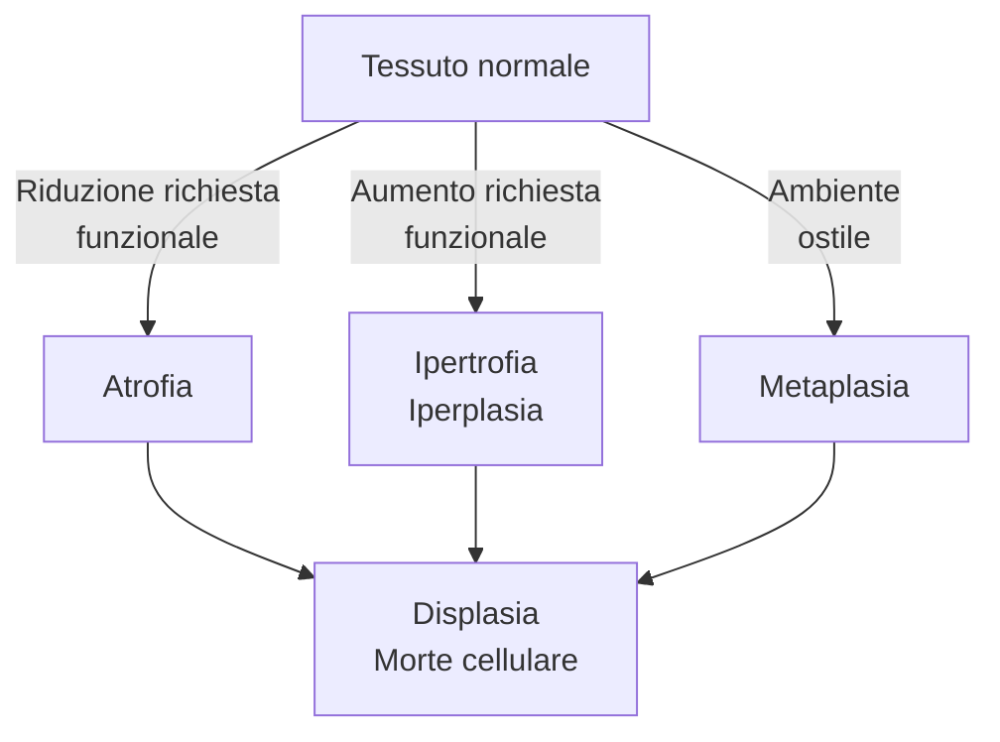
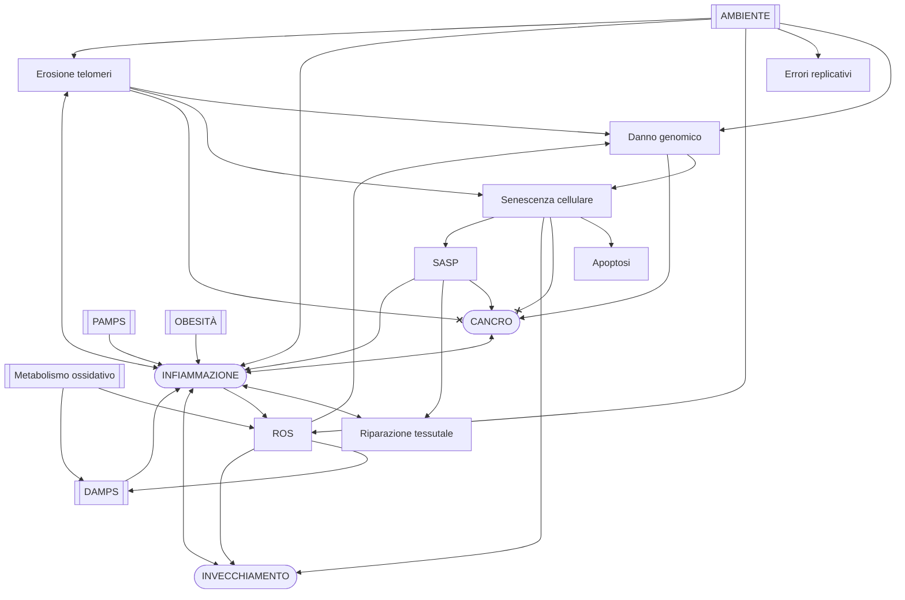

```{=html}
<!-- Nuova geometria per avere la copertina centrata -->
```
```{=tex}
\newgeometry{top=4cm, bottom=4cm, left=4cm, right=4cm}
```
```{=tex}
\title{Patologia e Fisiopatologia Generale (C.I.)}
\author{Emanuele Vicinelli}
\date{a.a. 2019/2020}
```
```{=tex}
\maketitle
```

------------------------------------------------------------------------

```{=tex}
\begin{figure}[H]
\vspace{2cm}
\centering
\includegraphics[width=8cm]{../head.pdf}
\end{figure}
```
```{=html}
<!-- Data in cui il pdf è stato compilato-->
```
```{=tex}
\thispagestyle{fancy}
\fancyhead{}
\fancyfoot{}
\renewcommand{\headrulewidth}{0pt}
\rfoot{\today}
```
```{=tex}
\restoregeometry
```
```{=tex}
\newpage
```
```{=tex}
\tableofcontents
```
```{=tex}
\newpage
```
```{=tex}
\listoffigures
```
```{=tex}
\newpage
```
```{=html}
<!-- L’esame sarà svolto dai due professori del corso e la prof.ssa Arciola sottolinea che le sue domande verteranno esclusivamente su ciò che è stato trattato a lezione. Durante la prova di laboratorio, è richiesta l’osservazione di un preparato e una sua successiva descrizione, con particolare attenzione agli aspetti patologici. Oltre al riconoscimento del vetrino, verranno effettuate domande inerenti ad uno dei sei argomenti del laboratorio. Per superare l’esame è necessaria la sufficienza in entrambe le parti e il voto finale sarà dato dalla media matematica del parziale di Patologia e Fisiopatologia Generale del Prof. Dall’Olio, quello della prof.ssa Arciola e quello della prova di laboratorio (prova suddivisa nelle due parti precedentemente descritte). -->
```
```{=html}
<!--
DALL'OLIO

Patologia cellulare ed extracellulare
    - Radicali liberi e ROX
    - Adattamenti cellulari
    - Morte cellulare
    - Degenerazioni cellulari ed extracellulari (steatosi, degenerazione vacuolare)
    - Patologie da accumulo
-->
```
```{=html}
<!-- Mon 05 Oct 2020 11:30:04 AM CEST -->
```
```{=tex}
\clearpage
```
```{=tex}
\part{Patologia cellulare ed extracellulare}
```
# Adattamenti cellulari e meccanismi di adattamento al danno

 

-   **Adattamenti cellulari**: processi che le cellule attuano per
    compensare stressor, ovvero stimoli che alterano il normale stato di
    omeostasi
    1.  Atrofia
    2.  Ipertrofia e iperplasia
    3.  Metaplasia[^1]
    4.  Manifestazioni di fallimento nell'adattamento
        1.  Displasia
        2.  Morte cellulare
            -   Apoptosi
            -   Necrosi



> **Displasia**\
> **Displasia** --- termine generico che indica tessuto che si sviluppa
> in modo anormale disorganizzato, a seguito di uno stressor al quale
> non *è stato* capace di far fronte.\
> **Non è un processo di compensazione**, quanto una delle
> manifestazioni di fallimento dell'adattamento allo stress.
> Tendenzialmente si ha **perdita dei meccanismi di regolazione e
> controllo** (nel differenziamento ± velocità di replicazione ±
> controllo nel numero ± altro) ⇒ displasia è di fatto l'*anticamera*
> della trasformazione neoplastica

> **Eziologie tipiche di danno cellulare**
>
> -   Eccessiva richiesta funzionale impossibile da soddisfare
> -   Insufficiente richiesta funzionale
> -   Stimolazione anormale
> -   Ipossia o ischemia
> -   Cause fisiche (temperatura, radiazioni, danno meccanico...)
> -   Cause chimiche
> -   Cause infettive
> -   Cause immunitarie
> -   Squilibri nutrizionali
> -   Alterazioni genetiche
> -   Neoplasie, che danneggiano le cellule sane circostanti

## Atrofia

-   **Atrofia** --- processo di riduzione di volume e funzionalità di un
    tessuto, a causa della riduzione del volume e/o del numero di
    cellule che compongono quel tessuto
-   Il processo di atrofia può conseguire sia da cause fisiologiche che
    patologiche
    -   Atrofia fisiologica
        -   Nello sviluppo fetale: non tutti gli organi vengono portati
            fino alla nascita (es: notocorda, vasi ombelicali)
        -   Atrofia del timo postadolescenziale
        -   Atrofia di tessuti dell'apparato riproduttivo femminile
            (endometrio, epitelio vaginale, ghiandola mammaria) dopo la
            menopausa per ridotta stimolazione da estrogeni
    -   Atrofia patologica
        -   **Ridotta attività funzionale da disuso**: esempio classico
            è l'arto immobilizzato per lungo tempo, che perde massa
            muscolare; o gli astronauti che perdono massa dopo lunghe
            permanenze nello spazio
        -   **Atrofia da ridotta perfusione**: atrofia conseguente ad un
            ridotto trofismo del tessuto (es classico atrofia a valle di
            una subocclusione di un'arteria)
        -   **Atrofia da carenza nutrizionale** (es: ***marasma***[^2] o
            ***kwashiorkor***[^3])
        -   **Atrofia da perdita di stimolazione endocrina**: tipica di
            tessuti che, per mantenere un corretto trofismo, necessitano
            di una continua stimolazione endocrina (es: mammella,
            apparato genitale)
        -   **Atrofia da compressione**: se una struttura cresce (eg
            tumore) e comprime i tessuti circostanti, questi possono
            atrofizzarsi
        -   **Osteoporosi** con il progredire dell'età

### Meccanismi alla base dell'atrofia

-   I meccanismi con cui si realizza l'atrofia sono essenzialmente 2
    1.  La **riduzione del volume delle cellule** si verifica o per
        autofagia (= autodigestione controllata) o per degradazione
        delle proteine intracellulari ad opera del proteasoma
    2.  La **riduzione del numero di cellule** avviene tramite morte
        cellulare programmata

#### Riduzione del volume delle cellule

##### Degradazione delle proteine cellulari (Unfolded Protein Response)

 

1.  Stress ⇒ accumulo di proteine mal-ripiegate
2.  C'è tentativo di adattamento: ↑ produzione di chaperonine (HSP) per
    ri-naturare le proteine mal ripiegate
3.  Se adattamento non efficace, si hanno 2 strade a seconda dell'entità
    del mancato adattamento
    -   Distruzione delle proteine mal ripiegate ⇒ perdita di volume
        della cellula ⇒ atrofia
    -   Innesco dell'apoptosi ⇒ ✝

##### Autofagia

-   **Autofagia** --- processo di autodigestione *controllato*: si
    formano vescicole che contengono componenti cellulari da
    eliminare[^4]

1.  Si assembla il complesso di inziazione e di nucleazione (tramite
    molecola `BECLIN-1`)
2.  Si forma quindi una membrana all'interno del citoplasma,
    inizialmente a forma di mezzaluna
3.  Grazie alle `ubiquitin-ligasi LC3` la membrana a mezzaluna completa
    la chiusura ⇒ si forma una vescicola ("**autofagosoma**")
4.  Nell'autofagosoma vengono inglobati, *con intenzione*[^5] diversi
    componenti cellulari, per recuperare i componenti di base (aa, acidi
    grassi...). A seconda di quali componenti cellulari vengono
    inglobati, distinguiamo
    -   Mitocondri → mitofagia (per eliminare mitocondri invecchiati che
        producono molti ROX)
    -   Aggregati proteici poliubiquitinati → aggrefagia
    -   Microorganismi patogeni → xenofagia
    -   Accumuli di grassi → lipofagia

#### Riduzione del numero di cellule

-   Per [apoptosi controllata (vedi)](#apoptosi)

## Ipertrofia ed iperplasia

-   Sono di fatto l'opposto dell'atrofia
    -   **Ipertrofia** --- ↑ volume delle cellule (tipico di tessuti
        perenni [secondo Bizzozzero](#rigenerazione))
        -   In realtà *ricerche*[^6] dimostrano che è possibile indurre
            rigenerazione in tessuti perenni
    -   **Iperplasia** --- ↑ numero di cellule (tipico di tessuti labili
        o stabili [secondo Bizzozzero](#rigenerazione))
        -   Iperplasia può essere un *preludio* a trasformazione
            neoplastica, in quanto, di fatto, è una situazione in cui si
            ha un grande tasso replicativo di un certo tessuto (sebbene
            si mantenga il differenziamento)

### Ipertrofie fisiologiche

1.  Ipertrofia da aumentata richiesta funzionale
    -   Es: muscolo scheletrico in continuo esercizio → ↑ volume fibre
        muscolari
    -   Ipertrofia del rene per asportazione del rene controlaterale
        `\marginnote{In realtà questo è un caso misto: in caso di asportazione, il rene rimasto aumenta sia per ipertrofia che per iperplasia (↑ lunghezza dei tubuli, ma non aumenta il numero di nefroni)}`{=tex}
2.  Ipertrofia da variazione dei livelli ormonali
    -   Ipertrofia degli organi sessuali secondari durante pubertà
    -   Ipertrofia (+iperplasia) della ghiandola mammaria durante
        gravidanza e allattamento (per ↑ estrogeni)

### Ipertrofie patologiche

1.  Ipertrofia *patologica* da aumentata richiesta funzionale
    -   Es: cardiomiopatia ipertrofica secondaria a ipertensione di
        lunga data
2.  Ipertrofia *patologica* da squilibrio endocrino in tessuti
    ormone-sensibili
    -   Endometrio femminile
    -   Prostata
    -   Gozzo tiroideo da carenza di iodio (compensata con ↑ TSH)
    -   Ipertrofia della corteccia surrenalica da ↑ ACTH
        (***iperaldosteronismo***, ***morbo di Cushing***)

### Iperplasie fisiologiche

1.  Iperplasia da stimoli ormonali fisiologici
    -   Epitelio mammario durante pubertà e gravidanza
    -   Muscolatura uterina durante gravidanza
    -   Sintesi di eritrociti da ipossia (ipossia ⇒ ↑ eritropoietina)
2.  Iperplasia compensatoria
    -   Iperplasia in risposta ad epatectomia parziale
    -   Iperplasia dopo nefrectomia monolaterale (si determina sia
        iperplasia, tramite allungamento dei tubuli; che ipertrofia dei
        glomeruli per compensare la capacità di filtrazione che si è
        persa)
    -   Iperplasia dello strato corneo della cute in risposta a stress
        meccanici ripetuti (i calli, per intenderci)

### Iperplasie patologiche

> **Iperplasia patologica, metaplasia e neoplasie**\
> Entrambe *non* sono manifestazioni neoplastiche, ma ne possono essere
> il preludio:
>
> -   Iperplasia patologica → Se la fase della crescita massiva è già in
>     essere, manca solo la perdita del controllo (±
>     de-differenziamento) per rendere l'iperplasia patologica una
>     neoplasia
> -   Metaplasia → gli elementi staminali di un certo tessuto che
>     cambiano programmazione e si differenziano verso un tipo di
>     tessuto differente. Manca la proliferazione incontrollata per
>     rendere la metaplasia una neoplasia

1.  Iperplasia da stimoli ormonali patologici
    -   Iperplasia adenomatosa dell'endometrio: nel periodo
        perimenopausale si può verificare, per squilibrio ormonale,
        ipertrofia dell'endometrio che produce sanguinamenti
    -   Ipertrofia prostatica benigna, per squilibri nella sintesi di
        testosterone
2.  Stimolazione iperplastica da fattori di crescita
    -   Leucocitosi (↑ neutrofili) in risposta ad una infezione[^7]
    -   Iperplasie del midollo osseo
        -   ***Morbo di Cooley*** (una forma di β-talassemia major):
            **assente o ridotta sintesi delle catene β dell'Hb** →
            anemia → stimolazione dell'eritropoiesi (grazie a `HIF`[^8]
            e `eritropoietina` → iperplasia del midollo per far fronte a
            questa richiesta → deformità ossee per aumentato volume del
            midollo
    -   Verruche da *Papilloma virus* (il Papilloma immortalizza le
        cellule)
    -   [Cheloidi](#aspetti-patologici-della-riparazione) (iperplasia
        connettivale durante la guarigione aberrante di una ferita)

## Metaplasia

-   **Metaplasia** --- sostituzione di un tessuto *già differenziato*
    con un altro tessuto *differenziato*

 

-   Esempi classici di metaplasia
    1.  Metaplasia nelle vie aeree di un sg. fumatore
        -   Metaplasia in risposta a continua irritazione da agenti
            chimici + stress meccanico del particolato sottile sospeso
        -   È metaplasia pavimentosa: epitelio cilindrico
            monostratificato → epitelio squamoso pluristratificato
    2.  Calcoli nel coledoco o colecisti
        -   Calcoli ⇒ irritazione (meccanica) ⇒ danno cellulare
        -   Metaplasia pavimentosa: epitelio cilindrico monostratificato
            → epitelio squamoso pluristratificato
    3.  Esofago di Barrett
        -   Reflusso gastrico → risalita di succhi gastrici in esofago ⇒
            danno da ustione chimica
        -   Epitelio pavimentoso pluristratificato della mucosa esofagea
            → epitelio cilindrico monostratificato (simile a

## Morte cellulare

-   Insieme a displasia, rappresenta il fallimento nell'adattarsi al
    danno `\marginfig{apoptosivsnecrosi}`{=tex}
    1.  Morte per necrosi: morte *disordinata*, che produce
        *infiammazione*[^9]
    2.  Morte per apoptosi: morte *ordinata*, che produce la *minima
        quantità di infiammazione*[^10]
    3.  Morti cellulari "particolari"
        -   Anoikis
        -   ENTosi
-   Perché fallisca l'adattamento e la cellula muoia, si deve verificare
    un **danno irrecuperabile**. L'idea di "irrecuperabilità" è data
    dalla combinazione di **intensità** e **durata**
    -   Un danno è permanente per *grande intensità* dello stimolo
        lesivo
    -   Un danno è permanente per il *perdurare* dello stimolo lesivo


> **Necrosi regolata**\
> L'apoptosi è una morte regolata, tuttavia anche alcune forme di
> *necrosi* possono essere regolate. La differenza risiede nella pulizia
> della morte
>
> -   Apoptosi: morte pulita, condotta cercando di minimizzare
>     l'infiammazione. È per sua natura un processo *regolato*, perché
>     sono necessarie operazioni in sequenza appropriata per minimizzare
>     la produzione di DAMPS
> -   Necrosi: morte sporca, condotta senza preoccuparsi dei DAMPS
>     prodotti dalla morte cellulare ⇒ infiammazione, a volte anche
>     attivamente ricercata
>
> La programmazione o meno della morte è un concetto che prescinde dalla
> strategia usata per morire: esistono, infatti, anche casi di **necrosi
> programmata**:
>
> -   Necroptosi --- Anche "apoptosi caspasi-indipendente", è una morte
>     al confine tra necrosi e apoptosi, passa tramite la costruizone di
>     un complesso detto *necrosoma*. Le cause possono essere le stesse
>     dell'apoptosi, rappresentando di fatto un processo che con
>     l'apoptosi può essere in diretta competizione
> -   Mithocondrial Pore Transition (MPT) regulated necrosis --- Necrosi
>     ottenuta mediante porazione intenzionale della membrana
>     mitocondriale, che prota alla dissipazione della ddp lì
>     accumulata, con conseguente deplezione delle riserve di ATP
> -   Parthanatos --- morte cellulare causata da una eccessivo consumo
>     richiesta di NAD+. Questo succede solamente quando si evidenziano
>     danni al DNA talmente estesi che i meccanismi di riparazione
>     (*BER* in primis) non riescono a riparare
>     `\oldfootnote{BER usa il macchinario molecolare della \texttt{PARP1} per riparare i danni, la quale è estremamente esosa di NAD+}`{=tex}
> -   Piroptosi --- Morte *estremamente* infiammatoria. Usa la
>     caspasi-1, e produce una quantità di DAMP e PAMP molto elevata
> -   Ferroptosi --- Causata da un eccesso di danno ossidativo, da
>     perossidazione dei lipidi di membrana. Meccanismo che richiede lo
>     ione ferro per procedere

### Meccanismi generali con i quali si esplica qualsiasi tipo di morte cellulare


-   A prescindere dalla modalità con cui la cellula muore, la morte
    viene raggiunta per 3 tipologie di danno, quando queste diventano
    irreversibili
    1.  ⭐️ Deplezione di ATP[^11] (crisi energetica)
        -   ⇒ Switch a glicolisi anaerobia ⇒ formazione di lattati ⇒ ↓
            pH intracellulare ⇒ **addensamento della cromatina** e
            **denaturazione delle proteine**
        -   ⇒ ??? ⇒ distacco dei ribosomi ⇒ ↓ sintesi proteica ⇒ ??? ⇒
            **deposizione dei lipidi intracellulari** e formazione delle
            *figure di mielina*[^12]
        -   ⇒ La pompa ATPasica Na^+^/K^+^ non funziona ⇒ uscita di
            K^+^, ingresso di Na^++^ ⇒ ingresso netto di acqua ⇒
            **rigonfiamento della cellula** (*oncosi*) e formazione dei
            *"bleb"* di membrana ⇒
            -   Rilascio di enzimi cellulari in circolo
            -   Degenerazione vacuolare della cellula (la cellula si
                rigonfia e ha morfologia simile a quella dei vacuoli)
        -   ⇒ Le pompe ATPasiche che, contro gradiente, devono mantenere
            il Ca^++^ intracellulare confinato in mitocondri e RE non
            funzionano più ⇒ ↑ Ca^++^ citosolico
    2.  Perdita di omeostasi del Ca^++^
        -   ↓ ATP ⇒ stop pompe ATPasiche ⇒ fuoriuscita del Ca^++^ da
            mitocondri + RE ⇒ ↑ Ca^++^ citosolico
        -   ↑ \[Ca^++^\] ⇒ attivazione di enzimi Ca^++^-dipendenti:
            ATPasi, fosfolipasi, proteasi, endonucleasi ⇒ un gran
            casino, viene degradata ogni cosa: ATP, membrane, proteine
            del citoscheletro, cromatina...
    3.  Danno mitocondriale ⇒ porazione della membrana mitocondriale
        `\marginnote{\textbf{Il tipo di pori che si vengono a creare nei mitocondri è essenziale nel decidere se succederà apoptosi o necrosi}, in quanto entrambi i fenomeni passano per la porazione della membrana mitocondriale}`{=tex}
        -   Porazione effettiva della membrana (formazione di MPTP[^13])
            -   ⇒ perdita della *ddp* transmembrana che è essenziale per
                stoccare l'energia per produrre ATP[^14] ⇒ **inabilità a
                produrre ATP**
        -   Apertura di pori preformati, la cui apertura è controllata
            dalle molecole `Bax`/`Bak` e `BCL2`
            -   ⇒ fuoriuscita del **citocromo C** ⇒ inizio della via
                apoptotica ([pathway intrinseco](#pathway-intrinseco))

### Necrosi

-   Distinguiamo classicamente 5 tipi di necrosi
    1.  **Necrosi coagulativa** (*"a stampo"*) --- il tessuto preserva
        la propria compattezza e l'impronta del tessuto di origine[^15]
    2.  **Necrosi colliquativa** --- il tessuto necrotico si liquefa,
        grazie al contributo della degranulazione dei neutrofili[^16]
    3.  **Necrosi caseosa** --- si arriva alla produzione di una
        sostanza bianca, poltacea, compatta; si preserva la compattezza
        ma non la forma
    4.  **Necrosi gangrenosa** --- necrosi + sovrapposizione batterica
        che porta a putrefazione[^17]
    5.  **Steatonecrosi** --- necrosi per saponificazione dei
        grassi[^18]

#### Necrosi coagulativa

-   Tipica di tessuti infartuati che possono eseguire switch verso
    metabolismo anaerobico[^19]. L'acidificazione del citoplasma attiva
    le idrolasi acide e si ha necrosi a stampo
    0.  Ischemia ⇒ **switch a metabolismo anaerobio**
    1.  Accumulo di lattati ⇒ ↓ pH
    2.  Denaturazione delle proteine, comprese le **idrolasi acide
        lisosomiali**
        -   Blocco del metabolismo
        -   Denaturazione dell'ultrastruttura del nucleo
    3.  Picnosi → carioressi → cariolisi, mentre il resto della cellula
        rimane "cristallizzato" nella conformazione in cui si trova
-   Per rimozione del tessuto (per fagocitosi) necessari alcuni giorni.
    RaI/riparazione dipendente da tipologia di tessuto (labile o stabile
    vs perenne)
-   Aspetti morfologici per riconoscerla
    1.  Conservazione dell'architettura microscopica *MA mancanza di
        nuclei*
    2.  Eventualmente rilevabile infiltrazione leucocitaria (neutrofili)

#### Necrosi colliquativa

-   Conseguente a danno di membrana + attivazione degli enzimi litici ⇒
    **autolisi della cellula**. Eziologia alternativa: danno da
    degranulazione dei neutrofili
    1.  ↑ \[Ca^++^\] citoplasmatico
    2.  Attivazioni degli enzimi litici
    3.  Danno delle membrane e morte cellulare
-   Aspetti morfologici per riconoscerla
    1.  Architettura del tessuto difficilmente distinguibile, tutto
        liquefatto
    2.  Possibili neutrofili

#### Necrosi caseosa

-   Necrosi caseosa = necrosi coagulativa + necrosi colliquativa
-   Al processo misto, sia coagulativo che colliquativo, si aggiungono 3
    elementi, che rendono la materia necrotica di consistenza poltacea
    -   Sclerosi (formazione di fibre)
    -   Calcificazione
    -   Formazione di caverne (cavità che si generano per espulsione di
        contenuto)
-   Tipico: noduli di TBC polmonare

#### Necrosi gangrenosa

-   Per crescita batterica su tessuto, che ne provoca la necrosi e la
    putrefazione
-   3 forme, in base alla causa della necrosi
    1.  Secca: necrosi coagulativa (+ crescita batterica)
    2.  Umida: necrosi colliquativa (+ crescita batterica)
    3.  Gassosa: necrosi per produzione di gas dalla flora batterica che
        sta colonizzando (tipicamente *Clostridi*)

#### Steatonecrosi

-   Tipica del pancreas, poiché sono necessari gli enzimi pancreatici
    per saponificare i grassi
    0.  Danno cellulare ⇒ rilascio degli enzimi pancreatici (lipasi) e
        Ca^++^ che era intracellulare
    1.  Le lipasi scindono acidi grassi
    2.  Il gruppo -COOH degli acidi grassi si lega al Ca^++^ liberato
        dal danno cellulare ⇒ **saponificazione degli acidi grassi**

#### Morfologia al MO della necrosi

-   Aspetto principale: modificazioni progressive del nucleo (picnosi →
    cariolisi → carioressi)[^20]
    1.  Picnosi: nucleo piccolo, addensato, molto basofilo
    2.  Carioressi: il nucleo picnotico si frammenta
    3.  Cariolisi: i frammenti nucleari scompaiono

#### Conseguenze della necrosi

-   Locali
    -   Infiammazione
    -   Rigenerazione (se cellule necrotiche sono labili o stabili) →
        morfologia conservata, funzione conservata (*restitutio ad
        integrum*, RaI)
    -   Riparazione (se cellule necrotiche sono perenni) → morfologia
        conservata, perdita di funzione
-   Sistemiche
    -   Fuoriuscita di enzimi cellulari[^21]
    -   Fuoriuscita di DAMPs ⇒ infiammazione anche sistemiche

### Apoptosi

-   Morte cellulare *pulita* (portata avanti in maniera da minimizzare
    l'infiammazione)
-   Cause molto varie (il confine tra quali cause sono fisiologiche e
    quali sono patologiche è come al solito molto sottile ed
    estremamente dipendente dal contesto[^22])
    -   Perdita della stimolazione continua di GF necessari alla
        sopravvivenza
    -   Determinazione di un equilibrio che, tra fattori di
        sopravvivenza e di morte, fanno vincere i secondi a scapito dei
        primi (situazione tipica di alcuni citotipi, eg linfociti in
        maturazione)
    -   Apoptosi per fallimento delle pathway cellulari di riparazione
        dal danno
    -   Attivazione esterna da TNF, FAS, garanzima B
    -   ...
-   2 vie per l'esecuzione dell'apoptosi, a seconda di *dove si origini
    l'impulso apoptotico*
    1.  [**Via intrinseca**](#pathway-intrinseco) --- l'impulso
        apoptotico proviene *dall'interno* della cellula, tramite il
        rilascio dei citocromi C da parte dei mitocondri
    2.  [**Via estrinseca**](#pathway-estrinseco) --- l'impulso
        apoptotico proviene *da fuori* la cellula, tramite legame con
        recettori di membrana

> **Frammentazione del DNA nell'apoptosi e nella necrosi: differenze
> osservabili all'elettroforesi del materiale genetico**
> `\label{boxelettroforesi}`{=tex}\
> Nell'apoptosi la frammentazione del DNA è *regolare*, in quanto è
> eseguita da endonucleasi apposite che tagliano in maniera specifica e
> regolare il DNA, in appositi siti di taglio (si vedono picchi
> elettroforetici discreti, se si fa l'elettroforesi del materiale
> genetico della cellula morta per apoptosi)\
> Nella necrosi il DNA viene degradato e spezzettato in modo irregolare,
> in quanto il taglio viene svolto dalle endonucleasi attivate che
> tagliano il genoma in maniera aspecifica (si vede un *continuum*
> all'elettroforesi, se si fa l'elettroforesi del materiale genetico
> della cellula morta per necrosi)

#### Pathways per l'esecuzione dell'apoptosi

 

-   Ci sono 2 vie, estrinseca ed intrinseca, per l'*attivazione*
    dell'apoptosi: entrambe convergono verso l'attivazione delle
    **caspasi esecutrici**. Da lì, l'apoptosi prosegue in modo unico
    1.  Per via estrinseca o intrinseca viene attivata l'apoptosi
    2.  Vengono percorse le vie intracellulari per l'attivazione delle
        **caspasi esecutrici**
    3.  Le caspasi esecutrici smantellano proteine e l'intera
        architettura cellulare
        -   Viene tagliata e smantellata l'intera struttura cellulare ⇒
            formazione di vescicole (`\a{corpi apoptotici}`{=tex}) che
            contengono residui della cellula
        -   Viene flippata verso l'esterno i residui di
            **fosfatidilserina** di membrana: questo marca i
            `\a{corpi apoptotici}`{=tex} che si stanno formando per la
            fagocitosi, minimizzando così la quantità di DAMPs prodotti.
            I macrofagi, quindi, se li pappano liberamente e senza
            troppo casino[^23]
        -   Viene tagliato -- e quindi perde funzione -- l'inibitore di
            una DNAsi tipica del processo apoptotico, che è quindi
            libera di smantellare il materiale genetico in maniera
            specifica, producendo la tipica regolarità in termini di
            lunghezza (vedi box pagina
            `\pageref{boxelettroforesi}`{=tex})
    4.  Si formano vescicole (*"corpi apoptotici"*) con appositi ligandi
        per i fagociti
    5.  I fagociti si sbarazzano dei corpi apoptotici

##### Pathway estrinseco

0.  Legame tra i fattori extracellulari (`TNF` e `FasL`[^24], ma anche
    il `Garanzima B`[^25]) e i recettori di membrana. Il legame porta i
    recettori a trimerizzare[^26]
1.  Recettori trimerici legano il `FADD`, una molecola adattatrice che
    trasduce il segnale
2.  FADD, con la sua **attività autocatalitica**, dà inizio alla
    **cascata delle caspasi**[^27]
    1.  Si reclutano le **caspasi iniziatrici**, che attivano il
        meccanismo apoptotico (caspasi-2, **-8** (⭐️), -9, -10)
    2.  Le caspasi iniziatrici reclutano le **caspasi esecutrici**, che
        effettivamente demoliscono l'architettura cellulare (caspasi-3,
        -6, -7)
3.  L'apoptosi procede per via comune (vedi sopra)

##### Pathway intrinseco

0.  In condizioni normali l'apoptosi è *impedita* da molecole[^28] che
    **chiudono i pori normalmente presenti nella parete mitocondriale**,
    impedendo l'uscita dei citocromi
1.  In caso eventi pro-apoptotici (mancanza di segnali di sopravvivenza,
    danno irrecuperabile al genoma...) si attiva una classe di molecole
    **`BH3-only`** (*"sensori del danno"*), che mediano l'apertura dei
    pori mitocondriali
2.  Pori mitocondriali aperti ⇒ fuoriuscita del `CytC`, che è *potente*
    stimolatore pro-apoptotico
3.  Ulteriore checkpoint: **perché l'apoptosi prosegua, è necessario che
    gli stimoli pro-apoptotici \> stimoli anti-apoptotici**
    `\marginnote{Questo è il consueto concetto di "bilancia molecolare": da una parte ci sono i fattori pro-apoptotici che spingono per fare andare la cellula in apoptosi; dall'altra ci sono i fattori anti-apoptotici che spingono per fare sopravvivere la cellula -- quello che succederà realmente dipende da chi vince a questo "braccio di ferro molecolare"}`{=tex}
    -   Fattori *pro-apoptotici* (**AIFs**, Apoptosis Inducing Factors)
        -   Inibitori dei fattori anti-apoptotici (es: `SMAC-DIABLO`)
        -   Citocromo C
    -   Fattori *anti-apoptotici* (**IAPs**, Inhibitors of ApoPtosis)
        -   Inibitori delle caspasi
4.  Se fattori pro-apoptotici \> fattori anti-apoptotici: si ha
    commitment verso apoptosi, con la **formazione dell'apoptosoma**
    -   Apoptosoma è complesso eptamerico formato da 7 dimeri di
        APAF-1 + CytC
5.  Apoptosoma attiva le caspasi iniziatrici (particolarmente la
    caspasi-9)
6.  Le caspasi iniziatrici attivano le caspasi effettrici
7.  L'apoptosi procede per via comune (vedi sopra)

### Tipi particolari di morte cellulare

#### Anoikis

-   **Anoikis** (*"essere senza casa"*) --- apoptosi indotta dalla
    mancata adesione ad un substrato solido
    -   Tipica dei tessuti solidi
    -   Anche le cellule tumorali sono solitamente sensibili
        all'anoikis, salvo tumori molto avanzati/maligni
-   Anoikis viene evitata, da cellule normalmente adese alla ECM,
    tramite la mediazione dell'**actina**, che in conformazione stirata
    permette la migrazione nel nucleo dei fattori di trascrizione
    YAP/TAZ
    -   Se la cellula è adesa, le integrine sono collegate all'ECM ⇒
        **l'actina citoscheletrica** (legata alle integrine) è **in
        conformazione stirata**
        1.  **L'actina in forma stirata cattura l'*inibitore* del dimero
            YAP/TAZ**, che è quindi parcheggiato lì e non fa niente
        2.  Il dimero YAP/TAZ, comunemente nel citoplasma, è libero di
            migrare nel nucleo e avviare la via di segnalazione
            intracellulare (**via HIPPO**) che porta al differenziamento
            e alla proliferazione
    -   **Se la cellula non è adesa ⇒ actina citoscheletrica è in
        conformazione rilassata**
        1.  L'actina non lega più l'inibitore di YAP/TAZ
        2.  L'inibitore sequestra il dimero YAP/TAZ, che rimane nel
            citoplasma
        3.  La mancanza di attivazione della via HIPPO porta
            all'apoptosi

> **Ruolo della compattezza dell'ECM e sua influenza nelle dinamiche di
> vita e differenziamento cellulare** --- Una ECM compatta, a differenza
> di una ECM lasca, impone una forza differente sulla cellula, a tutti
> gli effetti *stirando* l'impalcatura cellulare. Con meccanismi
> analoghi a quello YAP/TAZ questo determina un differente stimolo che
> porta la cellula a differenziarsi in modalità differente
>
> 
>
> 1.  Cellule epiteliali seminate su matrice morbida → struttura cava
> 2.  Cellule epiteliali seminate su matrice compatta → struttura piena
> 3.  Cellule epiteliali seminate su matrice *molto* compatta → capacità
>     migrante! ⚠️
>
> In aggiunta, sempre con meccanismi di sensibilità alla forma mediati
> dal livello di tensione del citoscheletro, si osserva una diversa
> potenzialità differenziativa a seconda che tipi di cellule diverse,
> per varia ragione, siano adese al substrato con una superficie più o
> meno grande (perché la superficie di adesione influenza la forma della
> cellula nel suo complesso, trasferendo le forze grazie al
> citoscheletro)
>
> \
> Metodi di coltura cellulare su ECM progressivamente più soffici
> permettono di capire il grado di malignità di una cellula: è tanto
> maggiore quanto più la cellula riesce a sopravvivere e differenziarsi
> in matrici progressivamente più lasche

#### Entosi

-   **Entosi** --- Processo per il quale una cellula (detta *guest*)
    viene inglobata in un'altra cellula (detta *host*) senza venire
    digerita, per sfuggire ad un ambiente sfavorevole
    -   Possibile entosi in serie, tipo matrioska di cellule
-   Il destino dell'host è differente a seconda delle circostanze
    -   Morte dell'host dentro il guest
    -   Uscire dopo un certo periodo, quando le condizioni dell'ambiente
        sono mutate
    -   Permanere nell'host, portando frequentissimamente ad aneuploidia
        -- con danni genomici del caso
    -   Duplicarsi all'interno dell'host

```{=html}
<!-- lun 26 ott 2020, 12:06:44, CET -->
```
# Patologie da accumuli extracellulari

## Calcificazioni

-   Depositi di **idrossiapatite**[^29]
-   Perché ci sia deposizione si deve avere una combo di 2 fattori
    -   Eventuale esposizione di centri nucleatori (ioni o strutture
        compatibili con ioni) che incoraggiano la formazione del
        reticolato cristallino
    -   Aumento (se non sistemico, quantomeno localizzato) di Ca e P~i~
        (\~ 60--70 mg/dl), che normalmente si trova ad un livello
        subcritico
        `\marginnote{Non sufficiente, in condizioni standard, per formare depositi di calcio così, alla boia. L'unico punto in cui questa deposizione a queste concentrazioni viene permesso è l'ambiente, molto particolare e controllato, dell'osso}`{=tex}
-   2 tipi di calcificazioni patologiche: distrofiche e metastatiche
    -   **Calcificazione distrofica** --- calcificazione di tessuti
        morti o danneggiati. Necessita di centri nucleatori
        -   Es: calcificazione in nodulo di TBC polmonare
        -   Es: calcificazione in placca ateromasica
    -   **Calcificazione metstatica** --- depositi secondari a
        ipercalcemia che si verifica in tessuti sani, caratterizzati da
        pH lievemente alcalino (ovvero dove c'è poca CO~2~)
        -   Es: calcificazione nella tonaca media di una grande arteria
            in sg. ipercalcemico, dove ci sono ↑ pO~2~

### Calcificazioni distrofiche

-   Calcificazione in ambiente necrotico o in via di degenerazione
-   Procedimento di accumulo del deposito distrofico in 2 fasi
    1.  **Nucleazione**: eventuali ioni di Ca^+^ o PO~4~^-^, che si
        trovano in ambiente favorevole[^30], fungono da centri di
        nucleazione per nuovo calcio o fosfato, che si monta accanto,
        legandosi
        -   Ambiente: se non sono già presenti ioni di fosfato e calcio,
            basta anche che ci sia un tessuto con strutture
            relativamente compatibili con gli ioni stessi che possono
            fornire una buona base per la nucleazione pur non
            essendoioni (fibre elastiche, fosfolipidi, collagene,
            tessuti con matrice digerita, **una preesistente colonia
            batterica**[^31]). Successivamente saranno gli ioni stessi a
            fornire la base per la nucleazione di altri ioni → fenomeno
            di **eptassia**
    2.  **Propagazione**: altri atomi sono incoraggiati a depositarsi su
        questa struttura, producendo una struttura regolare, geometrica
        e tridimensionale tipica della deposizione cristallina

### Calcificazioni metastatiche

-   Calcificazione secondaria ad una ipercalcemia in distretti con pH
    (relativamente) alcalino
    `\marginnote{Primi esempi che devono venire in mente: intima dei grandi vasi (grosse arterie, vene polmonari...), reni, polmoni, cornea}`{=tex}
-   Eziologie per ipercalcemia
    -   ↑ produzione di PTH
        -   Primario per iperplasia/tumore delle paratiroidi
        -   Secondario per secrezione da tumori secernenti PTH (o
            sostanze PTH-like)
        -   In risposta a ritenzione di fosforo per insufficienza renale
    -   Distruzione di tessuto osseo per processi patologici[^32]
    -   Eccesso di vitamina D
    -   Idiopatica

## Amiloidosi

-   **Amiloidosi** --- condizione tipica di un gruppo disparato di
    patologie che porta a **deposizione** (locale o sistemica in più
    foci) **di materiale proteico insolubile nei tessuti**

```{=tex}
\normalbox{Colorazioni per evidenziare al MO i depositi proteici}{
\begin{itemize}
\tightlist
\item \goldstandard \textbf{Rosso Congo}: se vetrino colorato con RC viene visto illuminato da luce polarizzata, i depositi proteici cambiano colore (fenomeno della \emph{birifrangenza}), altrimenti colorazione appare rosata
\item \textbf{Coloranti basici} (cristal-violetto, blu di metilene): i depositi proteici evienziano metacromasia\oldfootnote{Coloranti a dominante blu, però nelle zone dove c’è sostanza amiloide il tessuto assume colorazione color ciclamino}. Seconda scelta, ma tutti i nostri preparati saranno colorati in questo modo
\item Basate sullo iodio: i depositi vengono colorati in blu, proprio come succede con i polisaccaridi. Questa scelta di colorazione fu alla base dell'equivoco che aveva portato i patologi di fine '800 a definire i depositi proteici come ``amiloidi'' (= fatti di amido)
\end{itemize}
}
```
-   Il materiale proteico (*"amiloide"*) che si accumula nell'amiloidosi
    è così composto
    -   **Proteina amiloide** (95%) --- materiale proteico ripiegato a
        β-foglietto, derivato a sua volta da altre proteine che, per
        svariati motivi, si cambiano il loro ripiegamento verso il
        β-foglietto, condensano e si depositano
    -   **Componente P** (o SAP, Serum Amyloid Protein) --- proteina
        prodotta dal fegato durante infiammazione in fase acuta
    -   **Componenti minori**
        -   GAG (acido ialuronico, conditrin-solfato...)
        -   Apolipoproteina E
-   Conseguenze del deposito: dipendenti dal tessuto
    -   Conseguenze generali
        -   ↑ difficotà degli scambi tra capillari e tessuti ⇒ possibili
            alterazioni del trofismo
        -   Parziale o totale sostituzione del tessuto con aggregati
            amiloidi
    -   Conseguenze tessuto-specifiche
        -   Tratto GI → disturbi di motilità, malassorbimenti
        -   Rene → proteinuria, IR, uremia
        -   Cuore → aritmie, scompenso congestizio
        -   SN → polineuropatie, Alzheimer
        -   Altri tessuti → disturbi specifici (es, lingua: disturbi
            della fonazione)

### La proteina amiloide

-   Origine della proteina amiloide: **materiale proteico erroneamente
    ripiegato a β-foglietto**. Si creano aggregati proteici molto
    stabili (ad uno stato energetico molto basso) difficilissimi da
    eliminare

 

-   *A seconda di quale materiale proteico dà origine alla proteine
    amiloide* distinguiamo diverse amiloidosi
    1.  **Amiloidosi leggera**, o *primaria*
        -   Si depositano: derivati delle catene leggere degli anticorpi
        -   Causa: Solitamente secondaria a discrasia (= crescita
            alterata) delle plasmacellule o lfc B
            -   Discrasia di cellule producenti anticorpi ⇒ eccesso di
                catene leggere rispetto a catene pesanti ⇒ accumulo
            -   Possibile che accumulo non porti necessariamente a
                deposito[^33], ma ad ↑ escrezione delle catene leggere
                mal ripiegate nelle urine (⇒ proteinuria con "*proteine
                di Bence-Jones*")
    2.  **Amiloidosi A**
        -   Si depositano: derivati di frammenti di proteina `SAA`
            (Serum Amyloid protein A), una proteina dell'infiammazione
            acuta prodotta dal fegato
        -   Causa: particolari infiammazioni (TBC, linfoma di Hodgkin,
            infiammazione intestinale, uso parenterale di droghe...)
            protratte nel tempo
            -   Infiammazione protratta ⇒ continua stimolazione epatica
                ⇒ ↑ SAA
            -   I macrofagi tagliano la SAA e producono frammenti
            -   Un frammento particolare di SAA (76 aa.) ha capacità
                amiloidogena: si ripiega a β-foglietto e può accumularsi
    3.  **Amiloidosi associata ad emolisi**
        -   Si depositano: derivati di β2-microglobulina
        -   Causa: mancata filtrazione di β2-microglobulina (una
            componente dell'MHC1) durante emodialisi. Materia amiloide
            si deposita nel `\a{tunnel carpale}`{=tex} (non si sa perché
            proprio lì)
    4.  **Amiloidosi endocrina**
        -   Si depositano: derivati di proteine il cui accumulo è
            favorito da un qualche tipo di disregolazione endocrina
            -   Accumulo di calcitonina in tumori tiroidei
            -   Accumulo di `amilina` nelle cellule β del pancreas solo
                ed esclusivamente nel T2DM (non chiaro come mai,
                verosimilmente perché in questo quadro patologico
                amilina viene glicata)
    5.  Forme ereditarie di amiloidosi
        -   Si depositano: derivati di proteine mutate, la cui mutazione
            è secondaria ad anomalie genetiche ereditarie
            -   Accumulo di derivati di `transtiretina`[^34] (per
                mutazioni puntiformi che le danno capacità
                amiloidogenica)
    6.  **Amiloidosi sistematica senile**
        -   Si depositano: derivati di proteine che, intrinsecamente,
            hanno una capacità amiloidogena (= proteine per le quali è
            più facile che si possa alterare il loro ripiegamento in
            senso di β-foglietto)
            -   Transtiretina (evidentemente la transtiretina ha
                capacità amiloidogenica di per sè)

### Un esempio particolare di amiloidosi: la malattia di Alzheimer

-   Amiloidosi localizzata nell'encefalo, caratterizzata da 2 reperti
    caratteristici: le **placche senili** (vera deposizione amiloide) e
    gli **ammassi neurofibrillari**
    -   **Placche senili** --- deposizione in forma amiloide di un
        frammento del `peptide A-β`
    -   **Accumuli neurofibrillari** --- fasci di filamenti elicoidali
        accoppiati nel citoplasma dei neuroni, che dislocano o avvolgono
        il nucleo. Costituiscono, verosimilmente, il culmine di svariati
        processi patologici che interessano il neurone. L'accoppiamento
        dei filamenti elicoidali è causato da una iper-fosforilazione
        della `proteina τ`
-   Alterazioni (placche senili + accumuli neurofibrillari) ⇒ **perdita
    progressiva delle funzioni cerebrali superiori**[^35]
    -   Progressiva perdita di memoria
    -   Alterazioni del comportamento
    -   Alterazioni emotive
    -   (Progressivo isolamento dai propri cari ⇒ loop di perdita di
        funzioni comportamentali ed emotive)

#### Patogenesi

-   Ci sono 2 elementi concomitanti che contribuiscono alla patogenesi:
    le placche senili e gli ammassi neurofibrillari
-   Punto comune: le modificazioni alterano il microambiente neuronale e
    anche le dinamiche interne del neurone, portando a perdita di
    funzione

##### Patogenesi della formazione delle placche senili

 

0.  I neuroni esprimono la **proteina di membrana APP** (Amyloid
    Precursor Protein)
1.  La proteina APP è soggetta al taglio da parte di 3 enzimi (α-, β- e
    γ- *secretasi*). I 3 enzimi la tagliano in posizione differente, e a
    seconda della combinazione di quali enzimi producono il taglio
    avremo 2 vie distinte
    -   **Via non patogenica**: taglio di APP da parte della
        **α-secretasi e γ-secretasi** ⇒ formazione di un residui
        proteico di dimensioni ridotte (`peptide p3`)
    -   **Via patogenica**: taglio di APP da parte di **β-secreatasi +
        γ-secreatasi** ⇒ formazione di un residuo proteico di 40 o 42
        aa. (`peptide Aβ`) *estremamente* amiloidogenico e prono al
        deposito[^36]
2.  **Se prevale abbondantemente l'azione della β-secretasi**: peptide
    Aβ \>\> capacità routinaria di smaltimento ⇒ formazione di oligomeri
    di peptide Aβ ⇒ organizzazione degli oligomeri in accumuli
    extracellulari molto grandi ⇒ formazione delle **placche amiloidi**
3.  Le placche amilodi alterano la dinamica del microambiente cerebrale:
    -   Alterazioni della funzione sinaptica, perché sono un ostacolo
    -   Azione pro-flogogena: attivano le cellule della microglia ⇒ ↑
        danno locale *e* neuronale
    -   Interferiscono, sempre per ostacolo, tra i normali scambi tra
        comparto intravascolare e tessuto cerebrale

```{=tex}
\normalbox{Ruolo delle secretasi nella via di segnalazione Notch}{
\begin{minipage}{0.6\textwidth}
Le secretasi hanno un ruolo anche al di fuori della processazione della proteina APP: sono coinvolte nella via di segnalazione Notch.
I recettori Notch sono costituiti da due componenti a cui si lega un ligando che però non è una molecola solubile, ma è anch’essa una molecola di membrana presentata dalla cellula che emette il segnale. Uno dei classici ligandi di Notch è Delta. Una volta che è avvenuto il legame si ha l’intervento di una secretasi, ad es. un’α-secretasi che taglia il recettore Notch nella porzione extracellulare. Questo complesso, formato dalla porzione extracellulare di Notch e da Delta, viene endocitato dalla cellula emittente dove svolge diverse funzioni. La γ-secretasi, invece, taglia il recettore Notch nella porzione interna, dentro alla membrana plasmatica. Il frammento che si libera nel citosol migra nel nucleo e attiva dei meccanismi di segnalazione.
La via di segnalazione Notch è estremamente importante nei processi di embriogenesi e sviluppo embrionale, ma anche nei tumori di origine ematologica
\end{minipage}
\begin{minipage}{0.4\textwidth}
\includegraphics{img/notch.png}
\end{minipage}
}
```
##### Patogenesi degli ammassi neurofibrillari

1.  Il danno locale e neuronale porta ad un ↑ \[Ca^++^\] intraneuronale
2.  ↑ \[Ca^++^\] ⇒ `\att `{=tex}chinasi neuronali
3.  Le chinasi **iperfosforilano la `proteina τ`**
4.  Proteina τ iperfosforilata si organizza in **filamenti ad elica
    appaiati**, i quali alterano la dinamica citosolica del neurone:
    -   **Ostacolano il sistema di trasporto microtubulare** tipico dei
        neuroni ⇒ ↓ funzionalità sinaptica
    -   Sono insolubili e molto grandi, tanto da -- a volte -- dislocare
        il nucleo ⇒ rischio di portare il neurone a morte cellulare

#### Predisposizione genetica

-   Alzheimer è nella maggioranza dei casi sporadica (ha patogenesi
    multifattoriale)
-   Esistono 4 loci genici che, se mutati, possono però dare forme di A.
    precoce con *eredità autosomica dominante*, perché favoriscono di
    molto il formarsi del peptide Aβ
    1.  Mutazioni di `APP`
        -   Possono favorire il taglio nel sito della β-secretasi
        -   Possono sfavorire il taglio nel sito della α-s
        -   Possono favorire il sito di taglio della γ-s che porta al
            peptide Aβ da 42aa
    2.  Mutazioni nel gene della `Presenilina 1` o della `Presenilina 2`
        -   Sono subunità della γ-s, possono favorire la processazione
            di APP verso il peptide a 42aa
    3.  *Polimorfismo*[^37] #4 del gene della proteina `ApoE` (ApoE4),
        correlato con una maggiore predisposizione all'A. e a fattori
        sfavorenti il decorso clinico
        -   Favorisce l'aggregazione dei peptidi Aβ
        -   ↓ capacità di eliminazione degli aggregati amiloidi
        -   ↓ neurogenesi
        -   ↓ funzione in trasporto e metabolismo lipidico

```{=html}
<!-- mer 28 ott 2020, 11:09:56, CET -->
```
# Malattie da alterato ripiegamento proteico

## Malattie prioniche

-   Patologie del SNC caratterizzate da un accumulo a livello encefalico
    di proteine mal-ripiegate
    -   Il tipo di patologia è vario: possono essere sia genetiche che
        infettive che sporadiche[^38]
    -   In ogni caso, sono accomunate dal fatto che l'agente eziologico
        è un accumulo di proteine mal ripiegate
        -   In alcuni casi: il materiale si accumula in depositi
            simil-amiloidi

### Principali patologie da prioni

  Patologia                                                Ospite naturale
  -------------------------------------------------------- -----------------
  Scrapie                                                  Pecore e capre
  Encefalopatia trasmissibile dei visioni                  Visoni
  Chronic wasting disease                                  Cervi e alci
  Encefalopatia spongiforme bovina (BSE)                   Mucche
  Encefalopatia spongiforme felina (FSE)                   Gatti
  **Kuru**                                                 Uomo
  **Malattia di Creutzfeld--Jakob** (CJD)                  Uomo
  **Sindrome di Gerstmann--Straussler--Scheinker** (GSS)   Uomo
  **Insonnia familiare fatale**                            Uomo

-   Malattie prioniche umane fino ad ora identificate sono 4:
    1.  **Kuru** --- malattia neurologica a trasmissione alimentare
        -   Tipica di tribù della Papua Nuova Guinea, che eseguivano
            cannibalismo rituale
        -   Oramai scomparsa per scomparsa delle pratiche cannibali
            associate a trasmissione
    2.  **CJD** (Encefalopatia Spongiforme Bovina, o colloquialmente
        "Sindrome della mucca pazza") --- malattia neurologica
        tendenzialmente in forma sporadica, nella quale il parenchima
        cerebrale viene lesionato (→ encefalopatia) e le lesioni gli
        conferiscono un aspetto lacunoso e spugnoso (→ spongiforme)
    3.  **Sindrome di GSS** --- simile a CJD
    4.  **Insonnia familiare fatale** (IFF) --- malattia prionica con
        eredità autosomica dominante, caratterizzata dallo sviluppo di
        insonnia e demenza progressivamente invalidanti fino ad exitus
-   Le malattie prioniche umane possono trasmettersi in 3 modi:
    1.  **Su base genetica** (cioè causate da mutazioni su gene singolo,
        e si propagano nella prole con eredità mendeliana)
    2.  **Come malattia infettiva** (cioè causate dal fatto che l'host
        viene in qualche modo in contatto con prioni esterni che causano
        patologia),
    3.  **In modo sporadico** (cioè in sg. che non hanno familiarità e
        per i quali non si riesce a ricostruire la storia di una
        possibile infezione)

### Patogenesi comune delle patologie prioniche

**Proteina prionica** --- proteina normale che, se modificata, ha azione
patologica

**Prione** --- proteina prionica che ha subito modificazioni in senso
patologico

-   La normale proteina prionica ha subito mutazioni (che la trasformano
    in *prione*) **che rendono impossibile l'azione delle proteasi** e
    la rendono estremamente[^39] stabile
    -   ⇒ accumulo nei tessuti ⇒ lesione
        `\asidefigure{img/patogenesi-comune-proteasi.png}{Si vede una proteina prionica all'elettoforesi confrontata con un prione trattato all'elettroforesi: nel primo caso, se viene aggiunta la proteasi si ha una demolizione della proteina, nel secondo caso invece no. Essendo resistente alle proteasi, il prione si accumula, la proteina prionica originale invece no}`{=tex}
-   La modificazione della proteina prionica in prione è tendenzialmente
    una **modificazione del ripiegamento**: nei prioni si trova una
    ridotta presenza di α-elica a favore di regioni a β-foglietto
    -   A seconda del particolare ripiegamento scorretto che si viene a
        creare si può individuare un differente fenotipo della patologia
        prionica, che può presentare quindi varianti differenti
-   Il prione ha **azione di chaperone perverso**: induce un
    ripiegamento a sua immagine e somiglianza di altre proteine
    prioniche, trasformandole in prioni (questo spiega eziologia
    infettiva)
    -   Azione esponenziale: le proteine prioniche che diventano prioni
        a loro volta agiscono da chaperone
        -   Iniziale periodo di latenza, anche molto lungo (\~30aa)
        -   Da insorgenza dei sintomi: degenerazione molto breve e
            sicura, da esito fatale (non guarigione, non terapia)
    -   Azione di chaperone perverso confermata sperimentalmente: topo
        ko per proteina prionica *non sviluppano malattia prionica se a
        loro viene iniettata una quantità di prione che, in un sg.
        non-ko, porterebbe a patologia*
-   Nelle forme genetiche: a questo si sovrappone la mutazione missnenso
    del gene che produce la proteina prionica (solitamente in regioni ad
    α-elica) portando al cambio di conformazione

### Prionoidi

-   **Prionoidi**: Proteine che, se inoculate da soggetto malato a
    soggetto sano, in opportune condizioni sperimentali sono capaci di
    indurre nel soggetto sano la medesima aggregazione di proteine che
    caratterizza la patologia del soggetto malato
-   Le proteine ad azione prionoide sono generalmente **chaperonine**, e
    questa è la base dell'intero meccanismo patogenetico delle patologie
    da prioni. Tuttavia, si è visto con la ricerca che questo meccanismo
    è **tipico di tante altre patologie neurodegenerative** (Alzheimer,
    Parkinson, SLA...)

 

```{=tex}
\normalbox{Prioni ed Alzheimer}{
Prima del 1985 30K persone nel mondo hanno ricevuto somministrazioni di GH da cadavere, non opportunamente trattata per assicurarsi l'assenza di prionoidi. Di queste, il 6.3% ha sviluppato la \pat{cjd} (incubazione 5--40aa), a causa dei prioni presenti nella preparazione.

8 di questi soggetti morti per CJD (36--51 aa) presentavano in aggiunta dei depositi di Aβ in sede vascolare, depositi \emph{tipici} della fase iniziale dell'\pat{alzheimer}. Una spiegazione verosimile è che, oltre ai prioni che hanno causato la CJD, nei preparati vi fossero anche le proteine prionoidi coinvolte nella patogenesi dell'Alzheimer. L'età rende verosimilmente incompatibile la loro condizione clinica con la possibilità che l'insorgenza dell'Alzheimer fosse precoce, perché anche nell'Alzheimer a insorgenza precoce l'età di insorgenza è quantomeno \textgreater{} 45aa }
```
# Dislipidemie

## Steatosi

-   Accumulo di trigliceridi in citoplasma di cellule di organi
    parenchimatosi
    -   **Fegato**
    -   Intestino
    -   Cuore
    -   Rene

```{=tex}
\normalbox{I lipidi, breakable=true}{
\begin{itemize}
\tightlist
\item Trigliceridi --- esteri di acidi grassi con glicerolo
\item Lipoproteine --- Complessi organici di lipidi e proteine. Abitualmente adibite, tra le altre cose, anche al trasporto dei lipidi. A seconda della quota lipidica e della composizione individuiamo 5 tipologie di lipoproteine principali (in ordine ↓ di dimensioni)
  \begin{itemize}
  \tightlist
  \item Chilomicroni
  \item VLDL
  \item ILDL
  \item LDL
  \item HDL
  \end{itemize}
\end{itemize}

\begin{longtable}[]{@{}
  >{\raggedright\arraybackslash}p{(\columnwidth - 6\tabcolsep) * \real{0.1022}}
  >{\raggedright\arraybackslash}p{(\columnwidth - 6\tabcolsep) * \real{0.0876}}
  >{\raggedright\arraybackslash}p{(\columnwidth - 6\tabcolsep) * \real{0.3869}}
  >{\raggedright\arraybackslash}p{(\columnwidth - 6\tabcolsep) * \real{0.4234}}@{}}
\toprule
\begin{minipage}[b]{\linewidth}\raggedright
\end{minipage} & \begin{minipage}[b]{\linewidth}\raggedright
Dimensioni
\end{minipage} & \begin{minipage}[b]{\linewidth}\raggedright
Costituiti da
\end{minipage} & \begin{minipage}[b]{\linewidth}\raggedright
Dove e come nascono
\end{minipage} \\
\midrule
\endhead
Chilomicroni & 500-800 nm & Trigliceridi esogeni & Intestino, per
assorbimento lipidi da dieta \\
VLDL & 30-80 nm & Trigliceridi (endogeni da fegato) + 25\% colesterolo &
Fegato \\
IDL & 30 nm & 45\% colesterolo & Da lipolisi VLDL in periferia \\
LDL & 15-25 nm & 70\% colesterolo & Da lipolisi ILDL in periferia \\
HDL & 5-12 nm & \textgreater{} 25\% colesterolo (ma piccolissimi) &
Formati in periferia per riportare colesterolo al fegato \\
\bottomrule
\end{longtable}

Le varie vescicole lipoproteiche sono organizzate in 2 vie di trasporto (esogena ed endogena, a seconda che l'origine dei lipidi sia la dieta o il fegato)

\begin{figure}[H]
\centering
\includegraphics{img/metabolismo-lipidi.png}
\end{figure}

Per rimozione della quota lipidica (che viene ceduta ad altre vescicole o in periferia) le vescicole acquistano densità, fino ad arrivare alle HDL (che, fatte oramai prevalentemente da colesterolo, hanno come obiettivo quello di riportare l'eccedenza al fegato in modo che venga usato per produrre i sali biliari).

Nel trasferimento di lipidi tra lipoproteine diventa essenziale l'azione dell'\texttt{LCAT}\oldfootnote{Lecitina-Colesterolo Acil-Transferasi} plasmatica, che aggiunge gruppi acilici al colesterolo per renderlo più idrofobico e facile da inserire nelle lipoproteine

Quando i chilomicroni o le VLDL raggiungono i capillari dei tessuti target (muscolare e adiposo) mediante \textbf{lipolisi}\oldfootnote{Processo di de-esterificazione degli acidi grassi dai 3G} vengono liberati acidi grassi liberi (FFA) che vengono rilasciati nel sangue per venire poi assorbiti nel target come mezzo per riserva energetica
}
```
### Eziologie della steatosi

1.  **Ereditaria** --- deficit genetici ⇒ accumulo di lipidi
    -   Deficit di produzione di apolipoproteine ⇒ accumulo di lipidi in
        intestino, per mancato trasporto
    -   Deficit di lipasi acida lisosomiale (⇒
        `\pat{tesaurismosi}`{=tex}, ovvero patologie da accumulo
        lisosomiale)
2.  **Ormonale**
    -   Diabete
    -   Ipersecrezione di catecolamine, cortisone, ACTH, ormoni tiroidei
    -   Abuso di tè o caffè
3.  **Da ipossia**
    -   Ischemia
    -   Insufficienza respiratoria
    -   Anemia, stasi
    -   Intossicazione da cianuro
4.  **Da tossici**
    -   Aflatossine
    -   Amantine
    -   Vinblastina
    -   Falloidina
    -   Tossina difterica
    -   CCl~4~
5.  **Alimentari**
    -   Da dieta iperlipidica
    -   Da carenza di aa essenziali
    -   Da carenza proteica
    -   Da carenza di PUFA
    -   Da carenza di vitamine del gruppo B

### Patogenesi della steatosi epatica

 

-   La steatosi ha 4 macro-cause
    1.  Sovraccarico di trigliceridi/acidi grassi (⇐ dieta,
        disregolazioni ormonali)
    2.  ↑ sintesi di acidi grassi (⇐ etanolo, dieta povera di PUFA)
    3.  ↓ ossidazione di acidi grassi (⇐ etanolo)
    4.  ↓ secrezione epatica di trigliceridi (⇐ ipossia, tossici, dieta)

#### Da sovraccarico di trigliceridi

-   **Da dieta iperlipidica** (⇐ ↑ FFA (Free Fatty Acid) che arrivano al
    fegato)
-   **Da ↑ lipolisi** (tendenzialmente colpa di una disregolazione
    ormonale (↑ glucagone, ↑ nor/adrenalina, cortisolo, ACTH, ormoni
    tiroidei) che attiva la `lipasi ormone-sensibile`[^40])
-   **Da carenze alimentari**
    -   Carenza di colina: ↓ sintesi di fosfolipidi
    -   Carenza di vitamine del gruppo B: ↓ sintesi di colina

 

#### Aumento della sintesi di acidi grassi

-   **Da eccesso di acetato** (*etanolo* → acetato → acetaldeide →
    acetil-CoA, substrato per neosintesi di acidi grassi)
-   **Da carenza di PUFA nella dieta**, che stimola la sintesi
    compensatoria di acidi grassi non essenziali da parte del fegato

#### Ridotta ossidazione di acidi grassi

-   **Da eccesso di NADH** (che sostituisce gli acidi grassi come fonte
    di energia, permettendo il loro accumulo)
-   **Da ipossia**, che `\ini `{=tex}la β-ossidazione mitocondriale
    degli acidi grassi

#### Ridotta esportazione di trigliceridi

-   **Da ipossia** (che `\ini `{=tex}la produzione delle apoproteine
    necessarie per l'esportazione, perché manca ATP)
-   **Da tossici** (che `\ini `{=tex}la sintesi proteica -- e quindi,
    anche di lipoproteine -- con meccanismi specifici)
    -   Aflatossine (`\ini `{=tex}trascrizione/duplicazione del DNA)
    -   α-amanitina (`\ini `{=tex}RNA-pol-2)
    -   Tossina difterica (inibitore dell'inizio della traduzione)
    -   Dalloidina (`\ini `{=tex}polimerizzazione dell'actina)
    -   CCl~4~ (disorganizza il RE e il Golgi)
-   **Da carenze alimentari**
    -   Carenza di aa essenziali: non sintesi proteica ⇒ non sintesi
        delle apolipoproteine

### Morfologia delle lesioni da steatosi

-   Cuore --- aspetto a *cor tigratum* (strie di grasso alternate a
    bande di tessuto muscolare)
-   Epatica
    -   Macrovescicolare --- nell'epatocite vi è una sola gocciola
        lipidica non delimitata da membrana. Potenzialmente reversibile
    -   Microvescicolare --- gocciole lipidiche dovute a danno dei
        fosfolipidi di membrana operato da danno radicalico

### Forme particolari di steatosi

#### Steatosi alimentari

1.  Da carenze proteiche --- carenze proteiche ⇒ **↓↓ sintesi di
    apolipoproteine** ⇒ inefficace gestione (con accumulo) di grassi
2.  Da carenza di aa essenziali --- porta a carenze pooteiche
3.  Da carenza di acidi grassi essenziali nella dieta --- fegato
    risponde ↑ sintesi di AG endogeni (naturalmente, non essenziali)
    provocando steatosi
4.  Da carenza di colina --- ⇒ ↓ sintesi di fosfolipidi, essenziali per
    le apolipoproteine
5.  Da carenza di vit. B12 o di acido folico --- ⇒ ↓ sintesi di colina

#### Steatosi non alcolica

##### Non Alcoholic Fatty Liver Desease (NAFLD) {#nafld}

-   Steatosi di origine non chiara, che colpisce sg. che non fanno abuso
    d'alcool
-   Solitamente correlata con obesità oppure T2DM
    -   Obesità (causa può essere dieta ipercalorica?)
    -   T2DM (causa può essere eccessiva funzione della
        `lipasi ormone-sensibile` per mancata inibizione ⇒ eccessiva
        lipolisi dell'adipe ⇒ iperlipidemia ⇒ ↑ 3G epatici)
        -   Lipasi ormonesensibile viene attivata da ormoni dello
            stress + glucagone
        -   Lipasi ormonesensibile viene inibita da insulina[^41] ⇒ in
            T2DM quest'azione è ridotta a causa dell'insulinoresistenza

##### Non-Alcoholic Steatohepatitis (NASH) {#nash}

-   Condizione di steatosi + epatite
-   Evolve facilmente in cirrosi per combinazione degli effetti lesivi
    di infiammazione + steatosi
-   Patogenesi: teoria "del doppio colpo"
    1.  Accumulo di trigliceridi per differenti cause (ormonali,
        alimentari) ⇒ seatosi
    2.  Danno ossidativo da radicali liberi ⇒ infiammazione

#### Steatosi da etanolo

> **Vie epatiche di degradazione dell'etanolo**\
> In ordine decrescente di importanza quantitativa (perché l'etanolo
> presenta un'affinità decrescente con gli enzimi che le 3 vie usano per
> il suo metabolismo)
>
> 1.  L'etanolo viene metabolizzato in **acetaldeide**
> 2.  Via dell'`alcool deidrogenasi` (ADH) 🔝
>     -   Etanolo + NAD^+^ $\xrightarrow{\texttt{ADH}}$ acetaldeide +
>         NADH + H^+^
> 3.  Via del Sistema Microsomiale per l'Ossidazione dell'Etanolo (MEOS)
>     🙃
>     -   L'etanolo viene *ridotto* nei microsomi (RE e Golgi) grazie ad
>         appositi enzimi
>     -   Etanolo + NADPH~2~ + O~2~
>         $\xrightarrow{\texttt{Citocromo P450} + \texttt{ATP}}$
>         acetaldeide + NADP + 2H~2~O
> 4.  Via della `catalasi` 😶
>     -   Etanolo + $\frac{1}{2}$ H~2~O~2~
>         $\xrightarrow{\texttt{catalasi}}$ acetaldeide + H~2~O
> 5.  Acetaldeide $\xrightarrow{\texttt{acetaldeide deidrogenasi}}$
>     **acido acetico** + NADH + H^+^ → acetato (per escrezione tramite
>     urine

-   Le cause per cui un aumentato ↑ consumo di etanolo porta a ↑ sintesi
    degli acidi grassi sono 5
    1.  Forte produzione di NADH da metabolismo dell'etanolo ⇒ al posto
        di β-ossidare gli acidi grassi viene usato NADH come fonte
        energetica e **acidi grassi si accumulaano**
    2.  **Aumento della sintesi di acidi grassi**, perché l'acetato
        (termine della catabolisi dell'etanolo) è substrato dell'enzima
        `Fatty Acid Syntase`
    3.  **Aumento della sintesi dei trigliceridi** per ↑ sintesi di
        glicerolo (il glicerolo deriva da vie che necessitano di NADH)
    4.  **Azione tossica dell'acetaldeide**
        -   Crea legami crociati tra aa. delle proteine ⇒ inibita
            sintesi proteica ⇒ inibita produzione di lipoproteine
        -   Altera metabolosimo della metionina ⇒ ↓ sintesi
            `glutatione ridotto` ⇒ disregolazione dei fenomeni
            ossidoriduttivi intracellulari[^42]

## Ipercolesterolemia familiare

-   Malattia genetica più frequente in popolazione EU (1/500
    eterozigoti, 1/1M omozigoti). Eredità autosomica dominante
-   Segno clinico: notevole **ipercolesterolemia da LDL** (che porta ↑↑
    rischio CV/stroke)
    -   \~ 500 mg/dL se eterozigoti per gene di ApoB100
    -   \~ 1000 mg/dL (!) se omozigoti per gene (⇒ problematiche
        CV/stroke manifeste anche attorno a 10aa!)
-   Patogenesi: funzione assente o ridotta del prodotto del **gene che
    codifica recettore epatico per `ApoB100`** (recettore delle LDL)
    -   ApoB100 è apolipoproteina di membrana delle LDL ⇒ **↑ quota di
        LDL in circolo, perché non si ha/si ha ridotta ricaptazione
        delle LDL**
    -   Il recettore per ApoB100 è coinvolto nel signaling
        intracellulare degli epatociti per controllare quanto
        colesterolo viene prodotto ⇒ **perdita dei meccanismi per
        bloccare la produzione del colesterolo**
-   Grande eterogeneità allelica: ci sono svariate mutazioni del
    gene[^43] che si correlano con quadri clinici diversi
    1.  **Classe I** --- inibisce sintesi del colesterolo
    2.  **Classe II** -- inibisce trasporto del recettore dal RER →
        Golgi → membrana
    3.  **Classe III** --- inibisce legame recettore-LDL
    4.  **Classe IV** --- inibisce legame recettore-clatrina ⇒ inibisce
        endocitosi LDL
    5.  **Classe V** --- inibisce distacco del recettore dalle LDL ⇒
        viene degradato insieme a loro ⇒ ↓ numerosità dei recettori per
        LDL

### Metabolismo del colesterolo (trasporto inverso)

#### Metabolismo extracellulare


10. In circolo nascono le HDL da colalescenza di apolipoproteine e
    fosfolipidi. A seconda del tipo di apolipoproteina si distinguono 2
    tipi di HDL
    -   **ApoA2**: sintetizzata esclusivamente da fegato
    -   **ApoA1**: sintetizzata da fegato o intestino

    Le HDL al momento sono prevalentemente vuote, mancano di quota
    lipidica (sono ancora solo impalcatura proteica)
11. Le HDL vuote (immature) prelevano il colesterolo circolante,
    compreso quello proveniente dalle **cellule schiumose** (macrofagi
    che digeriscono il colesterolo che, una volta circolante, si è
    successivamente depositato nel vaso). Il prelievo è reso possibile
    da specifico enzima LCAT (lecitina-colesterolo acil transferasi) che
    esterifica il colesterolo *dentro* la HDL. Con l'aggiunta della
    quota di colesterolo sono ora mature
12. La HDL viene captata a livello epatico da apposito recettore
    scavenger **SR-B1**
13. Le HDL, quando sono mature ma ancora in circolo, cedono colesterolo
    alle IDL circolanti, nell'ambito del trasporto endogeno quando IDL →
    LDL (8). Inoltre, cedono anche apolipoproteine secondo necessità (6
    e 2) -- fungono quindi anche da serbatoio apolipoproteico, visto che
    ne abbondano

#### Metabolismo intrepatocitario


> **Equilibrio tra colesterolo intraepatocitario, colesterolemia e
> recettori epatici per le LDL**\
> La quantità di recettore per LDL espressa dagli epatociti è in
> funzione della quantità di colesterolo epatico
>
> -   Tanto colesterolo in epatocita ⇒ espressi pochi recettori ⇒ ↓
>     captazione LDL ⇒ ↑ colesterolemia
> -   Poco colesterolo in epatocita ⇒ espressi molti recettori ⇒ ↑
>     captazione LDL ⇒ ↓ colesterolemia
>
> La quantità di LDL-receptor influenza quindi inversamente la
> colesterolemia, con obiettivo di compensare la variazione di
> colesterolo epatico

# Segnali di infiammazione sistemica

-   ***SIRS*** --- Systemic Inflammatory Response Syndrome. Quadro
    caratterizzato da ≥ 2 di questi elementi
    -   Tachicardia (> 90 bpm)
    -   TC \< 36°C o TC \> 38.3°C
    -   Tachipnea (FC \> 20) oppure PaCO~2~ \< 32 mmHg
    -   Non eutermia (\< 36 o \> 38°C)
    -   Conta leucocitaria \< 4K o \> 12K cellule/mm^3^
    -   Presenza di \> 10% neutrofili immaturi
-   Molti DAMPS e/o PAMPS ⇒ **grande** infiammazione *diffusa* ⇒
    "*tempesta citochinica*" ⇒ SIRS ⇒ shock settico ⇒ MOF per
    ipoperfusione ⇒ exitus

{width="50%"}

## Principali recettori per DAMPS e PAMPS (PRR)

-   I recettori PRR riconoscono *pattern* di molecole che,
    evoluzionisticamente, sono state associate a situazioni di danno o
    presenza di patogeni
-   Categorie principali:
    1.  **TOLL-like** receptors (membrana) → molto vari, riconoscono
        ampia gamma di molecole tipiche di danno o patogeniche (dsRNA
        \[non interfering, però\]; isole CpG non metilate \[tipicamente
        batteriche\]...)
        -   Sono componenti del multiplo complesso di recettori che deve
            essere stimolato contemporaneamente per garantire
            l'attivazione dei lfc per l'amplificazione della loro
            risposta
    2.  **NOD-like** receptors (citoplasma) → molto vari, riconoscono
        ampia gamma di sostanze
        -   Sono componenti del macchinario molecolare assemblabile
            dell'inflammasoma, uno dei pathway nelle cellule SI che
            promuove la loro attivazione
    3.  **Recettori di tipo lectinico** → riconoscono zuccheri (tipo
        lectina, mannosio) caratteristici di parete batterica
    4.  RIG1-like receptors → riconoscono RNA virale
-   Il legame dei recettori PRR con DAMPS o PAMPS da loro riconosciuti
    porta, per svariate vie di segnalazione, all'attivazione della
    risposta immunitaria
    -   Sintesi di citochine, tra cui
        [IFN](https://it.wikipedia.org/wiki/Interferoni)
    -   Attivazione di fattori di trascrizione pro-infiammatori (es:
        NFkB)

> [**Inflammasoma**](https://it.wikipedia.org/wiki/Inflammasoma)\
> 

## Principali DAMPS

1.  High Mobility Group 1 (HMGB1) --- famiglia di proteine dei
    nucleosomi, strettamente legata con la cromatina. Viene anche
    prodotta artificialmente dalle dendritiche per stimolare i
    meccanismi infiammatori, prerequisito di quelli riparatori del danno
2.  Urato monosodico --- cristalli di... Beh... Urato monosodico
3.  S~100~ calgranuline --- proteine leganti il calcio e che
    interagiscono con AGEr (recettore dei prodotti di glicazione
    avanzata)
4.  Heat shock proteins (HSP) --- proteine solitamente intracellulari,
    se extracellulari sono DAMPS
5.  Altro
    -   ATP extracellulare
    -   DNA self in punti in cui non deve essere (es: extracellulare)
    -   Cristalli di colesterolo
    -   Glucosio
    -   Proteine βamiloidi
    -   Asbesto, silicati
    -   Raggi UV

```{=tex}
\part{Risposta al danno}
```
```{=html}
<!--
Risposta al danno
    x Meccanismi di rilevazione del danno
        x mediatori del danno in senso generale
    x Flogosi ed infiammazione acuta
    x Infiammazione cronica
    x Rigenerazione e riparazione dei tessuti
    x TBC
    x Pneumoconiosi
-->
```
# Infiammazione

-   **Infiammazione** (o **flogosi**) --- Risposta difensiva al danno. È
    una risposta *rapida* ma abbastanza rudimentale (immunità innata)
    che ha come obiettivo quello di *rimuovere gli effetti del danno*
    `\marginnote{Nell'ambito complessivo della difesa immunitaria l'infiammazione ha ruolo iniziale e preparatorio: le sue caratteristiche la rendono una buona e rapida linea di \emph{difesa}, che però non è efficace o sostenibile nel lungo periodo (sia perché poco specifica che perché poco flessibile). È di fatto necessaria fin quando non monta la risposta immunitaria adattativa, che \emph{risolve} la situazione in maniera definitiva.}`{=tex}
    1.  È localizzata --- limitata in estensione alla sede del danno,
        anche se coinvolge attori *sistemici* (cellule e molecole)[^44].
        In caso di infiammazione sostenuta, quindi, si vedono effetti
        sistemici (eg a mani basse: febbre)
    2.  È stereotipica --- si manifesta secondo uno schema di eventi
        preciso e sempre uguale
    3.  Non ha memoria --- stereotipia ⇒ assenza di memoria
    4.  Ha finalità difensiva[^45] e non risolutiva
-   L'infiammazione è caratterizzata da 5 segni specifici
    1.  **Rossore** (*rubor*) ⇐ iperemia
    2.  **Calore** (*calor*) ⇐ iperemia
    3.  **Gonfiore** (*tumor*) ⇐ aumento pemeabilità
    4.  **Dolore** (*dolor*) ⇐ algogeni (DAMPs + PAMPs) + edema
    5.  **Funzione lesa** (*functio laesa*) ⇐ prime 4 caratteristiche

## Eziologie

1.  **Infezioni** o **tossine**
    -   Ingresso, invasione e aggressione da parte di *microorganismi*
        (batteri/virus/miceti, \~ μm) o di *tossine* da loro prodotte ⇒
        DAMPS oppure danno e PAMPS
    -   Spesso tossine hanno azione patogena selettiva (necessaria
        interazione tossina--recettore per produrre patologia)
2.  **Infestazioni**
    -   Ingresso, invasione o aggressione da parte di *parassiti* (\~
        mm)
    -   Frequenza di parassitosi è in calo, per ↑ condizioni igieniche
        `\marginnote{Tutt'ora è comunque un meccanismo molto rilevante in zone del mondo con standard igienico--sanitari ridotti}`{=tex}
    -   Manifestazioni cliniche -- e, naturalmente, l'infezione --
        dipendono dalla sede in cui il parassita si stabilisce. Spesso
        sono *a più livelli*, perché il parassita colonizza distretti
        diversi a seconda della fase in cui si trova nel suo ciclo di
        vita
3.  **Necrosi tissutale**
    -   È morte *passiva*, violenta, improvvisa e disordinata[^46]
    -   Spesso è causa secondaria di infiammazione, nel senso che tutte
        le altre eziologie, quando esacerbate, possono portare anche a
        necrosi. In seconda battuta poi necrosi ⇒ infiammazione (per
        liberazione di DAMPS)
4.  **Emolisi**
    -   = rottura degli eritrociti ⇒ liberazione dei DAMPS ⇒
        infiammazione
    -   Spesso secondaria a infezioni/infestazioni di patogeni che
        colonizzano gli eritrociti
5.  **Traumi**
    -   ⇒ liberazione di DAMPS
6.  **Corpi estranei**
7.  **Depositi tissutali patologici**
    -   Accumuli extracellulari di materiale possono stimolare i
        recettori dell'infiammazione:
        -   Cristalli di urato (`\pat{gotta}`{=tex})
        -   Fibrille amiloidi (`\pat {amiloidosi}`{=tex})
        -   Cristalli di colesterolo (`\pat{aterosclerosi}`{=tex})
8.  **Reazioni immunopatologiche**
    -   Patologie autoimmuni
    -   Reazione di ipersensibilità

## Meccanismi di attivazione e del riconoscimento del danno

-   L'infiammazione, indipendentemente dall'eziologia specifica, viene
    attivata o a seguito della produzione di danno cellulare o a seguito
    della presenza di un organismo patogeno
-   Alle situazioni di danno e di presenza di patogeni è associata la
    produzione di una enorme varietà di molecole (accomunate dal
    presentare specifici **pattern molecolari**, ovvero DAMPs e PAMPs)
    che attivano i recettori dell'infiammazione (**PRR**)[^47]
    1.  **DAMPS** --- Damage Associated Molecular Pattern[^48]
    2.  **PAMPS** --- Pathogen Associated Molecular Pattern
-   DAMPS e PAMPS vengono riconosciute da categorie di recettori
    appositi a bassa specificità: i **PRR** (Pattern Recognition
    Receptor)[^49]
    -   Toll--like receptor (recettori transmembrana presenti su cellule
        "sentinella" \[macrofagi, dendritiche\])
    -   NOD--like receptor (solubili nel citoplasma)
    -   C--type Lectin Receptor (recettori leganti la lectina, zucchero
        tipico della membrana di microorganismi patogeni)
    -   RIG--like receptors (recettori citoplasmatici per acidi nucleici
        dei virus in replicazione)
    -   RAGE (recettori per Advance Glycation End-products)
    -   ...

```{=tex}
\greenbox{Recap su differenza tra immunità innata ed adattativa}{
\begin{longtable}[]{@{}
  >{\raggedright\arraybackslash}p{(\columnwidth - 2\tabcolsep) * \real{0.5000}}
  >{\raggedright\arraybackslash}p{(\columnwidth - 2\tabcolsep) * \real{0.5000}}@{}}
\toprule
\begin{minipage}[b]{\linewidth}\raggedright
Infiammazione e immunità innata
\end{minipage} & \begin{minipage}[b]{\linewidth}\raggedright
Immunità adattativa
\end{minipage} \\
\midrule
\endhead
Granulociti, macrofagi,\ldots{} & Lfc T e B \\
Non memoria, ma stereotipata & Memoria \\
Bassa specificità & Alta specificità \\
Repertorio recettoriale limiitato & Repertorio recettoriale enorme
(\textgreater{} 10\textsuperscript{10}) \\
Più recettori sulla stessa cellula & Distribuzione clonale (una cellula,
un recettore, una specificità) \\
Onset rapido (minuti--ore) & Onset lento (giorni--settimane) \\
Riconosce strutture essenziali ed evoluzionisticamente associate con
patogeni/danno & Riconosce epitopi casuali, la casualità e il grande
numero sono la sua forza \\
\bottomrule
\end{longtable}

Queste distinzioni ci danno ragione della scarsa specificità della risposta infiammatoria (e quindi anche della sua rapidità di azione) contro invece la grande specificità, raffinatezza e potenza della risposta adattativa (e quindi anche della sua lentezza nell'arrivare a regime)
}
```
## Sviluppo generale della risposta infiammatoria

0.  Danno e stress tissutale (da danno o da patogeno)
1.  Produzione di DAMPS e/o PAMPS
2.  Interazione DAMPS/PAMPS-PRR
3.  Liberazione di mediatori chimici
4.  Risposta infiammatoria acuta
    1.  Risposta vascolare (*angioflogosi*)
    2.  Risposta cellulare (tramite leucociti)
5.  Conclusione della risposta
    -   Eliminazione con successo della causa del danno
        -   Esito rigeneratorio (*restitutio ad integrum*: ripresa
            dell'integrità fisica e funzionale)
        -   Esito riparatorio (ripresa della sola integrità fisica ma
            non funzionale)
    -   Persistenza della causa ⇒ istoflogosi
        `\marginnote{\emph{Istoflogosi} = risposta infiammatoria tipica di situazioni di angioflogosi frustrata. Definita in questo modo perché in questi contesti il processo infiammatorio cambia aspetto e il tipo di risposta smette di vedere il microcircolo come protagonista, per passare alla produzione di un recinto di cellule ben adese (quasi \"a palizzata\") per circondare con formazioni tissutali -- che con il tempo si organizzano in tessuto vero e proprio, solitamente connettivale -- l'origine dell'infiammazione e impedirne la propagazione}`{=tex}
        ⇒ cronicizzazione

### Infiammazione acuta

-   Fase del processo infiammatorio in cui si sviluppa **la risposta
    difensiva al danno**
-   Costituita da 2 momenti
    1.  Fase della risposta vascolare (↑ permeabilità del
        microcircolo[^50])
    2.  Fase della risposta cellulare (risposta cellulo--mediata guidata
        dalla chemotassi)

#### Fase vascolare

-   **Obiettivo**: formare un ambiente (mediante accumulo di
    **liquidi**, **proteine** e **cellule difensive** = essudato) capace
    di **diluire**, **intrappolare** e **distruggere** la noxa patogena
-   Si sviluppa in sequenza di 3 fasi
    1.  Iperemia attiva
        `\marginnote{Attivo = mediato principalmente da \texttt{istamina}, che agisce rilassando lo sfintere pre--capillare}`{=tex}
        -   ↑ flusso
        -   ↑ calibro dei vasi
    2.  Aumento della permeabilità per rilassamento delle giunture
        extracellulari (*apertura dell'endotelio*)
        -   Fuoriuscita di liquido nel terzo spazio (essudato/trasudato)
            ⇒ edema
        -   Fuoriuscita di molecole chemotattiche ⇒ formazione di un
            "percorso chemotattico" che attrae in loco gli attori
            cellulari dell'immunità innata (principalmente
            `\a{granulociti neutrofili}`{=tex})
    3.  Iperemia passiva (fase conclusiva della risposta vascolare)
        -   Edema ⇒ ↑ viscosità del sangue locale per deplezione del
            contenuto acquoso (*inspissatio sanguini*) ⇒ stasi
        -   Ispessimento del sangue ⇒ formazione del *rouleaux* (pila
            ordinata di eritrociti, impilati "a monetine")
            `\asidefigure{img/rouleaux.png}{↑ Rouleaux}`{=tex}
        -   Ispessimento del sangue favorisce anche la **marginazione
            dei granulociti**, presupposto essenziale per la loro
            diapedesi

##### Meccanismi per l'aumento della permeabilità endoteliale

-   Meccanismi per aumento della permeabilità controllato
    `\marginnote{fase 2 della risposta vascolare}`{=tex}
    1.  **Contrazione delle cellule endoteliali**, che da pavimentose si
        ispessiscono e accartocciano (meccanismo istantaneo ma di durata
        ridotta)
        -   Mediatori chimici: **`istamina`**, `bradichinina`,
            `leucotrieni` (disponibili al volo)
        -   I mediatori si legano a recettori di membrana degli
            endoteliociti *esclusivamente* del distretto venulare ⇒
            `\att `{=tex}contrazione dell'endoteliocita ⇒ formazione di
            "varchi" tra un endoteliocita e l'altro
            `\asidefigure{img/contrazione-endoteliociti.png}{Alla microscopia elettronica: cellule globose e non distese (com'è invece fisiologico)}`{=tex}
    2.  **Retrazione delle giunzioni intercellulari** (meccanismo lento
        ma duraturo)
        -   Mediatori chimici: `IL--1`, `TNF`, `INFγ` (disponibili più
            tardivamente)
        -   I mediatori si legano a recettori di membrana degli
            endoteliociti *prevalentemente* del distretto venulare
        -   *Ritiro* delle *sole* giunzioni intercellulari strette
-   Meccanismi che portano a danno dell'endotelio ⇒ ↑ permeabilità non
    controllato (= pericoloso)
    3.  Danno fisico all'endotelio (**ustioni** \[tipico\],
        microorganismi che usano perforine)
        -   Risposta *immediata* E *prolungata*
        -   Pericolosa in quanto il danno è fisico e non controllabile
        -   Si risolve solo con meccanismi di chiusura del vaso +
            ricostruzione (lenti!)
    4.  Danno endoteliale mediato da leucociti durante l'espletamento
        delle loro normali funzioni (principalmente granulociti
        neutrofili quando degranulano per distruggere il patogeno)
        -   Richiamati in loco grazie a chemiotassi
        -   Se danno grande ⇒ grande chemiotassi ⇒ presenza di numerosi
            granulociti in loco. Per passare dai relativamente pochi
            varchi aperti sono costretti a *degranulare nel vaso*
        -   Diapedesi è comunque un fenomeno che produce danno cellulare

```{=tex}
\normalbox{Aumento della permeabilità in fase di riparazione}{
Meccanismo che entra in gioco quando ormai la risposta flogistica acuta ha svolto con successo il suo compito: ha eliminato la causa del danno e i suoi effetti. Con la riparazione si vengono a formare tessuto cicatriziale e nuovi vasi, costituiti da giovanissime cellule endoteliali appena formate, \textbf{di forma globosa e senza giunzioni intercellulari} (le giunzioni si formeranno quando la cellula endoteliale diventa matura) ⇒ lasciano passare liquido e proteine. È per questo motivo che la cicatrice giovane è di solito turgida, molto rigonfia oltre che rosata: per la grande presenza di vasi appena formati ma meno continenti
}
```
##### Essudato

-   Liquido che si accumula nel terzo spazio grazie ad ↑ permeabilità
    durante la fase acuta dell'infiammazione
-   3 componenti (in ordine ↓ di % relativa, ma la quantità assoluta è
    direttamente proporzionale all'entità della flogosi)
    1.  Liquido (→ diluizione dell'agente lesivo)
    2.  Proteine, tipo albumina o fibrinogeno + proteine funzionali del
        SI (→ contenimento dell'agente lesivo)
        `\marginnote{Contenimento in senso lato: si parla naturalmente di contenimento fisico mediante la formazione di una maglia proteica, ma anche immunitario (opsonizzazione)}`{=tex}
    3.  Cellule difensive (→ distruzione della noxa)
-   La composizione dell'essudato (in termini di quantità e tipo di
    ognuna delle 3 componenti) varia a seconda dell'eziologia
    dell'infiammazione

#### Fase cellulo--mediata

```{=tex}
\footnotesize
```
Quella che segue è una trattazione generica dei protagonisti della
risposta cellulo--mediata. Siccome questa è una parte decisamente
articolata, riferirsi al capitolo
`\ref{lblfenomenicellulariflogosi}`{=tex} (pagina
`\pageref{lblfenomenicellulariflogosi}`{=tex} `\normalsize`{=tex}

-   Risposta dovuta alla migrazione dei leucociti in situ (**neutrofili
    in primis**), favorita dalla precedente risposta vascolare, dalle
    citochine e dalle modificazioni prodotte in quella fase

```{=tex}
\asidefigure{img/formula-leucocitaria.png}{}
```
    \% relativa   Quanti per mm^3^ Formula leucocitaria fisiologica
  ------------- ------------------ -------------------------------------------------------
      40--*70*%             2K--8K Granulociti neutrofili
      *20*--40%                    Linfociti (T+B)
        3--*8*%                    Monociti $\leadsto$ macrofagi tissutali (M~1~ e M~2~)
      *1.5*--3%            20--600 Granulociti eosinofili
      *0.5*--1%             2--150 Granulociti basofili

##### Granulociti

-   Distinti nelle 3 famiglie a seconda dell'affinità dei granuli per la
    colorazione **ematossilina--eosina**
    -   Neutrofili: poco colorabili
    -   Eosinofili: rossi (eosina, acida)
    -   Basofili: blu (ematossilina, basica)
-   Presentano **granuli** citoplasmatici contenenti sostanze
    *preformate* capaci di distruggere molti agenti flogogeni o di
    condurre la risposta immunitaria, pronte per agire una volta
    liberate nel tessuto (*degranulazione*)

###### Neuotrofili

-   **Fisiologicamente si trova in circolo ed esce dai vasi per
    diapedesi se necessario**
-   **Cellula battericida per eccellenza**: vita "breve ma gloriosa"
    quando arriva nei tessuti
    -   12--20h, ma grande potere battericida
    -   Verosimilmente sono sempre sul pezzo ed attivi: sg. neutropenici
        hanno ↑ tasso di infezione anche in ambienti che in soggetto non
        neutropenico non provocano infezione (es: ascessi dentari
        frequenti)
-   Nucleo polilobato (3--5 lobi se stato fisiologico, ≥ 5 in condizioni
    patologiche)
-   Pochi organelli intracitoplasmatici, ma presenta uno pseudopodo per
    il movimento e notevoli riserve di glicogeno
    -   Ha vita breve, non deve sintetizzare granché una volta uscito
        dal vaso: i granuli sono già pronti quando ha completato la
        maturazione
    -   *Notevoli riserve di glicogeno*
    -   Ha **pseudopodo contrattile ed estroflettibile** per movimento
        di *trazione* ⇒ ↓ funzionalità se essudato è molto abbondante,
        perché di fatto si trova a "nuotare" e lo pseudopodo è meno
        efficace
        -   Movimento
        -   Aiuto per l'endocitosi del patogeno
-   Presenta \~ 2K granuli, divisi in 3 gruppi a seconda di quello che
    contengono
    1.  **Granuli primari** (o *azzurrofili*)
        -   Peptidi e proteine battericide --- come `defensine`[^51],
            `lisozima`[^52]
        -   Idrolasi acide --- enzimi che agiscono a pH acido. Trovano
            impiego principale nel fagolisosoma dei granulociti stessi,
            acidificato mediante apposite pompe protoniche di membrana
            dell'organello
        -   Mieloperossidasi --- enzimi usati all'interno dei
            granulociti stessi per avviare processi di digestione
            mediante ossidazione
        -   Metalloproteinasi --- proteasi neutre (`elastasi`,
            `collagenasi`) necessarie nel degradare la matrice e
            l'ambiente extracellulare
    2.  **Granuli secondari** (o *specifici*)
        -   Proteine battericide --- in questi simili ai granuli
            primari[^53]
        -   `Fosfatasi` e `collagenasi`
    3.  **Granuli terziari** (o *particelle C*)
        -   Metalloproteinasi
        -   Fosfatasi

###### Eosinofili

-   **Fisiologicamente si ritrova *anche* nei tessuti, dove ha una vita
    media di qualche giorno**
-   Presentano recettori a grande affinità per le IgE
    -   ↑ eosinofili ci deve far pensare a 2 situazioni: *parassitosi* o
        *reazione allergica*
-   Presenta granuli non differenziati in gruppi (\~ 200), che
    contengono proteine *estremamente* lesive, usate per combattere
    organismi più grandi e organizzati
    `\marginnote{Sono i killer dei vermetti e sono i responsabili delle allergie di merda. Se muoio quando accarezzo un gatto è colpa loro}`{=tex}
    -   Proteine cationiche --- proteine cariche positivamente che si
        legano stabilmente alle proteine di membrana tipicamente
        presente sui parassiti. Hanno azione corrosiva e degradativa
        -   `Proteina Basica Maggiore` (`PBM`)
        -   `Proteina cationica degli eosinofili`
    -   Perossidasi
    -   Collagenasi, lisofosfolipasi, arilsulfatasi (degradano la
        matrice)
    -   Altri mediatori attivi (es: agenti spasmogeni)

```{=tex}
\normalbox{Eosinofili e asma bronchiale}{
Nei sg. affetti da asma bronchiale:

\begin{itemize}
\tightlist
\item ↑ infiltrato eosinofilo bronchiale (consistente con tipica eziologia allergica dell'asma bronchiale)
\item PBM sembra avere attività ciliostatica
\item Ritrovate proteine cationiche nell'epitelio bronchiale + cristalli proteici di lisofosfolipasi (\a{corpi di charcot-leyden}, sottili e a forma di fuso)
\item Eosinofili producono mediatori spasmogeni
\end{itemize}

Elementi che tendono a sottolinare un probabile ruolo di primo piano degli eosinofili nella patogenesi dell'asma bronchiale
}
```
###### Basofili

```{=tex}
\footnotesize
```
Un discorso assolutamente analogo è valido per le **mastcellule** (o
*mastociti*, o *mast-zellen*). Non sono lo stesso tipo di cellula, ma si
comportano esattamente allo stesso modo `\normalsize`{=tex}

-   **Contengono `istamina`**
    `\marginnote{Sono pochi perché se tanti degranulano contemporaneamente... Beh, ci lasciamo le penne per shock}`{=tex}
-   Hanno recettori per la parte costante (F~C~) delle IgE ⇒ hanno ruolo
    di primo piano nelle reazioni di ipersensibilità, sopratutto di tipo
    1

##### Monociti e macrofagi

-   **Il macrofago è la forma matura del monocita**
    `\marginnote{Dimensioni >, RE più sviluppato, più organelli, membrana irregolare (detta "arruffata") che si distende una volta che il macrofago si attiva per migliorarne l'adesione al substrato}`{=tex}
-   A seconda del contesto si differenzia in uno di 2 tipi, con azione
    opposta. Questo permette di avere un ruolo di supervisione e governo
    del processo infiammatorio
    -   Macrofagi M1: promuovono infiammazione
    -   Macrofagi M2: spengono infiammazione e promuovono processi di
        riparazione
-   **Producono svariate citochine, di fatto *coordinando* svariati
    fenomeni riguardanti l'infiammazione e la risposta immunitaria**
    -   M1
        -   Citochine pro--infiammatorie (**IL-1**, **IL-6**, **TNF**,
            IL-12, IL-18, INFα). Stimolano la produzione di INFγ da
            parte dei T~H1~ (fattore che stimola gli stessi M1 in un
            loop positivo)
        -   Fattori chemiotattici (IL-8, PAF, **MIP-1a**[^54])
    -   M2
        -   Citochine anti--infiammatorie (**IL-10**)
        -   Fattori di crescita (**EGF**, **FGF**, **TGFβ**, PDGF[^55])

### Infiammazione cronica

-   Situazione di infiammazione prolungata nel tempo, a seguito del
    fallimento della risposta infiammatoria acuta che non riesce ad
    eliminare la noxa patogena
    -   L'infiammazione acuta fa "fuoco e fiamme"
    -   Se fallisce, si mantiene una risposta lenta, persistente, debole
        -- e ultimamente inefficace
-   Le ragioni del fallimento del contenimento acuto possono essere
    diverse, ma si dividono in 2 gruppi principali
    1.  Persistenza dello stimolo lesivo
        -   Stimolo lesivo eccezionalmente persistente (eg: ulcere da
            ernia iatale)
        -   Stimolo lesivo indistruttibile per natura (eg:
            pneumoconiosi) o particolarmente resistente alle procedure
            di killing macrofagico (TBC, funghi, alcuni batteri)
        -   Fitness immunitaria non appropriata in prima battuta
    2.  Reazioni di ipersensibilità (connettiviti, artrite
        reumatoide...)
        -   1/o tipo: manifestazioni allergiche
        -   2/o tipo: dirette contro antigeni della parete cellulari
        -   3/o tipo: mediate da immunocomplessi
        -   4/o tipo: ritardate
-   Portata avanti essenzialmente da **macrofagi** (che interagiscono
    con linfociti)
    -   Via classica tramite INFγ --- lfc T~H1~ produce INFγ che attiva
        macrofagi, i quali producono citochine che rinforzano in loop
        azione dei lfc TH
    -   Via alternativa --- lfc T~H2~ produce citochine (IL4, IL5, IL13)
        che attivano macrofago in senso M2
-   Distinguiamo 2 tipologie di processo infiammatorio cronico a seconda
    di caratteristiche istomorfologiche tipiche
    -   Processo specifico (granulomatoso): nel sito di infezione la
        causa è istologicamente individuabile (presenza di polveri,
        corpi estranei, ecc)
    -   Processo aspecifico: nel sito di infezione la causa non è
        istologicamente individuabile

#### Infiammazione cronica aspecifica

-   Caratterizzata da quadro monotono e andamento lento
-   La causa, dal punto di vista istologico, *non* è rilevabile
-   Si ha coesistenza di più aspetti istologici, una commistione di
    attori tipici della risposta risposta acuta e attori tipici di una
    risposta più avanzata
    -   Molti macrofagi, che sono i protagonisti della risposta
    -   Compresenza di cellule tipiche del SI adattativo (lfc e
        plasmacellule sono presenti per via delle tempistiche lunghe)
        con granulociti neutrofili
    -   Compresenza di tessuto di granulazione *sia* vascolare *che*
        fibroso

```{=tex}
\begin{figure}[H]
\centering
\includegraphics{img/lfc-vs-plasmacellule-vs-macrofagi.png}
%\caption{Infiammazione cronica aspecifica}
\footnotesize
Come distinguere i lfc dai macrofagi dalle plasmacellule? I lfc e le plasmacellule hanno nucleo circolare, ben definito, intensamente colorato; ma le plasmacellule hanno abbondantissimo citoplasma che si colora molto bene -- perché sono molto attive trascrizionalmente nella produzione di Ab -- mentre i lfc hanno pochissimo citoplasma. I macrofagi sono cellule molto grandi con un nucleo non circolare ma con margini regolari, accompagnato da un citoplasma chiaro. I granulociti hanno un nucleo polilobato (3--5 lobi a seconda del tipo specifico)
\normalsize
\end{figure}
```
#### Infiammazione cronica specifica (granulomatosa)

-   Istologicamente la causa è ben definita. Le eziologie sono
    estremamente specifiche:
    1.  Granuloma da infezione (TBC, sifilide, lebbra). Spesso
        l'istomorfologia del granuloma è patognomonica
    2.  Granuloma da corpi estranei
    3.  Granuloma da polveri (granuloma silicotico pes)
    4.  Granuloma da cause sconosciute ("ma probabilmente se si
        conoscessero sarebbero comunque estremamente specifiche" -- cit.
        (wat?!))

##### Granuloma tubercolare

 

-   Granuloma di tipo immunologico (= l'eziologia è da ricercarsi
    nell'attività del SI)
-   Il granuloma tubercolare ha una morfologia precisa (qui descritta
    centro → periferia)
    `\marginnote{Naturalmente questa è la morfologia istopatologica ideale, in realtà non come al solito le cose spesso sono molto più disordinate}`{=tex}
    -   Necrosi caseosa (1 in figura)
    -   Strato di macrofagi, spesso attivati (⇒ immobili, si comportano
        come un "rivestimento epiteliale", per questo spesso definiti
        cellule epitelioidi) (2 in figura)
        -   Tendenza a formare sincizi
            (`\a{cellule giganti di langhans}`{=tex})
        -   Disposizione a corona o a ferro di cavallo
    -   Strato di linfociti assiepati (*"vallo linfocitario"*, 3 in
        figura)
    -   Fibroblasti periferici, in attiva proliferazione, che formano il
        `\a{cercine fibroso}`{=tex}: lo strato fibroso che chiude e
        sigilla il granuloma tubercolare

##### Granuloma da corpo estraneo

-   È granuloma *non immunologico*, sebbene naturalmente siano
    ritrovabili infiltrati cellulari del SI
    `\marginnote{Non si trovano cellule dell'immunità specifica a patto che ci siano 2 condizioni: (a) corpo estraneo sterile; (b) corpo fatto di materiale non intrinsecamente immunogeno e/o irritante}`{=tex}
-   Istomorfologia
    -   Rinvenibile un corpo estraneo
    -   Cellule dell'immunità innata, sopratutto macrofagi (anche
        specifica, se si verificano situazioni opportune)
        -   Spesso cellularità abbondante, con disposizione disordinata
            e sparsa (non con precisa organizzazione)
        -   I macrofagi si possono fondere, formando **cellule giganti
            polinucleate da corpo estraneo**
    -   Eventualmente rinvenibile un processo (anche in corso d'opera)
        di trasformazione fibrotica

## Focus sui fenomeni cellulari nell'infiammazione acuta `\label{lblfenomenicellulariflogosi}`{=tex}

```{=tex}
\footnotesize
```
Contesto: siamo nel pieno della risposta infiammatoria, nella fase di
*flogosi acuta*. Stiamo approfondendo come si sviluppa l'azione delle
cellule coinvolte in questa tappa della risposta infiammatoria. Per una
vista ad alto livello, riferirsi al capitolo
[](#sviluppo-generale-della-risposta-infiammatoria). L'obiettivo della
risposta cellulare è quello di *distruggere la noxa flogogena*
`\normalsize`{=tex}

-   Distinguiamo 2 grandi momenti della risposta cellulare
    1.  Fuoriuscita della cellula dal torrente circolatorio e arrivo al
        sito d'infiammazione
        -   Marginazione
        -   Adesione
        -   Extravasazione
        -   Chemiotassi
    2.  Distruzione della noxa patogena
        -   Fagocitosi + digestione
        -   Degranulazione dei granulociti
        -   NETs

### Fuoriuscita dal vaso


#### Marginazione

-   Fase nel quale i leucociti abbandonano la porzione centrale del
    vaso, per avvicinarsi ai bordi, pronti per l'adesione. Favorita da
    eventi di poco precedenti che avvengono nella *fase vascolare*
    dell'infiammazione acuta
    -   Favorita da *inspissatio sanguini* e formazione del *rouleaux*
        degli eritrociti
    -   Favorita da ↓ del flusso, cosa che accade durante l'iperemesi
        locale

#### Adesione

 

-   2 fasi
    -   Adesione *labile*, che inizia il *rolling*
        -   Obiettivo: esporre quante più integrine possibile a i
            ligandi endoteliali, permettendo contestualmente
            l'*espansione* del granulocita
        -   Il neutrofilo è *molto resistente* allo shear stress che il
            flusso del sangue gli impartisce quando si è legato
            all'endotelio
            -   Questo è reso possibile
    -   Adesione *stabile* (dopo la quale il leucocita esce dal vaso)

##### Molecole di adesione

-   3 classi di molecole sono coinvolte nell'adesione tra il leucocita e
    la cellula endoteliale
    1.  **Selectine**: si legano a oligosaccaridi (*carboidrati
        sialilati*), i quali sono legati a proteine di membrana (situate
        o sull'endotelio o sul leucocita a seconda del caso specifico.
        Protagoniste del *legame labile* che dà inizio al rolling
        -   `E-selectina` (o `ELAM1`) --- presente sulla parete
            dell'endoteliocita
        -   `P-selectina` (o `GMP-140`) --- presente sulla parete
            dell'endoteliocita
        -   `L-selectina` (o `LAM-1`) --- presente sulla membrana dei
            leucociti
    2.  **Immunoglobuline di adesione**: si legano alle integrine
        -   `ICAM-1`(espresse precocemente)
        -   `VCAM-1` (espresse tardivamente)
    3.  **Integrine**: si legano alle Ig di adesione. Sono glicoproteine
        transmembrana dell'endotelio. Protagoniste del *legame stabile*
        tra leucocita ed endotelio, ovvero quello che permette la
        diapedesi del leucocita stesso
        -   `β2-integrina` lega `ICAM-1`
        -   `β1-integrina` lega `VCAM-1`

```{=tex}
\redbox{Deficienze di adesione leucocitarie}{
Disturbi genetici estremamente rari:

\begin{itemize}
\tightlist
\item
  \pat{deficienza di adesione leucocitaria di tipo 1} --- deficit nella
  biosintesi delle β2-integrine
\item
  \pat{deficienza di adesione leucocitaria di tipo 2} --- assenza del
  recettore oligosaccaridico per le selectine
\end{itemize}
}
```
##### Modulazione dell'espressione delle molecole di adesione sull'endotelio

-   Non sempre le molecole di adesione sono espresse nell'endotelio.
    L'espressione è contestuale a momenti di infiammazione
    -   Se fossero espresse costitutivamente i granulociti
        pavimenterebbero l'endotelio
    -   Le molecole di adesione *devono essere espresse solo durante il
        processo infiammatorio*
-   Ci sono 3 meccanismi principali che inducono l'espressione delle
    molecole di adesione sull'endotelio
    1.  Ridistribuzione delle molecole di adesione (processo rapido: \~
        minuti)
        -   Le molecole di adesione (tipicamente la `P-selectina`) si
            trovano fisiologicamente sulla membrana di corpuscoli
            intracellulari (`\a{corpuscoli di weibel-palade}`{=tex}
        -   Mediatori chimici particolari (`istamina`, `trombina`,
            `PAF`) provocano il *trasferimento* delle selectine dal
            corpicciolo alla membrana
    2.  Induzione dell'espressione di molecole di adesione
        -   `TNFα` e `IL1` *inducono* (4--6h) la produzione ex-novo di
            ICAM1 e VCAM1
    3.  Aumento delle attività di legame (tipico esclusivamente dei
        neutrofili, *non* delle cellule endoteliali)
        -   Chemochine particolari ↑ l'avidità di legame delle adesine
            presenti sulla parete dei leucociti
            -   L'aumento dell'affinità avviene per una rimodulazione
                della struttura quaternaria (conformazione ripiegata →
                conformazione estesa) di adesine già presenti sulla
                membrana dei leucociti

#### Extravasazione

-   1 + 1 meccanismo di extravasazione dei neutrofili
    1.  **Diapedesi** (meccanismo certo in vivo)
    2.  **Meccanismo *a porta girevole* ** (meccanismo incerto in vivo,
        ricerche in corso)

##### Diapedesi

0.  Adesione stabile all'endotelio
1.  Costruzione di uno *pseudopodo*
    -   Interazione recettore-ligando `\att `{=tex}proteina G di
        membrana ⇒ `\att `{=tex}PKC ⇒ formazione di IP3 ⇒ ↑ \[Ca^++^\]
        intracellulare[^56]
        -   ↑ \[Ca^++^\] ⇒ rimaneggiamento della rete di actina e
            miosina
        -   ↑ \[Ca^++^\] ⇒ ↑ affinità di legame delle integrine
        -   ↑ \[Ca^++^\] ⇒ `\att `{=tex}via metabolica per sintesi di
            acido arachidonico
    -   Costruzione di una struttura di `actina` e `miosina` particolare
        per produrre lo pseudopodo
2.  Lo pseudopodo si introduce tra due endoteliociti (il cui legame è
    reso più lasso dalle chemochine infiammatorie)
3.  Dal pertugio prodotto dallo pseudopodo passa il resto del
    granulocita, reso flessibile grazie al rimaneggiamento interno della
    rete di actina e miosina

##### Meccanismo alternativo

-   Meccanismo "a porta girevole" per cui il leucocita viene
    "abbracciato" dall'endoteliocita e traghettato dall'altra parte

#### Chemiotassi

-   **Chemiotassi** --- movimento orientato lungo un gradiente chimico
    di fattori "guida" (*chemoattraenti*)
-   **Obiettivo: condurre il granulocita nel luogo sede
    dell'infiammazione**
-   Chemoattraenti
    -   Esogeni (PAMPS)
        -   Particolarmente: `N-formilpeptidi`[^57] (peptidi tipicamente
            batterici), molto attraenti
        -   Lipidi naturali (wat?)
        -   ...
    -   Endogeni
        -   DAMPS
        -   Frazioni del sistema del complemento (unità `C5a`)
        -   Mediatori infiammatori endogeni/mediatori chimici
            -   Leucotrieni (particolarmente il LT-B~4~), IL...
            -   Fattori di crescita (TGFβ, PDGF...)

### Eliminazione della noxa patogena

#### Fagocitosi

-   **Fagocitosi** --- inglobamento di particelle solide/microbi
    effettuato dai fagociti. La finalità è la digestione finale di
    quanto fagocitato
    -   Fagociti non professionali
    -   Fagociti professionali: granulociti neutrofili, g. eosinofili,
        macrofagi

```{=tex}
\normalbox{Opsonizzazione}{
L'opsonizzazione è un processo che solitamente precede la fagocitosi,
con l'obiettivo di rendere più facilmente inglobabile un certo oggetto
da parte del fagocita\oldfootnote{Opsonizzare = dal greco "condire, rendere
  appetitoso}. Sebbene i fagociti possano mangiare anche cose non
opsonizzate, l'opsonizzazione rende questo procedimento molto più rapido
ed efficace (↑ della capacità di fagocitosi).

Solitamente gli agenti opsonizzanti sono proteine sieriche, e sono divisi in due gruppi:

\begin{itemize}
\tightlist
\item Agenti opsonizzanti aspecifici

  \begin{itemize}
  \tightlist
  \item Opsonine seriche non specifiche: fibronectina, fibrinogeno, \texttt{PCR} (proteina C reattiva)
  \end{itemize}
\item Agenti opsonizzanti specifici\oldfootnote{Queste hanno un'ottima funzione intermedia: permettono di unire la capacità altamente selettiva degli agenti opsonizzanti (prodotti grazie all'immunità avanzata) con un meccanismo di smaltimento che invece è molto flessibile, aspecifico e già pronto all'uso}

  \begin{itemize}
  \tightlist
  \item
    \textbf{IgG}
  \item
    \textbf{Proteine del complemento} (particolarmente \texttt{C3b})
  \end{itemize}
\end{itemize}
}
```
-   La fagocitosi avviene in 6 passi
    1.  Interazione dell'oggetto da fagocitare con appositi recettori
        (ad esempio, quelli per gli agenti opsonizzanti[^58])
    2.  Formazione di uno pseudopodo che circonda il bagaglio da
        fagocitare (formando un *vacuolo*)
    3.  Endocitosi dell'oggetto e formazione di un fagosoma (*vacuolo
        chiuso*)
    4.  Fusione del fagosoma con un *lisosoma* già formato o con
        *granuli primari* o con *granuli azzurrofili* ⇒ fagolisosoma
    5.  Digestione del batterio[^59]
    6.  Degradazione del fagolisosoma e dei suoi prodotti di scarto
-   2 possibili esiti
    -   Fagocitosi con successo (granulocita wins)
    -   Fagocitosi frustrata (e sono tendenzialmente cazzi: vedi MTB,
        pneumoconiosi da polveri sottili...)

##### Digestione nel fagolisosoma

1.  Ossigeno--indipendente
    -   Idrolasi acide
    -   Lisozima
    -   Lattoferrina
    -   Defensina
2.  Ossigeno--dipendente
    `\marginnote{Le sostanze sono indicate secondo un grossolano ordine decrescente di tossicità. Tuttavia, la produzione in ambito del fagolisosoma richiede, \textbf{centralmente, l'H\textsubscript{2}O\textsubscript{2}}: è infatti l'acqua ossigenata che risulta avere un ruolo chiave per la produzione, grazie ad altri enzimi/sostanze, di altri prodotti citotossici \\ O\textsubscript{2} $\xrightarrow{\texttt{NADPH ossidasi}}$ O\textsubscript{2}\textsuperscript{-} $\xrightarrow{\texttt{superossido dismutasi}}$ H\textsubscript{2}O\textsubscript{2}}`{=tex}
    -   Perossinitriti[^60]
    -   Prodotti altamente citotossici (ione ipoclorito (OCl^-^))[^61]
    -   Ione superossido (O~2~^-^))[^62]
    -   Ione OH^-^[^63]
    -   Perossido di idrogeno (H~2~O~2~)[^64]

```{=tex}
\normalbox{Fagocitosi difettosa}{
Fagocitosi difettosa in
\begin{itemize}
\tightlist
\item Avitaminosi
\item Malattie autoimmuni
\item Leucopenia
  \begin{itemize}
  \tightlist
  \item Da radiazioni ionizzanti
  \item Da tumori primitivi e secondari del midollo
  \item Da terapie citostatiche
  \end{itemize}
\item Per deficit funzionali del processo
  \begin{itemize}
  \tightlist
  \item Diabete (⇐ alterazione delle molecole di superficie dei granulociti, con fagocitosi e adesione difettose)
  \item Sg in terapia cortisonica (sopratutto protratte e sistemiche)
  \end{itemize}
\end{itemize}
}
```
#### Degranulazione

-   Esocitosi, da parte dei granulociti, dei granuli *preformati*

#### NET (Neutrophil Extracellular Traps)

-   **NET** (Neutrophil Extracellular Traps) --- strutture reticolari
    extracellulari che intrappolano la noxa patogena impedendone la
    diffusione. Sono costruite costruite grazie ad un apposito suicidio
    altruistico dei granulociti neutrofili (NETosi), e sono formate da
    un intreccio di DNA, istoni e altre macromolecole dei granulociti

##### NETosi

-   NETosi è morte cellulare necessaria per produzione di NET
    1.  Attivazione mediante meccanismo recettoriale
    2.  Il neutrofilo si appiattisce in una iniziale contrazione
    3.  $\star$ **Perdita di integrità delle membrane**
        -   Il nucleo perde i lobuli
        -   La cromatina si decondensa
        -   Si perde la compartimentazione interna alla cellule, e le
            membrane interne ed esterne vengono smontate
        -   I granuli si disintegrano
    4.  Ad involucri disgregati, il materiale cellulare formano una
        massa omogenea. **La membrana cellulare si rompe e l'interno
        della cellula viene spremuto nello spazio extracellulare**,
        formando la NET vera e propria

```{=tex}
\greenbox{NETosi vitale}{
Alcune ricerche in letteratura sostengono che la NETosi non sia per forza un processo di morte cellulare, ma che possano esserci forme di NETosi in cui il granulocita poi rimane vitale. In questi processi si ipotizza che non vi sia una perdita di integrità completa delle membrane, ma che il contenuto delle NET venga \textbf{assemblato in vescicole}. Secondariamente, si ipotizza che il DNA coinvolto nella formazione sia \emph{mitocondriale e non (solamente) nucleare}.

Tuttavia i cervelloni non sono ancora d'accordo sul fatto che questo sia un fenomeno che si verifichi realmente (alcuni non credono che in vivo si verifichino le NET in toto, ritenendolo un fenomeno tipico solo degli scenari \emph{in vitro}).

Quindi sì, insomma, la situazione è confusa, necessaria ulteriore ricerca
}
```
```{=tex}
\yellowbox{Ruolo delle NET in alcuni quadri patologici}{
\begin{itemize}
\tightlist
\item In \pat{les} e \pat{artrite reumatoide} NET sono una grande fonte di potenziali autoantigeni, visto che il materiale intracellulare viene riversato all'esterno
\item ↑ rischio di trombosi (sono impalcatura che favorisce adesione e aggregazione piastrinica). Questo può essere originato da quadri di sepsi in cui si ha produzione di NETs rilasciate in circolo
\item Dubbio ruolo (adiuvante o protettivo) nella cancerogenesi 
  \begin{itemize}
  \tightlist
  \item NET ritrovate infiltrate in aree di carcinogenesi: ma sono una reazione immunitaria o struttura sulla quale metastasi/cellule tumorali si ancorano e proliferano? Boh
  \item Le NET possono favorire la \emph{dormienza}\oldfootnote{Le cellule tumorali in determinate condizioni sospendono la loro attività metabolica, diventando quiescenti (anche per lungo tempo) per poi riprendere l'attività metastatica in circostanze più propizie} delle cellule tumorali quando le inglobano?
  \end{itemize}
\item Nelle ferite deiescenti del sg. diabetico è stata spesso riscontrata una grande presenza di NET. La degradazione artificiale di queste NET sembra migliorare il profilo di guarigione. Non chiaro il motivo, né il perché ci siano più NET in prima battuta. Forse iperglicemia?
\item Le NETs possono rafforzare il biofilm: le nucleasi batteriche possono sfruttare il DNA spremuto fuori dalle cellule per irrobustire il biofilm batterico
\end{itemize}
}
```
```{=html}
<!-- Arciola Tue 20 Oct 2020 11:21:50 AM CES-->
```
## Focus sulle conseguenze della risposta vascolare nell'infiammazione acuta

-   Risposta vascolare (= ↑ permeabilità) ha come obiettivo quello di
    facilitare l'arrivo dei vari attori della risposta immunitaria in
    situ
-   **↑ permeabilità ⇒ edema locale**
-   A seconda della causa che ha portato all'edema individuiamo 2
    tipologie:
    `\marginnote{La reale differenza sta nella composizione: l'essudato rispetto al trasudato sarà composto anche dagli attori della risposta infiammatoria (contenuto proteico appropriato, cellule della risposta...)}`{=tex}
    1.  Infiammazione ⇒ Edema essudatizio (*essudato*)
    2.  Generico aumento della permeabilità per altra causa ⇒ Edema
        trasudatizio (*trasudato*)

### Edema essudatizio

-   L'essudato è composto da 3 elementi: **liquido, proteine**
    (albumina, globuline, fibrinogeno) **e cellule**
-   Il contenuto e l'abbondanza dell'essudato variano a seconda di vari
    fattori
    1.  Entità dello stimolo flogogeno ⇔ grado di permeabilizzazione
        dell'endotelio[^65]
    2.  Sede di formazione dell'essudato[^66]
    3.  Agente eziologico (piogeno vs non piogeno)

#### Tipologie di essudato

-   Si individuano 7 tipologie di essudato
    1.  Sieroso
    2.  Fibrinoso
    3.  Purulento (o *pus*)
    4.  Catarrale
    5.  Necrotico
    6.  Emorragico
    7.  Forme miste (siero--fibrinoso, muco--purulento,
        necrotico--emorragico)

##### Essudato sieroso

-   "Versamento" o "effusione"
-   Da stimoli flogogeni non intensi
-   Composizione: molta componente liquida, povero in proteine
    (`albumina` è la più rappresentata) e rarissimi elementi cellulari
-   Esempi in cui si trova l'essudato sieroso
    -   Flittena da ustione di grado ≤ 2 o da sfregamento
        (intraepidermica (tra strato basale e sieroso\] o
        sottobasale)[^67]
    -   Flogosi tra foglietti sierosi: pleurite, pericardite, peritonite
        (*non purulenta*)
        `\marginnote{Può esserci compressione/functio lesa perché la raccolta di liquido ostacola la funzione d'organo}`{=tex}
    -   Zone periferiche di flogosi che, centralmente, è invece più
        intensa (purulente/necrotico--emorragiche)
-   Esito
    -   *Restitutio ad integrum* spontanea (se non contaminazione
        batterica o se forma lieve)
    -   Se stimolo flogogeno permane ⇒ evoluzione verso altre forme
        (fibrinosa in primis, per continuo aumento della permeabilità
        che consente il passaggio di proteine a maggior ingombro
        sterico)

##### Essudato fibrinoso

-   Da stimoli flogogeni maggiormente intensi
    -   Solitamente: essudato sieroso → fibrinoso (se permanenza dello
        stimolo flogistico ⇒ ↑ permeabilità)
-   Composizione: componente liquida, **molto fibrinogeno** (che
    nell'essudato coagula in fibrina) e apprezzabile componente
    cellulare (sopratutto leucociti)
-   **La fibrina è la componente più rappresentata nell'essudato** ⇒
    formazione di aderenze labili che possono anche organizzarsi
    diventando permanenti (*"sinechie"*) e ostacolando la normale
    funzione
    `\marginnote{\textbf{Organizzazione dell'essudato fibrinoso}: trasformazione dell'essudato fibrinoso in tessuto connettivo. Quando l'essudato si organizza si creano delle briglie connettivali, o sinechie (comunemente chiamate \emph{aderenze}) che, se si trovano in sedi che normalmente sono soggette a movimento, lo ostacolano in maniera patologica}`{=tex},
    portando notevole ostacolo in sedi che normalmente devono muoversi
    (pleura, pericardio...)
    -   Aspetto microscopico: quasi feltroso/solido, ben colorabile
-   Esempi in cui si trova l'essudato fibrinoso
    -   Pleura[^68]
    -   Pericardio[^69]
    -   Sinovia[^70]
-   Esiti
    -   *Restitutio ad integrum* sse modesta aggregazione fibrosa (per
        fibrinolisi)
    -   Se grande deposito di fibrina: *restitutio* impossibile, la
        componente fibrinosa si organizzerà con esiti permanenti di
        functio laesa

##### Essudato purulento

-   Da flogosi sostenuta da agenti patogeni *piogeni*[^71]
-   Composizione: ritrovabile componente liquida, componente proteica
    scarsissima, grandissima abbondanza di neutrofili (vivi, ma
    sopratutto in picnosi[^72] (*piociti*)). Ritrovabili cellule
    necrotiche del tessuto di origine (necrosi *colliquativa* da enzimi
    dei granulociti)
-   Esempi in cui si trova l'essudato purulento
    -   Appendicite purulenta (ostruita (ottimila cause) + colonizzata
        da batteri piogeni)
    -   Foruncoli (da Staf aureus)
    -   [Erisipela](https://it.wikipedia.org/wiki/Erisipela)
        (infiammazione purulenta della cute profonda (fino a derma ed
        ipoderma) imputabile a piogeni, solitamente *Staf.* )
    -   Ascessi polmonari, cerebrali...
-   A seconda di dove il pus si raccoglie individuiamo diverse
    condizioni cliniche
    1.  Formazioni superficiali o di rivestimento
    2.  Empiema --- raccolta di pus in cavità naturale (pioperitoneo,
        piopericardio...)
    3.  Ascesso --- raccolta di pus che *causa* la formazione di una
        cavità di raccolta (mediante necrosi colliquativa del tessuto
        infiammato)
        -   Se ascesso cronicizza: formazione di una capsula fibrosa
            (*membrana piogena*) che circoscrive la raccolta ascessuale.
            Possibile formazione di fistole (per necrosi) verso
            l'esterno[^73]
    4.  Flemmone --- *diffusione* (non raccolta!) di pus in *tessuto
        connettivo lasso*, incapace di contenere l'essudato stesso ⇒
        diffusione ⇒ coinvolgimento di tessuto adiposo/connettivo
        lasso/fasci muscolari/parenchima di organi circostanti...
        Insomma, dovunque il pus si propaghi succedono casini[^74]
-   Esiti
    -   *RaI* possibile se necrosi di tessuti rigenerabili, ovvero
        solitamente i superficiali (cute, mucose...)
    -   *RaI* impossibile se danno stromale/parenchimatoso è permanente,
        ovvero se interessa tessuti profondi con organizzazione
        complessa. In questo caso: fibrosi e RaI solo fisica, non
        funzionale

##### Essudato catarrale

-   Da flogosi di tessuto ricco di ghiandole mucipare
-   Composizione: simile a essudato sieroso/fibroso/purulento (a seconda
    della noxa) + muco
    -   Essudato catarrale franco (componente mucosa + limitata
        componente sierosa)
    -   Essudato catarrale muco-purulento (componente mucosa molto
        abbondante, ma anche componente purulenta)
-   Esiti
    -   *RaI* in forme virali o catarrali franche
    -   *RaI* difficile se essudato mucopurulento (dipende
        essenzialmente da esito della parte purulenta dell'infezione)

##### Essudato necrotico

-   Da necrosi del tessuto. Spesso si accompagna una componente
    emorragica
-   Esempi in cui si trova l'essudato necrotico
    -   Ustioni gravi (3/o grado)
    -   Da cause batteriche/virali in cui eziologia è *necrosi diretta
        dell'endotelio*
    -   Essudato pseudomembranoso: essudato *fibrinoso* molto abbondante
        tenacemente attratto a mucosa necrotica (3 aspetti: fibrinogeno
        abbondantissimo + necrosi + emorragia). Esempio caratteristico,
        e particolarissimo, è `\pat{difterite}`{=tex} (da tossina di
        *Corynebacterium diptheriae*) in cui si muore per soffocamento
        dopo essudazione pesudomenmbranosa della faringe[^75]
    -   Da essudazione delle ulcere, nel momento in cui la noxa[^76] che
        prima aveva danneggiato una porzione di tessuto permane,
        comportando necrosi completa. Le ulcere sono lesioni fortemente
        essudanti

### Edema trasudatizio

#### Meccanismi

-   La dinamica del terzo spazio, in termini di liquido, è stabilita
    dalla **legge di Starling**, la quale regola i processi di
    *filtrazione* e *riassorbimento* dei capillari in funzione di
    pressione idrostatica e oncotica
    $$Flusso = \text{Pressione di filtrazione} - \text{Pressione di riassorbimento})\\ = (P_{idrostatica\ capillare} + P_{idrostatica\ interstizio}) - (P_{oncotica\ capillare} + P_{oncotica\ interstizio}$$[^77]
-   Il capillare è diviso in due versanti, uno arteriolare e uno
    venulare. In questi due versanti ci sono diversi giochi pressori,
    che comportano nel primo versante una fuoriuscita netta di liquido;
    mentre comportano un riassorbimento netto a livello del secondo
    versante (lievemente minore)
    -   Nel versante arteriolare: *pressione idrostatica positiva*[^78]
        ⇒ fuoriuscita del liquido *nel* terzo spazio
    -   Nel versante venulare: *pressione idrostatica negativa*[^79] ⇒
        riassorbimento del liquido *dal* terzo spazio
    -   I due versanti sono quasi bilanciati, ma non propriamente in
        equilibrio ($Filtrazione - Riassorbimento = 1mmHg$): c'è una
        leggera eccedenza in favore della fuoriuscita di liquido nel
        terzo spazio. Il sistema linfatico recupera questo eccesso
        mantenendo gli equilibri di volume
        `\marginnote{Questo ci impedisce di, cito l'Arciola, "gonfiarci come una bolla"}`{=tex}

```{=tex}
\normalbox{Essudato e trasudato}{
\begin{longtable}[]{@{}ll@{}}
\toprule
\begin{minipage}[b]{0.47\columnwidth}\raggedright
Essudato\strut
\end{minipage} & \begin{minipage}[b]{0.47\columnwidth}\raggedright
Trasudato\strut
\end{minipage}\tabularnewline
\midrule
\endhead
\begin{minipage}[t]{0.47\columnwidth}\raggedright
Concentrazione proteica \textgreater{} 1 g/dl (di solito
\textasciitilde{} 3 g/dl)\strut
\end{minipage} & \begin{minipage}[t]{0.47\columnwidth}\raggedright
Bassa concentrazione proteica (\textless{} 1g/dl)\strut
\end{minipage}\tabularnewline
\begin{minipage}[t]{0.47\columnwidth}\raggedright
Limpidezza e composizione variabile\strut
\end{minipage} & \begin{minipage}[t]{0.47\columnwidth}\raggedright
Limpido, giallo citrino (da plasma diluito)\strut
\end{minipage}\tabularnewline
\begin{minipage}[t]{0.47\columnwidth}\raggedright
Da poche fino ad elevata presenza di cellule\strut
\end{minipage} & \begin{minipage}[t]{0.47\columnwidth}\raggedright
Nessuna o pochissime cellule\strut
\end{minipage}\tabularnewline
\bottomrule
\end{longtable}
}
```
#### Formazione e localizzazione del trasudato

-   Causa: **filtrazione \> riassorbimento**
    1.  ↑ pressione idrostatica vascolare (> filtrazione)
    2.  ↓ pressione colloido--osmotica plasmatica (\< riassorbimento)
    3.  Drenaggio linfatico insufficiente (\< riassorbimento)
-   L'edema si localizza potenzialmente in qualsiasi tessuto, tranne nel
    connettivo compatto (palmo della mano e pianta del piede)
    `\marginnote{L'edema, essendo una raccolta di liquido, è \emph{improntabile} (segno della fovea): se schiaccio con il dito un tessuto edematoso lascio l'impronta (\emph{segno della fovea}). Questo permette di distinguere l'edema trasudatizio da altre manifestazioni cliniche simili}`{=tex}
    -   Nei tessuti molli che ben accomodano la presenza di liquido
        (volto, palpebre)
    -   Spazi declivi (*edemi declivi*): caviglie, arti inferiori
    -   Qualsiasi tessuto con cavità/piani sovrapposti/abbondanza di
        tessuto connettivo lasso[^80]
    -   Tra foglietti sierosi[^81] (*idròpe*)
    -   Nei ventricoli cerebrali[^82]
    -   ...
-   L'edema può essere localizzato ad un distretto (circoscritto e
    asimmetrico) o generalizzato a tutto l'organismo[^83] (diffuso e
    simmetrico)

##### Aumento della pressione idrostatica

-   ↑ pressione idrostatica ⇒ ↑ filtrazione
-   Cause
    -   **↑ pressione venosa**
        -   ↑ localizzato: `\pat{trombosi venosa profonda}`{=tex}
            1.  Trombosi venosa profonda
            2.  ↓ ritorno venoso ⇒ ↑ pressione idrostatica venosa
                circoscritta all'arto inferiore
            3.  Fuoriuscita netta di fluido ⇒ edema declivio
        -   ↑ generalizzato:
            `\pat{insufficienza cardiaca congestizia dx}`{=tex}
            1.  HF dx ⇒ ostacolo ritorno venoso (per ↑ pressione atriale
                dx, a sua volta derivata da una gittata destra diminuita
                \[per HF, ipertensione polmonare...\])
            2.  Stasi venosa che dal cuore si propaga in tutto il
                circolo venoso
            3.  ↑ della pressione si ripercuote a monte: ↑ diffuso
                pressione venosa ⇒ ↑ pressione idrostatica capillare
            4.  Edema generalizzato
                `\marginnote{Palese particolarmente in entrambe le caviglie, nel sacro e nel cavo peritoneale (questo perché sono zone declive o che accomodano il liquido particolarmente bene)}`{=tex}
    -   Ipertensione
    -   Stati ipervolemici[^84]
        -   Ipervolemia da ritenzione di Na^+^ e H~2~O
            0.  Ipoperfusione renale (ad esempio da stenosi dell'arteria
                renale
            1.  Attivazione *impropria* del sistema renina--angiotensina
                (che tenta di ↑ la volemia, assumendo che la
                ipoperfusione sia sistemica) ⇒ ↑ ritenzione idrica ⇒ ↑
                volemia
                -   Produzione di `renina` (enzima proteolitico)
                -   `angiotensinogeno` plasmatico (prodotto dal fegato
                    $\xrightarrow{\texttt{renina}}$ `angiotensina 1`
                -   `angiotensina 1` $\xrightarrow{\texttt{ACE}}$
                    `angiotensina 2`
                -   `Angiotensina 2` ⇒ concentrazione delle urine
                    -   Vasocostrizione arteriolare
                    -   `\att `{=tex}produzione di `aldosterone` (`ADH`
                        o `vasopressina`)
                    -   `ADH` ⇒ ↓ riassorbimento renale ⇒ concentrazione
                        delle urine
            2.  ↑ volemia in una situazione pressoria sistemica normale
                ⇒ ipervolemia
            3.  Ipervolemia
                -   ⇒ diluizione proteica ⇒ **↓ pressione oncotica
                    intravascolare**
                -   ⇒ **↑ pressione idrostatica**
        -   Edema della gravida (fisiologico borderline, patologico se
            ingente)
            1.  ↑ ormoni steroidei ⇒ azione edemigena[^85]
            2.  ↑ dimensioni utero ⇒ compressione delle vene dei
                distretti inferiori ⇒ ↓ ritorno venoso ⇒ ↑ pressione
                idrostatica intravascolare
                `\marginnote{Notabile da edemi declivi e turgore dei vasi superficiali dei distretti inferiori}`{=tex}
        -   Edema premestruale da ↑ di estrogeni e progesterone che
            precede l'inizio del ciclo

##### Diminuzione della pressione oncotica plasmatica

1.  Ipoalbuminemia o ipoproteinemia per ridotta sintesi (in epatopatia)
2.  Malnutrizione (↓ apporto proteico nella dieta ⇒ ipoproteinemia)
3.  Perdita di proteine per enteropatia o diarrea

###### Ascite

-   Cause trasudatizie
    -   Epatopatie e cirrosi epatica
        -   Per diminuita compliance: fibrosi ⇒ perdita di compliance ⇒
            ↑ pressione in circolo epatico)
        -   Per diminuita funzione: epatopatia ⇒ alterazione funzionale
            ⇒ ridotta sintesi delle proteine plasmaticeh
    -   Scompenso cardiaco dx (↑ pressione circolo portale, fegato
        pulsatile...)
    -   Pericardite costrittiva (↑ postcarico dx che si ripercuote a
        monte del circolo)
-   Cause essudatizie
    -   Tumori epatici
    -   TBC addominale

##### Diminuzione del ritorno linfatico

-   ↓ drenaggio linfatico ⇒ `\pat{linfedema}`{=tex}
-   5 principali cause
    1.  Fibrosi post--infiammatoria di un vaso linfatico ⇒
        restringimento del lume
    2.  Compressione del vaso da masse (spesso neoplastiche) che portano
        (sub)ostruzione
    3.  Linfedema secondario ad asportazione chirurgica di linfonodi
        (solitamente per escissione di neoplasia diffusa a linfonodi
        regionali)[^86]
    4.  Linfedema da stasi posturale prolungata
    5.  Linfedema da eziologia parassitaria (`\pat{elefantiasi}`{=tex}
        da *Filaria bancrofti* -- o, più esattamente,
        `\pat{filariasi}`{=tex}[^87])

#### Quadri clinici dell'edema

-   `\pat{edema polmonare acuto}`{=tex} (`\pat{epa}`{=tex})
    -   Trasudatizio (da stasi del piccolo circolo ⇒ **ipertensione
        polmonare** ⇒ ↑ filtrazione)
        `\marginnote{Perché provoca ↑ della pressione idrostatica dei vasi del circolo polmonare ⇒ trasudazione negli alveoli ⇒ ↓↓ scambio dei gas ⇒ insufficienza respiratoria acuta}`{=tex}
        -   ⇐ HF sx (con aumento pressorio che si ripercuote a monte nel
            circolo polmonare)
        -   ⇐ stenosi mitralica (ridotto svuotamento di atrio sx)
    -   Essudatizio (da infiammazione)
        -   Infezioni polmonari
        -   Inalazioni di gas, vapori o polveri tossiche
        -   Reazioni allergiche di particolare violenza
-   `\pat{edema cerebrale acuto}`{=tex} ⇒ ↑ pressione endocranica ⇒
    erniazione del bulbo o dell'encefalo ⇒ buonanotte ai suonatori ☠️

#### Conseguenze dell'edema

-   Acuto in distretti "nobili" (`\pat{epa}`{=tex} o `\pat{eca}`{=tex})
    ⇒ acuzie pericolose per la vita
-   Cronico ⇒ nocumento al trofismo tessutale
    -   Atrofia e assottigliamento di epiteli e tessuti (esempio
        classico: *distacco dei lembi cutanei*[^88] ⇒ ↑ traumatismi e
        infezioni)
    -   Inibizione dei processi riparativi
    -   Ostacola la guarigione di infezioni (per ↓ perfusione tissutale)

## Mediatori chimici coinvolti nell'infiammazione

-   I mediatori chimici del processo infiammatorio sono molteplici per
    garantire **ridondanza delle vie** che portano all'infiammazione e
    una opportuna **amplificazione quando la risposta infiammatoria
    comincia**
    -   Più citotipi possono produrre il medesimo mediatore
    -   Lo stesso mediatore è attivo su più citotipi
-   I mediatori chimici del processo infiammatorio hanno 2 origini:
    cellulare o plasmatica
    1.  Mediatori di origine cellulare
        -   Mediatori preformati
            -   Amine vasoattive
                -   Istamina
                -   Serotonina
            -   ...
        -   Mediatori sintetizzati al bisogno
            -   Derivati da `acido arachidonico`
                -   PG (prostaglandine)
                -   Leucotrieni
            -   PAF (Platelet-Activating Factors)
            -   ROX
            -   NO
            -   Citochine e chemochine
    2.  Mediatori di origine plasmatica[^89]
        -   Fattore di Hageman (fattore XII), attivato da:
            -   [Sistema delle
                chinine](https://it.wikipedia.org/wiki/Sistema_chinina-callicreina)
            -   Sistema della coagulazione e della fibrinolisi
        -   Proteine del complemento (particolarmente le anafilotossine
            `C3a` e `C5a`)

### Amine vasoattive

1.  **Istamina**
    -   Contenuta, già preformata, nei granuli dei **mastociti**
        (tipicamente localizzati attorno al connettivo che circonda i
        vasi), nelle **piastrine** e nei granuli dei **basofili**
    -   Ha azione edemigena. Per fare questo, ↑ flusso e ↑ permeabilità
        capillare
        -   **Vasodilatazione** --- tramite azione su *recettori H1*
            degli *sfinteri arteriolari precapillari* ⇒ ↑ lume
            arteriolare ⇒ ↑ flusso (e concomitante iperemia
            caratteristica)
        -   **Contrazione delle cellule endoteliali** ⇒ ↑ iniziale della
            permeabilità[^90]
    -   Rilasciata per degranulazione sotto numerosi stimoli
        -   Stimoli fisici (rossore è per istamina)
        -   Stimoli chimici/immunitari (anafilotossine, neuropeptide P,
            citochine)
2.  **Serotonina** (anche *5-idrossitriptamina*)
    -   Contenuta, già preformata, nelle **piastrine**
    -   Agisce su più fronti
        -   Neurotrasmettitore tratto g/i
        -   Amina vasoattiva ⇒ azione edemigena (↑ permeabilità
            endoteliale)

### Derivati dell'acido arachidonico

-   Acido arachidonico: acido grasso *non essenziale* a 20C che, se non
    assunto con la dieta, deriva per conversione dall'`acido linoleico`
-   Fisiologicamente si trova esterificato nei fosfolipidi di membrana,
    viene scisso e usato al bisogno
    -   Se stimolo flogistico: `fosfolipasi A2` lo scinde dalle membrane
    -   Fosfolipasi viene attivata da chinasi per fosforilazione, a sua
        volta attivata se ↑ \[Ca^++^\] citoplasmatico
-   **È base per produrre 3 grandi classi di mediatori infiammatori**
    -   Azione proinfiammatoria (modulazione della permeabilizzazione e
        di chemoattrazione)
        1.  Prostaglandine (poi PG → prostacicline e trombossani)
            (prodotte tramite [via cicloossigenasica](#pgviacox))
        2.  Leucotrieni, LT (prodotte tramite [via
            5-lipoossigenasica](#ltvialipo))
    -   Azione immunomodulante
        3.  Lipossine (prodotte tramite [via
            12-lipoossigenasica](#lipovia12lipo))


> **Uso dei cortisonici come farmaci antiinfiammatori** --- i farmaci
> steroidei e il `cortisolo` inibiscono *fortemente* l'infiammazione
> perché inibiscono a monte la trascrizione dei geni codificanti gli
> enzimi essenziali per produrre tutte le citochine infiammatorie
> derivate dall'acido arachidonico (`\ini `{=tex}fosfolipasi-A2, COX,
> `\ini `{=tex}IL1, `\ini `{=tex}TNFα, `\ini `{=tex}NO)

#### PG: via cicloossigenasica {#pgviacox}

-   Questa via porta alla produzione di 3 specie

  ---------------------------------------------------------------------------
                    Azione                Cellule           Enzima
                                          produttrici       protagonista
  ----------------- --------------------- ----------------- -----------------
  Prostaglandine    Vasodilatazione,      Leucociti         `COX1` + `COX2`
  D~2~, E~2~, F~2α~ permeabilizzazione,                     
                    iperalgesia,                            
                    induzione della                         
                    febbre                                  

  Prostacicline     Antitrombogena        Cellule           `COX2`
                    (vasodilatazione,     endoteliali       
                    disaggregazione                         
                    piastrinica)                            

  Trombossani       Pro-trombogena        Piastrine         `COX1`
                    (vasocorstrizione,                      
                    aggregazione                            
                    piastrinica)                            
  ---------------------------------------------------------------------------

> **Diversi ruoli delle COX e farmacoterapia** --- Le COX hanno anche
> ruoli fisiologici (ragione per la quale i FANS sono in realtà farmaci
> da dare dietro ragionamento clinico e non alla boia):
>
> -   COX1 (piastrine)
>     -   Produzione di PG e Trombossani (⇒ azione protrombotica)
>     -   Essenziale per sintesi mucine protettive della mucosa gastrica
>     -   Mantiene l'equilibrio idroelettrolitico renale
> -   COX2 (endoteliociti)
>     -   Produzione di PC ⇒ azione antitrombotica
>
> Per questo motivo in clinica è preferibile usare gli **inibitori
> selettivi** che inibiscono prevalentemente COX2. Tuttavia, inibendo
> l'azione anti-trombotica, bisogna stare attenti che si perde il
> bilanciamento che le prostacicline hanno nei confronti dei trombossani
> ⇒ rischio di effetto protrombogeno in sg. predisposti (= già con
> fattori di rischio: pz. immobilizzati, cardiopatici, con FA...).
> Viceversa, gli imibitori selettivi della COX1 presentano un aumentato
> rischio di sanguinamento per via del meccanismo diametralmente opposto
> (ovvero emersione dell'effetto antitrombotico delle prostacicline che
> non viene più bilanciato dall'azione protrombotica dei trombossani)
> Quindi su soggetti ad elevato rischio di trombosi non posso di
> inibitori selettivi di COX2. Questi inibitori selettivi di COX2
> vengono però somministrati (ancora adesso) in soggetti che non abbiano
> particolari fattori di rischio per malattie cardiovascolari, proprio
> per evitare l'effetto di sottrazione dell'azione citoprotettiva di
> COX1, caratteristico invece degli inibitori non selettivi. In questi
> ca- si, infatti, inquadrando bene il paziente, si è visto che il
> beneficio supera il rischio.
>
> ------------------------------------------------------------------------
>
> **Perchè l'`acido acetilsalicilico`, sebbene sia inibitore non
> selettivo, viene usato come anticoagulante**\
> Come mai l'`aspirina` previene l'aggregazione piastrinica (se
> somministrata a bassi dosaggi, a scopo antiaggregante), dato che
> esercita un'azione inibitoria sia su COX1 che su COX2, e quindi induce
> una ridotta produzione sia di trombossano che di prostaciclina?\
> Mentre le cellule endoteliali sono nucleate, le piastrine non sono
> nucleate, quindi un'inibizione della produzione di trombossano su di
> esse è permanente, duratura: le piastrine, finché vivranno, quindi per
> tutto il loro ciclo vitale, saranno incapaci di produrre trombossano,
> una volta che si è utilizzata l'aspirina.\
> Al contrario, sulle cellule endoteliali l'effetto sarà meno durevole
> poiché queste, avendo il nucleo, subiscono una riduzione, ma sono poi
> in grado di riprendere la produzione di COX2 e quindi di produrre
> prostaciclina, con effetto di vasodilatazione e di inibizione
> dell'aggregazione piastrinica. Quindi, proprio perché le piastrine
> sono anucleate, c'è una prevalenza dell'azione antiaggregante in
> quanto l'azione di inibizione sulla produzione di trombossano viene ad
> essere più prolungata ed efficace.

#### LT: via 5-lipossigenasica {#ltvialipo}

-   Essenzialmente: `acido arachidonico`
    $\xrightarrow{5-lipoossigenasi}$ leucotrieni (A~4~ → C~4~, D~4~ ed
    E~4~)
-   I leucotrieni hanno diverse azioni
    -   Azione broncospastica (importante nella patogenesi dell'asma)
    -   Azione chemioattraente (particolarmente forte quella del LT
        B~4~)
    -   Azione permeabilizzante (a completamento di quella
        chemoattraente)

#### Lipossine: via 12-lipoossigenasica {#lipovia12lipo}

-   Mediatori che **spengono la risposta infiammatoria**
    -   Inibiscono chemiotassi
    -   Inibiscono adesione endoteliale dei neutrofili
-   L'inibizione delle lipossine si incastra e coordina con gli altri
    fattori prodotti da neutrofili, piastrine e macrofagi. *Significato
    fisiologico: neutrofili, piastrine e macrofagi hanno azione
    sinergica e coordinata*
    -   I neutrofili producono i precursori delle lipossine
    -   Le piastrine convergono i precursori in lipossine
    -   I macrofagi produono `IL10` che ha azione sinergica con le
        lipossine nello spegnere la risposta infiammatoria

### Ossido di azoto

 

-   Prodotto tramite `ossido nitrico sintasi` (NOS)
    -   NOS costitutivamente attiva nelle cellule endoteliali (`eNOS`)
    -   NOS è inducibile (`iNOS`) nei macrofagi e neutrofili (da IFNγ)
        -   Qui si ha contestuale produzione di prodotti citotossici
-   Azione principale: miorilassante della muscolatura vascolare; ma
    nella sua sintesi vengono prodotti anche ROS battericidi

### Citochine e chemochine

-   Citochine --- Quasi tutte azione pro-flogistica (ma `IL-10` no!)
    -   Inducono espressione, da parte di endoteliociti, delle [Ig di
        adesione](#molecole-di-adesione) (VCAM \> ICAM
    -   ↑ produzione di NO in macrofagi e neutrofili
    -   Attivano fagocitosi dei fagociti
    -   Attivano risposta linfocitaria
    -   Attivano reazioni di fase acuta
        -   Febbre
        -   Sintesi *PCR*, *fibronectina*, *amiloide sierica A*
        -   Inducono leucocitosi
        -   Conseguenze accessorie aspecifiche tipiche della risposta
            acuta (sonno, diminuzione appetito, astenia)
-   Chemochine --- citochine piccole (8--10 kDa) con azione chemotattica
    -   `IL-8` → guida chemoattrazione dei neutrofili
    -   `eotassina` → guida chemoattrazione eosinofili
    -   `MCP1` (Macrophage Chemotactic Protein 1) → guida
        chemoattrazione dei monociti[^91]
    -   `MIP1α` → Monocyte Inflammatory Protein 1

### Fattore di Hageman

-   Idea chiave: il fattore XII (*di Hageman*) attiva sia la cascata
    della coagulazione che, per contrappeso, la cascata delle chinine e
    della fibrinolisi. La fibrinolisi, a sua volta, induce la cascata
    del complemento. **Il significato fisiologico è che, dovunque ci sia
    un danno tissutale (che porta alla necessità di coagulazione -- e
    conseguente fibrinolisi successiva -- è anche necessario che si
    attivi la cascata infiammatoria per rimuovere eventuali noxæ
    patogene**


### Sistema del complemento


-   Il sistema del complemento, a prescindere dalla via con cui è
    attivato, produce fattori immunologicamente attivi
    -   C3a e C5a → Anafilotossine (stimolano rilascio di istamina)
    -   C3b → agente opsonizzante
    -   C5a → Induttore di PG e agente chemiotattico

# Rigenerazione e riparazione a seguito del danno

-   *Terminata la flogosi* si può avere un esito **rigenerativo**
    (*restitutio ad integrum* fisica e funzionale) o **riparativo**
    (formazione di connettivo di rimpiazzo, con *restitutio ad integrum*
    fisica ma non funzionale)

## Rigenerazione

-   **Restitutio ad integrum fisica *e* funzionale** (anche
    rigenerazione, risoluzione, restituzione)
-   Perché ci sia una piena *restitutio ad integrum* (fisica e
    funzionale) ci vogliono 3 precondizioni che devono essere
    obbligatoriamente soddisfatte
    1.  Le cellule devono essere labili o stabili, non perenni (≡ le
        cellule devono potersi rigenerare
    2.  Lo stroma deve essere rimasto intatto, per permettere un
        sostegno al tessuto che si sta rigenerando
    3.  L'infiammazione deve essere risolta e l'essudato deve essere
        rimosso con successo

> **Classificazione di Bizzozzero per la capacità rigenerativa delle
> cellule**
>
> -   Cellule labili (≡ in continuo rinnovamento)
>     -   Cellule epiteliali
>         -   Epitelio intestinale
>         -   Cute e cavo orale
> -   Apparato respiratorio
> -   Apparato urogenitale
> -   Utero
> -   Epitelio ghiandolare
>     -   Cellule emopoietiche del tessuto osseo
> -   Cellule stabili (≡ capaci di rigenerare, ma ferme in fase G~0~ a
>     meno di stimoli)
>     -   Cellule parenchimali di organi solidi (es: fegato)
>     -   Cellule di origine mesenchimale[^92]
> -   Cellule perenni (≡ cellule non capaci di rigenerarsi)[^93]
>     -   Neuroni
>     -   Cardiomiociti[^94]
>     -   Cellule del muscolo scheletrico[^95]
>     -   Endotelio corneale

-   Se le 3 precondizioni non sono soddisfatte l'esito sarà riparatorio
    (*restitutio ad integrum* solamente fisica)[^96]


## Riparazione

-   **Restitutio ad integrum *esclusivamente* funzionale** (anche
    *"cicatrizzazione"* o *"organizzazione"*)
-   La riparazione si esplica tramite l'organizzazione del tessuto
    fibrotico in connettivo propriamente detto
-   L'organizzazione del connettivo produce alterata funzionalità
    d'organo
    -   Il connettivo ha \< resistenza alla trazione rispetto al tessuto
        originale (differente compliance in organi espandibili, minore
        resistenza in organi che sopportano trazione \[eg muscoli\])

      Tempo         Resistenza tessuto cicatriziale (% vs resistenza originale)
      ------------- -------------------------------------------------------------
      1 settimana   5%
      1 mese        20%
      6 mesi        60%
      1 anno        80%

    -   Il connettivo schiaccia il parenchima funzionale circostante
    -   Il connettivo non ha proprietà specifiche che possono essere
        dirimenti (es: fibrosi cardiaca post infarto, si creano zone non
        conducenti l'impulso e quindi ↑ probabilità di aritmia; fibrosi
        polmonare, in cui fino a prova contraria il connettivo non
        permette lo scambio di gas con l'ambiente)
-   Molecole essenziali
    -   Sostanze chemoattraenti per i fibroblasti
    -   Fattori di crescita specifici (sopratutto angiogenetiche e
        stimolanti la fibrogenesi)
        -   **VEGF** ($\star$), EGF, PDGF...
        -   **Ang1 e Ang2** ($\star$)
        -   NO
    -   Enzimi digestivi per rimuovere i detriti
        -   Metalloproteasi (MMP)
        -   Molecole *transmembrana* con funzione metalloproteasica e
            proteolitica (ADAM-lisine) ##\# Momenti della riparazione

0.  Danno e processo flogistico. Il processo flogistico termina, la noxa
    è eliminata
1.  Arrivo dei macrofagi (specialmente di tipo M2)
    -   In questo momento: [rimodellamento della matrice
        extracellulare](#rimodellamento), per preparare il tessuto
    -   Produzione in loco di `IL10` (`\ini `{=tex}infiammazione) e
        `TGFβ` (`\att `{=tex}crescita tissutale, `\att `{=tex}attività
        dei fibroblasti)
    -   Produzione di stimoli chemoattraenti, per attirare in loco
        fibroblasti (sempre TGFβ)
2.  Formazione di un trabecolato di **nuovi vasi** (*tessuto di
    granulazione vascolare*): [neo-angiogenesi](#angiogenesi)
3.  Arrivo dei fibroblasti in loco
    -   Differenziamento in *miofibroblasti*
        `\marginnote{Il fenotipo paticolare \textbf{mio}fibroblastico è importante, perché qualifica il tessuto di granulazione come un \emph{tessuto contrattile temporaneo}. Fisiologicamente questo serve a ridurre i margini della ferita, per ridurre la quantità di tessuto fibroso che va formato per sigillare i margini e ripristinare la continuità dell'epitelio}`{=tex}
    -   ⇒ fibrogenesi
    -   Contrazione progressiva dei margini
4.  La trama vascolare viene riempita di tessuto fibrotico ordinato, che
    si dispone lungo le linee di trazione del tessuto (*tessuto di
    granulazione fibrovascolare*)
5.  Parte dei vasi neoformati regrediscono. Una parte rimane a
    costituire i vasi che servono il tessuto fibrotico neoformato
    (*giovane cicatrice*[^97])
6.  Maturazione della cicatrice: il connettivo viene rimaneggiato[^98]
    in maniera da diventare più robusto, resistente e compatto
    (*cicatrice definitiva*[^99])

#### Rimodellamento dell'ECM {#rimodellamento}

-   Processo essenziale, perché nella riparazione si assiste alla
    formazione di strutture di supporto, che necessitano di spazio (eg:
    [neoangiogenesi](#angiogenesi))
-   L'ECM viene rimodellata essenzialmente grazie a degradazione del
    collagene operata da appositi enzimi (MMP, collagenasi, gelatinasi)
-   L'integrità dell'ECM viene recuperata in un secondo momento tramite
    fattori di crescita
    -   TGFβ, VEGF (Vascular Endothelial GF), EGF (Epidermal GF), PDGF
        (Platelet-Derived GF)

#### Angiogenesi

-   Processo di *gemmazione di nuovi vasi da vasi preesistenti*
    `\asidefigure{img/neoangiogenesi.png}{}`{=tex}
    1.  Innesco della fioritura e produzione di un varco nel connettivo
        -   Produzione dei fattori di crescita (*VEGF*, *Ang1* e *Ang2*)
        -   Rilassamento della muscolatura vascolare (*NO*)
        -   Scollamento dei periciti (*MMP*)
        -   Esposizione della membrana basale e rimodellamento della
            matrice da parte di enzimi digestivi (*MMP*)
        -   La crescita del vaso viene "guidata" da un'apposita *cellula
            guida*, posizionata alla testa dei nuovi vasi che si stanno
            formando
    2.  Rinforzo dell'azione e fioritura vera e propria
        -   *Ang1* e *Ang2* (angiopoietina) ⇒ ↑↑ proliferazione delle
            cellule endoteliali e reclutamento di nuovi periciti/miociti
            lisci a seconda del bisogno e del tipo di vaso che si sta
            formando
        -   Crescita della struttura vascolare (l'ECM fa da *scaffold*
            per nuovi vasi)
    3.  Riconoscimento reciproco di tra due cellule guida di
        neoformazioni differenti e fusione delle strutture
        (**inosculazione**)
        -   Le cellule guida in testa a due neoformazioni differenti
            vanno a contatto, e si riconoscono
        -   Le neoformazioni si fondono in un unico vaso

### Guarigione delle ferite

-   Individuiamo 2 modalità di guarigione delle ferite
    1.  **Guarigione per prima intenzione** --- tipica di ferite deterse
        e a margine ravvicinati (chiusura lateralmente per contatto)
    2.  **Guarigione per seconda intenzione** --- tipica di ferite
        aperte, con margini distanti e perdita di epitelio, oppure
        infette (si riempiono dal basso all'alto, solo dopo aver risolto
        l'eventuale infezione)

 

#### Considerazioni generali

1.  È un processo di rigenerazione ⇒ perdita di tutti gli annessi
    cutanei e dei melanociti (rigenerano male)
2.  I tessuti ben irrorati guariscono più velocemente (↑ infiammazione,
    ↑ facilità di arrivo degli attori necessari per la riparazione)
3.  La contaminazione con materiali solidi della ferita (anche sterili)
    costituisce un'ottima base per l'adesione batterica ⇒ ↑ rischio di
    infezione, ↓ carica batterica necessaria per infezione perché viene
    favorita la formazione del *biofilm batterico*

#### Aspetti peculiari della guarigione per seconda intenzione

1.  Riprazione generalmente decisamente più difficoltosa, RaI difficile
    (si perde spesso lo stroma con ferite così grandi)
2.  Danno maggiore ⇒ infiammazione molto più intensa
3.  Possibile formazione di essudato purulento ⇒ possibile esito
    patologico se contenimento immunitario non efficace
4.  Contrazione dei miofibroblasti particolarmente pronunciata, per
    provocare riduzione dei margini. Questa "contrattilità" tipica del
    tessuto di granulazione viene aiutata anche dalla sua progressiva
    disisdratazione e regressione dell'edema sottostante

#### Tempistiche della guarigione

```{=tex}
\footnotesize
```
**Le tempistiche si riferiscono ad una guarigione *per prima
intenzione*!** `\normalsize`{=tex}

-   Minuti, ore --- formazione della rete di fibrina, intrappolamento
    delle piastrine ⇒ coagulo. Disidratazione del coagulo e formazione
    della *crosta*[^100]
-   24--48 h --- infiltrazione di neutrofili, per i DAMPS generati dalla
    lesione e/o per i PAMPS dovuti all'infezione del sito. Cominciano a
    proliferare le cellule *epiteliali* (+1--2 mm/giorno)
-   72 h --- i macrofagi (tipo M2) sostituiscono i neutrofili ⇒ ↓
    infiammazione ⇒ produzione di stimoli angiogenetici e del tessuto di
    granulazione vascolare
-   96 h --- richiamo in loco dei fibroblasti: tessuto di granulazione
    fibrovascolare[^101]
-   5/o giorno --- picco di neovascolarizzazione ed edema cospicuo (sia
    da infiammazione che da vasi molto permeabili). Il connettivo
    comincia ad essere sempre più rappresentato
-   2/a settimana --- ↓ neovasi, ↓ edema, ↑ collagene ed ECM: formazione
    della cicatrice giovane, rosa, turgida, con poche giunzioni[^102]
-   1 mese--2 aa (mediamente 6--12 mesi) --- rimodellamento del
    connettivo e del tessuto fibroso, maturazione dello stesso
    (compattazione e sbiancamento progressivo) ⇒ cicatrice
    definitiva[^103]

### Aspetti patologici della riparazione

1.  Condizioni del pz. che rendono la guarigione più difficoltosa
    -   Alimentazione: deve essere corretta e priva di carenze proteiche
        e vitaminiche (particolarmente la vitamina C, necessaria per la
        sintesi dei precursori del collagene)[^104]
    -   Diabete (↓ efficienza nella guarigione per spesso concomitante
        angiopatia diabetica (micro ma anche macro[^105]), ↓ azione del
        SI[^106])
    -   Irrorazione non ottimale (⇒ ↓ apporto di O~2~, quindi \< azione
        battericida, e \< metaboliti in sito)
2.  Condizioni della ferita non ottimali per la riparazione
    -   Grave danno particolarmente esteso
    -   Persistenza di uno stimolo attivamente lesivo che sostiene la
        fase infiammatoria (es: infezione, ulcerazione)
    -   Presenza di corpi estranei
    -   Deiscenza (= ri-apertura, o mancata chiusura), più o meno
        continua o ripetuta, della ferita da stress meccanico per via
        della sua localizzazione (collo, dorso, ferite su articolazioni,
        ferite addominali con ↑ pressione addominale...)
    -   Vascolarizzazione del distretto in cui si trova la ferita[^107]
3.  Terapie concomitanti
    -   Tp. antiinfiammatorie (particolarmente tp. steroidea per lungo
        tempo[^108])
4.  Aberrazioni di crescita del tessuto di riparazione
    1.  Granulazione esuberante (o *"carne eccessiva"*) --- produzione
        eccessiva di *tessuto di granulazione* che protrude oltre i
        margini dell'epidermide *senza epitelizzarsi*
        -   Spesso se esteso danno di origine, con perdita consistente
            dello stroma e del materiale che fa da scaffold
        -   Riducibile chirurgicamente, se necessario
    2.  Cicatrici deformanti --- processo di riparazione disordinato,
        che non segue la guida normale del tessuto. Tipico di lesioni
        molto estese o molto profonde, es ustioni, in cui la riparazione
        non è armonica, ma caotica
    3.  Formazione di aderenze (*"sinechie"*, o *"briglie aderenziali"*)
        per organizzazione dell'essudato fibroso (tipiche di distretti
        profondi). Si accompagna spessissimo, per forza di cosa, con
        alterazione della funzione per limitazione del movimento
    4.  Cicatrice ipertrofica --- cicatrice nella quale il tessuto di
        riparazione rispetta i margini della ferita ma si eleva *oltre*
        il piano cutaneo
        -   A differenza della cicatrice cheloide non ha base genetica
        -   Tende alla regressione
        -   Spesso rosata all'apparenza
        -   Ha sedi e forme preferite: sedi soggette a trazione (collo,
            volto, articolazioni in costante movimento)
        -   Causa spesso iatrogena, per incorretta sutura (troppo
            stretta \> troppo lassa)
            -   La cute viene suturata in maniera troppo stretta e i
                margini si introflettono, producendo un contatto non sul
                margine nella ferita ma sul sottocute
            -   La cute viene suturata in maniera troppo lassa ⇒
                necessaria una maggiore granulazione per permettere il
                contatto dei lembi epiteliali
    5.  Cicatrice cheloide --- cicatrici nelle quali il tessuto di
        riparazione (*non di granulazione!*) tende a crescere *molto*
        oltre i margini della ferita, producendo quindi una formazione
        più voluminosa e globosa
        -   Se escisso, si riforma (rimuovere vuol dire danneggiare, e
            quindi si riparte daccapo)
        -   Non regredisce
        -   Manifestazione successiva, a distanza di mesi
        -   Osservata familiarità ⇒ verosimile base genetica
        -   Istologicamente[^109]: tessuto connettivo molto compatto
            (molto collagene), non annessi cutanei
    6.  Desmoidi/fibromatosi aggressive (raro) --- formazione
        *simil-tumorale* causata da un eccesso di crescita dei
        fibroblasti. Questo produce delle lesioni che possono facilmente
        sconfinare nel patologico
        -   Situa grave: non abbiamo un eccesso di matrice, come nel
            cheloide o nella granulazione esuberante, *ma un eccesso di
            cellule* (situazione molto più borderline)
        -   Si osserva sopratutto in ferite chirurgiche da cesareo
        -   Verosimile coinvolgimento ormonale?

# Pneumoconiosi

-   **Pneumoconiosi** --- Patologia dell'apparato respiratorio causata
    dall'inalazione di **polveri *non degradabili* **
    -   Tipi diversi di *p.* prendono il nome della *polvere* inalata
        (silicosi, antracosi, asbestosi...). \> 40 minerali se inalati
        possono portare a lesione
    -   Tipicamente hanno decorso lungo, necessario che le particelle si
        accumulino (fino a \~ 10 anni per sintomi a seconda della
        reattività della polvere)
    -   Causa non degradabile ⇒ regressione non possibile

 

-   Spesso sono patologie professionali (setting principale in cui si ha
    un'esposizione continua a polveri)
-   **Meccanismo patogenetico generale: inalazione polveri ⇒ fagocitosi
    frustrata da parte di macrofagi alveolari ⇒ infiammazione cronica ⇒
    fibrosi polmonare**
-   La gravità del quadro patologico dipende da 4 fattori
    1.  Dimensione delle particelle
    2.  Tempo di esposizione (tempo medio di esposizione--insorgenza
        della patologia: 10aa)
    3.  Concentrazione delle particelle nell'ambiente
    4.  Natura delle particelle inalate
        -   Inorganiche: essendo relativamente inerti, producono quadri
            principalmente dovuti a fagocitosi frustrata
        -   Organiche: possono anche indurre quadri infiammatori, di
            ipersensibilità e di asma

```{=tex}
\normalbox{Polveri sottili\, particolato\, PM\textsubscript{10} e PM\textsubscript{2\,5}}{
Nel concetto di \emph{one health} occorre fare attenzione al crescente
livello di polveri sottili nell'ambiente. Si classificano in funzione della loro dimensione

\begin{itemize}
\tightlist
\item
  Polveri sottili con dimensione > 10μ, che si stabilizzano nella naofaringe
  PM\textsubscript{10} (con 2.5 μm \textgreater{} dimensioni
  \textgreater{} 10 μm, capaci di raggiungere i bronchi/bronchioli)
\item
  PM\textsubscript{2,5} (con dimensioni \textless{} 2.5 μn, capaci di
  raggiungere gli alveoli)
\end{itemize}

Sono spesso polveri \emph{non degradabili} ⇒ una volta inalate provocano
infiammazione, spesso cronica ⇒ danno a lungo termine.

Spesso prodotte da \emph{combustione di materiale} (biomasse legnose,
inceneritori, combustibili fossili), da \emph{usura di materiale} molto
rappresentato nelle città (freni, pneumatici, asfalto). In misura
minore, ma comunque non sottovalutabile, è il particolato prodotto
naturalmente (erosione del suolo, incendi\ldots)

\tcblower

\begin{figure}[H]
\centering
\includegraphics{img/pm10-er.png}
\footnotesize
μg registrati nelle varie città (ArpaER). Il limite di legge è 50 μg/m\textsuperscript{3}
\normalsize
\end{figure}

}
```
## Forme specifiche di pneumoconiosi

### Antracosi

-   Patologia causata da inalazione di polvere di carbone
    -   Antracosi --- da inalazione di carbone bituminoso (morbido, con
        poco silicio). Forma relativamente più inerte
        `\marginnote{Non per forza quadro patologico conclamato, carbone è materiale relativamente inerte}`{=tex}
    -   Antracosilicosi --- da inalazione di polvere di carbone duro,
        che contiene silicio. Situa più grave, perché silicio è
        flogogeno
-   Tipici setting professionali: estrazione del carbone
-   Decorso lungo con lungo periodo asintomatico (\~10aa): polvere di
    carbone è poco reattiva
-   Istologicamente
    -   Riscontrabili macrofagi in picnosi con citoplasma nero (hanno
        fagocitato carbone)
    -   Si trovano **macule**, ovvero aggregati di macrofagi e
        **noduli** (aggregati con intorno fibrotico, spesso \> 2cm di
        diametro)
    -   Da noduli si crea fibrosi massiva progressiva
    -   Deterioramento del parenchima ⇒ enfisema

#### Evoluzione clinica

0.  Inalazione della polvere di carbone
1.  Antracosi semplice
    -   Macule
    -   Noduli (macrofagi circondati da fibrosi)
2.  Antracosi complicata
    -   Noduli grandi (> 2 cm) e progressiva fibrosi massiva
    -   Infiammazione permanente (⇒ ↑ rischio neoplastico)
    -   Riduzione del parenchima polmonare funzionale
        -   Danno alveolare ⇒ enfisema nelle zone perinodulari
        -   Fibrosi riparatoria

### Silicosi

-   Patologia causata da inalazione di SiO~2~ (biossido di silicio)
-   Tipici setting professionali: fonderie, miniere, sabbiatori,
    lavoratori di jeans
-   3 ordini di problemi
    -   Il silicio **non è eliminabile** ⇒ se accumula, non viene
        fagocitato ⇒ infiammazione cronica e fagocitosi frustrata
    -   Il silicio è **agente flogoeno**, non è semplicemente "inerte"
    -   Il silicio ha spiccato **effetto lesivo/tossico diretto**
-   Silicio può essere presente in 2 forme: cristallina (> tossica) e
    amorfa. Particolarmente pericolose particelle di dimensioni 0.2-2
    μn, perché raggiungono alveoli ⇒ danneggiamento *diretto* della
    membrana cellulare alveolare + fagocitosi frustrata da parte di
    macrofagi alveolari ⇒ ↑ infiammazione
-   Istologicamente
    1.  In un primo momento: **silicosi nodulare semplice**
        -   Noduli (2-4mm) → granulomi di dimensioni maggiori man mano
            che passa il tempo (spesso dopo 20--40aa da prima
            esposizione, sempre \> 10)[^110]
            -   Porzione interna del granuloma: fibre di collagene a
                spirale (struttura spiraliforme c'è sopratutto se noduli
                semplici si sono uniti)
            -   Porzione esterna del granuloma: macrofagi, fibroblasti e
                linfociti
        -   **Fibrosi massiva progressiva** in un tempo relativamente
            minore (a effetto fibrogenico si aggiunge azione flogogena)
    2.  Progredisce la fibrosi, i noduli si allargano e si fondono
        (**coalescenza dei noduli**)
        -   Ingrandimento fino a 10cm!
        -   Possibile cavitazione dei noduli
        -   Distribuzione anche bilaterale, sopratutto lobi superiori
        -   Danno polmonare ⇒ perdita del parenchima funzionale +
            enfisema + fibrosi

### Asbestosi

-   **Pneumoconiosi da inalazione di amianto**
-   Tipici setting professionali: esposti ad Eternit, lavoratori
    nell'ambito degli isolanti, estrazione mineraria
-   Pilastri della patogenesi: lesione prolungata non eliminabile +
    azione gan
    1.  Azione fibrogenica diretta (danneggia il parenchima polmonare,
        essendo molto accuminato e sottile; il parenchima "punto" viene
        poi sostituito da tessuto cicatriziale fibrotico; questo
        interessa progressivamente parti sempre più grandi del
        parenchima se l'inalazione di asbesto non si interrompe)
    2.  Azione cancerogenica diretta sia su polmone *che su pleura!*
    3.  La trama degli anfiboli e dei crisotili trattiene altre
        sostanze[^111]
-   Diagnosi di asbestosi: [**criteri di Helsinki**
    (2014)](https://www.associazioneitalianaespostiamianto.org/wp-content/uploads/2014/12/20141125-traduzione_Documento-Helsinki-Finlandia.pdf)
    (è istologica!)
    -   Fibrosi interstiziale diffusa (visibile alla microscopia)
    -   Conteggio di fibre di amianto in diversi campi microscopici \>
        soglia threshold

#### Patogenesi

1.  Distruzione degli alveoli e delle strutture respiratorie
    -   Fibre **molto sottili, accuminate e molto rigide** (lunghe fino
        a 100μm, spesse 0,5-1 μm)
    -   Fibre sottili, ⇒ arriva fino agli alveoli, ma si ferma anche più
        su nei bronchi (spesso sono fibre lunghe)
2.  Fibrosi in risposta al danno + enfisema per danneggiamento fisico
    del parenchima elastico
3.  Infiammazione sostenuta del parenchima, con successiva estensione
    alla pleura
    -   Macrofagi internalizzano ma non digeriscono la fibra ⇒
        infiammazione frustrata ⇒ fibrosi (per di più **amianto è molto
        fibrogenico**)
        -   Generalmente infiltrante (principalmente interstiziale)
        -   Generalmente diffusa

        ⇒ insufficienza ventilatoria per restrizione e alterata
        compliance del parenchima (e questo comporta anche ↑ pressione ⇒
        enfisema)
    -   L'infiammazione si estende alla pleura ⇒ ispessimento pleurico
        caratteristico (a placche) + versamento + progressiva
        organizzazione delle placche e possibile loro calcificazione
4.  Cancerogenesi
    -   Fibre di amianto hanno **azione cancerogena** diretta su tessuto
        pleurico (`\pat{mesotelioma pleurico}`{=tex})
    -   La rete di fibre di amianto ↑ probabilità che vengano trattenuti
        altre sostanze nocive eventualmente inalate

##### Istologia

-   ↑ componente fibrotica
-   ↑ flogosi negli alveoli
-   Generica devastazione della microarchitettura del parenchima
-   Si notano fibre di asbesto
    -   Le fibre di asbesto hanno un aspetto "rugginoso", dovuto al
        ferro dell'Hb che è stravasata a seguito delle microemorragie
        che le fibre stesse hanno provocato[^112]
    -   Si ritrovano le *terminazioni nodulari "a corona di rosario"*:
        rigonfiamenti lungo o al termine di fibre di asbesto che sono di
        fatto i macrofagi che stanno tentando di digerirla o che sono
        stati trafitti dalla fibra stessa

#### Mesotelioma pleurico

-   Tendenzialmente ultima manifestazione in termini temporali (> 30aa
    post esposizione)
-   Registrati casi anche in familiari di lavoratori (asbesto nei
    vestiti da lavoro? Ambientale?)
-   Essendo essenzialmente patologia da esposizione professionale (e da
    industria del settore secondario): M \> F
-   Posti a maggiore incidenza
    -   Piemonte (Monferrato) e Liguria
    -   Taranto (ILVA)

```{=html}
<!-- Tue  3 Nov 12:19:04 CET 2020-->
```
# TBC

-   Manifestazione patologica dell'infezione da *Mycobacterium
    tubercolosis* (trasmesso per via aerea, tramite *droplet nuclei*) o
    *Mycobacterium bovis* (trasmesso per ingestione di prodotti bovini
    contaminati, solitamente latte vaccino)
-   È *patologia riemergente*
    -   ↑ spostamenti di popolazione
    -   Tp. allungano aspettativa di vita, ma questo ↑ sg. fragili
    -   Emergenza di ceppi antibiotico-resistenti
-   Nella TBC l'entità della patologia dipende
    -   Carica batterica
    -   Stato di salute generale del sg. (correlato con stato di
        competenza immunitaria)[^113]
-   Tubercolosi è patologia riemergente dagli anni 2000
    1.  Spostamenti di popolazione
    2.  Medicina ora mantiene in vita sg. più fragili, anche
        immunosoppressi/citostatici
    3.  Emergenza di ceppi antibiotico--resistenti (😨)

> **Considerazioni generali nella trasmissione di patogeni airborne**\
> I patogeni airborne si trasmettono attraverso i nuclei delle
> goccioline che vengono emanati come aerosol con i colpi di tosse o gli
> starnuti. Le modalità con cui avviene il contagio sono differenti
> sulla base della sorgente che emette le gocce e del proprio
> comportamento:
>
> -   Un articolo del 2020 mette in evidenza come i droplets **emessi
>     con un colpo di tosse o con uno starnuto arrivano fino a 7 o 8 m
>     di distanza**
> -   Nell'atto del parlare, invece, i droplets sono in quantità minore
>     e arrivano a una distanza minore di quanto non arrivino con il
>     colpo di tosse e starnuti.
> -   Nel grido o nel canto i droplets che vengono emessi sono in
>     maggior numero e vanno a una maggiore distanza.
> -   Anche con il respiro si emettono goccioline, definite goccioline
>     di Plfugge (\< 5 μn) o *droplets nuclei*. I droplets nuclei
>     possono rimanere sospese nell'aria per molte ore e essere
>     ispirati, entrare nelle vie aeree, raggiungere i polmoni.
>
> Specificamente per la TBC, un soggetto con in fase attiva, emettendo
> colpi di tosse, libera il Mycobacterium tubercolosis dal polmone. Più
> la malattia ha provocato una erosione dei bronchi, più tossendo si
> emettono goccioline che hanno il nucleo contenente il micobatterio
> vivo.

```{=tex}
\footnotesize
\begin{center}
Segue la trattazione della sola TBC da M tubercolosis, in quanto molto più frequente. Per la TBC da M bovis i controlli (in termini di sicurezza agroalimentare e veterinari) sono decisamente serrati, tanto da renderla una realtà infrequente
\end{center}
\normalsize
```
> **Caratteristiche di Micobacterium tubercolosis**
>
> -   Bacillo
> -   Aerobio obbligato
> -   Intracellulare facoltativo
> -   Asporigeno
> -   Non mobile
> -   Ha parete cellulare ricca di lipidi e cere (batterio **alcol-acido
>     resistente**`\oldfootnote{Infatti è necessaria una colorazione apposita (Ziehl-Neelsen), a base di carbolfuxina e blu di metilene. I batteri alcool-acido resistenti (BAAR) sono rossi su fondo blu}`{=tex}):
>     non digeribile, resistente al killing macrofagico e resiste su
>     superfici per moltissimo tempo (\~ anni)

## Storia naturale

-   La storia naturale della TBC ha 2 momenti
    1.  TBC primaria --- in pz. *mai* infettato precedentemente
        -   Contagio *diretto* per inalazione di droplet nuclei da pz.
            *"in forma aperta"*[^114]
        -   Contagio *indiretto* (contatto con superficie contaminata)
    2.  TBC secondaria --- da infezione primaria divenuta quiescente e
        riacutizzata

 

### TBC primaria

1.  Il batterio si colloca in posizione subpleurica, tendenzialmente nei
    lobi medio-inferiori. Si forma qui un primo focolaio (*complesso di
    Ghon*) costituito da:
    -   Focolaio polmonare vero e proprio, costituito da *M
        tubercolosis* + macrofagi alveolari impegnati nell'impossibile
        compito di digerirlo completamente e debellare questa prima
        infezione (*focolaio di Ghon*)
        -   Digestione del micobatterio molto difficile per via di
            parete cellulare cerosa
        -   Digestione del micobatterio molto difficile perché inibisce
            la formazione del fagolisosoma dentro i macrofagi
    -   Primo coinvolgimento dei *linfonodi ilari* + *vaso linfatico*
        che drenano quel lobo (**linfoadenite satellite**)
2.  Una parziale eliminazione dei *M* ad opera dei macrofagi produce
    *antigeni bacillari*, i quali attivano la risposta immunitaria
    adattativa
    -   Presentazione degli ag a Lfc T ⇒ produzione di INFγ
    -   INFγ attiva i macrofagi
    -   I macrofagi attivati, se la risposta immunitaria fino a quel
        momento non è stata sufficiente, fanno 2 robe
        -   Sfasciano tutto --- Producono una grandissima quantità di
            ossido nitrico e derivati azotati, sfasciando praticamente
            tutto (tra cui anche MBT, ma anche il polmone). La forte
            risposta immunitaria, necessaria per vincere l'impossibilità
            di fagocitosi, può produrre all'interno della lesione una
            zona necrotica
        -   Circoscrivono la lesione --- Si trasformano in *cellule
            epitelioidi* immobili (**cellule giganti di langhans**),
            tendenti a formare sincizi che racchiudono e delimitano
            l'area di necrosi per impedire il propagarsi della noxa,
            formando il caratteristico **granuloma tubercolare**, dalla
            morfologia [già vista](#granuloma-tubercolare) a pagina
            `\pageref{#granuloma-tubercolare}`{=tex}
3.  La faccenda si conclude (esito favorevole, indolente o aggressivo)
    -   Esito *favorevole* (\< 95%): si ha un efficace contenimento
        immunitario, a patto di foci di danno confinate (= il focolaio
        di Ghon viene viene circondato da fibrosi, per cui la lesione
        stessa va incontro a fibrosi → sclerosi → calcificazione)
    -   Esito *indolente*: si ha regressione della patologia e
        confinamento della lesione tramite fibrosi, ma il M. non viene
        eradicato completamente, potendo potenzialmente produrre un
        quadro secondario in caso di risveglio. Vengono di fatto "murati
        vivi" nella lesione tubercolare anche per decenni, e non
        arrecano danno *a patto di una continua competenza immunitaria*
    -   Esito *aggressivo*: il contenimento immunitario non è
        sufficiente, la patologia avanza
        -   Si diffonde sistemicamente per via emolinfatica (**TBC
            miliare** \[= disseminata\] o altre forme extrapolmonari di
            TBC: linfonodi, pleurica, delle vie aeree superiori,
            genitourinaria, scheletrica, meningite tubercolotica,
            gastrointestinale, pericardite tubercolotica)
        -   Si sviluppa una forma *primaria progressiva essudatizia*,
            caratterizzata da sviluppo velocissimo e rapidissimo
            coinvolgimento sistemico

### TBC secondaria

-   Si manifesta in pz. infettati in precedenza, per una di due
    cause[^115]
    1.  Reinfezione
    2.  Focolaio quiescente (da TBC primaria indolente) che si riattiva,
        per ↓ fitness SI[^116]
-   Generalmente devastante: molto più destruente, necrotizzante e
    provoca un processo fibrotico (tipicamente polmonare) molto intenso.
    Non trattata, porta alla morte
-   Si sviluppa in 3 forme distinte
    1.  Fibrocaseosa
    2.  TBC miliare
    3.  Broncopneumopatia tubercolare diffusa (*tisi galoppante*)

#### TBC fibrocaseosa

-   Provoca cavitazione del polmone (per necrosi caseosa) ⇒ erosione del
    bronco e distruzione del parenchima
-   Lesione del parenchima polmonare patognomonica. Aspetto simile a
    formaggio fuso
-   Questa forma è altamente contagiosa: per erosione del parenchima il
    micobatterio può raggiungere facilmente le vie aeree ed essere
    espulso con la tosse
    `\marginnote{⇒ emottisi, dispnea molto severa, in alcune forme ritrovabili lesioni caratteristiche all'istologia o all'Rx torace}`{=tex}

#### TBC miliare

-   Foci piccoli e molto numerosi
    `\asidefigure{img/tbc-milza.png}{Notare gli \emph{addensamenti tipici della TBC miliare}, in questo caso nel parenchima della milza. Non sono caratterizzati da una componente fibrosa così prevalente per via del fatto che le lesioni si formano in modo estremamente rapido e disseminato}`{=tex}
-   Diffusione linfo--ematica dei micobatteri, che si verifica per
    -   ↑ carica batterica
    -   Particolare virulenza del ceppo
    -   Contenimento immunitario molto debole
-   Le sedi di diffusione dipendono dalla via di disseminazione. Le foci
    possono riguardare qualsiasi distretto che viene raggiunto
    -   Via ematica → meningi, polmoni, ossa, surrene, rene, tube,
        epididimo
    -   Via linfatica → linfonodi, milza

#### Tisi galoppante

-   Andamento clinico rapido e tumultuoso (aspetto clinico è tipico di
    infiammazione sistemica acuta)
    -   Essudazione
    -   Granulociti \> macrofagi
-   **Non individuabili chiare lesioni tubercolari**, che quando sono
    ritrovabili sono appena accennate
-   Diagnosi: colturale su espettorato o test molecolari su espettorato
    -   Colturale ⇒ \~ diverse settimane (sse ritrovato micobatterio in
        espettorato)
    -   Test molecolari

## Clinica

-   Sintomatologia molto sfumata ed aspecifica
    -   Letargia/astenia
    -   Inappetenza/anoressia
    -   Lieve calo ponderale
    -   Febbricola serale e sudorazione notturna (segno caratteristico
        ma non patognomonico)
    -   Tosse ingravescente (in settimane \~ mesi)
    -   A volte emottisi
    -   A volte dispnea
-   Diagnosi: almeno 2 test per conferma + rx
    1.  Test cutanei (Mantoux)
        -   Necessita di 3 settimane da infezione per essere indicativo
            (tempo per attivazione di T~H1~)
        -   Inconcludente se sg. vaccinato[^117] (vaccino riservato a
            sg. selezionati)
        -   Non differenza tra forme pregresse efficacemente superate,
            forme latenti o forme attive
    2.  Recupero e coltura dell'espettorato
        -   Coltura (diverse settimane)
        -   Test molecolari
    3.  Test immunologici con dosaggio di TNF (Quantiferon)
        -   Molto efficaci, molto sofisticati, molto indicativi e molto
            costosi
        -   Non percorribili in paesi in cui la TBC è molto diffusa
    4.  **Rx torace**
        -   Lesioni cavitarie e/o lesioni calcificate
        -   Ingrandimento dei linfonodi
-   Terapia
    -   Forme latenti: molto difficili da individuare. Prevenzione non
        applicabile e opportuna per rischio/beneficio a fronte di sg. a
        rischio standard. Ok per categorie selezionate
    -   Forme attive: combinazioni di antibiotici efficaci, selezionati
        mediante antibiogramma
        -   Attenzione: *M. tubercolosis* è abilissimo nel creare nuove
            resistenze
        -   Solitamente: ≥ 4 ab.[^118] per 18 mesi

```{=html}
<!--
Patologia ambientale
    - Danni da radiazioni eccitanti e ionizzanti
    - Danni da elettrocuzione
    - Danni da alte e basse temperature
    - Danni da fumo di sigaretta
    - Danni da abuso di etanolo
    - Il microbiota in salute e malattia
-->
```
```{=tex}
\clearpage
```
```{=tex}
\part{Patologia ambientale}
```
# Danni da elettricità

-   L'intensità di corrente che attraversa un corpo umano è regolata
    come di consuetudine (*1/a legge di Ohm*): $$I = \frac{V}{R}$$
    -   Voltaggio nelle prese di casa: 220V
    -   Resistenza *media* del corpo: 1000Ω
        -   Le cellule contengono molti elettroliti, ma la parete
            lipidica funziona da *ottimo* isolante → complessivamente
            sono cattivi conduttori
        -   I vasi sono tubi con dell'acqua e sali → sono ottimi
            conduttori
        -   La pelle, avendo uno strato corneo, se è asciutta è cattivo
            conduttore (4K-8K Ω/cm^2^)
-   Il danno, a parità di intensità di corrente, è maggiore se la
    corrente è alternata
    -   CC (danno dipende solo da intensità di corrente)

          mAmp        
          ----------- -------------------------------
          \< 2 mA     Non danno
          \< 40 mA    Dolore, non danno
          \> 500 mA   Effetti potenzialmente letali

    -   CA (danno dipende anche da frequenza, 50 Hz è particolarmente
        pericolosa[^119])

          mAmp        
          ----------- ----------------------------------------------------------------
          \< 0.5      Non danno, non percezione
          \< 10 mA    Dolore, non danno
          10-500 mA   Tetania, effetti potenzialmente letali in dipendenza dal tempo
          \> 500 mA   Effetti potenzialmente letali
-   Il passaggio di corrente produce 3 categorie di effetti
    1.  Effetti elettrochimici (CA)
        -   Si instaura un dipolo permanente nella cellula, con gli
            anioni attratti dal polo positivo e i cationi attratti dal
            polo negativo
        -   La distribuzione degli ioni produce un ambiente a diverso pH
            -   Na^+^ + H~2~O → NaOH ⇒ ambiente basico al polo negativo
            -   Cl^-^ + H~2~O → HCl ⇒ ambiente acido al polo positivo
        -   Se CC il problema non si pone perché i dipoli si invertono
            continuamente e quindi non si ha questa compartimentazione
            delle cariche
    2.  Effetti fisiologici (CA \> CC)
        -   Tetania della muscolatura striata[^120]
        -   Effetti sulla muscolatura cardiaca
            -   Temporanea asistolia durante passaggio di corrente (con
                potenziale ripresa dopo, si spera)
            -   FV
        -   Danneggiamento dei centri del respiro con paralisi
            respiratoria, se il flusso attraversa il midollo allungato
    3.  Effetti termici (CA e CC)
        -   Ustioni da calore (Q) in funzione dell'intensità di corrente
            e del tempo di somministrazione $$Q = I^2Rt$$

> **Differente pericolosità di diverse traiettorie che la corrente
> attraversa**
>
> -   Particolarmente pericolose, perché attraversano il cuore
>     -   Braccio dx → braccio sx
>     -   Braccio dx → gamba sx (o viceversa)
>     -   Testa → piedi[^121] (attraversano il midollo allungato ± il
>         cuore ± tutto il resto del corpo)
> -   Meno pericolose
>     -   Corrente che attraversa lateralmente il cranio
>     -   Corrente che non attraversa il cuore
>     -   Corrente che non attraversa i principali centri del SNC

# Danni da temperatura

-   TC normale: 37°C (temperatura di *"setpoint"* ipotalamico
    fisiologico)
-   Mantenimento dell'omeotermia necessita di 2 processi speculari
    1.  Produzione di calore se T~C~ \< T~setpoint~
        -   Aumento del tasso metabolico basale
        -   Produzione di calore da parte di tessuti specializzati
            (adiposo bruno e adiposo beige) mediante disaccoppiamento
            della catena di trasporto degli e^-^ e la produzione di ATP
        -   Contrazione involontaria della muscolatura scheletrica
            (brividi, riflesso di orripilazione -- inutile, siamo poco
            pelosi)
    2.  Dispersione di calore se T~C~ \> T~setpoint~
        -   Via cutanea (⭐️) regolata mediante controllo del tono del
            circolo superficiale[^122] e sudorazione[^123]
        -   Via respiratoria
        -   Via digerente e urinaria

> **Conseguenze dell'ipertermia**
>
> -   Shock per massiccia vasodilatazione + eccessiva sudorazione
> -   Colpo di calore --- il corpo non riesce più a mantenere la
>     temperatura a 37°C ma è costretto a subirne l'aumento
> -   Colpo di sole --- conseguenza del riscaldamento eccessivo delle
>     meningi. Metti il cappello!

## Esposizione a basse temperature

### Patogenesi dell'assideramento

-   Assideramento = diminuzione *sistemica* della temperatura
    incompatibile con la vita
-   Mano a mano che la temperatura sistemica cala, in una prima fase il
    corpo mette in atto meccanismi compensatori, in una seconda fase i
    meccanismi compensatori non sono più sufficienti

  \~ TC (°C)   
  ------------ -------------------------------------------------------
  37           ↑ metabolismo basale ⇒ produzione di calore
               Vasocostrizione periferica ⇒ ↑ PA ⇒ diuresi da freddo
               Brividi
               ↑ FC
  35           ↓ FC, ↓ PA, ↓ gittata cardiaca
               Aritmie/arresto
  32           Letargia, apatia
               Comportamenti irrazionali
  28           Perdita del polso
               Depressione respiratoria
               Coma, morte

-   L'ipotermia viene favorita principalmente da fattori ambientali e
    comportamentali
    -   Vestiti bagnati (acqua raffredda molto efficacemente il corpo,
        per via del contatto e dell'alto potere termico dell'acqua)
    -   Abuso alcolico (⇒ vasodilatazione periferica (⇒ ↑ dispersione di
        calore) + perdita di inibizione + ridotta reattività)
    -   Dormire senza protezione

### Danni locali da raffreddamento prolungato

-   Sopratutto mani e arti
-   Non sono necessarie bassissime temperature: temperature
    *relativamente* basse alle quali un sg. viene esposto per lunghi
    periodi possono portare a quadri clinici particolarmente gravi[^124]
-   Patogenesi locale: freddo ⇒ vasocostrizione ⇒ ↓ apporto di
    sangue[^125]
    -   Se protratta: possibili danni all'endotelio o ai tessuti
        (necrosi, trombosi per necrosi dell'endotelio e attivazione
        della coagulazione)
    -   Se cute lesa (necrosi e gangrena secca): possibile gangrena
        umida per sovrapposizione batterica
-   Al ripristino della temperatura ⇒ flogosi intensa con essudazione e
    dolore (*geloni*)

  -----------------------------------------------------------------------
  Evento                              Grado di lesione da freddo
  ----------------------------------- -----------------------------------
  Vasocostrizione                     Grado 1

  Vasoparalisi                        Grado 2

  Essudazione + flittene              

  Necrosi estesa per morte            Grado 3
  dell'endotelio e penalizzazione     
  dell'irrorazione dei tessuti        
  -----------------------------------------------------------------------

### Congelamento

-   Necrosi del tessuto **per formazione del ghiaccio**. Necessita di
    temperature \< 0°C
-   Le cellule muoiono per 2 motivi
    -   Formazione di cristalli di ghiaccio all'interno delle cellule ⇒
        ↑ volume ⇒ rottura delle membrane
    -   I sali si separano, visto che manca H~2~O per mantenerli
        disciolti
-   Il processo di congelamento viene usato anche come terapia
    (sopratutto in ambito dermatologico, con cui alcune formazioni
    (verruche) vengono rimosse con uso di azoto liquido)
-   In condizioni controllate cellule e tessuti[^126] possono essere
    **efficacemente congelati** e riportati a vitalità normale anche
    dopo 20--25 anni
    -   Necessario sospendere le cellule in sostanze con *stabilizzatori
        di membrana* (`dimetilsulfossido`)
    -   Congelamento lento (> 1h) altrimenti abbiamo formazione di
        cristalli troppo grossi

## Esposizione ad alte temperature

### Ustioni

-   Lesioni *locali* causate da esposizione ad alte temperature
    `\todo{patogenesi dell'ustione}`{=tex}
    -   Stimolazione dell'endotelio, che rilascia i mediatori della
        flogosi
    -   Permeabilizzazione del microcircolo

> **Classificazione delle ustioni**
>
> 
>
> -   Grado 1 --- coinvolta solo l'epidermide
>     -   **Iperemia**
>     -   Flogosi eritematosa locale
>     -   RaI
> -   Grado 2 --- coinvolta l'epidermide e parte del derma
>     -   Iperemia
>     -   Flogosi del derma
>     -   **Essudato sieroso** che scolla l'epidermide dal derma
>         (*flittene*)
>     -   RaI
> -   Grado 3 --- coinvolta epidermide, tutto il derma e parte del
>     sottocutaneo
>     -   **Fenomeni di necrosi** ⇒ restitutio ad integrum impossibile,
>         si forma solo tessuto cicatriziale
>     -   **Essudato fibrinoso**
>     -   Annessi cutanei distrutti
>     -   Se grandi superfici: possibile formazione di cheloidi

-   Particolari ustioni possono portare ad effetti *sistemici*. Questo
    può succedere quando si combinano due fattori: gravità dell'ustione
    e sua estensione
    -   Attivazione parasimpatica massiva ⇒ shock neurogeno
    -   ↑ metabolismo basale
    -   Se ustione estesa:
        -   Ipoproteinemia
        -   Ipovolemia (fino allo shock)
        -   Insufficienza renale fino a MOF
    -   Infezione, fino a possibile shock

```{=html}
<!--
~~~mermaid
flowchart TB
    ustione[Ustione] --- iper["Stato ipermetabolico\n ↑ Richiesta metabolica"]
    ustione --- dantiss[Danno tissutale]
    dantiss --- cid[CID]
    dantiss --- anemia
    dantiss --- tossiemia --- sintneuro[Sintomatologia neurologica]
    dantiss --- ren["Danno renale\n ⇒ perdita proteine"]
    dantiss ---|Aumento\n permeabilità\n tissutale| essudazione["Essudazione +\n ipoproteinemia"]
    ren -- Albuminuria\n emoglobinuria --- essudazione
    essudazione ---- shock[Shock ipovolemico]
    shock --- ren
    essudazione --- sepsi

    sepsi ---|Shock\n settico| mof((MOF))

    shock --- mof

    ustione ---|Grande attivazione\n parasimpatica| neuro[Shock neurogeno]
    neuro --- mof
~~~
-->
```


# Danni da radiazioni

-   Frequenza e lunghezza d'onda sono inversamente proporzionali
    ($c = \lambda \nu$); mentre l'energia che una radiazione porta con
    sé è proporzionale alla sua lunghezza d'onda: $E = h\nu$

 -
Dividiamo [lo spettro
elettromagnetico](https://upload.wikimedia.org/wikipedia/commons/6/63/EM_Spectrum_Properties_it.svg)
in 2 gruppi grossolani, a seconda della loro energia[^127] - Radiazioni
ionizzanti --- con energia tale (> 10 eV) da ionizzare un
atomo/molecola - Radiazioni corpuscolate (hanno un \> trasferimento di
energia iniziale, perché sono fatte da particelle che fisicamente
sbattono contro la materia ⇒ alto/issimo LET, basso potere
penetrativo) - Raggi α → nuclei di He (2 protoni + 2 neutroni) - Raggi β
(β^+/-^) → e^-^ oppure e^+^[^128], prodotti dal decadimento di alcuni
atomi (C, ^32^P, ^3^H...) - Radiazioni ondulatorie (basso LET, alto
potere penetrativo) - Raggi X → onde elettromagnetiche (fotoni) ad alta
frequenza prodotti da variazioni della cinetica degli *elettroni* in un
atomo (eccitazione → ritorno al proprio orbitale) - Raggi γ → onde
elettromagnetiche (fotoni) ad alta/issima frequenza (λ piccola/issima,
quindi *molto* penetranti), prodotte dal decadimento radioattivo dei
*nuclei* atomici - Radiazioni eccitanti --- con energia sufficiente (\<
10 eV) da eccitare temporaneamente un elettrone e permettere che salti
ad un livello energetico maggiore - UV (UV~A~ \< UV~B~ \< UV~C~)

> **Adroterapia**\
> Il fatto che le radiazioni di natura corpuscolata possano essere molto
> più efficaci nel danneggiare la materia vivente di quelle ondulatorie,
> è sfruttato dalla **adroteraoia**, una forma di radioterapia molto
> avanzata ed efficace che utilizza adroni, cioè particelle come
> neutroni e protoni o interi nuclei atomici. Gli apparecchi usati per
> la tp. sono acceleratori circolari di particelle (principalmente
> protoni o nuclei di C). Immaginiamo di dover trattare un tumore in un
> polmone con la radioterapia convenzionale (Rx o γ): le radiazioni
> devono penetrare il corpo, attraversare le cellule tumorale e uscire
> dall'altra parte, trasferendo energia anche ai tessuti sani che si
> trovano prima e dopo il tumore (danneggiandoli tramite il
> trasferimento di energia). In più il fatto che siano delle radiazioni
> ondulatorie rende difficile creare dei fasci ben disegnati che abbiamo
> esattamente la forma del tumore, per cui ci sono dei danni ai tessuti
> circostanti.\
> Parte di questi problemi sono risolti con l'approccio mediante della
> adroterapia, con la quale, potendo dosare la velocità della particella
> o del nucleo atomico sparato sul tumore, è possibile fare in modo che
> quella particella ceda la sua energia non ai tessuti che sono prima o
> dopo il tumore, ma proprio ai tessuti *del* tumore, e quindi fare in
> modo che scarichi tutta la sua energia in quel punto predefinito. In
> più è molto più semplice disegnare con delle particelle, piuttosto che
> con delle onde, un profilo che corrisponda il più preciso possibile
> alla sagoma del tumore.

## Meccanismi patogenetici del danno da radiazioni

1.  **Danno diretto** --- La radiazione elettromagnetica, per opportune
    λ, interagisce direttamente con la materia organica trasferendole
    energia
    -   L'apporto energetico rende la molecola biologica più reattiva
        (male in un contesto biologico in cui le molecole devono essere
        stabili!)
    -   La maggior reattività può comportare una modifica della molecola
        biologica (= alterazione di funzione, di forma o di integrità,
        creazione di nuovi legami per spostamento di e^-^...)

  -----------------------------------------------------------------------
  Categoria di      λ assorbita                         Effetto
  macromolecole                                         principale
  biologiche                                            
  ----------------- ----------------- ----------------- -----------------
  DNA               \~ 260 nm         UV~C~             Eccitante

  Proteine          230--280 nm       UV~B~             Eccitante

  Timina                                                Due timine
                                                        adiacenti
                                                        dimerizzano
                                                        (legame
                                                        covalente) lungo
                                                        lo stesso
                                                        filamento di DNA
  -----------------------------------------------------------------------

2.  **Danno indiretto** (anche *"fotodinamico"*) --- La radiazione
    interagisce con una molecola intermedia (es: H~2~O, O~2~...)
    cedendole energia e aumentandone la reattività; *questo intermedio*
    danneggia la materia organica

  -----------------------------------------------------------------------------------------------------------------------
  Intermedio        λ assorbita                         Effetto principale
  ----------------- ----------------- ----------------- -----------------------------------------------------------------
  **H~2~O**                           Rx                Ionizzante ([si creano ROS](#radiolisi))

  Psoralene                                             Psoralene + radiazione elettromagnetica crea mono-fotoaddotti con
  (origine vegetale                                     la timina (riparabili da [sistema
  )                                                     NER](https://en.wikipedia.org/wiki/Nucleotide_excision_repair)) o
                                                        di--fotoaddotti con timine adiacenti controlaterali (creando
                                                        cross-link tra le due catene non riparabile facilmente)

  Bilirubina                          Luce *visibile*   Fotoisomerizzazione della bilirubina da forma indiretta a forma
                                      bianca o blu      diretta (quindi sua solubilizzazione)
  -----------------------------------------------------------------------------------------------------------------------

> **Porfirie**\
> Le porfirìe sono un gruppo ampio di malattie genetiche, tutte
> accomunate da alterazioni nella biosintesi dell'eme. Queste
> alterazioni in alcuni casi (non in tutte le porfirie) portano a dei
> prodotti intermedi, che normalmente non verrebbero prodotti,
> certamente non accumulati, capaci di assorbire diverse lunghezze
> d'onda della luce. La conseguenza è che questi soggetti diventano
> ipersensibili alla luce perché hanno nel loro sangue delle sostanze
> che assorbono questa luce, ne assorbono l'energia e poi la cedono per
> es. all'ossigeno che diventa ossigeno singoletto, che provoca un danno
> ossidativo, con lesioni cutanee anche gravi. In alcuni casi l'urina di
> questi soggetti è fluorescente (cioè illuminandola, la si vede
> fluorescente). Questo è un esempio di effetto fotodinamico causato da
> sostanze di origine endogena
>
> ------------------------------------------------------------------------
>
> **Terapie fotodinamiche**\
> L'effetto fotodinamico ha anche un aspetto terapeutico (principalmente
> per tumori cutanei/linfomi T cutanei/della vescica... tutta roba molto
> superficiale, insomma) Si somministrano delle sostanze capaci di
> assorbire luce di una particolare lunghezza d'onda e poi si illumina
> con la luce appropriata solo il tessuto che si vuol distruggere --
> scatenando con un raggio di luce molto ben focalizzato l'effetto
> fotodinamico solo sulla regione di interesse

## Conseguenze patologiche dell'esposizione a radiazioni

-   I meccanismi patogenetici di danno sono condivisi da radiazioni
    eccitanti o ionizzanti (danno diretto e/o danno indiretto)
-   La differenza negli effetti delle radiazioni (a ipotetica parità di
    tempo di esposizione) si riduce quindi a
    -   Energia trasferita (ionizzanti \> eccitanti)
    -   Potere penetrativo (ovvero localizzazione del danno)
    -   Sensibilità del tessuto alle radiazioni
        ([radiosensibilità](#radiosensibilita))

### A radiazioni eccitanti

-   Principalmente imputabile a UV, che però hanno scarsa
    penetrazione (cm) ⇒ danneggiano solo strutture superficiali o
    esposte)
    -   Pelle → eritema, iperpigmentazione (che esita in cheratosi[^129]
        se protratta). Possibili alterazioni in senso tumorale (***k
        spinocellulare***, ***k basocellulare***, ***melanoma***)
    -   Occhio → fotocongiuntiviti, retiniti, cataratta
    -   SI → immunosoppressione (le cellule del SI di ogni branca sono
        molto rappresentate nella cute)

### A radiazioni ionizzanti

#### Quantificazione dell'esposizione a radiazioni ionizzanti

  -----------------------------------------------------------------------
  Unità di misura         Entità misurata         
  ----------------------- ----------------------- -----------------------
  Curie (Ci)              Quantità di nuclei che  1 Ci = 3.7 x 10^10^
                          decadono per secondo    disintegrazione di
                                                  nuclei/secondo

  \[SI\] Bequerel (Bq)    Quantità di nuclei che  1 Bq = 1 decadimento di
                          decadono per secondo    nucleo/secondo

  \[SI\] Gray (Gy)        Dose di radiazioni      1 Gy = 1J/Kg di energia
                                                  assorbita

  Sievert (Sv)            Dose di radiazioni *di  
                          qualsiasi tipo* che     
                          produce lo stesso       
                          effetto biologico di 1  
                          Gy di radiazione        
                          *ondulatoria*           

  Linear Energy Transfer  Energia ceduta dalla    eV/μn
  (LET)                   radiazione per disanza  
                          percorsa                
  -----------------------------------------------------------------------

-   Potere penetrativo delle radiazioni ionizzanti (in ordine di potere
    penetrativo crescente ⇒ LET decrescente)
    1.  Raggi α → molto scarso, vengono fermati da strati sottili come
        fogli di carta (sono grossi, sbattono contro atomi e molecole
        perdendo rapidamente energia)
    2.  Raggi β → dipende dall'isotopo generante (alcuni isotopi
        producono raggi più energetici). Vengono generalmente fermati da
        strati non troppo grossi 3.Raggi X e γ → *molto* penetranti (sia
        materia organica che inorganica) perché molto energetici

#### Danno da radiazioni ionizzanti

-   Si individua, convenzionalmente, una soglia di **0.3 Gy** sotto la
    quale si parla di effetti stocastici e sopra la quale di effetti
    prevedibili
    -   Effetti stocastici (\< 0.3 Gy)
        -   Possibilità di mutazioni genetiche (nel singolo) o nella
            linea germinale (ereditaria)
        -   Aumento di probabilità di insorgenza di tumori
    -   Effetti prevedibili (> 0.3 Gy)
        -   Effetti precoci (acuti)
            -   Infiammazione
            -   Blocco della mitosi
            -   Morte cellulare
        -   Effetti intermedi
            -   Fibrosi (con perdita di funzione dell'organo)
            -   Danni vascolari
        -   Effetti tardivi
            -   Leucemie
            -   Tumori solidi

#### Radiosensibilità dei tessuti {#radiosensibilita}

-   Diversi tessuti sono diversamente sensibili all'impatto delle
    radiazioni ionizzanti: **tanto più un tessuto è indifferenziato o ad
    alta capacità replicativa, tanto più è radiosensibile** ([*legge di
    Bergonie e
    Tribondeau*](https://it.wikipedia.org/wiki/Legge_di_Bergonie_e_Tribondeau))
    -   Ad elevata radiosensibilità
        -   Linfociti (molto replicanti (anche se molto differenziati) e
            metabolicamente molto attivi)
        -   Cellule della linea riproduttiva
        -   Cellule dell'intestino
        -   Cellule del cristallino
        -   Tiroide
        -   Cellule immature e/o poco differenziate (fetali)
        -   Cellule ad alta attività mitotica
        -   Cellule staminali
    -   A radiosensibilità intermedia
        -   Endoteliociti
        -   Cellule dell'osso
        -   Fibroblasti
    -   A radiosensibilità bassa
        -   Miociti
        -   Nervi
        -   Cartilagine

#### Panirradiazione


# Danni da consumo di etanolo

-   Una volta consumato, l'etanolo abbandona l'organismo in 2 modalità
    -   Tramite catabolismo epatico (90--97%) ([↪
        vedi](#steatosi-da-etanolo))
        1.  Catabolizzato da `alcool deidrogenasi` (ADH)
        2.  Catabolizzato dal sistema microsomiale del citocromo
            p450[^130]
        3.  Catabolizzato da catalasi
    -   Disciolto in urine, sudore, vapore acqueo espirato (3--10%)

## Patogenesi del danno da etanolo

-   Ha natura anfipaticca (CH~2~- apolare, -CHOH polare) ⇒ è un buon
    solvente e può danneggiare le membrane
-   Interagisce direttamente con neurorecettori per GABA e Glut
-   Nel suo catabolismo si producono prodotti che hanno azione tossica
    diretta (fegato, pancreas, tratto g/i)
    -   ROS
    -   Eccesso di NADH e acetato ⇒ eccesso energetico[^131]
    -   **Acetaldeide**
        -   Diretta azione cancerogena
        -   Promuove legami covalenti nelle proteine
        -   Si lega ai gruppi -SH degli enzimi (quindi consuma
            [glutatione ridotto
            (GSH)](#meccanismi-di-difesa-dai-radicali-liberi)!)
        -   Ha azione neuroattiva diretta: si lega a noradrenalina,
            dopamina, serotonia
        -   Stimola la sintesi di collegene nel fegato ⇒ promuove la
            fibrosi epatica
-   Se assunto cronicamente induce carenze vitaminiche (tiamina, B12,
    B7, A, acido nicotinico)

## Effetti dell'assunzione di etanolo

+--------------+-------------------------------------------+
| Alcolemia    | Effetti principali                        |
+==============+===========================================+
| \< 0.5 g/l   | -   Aumento dei riflessi                  |
+--------------+-------------------------------------------+
| 0.5--0.8 g/l | -   Disinibizione dei riflessi            |
|              | -   Riduzione del senso critico           |
|              | -   Eccitazione emotiva                   |
|              | -   Atassia lieve                         |
+--------------+-------------------------------------------+
| 0.8--3.0 g/l | -   Disorientamento                       |
|              | -   Atassia grave                         |
|              | -   Sintomi da intossicazione acuta       |
|              |     (vomito, ipotermia, alterate          |
|              |     percezioni)                           |
|              | -   Vasodilatazione massiccia             |
|              | -   Sintomi neurologici (depressione,     |
|              |     AMS)                                  |
+--------------+-------------------------------------------+
| \> 4.0 g/l   | -   Depressione dei centri del respiro    |
|              | -   Arresto respiratorio → ACR            |
+--------------+-------------------------------------------+

-   Maggiore resistenza agli effetti dell'EtOH se ci sono fattori
    individuali
    -   M \> F
    -   Polimorfismo per aldeide-deidrogenasi che le garantisce maggior
        efficienza
    -   Abitudine al consumo ([tolleranza](#sindrome-da-astinenza))

### Sul fegato

1.  Produzione di precursori per la sintesi di acidi grassi (NADH e
    acetato) ⇒ ***steatosi***
2.  Produzione di metaboliti che danneggiano il parenchima ⇒
    ***insufficienza epatica***
    -   Infiammazione acuta del parenchima epatico e danno diretto degli
        epatociti, quando è necessaria la detossificazione di grandi
        quantità di alcool (***epatite alcolica***)
        -   Per la momentanea iperfunzione richiesta al parenchima
            (stress)
        -   Per produzione diretta di metaboliti tossici (acetaldeide)
        -   Danneggiamento dell'epitelio intestinale e fuoriuscita dei
            PAMPS intestinali (batteri o prodotti di) verso il fegato
    -   Azione fibrogena diretta dell'EtOH
        -   EtOH e acetaldeide inducono il differenziamento delle
            *cellule stellate* (situate negllo *spazio di Disse*) in
            *miofibroblasti*
    -   Cirrosi se consumo cronico (permanenza dello stimolo lesivo)
        -   Squilibri emodinamici (ipertensione portale)
        -   Insufficienza epatica

### Sul sistema cardiovascolare

1.  Ipertensione portale (per danno epatico e ridotta compliance del
    parenchima che accomoda il circolo anastomotico che aggetta
    direttamente nella *vena porta*)
    -   Splenomegalia
    -   Varici esofagee (con rischio di rottura e stravaso
        *abbondantissimo* in esofago, emorragie potenzialmente letali)

> **Consumo moderato di EtOH: effetti cardiovascolari benefici**\
> **Pare** che una quantità di EtOH \< 20--30g/die (1 UA/pasto) abbia
> effetti di riduzione complessiva del rischio cardiovascolare
>
> -   Attiva `tPA` + riduce numerosità e quantità di piastrine,
>     sfavorendo la formazione di trombi
> -   ↑ HDL, ↓ LDL (sfavorisce ***aterosclerosi***)
> -   Vasodilatazione moderata (controllo pressorio)

### Sul tratto g/i

1.  Tossicità diretta (EtOH è solvente) su pancreas (⇒ pancreatite,
    diabete) e su parete gastrica (ulcere)

### Sul sistema emopoietico

1.  Insufficienza midollare
    -   ↓ ematocrito
    -   Leucopenia
    -   Piastrinopenia

### Sul SNC

1.  Stimolazione di recettori `GABA`nergici (inibitori) e inibizione di
    recettori `Glu`taminergici (attivatori) ⇒ depressione SNC
    -   Effetti acuti di riduzione dell'attività neuronale
        -   Effetto ansiolitico
        -   Disinibizione
        -   Effetto amnesico
    -   Atassia
    -   Sedazione più o meno profonda dose-dipendente (fino ad ACR!)

> **Consumo cronico di EtOH: effetti su SNC**\
> EtOH, acetaldeide e il deficit di tiamina (caratteristica costante nel
> bevitore cronico) provocano ingrossamento dei ventricoli cerebrali,
> che porta a **demenza** e **degenerazione del cervelletto**, che porta
> ad atassia (caratteristico tremore dell'alcolista cronico). In seguito
> a consumo cronico di alcool è possibile sviluppare la **sindrome
> degenerativa di Wernicke-Korsakoff** (nistagmo fino a oftalmoplegia
> (mono o bi), atassia, confusione mentale, amnesia retrograda,
> [confabulazione](https://www.treccani.it/enciclopedia/confabulazione_%28Dizionario-di-Medicina%29/)
> ("falsificazione dei ricordi") e allucinazioni)

#### Sindrome da astinenza

-   EtOH dà fortissima dipendenza (#2 dopo eroina) e il bevitore
    abituale sviluppa grande tolleranza ai suoi effetti
    1.  Motivo metabolico → gli enzimi che metabolizzano l'EtOH sono
        facilmente inducibili
    2.  Motivo farmacodinamico → l'etanolo si intercala facilmente nelle
        membrane, quindi ha azione tossica diretta; tuttavia proprio
        questo è il motivo per cui si produce dipendenza (bah)
    3.  Motivo comportamentale → il soggetto, alla continua ricerca di
        azione sedativa/ansiolitica, adatta il suo corpo ad uno stato di
        ebbrezza permanente
-   Nel momento in cui l'assunzione viene bruscamente interrotta si
    sviluppa la ***sindrome da astinenza***, caratterizzata da una combo
    di SeS sia organici che neurologici
    -   Fase iniziale → nausea e vomito, tremore, sudorazione, ansia
        fino ad agitazione psicomotoria, ipertensione, tachicardia,
        cefalea
    -   Fase intermedia → coinvolgimento del SNC ([delirium tremens
        (DTS)](https://it.wikipedia.org/wiki/Delirium_tremens), turbe
        percettive, microozopsie[^132], convulsioni) aritmie, collasso
        cv

### Sul sistema riproduttivo

1.  Depressione della libido (M e F), testosterone e produzione di
    sperma (M)
2.  Disfunzione erettile (M), infertilità (M e F)

### Sindrome alcolica fetale

-   Sindrome dovuta a diffusione di EtOH e suoi cataboliti tossici al
    feto, attraverso il sistema circolatorio
-   Questo produce 4 ordini di conseguenze (collettivamente ***sindrome
    alcolica fetale***)
    1.  Alterazioni scheletriche
        -   Microcefalia
        -   Ridotto o ritardato accrescimento
    2.  Dismorfismi facciali (faces tipica[^133])
    3.  Malformazioni d'organo
        -   Cuore
        -   Apparato urogenitale
    4.  Alterazioni nervose
        -   Ipoplasia cerebrale
        -   Ritardo mentale, deficit d'attenzione

# Danni da fumo

```{=html}
<!-- Mon 16 Nov 11:15:23 CET 2020 -->
```
-   Fumo: sospensione di particelle solide in gas

  -------------------------------------------------------------------------------
  Azione biologica   Fase corpuscolata (TAR)                  Fase gassosa
  ------------------ ---------------------------------------- -------------------
  Cancerogena (1     Catrame, benzopirene, amine aromatiche   Nitrosammine
  IARC)                                                       volatili

  Colinergica e      Nicotina                                 
  dopaminergica                                               

  Flogogena                                                   Ammoniaca, aldeidi,
                                                              acroleina

  Ipossica                                                    CO, acido
                                                              cianidrico

  Mutagena           ^210^Polonio                             
                     ([α-emettitore](#danni-da-radiazioni))   

  Ossidante          Metalli, radicali^•^                     Ossidi dell'azoto,
                                                              radicali^•^
  -------------------------------------------------------------------------------

## Effetti dei componenti

### Nicotina

-   Alcaloide psicoattivo, principale responsabile della dipendenza
-   L'azione della nicotina si sviluppa su 2 fronti
    1.  Azione sui recettori colinergici nicotinici ⇒ ↑ gittata, ↑ PA, ↑
        FC (effetto tonificante)
    2.  Azione su recettori dopaminergici ⇒ benessere ⇒ meccanismo di
        ricompensa e rinforzo positivo[^134]

    -   Bonus
-   Con l'assunzione cronica si sviluppa tolleranza e il corpo si adegua
    ad uno stato di benessere dovuto alla continua somministrazione di
    nicotina ⇒ quando si smette compaiono sintomi da astinenza
    (principalmente stress, nervosismo, ansia, malumore)

#### Cotinina

-   Metabolita della nicotina
-   Cotinina plasmatica è usata come marcatore dell'esposizione al fumo
    (attivo/passivo)
    -   \< 10 ng/ml ⇔ debole esposizione al fumo passivo
    -   10--100 ng/ml ⇔ debole fumatore attivo OPPURE fortemente esposto
        a fumo passivo
    -   \> 300 ng/ml ⇔ forte fumatore

> **Fumo passivo** Ci sono 2 tipi di fumo passivo
>
> 1.  Sidestream smoke → proveniente da brace della sigaretta accesa
>
> -   x4 + tossico rispetto a fumo inalato da fumatore attivo (si ha
>     grande combustione, con ↑ liberazione di prodotti di combustione
>     parziale: x3 nitrosammina, x15-300 ammoniaca)
> -   Non viene filtrato da filtro
>
> 2.  Mainstream smoke → esalato da fumatore
>
> Il fumo passivo aumenta 1/4 RR di ammalarsi di cancro al polmone (USA
> morti imputabili a fumo passivo: 3K morti/anno per cancro polmone,
> 30K-60K per cause cardiache)

### Radicali liberi ossidanti

1.  Sistema chinone--idrochinone (le cui specie sono contenute nella
    fase solida che viene respirata) ha come sottoprodotto dei ROS
    (H~2~O~2~)\
    

## Patologie associate fumo


-   L'azione patogenetica del fumo si sviluppa su 4 pilastri
    -   Irritazione sostenuta
    -   Azione cancerogena *diretta* anche della nicotina
    -   Nicotina è agente chemotattico per neutrofili: si hanno grandi
        raccolte di PMN che partecipano al processo infiammatorio
        continuato e sostenuto
    -   Eventuali meccanismi patogenetici tessuto-specifici

### Patologie polmonari

 

-   ***BPCO***
    -   Per azione flogogena da metaboliti dell'acido arachidonico,
        prodotti in seguito all'azione di infiammazione cronica di cui è
        responsabile la fase solida all'interno degli alveoli polmonari
-   ***Enfisema polmonare***
    -   Per azione flogistica
    -   Per richiamo dei neutrofili, che producono `elastasi` -- le
        quali danneggiano il parenchima polmonare
    -   Per inattivazione, da parte dei ROS, dell'enzima
        `α1-antitripsina` (che normalmente dovrebbe inattivare
        l'elastasi
-   ***K a piccole cellule*** (anche ***microcitoma***)
-   Altre forme di K (***adenocarcinoma***, ...)

#### Deficit genetico di α~1~-antitripsina

-   Un eventuale deficit genetico di α~1~-antitripsina impedisce di
    tenere sotto controllo i danni che le risposte immunitarie, da
    qualsiasi eziologia, in seguito alla produzione di enzimi che
    degradano la matrice provocano al parenchima alveolare
-   Il gene per l'α1-AAT è presente in 3 forme alleliche: M (normale), Z
    ed S (problematici se in etero/omozigosi tra loro)

  Allele   \% Attività   Fenotipo
  -------- ------------- -------------------------------------------------------
  MM       100           Normale
  MZ       60            Normale
  SS       55            Enfisema
  SZ       35            Enfisema
  ZZ       10            Enfisema + Cirrosi (α1-AAT~Z~ precipita in epatociti)

-   Se sg. fumatore: si ha stimolazione immunitaria continua, con
    continua produzione di elastasi e danni tremendi se α1-AAT è a
    ridotta/nulla funzione

### Patologie cardiovascolari

-   Fumo predispone ad ***aterosclerosi***, grande fattore di rischio cv
    (infarto, trombosi, ictus). Questo perché i vari componenti
    favoriscono di fatto ogni passaggio della [patogenesi
    dell'aterosclerosi](#aterosclerosi)
    -   Agenti ipossici e radicali ossidanti → danno endoteliale
    -   Nicotina → ipertensione (favorisce danno endoteliale da stress
        meccanico)
    -   Radicali ossidanti → ossidazione delle LDL circolanti e insudate
        nella lesione

### Effetto del fumo della madre sul feto

-   Bambini da madri fumatrici hanno peso ridotto[^135] (mediamente \<
    400g) rispetto a gruppo di controllo
-   I metaboliti del fumo passano la BMF, agendo anche sul bambino (fino
    a poter causare mutazioni dirette)

# Il microbiota

-   **Microbiota** --- insieme di microorganismi che popolano il tratto
    gastrointestinale, urogenitale e la cute
-   **Microbioma** --- insieme del genoma del microbiota
-   \> 90% dei batteri del colon è compreso in 4 *Phyla*[^136]

  Phylum           Generi
  ---------------- --------------------------------
  Bacteroidetes    Bacteroidi, Prevotella ...
  Firmicutes       Bacilli, Cocchi, Clostridi ...
  Actinobacteria   Bidifobacterium...
  Protobacteria    Escherichia, Salmonella...

> **Topi germ-free**\
> Per avere un'idea di qual è l'impatto che il microbiota ha
> nell'organismo basta guardare i topi germ-free: sono trattati con
> antibiotici e mantenuti per generazioni in condizioni di assoluta
> sterilità, presentando numerose differenze rispetto ai topi normali.
> In primo luogo, hanno una **massa complessiva inferiore del 30%**, il
> che riflette l'incapacità di assumere alcune sostanze nutritive. In
> secondo luogo, **non sviluppano malattie infiammatorie intestinali**,
> nemmeno se indotti a farlo. Da ciò si deduce che il microbiota ha un
> effetto importante sulle malattie infiammatorie intestinali, quali
> morbo di Crohn e rettocolite ulcerosa. In altre parole, tra le
> concause di tali malattie, c'è anche un'alterazione dell'equilibrio
> del microbiota. Infine, i topi presentano **alterazioni dello sviluppo
> immunitario, sessuale e nervoso**. Curiosamente, le alterazioni a
> carico di SI ed SNC si osservano anche in topi germ-free alla nascita,
> lasciati in questa condizione di sterilità ed assenza di microbiota
> per un periodo di tempo successivo alla prima infanzia, che vengono
> poi trapiantati con il microbiota di altri topi. Evidentemente ci sono
> dei processi di maturazione del SI e SNC che devono avvenire nella
> prima infanzia, grazie al contributo del microbiota. Se ciò non
> accade, il sistema non matura e si avranno alterazioni permanenti a
> carico di questi due sistemi.

## Considerazioni generali sul microbiota

-   Il rapporto microbiota--host si ripercuote l'host in 3 modalità
    -   Prevalenza locale di sistemi di risposta che non elicitano
        infiammazione (IgA dimeriche, T~H17~); che si ripercuote anche
        sull'equilibrio immunitario sistemico
    -   Rilasciano prodotti che agiscono come PAMPS
    -   Degradano sostanze alimentari e producono molecole
        biologicamente attive utili all'host (es: SCFA, FA a catena
        corta \[acetato, propionato, butirrato in rapporto 3:1:1\])
-   È imperativo che tra microbiota e SI si sviluppi una situazione di
    "pace armata": una prevalenza del microbiota potrebbe portare a
    patologie ad eziologia microbiologica, una prevalenza del SI
    potrebbe portare a patologie infiammatorie
    -   Infiammatorie intestinali: morbo di Crohn, colite ulcerosa
    -   Alterazioni metaboliche: DMT2, obesità
    -   Patologie autoimmuni: artrite reumatoide, sclerosi multipla

### Microbiota pre e postnatale

 

1.  L'intestino prenatale è sterile, popolato solo da cellule del SI
    -   Lymphoid Tissue Inducer cells (LTi) → cellule specifiche che
        daranno origine alle Placche placche di peyer, prima formando le
        criptoplacche nelle quali reclutare gli appropriati componenti
        della placca. Hanno anche ruolo attivo nella formazione
        embrionale dei linfonodi mesenterici
    -   *Placche di Peyer*[^137] → MALT a livello della *lamina propria*
        ricco di lfc T, B, dendritiche e cellule specifiche ([microfold
        cells (cellule
        M)](https://en.wikipedia.org/wiki/Microfold_cell))
    -   Linfociti intraepiteliali
2.  L'intestino post-natale si popola con il microbiota[^138]
    -   L'intestino si popola di microbi, si forma il microbiota
    -   Ricca esposizione a microbi, quindi a MAMP (Microbe--associated
        MP)
    -   I MAMPs stimolano il MALT, che instaura una prima risposta
        immunitaria
    -   Perché si instauri un corretto rapporto host--microbiota
        (*"eubiosi"*) la risposta immunitaria deve essere di
        contenimento, non di eradicazione (pace armata)
        -   IgA dimeriche (mucosali)
        -   Risposta linfocitaria: in prevalenza T~H 17~ e T~REG~

### Interazioni microbiota--host

 

-   La mucosa intestinale è costituita da 2 fasi: una fase interna
    viscosa e una esterna meno densa
    -   Fase interna → densa e compatta, costituita da numerosi elementi
        a protezione della mucosa sottostante
        -   sIgA (IgA solubili dimeriche)
        -   AMPs (Anti--Microbial Peptides): essenzialmente
            defensine[^139]
        -   Muco in grande quantità
            -   `mucine` glicoproteine (> 80% zuccheri) che, per la
                grande presenza di glucidi, sono altamente idratate --
                quindi lubrificanti
            -   Gli zuccheri delle mucine sono il pasto batterico ⇒ la
                presenza dei corretti zuccheri (quantità e qualità) è
                necessaria per l'eubiosi[^140]
    -   Fase esterna → meno densa, alloggia i batteri e prodotti
        solubili
-   Ci sono (e devono essere) meno batteri nel tenue rispetto al colon;
    e la composizione della barriera della mucosa è leggermente
    differente per consentire questa situazione
    -   Tenue → Risposta immunitaria *lievemente* più orientata al
        contenimento. Meno mucina (bisogna assorbire), tanti AMPs e
        sIgA, tante cellule del SI nella lamina propria che sostengono
        la produzione di fattori immunologicamente attivi
        -   ILC (Innate Linfoid Cells) principalmente di tipo 3
            (T~H17~-like) → lfc privi di TcR simili a T~H17~ e
            producenti IL22 (interleuchina che tutela l'integrità di
            membrana[^141]
        -   Lfc NK
        -   Plasmacellule producenti IgA
        -   LTi cells che sostengono la formazione di colonie di cellule
            SI (nelle placche di peyer o nei linfonodi mesenterici
    -   Crasso → Risposta immunitaria più orientata "a vivi e lascia
        vivere". Tanta mucina, no cellule nella lamina propria, comunque
        tanti AMPs e sIgA

## Microbiota e patologia

### Microbiota ed infiammazione sistemica {#fegato-infiammazione}

-   Il microbiota in stato di disbiosi può interferire nella normale
    fisiologia dell'intestino e del fegato (normalmente, in eubiosi,
    invece si integra). Questo può ripercuotersi in uno stato di
    infiammazione più o meno sistemica
    -   Può provocare danno e perdita di integrità della mucosa
        intestinale, entrando in circolo (diventando patogeno)
        -   ⇒ entrata in circolo di prodotti batterici (LPS, tossine) ⇒
            stato di infiammazione sistemica
        -   ⇒ danneggiamento diretto del parenchima epatico (che è primo
            passaggio dopo intestino)
            -   Non Alcoholic Fat Liver Disease ([NAFLD](#nafld))
            -   Non Alcoholic SteatoHepatitis ([NASH](#nash))
    -   Può crescere in modo non controllato, sopratutto nel tenue
        (Small Intestine Bacterial Overgrowth, *SIBO*)
    -   Può cambiare in termini di composizione, diventando patogeno
        (per cambiamenti nella competitività ecologica, o per
        cambiamenti nella risposta immunitaria)

### Microbiota ed obesità

-   Studi suggeriscono correlazione tra composizione del microbiota e
    massa corporea (obesità ⇒ cambio composizione microbiota, ma anche
    cambio composizione microbiota ⇒ obesità)
    -   Obesità è associata ad un \> rapporto Firmicutes/Bacteroidetes.
        Con il dimagrimento il rapporto tra i phyla ↓ (nel magro F:B ≃
        7:3)
    -   Topi germ--free colonizzati con microbiota di topi obesi (alte
        percentuali di F/B) *diventano* obesi
-   Il microbiota alterato in composizione porta ad un aumento
    dell'acquisizione di energia e quindi della massa adiposa
    -   Produce attivamente SCFA, i quali (oltre ad essere substrati
        energetici) hanno conseguenze che predispongono all'obesità
        -   Acetato → Nel fegato attiva lipogenesi, induce rilascio di
            `insulina` e `grelina` (ormone della fame), nel cervello ha
            azione diretta riducendo senso di sazietà
        -   Propionato → assorbito principalmente dal fegato, attiva
            gluconeogenesi
        -   Butirrato → ha attività anti-infiammatoria. Substrato
            energetico. Nel fegato attiva gluconeogenesi
    -   ↑ infiammazione ([sopratutto epatica](#fegato-infiammazione))
    -   ↑ accumulo di trigliceridi (adipe) e ↓ βox (nel muscolo)
    -   ↑ permeabilità intestinale

### Possibile ruolo del microbiota nell'epatocarcinoma

-   Una disbiosi può favorire la conversione degli acidi biliari primari
    prodotti dal fegato in acidi biliari secondari, alcuni dei quali
    sono cancerogeni inizianti
    -   Fegato: produce acidi biliari, riversati in intestino
    -   Il microbiota intestinale nel quale vi è troppa prevalenza di
        *Firmicutes* produce molecole che danneggiano il parenchima
        epatico
        1.  Converte acidi biliari primari in secondari,
            **particolarmente producendo `acido desossicolico`** (`DOC`)
            che è cancerogeno iniziante)
        2.  ↑ permeabilità intestinale ⇒ diffusione del DOC fino al
            fegato, mediante il circolo portale
    -   Danneggiamento del parenchima
        -   Azione iniziante del DOC (danno DNA epatociti)
        -   Infiammazione del parenchima epatico (per alterata
            permeabilità della mucosa, per steatosi) che sostiene
            cancerogenesi

### Microbiota e SNC

-   Gli SCFA prodotti dal microbiota hanno azione diretta sul cervello
-   Ricerca suggerisce *correlazione* tra microbiota producente SCFA e
    stato neuro--infiammatorio (ipotesi: SCFA sono in grado di
    modificare l'attività neuronale)
    -   Topi ingegnerizzati per sviluppare malattia simil-parkinson
        vedono giovamento nei sintomi nella condizione *germ--free*
        -   ↓ anomalie nel movimento
        -   Microglia non stimolata
        -   Riduzione degli accumuli di `α-sinucleina` nei neuroni
            dopaminergici
        -   ↓ citochine neurotossiche
    -   Il ripopolamento con microbiota di pz. con Parkinson peggiora i
        sintomi
    -   Il ripopolamento con microbiota di pz. sani non peggiora i
        sintomi

> **Microbiota e apprendimento**\
> Alcuni studi condotti sui topi hanno dimostrato che il microbiota ha
> un coinvolgimento anche nell'apprendimento. I topi oggetti di studio
> venivano condizionati e decondizionati sul modello degli studi di
> Pavlov. I topi erano prima condizionati, associando un segnale
> acustico ad una scossa, e successivamente decondizionati, non facendo
> seguire il segnale acustico dalla scossa. Questo esperimento ha
> dimostrato che il microbiota risulta ininfluente sulla fase di
> condizionamento, mentre favorisce il decondizionamento. I topi privi
> di microbiota, infatti, avevano una capacità di decondizionamento
> molto ridotta: questo sembra essere dovuto al fatto che i metaboliti
> del microbiota modulano la capacità della microglia di degradare le
> [spine dendritiche](https://en.wikipedia.org/wiki/Dendritic_spine) dei
> neuroni

### Microbiota e cancro

-   Studi hanno mostrato che tumori pancreatici umani contengono batteri
    del genere *Enterobacteriacee*, che producono enzimi capaci di
    inattivare agenti chemioterapici (`gemcitabina`, antimetabolita
    pirimidinico) ⇒ ↓ efficacia terapeutica
-   Eliminazioni di enterobatteri nella colonia tumorale mostrava
    maggiore efficacia del chemioterapico (in modelli murini)
    -   Ipotesi: trattamento antibiotico precedente a quello
        chemioterapico può portare prognosi più favorevole

# Invecchiamento

-   **Invecchiamento** --- declino progressivo dell'organismo ⇒ con ↑
    della difficoltà a mantenere le condizioni fisiologiche
    1.  Per esaurimento delle capacità proliferative delle cellule
        (*limite di Hayflick*[^142])
    2.  Per accumulo di danni alle cellule e alle macromolecole (indotti
        sopratutto da ROX \[⇐ metabolismo ossidativo + infiammazione\])


-   La longevità estrema sembra essere in buona parte ereditaria. Non
    dimentichiamoci che è *sicuramente* una caratteristica
    **multifattoriale** (ambiente + geni + fortuna)
    -   Fratello di centenario ha x17 volte la probabilità di diventarlo
        a sua volta
    -   Sembrano interessanti sopratutto geni coinvolti con il
        metabolismo di carboidrati, lipidi e pathway insulinici
-   Fenomeno di compressione della morbidità per affezioni frequenti
    (accidenti cardiovascolari, neurologici, tumori):
    -   \< 90aa probabilità di affezioni frequenti ↑ con età
    -   \> 90aa probabilità di affezioni frequenti ↓

## Senescenza cellulare

-   Le medesime 2 ragioni che sostengono l'invecchiamento nell'individuo
    sono le stesse che inducono le modificazioni che portano la singola
    cellula ad essere "senescente" (= funzionalmente non attiva o verso
    l'apoptosi)
    1.  Accorciamento dei telomeri
    2.  Danno alle strutture essenziali[^143] dovuto al metabolismo
        ossidativo
-   **Il significato fisiologico della senescenza è quello di essere un
    sistema di sicurezza: bisogna impedire che continui ad essere attiva
    e a proliferare una cellula della quale non si è certi dello stato
    di integrità del genoma e della controllabilità della proliferazione
    stessa**

### Accorciamento dei telomeri

#### Telomeri e senescenza

-   **Significato fisiologico dei telomeri: impedire la proliferazione
    di una cellula che si è già replicata molte volte**, in quanto ogni
    replicazione espone ad accumulo di mutazioni
    -   Normalmente la cellula *deve* andare in senescenza (= quiete
        metabolica e trascrizionale, se non proprio apoptosi) se i
        telomeri si riducono sotto una soglia critica (\~ 100
        ripetizioni). Di questo sono responsabili [appositi meccanismi
        di freno molecolare](#frenimolecolari)
    -   La lunghezza dei telomeri è correlata con l'invecchiamento
        cellulare -- e anche, dualmente, alla situazione opposta, ovvero
        la crescita incontrollata
-   Nelle cellule *germinali o staminali* l'attività della
    [`telomerasi`](https://en.wikipedia.org/wiki/Telomerase) mantiene
    tendenzialmente controllato l'accorciamento dei telomeri[^144], pur
    comunque non impedendolo con il progredire dell'età
    -   Questo perché le cellule staminali devono rinnovare
        continuamente i tessuti labili
    -   Telomeri cellule germinali \> telomeri cellule staminali
        -   Cellule staminali anziane hanno telomeri più corti rispetto
            a cellule staminali giovani (eg: cellule staminali di
            anziano vs bambino)
-   Accorciamento dei telomeri può essere accelerato da fattori genetici
    (*"Premature Aging Syndrome"*, anche [*"patologie
    progerioidi"*](#patologie-progerioidi) o fattori ambientali ⇒
    lunghezza dei telomeri è spia della qualità dell'invecchiamento
    (rapporto ternario tra età biologica, stile di vita e
    predisposizione genetica)

#### Non senescenza e trasformazione neoplastica


-   **Il fallimento ad andare in senescenza** (imputable alla perdita
    dei [meccanismi di controllo o freno molecolare](#frenimolecolari),
    come p53) **è spia di trasformazione neoplastica**
    -   Cromosomi con telomeri corti vengono *saldati tra loro* da
        sistemi di riparazione del genoma
        ([NHEJ](https://en.wikipedia.org/wiki/Non-homologous_end_joining))
        ⇒ danno al genoma
    -   **Per suggellare completamente la trasformazione neoplastica è
        comunque *necessario* che sia (o rimanga, o ritorni) attiva la
        telomerasi**, altrimenti l'accorciamento dei telomeri diventa
        comunque incompatibile con la vita della cellula tumorale

#### Freni molecolari che portano la cellula in senescenza {#frenimolecolari}

-   **Una cellula i cui telomeri sono accorciati sotto lunghezza
    critica, oppure che ha subito danno non riparabile, *deve* andare in
    senescenza**
-   I meccanismi responsabili di questo sono i consueti regolatori
    dell'integrità del genoma o del ciclo cellulare
    -   Locus CDKN2A
        1.  `p19 arf` → attivatore di p53 (inibisce MDM2, un inibitore
            di p53)
        2.  `p16 ink4a` → inibitore dei complessi ciclina-CDK
    -   Locus boh, 17p13.1
        3.  `p53` → ["il guardiano del
            genoma"](https://en.wikipedia.org/wiki/P53), essenziale sia
            nei sistemi di riparazione del genoma che nell'induzione
            dell'apoptosi
-   Ci deve fisiologicamente essere un grande equilibrio tra la scelta
    di proseguire il ciclo cellulare (rischio di accumulare ulteriori
    mutazioni → neoplasia) o di non proseguirlo (arresto del
    differenziamento/apoptosi/senescenza → degenerazione del tessuto)
    perché le due situazioni sono duali[^145]

### Metabolismo ossidativo e senescenza

-   **Il tasso metabolico** (cal/g/die e nmol O~2~/min/gr proteina)
    **correla inversamente con la durata massima della vita**
    -   Un alto tasso metabolico produce tanti ROS
    -   Un rapporto superficie/volume alto richiede tanta energia per
        mantenere l'omeotermia[^146] (⇒ produce tanti ROS)

> **Restrizione calorica e meabolismo**\
> RCTs su primati non dimostrano chiaro beneficio tra restrizione
> calorica e mero evitare la sovra-alimentazione, sebbene entrambe le
> strategie aumentano l'aspettativa di vita:
>
> -   Gruppo controllo mangia *ad libitum*, sviluppa obesità.
>     L'aspettativa di vita del gruppo a restrizione calorica è maggiore
> -   Gruppo controllo è sottoposto a dieta equilibrata per evitare
>     sovra-alimentazione. L'aspettativa di vita ha differenze minime
>     con gruppo a restrizione calorica
>
> Prodotti molecolari e pathway di restrizione e dell'abbondanza hanno
> effetto opposto sull'aspettativa di vita specie animali e lieviti. La
> restrizione calorica in questo ha un ruolo cruciale
>
> -   Vie della restrizione ↔ autofagia, anti-infiammazione,
>     anti-ossidazione (↑ lifespan)
> -   Vie dell'abbondanza ↔ crescita, proliferazione trofismo, turnover,
>     infiammazione (↓ lifespan)

#### Geni, molecole e pathways del metabolismo che influiscono sulla senescenza

-   Promuovono la sopravvivenza e la riparazione (↑ lifespan)
    1.  P66Shc

    -   Esperimenti su modelli murini dimostrano che acqua ossigenata
        sia importante per migliorare la sopravvivenza ad ambienti
        ostili, sebbene topi k/o per gene che la produce attivamente
        abbiano lifespan maggiore in quanto sottoposti a minor stress
        ossidativo (ma sono più fragili)
        -   Gene per produrre deliberatamente H~2~O~2~ nel mitocondrio
            (\~ 30% produzione totale)
        -   H~2~O~2~ ha doppia azione: è ROS, certo, ma anche mediatore
            dell'espressione di geni essenziali per resistere ad
            ambiente ostile (es: molto freddo)
            -   Se non prodotta in quantità sufficiente → maggiore
                lifespan, ma minore resistenza ad ambiente ostile
            -   Se prodotta in quantità sufficiente → minore lifespan
                (\< 30%) ma maggiore resistenza ad ambiente ostile
        -   Significato fisiologico: danno da ROS impiega tanto tempo,
            danno dell'ambiente uccide rapidamente. Evolutivamente
            possiamo anche morire dopo che abbiamo scopato, quindi è
            meglio concentrarsi su quello che ci ammazza prima che
            scopiamo no?

    1.  SIRT (`sirtuine`)
        -   **Sono deacetilasi** ⇒ consentono la trascrizione genica di
            elementi che favoriscono la sopravvivenza e evitano la
            riproduzione
            -   **Attivano FOXO** (vedi l'effetto che ha inibire IGF1)
            -   Promuovono [autofagia](#autofagia)
            -   Attivano p53
        -   Vengonoa attivate dalla combo NAD^+^ + `resveratrolo`
            (quello del vino rosso)
        -   L'espressione delle SIRT è stimolata da restrizione calorica
    2.  Metformina
-   Promuovono l'attività anabolica, il turnover e la riproduzione (↓
    lifespan)
    1.  IGF-1 (Insulin-like Growth Factor 1)
        -   Principale effettore di GH, è grande anabolizzante
        -   Inibire asse GH/IGF1 aumenta la durata di vita in
            esperimenti in vitro (modello su nematodi paucicellulari)
            -   GH attiva IGF1 che inibisce[^147] FOXO (TF)
            -   FOXO trascrive geni per switch verso strategia di
                "risparmio energetico"
                -   Attiva HSP per mantenere corretto folding
                -   Aumenta espresisone di superossido dismutasi
                -   Attiva geni per DNA repair
    2.  TOR (promotore della proliferazione in momenti di abbondanza)
        {width="50%"}

### Cellule senescenti ed infiammazione: l'inflammaging

-   **Cellule senescenti** (divenute tali per accorciamento dei telomeri
    o danno critico) **assumono un fenotipo particolare, detto fenotipo
    SASP** (*Senescence-Associated Secretory Phenotype*)
    -   ⭐️ **Producono citochine pro-infiammatorie**
        -   Obiettivo: infiammazione è precursore di riparazione e
            turnover tissutale: non c'è riparazione se prima non c'è
            infiammazione
    -   Presentano diffusamente foci di eterocromatina (devono essere
        trascrizionalmente inattive, questo viene raggiunto tramite
        controllo epigenetico)
    -   Presentano foci di DNA danneggiato
    -   Producono `SA-βgal` (β-galattosidasi associata a senescenza),
        non chiaro come mai ma può essere usata come marker specifico
-   L'acquisizione del fenotipo SASP non è un evento unitario nel tempo,
    ma procede per step\
    
-   Acquisire il fenotipo SASP porta a 3 ordini di conseguenze
    1.  **Favorire il turnover cellulare**: l'infiammazione precede la
        riparazione, e facilita la rimozione di cellule senescenti
        perché mette in allerta il SI
    2.  **Favorire il processo di invecchiamento**, specificamente con
        concomitante stato infiammatorio, cronico ma ben controllato e
        di basso grado (*inflammaging*): questo è tanto più vero quante
        più cellule diventano senescenti con il passare del tempo
    3.  **Promuovere**, alla lunga, **lo sviluppo di tumori**:
        l'infiammazione cronica è presupposto che aumenta il rischio di
        una deriva tumorale (l'ambiente infiammatorio è di per sé
        cancerogeno, in quanto mutageno). In aggiunta, i GF prodotti per
        il turnover (1) in un contesto tumorale sostengono anche la
        crescita del tessuto neoplastico\^\[Da letteratura: topi TNF k/o
        non sviluppano tumori (o al più solo benigni), nei geni attivi
        per progressione del k del colon c'è gene per COX2 (per
        cicloossigenasi che producono

> **Inflammaging**\
> La condizione infiammatoria sistemica di basso grado che caratterizza
> l'invecchiamento si associa a diverse altre condizioni patologiche
> (neoplastiche, infiammatore e metaboliche). Questo crea una relazione
> circolare tra condizioni patologiche apparentemente molto diverse, ma
> che si intersecano nel provocare uno -- ed essere provocate da -- uno
> stato di infiammazione più o meno diffuso

#### Rapporto tra infiammazione e patologia

-   L'infiammazione che causa patologia -- e, dualmente, la patologia
    che causa infiammazione -- è il perno fisiopatologico che lega
    l'invecchiamento con le sue classiche patologie concomitanti
    (neoplasie, alterazioni metaboliche, alterazioni cardiovascolari (e
    rischio), perdita di funzionalità e trofismo tissutali)

```{=html}
<!-- Questa è quella che Dall'Olio nelle sue slide chiama "visione unificante"... Per unificare ha indubbiamente unificato -->
```


##### Focus su alcune specifiche conseguenze patologiche dell'infiammazione (che poi diventano concause dell'infiammazione stessa)

1.  Neoplasia
    -   Numerosissimi tumori si sviluppano in codnizioni di
        infiammazione cronica: l'ambiente infiammato è mutageno, quindi
        cancerogeno (ROS e danno continuativo in primis)
    -   Numerosissime condizioni infiammatorie predispongono al cancro
        (epatok ↔ epatiti, cancro gastrico ↔ helicobacter, k vescicale ↔
        schistosomi, sarcoma di Kaposi ↔ Herpesvirus 8 + AIDS, k
        bronchiale ↔ silicati...)
    -   2 pathways
        1.  Il DNA muta, segue neoplasia; la neoplasia infiamma
        2.  C'è infiammazione; il DNA muta, segue neoplasia
2.  Aterosclerosi
    -   Iniziale lesione (quindi infiammazione!)
    -   Segue insudazione dei lipidi
    -   Richiamo in loco del SI (macrofagi ⇒ IL1, TNFα, chemochine di
        richiamo per LFC~T~, INFγ da lfc...)
    -   Macrofagi attivati ossidano lipidi insudati. Progressiva
        infiammazione produce core necrotico, protetto da strato
        ("capsula") di lipidi
        -   Core necrotico non rimosso degenera e produce DAMPS, quindi
            ulteriore infiammazione
        -   Lipidi ossidati sono essi stessi generatori di ulteriore
            flogosi
    -   Se in questo processo si danneggia la capsula (shear stress,
        oppure per azione flogogena) si staccano trombi e sono cazzi
        amari
3.  Obesità
    -   Obeso è tipicamente infiammato: hanno livelli sierici \> di IL1,
        IL6, TNF, PCR ⇐
        -   Acidi grassi sono riconosciuti da Nod-like receptors
        -   Adipociti ingrossati producono più citochine
            proinfiammatorie e sono sede di maggiore infiltrazione
            immunitaria)
        -   Adipociti ingrossati diventano facilmente senescenti
            (fenotipo SASP!), muoiono e fanno DAMPS
4.  Insulinoresistenza
    -   IL1 e TNFα inibiscono attivamente i pathway di signaling
        dell'insulina ⇒ **insulinoresistenza**
    -   Obesità sostiene infiammazione e quindi, indirettamente, anche
        insulinoresistenza

## Sindromi progeroidi

-   Patologie accomunate da un invecchiamento precoce (**patologie
    progeroidi**, anche *Premature Ageing Syndromes*)
    1.  Sindromi progeroidi dovute ad alterazioni genetiche dei
        meccanismi di tutela del DNA

          Patologia progerioide              Gene responsabile
          ---------------------------------- -------------------
          ***Atassia telangectasia***        ATM
          ***Sindrome di Werner***           WRN
          ***Sindrome di Bloom***            BLM
          ***Discheratosi congenita***       DKC1, TERC
          ***Anemia aplastica***             TERC, TERT
          ***Anemia di Fanconi***            FANC
          ***Nijmegen breakage syndrome***   NBN

    2.  Sindromi da alterazione strutturale della `lamina A` (componente
        strutturale del nucleo

        -   ***Sindrome di Hutchinson--Gilford*** (*"progeria"*)

### Discheratosi congenita

-   Patologia progeroide di gruppo 1 dovuta a deficit dell'attività
    della `telomerasi` ⇒ impedito mantenimento di appropriata lunghezza
    dei telomeri
-   2 principali alterazioni genetiche responsabili del medesimo quadro
    patologico (= *"eterogeneità di locus"*)
    1.  Mutazioni x-linked del gene DKC1 per la `discherina` (snoRNP che
        partecipa alla stabilizzazione della telomerasi)
    2.  Mutazioni autosomiche dominanti del gene TERC che codifica per
        la subunità TERC della `telomerasi`
    3.  Altre mutazioni che, a vario titolo, riducono/impediscono
        l'azione della telomerasi (ridotta o impedita
        funzione/trascrizione/trafficking/stabilizzazione)
-   SeS: inefficienza di tessuti ad alto rinnovamento (principalmente
    epiteli)
    1.  Dermatologici
        -   Alopecia
        -   Leucoplachia (lesioni precancerose della cavità orale)
        -   Distrofia delle unghie
        -   Difetti di pigmentazione della pelle
    2.  Endocrinologici ed ematologici
        -   Ipogonadismo
        -   Insufficienza midollare
    3.  Altro
        -   Fibrosi polmonari
        -   Cirrosi epatica
        -   Disfunzioni intestinali (epitelio intestinale ha rapido
            turnover)
        -   ↑ rischio neoplasie (?! Probabilmente per ↑ instabilità
            genomica da mancanza di telomerasi)

### Sindrome di Hutchinson--Gilford

-   Patologia progeroide di gruppo 2 caratterizzata da alterazione della
    `lamina A`, un componente strutturale della membrana nucleare
    -   Continua induzione di p53 ⇒ ↑ apoptosi, morte cellulare,
        senescenza
    -   Abnorme accumulo intracellulare di `progerina`, prodotto di
        degradazione della lamina A (cosa che normalmente succede nella
        vecchiaia fisiologica, ma in questo caso è molto marcato)

> **Sindrome di Werner**\
> Sindrome in cui il fenotipo rimane normale fino all'età \~20aa, poi
> cominciano ad apparire in maniera accelerata tutti i segni
> dell'invecchiamento, comprese cardiopatie, diabete e tutte le
> classiche malattie dell'invecchiamento.

## Nuove frontiere terapeutiche

-   Per compensare l'esaurimento delle capacità proliferative cellulari
    si agisce su 2 fronti (modelli murini)
    1.  Rimozione delle cellule senescenti ("tp. senolitiche")[^148]
    2.  Limitazione dei danni ossidativi

### Cellule staminali: la frontiera della medicina rigenerativa

-   Metodiche ancora *mooooooolto* lontane dall'uso clinico
-   Obiettivo: terapia per *rigenerare* un tessuto a partire da cellule
    staminali (essenzialmente cellule simil-embrionali[^149] che hanno
    la capacità di generare qualsiasi linea cellulare)
    1.  Clonazione terapeutica (compatibilità HLA perfetta, ma grandi --
        aiutami a dire grandi -- problemi etici)
        0.  Si preleva da una donatrice un oocita, dal paziente una
            cellula
        1.  Si trasferisce il nucleo della cellula del paziente
            nell'oocita, che è quindi una cellula ibrida
        2.  L'oocita ibrido viene trasferito nell'utero di una madre
            surrogata
            -   Il nucleo del pz. induce l'espressione dell'HLA
                appropriato, ovvero di fatto *quello del paziente*
            -   Le cellule embrioniche che si stanno generato sono
                totipotenti e perfettamente compatibili con il pz.
        3.  Allo stadio di blastocisti l'embrione viene espiantato
        4.  La blastocisti viene disgregata e si ottengono cellule
            staminali totipotenti perfettamente identiche in tutto e per
            tutto (tranne nei mitocondri) a quelle del paziente
    2.  Cellule staminali indotte (si usano fattori per indurre la
        staminalità che sono, di fatto, oncogeni)
        0.  Si preleva dal paziente una cellula
        1.  Si addizionano artificialmente nel nucleo un cocktail di 4
            geni (*fattori di Yamanaka*[^150]) che riprogrammano
            l'espressone genica e riportano la cellula ad una situazione
            di staminalità

```{=tex}
\clearpage
```
```{=tex}
\part{Fisiopatologia generale}
```
```{=html}
<!--
Fisiopatologia generale
    x Ipossia e cianosi
    x Stress e malattia
    x Edema (trattato nel file su infiammazione)
    x Termoregolazione
    x Aterosclerosi
    x Fisiopatologia del diabete + complicanze
    - Shock
    - Invecchiamento
-->
```
# Ipossia e cianosi

-   **Ipossia** --- carenza di ossigeno
    -   Generale vs locale (*tissutale*)
    -   Alcuni tessuti risentono particolarmente della mancanza di O~2~:
        SNC (cervello), apparato visivo, apparato uditivo[^151]
-   **Cianosi** --- *segno* caratterizzato da colorazione blu/viola
    della cute *e delle mucose* che compare quando nel circolo capillare
    arterioso **Hb non legata \> 5 g/dl**
    -   Ipossie lievi o nelle prime fasi *non si manifestano con la
        cianosi!*
    -   Ipossie gravi in sg. anemico si manifestano con cianosi solo in
        fase avanzata: 5 g/dl in sg. anemico rappresentano molto più
        dell'1/3 tipico del soggetto sano (il quale invece ha mediamente
        14--16 g/dl di Hb circolante)
    -   La cianosi in sg. policitemico può essere presente anche in
        assenza di ipossia: 5 mg/dl in soggetto policitemico sono una
        quantità relativamente scarsa, in termini relativi, rispetto
        alla quantità di emoglobina totale

## Classificazione dell'ipossia

-   L'ipossia viene classificata in 7 gruppi a seconda della causa
    1.  Ipossia ipossica (ipossiemia)
    2.  Ipossia anemica (emoglobinopatie)
    3.  Ipossia stagnante
    4.  Ipossia ischemica
    5.  Ipossia istotossica
    6.  Ipossia metabolica
    7.  Ipossia da avvelenamento (da competizione con CO)

### Ipossia ipossica (ipossiemia)

-   Ipossia nel quale è ridotta la quantità di O~2~ che lega
    l'emoglobina. 2 motivi principali:
    -   Per ridotto apporto di O~2~
    -   Per patologie a carico dell'apparato respiratorio che ostacolano
        lo scambio di O~2~ a livello alveolare
-   4 eziologie
    1.  ↓ O~2~ ambientale (altitudine, ambienti ostili...)
    2.  Ipoventilazione
        -   `\ini `{=tex}(più o meno marcata) del centro del respiro (da
            sedazione o danno neurologico)
        -   Difetti nella meccanica di parete (sarcopenia, astenia,
            deformità della parete o compromissione della ventilazione
            per ragioni neuromuscolari...)
        -   Ostruzione delle vie aeree (laringospasmo, aspirazione,
            ostruzione da corpi estranei, neoplasie ostruttive nel
            mediastino...)
    3.  Disaccoppiamento ventilazione--perfusione polmonare (*spreco* di
        ventilazione o di perfusione)
        -   Scarsa perfusione di zone ben ventilate[^152] (embolia
            polmonare...)
        -   Scarsa ventilazione di zone ben perfuse (asma bronchiale,
            BPCO[^153], polmonite con stravaso di essudato infiammatorio
            in alveoli, atelettasia...)
    4.  ↓ diffusione di O~2~ da alveoli a capillari (edema polmonare,
        fibrosi, enfisema[^154] o altre interstiziopatie...)

### Ipossia anemica

-   Ipossia dovuta ad una disfunzione o ad una carenza quantitativa del
    patrimonio emoglobinico (*emoglobinopatie*)
-   Esempi
    -   Talassemia[^155] (emoglobina disfunzionante ⇒ difficoltà nel
        trasporto di O~2~)
    -   Emorragie (riduzione della quantità di emoglobina circolante)

### Ipossia stagnante

-   Ipossia dovuta ad **mancato efflusso** del sangue, che porta ad un
    suo ristagno
-   Il ristagno può essere per cause locali o sistemiche
    -   Ristagno locale nel distretto venoso (es classico: trombosi
        venosa aaii)
    -   Ristagno sistemico (es: scompenso cardiaco)

### Ipossia ischemica

-   Ipossia conseguente ad un **mancato afflusso** di sangue in un
    organo/tessuto (≡ situazione di *ischemia*)
    -   Occlusione parziale o totale a monte
    -   Secondaria a disfunzione c/v[^156]
-   Questo meccanismo spesso si accoppia ad una stasi del circolo (per ↓
    ritorno venoso) ⇒ concomitante eziologia di ristagno

### Ipossia istotossica

-   Ipossia dovuta a incapacità del tessuto di usare l'ossigeno a
    seguito meccanismi di *tossicità locale*
-   Esempio tipico: avvelenamento da cianuro -- il quale is lega alla
    `CytC ossidasi` bloccando di fatto la catena di trasporto degli
    elettroni
    -   Forma inorganica particolarmente pericolosa, si lega molto bene
        ai citocromi (cianuro di potassio che, con idrolisi acida, porta
        alla produzione di acido cianidrico volatile)
        `\marginnote{È, tra le due, la forma più pericolosa. Attenzione a esposizione professionale (orafi, lavoratori in industrie chimiche)}`{=tex}
    -   Forma organica (`amigdalina`[^157], contenuta nei semi delle
        mandorle amare (0.6--3% del peso a seconda del tipo di seme, da
        mela a pesca; particolarmente abbondante la presenza nei semi
        delle mandorle amare (> 3%)))

### Ipossia metabolica

-   Ipossia dovuta a ↑↑ eccezionale della richiesta di O~2~ di un
    tessuto, richiesta che non viene soddisfatta dal flusso corrente di
    sangue
-   Il quadro clinico tipico è quello della **sepsi** (febbre elevata +
    monta la risposta immunitaria ⇒ ↑↑ metabolismo ⇒ ↑↑ richiesta
    metabolica)
    `\marginnote{Il quadro peggiora marcatamente in gravità nel caso di sg. già proni a sviluppare ipossia da altra causa (cardiopatici, anemici, sg. con patologia)}`{=tex}

### Ipossia da avvelenamento da CO

-   Ipossia dovuta alla competizione del CO con l'O~2~ verso l'Hb
-   2 azioni contemporanee
    -   `\goldstandard `{=tex}Il CO si lega all'Hb con un legame \> x200
        rispetto all'O~2~ ⇒ CO--Hb è incapace di cedere ossigeno ai
        tessuti (curva di rilascio spostata a sx, ovvero a pO~2~ molto
        più elevate) ⇒ ipossia a pO~2~ std
    -   Azione istotossica: si lega al Fe dei citocromi, bloccando in
        maniera simile al Cn la respirazione cellulare
    -   *Bonus: possibile effetto tossico diretto sul parenchima
        cerebrale*
-   Tp: camera iperbarica per mettere il pz. in un ambiente con
    **pressioni parziali di O~2~ tali da spiazzare il legame CO--Hb**,
    rendendo nuovamente disponibile l'Hb per il legame con O~2~ e
    permettendo l'espirazione di CO

## Cianosi

`\footnotesize`{=tex}
```{=tex}
\begin{center}La cianosi è un \emph{segno} che \emph{può} essere correlato con ipossia \end{center}\normalsize
```
1.  Cianosi centrale (o *cianosi calda*) --- ↓ ossigenazione del sangue
    arterioso
    -   Patologie polmonari
    -   Shunt cardiaco dx--sx
        `\marginnote{Condizione che richiede 2 requisiti concomitanti \begin{itemize} \tightlist \item Forame ovale pervio \item Ipertensione polmonare (altrimenti non si avrebbe lo shunt dx → sx, ma si avrebbe un passaggio da sx → dx) \end{itemize}}`{=tex}
        ⇒ ↓ % Hb ossigenata nel lato arterioso
2.  Cianosi periferica (o *cianosi fredda*[^158]) --- rallentamento del
    flusso in periferia
    -   Rallentamento della funzionalità della pompa cardiaca ⇒ ↓ flusso
    -   Ristagno di sangue (eg trombi)
    -   Vasocostrizione periferica intensa
        `\marginnote{Esempio tipco: fenomeno di Raynaud (vasocostrizione ⇒ cianosi ⇒ flogosi reattiva ed iperemia)}`{=tex}
3.  Cianosi da paraemoglobinemia
    `\marginnote{Paraemoglobinemia = Presenza nel sangue di Hb in forma patologica}`{=tex}
    -   Metemoglobinemia (Hb con Fe^3+^, incapace di legare O~2~)
    -   Solfoemoglobinemia (Hb--S[^159])

```{=tex}
\redbox{Segno della cianosi e considerazione sullo stato di ossigenazione}{
Attenzione:

\begin{itemize}
\tightlist
\item
  Non cianosi !⇒ ossigenazione normale
\item
  Cianosi !⇒ ossigenazione
  ridotta\oldfootnote{Es: sg. policitemico (aumento anomalo del numero di eritrociti) può presentare cianosi anche in caso di ossigenazione valida (5 g/dl possono benissimo essere una quantità di eritrociti non legati ma, a causa del numero aumentato degli stessi, non provocare affatto una cattiva ossigenazione. Viceversa, un soggetto anemico può essere ipossico per il semplice fatto di avere in circolo pochi eritrociti, ma non avere nessun deficit di saturazione o segno di cianosi)}
\end{itemize}

La cianosi, come tutti i \emph{segni} va correttamente inquadrata nel
contesto fisiopatologico del pz., valutandola \emph{di concerto} con
altri segni e sintomi

In un sg. \emph{sano}, la presenza di cianosi è un segno \emph{tardivo}
di inadeguata ossigenazione (perché si ritrova quando 1/3 dell'Hb
circolante è non legata.

In un soggetto anemico, la cianosi è indice di ipossie gravi, perché significa che una parte percentualmente maggiore dell'Hb non è legata -- e già il soggetto ne ha poca di suo.
In un soggetto policitemico la cianosi può non avere rilevanza clinica, in quanto anche se 5 mg/dl sono non legati, questi percentualmente sono comunque poco rilevanti data la grande quantità di Hb circolante. Questo è effettivamente un caso meno frequente però
}
```
# Risposta allo stress

-   **Salute** --- condizione di *completo* benessere *fisico*,
    *mentale* e *sociale* (OMS)
-   **Stress** --- Risposta verso *stressor* (o *stimolo stressogeno*),
    ovvero situazione di risposta a turbamento di uno stato di omeostasi
    -   Turbamento dell'omeostasi ⇒ situazione di *pericolo*
    -   È risposta *aspecifica* (= sempre uguale, indipendentemente
        dallo stressor) e *primaria* (= entra in gioco il meccanismo
        *fight or fly*, in quanto legata alla sopravvivenza)
    -   2 tipi a seconda dei *mezzi del sg. stressato*
        1.  Eustress (stress fisiologico) --- sollecitazione stressogena
            proporzionata agli strumenti che l'organismo ha per
            rispondervi ⇒ risposta armoniosa e rapido raggiungimento di
            una nuova omeostasi
        2.  Distress (stress non fisiologico) --- sollecitazione
            stressogena superiore alle capacità di risposta
            dell'organismo ⇒ non raggiungimento di una nuova omeostasi
            -   E/o per durata (stress prolungato)
            -   E/o per intensità (stress acuto)

## Meccanismo fisiologico di risposta allo stress

```{=tex}
\footnotesize
```
Idea generale: stressor → risposta centrale (SNA ortosimpatico) →
produzione di ormoni mediatori → adattamenti periferici
`\normalsize`{=tex}

 

0.  Stressor
    -   Stressor fisici --- malattie, interventi chirurgiche, sforzi
        fisici intensi, traumi
    -   Stressor ambientali --- esposizioni ad ambienti non ideali
    -   Stressor psicologici --- elevata competitività con membri della
        stessa specie, conflitti prolungati, situazioni nuove, emozioni
        intense, sensazioni di ansia, frustrazione o inferiorità
1.  Azione dell'ipotalamo e dei `\a{neuroni parvocellulari}`{=tex}
    ipotalamici
    -   Stimolo arriva a `\a{nucleo paraventricolare}`{=tex}
        (`\a{npv}`{=tex}) ipotalamico
    -   NPV ⇒ stimolazione dei **`\a{neuroni parvocellulari}`{=tex}**,
        che stimolano
        -   *Sia* il centro (amigdala + locus coeruleus)
        -   *Che* la periferia (asse ipotalamo → ipofisi → corticale del
            surrene)
2.  Stimolazione dell'`\a{amigdala}`{=tex} e del
    `\a{nucleus coeruleus}`{=tex}: organizzazione della risposta
    centrale
    `\marginnote{Risposta immediata, mediata da catecolammine (che non a caso sono anche neurotrasmettitori)}`{=tex}
    -   **`\att `{=tex}`\a{amigdala}`{=tex}** ⇒ `\att `{=tex}del sistema
        ancestrale emozionale: confronto con memoria emozionale di
        pericoli passati ⇒ attivazione dei meccanismi *fight or fly*
        (via ***simpato--adreno--midollare***)
        `\marginnote{Notare che ancora la corteccia è ancora completamente fuori dai giochi, per cui la reazione fight or fly viene iniziata prima che ci sia coscienza della situazione in cui ci si trova}`{=tex}
    -   `\att `{=tex}`\a{locus coeruleus}`{=tex} ⇒ rilascio di
        **`noradrenalina`**
3.  Stimolazione e risposta periferica mediata dal rilascio di ormoni
    (***asse ipotalamo → ipofisi → surrene***)
    `\marginnote{Risposta del secondo momento, mediata principalmente da ormoni surrenali (cortisolo)}`{=tex}
    -   Rilascio ipotalamico di `CRH` (fattore di rilascio della
        corticotropina) ⇒ risposta dell'ipofisi che libera `ACTH`
        (`corticotropina`) ⇒ risposta del surrene che produce
        **`cortisolo`**
    -   Ipotalamo ⇒ rilascio ipofisiario di `ADH` (`vasopressina`) ⇒ ↓
        diuresi ⇒ ↑ PA e fitness cardiocircolatoria
    -   Ipotalamo ⇒ produzione e rilascio di `endorfine` ⇒ ↓ sensibilità
        al dolore

### Effetti delle catecolammine

-   Effetti cardiovascolari: ↑ fitness c/v
    -   ↑ forza di contrazione, frequenza, eccitabilità (effetto
        batmotropo, cronotropo, dromotropo)
    -   Redistribuzione del volume ematico per perfondere il centro (⇒
        vascocostrizione periferica E vasodilatazione centrale)
-   Effetti respiratori
    -   ↑ FC per incrementare scambi e sostenere aumentato metabolismo
-   Effetti muscolari
    -   ↑ tono e forza muscolare
-   Effetti metabolici
    -   `\att `{=tex}glicogenolisi ⇒ ↑ glicemia
    -   `\att `{=tex}lipolisi ⇒ ↑ βox
    -   ↑ rate metabolico
-   Effetti termogenici
    -   ↑ TC ⇒ sudorazione
-   Effetti neurologici
    -   Midriasi pupillare (miglior visione in condizioni di luce
        scarsa)
-   Effetti sugli organi viscerali
    -   `\ini  `{=tex}stomaco, vescica, intestino
        `\marginnote{Attivi nello stato \emph{rest and digest}}`{=tex}

### Effetti del cortisolo

-   **Mobilitazione generale delle risorse energetiche**
-   Principale responsabile degli effetti imputabili allo stress cronico
    `\marginnote{Effetti tipo \pat{sindrome di cushing}: sarcopenia, osteoporosi, riduzione del connettivo con aumentato rischio vascolare, obesità e diabete per iperglicemia cronica, alterazione della PA, disregolazione degli altri assi ormonali, disregolazione del sistema immunitario, cambiamenti psichici e comportamentali (verso sindrome depressiva)}`{=tex}
    -   Produzione in secondo momento rispetto a catecolammine, se
        persiste stressor
    -   La produzione però si può mantenere nel tempo, anche a livelli
        elevati

```{=tex}
\footnotesize
```
Negli effetti della risposta allo stress sembra giocare un ruolo
rilevante la predisposizione a comorbidità acuite dalle conseguenze
della risposta stessa (eg preesistenti fattori di rischio c/v) +
personalità (alcune personalità reagiscono meglio di altre allo stress)
`\normalsize`{=tex}

> **IPERATTIVAZIONE DEL PARASIMPATICO** --- Paradossalmente uno stimolo
> stressogeno può portare, invece che all'attivazione della componente
> simpatica, all'iperattivazione della componente **parasimpatica**
> `\oldfootnote{In particolari soggetti (predisposizione?)}`{=tex} ⇒
> **stimolazione vagale intensa** ⇒ *possibile sincope vaso--vagale* (↓↓
> PA ⇒ presincope → sincope). Si ritiene che questo tipo di risposta sia
> legata a meccanismi ancestrali nei quali, in condizioni in cui non
> fosse possibile né fuggire né lottare, l'organismo attivava questa
> modalità di risposta come una morte apparente grazie alla quale poteva
> sfuggire al pericolo. Insomma, come fanno gli opossum

```{=tex}
\normalbox{Inibizione dell'azione}{
Esperimenti su topi sottoposti a stimoli stressogeni hanno dimostrato che uno dei fattori principali nell'insorgenza di fenomeni correlati allo stress è l'essere sottoposti a stimoli stressogeni rispetto ai quali \textbf{non si può né fuggire né attaccare} (ovvero situazioni in cui non si ha nessuna alternativa se non soccombere e \emph{subire passivamente} lo stressor.

Queste situazioni portano ad una situazione di angoscia elevata → inibizione della reazione allo stressor → depressione → morte per suicidio dei topolini. Notevole è che se due topolini erano nella medesima situazione di impotenza l'insorgenza di fenomeni stress--correlati era minore, mitigata da una neonata aggressività dei topolini verso il loro compagno, che sfogavano lo stress in questo modo
}
```
## Distress cronico

```{=tex}
\footnotesize
```
Molti di questi effetti trovano causa nella grande e continua produzione
di catecolammine e cortisolo. Tuttavia, come si vede sia cause che
conseguenze dello stress sono da considerare nell'ambito di un **modello
olistico dell'individuo** (Pes, ma solo come es, alcuni aspetti
patologici possono essere legati all'instaurarsi di meccanismi di coping
negativi -- come fumo, errata alimentazione, alcool) `\normalsize`{=tex}

1.  Sarcopenia, osteoporosi, *↓ del connettivo*
    `\marginnote{La riduzione del connettivo è spesso sottovalutata, tuttavia è particolarmente importante dal punto di vista clinico. Il primo problema da tenere sempre a mente in caso di connettivopatie è la conseguenza che queste hanno sulla parete vasale}`{=tex}
2.  ↓ rate metabolico di zuccheri e grassi (⇒ obesità, diabete[^160])
3.  ↑ PA, ↓ coagulazione
4.  Disregolazione degli altri assi ormonali (per azione dell'asse
    ipotalamo-ipofisi-surrene \>\> a scapito di altri assi) ⇒
    conseguenze sistemiche
    -   Tendenza all'ipotiroidismo
    -   ↓ produzione di testosterone/ormoni sessuali ⇒ ipofunzione
        gonadica[^161]
5.  Disregolazione della funzione immune
    -   Iniziale aumento della fitness immunitaria nella fase di
        eustress
    -   Esaurimento e depressione della fitness immunitaria in distress,
        con ↓ attività dei lfc NK e di immunità cellulomediata da TH~1~
6.  Danni all'ippoccampo ⇒ difficoltà nel trasferimento delle
    informazioni da memoria a breve termine → lungo termine
    -   A seguito di stress acuto si evidenzia apoptosi dei neuroni
        ippocampali[^162]
7.  Effetti psichici e comportamentali
    -   Spesso associato a depressione
    -   Atteggiamenti dannosi per evadere/compensare (alcolismo, fumo,
        droga, cibo)

### Effetti patologici del distress cronico

-   ⇒ ↑ insorgenza e/o riattivazione di patologie o infezione e/o
    condizionamento del decorso di quadri patologici preesistenti[^163]
-   ↓ fitness SI
-   Alterazioni della funzione riproduttiva (↓)
-   Alterazioni cutanee
-   Disturbi comportamentali (diabete, alcolismo, fumo) come meccanismi
    di *coping*
-   *Sembra* ci sia una alterazione del microbiota mediata dallo stress
    -- e che questa alterazione venga propagata mediante il
    `\ner{vago}`{=tex} al `\textsc{snc}`{=tex}, modificando il
    comportamento dell'ospite[^164]

```{=tex}
\yellowbox{La triade dello stress}{
Le 3 classiche (= individuate nel 1936 da Hans Selye) manifestazioni dello stress cronico sono

\begin{enumerate}
\def\labelenumi{\arabic{enumi}.}
\tightlist
\item
  Ipertrofia della corteccia surrenale (⇐ produzione elevata e continua
  di cortisolo)
\item
  Ipoplasia timo--linfatica, con conseguente ridotta maturazione dei lfc T (⇐ ↓ attività SI)
\item
  Ulcere gastro--duodenali (⇐ verosimilmente a attivazione continua
  dell'ortosimpatico ⇒ \ini irrorazione a intestino e stomaco + marcata
  acidità per ipersecrezione ghiandolare)
\end{enumerate}
}
```
#### Stress e immunità

-   Lo stress, **mediante l'azione del `cortisolo`** influenza
    l'attività del sistema immunitario
    `\marginnote{⇒ le conseguenze si possono propagare in ogni ambito dell'immunosorveglianza (la cui fitness si trova ridotta): ↓ immunosorveglianza dei tumori, ↓ efficienza nel fronteggiare patologie (possibile riacutizzazione o insorgenza)...}`{=tex}
    -   Stress ⇒ modificazione psicologica ⇒ modificazione dell'attività
        del sistema immunitario
    -   Le cellule immunitarie hanno recettori specifici per i
        glucocorticoidi coinvolti nella risposta allo stress (quindi c'è
        anche un'azione diretta)
-   Le modificazioni del SI su base stressogena vanno sia in senso
    `\att `{=tex}che in senso
    `\ini `{=tex}`\marginnote{Pubblicazioni discordi, ricerca in corso}`{=tex}
    -   Stress *acuto*: `\att`{=tex}
        -   ↑ efficienza di neutrofili
    -   (Di)Stress *cronico*: `\ini`{=tex}[^165]
        -   `\ini `{=tex}T~H1~
        -   `\att `{=tex}lfc NK[^166]

### Sindrome generale di adattamento allo stress

-   **Sindrome generale di adattamento allo stress**: risposta *unica*
    dell'organismo a *qualsiasi* stressor, indipendentemente dalla sua
    natura (fisica, ambientale o psicologica). Si sviluppa in 3 fasi
    1.  Reazione di allarme --- quando c'è primo impatto con lo
        *stressor*
    2.  Fase di resistenza --- si instaura una neo-omeostasi, che
        prevede un nuovo equilibrio che tenga conto del continuo
        fronteggiare lo stressor
    3.  Fase di esaurimento --- esaurimento della risposta verso *tutti*
        i possibili stressor, non solamente quello iniziale ⇒ *stress
        prolungato è causa di malattia o esacerba quadri patologici
        esistenti/ne condiziona l'esito*
        -   Sse stressor perdura nel tempo
        -   Sse risposta dell'organismo è esagerata
-   L'attivazione della risposta dipende da svariati fattori correlati
    con lo stimolo
    1.  Intensità
    2.  Condizioni contingenti del soggetto
    3.  Esperienze precedenti
    4.  Fattori genetici (predisposizione all'adattamento e al
        fronteggiare stressor)
    5.  Ambiente (alcuni ambienti permettono risposte allo stress
        migliori di altre (eg ambienti calmi))

#### Stress infantile

-   Evidenza: bambini sottoposti a 2 o più stressor presentano erosione
    significativamente maggiore dei telomeri rispetto a coetanei
    -   ↓ dimensioni dell'ippocampo[^167]

## Metodologie di gestione dello stress

```{=tex}
\footnotesize
```
*"Quello che conta non è l'eliminazione dello stress, che sarebbe come
eliminare la vita, ma la sua gestione, per la quale non c'è una formula
di successo uguale per tutti -- anche se la strada è uguale per tutti:
vivere in armonia con le leggi della Natura, stabilendo il proprio
personale ritmo di marcia"* --- Hans Selye
`\marginnote{Obiettivo: vivere l'eustress senza il distress}`{=tex}
`\normalsize`{=tex}

-   Respiro
-   Attività fisica *piacevole*
-   Corretta alimentazione
-   Esposizione alla luce solare
-   Attività culturali
-   Attività sociali
-   Meditazione

```{=html}
<!--Wed 14 Oct 2020 11:20:51 AM CEST-->
```
# Termoregolazione

-   Essere umano è **omeotermico**: capace di regolare autonomamente la
    sua temperatura (**37 $\pm$ 0.5°C**)
    -   Variazioni fisiologiche
        -   esercizio fisico, situazioni di ↑ metabolismo
        -   Circadiane: Picco tra h 16--18, minimo attorno a h 04
        -   Donna in età fertile: \~ +0.6°C tra 12--14gg del ciclo
            ovarico, in corrispondenza dell'ovulazione
    -   Variazioni patologiche: ehm... tantissime

## Mantenimento della temperatura corporea

-   Obiettivo della termoconservazione/termodispersione: regolare la
    quantità di calore che scambiamo con l'ambiente (per irraggiamento,
    evaporazione, convezione o conduzione)
-   Il meccanismo è funzionalmente semplice, ed è di fatto esattamente
    **quello del termostato**: sensori periferici e centrali forniscono
    l'input ad un centro neuronale, il quale li elabora e, a seconda di
    come questi si posizionino rispetto ad una *temperatura di
    riferimento* controlla appropriatamente i sistemi effettori per
    garantire termodispersione o termoproduzione
    -   Vi è, codificata nel **centro ipotalamico**, una *temperatura di
        riferimento* (*set point*, 37°C nell'uomo)
    -   Vi sono **sensori di temperatura perifierici e centrali**, che
        recepiscono la temperatura e comunicano con il centro
        ipotalamico
    -   Vi sono **effettori centrali e periferici** sotto il controllo
        del centro ipotalamico
        -   Attivati per termodispersione (vasodilatazione, sudorazione,
            tachipnea) se temperatura recepita \> set point
        -   Attivati per termoproduzione (brivido, vasocostrizione,
            erezione pilifera[^168], secrezione di ormoni (tiroidei e
            fattori di rilascio ipotalamici) che ↑ metabolismo,
            rannicchiamento) se temperatura recepita \< set point

### Organizzazione del centro termoregolatore

-   Situato nell'`\ner{area preottica}`{=tex}
-   I neuroni sono organizzati secondo una gerarchia: entrambi i gruppi
    di neuroni leader proiettano ad entrambi i gruppi di neuroni
    subordinati, mandando sia impulsi eccitatori che inibitori ad
    entrambi
    1.  Neuroni leader, o sovraordinati
        -   `\a{neuroni W}`{=tex} (*Warm*, sensibili alla temperatura)
            --- ricevono il segnale e, in funzione della temperatura,
            **modulano la forza del segnale di attivazione e di
            inibizione che inviano ai neuroni subordinati**
        -   `\a{neuroni I}`{=tex} (*Insensitive*, insensibili alla
            temperatura) --- neuroni che stimolano i
            `\a{neuroni c}`{=tex} effettori
    2.  Neuroni effettori, o subordinati
        -   `\a{neuroni w}`{=tex} (*warm*): attivano il circuito
            effettore termodispersivo
        -   `\a{neuroni c}`{=tex} (*cold*): attivano il circuito
            effettore termoconservativo
-   I circuiti di termodispersione e termoconservazione sono sempre
    attivi: quello che cambia, e che viene controllato a seconda del
    rapporto tra la TC e la temperatura di *set point*, è il grado di
    relativa inibizione
    -   TC \< setpoint: viene depresso il circuito di
        termoconservazione. Emerge l'attività di termoproduzione
    -   TC \> setpoint: viene depresso il circuito di termoproduzione.
        Emerge l'attività di termodispersione
    -   TC = setpoint: l'attività dei circuiti si compensa

 

## Ipertermie

-   **Ipertermia** --- generico ↑ della TC
    -   Ipertermia non febbrile: da inefficacia della termoregolazione
    -   Ipertermia febbrile: da deliberato (= con ragione) ↑ del set
        point ipotalamico

### Ipertermie non febbrili

1.  **Colpo di sole**: ipertermia per esposizione intensa e prolungata a
    raggi solari sul capo
    -   Irraggiamento del capo ⇒ danno alle meningi ⇒ dilatazione ed
        iperemia ⇒ edema delle meningi e ↑ ICP, con possibili
        ripercussioni su parenchima encefalico
    -   Danno prima reversibile, poi definitivo (fino a coma ed exitus)
    -   Primo soccorso: rinfrescare l'area per ridurre edema delle
        meningi
2.  **Colpo di calore**: ipertermia per sudorazione inefficace
    -   Il meccanismo di compenso (=sudorazione), in condizioni
        particolarmente avverse non è efficace: il sudore viene prodotto
        ma non evapora ⇒ la TC non viene abbassata
        -   Grave disidratazione ⇒ ↓ volume ematico fino all'ipotensione
            e al potenziale **shock ipovolemico**
        -   Deplezione delle riserve elettrolitiche
    -   Condizioni avverse che impediscono/ostacolano evaporazione del
        sudore
        -   Alti tassi di umidità
        -   Adipe in sg. obesi
        -   Anziani e bambini che hanno sistemi di termoregolazione meno
            efficienti (con invecchiamento, tra l'altro, ↓ stimolo della
            sete)
3.  **Ipertermia da ipertiroidismo**: ipertermia per ↑↑ rate metabolico
4.  **Ipertermia maligna**
    -   Eziopatogenesi: **mutazione genetica (autosomica dominante) del
        gene per il recettore della `rianodina`**
        -   Recettore per la `rianodina` è componente dei recettori per
            il Ca^++^
        -   Anomalia genetica ⇒ canali Ca^++^ **sempre aperti** ⇒
            attivazioni delle `ATPasi-Ca-dipendenti`
            -   ↑↑ Consumo di ATP ⇒ produzione di calore (↑ TC fino a
                46°C!)
            -   Spasmi muscolari fino a crisi convulsiva
            -   Rabdomiolisi
        -   Nell'uomo causa \> è procedura anestesiologica con gas.
            Trattata con `\far{sodio dantrolene}`{=tex} che agisce da
            antagonista (iinibisce il rilascio del calcio)
            `\marginnote{Casi di ipertermia maligna si verificano anche negli animali, dove il trigger pinricipale è però lo stress (animali al macello è setting più frequente)}`{=tex}

### Febbre

-   Febbre: processo patologico nel quale la temperatura di riferimento
    ipotalamica diventa \> 37°C
    0.  Noxa ⇒ presenza di pirogeni esogeni ⇒ produzione di pirogeni
        endogeni
    1.  Pirogeni esogeni + endogeni ⇒ ↑ *set point* ipotalamico
    2.  Meccanismi fisiologici per ↑ della temperatura
    3.  Risoluzione della causa
    4.  Ritorno della temperatura di riferimento ipotalamica a 37°C
    5.  Termodispersione

#### Meccanismo di aumento della temperatura di riferimento ipotalamica

-   La temperatura dell'ipotalamo può essere alzata da una categoria di
    sostanze, dette **`pirogeni`**
    -   Pirogeni esogeni --- essenzialmente PAMPs/DAMPs[^169], tossine
        -   LPS (lipopolisaccaride capsulare batterico[^170])
        -   MMD (`muramil-dipeptide`, o MDP), componente degli involucri
            dei batteri Gram^+^
        -   Virus
        -   Componenti `\textbf{intra}`{=tex}cellulari derivanti dal
            danno
            `\marginnote{Infarto del miocardio, emolisi intensa, tumori... Ma anche danno di cellule infettate da batteri, o danno tissutale prodotto da tossine batteriche}`{=tex}
            -   Frammenti di cromatina
            -   DNA
            -   ATP/ADP
            -   `fosfatidilserina` (componente interno della membrana
                cellulare)
        -   Fattori di crescita[^171]
    -   Pirogeni endogeni --- citochine prodotte dai leucociti che
        portano alla produzione di PG (vedi box)
        -   IL--1, IL--2, IL--6, IL--8
            1.  Azione diretta (passano la `\a{bee}`{=tex} a livello
                dell'`\a{organum vasculosum laminae terminalis}`{=tex}[^172]}
            2.  `\goldstandard `{=tex}**Stimolazione della produzione di
                PGE~2~** (ProstaGlandine E~`2`~) nelle cellule
                endoteliali dei vasi ipotalamici[^173]
        -   TNFα
            -   Stimolano produzione di PG
        -   INFγ
            -   Stimolano produzione di PG
-   La produzione di pirogeni endogeni ed esogeni è proporzionale a
    PAMPs e DAMPs in quel momento presenti nell'organismo

```{=tex}
\marginnote{Ruolo centrale delle prostaglandine nell'innalzamento del set point ipotalamico}{
Le PG (specificamente PGE\textsubscript{2}) ↑ il set point ipotalamico: \textbf{c'è proporzionalità tra concentrazione di PGE\textsubscript{2}, l'incremento di cAMP e il firing dei \a{neuroni W}}.

Le PGE\textsubscript{2}, infatti, vengono legate dai recettori \texttt{EP-3}, presenti nelle cellule gliali dei \emph{neuroni del centro ipotalamico di termoregolazione} ⇒ produzione di cAMP. 

↑ {[}cAMP{]} ⇒ innalzamento della soglia di sensibilità termica dei neuroni del centro di termoregolazione E firing dei neuroni W ⇒ ↑ TC
}
```
#### Fasi della febbre

0.  Innalzamento del set point ipotalamico
    -   Pirogeni esogeni ed endogeni ⇒ ↑ PGE~2~
    -   ↑ PGE~2~ ⇒ ↑ temperatura di riferimento ipotalamica
1.  **Fase del rialzo termico** (*fase prodromica*)
    -   Accensione dei meccanismi per l'aumento della temperatura
        -   Sensazione di freddo
        -   Brividi
        -   Aumento del metabolismo basale
        -   Vasocostrizione periferica
            `\marginnote{Non a caso si nota pallore ed estremità fredde in chi sta per avere la febbre}`{=tex}
        -   Tachicardia, tachipnea
2.  **Fase del fastigio** (o *dell'acme*)
    -   Mantenimento della concentrazione di PGE~2~ per mantenere
        costantemente aumentata la temperatura di riferimento
        ipotalamica
3.  **Fase della defervescenza**
    -   ↓ dei livelli di PGE~2~ ⇒ ↓ TC
    -   Il calo della TC avviene secondo 2 modalità, a seconda di quanto
        velocemente/efficacemente si riesce a rimuovere la noxa patogena
        -   Repentina ("*diminuzione per crisi*")
        -   Lenta ("*diminuzione per lisi*")

```{=tex}
\greenbox{Febbre ipotalamica}{
\textbf{Febbre ipotalamica} --- febbre che compare per alterazione anatomica
localizzata ai centri regolatori (trauma, alterazioni circolatorie,
tumore\ldots). È evenienza molto rara: tendenzialmente queste eziologie
portano ad ipotermia
}
```
```{=tex}
\newgeometry{left=1cm, right=1cm}
```
  --------------------------------------------------------------------------------------------------------------------------------------------------------------
  Nome            Descrizione                                                                                                 Eziologia d'esempio
  --------------- ----------------------------- ----------------------------------------------------------------------------- ----------------------------------
  Febbre erratica Unico piccolo piuttosto alto  `\raisebox{-1.1\height}{\includegraphics{img/febbre-erratica.png}}`{=tex}     Da microorganismi batterici
                  (\~ 39), preannunciato da                                                                                   ectopici (= infettano fuori dalla
                  brividi, che poi scompare.                                                                                  loro sede). Es: cistite da *E.
                  Può facilmente recidivare se,                                                                               coli*
                  per qualsiasi situazione,                                                                                   
                  cala momentaneamente la                                                                                     
                  fitness immunitaria o la noxa                                                                               
                  diventa improvvisamente più                                                                                 
                  virulenta (solitamente perché                                                                               
                  trova nuova sede adatta)                                                                                    

  Febbre          Alternanza *regolare* di      `\raisebox{-1.1\height}{\includegraphics{img/febbre-periodica.png}}`{=tex}    `\pat{malaria}`{=tex} da
  periodica       brevi periodi di apiressia e                                                                                plasmodii[^174]
  intermittente   di piressia, spesso preceduta                                                                               
                  da brivido                                                                                                  

  Febbre          Periodi (3--5gg) di piressia  `\raisebox{-1.1\height}{\includegraphics{img/febbre-ricorrente.png}}`{=tex}   Tendenzialmente borreliosi
  ricorrente      con varie oscillazioni, che                                                                                 
                  si ripresenta dopo periodi di                                                                               
                  apiressia irregolari.                                                                                       
                  Defervescenza per crisi,                                                                                    
                  seguita da rialzo graduale                                                                                  
                  della TC                                                                                                    

  Febbre          Periodi febbrili lunghi (fino `\raisebox{-1.1\height}{\includegraphics{img/febbre-ondulante.png}}`{=tex}    Tipica di infezioni da *Brucella*
  ondulante       14gg) con oscillazioni                                                                                      
                  consistenti seguiti da                                                                                      
                  periodi più brevi di                                                                                        
                  apiressia. Defervescenza per                                                                                
                  lisi                                                                                                        

  Febbre          Febbre grossolanamente        `\raisebox{-1.4\height}{\includegraphics{img/febbre-linfoma.png}}`{=tex}      `\pat{Linfoma di Hodgkin}`{=tex}
  ondulante da    ondulante ma con                                                                                            
  linfoma di      frequentissima variabilità di                                                                               
  Hodgkin         temperatura (perché                                                                                         
                  moltissimi fattori[^175]                                                                                    
                  concorrono alla febbre                                                                                      
                  tumorale). Andamento definito                                                                               
                  a spike                                                                                                     

  Febbre continua Periodo continuo di piressia  `\raisebox{-1.1\height}{\includegraphics{img/febbre-continua.png}}`{=tex}     *Diplococcus pneumoniae*
                  con oscillazioni giornaliere                                                                                
                  modeste (≤ 1°C). Cade per                                                                                   
                  crisi                                                                                                       

  Febbre          Periodo continuo di piressia  `\raisebox{-1.1\height}{\includegraphics{img/febbre-remittente.png}}`{=tex}   *Streptococcus β-emolitico*
  remittente      con oscillazioni giornaliere                                                                                
                  consistenti (> 1°C). Caduta                                                                                 
                  per crisi                                                                                                   
  --------------------------------------------------------------------------------------------------------------------------------------------------------------

```{=tex}
\footnotesize
\begin{center}
Differenti \emph{curve febbrili} che si possono presentare. Spesso associate ad eziologie specifiche
\end{center}
\normalsize
```
```{=tex}
\restoregeometry
```
#### Alterazioni metaboliche nella febbre

-   **↑ metabolismo basale**
    `\marginnote{È uno dei meccanismi chiave per il quale le infezioni vengono risolte anche grazie alla febbre (oltre, naturalmente, a sviluppare un ambiente sfavorevole alla crescita del patogeno)}`{=tex}
    -   ↑ metabolismo glucidico (↑ glicogenolisi epatica)
    -   Lipolisi
    -   ↑ metabolismo proteico
-   ↑ TC
-   ↑ FR
-   Abbondante sudorazione durante defervescenza
-   Se febbre particolarmente elevata, possibile effetto lesivo su SNC ⇒
    torpore, delirio

#### Perché la febbre?

-   È utile la febbre? Nì, So, chi lo sa
    -   Ha effetti positivi: potenzia chemiotassi e fagocitosi, ↑ rate
        metabolico, svantaggia la crescita di molti microorganismi
        (sopratutto virus)
    -   Febbre è reale problema se molto alta e/o permanente
        -   Astenia, cachessia
        -   ↑ lavoro cardiaco
        -   Deplezione delle riserve energetiche, idriche o di
            elettroliti
        -   Effetti avversi: torpore, delirio, convulsioni
-   È utile *trattare* la febbre? Boh, dipende
    -   Solitamente si usano antipiretici alla bisogna, appena si passa
        il 37.1. Incorretto, non necessario e irrazionale
        -   Perdita di informazioni diagnostiche a fronte di non
            vantaggio concreto
        -   Febbre ha alcuni risvolti positivi, se controllata
    -   Febbre *costantemente* \> 38°C meritevole di considerazione del
        trattamento
        -   Obiettivo: evitare effetti dannosi della febbre
        -   Valutare caso per caso la probabile ipotesi eziologica:
            danno cellulare? → febbre meno utile. Patogeno esterno? →
            febbre utile
        -   Valutare intensità della febbre: 40? → mmm, problema. 37.6?
            → mmm, possiamo sopportare. Tendenzialmente fino a 38 non si
            hanno danni
        -   Valutare durata della febbre: 8 mesi? → paziente morto per
            astenia, tra un po'. Mezza giornata? → magari aspettiamo e
            vediamo

# Aterosclerosi

```{=html}
<!-- Tue 24 Nov 11:23:17 CET 2020, connesso in ritardo perché TEAMS NON ANDAVA CAZZAROLA -->
```
-   **Arteriosclerosi** --- gruppo di patologie accomunate da
    indurimento e perdita di elasticità della parete arteriosa
    -   *Aterosclerosi* è un particolare tipo di arteriosclerosi in cui
        la ragione dell'indurimento della parete è la formazione della
        *placca ateromatosa* (o *ateroma*, o *placca aterosclerotica*)

## Fattori di rischio

-   Si parla di *fattori di rischio*, in quanto evidenziati tramite
    trial clinici
    -   Fattori di rischio maggiori
        1.  Iperlipidemia ($\star$)
            -   ↑ LDL e lipoproteina A sono fattori di rischio \>
                rispetto a ipertrigliceridemia. Importante rapproto
                LDL/HDL
            -   ↑ HDL è inversamente correlata al rischio (protettivo)
        2.  Ipertensione (PA \> 169/95 mmHg)
        3.  Diabesità
        4.  Fumo di sigaretta (1 pacchetto/die x10aa ⇒ ↑ x2 RR)
    -   Fattori di rischio minori
        1.  Età avanzata
        2.  Sesso maschile (M \> F pre menopausa, M = F post menopausa)
        3.  Dieta ricca di carboidrati o grassi animali
        4.  Stress, stile di vita competitivo
        5.  Alti livelli ematici di PCR

## Patogenesi

0.  Generico danno all'endotelio. Si ha alterata permeabilità
    endoteliale
    -   Danno fisico (meccanico da ipertensione, da ipossia...)
    -   Danno funzionale (da tossicità \[eg fumo da sigaretta\], da
        stress dismetabolico...)
1.  Se concomitante iperlipidemia, si ha il passaggio dei lipidi nel
    sub-endotelio, tra la `\a{tonaca intima}`{=tex} e la
    `\a{tonaca media}`{=tex} (*"insudazione"* dei lipidi)
2.  I lipidi depositati nel sub-endotelio fungono da chemoattrattivo. I
    monociti, facilitati anche dall'esposizione di ICAM, VCAM (da parte
    dell'endotelio danneggiato) -- e dai chemoattrattivi -- aderiscono
    all'endotelio
    `\asidefigure{img/placca-aterosclerotica-patogenesi.png}{}`{=tex}
3.  I monociti migrano nel subendotelio e si trasformano in macrofagi
    attivati
4.  I macrofagi fagocitano i lipidi insudati, diventando **cellule
    schiumose**[^176]. La presenza di macrofagi qualifica questa
    struttura come **stria aterosclerotica**
5.  I fattori di crescita (FGF e PGDF) secreti dai macrofagi, mano a
    mano che la loro risposta prosegue, attirano fibrocellule muscolari
    liscie dalla tonaca media, le quali costruiscono intorno al *core
    lipidico* un *cappuccio fibroso* per circoscriverlo
6.  Per nutrire la struttura subintimale che si sta formando, grazie ai
    GF dai *vasa vasorum* parte una nuova rete vascolare che nuttre la
    struttura. Questo la rende *permanente*, e irreversibile,
    qualificandola come **placca aterosclerotica**\_ (o **ateroma**)

## Aspetti morfologici delle lesioni aterosclerotiche

### Strie

-   Lesione vascolare reversibile
-   Caratterizzata dalla compresenza di materiale lipidico e macrofagi
-   In USA strie ritrovate in bambini \> 10aa

### Placca aterosclerotica (*ateroma*)

-   Lesione irreversibile
-   Dimensioni consistenti (0.3--1.5 cm)
-   Spesso protrudente ⇒ ostacolo al flusso
-   Costituita da 2 parti: un nucleo molle e un cappuccio fibroso
    `\marginnote{A seconda di quale componente prevale individuiamo uno spettro di placche che passa dalla \textbf{placca necrotico-grassosa} alla \textbf{placca fibrotica}. Naturalmente è una divisione solamente didattica, nella realtà spesso si trovano situazioni intermedie}`{=tex}
    -   Nucleo dalla consistenza poltacea, costituito da cellule
        schiumose + cellule necrotiche + materiale necrotico
    -   Cappuccio fibroso di connettivo denso di spessore molto
        variabile[^177]

### Lesioni complicate

-   Lesioni preesistenti che si trasformano, risultando in lesioni più
    fragili (> tendenza alla frammentazione)
-   4 tipi di complicazioni principali
    1.  **Calcificazione**
    2.  **Neovascolarizzazione** --- formazione di nuovi vasi dai
        `\a{vasa vasorum}`{=tex}, che attraversano la placca e la
        vascolarizzano ⇒ ↑ volume della placca e ↓ della compattezza ⇒
        possibile trasformazione in senso "occludente" o possibile
        frammentazione
        -   Se i vasellini attraversano la placca di un grosso vaso e
            arrivano nel lume: **possibile dissecazione per ≠
            pressione**
    3.  **Rottura della placca** (per ulcerazione o fissurazione) ⇒
        immissione del torrente di trombi
    4.  **Coinvolgimento della tonaca media** ⇒ adattamento della tonaca
        e atrofia della parete ⇒ formazione di una dilatazione
        sacciforme del vaso (*aneurisma*)
        -   Profonda alterazione del flusso e di trombi
        -   ↓ della compliance della parete
        -   ↓↓ resistenza della parete per ↓ spessore ( ⇐ ↑ lume)

# Trombosi

-   **Trombosi** --- formazione di un trombo (= coagulo formato da
    piastrina + fibrina e opzionalmente eritrociti) dove questo non è
    necessario per ostacolare un'emorragia

## Patogenesi della trombosi: Triade di Virchow

-   3 fattori causali (*triade di Virchow*[^178]), ciascuno sufficiente
    per produrre trombosi. Spesso (ma non necessariamente) ci sono \> 1
    fattore
    1.  Lesioni endoteliali
    2.  Alterazioni del flusso (turbolenza/stasi)
    3.  Ipercoagulabilità

### Lesione endoteliale

-   Motivo principale: un **danno endoteliale** (fisico o funzionale)
    **porta a disfunzioni dell'attività anti-coagulante/fibrinolitica
    che l'endotelio sano ha**[^179]
    -   Esposizione del subendotelio e **del fattore di Von
        Willebrand**[^180] ⇒ **adesione piastrinica**
    -   Liberazione del **fattore tissutale**, cosa che porta
        all'innesco del processo coagulativo
    -   Non esposizione della **trombomodulina**[^181]
-   Esempi di danno che portano ad alterata funzionalità endoteliale:
    -   Danno *fisico* (es: placca aterosclerotica)
    -   Danno *meccanico* (es: ipertensione)
    -   Danno *ipossico*
    -   Danno *tossico* (es: CO)
    -   Danno *dismetabolico* (es: diabete)
    -   Danno *infiammatorio* (in patologie reumatiche o infettive)

### Alterazioni del flusso

-   **Turbolenza** ⇒ impedisce la laminarità del flusso
    `\marginnote{⇐ placca (fungono tra l'altro anche da centro di aggregazione per piastrine), aneurisma... Se la placca è aterosclerotica poi andiamo a nozze}`{=tex}
    -   Spinge le piastrine a contatto con endotelio
    -   Favorisce un danno endoteliale da stress meccanico (moto
        turbolento è disordinato)
-   **Stasi**
    -   Favorisce il danno endoteliale da ipossia
    -   ↑ concentrazione di fattori della coagulaione
    -   Ristagno delle piastrine ⇒ più possibilità che si aggreghino

### Ipercoagulabilità

-   Condizione distinta in *primitiva* (per patologia) o *secondaria*
    (conseguente a situazioni specifiche)
    -   Ipercoagulabilità primitiva
        1.  Mutazione di Leiden
            -   Nel **fattore 5** della coagulazione: 506/mo aa
                sostituzione Arg ↔ Glu
            -   Prevalenza: 5--15% popolazione. In pz. con TVP si
                osserva nel 60% dei casi
        2.  Ipertrombinemia
        3.  Iperomocisteinemia
        4.  Deficienza ereditaria di antitrombina III
    -   Ipecoagulabiilità secondaria ad altra causa
        -   Cancro diffuso (per continua liberazione di materiale
            necrotico o per prouzione di mucina \[procoagulante\] se
            cancro mucosecernente=
        -   Chirurgica (danno tissutale + immobilismo è brutta combo)
        -   Infarto miocardico (↓ contrattilità cardiaca ⇒ stasi)
        -   `\pat{fibrillazione atriale}`{=tex} (alterata contrattilità
            ⇒ stasi in atrio)
        -   Ustioni con ampio danno tissutale (liberazione di tanto
            fattore tissutale e possibile danno vascolare)
        -   Gravi traumi, sopratutto politrauma e/o da schiacciamento
            (vedi ustioni)
        -   ↑ viscosità ematica, pes da disidratazione o patologia
            specifica (↑ concentrazione fattori della coagulazione e
            delle piastrine)

## Evoluzioni del trombo

1.  Dissoluizione per attività fibrinolitica dell'endotelio sano o
    riparato (risoluzione) `\marginnote{Top}`{=tex}
2.  Organizzazione del trombo (evoluzione in senso fibrotico) e
    ricanalizzazione del vaso (per formazione di canali traversanti il
    tessuto fibrotico che permettono il passaggio di sangue)
    `\marginnote{Meh}`{=tex}
3.  Embolizzaione (frammentazione e distacco) ⇒ liberazione di
    *tromboemboli*[^182]
4.  Occlusione completa del vaso per accrescimento ⇒ infarto a valle

## Embolia

-   **Embolo** --- massa estranea rispetto ai normali costituenti del
    sangue che viene trasportata in circolo dal sangue
-   In ordine di frequenza (↓)
    -   Tromboemboli (trombi distaccati che nuotano), solitamente da TVP
        aa.ii.
    -   Embolo adiposo (da midollo osseo post frattura di ossa lunghe)
    -   Embolo gassoso di aria o azoto
-   Le conseguenze di un'embolia dipendono dal distretto in cui si
    origina l'embolo e da quanto grande è l'embolo (embolo grande ⇒ si
    ferma prima ⇒ \> area interessata e danno più grave)
    -   Se da cuore dx o versante venoso: embolo diretto a polmoni e si
        incastrano da qualche parte nel decorso
        dell'`\art{arteria polmonare}`{=tex}
        (`\pat{embolia polmonare}`{=tex})
        -   Lo spettro dell'EP viaggia da quella asintomatica a quella
            massiva (asintomatica (occulde piccole ramificazioni
            periferiche) → submassiva (occlude un ramo periferico) →
            massiva (occulde un ramo principale)
    -   Se da cuore sx o versante arterioso: embolo diretto in periferia
        con infarto a valle con conseguenze che dipendono da quanto
        vulnerabile è il distretto a valle (se verso cervello/coronarie
        siamo messi male male male, ma male proprio)
        -   75% verso aa.ii.
        -   10% verso cervello
        -   Intestino, rene, milza

# Diabete

-   ***Diabete Mellito*** (DM): patologia ad esordio progressivo e
    decorso cronico, caratterizzata da **iperglicemia a seguito di un
    deficit quantitativo o funzionale dell'`insulina`**
    1.  **Diabete mellito di tipo 1** (T1DM, o IDDM[^183]) ---
        secondario ad una carenza effettiva di insulina, che non viene
        più prodotta dalle *cellule β* delle
        `\a{isole pancreatiche di Langerhans}`{=tex}
    2.  **Diabete mellito di tipo 2** (T2DM, o NIDDM[^184]) ---
        secondario ad una resistenza all'insulna da parte degli organi
        bersaglio
-   Iperglicemia è elemento caratterizzante il DM, e punto di partenza
    per tutti gli aspetti patologici
    -   La triade sintomatologica che prelude al diabete è
        **iperglicemia ⇒ glicosuria ⇒ poliuria**
    -   Iperglicemia per lungo tempo è causa primigenia dei
        `<D-è>`{=html}danni e delle complicazioni\](#complicanze-del-dm)
        del diabete, principalmente perché produce un grandissimo numero
        di alterazioni metaboliche
-   Il diabete è condizione dalla quale non si guarisce, ma che si
    *mantiene compensata* (= sotto controllo) tramite appropriata
    terapia

  -----------------------------------------------------------------------
                          T1DM                    T2DM
  ----------------------- ----------------------- -----------------------
  Età esordio             Pediatrico              Adulto

  Esordio patologia       Brusco                  Graduale

  Peso corporeo del pz.   Normale                 Aumentato

  Genetica                Influenza medio-bassa   Influenza grande

  Aplotipo HLA specifico  Tipico                  Non rilevante

  Anticorpi anti-cellule  Tipico                  Non rilevante
  insulari e                                      
  anti-insulina                                   

  Comparsa di insulite    Tipica                  Più rara. Più frequente
  precoce e fibrosi                               in forme avanzate,
                                                  tipico è amiloidosi

  Numero di cellule B     Marcatamente ridotte    Normale nel primo
  pancreatiche                                    periodo, ridotto in
                                                  fase avanzata
  -----------------------------------------------------------------------

## T1DM

-   **Meccanismo patogenetico**: assenza (o, raramente, estrema
    riduzione) della produzione di insulina (per questo è detto diabete
    insulinodipendente, o IDDM)
-   Età di prima diagnosi: molto bassa, a partire da 4-6aa--10aa (per
    questo anche detto *diabete giovanile*)
-   10% dei pz. con DM ha T1DM

### Storia clinica

0.  **Danno alle isole pancreatiche**
    ([vedi](#patogenesi-del-danno-alle-isole-pancreatiche))
1.  Improvvisa iperglicemia (tendenzialmente non notata) per improvvisa
    abolizione della produzione di insulina
2.  Quadro sintomatico tipico conseguente ad iperglicemia. A cascata
    -   Iperglicemia ⇒
    -   Glicosuria ⇒
    -   Poliuria ⇒
    -   Disidratazione ⇒
    -   Polidipsia
    -   Spesso polifagia (↑ stimolo della fame)
3.  Se la situazione di iperglicemia + assenza di insulina prosegue: il
    quadro evolve verso la **chetoacidosi** (le cellule non possono
    usare il glucosio, che rimane circolante ⇒ metabolismo ossidativo
    degli acidi grassi ⇒ produzione di corpi chetonici[^185] (acidi) ⇒ ↓
    pH ematico
4.  Se chetoacidosi prosegue: **coma diabetico chetoacidosico**
    (caratteristico proprio di T1DM, specie se in pz pediatrico)

#### Patogenesi del danno alle isole pancreatiche

 

-   Essenzialmente è danno secondario ad azione autoimmune vs cellule β
    delle isole pancreatiche, che vengono in questo modo
    irrimediabilmente danneggiate/distrutte ⇒ non più produzione di
    insulina
-   Il danno autoimmune spesso si verifica dopo banali infezioni
    virali[^186]. Questo essenzialmente per due motivi
    1.  **Smascheramento dei siti antigenici**: il virus, agendo su
        strutture molecolari della cellula che lo ospita, porta ad
        alterazioni che permettono l'esposizione di siti *self*
        precedentemente nascosti al SI durante lo sviluppo del sg.
    2.  **Mimetismo molecolare**: alcuni ag virali sono simili ad ag.
        self ⇒ anche a infezione virale conclusa l'azione immune
        prosegue, ma contro ag self[^187]
-   L'eziologia autoimmune del danno è suffragata da vari ordini di
    prove
    -   `\goldstandard `{=tex}Prove istopatologiche: si notano insule
        pancreatiche infiltrate da lfc (che, se trasferiti in nuovi
        organismi, portano un trasferimento anche dell'autoimmunità)
    -   Prove epidemiologiche: in 10% di sg. con T1DM si svilupperà nel
        tempo un'altra patologia autoimmune

### Fattori di rischio e predisposizione genetica

-   Patogenesi è (sembra essere?) multifattoriale ⇒ In T1DM sono
    parimenti importanti predisposizione genetica e ambiente (da studi
    su gemelli omozigoti separati alla nascita)
    -   **Sg. con T1DM esprimono particolari aplotipi di HLA con \>
        frequenza rispetto a popolazione generale**. Questi aplotipi
        particolari possono rendere più probabile l'attacco autoimmune
        se espressi da cellule β pancreatiche

## T2DM

-   **Meccanismo patogenetico**: resistenza all'azione dell'insulina da
    parte degli organi bersaglio (per questo è detto diabete non
    insulinodipendente, o NIDDM)
-   Età di prima diagnosi: una volta \> 60aa, ma sempre più
    frequentemente età di prima diagnosi è quella del *giovane adulto*
    (obesità giovanile in ↑)
-   Frequentissimamente associato ad obesità, tanto che **la condizione
    di obesità + T2DM è detta *diabesità* **
-   90% pz. con DM ha T2DM

### Storia clinica


1.  Sovraccarico alimentare intenso e prolungato (⇒ ↑ produzione di
    insulina)
    -   Sovraccarico alimentare ⇒ intenso stimolo per pancreas a
        produrre insulina
    -   Sovraccarico alimentare ⇒ formazione di grasso viscerale, che ha
        vera e propria **azione endocrina** (produzione di effetti
        dismetabolici che inducono resistenza all'insulina)
2.  Sviluppo di insulinoresistenza (↑ produzione insulinica)
    -   A seguito della continua produzione di insulina, ↓ la
        sensibilità dei bersagli ⇒ **carenza insulinica "relativa"**
        (*non quantitativa, ma funzionale*)
    -   Sono necessari livelli di insulina sempre \> per produrre lo
        stesso effetto ⇒ **il pancreas iperproduce insulina**
3.  Esaurimento funzionale del pancreas (↓↓ produzione insulinica)
    -   Il pancreas, a furia di iperprodurre, *va incontro ad
        esaurimento funzionale* ⇒ **carenza insulinica assoluta**
    -   La ridotta (o assente) quantità di insulina prodotta non è più
        sufficiente a produrre effetto ⇒ inizio della manifestazione
        sintomatica

### Fattori di rischio e predisposizione genetica

1.  Familiarità e predisposizione genetica
    -   DM è patologia multifattoriale e multigenica
    -   Non ci sono fattori genetici strettamente correlati a patologia.
        Da ricerca sembra esserci un quadro molto complesso e
        variegato[^188]
2.  Età
3.  Obesità in senso lato (situazioni con BMI \> 25) e sedentarietà
    -   Sovraalimentazione/obesità/sovrappeso correlano con dislipidemia
        (↑ LDL, ↓ HDL, ↑ 3g)
    -   Anche iperalimentazione, di per sé, è fattore di rischio
    -   Obesità stessa è patologia multifattoriale, ma studiare la
        patogenesi è difficilissimo[^189]

```{=tex}
\yellowbox{Lesioni tipiche che si accompagnano con il T2DM}{
\begin{itemize}
\tightlist
\item
  Fibrosi in sostituzione delle cellule β
\item
  Si riscontrano \textbf{depositi amiloidi} nelle isole pancreatiche
  (depositi di amilina, prodotta sempre dalle cellule β)
\end{itemize}
}
```
## Sindrome metabolica

-   Sindrome caratterizzata da \> 1 di 4 sintomi
    -   Dislipidemia (↑ LDL, ↓ HDL, ↑ 3g)
    -   Ipertensione arteriosa (> 140/85)
    -   Obesità addominale (circonferenza addominale \> 102 cm M e \> 89
        cm F)
    -   Iperglicemia a digiuno (> 100 mg/dl, indicativo di
        insulinoresistenza)
-   La presenza di questo corteo sintomatologico ↑↑ RR di sviluppare DM,
    IM, stroke

```{=tex}
\yellowbox{Attività endocrina del grasso viscerale}{
\textbf{Il grasso viscerale si comporta come un vero e proprio organo
endocrino}: produce una serie di sostanze che ↓ sensibilità
all'insulina, interferendo con i suoi meccanismi di signaling (sia a
livello \emph{prerecettoriale}, producendo una ridotta espressione del
recettore; sia a livello \emph{postrecettoriale}, agendo sulla
trasduzione del segnale)

\begin{itemize}
\tightlist
\item
  Tramite lipolisi produce NEFA (Acidi Grassi Non Esterificati ⇒ liberi
  -- anche noti come FFA (Free Fatty Acid))
\item
  Producono adipochine

  \begin{itemize}
  \tightlist
  \item
    IL6, IL8, TNFα e IL1 (IL1 interferisce con trasduzione di segnale di
    insulina ⇒ facilita l'insulinoresistenza)
  \item
    \texttt{resistina}, adipochina che ↑ insulinoresistenza
  \item
    \texttt{lepitna}, che ↑ insulinoresistenza
  \item
    Stimola ↓ \texttt{adiponectina}\oldfootnote{Ormone proteico che ha
      aziona antinfiammatoria, stimola βox degli acidi grassi e promuove
      sensibilità all'insulina}
  \end{itemize}
\end{itemize}
}
```
## Terapia del DM

-   Terapia nel T1DM
    -   Necessaria somministrazione di `\far{insulina}`{=tex} esogena
        -   Somministrazione secondo dosi precise e controllate per
            mantenere adeguatamente sotto controllo la curva glicemica
-   Terapia nel T2DM
    -   `\goldstandard `{=tex}Dieta ed esercizio fisico per mantenere
        sotto controllo glicemia con interventi non farmacologici
    -   Ipoglicemizzanti orali
    -   Insulina sse caso avanzato, 3/a fase della patogenesi dove si
        perde il compenso pancreatico

### Nuove frontiere terapeutiche

-   Per T1DM
    -   Ab monoclonali verso lfc T (ma rischio di immunodepressione
        generalizzata \>\> beneficio)
    -   Induzione della soppressione antigene specifica tramite vaccino
        per eliminare gli antigeni self contro i quali si sviluppa
        l'autoimmunità
    -   Ripristino della funzionalità endocrina tramite impianto di
        cellule staminali pancreatiche
-   Per T2DM
    -   Chirurgia bariatrica per ↓ grasso addominale
    -   Agonisti sintetici di peptidi, per ↓ insulinoresistenza
    -   Trapianto di feci per normalizzare il microbiota intestinale
        (che, si è visto, sembra essere collegato, oltre che con
        qualsiasi altra cosa del nostro organismo, anche con lo stato di
        nutrizione ed obesità)

## Complicanze del DM

-   Le complicanze sono quelle che erodono davvero lo stato di salute e
    determinano deplezione della QoL
    1.  Microangiopatia (particolarmente del circolo retinico e del
        glomerulo renale) e macroangiopatia (aterosclerosi)
    2.  Neuropatie (periferiche, ma anche autonomiche)
    3.  Piede diabetico
    4.  Disfunzione erettile
    5.  Disfunzioni immunitarie e ↑ sensibilità alle infezioni
    6.  Coma diabetico


### Patogenesi delle complicanze

-   **La patogenesi comune è la produzione di AGE** (Advanced Glycation
    End-Products, o prodotti terminali della glicazione avanzata
    -   Glicazione: formazione, non enzimatica, di legame covalente tra
        glucosio e gruppi amminici delle proteine
-   AGE non possono essere eliminati o frammentati dalle cellule ⇒ si
    accumulano
    -   **Alterazioni strutturali della cellula per alterazione delle
        proteine**
    -   Ispessimento dell'endotelio
    -   Aterosclerosi per depositi di proteine glicate
    -   **Danno diretto alla matrice extra-cellulare**, molto ricca in
        proteine
    -   **Portano alla disfunzionalità di enzimi e proteine**
    -   **AGE hanno azione protrombotica**, quando a essere glicate sono
        le piastrine stesse

### Angiopatia diabetica

-   2 strade per patogenesi
    1.  Glucosio si lega a proteine di membrana dell'endotelio,
        alterando la funzionalità dello stesso ⇒ producono danno
        endoteliale
    2.  Danno endoteliale ⇒ ↑ fattori di crescita vascolari

#### Microangiopatie

-   Il danno al microcircolo si ha sopratutto nel microcircolo
    dell'occhio e nel glomerulo

##### Retinopatia diabetica

-   Patogenesi della retinopatia diabetica
    1.  Danno al microcircolo
    2.  Ipoperfusione tissutale ⇒ ipossia e inizio del danno organico
    3.  Ipossia ⇒ secrezione di GF per angiognesi
    4.  Neoangiogenesi per sistemare la situaizone
    5.  I nuovi vasi determinano uno **scollamento della retina**
-   Tramite analisi del *fondo oculare* con oftalmoscopio, si distingue
    la retinopatia in 2 fasi
    1.  Retinopatia non proliferativa --- con neoangiogenesi non
        presente, per ora
        -   Il danno del microcircolo è da ricercarsi nella formazione
            di microaneurismi, per via della sofferenza endoteliale
            dovuta al danno della glicazione delle proteine
        -   I microaneurismi esplodono, portando a micro-emorragie (con
            caratteristico aspetto "a fiamma") ⇒ iniziale ↓ della vista
        -   Eventuale formazione di essudato e/o zone ischemiche
            -   Essudato duro, con aspetto regolare se dovuto ad
                accumulo di materiale proteico uscito dal vaso
            -   Essudato soffice, con aspetto irregolare se determinato
                da zone ischemiche
        -   Viene indotta la produzione di GF per arginare l'ipossia ⇒
            passaggio a fase proliferativa
    2.  Retinopatia proliferativa --- con neoangiogenesi presente e
        attiva
        -   Attiva proliferazione e formazione di nuovi vasi per GF
            (`VEGF`)
        -   Attivo scollamento della retina ⇒ peggioramento della
            performance visiva (irrimediabile se non si riesce a fermare
            la progressione con cicatrizzazione dei neovasi mediante
            laser \[`\far{fotocoagulazione laser}`{=tex} o
            somministrazione di sostanze contrastanti i GF\])

 

##### Nefropatia diabetica

0.  Iperglicemia ⇒ poliuria ⇒ ↑ funzionalità glomerulare ⇒ ipertrofia
    glomerulare. Alterazione iniziale e di (relativa) scarsa importanza
1.  ⭐️ **I prodotti AGE si accumulano nel subendotelio (particolarmente
    nell'intima) dei capillari glomerulari, danneggiandoli** ⇒
    ispessimento della membrana basale ⇒ **permeabilità alterata**
    1.  ⇒ **Micro**albuminuria (albuminuria \~ μg/die)
    2.  ⇒ **Macro**albuminuria (albuminuria \~ mg/die)
2.  Macroalbuminuria persistente ⇒ suggello del danno glomerulare ⇒
    produzione di fattori di crescita per riparare il danno ⇒
    **riparazione in senso fibrotico del glomerulo**
    -   GF coinvolti: principalmente `TGFβ`
3.  Fibrosi del glomerulo ⇒ perdita funzionale ⇒ **glomerulosclerosi
    progressiva**
4.  Glomerulosclerosi ⇒ progressiva perdita della filtrazione ⇒
    **glomerulosclerosi diffusa con insufficienza renale**
    -   IR che spesso interessa *entrambi* i reni a pochissima distanza
        l'uno dall'altro
5.  IR, se bilaterale, è incompatibile con la vita (necessaria dialisi
    e/o trapianto)

#### Macroangiopatia e rischio cardiovascolare

-   Macroangiopatia diabetica è per *aterosclerosi* (diabete ⇔
    dislipidemia)
-   Nel diabete ↑ rischio CV
    -   IM x1.8 RR in sg. diabetico (baseline in sg. non diabetico: x1)
    -   Nuovi IM dopo il primo: x2.7 RR (baseline in sg. non diabetico:
        x1.5)

### Neuropatie

-   **Neuropatia diabetica** --- alterazioni di vario tipo su SN
    periferico e SN autonomo imputabili al diabete
-   Patogenesi è su 2 fronti
    -   AGE ⇒ alterazione diretta del rivestimento mielinico
    -   Microangiopatia ⇒ danno ipossico al tessuto nervoso per
        alterazione del trofismo stesso del tessuto
-   S&S
    -   Ipoestesia (↓ percezione agli stimoli) ⇒ ↓ percezione del
        dolore/termica
    -   Parestesia (sensazione, spesso tattile, in assenza di una reale
        stimolo esterno. Es classico: formicolio)
    -   Disfunzioni del SNA ⇒ disfunzioni viscerali
        -   Ritenzione urinaria
        -   Condizioni diarroiche per incremento, non voluto, della
            peristalsi
        -   Difficoltà ad equilibrare velocemente la PA ⇒ ipotensione
            ortostatica (tipica del diabete non ben compensato)

### Disfunzioni immunitarie

-   DM produce ottime precondizioni per crescita batterica
    -   Elevato livello di glucosio ematico
    -   Microangiopatia/arteropatia ⇒ stasi ematica
        -   Gli attori dell'immunità arrivano in loco con più difficoltà
        -   La noxa patogena può replicarsi e si concentra in un punto
    -   Anomalie dirette nella risposta immunitaria, sopratutto nella
        fagocitosi dei neutrofili, dovute ad AGE
-   ↓↓ delle difese immunitarie: nel sg con DM, le infezioni sono molto
    più frequenti, molto più gravi, molto più radicate e molto più
    persistenti che nella popolazione generale
    -   Infezioni comuni (polmoniti, UTI[^190], infezioni
        cutanee[^191]...) sono frequenti e di difficile guarigione
    -   In popolazione diabetica si trovano anche infezioni rare e gravi
        (es: ***otite invasiva*** (anche *"otite maligna"*), che parte
        come otite, non viene contenuta, si diffonde e diventa
        osteomielite/meningite...)

> Nell'ambito dell'intervento terapeutico specifico per la disfunzione
> immunitaria del DM, l'unico fattore su cui si può realisticamente
> intervenire è l'iperglicemia (per questo è importantissimo che il
> diabete sia correttamente compensato). Come al solito, triade: dieta,
> stile di vita attivo, eventualmente ipoglicemizzanti
>
> Non sottovalutare l'importanza di DM ben compensato in una situazione
> peri-intervento: se DM scompensato si ha \> possibilità di infezione
> del sito, prolungamento della guarigione della ferita, eventualmente
> deiescenza. Potrebbe essere una questione precipitante l'intero stato
> di salute, specie se pz ha comorbidità

### Piede diabetico

-   Condizione patologica **a patogenesi complessa** che , partendo da
    un danno di lieve entità, può spesso determinare la perdita del
    piede o di una parte distale. Interessa tendenzialmente le strutture
    periferiche (spessissimo aaii e/o piede)
    1.  Lesione iniziale di lieve entità
        -   Spesso nemmeno avvertita per via dell'ipoestesia tipica del
            diabete
        -   Comunissime le lesioni agli arti inferiori[^192]
    2.  Peggioramento della lesione
        -   Micro/macroangiopatia di partenza rende difficilissima la
            riparazione della ferita[^193]
        -   Terreno fertile per crescita batterica, proprio per scarso
            trofismo tissutale e scarso flusso ematico
        -   Ridotta fitness del SI ⇒ se si infetta, può solo peggiorare
    3.  Danno irreversibile
        -   Peggioramento del danno che diventa inveterato, eventuale
            infezione, peggioramento del quadro vascolare della zona ±
            incompetenza immunitaria ⇒ spesso necessaria amputazione
            -   15% pz. con T2DM sviluppa ulcera ad un piede
            -   Dei pz. con ulcera, \~15% esita in amputazione (DM è 1/a
                causa di amputazione non traumatica di piede)
-   Tipico sg. a rischio
    -   M
    -   Diabete \> 10aa
    -   Pregressa neuropatia periferica
    -   Pregressa ateropatia periferica
    -   Spesso struttura anomala del piede, con deformità (alluce valgo,
        ispessimenti ungueali)
    -   Possibili fattori di rischio aspecifici
        -   Tabagismo
        -   Pregresse ulcere
        -   Recente cambio di calzature
        -   Microtraumi al piede, sono precipitanti

### Disfunzione erettile

-   Consueta doppia patogenesi
    -   Scarsa irrorazione dei tessuti locali
    -   Glicazione delle proteine enzimatiche porta alla loro
        disfunzione. In questo caso, tramite glicazione della
        `ossido nitrico sintasi` non si ha produzione di NO ⇒ non
        miorilassamento delle arteriole ⇒ non flusso sufficiente a
        riempire i corpi cavernosi
-   Grave decremento della qualità di vita (sopratutto relazionale). Non
    sottovalutare elemento di sofferenza psicoaffettiva

### Coma diabetico

#### Coma chetoacidosico

-   Osservabile più frequentemente in T1DM, per carenza di insulina
    1.  Insulina carente ⇒ ipersecrezione di glucagone (perché una bassa
        quantità di glucosio intracellulare viene interpretata come una
        scarsità energetica)
    2.  ↑ Glucagone ⇒ βox acidi grassi ⇒ produzione di corpi chetonici
    3.  Acidosi metabolica, anche molto marcata
    4.  Coma per alterazione del pH

#### Coma iperosmolare

-   Osservabile più frequentemente in T2DM
    0.  Iperglicemia basale
    1.  Evento stressogeno (es: stress, febbre...) ⇒ produzione di
        cortisolo
    2.  Il cortisolo ↑ glicemia (ulteriormente!)
    3.  ↑↑ poliuria per ragioni osmotiche ⇒ **disidratazione e
        alterazioni elettrolitiche**
    4.  Coma

> **Coma iatrogeno nel diabetico**\
> Coma da ipoglicemia prodotta da un uso squilibrato della terapia
> ipoglicemizzante (insulina o, più raramente, farmaci ipoglicemizzanti
> di altra natura).\
> Ora è una situazione che si vede più di rado, era più frequente tempo
> fa quando non c'erano sistemi di somministrazione così precisi e/o
> piani terapeutici adeguati. Ancora possibile in sg. anziani o per
> errore nell'assunzione della tp. (eg: troppa insulina rispetto a pasto
> realmente fatto, maggiormente frequenti in giovani con T1DM se non
> calcolano correttamente UI di insulina)

# Shock

-   **Shock** --- situazione di danno tissutale imputabile a
    ipoperfusione sistemica. Se non trattato esita in danno d'organo →
    MOF → ☠️


-   Le cause di shock sono 5
    -   Da crollo della gittata (shock "freddo")
        1.  Shock ipovolemico
        2.  Shock cardiogeno
    -   Da crollo delle resistenze (shock "caldo")
        3.  Shock anafilattico
        4.  Shock settico
    -   Da altra causa
        5.  Shock neurogeno

# I radicali liberi

-   **Radicali liberi** --- specie chimiche instabili e a breve vita,
    *molto* reattive (hanno *≥ 1e^-^* spaiato in un orbitale esterno)
-   Le specie radicaliche producono danno strappando alle macromolecole
    e^-^, alterandone l'integrità, la struttura e la funzione
    (notevolmente, ma non solo: DNA, lipidi di membrana, proteine)

## ROS

-   L'ossigeno, essendo molto elettronegativo e presentando 1--3 e^-^
    spaiati, è molto reattivo

  Formula     Nome comune            Configurazione elettronica con spin
  ----------- ---------------------- -------------------------------------
  O~2~        Ossigeno molecolare    ↑O O↑
  ^1^O~2~     Ossigeno singoletto    ↑O O↓
  O~2~^• -^   Anione sueprossido     ↓↑O O ↓
  H~2~O~2~    Perossido d'idrogeno   HO OH
  HO^•^       Radicale ossidrile     HO ↑

### Modalità di formazione dei ROS

1.  Radiolisi dell'acqua
2.  Respirazione mitocondriale
3.  Meccanismi microbicidi
4.  Danno da ischemia → riperfusione

#### Radiolisi dell'acqua {#radiolisi}

-   Processo per cui una radiazione ad alta energia, rimuovendo
    elettroni da una molecola di H~2~O, produce OH^-^ e H^+^ (entrambi
    radicali liberi)

$$ \begin{align*}\text{radiazione ad alta energia} \leadsto H_2O \rightarrow & H_2O^{+} + e^{-} \\ & H_2O^{+} \rightarrow H^{+} + ^{\bullet}OH \\ & e^{-} + H_2O \rightarrow H_2O^{-} \rightarrow H^{\bullet} + OH^{\bullet} \end{align*}$$[^194]

#### Respirazione mitocondriale

-   Nella respirazione mitocondriale l'ossigeno, *un e^-^ alla volta*,
    viene ridotto in 4 passaggi fino a diventare acqua (passando per
    vari ROS)
    1.  O~2~ + e^-^ → O~2~^• -^
    2.  O~2~^• -^ + e^-^ $\xrightarrow{+ 2H^{+}}$ H~2~O~2~
    3.  H~2~O~2~ + e^-^ $\xrightarrow{+ H^{+}}$ ^•^OH + H~2~O
    4.  ^•^OH + e^-^ $\xrightarrow{+ H^{+}}$ H~2~O
-   Solo mitocondri giovani riescono a contenere efficacemente al loro
    interno i ROS

#### Meccanismi microbicidi


-   I meccanismi microbicidi usano ROS per l'uccisione dei patogeni in 3
    modi
    1.  Danno diretto da ossidazione
    2.  Produzione di specie alogenure ad alto potere microbicida (es.
        HClO, ipoclorito di sodio aka candeggina)
    3.  Produzioni di radicali dell'azoto
-   La necessità di O~2~ nei meccanismi microbicidi per produrre ROS
    spiega pienamente l'alta richiesta di ossigeno che i fagociti
    professionali hanno quando sono attivi (*"respiratory burst"*)

#### Danno da ischemia e riperfusione

-   La patogenesi della produzione di ROS conseguente a periodo di
    ischemia seguita da riperfuisione si basa su 2 pilastri
    1.  Durante il periodo di ischemia si determina la produzione di
        enzimi che, non appena arriva O~2~ in seguito a riperfusione,
        producono molti ROS
        0.  Ischemia ⇒ blocco della produzione di ATP
        1.  ATP e GTP vengono metabolizzate fino ad arrivare a produrre
            ipoxantina e xantina (da adenina e guanina)
        2.  Il danno ischemico porta a liberazione di Ca^++^
            intracellulare, impossibile da mantenere nei consueti
            depositi (RE, Golgi, vescicole) perché le pompe ioniche non
            possono più essere attivamente alimentate
        3.  Il Ca^++^ attiva le proteasi intracellulari
        4.  Le proteasi attivate modificano, tra le altre, l'enzima
            `(ipo)-xantina deidrogenasi` (XDH)
        5.  La forma clivata di (i)XDH non usa, com'è normale, il NAD
            come accettore di elettroni: usa invece l'ossigeno
        6.  La riperfusione porta O~2~ in periferira
        7.  Non appena torna l'O~2~, l'(i)XDH deidrogena la grande
            quantità di ipoxantina e xantina precedentemente prodotta,
            producendo tantissimi ROS
    2.  Il periodo di ischemia produce danno cellulare che attira
        cellule del sistema immunitario, particolarmente PMN (produzione
        di ROS per *respiratory burst*)

## Tetracloruro di carbonio (CCl~4~)

-   Idrofobico, metabolizzato dal fegato per renderlo idrofilo. Nel suo
    metabolismo, danneggia la membrana degli epatociti 0.CCl~4~ entra
    nel fegato
    1.  Viene metabolizzato da citocromo p450: CCl~4~ → •CCl~3~
    2.  Il radicale del carbonio attacca i lipidi di membrana ([processo
        di perossidazione dei
        lipidi](https://it.wikipedia.org/wiki/Perossidazione_lipidica))
        strappando loro un elettrone, per ritornare stabile[^195]
    3.  Si producono lipidi di membrana perossidati, che avendo un
        gruppo idrofilo nel mezzo della coda idrofobica perdono le loro
        normali proprietà

## Meccanismi di difesa dai radicali liberi

-   Meccanismi enzimatici
    1.  [Superossido dismutasi](#superossido-dismutasi) per i ROS
    2.  Catalasi (H~2~O~2~) $\xrightarrow{\texttt{catalasi}}$ H~2~O +
        O~2~
    3.  Glutatione perossidasi
-   Meccanismi non enzimatici
    4.  Vit. C (acido ascorbico)
    5.  Vit. E (acido tocoferolico)
    6.  Vit. A (β-carotene)
    7.  GSH (glutatione ridotto)
        -   Tripeptide, ac. Glutammico-Cisteina-Glicina. La cisteina
            presenta il gruppo sulfidrilico (-SH) come gruppo laterale
            dell'amminoacido. Nel momento in cui arriva un radicale
            questo gruppo può essere ossidato, e, come accade nelle
            proteine, può formare un ponte disolfuro con un'altra
            molecola di glutatione, passando così nello stato ossidato
            GS-SG. Il grande vantaggio ottenuto dalla presenza di GSH è
            che la reazione radicalica, anziché attaccare il gruppo SH
            di un proteina, formare un cross-link ed arrivare alla
            perdita di funzione di entrambe, si sfoga sul glutatione. Il
            glutatione possiede inoltre il vantaggio di avere un corredo
            enzimatico specifico in grado di rendere reversibile questa
            reazione e rigenerare glutatione ridotto.

> Le vitamine sono in grado di assorbire il danno radicalico senza
> trasmetterlo ulteriormente, per questo si dice che hanno proprietà
> anti-ossidanti

### Modalità di gestione specifiche dei ROS

-   I ROS si trasformano da una specie all'altra tramite reazioni
    chimiche, alcune spontanee, altre catalizzate da enzimi
-   Il *ciclo di reazioni* di detossificazione dei ROS, detto **ciclo di
    Haber--Weiss**, composto da 3 reazioni
    1.  Superossido dismutasi che catalizza la produzione di H~2~O~2~
    2.  Reazione di Fenton per produrre ossigeno molecolare

#### Superossido dismutasi

-   Uno degli enzimi essenziali nella detossificazione dei ROS è la
    **superossido dismutasi** (SOD): ha un centro metallico che viene
    ossidato dal ROS, che perde elettroni e torna in forma meno reattiva

  Nome                 Localizzazione   Centro metallico catalitico
  -------------------- ---------------- -----------------------------
  SOD mitocondriale    Mitocondri       Mn^III^ → Mn^II^
  SOD citoplasmatica   Citoplasma       Cu e Zn
  SOD extracellulare                    

-   Reazione esempio (mitocondriale):
    $$O_2^{\bullet \ -} + Mn^{III}-SOD \rightarrow O_2 + Mn^{II}-SOD$$

#### Reazione di Fenton

-   Reazione spontanea per produrre ossigeno molecolare che coinvolge
    Fe: O~2~^• -^ + Fe^III^ → O~2~ + Fe^II^
-   Tuttavia, Fe^II^ cede facilmente un e^-^ per ritornare Fe^III^; se
    lo cede ad perossidi si producono nuovamente ROS
    ([vedi](#ciclo-di-harber-weiss))

#### Ciclo di Harber--Weiss

-   Mettendo insieme le reazioni ci si dimentica che, se non ci fosse
    modo di ripristinare gli enzimi nella forma ossidabile, non si
    potrebbe più proseguire nella detossificazione dei ROS per
    esaurimento delle specie riducibili coinvolte
-   Ripristinare gli enzimi nella forma riducibile, però, significa
    *produrre* specie reattive dell'ossigeno:
    -   Mn^II^-SOD (non riducibile) + 2H^+^ + **O~2~^•-^** → Mn^III^-SOD
        (riducibile) + **H~2~O~2~**
    -   Fe^II^ (non riducibile) + H~2~O~2~ → Fe^III^ (riducibile) +
        ^•^OH + OH^-^


```{=html}
<!-- Mon 05 Oct 2020 11:47:58 AM CEST -->
```
```{=html}
<!-- virutalmicroscopy.patologia-sperimentale.unibo.it → med04 -->
```
```{=tex}
\clearpage
```
```{=tex}
\part{Istopatologia}
```
# Introduzione

## Concetti generali

### Preparazione del vetrino

0.  Recupero del campione
1.  Fissazione in formalina (cross linking delle proteine)
2.  Disidratazione con soluzioni alcoliche
3.  Inclusione in paraffina
4.  Taglio con il microtomo (max 4 μm)
5.  Microscopio

```{=tex}
\footnotesize
```
*Tutti i vetrini discussi a lezione sono reperibili su
[http://virtualmicroscopy.patologia-sperimentale.unibo.it](). I qr a
lato sono cliccabili/scansionabili e puntano alla pagina del vetrino
discusso* `\normalsize`{=tex}

# Istopatologia dei tumori

## Concetti generali

### Tumori benigni e maligni

-   **Anaplasia**: perdita del differenziamento rispetto al tessuto di
    origine
    -   L'entità dell'anaplasia è valutata tramite il **grading**
        (grading 1--4, da ben differenziato a completamente non
        differenziato)
        `\marginnote{Vedi dispensa di patologia molecolare}`{=tex}
-   I tumori hanno una origine monoclonale, ma una evoluzione
    policlonale (evoluzione *pleiomorfica*)
    -   Il tumore origina da una sola linea cellulare (origine
        monoclonale)
    -   Mano a mano che progredisce le cellule si differenziano in linee
        *estremamente eterogenee* (pleiomorfismo)
        -   Le cellule tumorali sono molto instabili ⇒ mutazioni molto
            frequenti e conseguente selezione darwiniana
        -   CSC (Cancer Staminal Cells) possono dare origine a linee
            diverse mediante *processi di differenziamento* (aberrante,
            naturalmente)
-   Tumori benigni vs maligni
    `\marginnote{TIP: usare questa come guida per discutere il vetrino}`{=tex}
    -   Benigni
        -   Morfologicamente (e a volte anche funzionalmente) simile al
            tessuto di origine (organizzazione del tessuto coerente con
            la funzione, presenza delle giuste cellule e delle giuste
            tipologie di tessuto di supporto, coerenza nella
            disposizione, nel numero e nella forma delle cellule)
        -   Rapporto con lo stroma e il parenchima tendenzialmente
            regolare
        -   Mantenimento della funzione
        -   Basso indice mitotico
        -   Cellule molto differenziate
        -   Non infiltrazioni (crescita compressiva)
    -   Maligni
        -   Morfologicamente diversi (pleiomorfismo cellulare o
            nucleare)
        -   Assenza/alterazioni delle normali strutture del tessuto
        -   Perdita funzionale (necrosi, molti stravasi)
        -   Rapporto stroma/parenchima non consono al tessuto
        -   ↑ rapporto nucleo/citoplasma
        -   Alto indice mitotico
        -   Cellule molto poco differenziate
        -   Infiltrazioni (crescita infiltrativa)

### Basi della crescita invasiva

-   Modificazione dell'adesione cellulare
-   ↑ motilità cellulare
-   ↑ capacità di modificare la matrice
-   Capacità di indurre angiogenesi

## Tumori epiteliali benigni

  -----------------------------------------------------------------------
  Tessuto di origine      Tumori benigni          Tumori maligni
  ----------------------- ----------------------- -----------------------
  Epitelio di             Verruca, polipo,        Epitelioma
  rivestimento            papilloma               basocellulare,
                                                  epitelioma
                                                  spinocellulare

  Epitelio ghiandolare    Adenoma                 Adenocarcinoma
  (senso lato)                                    
  -----------------------------------------------------------------------

### Fibroadenoma mammario

```{=tex}
\marginqr{https://virtualmicroscopy.patologia-sperimentale.unibo.it/_contenuti/index.php?viewPage=9&bttl=1&lingua=ITA&page=2&cell_id=182}
```
-   A grande ingrandimento: tantissime strutture tubulari annegate in
    fibroblasti e connettivo (⇒ fibro-adenoma)
    -   Strutture tubulari (`\a{tubuli mammari}`{=tex}) formate da 2
        tipi di cellule -- situazione che è fisiologica, peraltro
        1.  Epitelio che riveste il lume
        2.  Cellule ad ampio citoplasma chiaro nella parte esterna
            (`\a{cellule mioepiteliali}`{=tex})
    -   I tubuli ci sta che ci siano, ma non così tanti. In più **non
        acini, solo tubuli**
    -   Basso indice mitotico
    -   Troppo, troppo troppo tessuto connettivale
    -   Si vede un bel tubulo tagliato per il lungo

### Polipo adenomatoso intestinale[^196]

```{=tex}
\marginqr{https://virtualmicroscopy.patologia-sperimentale.unibo.it/_contenuti/index.php?viewPage=9&bttl=1&lingua=ITA&page=2&cell_id=180}
```
-   Struttura peduncolata connettivale (per attacco a intestino) +
    estroflessione (polipo vero e proprio)
    1.  Anima connettivale interna
    2.  Formazione di adenomeri *indistinguibili* dal colon normale
-   Sebbene la parte degli adenomeri sia assolutamente indistinguibile
    da un colon normale, la struttura peduncolata non è assolutamente
    tipica
-   Possibile ritrovare stravasi emorragici (⇒ struttura non regolare)

## Tumori mesenchimali maligni

### Sarcoma[^197] fusocellulare

```{=tex}
\marginqr{https://virtualmicroscopy.patologia-sperimentale.unibo.it/_contenuti/index.php?viewPage=9&bttl=1&lingua=ITA&page=2&cell_id=192}
```
-   Poco tessuto muscolare
-   Moltissima presenza di cellule allungate, molte delle quali in
    diverse fasi di mitosi[^198] ⇒ attivissima proliferazione
-   Zone otticamente vuote, spesso delimitate da endotelio (*lacune
    ematiche*)
    -   Lacune ematiche sono caratteristica *tipica* dei sarcomi
        (sarcomi tendenzialmente metastatizzano per vie ematiche)
    -   *Può essere* che siano manifestazioni della neoangiogenesi
        tumorale, ma è davvero difficile valutarlo su un vetrino: come
        si fa?

### Condrosarcoma

```{=tex}
\marginqr{https://virtualmicroscopy.patologia-sperimentale.unibo.it/_contenuti/index.php?viewPage=9&bttl=1&lingua=ITA&page=2&cell_id=191}
```
-   Aspetto disomogeneo a piccolo ingrandimento
-   Ritroviamo 3 tipologie di tessuto
    -   Tessuto eosinofilo (rosa). Tessuto connettivo
    -   Zone ad altissima cellularità (viola)
        -   Mitosi
        -   Nelle zone di passaggio notiamo una proliferazione *molto*
            attiva
    -   Zone molto chiare (matrice extracellulare)
        -   Matrice prodotta dalle cellule tumorali che si stanno
            differenziando
            `\marginnote{Condrosarcoma si riferisce proprio a questo}`{=tex}
            verso una linea condrocitica
        -   Cellule molto disperse ⇒ produzione di matrice attiva
        -   Alcuni nuclei sono "sbiaditi" (⇒ morenti)

### Sarcoma polimorfo

```{=tex}
\marginqr{https://virtualmicroscopy.patologia-sperimentale.unibo.it/_contenuti/index.php?viewPage=9&bttl=1&lingua=ITA&page=2&cell_id=196}
```
-   Notiamo tessuto muscolare striato perfettamente normale (taglio
    trasversale)
-   Alla periferia le fibre muscolari vengono circondate, dislocate e
    disperse (crescita *infiltrante*) da un botto di cellule molto
    eterogenee
    -   Un botto di mitosi
    -   Almeno 3 tipi tumorali (differenza morfologica)
        `\marginnote{TIP: Zoomare molto nelle zone a cellularità molto alta. Cercare: differenze morfologiche, grado mitotico}`{=tex}
        1.  Cellule allungate
        2.  Cellule "istiocitiche" (lontanamente somiglianti ai
            macrofagi per la forma)
        3.  Cellule giganti polinucleate
-   Lacune ematiche (favorite da tessuto poco compatto, perché è poco
    organizzato)

```{=html}
<!--Mon 12 Oct 2020 11:16:54 AM CEST-->
```
## Tumori epiteliali maligni

### Concetti generali

#### E-caderina e β-catenina: ruolo nella EMT (Epitelial--Mesenchimal Transition)

-   **EMT**: processo che porta una cellula epiteliale ad assumere
    *provvisoriamente* caratteristiche di tipo mesenchimale (↓ adesione
    e ↑ mobilità) ⇒ **si creano i presupposti per la migrazione**
    -   ```{=tex}
        \todo{Meccanismo}
        ```
-   Nonostante il processo di EMT, il tumore secondario **non** ha un
    aspetto mesenchimale, **ma epiteliale**. **Questo perché c'è una
    doppia trasformazione**
    -   Tumore primario --- EMT → circolo → uscita → --- MET → tumore
        secondario

#### Rapporti con lo stroma

-   Sempre presente lo stroma
-   Cattiva organizzazione del tessuto ⇒ ampie aree necrotiche (non
    servite dai metaboliti necessari)
-   Crescita *infiltrante* (superamento della membrana basale)

### Adenocarcinoma intestinale

```{=tex}
\marginqr{https://virtualmicroscopy.patologia-sperimentale.unibo.it/_contenuti/index.php?viewPage=9&bttl=1&lingua=ITA&page=2&cell_id=168}
```
-   Tendenzialmente interessano `\a{colon}`{=tex} e `\a{retto}`{=tex}
-   Aspetto "arboreo" è inusuale, solitamente più compatti
-   Si nota un pezzetto piccolo (in basso a sx) di colon normale
    -   Villi (`\TODO{sono villi?}`{=tex}) tagliati trasversalmente
    -   MALT in varie zone (follicoli linfatici)
-   La parte "arborea" è costituita da uno stroma di connettivo
    ricoperto da cellule che formano strutture ghiandolari
    -   Cellule a più strati ⇒ non epitelio classicamente inteso
        `\TODO{È vero?}`{=tex}
    -   Si trovano svariate cellule in mitosi
    -   Non ritrovabili cellule caliciformi
-   Ampie zone di *necrosi* e presenza di numerosi stravasi (al limite
    dell'emorragia)
    -   Necrosi visibile tramite ampie zone di tessuto riconoscibile, ma
        *completa assenza di nuclei*
-   Infiltrazione di bianchi
    -   Ritrovabili molti \\a{granulociti neutrofili) (hanno il nucleo
        polilobato)
-   Nella parte muscolare si ritrovano infiltrazioni tumorali *solo in
    una posizione* ⇒ si può supporre un tumore poco
    infiltrante/abbastanza localizzato
    `\marginnote{Naturalmente questo non permette di fare una diagnosi in termine di stadiazione: bisogna calcolare formalmente l'indice TNM}`{=tex}
    -   Questa *non* è una situazione tipica: ci sono altri preparati in
        cui si vedono neoplasie molto più infiltranti

### Adenocarcinoma bronchiale

```{=tex}
\marginqr{https://virtualmicroscopy.patologia-sperimentale.unibo.it/_contenuti/index.php?viewPage=9&bttl=1&lingua=ITA&page=2&cell_id=177}
```
-   Ahem... `\todo{Commento del vetrino}`{=tex}
-   Antracosi --- deposizione di sostanze carboniose
    `\marginnote{Da aria inquinata/fumo. È presente in \emph{tutti} i preparati di polmone, possiamo usarlo come escamotage per individuare il tessuto bersaglio}`{=tex}

### Carcinoma renale

```{=tex}
\marginqr{https://virtualmicroscopy.patologia-sperimentale.unibo.it/_contenuti/index.php?viewPage=9&bttl=1&lingua=ITA&page=2&cell_id=171}
```
-   Nella porzione corticale si nota una abbondanza anormale di tessuto
    necrotico
    -   Abbondante presenza di stravaso (ecco perché l'ematuria è
        considerata il segno d'esordio di un carcinoma renale)
    -   Svariate zone necrotiche (pochissimi nuclei)
    -   Zone di eritrociti svuotati dalla loro Hb ("*ghost*")

-   Si nota una abbondante zona di connettivo ("*pseudo capsula
    fibrosa*"[^199]) che separa la parte normale dalla parte tumorale

-   ```{=tex}
    \todo{Manca qualcosina}
    ```

### Adenocarcinoma mammario

```{=tex}
\marginqr{https://virtualmicroscopy.patologia-sperimentale.unibo.it/_contenuti/index.php?viewPage=9&bttl=1&lingua=ITA&page=2&cell_id=190}
```
-   Ritrovabili a fatica strutture normali (acini + tubuli) ben
    organizzate
    -   Cellule mioepiteliali (citoplasma bianco)
    -   Ottima organizzazione del tessuto e della geometria delle
        strutture
        `\marginnote{Questa è la chiave per valutare se una struttura che si vede è patologica o no}`{=tex}
-   Reperto tipico dei preparati di mammella: zone di tessuto adiposo
-   Numerose isole di cellule tumorali
    -   ↑ presenza di cellule in mitosi (grandissima colorabilità
    -   Calcificazioni[^200] (spesso indice di aree necrotiche
        preesistenti che si sono calcificate)
    -   Perdita dell'organizzazione
    -   Infiltrato di *linfociti* (nucleo *rotondo* e ben colorato, non
        citoplasma rilevabile alla microscopia)
        `\marginnote{La geometria del nucleo è il grande discrimine tra granulocita e linfocita. Un linfocita e una plasmacellula, invece, si riconscono per via del fatto che la plasmacellula ha molto citoplasma in più}`{=tex}
        -   Questo non ci stupisce più di tanto: è una cellula tumorale
            (↑ infiltrato SI) e poi nel latte si trovano le IgA, quindi
            qualcuno le deve produrre

### Epitelioma basocellulare

-   Si ritrovano strutture normali ⇒ diagnosi di tessuto possibile da
    questo (bocca)
    -   Ghiandole sudoripare
    -   Ghiandole sebacee
    -   Peli
-   La parte centrale è chiaramente patologica
    -   ↑ colorabilità
    -   Costituito da un solo tipo di cellula che assomiglia a quelle
        dello strato basale dell'epidermide
    -   Isole di cellule compatte (non infiltranti) immerse nel
        connettivo `\marginnote{Mai metastasi}`{=tex}
        -   In un solo punto le cellule rompono la cute

        -   ```{=tex}
            \TODO{}
            ```

### Epitelioma spinocellulare

-   Si ritrovano strutture fortemente eosinofile, differenziate in modo
    analogo alle cellule dello strato spinoso dell'epidermide
    -   Cellule che hanno tendenza a corneificare (zone *estremamente*
        eosinofile: è cheratina), formando "*perle cornee*"
-   Possibili metastasi

```{=html}
<!--Mon 19 Oct 2020 11:19:45 AM CEST-->
```
## Metastasi

### Metastasi epatica di adenocarcinoma

```{=tex}
\marginqr{}
```
-   ```{=tex}
    \todo{}
    ```

-   Diagnosi di tessuto: si vede la triade portale ⇒fegato
    -   Si nota un ramo della vena `\ven{porta}`{=tex} e un vaso
        arterioso (`\art{arteria epatica}`{=tex})
    -   Si trova una struttura tubulare dall'epitelio caratteristico: un
        `\a{canalicolo biliare}`{=tex} (nuclei dell'epitelio sono
        disposti "a collana di perle")

-   Si notano gruppi di cellule disposte con struttura
    pseudoghiandolare, marcatamente differenti dai restanti epatociti
    `\marginnote{Questo mi deve orientare verso l'idea di metastasi}`{=tex}
    -   ↑ indice mitotico
    -   Ricordano strutture ghiandolari del colon
    -   Grandissime zone necrotiche "a stampo" nella parte centrale

-   Alta infiltrazione leucocitaria (neutrofili, alcuni leucociti...)

-   Si nota alta rappresentazione di tessuto fibroso (fibrobrlasti +
    matrice extracellulare}

### Metastasi polmonare di carcinoma

```{=tex}
\marginqr{TODOOOOOOOOOOOOOOOO}
```
-   Diagnosi d'organo non banale: bisogna ricercare una zona (spesso
    periferica) in cui si possono immaginare ex-alveoli (e abbondante
    presenza di stravaso)

-   Si nota un *trasudato*[^201] (visibile come *liquido* eosinofilo)

-   Il parenchima originale è estremamente degradato: si trovano isole
    di tessuto *chiaramente* epiteliale (o comunque non polmonari), con
    grandi mitosi
    -   A piccolo ingrandimento le lesioni risultano *focali*
        (specificamente polifocali, siccome sono svariate)
        `\marginnote{Focali = organizzate in una forma}`{=tex}

-   ```{=tex}
    \todo{}
    ```
    -   Origine chiaramente epiteliale ⇒ ????carcinoma. Di che tipo non
        si può dire da vetrino

### Metastasi linfonodale di carcinoma

```{=tex}
\marginqr{TODOOOOOOOOOOOOOOOO}
```
-   ```{=tex}
    \todo{}
    ```

### Metastasi linfonodale di epitelioma spinocellulare

```{=tex}
\marginqr{TODOOOOOOOOOOOOOOOO}
```
-   ```{=tex}
    \todo{}
    ```

### Metastasi renale di microcitoma

```{=tex}
\marginqr{TODOOOOOOOOOOOOOOOO}
```
-   ```{=tex}
    \todo{}
    ```

```{=html}
<!--lun 26 ott 2020, 11:16:26, CET-->
```
# Istopatologia del danno cellulare

## Boh

### Degenerazione vacuolare epatica

```{=tex}
\marginqr{TODOOOOOOOOOOOOOOOO}
```
-   Colorazione maculata
-   Diagnosi d'organo: da organizzazione del tessuto + individuazione
    delle triadi portali[^202]
-   Si notano isole di epatociti con morfologi diversa rispetto agli
    epatociti normali, con elementi indice di grave sofferenza cellulare
    -   Nucleo picnotico
    -   Presenza di vacuoli all'interno della cellula (⇐ accumulo
        intracellulare di H~2~O ⇐ `\ini `{=tex}ATPasi del sodio ⇐ ↓↓
        \[ATP\]
    -   Tutte centrate attorno alla `\ven{vena centrolobulare}`{=tex}
        `\todo{perché}`{=tex}

### Steatosi epatica

```{=tex}
\marginqr{TODOOOOOOOOOOOOOOOO}
```
-   Colorazione con e/e, a pelle di leopardo
-   Diagnosi d'organo: ricercare la triade portale
    -   Ramo della vena porta molto visibile, in trasversale
    -   Ramo dell'arteria epatica
    -   Canalicoli biliari, con epitelio *"a collana di perle"*
-   In alcuni punti istologia del fegato ben riconoscibile
-   In altri punti gli epatociti contengono uno spazio otticamente
    vuoto, molto simile a quello che vediamo nei trigliceridi ⇒ matrice
    lipidica lavata via da solventi apolari usati durante la
    preparazione del vetrino
    -   Epatociti con morfologia *"ad anello con castone"*[^203], perché
        la bolla di trigliceridi ha spinto nucleo e corpuscoli a margine
        della cellula
-   Presenza diffusa di *globuli rossi* (ma non stravaso: è iperemia
    passiva) e di depositi di bile (colestasi)
    -   Gli eritrociti si trovano all'interno dei sinusoidi epatici: non
        abbiamo stravaso ma **iperemia passiva** (per ↓ velocità flusso
        del sangue dovuto a presenza di cellule grandi per via del
        deposito lipidico)
    -   La colestasi si manifesta come un deposito bruno alla
        colorazione con e/e, dovuto sempre alla presenza di ostacoli
        obiettivi dati dalla steatosi

#### Steatosi epatica (con SudanIII)

```{=tex}
\marginqr{TODOOOOOOOOOOOOOOOO}
```
-   Preparazione alternativa che evidenzia la presenza lipidica
    -   Non uso di solventi apolari
    -   Uso di colorante lipofilo (*SudanIII*)
-   Non spazi otticamente vuoti, ma lipidi ben evidenziati
-   Artefatti grossolani (bolle d'aria tra vetrino e coprioggetto)

### Amiloidosi epatica

```{=tex}
\marginqr{TODOOOOOOOOOOOOOOOO}
```
-   I depositi di sostanza amiloide si notano per una *evidente*
    differenza di colorazione (`\todo{metacromasia}`{=tex}), che è color
    violetto ciclamino
    `\marginnote{Attenzione se vetrino è colorato di blu: è una colorazione particolare metacromatica per evidenziare la presenza dei depositi di sostanza amiloide}`{=tex}
    -   Depositi amorfi
    -   Aspetto *anisto* (privo di struttura istologica ≡ no cellule)
    -   Presenza di vari depositi in tutto il tessuto (*distribuzione
        polifocale*)
-   Parenchima epatico ben riconoscibile

### Amiloidosi splenica

```{=tex}
\marginqr{TODOOOOOOOOOOOOOOOO}
```
-   Già a basso ingrandimento si vedono i depositi diffusi di sostanza
    amiloide in sede perivascolare
-   La sostanza amiloide si dispone nei follicoli linfatici della milza
    (lo possiamo dedurre per l'aspetto rotondo) -- quindi nella *polpa
    bianca*

### Amiloidosi surrenale

```{=tex}
\marginqr{TODOOOOOOOOOOOOOOOO}
```
-   Diagnosi d'organo da struttura istologica
    -   Parte midollare non colorata
    -   Parte corticale distinta in 3 fasce (glomerulare \> fascicolata
        \> reticolare)
-   Deposizione di sostanza amiloide nella regione reticolare della
    porzione corticale. Origine verosimilmente da circolazione sistemica

### Amiloidosi renale (da slide)

-   ```{=tex}
    \todo{}
    ```

# Bibliografia

[^1]: A volte si parla anche di **displasia**, ovvero di sviluppo
    anormale dovuto a stressor. Non è un vero e proprio adattamento,
    quanto più identifica una situazione in cui il danno viene
    completamente subito

[^2]: ***Marasma*** = Carenza nutrizionale di proteine + carboidrati

[^3]: [***Kwashiorkor***](https://it.wikipedia.org/wiki/Kwashiorkor) =
    Carenza nutrizionale di proteine + micronutrienti antiossidanti

[^4]: Obiettivo: eliminare dalla cellula i componenti *non necessari*
    per ridurre gli sprechi e portare la cellula ad una composizione
    interna razionalizzata, più essenziale e quindi più agile nel
    fronteggiare gli stressor esterni

[^5]: Come esattamente vengano "scelti" i componenti cellulari ancora
    non è chiaro

[^6]: @smithProteinTyrosinePhosphatase2017: *"Using the adult zebrafish
    as a novel screening platform, we identified MSI-1436 as a
    first-in-class regenerative medicine drug candidate. MSI-1436 is a
    naturally occurring aminosterol that inhibits protein tyrosine
    phosphatase 1B. Treatment of adult zebrafish by intraperitoneal
    injection of MSI-1436 increased the rate of regeneration of the
    amputated caudal fin, which is comprised of bone, connective, skin,
    vascular and nervous tissues and also increased the rate of adult
    zebrafish heart regeneration. Intraperitoneal administration of
    MSI-1436 to adult mice for 4 weeks after induction of myocardial
    infarction increased survival, improved heart function, reduced
    infarct size, reduced ventricular wall thinning and increased
    cardiomyocyte proliferation. \[...\] Doses effective at stimulating
    regeneration are 5-50-times lower than the maximum well tolerated
    human dose"*

[^7]: Vengono prodotti GF per avere una neutrofilia, per fronteggiare
    più efficacemente l'infezione

[^8]: Hypoxia-Inducible Factor

[^9]: = esplodono in una nuvola di fiamme, producendo quanto più casino
    possibile, per incoraggiare la produzione di una risposta

[^10]: = rilasciano meno DAMPS possibile, cercano di pulire mentre
    stanno morendo

[^11]: Ipossia protratta da ischemia è causa tipica ed esemplificativa:
    ipossia ⇒ ↓ fosforilazione ossidativa mitocondriale ⇒ non viene
    prodotta ATP, ma viene consumata ⇒ esaurimento delle riserve di ATP

[^12]: Le *figure mieliniche* sono fosfolipidi ripiegati a formare
    strutture spiraliformi che ricordano la disposizione di mielina
    attorno ai neuroni

[^13]: Mitochondrial Permeability Transition Pores

[^14]: L'energia recuperata dalle specie chimiche che vengono ossidate
    durante la catena di trasporto degli elettroni, viene stoccata
    sottoforma di ioni H^+^ nello spazio transmembrana dei mitocondri.
    Il gradiente protonico viene poi usato per alimentare
    l'`ATP-sintasi` -- che è una proteina che pesca H^+^ nello spazio
    intermembrana e li fa uscire all'interno dei mitocondri, facendoli
    quindi viaggiare secondo gradiente -- per guadagnare l'energia
    sufficiente a legare il terzo gruppo fosfato all'ADP. Cfr Bchem
    Metabolica se proprio vuoi maggiori dettagli (ma perché?!).

[^15]: Tipica dei tessuti infartuati, tranne il cervello (dove si ha
    necrosi colliquativa)

[^16]: Tipica di qualsiasi cosa in cui ci sia pus

[^17]: Tipica di quando necrotizzano gli arti inferiori, pes da diabete

[^18]: Tipica delle pancreatiti necrotico-emorragiche

[^19]: Infatti nel cervello ischemico si ha tipicamente necrosi
    colliquativa

[^20]:  In nero i nuclei picnotici
    (frecce centrali), in rosso i nuclei in carioressi (frecce in alto a
    dx), in blu i nuclei scomparsi per cariolisi (a sx)

[^21]: Ecco perché si dosano enzimi cellulari come *marcatori di
    necrosi* (o, generalizzando, di danno cellulare), es: troponina
    cardiaca, transaminasi (ASP, ALT), creatina-chinasi (marker di
    generico danno muscolare, ↑ in `\pat{dmd}`{=tex})...

[^22]: Il fenomeno apoptotico in sé è estremamente necessario alla vita,
    quando portato avanti *in modo regolato*: la patologia si origina
    quando, in eccesso o in difetto, si ha una perdita di controllo nei
    meccanismi apoptotici. Questo significa, per esempio, che una
    perdita nell'apoptosi può favorire patologie neoplastiche (per
    immortalizzazione di cellule e conseguente rischio elevato se si
    perdono i meccanismi di controllo nella replicazione cellulare); ma
    viceversa, anche un'apoptosi eccessivamente frequente può portare ad
    atrofia tissutale ed essere alla base di patologie degenerative come
    Alzheimer, Parkinson, Huntington... In sostanza, le due facce della
    medaglia (replicazione e morte cellulare) è necessario che siano in
    equilibrio per garantire un corretto stato di salute. Un eccesso o
    un difetto dovuto alla perdita di controllo di ciascuno dei due
    processi (morte o replicazione) può essere causa di patologia

[^23]: Se non si ha una fagocitosi veloce, però, dopo un po' anche i
    corpi apoptotici perdono la loro permeabilità di membrana,
    riversando il loro contenuto all'esterno e, quindi, andando a
    produrre un quadro di **necrosi secondaria**

[^24]: Ligando del FAS

[^25]: Enzima iniettato dai lfc T citotossici

[^26]: 

[^27]: Le caspasi sono delle **proteasi con una -Cis nel centro
    funzionale**, e tagliano le proteine in corrispondenza dei residui
    di -Arg. Sebbene siano centrali nella catena dell'apoptosi, le
    caspasi sono in realtà proteasi, per cui vengono usate anche in
    altri pathway cellulari (es: vengono usati nella maturazione delle
    citochine proinfiammatorie, e la sotto-famiglia che si occupa di
    quello è, non a caso, quella delle *caspasi proinfiammatorie*)

[^28]: `BCL2`, `BCL-x`

[^29]: Ca~10~(PO~4~)~6~(OH)~2~

[^30]: Ricordiamoci che nel tessuto necrotico c'è la liberazione di un
    sacco di roba che prima era intracellulare, tra cui gli ioni in
    questione

[^31]: Vedi tartaro su denti: si deposita proprio in questo modo, la
    colonia batterica funge da centro di nucleazione

[^32]: Es in `\pat{mieloma multiplo}`{=tex}

[^33]: Questo succede in alcune gammopatie monoclonali benigne (=
    patologie *benigne* con iperproduzione di γ-globuline per iperplasia
    (per ora ancora benigna) di *un clone* di cellule producenti
    globuline, solitamente plasmacellule

[^34]: Proteina routinariamente coinvolta in trasporto degli ormoni
    tiroidei

[^35]: Se si fanno delle PET per valutare il consumo di glucosio, la
    differenza tra un sg. sano e un sg. con Alzheimer è drammatica:\
    

[^36]: La differenza tra il peptide da 40aa e 42aa la decide la
    γ-secretasi, che ha 2 siti di taglio a distanza di 2aa. La versione
    del peptide Aβ da 42 aa è *molto* più amiloidogenica, e spesso
    questo è determinante verso le fasi iniziali

[^37]: Attenzione, non è una vera e propria mutazione!

[^38]: Ovvero, essenzialmente, con insorgenza in soggetti che non hanno
    familiarità e non hanno comportamenti che li rendono suscettibili ad
    infezioni da prioni

[^39]: Estremamente ma davvero, nel senso che è *veramente* difficile
    sterilizzare qualcosa da prioni. Anche la sterilizzazione termica, o
    è fatta a temperature veramente alte, o è inefficace. Più efficace è
    la sterilizzazione chimica con solventi organici, in grado di
    rimuovere le proteine. Questo vuol dire che bisogna stare super
    attenti a non trasferire le infezioni prioniche, magari ancora nella
    decennale fase latente, in modo iatrogeno (e stare particolarmente
    attenti sopratutto con gli equipaggiamenti riutilizzabili che vanno
    in contatto con SNC

[^40]: L'attivazione della lipasi fa parte del sistema fight-or-fly. Un
    aumento del metabolismo lipolitico può essere indotto anche da un
    eccessivo uso di stimolanti, come tè o caffè

[^41]: Significato funzionale: c'è un sacco di glucidi, usiamo quelli
    per produrre energia e al limite sintetizziamo lipidi per stoccare
    questa energia per lungo periodo

[^42]: Il `glutatione ridotto` (GSH) è un tripeptide (con -Met) che ha
    funzionalità di controllo dei fenomeni ossidoriduttivi
    intracellulari

[^43]: 

[^44]: Questo di fatto evidenzia la sua natura *preparatoria*: nel caso
    sia necessaria una risposta più avanzata la natura *localizzata*
    dell'infiammazione prepara il terreno per l'arrivo sul posto di
    ulteriori fronti di difesa

[^45]: Può comunque essere essa stessa origine di danno anche patologico
    (risposta continua ma non efficace, risposta esagerata, risposta
    mantenuta troppo a lungo (anche se di basso grado...) Insomma, come
    al solito, la realtà -- e la medicina -- sono complicate, non c'è
    mai una situazione standard, tutto varia, tutto dipende dal come,
    dal quando, dal dove, dal quanto e dal perch Insomma, come al
    solito, la realtà -- e la medicina -- sono complicate, non c'è mai
    una situazione standard, tutto varia, tutto dipende dal come, dal
    quando, dal dove, dal quanto e dal perché

[^46]: Apoptosi, invece, per contrasto è morte *ordinata*, attiva e
    premeditata (morte altruistica), nel senso che è un processo che
    prevede anche che vengano appropriatamente smantellate le strutture
    cellulari, producendo una quantità minima di DAMPS e quindi
    mantenendo al minimo l'infiammazione

[^47]: L'associazione di una classe di molecola ad una situazione di
    danno o patologia è, per così dire, evoluzionistica: gli esseri
    viventi si sono evoluti in maniera tale che la produzione di certe
    di molecole avvenga solamente in scenari nei quali è necessario che
    si attivi l'infiammazione. Tuttavia questa associazione non è con
    classi di molecole, perché sarebbe un'associazione troppo
    restrittiva per risultare efficace -- ma con *pattern molecolari*
    che evoluzionisticamente sono stati associati con situazioni di
    danno o patologia

[^48]: Esempi classici: DNA, ATP

[^49]: Essenziale: i PRR riconoscono *classi di molecole*, non molecole
    specifiche. In particolare, riconoscono pattern molecolari
    evoluzionisticamente associati con patogeni o con danno cellulare:
    sono quindi recettori estremamente generali (= poco schizzinosi) e
    dalla rapida attivazione, non specifici e lenti a prodursi (quello
    lo lasciamo all'immunità adattativa, che entra in scena dopo)

[^50]: Segmento vascolare tra arteriola e venula, di fatto il letto
    capillare che li unisce

[^51]: Peptidi piccoli che hanno azione perforante *specifica* (!) verso
    la parete batterica (risparmiano le cellule eucariote)

[^52]: Lisa la parete batterica. Presente anche in lacrime e saliva: non
    a caso ci si lecca le ferite...

[^53]: Tra queste c'è la `lattoferrina`, che sequestra Fe da ambiente
    (Fe è spesso necessario per sviluppo di molti microbi)

[^54]: Macrophage Inflammation Protein 1a

[^55]: Platelets-Derived Growth Factor

[^56]: Punto comune di svariati processi infiammatori, come ad esempio
    l'aumento di avidità di legame, il rimaneggiamento della rete di
    actina e miosina, produzione di precursori di acido arachidonico...

[^57]: Peptidi con `N-formilmetionina` terminale. La N-formilmetionina è
    centrale nella sintesi proteica batterica

[^58]: Che è poi il motivo per cui l'opsonizzazione facilita la
    fagocitosi, eh, non ci inventiamo nulla

[^59]: Attenzione: non sempre questo è possibile --- vedi TBC (dove il
    batterio resiste alla digestione grazie al suo involucro ceroso) o
    le asbestosi (dove addirittura vengono provocati danni al
    macrofago). Quando la fagocitosi non ha successo si parla di
    **fagocitosi frustrata**

[^60]: H~2~O~2~ + NO → perossinitriti. Ricerca recente ha dimostrato che
    il NO può essere prodotto in autonomia dai neutrofili

[^61]: Da H~2~O~2~ + **mieloperossidasi** (conenuti nei granuli
    azzurrofili) + alogeni (Cl, appunto)

[^62]: Da NADPH ossidasi

[^63]: H~2~O~2~ + Fe^++^ → OH^-^

[^64]: O~2~^-^ $\xrightarrow{superossido\ dismutasi}$ H~2~O~2~

[^65]: Questo cambia anche la composizione in termini di tipo e quantità
    dei componenti, perché ad esempio proteine globulari a parità di
    dimensione *avendo ingombro sterico minore* passeranno più
    facilmente rispetto a proteine filamentose. La fibrina, quindi,
    passa se e quando la permeabilità è opportunamente aumentata,
    essendo per sua natura filamentosa.

[^66]: Esempio: se l'essudato si forma da un tessuto, per esempio, con
    abbondanza di ghiandole mucipare allora conterrà in parte anche muco

[^67]: Uno svuotamento **sterile** facilita la risoluzione, perché
    facilita il collabire dei vari strati dell'epidermide, permettendo
    la riparazione della lesione. Se per vuotare la vescica la
    infettiamo, beh... Ci tiriamo la zappa sui piedi

[^68]: Le eventuali aderenze si manifestano con un caratteristico rumore
    da *sfregamento* dei foglietti (apprezzabile all'auscultazione)

[^69]: Se l'essudato si organizza crea un quadro caratteristico, detto
    `\pat{cor villosum}`{=tex}
    ([vedi](http://www.cresa.cat/blogs/sesc/wp-content/uploads/2014/01/SESC-130-13-2.jpg))

[^70]: Aderenze ⇒ `\pat{artrite}`{=tex}, artrosi

[^71]: Genere *Staphylococcus* (principalmente *S. aureus*), genere
    *Streptococcus* (pincipalmente *S. pyogene* e *S. pneumoniae*),
    genere *Neisseria* (principalmente *N. meningitidis*, *N.
    gonorrheae*), *Pseudomonas aeruginosa*, famiglia degli enterobatteri
    (*E. coli* se ectopico, ovvero fuori dal tratto g/i)... Naturalmente
    ce ne sono anche altri

[^72]: Preludio della morte cellulare. Adensamento del nucleo con
    perdita della lobularità. Seguita dalla carioressi, ovvero dalla
    frammentazione del nucleo picnotico in zolle e conclusa dalla
    cariolisi, ovvero completa dissoluzione del nucleo

[^73]: Se la fistola non si crea da sola (per esempio perché la cavità
    rivolta verso l'esterno è lontana/non raggiungibile mediante la
    formazione del canale necrotica) si rende necessario un drenaggio
    chirurgico per evacuare l'essudato

[^74]: Situazione particolarmente incasinata. Un esempio classico (non
    il solo) è il *flemmone del volto*, causato da raccolta di pus
    diffuso dalla ghiandola lacrimale

[^75]: O per danno diretto della tossina sul miocardio, ma questo è meno
    divertente

[^76]: Tipiche eziologie di ulcere sono: stimolo microbiologico,
    chimico, fisico, ipossia e/o ischemia che portano a morte delle
    cellule e ad ulcerazione dell'area morta

[^77]: Intuizione: la pressione idrostatica del capillare e la pressione
    oncotica dell'interstizio tengono a far *filtrare* acqua dal vaso
    (la prima per il lavoro di pompa, la seconda perché tira fuori acqua
    dal vaso per diluire le proteine dell'interstizio); la pressione
    idrostatica dell'interstizio e la pressione oncotica del vaso
    tendono a far *riassorbire* acqua (la prima per definizione, la
    seconda perché attrae acqua nel vaso per diluire le proteine
    plasmatiche)

[^78]: PA \> pressione idrostatica dell'interstizio

[^79]: Pressione oncotica interstizio \> pressione oncotica plasmatica

[^80]: Esempio classico è l'`\pat{ascite}`{=tex} (accumulo di trasudato
    nel cavo peritoneale)

[^81]: Pleura (`\pat{idrotorace}`{=tex}, tunica vaginale del testicolo
    (`\pat{idrocele}`{=tex}), pericardio
    (`\pat{idropericardio}`{=tex})...

[^82]: `\pat{idrocefalo}`{=tex}

[^83]: `\pat{anasarca}`{=tex} (letteralmente "*tutta la carne*")

[^84]: Questi provocano in realtà un problema misto, in quanto producono
    sia un aumento della pressione idrostatica che una diminuzione della
    pressione oncotica plasmatica per diluizione della quota proteica

[^85]: Fisiologicamente questo non suona strano, in quanto devono
    preparare un ambiente uterino che favorisca il trofismo
    dell'embrione: ci vuole quindi un ambiente soffice, pieno, trofico,
    con un interstizio bello pieno in cui l'embrione può impiantarsi
    tranquillamente

[^86]: Ora questa è una situazione in diminuzione, visto che si fa
    sempre l'analisi del linfonodo sentinella e si cerca di essere il
    più conservativo possibile (rimuovendo i linfonodi locoregionali
    solo in caso di effettivo interessamento anche della rete
    linfonodale)

[^87]: Infezione del microorganismo *Wuchereria bancrofti*. Il [ciclo
    vitale](https://upload.wikimedia.org/wikipedia/commons/1/19/Filariasis_01.png)
    prevede una fase nella zanzara, che infetta l'uomo, e una fase di
    replicazione nell'host (che si svolge nel circolo linfatico, che si
    riempie e viene ostruito dai parassiti

[^88]: È la "pelle a carta velina" che si vede in alcuni pz. anziani

[^89]: Non sono mediatori specifici dell'infiammazione, nel senso che
    non vengono prodotti in risposta ad uno stimolo infiammatorio --
    come invece succede per i mediatori cellulari --, ma sono già
    pre-prodotti e si trovano in circolo, pronti a venire attivati
    opportunamente da altri sistemi

[^90]: N.B: la *retrazione* delle cellule endoteliali, invece, è legata
    all'azione delle citochine, più duratura

[^91]: Ha ruolo in patogenesi dell'***aterosclerosi***: è principale
    agente che richiama nella subintima i monociti

[^92]: Cellule che originano dal mesoderma. In maniera grossolana,
    possono differenziarsi in adipociti, osteociti e condrociti, ovvero
    le cellule che producono a vario titolo tessuto connettivo

[^93]: La classificazione è oggetto di potenziali revisioni future: non
    tutte queste cellule la ricerca è sicura che siano effettivamente
    incapaci di rigenerarsi. *Sembra* che ci siano cellule staminali
    anche in tessuti perenni, per cui questo rende non chiara la
    faccenda

[^94]: Ecco perché danni infartuali sono irreversibili

[^95]: Anche se ricerca recente dimostra che ci possono essere nicchie
    endomisiali di cellule capaci di differenziarsi in miociti

[^96]: Sinonimi: riparazione, organizzazione (particolarmente da
    essudato francamente fibrinoso), fibrosi

[^97]: Non a caso è rosata, soffice ed edematosa, indice di una grande
    vascolarizzazione molto permeabile (nell'endotelio vascolare non si
    assiste ancora alla formazione di tutte le giunzioni extracellulari
    necessarie per mantenere una corretta permeabilità)

[^98]: Rimaneggiamento = successivi cicli di degradazione e
    ricostituzione. Mano a mano che i cicli proseguono si ha la
    formazione di collagene più compatto e forte

[^99]: La morfologia della cicatrice lo dimostra: sarà dura, compatta e
    biancastra, perché le varie strutture saranno andate in regressione,
    l'edema riassorbito e la corretta permeabilità dei vasi ripristinata

[^100]: Occhio per l'orale: l'*escara* è la crosta che si forma sul
    tessuto necrotico

[^101]: Resistenza alla trazione: 5% rispetto a tessuto originale

[^102]: Resistenza alla trazione: \~ 30% rispetto a tessuto originale

[^103]: Resistenza alla trazione: \~ 80% rispetto a tessuto originale

[^104]: L'alimentazione ha un ruolo essenziale, è uno dei predittori più
    efficaci di corretta guarigione in ferite deiescenti

[^105]: Microangiopatia = angiopatia del circolo capillare,
    macroangiopatia = angiopatia dei grandi vasi

[^106]: La ridotta efficacia del SI è dovuta primariamente allo stato
    dismetabolico tipico del DM: si trovano molecole reattive capaci di
    interferire con i normali processi fisiologici (es: glicazione delle
    proteine) -- tra cui, ad esempio, i processi di fagocitosi (che nel
    diabetico è stentata)

[^107]: Alcuni tessuti sono molto meno vascolarizzati rispetto ad altri
    (eg: tessuto cartilagineo) ⇒ ↑ difficoltà nella guarigione

[^108]: Questo per due motivi: potente azione `\ini `{=tex}infiammazione
    tipica degli steroidi + intrinseco effetto di regolazione negativa
    verso la sintesi del connettivo. D'altro canto questo non ci
    stupisce, gli steroidi sono antiinfiammatori per eccellenza e la
    sintesi del connettivo è uno dei processi che concludono la risposta
    infiammatoria

[^109]: 

[^110]: 

[^111]: Tant'è che, se pz. è fumatore, il suo RR per k polmonare è x55
    (RR per k polmonare in pz. esposto ad asbesto è x5)

[^112]: 

[^113]: Non a caso è patologia che si correla con scarse condizioni
    igieniche e con povertà

[^114]: Ovvero da pz. con lesioni polmonari portate da Mt correntemente
    in atto, il cui espettorato *contiene* Mt. Si contrappone alle
    "forme chiuse", in cui la lesione tubercolare aprendosi direttamente
    sul bronco è meno contagiosa

[^115]: Non è impossibile che la prima fase sia silente ed asintomatica,
    magari per una ottima competenza immunitaria. In questi casi, il sg.
    riferisce come prima manifestazione quella derivante dalla forma
    secondaria

[^116]: Questo si manifesta in categorie particolari di soggetti: devono
    essere soggetti che si sono infettati, sono andati incontro a
    guarigione *clinica* incompleta e che a causa di fenomeni
    deabilitanti (esempi classici: neoplasie, chemioterapia, AIDS)
    subiscono una riattivazione del focolaio prima efficacemente
    contenuta

[^117]: Vaccino a patogeno attenuato di *M. bovis* (vaccino mediante
    *bacillo di Calmette-Guérin*)

[^118]: `isoniazide` + `rifampicina` + `pirazinamide` + `etambutolo`

[^119]: Ovviamente in EU la CA è erogata a 50 Hz

[^120]: La tetania è talmente intensa che, in caso di elettrocuzione, in
    preH bisogna supporre danno al rachide e procedere con
    l'immobilizzazione della colonna

[^121]: Non a caso è la traiettoria che si produce intenzionalmente
    durante l'elettrocuzione con sedia elettrica

[^122]: La gittata rivolta verso la cute, proprio per questioni di
    mantenimento della temperatura, può variare dinamicamente dal 5 al
    50% (in assoluto)

[^123]: La sudorazione è un modo molto efficiente di dissipare calore,
    in quanto l'acqua evaporando cede molto calore all'ambiente (ha un
    grande *calore latente*, per cui richiede molta energia per passare
    di stato), permettendo un massiccio abbassamento della temperatura
    corporea. Questo meccanismo perde di efficacia in ambienti molto
    umidi, che ostacolano l'evaporazione dell'acqua

[^124]: Esempio: *piede da trincea* (piedi dei soldati soggetti ad
    esposizione prolungata a temperature basse, ma decisamente \> 0°C ⇒
    vasocostrizione periferica e danni al microcircolo ⇒ necrosi del
    tessuto ⇒ amputazione)

[^125]: 

[^126]: Linee cellulari per ricerca, ovuli, spermatozoi, anche embrioni
    fecondati (quando costituiti da pochissime cellule)

[^127]: L'energia viene misurata in *eV*. 1 eV = energia cinetica che un
    elettrone acquista quando viene accelerato (da fermo e nel vuoto)
    grazie ad una ddp di 1V

[^128]: e^+^ = [positrone](https://it.wikipedia.org/wiki/Positrone),
    l'antiparticella dell'elettrone

[^129]: *Cheratosi* --- ispessimento dello strato corneo con
    concomitante degradazione del trofismo della matrice (aka: pelle
    dura e rugosa)

[^130]: Questo sistema è responsabile anche del catabolismo di farmaci
    (alcuni abx, anestetici, barbiturici). Quindi la contemporanea
    assunzione di EtOH + principi attivi catabolizzati dal citocromo può
    portare ad un sovraccarico di cataboliti da gestire da parte del
    citocromo, producendo o overdose da farmaco o aumentando gli effetti
    indesiderati, anche gravi, dell'assunzione di EtOH

[^131]: L'eccesso energetico porta alla sintesi di acidi grassi (dei
    quali, tra l'altro, l'acetato è precursore). In più, l'eccesso di
    NADH (che hanno alto potere riducente) provoca la riduzione di acido
    piruvico a lattico, e la riduzione del diossiacetonfosfato ad
    α-glicerofosfato (altro precursore degli acidi grassi). Ecco perché
    bere porta alla steatosi e all'acidosi

[^132]: Alluncinazione caratterizzata dal veder camminare insetti
    inesistenti sui muri

[^133]: 

[^134]: A questo si aggiunge il meccanismo psicologico della sigaretta
    "socialmente accettata", spesso associata a simboli di potere,
    grandezza o successo, trasgressione

[^135]: 

[^136]: La composizione in eubiosi, nonché le variazioni in caso di
    patobiosi, sono oramai facilmente valutabili mediante
    [NGS](https://it.wikipedia.org/wiki/Next_Generation_Sequencing)
    della subunità ribosomale 16S (con tante sequenze ipervariabili
    speciespecifiche)

[^137]: {width="50%"}

[^138]: Il microbiota del figlio discende naturalmente dal microbiota
    vaginale della madre. Se nasce da parto cesareo, il microbiota viene
    popolato da batteri cutanei; ma è di diversa composizione, tant'è
    che ↑ insorgenza di allergie se parto cesareo

[^139]: [**Defensine**](https://it.wikipedia.org/wiki/Defensina) =
    Proteine antiche, comuni a molti mammiferi, deputate genericamente
    alla difesa dell'organismo da patogeni. Sono peptidi corti e di
    natura anfipatica, che riescono ad inserirsi nelle membrane e
    inducono la formazione di pori con conseguente morte per lisi della
    cellula

    -   Defensine α → prodotte principalmente dai neutrofili (contenute
        nei granuli primari) e dalle cellule di Paneth; vengono prodotte
        e secrete in forma inattiva di propeptide e sono attivate da un
        taglio proteolitico ad opera della tripsina
    -   Defensine β → prodotte dalle cellule epiteliali non appartenenti
        al tratto digestivo: del tratto respiratorio, del tegumento, del
        tratto urogenitale e della lingua

[^140]: Ci sono studi sui topi che dimostrano come, alterando la
    struttura degli zuccheri delle mucine, si possano causare malattie
    infiammatorie intestinali

[^141]: IL22 viene captata dai recettori di membrana delle cellule
    staminali intestinali (ISC) che, attraverso l'attivazione della via
    di segnalazione di STAT3, iniziano a proliferare, riparando il danno

[^142]: Esperimenti in vitro dimostrano che le cellule normali possono
    replicarsi per un certo numero di volte prima di diventare
    senescenti (e comunque l'efficienza nella replicazione -- intesa
    come efficacia della replicazione, numero di nuove cellule ottenute
    e tempo in cui questo succede -- cala col tempo, fino ad
    arrestarsi). Il numero di volte dipende dal citotipo, dall'età
    dell'animale d'origine e dal tipo di animale. Questo limite non
    viene raggiunto se ad un punto precoce della loro vita le cellule
    vengono trattate con agenti cancerogeni immortalizzanti (o con virus
    SV40): le cellule in questo caso continuano a riprodursi senza dare
    nessun segno di stanchezza. Questo effetto sembra essere correlato
    al fenomeno di [**accorciamento dei
    telomeri**](https://it.wikipedia.org/wiki/Telomero#Accorciamento_dei_telomeri)
    (sequenze `TTAGGG` ripetute \> 2K volte, e organizzate in modo da
    terminare con un corretto insieme di proteine (*complesso
    SHELTERIN*) e una struttura apposita, detta t-loop
    ([vedi](https://science.sciencemag.org/content/sci/326/5955/948/F2.large.jpg))):
    i telomeri si accorciano dopo ogni replicazione e quando sono troppo
    corti la cellula perde la capacità replicativa o va in apoptosi. La
    presenza dei telomeri ha il suo significato funzionale nel fatto
    che, per il fatto che i filamenti del DNA sono antiparalleli, uno
    dei due filamenti viene replicato in maniera discontinua, partendo
    da primer appositi (*frammenti di Okazaki*), poi eliminati. Mentre
    tutti i frammenti, una volta rimossi, possono venire riempiti
    allungando il filamento a monte, il primo dei frammenti
    dall'estremità 3' non può venire sostituito, e viene eliminato
    insieme alla porzione di DNA controlaterale. Ecco perché la porzione
    telomerica viene persa, perché è proprio la porzione che si trova
    alle estremità terminali del DNA, controlaterali al primo primer.

[^143]: In questa categoria rientra anche la situazione in cui si
    attivano impulsi proliferativi palesemente scoordinati, in quanto
    questo è tipico di una cellula danneggiata nei suoi pathway più
    critici e di una sua predisposizione alla deriva tumorale

[^144]: 

[^145]: 

[^146]: Al variare del raggio, il volume aumenta come *r^3^* mentre la
    superficie aumenta come *r^2^*. Questo significa che più l'animale è
    piccolo (raggio piccolo), più ha una superficie di contatto con
    l'ambiente grande rispetto al volume, mentre per animali più grandi
    la superficie in rapporto al volume è minore (r^3^ $\simeq$ r^2^ per
    piccoli r). Dato che la tendenza a dissipare calore dipende dalla
    superficie e non dal volume avere un volume più grande comporta la
    capacità di dissipare meno calore e quindi spendere meno energia per
    mantenere la temperatura corporea.

[^147]: Significato fisiologico: è via dell'abbondanza -- ci sono
    risorse energetiche, bisogna crescere, non certo attivare meccanismi
    riparatori e di contenimento del danno

[^148]: Topi ingegnerizzati per eliminare le cellule senescenti (p16^+^)
    sotto stimolo farmacologico dimostrano ageing ritardato

[^149]: Tecnicamente anche i tessuti adulti possiedono cellule
    staminali, ma apparentemente queste non sono in grado di dare
    origine ad un tessuto qualsiasi, solo a sostenere il turnover dei
    citotipi istospecifici

[^150]: `Klf4` + `Oct3/4` + `Sox2` + `c-Myc`. c-Myc è un potentissimo
    oncogeno, ma la ricerca attuale *per ora* sembra escludere un
    rischio tumorale (anche se l'oncogenesi poi ha tempi biblici). Di
    recente cMyc è stato sostituto con altri fattori, ma sempre di
    oncogeni si tratta perché sono fattori che promuovono la
    proliferazione e il de-differenziamento, quindi...

[^151]: Che non a caso sono apparati strettamente integrati e con la
    medesima origine embrionale

[^152]: = spazio morto polmonare

[^153]: ⇒ ispessimento della parete bronchiale

[^154]: Per riduzione della superficie di scambio a causa della rottura
    delle pareti alveolari

[^155]: Patologia genetica che porta ad una sintesi ridotta o alterata
    delle catene α e β dell'Hb

[^156]: Es: scompenso cardiaco ⇒ ↓ ritorno $\leftrightarrows$ ↓ output

[^157]: Durante la digestione, `amigdalina`
    $\xrightarrow{\texttt{β-glucosidasi della flora intestinale}}$
    glucosio + benzaldeide + **acido cianidrico**. In aggiunta, nel seme
    stesso è presente l'enzima `emulsina`, che quando viene a contatto
    con l'amigdalina la scinde al pari di quello che fa la β-glucosidasi

[^158]: Il rallentamento del flusso porta a diminuzione della
    temperatura

[^159]: Più stabile che HbO~2~

[^160]: Spesso coesistenti, tanto che la condizione di coesistenza è
    stata recentemente definita *diabesità*

[^161]: Difficoltà di concepimento

[^162]: Situazione particolarmente problematica nel caso in cui a stress
    acuti gravi o continui siano sottoposti bambini: si è visto come
    l'ippocampo di bambini vittime di violenza sia di dimensioni
    ridotte, e questo potrebbe essere correlato con la perdita di
    memoria legata ad eventi traumatici. In aggiunta, alcuni studi hanno
    messo in evidenza come bambini sottoposti a due o più modalità di
    atti violenti (come violenza domestica materna, bullismo,
    maltrattamenti fisici) presentano una erosione dei telomeri
    significativamente maggiore dei telomeri rispetto a coetanei non
    maltrattati

[^163]: Eg: sindromi simil-Cushing da iperproduzione continua di
    cortisolo; disregolazione della risposta immunitaria, peggioramento
    del quadro cardiovascolare (per cui stress è fattore di rischio...)

[^164]: La ricerca è in corso, studi molto vari e situazione non chiara.
    Al netto delle modificazioni comportamentali dovute allo stress,
    sembra oramai acclarato che la relazione SNC--microbiota sia mediata
    dal nervo `\ner{vago}`{=tex}

[^165]: Cortisolo spegne l'infiammazione!

[^166]: Ecco perché lo stress è correlato con una aumentata insorgenza
    di patologie autoimmuni *e neoplastiche*! Ricordiamoci che i lfc NK
    hanno un ruolo chiave nell'immunosorveglianza dei tumori (vedi
    dispensa di patologia molecolare)

[^167]: Questo potrebbe spiegare la perdita di memoria legata ad eventi
    traumatici, oltre al fatto che la negazione è un meccanismo di
    coping

[^168]: In animali con pelliccia, l'erezione pilifera (o
    *orripilazione*) serve a rendere il pelo più infoltito, e quindi più
    isolante. L'aria intrappolata tra il pelo agisce infatti come ottimo
    isolante

[^169]: PAMPs e DAMPs, poi, interagiscono *anche* con PRR e altri
    recettori di membrana dei leucociti, stimolando ulteriormente la
    produzione di citochine pirogene *endogene*

[^170]: È il pirogeno esogeno più potente: 2 ng/Kg di LPS *purificato* ⇒
    ↑ TC 2°C

[^171]: Questi fattori di crescita interagiscono con i recettori dei
    leucociti ⇒ produzione di pirogeni endogeni

[^172]: Aka `\ner{nucleo sovraottico}`{=tex}, credo? È un nucleo
    ipotalamico, se ci ho preso vedi `\nnetter{158}`{=tex}

[^173]: 

[^174]: Tipicamente la periodicità della febbre è specifica e indicativa
    dell'organismo causante: questo perché la febbre da plasmodio è
    caratterizzata da emolisi, che è secondaria agli eventi del ciclo
    vitale del plasmodio -- e questo è regolare e periodico

[^175]: Necrosi, citochine, infezioni intercorrenti

[^176]: Caratteristico aspetto istologico: sono rotondi e hanno un
    aspetto bolloso

[^177]: Placche con cappuccio poco spesso possono essere molto
    pericolose, a prescindere dalla loro grandezza, per via del fatto
    che possono frammentarsi molto facilmente

[^178]: Pr. *"virkoff"*

[^179]: Il passo chiave nella formazione del coagulo è la `fibrinogeno`
    $\xrightarrow{\texttt{trombina}}$ `fibrina`. Questo, insieme ad
    anche altri processi della cascata coagulativa, è fisiologicamente
    impedito dall'endotelio sano, attraverso la produzione della
    `trombomodulina`, che modula l'azione della trombina (mediante
    sequestro). A questo si aggiunge la produzione di
    `attivatore tissutale del plasminogeno`, una molecola fibrinolitica.
    Un endotelio danneggiato, invece, non produce nè trombomodulina nè
    attivatore tissutale del plasminogeno ⇒ perdita dei meccanismi di
    fibrinolisi e anti-aggregazione. A questo si aggiungono eventuali
    effetti del danno fisico (esposizione dei fattori di von Willebrand
    e tissutale) che *incoraggiano* la formazione di trombi

[^180]: [**Fattore di von Willebrand**
    (vWF)](https://it.wikipedia.org/wiki/Fattore_di_von_Willebrand) ---
    fattore implicato nella cascata della coagulazione. Funge da
    molecola di adesione per l'adesione piastrinica

[^181]: La
    [**trombomodulina**](https://it.wikipedia.org/wiki/Trombomodulina) è
    una proteina di membrana normalmente esposta dagli endoteliociti che
    è cofattore insieme alla trombina nel processo di attivazione della
    proteina C ⇒ trombomodulina ha attività anticoagulante (proteina C è
    principale anticoagulante fisiologico)

[^182]: Emboli nei quali viene sottolineata la provenienza da un trombo
    (99% dei casi, molto raramente si formano per via di gocce di grasso
    \[da midollo della diafisi delle ossa lunghe, secondariamente a
    frattura O dal disfacimento di placche aterosclerotiche\] o gassosi
    \[aria o azoto\]). **Rischio di tromboembolia polmonare o
    sistemica**, con conseguenze tanto più gravi a seconda della
    funzione del distretto e della presenza/assenza di circoli
    collaterali (estremità inferiori \[75%\] \> cervello \[10%\] \>
    intestino \> rene \> milza)

[^183]: Insulin-Dependent Diabetes Mellitus

[^184]: Non Insulin-Dependent Diabetes Mellitus

[^185]: Acido acetoacetico, acetone, acido β-idrossibutirrico

[^186]: Coxackie gruppo B, CMV, Rubella virus, vius parotite

[^187]: A volte questo meccanismo viene sfruttato da virus che vedono
    davanti a loro una risposta molto ridotta, per via della loro
    somiglianza verso antigeni ben tollerati dal SI -- riuscendo in
    questo modo a produrre infezioni croniche indolenti

[^188]: Probabilmente perché diabete è patologia "trasversale", e
    risultato di una interazione di molte componenti

[^189]: I figli di genitori obesi sono obesi per cause genetiche o per
    l'educazione alimentare che i genitori hanno impartito loro? (= per
    cause ambientali)

[^190]: Con possibilità che diventino pleionefriti, se non vengono
    contenute. Favorite anche da glicosuria

[^191]: Candidosi superficiali (orali, vaginali), foruncoli cutanei,
    infezioni fungine

[^192]: Taglio irrilevante, piccola lesione da prurito (in una pz. che
    mi è capitata in ambulanza la sua ulcera diabetica era cominciata
    per una puntura di zanzara), piccole ulcerazioni del piede legate a
    sfregamento della scarpa...

[^193]: Visto che spesso la zona *già prima* della lesione era ipossica,
    con scarso trofismo e già poco vascolarizzata. Se non già ischemica,
    spesso la zona degli aaii è già precedentemente in sofferenza nel
    diabetico

[^194]: Notare che di fatto è un parallelo con quello che succede con la
    dissociazione: mentre se l'acqua si dissocia si producono ioni,
    però, se l'acqua subisce radiolisi si producono radicali ossidrili
    (si lascia l'elettrone sull'idrogeno producendo radicale idrogeno e
    radicale ossidrile -- quest'ultimo è una struttura instabile ma non
    ionica, perché il numero di elettroni e protoni è lo stesso però c'è
    l'elettrone spaiato sull'ossigeno

[^195]: {width="40%"}

[^196]: Polipo tipico della `\pat{poliposi adenomatosa familiare}`{=tex}
    da mutazione del gene `APC`

[^197]: Tumore maligno di derivazione mesenchimale o connettiva. Si
    dividono in *leiomiosarcomi* (tessuto muscolare liscio) e
    *rabdomiosarcomi* (tessuto muscolare striato). Attenzione però:
    questa divisione *non* vuol dire che derivano da quel tipo di
    tessuto muscolare, ma che *si stanno differenziando verso* quel
    tessuto muscolare

[^198]: **Come cercare le mitosi**: nuclei estremamente colorati +
    presenza rivelatrice di nucleo di forma bastoncellare (si sta
    dividendo)

[^199]: È un reperto abbastanza comune. Deriva da tessuto renale normale
    che, in seguito alla atrofia provocata dalla pressione del tumore
    che cresce, degenera e viene sostituito da connettivo

[^200]: Spessissimo le calcificazioni hanno un aspetto frammentato, e i
    frammenti si ritrovano nelle zone adiacenti. Questo perché il
    microtomo non lo taglia con la stessa facilità del resto del
    tessuto. Un altro indicatore è l'estrema colorabilità, dovuta al
    fatto che i sali di calcio assorbono *sia* l'ematossilina *che*
    l'eosina. Siccome le calcificazioni sono un reperto così
    caratteristico, la loro presenza (facilmente identificabile durante
    l'imaging) è un grande segnale di allarme per il radiologo

[^201]: Parte liquida del sangue che esce o per ragioni meccaniche
    (rottura dei vasi) o per un'alterazione dell'equilibrio osmotico
    degli stessi

[^202]: Ramo della `\ven{vena porta}`{=tex} + arteriola epatica +
    canalicolo biliare

[^203]: Anche se tipicamente questo riferimento è tipico di cellule del
    tumore del colon
