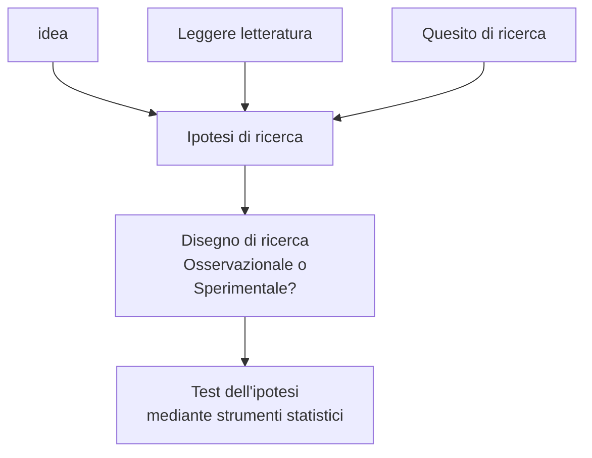
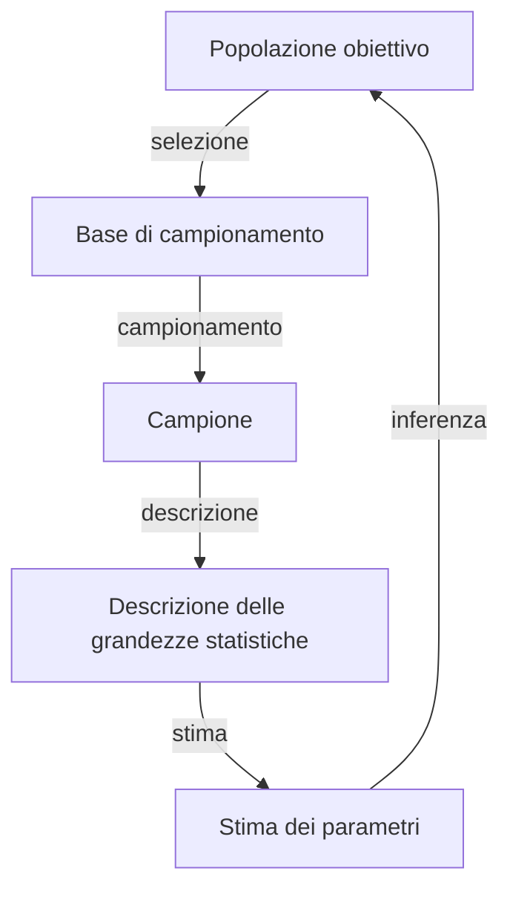

<!--
Docente: Ada Dormi
Ricevimento: mar 11--13 con appuntamento (ada.dormi@unibo.it)
Libro: Statistica per discipline biomediche, Stanton A. Glanz, ed McGraw Hill
-->

\clearpage
\part{Statistica medica}

# Introduzione

## Metodologie di ricerca

\ 

- Gli studi si dividono in 2 classi, riflettendo un diverso _disegno_ di ricerca alla base
	- __Studi osservazionali__: studi per osservare quali siano le precondizioni e la loro ___correlazione___ con gli effetti
		2. Studi trasversali (di coorte) --- Fotografia del campione in un dato momento. Tutti i dati sono raccolti al medesimo momento, utili per individuare e studiare la distribuzione dei dati in _quel_ momento
			- Obiettivo: studio veloce e poco costoso per formulare ipotesi _da confermare in seguito con altri studi_
			- Criticità
				- No follow up
				- No analisi dati precedenti
				- Si evidenziano _associazioni_ tra eventi e caratteristiche
				- L'assenza del tempo impedisce di valutare correlazione/causalità (anzi, si può avere una dimostrazione -- errata -- di _causalità inversa_ \marginnote{Es: si osserva un uso molto maggiore di CardioASA in ipertesi. È forse vero che, quindi, la CardioASA è un fattore di rischio per l'ipertensione?}
		3. Studi retrospettivi caso--controllo --- Raccolta di dati da sg. _già_ malati e confrontati con sg. sani, per evidenziare differenze
		4. Studi prospettici di coorte --- Coorte di sg. free living seguiti nel tempo (numerosi follow-up)
			- Obiettivo: studiare un _trend_ di fattori valutando gli effetti nel tempo
			- Criticità
				- Costo
				- Problemi etici (bias!)
				- Difficoltà tecniche per drop--out di sg.
				- Inadatti per patologie rare
		5. __Studi prospettici caso--controllo__ ---  coorte di sg. _caso_ e coorte di sg. _controllo_ seguiti nel tempo per valutare l'insorgenza di una condizione nel tempo e valutarne la prevalenza nei due gruppi
			- Obiettivo: valutare _correlazione_
	- __Studi sperimentali__: studi per dimostrare la ___causalità___ delle precondizioni osservate con gli effetti
- Un buono studio deve essere
	- Caso--controllo
	- Sg. randomizzati nei due gruppi (per averli confrontabili)
	- In doppio cieco (per eliminare quanto più possibile i bias)

## Approccio alla ricerca

## Metodi della statistica a servizio della clinica e della ricerca
- Obiettivo: minimizzare la possibilità di dire stronzate, essenzialmente
- La statistica medica ha 2 aspetti
	- Statistica descrittiva: come raccolgo e sintetizzo bene i dati?
	- Statistica inferenziale: come _inferisco_ (= deduco) conclusioni adeguate?

## Momenti statistici

### Campionamento
- Obiettivo: come scelgo il mio campione statistico?

#### Tipologie di campionamento
- Campionamenti probabilistici
	- Casuale --- Ogni sg. ha medesima probabilità di essere estratto
	- Casuale semplice --- Divido la popolazione in un certo gruppo di campioni casuali con la medesima numerosità; ciascuno dei quali ha la stessa probabilità di essere il campione definitivo
	- Sistematico
	- Stratificato --- Divido la popolazione in strati omogenei per alcune caratteristiche (es: sesso, età, lavoro...)
	- A grappolo
- Campionamenti non probabilistici \todo{}
	- A quote
	- A valanga --- Quando i sg. campionati includono loro stessi altri sg. (amici di amici)
	- A scelta ragionata
	- Accidentale

### Descrizione del campione
- Il campione, per essere sintetizzato e oggettivato, deve essere descritto mediante variabili \todo{}
	- Quantitative (descrivono quantità, secondo _scale_ di misura) \marginnote{Ordine di precisione crescente}
		- Scala nominale \todo{}
		- Scala ordinale \todo{}
		- Scala numerica discreta
		- Scala numerica continua
	- Qualitative (descrivono qualità)
- La descrizione quantitativa viene caratterizzata da 3 elementi
	- Centro (valore rappresentativo medio)
	- Variazione (o dispersione) rispetto al centro
	- Valori estremi

#### Rappresentazione delle variabili descrittive \todo{}

\clearpage

# Bibliografia {-}
