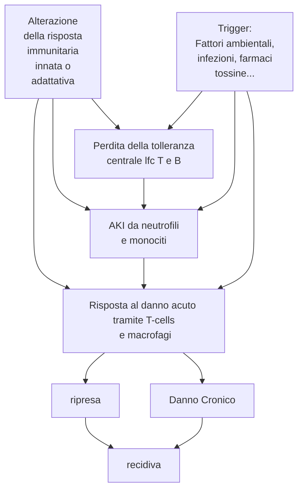

<!--
PROGRAMMA DEL MODULO:
1. Introduzione
	- Nosografia delle nefropatie e semeiotica
2. Patologie del parenchima renale
	- Nefropatie glomerulari primitive
	- Nefropatie glomerulari Secondarie
	- Sindrome nefritica
	- Sindrome nefrosica
4. Patologie del tubulo
	- Nefropatie tubulointerstiziali
5. Problematiche vascolari che esitano in danno renale
	- Nefropatie vascolari
	- Vasculiti e microangiopatie trombotiche
6. IR
	- IRA
	- IRC
7. Nefropatie ereditarie
8. Rene e gravidanza
9. Terapia
	- Dialisi
	- Trapianto
-->

\clearpage
\part{Nefrologia}

# Introduzione

## Anatomia del rene e delle vie urinarie
- \todo{inserire pagina (1 o 2) con immagini anatomiche, almeno: addome (e vie urinarie) + innervazione e vascolarizzazione (esterna ed interna) + spaccato del rene + spaccato del nefrone. Vedi slide per avere idee di quali mettere}
- Organo pari
- Rene dx vs rene sx hanno differenti caratteristiche \todo{quali?}
- Innervazione
	- Non sensitiva, solo motoria (assoni di tipo A e B)
		- Tipo A: glomerulo nella porzione afferente
		- Tipo B: glomerulo nella porzione efferente
	- \todo{innervazione}
- Grandi differenze nella struttura anatomica maschile e femminile
- Macroscopicamente individuiamo 3 distinte regioni
	- Corticale
	- Midollare
	- Pelvi ?!
- Unità funzionale del rene: \a{nefrone} (circa 700K--1200K per rene)
	- \todo{anatomia generale del nefrone}
- Il rene è composto da 4 strutture (funzionalmente molto interconnesse tra loro [_cross talk_]^[Questo vuol dire che, nonostante possiamo individuare 4 componenti del nefrone, ogni componente non può lavorare in autonomia: il funzionamento del rene non può prescindere dalla corretta collaborazione e integrazione di tutti e 4 i componenti in un parenchima funzionale. Conseguentemente una funzione si integra con tutte le altre, e se viene danneggiata il danno si ripercuote in maniera _organica_ su anche gli altri componenti])
	1. Glomerulo
	2. Tubulo
	3. Interstizio
	4. Vasi

## Funzionalità del rene
1. Escretoria
	- Eliminare i prodotti di scarto endogeni (urea, creatinina, acido urico, metaboliti finali di ormoni o proteine)
	- Eliminare i prodotti esogeni (farmaci, additivi alimentari...)
2. Regolazione dell'equilibrio idrico ed elettrolitico
3. Regolazione dell'osmolarità dei fluidi corporei
4. Regolazione dell'equilibiro acido--base
5. Partecipa alla regolazione della PA
6. Secernere ormoni^[Eritropoietina, attivazione della vitamina D]
7. Collabora alla gluconeogenesi

## Approccio generale alla patologia renale
- Intercettare un generico "problema renale" per trattarlo correttamente è una questione complicata
- Classicamente, ci sono 4 vie di presentazione di una patologia renale
	- Il pz. ha un quadro asintomatico e non ha ragione di fare accertamenti^[Ricordiamo che il rene non ha innervazione sensitiva ⇒ non permette di "provare dolore" se vi è un qualche tipo di insulto che rimane confinato al rene. Gli unici recettori doloriferi sono presenti sulla capsula renale ⇒ ci vuole un processo patologico che va ad alterare la capsula per avere sintomatologie rilevabili]
	- Il pz. ha un quadro asintomatico che si palesa con solo una alterazione laboratoristica, individuata per altro motivo
	- Il pz. ha sintomi o presenta reperti obiettivi legati a malattia renale
	- Il pz. ha sintomi sistemici che possono secondariamente coinvolgere il rene

\greenbox{Come approcciare una patologia renale}{
Tendenzialmente l'approccio che bisogna avere è _analitico_, non _deduttivo_. Questo perché è rarissimo che ci siano segni e sintomi primari del rene. La sua funzione è talmente trasversale e ubiquitaria nella fisiologia dell'organismo che spessissimo la patologia renale può essere una manifestazione secondaria di altre patologie pre-renali. In alcuni casi è vero anche il contrario, ma questo fatto -- aggiunto con il fatto che la sintomatologia è spesso molto sfumata -- obbliga il clinico ad avere un approccio _generale_, _aperto_, olistico: valutando sia cause pre-renali, che renali e post-renali
}

### Sintomatologia generale
- Sintomi
	- Dolore
		- Renale puro
		- Da colica
		- Alla minzione (_stranguria_)
	- Disturbi minzionali
		- Alterazioni urinarie
		- Tenesmo
		- Incontinenza o ritenzione urinaria
	- Sintomi extrarenali (di altri distretti non renali ma in qualche maniera correlati con una anomala funzionalità renale)
- Segni
	- Alterazioni urinarie (_disuria_)
		- Del ritmo (pollachiuria, nicturia/enuresi^[Nicturia non consapevole])
		- Del volume (anuria, oliguria, poliuria)
		- Della composizione (ematuria, proteinuria, piuria, chiluria)
	- Alterazioni renali locali (masse, noduli, soffi vascolari)
	- Sintomi nefrologici (edema, ematuria, ipertensione....)
	- Sintomi indicativi di una malattia sistemica

### Manovre semeiolgiche tipiche
- Manovra di Giordano --- dolore alla percussione sottocostale posteriore in corrispondenza della loggia renale
- Manovra di Guyon --- palpazione di rimbalzo del rene durante inspirazione

### Laboratoristica generale
- __Esame delle urine__
	- Aspetto (limpido o torbido)
		- Se torbido: come mai? Cellule? Minerali? Altro?
		- Colore
			- Rosso ⇔ ematuria, mioglobinuria, profirinuria, farmaci
			- Arancione ⇔ ↑ bilirubina
			- Verde ⇔ itteri intensi o farmaci
			- Nero ⇔ \pat{alcaptonuria}, melaninuria
			- Blu ⇔ coloranti
			- Bianco ⇔ piuria (lattescente), chiluria (lattescente giallastro)
	- Odore
		- Sui generis: ok
		- Particolarmente maleodorante ⇒ sospetto infezione
	- Proprietà fisiche
		- Peso specifico (indicazione della capacità di concentrare le urine)
			- P.s. < 1010 ⇒ ipostenuria
			- P.s. > 1030 ⇒ iperstenuria (indice di ottima capacità di concentrare le urine ⇒ ottima funzionalità renale)
		- pH (5÷6)
			- ↑ se infezioni urinarie (_tendenzialmente_ producono agenti alcalinizzanti)
			- Indice del pH corporeo
		- Particolari sostanze contenute
			- Glucosio (indice di diabete o di deficit tubulari della pompa Na/glucosio)
				- Glicosuria iperglicemica ⇔ diabete
				- Glicosuria normoglicemica ⇔ deficit di pompa
			- Quantità di proteine
				- Fisiologica se < 150 mg/die
				- Se presente: valutare se è proteinuria selettiva o generale (quante e quali frazioni proteiche del plasma sono presenti?)
- \todo{mi si è bloccato tutto e ho dovuto riavviare}

\todo{TUTTA LA LEZIONE DI mar 16 mar 2021, 14:49:31, CET}

# Vasculiti e microangiopatie trombotiche (??) \todo{?? come organizzare?}

## Vasculiti ANCA-associate

## Fisiopatologia

### Clinica
- Sintomi sistemici
	- Prodromici (~ mesi)
		- Febbre
		- Astenia, calo ponderale
		- Artralgie e mialgie
	- In acuto
		- Porpora, noduli, ulcerazioni cutanee
		- Dolore addominale e sangue nelle feci
		- Neuropatia periferica
		- Emottisi, infiltrati/noduli polmonari
		- Sinusite necrotizzante emorragica
- Sintomi renali (esordio improvviso)
	- \pat{ir} acuta (⇐ vasculite necrotizzante + glomerulonefrite rapidamente progressiva)
	- Reperti urinari aspecifici

### Classificazione \todo{}

# Alterazioni nefrologiche perigravidanza
