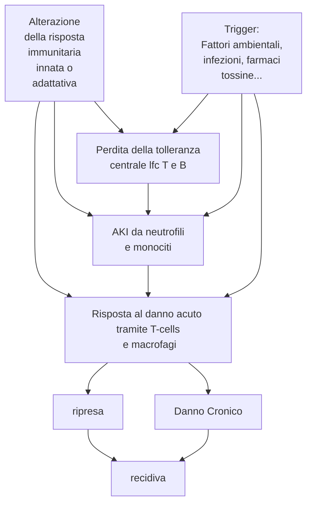
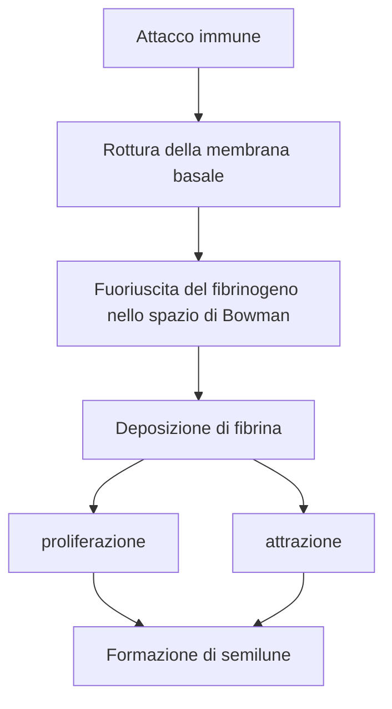

<!--
PROGRAMMA DEL MODULO:
1. Introduzione
	- Nosografia delle nefropatie e semeiotica
2. Patologie del parenchima renale
	- Nefropatie glomerulari primitive
	- Nefropatie glomerulari Secondarie
	- Sindrome nefritica
	- Sindrome nefrosica
4. Patologie del tubulo
	- Nefropatie tubulointerstiziali
5. Problematiche vascolari che esitano in danno renale
	- Nefropatie vascolari
	- Vasculiti e microangiopatie trombotiche
6. IR
	- IRA
	- IRC
7. Nefropatie ereditarie
8. Rene e gravidanza
9. Terapia
	- Dialisi
	- Trapianto
-->

\clearpage
\part{Nefrologia}

# Introduzione

## Anatomia del rene e delle vie urinarie
- \todo{inserire pagina (1 o 2) con immagini anatomiche, almeno: addome (e vie urinarie) + innervazione e vascolarizzazione (esterna ed interna) + spaccato del rene + spaccato del nefrone. Vedi slide per avere idee di quali mettere}
- Organo pari
- Rene dx vs rene sx hanno differenti caratteristiche \todo{quali?}
- Innervazione
	- Non sensitiva, solo motoria (assoni di tipo A e B)
		- Tipo A: glomerulo nella porzione afferente
		- Tipo B: glomerulo nella porzione efferente
	- \todo{innervazione}
- Grandi differenze nella struttura anatomica maschile e femminile
- Macroscopicamente individuiamo 3 distinte regioni
	- Corticale
	- Midollare
	- Pelvi ?!
- Unità funzionale del rene: \a{nefrone} (circa 700K--1200K per rene)
	- \todo{anatomia generale del nefrone}
- Il rene è composto da 4 strutture (funzionalmente molto interconnesse tra loro [_cross talk_]^[Questo vuol dire che, nonostante possiamo individuare 4 componenti del nefrone, ogni componente non può lavorare in autonomia: il funzionamento del rene non può prescindere dalla corretta collaborazione e integrazione di tutti e 4 i componenti in un parenchima funzionale. Conseguentemente una funzione si integra con tutte le altre, e se viene danneggiata il danno si ripercuote in maniera _organica_ su anche gli altri componenti])
	1. Glomerulo
	2. Tubulo
	3. Interstizio
	4. Vasi

## Funzionalità del rene
1. Escretoria
	- Eliminare i prodotti di scarto endogeni (urea, creatinina, acido urico, metaboliti finali di ormoni o proteine)
	- Eliminare i prodotti esogeni (farmaci, additivi alimentari...)
2. Regolazione dell'equilibrio idrico ed elettrolitico
3. Regolazione dell'osmolarità dei fluidi corporei
4. Regolazione dell'equilibiro acido--base
5. Partecipa alla regolazione della PA
6. Secernere ormoni^[Eritropoietina, attivazione della vitamina D]
7. Collabora alla gluconeogenesi

## Approccio generale alla patologia renale
- Intercettare un generico "problema renale" per trattarlo correttamente è una questione complicata
- Classicamente, ci sono 4 vie di presentazione di una patologia renale
	- Il pz. ha un quadro asintomatico e non ha ragione di fare accertamenti^[Ricordiamo che il rene non ha innervazione sensitiva ⇒ non permette di "provare dolore" se vi è un qualche tipo di insulto che rimane confinato al rene. Gli unici recettori doloriferi sono presenti sulla capsula renale ⇒ ci vuole un processo patologico che va ad alterare la capsula per avere sintomatologie rilevabili]
	- Il pz. ha un quadro asintomatico che si palesa con solo una alterazione laboratoristica, individuata per altro motivo
	- Il pz. ha sintomi o presenta reperti obiettivi legati a malattia renale
	- Il pz. ha sintomi sistemici che possono secondariamente coinvolgere il rene

\greenbox{Come approcciare una patologia renale}{
Tendenzialmente l'approccio che bisogna avere è \emph{analitico}, non \emph{deduttivo}. Questo perché è rarissimo che ci siano segni e sintomi primari del rene. La sua funzione è talmente trasversale e ubiquitaria nella fisiologia dell'organismo che spessissimo la patologia renale può essere una manifestazione secondaria di altre patologie pre-renali. In alcuni casi è vero anche il contrario, ma questo fatto -- aggiunto con il fatto che la sintomatologia è spesso molto sfumata -- obbliga il clinico ad avere un approccio \emph{generale}, \emph{aperto}, olistico: valutando sia cause pre-renali, che renali e post-renali
}

### Sintomatologia generale
- Sintomi
	- Dolore
		- Renale puro
		- Da colica
		- Alla minzione (_stranguria_)
	- Disturbi minzionali
		- Alterazioni urinarie
		- Tenesmo
		- Incontinenza o ritenzione urinaria
	- Sintomi extrarenali (di altri distretti non renali ma in qualche maniera correlati con una anomala funzionalità renale)
- Segni
	- Alterazioni urinarie (_disuria_)
		- Del ritmo (pollachiuria, nicturia/enuresi^[Nicturia non consapevole])
		- Del volume (anuria, oliguria, poliuria)
		- Della composizione (ematuria, proteinuria, piuria, chiluria)
	- Alterazioni renali locali (masse, noduli, soffi vascolari)
	- Sintomi nefrologici (edema, ematuria, ipertensione....)
	- Sintomi indicativi di una malattia sistemica

### Manovre semeiolgiche tipiche
- Manovra di Giordano --- dolore alla percussione sottocostale posteriore in corrispondenza della loggia renale
- Manovra di Guyon --- palpazione di rimbalzo del rene durante inspirazione

### Laboratoristica generale
- __Esame delle urine__
	- Aspetto (limpido o torbido)
		- Se torbido: come mai? Cellule? Minerali? Altro?
		- Colore
			- Rosso ⇔ ematuria, mioglobinuria, profirinuria, farmaci
			- Arancione ⇔ ↑ bilirubina
			- Verde ⇔ itteri intensi o farmaci
			- Nero ⇔ \pat{alcaptonuria}, melaninuria
			- Blu ⇔ coloranti
			- Bianco ⇔ piuria (lattescente), chiluria (lattescente giallastro)
	- Odore
		- Sui generis: ok
		- Particolarmente maleodorante ⇒ sospetto infezione
	- Proprietà fisiche
		- Peso specifico (indicazione della capacità di concentrare le urine)
			- P.s. < 1010 ⇒ ipostenuria
			- P.s. > 1030 ⇒ iperstenuria (indice di ottima capacità di concentrare le urine ⇒ ottima funzionalità renale)
		- pH (5÷6)
			- ↑ se infezioni urinarie (_tendenzialmente_ producono agenti alcalinizzanti)
			- Indice del pH corporeo
		- Particolari sostanze contenute
			- Glucosio (indice di diabete o di deficit tubulari della pompa Na/glucosio)
				- Glicosuria iperglicemica ⇔ diabete
				- Glicosuria normoglicemica ⇔ deficit di pompa
			- Quantità di proteine
				- Fisiologica se < 150 mg/die
				- Se presente: valutare se è proteinuria selettiva o generale (quante e quali frazioni proteiche del plasma sono presenti?)
- \todo{mi si è bloccato tutto e ho dovuto riavviare}

\todo{TUTTA LA LEZIONE DI mar 16 mar 2021, 14:49:31, CET}

# Vasculiti e microangiopatie trombotiche (??) \todo{?? come organizzare?}

## Vasculiti ANCA-associate

## Fisiopatologia

### Clinica
- Sintomi sistemici
	- Prodromici (~ mesi)
		- Febbre
		- Astenia, calo ponderale
		- Artralgie e mialgie
	- In acuto
		- Porpora, noduli, ulcerazioni cutanee
		- Dolore addominale e sangue nelle feci
		- Neuropatia periferica
		- Emottisi, infiltrati/noduli polmonari
		- Sinusite necrotizzante emorragica
- Sintomi renali (esordio improvviso)
	- \pat{ir} acuta (⇐ vasculite necrotizzante + glomerulonefrite rapidamente progressiva)
	- Reperti urinari aspecifici

### Classificazione \todo{}

# Alterazioni nefrologiche perigravidanza

<!-- lun 22 mar 2021, 14:09:38, CET -->
# Insufficienza renale
- \pat{insufficienza renale} --- \todo{}
	- Cronica vs acuta \todo{}

## Insufficienza renale acuta
- \pat{ira} o \textsc{aki}^[Acute Kidney Injury] --- condizione potenzialmente reversibile di __riduzione della capacità renale__ (eliminare i cataboliti proteici e mantenere omeostasi di fluidi ed elettroliti) __ad insorgenza acuta__ (ore--giorni)
- Epidemiologia
	- 1--2% dei ricoveri sono imputabili a IRA
	- IRA si verifica in 7% dei ricoveri (fino a ~ 30--50% dei ricoveri in UTI!)
	- 1/a causa di morbilità e mortalità in pz. ricoverati
	- IRA è elemento prognostico sfavorevole nel decorso, anche se reversibile
- IRA deve essere _primo elemento_ da considerare (in termini di ddx) in caso di problemi renali

### Classificazione del danno renale
- Ci sono scale di classificazione che stratificano il danno renale del pz. a seconda di 2 parametri osservabili: [creatinina] e diuresi (ml/kg/h)
	1. Classificazione RIFLE (Risk → Injury → Failure → Loss → ESRD)
	2. __Classificazione AKI__ (Stage 1 → Stage 2 → Stage 3)

\ 

- RIFLE ≥ F o AKIN ≥ 3 ⇒ considerare \far{rrt} (_Renal Replacement Therapy_: trattamento dialitico continuo)

### Fisiopatologia
- Individuiamo 3 eziologie di IRA:
	1. Pre--renale (70--80%) --- da riduzione della perfusione renale (IR funzionale)
	2. Renale (5--10%) --- da danno del parenchima renale (IR organica)
	3. Post--renale (10--20%) --- da danno nell'eliminazione dell'urina (IR ostruttiva)

#### IRA pre-renale (funzionale)
- Causa di base: __insufficiente perfusione renale__ ⇒ meccanismi compensatori^[L'obiettivo di questi meccanismi, che sono assolutamente __fisiologici__, è quello di mantenere il flusso plasmatico renale costante. Con i meccanismi di autoregolazione renale (_meccanismo miogeno_ e _meccanismo del feedback del tubulo--glomerulare_)] di contrazione della diuresi (ma parenchima integro) \todo{focus su meccanismi comepnsatori da fisiologia}
	- ↓ PA
		- Infarti
		- Embolie polmonari
		- Shock cardiogeno
		- Shock ostruttivo
	- ↓ VCE
		- Emorragie
		- Disidratazione, sudorazione, vomito, diarrea (> bambini/anziani)
		- Perdita di plasma (ustioni, traumi estesi)
		- Sequestro di liquidi in 3/o spazio (edemi, shock distributivo, cirrosi)
- Reversibile se prontamente trattata
- Può evolvere in IRA renale se non trattata/non trattabile (per ischemia del parenchima renale a causa dell'ipoperfusione)
- \todo{Meccanismo patologico completo con raffronto dei meccanismi di compenso renali fisiologici}
- Quadro clinico
	- Dipendente da patologia alla base
	- Pz. oligurico MA urine con peso specifico normale (raramente elevato) \marginnote{Il peso specifico normale indica che di fatto la capacità di secrezione e riassorbimento renale è sostanzialmente conservata, e quindi permette di escludere un danno parenchimale}
		- PS > 1015
		- [Na]~urina~ < 20 mEq/L (attenzione a uso di diuretici!)
		- urea~urine~/urea~plasma~ < 35%
		- \todo{altro?}

#### IRA renale (organica)
- \todo{Nooooooo}
- Valori laboratoristici per diagnosi differenziale

##### Necrosi tubulare acuta
- Decorso \todo{}
	1. Fase oligurica (7--30 gg)
		- Ritenzione idrica e di cataboliti azotati
		- ↑ K^+^ e ↓ pH
		- Questo causa una sovrapposizione complessa di sintomi
			- \todo{FUCK}
	2. Fase diuretica precoce
	3. Fase diuretica tardiva
	4. Fase di convalescenza
- \todo{Tutte le IRA renali}

#### IRA post--renale (ostruttiva)
- Causa di base: __ostruzione delle vie urinarie__ ⇒ ↑ pressione intraparenchimale ⇒ ↓ GFR \todo{controllare catena logica, è chiara?}
	- Ostruzione delle vie urinarie superiori (ostruzione bilaterale o monolaterale + incapacità di compenso del rene controlaterale)
		- Ostruzione intrinseca
			- \todo{}
		- Ostruzione estrinseca
			- Fibrosi peritoneale
			- Aneurisma
			- Neoplasia pelvica
	- Ostruzioni delle vie urinarie inferiori
- Diagnosi: sospetto clinico confermato da una qualche forma di imaging\todo{}
	- Eco
	- RX diretto addome
	- Urografia con mdc
	- TAC

# Nefropatie
<!-- gio 25 mar 2021, 14:24:17, CET -->
## Nefropatie interstiziali \todo{gio 25 mar 2021, 14:24:30, CET}

### Nefropatie interstiziali immuno-mediate \todo{}

#### Forme drug-related
- Nefropatia interstiziale con meccanismo patogenetico farmaco--indotto
	1. Un farmaco con potere antigenico (\*mab, antivirali, farmaci proteici altamente specifici, farmaci pro--aptenici^[Farmaci che coniugati con proteine, hanno il potere di diventare apteni]...) viene riconosciuto dal SI
	2. Il SI si attiva contro il farmaco
		- Ipersensibilità ritardata
		- Formazione di immunocomplessi
		- Cross--reattività (_molecular mimicry_)
		- Per perdita della tolleranza periferica e/o centrale
	3. L'antigene viene presentato dalle cellule che si trovano nel parenchima renale nel momento in cui il farmaco viene filtrato
		- Da cellule dendritiche residenti
		- Dall'epitelio tubulare renale stesso (epiteliociti renali possono diventare APC^[[@kelley_antigen_1993]])
		- Dai macrofagi interstiziali renali
	4. AKI da danno renale
- La patogenesi infiammatoria implica che il meccanismo lesivo può proseguire _anche dopo la sospensione del trattamento che lo ha causato in prima battuta_
- Farmaci responsabili sono solitamente \farf{mab} in uso in terapie neoplastiche \todo{doi: 10.1017/j.ekir.2020.04.018}

#### Forme da immunocomplessi
- Case report: [@comai_case_2019] (IgG~4~--related Tubulointerstitial Nephrology)
- \todo{breve descrizione}

## Nefropatie ischemiche

### Nefropatia ipertensiva
- Nefropatia causata da danni conseguenti ad ipertensione
	- \todo{meccanismo patologico}
	- ↑ PA ⇒ contrazione del lume delle arteriole afferenti al glomerulo (per mantenere costante la VFG)
	- Contrazione permanente del lume ⇒ modificazioni a lungo termine (ispessimento protettivo)
		- Ipertrofia dei miociti lisci (all'istologia: _onion bulb lesions_)
		- Barotrauma ⇒ danno diretto delle cellule del vaso
			- Esposizione di `dermatan solfato` (quindi?)
			- Rilascio di citochine infiammatorie
			- Produzione di collagene e fibrina come meccanismo difensivo per ingrossare il lume del vaso (_ialinosi_ arteriolare) \todo{vetrino di ialinosi}
	- Ispessimento del vaso ⇒ ipoperfusione del glomerulo a valle
	- __Atrofia del glomerulo e del tubulo__ per ridotta perfusione

\ 

- \todo{un bel pochino}

## Nefropatie gravidiche
<!--
PROGRAMMA DEL MODULO:
1. Introduzione
	- Nosografia delle nefropatie e semeiotica
2. Patologie del parenchima renale
	- Nefropatie glomerulari primitive
	- Nefropatie glomerulari Secondarie
	- Sindrome nefritica
	- Sindrome nefrosica
4. Patologie del tubulo
	- Nefropatie tubulointerstiziali
5. Problematiche vascolari che esitano in danno renale
	- Nefropatie vascolari
	- Vasculiti e microangiopatie trombotiche
6. IR
	- IRA
	- IRC
7. Nefropatie ereditarie
8. Rene e gravidanza
9. Terapia
	- Dialisi
	- Trapianto
-->

\clearpage
\part{Nefrologia}

# Introduzione

## Anatomia del rene e delle vie urinarie
- \todo{inserire pagina (1 o 2) con immagini anatomiche, almeno: addome (e vie urinarie) + innervazione e vascolarizzazione (esterna ed interna) + spaccato del rene + spaccato del nefrone. Vedi slide per avere idee di quali mettere}
- Organo pari
- Rene dx vs rene sx hanno differenti caratteristiche \todo{quali?}
- Innervazione
	- Non sensitiva, solo motoria (assoni di tipo A e B)
		- Tipo A: glomerulo nella porzione afferente
		- Tipo B: glomerulo nella porzione efferente
	- \todo{innervazione}
- Grandi differenze nella struttura anatomica maschile e femminile
- Macroscopicamente individuiamo 3 distinte regioni
	- Corticale
	- Midollare
	- Pelvi ?!
- Unità funzionale del rene: \a{nefrone} (circa 700K--1200K per rene)
	- \todo{anatomia generale del nefrone}
- Il rene è composto da 4 strutture (funzionalmente molto interconnesse tra loro [_cross talk_]^[Questo vuol dire che, nonostante possiamo individuare 4 componenti del nefrone, ogni componente non può lavorare in autonomia: il funzionamento del rene non può prescindere dalla corretta collaborazione e integrazione di tutti e 4 i componenti in un parenchima funzionale. Conseguentemente una funzione si integra con tutte le altre, e se viene danneggiata il danno si ripercuote in maniera _organica_ su anche gli altri componenti])
	1. Glomerulo
	2. Tubulo
	3. Interstizio
	4. Vasi

## Funzionalità del rene
1. Escretoria
	- Eliminare i prodotti di scarto endogeni (urea, creatinina, acido urico, metaboliti finali di ormoni o proteine)
	- Eliminare i prodotti esogeni (farmaci, additivi alimentari...)
2. Regolazione dell'equilibrio idrico ed elettrolitico
3. Regolazione dell'osmolarità dei fluidi corporei
4. Regolazione dell'equilibiro acido--base
5. Partecipa alla regolazione della PA
6. Secernere ormoni^[Eritropoietina, attivazione della vitamina D]
7. Collabora alla gluconeogenesi

## Approccio generale alla patologia renale
- Intercettare un generico "problema renale" per trattarlo correttamente è una questione complicata
- Classicamente, ci sono 4 vie di presentazione di una patologia renale
	- Il pz. ha un quadro asintomatico e non ha ragione di fare accertamenti^[Ricordiamo che il rene non ha innervazione sensitiva ⇒ non permette di "provare dolore" se vi è un qualche tipo di insulto che rimane confinato al rene. Gli unici recettori doloriferi sono presenti sulla capsula renale ⇒ ci vuole un processo patologico che va ad alterare la capsula per avere sintomatologie rilevabili]
	- Il pz. ha un quadro asintomatico che si palesa con solo una alterazione laboratoristica, individuata per altro motivo
	- Il pz. ha sintomi o presenta reperti obiettivi legati a malattia renale
	- Il pz. ha sintomi sistemici che possono secondariamente coinvolgere il rene

\greenbox{Come approcciare una patologia renale}{
Tendenzialmente l'approccio che bisogna avere è \emph{analitico}, non \emph{deduttivo}. Questo perché è rarissimo che ci siano segni e sintomi primari del rene. La sua funzione è talmente trasversale e ubiquitaria nella fisiologia dell'organismo che spessissimo la patologia renale può essere una manifestazione secondaria di altre patologie pre-renali. In alcuni casi è vero anche il contrario, ma questo fatto -- aggiunto con il fatto che la sintomatologia è spesso molto sfumata -- obbliga il clinico ad avere un approccio \emph{generale}, \emph{aperto}, olistico: valutando sia cause pre-renali, che renali e post-renali
}

### Sintomatologia generale
- Sintomi
	- Dolore
		- Renale puro
		- Da colica
		- Alla minzione (_stranguria_)
	- Disturbi minzionali
		- Alterazioni urinarie
		- Tenesmo
		- Incontinenza o ritenzione urinaria
	- Sintomi extrarenali (di altri distretti non renali ma in qualche maniera correlati con una anomala funzionalità renale)
- Segni
	- Alterazioni urinarie (_disuria_)
		- Del ritmo (pollachiuria, nicturia/enuresi^[Nicturia non consapevole])
		- Del volume (anuria, oliguria, poliuria)
		- Della composizione (ematuria, proteinuria, piuria, chiluria)
	- Alterazioni renali locali (masse, noduli, soffi vascolari)
	- Sintomi nefrologici (edema, ematuria, ipertensione....)
	- Sintomi indicativi di una malattia sistemica

### Manovre semeiolgiche tipiche
- Manovra di Giordano --- dolore alla percussione sottocostale posteriore in corrispondenza della loggia renale
- Manovra di Guyon --- palpazione di rimbalzo del rene durante inspirazione

### Laboratoristica generale
- __Esame delle urine__
	- Aspetto (limpido o torbido)
		- Se torbido: come mai? Cellule? Minerali? Altro?
		- Colore
			- Rosso ⇔ ematuria, mioglobinuria, profirinuria, farmaci
			- Arancione ⇔ ↑ bilirubina
			- Verde ⇔ itteri intensi o farmaci
			- Nero ⇔ \pat{alcaptonuria}, melaninuria
			- Blu ⇔ coloranti
			- Bianco ⇔ piuria (lattescente), chiluria (lattescente giallastro)
	- Odore
		- Sui generis: ok
		- Particolarmente maleodorante ⇒ sospetto infezione
	- Proprietà fisiche
		- Peso specifico (indicazione della capacità di concentrare le urine)
			- P.s. < 1010 ⇒ ipostenuria
			- P.s. > 1030 ⇒ iperstenuria (indice di ottima capacità di concentrare le urine ⇒ ottima funzionalità renale)
		- pH (5÷6)
			- ↑ se infezioni urinarie (_tendenzialmente_ producono agenti alcalinizzanti)
			- Indice del pH corporeo
		- Particolari sostanze contenute
			- Glucosio (indice di diabete o di deficit tubulari della pompa Na/glucosio)
				- Glicosuria iperglicemica ⇔ diabete
				- Glicosuria normoglicemica ⇔ deficit di pompa
			- Quantità di proteine
				- Fisiologica se < 150 mg/die
				- Se presente: valutare se è proteinuria selettiva o generale (quante e quali frazioni proteiche del plasma sono presenti?)
- \todo{mi si è bloccato tutto e ho dovuto riavviare}

\todo{TUTTA LA LEZIONE DI mar 16 mar 2021, 14:49:31, CET}

# Vasculiti e microangiopatie trombotiche (??) \todo{?? come organizzare?}

## Vasculiti ANCA-associate

## Fisiopatologia

### Clinica
- Sintomi sistemici
	- Prodromici (~ mesi)
		- Febbre
		- Astenia, calo ponderale
		- Artralgie e mialgie
	- In acuto
		- Porpora, noduli, ulcerazioni cutanee
		- Dolore addominale e sangue nelle feci
		- Neuropatia periferica
		- Emottisi, infiltrati/noduli polmonari
		- Sinusite necrotizzante emorragica
- Sintomi renali (esordio improvviso)
	- \pat{ir} acuta (⇐ vasculite necrotizzante + glomerulonefrite rapidamente progressiva)
	- Reperti urinari aspecifici

### Classificazione \todo{}

# Alterazioni nefrologiche perigravidanza

<!-- lun 22 mar 2021, 14:09:38, CET -->
# Insufficienza renale
- \pat{insufficienza renale} --- \todo{}
	- Cronica vs acuta \todo{}

## Insufficienza renale acuta
- \pat{ira} o \textsc{aki}^[Acute Kidney Injury] --- condizione potenzialmente reversibile di __riduzione della capacità renale__ (eliminare i cataboliti proteici e mantenere omeostasi di fluidi ed elettroliti) __ad insorgenza acuta__ (ore--giorni)
- Epidemiologia
	- 1--2% dei ricoveri sono imputabili a IRA
	- IRA si verifica in 7% dei ricoveri (fino a ~ 30--50% dei ricoveri in UTI!)
	- 1/a causa di morbilità e mortalità in pz. ricoverati
	- IRA è elemento prognostico sfavorevole nel decorso, anche se reversibile
- IRA deve essere _primo elemento_ da considerare (in termini di ddx) in caso di problemi renali

### Classificazione del danno renale
- Ci sono scale di classificazione che stratificano il danno renale del pz. a seconda di 2 parametri osservabili: [creatinina] e diuresi (ml/kg/h)
	1. Classificazione RIFLE (Risk → Injury → Failure → Loss → ESRD)
	2. __Classificazione AKI__ (Stage 1 → Stage 2 → Stage 3)

\ 

- RIFLE ≥ F o AKIN ≥ 3 ⇒ considerare \far{rrt} (_Renal Replacement Therapy_: trattamento dialitico continuo)

### Fisiopatologia
- Individuiamo 3 eziologie di IRA:
	1. Pre--renale (70--80%) --- da riduzione della perfusione renale (IR funzionale)
	2. Renale (5--10%) --- da danno del parenchima renale (IR organica)
	3. Post--renale (10--20%) --- da danno nell'eliminazione dell'urina (IR ostruttiva)

#### IRA pre-renale (funzionale)
- Causa di base: __insufficiente perfusione renale__ ⇒ meccanismi compensatori^[L'obiettivo di questi meccanismi, che sono assolutamente __fisiologici__, è quello di mantenere il flusso plasmatico renale costante. Con i meccanismi di autoregolazione renale (_meccanismo miogeno_ e _meccanismo del feedback del tubulo--glomerulare_)] di contrazione della diuresi (ma parenchima integro) \todo{focus su meccanismi comepnsatori da fisiologia}
	- ↓ PA
		- Infarti
		- Embolie polmonari
		- Shock cardiogeno
		- Shock ostruttivo
	- ↓ VCE
		- Emorragie
		- Disidratazione, sudorazione, vomito, diarrea (> bambini/anziani)
		- Perdita di plasma (ustioni, traumi estesi)
		- Sequestro di liquidi in 3/o spazio (edemi, shock distributivo, cirrosi)
- Reversibile se prontamente trattata
- Può evolvere in IRA renale se non trattata/non trattabile (per ischemia del parenchima renale a causa dell'ipoperfusione)
- \todo{Meccanismo patologico completo con raffronto dei meccanismi di compenso renali fisiologici}
- Quadro clinico
	- Dipendente da patologia alla base
	- Pz. oligurico MA urine con peso specifico normale (raramente elevato) \marginnote{Il peso specifico normale indica che di fatto la capacità di secrezione e riassorbimento renale è sostanzialmente conservata, e quindi permette di escludere un danno parenchimale}
		- PS > 1015
		- [Na]~urina~ < 20 mEq/L (attenzione a uso di diuretici!)
		- urea~urine~/urea~plasma~ < 35%
		- \todo{altro?}

#### IRA renale (organica)
- \todo{Nooooooo}
- Valori laboratoristici per diagnosi differenziale

##### Necrosi tubulare acuta
- Decorso \todo{}
	1. Fase oligurica (7--30 gg)
		- Ritenzione idrica e di cataboliti azotati
		- ↑ K^+^ e ↓ pH
		- Questo causa una sovrapposizione complessa di sintomi
			- \todo{FUCK}
	2. Fase diuretica precoce
	3. Fase diuretica tardiva
	4. Fase di convalescenza
- \todo{Tutte le IRA renali}

#### IRA post--renale (ostruttiva)
- Causa di base: __ostruzione delle vie urinarie__ ⇒ ↑ pressione intraparenchimale ⇒ ↓ GFR \todo{controllare catena logica, è chiara?}
	- Ostruzione delle vie urinarie superiori (ostruzione bilaterale o monolaterale + incapacità di compenso del rene controlaterale)
		- Ostruzione intrinseca
			- \todo{}
		- Ostruzione estrinseca
			- Fibrosi peritoneale
			- Aneurisma
			- Neoplasia pelvica
	- Ostruzioni delle vie urinarie inferiori
- Diagnosi: sospetto clinico confermato da una qualche forma di imaging\todo{}
	- Eco
	- RX diretto addome
	- Urografia con mdc
	- TAC

# Nefropatie
<!-- gio 25 mar 2021, 14:24:17, CET -->
## Nefropatie interstiziali \todo{gio 25 mar 2021, 14:24:30, CET}

### Nefropatie interstiziali immuno-mediate \todo{}

#### Forme drug-related
- Nefropatia interstiziale con meccanismo patogenetico farmaco--indotto
	1. Un farmaco con potere antigenico (\*mab, antivirali, farmaci proteici altamente specifici, farmaci pro--aptenici^[Farmaci che coniugati con proteine, hanno il potere di diventare apteni]...) viene riconosciuto dal SI
	2. Il SI si attiva contro il farmaco
		- Ipersensibilità ritardata
		- Formazione di immunocomplessi
		- Cross--reattività (_molecular mimicry_)
		- Per perdita della tolleranza periferica e/o centrale
	3. L'antigene viene presentato dalle cellule che si trovano nel parenchima renale nel momento in cui il farmaco viene filtrato
		- Da cellule dendritiche residenti
		- Dall'epitelio tubulare renale stesso (epiteliociti renali possono diventare APC^[[@kelley_antigen_1993]])
		- Dai macrofagi interstiziali renali
	4. AKI da danno renale
- La patogenesi infiammatoria implica che il meccanismo lesivo può proseguire _anche dopo la sospensione del trattamento che lo ha causato in prima battuta_
- Farmaci responsabili sono solitamente \farf{mab} in uso in terapie neoplastiche \todo{doi: 10.1017/j.ekir.2020.04.018}

#### Forme da immunocomplessi
- Case report: [@comai_case_2019] (IgG~4~--related Tubulointerstitial Nephrology)
- \todo{breve descrizione}

### Nefropatie interstiziali gravidiche

## Nefropatie ischemiche

### Nefropatia ipertensiva
- Nefropatia causata da danni conseguenti ad ipertensione
	- \todo{meccanismo patologico}
	- ↑ PA ⇒ contrazione del lume delle arteriole afferenti al glomerulo (per mantenere costante la VFG)
	- Contrazione permanente del lume ⇒ modificazioni a lungo termine (ispessimento protettivo)
		- Ipertrofia dei miociti lisci (all'istologia: _onion bulb lesions_)
		- Barotrauma ⇒ danno diretto delle cellule del vaso
			- Esposizione di `dermatan solfato` (quindi?)
			- Rilascio di citochine infiammatorie
			- Produzione di collagene e fibrina come meccanismo difensivo per ingrossare il lume del vaso (_ialinosi_ arteriolare) \todo{vetrino di ialinosi}
	- Ispessimento del vaso ⇒ ipoperfusione del glomerulo a valle
	- __Atrofia del glomerulo e del tubulo__ per ridotta perfusione

\ 

## Nefropatie gravidiche
- La principale nefropatia gravidica è secondaria ad \pat{pre--eclampsia}
- \pat{pre--eclampsia} (o _gestosi gravidica_) --- quadro patologico del III trimestre caratterizzato da una triade di sintomi \todo{FUCK}
	1. Edema
	2. __Proteinuria__
	3. Ipertensione

\greenbox{Epidemiologia}{
- 3--5% delle gravidanze
- Andamento bimodale: primo picco di incidenza a 25aa e secondo picco a 34aa
- \TODO{il resto}
}

- Eziopatogenesi: anormale o inefficace placentaizone^[Processo di formazione della \a{placenta}] \todo{eziopatogenesi}
- \todo{fino a fine lezione}

<!--lun 12 apr 2021, 14:43:41, CEST -->
# Sindrome nefritica
- \todo{Manca prima mezz'ora}

## Principi generali

### Laboratorio
- __Esame delle urine__
- Esami sierologici
- Tampone cutaneo e/o faringeo
	- Positivo se eziologia post-infettiva entro periodo finestra (~ < 3 settimane). Complessivamente + in 1/4 pz
	- Valutare titolo antistreptolisina (streptococco è eziologia prevalente)

## Glomerulonefrite acuta post--infettiva

### Glomerulonefrite post--streptococcica

#### Aspetti istologici
- Si riscontra grande cellularità (globuli bianchi) e glomeruli grandi
- All'immunofluorescenza (vs IgG specifiche e vs C~3~) si individuano 3 quadri
	1. Aspetto a "cielo stellato": indice di piccole deposizioni diffuse
	2. Aspetto a "ghirlanda": indice di depositi diffusi nei capillari e nel mesangio
	3. 
- Alla microscopia elettronica \todo{}

#### Trattamento
- Prognosi generalmente buona
- Pilastri del trattamento \todo{vedi da slide}
	- Ab
	- Cortisone in casi gravi/resistenti
- Fattori prognostici sfavorevoli
	- Clinici: IR, ipertensione, complicanze cardiovascolari
	- Istologici: presenza di segni necrosi e _crescents_

### Nefropatia da depositi mesangiali da IgA (nefropatia di Bérgèr^[N.B: è francese])
- È la più comune malattia glomerulare primitiva ini ITA
	- Forma sporadica nell'80% dei casi
	- Forma correlata con loci genici che ↑ suscettibilità nel 20% di casi
- Esordio tipico: episodio infettivo delle mucose (particolarmente vie respiratorie) seguito da segni di GN

#### Classificazione
- La classificazione delle GN da IgA principale (_classificazione di Oxford_ o _MEST_) valuta 4 lesioni \todo{}
	1. SE
	2. ASPETTI
	3. MAGARI
	4. LE RIESCO A SEGNAREEEEEEEEE

#### Patogenesi
0. Infezione delle mucose che porta a richiesta di IgA
	- Infezioni primitive
	- Condizioni secondarie che portano alla produzione di IgA
		- \todo{}
1. Le IgA vengono prodotte (più o meno passivamente), ma per errore vengono prodotte __IgA de--glicosilate__
	- IgA~1~ \todo{}
	- IgA~2~
2. Le IgA deglicosilate non vengono riconosciute come self ⇒ __si formano autoanticorpi IgG anti-IgA__
3. Si formano immunocomplessi e si attiva la via classica del complemento contro queste IgA prodotte
4. I complessi si depositano nel mesangio, dando origine al danno glomerulare (danno sotenuto anche dall'attivazione in loco del complemento che i complessi portano)

#### Clinica
- Ematuria (esordio)
	- Spesso conseguente a infezione o sforzo fisico
- Proteinuria
	- Rara se non ematuria
	- Sempre < 3g/die nelle forme iniziali
	- Se ↑ è segno di peggioramento del danno renale
- IRA
- IRC
- Ipertensione arteriosa

#### Laboratorio
- __↑ IgA sieriche__ (30--50% pz.)
- \todo{CAZZO RALLENTA}

#### Decorso e prognosi
- È GN a lenta progressione, ma se non trattata nel 30% dei casi esita in IRC (in ~ 20aa). < 10% ha risoluzione spontanea
- Suggerire trattamento per evitare/ritardare eventuale IRC
- La nefropatia recidiva nel rene trapiantato nel 50% dei casi

#### Terapia
- Obiettivo: arginare le lesioni con una terapia proporzionale al danno
	- Forme lievi: non terapia o \far{ACE inibitori} se proteinuria (obiettivo: ↓ filtrazione glomerulare delle proteine)
	- Forme moderate con proliferazione e/o infiammazione estesa: \far{corticosteroidi} + \far{\ini ACE}. Valutare immunosoppressori
	- Forme severe dove prevalgono processi sclerotici: \far{ACE inibitori}

## Glomerulonefrite rapidamente progressiva
- Sindrome clinica caratterizzata da una _rapida_ (anche 24h!) perdita della funzione renale, spesso con oliguria/anuria associata a lesioni istopatologiche per accumulo di materiale fibrinoide e cellule infiammatorie

### Classificazione
- 3 gruppi
	1. Malattia da anticorpi anti-membrana basale glomerulare (MBG)
		- \pat{sindrome di goodpasture}
	2. Malattie da immunocomplessi
		- Primitive
			- \pat{glomerulonefrite post--infettiva}
			- \pat{glomerulonefrite di berger}
			- \pat{glomerulnefrite membrano--proliferativa
		- Secondarie
			- \pat{les}
			- \pat{crioglobulinemia}
			- \pat{sindrome di schonlein--henoch}
			- Secondarie a farmaci
	3. Malattie da anticorpi ANCA
		- Vasculiti ANCA-associate

### Patogenesi

\ 

### Patologie da anticorpi anti-MBG
- Patologia ad eziologia autoimmune causata da presenza in circolo di anticorpi diretti contro __collagene di tipo 4__, abbondante nella membrana basale dei glomeruli (anticorpi anti-MBG) ⇒ rischio di IRA
	- Gli anticorpi anti-MBG possono cross-reagire e danneggiare la __membrana alveolare__ ⇒ rischio emorragie alveolari (\pat{sindrome di goodpasture})
- \todo{}

### GN da immunocomplessi
- \todo{}

### GN associata a vasculiti immunomediate (ANCA-associate)
- \todo{}

- \todo{tutta la glomerulonefrite membrano--proliferativa (tipo 1+2+3)}
