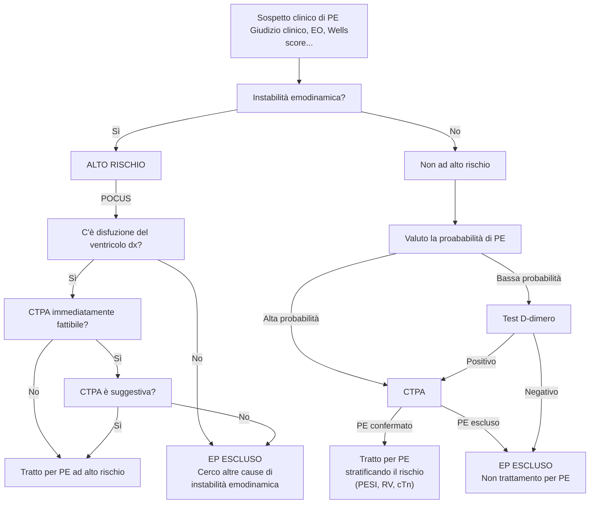
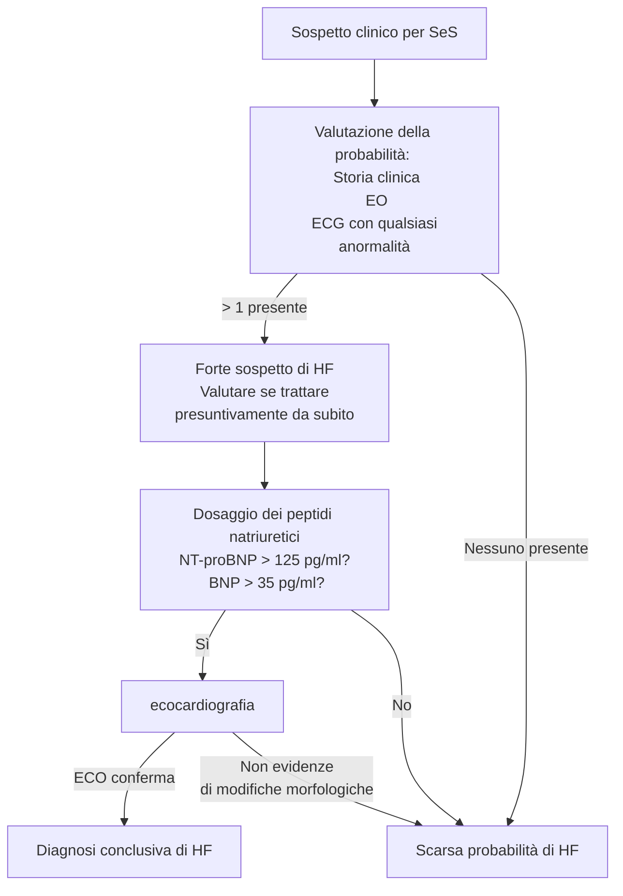

* * * *

<!-- mar 16 mar 2021, 16:11:26, CET -->

# Valvulopatie
<!-- Piovaccari -->

||Ventricolo sx | Ventricolo dx | Aorta | Arteria polmonare |
|-|-|-|-|-|
| Sistolica | 90--140 | 25--35 |90--140|25--35|
| Protodiastolica | -2^[neg per pressione intratoracica in espansione] -- 5 ||||
| Telediastolica | 8-12|4-8||
| Diastolica ||-2--0|60--90|5--15|
| Media |90||90|20|

- Valvulopatia --- patologia delle valvole cardiache (stenosi e/o rigurgito)
	- Valvulopatia provoca alterazioni dei parametri emodinamici nei dintorni della valvola stessa. Studiando l'emodinamica circostante + EO + clinica si giunge a dx

> __Soffi cardiaci__
>
>   
>- Usare intensità nella scala di Levine per descriverli
>- Descrivere sempre posizione (non limitarsi ai focolai classici, ma valutare irradiazione e direzione)
>- Valutarli in funzione del momento del ciclo cardiaco

- Per fare diagnosi di valvulopatia
	- Quadro clinico (ottima anamnesi _olistica_)
	- EO toracico e cardiovascolare per SeS orientativi di disfunzioni di circolo/congestione
	- ECG: ci sono aritmie?
	- ECO
		- TT per studiare normale funzione
		- TE se necessario
		- In casi selezionati: ecostress (`dobutamina`) per smascherare sintomi. Attenzione alla sicurezza, prima stratificare il rischio
	- Imaging coronarico

## Epidemiologia delle valvulopatie
- incidenza ↑ con ↑ età per degenerazione vlvolare
- Anni '50: picco in età giovanile per malattia reumatica
- Frequenza
	#. Valvulopatia mitralica da rigurgito
	#. Valvulopatia aortica
	#. Valvulopatia valvola polmonare
	#. Valvulopatia da endocardite
	#. Stenosi mitralica

> __Malattia reumatica post streptococica__
>
>- Fisiopatologia: vegetazione streptococcica su lembi valvolari porta a danneggiamento → riparazione → stenosi → incompetenza valvolare
>- Tipica in under 15aa in zone povere con alti tassi d'infezione per Streptococco
>	- Africa
>	- Asia meridionale
>- Mortalità in calo (per abx -- sulfamidici e penicillina), ma grandi differenze (1/$propto$ con ricchezza)
>- Possibile grave complicanza: ictus per tromboemboli secondari
>- Non sottovalutare incidenza in migranti

## Valvulopatia mitralica
- Apparato valvolare mitralico con 3 elementi (tutti e 3, se ostacolati, danno valvulopatia)
	#. 2 lembi valvolari (anteromediale e posterolaterale)
	#. 2 sistemi di corde tendinee
	#. 2 muscoli papillari
- 3 entità di valvulopatie
	- Stenosi
		- Reumatica (99%)
		- Congenita (corde tendinee fanno capo ad un unico m papillare -- "valvola a paracadute")
	- Da rigurgito (anche "___insufficienza mitrale___")
		- Acuta → forme infettive, ischemia dei mm papillari, prolasso dei lembi valvolari, rottura delle corde tendinee (es da trauma toracico)
		- Cronica → ischemia, prolasso dei lembi, endocardite infettiva, febbre reumatica, calcificazioni, cardiomiopatie (squilibri pressori)

### Stenosi mitralica (SM)
- ___Stenosi mitralica___ --- riduzione dell'orifizio mitralico quando la valvola è aperta
- __Area fisiologica dell'orifizio mitralico: 4--6 cm^2^__

	| Grado di SM | Area orifizio mitralico |Intensità HF tipicamente associata|
	|-|-|-|
	|SM lieve | 1,5--2 cm^2^ |NYHA 1|
	|SM moderata | 1--1,5 cm^2^ |NYHA 2--3|
	|SM grave | < 1 cm^2^|NYHA 4|
- Mitrale è valvola atrioventricolare che funge da sbarramento _di fatto_ nel ritorno del sangue dai polmoni:  SM ⇒ ↓ flusso a valle e stasi a monte ⇒ ↑ pressione nel circolo polmonare
	- Ipertensione polmonare (dapprima reversibile, poi permanente nonostante valvuloplastica risolva)
	- __Atrio__^[Il ventricolo non si dilata, perché di fatto la mitrale stenosata riduce il flusso verso il ventricolo proteggendolo dall'aumentato volume. Viceversa, l'atrio agirà da "camera di raccolta" del volume ematico che non defluisce verso il ventricolo e quindi si dilaterà. Ecco perché le aritmie da alterata conduzione sono atriali, nella stenosi mitralica] sinistro si ipertrofizza (ipertrofia concentrica) e/o si dilata per accomodare aumentati volumi (ipertrofia eccentrica)
- Corteo patologico associato
	- Ipertensione polmonare
	- CHF di grado variabile (edema polmonare, congestione epatica, edemi declivi, faticabilità)
	- Tendenzialmente AFib (per dilatazione e distensione parete atriale) ± RVR (che peggiora low-output per ↓ tempo di diastole)
	- Tromboemboli (per disturbo del flusso)
- Obiettività
	- __Auscultazione dei toni__
		- S1 aumenta di intensità
		- S2 normale (se non ipertensione polmonare)
		- Rullio diastolico con rinforzo presistolico^[Rullio dovuto al fatto che il ventricolo è molto pieno + soffio presistolico in corrispondenza della contrazione atriale attraverso una valvola stenosata. I suoni sono in diastole perché è in diastole che si ha flusso attraverso le valvole AV -- che sono continenti, ma stenosate. NB: in insufficienza il flusso è a valvola chiusa, quindi in sistole]
		- Schiocco di apertura della valvola^[più lo schiocco è vicino a S2 più la situazione è grave, poiché indica che ci sono subito grandi pressioni (da volume) sufficienti per aprire la valvola dopo poco]
	- ECG
		- P polmonari se RS
		- Tachicardia
		- AFib
	- Rx torace
		- Si visualizza bene auricola sinistra
		- Si visualizzano bene arterie polmonari (dx/sx)
		- Segni di congestione polmonare (circolo polmonare congesto, [linee di Kerley A|B|C](https://it.wikipedia.org/wiki/Linea_di_Kerley)...)
		- In proiezione lat si visualizza dilatazione atriale (a volte talmente marcata da spostare esofago, ma visibile sse si fa pasto bariato)
	- __Eco__
		- Si vede benissimo il comportamento valvolare (ispessimento dei lembi, apertura, area, gradiente di flusso al Doppler...) nell'eco TE, visto che si arriva fondamentalmente all'atrio
		- Possibile metodica per stimare area mitrale (in funzione di tempo di diastole, tempo di sistole, gradiente pressorio veno--arterioso dei capillari polmonari)
		- Consente di capire se insufficienza si accompagna a stenosi
		- Consente di stimare LVEF, importante per capire gravità della situazione
- Terapia
	- Chirurgia risolutiva (se beneficio > rischio, tipicamente sì se stenosi moderata/*severa*)
		- Valvuloplastica percutanea con palloncino^[Un palloncino viene gonfiato nell'orifizio mitralico per allargarlo. Fattibile solo se non grandi calcificazioni]
		- Valvuloplastica a cielo aperto
		- Sostituzione valvolare (insufficienza resistente a trattamento, calcificazioni gravi, anatomia sfavorevole)
	- Di mantenimento
		- `βb`/`digossina` per rate control
		- `diuretici` per decongestionare
		- `warfarin` (NAO controindicati^["per motivi anatomici", qualsiasi cosa voglia dire]) per evitare tromboembolismo (INR 2÷3)

### Insufficienza mitralica (IM)
- ___Insufficienza mitralica___ (IM) --- incontinenza dell'apparato valvolare mitralico che provoca flusso retrogrado
- A seconda dell'eziologia e della presentazione
	- Presentazione clinica
		- Acuta
		- Cronica
	- Eziologia
		- Degenerativa
		- Reumatica
		- Secondaria a patologie congenite
- Fisiopatogenesi
	0. Mitrale incontinente ⇒ 2 vie di uscita (aorta e atrio)
	1. Pressione atriale < pressione aortica ⇒ via atriale è preferenziale
	2. Dilatazione eccentrica + ↓ contrattilità atriale ⇒ stasi a monte ⇒
		- ↓ gittata cardiaca
		- ipertensione polmonare
		- ipertrofia atriale
		- ↑↑ insorgenza di aritmie per stiramento delle vie di conduzione
	3. Quando la mitrale si apre la massa ematica scende in ventricolo ⇒ ipertrofia _anche_ ventricolare ("_cor bovinum_", dilatazione del cuore sx)
- Obiettività
	- Auscultazione cardiaca
	- Eco
- Trattamento: variabile in funzione di entità sintomi
	- Valutare opportunità (r/b) di riparazione con valvuloplastica (ci sono varie tecniche)

#### IM acuta
- Condizione in cui l'IM si instaura in modo acuto o subitaneo
	- Perforazione/rottura di un lembo valvolare
	- Rottura delle corde tendinee
	- Disfunzione/rottura dei mm papillari (tipicamente da infarto)
	- Disfunzione protesica
- Obiettività
	- Eco/ventricolografia: ventricolo si contrae bene (è insorgenza acuta, riesce ancora a fare fronte ad aumentato carico)
	- Nelle curve pressorie: c'è "onda V", corrispondente a flusso retrogrado del sangue in atrio durante la sistole

#### Prolasso della mitrale
- IM dovuta a prolasso di almeno uno dei lembi valvolari; poiché i lembi non collabiscono porta ad insufficienza valvolare
	- f:m = 2:1
	- Anziani forme frequentemente gravi
	- Turbolenza del flusso e stasi ⇒ ↑↑ rischio di endocardite batterica
	- Decorso tendenzialmente benigno, ma correlato con > incidenza di morte cardiaca imprvvisa
- Quadro sintomatico varia in funzione di entità e velocità d'insorgenza del rigurgito
	- Eco: ventricolo dilatato, anulus allargato, flapping della valvola
	- Ses di IM (possibilmente acuta) ± dolore toracico
	- Obiettività auscultatoria: click valvolari (proto/meso/telediastolico) per flapping + soffio (tendenzialmente telesistolico). L'obiettività auscultatoria cambia tra clino/ortostatismo/squatting (per cambiamento assetto emodinamico intracardiaco

## Valvulopatia aortica
- Anatomia: 3 porzioni semilunari (2 cuspidi coronariche + 1 non coronarica)
	- Valvola bicuspide in 1--1.5%
	- Malformazioni rare: Valvola monocuspide, quadricuspide
- __Area fisiologica anulus = 4 cm^2^__

### Stenosi aortica (SA)
- Valvulopatia più frequente in EU e USA (21--26% popolazione >65aa)
- 3 sottotipi
	- SA sopravalvolare (congenita)
	- SA valvolare (congenita o acquisita)
		- Degenerativa calcifica (senile)
		- Congenita (non 3 cuspidi, bicuspidismo è alterazione più diffusa)
		- Postreumatica (poco diffusa)
		- Protesica (in aumento, vita normale protesi valvolari biologiche è 10--15 (teorica), ma 7--10 nella pratica)
	- SA sottovalvolare (congenita, entra in ddx con cardiopat ipertrofica ostruttiva)
- Patogenesi
	0. Valvola normale
	1. Sclerosi valvolare con meccanismo analogo ad aterosclerosi (LDL, insudazione, macrofagi schiumosi, ossidazione delle LDL, organizzazione della placca)
	2. Stenosi valvolare per sclerosi dei lembi che diventano rigidi e ipomobili
	3. Produzione di un __gradiente pressorio__ tra ventricolo sx ed aorta ⇒ ristagno in ventricolo sinistro (LVPO, Left Ventricole Pressure Overload)
		- Ipertrofia concentrica ⇒ ↓ densità di distribuzione dell'ossigeno ⇒ ↑ sofferenza del miocardio
		- LV noncompliante e rigido
		- Se fail LV (aritmia, ↑ domanda, decadimento funzionale)⇒ AHF/CHF
	4. Possibile dilatazione atriale secondaria a insufficienza LV
		- SE si perde il kick atriale E il ventricolo sx è già affaticato/rigido/ipertrofico si possono determinare stati di bassa portata molto pericolosi (EP, ipotensione)
- SeS
	- Dispnea (ingravescente col progredire)
	- Angina da sforzo (indistinguibile per SeS da SCA)
	- Sincope da sforzo (segno di inadeguata portata)
- Obiettività cardiovascolare
	- SeS orientativi di HF sx (torace umido, polso alternante)
	- Polso parvo e tardo (scarsa ampiezza, picco ritardato e discesa lenta)
	- Soffio nel focolaio aortico
		- S1 ok o ridotto
		- S2 potenzialmente coperto da soffio (più è coperto, più stenosi è grave)
		- Soffio (meso)sistolico "a diamante"
		- Possibile irradiazione
		- Possibile S4 (presistolico) da contrazione atriale vigorosa per vincere ipertrofia ventricolare
		- Possibile click dopo S1 che indica apertura improvvisa della valvola
	- Ecg: segni di ipertrofia ventricolare (Sv2+Rv5 > 35mm) ± possibili T invertite (anomalie della ripolarizzazione secondarie ad ipertrofia). Possibili segni di interessamento atriale in patologia che progredisce
	- RX torace: segni di ipertrofia ventricolare ± segni di calcificazione dell'anello aortico
	- ⭐️ Eco
		- Stima dell'anulus valvolare^[Se non misurazione diretta, si può sempre usare la [Formula di Gorling](https://it.wikipedia.org/wiki/Calcolo_dell%27area_valvolare_aortica)]

			| Severità SA | Area |
			|-|-|
			| Non SA | 3.5--4 cm^2^|
			| Severa | < 1 cm^2^ |
			| Critica | 0.5--0.7 cm^2^ |
		- Ispessimento delle cuspidi
		- Ipocinesia valvolare
		- Ipertrofia ventricolare
		- Eventuali concomitanti insufficienza mitralica dovuta a variazione dell'anatomia che l'ipertrofia concentrica del vent sx impone sull'anulus mitralico
		- Misurazione del gradiente pressorio ventricolo--aorta (max e media): grave > 40 mmHg (SA moderata se > 30 mmHg)
		- Se eco sforzo (attenzione, solo pz. selezionati!) possibile slatentizzare forme solo precedentemente sospettate oppure valutare effettiva severità di SA in situazioni precedentemente dubbie/mal valutabili
- Terapia
	- Gestione dei sintomi e ottimizzare la gestione dello scompenso
	- Per risolvere realmente^[Prognosi operati vs non operati è drammaticamente a sfavore dei non operati]: valvuloplastica (attenta valutazione _olistica_ r/b)
		- Valvuloplastica con palloncino (soluzione temporanea, dopo 1--3aa valvola ritorna a chiudersi). Ripetibile qb
		- TAVI --- Trans-catheter Aortic Valvular Implant (protesica/biologica)
		- Sostituzione valvolare a cielo aperto con valvola (protesica/biologica)

### Insufficienza aortica (IA)
- ___IA___ --- non completa chiusura dell'apparato valvolare aortico
	- Anomalia nelle cuspidi (retrazione, perforazione, trauma, prolasso)
	- Anomalie nell'aorta (aortite, sifilide, Marfan, dilatazione, dissezione)
- Acuta o cronica
	- Acuta è quadro drammatico: se ventricolo non si adatta a sovraccarico si determina EPA in zero secondi
- Fisiopatologia
	0. Valvola aortica normale
	1. Valcola aortica incontinente
	2. Rigurgito in ventricolo, con sovraccarico di volume
	3. Dilatazione del VNs → ipertrofia eccentrica ⇒ ↓ contrattilità ⇒ ↓ FE, HF sx
- SeS
	- Angina pectoris (difficile irrorazione da parte delle coronarie)
	- Dispnea (HF)
	- Sincope (bassa portata)
- Obiettività cardiovascolare
	- ↑ PA differenziale (per ↓↓ PAD a causa del rigurgito, fino a PAD di 40 mmHg)
	- Tipicamente polso ampio, celere, scoccante
	- Tipicamente "danza delle arterie": movimento delle arterie omerali o delle carotidi (riscontro anche nel giovane per tono adrenergico)
	- Segno di de Musset: scosse ritmiche del capo sincrone con polso
	- Segno di Quincke: pulsazioni evidenti nel letto ungueale a seguito di piccola compressione
	- Soffio diastolico decrescendo--crescendo
		- S2 meno intenso (le semilunari non si toccano)
		- Soffio ad alta frequenza (meglio con diaframma ben adeso)
		- Soffio copre diastole ⇔ insufficienza _non_ severissima (non si hanno ancora altre pressioni diastoliche ventricolari a causa del rigurgito)
- Terapia
	- Chirurgia
		- Sostituzione valvolare meccanica
		- TAVI ha meno possibilità, non si ha valvola stenosata che trattiene l'impianto. Possibile considerarla su valvola biologica quando questa arriva a fine vita (metodica _valve in valve_)
	- Gestione
		- βb __non__ indicati, bradi aumenta tempo di diastole e peggiora rigurgito

> __*Sindrome di Marfan*__  
> Disordine ereditario del connettivo, a causa di mutazione (autosomica dominante) del gene della fibrillina-1, componente del connettivo.
>
> Segni: pollice mano che passa oltre il polso, petto escavato, dislocazione del cristallino, possibilità di circondare ampiamente il proprio polso con pollice e medio
>
> Conseguneze: msk, cardiovascolari, visive, sistema nervoso, apparato respiratorio, altro.
>
> Notevole in questo ambito: insufficienza aortica progressiva per dilatazione dell'anulus, ↑ rischio di dissezione aortica, ↑ probabilità aneurisma

## Valvulopatia della tricuspide

### Stenosi della tricuspide

### Insufficienza della tricuspide
- Fisiopatologia
	1. Tricuspide insufficiente
	2. Dilatazione dell'atrio
	3. Scompenso (congestizio) dx -- prima atrio poi ventricolo
- Eziologia prevalente: endocardite infettiva (batterica o fungina)
	- Clinica
		- Febbre
		- Noduli di Osler (aggregati di immunocomplessi che embolizzano nel microcircolo)
		- Emorragie sottoungueali
		- Petecchie congiuntivali
		- diffusione (e colonizzazione potenziale) in ogni distretto vascolarizzato
	- Terapia: lunga, aggressiva e difficile in pz. con valvola protesica
		- Antibiotici aggressivi, ev continua, per lungo tempo. Obiettivo: altissime concentrazioni ematiche, perché devices protesici non sono vascolarizzati e bisogna distruggere il biofilm
		- Rimozione chirurgica di vegetazioni se > 15 mm per rischio embolico
			- Vegetazione visibile ad Eco TT (SPIN 70%) ma ancora meglio a Eco TE

## Valvulopatie della polmonare
- Congenite, molto rare
- Trattate con valvuloplastica/palloncino anche in bambini appena nati
- Molto rare

# Aritmie
- __Aritmia__ --- ritmo cardiaco anomalo in (1) frequenza, (2) regolarità o (3) modalità di genesi o conduzione dell'impulso

|       | Eziologia                   | Aritmia                                                                     |
|-------|-----------------------------|-----------------------------------------------------------------------------|
| Bradi | ↓ automaticità SA           | Bradicardia sinusale                                                        |
|       | Alterata automaticità SA    | Sindrome braditachiaritmica                                                 |
|       | Blocco di conduzione        | BAV                                                                         |
| Tachi | ↑ automaticità SA           | Tachicarrida sinusale                                                       |
|       | Trigger                     | BES e BEV                                                                   |
|       | Trigger (EAD)               | Tachicardie ventricolari polimorfiche a QT lungo (TdP)                      |
|       | Trigger (DAD)               | Tachicardie ventricolari monomorfe a QT normale (multifocali o focali) (\*) |
|       | Circuito di rientro/Trigger | TV e FV (\*)                                                                |
|       | Circuito di rientro         | Flutter atriale                                                             |
|       | Circuiti di rientro         | Fibrillazione atriale                                                       |
|       |                             | Tachicardia intranodale                                                     |
|       | Circuito di rientro         | Tachicardia parossistica sopraventricolare (ANVRT/AVRT)                     |


## Bradiaritmie
- Aritmie con FC ≤ 60 bpm
- I meccanismi di genesi sono 2: ridotta automaticità e blocchi di conduzione
1. ↓ automaticità^[Produce generalmente bradicardie sinusali]
		- Da ↑ tono parasimpatico (_rest & digest_, ipertrofia cardiaca di atleti, IM inferiore^[Infarto del miocardio dovuto a una ostruzione dell'arteria coronaria dx, che porta alla necrosi di una porzione inferiore della parete cardiaca. Questo mima gli effetti di un'aumentato tono vagale, aumentando i tempi necessari per propagare il potenziale d'azione -- diminuendo, di fatto, l'automatismo -- e portando a cali di frequenza])
		- Da rallentamento della conduzione attraverso il nodo AV (principalmente per farmaci (βb, ca-ant, digossina)
		- Sbilanciamenti elettrolitici (__iperkaliemia__)
		- Da ↓ attività metabolica dei cardiomiociti (ipotermia, ipotiroidismo marcato)
		- ↑ ICP
	2. Blocchi di conduzione del nodo AV
		- Iperkaliemia
		- Infarto che interessa il nodo AV (solitamente infarti inferiori)
		- `βb`, `ca-inibitori`, `digossina`
		- Infiltrazioni del nodo AV (__*amiloidosi*__, __*sarcoidosi*__)
		- Endocardite da __*malattia di Lyme*__
		- Fibrosi idiopatica (età)

### Bradicardia sinusale
- Non trattata se pz. asintomatica
- Se sintomatica
	1. valutare origine
	2. `atropina` in situazioni estreme se emodinamica preoccupant

### Blocco del SA
- Vedi elettivo

### Sindrome braditachiaritmica
- Disritmia del SA in cui si alternano periodi di tachi a peiodi di bradi
- Tipico: nonnino con tessuto SA fibrotico o atri fibrotici ⇒ si instaurano circuiti a random e producono tachi, quando si interrompono sopravanza il seno -- il quale è malato e fa bradi

### Blocco Atrio--Ventricolare
- Per dettagli vedi elettivo
- Dividiamo i BAV in 3 gradi
	1. BAV di 1/o grado
	2. BAV di 2/o grado
	3. BAV di 3/o grado
- L'eziologia della BAV è variabile:
	- Cause intrinseche
		- Esiti ischemici
		- Anomalie cardiache congenite
		- Difetti valvolari (calcificazioni dell'ostio valvolare possono danneggiare il sistema di conduzione)
	- Cause estrinseche
		- Disturbi elettrolitici (es: iperkaliemia)

#### BAV di primo grado
- Allungamento del PR > 200ms
- Tendenzialmente asintomatico

#### BAV di secondo grado
- __Ogni tanto una P viene bloccata__ ⇒ una P non sequita da QRS e T
- Si individuano 2 forme, che rispecchiano la sede del blocco
	1. BAV Mobitz 1 (di Luciani-Wenckebach)
		- Generalmente blocco "alto", nella parte craniale del nodo AV ⇒ il ritmo di scappamento che emerge ha frequenza alta
	2. BAV Mobitz 2
		- Generalmente blocco "basso", nella parte bassa del nodo AV o nel fascio di HIS ⇒ il ritmo di scappamento che emerge ha frequenza bassa ⇒ ↑↑ rischio di insorgenza di bradicardie importanti/BAV completo
			- Trattamento con PM non glielo leva nessuno

#### BAV di terzo grado
- Dissociazione atrioventricolare completa
- __Le onde P e i QRS sono dissociate__ per un blocco _completo_ del nodo AV
	- All'ECG: medesime distanze $\bar{PP}$, $\bar{RR}$, ma le distanze $\bar{PR}$ non sono assolutamente costanti
- L'attivazione ventricolare è sempre, quindi, per scappamento
	- Se va bene il ritmo di scappamento è alto, con una frequenza ancora accettabile\
	
	- Se va male il ritmo di scappamento è basso (anche ventricolare) ⇒ frequenza bassa e morfologia dei QRS tipica)

#### Trattamento
1. Valutare se pz. è stabile o no
2. Valutare se è opportuno intervenire (se basso grado ha senso aspettare)
3. Se causa reversibile: trattare la causa
4. Trattare i sintomi acuti
	- Bradicardia ⇒ `atropina`^[\ini tono vagale (antagonista competitivo dell'acetilcolina sui recettori muscarinici) ⇒ ↓ tono vagale ⇒ ↑ FC]
		- Se blocco è basso atropina potrebbe paradossalmente aumentare il grado del blocco per riduzione del filtro della parte alta AV
		- Evitare se glaucoma
	- Se blocco è basso o non rispondente ad atropina: inotropi (cautela, possibile proaritmia)
	- Se non risposta: terapia elettrica + monitoraggio continuo
		- Pacing trans--cutaneo^[Preferire posizionamento delle piastre anteroposteriore! Questo è perché è necessario stimolare i ventricoli. Necessario sedare il pz. perché è doloroso, anche se pacer cattura]
		- Pacemaker temporaneo (con inserimento percutaneo [secondo Seldinger](https://en.wikipedia.org/wiki/Seldinger_technique))
5. Valutare terapia cronica (pacemaker)

> __Pacemaker__
>- Condizioni che vanno trattate con pacemaker
>	- BAV 3
>	- BAV 2 Mobitz II sintomatico
>	- Malattia del nodo del seno sintomatica
>	- Sindrome da iperattivazione del seno carotideo che impatta gravemente QoL
>	- Bradiaritmie importanti
>- Condizioni che possono essere trattate con pacemaker
>	- BAV congenito
>	- BAV 2 Mobitz 1
>	- BAV 2 Mobitz 2 asintomatico (meh... PM indicato)
>	- Malattia del nodo del seno con sintomi minori

>Ogni pacemaker viene categorizzato con una sequenza di 3 o 4 lettere a seconda delle funzionalità (tendenzialmente si usano pacemaker `DDD`)
>
>  
>
>Per quanto riguarda oggetti che producono campi elettromagnetici tendenzialmente la regola è
>
>- I dispositivi industriali/elettromedicali possono dare problemi
>- Il cellulare va tenuto a debita distanza (> 15 cm)
>- Gli elettrodomestici quotidiani (o l'antitaccheggio) non danno problemi
>- I magneti su pacemaker attivano il cosiddetto _red-switch_ del pacemaker, facendo in modo che stimolino a frequenza fissa (~ 80--100 bpm). Molta attenzione se esiste un ritmo sottostante: se il pacemaker stimola al momento sbagliato possono insorgere aritmie ventricolari

## Blocchi di branca
- Blocchi di conduzione a livello di una delle due branche
	- Blocco di branca destra (BBDx)
	- Blocco di branca sinistra (BBSx)

### BBdx
- All'ECG
	- QRS > 120 ms
	- Comparsa di R' in derivazioni che guardano a destra
	- Onda S specularmente in laterali che guardano vent sx

### BBsx
- Fisiologia
- All'ECG
	- QRS > 120 ms
	- Q assente in V5 e V6
	- QRS con incisura in V5,6, avL
- BBsx ha maggiore probabilità di essere patologico
	- Se nuova insorgenza può essere espressione di IMA (anche se meno specifico di ST-elevation, perché bbsx può svilupparsi in numerose condizioni parafisiologiche/patologiche)

### Emiblocchi
- Blocchi dei fascicoli (tendenzialmente a sx)
- All'ECG
	- Scarsa crescita della R nelle precordiali
	- Deviazione d'asse

### Aberranze di conduzione
- BB che si sviluppa solo sopra (o raramente, sotto) a certe frequenze
	- In caso di tachiaritmie sopraventricolari
	- In caso di sforze
	- Raramente se bradiacardie

## Tachiaritmie
- Le tachiaritmie vengono divise a seconda della durata dei sintomi
	- Parossistiche --- va e viene a cazzo
	- Persistente --- c'è, e te la tieni fino al trattamento
	- Permanente --- c'è, e te la tieni nonostante il trattamento
- La distinzione principale da fare in ambito di tachicardie è rispetto alla sede d'origine (atriali -- o sopraventricolari -- vs ventricolari)
	- Tachicardie sopraventricolari
	- Tachicardie ventricolari
- I meccanismi di genesi sono 3: aumentata automaticità, trigger e circuiti di rientro
	1. Da aumentata automaticità del  nodo SA^[Produce generalmente tachicardie sinusali]
		- Da ↑ tono ortosimpatico (_fight or fly_, ipovolemia, ipossia^[Da anemia, pneumopatie, embolia polmonare...], dolore, stati ansiosi importanti...)
		- simpaticomimetici (`adrenalina`, `noradrenalina`, `dopamina`, cocaina, metanfetamina)
		- Da ↑ attività metabolica (ipertermia, febbre, ipertiroidismo...)
		- Sbilanci elettrolitici (__↓ K^+^__)
	2. Da trigger (da presenza di zone trigger _ectopiche_ [= non da cellule pacemaker, ma da fluttuazioni del potenziale di membrana di generici cardiomiociti], dalle quali _parte_ un impulso accessorio che non segue la normale via di conduzione del cuore)^[]^[[EAD vs DAD](img/ead-dad.png)]
		- EADs (Early AfterDepolarization) --- impulso ectopico che parte prematuramente, interrompendo la normale fase di depolarizzazione dei cardiomiociti^[Produce tachicardie ventricolari polmorfiche a QT lungo, chiamate dagli amici __*torsioni di punta*__. Vtach polimorfa non bella.]
			- __Da ↓ K^+^__, ↓ Ca^++^, ↓ Mg^++^
			- Da anti-Aritmici (A)
			- Da anti-Biotici (B)
			- Da anti-psiCotici (C)
			- Da anti-Depressivi (D)
			- Da anti-Emetici (E)
		- DADs (Delayed AfterDepolarization) --- impulso ectopico che parte a depolarizzazione dei cardiomiociti completata^[Produce tachicardie ventricolari monomorfiche a QT normale, ovvero tachicardia focale e tach multifocale]
			- ↑ tono simpatico
			- Da ischemia
			- Da ipossia
			- Da infiammazione del miocardio
			- Da stiramento dei miocaridociti (cardiomiopatia dilatativa, rigurgiti valvolari)
			- Da `digossina≠`
	3. Da rientro (da circuiti che si instaurano lungo il normale sistema di conduzione quando questo presenta un ostacolo non conduttivo. Perché si crei il rientro i circuiti devono condurre l'impulso a velocità differente)\

		- Per tessuto cicatriziale non conduttivo
		- Per fibrosi idiopatica (età)

### Battiti ectopici (BES e BEV)
- Individuiamo 3 tipi di battiti ectopici
	1. Battiti ectopici sopraventricolari (BES)
	2. Batti ectopici giunzionali
	3. Battiti ectopici ventricolari (BEV)
- Non hanno ruolo prognostico negativo (il trattamento non aumenta la sopravvivenza) a meno che non siano così tanti da avere cardiomiopatie dilatative

### Tachicardia sinusale
- Solitamente < 150 bpm (raro che superino questa frequenza)
- Diagnosi: FC > 100 e ritmo sinusale
	- Ogni QRS ha la sua P
	- Ogni QRS ha la sua T
	- P ↑ in 2 e avF

### Flutter atriale
- __Attivazione _regolare_ dell'atrio ad una frequenza elevata (200-300 cicli pm)__ seguite, ogni _tot_ da un complesso QRS
	- Ogni quanto compare il QRS dipende dalla refrattarietà del nodo (frequenza fissa vs variabile)
- All'ECG
	- Aspetto "a dente di sega" (onde P vengono chiamate onde F in questo caso specifico)
- ↑ ritmo tromboembolico (per movimento turbolento della parete atriale che non garantisce un flusso ordinato e continuo)

### Fibrillazione atriale
- Tipica di sg. anziani
- ↑ ritmo tromboembolico (per movimento disorganizzato della parete atriale che non garantisce un flusso ordinato e continuo)
- Insorgono come parossistiche ⇒ difficile diagnosi a meno di Holter o simili
	- Specialmente all'inizio: nel 50% dei sg. regrediscono < 8h
	- Le linee guida dicono di monitorare i pz. a rischio, ma non è semplice
	- Il paziente a rischio è
		- Rischio di stroke/tromboembolismo(calcolare score CHADS-VASc)
		- Sintomi da aritmia
		- Comorbidità
- All'ECG
	- Linea basale finemente o grossolanamente irregolare
	- Ritmo irregolarmente irregolare è patognomonico (ci sono talmente tante p che una ad un certo punto viene condotta)

#### Gestione del pz. con fibrillazione atriale
#. Prevenzione del rischio tromboembolico: valutare anticoagulazione (tp. OAC o VKA^[Vit K Antagonist, eg `warfarin`] in pz. con valvola protesica) con score __CHA~2~DS~2~--VAS~2~C__
	- CHADS-VASC = 0 (M) o 1 (F) → Non necessario trattamento antitrombotico
	- CHADS-VASC > → considerare (=1 (M) o 2 (F)) o impostare (≥ 2 (M) o ≥ 3 (F)) OAC
		- Stratificare i pz. in funzione del rischio di sanguinamento (score HAS-BLED)
		- Alto rischio di sanguinamento da LG non è ragione per non fare anticoagulanti, solo per fare followup più aggressivo
#. Terapia dei sintomi
	- __Rate control__ (↑ filtro AV)
		- `βb`, `Ca-ant`, `digitale`
	- __Rythm control__^[Ma questo ha efficacia limitata, spesso FA è parossistica e ritorna. Cardioversione a RS spontanea in 50% pz.]
		- Antiaritmici
		- Cardioversione elettrica
			- Non indicata se pz. non è scoagulato da > 3 settimane (arresto brusco della parete atriale può portare a distacco dei trombi)
				- Ok se fibrillazione insorta certamente < 12h (rischio ~ 0.3%)^[Tecnicamente nelle linee]
				- Ok se pz. correttamente scoagulato (INR in range terapeutico)
				- Ok se eco TE esclude trombi
		- Ablazione transcatetere
#. Valutare tp. anticoagulante a lungo termine
	- Valutare CHADS-VASC

		| Score                  | Risk     | Anticoagulation Therapy                 | Considerations                                                                                                                                                                                                    |
		|-|-|-|-|
		| 0 (male) or 1 (female) | Low      | No anticoagulant therapy                | No anticoagulant therapy                                                                                                                                                                                          |
		| 1 (male)               | Moderate | Oral anticoagulant should be considered | Oral anticoagulant, with well controlled vitamin K antagonist (VKA, e.g. warfarin with time in therapeutic range >70%), or a direct oral anticoagulant (DOAC, e.g. dabigatran, rivaroxaban, edoxaban or apixaban) |
		| 2 or greater           | High     | Oral anticoagulant is recommended       | Oral anticoagulant, with well controlled vitamin K antagonist (VKA, e.g. warfarin with time in therapeutic range >70%), or a direct oral anticoagulant (DOAC, e.g. dabigatran, rivaroxaban, edoxaban or apixaban) |
	- Punteggio CHADS-VASC correla con rischio di stroke ad 1aa
	- Stratificare rispetto a rischio di sanguinamento (score HAS-BLED) per correggere fattori che predispongono a diatesi emorragica
#. Gestire i fattori d rischio
	- HTN
	- Inattività
	- OSAS
	- Alcool
	- Assetto lipidico
	- BMI
	- Fumo
	- Glicemia e diabete

> __Score per il rischio di tromboembolismo in pz. con FA non valvolare (CHA~2~DS~2~-VASc)__
>
>|     | Condition                                                                                            | Points |
>|-|-|-|
>|  C  |  Congestive heart failure (or Left ventricular systolic dysfunction)                                 | 1      |
>|  H  |  Hypertension: blood pressure consistently above 140/90 mmHg (or treated hypertension on medication) | 1      |
>|  A2 |  Age ≥75 years                                                                                       | 2      |
>|  D  |  Diabetes Mellitus                                                                                   | 1      |
>|  S2 |  Prior Stroke or TIA or thromboembolism                                                              | 2      |
>|  V  |  Vascular disease (e.g. peripheral artery disease, myocardial infarction, aortic plaque)             | 1      |
>|  A  |  Age 65–74 years                                                                                     | 1      |
>|  Sc |  Sex category                                                                      | F → +1      |
>
>__Score per stratificare il rischio di sanguinamento (HAS-BLED)__
>
>|     | Condition                                                                                                                                                            | Points |
>|-----|----------------------------------------------------------------------------------------------------------------------------------------------------------------------|--------|
>|  H  |  Hypertension: (uncontrolled, >160 mmHg systolic)                                                                                                                    | 1      |
>|  A  |  Abnormal renal function: Dialysis, transplant, Cr >2.26 mg/dL or >200 µmol/L<br>Abnormal liver function: Cirrhosis or Bilirubin >2x Normal or AST/ALT/AP >3x Normal | 1<br>1 |
>|  S  |  Stroke: Prior history of stroke                                                                                                                                     | 1      |
>|  B  |  Bleeding: Prior Major Bleeding or Predisposition to Bleeding                                                                                                        | 1      |
>|  L  |  Labile INR: (Unstable/high INR), Time in Therapeutic Range < 60%                                                                                                    | 1      |
>|  E  |  Elderly: Age > 65 years                                                                                                                                             | 1      |
>|  D  |  Prior Alcohol or Drug Usage History (≥ 8 drinks/week)<br>Medication Usage Predisposing to Bleeding: (Antiplatelet agents, NSAIDs)                                   | 1<br>1 |


### Tachicardia atriale focale

### Tachicardia intranodale

### Tachicardie sopraventricolari da rientro
- 2 tipi, a seconda di dove si instaura il rientro: AVRT vs AVNRT
	- AVRT: tachicardia da rientro passante per via anomala che si chiude in atrio. Esempio tipico: WPW (il fascio prende il nome di "via di Kent")
		- Ortodromica: segue il flusso di conduzione normale (SA → AV → His → branche → Purkinje → Kent → AV)
			- A QRS stretto (la polarizzazione dei ventricoli è tutto sommato normale)
		- Antidromica: anticipa e oppone il flusso di conduzione (SA → Kent → Purkinje → branche → His → AV → Kent)
			- A QRS largo (la polarizzazione dei ventricoli non è corretta)
			- Statisticamente più rara
	- AVNRT: tachicardia da rientro in cui il circuito di rientro è intranodale

#### Trattamento e gestione
- Manovre vagali (diminuiscono automatismo del nodo AV e aumentano la sua funzione di filtro)
	- Massaggio del seno carotideo
	- Diving reflex
	- Manovra di valsalva (anche modificata)
	- Compressione dei bulbi oculari (pericolosa, danno ai bulbi)
	- Induzione del riflesso del vomito, eruttazioni
- Farmaci
	- Che agiscono sul nodo AV
		- `adenosina` (può portare broncocostrizione, va fatta in bolo _+ flush_!)
		- `verapamil`
		- `diltiazem`
	- Che agiscono su nodo AV e su via anomala
		- `propafenone`
		- `flecainide`
		- `amiodarone` (molta attenzione ad effetti collaterali, principalmente ↑ QT)
- Cardioversione elettrica
- Trattamento definitivo: ablazione transcatetere a radiofrequenza della via di rientro

### Tachicardie ventricolari
- Run di > 3 battiti di origine ventricolare con frequenza > 120 bpm
	- Non sostenuta se < 30''
		- Non prognosi negativa in sg. sano (se cardiopatia sottostante la prognosi dipende dalla cardiopatia)
	- Sostenuta se > 30'' ⇒ da interrompere speedy, o alto rischio compromissione emodinamica (sincope, bassa portata (fino a pVT), degenerazione in FV)

### Fibrillazione ventricolare

### Torsione di punta
- VTach polimorfa (QRS vedo che sono sia larghi che stretti)
- Eziologia
	- Bradi (B di HISDEBS)
	- Ipokaliemia
	- Uso di farmaci che allargano il QT (allungano la ripolarizzazione) ⇐ R su T
	- QT lungo congenito

<!-- ven 16 apr 2021, 16:48:27, CEST -->

# T-LOC^[Transient Loss Of Conscience] di pertinenza cardiologica

## Sincope
- __*Sincope*__ --- perdita __transitoria__ dello stato di coscienza caratterizzata da __rapida insorgenza__ , __breve durata__ e __recupero spontaneo__ senza sequele. La causa è una __ipoperfusione cerebrale transitoria__ globale
	- Sintomo, non dx
	- Prodromi _talvolta_ (50--70% pz.) presenti
	- Ha grande impatto sulla QOL (sopratutto in pz. anziano/comorbido)
	- Andamento bimodale nella popolazione: picco a 15-20aa, poi aumento progressivo da 60aa in poi
	- 40% ez indeterminate
- Attenzione: ci sono cause non sincopali che producono un quadro che mima la sincope
	- LOC per causa neurogena (es: epilessia)
	- Fenomeni psichiatrici
	- Disordini metabolici (iperventilazione [⇒ ipocapnia], ipoglicemia)
	- Ischemia vertebrobasilare
- Attenzione: ci sono cause non cardiologiche che producono un quadro che mima la presincope
	- Cataplessia^[Perdita del tono muscolare]
	- Drop attacks (ischemie del circolo posteriore ⇒ altearzione di equilibrio e propriocezione)
	- Cadute
	- narcolessia
	- Ischemie carotidee
- Patofisiologia (ez prevalenza calante)

	

	- Neuromediata
		- Riflessi autonomici inappropriati in risposta a stimoli (stress, clima ambientale, ortostatismo) ⇒ alterazione dell'enmodinamica per una collaborazione di 2 aspetti (continuum)
			- Prevale la vasodilatazione → sincope vasodepressiva
			- Prevale la bradicardizzazione → sincope cardioinibitoria
		- Tipici esempi
			- Vasovagale (da stimolazione del vago)
			- Situazionale (attivazione del riflesso di valsalva o del diving reflex)
	- Ortostatica
		- Da alterazione del SNA (patologie primitive o secondarie^[Parkinson, atrofie sitemiche multiple, DM, amiloidosi, anemia, CKI, lesioni mieliche] del SNA portano a disriflessia autonomica che non consente di gestire bene i necessari cambiamenti nel passaggio tra clino→ortostatismo)
		- Da agenti esterni: farmaci con azione ipotensiva o attivi sul SNA potenziano disriflessia autonomica o situazioni di deplezione di volume
	- Cardiogena
		- Da aritmia (bradi/tachi/BAV). Sopratutto nei momenti di passaggio da o verso RS
		- Da riduzione della gittata (problemi di precarico, postcarico, riduzione della contrattilità)
			- IMA (particolarmente se molto estesi si ha grande ↓ contrattilità. Se IMA dx invece si può avere attivazione vagale riflessa e ipotensione)
				- Sincope durante primissimo periodo postinfarto (30gg) _devono_ preoccupare e far pensare ad eventi maggiori
			- Stati ipotensivi
			- EP, sopratutto se massivi, per drastica riduzione del precarido sinistro
			- Valvulopatie (particolarmente stenosi valvolare). Sincope in pz. con valvulopatia è evento prognostico importante, _deve_ produrre accertamenti diagnostici e gestionali perché è indice di situazione in peggioramento _acuto_ che può essere preambolo di morte improvvisa -- questo perché è spia di inadeguatezza ad adattare la perfusione alle richieste momentanee
			- Da cardiopatia ipertrofica (se sincope in cardiopatia pensare ad aritmia grave, auspicabilmente risolta se il pz. arriva da noi cosciente)
	- Cerebrovascolare
- Prognosi in funzione dell'eziologia che sottende la sincope e dal rischio di trauma che porta la sincope
	- Se prodromi il pz. è più tutelato dal rischio di trauma
	- Comorbidità (tra cui età, rischio c/v, BMI, farmaci) possono aggravare prognosi
		- Anziano ha prognosi peggiore rispetto al giovane
	- Situazioni di rischio (es: lavoro in setting pericoloso, tipo autista, lavoratore edile, ecc) _devono_ imporre maggiore cautela gestionale
	- Rischio di mortalità è doppio se l'eziologia della sincope è cardiaca, mortalità non cambia se eziologia è neuromediata
- Importante è fare corretta diagnosi del meccanismo patofisiologico sottostante (EO + anamnesi hanno buona resa diagnostica in > 50% sg.)
	- Anamnesi
		- Circostanze in cui si trovava sg. prima dell'evento (posizione,cosa stava facendo, situazione, ambiente)
		- Approfondire eventuali prodromi
		- Approfondire SeS dell'evento
			- Cute: colore, sudorazione
			- sintomi autonomici
			- Dolore
			- Cardiopalmo?
			- perdita degli sfinteri?
			- Clonie/tonie? (molto rari in sincope vera, poi avvengono tardivamente secondariamente a ipoperfusione cerebrale prolungata)
		- Approfondire come si è concluso l'evento
		- APP/APR neurologica, cardiovascolare
	- EO
		- Cardiovascolare
		- Valutare opportunità^[Valutare quantomeno ad EO lo stato dei tronchi sovraortici, non vogliamo far venire un ictus al pz. per vedere se forse questo potrebbe avere nei nostri sogni un problema di iperriflessia autonomica] di fare il massaggio del seno carotideo durante EO (clino e ortostatismo) durante ECG
		- Si possono fare test (tilt test/con `isoprotenololo`/con `nitrati`) per tentare di provocare la sincope
	- ECG 24h (ECG12 standard o studio elettrofisiologico subito post sincope non hanno più rilevanza che fatti in un momento qualsiasi)
	- Metodiche di terzo livello: apparecchi loop e/o event recorder
		- Event recorder: ECG che pz. attiva quando si sente male (non utile in sincope ma per indagare cardiopalmo)
		- Loop recorder: apparecchio che acquisisce continuamente tracciato e analizza la forma d'onda, memorizzandola sse identifica alterazioni

> __Sincope vs epilessia__  
>
> |Sincope | Epilessia|
> |-|-|
> | Non movimenti tonico-clonici, se presenti sono finalistici e semi-organizzati|Movimenti tonico-clonici spesso stereotipati|
> |Ripresa rapida, al netto dell'astenia|Stato postcritico|

- Trattamento: prevenzione del rischio ± farmacologico (riflettere su r/b)
	- Prevenzione
		- informare pz. su fattori di rischio e su patologia
		- Corretto apporto idrico
		- Evitare fattori predisponenti
		- Spiegare manovre per evocare contro-riflessi ipertensori quando si sentono prodromi
			- Hand grip → chiudere pugno contro resistenza
			- Arm tensing → si prendono le mani, si stringono, e si tirano prima da un lato e poi dall'altro
			- Leg crossing → sdraiarsi, Trendelemburg a gambe incrociate
	- Farmacologico (idealmente segue da visita cardiologica, meglio in centri che si occupano di sincopi)
		- `α-stimolanti` → inibiscono il riflesso vagale (ha effetti avversi notevoli se patologia cardiovascolare sottostante, va prescritto solo in determinate eziologie e contesti selezionati -- spesso iperspecialistici). Eg: `gutron`, che ↑ postcarico (potente vasocostrittore)
		- `βb` → ok solo in determinate eziologie di sincopi, perché altre invece le favorisce. Idem per dosaggi
		- `SSRI` → non si capisce perché funzionano, ma dati empirici ne sostengono l'uso

# Coronaropatie
- ___Coronaropatia___ ---  è una definizione ad ombrello che racchiude le patologie delle coronarie, ad insorgenza acuta o cronica
	- ___SCC___ (Sindromi Coronariche Croniche)
		- Angina stabile (anche Cardiopatia Ischemica Cronica, o CAD --- Coronary Artery Disease)
	- ___SCA___ (Sindromi Coronariche Acute; anche __ACS__, Acute Coronary Syndrome)
		- Angina instabile
		- Cardiopatia ischemica
			- IMA STEMI
			- IMA NSTEMI
		- Morte cardiaca improvvisa
- Fattori di rischio
	- DM
	- HTN
	- Ipercolesterolemia/alterazioni dell'assetto lipidico
	- Fumo
	- Familiarità
	- Età
	- ↑ BMI
- Tutte le tipologie di sindromi coronariche condividono, per la stragrande maggioranza (> 90%), lo stesso substrato patologico: la lesione da placca aterosclerotica
	- Le caratteristiche della placca aterosclerotica sono il principale discriminante della manifestazione patologica (stabile/fissa nelle SCC, instabile/dinamica nelle SCA)
		- Placca aterosclerotica delle SCC: cappuccio fibroso integro, spesso e stabile, piccolo core lipidico, scarsa rappresentazione delle cellule infiammatorie ⇒ si ha __stenosi fissa__
		- Placca aterosclerotica delle SCA: cappuccio fibroso sottile e prono a rottura, grande core lipidico, grande rappresentazione delle cellule infiammatorie (le quali, ossidandola, predispongono la placca alla rottura). La placca aterosclerotica, poi, porta a trombi rossi (ha vasa vasorum, si può ulcerare, il danno endoteliale altera la coagulabilità, la placca produce flusso turbolento...) ⇒ si ha una __stenosi dinamica__
	- La placca aterosclerotica incide sul lume vasale in due modi: con un rimodellamento del lume _positivo_ o _negativo_^[Il tipo di rimodellamento lo si distingue facendo cateterizzazione coronarica + eco intravascolare e vedendo il rapporto tra lume e distanza tra tonaca intima e tonaca avventizia (fisiologicamente devono essere aderenti)]
		- __Rimodellamento positivo__ del lume arterioso → la placca cresce _senza_ restringere il lume (o restringendolo relativamente poco) ⇒ flusso a valle preservato a vario grado (prevalente in presentaizoni __instabili__ di coronaropatia)
		- __Rimodellamento negativo__ del lume arterioso → la placca cresce _restringendo_ il lume ⇒ ↓ flusso a valle (prevalente in presentazioni __stabili__ di coronaropatia)

> SCA è coronaropatia _d'esordio_ in 60% M e 50% F!!

## Angina
- Angina può essere stabile (è SCC) o instabile (è SCA)
	- Stabile → La placca aterosclerotica è piccola e stabile. Insorgenza dei sintomi è tipica dopo medesima intensità di sforzo fisico. Attentamente monitorata per evoluzione
	- Instabile → La placca aterosclerotica è grande, l'ostruzione coronarica è notevole. Insorgenza imprevedibile, non relata allo sforzo o anche a riposo. SCA con altissimo grado di imprevedibilità evolutiva ⇒ rischio
- Quadro tipico
	- Toracoalgia come IM ma durata ridotta
	- Responsiva ai nitrati (se non risponde sono cazzi, molto prob IMA)
	- __no ↑ cTn__^[altrimenti sarebbe IMA...]
	- Cambiamenti ECG tipo NSTEMI _possono_ essere possibili, ma
		- Sse concomita dolore (stato di ostruzione coronarica) quando facciamo ECG
		- Sono temporanei, poi regrediscono
- Per differenziare la gravità dell'angina, così come la sua (in)stabilità si usa la classificazione della Canadian Cardiovasc Society

	| Classe | Descrizione |
	|-|-|
	| 1 | Sostanzialmente non limitazione -- Quantità ordinaria/intensa di attività fisica senza sviluppare angina |
	| 2 | Leggera limitazione --- Ok percorrere 160 m senza angina |
	| 3 | Marcata limitazione --- Angina per attività < 160m a piedi (o equivalente) |
	| 4 | Inabilità ad attività fisica, possibili sintomi a riposo (nei fatti è angina instabile)|
- Per evidenziare cambiamenti ECG (che devono essere transitori, altrimenti non è SCC, ma è SCA, perché testimonierebbero una sofferenza permanente da occlusione delle coronarie) ci vuole ECG da sforzo, anche detto "provocativo" (stress appropriato in funzione della classe di angina)
	- ECG è alto SPIN, basso SNOUT in SC _croniche_^[ECG a riposo in angina stabile sono fondamentalmente sempre non diangostici -- e grazie, aggiungerei, in quel momento la fisiologia coronarica è a posto. Le modifiche ECG sono la foto momentanea del miocardio, per cui registrano solo sofferenze ischemiche che si stanno verificando in quel momento: per questo nelle angine stabili sono modifiche che si scatenano con sforzo.]
	- ECG sotto sforzo dev'essere _fatto bene_
		- Bisogna raggiungere la frequenza massimale (F~max~ = 220 -- anni pz.) oppure negatività non dirimente
		- Non devono esserci impedimenti msk funzionali per consentire adeguato movimento
	- Possibile scintigrafia miocardica (sempre provocativa) per vedere stato della perfusione del miocardio con tracciante radioattivo
		- Stress può essere anche farmacologico (`adenosina`, che blocca temporaneamente nodo AV e impone ↓ CO), non solo fisico
		- Si usa tracciante radiopaco captato da cardiomiociti sani (vivi e ben funzionali) ⇒ si evidenzia sia distribuzione ematica che zone sofferenti/necrotiche/fibrotiche (impossibile dirimere in prima battuta, per fare questo si ripete un secondo test, pochi gg dopo per vedere se le zone non captanti sono rimaste le stesse [allora erano fibrotiche] o non ci sono più [angina stabile] o sono le stesse ma regredite [pregresso infarto in risoluzine])
- Nella CCS si individuano 3 scenari clinici
	1. Pz. con sospetta CAD
		- Presenza di sintomi da sforzo
		- Recente comparsa di HF
	2. Pz. con diagnosi di CAD (1aa come cutoff perché rischio di morte cala col tempo)
		- Diagnosi > 1aa
		- ACS con rivascolarizzazione < 1aa
	3. Imaging coronarico contrastante con sintomi
		- AngioTC neg, ma angina^[Verosimilmente dovuto a vasospasmo coronarico (___angina di Prinzmetal___) o a disfuzione del microcircolo (per deficit funzionale o rarefazione del circolo rispetto alla massa miocardica [___sindrome X cardiaca___])]
		- AngioTC pos, ma non angina
- La terapia per l'angina stabile si basa su una terapia di prevenzione del peggioramento (prevenzione secondaria) + terapia per gestire il dolore anginoso al bisogno
	- Prevenzione secondaria degli eventi avversi maggiori (di fatto identica a tp. post SCA)
		- `statine` (correzione fattori di rischio modificabili)
		- `ACE-ini` (correzione fattori di rischio modificabili)
		- `βb` (ridurre domanda miocardica)
		- `ca-ant` (preferibili se eziologia dell'angina è vasospasmo coronarico)
		- ± `aspirina` secondo necessità clinica, particolarmente se si sospetta alto rischio di progressione verso instabilità o IMA (prevenire che il pz. trombi!)
	- Gestione della toracoalgia anginosa
		- `nitrati` (sl) per vasodilatare (vasodilatano anche la periferia, attenzione a PA)

## Cardopatia ischemica
- ___IMA___ --- condizione di __necrosi__ del miocardio conseguente a prolungata (> 10--15 minuti) __ischemia__
	- Se alterazioni flusso < 10--15 min ⇒ non danno ischemico → ___angina pectoris___
		- Stabile → insorgenza dopo sforzo di entità fissa
		- Instabile → insorgenza non prevedibile (grande imprevedibilità, può facilmente evolvere in IM)
- Cardiopatia ischemica è 1/a causa di morte in paesi industrializzati e non (Ita CI provoca 10% dei decessi)
	- Picco di mortalità: 60--65 M, 70F (mortalità max < 30gg da evento, poi progressivamente in calo)
	- Prevalenza in ↑, per ↑ età media; questo nonostante interventi di prevenzione primaria
	- Prognosi acuta migliora se trattamento è appropriato E rapido E definitivo
- Principio generale nella gestione dell'IMA: time is muscle!^[Idealmente ECG < 10' da primo contatto sanitario]

### Classificazione dell'infarto miocardico
- Classificazione a seconda dell'eziologia
	#. __Tipo 1 → da placca ateromasica che ostruisce/occlude ramo terminale__
		- Causa: placca ateromasica
		- Diagnosi
			- Clinica compatibile
			- ECG de novo compatibile
			- ↑ cTn-HS sopra 99mo percentile per > 1 misurazione
			- Evidenza imaging di alterata motilità di parete riferibile a eziologia ischemica
			- Evidenza di trombosi all'angiografia coronarica
	#. __Tipo 2 → da mismatch di ossigeno: domanda miocardio < offerta__
		- Causa: aritmie, anemia severa, squilibri pressori, vasospasmo, dissezione coronarica. Con o senza placca ateromasica.
		- Diagnosi
			- Clinica compatibile
			- ↑ cTn-HS sopra 99mo percentile per > 1 misurazione
			- Nuova alterazione ECG grafiche (vedi tipo 1)
			- Evidenze imaging di necrosi miocardica (es ipocinesia delle pareti)
	#. __Tipo 3 → con morte improvvisa__
		- Causa: ehm... potenzialmente tutte quelle di tipo 1 e 2
		- Diagnosi
			- Il pz. muore prima che sia fatto iter diagnostico
			- Riscontro autoptico di IM
	#. __Tipo 4 → complica rivascolarizzazione percutanea__
		- Tipo 4a → immediatamente conseguente a rivascolarizzazione
			- Clinica compatibile
			- ↑ cTn-HS
				- se ctn pre-procedurali ok ⇒ ↑ ctn > x5 baseline
				- se ctn pre-procedurali cronicamente elevate ⇒ ↑ ctn > 20% baseline
			- Nuove alterazioni ECG
			- Imaging compatibile (spesso angiografica) con complicanze procedurali (es: dissezione, no-reflow^[Apertura del vaso epicardico e suo stenting ha successo, ma questo non porta a ripristino del flusso], chiusura ramo collaterale, embolizzazione distale)
			- imaging mostra perdita di miocardio (ipocinesi segmentaria del ventricolo)
		- Tipo 4b → conseguente a trombosi intra-stent
		- Tipo 4c → re-stenosi dopo mesi da POBA
	#. __Tipo 5 → perioperatorio che complica cardiochirurgia riperfusiva__^[Bypass aortocoronarico, angioplastica coronarica...]
		- ↑ cTn
			- se ctn pre-procedurali ok ⇒ ↑ ctn > x10 baseline
			- se ctn pre-procedurali cronicamente elevate ⇒ ↑ ctn > 20% baseline
		- Q patologiche
		- Riscontro imaging ipocinesia di parete
		- Riscontro angiografico di trombo
	#. __Tipo bonus: infarti strani__
		- MINOCA (Myocardial Infarction with Non Obstructed Coronary Arteries)
			- Dissezione delle coronarie
			- Grave vasospasmo coronarico
			- Disfunzione del microcircolo
		- Sindrome di Takotsubo (anche _apical balooning syndrome_, _sindrome del cuore infranto_, _cardiomiopatia da stress_) --- cambiamenti morfologici del miocardio (balooning apicale) + clinca consistente con infarto conseguente a forte stress emotivo

> __cTn-HS__  
>
> Marker di danno, in quanto sono enzimi cellulari che non si dovrebbero dosare in circolo.  
> Fare curva a T~0~, T~3h~, T~6h~ + T~12|15h~ se dubbio
> Tipica curva:
>
> {width=50%}  
>
> Ricordarsi che tanti fattori ↑ cTn (sono indice specifico e sensibile quando sono molto elevate, ma quando sono poco elevate la questione è più sfumata)
>
>- Sforzi intensi
>- Sepsi
>- Insufficienza respiraotira acuta
>- __Insufficienza renale__ (↓ escrezione! Valutare _sempre_ GFR)

### Alterazioni ECG suggestive per IM
- 2 principali tipologie di IM in base alle alterazioni ECG
	- __STEMI__ --- IM con STE. __Si ha occlusione completa del ramo coronarico__
		- __STJ ≥^[Meglio considerare TP come punto di riferimento, isoelettrica è seconda scelta] 0.1 mV in almeno 2 derivazioni contigue__; oppure
			- In V2 e V3 STE deve > 1.5 mV donne e > 2 uomo (> 2.5mm uomo under 40aa)
			- ATTENZIONE: _Deve esserci anche ST sotto speculare!_
		- __Nuovo BBsx__ (ma considerare criteri di Sgarbossa)
		- __Onde Q patologiche__ (> 0.04ms x 1/4 R^[Ma non valid se in aVR, V1 o se isolata in III]
		- Manifestazioni STEMI precoci (T iperacute → T invertite → STE → Q pato)
			- T iperacute
			- T invertite rispetto a QRS
	- __NSTEMI__ --- IM in cui non si ha STE. __Si ha subocclusione del ramo coronarico, oppure ostruzioni in rami terminali che servono piccoli territori di miocardio__
		- ST < TP dal punto J (tipicamente: STD ha il primo tratto orizzontale e discendente). Meglio in 2 derivazioni contigue
		- Inversione delle T
		- ECG normale/non nuove modifiche
	- In STE di fatto cTn è sempre positiva^[bastano nstemi che coinvolgono <1g di tessuto per fare rialzare cTn > 99mo perc]
- La coronaria ostruita si può stimare in base alla localizzazione delle alterazioni ECG
	- Anteriori → aa coronaria discendente anteriore
	- Laterali → aa circonflessa sinistra
	- Inferiori → aa coronaria dx
- ⚠️ __Attenzione!!__ ⚠️
	- Se in dubbio, ECG seriati!
	- T iperacute possono essere manifestazione precocissima di infarto: è opportunità d'oro, se notata, di evitare di mandare gente al camposanto
	- STD nelle anteriori potrebbe essere il sottoslivellamento opposto ad un infarto posteriore: FAI V7 E V8!
	- Non esitare a fare V4R se si sospetta infarto Dx, che si vede male nella configurazione usuale (STE in V1, OPPURE STE nelle inferiori con segni di AHF _solo dx_ + ipotensione OPPURE STD nelle anteriori)
- Mortalità
	- Mortalità acuta STEMI > mortalità acuta NSTEMI, ma la mortalità a 1aa è equivalente
	- Più le lesioni sono diffuse ⇒ infarto + esteso (la coronaria è tappata a monte) ⇒ ↑ rischio

> __STE vs STD__  
> STE^[ST Elevation, o ST sopraslivellato] è indice di __danno ischemico transmurale__^[nb: Q patologiche invece sono segno di _necrosi irreversibile_]; STD^[ST Depression/Deviation, o ST sottoslivellato] è indice di __danno ischemico subendocardico__
>NB: quello che differenzia STEMI vs NSTEMI è soltanto l'ECG. In entrambi si ha ↑ cTn e SeS tipici di IMA
>
> STEMI:NSTEMI = 1:4
>
> In realtà STE la si ha per brevissima durata (2--6min) anche nell'angina di Prinzmetal

### Clinica

#### S/s
- Il sintomo cardine che _deve_ far venire sospetto diagnostico è la toracoalgia angionsa
	- Dolore toracico di tipo anginoso ("_angor_")

		

		- Oppressivo, costrittivo, a morsa
		- Intensità _estremamente_ variabile (da fastidio non meglio definito a "crushing chest pain")
		- Localizzazione tipicamente retrosternale, ma con grande variabilità^[Regola d'oro del PS: ogni dolore dalla punta del naso all'ombelico è cardiogeno fino a prova contraria]
			- Frequentemente: retrosternale, epigastrico, irradiato a braccio sx
			- Meno frequente: collo, mandibole, irradiato a braccio dx, dorso
		- Viscerale, mal localizzabile (indicato a mano aperta o a pugno)
		- Non si modifica con respiro o con palpazione
		- Non si allevia, nemmeno con nitrati
		- Dura > 10--15 minuti (se meno è tipico di angina, non IMA)
	- Accompagnato da dispnea
	- Accompagnato da sintomi aspecifici viscerali: nausea, vomito, eruttazioni, sudorazione algida, astenia, _angor animi_
	- Spesso all'anamnesi riscontrabili episodi di angina instabile spontaneamente regrediti nelle 48h precedenti

- In base a 3 criteri si distingue il dolore toracico tipico da quello atipico
	#. Tipologia di dolore (Sede, Caratteristica, Durata)
	#. Insorgenza in relazione allo sforzo
	#. Sollievo con nitrati o riposo

	| Angina | Criteri |
	|-|-|
	| Tipica | 3 criteri su 3 |
	| Atipica | 2 criteri su 3 |
	| Non angina | Nessun criterio o 1 |
- Attenzione! Una buona fetta di IM (~20%) producono un quadro atipico! (per localizzazione o intensità del dolore)
	- Attenzione a: donne, diabetici, anziani (possibile infarto analgesico)
	- Attenzione a "cattiva digestione" non spiegata
	- Attenzione se familiarità
	- Attenzione se fattori di rischio
		- BMI alto
		- Ipertensione
		- Diabete e ipercolesterolemia
		- Familiarità
		- Fumo e alcool
- Correlare bene con anamnesi (anamnesi metà diagnosi) e fattori di rischio per ↑ probabilità pretest
- IM può portare a AHF, i cui SeS orientativi vanno cercati
	
	| Classe | Gravità dello scompenso in base alla compromissione emodinamica nell'IM|
	|-|-|
	|Killip I | No scompenso |
	|Killip II| Segni franchi di scompenso |
	|Killip III| Scompenso grave, fino ad EPA con rantoli in tutti i campi|
	|Killip IV| Shock cardiogeno |
- Eseguire sempre un EO CV completo per valutare insorgenza di SeS orientativi di patologie secondarie ad IMA o che si accompagnano

#### Ddx
- Patologie CV
	- __Dissezione aortica__ (big miss, big fuck 😵; qui se anticoaguliamo il pz. lo uccidiamo)
	- Pericardite a varia eziologia (acuta, virale, batterica...)
	- Ponte miocardico^[ll ponte miocardico è una condizione congenita caratterizzata dalla presenza di fibre muscolari che passano al di sopra di un tratto di coronaria. Nella stragrande totalità dei casi, è l'interventricolare anteriore (la più importante)]
	- CHF/AHF
	- Varie cardiomiopatie, tra cui ipertrofia ventricolare
	- Valvulopatie
	- __Aritmie__
	- Iperventilazione (↓ CO~2~ ⇒ vasocostrizione ⇒ spasmo)
- Patologie polmonari
	- __Embolia polmonare__
	- __Pneumotorace__
	- Polmonite
	- Pleurite
- Patologie gi
- Patologie della parete toracica
	- Costocondrite
	- Altro msk
- Altro
	- Zoster
	- Psicogeno
- Iatrogene
	- Esiti di ablazione
	- Esiti di cardioversione
	- Esiti di chirurgia cardiotoracica

### Diagnosi
- _Time is muscle!_ Essenziale buona _rete territoriale_ con percorsi dedicati [@delucagiuseppeTimeDelayTreatment2004]

```mermaid
flowchart
	dolore["Dolore toracico cardiaco\n > 20min \n unresponsive/responsive ai nitrati"] --> ECG["ECG in 10min:\n Alterazioni suggestive?"] -->|Sì| gest["Gestione a seconda della tipologia\n STEMI o NSTEMI"]
	ECG -->|"No\n Ho dubbi\n Voglio conferma"| ctn[cTn-Hs] -->|> 99mo perc| gest
	ECG -->|No: ECG seriati| ECG
	ctn -->|Neg| curva["Fare curva cTn \n (+3h, +6h, ± 12h)"] -->|Curva suggestiva| gest
	curva -->|Curva negativa| no[Angina instabile]
````

### Terapia

> __Controindicazioni per fibrinolisi/riperfusione/anticoagulazione__
>
>- Gravidanza
>- IR grave/issima
>- Ictus ischemico recente (< 2w)
>- Recente intervento chirurgico (< 3w)
>- Allergie a farmaci (principalemnte aspirina)

#. MANO
	- `fentanyl` EV (↓ dolore e ↓ risposta simpatica che aumenterebbe richiesta che miocardio non soddisfa)
	- `ASA` (PO 325mg o EV) → antiaggregazione
	- Nitrati (sl) → dilatazione delle coronarie (controindicati in infarto dx perché già si ha ↓ contrattilità e ristagno in periferia, se si vasodilata si abbatte l'output e si ammazza il pz.. Anzi, a volte infarti dx beneficiano fluidi)
	- O~2~ → migliorare la delivery dell'O~2~, ma titolare a SpO2 ≤ 96% per evitare stress ossidativo
#. Eparina
	- Prepara per angioplastica
#. Trombolisi (anche "fibrinolisi") se tp. riperfusione non indicata
	- tPA
	- `streptochinasi` o `urochinasi` o `alteplase` o `tenecteplase`
#. Riperfusione (rivascolarizzazione percutanea + angioplastica coronarica)
	- Cateterizzazione della coronaria ostruita
	- Balooning della coronaria per ripefondere (POBA, Plain Old Baloon Angioplasty)
	- Stent metallico per mantenere apertura (gold standard è stent medicato^[DES, Drug--Eluting Stent. L'agente citostatico è molto efficace nel prevenire la complicanza della ristenosi o della stenosi "a caramella" (stenosi a monte + a valle dello stent) che si aveva con gli stent non medicati (BMS, Bare Metal Stent). Tuttavia, per il fatto che la maglia metallica rimane esposta visto che il vaso non si riepitelizza, è __essenziale__ tp. anti**aggregante** (il problema sono le piastrine che si depositano nello stent e lo trombano (😏)). Solitamente: __doppia__ antiaggregazione con `clopidogrel`+ `aspirina`] con citostatici per controllare epitelizzazione dello stent e re-occlusioni)
#. Terapia di mantenimento a lungo termine per prevenire eventi cardiovascolari successivi e perdita della funzione cardiaca
	- Tp anti**aggregante** cronica
		- `ASA`
		- Eventuale doppia antiaggregazione se stent per almeno 12 mesi (`clopidogrel`/`prasugrel`/`ticagrelor`)
	- Tp. per gestire rischio in funzione della clinica
		- `statine`
		- `ACE-ini`
		- `βb`
		- `Ca-ant`
		- Diuretici

### Complicanze
- Non cardiologiche
	- Infezioni (respiratorie, urinarie, cutanee)
	- Ictus
	- Complicanze da farmaci/trattamento
	- Perdita del compenso in altri quadri patologici concomitanti (es: diabete, IR...)
- Cardiologiche
	- __Aritmie__ (con possibile ACR)
		- TV/FV
		- BAV (fino al 3/o grado)
	- __AHF__
		- → shock cardiogeno in 5% degli IM (specialmente in quelli non trattati o trattati tardivamente)
		- Edema polmonare
	- Embolia polmonare
	- Insufficienza valvolare acuta
	- Re-infarto
	- Pericardite
	- Complicanze meccaniche
		- Precoci
			- Rottura del setto interventricolare
				- Complica 1--2% IMA (5% morti precoci)
				- Insorgenza: ore -- settimane
				- M:F = 3:2
				- Patogenesi: danno infartuale ⇒ ↓ resistenza del setto interventricolare ⇒ ↑ rischio di rottura
					- Shunt dx--sx di grado variabile ⇒ scompenso cardiaco a bassa portata
					- Compromissione emodinamica di grado variabile
				- Tp. è riparazione esclusivamente chirurgica, ma difficile:
					- Procedura in emergenza su un cuore infartuato
					- Non è detto che ci sia modo di suturare efficacemente la rottura o la parte circostante per danneggiamento della parete
			- Rottura della parete libera
				- Rottura ⇒ tamponamento cardiaco ⇒ shock ostruttivo
				- Drammaticamente mortale
				- Frequentemente azniani con diabete
			- Insufficienze valvolari acute, solitamente mitralica (⇐ infarto dei mm papillari)
		- Tardive (ora molto rare per disponibilità precoce di cure intensive)
			- Danno ischemico permanente
				- Danno del miocardio permanente → CHF
				- Ischemia papillare cronica → valvulopatia → insufficienza valvolare (spesso mitralica)
			- Aneurisma cardiaco (⇐ dilatazione sacciforme del ventricolo ⇐ sostituzione del tessuto miocardico con tessuto fibroso non contrattile ⇐ danno ischemico)^[L'attività di pompa viene meno perché si perde la rigidità di parete necessaria per pompare (visto che il tessuto fibroso è molto compliante e le pressioni cardiache sono elevate). Si dice che il cuore "pompa nella sacca". In più, essendo il tessuto fibroso non contrattile, si aumenta di molto il rischio di aritmie da conduzione anomala. Per di più l'inerzia della parete favorisce la formazione di trombi organizzati sulla parete stessa, aumentando il rischio di ictus (se a sx) o di embolia polmonare (se a dx)]
			- Pseudoaneurisma^[__Pseudoaneurisma__ --- raccolta di sangue che si forma tra i due strati esterni di una arteria, la tonaca muscolare e la tonaca avventizia. Di solito è causato da una lesione al vaso. Può essere pulsante e assomigliare ad un vero aneurisma, tuttavia quest'ultimo coinvolge tutti e tre gli strati del vaso sanguigno. In questo caso è una dilatazione sacciforme del sacco pericardico (localizzata) dovuta ad una piccola rottura di parete ischemica] cardiaco (⇐ piccola rottura di parete secondaria a danno ischemico)
			- Trombosi endoventricolare (⇐ per stasi dovuta a ↓ contrattilità di parete conseguente al danno ischemico)
				- Complicanze distrettuali per dipartita dei trombi


### Score prognostici per stratificazione del rischio post-**NSTE-ACS**
#. Timi Risk Score (0--7 punti, >6 ⇔ evento avverso^[Cumulativamente: morte, nuovo MI, rivascolarizzazione urgente] a 14gg 41%)
	- Età ≥ 65aa
	- ≥ 3 fattori di rischio per CAD
	- Stenosi ≥ 50% nota
	- Uso di `ASA` negli ultimi 7 gg
	- Recente (< 24h) angina severa
	- ↑ cTn
	- STD ≥ 0.5mm
#. Grace Risk Score (correla con prognosi immediata E a 6mesi)
#. CUSADE Bleeding Score (valutazione del rischio emorragico, utile sopratutto quando doppia antiaggregazione per DES)

### Cardiopatia ischemica senza malattia coronarica
- Flusso di sangue nei vasi epicardici non è garanzia di reale irrorazione del miocardio
- Ad oggi si individuano 2 quadri patologici di cardiopatia ischemica non dovuto ad ostruzione delle coronarie:
	- MINOCA: Myocardial Infarction with Non Obstructive Coronary Arteries
	- INOCA: Ischemia with Non Obstructive Coronary Arteries

#### MINOCA

#### INOCA
- Non immediato rischio di vita, ma abbassano notevolmente QoL
- Medesimo trattamento di pz. con stenosi coronarica
	- ACE-ini
	- Statine
	- βB
	- Ca^++^-antagonisti se evidenze di vasospasmo coronarico
- Valutare, con score appropriati (TMI) la stratificazione del rischio del pz. per capire se è necessario follow-up e quanto aggressivi essere


## Dissezione coronarica spontanea
- __Dissezione coronarica non traumatica e non relata a processo arterosclerotico__
	- Eziologia INSIDE-OUT → Slaminamento della coronaria con flap intimale
	- Eziologia OUTSIDE-IN → ematoma de novo della media da rottura dei vasa vasorum
- F>M
- Rischio
	- Gravidanza/puerperio
	- Ipertensione
	- Intenso stress emotivo/fisico
	- Ormoni sessuali

### Terapia
- __Più conservativa possibile__ (angioplastica come ultima risorsa, potrebbe peggiorare la dissezione)
	- Tp. antipertensiva
	- βb
	- CardioASA

## Cardiomiopatia da stress (Takotsubo, apical balooning, sindrome del cuore infranto)
- Non è infarto (non ho necrosi)
- F:M = 9:1
- Presentazione clinica identica a STEMI (con cui condivide parte delle complicanze [insufficienza valvolare acuta, trombosi endocardiaca apicale, C|AHF, aritmie])
- Diagnosi
	- Coronarografia: le coronarie devono essere normali
	- Tipica morfologia cardiaca a "vaso"^[Tecnicamente: apical balooining] con apice immobile^[[ECO apical balooning](https://www.youtube.com/watch?v=n9HS_Mm5OOA&ab_channel=LearnTheHeart)]

# Patologie del pericardio
<!-- Manfrini -->
- Patologie del pericardio sono essenzialmente 2
	- Pericarditi (anche miopericarditi se interessano anche miocardio)
		#. Acuta → di nuova insorgenza
		#. Incessanta → > 1mese, < 3 mesi (pericardite non incessante si risolve ~ 4settimane)
		#. Cronica → > 3 mesi
			- Essudativa
			- Costrittiva
		#. Ricorrente → pericardite acuta seguita da intervallo libero da sintomi che, però, recidiva
	- Tamponamento cardiaco/pericardico
- Epidemiologia
	- 5% accessi a DEA per toracoalgia
	- 1% pz. con pericardite acuta ha decesso intraH
- Eziologie
	#. infettive (principalmente virale in paesi ind, TBC paesi in via di sviluppo)
	#. chimiche
	#. fisiche
	#. autoimmuni (LES, artrite reumatoide, vasculiti, sarcoidosi, MICI, postinfarto^[Per esposizione, durante infarto, di antigeni precedentemente nascosti verso i quali non si era costruita tolleranza])
	#. neoplastiche, tipicamente secondarismi (linfomi, k mammario, k polmonare)
	#. traumi
	#. altre patologie che determinano infiammazione o trasudazione (uremia, amiloidosi, CHF e stati congestivi)
	#. come complicanza IMA transmurale
	#. iatrogene da manipolazione del cuore/pericardio

## Pericardite acuta

- SeS: principalmente cardiocircolatori e ostruttivi
	- Dolore toracico "cardiaco" oppressivo (ma caratteristicamente è potenzialmente: sensibile ad atti respiratori; alleviato in posizione seduta con tronco inclinato in avanti; a volte in precordio e non retrosternale)
	- Dispnea da sforzo/→ ortopnea
	- Sintomi dovuti a compressione locale (occasionali): nausea, disfagia, raucedine, singhiozzo
	- Sintomi aspecifici
		- Febbre
		- Astenia
		- palpitazioni
	- All'EO cv: sfregamenti pericardici^[Ma questi si sentono solo quando il versamento pericardico sta montando, se diventa abbondante non si sentono più. Potrebbero in questo caso risultare attenuati i toni cardiaci], polso paradosso^[Patofisiologia: il versamento, quando abbondante, comprime il ventricolo sx. In inspirio la pressione negativa richiama sangue in vent dx, che contribuisce a comprimere vent sx diminuendo la gittata nel grande circolo e quindi il polso scompare ("paradosso" perché normalmente in inspirio il polso effettivamente diminuisce in intensità per questo meccanismo, ma non deve scomparire)]
	- All'ECO: ispessimento dei foglietti pericardici o versamento franco
	- All'ECG: possibili alterazioni STE
- Data potenziale somiglianza con IMA-STEMI, la ddx può essere difficile se presentazione dubbia, quindi iter dev'essere
	- Anamnesi (metà diagnosi!)
	- ECG

		| Pericardite | IMA |
		|-|-|
		|ST sopra in __tutte le derivazioni tranne V1 e aVR__ | ST sopra __localizzato al territorio coronarico__ colpito |
		|ST sopra concavo verso l'alto ("a cucchiaio") | ST sopra convesso |
		|__Segmento PR depresso _down-slope___^[Questo potrebbe ingannare, aumentando la percezione di STE] | Segmento PR pari |
		| Non compare onda Q | Può comparire onda Q |
		| Quando si normalizza l'ST l'onda T si inverte successivamente | Quando si normalizza l'ST l'onda T si inverte contemporaneamente |

	- ECO, Eco, Eco ed ancora Eco
	- RX torace per valutare eventuale allargamento ombra cardiaca
	- Esami ematici
		- Marker di danno miocardico (devono essere assenti)
		- PCR mossa
- Terapia
	- Se agente eziologico determinato: diretta alla causa (50% casi idiopatico)
	- Se idiopatico: `FANS` + `colchicina`.
		- `corticosteroide` in seconda scelta (correlato con recidive)


## Pericardite incessante
Non trattata

## Pericardite cronica

### Pericardite cronica costrittiva
- > 3 mesi
- Progressiva obliterazione di spazio pericardico per formazione di aderenze fibrose tra miocardio e pericardio ⇒ manca la distensione in diastole ⇒ ↓ riempimento ventricolare
- SeS
	- Astenia
	- Dispnea da sforzo o dispnea
	- Segni di congestione sistemica (↑PVJ, epatomegalia, versamento pleurico, reflusso epatogiugulare)
	- EO cardio
		- Itto diminuito (versamento impedisce la palpazione)
		- Polso paradosso in 33% dei casi
		- Rumore di _pericardial knock_ all'auscultazione (ricorda un 3/o tono)
- Diagnosi
	- Buon EO (e buona APR, ricerca di fattori di rischio per pericardite)
	- CXR
	- Eco
- Terapia
	- Poco margine per tp. medica
	- Tp. definitiva chirurgica: pericardiectomia

## Pericardite ricorrente
- Medesimo iter e gestione di pericardite acuta
- Chi recidiva
	- 1/5 dei pz. con pericardite virale recidiva
	- Fino a 50% dei pz. con pericardite virale trattata con cortcosteroide!!

## Tamponamento cardiaco
- Versamento cardiaco → ↑ pressione intrapericardica ⇒ ↓ portata cardiaca → shock ostruttivo/cardiogeno
- La chiave fisiopatologica è doppia: quantità e velocità di accumulo
	- 50cc accumulati rapidamente possono portare a versamento sintomatico
	- 1000cc accumulati lentamente possono non dare grandi sintomi
- Iter e gestione deve essere rapido, perché ho un concreto rischio di destabilizzazione emodinamica per shock ostruttivo
- Diagnosi
	- ECG con complessi QRS a ridotto voltaggio (I + III + III < 15mm) ± alternanza elettrica
	- Toni parafonici
	- Possibile polso paradosso
	- Buona idea Rx torace, se ho tempo
	- Eco, eco, eco, eco, __ECO__! TC o RMN in alternativa (imaging non invasivo
- Trattamento: LG ESC
	- Elezione: gestione medica se non situazione critica
	- Urgenza/emergenza: pericardiocentesi con guida ecografica^[Se ECO non disponibile e siamo nella caccona c'è anche una tecnica alla cieca, che prevede l'uso di un ago attaccato a derivazione precordiale con morsetto a coccodrillo: se si dovesse toccare epicardio ad ECG si vede improvviso STE o PVC]

# Embolia polmonare acuta
- ___Acute Pulmonary Embolism___ (anche EPA)--- condizione clinica causata da ostruzione acuta di una porzione di estensione variabile del letto arterioso polmonare a seguito di (trombo)emboli -- i quali sono solitamente originati in vene profonde degli arti inferiori (___TVP___)
- È problema clinico estremamente rilevante: di difficile diagnosi e alta mortalità
	- ⚠️ Sintomi non specifici, e molto eterogenei ⇒ __mantenere un'alta soglia di sospetto__ e correlare [SeS](#epses) con [fattori di rischio](#epfattrischio)
	- Frequente (particolarmente in pz. ospedalizzati)
	- Alta mortalità se non diagnosticata
	- Fattori di rischio frequentemente ritrovabili in popolazione, sopratutto ospedalizzata
- Approccio stratificato secondo rischio.
	#. __Rischio grave__ (3--5% pz.): pathway clinico rapido, ho poco tempo per evitare morte
	#. __Rischio basso--moderato__ (95--97 % pz.): iter diagnostico più lento, ma sensibile e specifico

	| Stratificazione del rischio | Mortalità | Prevalenza |
	|-|-|-|
	|Alto|14--30%|3|
	|Intermedio--alto|7.7|15|
	|Intermedio--basso|6.0|50|
	|Basso|0.5|30|

## Epidemiologia
- 115--269 casi/100K abitanti all'anno
	- 5% dei casi quadro severo
	- 90% dei casi quadro lieve
- Mortalità tendenzialmente costante (~ 8% dei casi)

## Presentazione clinica
- __Eterogenea__. La gravità dipende
	- Da dimensioni dei trombi (più sono grandi, più tappano una zona estesa, più sono gravi)
	- Dalla tempistica: più trombi contemporaneamente è peggio che un trombo solo
	- Da localizzazione terminale

### Fattori di rischio {#epfattrischio}
- Forti
	- Fratture aaii
	- Precedente tromboembolismo venoso (50% TEV → EP, di queste solo 10% porta a sintomi)
	- Ospedalizzazione da < 3 mesi per HF, AFib, AFlutter
	- IMA < 3 mesi
	- Immobilismo (⇐ danni al midollo)
	- Traumi maggiori
	- Protesi/sostituzioni di anca e ginocchio
- Moderati
	- Artroscopia
	- Patologie autoimmuni
	- Trasfusioni
	- Cateteri venosi (centrali > periferici)
	- Chemioterapia
	- CHF, Insufficienza respiratoria
	- Uso di agenti eritropoietenici
- Minori
	- Tp. ormonale sostitutiva, contraccettivi orali, tp per fecondazione in vitro
	- Procedure per fertilizzazione in vitro/contraccettivi orali
	- Periodo post--parto (↑ coagulazione)
	- Infezioni (polmonite, IVU, HIV, Covid-19...)
	- IBD
	- Neoplasie (particolarmente se metastatiche)
	- Ictus con paralisi
	- TV superficiale
	- Trombofilie congenite
- Deboli
	- Immobilità a letto > 3gg
	- Diabete
	- Ipertensione
	- Immobilità da seduta prolungata^[Anche in aereo (rischio di TVP proporzionale a lunghezza del volo) e in lunghi viaggi in macchina]
	- Età
	- Chirurgia laparoscopica
	- Obesità
	- Gravidanza
	- Vene varicose

> __Wells' Score__  
> Score che correla fattori di rischio con probabilità di PE
> 
> - Symptoms of DVT (+3 points)
> - No alternative diagnosis better explains the illness (+3 points)
> - Tachycardia with pulse > 100 (+1.5 points)
> - Immobilization (>= 3 days) or surgery in the previous four weeks (+1.5 points)
> - Prior history of DVT or pulmonary embolism (+1.5 points)
> - Presence of hemoptysis (+1 point)
> - Presence of malignancy (+1 point)
> 
> | Score | Probabilità di PE |
> |-|-|
> |> 6 | Alta |
> |2-6 | Intermedia |
> |< 2 | Bassa |


### Diagnosi {#epses}
1. Sospetto diagnostico se (mantenere bassa soglia di sospetto!)
	- Fattori di rischio (Wells' score per correlarli con probabilità)
	- Sintomi
		- Dispnea
			- Solitamente a insorgenza improvvisa
			- A volte solo dispnea da sforzo^[Se ci sono emboli piccoli che si alloggiano nel letto arterioso polmonare in maniera lenta e progressiva]
			- Possibile platipnea in stati di cuore polmonare^[__Cuore polmonare__ --- ingrandimento del ventricolo destro (⇒ alterazioni in struttura e funzione), causato da una qualche malattia polmonare (solitamente ipertensione polmonare), che porta ad una risposta cardiaca errata. Raramente si è dimostrato anche l'interessamento del lato sinistro del cuore], più tipica in grandi EP
		- Dolore toracico (pleuritico o substernale)
		- Tosse
		- Emottisi
		- ± Sincope
	- Segni
		- Tachipnea (FR ≥ 20)^[Tachipnea e tachicardia sono sintomi che aiutano a monitorare l'andamento: se peggiora il quadro peggiorano questi sintomi, se la terapia ha successo piano piano rientrano]
		- Tachicardia (FC ≥ 100)
		- Segni di TVP: edemi declivi, differenze aa (temperatura, dolorabilità [specialmente alla compressione dei muscoli], gonfiore, arrossamento, segni di disperfusione [cianosi o pallore a seconda dell'edema] unilaterale, eventuale turgore dei circoli collaterali [sopratutto se superficiali])
		- Cianosi (periferica → centrale)
		- Possibili segni di sovraccarico destro: ↑ PVG con dilatazione, congestione epatica ± pulsatilità, reflusso epatogiugulare
		- Febbre
	- Esami strumentali ed imaging (non AngioTC): cambiamenti nonspecifici, diventano tanto più specifici quanto EP è grande
		- __ECG__: possibili segni di sovraccarico destro (p polmonare), possibili segni più specifici (pattern S1Q3/S1Q3T3), possibili altre rilevazioni nonspecifiche generiche^[BBDX di nuovo riscontro (anche incompleto9, ST rigido o STE in una derivazione (sopratutto inferiori)]
		- __RX__: possibile atelettasia o infiltrato; raramente si evidenziano zone di infarto polmonare a valle del trombo
		- __POCUS__ tanto più specifica quanto EP grave: Vent dx dilatato (_"cuore polmonare"_) e sue pareti ipomobili; _segno di McConnel_ (apice RV ipercontrattile ma pareti ipomobili); possibile evidenziare trombi a cavaliere sse particolarmente grandi

2. Ddx
	- IM (quindi faccio ECG)
	- AHF/HF acuto su cronico
	- Pericardite o tamponamento pericardico
	- Polmonite
	- Neoplasia intratoracica
	- PNX spontaneo
	- Frattura costale
	- Costocondrirte
	- Asma
	- Dolore toracico non specifico
	- Ansia o attacchi di panico


### Stratificazione del rischio
- Tx: c'è quadro di grave instabilità emodinamica? Sì ⇒ alto rischio e poco tempo ⇒ trattare immediatamente
	1. ACR
	2. Shock (ostruttivo)
		- PA~sis~ < 90 mmHg
		- Pressori necessari per tenere PA > 90 mmHg nonostante volemia adeguata
		- Segni di ipoperfusione periferica (AMS, cute fredda, oliguria, ↑ lattati
	3. Ipotensione grave e persistente
		- PA~sis~ < 90 mmHg
		- ↓ PA di ≥ 40 mmHg per 15'

- Da @konstantinides2019ESCGuidelines2020 (LG ESC 2019)


- I pz. a rischio _non alto_ possono ulteriormente essere stratificati in sotto-classi di rischio (che correlano con mortalità e contribuiscono a guidare il trattamento) in funzione di
	#. Situazione clinica grave (PESI -- Pulmonary Embolism Severity Index)
		- PESI > III, sPESI ≥ 1
	#. Disfunzione ventricolare dx (segni all'ECO e/o AngioTC polmonare)
	#. ↑ cTn

	{width=50%}
	
> __PESI e sPESI score__  
> Si applicano su pz. a cui è _già stato diagnosticato PE & non sono ad alto rischio_: correlano la gravità della situazione clinica con 5 classi di mortalità a medio termine
>
> | Fattore clinico | Punteggio |
> |-|-|
> |Age (years) |+1 punto per aa|
> |Male sex |+10|
> |Cancer (previous or active) |+30|
> |Heart failure |+10|
> |Chronic lung disease |+10|
> |Pulse ≥ 110 min^−1^ |+20|
> |SIS < 100 mmHg |+30|
> |RR ≥ 30 min−1 |+20|
> |Temperature < 36°C |+20|
> |Altered mental status (disorientation, lethargy, stupor or coma) |+60|
> |SpO~2~ < 90% (with or without the administration of supplemental oxygen) |+20|
>
> |Risk class |Points |30 day mortality risk stratification | 30 day mortality |
> |-|-|-|-|
> |Class I |≤ 65 |Very low risk|0--1.6%|
> |Class II |66–85 |Low risk|1.7--3.5%|
> |Class III |86–105 |Intermediate risk|3.2--7.1%|
> |Class IV |106–125 |High risk|4.0--11.4%|
> |Class V |> 125 |Very high risk|10--24.5|

### Trattamento
- L'aggressività del trattamento dipende dalla stratificazione del rischio, ma tutti i pz. vanno scoagulati (con varia aggressività)

	{width=50%}

- Tx ha 3 (+1) cardini in funzione del rischio
	1. Eparinizzazione (ogni classe di rischio, iniziare senza indugio in pz. high risk)
		- `UFH`[^ufhvslmvh] > `LMWH` (bolo in funzione del peso, non ritardare se alto rischio)
	2. Trombolisi se non controindicazione (High risk)
		- __Trombolisi sistemica (farmacologica)__
			- ⭐️ `tPA` ricombinante (_100 mg/2h EVc_)
			- `streptokinasi`
		- Trombectomia chirurgica sse trombolisi sistemica non indicata
		- Cateterizzazione vasale percutanea per embolisi^[Tramite cateterizzazione dei vasi si gunge all'arteria in cui c'è il trombo, e si tenta di frammentarlo o spingerlo in periferia] sse trombectomia impossibile per mancanza di cardioch
	3. Socagulazione (Intermediate/Low risk)
		- NAO sono prima scelta
		- Altri agenti anticoagulanti a seconda dell'opportunità clinica
	4. Supporto (secondo necessità)
		- Supporto emodinamico di varia intensità in funzione della condizione clinica
		- ECMO + embolectomia|embolisi può essere considerato in pz. con PE che porta ad ACR refrattario o collasso emodinamico

> __Controindicazioni _assolute_ alla trombolisi__  
>
>- Storia di stroke emorragico o di origine sconosciuta
>- Stroke ischemico < 6 mesi
>- Neoplasia SNC
>- Trauma/chirurgia/contusione testa < 3 settimane
>- Diatesi emorragica
>- Sanguinamento attivo

- Dimissione: tp. anticoagulante per almeno 3m, con f/u per decidere se sospendere
	- Se eziologia tromboembolismo è risolta, o la causa era transitoria (eg: intervento, rottura di arto...) allora ok sospensione
	- Se fattori di rischio permangono valutare opportunità di continuare tp.

[^ufhvslmvh]: UFH is a heterogeneous mixture of different length strands of heparin.  It sticks to endothelial cells, macrophages, and various heparin-binding proteins. This makes its pharmacokinetics unpredictable, requiring monitoring. ([emcrit.org/ibcc](https://emcrit.org/ibcc/heparin/#choice_of_agent)). 

	UFH È inoltre preferibile per una migliore tutela dell'azione renale e nelle done in gravidanza, perché non sorpassa il circolo placentare]

# Ipertensione polmonare

> __Come misurare l'emodinamica del circolo polmonare; ovvero: PAP, mPAP e PAWP__  
>
>| Parametro emodinamico | Range accettabile |
>|-|-|
>|PAPS | 22 ± 11 |
>| PAPD | 10 ± 5 |
>| mPAP | 14 ± 6 |
>| PAWP | 9 ± 3  |
>
> TL;DR: [https://youtu.be/IRNJfqkQbVA](https://youtu.be/IRNJfqkQbVA)
>
> La misurazione _precisa_ dei valori dell'emodinamica polmonare è un'operazione cruenta, poiché prevede il cateterismo del cuore destro partendo da una vena di grosso calibro (succlavia, giugulare interna o femorale).  
Una _stima_ di mPAP può essere ottenuta mediante valutazione ecografica, misurando la velocità del rigurgito parafisiologico della valvola tricuspide (che è direttamente proporzionale alla pressione del circolo polmonare).
>
>Per stimare i valori in modo preciso si cateterizza, con un catetere apposito ([Catetere di Swan--Ganz]()) prima un grosso vaso venoso → atrio dx → ventricolo dx → arteria polmonare → diramazioni del primo ordine.
>
>Il catetere di SG è sostanzialmente un trasduttore per la PA cruenta opportunamente modificato: tipicamente è a 4 lumi (porta per PA, porta per pressione ventricolare, per infusione e per gonfiaggio del palloncino) e con aggiunte necessarie per specifiche ragioni (monitoraggio dell'output cardiaco mediante termodiluizione). L'apertura del catetere per il monitoraggio è posizionata in punta, subito distalmente al palloncino -- che quindi si trova di qualche millimetro più prossimale rispetto all'apertura del lume che verrà collegato al trasduttore per la PA cruenta.
>
>Questo consente di misurare la pressione arteriosa in 2 situazioni
>
>- __A palloncino sgonfio__ → si misurerà la pressione dell'arteria polmonare con le variazioni dovute al ciclo cardiaco (PAPS e PAPD). Da qui si ricaverà la __mPAP__ con un calcolo analogo alla MAP sistemica:
>
>	$$ mPAP = PAPD + \frac{1}{3}(PAPS-PAPD)$$
>- __A palloncino gonfio__ → si interrompe il flusso (e la sua variazione dovuta all'attività vent dx) ⇒ grazie alla grande complianza dei vasi polmonari la pressione distale al palloncino si metterà in equilibrio fino all'atrio sx. Questa pressione viene detta PAWP (_"Pulmonary Artery Wedge Pressure"_ o _pressione di incuneamento polmonare"_). NB: PAWP correla di fatto con il volume telediastolico


- ___Ipertensione polmonare___ (PH) --- stato patofisiologico in cui la pressione polmonare media (mPAP) è > 25 mmHg (mPAP fisiologica ≌ 15 mmHg)
	#. Ipertensione da danno alla circolazione polmonare --- _ipertensione **pre**capillare_ (↑ mPAP, PAWP ok)
	#. Ipertensione da insufficienza sinistra --- _ipertensione **post**capillare_ (↑ mPAP, ↑ PAWP)

- L'ipertensione polmonare è una condizione che si riscontra in > 50 patologie, divisibili in gruppi (frequenza ↓)
	#. Ipertensione polmonare da patologie del cuore sinistro^[Scompenso sinistro sistolico (a FE ridotta) o diastolico (a FE conservata), insufficienza mitralica]
	#. Ipertensione polmonare da patologie respiratorie (LD) e/o ipossia^[COPD, interstiziopatie, patologie ostruttive/restrittive, apneee notturne, ipoventilaioni alveolari, patologie dello sviluppo]
	#. Ipertensione polmonare propriamente detta^[Idiopatica, ereeditabile, da farmaci, associata ad altri disordini (connettivopatie, HIV, ipertensione portale, difetti cardiaci congenici, schistosomiasi, da patologie veno--occlusive, da emangiomatosi dei capillari polmonari]
	#. Ipertensione Polmonare da TromboEmbolismo Cronico o altre occlusioni (CTEPH)
	#. Ipertensione polmonare multifattoriale o da eziologia non mista^[Disordini ematologici, sarcoidosi, disordini metabolici, altra roba particolarmente strana e veramente impronunciabile, vedi LG ESC]
- Per dx: LG [@galie2015ESCERS2016] delineano algoritmi diagnostici che, con test strumentali, cercano di obiettivare la causa (dalle pat più frequenti verso quelle più rare)
- La prognosi, in quanto a gestione e sopravvivenza, è differente a seconda del tipo di PH
	- Sopravvivenza migliore → cuore polmonare cronico tromboembolico (possono essere operati e la situazione viene definitivamente risolta)
	- Sopravvivenza intermedia → PH secondaria a LHD, PH propriamente detta (ci sono farmaci che, in approcci onnicomprensivi, permettono un controllo accettabile del letto vascolare polmonare, dilatandolo abbastanza efficacemente)
	- Sopravvivenza peggiore → PH secondaria a lung disease (non c'è nulla se non il trapianto che risolva, e la prognosi dei trapianti di polmone è comunque grama)

<!-- gio 18 mar 2021, 16:13:45, CET -->
# Scompenso cardiaco cronico (CHF)
- Lo ___scompenso cardiaco___ (HF, Hearth Failure) è una sindrome clinica complessa (cronica, acuta, acuta su cronica), causata dall'inadeguatezza del cuore a pompare sangue nell'organismo in una quota adeguata alle necessità fisiologiche dell'organismo
	#. Definizione _clinica_ --- sindrome caratterizzata da SeS tipici, indicativi di inadeguata perfusione. La severità _dei sintomi di CHF_ è classificata secondo la classificazione NYHA

		| Classe | |
		|-|-|
		| I | Nessuna limitazione dell'attività fisica. L'attività fisica __ordinaria__ on causa dispnea, fatica, palpitazione |
		| II | Leggera limitazione dell'attività fisica. Asintomatico a riposo, ma attività fisica __ordinaria__ produce dispnea, fatica, palpitazione |
		| III | Marcata limitazione dell'attività fisica | Asintomatico a riposo, ma attività fisica __minore rispetto all'ordinario__ produce dispnea, fatica, palpitazioni |
		| IV | Impossibilitato a fare attività fisica di qualsiasi intensità senza che si presentino sintomi, i quali possono esserci anche a riposo. Se si produce attività fisica, il discomfort aumenta |
	#. Definizione [_patofisiologica_](#scompensopatofisio) --- stato nel quale il cuore è incapace di fornire una perfusione sufficiente alle necessità momentanee dell'organismo senza fare uso estensivamente del meccanismo di Frank--Starling.^[_Meccanismo di Frank Starling_ = meccanismo per il quale aumenta la portata cardiaca se aumenta il precarico] Alternativamente, situazione in cui il cuore è incapace di mantenere un output adeguato a soddisfare le esigenze metaboliche momentanee e garantire un adeguato ritorno venoso
	#. Definizione _emodinamica_ --- stato in cui si verifica una o più alterazioni di parametri emodinamici o cardiaci
		- _Indice cardiaco_ < 2.5 lt/min/m^2^ [^icardfn] 
		- RAP^[Right Atrial Pressure. Misurabile sempre con catetere SG attaccando il trasduttore alla porta del lume che sbuca posteriormente rispetto alla punta del catetere, in modo che quando la punta sia incuneata in arteria polmonare l'apertura del lume si trovi nel cuore destro] > 8 mmHg
		- PAWP (~ Left Atrial Pressure) ≥ 15 mmHg

[^icardfn]: Dove l'_indice cardiaco_ è il rapporto (_CO_ = Cardiac Output)

	$$\frac{\text{CO [lt/min]}}{\text{superficie corporea}}$$

## Epidemiologia
- La prevalenza dipende dalla definizione, ma mediamente
	- 1--2% popolazione adulta
	- ≥ 10% popolazione > 70aa

## Patofisiologia dello scompenso cardiaco {#scompensopatofisio}
- L'attività cardiovascolare è caratterizzata da un doppio aspetto: l'aspetto ventricolare e l'aspetto vascolare
	1. Funzione ventricolare (mantenere precarico, contrattilità e vincere il postcarico)^[Indice che riassume la funzionalità cardiaca: $\frac{\text{gittata cardiaca}}{\text{pressione atriale}}$, con CO = 5l/min]
		- Precarico (volume telediastolico)
		- Contrattilità miocardica (rapporto $\frac{P_{sist}}{\text{volume telesistolico}}$)
		- Postcarico (impedenza arteriosa^[Somma di tutte le forze che si oppongono all'eiezione del volume diastolico] oppure massima tensione della parete miocardica, o ancora elastanza arteriosa^[$\frac{\text{Max Pressure during Systole}}{Stroke Volume}$]
	2. Funzione vascolare (vincere il postcarico^[NB: vincere il postcarico è il punto di raccordo tra la funzione ventricolare e quella vascolare, perché il precarico è formalmente _vinto_ dal ventricolo ma _originato_ dalle resistenze vascolari] e garantire MAP sufficiente per perfondere)
		- Resistenza dei vasi
		- Compliance dei vasi
- Si determina scompenso in tutte le situazioni che concorrono a determinare una portata insufficiente per la domanda
	- ↓ precarico
	- ↓ contrattilità
	- ↑ postcarico
	- ↑ resistenza vasale (↓ compliance)
- Le conseguenze che questo comporta sono 3 (tutte ben esemplificabili nello studio della curva pressione--volume del miocardio)
	
	
	- Scompenso sistolico (anche HFrEF, HF con EF ridotta)
		1. ↓ contrattilità
	- Scompenso diastolico (anche HFpEF, HF con EF preservata)
		#. ↑ carico (sovraccarico di volume o sovraccarico pressorio)
		#. ↓ riempimento ventricolare

### Tipologie di scompenso cardiaco


- A seconda della porzione cardiaca insufficiente si distingue
	- Scompenso cardiaco dx (2)
	- Scompenso cardiaco sx (3)
	- ⭐️ Scompenso cardiaco dovuto a disfunzione di entrambi i ventricoli (4)

### Eziologie di scompenso cardiaco
- Le eziologie sono svariate: HF è condizione terminale di moltissime patologie -- dovunque, insomma, si determini una situazione di insufficienza di pompa rispetto alla domanda
	1. Patologie che danneggiano la funzionalità del miocardio, ↓ capacità contrattile
		- Ischemie
		- Danno tossico
		- Patologie autoimmuni
		- Infiltrazioni neoplastiche
		- Alterazioni metaboliche o ormonali
	2. Aumento del carico
		- Ipertensione
		- Difetti valvolari (acquisiti o congeniti)
		- Patologie del pericardio o dell'endocardio
		- Stati ad alta portata cardiaca
		- Sovraccarico di volume
	3. Aritmie
		- Tachiaritmie (↓ CO)
		- Bradiaritmie (↑ volume)

### Meccanismi di compenso
- In un quadro di IC l'organismo attua 3 tipologie di compenso, tentando così di mantenere un'adeguata perfusione tissutale^[Di fatto, questo è ben evidenziabile studiando i cambiamenti nella curva pressione--volume (vedi fisio cardiaca)]
	#. Compenso (adattamento) tramite rimodellamento strutturale (tipico se ↑ carico)
	#. Compenso (adattamento) tramite meccanismi neuro--ormonali (tipico se ↓ gittata)
	#. Compenso (adattamento) emodinamico
- Con il progredire del tempo, gli adattamenti diventano essi stessi una causa che sostiene lo scompenso iniziale

#### Compenso tramite rimodellamento strutturale

{width=60%}  

#### Compenso tramite meccanismi neuro--ormonali o emodinamici
- ↓ gittata cardiaca ⇒ ↓ pressione di perfusione. Quindi si attiva il compenso di sistemi di ritenzione idrica per tentare di ↑ pressione di perfusione (MAP)

| Meccanismo | Effetti |
|-|-|
|SN simpatico | ↑ inotropismo, cronotropismo  (↑ richiesta metabolica)|
|Sistema renina--angiotensina--aldosterone | Antidiuresi, ↑ resistenze periferiche |
|Endotelina | Vasocostrizione |
|Sistema arginina--vasopressina | vasocostrizione, ↑ assorbimento renale di acqua |
|Peptidi natriuretici (BNP)| ↓ riassorbimento di acqua |

## Clinica
- SeS
	- Dispnea a riposo o da sforzo (_spesso ortopnea_, spesso dispnea parossistica notturna)
	- Astenia, stanchezza
	- Segni di ritenzione idrica (es: congestione polmonare, edemi declivi, epatomegalia^[Epatomegalia da congestione epatica (stasi venosa ⇒ ristagno nei vasi epatici e rigonfiamento (a volte pulsatile) del parenchima epatico). Oltre ad avere quindi solitamente reperti di epatomegalia all'esame obiettivo si può avere dolore in ipocondrio dx e altri segni generici (ascite, nausea, vomito...). Se cronico, si può accompagnare a distruzione del parenchima con franco danno epatico]...)
	- Possibile cardiopalmo
	- Possibile dolore toracico
- All'EOC
	- ↑ pressione venosa giugulare^[Misurabile guardando a che altezza si ha il massimo rigonfiamento (pulsatile) della vena giugulare esterna in pz.. posizionato supino sul lettino, inclinato a ~ 45° (altezza da notch sternale + 5 cm per tenere conto della distanza tra manubrio e atrio dx). Se la PVG non è visualizzabile si può porre la mano a taglio sul decorso delle vene, occludendole parzialmente, per facilitare nel l'identificazione. In caso di scompenso, siccome spesso aumenta il precarico, avrò una pressione venosa giugulare più alta (registrabile più in alto). Spesso questo è sintomo di scompenso destro]
	- Edemi declivi bilaterali
	- Reperti obiettivi di megalia del cuore (itto spostato o ingrandito, > area di ottusità alla percussione)
	- reflusso epatogiugulare
	- Rantoli
- All'RX torace
	- Evidenziazione di un quadro di congestione venosa polmonare^[Quadro tipico in cui si visualizza il reticolo venoso polmonare all'RX (tipicamente, per un fatto di gravità, è più visibile alle basi, non visibile agli apici)]
	- Edema polmonare (opacità "ad ali di pipistrello" + rantoli a piccole bolle + dispnea soggettiva/oggettiva)
		- Opacità più o meno diffusa all'RX a seconda dell'estensione dell'edema
		- Addensamenti caratteristici (disordinata, localizzata in alveoli) alla TAC
		- Circolo pormonale più radiopaco (anche agli apici^[Normalmente il circolo polmonare all'RX dovrebbe essere visibile (quando lo è) alle basi, per l'azione della gravità (hanno < V/Q)]) in quanto congesto
		- ± cardiomegalia
	- Idrotorace/versamento pleurico
- Alla TC
	- Edema interstiziale^[È stato più precoce dell'edema alveolare (non rantoli, non ronchi, possibile MV ridotto)]
	- Edema polmonare (ovviamente si vede, ma non ha senso, la diagnosi è clinica!)

> __Comorbidità__  
> 
> Andare a capire quali siano obesità e quali siano con-cause non è assolutamente facile in certe situazioni
> 
> - Angina
> - Patologie coronariche
> - Cachessia, sarcopenia
> - Neoplasia
> - Patologie SNC
> - Diabesità
> - Artrite
> - Gotta
> - IpoK/IperK (diuretici)
> - Ipertensione
> - Sideremia
> - IRA/IRC
> - BPCO
> - Disordini respiratori del sonno
> - Patologie valvolari cardiache

## Diagnosi {#chfdiag}



## Trattamento
1. Miglioro i sintomi momentanei
	- Diuretici, diuretici e diuretici! (a meno di EPA non esagerare o si potrebbe avere ipotensione)
	- O~2~ tp. al bisogno
2. Guadagno il controllo della situazione di scompenso
	- Diuretici diuretici e ancora diuretici
	- Se FE ridotta (≤ 35%) obiettivo è ↑
		- Contrasto degli adattamenti anti-neuro-ormonali (`ace-inibitori`, `β-bloccanti`)
		- Se i sintomi permangono
			- Ipotizzo agonisti dell'aldosterone se i sintomi permangono
			- Alternative farmacologiche avanzate (`ARNI`^[Inibitori del recettore dell'angiotensina])
		- Ho sintomi particolari?
			- QRS ≥ 130 ms/evidenze di aritmia? ⇒ Cardiac Resynchronization Therapy ([CRT](https://en.wikipedia.org/wiki/Cardiac_resynchronization_therapy))
			- HR > 70 bpm nonostante β-bloccato? ⇒ `ivabradina`
		- Ho rischio di morte improvvisa? (LVEF ≤ 35%, storia di VT/VF) ⇒ valutare IDD
		- I sintomi resistono? Valutare aiuti meccanici/trapianto/misure di comfort
			- MCS, come LVAD
	- Se FE conservata
		- Ho poche armi terapeutiche
		- Bisogna trattare __la causa di base__ (ipertensione mal controllata? Cardiomiopatia?)
3. Ipotizzo cambiamenti a lungo termine per prevenire peggioramenti/riacutizzazioni
	- Aggiustare dose terapeutica
	- Valuto cambiamenti più a lungo termine (anche interventi non farmacologici)

# Scompenso cardiaco acuto (AHF)
- __*AHF*__ --- quadro patologico caratterizzato da __un'insorgenza acuta di scompenso cardiaco o da un peggioramento repentino di un quadro di scompenso preesistente__
- Scompenso costituisce punto finale di degenerazione di sostanzialmente tutte le cardiopatie
	- Ischemia/SCA
	- Aritmie
	- Crisi ipertensive
	- Disfunzioni valvolari
	- Patologie endo/mio/pericardio
	- Embolia polmonare
	- Dissezione aortica
	- Tamponamento cardiaco
	- Condizioni che alterano acutamente pre/postcarico (es: risposta immunitaria in infezioni, periodo gravidanza/periparto, tireotossicosi, anemia severa, shunt)
- AHF monta su CHF quando ci sono fattori che precipitano il labile compenso in cui il pz. si trova
	- Sovraccarico idrico
	- Infezioni
	- Patologie neurovascolari
	- Disfunzioni renali
	- BPCO
	- Stress (traumi, chirurgia)
	- Farmaci/sostanze (eg alcool, che deprime contrattilità)
- Pilastri del trattamento
	- PA normale o alta → vasodilatatori per ↓ postcarico
	- PA bassa e/o segni di congestione → inotropi ± sostegni meccanici al circolo
	- NIV

## Tipologie di AHF
#. __AHF su CHF__ per fattore scatenante
#. __AHF ipertensivo (o vascolare) o de novo AHF__
#. __AHF in ACS__
	- STEMI > NSTEMI ⇒ ↓ contrattilità ⇒ AHF
		- ⇐ ipo/acinesia di parete
		- ⇐ insufficienze valvolari acute
		- ⇐ ↑ afterload del ventricolo sx (per reazioni simpatiche di vasocostrizione=
#. Scompensi "monolaterali"
	- __HF sx__ → Edema polmonare
	- __HF dx__
		- ⇐ Embolia polmonare acuta (ipertensione polmonare molto rapida e ↑ postcarico solo dx)
		- ⇐ IMA dx
#. __AHF ipotensivo ↔ shock cardiogeno__

  

## Fisiopatologia

\ 

- Nello scompenso il rene e il cuore si combattono
	- I sistemi neuro--ormonali attraverso il rene tendono a trattenere liquidi (per basso output cardiaco ⇒ bassa perfusione renale)
	- Trattenere liquidi però peggiora lo stato congestizio

## Clinica

\ 

- Fare sempre dosaggio di BNP e proBNP ([vedi CHF](#chfdiag))

### Prognosi
- Elementi prognostici negativi
	- Età
	- Sesso M
	- Riospedalizzazione
	- Ipotensione/shock (aumento notevole di mortalità intra e postdimissione in sg. ipo/**normo**tesi)
	- Comorbidità (diabete, KI, insufficienza epatica, anemia, BPCO, cachessia, QRS largo)
	- Iponatremia per ritenzione idrica (segni di congestione)
	- Bassa EF
	- Severe insufficienze valvolari
	- Segni di ↑ riempimento del ventricolo
	- Capacità funzionale ridotta
- Elementi prognostici positivi
	- Ipertensione^[ipertensione non va bene, ma abbiamo più armi per trattare l'ipertensione che lo shock, e la bassa portata è quella che fa danni immediati. L'ipertensione anche, ma la statistica dice che è protettiva rispetto alla mortalità intraH e post]

## Terapia

### Obiettivi terapeutici
- Immediati (PS, ICU, CCU)
	- Alleviare i sintomi
	- __Controllare l'emodinamica centrale__ per ripristinare la perfusione periferica
	- Controllare ipossiemia
	- Evitare danni organici vitali
	- Limitare la degenza in ICU/CCU
- Intermedi (ricovero in corsia)
	- Stabilizzazione clinica e ottimizzazione della terapia
	- Iniziare terapia orale cronica (`ace-inibitori`, `βb`, antagonisti dell'aldosterone)
	- Valutare se necessari dispositivi di assistenza (pacemaker^[Defibrillatori impiantabili, ICDs (Implantable Cardiac Defibrillators)], terapia di resincronizzazione elettrica cardiaca^[Anche detta CRT. È terapia elettrica che serve a migliorare il coordinamento contrattile del muscolo cardiaco]...)
- A lungo termine (pre-dimissione e dimissione)
	- Ottimizzare terapia orale cronica
	- Educare il pz. a non aumentare il carico idrico
	- Educare a stile di vita sano (esercizio fisico apposito per riabilitazione cardiaca, alimentazione, fattori di rischio)
	- Seguire pz. dal punto di vista psicosociale e familiare

### Farmacologia
- __Vasodilatatori__ (↓ postcarico alleggerendo il lavoro miocarico e, permettendo un miglior svuotamento ventricolare, migliorano la portata e riducendo la congestione a monte [top nell'EP]. Naturalmente vanno evitati se SBP non permette, in quel caso si va di inotropi)
	- `nitroglicerina`, `isosorbide`, `nitroprussiato`...
- __Diuretici__ (attenzione a combinarli, a volte hanno effetto eccessivo)
	- Dell'ansa (`furosemide`, `torasemide`, `betanide`)
	- Tiazidici
- __Inotropi e pressori__ (Se SBP non permette di vasodilatare. Attenzione, all'inizio funzionano ma a lungo andare stancano il cuore ancora di più, peggiorando il quadro a lungo termine)
	- β-agonisti → `dobutamina`, `dopamina`
	- PDE-inibitori → `milrinone`... (che ↑ Ca^++^^[PDE3 inhibitors are a type of phosphodiesterase inhibitors. Inhibition of the PDE isoenzyme 3 leads to an increase of intracellular concentrations of the second messenger cyclic adenosine monophosphate (cAMP). cAMP mediates the phosphorylation of protein kinases, which in turn activates cardiac calcium channels. An increased calcium influx from the sarcoplasmic reticulum (SR) during phase 2 (the plateau phase) of the cardiac action potential leads to a positive inotropic effect of PDE3 inhibitors: they increase the force of cardiac contraction. Increased reflux of calcium into the SR following the plateau phase is responsible for their positive lusitropic effect: they increase relaxation speed. Additionally, PDE3 inhibitors act as vasodilators (especially effective in vasodilating pulmonary circulation.])
	- Sensibilizzanti al calcio → `levosimendan`
	- Pressori → `adrenalina`, `noradrenalina`
- __Oppioidi__ e/v (ridurre il drive adrenergico)


### Trattamento dello scompenso ad alta portata (PAS > 140)

  

> NB: in questo caso si ha anche la NIV (la PEEP riduce il precarico e favorisce lo svuotamento ventricolare) come arma terapeutica!

### Trattamento dello scompenso acuto con portata normale (PAS 140--90)

  

### Trattamento dello scompenso acuto a bassa portata (PAS < 90)

  

> NB: dove possibile vasocostrittori preferibili agli inotropi (tranne ca-sensibilizzanti per weaning dagli eventuali supporti meccanici (contropulsatori/impella/emofiltrazione [questa per risolvere il sovraccarico idrico in pz congesto)

# Shock
- __*Shock*__ --- sindrome clinica caratterizzata da un'insufficienza acuta e severa del sistema cardiocircolatorio tale per cui non è garantita una corretta perfusione d'organo
- Distinguiamo 4 gruppi di shock
	- Shock ipovolemico
	- Shock cardiogeno
	- Shock distributivo
	- Shock ostruttivo
- Segni clinici
	- Oligo/anuria (<20--30 ml/h)
	- Cute fredda, cianotica, sudata, marezzata
	- Alterazioni neurologiche e della coscienza
- Segni emodinamici
	- PAS < 90mmHg
	- CI^[Cardiac Index, ovvero CO/min/metro di superficie corporea] < 2.5 l/min/m^2^
	- PAWP ↓
- Pilastri terapeutici
	- Monitoraggio intensivo
		- ECG continuo
		- Via centrale (se non altro per pressori)
		- Swan--ganz (pressione atriale dx, PAP, PAWP, CO [termodiulizione])
		- PA cruenta
		- Catetere vescicale
	- Farmaci per sostenere l'emodinamica
		- Pressori (`noradrenalina`, `dopamina`[dosaggi pressori])
		- Inotropi (`dobutamina`, `adrenalina`)

## Shock cardiogeno
- Per gestione: vedi LG [@chioncelEpidemiologyPathophysiologyContemporary2020]

- Con il progressivo deterioramento (progressiva ipoperfusione ⇒ progressvo danno organico ⇒ ↑ mortalità) si individuano diverse situazioni cliniche (2 sistemi classificativi)

	

### Fisiopatologia

  

### Trattamento

![The algorithm for pre- and in-hospital management of patients with cardiogenic shock (CS). The level of decision by multidisciplinary heart team is presented in red rectangles. AMI, acute myocardial infarction; CA, cardiac arrest; CABG, coronary artery bypass graft; Dob, dobutamine; ECG, electrocardiogram; ECMO, extracorporeal membrane oxygenation; GDMT, guideline-directed medical therapy; HFrEF, heart failure with reduced ejection fraction; IABP, intra-aortic balloon pump; ICCU, intensive cardiac care unit; ICU, intensive care unit; IMV, invasive mechanical ventilation; LVAD, left ventricular assist device; MCS, mechanical circulatory support; MI, myocardial infarction; MR, mitral regurgitation; MV, mitral valve; NE, noradrenaline; NV, native valve; PCI, percutaneous coronary intervention; PCS, post-cardiac surgery; PV, prosthetic valve; RV, right ventricle; SBP, systolic blood pressure; VSR, ventricular septal rupture. [@chioncelEpidemiologyPathophysiologyContemporary2020] ](img/shock-gestione.png)  

### Supporti meccanici alla circolazione (MCS systems)
- __Contropulsatore aortico__ (IABP --- Intra-Aortic Balloon Pump)
	- Sistema costituito da palloncino intraortico che si gonfia in diastole e sgonfia in sistole
	- Inserzione facile e comoda: cateterismo dell'aorta da aa femorale ⇒ frequente uso clinico
- __Sistema Impella__
	- Sistema per produrre un _flusso continuo_ (max 5 lt/min) dal ventricolo sx all'aorta ascendente
		- Il flusso viene prodotto tramite una turbina che aspira il sangue dal VS e lo porta in aorta
	- È tendenzialmente una soluzione _a breve termine_ (in urgenza)
		- Flusso continuo ⇒ ↑ pressione aortica ⇒ danneggiamento della valvola aortica (non adeguato se preesistente insufficienza aortica preesistente, perché si antagonizza eccessivamente l'azione della pompa)
		- Turbina ⇒ ↑ emolisi (ma rischio > beneficio)
	- Accesso: femorale, ascellare dx
- __ECMO__ (Extra-Corporeal Membrane Oxygenation
	- Sistema per aspirare il sangue venoso, ossigenarlo e re-iniettarlo in circolo ⇒ assistenza _circolatoria e ventilatoria_
	- Accesso:
		- Solitamente cannulazione periferica (a/v o v/v a seconda dell'opportunità)
			- Se insufficienza cardiaca e respiratoria: incannulamento artero-venoso (tipicamente arteria e vena femorale)
			- Se solo insufficienza respiratoria: incannulamento veno-venoso (tipicamente vena femorale e v. giugulare interna)
		- Possibile cannulazione centrale, opportuna in alcuni quadri
- __LVAD__ (Left Ventricular Assist Device, "cuore artificiale")
	- Può essere sia bridge therapy (di solito) ma anche tp. definitiva in certi casi

# Cardiomiopatie
- __*cardiomiopatia*__ --- alterazione del miocardio, che è funzionalmente e/o strutturalmente anormale, in assenza di altri elementi che giustifichino tale anormalit-
- 5 forme

	

	#. HCM --- Cardiomiopatia ipertrofica → ispessimento della parete ventricolare, con conseguente difficoltà di riempimento e dilatazione atriale a monte
	#. DCM --- Cardiomiopatia dilatativa → dilatazione del ventricolo, che diventa ipocontrattile e quindi deve accomodare un volume maggiore di sangue che non riesce ad eiettare
	#. ARVC --- Cardiomiopatia Aritmogena del Ventricolo destro → sostituzione del miocardio con cellule fibroadipose, le quali non essendo conduttive facilitano l'instaurazione di circuiti aritmici
	#. RCM --- Cardiomiopatia restrittiva → ventricolo rigido e non compliante (es amiloidosi) con conseguente dilatazione a monte dell'atrio
	#. Altro

## Cardiomiopatia ipertrofica
- Spessore parete ventricolare sx ≥ 1.5 cm
- Prevalenza: 1/500 (frequente)
- La distribuzione dell'ipertrofia non è diffusa, ma focale
	- Settale (ostruttiva)
	- medio-ventricolare (ostruttiva)
	- Apicale (raramente ostruttiva)
- Patofisiologia: 4 aspetti
	- __Disfuzione diastolica__ per diminuito volume della camera
	- __Ischemia__ per ipertrofia _non_ accompaganata da adeguato sviluppo del circolo
	- __Ostruzione all'efflusso__ in modo variabile in funzione di quale porzione ipertrofizza in modo prevalente
	- ±  __Disfunzione valvolare__ perché l'aumentato flusso in uscita, per effetto venturi, richiama verso il setto il lembo mitralico
- Clinica
	- SeS cardio aspecifici (astenia, presincope, sincope, dolore toracico, dispnea)
	- Possibili soffi da eiezione
	- Possibile S3 (protosistolico)
	- Anomalie ECG
		- Ipertrofia ventricolare (criteri su ampiezza QRS)
		- Anomalie della ripolarizzazione (giant T-wave; T inversion)
		- Possibili onde Q di **pseudo**necrosi
	- __Anomalie all'ECO__
- Prognosi peggiore in
	- pz. giovani
	- Forma maligna familiare
	- Pregresso ACR
	- Ipotensione da sforzo
	- Evidenza di ostruzione
	- FA (fa perdere contributo atriale al riempimento del ventricolo) ⇒ ↑ classe funzionale NYHA
- Trattamento: soltanto se ci sono sintomi reali
	- Determinare eziologia. C'è ostruzione?
		- Sì → evitare vasodilatatori e diuretici ad alte dosi (incrementano il gradiente di efflusso)
			- βb, ca-ant sse c'è concomitante HF/angina
			- Considerare farmaci di prima linea appositi (`mavacamten`) che inibiscono la miosina cardiaca, ↓ capacità contrattile del miocardio in eccesso
			- Rivalutare 1aa se non sintomi
			- Considerare tp. chirurgiche
				- Miectomia del setto interventricolare
				- Alcolizzazione del setto interventricolare (alcool induce fibrosi)
		- No → trattare sse sintomi (HF/angina) -- e, nel caso, in funzione di EF
			- EF conservata → βb, ca-ant, diruetici, ACE-ini
			- EF ridotta → trattare HF, è quello il problema principale
	- Rivalutare _minimo_ annualmente

## Cardiomiopatia dilatativa
- __*DCM*__ --- dilatazione ventricolo sx + disfunzione sistolica
- Patofisiologia
	#. Allargamento del ventricolo
	#. Assottigliamento della parete
	#. __↓ contrattilità e ↓ CO__
- Ez.ologie
	. Forme familiari
	- Miocarditi
	- Diminuito svuotamento ventricolare
- SeS
	- SeS cardiaci aspecifici ma suggestivi di bassa portata (dispnea riposo/sforzo/notturna/posizionale, congestione sistemica ed astenia)
	- Aritmie (per danneggiamento architettura del miocardio (tipico. BB (sx>dx) ipertrofia ventricolare, anomalie di ripolarizzazione9
	- raro ECG ndr
- Tp.: gestire il corrispondente grado di scompenso (HFrEF)

## Cardiomiopatia aritmogena del ventricolo destro
- Aritmogena: FV/TV (male!)
- Fisiopatologiea
	- Sostituzione fibroadiposa del miocardio (tanto che in rep. autoptici si vede una parete molto ben trans--illuminabile)
- Clinica
	- Scompenso destro e contrattilità scoordinata (ventricolo dilatato per tessuto fibroadiposo)
	- ECG: precordiali atipiche (onde ε, BBdx)
- trattamento
	- Scompenso dx, capitan ovvio
	- Prevenzione aritmie (ICD)

## Cardiomiopatia restrittiva
- Fisiopatologia
	- Ventricolo ristretto, rigido e poco compliante (⇐ amiloidosi, difetti congenici, patologie acquisite...)
	- Deficit di riempimento (riempimento solo nella primissima fase della diastole, poi il cuore non si riempie più)
- Clinica
	- scompenso dx (perché ho deficit di riempimento, quindi tutto si ripercuote a monte)
	- ECO: riduzione del riempimento delle camere + aumento _simmetrico_ dello spessore di parete (differenza con HCM in cui l'ispessimento è focale!)
	- ECG: tendenzialmente bassi potenziali
- Terapia
	- di supporto
	- sse eziologia è amiloidosi: `patisiran` (inibisce la produzione di transtiretina (proteina amiloidogena) quindi incoraggia lo smantellamento e evita accumulo). Efficacia dopo > 1aa di tp.

# Patologie aortiche

## Introduzione

\ 

## Acute Aortic Syndrome
- La sintomatologia è simile per tutta la patologia aortica
	- Dolore toracico (spesso iperacuto, spesso irradiato, caratteristicamente _migrante_ verso il basso mano a mano che patologia prosegue)
	- SeS orientativi di shock o AHF
- Imaging è _chiave_ nella patologia aortica
	- Eco trans--toracico (TTE) bedside: top come primo livello
	- Eco trans--esofageo (TOE)
	- ⭐️ TC/__AngioTC__ con mdc (attenzione all'opportunità del mdc)
	- MRI (se AngioTC impraticabile)
	- Metodiche cruente (poco usate, primariamente) come angiografia

> Chiediamoci: quali sono i grandi big miss che non vuoi mancare se non vuoi che il tuo paziente finisca al camposanto? Facile:
>
>- Embolia polmonare
>- Infarto
>- Patologie aortiche

- 3 sindromi aortiche acute, che sono l'una l'evoluzione dell'altra
	1. Ematoma intramurale
	2. Dissezione della tonaca media
	3. Ulcerazione della parete dissecata _oppure_ della placca aterosclerotica che si approfonda fino a rottura

### Intramural Aortic Haematoma (IAH)
- __*Ematoma intramurale*__ --- ematoma secondario a emorragia nella parete aortica _senza_ rottura dell'intima; dovuto a stravaso dei vasa vasorum
- Raro (~10--20% delle sindromi aortiche)
- La diagnosi deve essere di esclusione: bisogna sicuramente escludere la dissezione con angioTC con mdc (nella quale l'ematoma si evidenzia bene^[
	- Gestione dei sintomi (dolore, funzione renale, funzione respiratoria, neurologica...)
- Possibile evoluzione in dissezione o rottura transmurale!!
	- Se rottura è vicino a spazio pleurico: generalmente non catastrofica, ma si perdono fino a 2 lt per emotorace
	- Se rottura è in pericardio: merda merda (tamponamento → morte improvvisa)

### Penetrating Atherosclerosis Ulcer (PAU)

  

- Dx: angioTC mdc
- Gestione: come IAH, solo successivamente se permane sospetto di rottura si ricorre ad approccio intravascolare

### Acute Aortic Dissection (AD)
- Epidemiologia: 2.9/100k/anno
	- Area metropolitana bolognese: ~10
	- Frequente in 6/a e 7/ma decade
- Mortalità alta: +1%/h pre-diagnosi/trattamento ⇒ bisogna riconoscerla precocemente!
- Fattori di rischio
	- Valcola aortica bicuspide (presente in 5--7% delle dissezioni)
	- Ipertensione
	- Ipercolesterolemia (ateroma → ulcera → dissezione)
	- Cocaina
	- Traumatismi toracici
	- Coartazione aortica^[Cardiopatia congenita con stenosi a valle dell'istmo aortico e succlavia sinistra]
	- Gravidanza (rarissimo^[Da circolo ipercinetico ⇒ maggiore stress sulla parete aortica])
	- Patologie
		- ⭐️ __*medionecrosi cistica*__^[Substrato anatomopatologico di qualsiasi cosa che indebolisce la media elastica: si hanno porzioni ("cistica") di tonaca media che vengono indebolite e distrutte ("medionecrosi")]
		- Patologie del connettivo (marfan, Turner, arteriti...)
		- __*Feocromocitoma*__

#### Classificazione
- Secondo il tipo di dissezione

	
- Secondo il tempo di insorgenza
	- Acuta (< 2 settimane). Abbondante maggioranza
	- Cronica (> 2 settimane). Mortalità molto alta (75--80%)

#### Clinica
- SeS
	- Dolore iperacuto migrante (96%) e a volte irradiato (descritto come "lacerante", "a lama di coltello", "acuto")
		- Raramente il dolore di presentazione è pleuritico; se questo è il caso pensare a pericardite acuta da irritazione per sangue nello spazio pericardico. Rischio di tamponamento dietro l'angolo
		- Non presente in forme croniche
		- La migrazione rispecchia il proseguire della patologia
	- Possibili segni da conseguenze della dissezione
		- Eventi neurologici (sincope, neuropatie, paraplegie...) da ostruzione di arterie
		- CHF (7%) da insufficienza valvolare aortica
		- Tamponamento cardiaco ± ACR
		- Ischemie dei distretti serviti dai vasi ostruiti (miocardio se coronarie, renale se aa renali, mesenterica, aa inf)
	- Anisosfigmia dei polsi (PA va misurata in polso con intensità maggiore, altrimenti si registra una pseudoipotensione dovuta ad ostruzione prossimale). presenza del segno incostante
	- Ipertensione
	- Ipotensione
	- Soffi da insufficienza valvolare (~ 30%)
	- Masse pulsanti
	- Versamenti pleurici monolaterali a sx
	- Segni di compressione di strutture del mediastino (ostruzioni respiratorie, cambiamenti in tono della voce, raucedine, disfagia)
- ECG: da ndr a STE
- Imaging (__richiederla sempre__)
	- RX: segni di dilatazione del bulbo aortico (solitamente tipico di dissezione cronica, la dilatazione in fase acuta potrebbe non avere tempo di avvenire)
	- __ECO__ (specialmente TE): si riesce a vedere vero lume da falso lume, specialmente visualizzando il flusso con effetto Doppler
	- ⭐️ AngioTC mdc: si vede bene il flap intimale, di solito
	- Aortografia (cateterizzazione dell'aorta) evidenzia una zona di restrizione da mdc

> __Angiotac è TOP: permette di fare il ROUT/RIN (sebbene con diversa sp/sn) di SCA, EP, dissezione aortica. Ecco perché l'imaging in questi contesti, spesso incerti, è fondamentale__

#### DDx
- Dolore toracico
	- __IMA__
	- __EP__
	- __PNX__
	- Rottura esofagea
- Dolore addominale
	- Colica renale
	- Ostruzione intestinale
	- Ischemia mesenterica
- Dolore schiena
	- Colica renale
	- Problemi msk (erniazione disco intervertebrale, dolore msk generico)
- Deficit di polso
	- Ostruzioni non da dissezione
	- Fenomeni embolici
- Deficit neuro focali
	- CVA
	- Cauda equina

#### Terapia
- Imperativo Capire se la dissezione è di tipo A o B, per capire come conviene procedere

	^[NB: sono sempre condizioni con mortalità che bene che vada non si abbassa oltre l'8--10% a 30gg, quindi comunque siamo nella caccona]
	- __Trattamento medico__ (particolarmente se non ci sono SeS orientativi di rottura)
		- __Vasodilatatori__ → ↓ PA e ridurre lo stress sul vaso
	- __Trattamento chirurgico__ (particolarmente se ci sono SeS orientativi di rottura o di non sufficiente efficacia del trattamento conservativo)
		- Sostituzione del segmento di aorta con ch vascolare (con tanto, se necessario, di reimpianto dei vasi epiaortici/strutture valvolari sulla protesi)
		- NB: diversa invasività spiega anche differente mortalità
			- Tipo B → endovascolare
			- Tipo A → toracotomia
- Mantenere situazione continuamente monitorata per valutare se ha senso passare all'altro approccio di trattamento

# Miocarditi
- __*Miocardite*__ --- infiammazione del miocardio
- 3 Eziologie principali
	1.Infettiva
		- Virali (Coxackie, virus influenzali, RSV, CMV, EBV, ZVZ, HCV, Dengue, adenovirus)
		- Da altri morg -- batteriche, fungine, protozoarie, parassitarie (molto, molto, mooooolto rare ~ 1%)
	- Non infettiva
	2. Da tossici (chemioterapici, metalli pesanti, radiazioni, ormoni)
	3. Immunomediata
		- Vs allergeni
		- vs alloantrapianti
		- vs autoantigeni
- Patogenesi
	- Fase acuta
		0. Danneggiamento del miocardio per varia eziologia
		1. Esposizione di antigeni dei miocardiociti, precedentemente nascosti
		2. Attivazione di una risposta adattativa (T + B)
			- Vs agente/morg eziologico (che risolve)
			- Vs self esposto a causa dei danni ai miocardiociti
	- Fase cronica
		3. Risposta immunitaria perdura e cronicizza
		4. Mentre eziologia viene eliminata, permangono i danni e la risposta vs self
- Clinica _molto eterogenea_^[Nel senso che a seconda di quali sintomi prevalgono si hanno varie manifestazioni. una forma pericarditica, una forma che inizia con lo scompenso, una forma che inizia con scompenso _grave_, una forma che inizia con sole aritmie]
	- Dolore acuto precordiale di tipo pericarditico (e non francamente cardiaco)
	- SeS cardiaci aspecifici (dispnea, astenia, segni di HF di gravità variabile lieve/grave)
	- ± aritmie, ± cardiopalmo
- Diagnosi
	- ECG (bassi potenziali, tachiaritmie, alterazioni ST _diffuse_^[Non focali; la situazione ricalca quella di pericardite] possono indicare interessamento del pericardio)
	- cTn (↑)
	- Imaging con eco (ipocinesia di parete, camere di dimensione conservata) e __RM__ (mette in evidenza aree di edema infiammatorio in solo alcune porzioni del tessuto miocardico)
	- __Biopsia endomiocardica__ transcatetere (dimostrazione)
		- Presenza di infiltrato infiammatorio, con leucocitosi > 14/mm^2^  (criterio istochimico)
		- Evidenza istologica di danno _non ischemico_ dei miociti (criterio istologico)
- Stratificazione del rischio dei pz. con dx
	- Rischio basso → EF preservata
	- Rischio intermedio → ↓ EF + sintomi lievi/moderati di HF
	- Rischio alto → ↓↓ EF ± aritmie ± segni di grave HF
- Tp.
	- Rischio basso--intermedio
		- Tp. convenzionale per gestire HF, che è problema principale
	- Rischio alto
		- Gestione aggressiva dello scompenso
		- Tp. immunosoppressiva (`prednisone` ad alte dosi + `azatiopina`)

# Endocarditi infettive
- __*Endocardite*__ --- infiammazione dell'endocardio, cioè dello strato più interno al cuore. Eziologia microbiologica (a prevalenza fungina/batterica a seconda della popolazione e dei fattori di rischio)

## Patogenesi
0. Batteriemia asintomatica, e solitamente inosservata
1. I morg si stabiliscono su minuscole __formazioni microtrombotiche__ (tipicamente a livello dell'endocardio vascolare)
	- Essenziale che ci siano le condizioni per formazioni microtrombotiche
		- Turbolenza di flusso (⇐ difetti valvolari, stenosi vasi...)
		- Danno endoteliale
		- Danno endocardico/valvolare (⇐ cardiopatia, difetti cardiaci congeniti)
2. I morg si replicano producendo strutture più organizzate ("__vegetazioni__")

## Eziologie
- A seconda di zona di provenienza (comunità vs ospedale), rischi (tossicodipendente, immunodepresso...), stato valvolare (valvole proprie, valvole prostetiche)

#. Streptococco (56%)
#. Stafilococco (25%)
#. Gram^-^ (6%)
#. Funghi (1%)
#. Colture negative (10%)

## Clinica
- Molto eterogenea, ma tipicamente perdura (non rapida risoluzione)
	- Febbre (90%)
	- Soffi cardiaci (85%)
	- Eventi embolici (20%)
		- Tia
		- Emboli settici (es: polmonite)
	- Segni classici (oggi rari, diagnosi precoce)
		- Emorragie subungueali o nelle dita
		- Macchie nel fundus oculi
		- Glomerulonefrite
- Lab
	- ↑ indici infiammatori (PCR, VES, leucocitosi)
	- ± anemia, ematuria

## Diagnosi
- 3 pilastri diagnostici per diagnosticare endocardite
	1. Alterazioni eco (testimoniano alterazioni EOCV)
	2. Febbre
	3. Emocolture positive

- Per oggettivare la diagnosi, dopo che SeS suggeriscono endocardite: __criteri di Duke__
	
	| Criteri positivi | Conclusione |
	|-|-|
	| 2 maggiori, 1 maggiore 3 minori, 5 minori | Diagnosi |
	| 1 maggiore e 1 minore, 3 minori | Possibilità |
	| Diagnosi alternativa che spiega quadro | Esclusione |

	- Criteri maggiori
		- Emocolture positive per batteri associati ad endocardite (≥ 2 su 3, OPPURE 1 su 3 _e_ IgG contro morg colturato)
		- Emocolture permangono positive nonostante abx per morg tipici dell'endocardite
		- All'eco/PET/CT: vegetazioni intracardiache o altre lesioni suggestive
	- Criteri minori
		- Predisposizione all'endcardite
			- Pz. con materiale protesico all'interno del cuore (valvola artificiale, patch per chiudere difetti di parete, presenza di condotti o cavi)
			- Pz. che hanno già avuto endocardite
			- Pz. con cardiopatie congenite (sopratutto se cianogene)
		- Febbre > 38
		- Fenomeni embolici
		- Fenomeni immunologici (glomerulonefrite, fenomeni vasculitici)
		- 1/3 emocolture + (e non IgG)

- Se diagnosi è possibile oppure esclusa ma il sospetto non fuagato del tutto si prosegue con imaging di secondo livello
	- Ripetere eco o eco TE
	- TC torace (ascessi si vedono meglio
	- PET
- Eventualità possibile: riscontro di vegetazioni durante cardioch per altra natura (criterio "anatomopatologico")

## Trattamento
- Due strategie terapeutiche, non mutualmente esclusive (spesso abx → ch, oppure solo una delle due in funzione di gravità + r/b)
	1. Abx e/v (basato su colture + antibiogramma)
	2. Ch
		- Da preferire in
			- Scompenso non controllabile (sopratutto se insufficienza valvolare acuta) -- se è controllabile allora rimandiamo un filo l'intervento (ma poco) giusto il tempo di prolungare la abxtp qb per ridurre/eliminare carica morg
			- Infezione non controllata (ascessi, falsi aneurismi, fistole) in quanto si creano colonie in cui la MIC non è raggiungibile
			- Se c'è un concreto rischio di emboli settici (vegetazioni molto grandi [> 1.5cm] o grandi [1cm] con difetti valvolari o con già episodio embolico)
- Essenziale profilassi in dose singola^[20--30 min prima dell'evento (così eventuali batteri trovano livelli terapeutici di abx in circolo e non colonizzano). `amoxi`/`ampi` (2g PO adulti, 50 mg/kg bimbi OPPURE se allergia alla penicillina 600 mg po `clinda` adulti, 20 mg/kg bimbi] in tutti i pz. a rischio (che hanno predisposizione all'endocardite (vedi criteri diagnostici minori) in particolari situazioni di rischio
	- Durante procedure odontostomatolotiche (IIA, C)
	- Igiene dentale
	- A seguito di ferite che vanno disinfettate
	- In caso di infezioni croniche cutanee
	- Piercing o tatuaggi sono scoraggiati
- Se emocoltura neg (e si ha alto sospetto/certezza che sia endocardite [pes per vegetazioni all'eco]) si usano tp. ad ampio spettro in funzione dello stato valvolare (naturale [`vancomicina` + `gentamicina` + `ciprofloxacina`] vs protesico [abxx aggressivi])
