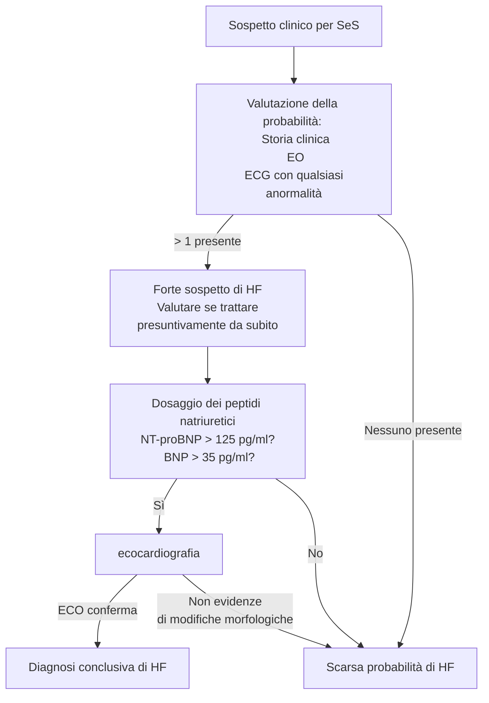
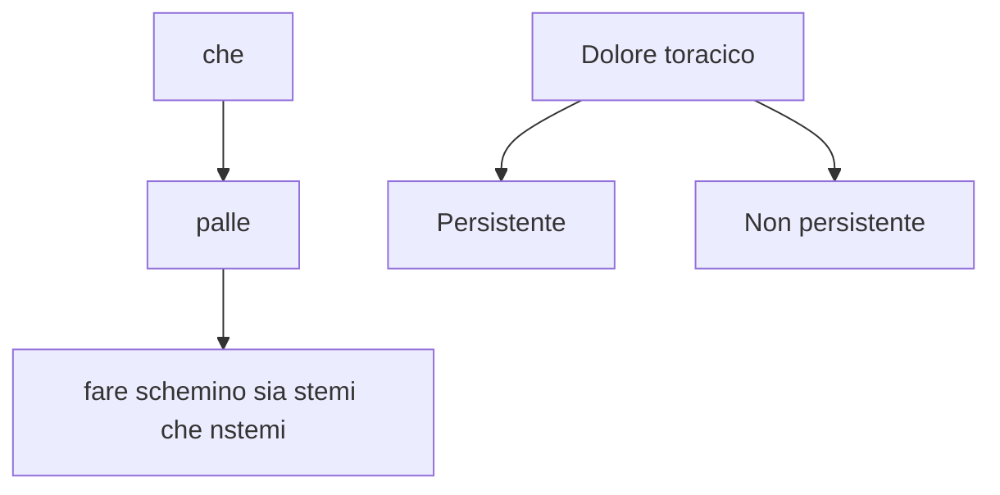

\clearpage
\part{Malattie cardiovascolari}

<!-- mar 16 mar 2021, 16:11:26, CET -->

# Embolia polmonare acuta (APE) \todo{Da fare bene da sbobba}
- \pat{ape} --- condizione clinica causata da ostruzione acuta di una porzione di estensione variabile del letto arterioso polmonare a seguito di tromboemboli -- i quali sono solitamente originati in vene profonde degli arti inferiori (\pat{tvp})
- È problema clinico estremamente rilevante: di difficile diagnosi e alta mortalità
	- Sintomi non specifici, e molto eterogenei
	- Frequente (particolarmente in pz. ospedalizzati)
	- Alta mortalità se non diagnosticata
	- Fattori di rischio frequentemente ritrovabili in popolazione
- Per aiutarsi nella diagnosi, è imperativo correlare fattori di rischio con segni e sintomi!

## Epidemiologia
- 115--269 casi/100K abitanti all'anno
	- 5% dei casi quadro severo
	- 90% dei casi quadro lieve
- Mortalità tendenzialmente costante (~ 8% dei casi)

## Presentazione clinica

### Fattori di rischio
- Forti
	- Fratture agli arti inferiori
	- Precedente tromboembolismo venoso
	- Immobilismo (⇐ danni al midollo)
	- Ospedalizzazione da < 3 mesi per \pat{scompenso cardiaco}/\pat{fibrillazione atriale}/\pat{flutter atriale}
	- \pat{im} da < 3 mesi
	- Traumi maggiori
	- Protesi/sostituzioni di anca e ginocchio
- Moderati
	- Artroscopia
	- Patologie autoimmuni
	- Trasfusioni
	- Cateteri venosi (centrali > periferici)
	- Chemioterapia
	- \pat{scompenso cardiaco congestizio}/\pat{insufficienza respiratoria}
	- \todo{qualche altra}
- Minori
	- Procedure per fertilizzazione in vitro/contraccettivi orali
	- Periodo post--parto (↑ coagulazione)
	- Infezioni (polmonite, infezioni urinarie, HIV, Covid-19...)
	- IBD
	- Neoplasie (particolarmente se metastatiche)
	- Stroke
	- Trombosi venosa superficiale
	- Trombofilie congenite
- Deboli
	- Immobilità a letto > 3gg
	- Diabete
	- Ipertensione
	- Immobilità da seduta prolungata^[Anche in aereo (rischio di TVP proporzionale a lunghezza del volo) e in lunghi viaggi in macchina]
	- \todo{ne mancano}

### SeS
- Sintomi
	- \goldstandard Dispnea
		- Solitamente a insorgenza improvvisa
		- A volte solo dispnea da sforzo^[Se ci sono emboli piccoli che si alloggiano nel letto arterioso polmonare in maniera lenta e progressiva]
	- \goldstandard Dolore toracico (pleuritico o substernale)
	- Tosse
	- Emottisi
	- Sincope
- Segni
	- Tachipnea (FR ≥ 20) \marginnote{Tachipnea e tachicardia sono sintomi che aiutano a monitorare l'andamento: se peggiora il quadro peggiorano questi sintomi, se la terapia ha successo piano piano rientrano}
	- Tachicardia (FC ≥ 100)
	- Segni di TVP (edemi declivi)
	- Febbre
	- Cianosi (periferica → centrale)

### Algoritmo diagnostico
- In primis: __QL: quadro di grave instabilità emodinamica__ Sì ⇒ alto rischio e poco tempo ⇒ trattare
	- Alto rischio (~3% dei casi) → mortalità 14--30%
	- Basso rischio (~97% dei casi) → mortalità stratificata a seconda del rischio specifico

| Stratificazione | Mortalità | Prevalenza |
|-|-|-|
|Intermedio--alto| ||
|Intermedio--basso|||
|Basso|||

```{.mermaid width=700}
flowchart
	sospetto[Sospetto clinico di PE] --> shock[Instabilità emodinamica?]
	shock -->|Sì| alto[ALTO RISCHIO]
	shock -->|No| basso[Non ad alto rischio]

	alto -->|Eco Bedside| rvdisf[C'è disfuzione del ventricolo dx?] -->|Sì| tac[CTPA immediatamente fattibile?] -->|No| tratto[Tratto per PE ad alto rischio]
	rvdisf -->|No| altro[Cerco altre cause di instabilità emodinamica]
	tac -->|Sì| ctpa[CTPA è suggestiva?] -->|Sì| tratto
	ctpa -->|No| altro2[Cerco altre cause di instabilità emodinamica]

	basso --> valuto[Valuto la proababilità di PE]
	valuto -->|Bassa probabilità| dd[Test D-dimero]
	valuto -->|Alta probabilità| ctpa2[CTPA]

	dd --> |Negativo| no[Non trattamento per PE]
	dd --> |Positivo| ctpa2 -->|PE confermato| trattamento2[Tratto per PE\n stratificando il rischio]
	ctpa2 --> |PE escluso| no
```
- Instabilità emodinamica se una di 3 condizioni
	1. ACR
	2. Shock
		- PA~sis~ < 90 mmHg
		- \far{vasopressori} necessari per tenere PA > 90 mmHg
		- Ipoperfusione periferica (stato metnale alterato, cute fredda, oliguria, ↑ lattati
	3. Persistente ipotensione
		- ↓ PA di ≥ 40 mmHg per 15'

- Dd
	- IM (quindi faccio ECG)
	- Polmonite
	- Scompenso cardiaco congestizio riacutizzato
	- Asma
	- Pericardite
	- Neoplasia intratoracica
	- PNX spontaneo
	- Frattura costale
	- Costocondrirte
	- Dolore toracico non specifico
	- Ansia o attacchi di panico

## Trattamento e stratificazione del rischio \todo{}
- Di fatto è __scoagulare il pz.__

# Ipertensione polmonare
- \pat{ipertensione polmonare} --- stato patofisiologico in cui la pressione polmonare media (mPAP) è > 25 mmHg (mPAP fisiologica = 20 mmHg)
- mPAP si misura in maniera cruenta con [cateterizzazione^[Mediante il catetere di Swan--Ganz]](https://it.wikipedia.org/wiki/Catetere_di_Swan-Ganz) del cuore dx \marginnote{Una stima può essere fatta tramite l'eco Doppler, stimando il rigurgito di sangue in caso di una minima insufficienza tricuspidalica (che un botto di persone hanno). La stima ecocardiografica può portare alla valutazione di una eventuale ipertensione polmonare con un certo grado di confidenza (bassa, media o alta probabilità) anche correlando i valori del flusso di rigurgito con altre eventuali condizioni patologiche}
- L'ipertensione polmonare è una condizione che si riscontra in 5 gruppi di patologie
	1. BOH \todo{}
	2. Ipertensione polmonare da patologie del cuore sinistro
	3. Ipertensione polmonare da patologie polmonari e/o ipossia
	4. Ipertensione polmonare da tromboembolismo cronico
	5. BOH

<!-- gio 18 mar 2021, 16:13:45, CET -->
# Scompenso cardiaco cronico (\pat{chf})
- Lo \pat{scompenso cardiaco} è una sindrome clinica complessa, causata dall'inadeguatezza del cuore a pompare sangue nell'organismo in una quota adeguata alle necessità fisiologiche dell'organismo \marginnote{Anche conosciuto come \emph{Hearth Failure} (cronico o congestizio)}
	- Definizione \underline{clinica} --- sindrome caratterizzata da SeS tipici
	- Definizione \underline{patofisiologica} --- stato nel quale il cuore è incapace di fornire una perfusione sufficiente alle necessità momentanee dell'organismo senza fare uso estensivamente del meccanismo di Frank--Starling. \marginnote{\emph{Meccanismo di Frank Starling} = meccanismo per il quale aumenta la portata cardiaca se aumenta il precarico} Alternativamente, situazione in cui il cuore è incapace di mantenere un output adeguato a soddisfare le esigenze metaboliche momentanee e garantire un adeguato ritorno venoso
	- Definizione \underline{emodinamica} --- stato in cui si verifica una o più alterazioni di questi parametri emodinamici: \todo{}
		- _Indice cardiaco_ < 2.5 lt/min/m^2^ \marginnote{Dove l'\emph{Indice cardiaco} è il rapporto $$\frac{\text{CO [lt/min]}}{\text{superficie corporea}}$$ \newline con \newline CO = Cardiac Output}
		- RAP > 8 mmHg
		- Wedge pressure ≥ 15 mmHg

## Epidemiologia
- La prevalenza dipende dalla efinizione, ma mediamente
	- 1--2% popolazione adulta
	- ≥ 10% popolazione > 70aa

## Patofisiologia
- L'attività cardiaca è caratterizzata da un doppio aspetto: l'aspetto ventricolare e l'aspetto vascolare \todo{}
	1. Funzione ventricolare (mantenere precarico, contrattilità e vincere il postcarico)
	2. Funzione vascolare (vincere il postcarico e garantire perfusione dei vasi)
- A seconda della porzione cardiaca insufficiente si distingue \todo{tutto questo discorso}
	- Scompenso cardiaco dx (2)
	- Scompenso cardiaco sx (3)
	- Scompenso cardiaco dovuto a disfunzione di entrambi i ventricoli (4)

\ 

### Meccanismi di compenso \todo{tutto}
- In un quadro di IC l'organismo attua 3 tipologie di compenso, tentando così di mantenere un'adeguata perfusione tissutale
	1. Compenso tramite rimodellamento strutturale
	2. Compenso tramite meccanismi neuro--ormonali
	3. Compenso emodinamico
- Con il progredire del tempo, gli adattamenti diventano essi stessi una causa che sostiene lo scompenso iniziale

#### Compenso tramite rimodellamento strutturale

#### Compenso tramite meccanismi neuro--ormonali

#### Compenso emodinamico

## Cause
1. Patologie che danneggiano la funzionalità del miocardio, ↓ capacità contrattile
	- Ischemie
	- Danno tossico
	- Patologie autoimmuni
	- Infiltrazioni neoplastiche
	- Alterazioni metaboliche o ormonali
2. Aumento del carico
	- Ipertensione
	- Difetti valvolari (acquisiti o congeniti)
	- Patologie del pericardio o dell'endocardio
	- Stati ad alta portata cardiaca
	- Sovraccarico di volume
3. Aritmie
	- Tachiaritmie (↓ CO)
	- Bradiaritmie (↑ volume)

## Clinica
- SeS
	- Dispnea a riposo o da sforzo (_spesso ortopnea_, spesso dispnea parossistica notturna)
	- Astenia, stanchezza
	- Segni di ritenzione idrica (es: congestione polmonare, edemi declivi, epatomegalia^[Epatomegalia da congestione epatica (stasi venosa ⇒ ristagno nei vasi epatici e rigonfiamento del parenchima epatico). Oltre ad avere quindi solitamente reperti di epatomegalia all'esame obiettivo si può avere dolore in ipocondrio dx e altri segni generici (ascite, nausea, vomito...). Se cronico, si può accompagnare a distruzione del parenchima con franco danno epatico]...)
	- Possibile cardiopalmo
	- Possibile dolore toracico
- A seconda della severità dei sintomi e di quanto questi impattino l'attività fisica _ordinaria_ del sg. questo viene stratificato in 4 classi

| Classe | Limitazione dell'attività ordinaria|
|-|-|
|Classe 1 | Nessuna limitazione dell'attività fisica ordinaria |
|Classe 2 | Leggera limitazione dell'attività fisica ordinaria, con insorgenza di SeS tipici di HF ma di intensità lieve e gestibile. Qualità di vita accettabile|
|Classe 3 | Marcata limitazione dell'attività fisica ordinaria, con comparsa di SeS tipici di HF durante attività fisica meno intensa rispetto a quella ordinaria. Qualità di vita notevolmente compromessa|
|Classe 4 | Incapacità di fare attività fisica senza l'insorgenza di sintomi. Possibili sintomi a riposo |

- All'obiettività cardiaca
	- ↑ pressione venosa giugulare^[Misurabile guardando a che livello si ha il massimo rigonfiamento della \ven{giugulare esterna} a pz. posizionato supino sul lettino, inclinato a ~ 45°. Se non sono visualizzabili, si può porre la mano a taglio sul decorso delle vene, occludendole parzialmente, per facilitarnel l'identificazione. In caso di scompenso, siccome spesso aumenta il precarico, avrò una pressione venosa giugulare più alta (registrabile più in alto). Spesso questo è sintomo di scompenso destro]
	- Riflesso epatogiugulare
	- Reperti obiettivi di megalia del cuore
	- Possibile itto spostato/ingrandito o altri segni di cardiomegalia
- All'RX torace
	- Evidenziazione di un quadro di congestione venosa polmonare^[Quadro tipico in cui si visualizza il reticolo venoso polmonare all'RX (tipicamente, per un fatto di gravità, è più visibile alle basi, non visibile agli apici)]
	- Edema interstiziale (non rantoli, non ronchi, possibile MV ridotto)
	- Edema polmonare (opacità "ad ali di pipistrello" + rantoli a piccole bolle)
		- Opacità più o meno diffusa all'RX a seconda dell'estensione dell'edema
		- Addensamenti caratteristici (disordinata, localizzata in alveoli) alla TAC
	- Idrotorace/versamento pleurico

### Comorbidità

\footnotesize
Andare a capire quali siano obesità e quali siano con-cause non è assolutamente facile in certe situazioni
\normalsize

- Angina
- Patologie coronariche
- Cachessia, sarcopenia
- \todo{elenco da slide e/o sbobbe}

## Diagnosi \todo{Controllare che sia algoritmo giusto da slide}



## Trattamento
1. Miglioro i sintomi momentanei
	- Diuretici, diuretici e diuretici! (a meno di EPA non esagerare o si potrebbe avere ipotensione)
	- O~2~ tp. al bisogno
2. Guadagno il controllo della situazione di scompenso
	- Diuretici diuretici e ancora diuretici
	- Se FE ridotta
		- Contrasto degli adattamenti anti-neuro-ormonali (\far{ace-inibitori}, \far{β-bloccanti})
		- Se i sintomi permangono
			- Ipotizzo agonisti dell'aldosterone se i sintomi permangono
			- Alternative farmacologiche avanzate (\far{arni}^[Inibitori del recettore dell'angiotensina])
			- Ho sintomi particolari?
				- QRS ≥ 130 ms? ⇒ Cardiac Resynchronization Therapy ([CRT](https://en.wikipedia.org/wiki/Cardiac_resynchronization_therapy))
				- HR > 70 bpm nonostante β-bloccato? ⇒ \far{ivabradina}
			- Ho rischio di morte improvvisa? (LVEF ≤ 35%, storia di VT/VF) ⇒ valutare pacemaker
	- Se FE conservata
		- Ho poche armi terapeutiche
		- Bisogna trattare __la causa di base__ (ipertensione mal controllata? Cardiomiopatia?)
3. Ipotizzo cambiamenti a lungo termine per prevenire peggioramenti/riacutizzazioni
	- Aggiustare dose terapeutica
	- Valuto cambiamenti più a lungo termine (anche interventi non farmacologici)

# Scompenso cardiaco acuto (\pat{ahf})
- \pat{ahf} --- quadro patologico caratterizzato da un'insorgenza acuta di scompenso cardiaco o da un peggioramento repentino di un quadro di scompenso preesistente
- \todo{Sono arrivato un po' tardi \\ mar 23 mar 2021, 14:34:09, CET}
- Fattori precipitanti \todo{}

## Fisiopatologia

\ 

- I 3 pilastri (congestione, bassa perfusione e compenso neuroormonale) portano a danno miocardico, principalmente per 4 cause
	1. Basso CO → ipotensione → ↓ perfusione coronarica
	2. Me
	3. Li sono
	4. PERSIIIIIIIIIIIII
- Nello scompenso il rene e il cuore si combattono
	- I sistemi neuro--ormonali attraverso il rene tendono a trattenere liquidi (per basso output cardiaco)
	- Trattenere liquidi però peggiora lo stato congestizio

## Clinica
- \todo{introduzione}

\ 

- SeS di bassa perfusione
	- ↓ pressione differenziale
	- Obnubilamento del sensorio
	- Ritenzione idrica (↓ Na ematico ["_iperidratazione ipotonica_"])
	- Estremità fredde
	- Ipotensione
	- Disfunzione epatica e renale
- SeS congestione
	- Ortopnea
	- Distensione giugulare
	- Epatomegalia
	- Edemi
	- Rantoli (EP)
	- Riflesso epato--giugulare

### Prognosi
- Elementi prognostici negativi: \todo{}

## Terapia
- Obiettivi
	- Immediati (PS, ICU, CCU)
		- Alleviare i sintomi
		- __Controllare l'emodinamica__ (↑ portata, ↓ congestione)
		- Evitare danni organici
		- Limitare la degenza in ICU/CCU
	- Intermedi (ricovero in corsia)
		- Stabilizzazione clinica e ottimizzazione della terapia
		- Iniziare terapia orale cronica (\far{ace-inibitori}, \far{βb}, antagonisti dell'aldosterone)
		- Valutare se necessari dispositivi di assistenza (pacemaker^[Defibrillatori impiantabili, ICDs (Implantable Cardiac Defibrillators)], terapia di resincronizzazione elettrica cardiaca^[Anche detta CRT. È terapia elettrica che serve a migliorare la contrattilità del muscolo cardiaco]...)
	- A lungo termine (pre-dimissione e dimissione)
		- Ottimizzare terapia orale cronica
		- Educare il pz. a non aumentare il carico idrico
		- Educare a stile di vita sano (esercizio fisico apposito per riabilitazione cardiaca, alimentazione, fattori di rischio)
		- Seguire pz. dal punto di vista psicosociale e familiare

### Farmacologia \todo{Farmaci da slide}
- Vasodilatatori
- Diuretici (attenzione a combinarli, a volte hanno effetto eccessivo)
	- Dell'ansa (\far{furosemide})
	- Tiazidici
- Inotropi(attenzione, all'inizio funzionano ma a lungo andare stancano il cuore ancora di più, peggiorando il quadro a lungo termine)
	- β-agonisti (\far{dobutamina}, \far{dopamina})
- Vasopressori (\far{adrenalina})
- Oppioidi e/v (ridurre il drive adrenergico)


### Trattamento dello scompenso ad alta portata (PAs > 140) \todo{}

### Trattamento dello scompenso acuto con portata normale (PAs 140--90) \todo{}

### Trattamento dello scompenso acuto a bassa portata (PAs < 90) \todo{}

\ 

# Shock
- \pat{shock} --- sindrome clinica caratterizzata da un'insufficienza acuta e severa del sistema cardiocircolatorio tale per cui non è garantita una corretta perfusione d'organo
- Distinguiamo 4 gruppi di shock \todo{Confronto con discorso in semeiotica}
	- Shock ipovolemico
	- Shock cardiogeno
	- Shock distributivo
	- Shock ostruttivo
- Segni clinici
	- Ridotto flusso urinario
	- Cute fredda, cianotica, sudata, marezzata
	- Alterazioni neurologiche e della coscienza
	- \todo{ALTRO}
- \todo{Roba}

## Shock cardiogeno
- Per gestione: vedi \todo{doi:10.1002/ejhf.1922}

\ 

### Fisiopatologia

### Supporti meccanici alla circolazion3
- Contropulsatore aortico (IABP --- Intra-Aortic Balloon Pump)
	- \todo{}
- Sistema Impella
	- Sistema per produrre un _flusso continuo_ (max 5 lt/min) dal ventricolo sx all'aorta ascendente
		- Il flusso viene prodotto tramite una turbina che aspira il sangue dal VS e lo porta in aorta
	- È tendenzialmente una soluzione _a breve termine_ (in urgenza)
		- Flusso continuo ⇒ ↑ pressione aortica ⇒ danneggiamento della valvola aortica (non adeguato se preesistente insufficienza aortica preesistente, perché si antagonizza eccessivamente l'azione della pompa)
		- Turbina ⇒ ↑ emolisi (ma rischio > beneficio)
	- Accesso: femorale, ascellare dx
- ECMO (Extra-Corporeal Membrane Oxygenation
	- Sistema per aspirare il sangue venoso, ossigenarlo e re-iniettarlo in circolo ⇒ assistenza _circolatoria e ventilatoria_
	- Accesso:
		- Solitamente cannulazione periferica (a/v o v/v a seconda dell'opportunità)
			- Se insufficienza cardiaca e respiratoria: incannulamento artero-venoso (tipicamente arteria e vena femorale)
			- Se solo insufficienza respiratoria: incannulamento veno-venoso (tipicamente vena femorale e \ven{giugulare interna})
		- Possibile cannulazione centrale, opportuna in alcuni quadri
- LVAD (Left Ventricular Assist Device)
	- \todo{}
	- Può essere sia bridge therapy (di solito) ma anche tp. definitiva in certi casi

<!-- Piovaccari -->
# Sindromi Coronariche Acute

\todo{Capire bene la relazione tra SCA e infarto: l'infarto è o no SCA? il viceversa? Fare intro}

## Angina

## Infarto del miocardio
- \todo{Fino a complicanze}

### Clinica
- Il sintomo classico dell'IM è un dolore toracico grave (_toracoalgia_)

#### S/s
- Il dolore da ischemia cardiaca _classico_ ha caratteristiche precise
	- Oppressivo o costrittivo
	- Non ben localizzato dal pz.
		- Frequentemente: retrosternale, epigastrico, irradiato a braccio sx \marginnote{Regola d'oro del PS: ogni dolore dalla punta del naso all'ombelico è cardiogeno fino a prova contraria}
		- Meno frequente: collo, mandibole, irradiato a braccio dx, dorso
	- Accompagnato da dispnea
	- Accompagnato da sintomi aspecifici viscerali: nausea, vomito, sudorazione
- Attenzione! Una buona fetta di IM (~20%) producono un quadro atipico! (per localizzazione o intensità del dolore)
	- Attenzione a: donne, diabetici, anziani (possibile infarto analgesico)
	- Attenzione a "cattiva digestione" non spiegata
	- Attenzione se familiarità
	- Attenzione se fattori di rischio
		- BMI alto
		- Ipertensione
		- Diabete e ipercolesterolemia
		- Familiarità
		- Fumo e alcool

#### Ddx
- Dissezione aortica
- Embolia polmonare
- Pneumotorace
- Pericardite a varia eziologia (acuta, virale, batterica...)
- Polmonite
- Costocondrite
- Zoster
- Ipertrofia ventricolare
- Ponte miocardico
- CHF/AHF
- Varie cardiomiopatie
- Valvulopatie
- Stenosi aortica
- Tachicardia
- Iatrogene
	- Esiti di ablazione
	- Esiti di cardioversione
	- Esiti di chirurgia cardiotoracica

### Diagnosi
- _Time is muscle!_ Essenziale buona _rete territoriale_ con percorsi dedicati [@delucagiuseppeTimeDelayTreatment2004]



#### Laboratorio
- Fare sempre la __curva della troponina cardiaca__ con _metodiche ultrasensibili_^[Le metodiche ultrasensibili sono da preferire, perché permettono abbastanza efficacemente di identificare NSTEMI che altrimenti sarebbero mancati e magari classificati come angine instabili], ma metterla sempre (come ogni altro valore) nel contesto clinico!
	- Troponina cardiaca (`cTP`) è isoforma della troponina presente solo nei cardiomiociti
	- ↑ `cTP` ⇒ _danno cellulare_ dei cardiomiociti \marginnote{Mentre l'implicazione è sempre vera, non è assolutamente detto che il rialzo della cTP sia sempre da imputare a IM}
- Indicazione tecniche
	- Dosaggio ripetuto a tempo 0, +3h, +6h per costruire la curva

### Terapia
1. MANO
2. Trombolisi
3. Riperfusione
4. Terapia a lungo termine per prevenire eventi cardiovascolari successivi

### Complicanze
- Non cardiologiche
	- Infezioni (respiratorie, urinarie, cutanee)
	- Ictus
	- Complicanze da farmaci/trattamento
	- Perdita del compenso in altri quadri patologici concomitanti (es: diabete, IR...)
- Cardiologiche
	- __Aritmie__ (con possibile ACR)
		- TV/FV
		- BAV (fino al 3/o grado)
	- \pat{ahf}
		- → shock cardiogeno in 5% degli \pat{im} (specialmente in quelli non trattati o tardati tardivamente)
		- Edema polmonare
	- Embolia polmonare
	- Re-infarto
	- Pericardite
	- Complicanze meccaniche
		- Precoci
			- Rottura del setto interventricolare
			- Rottura della parete cardiaca
			- Insufficienze valvolari, solitamente mitralica (⇐ infarto dei \mus{mm papillari})
		- Tardive (ora molto rare per disponibilità precoce di cure intensive)
			- Danno ischemico permanente
				- Danno del miocardio permanente → \pat{chf}
				- Ischemia papillare cronica → valvulopatia → insufficienza valvolare (spesso mitralica)
			- Aneurisma cardiaco (⇐ dilatazione sacciforme del ventricolo ⇐ sostituzione del tessuto miocardico con tessuto fibroso non contrattile ⇐ danno ischemico) \marginnote{L'attività di pompa viene meno perché si perde la rigidità di parete necessaria per pompare (visto che il tessuto fibroso è molto compliante e le pressioni cardiache sono elevate). Si dice che il cuore "pompa nella sacca". In più, essendo il tessuto fibroso non contrattile, si aumenta di molto il rischio di aritmie da conduzione anomala. Per di più l'inerzia della parete favorisce la formazione di trombi organizzati sulla parete stessa, aumentando il rischio di ictus (se a sx) o di embolia polmonare (se a dx)}
			- Pseudoaneurisma^[__Pseudoaneurisma__ --- raccolta di sangue che si forma tra i due strati esterni di una arteria, la tonaca muscolare e la tonaca avventizia. Di solito è causato da una lesione al vaso. Può essere pulsante e assomigliare ad un vero aneurisma, tuttavia quest'ultimo coinvolge tutti e tre gli strati del vaso sanguigno] cardiaco (⇐ rottura di parete secondaria a danno ischemico)
			- Trombosi endoventricolare (⇐ per stasi dovuta a ↓ contrattilità di parete conseguente al danno ischemico)
				- Complicanze distrettuali per dipartita dei trombi

#### Rottura del setto interventricolare post-infartuale
- Patogenesi: danno infartuale ⇒ ↓ resistenza del setto interventricolare ⇒ ↑ rischio di rottura
	- Shunt dx--sx di grado variabile ⇒ scompenso cardiaco a bassa portata
	- Compromissione emodinamica di grado variabile
- Tp. è riparazione esclusivamente chirurgica, ma difficile:
	- Procedura in emergenza su un cuore infartuato)
	- Non è detto che ci sia modo di suturare efficacemente la rottura o la parte circostante per danneggiamento della parete

#### Rottura acuta di parete
- \todo{}


## Dissezione coronarica spontanea \todo{}
- Dissezione coronarica non traumatica e non relata a processo arterosclerotico
- F>M
- \todo{}

### Terapia
- __Più conservativa possibile__ (angioplastica come ultima risorsa, potrebbe peggiorare la dissezione)
	- Tp. antipertensiva
	- βb
	- CardioASA

## Cardiomiopatia da stress (\pat{sindrome di takotsubo})
- \todo{}
- Diagnosi
	- Coronarografia: le coronarie devono essere normali
	- Tipica morfologia cardiaca (ventricolografia, TAC)

## Dalla Manfrini
...

### IM: definizione da consensus internzazionale (STEMI e NSTEMI)
- Tipo 1
- Tipo 2
- Tipo 3
- Tipo 4 e 5: IM iatrogeno da rivascolarizzazione
	- Tipo 4: IM come complicanza di rivascolarizzazione
	- Tipo 5: IM come complicanza di Bypass Aorto-Coronarico

### IM "iatrogeno" post rivascolarizzazione
- Necrosi acuta del miocardio su base ischemica può essere anche conseguenza iatrogena del processo di vascolarizzazione
- 2 tipi
	- __Tipo 4__: dopo rivascolarizzazione
		- __4A__ --- si verifica < 48h da rivascolarizzazione
			- cTN > x5 99mo percentile
			- Uno tra
				- Segni di ischemia a ECG
				- _Nuova_ perdita di miocardio o _nuove_ alterazioni della cinesi della parete ventricolare all'imaging (Eco)
				- Verificarsi di complicanza procedurale durante rivascolarizzazione (dissezione, no-reflow^[Non perfusione del muscolo cardiaco dopo rivascolarizzazione (segno del _ristagno_ del mdc)], chiusura di ramo collaterale, embolizzazione distale)
		- __4B__ --- si verifica per trombosi intra--stent (acuta (< 24h), subacuta (< 30gg), tardiva (< 1aa), molto tardiva (> 1aa))
			- cTn > 99mo percentile
			- Riscontro di trombo (ad angio/autopsia)
		- __4C__ --- si verifica per ri-stenosi dopo POBA (Plain Old Baloon Angioplasty)
	- __Tipo 5__: dopo bypass
		- \todo{}

### STEMI
- SCA con tratto ST sopraslivellato e __con necrosi miocardica__ (che è transmurale)
- Più derivazioni sono coinvolte, più l'area di necrosi è estesa ⇒ più il quadro è grave
	- Derivazioni V~2~ -- V~4~ (parete sx anteriore, da ostruzione della \art{coronaria discendente anteriore})
	- Derivazioni D1, aVL, V~5~, V~6~ (parete sx laterale, da ostruzione della \todo{})
	- Derivazioni D2, D3, aVF (parete sx inferiore, da ostruzione della \todo{})
- Misure da consensus internazionale per qualificare ST-elevation
	- __ST ≥ 0.1 mV dal punto J in almeno 2 derivazioni contgue__; oppure
	- __ST ≥ 0.1 mV in tutte le derivazioni__; oppure
	- __Nuovo BBsx__ (ma considerare criteri di Sgarbossa)
- Sospettare IMA dx se (⇒ eseguire ECG con derivazioni dx)
	- Coinvolgimento delle derivazioni inferiori a ECG-12
	- ↑ JVP o segni di scompenso solo (= campi polmonari liberi) a dx + ipotensione

\redblock{Manifestazioni all'ECG associate a pregresso IM}{
- Onda Q larga > 0.04 sec (criterio non valido se la trovo in aVR, V1; mai se in III isolata e se ok aVF e ok II)
- Onda R \TODO{}
}

### IM senza malattia coronarica ostruttiva \todo{}
- Ad oggi si individuano 2 quadri patologici di cardiopatia ischemica non dovuto ad ostruzione delle coronarie:
	- MINOCA: Myocardial Infarction with Non Obstructive Coronary Arteries
	- INOCA: Ischemia with Non Obstructive Coronary Arteries

#### MINOCA

#### INOCA
- Non immediato rischio di vita, ma abbassano notevolmente QoL
- Medesimo trattamento di pz. con stenosi coronarica
	- ACE-ini
	- Statine
	- βB
	- Ca^++^-antagonisti se evidenze di vasospasmo coronarico
- Valutare, con score appropriati (TMI) la stratificazione del rischio del pz. per capire se è necessario follow-up e quanto aggressivi essere

# Aritmie
- \todo{Diemberger}
- __Aritmia__ --- ritmo cardiaco anomalo in (1) frequenza, (2) regolarità o (3) modalità di genesi o conduzione dell'impulso

|       | Eziologia                   | Aritmia                                                                     |
|-------|-----------------------------|-----------------------------------------------------------------------------|
| Bradi | ↓ automaticità SA           | Bradicardia sinusale                                                        |
|       | Alterata automaticità SA    | Sindrome braditachiaritmica                                                 |
|       | Blocco di conduzione        | BAV                                                                         |
| Tachi | ↑ automaticità SA           | Tachicarrida sinusale                                                       |
|       | Trigger                     | BES e BEV                                                                   |
|       | Trigger (EAD)               | Tachicardie ventricolari polimorfiche a QT lungo (TdP)                      |
|       | Trigger (DAD)               | Tachicardie ventricolari monomorfe a QT normale (multifocali o focali) (\*) |
|       | Circuito di rientro/Trigger | TV e FV (\*)                                                                |
|       | Circuito di rientro         | Flutter atriale                                                             |
|       | Circuiti di rientro         | Fibrillazione atriale                                                       |
|       |                             | Tachicardia intranodale                                                     |
|       | Circuito di rientro         | Tachicardia parossistica sopraventricolare (ANVRT/AVRT)                     |


## Bradiaritmie
- Aritmie con FC ≤ 60 bpm
- I meccanismi di genesi sono 2: ridotta automaticità e blocchi di conduzione
	1. ↓ automaticità \marginnote{Produce generalmente bradicardie sinusali}
		- Da ↑ \textsc{\textcolor{ForestGreen}{tono parasimpatico}} (_rest & digest_, ipertrofia cardiaca di atleti, IM inferiore^[Infarto del miocardio dovuto a una ostruzione dell'\art{arteria coronaria dx}, che porta alla necrosi di una porzione inferiore della parete cardiaca. Questo mima gli effetti di un'aumentato tono vagale, aumentando i tempi necessari per propagare il potenziale d'azione -- diminuendo, di fatto, l'automatismo -- e portando a cali di frequenza])
		- Da rallentamento della conduzione attraverso il nodo AV (principalmente per farmaci (\far{βb}, \far{ca-antagonisti}, \far{digossina})
		- Sbilanciamenti elettrolitici (__iperkaliemia__)
		- Da ↓ attività metabolica dei cardiomiociti (ipotermia, ipotiroidismo marcato)
		- ↑ ICP
	2. Blocchi di conduzione del nodo AV
		- Iperkaliemia
		- Infarto che interessa il nodo AV (solitamente infarti inferiori)
		- \far{βb}, \far{ca-inibitori}, \far{digossina}
		- Infiltrazioni del nodo AV (\pat{amiloidosi}, \pat{sarcoidosi}...)
		- Endocardite da \pat{malattia di lyme}
		- Fibrosi idiopatica (età)

### Bradicardia sinusale

### Sindrome braditachiaritmica

### Blocco Atrio--Ventricolare
- \todo{intro}
- Dividiamo i BAV in 3 gradi
	1. BAV di 1/o grado
	2. BAV di 2/o grado
	3. BAV di 3/o grado
- L'eziologia della BAV è variabile:
	- Cause intrinseche
		- Esiti ischemici
		- Anomalie cardiache congenite
		- Difetti valvolari (calcificazioni dell'ostio valvolare possono danneggiare il sistema di conduzione)
	- Cause estrinseche
		- Disturbi elettrolitici (es: iperkaliemia)

#### BAV di primo grado
- \todo{}
- Tendenzialmente asintomatico

#### BAV di secondo grado
- __Ogni tanto una P viene bloccata__ ⇒ una P non sequita da QRS e T
- Si individuano 2 forme, che rispecchiano la sede del blocco \todo{da slide inserire ecg di BAV 2}
	1. BAV Mobitz 1 (di Luciani-Wenckebach)
		- Generalmente blocco "alto", nella parte craniale del nodo AV ⇒ il ritmo di scappamento che emerge ha frequenza alta ⇒ ↑ rischio
	2. BAV Mobitz 2
		- Generalmente blocco "basso", nella parte bassa del nodo AV o nel fascio di HIS ⇒ il ritmo di scappamento che emerge ha frequenza bassa ⇒ ↑↑ rischio di insorgenza di bradicardie importanti
- \missingfigure{bav 2 mobitz 1 e 2}
- \todo{sintomi}

#### BAV di terzo grado
- __Le onde P e i QRS sono dissociate__ per un blocco _completo_ del nodo AV
	- All'ECG: medesime distanze $\bar{PP}$, $\bar{RR}$, ma le distanze $\bar{PR}$ non sono assolutamente costanti
- L'attivazione ventricolare è sempre, quindi, per scappamento
	- Se va bene il ritmo di scappamento è alto, con una frequenza ancora accettabile\
	
	- Se va male il ritmo di scappamento è basso (anche ventricolare) ⇒ frequenza bassa e morfologia dei QRS tipica)

\missingfigure{img bav3 basso}

#### Trattamento
1. Valutare se pz. è stabile o no
2. Valutare se è opportuno intervenire (se basso grado ha senso aspettare)
3. Se causa reversibile: trattare la causa
4. Trattare i sintomi acuti
	- Bradicardia ⇒ \far{atropina}^[\ini tono vagale (antagonista competitivo dell'acetilcolina sui recettori muscarinici) ⇒ ↓ tono vagale ⇒ ↑ FC]
		- Se blocco è basso atropina potrebbe paradossalmente aumentare il grado del blocco per riduzione del filtro della parte alta AV
		- Evitare se glaucoma
	- Se blocco è basso o non rispondente ad atropina: \farf{inotropi} (cautela, possibile proaritmia)
	- Se non risposta: terapia elettrica + monitoraggio continuo
		- Pacing trans--cutaneo \marginnote{Posizionamento delle piastre anteroposteriore! Questo è perché è necessario stimolare i ventricoli. Necessario sedare il pz. perché è doloroso, anche se pacer cattura}
		- Pacemaker temporaneo (con inserimento percutaneo [secondo Seldinger](https://en.wikipedia.org/wiki/Seldinger_technique))
5. Valutare terapia cronica (pacemaker)

\redbox{Indicazioni al pacemaker}{
- \TODO{}
- Condizioni che vanno trattate con pacemaker
- Condizioni che possono essere trattate con pacemaker
- Condizioni che non devono essere trattate con pacemaker
}

\yellowbox{Tipologie di pacemaker}{
%Ogni pacemaker viene categorizzato con una sequenza di 3 o 4 lettere a seconda delle funzionalità (tendenzialmente si usano pacemaker `DDD`)
%
%| Camera stimolata | Camera catturata | Modo di risposta | Adattamento alla frequenza |
%|-|-|-|-|
%||||
%
%Per quanto riguarda oggetti che producono campi elettromagnetici tendenzialmente la regola è
%
%- I dispositivi industriali/elettromedicali possono dare problemi
%- Il cellulare va tenuto a debita distanza (> 15 cm)
%- Gli elettrodomestici quotidiani (o l'antitaccheggio) non danno problemi
%- I magneti su pacemaker attivano il cosiddetto _red-switch_ del pacemaker, facendo in modo che stimolino a frequenza fissa (~ 80--100 bpm). Molta attenzione se esiste un ritmo sottostante: se il pacemaker stimola al momento sbagliato possono insorgere aritmie ventricolari
%
%Per info dettagliate: \TODO{inserire articolo cardiology review}
}

## Blocchi di branca
- Blocchi di conduzione a livello di una delle due branche
	- Blocco di branca destra (BBDx)
	- Blocco di branca sinistra (BBSx)

### BBdx
- \todo{Fisiologia}
- All'ECG
	- QRS > 120 ms
	- Comparsa di R' in aVr o in V1
	- \todo{altro da slide}

### BBsx
- Fisiologia
- All'ECG
	- QRS > 120 ms
	- Q assente in V5 e V6
	- QRS con incisura in V5,6, aVl
	- \todo{altro da slide}
- BBsx ha maggiore probabilità di essere patologico
	- Se nuova insorgenza può essere espressione di IMA (anche se meno specifico di ST-elevation, perché \todo{quali altre condizioni portano a bbsx se non IMA?)

### Emiblocchi
- Blocchi dei fascicoli (tendenzialmente a sx)
	- \todo{classificazione}
- All'ECG
	- \todo{segni ecg}

### Aberranze di conduzione
- BB che si sviluppa solo sopra (o raramente, sotto) a certe frequenze
	- In caso di tachiaritmie sopraventricolari
	- In caso di sforze
	- Raramente se bradiacardie

## Tachiaritmie \todo{intro, classificazione e rifare la struttura del capitolo in modo che rispetti la classificazione}

```mermaid
classificazioni --> aritmie
```

- Le tachiaritmie vengono divise a seconda della durata
	- Parossistiche --- va e viene a cazzo
	- Persistente --- c'è, e te la tieni fino al trattamento
	- Permanente --- c'è, e te la tieni nonostante il trattamento
- La distinzione principale da fare in ambito di tachicardie è rispetto alla sede d'origine (atriali -- o sopraventricolari -- vs ventricolari)
	- Tachicardie sopraventricolari
	- Tachicardie ventricolari
- I meccanismi di genesi sono 3: aumentata automaticità, trigger e circuiti di rientro
	1. Da aumentata automaticità del  nodo SA \marginnote{Produce generalmente tachicardie sinusali}
		- Da ↑ \textsc{\textcolor{Maroon}{tono ortosimpatico}} (_fight or fly_, ipovolemia, ipossia^[Da anemia, pneumopatie, embolia polmonare...], dolore, stati ansiosi importanti...)
		- \farf{simpaticomimetici} (\far{adrenalina}, \far{noradrenalina}, \far{dopamina}, cocaina, metanfetamina)
		- Da ↑ attività metabolica (ipertermia, febbre, ipertiroidismo...)
		- Sbilanci elettrolitici (__↓ K^+^__)
	2. Da trigger (da presenza di zone trigger _ectopiche_ [= non da cellule pacemaker, ma da fluttuazioni del potenziale di membrana di generici cardiomiociti], dalle quali _parte_ un impulso accessorio che non segue la normale via di conduzione del cuore)^[] \asidefigure{img/ead-dad.png}{}
		- EADs (Early AfterDepolarization) --- impulso ectopico che parte prematuramente, interrompendo la normale fase di depolarizzazione dei cardiomiociti \marginnote{Produce tachicardie ventricolari polmorfiche a QT lungo, chiamate dagli amici \pat{torsioni di punta}}
			- __Da ↓ K^+^__, ↓ Ca^++^, ↓ Mg^++^
			- Da anti-Aritmici (A)
			- Da anti-Biotici (B)
			- Da anti-psiCotici (C)
			- Da anti-Depressivi (D)
			- Da anti-Emetici (E)
		- DADs (Delayed AfterDepolarization) --- impulso ectopico che parte a depolarizzazione dei cardiomiociti completata \marginnote{Produce tachicardie ventricolari monomorfiche a QT normale, ovvero \pat{tachicardia multifocale} e \pat{tachicardia focale}}
			- ↑ tono simpatico
			- Da ischemia
			- Da ipossia
			- Da infiammazione del miocardio
			- Da stiramento dei miocaridociti (cardiomiopatia dilatativa, rigurgiti valvolari)
			- Da \far{digossina}
	3. Da rientro (da circuiti che si instaurano lungo il normale sistema di conduzione quando questo presenta un ostacolo non conduttivo. Perché si crei il rientro i circuiti devono condurre l'impulso a velocità differente)\

		- Per tessuto cicatriziale non conduttivo
		- Per fibrosi idiopatica (età)

### Battiti ectopici (BES e BEV)
- Individuiamo 3 tipi di battiti ectopici \todo{ritmi ecg}
	1. Battiti ectopici sopraventricolari (BES)
	2. Batti ectopici giunzionali
	3. Battiti ectopici ventricolari (BEV)
- Non hanno ruolo prognostico negativo (il trattamento non aumenta la sopravvivenza)
- \todo{qualcosina}

### Tachicardia sinusale
- Solitamente < 150 bpm (raro che superino questa frequenza)
- Diagnosi: FC > 100 e ritmo sinusale
	- Ogni QRS ha la sua P
	- Ogni QRS ha la sua T
	- P ↑ in 2 e avR

### Flutter atriale
- __Attivazione _regolare_ dell'atrio ad una frequenza elevata (200-300 cicli pm)__ seguite, ogni _tot_ da un complesso QRS
	- Ogni quanto compare il QRS dipende dalla refrattarietà del nodo (frequenza fissa vs variabile)
- All'ECG
	- Aspetto "a dente di sega" (onde P vengono chiamate onde F in questo caso specifico)
- \todo{roba}
- ↑ ritmo tromboembolico (per movimento turbolento della parete atriale che non garantisce un flusso ordinato e continuo)

### Fibrillazione atriale
- \todo{roba}
- Tipica di sg. anziani
- ↑ ritmo tromboembolico (per movimento disorganizzato della parete atriale che non garantisce un flusso ordinato e continuo)
- Insorgono come parossistiche ⇒ difficile diagnosi a meno di Holter o simili
	- Specialmente all'inizio: nel 50% dei sg. regrediscono < 8h
	- Le linee guida dicono di monitorare i pz. a rischio, ma non è semplice
	- Il paziente a rischio è
		- Rischio di stroke (calcolare score CHAD-VASc) \todo{chadvasc}
		- Ha sintomi
		- \todo{}
		- \todo{}
- All'ECG
	- Linea basale finemente o grossolanamente irregolare

#### Gestione del pz. con fibrillazione atriale
1. Terapia dei sintomi \todo{}
	- __Rate control__ \todo{}
		- Antiaritmici
		- Ablazione
		- Cardioversione elettrica
			- Non indicata se pz. non è scoagulato da > 3 settimane (arresto brusco della parete atriale può portare a distacco dei trombi) \todo{discorso da riscrivere}
				- Ok se fibrillazione insorta certamente < 12h (rischio ~ 0.3%)^[Tecnicamente nelle linee]
2. Prevenzione del rischio tromboembolico ⇒ valutare antiaggreganti/anticoagulanti
3. Causare le eventuali cause

\greenbox{Cardioversione della fibirllazione atriale}{
Il problema della cardioversione è che una cessazione rapida della fibrillazione aumenta il rischio che eventuali emboli si distacchino (per un repentino blocco della parete atriale)
}

### Tachicardia atriale focale \todo{}

### Tachicardia intranodale

### Tachicardie sopraventricolari da rientro
- \todo{avrt vs avnrt}
	- Avrt: tachicardia da rientro passante per il \a{fascio di kent}
		- Ortodromica: segue il flusso di conduzione normale (SA → AV → His → branche → Purkinje → Kent → AV)
			- A QRS stretto (la polarizzazione dei ventricoli è tutto sommato normale)
		- Antidromica: anticipa e oppone il flusso di conduzione (SA → Kent → Purkinje → branche → His → AV → Kent)
			- A QRS largo (la polarizzazione dei ventricoli non è corretta)
			- Statisticamente più rara
	- Avnrt

#### Trattamento e gestione
- Manovre vagali \todo{}
	- Massaggio del seno carotideo
	- Diving reflex
	- Manovra di valsalva
	- Compressione dei bulbi oculari (pericolosa, danno ai bulbi)
	- Induzione del riflesso del vomito, eruttazioni
- Farmaci
	- Che agiscono sul nodo AV
		- \far{adenosina} (può portare broncocostrizione, va fatta in bolo _+ flush_!)
		- \far{verapamil}
		- \far{diltiazem}
	- Che agiscono su nodo AV e su via anomala
		- \far{propafenone}
		- \far{flecainide}
		- \far{amiodarone} (molta attenzione ad effetti collaterali, principalmente ↑ QT)
- Cardioversione elettrica

### Tachicardie ventricolari
- Run di > 3 battiti di origine ventricolare con frequenza > 120 bpm
	- Non sostenuta se < 30''
		- Non prognosi negativa in sg. sano (se cardiopatia sottostante la prognosi dipende dalla cardiopatia)
	- Sostenuta se > 30'' ⇒ da interrompere speedy, o alto rischio compromissione emodinamica (bassa portata (fino a TVSP), sincope, degenerazione in FV)

### Fibrillazione ventricolare

### Torsione di punta
- Eziologia
	- Ipokaliemia
	- Uso di farmaci che allargano il QT (allungano la ripolarizzazione)

<!-- ven 16 apr 2021, 16:48:27, CEST -->
# Patologie aortiche

## Introduzione \todo{}

\ 

- Imaging
	- Eco trans--toracico (TTE) bedside: top come primo livello
	- Eco trans--esofageo (TOE)
	- TC/\goldstandard AngioTC con mdc (attenzione all'opportunità del mdc)
	- \goldstandard MRI (se AngioTC impraticabile)
	- Metodiche cruente

## Acute Aortic Syndrome
- \todo{Intro}
- La sintomatologia è simile per tutte le sindromi aortiche acute \todo{quale?}
	- Dolore toracico (spesso _molto_ importante)
	- Se \TODO{AD}: possibile asimmetria dei polsi (_anisosfigmia dei polsi_)

### Intramural Aortic Haematoma (IAH)
- Raro (~10--20% delle sindromi aortiche)
- La diagnosi deve essere di esclusione: bisogna sicuramente escludere la dissezione con angioTC con mdc (nella quale l'ematoma si evidenzia bene \todo{figura a lato di ematoma aortico}
- Terapia: osservazionale e di supporto
	- Obiettivo: ↓ PA per permettere una scomparsa + riassorbimento dell'ematoma (\farf{vasodilatatori})
	- Gestione dei sintomi (dolore, funzione renale, funzione respiratoria, neurologica...)
- Possibile evoluzione in dissezione o rottura transmurale!!
	- Se rottura è vicino a spazio pleurico: generalmente non catastrofica, ma si perdono fino a 2 lt
	- Se rottura è in pericardio: merda merda (tamponamento → morte improvvisa)

### Penetrating Atherosclerosis Ulcer (PAU)

### Acute Aortic Dissection (AD)
- Epidemiologia: 2.9/100k/anno
	- Area metropolitana bolognese: ~100 casi anno (~ 1 ogni 4 gg!)
	- M>F
	- Frequente in 6/a e 7/ma decade
- Mortalità alta: +1%/h pre-diagnosi/trattamento ⇒ bisogna riconoscerla precocemente!
- Fattori di rischio
	- Ipertensione
	- Ipercolesterolemia (ateroma → ulcera → dissezione)
	- Cocaina
	- Traumatismi toracici
	- Coartazione aortica
	- Gravidanza
	- Patologie
		- \pat{medionecrosi cistica}
		- Patologie del connettivo
		- \pat{feocromocitoma}

#### Classificazione
- Secondo il tipo di dissezione\ 

- Secondo il tempo di insorgenza
	- Acuta (< 2 settimane). Abbondante maggioranza
	- Cronica (> 2 settimane). Mortalità molto alta (75--80%)

#### Patogenesi
- \todo{Patogenesi}

##### \pat{medionecrosi cistica}
- Patologia della \a{tonaca media} che porta a danno parietale
- È substrato patologico sul quale si può sviluppare \pat{ad}

#### Clinica
- SeS
	- Dolore _con tendenza a migrare_ (mano a mano che la dissezione avanza)
	- Ipotensione
	- Possibili segni da conseguenze della dissezione
		- Eventi neurologici (sincope, neuropatie...) da ostruzione di arterie
		- CHF (7%) da insufficienza valvolare aortica
		- \todo{altro}
- EO
	- Polsi asimmetrici (PA misurata in polso con intensità maggiore)
	- Ipertensione
	- Soffi da insufficienza valvolare (~ 30%)
	- Masse pulsanti
	- \todo{}
- Imaging (richiederla sempre)
	- RX: segni di dilatazione del bulbo aortico
	- \todo{imaging mancante}
- Ddx
	- __Embolia polmonare__
	- __IM__
	- \todo{ddx mancanti}

\redbox{Complicanze ischemiche da dissezione aortica}{
Possono originarsi ischemie di qualsiasi tipo da dissezione aortica.
}

#### Terapia
- Imperativo Capire se la dissezione è di tipo A o B, per capire come conviene procedere\ 

	- __Trattamento medico__ \todo{}
		- \farf{vasodilatatori} per ↓ PA e ridurre lo stress sul vaso
	- __Trattamento chirurgico__ \todo{}

# Patologie del pericardio
- \todo{intro}

## Pericardite acuta

| Pericardite | IMA |
|-|-|
|ST sopra in __tutte le derivazioni tranne V1 e aVR__ | ST sopra __localizzato al territorio coronarico__ colpito |
|ST sopra concavo verso l'alto ("a cucchiaio") | ST sopra convesso |
|Segmento PR _down-slope_ | Segmento PR pari |
| Non compare onda Q | Può comparire onda Q |
| Quando si normalizza l'ST l'onda T si inverte successivamente | Quando si normalizza l'ST l'onda T si inverte contemporaneamente |

- Eziologie \todo{}
- \todo{}
- \todo{Pericardite costrittiva vs miocardite costrittiva??}

### Pericardite cronica costrittiva
- > 3 mesi
- Progressiva obliterazione di spazio pericardico per formazione di aderenze fibrose tra miocardio e pericardio ⇒ manca la distensione in diastole ⇒ ↓ riempimento ventricolare
- SeS
	- Astenia
	- Dispnea da sforzo o dispnea
	- Segni di congestione sistemica
	- EO cardio
		- Itto diminuito (versamento impedisce la palpazione)
		- Polso paradosso in 33% dei casi
		- Rumore di _pericardial knock_ all'auscultazione (ricorda un 3/o tono)
- Diagnosi
	- Buon EO (e buona APR, ricerca di fattori di rischio per pericardite)
	- CXR
	- Eco
- Terapia
	- Poco margine per tp. medica
	- Tp. definitiva chirurgica: pericardiectomia

### Pericardite ricorrente \todo{}
- Medesimo iter e gestione di pericardite acuta
- Chi recidiva
	- 1/5 dei pz. con pericardite virale recidiva
	- Fino a 50% dei pz. con pericardite virale trattata con cortcosteroide

## Tamponamento cardiaco
- Versamento cardiaco → ↑ pressione intrapericardica ⇒ ↓ portata cardiaca → shock ostruttivo/cardiogeno
- Iter e gestione deve essere rapido, perché ho un concreto rischio di destabilizzazione emodinamica per shock ostruttivo
- Diagnosi
	- ECG con complessi QRS a ridotto voltaggio (I + III + III < 15mm)
	- Toni cardiaci distanti o parafonici
	- Buona idea Rx torace, se ho tempo
	- Eco, eco, eco, eco, __ECO__! TC o RMN in alternativa

