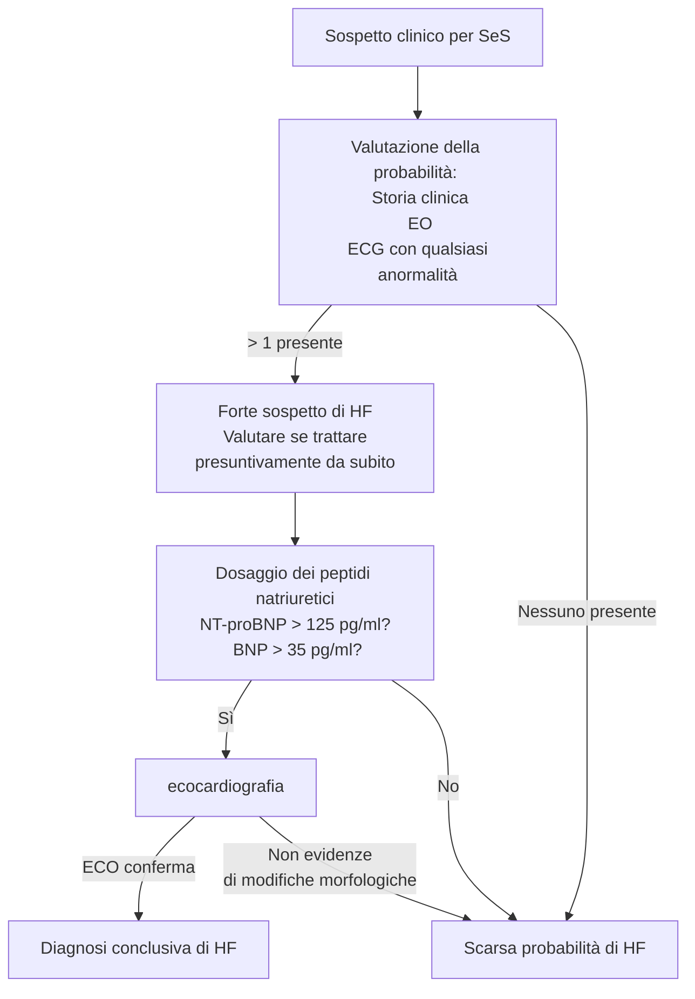

\clearpage
\part{Malattie cardiovascolari}

<!-- mar 16 mar 2021, 16:11:26, CET -->

# Embolia polmonare acuta (APE) \todo{Da fare bene da sbobba}
- \pat{ape} --- condizione clinica causata da ostruzione acuta di una porzione di estensione variabile del letto arterioso polmonare a seguito di tromboemboli -- i quali sono solitamente originati in vene profonde degli arti inferiori (\pat{tvp})
- È problema clinico estremamente rilevante: di difficile diagnosi e alta mortalità
	- Sintomi non specifici, e molto eterogenei
	- Frequente (particolarmente in pz. ospedalizzati)
	- Alta mortalità se non diagnosticata
	- Fattori di rischio frequentemente ritrovabili in popolazione
- Per aiutarsi nella diagnosi, è imperativo correlare fattori di rischio con segni e sintomi!

## Epidemiologia
- 115--269 casi/100K abitanti all'anno
	- 5% dei casi quadro severo
	- 90% dei casi quadro lieve
- Mortalità tendenzialmente costante (~ 8% dei casi)

## Presentazione clinica

### Fattori di rischio
- Forti
	- Fratture agli arti inferiori
	- Precedente tromboembolismo venoso
	- Immobilismo (⇐ danni al midollo)
	- Ospedalizzazione da < 3 mesi per \pat{scompenso cardiaco}/\pat{fibrillazione atriale}/\pat{flutter atriale}
	- \pat{im} da < 3 mesi
	- Traumi maggiori
	- Protesi/sostituzioni di anca e ginocchio
- Moderati
	- Artroscopia
	- Patologie autoimmuni
	- Trasfusioni
	- Cateteri venosi (centrali > periferici)
	- Chemioterapia
	- \pat{scompenso cardiaco congestizio}/\pat{insufficienza respiratoria}
	- \todo{qualche altra}
- Minori
	- Procedure per fertilizzazione in vitro/contraccettivi orali
	- Periodo post--parto (↑ coagulazione)
	- Infezioni (polmonite, infezioni urinarie, HIV, Covid-19...)
	- IBD
	- Neoplasie (particolarmente se metastatiche)
	- Stroke
	- Trombosi venosa superficiale
	- Trombofilie congenite
- Deboli
	- Immobilità a letto > 3gg
	- Diabete
	- Ipertensione
	- Immobilità da seduta prolungata^[Anche in aereo (rischio di TVP proporzionale a lunghezza del volo) e in lunghi viaggi in macchina]
	- \todo{ne mancano}

### SeS
- Sintomi
	- \goldstandard Dispnea
		- Solitamente a insorgenza improvvisa
		- A volte solo dispnea da sforzo^[Se ci sono emboli piccoli che si alloggiano nel letto arterioso polmonare in maniera lenta e progressiva]
	- \goldstandard Dolore toracico (pleuritico o substernale)
	- Tosse
	- Emottisi
	- Sincope
- Segni
	- Tachipnea (FR ≥ 20) \marginnote{Tachipnea e tachicardia sono sintomi che aiutano a monitorare l'andamento: se peggiora il quadro peggiorano questi sintomi, se la terapia ha successo piano piano rientrano}
	- Tachicardia (FC ≥ 100)
	- Segni di TVP (edemi declivi)
	- Febbre
	- Cianosi (periferica → centrale)

### Algoritmo diagnostico
- In primis: __QL: quadro di grave instabilità emodinamica__ Sì ⇒ alto rischio e poco tempo ⇒ trattare
	- Alto rischio (~3% dei casi) → mortalità 14--30%
	- Basso rischio (~97% dei casi) → mortalità stratificata a seconda del rischio specifico

| Stratificazione | Mortalità | Prevalenza |
|-|-|-|
|Intermedio--alto| ||
|Intermedio--basso|||
|Basso|||

```{.mermaid width=700}
flowchart
	sospetto[Sospetto clinico di PE] --> shock[Instabilità emodinamica?]
	shock -->|Sì| alto[ALTO RISCHIO]
	shock -->|No| basso[Non ad alto rischio]

	alto -->|Eco Bedside| rvdisf[C'è disfuzione del ventricolo dx?] -->|Sì| tac[CTPA immediatamente fattibile?] -->|No| tratto[Tratto per PE ad alto rischio]
	rvdisf -->|No| altro[Cerco altre cause di instabilità emodinamica]
	tac -->|Sì| ctpa[CTPA è suggestiva?] -->|Sì| tratto
	ctpa -->|No| altro2[Cerco altre cause di instabilità emodinamica]

	basso --> valuto[Valuto la proababilità di PE]
	valuto -->|Bassa probabilità| dd[Test D-dimero]
	valuto -->|Alta probabilità| ctpa2[CTPA]

	dd --> |Negativo| no[Non trattamento per PE]
	dd --> |Positivo| ctpa2 -->|PE confermato| trattamento2[Tratto per PE\n stratificando il rischio]
	ctpa2 --> |PE escluso| no
```
- Instabilità emodinamica se una di 3 condizioni
	1. ACR
	2. Shock
		- PA~sis~ < 90 mmHg
		- \far{vasopressori} necessari per tenere PA > 90 mmHg
		- Ipoperfusione periferica (stato metnale alterato, cute fredda, oliguria, ↑ lattati
	3. Persistente ipotensione
		- ↓ PA di ≥ 40 mmHg per 15'

- Dd
	- IM (quindi faccio ECG)
	- Polmonite
	- Scompenso cardiaco congestizio riacutizzato
	- Asma
	- Pericardite
	- Neoplasia intratoracica
	- PNX spontaneo
	- Frattura costale
	- Costocondrirte
	- Dolore toracico non specifico
	- Ansia o attacchi di panico

## Trattamento e stratificazione del rischio \todo{}
- Di fatto è __scoagulare il pz.__

# Ipertensione polmonare
- \pat{ipertensione polmonare} --- stato patofisiologico in cui la pressione polmonare media (mPAP) è > 25 mmHg (mPAP fisiologica = 20 mmHg)
- mPAP si misura in maniera cruenta con [cateterizzazione^[Mediante il catetere di Swan--Ganz]](https://it.wikipedia.org/wiki/Catetere_di_Swan-Ganz) del cuore dx \marginnote{Una stima può essere fatta tramite l'eco Doppler, stimando il rigurgito di sangue in caso di una minima insufficienza tricuspidalica (che un botto di persone hanno). La stima ecocardiografica può portare alla valutazione di una eventuale ipertensione polmonare con un certo grado di confidenza (bassa, media o alta probabilità) anche correlando i valori del flusso di rigurgito con altre eventuali condizioni patologiche}
- L'ipertensione polmonare è una condizione che si riscontra in 5 gruppi di patologie
	1. BOH \todo{}
	2. Ipertensione polmonare da patologie del cuore sinistro
	3. Ipertensione polmonare da patologie polmonari e/o ipossia
	4. Ipertensione polmonare da tromboembolismo cronico
	5. BOH

<!-- gio 18 mar 2021, 16:13:45, CET -->
# Scompenso cardiaco cronico (\pat{chf})
- Lo \pat{scompenso cardiaco} è una sindrome clinica complessa, causata dall'inadeguatezza del cuore a pompare sangue nell'organismo in una quota adeguata alle necessità fisiologiche dell'organismo \marginnote{Anche conosciuto come \emph{Hearth Failure} (cronico o congestizio)}
	- Definizione \underline{clinica} --- sindrome caratterizzata da SeS tipici
	- Definizione \underline{patofisiologica} --- stato nel quale il cuore è incapace di fornire una perfusione sufficiente alle necessità momentanee dell'organismo senza fare uso estensivamente del meccanismo di Frank--Starling. \marginnote{\emph{Meccanismo di Frank Starling} = meccanismo per il quale aumenta la portata cardiaca se aumenta il precarico} Alternativamente, situazione in cui il cuore è incapace di mantenere un output adeguato a soddisfare le esigenze metaboliche momentanee e garantire un adeguato ritorno venoso
	- Definizione \underline{emodinamica} --- stato in cui si verifica una o più alterazioni di questi parametri emodinamici: \todo{}
		- _Indice cardiaco_ < 2.5 lt/min/m^2^ \marginnote{Dove l'\emph{Indice cardiaco} è il rapporto $$\frac{\text{CO [lt/min]}}{\text{superficie corporea}}$$ \newline con \newline CO = Cardiac Output}
		- RAP > 8 mmHg
		- Wedge pressure ≥ 15 mmHg

## Epidemiologia
- La prevalenza dipende dalla efinizione, ma mediamente
	- 1--2% popolazione adulta
	- ≥ 10% popolazione > 70aa

## Patofisiologia
- L'attività cardiaca è caratterizzata da un doppio aspetto: l'aspetto ventricolare e l'aspetto vascolare \todo{}
	1. Funzione ventricolare (mantenere precarico, contrattilità e vincere il postcarico)
	2. Funzione vascolare (vincere il postcarico e garantire perfusione dei vasi)
- A seconda della porzione cardiaca insufficiente si distingue \todo{tutto questo discorso}
	- Scompenso cardiaco dx (2)
	- Scompenso cardiaco sx (3)
	- Scompenso cardiaco dovuto a disfunzione di entrambi i ventricoli (4)

\ 

### Meccanismi di compenso \todo{tutto}
- In un quadro di IC l'organismo attua 3 tipologie di compenso, tentando così di mantenere un'adeguata perfusione tissutale
	1. Compenso tramite rimodellamento strutturale
	2. Compenso tramite meccanismi neuro--ormonali
	3. Compenso emodinamico
- Con il progredire del tempo, gli adattamenti diventano essi stessi una causa che sostiene lo scompenso iniziale

#### Compenso tramite rimodellamento strutturale

#### Compenso tramite meccanismi neuro--ormonali

#### Compenso emodinamico

## Cause
1. Patologie che danneggiano la funzionalità del miocardio, ↓ capacità contrattile
	- Ischemie
	- Danno tossico
	- Patologie autoimmuni
	- Infiltrazioni neoplastiche
	- Alterazioni metaboliche o ormonali
2. Aumento del carico
	- Ipertensione
	- Difetti valvolari (acquisiti o congeniti)
	- Patologie del pericardio o dell'endocardio
	- Stati ad alta portata cardiaca
	- Sovraccarico di volume
3. Aritmie
	- Tachiaritmie (↓ CO)
	- Bradiaritmie (↑ volume)

## Clinica
- SeS
	- Dispnea a riposo o da sforzo (_spesso ortopnea_, spesso dispnea parossistica notturna)
	- Astenia, stanchezza
	- Segni di ritenzione idrica (es: congestione polmonare, edemi declivi, epatomegalia^[Epatomegalia da congestione epatica (stasi venosa ⇒ ristagno nei vasi epatici e rigonfiamento del parenchima epatico). Oltre ad avere quindi solitamente reperti di epatomegalia all'esame obiettivo si può avere dolore in ipocondrio dx e altri segni generici (ascite, nausea, vomito...). Se cronico, si può accompagnare a distruzione del parenchima con franco danno epatico]...)
	- Possibile cardiopalmo
	- Possibile dolore toracico
- A seconda della severità dei sintomi e di quanto questi impattino l'attività fisica _ordinaria_ del sg. questo viene stratificato in 4 classi

| Classe | Limitazione dell'attività ordinaria|
|-|-|
|Classe 1 | Nessuna limitazione dell'attività fisica ordinaria |
|Classe 2 | Leggera limitazione dell'attività fisica ordinaria, con insorgenza di SeS tipici di HF ma di intensità lieve e gestibile. Qualità di vita accettabile|
|Classe 3 | Marcata limitazione dell'attività fisica ordinaria, con comparsa di SeS tipici di HF durante attività fisica meno intensa rispetto a quella ordinaria. Qualità di vita notevolmente compromessa|
|Classe 4 | Incapacità di fare attività fisica senza l'insorgenza di sintomi. Possibili sintomi a riposo |

- All'obiettività cardiaca
	- ↑ pressione venosa giugulare^[Misurabile guardando a che livello si ha il massimo rigonfiamento della \ven{giugulare esterna} a pz. posizionato supino sul lettino, inclinato a ~ 45°. Se non sono visualizzabili, si può porre la mano a taglio sul decorso delle vene, occludendole parzialmente, per facilitarnel l'identificazione. In caso di scompenso, siccome spesso aumenta il precarico, avrò una pressione venosa giugulare più alta (registrabile più in alto). Spesso questo è sintomo di scompenso destro]
	- Riflesso epatogiugulare
	- Reperti obiettivi di megalia del cuore
	- Possibile itto spostato/ingrandito o altri segni di cardiomegalia
- All'RX torace
	- Evidenziazione di un quadro di congestione venosa polmonare^[Quadro tipico in cui si visualizza il reticolo venoso polmonare all'RX (tipicamente, per un fatto di gravità, è più visibile alle basi, non visibile agli apici)]
	- Edema interstiziale (non rantoli, non ronchi, possibile MV ridotto)
	- Edema polmonare (opacità "ad ali di pipistrello" + rantoli a piccole bolle)
		- Opacità più o meno diffusa all'RX a seconda dell'estensione dell'edema
		- Addensamenti caratteristici (disordinata, localizzata in alveoli) alla TAC
	- Idrotorace/versamento pleurico

### Comorbidità

\footnotesize
Andare a capire quali siano obesità e quali siano con-cause non è assolutamente facile in certe situazioni
\normalsize

- Angina
- Patologie coronariche
- Cachessia, sarcopenia
- \todo{elenco da slide e/o sbobbe}

## Diagnosi \todo{Controllare che sia algoritmo giusto da slide}



## Trattamento
1. Miglioro i sintomi momentanei
	- Diuretici, diuretici e diuretici! (a meno di EPA non esagerare o si potrebbe avere ipotensione)
	- O~2~ tp. al bisogno
2. Guadagno il controllo della situazione di scompenso
	- Diuretici diuretici e ancora diuretici
	- Se FE ridotta
		- Contrasto degli adattamenti anti-neuro-ormonali (\far{ace-inibitori}, \far{β-bloccanti})
		- Se i sintomi permangono
			- Ipotizzo agonisti dell'aldosterone se i sintomi permangono
			- Alternative farmacologiche avanzate (\far{arni}^[Inibitori del recettore dell'angiotensina])
			- Ho sintomi particolari?
				- QRS ≥ 130 ms? ⇒ Cardiac Resynchronization Therapy ([CRT](https://en.wikipedia.org/wiki/Cardiac_resynchronization_therapy))
				- HR > 70 bpm nonostante β-bloccato? ⇒ \far{ivabradina}
			- Ho rischio di morte improvvisa? (LVEF ≤ 35%, storia di VT/VF) ⇒ valutare pacemaker
	- Se FE conservata
		- Ho poche armi terapeutiche
		- Bisogna trattare __la causa di base__ (ipertensione mal controllata? Cardiomiopatia?)
3. Ipotizzo cambiamenti a lungo termine per prevenire peggioramenti/riacutizzazioni
	- Aggiustare dose terapeutica
	- Valuto cambiamenti più a lungo termine (anche interventi non farmacologici)

# Scompenso cardiaco acuto (\pat{ahf})
- \pat{ahf} --- quadro patologico caratterizzato da un'insorgenza acuta di scompenso cardiaco o da un peggioramento repentino di un quadro di scompenso preesistente
- \todo{Sono arrivato un po' tardi \\ mar 23 mar 2021, 14:34:09, CET}
- Fattori precipitanti \todo{}

## Fisiopatologia

\ 

- I 3 pilastri (congestione, bassa perfusione e compenso neuroormonale) portano a danno miocardico, principalmente per 4 cause
	1. Basso CO → ipotensione → ↓ perfusione coronarica
	2. Me
	3. Li sono
	4. PERSIIIIIIIIIIIII
- Nello scompenso il rene e il cuore si combattono
	- I sistemi neuro--ormonali attraverso il rene tendono a trattenere liquidi (per basso output cardiaco)
	- Trattenere liquidi però peggiora lo stato congestizio

## Clinica
- \todo{introduzione}

\ 

- SeS di bassa perfusione
	- ↓ pressione differenziale
	- Obnubilamento del sensorio
	- Ritenzione idrica (↓ Na ematico ["_iperidratazione ipotonica_"])
	- Estremità fredde
	- Ipotensione
	- Disfunzione epatica e renale
- SeS congestione
	- Ortopnea
	- Distensione giugulare
	- Epatomegalia
	- Edemi
	- Rantoli (EP)
	- Riflesso epato--giugulare

### Prognosi
- Elementi prognostici negativi: \todo{}

## Terapia
- Obiettivi
	- Immediati (PS, ICU, CCU)
		- Alleviare i sintomi
		- __Controllare l'emodinamica__ (↑ portata, ↓ congestione)
		- Evitare danni organici
		- Limitare la degenza in ICU/CCU
	- Intermedi (ricovero in corsia)
		- Stabilizzazione clinica e ottimizzazione della terapia
		- Iniziare terapia orale cronica (\far{ace-inibitori}, \far{βb}, antagonisti dell'aldosterone)
		- Valutare se necessari dispositivi di assistenza (pacemaker^[Defibrillatori impiantabili, ICDs (Implantable Cardiac Defibrillators)], terapia di resincronizzazione elettrica cardiaca^[Anche detta CRT. È terapia elettrica che serve a migliorare la contrattilità del muscolo cardiaco]...)
	- A lungo termine (pre-dimissione e dimissione)
		- Ottimizzare terapia orale cronica
		- Educare il pz. a non aumentare il carico idrico
		- Educare a stile di vita sano (esercizio fisico apposito per riabilitazione cardiaca, alimentazione, fattori di rischio)
		- Seguire pz. dal punto di vista psicosociale e familiare

### Farmacologia \todo{Farmaci da slide}
- Vasodilatatori
- Diuretici (attenzione a combinarli, a volte hanno effetto eccessivo)
	- Dell'ansa (\far{furosemide})
	- Tiazidici
- Inotropi(attenzione, all'inizio funzionano ma a lungo andare stancano il cuore ancora di più, peggiorando il quadro a lungo termine)
	- β-agonisti (\far{dobutamina}, \far{dopamina})
- Vasopressori (\far{adrenalina})
- Oppioidi e/v (ridurre il drive adrenergico)


### Trattamento dello scompenso ad alta portata (PAs > 140) \todo{}

### Trattamento dello scompenso acuto con portata normale (PAs 140--90) \todo{}

### Trattamento dello scompenso acuto a bassa portata (PAs < 90) \todo{}

\ 

# Shock
- \pat{shock} --- sindrome clinica caratterizzata da un'insufficienza acuta e severa del sistema cardiocircolatorio tale per cui non è garantita una corretta perfusione d'organo
- Distinguiamo 4 gruppi di shock \todo{Confronto con discorso in semeiotica}
	- Shock ipovolemico
	- Shock cardiogeno
	- Shock distributivo
	- Shock ostruttivo
- Segni clinici
	- Ridotto flusso urinario
	- Cute fredda, cianotica, sudata, marezzata
	- Alterazioni neurologiche e della coscienza
	- \todo{ALTRO}
- \todo{Roba}

## Shock cardiogeno
- Per gestione: vedi \todo{doi:10.1002/ejhf.1922}

\ 

### Fisiopatologia

### Supporti meccanici alla circolazion3
- Contropulsatore aortico (IABP --- Intra-Aortic Balloon Pump)
	- \todo{}
- Sistema Impella
	- Sistema per produrre un _flusso continuo_ (max 5 lt/min) dal ventricolo sx all'aorta ascendente
		- Il flusso viene prodotto tramite una turbina che aspira il sangue dal VS e lo porta in aorta
	- È tendenzialmente una soluzione _a breve termine_ (in urgenza)
		- Flusso continuo ⇒ ↑ pressione aortica ⇒ danneggiamento della valvola aortica (non adeguato se preesistente insufficienza aortica preesistente, perché si antagonizza eccessivamente l'azione della pompa)
		- Turbina ⇒ ↑ emolisi (ma rischio > beneficio)
	- Accesso: femorale, ascellare dx
- ECMO (Extra-Corporeal Membrane Oxygenation
	- Sistema per aspirare il sangue venoso, ossigenarlo e re-iniettarlo in circolo ⇒ assistenza _circolatoria e ventilatoria_
	- Accesso:
		- Solitamente cannulazione periferica (a/v o v/v a seconda dell'opportunità)
			- Se insufficienza cardiaca e respiratoria: incannulamento artero-venoso (tipicamente arteria e vena femorale)
			- Se solo insufficienza respiratoria: incannulamento veno-venoso (tipicamente vena femorale e \ven{giugulare interna})
		- Possibile cannulazione centrale, opportuna in alcuni quadri
- LVAD (Left Ventricular Assist Device)
	- \todo{}
	- Può essere sia bridge therapy (di solito) ma anche tp. definitiva in certi casi

<!-- Piovaccari -->
# Sindromi Coronariche Acute

# Infarto del miocardio
- \todo{Fino a complicanze}

## Complicanze
- Non cardiologiche
	- Infezioni (respiratorie, urinarie, cutanee)
	- Ictus
	- Complicanze da farmaci/trattamento
- Cardiologiche
	- __Aritmie__ (con possibile ACR)
	- \pat{ahf}
		- → shock cardiogeno in 5% degli \pat{im}
		- Edema polmonare
	- Embolia polmonare
	- Re-infarto
	- Pericardite
	- Complicanze meccaniche
		- Precoci
			- Rottura del setto interventricolare
			- Rottura della parete cardiaca
			- Insufficienze valvolari, solitamente mitralica (⇐ infarto dei \mus{mm papillari})
		- Tardive (ora molto rare per disponibilità di cure intensive)
			- Danno miocardico permanente (→ \pat{chf})
			- Aneurisma cardiaco (⇐ dilatazione sacciforme del ventricolo ⇐ sostituzione del tessuto miocardico con tessuto fibroso non contrattile ⇐ danno ischemico)
			- Pseudoaneurisma^[__Pseudoaneurisma__ --- raccolta di sangue che si forma tra i due strati esterni di una arteria, la tonaca muscolare e la tonaca avventizia. Di solito è causato da una lesione al vaso. Può essere pulsante e assomigliare ad un vero aneurisma, tuttavia quest'ultimo coinvolge tutti e tre gli strati del vaso sanguigno] cardiaco (⇐ rottura di parete secondaria a danno ischemico)
			- Trombosi endoventricolare (⇐ per stasi dovuta a ↓ contrattilità di parete conseguente al danno ischemico)
				- Complicanze distrettuali per dipartita dei trombi

### Rottura del setto interventricolare post-infartuale
- Patogenesi: danno infartuale ⇒ ↓ resistenza del setto interventricolare ⇒ ↑ rischio di rottura
	- Shunt dx--sx di grado variabile ⇒ scompenso cardiaco a bassa portata
	- Compromissione emodinamica di grado variabile
- Tp. è riparazione esclusivamente chirurgica, ma difficile:
	- Procedura in emergenza su un cuore infartuato)
	- Non è detto che ci sia modo di suturare efficacemente la rottura o la parte circostante per danneggiamento della parete

### Rottura acuta di parete
- \todo{}

## Terapia e gestione
- _Time is muscle!_
- \todo{}

## Dissezione coronarica
- \todo{}

### Terapia
- __Più conservativa possibile__ (angioplastica come ultima risorsa, potrebbe peggiorare)
	- Tp. antipertensiva
	- βb
	- CardioASA

## Cardiomiopatia da stress (\pat{sindrome di takotsubo})
- \todo{}
- Diagnosi
	- Coronarografia: le coronarie devono essere normali
	- Tipica morfologia cardiaca (ventricolografia, TAC)
