* * * *

<!-- mar 16 mar 2021, 16:11:26, CET -->

# Embolia polmonare acuta
- ___Acute Pulmonary Embolism___ (anche EPA)--- condizione clinica causata da ostruzione acuta di una porzione di estensione variabile del letto arterioso polmonare a seguito di (trombo)emboli -- i quali sono solitamente originati in vene profonde degli arti inferiori (___TVP___)
- È problema clinico estremamente rilevante: di difficile diagnosi e alta mortalità
	- ⚠️ Sintomi non specifici, e molto eterogenei ⇒ __mantenere un'alta soglia di sospetto__ e correlare [SeS](#epses) con [fattori di rischio](#epfattrischio)
	- Frequente (particolarmente in pz. ospedalizzati)
	- Alta mortalità se non diagnosticata
	- Fattori di rischio frequentemente ritrovabili in popolazione, sopratutto ospedalizzata
- Approccio stratificato secondo rischio.
	#. __Rischio grave__ (3--5% pz.): pathway clinico rapido, ho poco tempo per evitare morte
	#. __Rischio basso--moderato__ (95--97 % pz.): iter diagnostico più lento, ma sensibile e specifico

	| Stratificazione del rischio | Mortalità | Prevalenza |
	|-|-|-|
	|Alto|14--30%|3|
	|Intermedio--alto|7.7|15|
	|Intermedio--basso|6.0|50|
	|Basso|0.5|30|

## Epidemiologia
- 115--269 casi/100K abitanti all'anno
	- 5% dei casi quadro severo
	- 90% dei casi quadro lieve
- Mortalità tendenzialmente costante (~ 8% dei casi)

## Presentazione clinica
- __Eterogenea__. La gravità dipende
	- Da dimensioni dei trombi (più sono grandi, più tappano una zona estesa, più sono gravi)
	- Dalla tempistica: più trombi contemporaneamente è peggio che un trombo solo
	- Da localizzazione terminale

### Fattori di rischio {#epfattrischio}
- Forti
	- Fratture aaii
	- Precedente tromboembolismo venoso (50% TEV → EP, di queste solo 10% porta a sintomi)
	- Ospedalizzazione da < 3 mesi per HF, AFib, AFlutter
	- IMA < 3 mesi
	- Immobilismo (⇐ danni al midollo)
	- Traumi maggiori
	- Protesi/sostituzioni di anca e ginocchio
- Moderati
	- Artroscopia
	- Patologie autoimmuni
	- Trasfusioni
	- Cateteri venosi (centrali > periferici)
	- Chemioterapia
	- CHF, Insufficienza respiratoria
	- Uso di agenti eritropoietenici
- Minori
	- Tp. ormonale sostitutiva, contraccettivi orali, tp per fecondazione in vitro
	- Procedure per fertilizzazione in vitro/contraccettivi orali
	- Periodo post--parto (↑ coagulazione)
	- Infezioni (polmonite, IVU, HIV, Covid-19...)
	- IBD
	- Neoplasie (particolarmente se metastatiche)
	- Ictus con paralisi
	- TV superficiale
	- Trombofilie congenite
- Deboli
	- Immobilità a letto > 3gg
	- Diabete
	- Ipertensione
	- Immobilità da seduta prolungata^[Anche in aereo (rischio di TVP proporzionale a lunghezza del volo) e in lunghi viaggi in macchina]
	- Età
	- Chirurgia laparoscopica
	- Obesità
	- Gravidanza
	- Vene varicose

> __Wells' Score__  
> Score che correla fattori di rischio con probabilità di PE
> 
> - Symptoms of DVT (+3 points)
> - No alternative diagnosis better explains the illness (+3 points)
> - Tachycardia with pulse > 100 (+1.5 points)
> - Immobilization (>= 3 days) or surgery in the previous four weeks (+1.5 points)
> - Prior history of DVT or pulmonary embolism (+1.5 points)
> - Presence of hemoptysis (+1 point)
> - Presence of malignancy (+1 point)
> 
> | Score | Probabilità di PE |
> |-|-|
> |> 6 | Alta |
> |2-6 | Intermedia |
> |< 2 | Bassa |


### Diagnosi {#epses}
1. Sospetto diagnostico se (mantenere bassa soglia di sospetto!)
	- Fattori di rischio (Wells' score per correlarli con probabilità)
	- Sintomi
		- Dispnea
			- Solitamente a insorgenza improvvisa
			- A volte solo dispnea da sforzo^[Se ci sono emboli piccoli che si alloggiano nel letto arterioso polmonare in maniera lenta e progressiva]
			- Possibile platipnea in stati di cuore polmonare^[__Cuore polmonare__ --- ingrandimento del ventricolo destro (⇒ alterazioni in struttura e funzione), causato da una qualche malattia polmonare (solitamente ipertensione polmonare), che porta ad una risposta cardiaca errata. Raramente si è dimostrato anche l'interessamento del lato sinistro del cuore], più tipica in grandi EP
		- Dolore toracico (pleuritico o substernale)
		- Tosse
		- Emottisi
		- ± Sincope
	- Segni
		- Tachipnea (FR ≥ 20)^[Tachipnea e tachicardia sono sintomi che aiutano a monitorare l'andamento: se peggiora il quadro peggiorano questi sintomi, se la terapia ha successo piano piano rientrano]
		- Tachicardia (FC ≥ 100)
		- Segni di TVP: edemi declivi, differenze aa (temperatura, dolorabilità [specialmente alla compressione dei muscoli], gonfiore, arrossamento, segni di disperfusione [cianosi o pallore a seconda dell'edema] unilaterale, eventuale turgore dei circoli collaterali [sopratutto se superficiali])
		- Cianosi (periferica → centrale)
		- Possibili segni di sovraccarico destro: ↑ PVG con dilatazione, congestione epatica ± pulsatilità, riflesso epatogiugulare
		- Febbre
	- Esami strumentali ed imaging (non AngioTC): cambiamenti nonspecifici, diventano tanto più specifici quanto EP è grande
		- __ECG__: possibili segni di sovraccarico destro (p polmonare), possibili segni più specifici (pattern S1Q3/S1Q3T3), possibili altre rilevazioni nonspecifiche generiche^[BBDX di nuovo riscontro (anche incompleto9, ST rigido o STE in una derivazione (sopratutto inferiori)]
		- __RX__: possibile atelettasia o infiltrato; raramente si evidenziano zone di infarto polmonare a valle del trombo
		- __POCUS__ tanto più specifica quanto EP grave: Vent dx dilatato (_"cuore polmonare"_) e sue pareti ipomobili; _segno di McConnel_ (apice RV ipercontrattile ma pareti ipomobili); possibile evidenziare trombi a cavaliere sse particolarmente grandi

2. Ddx
	- IM (quindi faccio ECG)
	- AHF/HF acuto su cronico
	- Pericardite o tamponamento pericardico
	- Polmonite
	- Neoplasia intratoracica
	- PNX spontaneo
	- Frattura costale
	- Costocondrirte
	- Asma
	- Dolore toracico non specifico
	- Ansia o attacchi di panico


### Stratificazione del rischio
- Tx: c'è quadro di grave instabilità emodinamica? Sì ⇒ alto rischio e poco tempo ⇒ trattare immediatamente
	1. ACR
	2. Shock (ostruttivo)
		- PA~sis~ < 90 mmHg
		- Pressori necessari per tenere PA > 90 mmHg nonostante volemia adeguata
		- Segni di ipoperfusione periferica (AMS, cute fredda, oliguria, ↑ lattati
	3. Ipotensione grave e persistente
		- PA~sis~ < 90 mmHg
		- ↓ PA di ≥ 40 mmHg per 15'

- Da @konstantinides2019ESCGuidelines2020 (LG ESC 2019)


- I pz. a rischio _non alto_ possono ulteriormente essere stratificati in sotto-classi di rischio (che correlano con mortalità e contribuiscono a guidare il trattamento) in funzione di
	#. Situazione clinica grave (PESI -- Pulmonary Embolism Severity Index)
		- PESI > III, sPESI ≥ 1
	#. Disfunzione ventricolare dx (segni all'ECO e/o AngioTC polmonare)
	#. ↑ cTn

	{width=50%}
	
> __PESI e sPESI score__  
> Si applicano su pz. a cui è _già stato diagnosticato PE & non sono ad alto rischio_: correlano la gravità della situazione clinica con 5 classi di mortalità a medio termine
>
> | Fattore clinico | Punteggio |
> |-|-|
> |Age (years) |+1 punto per aa|
> |Male sex |+10|
> |Cancer (previous or active) |+30|
> |Heart failure |+10|
> |Chronic lung disease |+10|
> |Pulse ≥ 110 min^−1^ |+20|
> |SIS < 100 mmHg |+30|
> |RR ≥ 30 min−1 |+20|
> |Temperature < 36°C |+20|
> |Altered mental status (disorientation, lethargy, stupor or coma) |+60|
> |SpO~2~ < 90% (with or without the administration of supplemental oxygen) |+20|
>
> |Risk class |Points |30 day mortality risk stratification | 30 day mortality |
> |-|-|-|-|
> |Class I |≤ 65 |Very low risk|0--1.6%|
> |Class II |66–85 |Low risk|1.7--3.5%|
> |Class III |86–105 |Intermediate risk|3.2--7.1%|
> |Class IV |106–125 |High risk|4.0--11.4%|
> |Class V |> 125 |Very high risk|10--24.5|

### Trattamento
- L'aggressività del trattamento dipende dalla stratificazione del rischio, ma tutti i pz. vanno scoagulati (con varia aggressività)

	{width=50%}

- Tx ha 3 (+1) cardini in funzione del rischio
	1. Eparinizzazione (ogni classe di rischio, iniziare senza indugio in pz. high risk)
		- `UFH`^[ufhvslmvh] > `LMWH` (bolo in funzione del peso, non ritardare se alto rischio)
	2. Trombolisi se non controindicazione (High risk)
		- __Trombolisi sistemica (farmacologica)__
			- ⭐️ `tPA` ricombinante (_100 mg/2h EVc_)
			- `streptokinasi`
		- Trombectomia chirurgica sse trombolisi sistemica non indicata
		- Cateterizzazione vasale percutanea per embolisi^[Tramite cateterizzazione dei vasi si gunge all'arteria in cui c'è il trombo, e si tenta di frammentarlo o spingerlo in periferia] sse trombectomia impossibile per mancanza di cardioch
	3. Socagulazione (Intermediate/Low risk)
		- NAO sono prima scelta
		- Altri agenti anticoagulanti a seconda dell'opportunità clinica
	4. Supporto (secondo necessità)
		- Supporto emodinamico di varia intensità in funzione della condizione clinica
		- ECMO + embolectomia|embolisi può essere considerato in pz. con PE che porta ad ACR refrattario o collasso emodinamico

> __Controindicazioni _assolute_ alla trombolisi__  
>
>- Storia di stroke emorragico o di origine sconosciuta
>- Stroke ischemico < 6 mesi
>- Neoplasia SNC
>- Trauma/chirurgia/contusione testa < 3 settimane
>- Diatesi emorragica
>- Sanguinamento attivo

- Dimissione: tp. anticoagulante per almeno 3m, con f/u per decidere se sospendere
	- Se eziologia tromboembolismo è risolta, o la causa era transitoria (eg: intervento, rottura di arto...) allora ok sospensione
	- Se fattori di rischio permangono valutare opportunità di continuare tp.

[^ufhvslmvh]: UFH is a heterogeneous mixture of different length strands of heparin.  It sticks to endothelial cells, macrophages, and various heparin-binding proteins. This makes its pharmacokinetics unpredictable, requiring monitoring. ([emcrit.org/ibcc](https://emcrit.org/ibcc/heparin/#choice_of_agent)). 

	UFH È inoltre preferibile per una migliore tutela dell'azione renale e nelle done in gravidanza, perché non sorpassa il circolo placentare]

# Ipertensione polmonare

> __Come misurare l'emodinamica del circolo polmonare; ovvero: PAP, mPAP e PAWP__  
>
>| Parametro emodinamico | Range accettabile |
>|-|-|
>|PAPS | 22 ± 11 |
>| PAPD | 10 ± 5 |
>| mPAP | 14 ± 6 |
>| PAWP | 9 ± 3  |
>
> TL;DR: [https://youtu.be/IRNJfqkQbVA](https://youtu.be/IRNJfqkQbVA)
>
> La misurazione _precisa_ dei valori dell'emodinamica polmonare è un'operazione cruenta, poiché prevede il cateterismo del cuore destro partendo da una vena di grosso calibro (succlavia, giugulare interna o femorale).  
Una _stima_ di mPAP può essere ottenuta mediante valutazione ecografica, misurando la velocità del rigurgito parafisiologico della valvola tricuspide (che è direttamente proporzionale alla pressione del circolo polmonare).
>
>Per stimare i valori in modo preciso si cateterizza, con un catetere apposito ([Catetere di Swan--Ganz]()) prima un grosso vaso venoso → atrio dx → ventricolo dx → arteria polmonare → diramazioni del primo ordine.
>
>Il catetere di SG è sostanzialmente un trasduttore per la PA cruenta opportunamente modificato: tipicamente è a 4 lumi (porta per PA, porta per pressione ventricolare, per infusione e per gonfiaggio del palloncino) e con aggiunte necessarie per specifiche ragioni (monitoraggio dell'output cardiaco mediante termodiluizione). L'apertura del catetere per il monitoraggio è posizionata in punta, subito distalmente al palloncino -- che quindi si trova di qualche millimetro più prossimale rispetto all'apertura del lume che verrà collegato al trasduttore per la PA cruenta.
>
>Questo consente di misurare la pressione arteriosa in 2 situazioni
>
>- __A palloncino sgonfio__ → si misurerà la pressione dell'arteria polmonare con le variazioni dovute al ciclo cardiaco (PAPS e PAPD). Da qui si ricaverà la __mPAP__ con un calcolo analogo alla MAP sistemica:
>
>	$$ mPAP = PAPD + \frac{1}{3}(PAPS-PAPD)$$
>- __A palloncino gonfio__ → si interrompe il flusso (e la sua variazione dovuta all'attività vent dx) ⇒ grazie alla grande complianza dei vasi polmonari la pressione distale al palloncino si metterà in equilibrio fino all'atrio sx. Questa pressione viene detta PAWP (_"Pulmonary Artery Wedge Pressure"_ o _pressione di incuneamento polmonare"_). NB: PAWP correla di fatto con il volume telediastolico


- ___Ipertensione polmonare___ (PH) --- stato patofisiologico in cui la pressione polmonare media (mPAP) è > 25 mmHg (mPAP fisiologica ≌ 15 mmHg)
	#. Ipertensione da danno alla circolazione polmonare --- _ipertensione **pre**capillare_ (↑ mPAP, PAWP ok)
	#. Ipertensione da insufficienza sinistra --- _ipertensione **post**capillare_ (↑ mPAP, ↑ PAWP)

- L'ipertensione polmonare è una condizione che si riscontra in > 50 patologie, divisibili in gruppi (frequenza ↓)
	#. Ipertensione polmonare da patologie del cuore sinistro^[Scompenso sinistro sistolico (a FE ridotta) o diastolico (a FE conservata), insufficienza mitralica]
	#. Ipertensione polmonare da patologie respiratorie (LD) e/o ipossia^[COPD, interstiziopatie, patologie ostruttive/restrittive, apneee notturne, ipoventilaioni alveolari, patologie dello sviluppo]
	#. Ipertensione polmonare propriamente detta^[Idiopatica, ereeditabile, da farmaci, associata ad altri disordini (connettivopatie, HIV, ipertensione portale, difetti cardiaci congenici, schistosomiasi, da patologie veno--occlusive, da emangiomatosi dei capillari polmonari]
	#. Ipertensione Polmonare da TromboEmbolismo Cronico o altre occlusioni (CTEPH)
	#. Ipertensione polmonare multifattoriale o da eziologia non mista^[Disordini ematologici, sarcoidosi, disordini metabolici, altra roba particolarmente strana e veramente impronunciabile, vedi LG ESC]
- Per dx: LG [@galie2015ESCERS2016] delineano algoritmi diagnostici che, con test strumentali, cercano di obiettivare la causa (dalle pat più frequenti verso quelle più rare)
- La prognosi, in quanto a gestione e sopravvivenza, è differente a seconda del tipo di PH
	- Sopravvivenza migliore → cuore polmonare cronico tromboembolico (possono essere operati e la situazione viene definitivamente risolta)
	- Sopravvivenza intermedia → PH secondaria a LHD, PH propriamente detta (ci sono farmaci che, in approcci onnicomprensivi, permettono un controllo accettabile del letto vascolare polmonare, dilatandolo abbastanza efficacemente)
	- Sopravvivenza peggiore → PH secondaria a lung disease (non c'è nulla se non il trapianto che risolva, e la prognosi dei trapianti di polmone è comunque grama)

<!-- gio 18 mar 2021, 16:13:45, CET -->
# Scompenso cardiaco cronico (CHF)
- Lo ___scompenso cardiaco___ (HF, Hearth Failure) è una sindrome clinica complessa (cronica, acuta, acuta su cronica), causata dall'inadeguatezza del cuore a pompare sangue nell'organismo in una quota adeguata alle necessità fisiologiche dell'organismo
	#. Definizione _clinica_ --- sindrome caratterizzata da SeS tipici, indicativi di inadeguata perfusione. La severità _dei sintomi di CHF_ è classificata secondo la classificazione NYHA

		| Classe | |
		|-|-|
		| I | Nessuna limitazione dell'attività fisica. L'attività fisica __ordinaria__ on causa dispnea, fatica, palpitazione |
		| II | Leggera limitazione dell'attività fisica. Asintomatico a riposo, ma attività fisica __ordinaria__ produce dispnea, fatica, palpitazione |
		| III | Marcata limitazione dell'attività fisica | Asintomatico a riposo, ma attività fisica __minore rispetto all'ordinario__ produce dispnea, fatica, palpitazioni |
		| IV | Impossibilitato a fare attività fisica di qualsiasi intensità senza che si presentino sintomi, i quali possono esserci anche a riposo. Se si produce attività fisica, il discomfort aumenta |
	#. Definizione [_patofisiologica_](#scompensopatofisio) --- stato nel quale il cuore è incapace di fornire una perfusione sufficiente alle necessità momentanee dell'organismo senza fare uso estensivamente del meccanismo di Frank--Starling.^[_Meccanismo di Frank Starling_ = meccanismo per il quale aumenta la portata cardiaca se aumenta il precarico] Alternativamente, situazione in cui il cuore è incapace di mantenere un output adeguato a soddisfare le esigenze metaboliche momentanee e garantire un adeguato ritorno venoso
	#. Definizione _emodinamica_ --- stato in cui si verifica una o più alterazioni di parametri emodinamici o cardiaci
		- _Indice cardiaco_ < 2.5 lt/min/m^2^ [^icardfn] 
		- RAP^[Right Atrial Pressure. Misurabile sempre con catetere SG attaccando il trasduttore alla porta del lume che sbuca posteriormente rispetto alla punta del catetere, in modo che quando la punta sia incuneata in arteria polmonare l'apertura del lume si trovi nel cuore destro] > 8 mmHg
		- PAWP (~ Left Atrial Pressure) ≥ 15 mmHg

[^icardfn]: Dove l'_indice cardiaco_ è il rapporto (_CO_ = Cardiac Output)

	$$\frac{\text{CO [lt/min]}}{\text{superficie corporea}}$$

## Epidemiologia
- La prevalenza dipende dalla definizione, ma mediamente
	- 1--2% popolazione adulta
	- ≥ 10% popolazione > 70aa

## Patofisiologia dello scompenso cardiaco {#scompensopatofisio}
- L'attività cardiovascolare è caratterizzata da un doppio aspetto: l'aspetto ventricolare e l'aspetto vascolare
	1. Funzione ventricolare (mantenere precarico, contrattilità e vincere il postcarico)^[Indice che riassume la funzionalità cardiaca: $\frac{\text{gittata cardiaca}}{\text{pressione atriale}}$, con CO = 5l/min]
		- Precarico (volume telediastolico)
		- Contrattilità miocardica (rapporto $\frac{P_{sist}}{\text{volume telesistolico}}$)
		- Postcarico (impedenza arteriosa^[Somma di tutte le forze che si oppongono all'eiezione del volume diastolico] oppure massima tensione della parete miocardica, o ancora elastanza arteriosa^[$\frac{\text{Max Pressure during Systole}}{Stroke Volume}$]
	2. Funzione vascolare (vincere il postcarico^[NB: vincere il postcarico è il punto di raccordo tra la funzione ventricolare e quella vascolare, perché il precarico è formalmente _vinto_ dal ventricolo ma _originato_ dalle resistenze vascolari] e garantire MAP sufficiente per perfondere)
		- Resistenza dei vasi
		- Compliance dei vasi
- Si determina scompenso in tutte le situazioni che concorrono a determinare una portata insufficiente per la domanda
	- ↓ precarico
	- ↓ contrattilità
	- ↑ postcarico
	- ↑ resistenza vasale (↓ compliance)
- Le conseguenze che questo comporta sono 3 (tutte ben esemplificabili nello studio della curva pressione--volume del miocardio)
	
	
	- Scompenso sistolico (anche HFrEF, HF con EF ridotta)
		1. ↓ contrattilità
	- Scompenso diastolico (anche HFpEF, HF con EF preservata)
		#. ↑ carico (sovraccarico di volume o sovraccarico pressorio)
		#. ↓ riempimento ventricolare

### Tipologie di scompenso cardiaco


- A seconda della porzione cardiaca insufficiente si distingue
	- Scompenso cardiaco dx (2)
	- Scompenso cardiaco sx (3)
	- ⭐️ Scompenso cardiaco dovuto a disfunzione di entrambi i ventricoli (4)

### Eziologie di scompenso cardiaco
- Le eziologie sono svariate: HF è condizione terminale di moltissime patologie -- dovunque, insomma, si determini una situazione di insufficienza di pompa rispetto alla domanda
	1. Patologie che danneggiano la funzionalità del miocardio, ↓ capacità contrattile
		- Ischemie
		- Danno tossico
		- Patologie autoimmuni
		- Infiltrazioni neoplastiche
		- Alterazioni metaboliche o ormonali
	2. Aumento del carico
		- Ipertensione
		- Difetti valvolari (acquisiti o congeniti)
		- Patologie del pericardio o dell'endocardio
		- Stati ad alta portata cardiaca
		- Sovraccarico di volume
	3. Aritmie
		- Tachiaritmie (↓ CO)
		- Bradiaritmie (↑ volume)

### Meccanismi di compenso
- In un quadro di IC l'organismo attua 3 tipologie di compenso, tentando così di mantenere un'adeguata perfusione tissutale^[Di fatto, questo è ben evidenziabile studiando i cambiamenti nella curva pressione--volume (vedi fisio cardiaca)]
	#. Compenso (adattamento) tramite rimodellamento strutturale (tipico se ↑ carico)
	#. Compenso (adattamento) tramite meccanismi neuro--ormonali (tipico se ↓ gittata)
	#. Compenso (adattamento) emodinamico
- Con il progredire del tempo, gli adattamenti diventano essi stessi una causa che sostiene lo scompenso iniziale

#### Compenso tramite rimodellamento strutturale

{width=60%}  

#### Compenso tramite meccanismi neuro--ormonali o emodinamici
- ↓ gittata cardiaca ⇒ ↓ pressione di perfusione. Quindi si attiva il compenso di sistemi di ritenzione idrica per tentare di ↑ pressione di perfusione (MAP)

| Meccanismo | Effetti |
|-|-|
|SN simpatico | ↑ inotropismo, cronotropismo  (↑ richiesta metabolica)|
|Sistema renina--angiotensina--aldosterone | Antidiuresi, ↑ resistenze periferiche |
|Endotelina | Vasocostrizione |
|Sistema arginina--vasopressina | vasocostrizione, ↑ assorbimento renale di acqua |
|Peptidi natriuretici (BNP)| ↓ riassorbimento di acqua |

## Clinica
- SeS
	- Dispnea a riposo o da sforzo (_spesso ortopnea_, spesso dispnea parossistica notturna)
	- Astenia, stanchezza
	- Segni di ritenzione idrica (es: congestione polmonare, edemi declivi, epatomegalia^[Epatomegalia da congestione epatica (stasi venosa ⇒ ristagno nei vasi epatici e rigonfiamento (a volte pulsatile) del parenchima epatico). Oltre ad avere quindi solitamente reperti di epatomegalia all'esame obiettivo si può avere dolore in ipocondrio dx e altri segni generici (ascite, nausea, vomito...). Se cronico, si può accompagnare a distruzione del parenchima con franco danno epatico]...)
	- Possibile cardiopalmo
	- Possibile dolore toracico
- All'EOC
	- ↑ pressione venosa giugulare^[Misurabile guardando a che altezza si ha il massimo rigonfiamento (pulsatile) della vena giugulare esterna in pz.. posizionato supino sul lettino, inclinato a ~ 45° (altezza da notch sternale + 5 cm per tenere conto della distanza tra manubrio e atrio dx). Se la PVG non è visualizzabile si può porre la mano a taglio sul decorso delle vene, occludendole parzialmente, per facilitare nel l'identificazione. In caso di scompenso, siccome spesso aumenta il precarico, avrò una pressione venosa giugulare più alta (registrabile più in alto). Spesso questo è sintomo di scompenso destro]
	- Edemi declivi bilaterali
	- Reperti obiettivi di megalia del cuore (itto spostato o ingrandito, > area di ottusità alla percussione)
	- Riflesso epatogiugulare
	- Rantoli
- All'RX torace
	- Evidenziazione di un quadro di congestione venosa polmonare^[Quadro tipico in cui si visualizza il reticolo venoso polmonare all'RX (tipicamente, per un fatto di gravità, è più visibile alle basi, non visibile agli apici)]
	- Edema polmonare (opacità "ad ali di pipistrello" + rantoli a piccole bolle + dispnea soggettiva/oggettiva)
		- Opacità più o meno diffusa all'RX a seconda dell'estensione dell'edema
		- Addensamenti caratteristici (disordinata, localizzata in alveoli) alla TAC
		- Circolo pormonale più radiopaco (anche agli apici^[Normalmente il circolo polmonare all'RX dovrebbe essere visibile (quando lo è) alle basi, per l'azione della gravità (hanno < V/Q)]) in quanto congesto
		- ± cardiomegalia
	- Idrotorace/versamento pleurico
- Alla TC
	- Edema interstiziale^[È stato più precoce dell'edema alveolare (non rantoli, non ronchi, possibile MV ridotto)]
	- Edema polmonare (ovviamente si vede, ma non ha senso, la diagnosi è clinica!)

> __Comorbidità__  
> 
> Andare a capire quali siano obesità e quali siano con-cause non è assolutamente facile in certe situazioni
> 
> - Angina
> - Patologie coronariche
> - Cachessia, sarcopenia
> - Neoplasia
> - Patologie SNC
> - Diabesità
> - Artrite
> - Gotta
> - IpoK/IperK (diuretici)
> - Ipertensione
> - Sideremia
> - IRA/IRC
> - BPCO
> - Disordini respiratori del sonno
> - Patologie valvolari cardiache

## Diagnosi

```mermaid
flowchart
	sospetto[Sospetto clinico per SeS] --> ass[Valutazione della probabilità: \n Storia clinica\n EO\n ECG con qualsiasi anormalità]

	ass -->|> 1 presente| sosp[Forte sospetto di HF\n Valutare se trattare presuntivamente da subito] --> ema[Dosaggio dei peptidi natriuretici\n NT-proBNP > 125 pg/ml? \n BNP > 35 pg/ml?] -->|Sì| ecocardiografia -->|ECO conferma| Diagnosi[Diagnosi conclusiva di HF]

	ass -->|Nessuno presente| scarso[Scarsa probabilità di HF]
	ema -->|No| scarso
	ecocardiografia -->|Non evidenze\n di modifiche morfologiche| scarso
```



## Trattamento
1. Miglioro i sintomi momentanei
	- Diuretici, diuretici e diuretici! (a meno di EPA non esagerare o si potrebbe avere ipotensione)
	- O~2~ tp. al bisogno
2. Guadagno il controllo della situazione di scompenso
	- Diuretici diuretici e ancora diuretici
	- Se FE ridotta
		- Contrasto degli adattamenti anti-neuro-ormonali (`ace-inibitori`, `β-bloccanti`)
		- Se i sintomi permangono
			- Ipotizzo agonisti dell'aldosterone se i sintomi permangono
			- Alternative farmacologiche avanzate (`arni`^[Inibitori del recettore dell'angiotensina])
			- Ho sintomi particolari?
				- QRS ≥ 130 ms/evidenze di aritmia? ⇒ Cardiac Resynchronization Therapy ([CRT](https://en.wikipedia.org/wiki/Cardiac_resynchronization_therapy))
				- HR > 70 bpm nonostante β-bloccato? ⇒ `ivabradina`
			- Ho rischio di morte improvvisa? (LVEF ≤ 35%, storia di VT/VF) ⇒ valutare IDD
	- Se FE conservata
		- Ho poche armi terapeutiche
		- Bisogna trattare __la causa di base__ (ipertensione mal controllata? Cardiomiopatia?)
3. Ipotizzo cambiamenti a lungo termine per prevenire peggioramenti/riacutizzazioni
	- Aggiustare dose terapeutica
	- Valuto cambiamenti più a lungo termine (anche interventi non farmacologici)

# Scompenso cardiaco acuto (AHF)
- ___AHF___ --- quadro patologico caratterizzato da __un'insorgenza acuta di scompenso cardiaco o da un peggioramento repentino di un quadro di scompenso preesistente__
- AHF monta su CHF quando ci sono fattori che precipitano il labile compenso in cui il pz. si trova
	- Ischemia/SCA
	- Aritmie
	- Disfunzioni valvolari
	- Patologie mio/pericardio
	- Condizioni che ↑ precarico o ↑ postcarico (es: risposta immunitaria in infezioni)
- Pilastri del trattamento
	- PA normale o alta → vasodilatatori per ↓ postcarico
	- PA bassa e/o segni di congestione → inotropi
	- NIV

## Tipologie di AHF
#. __AHF normotensivo o AHF su CHF__
#. __AHF ipertensivo (o vascolare) o de novo AHF__
#. __AHF in ACS__
	- STEMI > NSTEMI ⇒ ↓ contrattilità ⇒ AHF
		- ⇐ ipo/acinesia di parete
		- ⇐ insufficienze valvolari acute
		- ⇐ ↑ afterload del ventricolo sx (per reazioni simpatiche di vasocostrizione=
#. __Edema polmonare__
#. __HF dx__
#. __AHF ipotensivo ↔ shock cardiogeno__

## Fisiopatologia

\ 

- I 3 pilastri (congestione, bassa perfusione e compenso neuroormonale) portano a danno miocardico, principalmente per 4 cause
	1. Basso CO → ipotensione → ↓ perfusione coronarica
	2. Me
	3. Li sono
	4. PERSIIIIIIIIIIIII
- Nello scompenso il rene e il cuore si combattono
	- I sistemi neuro--ormonali attraverso il rene tendono a trattenere liquidi (per basso output cardiaco)
	- Trattenere liquidi però peggiora lo stato congestizio

## Clinica
- \todo{introduzione}

\ 

- SeS di bassa perfusione
	- ↓ pressione differenziale
	- Obnubilamento del sensorio
	- Ritenzione idrica (↓ Na ematico ["_iperidratazione ipotonica_"])
	- Estremità fredde
	- Ipotensione
	- Disfunzione epatica e renale
- SeS congestione
	- Ortopnea
	- Distensione giugulare
	- Epatomegalia
	- Edemi
	- Rantoli (EP)
	- Riflesso epato--giugulare

### Prognosi
- Elementi prognostici negativi: \todo{}

## Terapia
- Obiettivi
	- Immediati (PS, ICU, CCU)
		- Alleviare i sintomi
		- __Controllare l'emodinamica__ (↑ portata, ↓ congestione)
		- Evitare danni organici
		- Limitare la degenza in ICU/CCU
	- Intermedi (ricovero in corsia)
		- Stabilizzazione clinica e ottimizzazione della terapia
		- Iniziare terapia orale cronica (\far{ace-inibitori}, \far{βb}, antagonisti dell'aldosterone)
		- Valutare se necessari dispositivi di assistenza (pacemaker^[Defibrillatori impiantabili, ICDs (Implantable Cardiac Defibrillators)], terapia di resincronizzazione elettrica cardiaca^[Anche detta CRT. È terapia elettrica che serve a migliorare la contrattilità del muscolo cardiaco]...)
	- A lungo termine (pre-dimissione e dimissione)
		- Ottimizzare terapia orale cronica
		- Educare il pz. a non aumentare il carico idrico
		- Educare a stile di vita sano (esercizio fisico apposito per riabilitazione cardiaca, alimentazione, fattori di rischio)
		- Seguire pz. dal punto di vista psicosociale e familiare

### Farmacologia \todo{Farmaci da slide}
- Vasodilatatori
- Diuretici (attenzione a combinarli, a volte hanno effetto eccessivo)
	- Dell'ansa (\far{furosemide})
	- Tiazidici
- Inotropi(attenzione, all'inizio funzionano ma a lungo andare stancano il cuore ancora di più, peggiorando il quadro a lungo termine)
	- β-agonisti (\far{dobutamina}, \far{dopamina})
- Vasopressori (\far{adrenalina})
- Oppioidi e/v (ridurre il drive adrenergico)


### Trattamento dello scompenso ad alta portata (PAs > 140) \todo{}

### Trattamento dello scompenso acuto con portata normale (PAs 140--90) \todo{}

### Trattamento dello scompenso acuto a bassa portata (PAs < 90) \todo{}

\ 

# Shock
- \pat{shock} --- sindrome clinica caratterizzata da un'insufficienza acuta e severa del sistema cardiocircolatorio tale per cui non è garantita una corretta perfusione d'organo
- Distinguiamo 4 gruppi di shock \todo{Confronto con discorso in semeiotica}
	- Shock ipovolemico
	- Shock cardiogeno
	- Shock distributivo
	- Shock ostruttivo
- Segni clinici
	- Ridotto flusso urinario
	- Cute fredda, cianotica, sudata, marezzata
	- Alterazioni neurologiche e della coscienza
	- \todo{ALTRO}
- \todo{Roba}

## Shock cardiogeno
- Per gestione: vedi \todo{doi:10.1002/ejhf.1922}

\ 

### Fisiopatologia

### Supporti meccanici alla circolazione
- Contropulsatore aortico (IABP --- Intra-Aortic Balloon Pump)
	- \todo{}
- Sistema Impella
	- Sistema per produrre un _flusso continuo_ (max 5 lt/min) dal ventricolo sx all'aorta ascendente
		- Il flusso viene prodotto tramite una turbina che aspira il sangue dal VS e lo porta in aorta
	- È tendenzialmente una soluzione _a breve termine_ (in urgenza)
		- Flusso continuo ⇒ ↑ pressione aortica ⇒ danneggiamento della valvola aortica (non adeguato se preesistente insufficienza aortica preesistente, perché si antagonizza eccessivamente l'azione della pompa)
		- Turbina ⇒ ↑ emolisi (ma rischio > beneficio)
	- Accesso: femorale, ascellare dx
- ECMO (Extra-Corporeal Membrane Oxygenation
	- Sistema per aspirare il sangue venoso, ossigenarlo e re-iniettarlo in circolo ⇒ assistenza _circolatoria e ventilatoria_
	- Accesso:
		- Solitamente cannulazione periferica (a/v o v/v a seconda dell'opportunità)
			- Se insufficienza cardiaca e respiratoria: incannulamento artero-venoso (tipicamente arteria e vena femorale)
			- Se solo insufficienza respiratoria: incannulamento veno-venoso (tipicamente vena femorale e \ven{giugulare interna})
		- Possibile cannulazione centrale, opportuna in alcuni quadri
- LVAD (Left Ventricular Assist Device)
	- \todo{}
	- Può essere sia bridge therapy (di solito) ma anche tp. definitiva in certi casi

<!-- Piovaccari -->
# Sindromi Coronariche Acute
- ___SCA___ (anche __ACS__, Acute Coronary Syndrome) è una definizione ad ombrello che racchiude le patologie acute delle coronarie
- 3 principali quadri patologici (gravità ↑)
	- Angina instabile
	- IMA STEMI
	- IMA NSTEMI

## Angina
- Angina può essere stabile o instabile
	- Stabile → attentamente monitorata per evoluzione
	- Instabile → SCA con altissimo grado di imprevedibilità evolutiva ⇒ rischio
- Quadro tipico
	- Toracoalgia come IM ma durata ridotta
	- Solitamente responsiva a nitrati (ma non sempre)
	- __no ↑ cTn__ (altrimenti sarebbe IMA...)
	- Cambiamenti ECG tipo NSTEMI _possono_ essere possibili, ma
		- Temporanei
		- Sse concomita dolore (stato di ostruzione coronarica) quando facciamo ECG

## Cardopatia ischemica
- ___IMA___ --- condizione di morte cellulare dei cardiomiociti conseguente a prolungata ischemia (> 10--15 minuti)
	- Se alterazioni cellulari < 10--15 min ⇒ non danno ischemico → ___angina pectoris___
		- Stabile → insorgenza dopo sforzo di entità fissa
		- Instabile → insorgenza non prevedibile (grande imprevedibilità, può facilmente evolvere in IM)

### Classificazione dell'infarto miocardico
- Classificazione a seconda dell'eziologia
	#. __Tipo 1 → da placca ateromasica che ostruisce ramo terminale__
		- Clinica compatibile
		- ECG de novo compatibile
		- ↑ cTn-HS sopra 99mo percentile per > 1 misurazione
		- Evidenza imaging di alterata motilità di parete riferibile a eziologia ischemica
		- Evidenza di trombosi all'angiografia coronarica
	#. __Tipo 2 → da mismatch di ossigeno: domanda miocardio < offerta__
		- Clinica compatibile
		- ↑ cTn-HS sopra 99mo percentile per > 1 misurazione
		- Nuova alterazione ECG grafiche (vedi tipo 1)
		- Evidenze imaging
		- Evidenza (anamnestica) di squilibrio tra domanda e offerta
	#. __Tipo 3 → con morte improvvisa__
	#. __Tipo 4 → iatrogeno__
		- Tipo 4a → conseguente a intervento cardiologico
			- Clinica compatibile
			- ↑ cTn-HS
				- se ctn pre-procedurali ok ⇒ ↑ ctn > x5 baseline
				- se ctn pre-procedurali cronicamente elevate ⇒ ↑ ctn > 20% baseline
			- Nuove alterazioni ECG
			- Imaging compatibile (spesso angiografica) con complicanze procedurali
			- Ipocinesia di parete all'iimaging
		- Tipo 4b → conseguente a trombosi intra-stent
		- Tipo 4c → restenosi
	#. __Tipo 5 → perioperatorio conseguente a cardiochirurgia riperfusiva__^[Bypass aortocoronarico, angioplastica coronarica...]
		- ↑ cTn
			- se ctn pre-procedurali ok ⇒ ↑ ctn > x10 baseline
			- se ctn pre-procedurali cronicamente elevate ⇒ ↑ ctn > 20% baseline
		- Q patologiche
		- Riscontro imaging ipocinesia di parete
		- Riscontro angiografico di trombo
	#. __Tipo bonus: infarti strani__
		- MINOCA (Myocardial Infarction with Non Obstructed Coronary Arteries)
		- Sindrome di Takotsubo (anche _apical balooning syndrome_, _sindrome del cuore infranto_, _cardiomiopatia da stress_) --- cambiamenti morfologici del miocardio (balooning apicale) + clinca consistente con infarto conseguente a forte stress emotivo

> __cTn-HS__  
>
> Marker di danno, in quanto sono enzimi cellulari che non si dovrebbero dosare in circolo.  
> Fare curva a T~0~, T~3h~, T~6h~ + T~12|15h~ se dubbio
> Tipica curva:
>
> {width=50%}  
>
> Ricordarsi che tanti fattori ↑ cTn (sono indice specifico e sensibile quando sono molto elevate, ma quando sono poco elevate la questione è più sfumata)
>
>- Sforzi intensi
>- Sepsi
>- Insufficienza respiraotira acuta
>- __Insufficienza renale__ (↓ escrezione!)

### Alterazioni ECG suggestive per IM
- 2 principali tipologie di IM in base alle alterazioni ECG
	- __STEMI__ --- IM con STE. __Si ha occlusione completa del ramo coronarico__
		- __ST ≥^[Meglio considerare TP come punto di riferimento, isoelettrica è seconda scelta] 0.1 mV dal punto J in almeno 2 derivazioni contigue__; oppure
			- In V2 e V3 STE deve > 1.5 mV donne e > 2 uomo (> 2.5mm uomo under 40aa)
			- ATTENZIONE: _Deve esserci anche ST sotto speculare!_
		- __Nuovo BBsx__ (ma considerare criteri di Sgarbossa)
		- __Onde Q patologiche__ (> 1x1 quadratini)
		- Manifestazioni STEMI precoci (T iperacute → STE → Q pato)
			- T iperacute
			- T invertite rispetto a QRS
	- __NSTEMI__ --- IM in cui non si ha STE. __Si ha subocclusione del ramo coronarico, oppure ostruzioni in rami terminali che servono piccoli territori di miocardio__
		- ST < TP dal punto J
		- Inversione delle T
		- ECG normale/non nuove modifiche
- STE è indice di __danno ischemico transmurale__^[nb: Q patologiche invece sono segno di _necrosi irreversibile_]
	- In STE di fatto cTn è sempre positiva^[bastano nstemi che coinvolgono <1g di tessuto per fare rialzare cTn > 99mo perc]
- La coronaria ostruita si può stimare in base alla localizzazione delle alterazioni ECG
	- Anteriori → aa coronaria discendente anteriore
	- Laterali → aa circonflessa sinistra
	- Inferiori → aa coronaria dx
- ⚠️ __Attenzione!!__ ⚠️
	- Se in dubbio, ECG seriati!
	- T iperacute possono essere manifestazione precocissima di infarto: è opportunità d'oro, se notata, di evitare di mandare gente al camposanto
	- STsotto nelle anteriori potrebbe essere il sottoslivellamento opposto ad un infarto posteriore: FAI V7 E V8!
	- Non esitare a fare V4R se si sospetta infarto Dx, che si vede male nella configurazione usuale (perché di fatto lo vedrebbe solo V1, e poi e poi)
- Mortalità
	- Mortalità acuta STEMI > mortalità acuta NSTEMI, ma la mortalità a 1aa è equivalente
	- Più le lesioni sono diffuse ⇒ infarto + esteso (la coronaria è tappata a monte) ⇒ ↑ rischio (

> NB: quello che differenzia STEMI vs NSTEMI è soltanto l'ECG. In entrambi si ha ↑ cTn e SeS tipici di IMA

### Clinica

#### S/s
- Il sintomo cardine è la toracoalgia angionsa
	- Dolore toracico

		

		- Oppressivo, costrittivo, a morsa
		- Localizzazione tipica^[Regola d'oro del PS: ogni dolore dalla punta del naso all'ombelico è cardiogeno fino a prova contraria]
			- Frequentemente: retrosternale, epigastrico, irradiato a braccio sx
			- Meno frequente: collo, mandibole, irradiato a braccio dx, dorso
		- Viscerale, mal localizzabile (indicato a mano aperta)
		- Non si modifica con respiro o con palpazione
		- Dura > 10--15 minuti (se meno è tipico di angina, non IMA)
	- Accompagnato da dispnea
	- Accompagnato da sintomi aspecifici viscerali: nausea, vomito, sudorazione
- Attenzione! Una buona fetta di IM (~20%) producono un quadro atipico! (per localizzazione o intensità del dolore)
	- Attenzione a: donne, diabetici, anziani (possibile infarto analgesico)
	- Attenzione a "cattiva digestione" non spiegata
	- Attenzione se familiarità
	- Attenzione se fattori di rischio
		- BMI alto
		- Ipertensione
		- Diabete e ipercolesterolemia
		- Familiarità
		- Fumo e alcool

#### Ddx
- Dissezione aortica (big miss, big fuck 😵)
- Embolia polmonare
- Pneumotorace
- Pericardite a varia eziologia (acuta, virale, batterica...)
- Polmonite
- Costocondrite
- Zoster
- Ipertrofia ventricolare
- Ponte miocardico^[ll ponte miocardico è una condizione congenita caratterizzata dalla presenza di fibre muscolari che passano al di sopra di un tratto di coronaria. Nella stragrande totalità dei casi, è l'interventricolare anteriore (la più importante)]
- CHF/AHF
- Varie cardiomiopatie
- Valvulopatie
- Stenosi aortica
- Tachicardia
- Iatrogene
	- Esiti di ablazione
	- Esiti di cardioversione
	- Esiti di chirurgia cardiotoracica

### Diagnosi
- _Time is muscle!_ Essenziale buona _rete territoriale_ con percorsi dedicati [@delucagiuseppeTimeDelayTreatment2004]

```mermaid
flowchart
	dolore[Dolore toracico cardiaco\n > 20min \n unresponsive/responsive ai nitrati] --> ECG[Alterazioni ECG \n suggestive per IM?] -->|Sì| gest[Gestione a seconda della tipologia\n STEMI o NSTEMI]
	ECG -->|No| ctn[cTn-Hs] -->|> 99mo perc| gest
	ECG -->|No: ECG seriati| ECG
	ctn -->|Neg| curva["Fare curva cTn \n (+3h, +6h, ± 12h)"] -->|Curva suggestiva| gest
	curva -->|Curva negativa| no[Non è IMA]
````

### Terapia
#. MANO
	- Morfina (↓ dolore e ↓ risposta simpatica che aumenta richiesta che miocardio non soddisfa)
	- Aspirina (ev o po) → antiaggregazione
	- Nitrati (sl) → dilatazione delle coronarie
	- O~2~ → migliorare la delivery dell'O~2~, ma titolare a SpO2 ≤ 96% per evitare stress ossidativo
#. Eparina
	- Prepara per angioplastica
#. Trombolisi
	- tPA
	- `streptochinasi` o `urochinasi` o `alteplase` o `tenecteplase`
#. Riperfusione (angioplastica coronarica)
	- Cateterizzazione della coronaria ostruita
	- Balooning della coronaria per ripefondere
	- Stent metallico per mantenere apertura (stent medicato con citostatici per controllare epitelizzazione dello stent e re-occlusioni)
#. Terapia a lungo termine per prevenire eventi cardiovascolari successivi
	- Tp anticoagulante cronica

### Complicanze
- Non cardiologiche
	- Infezioni (respiratorie, urinarie, cutanee)
	- Ictus
	- Complicanze da farmaci/trattamento
	- Perdita del compenso in altri quadri patologici concomitanti (es: diabete, IR...)
- Cardiologiche
	- __Aritmie__ (con possibile ACR)
		- TV/FV
		- BAV (fino al 3/o grado)
	- AHF
		- → shock cardiogeno in 5% degli IM (specialmente in quelli non trattati o trattati tardivamente)
		- Edema polmonare
	- Embolia polmonare
	- Insufficienza valvolare acuta
	- Re-infarto
	- Pericardite
	- Complicanze meccaniche
		- Precoci
			- Rottura del setto interventricolare
				- Complica 1--2% IMA (5% morti precoci)
				- Insorgenza: ore -- settimane
				- M:F = 3:2
				- Patogenesi: danno infartuale ⇒ ↓ resistenza del setto interventricolare ⇒ ↑ rischio di rottura
					- Shunt dx--sx di grado variabile ⇒ scompenso cardiaco a bassa portata
					- Compromissione emodinamica di grado variabile
				- Tp. è riparazione esclusivamente chirurgica, ma difficile:
					- Procedura in emergenza su un cuore infartuato
					- Non è detto che ci sia modo di suturare efficacemente la rottura o la parte circostante per danneggiamento della parete
			- Rottura della parete libera
				- Rottura ⇒ tamponamento cardiaco ⇒ shock ostruttivo
				- Drammaticamente mortale
				- Frequentemente azniani con diabete
			- Insufficienze valvolari acute, solitamente mitralica (⇐ infarto dei mm papillari)
		- Tardive (ora molto rare per disponibilità precoce di cure intensive)
			- Danno ischemico permanente
				- Danno del miocardio permanente → CHF
				- Ischemia papillare cronica → valvulopatia → insufficienza valvolare (spesso mitralica)
			- Aneurisma cardiaco (⇐ dilatazione sacciforme del ventricolo ⇐ sostituzione del tessuto miocardico con tessuto fibroso non contrattile ⇐ danno ischemico)^[L'attività di pompa viene meno perché si perde la rigidità di parete necessaria per pompare (visto che il tessuto fibroso è molto compliante e le pressioni cardiache sono elevate). Si dice che il cuore "pompa nella sacca". In più, essendo il tessuto fibroso non contrattile, si aumenta di molto il rischio di aritmie da conduzione anomala. Per di più l'inerzia della parete favorisce la formazione di trombi organizzati sulla parete stessa, aumentando il rischio di ictus (se a sx) o di embolia polmonare (se a dx)]
			- Pseudoaneurisma^[__Pseudoaneurisma__ --- raccolta di sangue che si forma tra i due strati esterni di una arteria, la tonaca muscolare e la tonaca avventizia. Di solito è causato da una lesione al vaso. Può essere pulsante e assomigliare ad un vero aneurisma, tuttavia quest'ultimo coinvolge tutti e tre gli strati del vaso sanguigno. In questo caso è una dilatazione sacciforme del sacco pericardico (localizzata) dovuta ad una piccola rottura di parete ischemica] cardiaco (⇐ piccola rottura di parete secondaria a danno ischemico)
			- Trombosi endoventricolare (⇐ per stasi dovuta a ↓ contrattilità di parete conseguente al danno ischemico)
				- Complicanze distrettuali per dipartita dei trombi

## Dissezione coronarica spontanea
- __Dissezione coronarica non traumatica e non relata a processo arterosclerotico__
	- Eziologia INSIDE-OUT → Slaminamento della coronaria con flap intimale
	- Eziologia OUTSIDE-IN → ematoma de novo della media da rottura dei vasa vasorum
- F>M
- Rischio
	- Gravidanza/puerperio
	- Ipertensione
	- Intenso stress emotivo/fisico
	- Ormoni sessuali

### Terapia
- __Più conservativa possibile__ (angioplastica come ultima risorsa, potrebbe peggiorare la dissezione)
	- Tp. antipertensiva
	- βb
	- CardioASA

## Cardiomiopatia da stress (Takotsubo, apical balooning, sindrome del cuore infranto)
- F:M = 9:1
- Presentazione clinica identica a STEMI (con cui condivide parte delle complicanze [insufficienza valvolare acuta, trombosi endocardiaca apicale, C|AHF, aritmie])
- Diagnosi
	- Coronarografia: le coronarie devono essere normali
	- Tipica morfologia cardiaca a "vaso"^[Tecnicamente: apical balooining] con apice immobile^[[ECO apical balooning](https://www.youtube.com/watch?v=n9HS_Mm5OOA&ab_channel=LearnTheHeart)]

## Dalla Manfrini
...


### STEMI
- SCA con tratto ST sopraslivellato e __con necrosi miocardica__ (che è transmurale)
- Più derivazioni sono coinvolte, più l'area di necrosi è estesa ⇒ più il quadro è grave
	- Derivazioni V~2~ -- V~4~ (parete sx anteriore, da ostruzione della \art{coronaria discendente anteriore})
	- Derivazioni D1, aVL, V~5~, V~6~ (parete sx laterale, da ostruzione della \todo{})
	- Derivazioni D2, D3, aVF (parete sx inferiore, da ostruzione della \todo{})
- Misure da consensus internazionale per qualificare ST-elevation
- Sospettare IMA dx se (⇒ eseguire ECG con derivazioni dx)
	- Coinvolgimento delle derivazioni inferiori a ECG-12
	- ↑ JVP o segni di scompenso solo (= campi polmonari liberi) a dx + ipotensione
	- ST sotto nelle anteriori

\redblock{Manifestazioni all'ECG associate a pregresso IM}{
- Onda Q larga > 0.04 sec (criterio non valido se la trovo in aVR, V1; mai se in III isolata e se ok aVF e ok II)
- Onda R \TODO{}
}

### IM senza malattia coronarica ostruttiva \todo{}
- Ad oggi si individuano 2 quadri patologici di cardiopatia ischemica non dovuto ad ostruzione delle coronarie:
	- MINOCA: Myocardial Infarction with Non Obstructive Coronary Arteries
	- INOCA: Ischemia with Non Obstructive Coronary Arteries

#### MINOCA

#### INOCA
- Non immediato rischio di vita, ma abbassano notevolmente QoL
- Medesimo trattamento di pz. con stenosi coronarica
	- ACE-ini
	- Statine
	- βB
	- Ca^++^-antagonisti se evidenze di vasospasmo coronarico
- Valutare, con score appropriati (TMI) la stratificazione del rischio del pz. per capire se è necessario follow-up e quanto aggressivi essere

# Valvulopatie
<!-- Piovaccari -->

||Ventricolo sx | Ventricolo dx | Aorta | Arteria polmonare |
|-|-|-|-|-|
| Sistolica | 90--140 | 25--35 |90--140|25--35|
| Protodiastolica | -2^[neg per pressione intratoracica in espansione] -- 5 ||||
| Telediastolica | 8-12|4-8||
| Diastolica ||-2--0|60--90|5--15|
| Media |90||90|20|

- Valvulopatia --- patologia delle valvole cardiache (stenosi e/o rigurgito)
	- Valvulopatia provoca alterazioni dei parametri emodinamici nei dintorni della valvola stessa. Studiando l'emodinamica circostante + EO + clinica si giunge a dx

> __Soffi cardiaci__
>
>- Usare intensità nella scala di Levine per descriverli
>- Descrivere sempre posizione (non limitarsi ai focolai classici, ma valutare irradiazione e direzione)
>- Valutarli in funzione del momento del ciclo cardiaco

- Per fare diagnosi di valvulopatia
	- Quadro clinico (ottima anamnesi _olistica_)
	- EO toracico e cardiovascolare per SeS orientativi di disfunzioni di circolo/congestione
	- ECG: ci sono aritmie?
	- ECO
		- TT per studiare normale funzione
		- TE se necessario
		- In casi selezionati: ecostress (`dobutamina`) per smascherare sintomi. Attenzione alla sicurezza, prima stratificare il rischio
	- Imaging coronarico

## Epidemiologia delle valvulopatie
- incidenza ↑ con ↑ età per degenerazione vlvolare
- Anni '50: picco in età giovanile per malattia reumatica
- Frequenza
	#. Valvulopatia mitralica da rigurgito
	#. Valvulopatia aortica
	#. Valvulopatia valvola polmonare
	#. Valvulopatia da endocardite
	#. Stenosi mitralica

> __Malattia reumatica post streptococica__
>
>- Fisiopatologia: vegetazione streptococcica su lembi valvolari porta a danneggiamento → riparazione → stenosi → incompetenza valvolare
>- Tipica in under 15aa in zone povere con alti tassi d'infezione per Streptococco
>	- Africa
>	- Asia meridionale
>- Mortalità in calo (per abx -- sulfamidici e penicillina), ma grandi differenze (1/$propsto$ con ricchezza)
>- Possibile grave complicanza: ictus per tromboemboli secondari
>- Non sottovalutare incidenza in migranti

## Valvulopatia mitralica
- Apparato valvolare mitralico con 3 elementi (tutti e 3, se ostacolati, danno valvulopatia)
	#. 2 lembi valvolari (anteromediale e posterolaterale)
	#. 2 sistemi di corde tendinee
	#. 2 muscoli papillari
- 3 entità di valvulopatie
	- Stenosi
		- Reumatica (99%)
		- Congenita (corde tendinee fanno capo ad un unico m papillare -- "valvola a paracadute")
	- Da rigurgito (anche "___insufficienza mitrale___")
		- Acuta → forme infettive, ischemia dei mm papillari, prolasso dei lembi valvolari, rottura delle corde tendinee (es da trauma toracico)
		- Cronica → ischemia, prolasso dei lembi, endocardite infettiva, febbre reumatica, calcificazioni, cardiomiopatie (squilibri pressori)

### Stenosi mitralica (SM)
- ___Stenosi mitralica___ --- riduzione dell'orifizio mitralico quando la valvola è aperta
- __Area fisiologica dell'orifizio mitralico: 4--6 cm^2^__

	| Grado di SM | Area orifizio mitralico |Intensità HF tipicamente associata|
	|-|-|-|
	|SM lieve | 1,5--2 cm^2^ |NYHA 1|
	|SM moderata | 1--1,5 cm^2^ |NYHA 2--3|
	|SM grave | < 1 cm^2^|NYHA 4|
- Mitrale è valvola atrioventricolare che funge da sbarramento _di fatto_ nel ritorno del sangue dai polmoni:  SM ⇒ ↓ flusso a valle e stasi a monte ⇒ ↑ pressione nel circolo polmonare
	- Ipertensione polmonare (dapprima reversibile, poi permanente nonostante valvuloplastica risolva)
	- __Atrio__^[Il ventricolo non si dilata, perché di fatto la mitrale stenosata riduce il flusso verso il ventricolo proteggendolo dall'aumentato volume. Viceversa, l'atrio agirà da "camera di raccolta" del volume ematico che non defluisce verso il ventricolo e quindi si dilaterà. Ecco perché le aritmie da alterata conduzione sono atriali, nella stenosi mitralica] sinistro si ipertrofizza (ipertrofia concentrica) e/o si dilata per accomodare aumentati volumi (ipertrofia eccentrica)
- Corteo patologico associato
	- Ipertensione polmonare
	- CHF di grado variabile (edema polmonare, congestione epatica, edemi declivi, faticabilità)
	- Tendenzialmente AFib (per dilatazione e distensione parete atriale) ± RVR (che peggiora low-output per ↓ tempo di diastole)
	- Tromboemboli (per disturbo del flusso)
- Obiettività
	- __Auscultazione dei toni__
		- S1 aumenta di intensità
		- S2 normale (se non ipertensione polmonare)
		- Rullio diastolico con rinforzo presistolico^[Rullio dovuto al fatto che il ventricolo è molto pieno + soffio presistolico in corrispondenza della contrazione atriale attraverso una valvola stenosata. I suoni sono in diastole perché è in diastole che si ha flusso attraverso le valvole AV -- che sono continenti, ma stenosate. NB: in insufficienza il flusso è a valvola chiusa, quindi in sistole]
		- Schiocco di apertura della valvola^[più lo schiocco è vicino a S2 più la situazione è grave, poiché indica che ci sono subito grandi pressioni (da volume) sufficienti per aprire la valvola dopo poco]
	- ECG
		- P polmonari se RS
		- Tachicardia
		- AFib
	- Rx torace
		- Si visualizza bene auricola sinistra
		- Si visualizzano bene arterie polmonari (dx/sx)
		- Segni di congestione polmonare (circolo polmonare congesto, [linee di Kerley A|B|C](https://it.wikipedia.org/wiki/Linea_di_Kerley)...)
		- In proiezione lat si visualizza dilatazione atriale (a volte talmente marcata da spostare esofago, ma visibile sse si fa pasto bariato)
	- __Eco__
		- Si vede benissimo il comportamento valvolare (ispessimento dei lembi, apertura, area, gradiente di flusso al Doppler...) nell'eco TE, visto che si arriva fondamentalmente all'atrio
		- Possibile metodica per stimare area mitrale (in funzione di tempo di diastole, tempo di sistole, gradiente pressorio veno--arterioso dei capillari polmonari)
		- Consente di capire se insufficienza si accompagna a stenosi
		- Consente di stimare LVEF, importante per capire gravità della situazione
- Terapia
	- Chirurgia risolutiva (se beneficio > rischio, tipicamente sì se stenosi moderata/*severa*)
		- Valvuloplastica percutanea con palloncino^[Un palloncino viene gonfiato nell'orifizio mitralico per allargarlo. Fattibile solo se non grandi calcificazioni]
		- Valvuloplastica a cielo aperto
		- Sostituzione valvolare (insufficienza resistente a trattamento, calcificazioni gravi, anatomia sfavorevole)
	- Di mantenimento
		- `βb`/`digossina` per rate control
		- `diuretici` per decongestionare
		- `warfarin` (NAO controindicati^["per motivi anatomici", qualsiasi cosa voglia dire]) per evitare tromboembolismo (INR 2÷3)

### Insufficienza mitralica (IM)
- ___Insufficienza mitralica___ (IM) --- incontinenza dell'apparato valvolare mitralico che provoca flusso retrogrado
- A seconda dell'eziologia e della presentazione
	- Presentazione clinica
		- Acuta
		- Cronica
	- Eziologia
		- Degenerativa
		- Reumatica
		- Secondaria a patologie congenite
- Fisiopatogenesi
	0. Mitrale incontinente ⇒ 2 vie di uscita (aorta e atrio)
	1. Pressione atriale < pressione aortica ⇒ via atriale è preferenziale
	2. Dilatazione eccentrica + ↓ contrattilità atriale ⇒ stasi a monte ⇒
		- ↓ gittata cardiaca
		- ipertensione polmonare
		- ipertrofia atriale
		- ↑↑ insorgenza di aritmie per stiramento delle vie di conduzione
	3. Quando la mitrale si apre la massa ematica scende in ventricolo ⇒ ipertrofia _anche_ ventricolare ("_cor bovinum_", dilatazione del cuore sx)
- Obiettività
	- Auscultazione cardiaca
	- Eco
- Trattamento: variabile in funzione di entità sintomi
	- Valutare opportunità (r/b) di riparazione con valvuloplastica (ci sono varie tecniche)

#### IM acuta
- Condizione in cui l'IM si instaura in modo acuto o subitaneo
	- Perforazione/rottura di un lembo valvolare
	- Rottura delle corde tendinee
	- Disfunzione/rottura dei mm papillari (tipicamente da infarto)
	- Disfunzione protesica
- Obiettività
	- Eco/ventricolografia: ventricolo si contrae bene (è insorgenza acuta, riesce ancora a fare fronte ad aumentato carico)
	- Nelle curve pressorie: c'è "onda V", corrispondente a flusso retrogrado del sangue in atrio durante la sistole

#### Prolasso della mitrale
- IM dovuta a prolasso di almeno uno dei lembi valvolari; poiché i lembi non collabiscono porta ad insufficienza valvolare
	- f:m = 2:1
	- Anziani forme frequentemente gravi
	- Turbolenza del flusso e stasi ⇒ ↑↑ rischio di endocardite batterica
	- Decorso tendenzialmente benigno, ma correlato con > incidenza di morte cardiaca imprvvisa
- Quadro sintomatico varia in funzione di entità e velocità d'insorgenza del rigurgito
	- Eco: ventricolo dilatato, anulus allargato, flapping della valvola
	- Ses di IM (possibilmente acuta) ± dolore toracico
	- Obiettività auscultatoria: click valvolari (proto/meso/telediastolico) per flapping + soffio (tendenzialmente telesistolico). L'obiettività auscultatoria cambia tra clino/ortostatismo/squatting (per cambiamento assetto emodinamico intracardiaco

## Valvulopatia aortica
- Anatomia: 3 porzioni semilunari (2 cuspidi coronariche + 1 non coronarica)
	- Valvola bicuspide in 1--1.5%
	- Malformazioni rare: Valvola monocuspide, quadricuspide
- __Area fisiologica anulus = 4 cm^2^__

### Stenosi aortica (SA)
- Valvulopatia più frequente in EU e USA (21--26% popolazione >65aa)
- 3 sottotipi
	- SA sopravalvolare (congenita)
	- SA valvolare (congenita o acquisita)
		- Degenerativa calcifica (senile)
		- Congenita (non 3 cuspidi, bicuspidismo è alterazione più diffusa)
		- Postreumatica (poco diffusa)
		- Protesica (in aumento, vita normale protesi valvolari biologiche è 10--15 (teorica), ma 7--10 nella pratica)
	- SA sottovalvolare (congenita, entra in ddx con cardiopat ipertrofica ostruttiva)
- Patogenesi
	0. Valvola normale
	1. Sclerosi valvolare con meccanismo analogo ad aterosclerosi (LDL, insudazione, macrofagi schiumosi, ossidazione delle LDL, organizzazione della placca)
	2. Stenosi valvolare per sclerosi dei lembi che diventano rigidi e ipomobili
	3. Produzione di un __gradiente pressorio__ tra ventricolo sx ed aorta ⇒ ristagno in ventricolo sinistro (LVPO, Left Ventricole Pressure Overload)
		- Ipertrofia concentrica ⇒ ↓ densità di distribuzione dell'ossigeno ⇒ ↑ sofferenza del miocardio
		- LV noncompliante e rigido
		- Se fail LV (aritmia, ↑ domanda, decadimento funzionale)⇒ AHF/CHF
	4. Possibile dilatazione atriale secondaria a insufficienza LV
		- SE si perde il kick atriale E il ventricolo sx è già affaticato/rigido/ipertrofico si possono determinare stati di bassa portata molto pericolosi (EP, ipotensione)
- SeS
	- Dispnea (ingravescente col progredire)
	- Angina da sforzo (indistinguibile per SeS da SCA)
	- Sincope da sforzo (segno di inadeguata portata)
- Obiettività cardiovascolare
	- SeS orientativi di HF sx (torace umido, polso alternante)
	- Polso parvo e tardo (scarsa ampiezza, picco ritardato e discesa lenta)
	- Soffio nel focolaio aortico
		- S1 ok o ridotto
		- S2 potenzialmente coperto da soffio (più è coperto, più stenosi è grave)
		- Soffio (meso)sistolico "a diamante"
		- Possibile irradiazione
		- Possibile S4 (presistolico) da contrazione atriale vigorosa per vincere ipertrofia ventricolare
		- Possibile click dopo S1 che indica apertura improvvisa della valvola
	- Ecg: segni di ipertrofia ventricolare (Sv2+Rv5 > 35mm) ± possibili T invertite (anomalie della ripolarizzazione secondarie ad ipertrofia). Possibili segni di interessamento atriale in patologia che progredisce
	- RX torace: segni di ipertrofia ventricolare ± segni di calcificazione dell'anello aortico
	- ⭐️ Eco
		- Stima dell'anulus valvolare^[Se non misurazione diretta, si può sempre usare la [Formula di Gorling](https://it.wikipedia.org/wiki/Calcolo_dell%27area_valvolare_aortica)]

			| Severità SA | Area |
			|-|-|
			| Non SA | 3.5--4 cm^2^|
			| Severa | < 1 cm^2^ |
			| Critica | 0.5--0.7 cm^2^ |
		- Ispessimento delle cuspidi
		- Ipocinesia valvolare
		- Ipertrofia ventricolare
		- Eventuali concomitanti insufficienza mitralica dovuta a variazione dell'anatomia che l'ipertrofia concentrica del vent sx impone sull'anulus mitralico
		- Misurazione del gradiente pressorio ventricolo--aorta (max e media): grave > 40 mmHg (SA moderata se > 30 mmHg)
		- Se eco sforzo (attenzione, solo pz. selezionati!) possibile slatentizzare forme solo precedentemente sospettate oppure valutare effettiva severità di SA in situazioni precedentemente dubbie/mal valutabili
- Terapia
	- Gestione dei sintomi e ottimizzare la gestione dello scompenso
	- Per risolvere realmente^[Prognosi operati vs non operati è drammaticamente a sfavore dei non operati]: valvuloplastica (attenta valutazione _olistica_ r/b)
		- Valvuloplastica con palloncino (soluzione temporanea, dopo 1--3aa valvola ritorna a chiudersi). Ripetibile qb
		- TAVI --- Trans-catheter Aortic Valvular Implant (protesica/biologica)
		- Sostituzione valvolare a cielo aperto con valvola (protesica/biologica)

### Insufficienza aortica (IA)
- ___IA___ --- non completa chiusura dell'apparato valvolare aortico
	- Anomalia nelle cuspidi (retrazione, perforazione, trauma, prolasso)
	- Anomalie nell'aorta (aortite, sifilide, Marfan, dilatazione, dissezione)
- Acuta o cronica
	- Acuta è quadro drammatico: se ventricolo non si adatta a sovraccarico si determina EPA in zero secondi
- Fisiopatologia
	0. Valvola aortica normale
	1. Valcola aortica incontinente
	2. Rigurgito in ventricolo, con sovraccarico di volume
	3. Dilatazione del VNs → ipertrofia eccentrica ⇒ ↓ contrattilità ⇒ ↓ FE, HF sx
- SeS
	- Angina pectoris (difficile irrorazione da parte delle coronarie)
	- Dispnea (HF)
	- Sincope (bassa portata)
- Obiettività cardiovascolare
	- ↑ PA differenziale (per ↓↓ PAD a causa del rigurgito, fino a PAD di 40 mmHg)
	- Tipicamente polso ampio, celere, scoccante
	- Tipicamente "danza delle arterie": movimento delle arterie omerali o delle carotidi (riscontro anche nel giovane per tono adrenergico)
	- Segno di de Musset: scosse ritmiche del capo sincrone con polso
	- Segno di Quincke: pulsazioni evidenti nel letto ungueale a seguito di piccola compressione
	- Soffio diastolico decrescendo--crescendo
		- S2 meno intenso (le semilunari non si toccano)
		- Soffio ad alta frequenza (meglio con diaframma ben adeso)
		- Soffio copre diastole ⇔ insufficienza _non_ severissima (non si hanno ancora altre pressioni diastoliche ventricolari a causa del rigurgito)
- Terapia
	- Chirurgia
		- Sostituzione valvolare meccanica
		- TAVI ha meno possibilità, non si ha valvola stenosata che trattiene l'impianto. Possibile considerarla su valvola biologica quando questa arriva a fine vita (metodica _valve in valve_)
	- Gestione
		- βb __non__ indicati, bradi aumenta tempo di diastole e peggiora rigurgito

> ___Sindrome di Marfan___  
> Disordine ereditario del connettivo, a causa di mutazione (autosomica dominante) del gene della fibrillina-1, componente del connettivo.
>
> Segni: pollice mano che passa oltre il polso, petto escavato, dislocazione del cristallino, possibilità di circondare ampiamente il proprio polso con pollice e medio
>
> Conseguneze: msk, cardiovascolari, visive, sistema nervoso, apparato respiratorio, altro.
>
> Notevole in questo ambito: insufficienza aortica progressiva per dilatazione dell'anulus, ↑ rischio di dissezione aortica, ↑ probabilità aneurisma

## Valvulopatia della tricuspide

### Stenosi della tricuspide

### Insufficienza della tricuspide
- Fisiopatologia
	1. Tricuspide insufficiente
	2. Dilatazione dell'atrio
	3. Scompenso (congestizio) dx -- prima atrio poi ventricolo
- Eziologia prevalente: endocardite infettiva (batterica o fungina)
	- Clinica
		- Febbre
		- Noduli di Osler (aggregati di immunocomplessi che embolizzano nel microcircolo)
		- Emorragie sottoungueali
		- Petecchie congiuntivali
		- diffusione (e colonizzazione potenziale) in ogni distretto vascolarizzato
	- Terapia: lunga, aggressiva e difficile in pz. con valvola protesica
		- Antibiotici aggressivi, ev continua, per lungo tempo. Obiettivo: altissime concentrazioni ematiche, perché devices protesici non sono vascolarizzati e bisogna distruggere il biofilm
		- Rimozione chirurgica di vegetazioni se > 15 mm per rischio embolico
			- Vegetazione visibile ad Eco TT (SPIN 70%) ma ancora meglio a Eco TE

## Valvulopatie della polmonare
- Congenite, molto rare
- Trattate con valvuloplastica/palloncino anche in bambini appena nati
- Molto rare

# Aritmie
- __Aritmia__ --- ritmo cardiaco anomalo in (1) frequenza, (2) regolarità o (3) modalità di genesi o conduzione dell'impulso

|       | Eziologia                   | Aritmia                                                                     |
|-------|-----------------------------|-----------------------------------------------------------------------------|
| Bradi | ↓ automaticità SA           | Bradicardia sinusale                                                        |
|       | Alterata automaticità SA    | Sindrome braditachiaritmica                                                 |
|       | Blocco di conduzione        | BAV                                                                         |
| Tachi | ↑ automaticità SA           | Tachicarrida sinusale                                                       |
|       | Trigger                     | BES e BEV                                                                   |
|       | Trigger (EAD)               | Tachicardie ventricolari polimorfiche a QT lungo (TdP)                      |
|       | Trigger (DAD)               | Tachicardie ventricolari monomorfe a QT normale (multifocali o focali) (\*) |
|       | Circuito di rientro/Trigger | TV e FV (\*)                                                                |
|       | Circuito di rientro         | Flutter atriale                                                             |
|       | Circuiti di rientro         | Fibrillazione atriale                                                       |
|       |                             | Tachicardia intranodale                                                     |
|       | Circuito di rientro         | Tachicardia parossistica sopraventricolare (ANVRT/AVRT)                     |


## Bradiaritmie
- Aritmie con FC ≤ 60 bpm
- I meccanismi di genesi sono 2: ridotta automaticità e blocchi di conduzione
	1. ↓ automaticità \marginnote{Produce generalmente bradicardie sinusali}
		- Da ↑ \textsc{\textcolor{ForestGreen}{tono parasimpatico}} (_rest & digest_, ipertrofia cardiaca di atleti, IM inferiore^[Infarto del miocardio dovuto a una ostruzione dell'\art{arteria coronaria dx}, che porta alla necrosi di una porzione inferiore della parete cardiaca. Questo mima gli effetti di un'aumentato tono vagale, aumentando i tempi necessari per propagare il potenziale d'azione -- diminuendo, di fatto, l'automatismo -- e portando a cali di frequenza])
		- Da rallentamento della conduzione attraverso il nodo AV (principalmente per farmaci (\far{βb}, \far{ca-antagonisti}, \far{digossina})
		- Sbilanciamenti elettrolitici (__iperkaliemia__)
		- Da ↓ attività metabolica dei cardiomiociti (ipotermia, ipotiroidismo marcato)
		- ↑ ICP
	2. Blocchi di conduzione del nodo AV
		- Iperkaliemia
		- Infarto che interessa il nodo AV (solitamente infarti inferiori)
		- \far{βb}, \far{ca-inibitori}, \far{digossina}
		- Infiltrazioni del nodo AV (\pat{amiloidosi}, \pat{sarcoidosi}...)
		- Endocardite da \pat{malattia di lyme}
		- Fibrosi idiopatica (età)

### Bradicardia sinusale

### Sindrome braditachiaritmica

### Blocco Atrio--Ventricolare
- \todo{intro}
- Dividiamo i BAV in 3 gradi
	1. BAV di 1/o grado
	2. BAV di 2/o grado
	3. BAV di 3/o grado
- L'eziologia della BAV è variabile:
	- Cause intrinseche
		- Esiti ischemici
		- Anomalie cardiache congenite
		- Difetti valvolari (calcificazioni dell'ostio valvolare possono danneggiare il sistema di conduzione)
	- Cause estrinseche
		- Disturbi elettrolitici (es: iperkaliemia)

#### BAV di primo grado
- \todo{}
- Tendenzialmente asintomatico

#### BAV di secondo grado
- __Ogni tanto una P viene bloccata__ ⇒ una P non sequita da QRS e T
- Si individuano 2 forme, che rispecchiano la sede del blocco \todo{da slide inserire ecg di BAV 2}
	1. BAV Mobitz 1 (di Luciani-Wenckebach)
		- Generalmente blocco "alto", nella parte craniale del nodo AV ⇒ il ritmo di scappamento che emerge ha frequenza alta ⇒ ↑ rischio
	2. BAV Mobitz 2
		- Generalmente blocco "basso", nella parte bassa del nodo AV o nel fascio di HIS ⇒ il ritmo di scappamento che emerge ha frequenza bassa ⇒ ↑↑ rischio di insorgenza di bradicardie importanti
- \missingfigure{bav 2 mobitz 1 e 2}
- \todo{sintomi}

#### BAV di terzo grado
- __Le onde P e i QRS sono dissociate__ per un blocco _completo_ del nodo AV
	- All'ECG: medesime distanze $\bar{PP}$, $\bar{RR}$, ma le distanze $\bar{PR}$ non sono assolutamente costanti
- L'attivazione ventricolare è sempre, quindi, per scappamento
	- Se va bene il ritmo di scappamento è alto, con una frequenza ancora accettabile\
	
	- Se va male il ritmo di scappamento è basso (anche ventricolare) ⇒ frequenza bassa e morfologia dei QRS tipica)

\missingfigure{img bav3 basso}

#### Trattamento
1. Valutare se pz. è stabile o no
2. Valutare se è opportuno intervenire (se basso grado ha senso aspettare)
3. Se causa reversibile: trattare la causa
4. Trattare i sintomi acuti
	- Bradicardia ⇒ \far{atropina}^[\ini tono vagale (antagonista competitivo dell'acetilcolina sui recettori muscarinici) ⇒ ↓ tono vagale ⇒ ↑ FC]
		- Se blocco è basso atropina potrebbe paradossalmente aumentare il grado del blocco per riduzione del filtro della parte alta AV
		- Evitare se glaucoma
	- Se blocco è basso o non rispondente ad atropina: \farf{inotropi} (cautela, possibile proaritmia)
	- Se non risposta: terapia elettrica + monitoraggio continuo
		- Pacing trans--cutaneo \marginnote{Posizionamento delle piastre anteroposteriore! Questo è perché è necessario stimolare i ventricoli. Necessario sedare il pz. perché è doloroso, anche se pacer cattura}
		- Pacemaker temporaneo (con inserimento percutaneo [secondo Seldinger](https://en.wikipedia.org/wiki/Seldinger_technique))
5. Valutare terapia cronica (pacemaker)

\redbox{Indicazioni al pacemaker}{
- \TODO{}
- Condizioni che vanno trattate con pacemaker
- Condizioni che possono essere trattate con pacemaker
- Condizioni che non devono essere trattate con pacemaker
}

\yellowbox{Tipologie di pacemaker}{
%Ogni pacemaker viene categorizzato con una sequenza di 3 o 4 lettere a seconda delle funzionalità (tendenzialmente si usano pacemaker `DDD`)
%
%| Camera stimolata | Camera catturata | Modo di risposta | Adattamento alla frequenza |
%|-|-|-|-|
%||||
%
%Per quanto riguarda oggetti che producono campi elettromagnetici tendenzialmente la regola è
%
%- I dispositivi industriali/elettromedicali possono dare problemi
%- Il cellulare va tenuto a debita distanza (> 15 cm)
%- Gli elettrodomestici quotidiani (o l'antitaccheggio) non danno problemi
%- I magneti su pacemaker attivano il cosiddetto _red-switch_ del pacemaker, facendo in modo che stimolino a frequenza fissa (~ 80--100 bpm). Molta attenzione se esiste un ritmo sottostante: se il pacemaker stimola al momento sbagliato possono insorgere aritmie ventricolari
%
%Per info dettagliate: \TODO{inserire articolo cardiology review}
}

## Blocchi di branca
- Blocchi di conduzione a livello di una delle due branche
	- Blocco di branca destra (BBDx)
	- Blocco di branca sinistra (BBSx)

### BBdx
- \todo{Fisiologia}
- All'ECG
	- QRS > 120 ms
	- Comparsa di R' in aVr o in V1
	- \todo{altro da slide}

### BBsx
- Fisiologia
- All'ECG
	- QRS > 120 ms
	- Q assente in V5 e V6
	- QRS con incisura in V5,6, aVl
	- \todo{altro da slide}
- BBsx ha maggiore probabilità di essere patologico
	- Se nuova insorgenza può essere espressione di IMA (anche se meno specifico di ST-elevation, perché \todo{quali altre condizioni portano a bbsx se non IMA?)

### Emiblocchi
- Blocchi dei fascicoli (tendenzialmente a sx)
	- \todo{classificazione}
- All'ECG
	- \todo{segni ecg}

### Aberranze di conduzione
- BB che si sviluppa solo sopra (o raramente, sotto) a certe frequenze
	- In caso di tachiaritmie sopraventricolari
	- In caso di sforze
	- Raramente se bradiacardie

## Tachiaritmie \todo{intro, classificazione e rifare la struttura del capitolo in modo che rispetti la classificazione}

```mermaid
classificazioni --> aritmie
```

- Le tachiaritmie vengono divise a seconda della durata
	- Parossistiche --- va e viene a cazzo
	- Persistente --- c'è, e te la tieni fino al trattamento
	- Permanente --- c'è, e te la tieni nonostante il trattamento
- La distinzione principale da fare in ambito di tachicardie è rispetto alla sede d'origine (atriali -- o sopraventricolari -- vs ventricolari)
	- Tachicardie sopraventricolari
	- Tachicardie ventricolari
- I meccanismi di genesi sono 3: aumentata automaticità, trigger e circuiti di rientro
	1. Da aumentata automaticità del  nodo SA \marginnote{Produce generalmente tachicardie sinusali}
		- Da ↑ \textsc{\textcolor{Maroon}{tono ortosimpatico}} (_fight or fly_, ipovolemia, ipossia^[Da anemia, pneumopatie, embolia polmonare...], dolore, stati ansiosi importanti...)
		- \farf{simpaticomimetici} (\far{adrenalina}, \far{noradrenalina}, \far{dopamina}, cocaina, metanfetamina)
		- Da ↑ attività metabolica (ipertermia, febbre, ipertiroidismo...)
		- Sbilanci elettrolitici (__↓ K^+^__)
	2. Da trigger (da presenza di zone trigger _ectopiche_ [= non da cellule pacemaker, ma da fluttuazioni del potenziale di membrana di generici cardiomiociti], dalle quali _parte_ un impulso accessorio che non segue la normale via di conduzione del cuore)^[] \asidefigure{img/ead-dad.png}{}
		- EADs (Early AfterDepolarization) --- impulso ectopico che parte prematuramente, interrompendo la normale fase di depolarizzazione dei cardiomiociti \marginnote{Produce tachicardie ventricolari polmorfiche a QT lungo, chiamate dagli amici \pat{torsioni di punta}}
			- __Da ↓ K^+^__, ↓ Ca^++^, ↓ Mg^++^
			- Da anti-Aritmici (A)
			- Da anti-Biotici (B)
			- Da anti-psiCotici (C)
			- Da anti-Depressivi (D)
			- Da anti-Emetici (E)
		- DADs (Delayed AfterDepolarization) --- impulso ectopico che parte a depolarizzazione dei cardiomiociti completata \marginnote{Produce tachicardie ventricolari monomorfiche a QT normale, ovvero \pat{tachicardia multifocale} e \pat{tachicardia focale}}
			- ↑ tono simpatico
			- Da ischemia
			- Da ipossia
			- Da infiammazione del miocardio
			- Da stiramento dei miocaridociti (cardiomiopatia dilatativa, rigurgiti valvolari)
			- Da \far{digossina}
	3. Da rientro (da circuiti che si instaurano lungo il normale sistema di conduzione quando questo presenta un ostacolo non conduttivo. Perché si crei il rientro i circuiti devono condurre l'impulso a velocità differente)\

		- Per tessuto cicatriziale non conduttivo
		- Per fibrosi idiopatica (età)

### Battiti ectopici (BES e BEV)
- Individuiamo 3 tipi di battiti ectopici \todo{ritmi ecg}
	1. Battiti ectopici sopraventricolari (BES)
	2. Batti ectopici giunzionali
	3. Battiti ectopici ventricolari (BEV)
- Non hanno ruolo prognostico negativo (il trattamento non aumenta la sopravvivenza)
- \todo{qualcosina}

### Tachicardia sinusale
- Solitamente < 150 bpm (raro che superino questa frequenza)
- Diagnosi: FC > 100 e ritmo sinusale
	- Ogni QRS ha la sua P
	- Ogni QRS ha la sua T
	- P ↑ in 2 e avR

### Flutter atriale
- __Attivazione _regolare_ dell'atrio ad una frequenza elevata (200-300 cicli pm)__ seguite, ogni _tot_ da un complesso QRS
	- Ogni quanto compare il QRS dipende dalla refrattarietà del nodo (frequenza fissa vs variabile)
- All'ECG
	- Aspetto "a dente di sega" (onde P vengono chiamate onde F in questo caso specifico)
- \todo{roba}
- ↑ ritmo tromboembolico (per movimento turbolento della parete atriale che non garantisce un flusso ordinato e continuo)

### Fibrillazione atriale
- \todo{roba}
- Tipica di sg. anziani
- ↑ ritmo tromboembolico (per movimento disorganizzato della parete atriale che non garantisce un flusso ordinato e continuo)
- Insorgono come parossistiche ⇒ difficile diagnosi a meno di Holter o simili
	- Specialmente all'inizio: nel 50% dei sg. regrediscono < 8h
	- Le linee guida dicono di monitorare i pz. a rischio, ma non è semplice
	- Il paziente a rischio è
		- Rischio di stroke (calcolare score CHAD-VASc) \todo{chadvasc}
		- Ha sintomi
		- \todo{}
		- \todo{}
- All'ECG
	- Linea basale finemente o grossolanamente irregolare

#### Gestione del pz. con fibrillazione atriale
1. Terapia dei sintomi \todo{}
	- __Rate control__ \todo{}
		- Antiaritmici
		- Ablazione
		- Cardioversione elettrica
			- Non indicata se pz. non è scoagulato da > 3 settimane (arresto brusco della parete atriale può portare a distacco dei trombi) \todo{discorso da riscrivere}
				- Ok se fibrillazione insorta certamente < 12h (rischio ~ 0.3%)^[Tecnicamente nelle linee]
2. Prevenzione del rischio tromboembolico ⇒ valutare antiaggreganti/anticoagulanti
3. Causare le eventuali cause

\greenbox{Cardioversione della fibirllazione atriale}{
Il problema della cardioversione è che una cessazione rapida della fibrillazione aumenta il rischio che eventuali emboli si distacchino (per un repentino blocco della parete atriale)
}

### Tachicardia atriale focale \todo{}

### Tachicardia intranodale

### Tachicardie sopraventricolari da rientro
- \todo{avrt vs avnrt}
	- Avrt: tachicardia da rientro passante per il \a{fascio di kent}
		- Ortodromica: segue il flusso di conduzione normale (SA → AV → His → branche → Purkinje → Kent → AV)
			- A QRS stretto (la polarizzazione dei ventricoli è tutto sommato normale)
		- Antidromica: anticipa e oppone il flusso di conduzione (SA → Kent → Purkinje → branche → His → AV → Kent)
			- A QRS largo (la polarizzazione dei ventricoli non è corretta)
			- Statisticamente più rara
	- Avnrt

#### Trattamento e gestione
- Manovre vagali \todo{}
	- Massaggio del seno carotideo
	- Diving reflex
	- Manovra di valsalva
	- Compressione dei bulbi oculari (pericolosa, danno ai bulbi)
	- Induzione del riflesso del vomito, eruttazioni
- Farmaci
	- Che agiscono sul nodo AV
		- \far{adenosina} (può portare broncocostrizione, va fatta in bolo _+ flush_!)
		- \far{verapamil}
		- \far{diltiazem}
	- Che agiscono su nodo AV e su via anomala
		- \far{propafenone}
		- \far{flecainide}
		- \far{amiodarone} (molta attenzione ad effetti collaterali, principalmente ↑ QT)
- Cardioversione elettrica

### Tachicardie ventricolari
- Run di > 3 battiti di origine ventricolare con frequenza > 120 bpm
	- Non sostenuta se < 30''
		- Non prognosi negativa in sg. sano (se cardiopatia sottostante la prognosi dipende dalla cardiopatia)
	- Sostenuta se > 30'' ⇒ da interrompere speedy, o alto rischio compromissione emodinamica (bassa portata (fino a TVSP), sincope, degenerazione in FV)

### Fibrillazione ventricolare

### Torsione di punta
- Eziologia
	- Ipokaliemia
	- Uso di farmaci che allargano il QT (allungano la ripolarizzazione)

<!-- ven 16 apr 2021, 16:48:27, CEST -->
# Patologie aortiche

## Introduzione \todo{}

\ 

- Imaging
	- Eco trans--toracico (TTE) bedside: top come primo livello
	- Eco trans--esofageo (TOE)
	- TC/\goldstandard AngioTC con mdc (attenzione all'opportunità del mdc)
	- \goldstandard MRI (se AngioTC impraticabile)
	- Metodiche cruente

## Acute Aortic Syndrome
- \todo{Intro}
- La sintomatologia è simile per tutte le sindromi aortiche acute \todo{quale?}
	- Dolore toracico (spesso _molto_ importante)
	- Se \TODO{AD}: possibile asimmetria dei polsi (_anisosfigmia dei polsi_)

### Intramural Aortic Haematoma (IAH)
- Raro (~10--20% delle sindromi aortiche)
- La diagnosi deve essere di esclusione: bisogna sicuramente escludere la dissezione con angioTC con mdc (nella quale l'ematoma si evidenzia bene \todo{figura a lato di ematoma aortico}
- Terapia: osservazionale e di supporto
	- Obiettivo: ↓ PA per permettere una scomparsa + riassorbimento dell'ematoma (\farf{vasodilatatori})
	- Gestione dei sintomi (dolore, funzione renale, funzione respiratoria, neurologica...)
- Possibile evoluzione in dissezione o rottura transmurale!!
	- Se rottura è vicino a spazio pleurico: generalmente non catastrofica, ma si perdono fino a 2 lt
	- Se rottura è in pericardio: merda merda (tamponamento → morte improvvisa)

### Penetrating Atherosclerosis Ulcer (PAU)

### Acute Aortic Dissection (AD)
- Epidemiologia: 2.9/100k/anno
	- Area metropolitana bolognese: ~100 casi anno (~ 1 ogni 4 gg!)
	- M>F
	- Frequente in 6/a e 7/ma decade
- Mortalità alta: +1%/h pre-diagnosi/trattamento ⇒ bisogna riconoscerla precocemente!
- Fattori di rischio
	- Ipertensione
	- Ipercolesterolemia (ateroma → ulcera → dissezione)
	- Cocaina
	- Traumatismi toracici
	- Coartazione aortica
	- Gravidanza
	- Patologie
		- \pat{medionecrosi cistica}
		- Patologie del connettivo
		- \pat{feocromocitoma}

#### Classificazione
- Secondo il tipo di dissezione\ 

- Secondo il tempo di insorgenza
	- Acuta (< 2 settimane). Abbondante maggioranza
	- Cronica (> 2 settimane). Mortalità molto alta (75--80%)

#### Patogenesi
- \todo{Patogenesi}

##### \pat{medionecrosi cistica}
- Patologia della \a{tonaca media} che porta a danno parietale
- È substrato patologico sul quale si può sviluppare \pat{ad}

#### Clinica
- SeS
	- Dolore _con tendenza a migrare_ (mano a mano che la dissezione avanza)
	- Ipotensione
	- Possibili segni da conseguenze della dissezione
		- Eventi neurologici (sincope, neuropatie...) da ostruzione di arterie
		- CHF (7%) da insufficienza valvolare aortica
		- \todo{altro}
- EO
	- Polsi asimmetrici (PA misurata in polso con intensità maggiore)
	- Ipertensione
	- Soffi da insufficienza valvolare (~ 30%)
	- Masse pulsanti
	- \todo{}
- Imaging (richiederla sempre)
	- RX: segni di dilatazione del bulbo aortico
	- \todo{imaging mancante}
- Ddx
	- __Embolia polmonare__
	- __IM__
	- \todo{ddx mancanti}

\redbox{Complicanze ischemiche da dissezione aortica}{
Possono originarsi ischemie di qualsiasi tipo da dissezione aortica.
}

#### Terapia
- Imperativo Capire se la dissezione è di tipo A o B, per capire come conviene procedere\ 

	- __Trattamento medico__ \todo{}
		- \farf{vasodilatatori} per ↓ PA e ridurre lo stress sul vaso
	- __Trattamento chirurgico__ \todo{}

# Patologie del pericardio
- \todo{intro}

## Pericardite acuta

| Pericardite | IMA |
|-|-|
|ST sopra in __tutte le derivazioni tranne V1 e aVR__ | ST sopra __localizzato al territorio coronarico__ colpito |
|ST sopra concavo verso l'alto ("a cucchiaio") | ST sopra convesso |
|Segmento PR _down-slope_ | Segmento PR pari |
| Non compare onda Q | Può comparire onda Q |
| Quando si normalizza l'ST l'onda T si inverte successivamente | Quando si normalizza l'ST l'onda T si inverte contemporaneamente |

- Eziologie \todo{}
- \todo{}
- \todo{Pericardite costrittiva vs miocardite costrittiva??}

### Pericardite cronica costrittiva
- > 3 mesi
- Progressiva obliterazione di spazio pericardico per formazione di aderenze fibrose tra miocardio e pericardio ⇒ manca la distensione in diastole ⇒ ↓ riempimento ventricolare
- SeS
	- Astenia
	- Dispnea da sforzo o dispnea
	- Segni di congestione sistemica
	- EO cardio
		- Itto diminuito (versamento impedisce la palpazione)
		- Polso paradosso in 33% dei casi
		- Rumore di _pericardial knock_ all'auscultazione (ricorda un 3/o tono)
- Diagnosi
	- Buon EO (e buona APR, ricerca di fattori di rischio per pericardite)
	- CXR
	- Eco
- Terapia
	- Poco margine per tp. medica
	- Tp. definitiva chirurgica: pericardiectomia

### Pericardite ricorrente \todo{}
- Medesimo iter e gestione di pericardite acuta
- Chi recidiva
	- 1/5 dei pz. con pericardite virale recidiva
	- Fino a 50% dei pz. con pericardite virale trattata con cortcosteroide

## Tamponamento cardiaco
- Versamento cardiaco → ↑ pressione intrapericardica ⇒ ↓ portata cardiaca → shock ostruttivo/cardiogeno
- Iter e gestione deve essere rapido, perché ho un concreto rischio di destabilizzazione emodinamica per shock ostruttivo
- Diagnosi
	- ECG con complessi QRS a ridotto voltaggio (I + III + III < 15mm)
	- Toni cardiaci distanti o parafonici
	- Buona idea Rx torace, se ho tempo
	- Eco, eco, eco, eco, __ECO__! TC o RMN in alternativa

