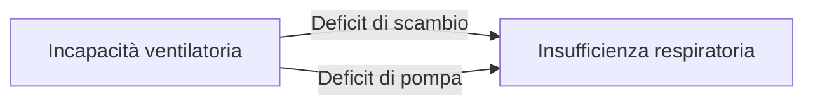

# Introduzione
- \todo{i primi 10 minuti}

## La respirazione
- __La respirazione__, in un organismo complesso, __è un insieme di 3 fasi__ distinte
	1. Scambio respiratorio (apparato respiratorio)
		- Ventilazione
		- Scambio gassoso alveolo ↔ capillare
	2. Trasporto (apparato cardiovascolare)
	3. Scambio cellulare
- \todo{un po' di roba}
- Il controllo del respiro è effettuato dal SNA (\a{centri respiratori} del \ner{bulbo}), tramite un feedback -- costante, rapido e preciso -- delle informazioni recepite dai distretti periferici
	- pCO~2~
	- pH
	- pO~2~

### Fase dello scambio respiratorio

#### Ventilazione
- \todo{roba}
- La capacità ventilatoria è quantificabile con le PFR (prove di funzionalità respiratoria)
	- \goldstandard Spirometria (o curva flusso/volume)
	- Studio dei volumi polmonari
	- Studio dell'efficienza dei muscoli respiratori

##### PFR
- Indicazioni
	- Se devo inquadrare sg. con sintomi respiratori (per capire se l'origine è ventilatoria)
	- Se devo capire se c'è un deficit ventilatorio (asma, BPCO...)
	- Per la valutazione preoperatoria (particolarmente per pz. pneumopatici o per procedure chirurgiche che implicano resezione del parenchima polmonare)
	- Per attività sportiva
	- Per valutare l'esposizione occupazionale
- Controindicazioni
	- \todo{}

##### Incapacità ventilatoria
- L'incapacità a ventilare si divide in 2 gruppi, a seconda della causa
	- Incapacità ventilatoria ostruttiva
	- Incapacità ventilatoria restrittiva
- Le cause di una potenziale incapacità ventilatoria sono essenzialmente 3 \asidefigure{img/deficit-ventilatorio-cause.png}{}
	1. Endobronchiali (secrezioni, muco, corpi estranei)
	2. Della parete del bronco (spasmo muscolare, ipertrofia muscolare, infiltrazione flogistica, edema di parete)
	3. Peribronchiali (distruzione delle fibre elastiche interstiziali che mantengono pervie le vie aeree nonostante le variazioni di pressione transtoracica, fibrosi peribronchiale da flogosi, compressione del parenchima, distruzione della parete alveolare...)

#### Scambio gassoso
- Passaggio di gas tra alveolo e capillare
- Quantificato dal __rapporto ventilazione/perfusione__, che identifica quanto è efficace l'accoppiamento tra l'atto ventilatorio e l'atto perfusionale \marginnote{Sostanzialmente mi dice quanto efficacemente ho alveoli \textbf{ben ventilati e ben perfusi!}}
	- A riposo: ~ 0.8 lt/min
	- Sotto sforzo: $\leadsto$ 1
- La qualità dello scambio gassoso è monitorabile principalmente con 2 metodiche laboratoriali
	- DLCO
	- \goldstandard EGA

### Muscoli principali
- L'azione _ventilatoria_ è permessa da 2 gruppi di muscoli
	- Principali
		- \goldstandard \mus{diaframma}
		- \mus{intercostali esterni}
	- Accessori
		- \mus{sternocleidomastoideo}
		- \mus{scaleni}
		- \mus{mm. addominali}
		- \mus{mm. intercostali interni}

### Capacità e volumi polmonari
- \todo{tutto}

\ 

### Flussi polmonari
- \todo{tutto - FEV~1~ - Indice di Tiffenau}
