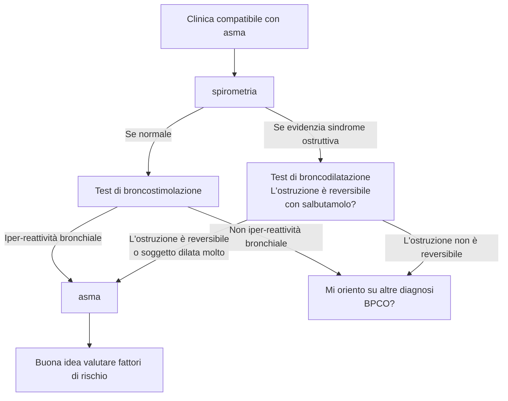
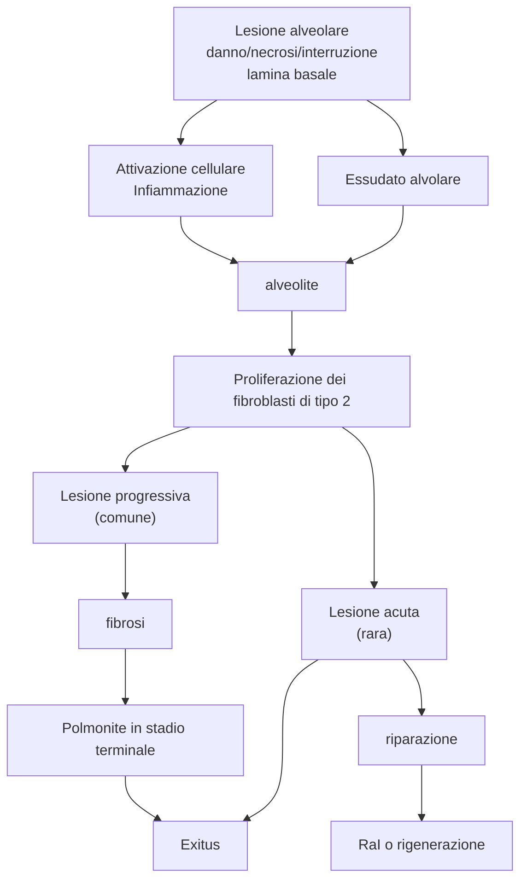

<!-- Docente: Stefano Nava -->

<!--
risorse consigliate da Nava

- Da leggere
	Atul Gawande
		Better
		The Checklist
		Being Mortal
		Complications
	Jerome Groopman
		How doctors think
	Samuel Shem
		La casa di Dio
	- Codice di deontologia medica (ITA)
	- Ethics, attitude & practice in endo of life care decision: an EU perspective (Nava)
	- Compliance, Adesione, Aderenza (G Majani)

- Da vedere
	- Un uomo, Un medico
	- Patch Adams

- Da cercare
	- Come disporre anticipatamente della volontà sui trattamenti e il fine vita? Quadro medico-legale ita

-->

# Come mai ci ammaliamo?
- Fattori di rischio per patologie respiratorie -- e trasversali
	- Fumo di sigaretta
	- e-cigarettes (particolarmente nei giovani!)
	- Inquinamento ambientale (aria + acqua + suolo)^[Traffico + fabbriche + combustibili + trasformazione chimicofisica di agenti (da sole, umidità, radiazioni...) Questo produce inquinanti sia disciolti nell'aria, che inquinanti "pesanti" che si depositano nel terreno e entrano negli organismi sottoforma di acqua, alimenti...] e [materia particolata](https://it.wikipedia.org/wiki/Particolato). Studi dimostrano che insorgenza di patologie respiratorie sono legate con vicinanza a strade a grande traffico
		- Particolato
			- PM~10~ → sedimenta tratto respiratorio superiore ⇒ infiammazione delle vie di conduzione
			- PM~2.5~ → penetra profondamente fino agli alveoli
			- PM~0.1~ → ↑ cancro e patologie cardiache
		- Produzione di inquinanti specifici a seconda delle attività
			- NO~2~, Biossido di azoto (motori a combustione e traffico veiolare) --- bronchite, tracheite, asma + cronicizzazione
			- SO~2~, Biossido di zolfo --- principalmente manifestazione croniche
			- CO
	- Inquinamento domestico^[Aria viziata + vapori + fumo + esalazioni chimiche presenti all'interno delle case]
	- Rischio lavorativo
		- Esposizione all'amianto
		- Esposizioni a fumi derivanti da errato (o doloso) smaltimento di sostanze
		- Esposizione a sostanze tossiche senza appropriati DPI
	- Obesità
		- ↑ resistenze polmonari
		- ↑ lavoro respiratorio
		- OSAS (⇒ ↓ pO2)
		- Scambi alterati cronicamente ⇒ alterazione V/Q
		- ↑ rischio CV
	- Infezioni
		- TBC come "capitano tra le cause di morte"
			- Ceppi multiresistenti presenti in 63 paesi
			- 1/3 della popolazione mondiale è infetto
	- Tenore sociale
		- ↓ tenore sociale ⇔ ↑ mortalità in malattie non comunicabili
	- Predisposizione genetica

<!-- ven 5 mar 2021, 14:19:49, CET -->
# Asma
- __*Asma*__ --- patologia infiammatoria cronica delle vie aeree in cui si ha una ostruzione __reversibile__ delle stesse
	- Abbondante ruolo della componente cellulare
	- Se individuo è _suscettibile_: infiammazione ⇒ broncospasmo, tosse e dispnea (> notte e prima mattina)
	- Infiammazione cronica può causare ↑ reattività bronchiale in risposta a stimoli esterni (fisici e chimici)
- Asma è patologia molto eterogenea e multifattoriale^[È molto multifattoriale! C'entrano i geni, l'ambiente, i fattori di rischio, la fortuna e l'esposizione...]
- Prevalenza stimata: 5--10% della popolazione mondiale (~ 300M persone)
	- \> prevalenza in popolazione migrante (per nuova esposizione ad allergeni locali) e spesso + grave e mal controllato (tendenzialmente > difficoltà di accesso alle cure e < livello socioeconomico)
	- Impatto su QoL: dipende
		- Se ben curata: non invalidante
		- Se non ben gestita: una buona % di pz. la ritiene una patologia che, in qualche aspetto di vita, ha impatto

## Presentazione clinica
- Presentazione tipica:
	- > 1 sintomo tra sibilo, dispnea, tosse, senso di costrizione toracica
	- Sintomi esacerbati notte/mattino
- Intensità dei sintomi variabile nel tempo
- Possibili fattori scatenanti
	- ⭐️ Allergeni (sopratutto domestici^[Cane, gatto, altri animali] ma non sottovalutare anche quelli ambientali^[Piante erbacee (> graminacee) arboree (oleacee, betulle) funghi, animali (cavallo...)])
	- Infezioni virali
	- Inquinanti (ambientali, _professionali_^[15\% dei casi di asma è collegato a lavoro], fumo^[> 20\% asmatici fuma]
	- Sforzo
	- Aria fredda
	- Risata
	- Esposizione ad irritanti (vapori, fumi, odori forti)
	- Alcuni tipi di alimentazione comune in occidente
	- Glutammato
	- Allergeni

> __Sintomi che ↓ probabilità di dx di asma__  
>
>- Tosse cronica
>- Espettorazione cronica
>- Dolore toracico (massimo oppressione)
>- Stridio inspiratorio (più indicativo di ostruzione)

### Fattori di rischio
- Maggiori
	- Predisposizione genetica
		- Alterazione in geni per presentazione dell'antigene
		- Alterazione in geni coinvolti in processi di flogosi bronchiale
		- Alterazioni in geni per risposta ai farmaci
		- Positional cloning
	- Iperreattività ambientale
	- Atopia^[_Atopia_ = predisposizione genetica a sviluppare alcune reazioni allergiche]
	- Fattori ambientali
		- Allergeni
		- Sensibilizzanti professionali
		- Fumo
		- Inquinamento atmosferico
		- Pregresse infezioni delle vie respiratorie (particolarmente nei primi anni di vita): rinovirus e virus respiratorio sinciziale
- Minori
	- Sesso, etnia, obesità
	- Stress e fattori psicosociali (ansia, depressione)
	- Ambiente correlato con peggiore stato di salute (fattori socioeconomici, dimensione nucleo familiare, abitudine alimentare, stile di vita, istruzione)
	- Antibiotici ed antipiretici in età infantile
	- Tp. ormonale sostitutiva
	- Infezioni virali in primissima infanzia

## Fisiopatologia
- Nella fisiopatologia dell'asma ci sono 3 attori principali
	1. Infiammazione
	2. Risposta del muscolo liscio all'infiammazione
	3. Rimodellamento strutturale delle vie aeree e interazione delle vie aeree con il parenchima
- __L'eziologia di base è, essenzialmente, infiammatoria__
	0. Bronchi che dimostrano _instabilità_ nella regolazione del tono motorio
	1. Infiammazione delle vie aeree
	2. Iper-reattivitò bronchiale (esagerata risposta broncocostrittiva a stimoli infiammatori)

## Classificazione dei vari tipi di asma
1. Asma con risposta di tipo 2 (mediata dalla risposta di ipersensibilità di tipo 1 " = allergico")
	- Early onset (atopico)
	- Late onset (eosinofilo)
	- Da esercizio fisico (EIA)
	- Da insorgenze particolari
		- Da `ASA`
		- Perimestruale
2. Asma con risposta di tipo non-2 (mediata da meccanismi non particolarmente noti)
	- A principale componente neutrofilica
	- A principale componente ??
	- A componente mista

\ 

### Asma di tipo 2
- __Risposta mediata da una risposta di ipersensibilità di tipo 1__
	- TH~2~
	- Eosinofili
- Per la sua fisiopatologia spesso è associato ad eventi allergici o ad agenti stimolanti esterni

#### Early onset (atopico)
- Storia con esordio precoce
	- Esordio precoce (pz. ped o giovane)
	- Storia di sintomi atopici o di familiarità per atopia
- Clinica
	- Sintomatologie da lieve a severa
	- Allergeni che stimolano sintomi asmatici
	- Associato a dermatite atopica, congiuntivite allergica
- Biomarcatori
	- ↑ IgE totali + per allergeni stimolanti
	- Marcatori di infezione T~2~
- Controllabile con steroidi

#### Late onset (eosinofilo)
- Storia
	- Esordio in età adulta (anche molto severo)
	- Quasi mai sintomi atopici
	- Storia di poliposi nasale, sinusite cronica
	- Scarsa familiarità per asma o atopia
- Clinica
	- Spesso severo
	- Esordio improvviso
- Non controllabile con steroidi a dosaggi consueti, eosinofilia rimane; necessari dosaggi elevati o addirittura è non responder

#### Da esercizio fisico
- Storia
	- Possibile atopia
	- Insorgenza chiaramente riferita ad un evento in cui pz. si è sforzato
- Clinica
	- Spesso compresenza di asma lieve/moderato
- Biomarcatori
	- Non disponibili
- Risposta
	- Buona risposta a `β2-agonisti` e `anti-leucotrienici`

#### Asma con insorgenza particolari

##### Asma da aspirina
- Storia
	- Allergia all'`asa`
- Clinica
	- Esordio molto acuto
	- Grave peggioramento se assunta ASA
- Risposta
	- Scarsa a steroidi inalatori
	- Necessari steroidi ad alte dosi o addirittura adrenalina

##### Asma perimestruale o da gravidanza
- Donna asmatica _può riferire_ peggioramento in
	- Periodi premestruali
	- Gravidanza

##### Asma da esposizione professionali
- 2 forme
	- Con latenza → necessario periodo di esposizione ad agente causale per produrre sintomi
	- Senza latenza → i sintomi compaiono immediatamente con l'esposizione all'agente causale (ggeneralmente grandi irritanti/tossici diretti dell'epitelio)
- Più a rischio
	- Panettieri
	- parrucchieri
	- Addetti alle pulizie
	- Veterinari, allevatori
	- Lavoratori del settore secondario

### Asma di tipo non-2
- __Risposta mediata da meccanismi non legati ad allergeni specifici__
	 - Mediata da neutrofili ("meccanismo neutrofilico")
	 - Mediata da broncoreattività senza segni clinici ("meccanismo pauciranulocitario")
	 - Mediata da meccanismi misti tra le due situazioni
- Caratteristico esordio in età adulta
- Correlato maggiormente con obesità

#### Asma da obesità
- Storia
	- F > M
	- Esordio in età adulta
- Clinica
	- Spesso obesità
	- Minima atopia
	- Molto sintomatici
- Biomarcatori
	- Non chiaro

## Diagnosi

### Test di broncostimolazione
- Ok sse VEMS ≥ 80% (altrimenti chiudo bronchi già ostruiti e lo mando al camposanto)
- Quantificazione dell'asma: valuto quanta `metacolina` (agente irritante) è necessaria a ridurre del 20% il VEMS (PD~20~)

| PD~20~ | Classificazione |
|---|---|
| < 100 ug | Grave |
|100÷400 ug | Moderata |
|400 ÷ 1600 ug | Lieve |
|> 1600 ug | Normale |

- Diagnostico se alta prob pretest: è test positivo anche in pz. con CHF che hanno bronchi infarciti di liquido (e per questo iperattivi)

### Test di broncodilatazione
- Naturalmente se spirometria evidenzia ostruzione non posso fare un test che potrebbe chiudere i bronchi, o ammazzo il paziente ⇒ test di broncodilatazione (con `salbutamolo`, β2-agonista broncodilatatore)
- Se ho broncodilatazione marcata (miglioramento dei flussi [↑ VEMS e/o FVC ≥ 12%] e della geometria della curva dopo 15' da salbutamolo) mi posso aspettare anche una bronco-costrizione marcata ⇒ asma (se pretest prob era alta)

### Valutazione dei fattori di rischio
- Valutare rischio allergologico
	- __Prick test__ per identificare allergie (I livello)
	- Dosare le IgE (II livello, molto costoso!) per avere quantificazione
		- Sierologia delle IgE totali (test PRIST)
		- Sierologia delle IgE specifiche (test RAST)
- Rinite o rinosinusite? (↑)
- GERD? (↑)
- Intolleranze a farmaci o alimenti?
- Esposizione ambientale?

## Terapia

\ 

- La terapia generale per l'asma si fonda su 3 pilastri
	1. `β2-agonisti` (broncodilatatori)
		- Long acting (`laba`) --- ~ 12h
		- Short acting (`saba`) --- ~ 4--6h
	2. Steroidi __inalatori__ (immunomodulanti)
		- Terapia con aerosol è il top
			- > concentrazioni locali
			- ↓ farmaco in circolo ⇒ < effetti collaterali
			- Non effetto epatico
			- Non problemi di assorbimento
		- Spiegare bene la tecnica di inalazione!
	3. Eventualmente anti--colinergici
		- Long acting (`lama`)
		- Short acting (`sama`)
- Per scegliere la terapia: 3 fasi
	1. `saba` al bisogno
	2. Definire la gravità! 5 step (valutare, secondo linee guida: sintomatologia + attacchi notturni + ↓ FEV~1~)
		1. Asma intermittente
		2. Asma lieve persistente
		3. Asma moderato persistente
		4. Asma grave persistente
		5. Asma molto grave
	3. Valutare una terapia anti-infiammatoria a seconda dello step di gravità per prevenire eventi acuti gravi
		- Se lieve/intermittente → tentativo di tp. al bisogno (`β2-agonisti`, non per forza laba + `steroidi` inalatori)
			- Valutare allergie! Ha senso tp. antistaminica? Magari stagionale?
		- Se persistente → tp. cronica (`laba` + `steroidi` inalatori a dosi basse)
		- Se grave → tp. cronica con dose medio/alta + considerare anticolinergici
		- Se asma totalmente refrattario a tp. convenzionale → considerare farmaci biologici (Ab monoclonali anti IgE)
- Considerare rapidamente cambiamenti additivi se riacutizzazione
	- Distinguere una riacutizzazione da un asma che viene male controllato
		- Il pz. è compliante alla tp.? Se sì sospettiamo riacutizzazione
		- Ci sono state esposizioni a fattori che possono produrre riacutizzazzioni?
	- Se riacutizzazione lieve/moderata spesso si può controllare con aumento della dose
	- Ospedalizzazione se _riacutizzazione grave_
		- Monitoraggio sopratutto nelle prime fasi

### Terapia per asma grave refrattario
- `omalizumab` (ab. anti IgE)
- `mepolizumab` (ab. anti IL5 ⇒ spegne eosinofili)

# Polmoniti
- __*Polmonite*__ --- processo infiammatorio a carico del parenchima polmonare, solitamente sostenuto da batteri, virus, funghi o protozoi
- Alcune criticità nella gestione
	- Diffusa
	- Fatale in popolazioni a rischio (non in fascia 5 ÷ 70aa)
	- Non facile classificazione eziologica, e problema delle resistenze
	- Difficile staging gravità
	- (Facile diagnosi)
- Linee guida: @waterer_management_2011

### Classificazione
- Clinica
	- (>) Acquisita in comunità (CAP)
	- Acquisita in ospedale (HAP) --- dopo > 48h da ricovero e non presente all'ingresso
		- Associata a lungodegenza (HCAP^[Health Care Acquired Pneumonia])
		- Associata a ventilazione (VAP)
- Anatomo--patologica
	- Lobare
	- Broncopolmonite
		- Interessamento __albero bronchiale + parenchima__
		- Tipica sg. defedati o con < competenza immunitaria
		- Sostenuta da batteri
			- Gram + : Stafilococco, Streptococco, Legionella
			- Gram - : Haemophilus, Pseudomonas, E coli, Klebsiella
			- Anaerobi
	- Interstiziale
		- Interessamento principalmente dell'interstizio (interstizio alveolare, connettivo attorno all'albero bronchiale, pareti alveolari)
		- Sostenuta da
			- Batteri: Micoplasma pneumonie, Clamidia, Legionella, Coxiella burneti
			- Funghi
			- Virus: Sars-CoV-2

#### CAP
- 2 forme
	- Tipica → lobare
		- _Streptococcus pneumoniae_ (35%)
		- _Haemophilus influenzae_
		- _Moraxella catharralis_
		- _Micoplasma pneumoniae_
		- _Chalmidia pneumoniae_
		- _Legionella pneumofila_
		- _Pneumocystis carinii_
	- Atipica → interstiziale > lobare
		- Neisseria meningitidis
		- Klebsiella pneumonae
		- Staph aureus
		- H1N1
		- Adenovirus
		- VRS
		- SarsCov2

||CAP tipica | CAP atipica |
|-|-|-|
|Anamnesi| Esordio brusco | Esordio lento |
|Rx | Alveolare/lobare | Interstiziale |
|EO | Addensamento | Sfumati o assenti |
|Età | Tutte | Prevalentemente giovani |
|Dolore pleurico | Spesso |Raro|
|Leucociti| > 10K--12K | Normale |
|Espettorato | Purulento o rugginoso | Mucoide |

#### HAP
- Insorgenza early onset vs late onset
	- Precoce (< 4gg da ricovero): maggiore probabilità di patogeni sensibili
	- Tardiva (> 5 gg da ricovero): maggiore probabilità di multi drug resistance
- Principali agenti che sostengono le HAP
	- Pseudomonas aeruginosa
	- Klebsiella pneumoniae
	- Enterobacter
	- Serratia
	- Acinetobacter
	- Stenotrophomonas maltophilia
	- MRSA (sopratutto USA)
	- Streptococcus penumoniae (ma molto più tipico di CAP)
	- Hemophilius influenzae
	- Legionella pneumophilia
	- Funghi e virus

#### HCAP
- Polmoniti in pz.:
	- con ricovero < 2gg nei 3 mesi antecedenti
	- degente in casa di cura
	- in pz con abx e/v, chemiotp, medicazione in 30gg antecedenti
	- pz. che frequenta H
	- emodialisi
- Eziologie principali
	- Polmoniti da aspirazione (!!) e ab ingestis
	- Strepto pneumoniae

## Clinica
- __Sintomi tipici__
	- Polmonari --- dispnea, tachipnea, tachicardia, ridotta espansibilità, ↑ FVT, ottusità plessica, soffio bronchiale, crepitii, sibili, sfregamenti pleurici
	- Altro --- febbre ± brivido, tachicardia, shock. Nell'anziano: stato mentale alterato
- __Sintomi atipici__ (aspecifici) --- cefalea, nausea, vomito, diarrea, mialgie, atralgie, astenia, herpes labialis (segno di immunodepressione)

### Diagnosi
- Esami del sangue
	- Leucocitosi o lecuopenia (a seconda dell'ezioologia
	- Iperglicemia, iponatremia, ipofosfatemia
	- ↑ indici di flogosi (PCR e VES) e anche indici di danno GOT, GPT, CK, LDH
- EGA
	- Ipossiemia e/o insufficienza respiratoria (tipo 1 e/o 2)
	- Attenzione: possibile alcalosi respiratoria se pz compensa con ↑ FR (mascherando falsamente i valori!)
- ⭐️ __Imaging Rx (CXR)__
	- Non si può (statisticamente) fare diagnosi solo con EO
- Metodiche diagnostiche per capire agente patogeno (nel 60% dei casi l'eziologia rimane sconosciuta)
	- Non invasive (da preferire assolutamente se sospetto polmonite!)
		- Esame espettorato con coltura
			- 1--2 ml di escreato emesso spontaneamente
			- Al mattino a digiuno, con bocca sciacquata con cloroxidina per evitare contaminazioni
			- Consegna entro 2h, conservato a 4°C
			- Molto face rischio di contaminazione
			- Segue esame colturale (indicazione pereliminare a 1gg, negatività a 2 gg, positività a 3 gg (tardissimo! tp. va cominciata in poche _ore_!)
		- Emocoltura
			- Non ha molto senso (non è significativo) in sg. con febbre bassa (< 38°C) o senza sintomatologia importante
			- Se si fa, se ne fanno almeno 3 seriate a distanza di 15--30 min
			- Spesso ci sono interferenze
				- Stafilococcus epidermidis o contaminazione da flora batterica cutanea
				- Antibiotico terapia (emocoltura _prima_)
		- Sierologia
		- Ricerca _degli antigeni_ nelle urine
			- Esame di 1/o livello, molto affidabile e provante
			- Di fatto ha senso sempre, anche se si ricerca solo per staph e legionella
				- Staphilococcus pneumoniae (_ottimo_ in CAP/polmoniti lobari)
				- Legionella (rara, ma se c'è è grave e bisogna riconoscerla in tempo!)
			- Preferibilmente primo mitto
			- Può essere conservato per 48h a temperatura ambiente
	- Invasive
		- Broncoaspirato/BAL con coltura
			- > 1 ml di materiale recuperato da aspirazione tracheale
			- Consegna entro 2h
			- Sempre possibili (anche se molto meno di esame dell'escreato) contaminazioni e/o falsi negativi da tp. antibiotica

#### Trattamento
- Abx appropriato se eziologia batterica, antifungino se eziologia fungina, di supporto sintomatico (± tp. antivirale) se ez virale
- __Abx entro prime ore da dx riduce sensibilmente la mortalità!__ Iniziare senza indugio abxtp empirica (anche perché resa diagnostica dei vari test non sempre è ottimale)
- Ogni addensamento polmonare può nascondere altre patologie (es tumore), quindi followup dove appropriato
- Diagnostica eziologica non invasiva eseguita sempre, anche se > 50% non sarà conclusiva

##### Staging della gravità
- È complicato valutare la gravità e stabilire la prognosi
- Ci sono alcuni indici per lo staging e stratificare la prognosi (PSI, CURB65, CRB65)

	| Symptom                 | Points |
	|-|-|
	| **C**onfusion               | 1      |
	| B**U**N>7 mmol/L (19 mg/dL)^[Azoto ureico, o uremia] | 1      |
	| **R**espiratory rate≥30     | 1      |
	| **B**P: S<90mmHg, D≤60mmHg  | 1      |
	| Age≥**65**                  | 1      |

- Per decidere cosa fare ha più senso una valutazione clinica
	- Criteri minori (almeno ammissione)
		- Tachipnea (spesso compensatoria!)
		- PaO~2~ < 60 mmHg o SpO~2~ < 92%
		- Focolai multipli
		- Disorientamento
		- Leucopenia
		- Trombocitopenia
		- Urea > 20 mg/dl
		- Ipotermia (abbiamo infezione, ci dovrebbe essere febbre!)
		- Ipotensione che necessita fluidi
	- Criteri maggiori (ricovero in TI)
		- Shock settico
		- Ventilazione meccanica

# BPCO

> __Quantificare consumo di sigarette__
>
>__Anni pacchetto__ = $\frac{\text{sigarette al giorno}}{\text{sigarette in un pacchetto (=20)}} \cdot \text{anni di fumo attivo}$
>
> Intuitivamente: 1 anno--pacchetto identifica la quantità fumata da un fumatore che, per un anno, fuma un pacchetto al giorno ⇒ indice mi dice quanti anni di fumo ha fatto un fumatore se, data la sua quantità di sigarette giornaliere, fumasse un pacchetto al giorno

- __*BPCO*__ (BroncoPneumopatia Cronica Ostruttiva, anche COPD^[Cronic Obsturctive Pulmonary Disease]) --- patologia cronica, a progressione tendenzialmente lenta, che provoca __ostruzione al flusso aereo__ per un coinvolgimento __irreversibile e progressivo del parenchima e/o delle vie aeree__
	- __Ostruzione del flusso ⇒ ↓ Tiffenau__
		
		$$ Tiffenau = \frac{FEV_1}{FVC}$$

- Fattori di rischio
	- Legati al sg.
		- Genetici (α1-antitripsina)
		- iperreattività bronchiale
		- Patologie polmonari della periparto/primissima/prima infanzia
	- Legati all'ambiente
		- Fumo
		- Rischio professionale
		- Inquinamento
		- Infezioni
		- Stato socioeconomico

## Epidemiologia

## Fisiopatologia

  

  

- Raramente BPCO si presenta da sola. Spiegazione: infiammazione è trigger per altre patologie (in 1/4 BPCO sono presenti ≥ 4 comorbidità)

### Fenotipi anatomopatologici di pz. BPCO
- A seconda del _prevalente_ interessamento (vie aeree o parenchima) individuiamo due fenotipi di BPCO
	1. Fenotipo bronchitico, anche "blue bloater" (bronchiolite cronica fibrosante → bronchite cronica
	2. Fenotipo enfisematoso, anche "pink puffer"
		a. Enfisematoso puro (enfisema **pan**lobulare)
		b. Bronchitico + enfisematoso (bronchiolite cronica fibrosante → bronchite cronica → enfisema **centro**lobulare)

#### Fenotipo bronchitico
0. Situazione predisponente: interessamento infiammatorio delle _vie_ e non del parenchima
	- Bronchiolite cronica → bronchite cronica
		- **Bronchiol**ite cronica --- tosse produttiva per > 3 mesi per almeno 2 anni consecutivi in assenza di altra causa. Interessa le vie < 3mm
		- **Bronch**ite cronica --- interessamento delle vie > 3mm
	- Tono broncomotore spiccto
	- Depositi di muco intraluminali (bronchiolite/bronchite)
1. Diminuzione del lume delle piccole vie aeree
2. Distribuzione non omogenea dell'inspirato, che segue le vie a minor resistenza
3. Alterato rapporto V/Q

#### Fenotipo enfisematoso puro (enfisema panlobulare)
0. Situazione predisponente: interessamento principale del _parenchima_ e non delle vie, spesso presente concomitante deficit di α1-antitripsina^[è anti-elastasi e normalmente contrasta il processo di digestione dei tessuti inevitabile durante la risposta infiammatoria]
1. Distruzione generalizzata del parenchima elastico (setti alveolari e strutture di ancoraggio che distendono le vie aeree)
3. Scompaginamento dell'architettura del parenchima
	- Prima distorsione, poi progressivo collabimento delle vie aeree
	- Allargamento degli spazi aerei nel parenchima respiratorio dovute alla rottura dei setti e alla confluenza di alveoli
	- Alterazione delle arteriole polmonari
	- Riduzione del network capillare

#### Fenotipo enfisematoso e bronchitico (enfisema centrolobulare)
- Situazione mista
	- Si ha interessamento delle vie aeree, come nel processo bronchiolitco/bronchitico
	- Si ha interessamento del parenchima, come nel processo enfisematoso, con un primo coinvolgimento della porzione circostante le vie aeree e una successiva espansione verso la periferia del lobulo
- Generalmente minor riduzione del ritorno elastico, quindi prognosi migliore

## Clinica
- Pz. tipico > 40aa
- Triade tipica
	- Tosse (intermittente o persistente)
	- Dispnea ingravescente (valutata con MRC Breathlesness Scale o mMRC [modified MRC])

		|mMRC | |
		|-|-|
		|0 | Manca fiato solo sotto sforzo intenso |
		|1 | Manca fiato quando cammino veloce in pianura o normale in salita |
		|2| Cammino più piano dei coetanei o mi devo fermare |
		|3|Mi devo fermare dopo 100 metri/pochi minuti a riprendere il fiato
		|4| Non riesco ad uscire di casa o manca respiro per atti quotidiani
	- Espettorazione cronica
- Obiettività

	

> __Iperinflazione dinamica__
>
> BPCO (bronchitico o enfisematoso che sia) ha problemi in _espirio_, non in inspirio
>
>- In inspirio in torace c'è pressione negativa ⇒ anche se le vie aeree sono ostruite la presione transtoracica incoraggia l'ingresso
>- In espirio in torace c'è pressione positiva ⇒ vie aeree già ostruite tendono a chiudersi per pressione transtoracica
>
>Questo produce il fenomeno dell'__iperinflazione__: il BPCO prende aria, ma non la riesce a buttare fuori.  
>L'iperinflazione è tipica dell'enfisematoso (dove l'aumento del volume residuo è _molto_ marcata per perdita dell'interstizio che tende ad espandere le vie aeree), ma non risparmia il bronchitico

## Diagnosi
- __La diagnosi di BPCO è spirometrica__: si osserva

	

	- VEMS ↓
	- ↓ Tiffenau
	- "Scucchiaiamento" della curva
- Medesimo percorso asma ma ostruzione è irreversibile, quindi
	- Spirometria indica ostruzione
	- Spirometria _post_ broncodilatazione porta a miglioramento < 12% del predetto
- Stadiazione della BPCO: in funzione della VEMS (FEV1) __post-broncodilatatore__

| Stadio | VEMS |
|-|-|
| GOLD 1 --- Lieve | ≥ 80% teorico |
| GOLD 2 --- Moderata | 50 ÷ 80% teorico |
| GOLD 2 --- Grave | 30 ÷ 50% teorico |
| GOLD 4 --- Molto grave | < 30% teorico

- Ruolo della diagnostica per img: utile per ddx (r/out di altre patologie)
	- Reperti rx _compatibili_ con BPCO (ma assolutamente _non_ diagnostici);
		- Polmone iperinflato (VR elevato) e/o radiolucente
		- Diaframma piatto
		- Allargamento degli spazi intercostali
		- Irrorazione vascolare distorta e scarsa
	- Reperti HRCT: utili per approfondire quello che _alla spirometria_ appare come ostruzione bronchiale

## Prognosi
- Predittore di mortalità a 5aa: indice BODE (correla _direttamente_ con mortalità)

	| | 0 | 1 | 2 | 3 |
	|-|-|-|-|-|
	|**B**MI | > 21 | < 21 |
	|**O**bstruction: FEV1 | ≥ 65 | > 50| > 35 | < 35 |
	|**D**yspnea (mMRC) | 0--1 | 2 | 3 | 4 |
	|**E**xsercise capacity (metri al 6MWT) | ≥ 350 |> 250 |> 150 |<150|

- I 3 fenotipi di BPCO hanno comunque intrinsecamente una prognosi differente
	- Bronchitico → FEV _tendenzialmente_ mantenuta
	- Bronchitico con enfisema centrolobulare → FEV in lento declino
	- Enfisematoso panlobulare → FEV in rapido declino (circa ↓ 100 ml/anno)

## Trattamento
1. Ridurre i fattori scatenanti, principalmente __smettere di fumare__

	
2. Esercizio fisico quotidiano (studi dimostrano ↑ sopravvivenza e PFR migliori per attività fisica alta--moderata)
3. Tp. farmacologica (aderenza è essenziale: anche se nessuna tp. migliora sopravvivenza a lungo termine, )
	- 2 pilastri farmacologici: __broncodilatazione__ + contrasto dell'infiammazione
		- ⭐️ Broncodilatazione
			- `LABA`
			- `LAMA`
		- Controllo dell'infiammazione
			- `CSI`(corticosteroidi inalatori)
	- Strategia, da LG:
		a. Se FEV1 < 80%: partire con broncodilatatore __a lunga durata__ (SABA/SAMA non hanno nessun senso clinico, servono per tp. al bisogno dell'asma)
		b. Se non successo: ↑ dose, OPPURE usare un altro meccanismo d'azione
		c. CSI, sopratutto se riacutizzazioni frequenti
4. Vaccinazioni
5. Tenere controllata la spirometria

## Riacutizzazione
- __*Riacutizzazione di BPCO*__ --- evento clinico importante, che si verifica nel corso della storia naturale della malattia, caratterizzato da un __peggioramento rispetto al basale di tosse, dispnea e/o espettorato__, che eccede la variabilità quotidiana e __richiede modifiche del trattamento__
	- Possibile, in aggiunta: febbre, variazione dell'obiettività polmonare, edemi declivi
- Riacutizzazione dovuta a infiammazione, ma non per forza ha eziologia infettiva: (prevalenza calante)
	1. Riacutizzazioni ad impronta _eosinofila_ (con meccanismo simile all'asma)
	2. Riacutizzazione ad impronta _batterica_
	3. Riacutizzazione ad impronta _virale_ (50% delle riacutizzazioni _gravi_ sono virali)
	4. Riacutizzazione ad impronta paucinfiammatoria
- Più la condizione di base è severa (GOLD) più le riacutizzazioni e le ospedalizzazioni sono frequenti
- Riacutizzazione è correlata con mortalità
	- 16% dei pz. che riacutizzano muore durante esacerbazione
	- Dopo una riacutizzazione mortalità a 5aa è 50% (25% nel primo anno)
- Trattamento della riacutizzazione:
	1. __Corticosteroidi a basse dosi PO__^[Corticosteroide PO ha stessa disponibilità di corticosteroide EV], per avere effetti sistemici
	2. __Abx in pz. ad alto rischio__ (da LG)
		- Riacutizzazione severa
		- Riacutizzazione con ↑ purulenza dell'espettorato + 1 altro sintomo chiaro tra i 3 caratteristici della riacutizzazione
		
		> Considerare abx anche in virosi: studi dimostrano che, in pz BPCO che fanno virosi, le sovrainfezioni sono molto probabili (questo non è vero per pz. generico)
- Ospedalizzare riacutizzazione _senza indugio_ se
	- Sintomatologia importante
	- Riacutizzazione in BPCO GOLD 3/4
	- Obiettività preoccupante (cianosi, edemi, dispnea)
	- Non risposta al trattamento
	- Comorbidità importanti
	- Aritmie di nuova insorgenza
	- Dubbio diagnostico
	- Età avanzata
	- Nuovi disturbi del sensorio
	- Logistica sfavorevole
		- Non autosufficienza
		- Non caregiver
		- Impossibilità di rivalutazione

# Diffuse Lung Disease
- __*DLD*__ (o Interstitial Lung Desease) --- gruppo _eterogeneo_ di patologie nelle quali un processo infiammatorio interessa __la parete alveolare, che regredisce o viene soppiantata da connettivo__ (alterando quindi l'architettura e la funzionalità del parenchima
- Un numero enorme ed eterogeneo di patologie produce un quadro di DLD/ILD
	#. [Da causa nota, anche __interstiziopatie secondarie__](#dldsecondarie)
		- Autoimmune (__vasculiti__)
		- Connettivopatie
		- __Esposizione professionale__ (pneumoconiosi [polveri inorganiche] o polmoniti da ipersensibilità [polveri organiche])
		- __Farmaci__
		- [__Polmonite eosinofila__](#dldeosinofila)
	#. Idiopatica (IIP -- Idiopatic Interstitial Pneumonia)
		- [__IPF__, Idiopatic pulmonary fibrosis)](#ipf)
			- UIP, Usual Interstitial Pneumonitis (> 50% delle IIP)
		- [__NSIP__, Non-Specific Interstitial Pneumonia](#nsip) (> 25% delle IIP)
		- Desquamative interstitial pneumonia
		- Respiratory bronchiolitis
		- Cryptogenic organising pneumonia
		- AIP (Acute interstitial Pneumonia
	#. ILD granulomatose
		- [__Sarcoidosi__](#dldsarcoidosi)
		- Da ipersensibilità
			- Graft vs host
		- Infezioni
	#. Altre forme
		- Proteinosi alveolari
		- Lymphangioleiomiomatosis
		- Istiocitosi polmonare a cellule di Lanherans
		- Da cause cardiache e renali

## Epidemiologia
- DLD sono causa del 15% pz. ambulatoriali che chiedono consulenza per patologia respiratoria
	- Prevalenza: M > F (81% maschi vs 67% femmine)
	- Incidenza: ↑ per età > 55aa (Marcato aumento oltre settima decade)
		- Possibile inizio subdolo e misconosciuto con ritardo della diagnosi
- Quadri di gravità varabiabile
	- IPF è la più severa
	- sarcoidosi è quella generalmente con prognosi più favorevole
	- Forte correlazione con altre patologie autoimmuni (vasculite, artrite, sclerodermia)

## Meccanismo patogenetico comune

## Diagnostica

### Indagini di primo livello
- __6MWT__ o equivalenti (sit--stand test) per misurare riserva e capacità di diffusione
	- Riserva = volumi polmonari
	- Capacità di diffusione sotto sforzo (surrogato per stimare DLCO)
- __Spirometria__ per valutare se esiste un quadro di restrizione o se c'è altro
	- __FVC__ --- principale indice per vedere se restrizione
	- __FEV1__ --- ridotto consensualmente a FVC se restrizione, da solo se c'è ostrizione
		- __Tiffenau__ --- principale indice per vedere se c'è ostruzione (in DLD mi aspetto ndr [perché calano i volumi e i flussi consensualmente] o addirittura ↑ [calano i volumi ma sg. fit riesce a fare comunque buoni flussi])
	- Volumi polmonari singoli (ridotti in DLD)
- RX: ok, ma non esclude nulla, al limite incoraggia ad altri approfondimenti
- ⭐️ __HRTC__ (ad alta risoluzione, altrimenti difficile distinguere se opacità è davvero _honeycombing_, segno più patognomonico di fibrosi)
	- Indicazioni tecniche
		- Essenziale chiedere che siano sezioni sottili
		- Senza contrasto
		- Prono e supino
		- Inspiratoria ed espiratoria
	- Pattern da ricercare per porre diagnosi
		- Bronchiectasie da trazione
		- Favo d'ape, o _honeycombing_, indicativo di __*IPF*__ (Fibrosi Polmonare Idiopatica)
		- Opacità ground glass (patognomonico di __*NSIP*__ (Non-Specific Interstitial Pneumonia))

### Indagini di secondo livello
- __BAL__ (caratterizzare meglio il processo infiammatorio dell'alveolo)
	- Cellularità normale: 10^6^ (macrofagi > linfociti > neutrofili/eosinofili/mastcellule), con opportuno rapporto tra le popolazioni linfocitarie (CD3 più rappresentate)
	- A seconda del citotipo prevalente al citogramma
		- Alveolite linfocitaria (linf > 15%)
		- Alveolite neutrofila (neu > 4%)
		- Alveolite eosinofila (eos > 2%)
		- Alveolite globale (> linf, neu ed eos)
		- Alveolite macrofagica
		- Alveolite gigantocellulare (riscontro di elementi cellulari multinucleari)
- Biopsia transbronchiale (risulta essenziale in < 15% dei casi, negli altri gli esami precedenti sono efficaci)

## Focus su forme più rappresentative

### Fibrosi Polmonare Idiopatica (IPF) {#ipf}
- __*Fibrosi polmonare idiopatica*__ --- DLD idiopatica in cui si ha l'accumulo di materiale fibrotico nell'interstizio del parenchima polmonare a causa sconosciuta
- Esordio tipicamente acuto
- UIP (Usual Interstitial Pneumonia) rappresenta l'entità clinica di IPF più rappresentata (> 55%)

> __Ipossia da sforzo, P(A-a) e fibrosi polmonare__  
>In IPF ipossia compare prima sotto sforzo perché si ha riduzione della diffusione alveolo → capillare per un interstizio fibrotico (all'EGA vedrei ↑ P(A-a), se facessi DLCO lo vedrei alterato).
>
>Questo però accade solamente quando il metabolismo dei tessuti chiama ossigeno, quindi non in situazioni normali dove c'è ancora una minima capacità di diffusione. In queste situazioni spesso si osserva ipocapnia, perché il sg. tende a iperventilare inutilmente per migliorare lo scambio di O~2~, ma la CO~2~ ha una capacità di diffusione maggiore rispetto all'ossigeno, e riesce comunque a diffondere attraverso interstizio fibrotico molto meglio di quanto faccia l'ossigeno.
>
>Con l'aggravamento della situazione, l'ipossia si può avere anche a riposo.

#### Presentazione clinica
- Patologie tipicamente _correlate_ con FP (si co-presentano)
	- MRGE
	- Disfagia
	- Fenomeno di Reynaud
	- Secchezza cute
- SeS
	- Tosse secca
	- Dispnea da sforzo
	- ipossia da sforzo
	- Crackles inspiratori non modificabili con tosse
	- Clubbing digitale
	- Ipertensione polmonare
	- (Insufficienza ventricolare dx)
- Diagnostica
	- Spirometria: quadro restrittivo
	- HRTC: Honeycombing

#### Fattori di rischio
- Genere (M>F)
- Esposizione al fumo (> 20 pacchetti--anno è fortemente correlato con FPI)
- Inalazione di polveri fini (es: di legno)
- MRGE (> 70% di chi ha FP ha MRGE; probabilmente per micro--inalazioni)
- infezioni virali
- Fattori genetici (< 55 IPF ha genesi genetica)

#### Terapia
- Non esistono farmaci che permettono di abbassare la mortalità, ma aumentano la qualità di vita (↓ riacutizzazioni, ↓ riduzione della CVF)
	- `nintedanib` --- inibisce GF di crescita per fibroblasti, piastrine e inibisce i VEGFr
	- `pirfenidone` --- inibisce la proliferazione di fibroblasti e la produzione di collagene stimolata da TGFβ + in vitro riduce la produzione di mediatori di fibrogenesi/infiammazione

### NSIP {#nsip}
- __*NSIP*__ (Non Specific Interstitial Pneumonia) --- DLD idiopatica caratterizzata da un quadro di polmonite interstiziale
- Epidemiologia
	- F > M
	- Pz tipico è giovane e non fumatore
- Esordio meno acuto (sintomi misconosciuti anche per mesi/anni)
- Clinica
	- SeS
		- Tosse cronica
		- Dispnea ingravescente
- Diagnosi
	- HRTC: pattern ground glass è patognomonico di NSIP
	- Bisogna però _escludere attivamente_ altre patologie che possono provocare NSIP, prima di concludere che è idiopatica
- Tp.: buona risposta a tp. antinifiammatoria (visto che genesi della NSIP _idiopatica_ è infiammatoria
	- Steroidi
	- Altri immunisiooressori se necessario (`azatiopina`, `ciclofosfamide`)
- Prognosi: dipende
	- Se NSIP classica, buona progonsi a 10aa
	- Se NSIP però esita in forma fibrosante la prognosi diventa più grave

### Interstiziopatie polmonari secondarie  {#dldsecondarie}
- DLD secondarie a causa nota
	#. Pneumoconiosi da inalazione di polveri (tipico setting è esposizione professionale)
		- Silicosi
		- Asbestosi
			- Versamento pleurico + ispessimento pleurico. Mesotelioma maligno è virtualmente sempre da asbestosi
			- Diagnosi: HRTC + BAL per dimostrazione definitiva della presenza di amianto
		- Da altri silicati (eg talco)
		- Da polveri minerali inerti (ie ferro, stagno, bario, berillio)
	#. Da droghe voluttuarie
		- Cannabis
			- Problema non è cannabis, ma _paraquat_ (agente usato per essicazione) che produce stress ossidativo, danno cellulare ⇒ ↑ fibroblasti
		- Cocaina (Crack Lung Syndrome)
			- Enfisema bolloso
			- Polmonite da ipersensibilità
			- Edema polmonare
			- Broncospasm
			- Alveoliti e fibrosi interstiziale
		- Eroina
			- Granulomatosi da talco usato per tagliarla che si deposita nei polmoni
	#. Polmoniti eosinofile (ipereosinofilie polmonari)
		- Polmoniti da infiltrati eosinofili nel parenchima polmonare
		- Riscontro di ipereosinofilia _sempre_ nel BAL, _a volte_ anche nel sangue periferico
		- Ha principalmente 2 andamenti
			- Acuto (anche fatale se non diagnosticata per IR grave)
			- Cronico (esordio subdolo e spesso confuso con asma refrattario a terapia)
	#. Aspergillosi broncopolmonare allergica
		- DLD da colonizzazione delle vie aeree da parte di _Aspergillus fumigatus_ (fungo) e conseguente processo infiammatorio che si organizza nei polmoni
		- Ha un doppio andamento
			1. Stadio acuto (spesso confuso con asma^[Tipicamente: confuso con asma e le riacutizzazioni idem. Questo però porta a una mancata eradicazione dell'infezione da aspergillo, con un quadro assolutamente ingravescente, non risolvendo la causa di base])
				- Asma, ↑ IgE
				- Immediata reazione cutanea ad ag di Aspergillo
			2. Stadio cronico
				- Prosegue il danno infiammatorio fino a fibrosi
		- Diagnosi: tecnicamente facile, il difficile è far venire il sospetto clinico e non trattarla come asma
			- CXR con infiltrati parenchimali + bronchiecatsie centrali
			- ↑ IgE, alla tipizzazione si vede che non è aumento aspecifico ma contro Ag di aspergillo
	#. Da patologie collageno--vascolari reumatiche/autoimmuni^[Spesso pat autoimmuni (artrite, sclerodermia, dermatomiosite) sono _correlate_ con interessamento polmonare di grado variabile]
		- __*granulomatosi di Wegener*__ --- vasculite ANCA-associata necrotizzante su base autoimmune dei piccoli e medi vasi che interessa il sistema respiratorio e frequentemente i reni
		- __*sindrome di churg--strauss*__ --- vasculite autoimmune sistemica dei piccoli vasi sanguigni, sia arterie (arterite delle arteriole) che vene
			- Spesso misconosciuta
			- Triade sintomatica: asma + ipereosinofilia + vasculite necrotizzante ≥ 2 organi
	#. Da ipersensibilità ad un antigene
		- DLD dovuta a continua esposizione ad antigene verso cui si è sensibili (> 300 cause!! Anamnesi accurata è essenziale!)
		- Patogenesi: ipersensibilità → infiltrato (prima neutrofilico, poi linfocitico/macrofagico) → granuloma → risoluzione (se trattamento) o fibrosi (se granuloma si organizza)
		- Esempio tipico: polmonite del contadino, polmonite dell'allevatore
		- SeS
			- Esordio con sintomi aspecifici: astenia, mialgie, perdita di peso
			- Progressivo interessamento polmonare
	#. Conseguente a __*sarcoidosi*__^[Sarcoidosi --- Patologia multisistemica con eziologia sconosciuta che porta alla formazione di granulomi non necrotizzanti nel parenchima polmonare o nel mediastino]
		- Spesso prognosi fausta
		- 10--15% evolve verso fibrosi polmonare (anche se coinvolgimento del polmone c'è virtualmente sempre). 60% guarisce spontaneamente
		- Scoperta dei noduli polmonari granulomatosi a CXR è spesso incidentale per altri motivi
		- Mortalità. 6% (più che il coinvolgimento polmonare, è il coinvolgimento cardiaco che risulta fatale, in quanto i granulomi danneggiano il sistema di conduzione favorendo aritmi
		- Dx: di esclusione (problema!)
			- Si nota coinvolgimento polmonare
			- SI hanno SeS tipici (es: coinvolgimento della cute con eritema nodoso o uveite)
			- Si escludono _attivamente_ ddx che assomigliano (linfomi/malattie ematologiche)
		- Stadiazione dell'interessamento polmonare
			0. Non adenopatie nè infiltrati polmonari
			1. Solo adenopatie ileomediastiniche
			2. Aenopatie ileomediastiniche + infiltrati polmonari
			3. Solo infiltrati polmonari
			4. Fibrosi polmonare
		- Trattamento efficace solo stadio 2÷4 e sensato (r/b) sse FVC < 70% predetto
	- Da farmaci
		- `amiodarone` --- ILD lenta e insidiosa
		- `metotrexato` --- ILD acuta (se presa per tempo è reversibile)
		- `bleomicina` --- ILD cronica
		- `nitrofurantoina` --- ILD acuta
		- Inibitori della `tirosin--kinasi` --- ILD acuta o cronica

<!-- ven 19 mar 2021, 14:18:05, CET -->
# Versamento pleurico
- __*Versamento pleurico*__ --- accumulo anormale di liquido nello spazio pleurico di unoo di entrambi dei polmoni (fisiologicamente 5--15ml in spazio pleurico)

## Eziologie principali
- __Versamento da trasudato__ --- spesso bilaterale, conseguente a ↑ gradienti pressori o del fluido interstiziale
	
	$$\begin{align*} &K[\text{Filtrazione} - \text{Riassorbimento}]=\\ &K[(P_{vasi} + \pi_{interstizio}) - (P_{interstizio} + \pi_{vasi})] \end{align*}$$

	- __CHF__^[75% dei casi bilaterale, quando monolaterale è più frequente nel lato dx. Spesso giallastro, pochi WBC. Se scompenso severo (classe IV) spesso è ribelle a diuretici]
	- __Epatopatie__^[Pressione pleurica negativa "risucchia" il liquido ascitico addominale verso il diaframma -- che spesso viene facilmente attraversato -- e poi verso lo spazio pleurico E POI ipoproteinemia/ipoalbuminemia] (cirrosi)
	- __Problemi renali__: sindromi nefrotiche, glomerulonefriti...
	- __Dialisi peritoneale__
	- Ostruzione della vena cava superiore (sindromi da occupazione mediastinica)
	- Ipoalbuminemia
	- Diminuzione del ritorno linfativo
	- ...
- __Versamento da essudato__ (spesso monolaterale, conseguente a infiammazione)
	- __Patologie infettive__ a carico del parenchima polmonare (polmoniti a varia eziologia, TBc, infezioni fungine, virali, parassitiche)
	- __Neoplasie dei polmoni__^[Il meccanismo è principalmente infiammatorio, ma non bisogna dimenticarsi che masse neoplastiche possano infiltrare/ostruire le vie linfatiche, portando a ridotto riassorbimento] (mesotelioma, adenok, k squamoso, k anaplastico grandi/piccole cellule)
	- Traumi ⇒ alterazioni della permeabilità
	- Secondari a problemi gastroenterici
	- Secondari a problemi ginecologici (es: postpartum)
	- Patologie del collagene e vasculiti
	- Da farmaci (`amiodarone`, `dantrolene`^[postsynaptic muscle relaxant that lessens excitation-contraction coupling in muscle cells. It achieves this by inhibiting Ca2+ ions release from sarcoplasmic reticulum stores by antagonizing ryanodine receptors. It is the primary drug used for the treatment and prevention of malignant hyperthermia], `metotrexato`)
	- Post ch/post trapianto
	- Asbestosi
	- Annegamento
	- Emotorace (versamento su)
	- Chilotorace (versamento su)
	- Embolia polmonare
	
> __Eziologie prevalenti__ --- 
>
> Se ci dobbiamo ricordare proprio le 3 cause più frequenti di versamento (essudatizio E trasudatizio):
>
>- Scompenso cardiaco congestizio (trasudato)
>- Polmonite (essudato)
>- Neoplasia (essudato)

## Diagnosi
1. Sospetto clinico (APR, APP, SeS, EO)
	- Ispezione: riduzione della motilità nell'emitorace sede del versamento
	- Palpazione: FVT ridotto
	- Percussione: ipofonesi/abolizione del SCP a seconda della disposizione del liquido e del decubito del pz
	- Auscultazione: MV ridotto/abolito, ± egofonia (sopratutto margine superiore del versamento), ± broncofonia
2. ⭐️ RX torace (segno: obliterazione seno costofrenico)
	- Se visibile in proiezione std: > 200 ml
	- Proiezione laterale visualizza versamenti > 50 ml
3. Toracentesi ecoguidata + analisi campione (50--100ml)
	- Analisi: batteriologico + citologico (a volte utile fare direttamente EGA su drenato)
	- Per capire il meccanismo scatenante
	- Per migliorare meccanica respiratoria
	- Seguire procedura appropriata (vedi video)
	- Non drenare > 1--1.5 lt (possibile __*edema da riespansione*__) e fermarsi comunque quando insorge tosse
	- Complicanze
		- Immediate: PNX, sanguinamento (safe spot per evitare il bundle vascolonervoso: __margine superiore della costa__^[Anche se c'è variabile anatomica con vaso che si divide in due e si porta anche verso l'alto])
		- A lungo termine: infezioni secondarie (sterilità!!!), emorragie non riconosciute/prevenute (APR, APP, APF!!!)
4. Eco se quadro "difficile" (versamento piccolo, per guidare toracentesi, per valutare versamenti saccati^[Versamenti che sono in sede da tempo e vengono circondati da un _cercine_ fibrotico]...)

> __Imaging del torace nel versamento__ ---
>Tac torace non è mai misura di prima linea! Utile per valutare empiemi, ascessi, neoplasie, o se versamento recidiva o per valutare eventuali evoluzioni... Di fatto è una cosa che si usa per _seguire_ il versamento, non per diagnosticarlo.
>
>Una TAC equivale 300÷500 Rx!

### Analisi del liquido della toracentesi
- Capire se si tratta di essudato e trasudato (> 1 dei __criteri di Light__ [sp 98%, sn 99%]):

| Criteri | Trasudato | Essudato |
|-|-|-|
|Proteine liquido pleurico/proteine sieriche | ≤ 0.5 | > 0.5 |
|LDH liquido pleurico/LDH sierico | ≤ 0.6 | > 0.6 |
|LDH liquido pleurico| ≤ 200 | > 200|

> NB: durante diuresi (specie se aggressiva) o dopo ripetute toracentesi, rimuovendo quota liquida le caratteristiche di un trasudato possono spostarsi verso quelle di un essudato

- Se essudato: valuto glucosio, pH, WBC e torbidezza del liquido (ci sono cellule, magari batteriche?)
	- Se glucosio < 60 mg/dl (poco) e pH acido ⇒ è legittimo supporre una eziologia infiammatoria, tipicamente infettiva. Eziologie tipiche sono 4:
		- __*TBC*__
		- Versamento neoplastico
		- Artrite reumatoide
		- Versamento che si è complicato^[Polmonite → complciazione → infiammazione strong → versamento semplice (solo liquido) → versamento complicato (colonizzato ⇒ ↓ pH) → empiema] verso l'empiema (pH < 7.2 indicativo di colonizzazione batterica^[Batteri fanno fermentazione lattica del glucosio], pH ≤ 7 di empiema franco)
	- Se glucosio normale/alto ⇒ ci si orienta su altre eziologie (vedi sopra)

## Complicanze
- Versamento semplice (solo liquido) → versamento complicato (con microorganismi) → empiema (con germi e pus (PMN morti)) → empiema saccato/organizzato (empiema stabilmente incapsulato da tessuto fibrinoso)

### Empiema pleurico
- Fattori favorenti/di rischio
	- Età > 65aa
	- Diabete
	- Abuso di alcool e droghe
	- Scarsa igiene mentale (in anziani è problema che non va sottovalutato)
- Eziologia
	- → __Infezione polmonare__ (55%, _Strepto_ [famiglia] ma anche _Staph aureus_ [che ha prognosi peggiore, se poi è MRSA non ne parliamo]. Batteriologia è complicata, dipende da setting di vita/dove è stato preso/fascia d'età/stato immunitario)
		- Versamento complicato/empiema parapneumonico → insorgenza sincrona a focolaio
		- Versamento complicato/empiema metaoneumonico → insorgenza a distanza da focolaio
	- Complicanza chirurgica (21%)
	- Trauma (6%)
	- Perforazione esofagea
	- PNX spontaneo
	- Complicanza post toracentesi
	- Infezione sottodiaframmatica
	- Setticemia
	- Altre
- Formazione in 4 stadi (versamento complicato/empiema da fase 3/4)
	1. Fase prodromica alla fase essudatizia
	2. Fase essudativa (pH > 7.3, [Glucosio] > 60 mg/dL)
	3. Fase fibrino--purulenta, anche (pH < 7.2, [Glucosio] < 60 mg/dL)
	4. Fase organizzata (pH < 7, [Glucosio] < 40 mg/dL, tanto LDH, tanti leucociti)
- Trattamento:
	- __Evacuazione__, se possibile (_Ubi pus, ibi evacua_)
		- Toracentesi > Drenaggio fisso > VATS (a seconda dell'opportunità, della fattibilità e del singolo caso)
			- Chirurgia va considerata se sepsi è persistente
		- Indicazioni al drenaggio (linee guida BTS)
			- Coltura/colorazione di gram + che indicano infezione pleurica certa
			- pH < 7.2
			- Versamento multiloculato
			- Assenza di miglioramento delle condizioni cliniche nonostante abx
		- Ritardo in evacuazione ⇒ ↑ tempo di degenza, ↑ mortalità, ↑ necessità di terapie invasive, quindi: gestione aggressiva e proattiva del peggioramento
	- Ab a tronchi e osservazione

# Bronchiectasia
- __*Bronchiectasia*__ --- dilatazione irreversibile delle vie aeree

## Epidemiologia
- F > M
- Età media alla diagnosi: 70aa (ma spesso dx tardiva)
- Nei 50% dei casi sono idiopatiche

## Fisiopatologia
  

## Classificazione
- Classificazione anatomopatologica ("di Reid")
	1. Bronchiectasie cilindriche → bronchi con contorni regolari e non molto aumentati in diametro. Terminazione dei bronchi è improvvisa
	2. Bronchiectasie varicoidi → dilatazione del lume maggiore, con restringimenti locali che creano profilo irregolare. Terminazione dei bronchi è caratteristica, detta "a bulbi di tulipano"
	3. Bronchiectasie cistiche → dilatazione bronchiale crescente verso la periferia. Terminazione dei bronchi "a palla"
- Classificazione eziopatogenetica
	- Idiopatiche
	- Secondarie (← flogosi [cicatrici parenchimali stirano le vie aeree], ostruzione delle vie prossimali, retrazione del parenchima, anomalie congenite, aspirazione)

## Fattori di rischio e correlazioni cliniche
- Infezioni (anche dell'infanzia
- Aspirazione/inalazione di materiali
- Anomalie delle ciglia
- Ostruzione delle vie aeree
- Patologie specifiche in cui si ritrova bronchiectasia
	- __*Sindrome di Hermansky--Pudlak*__ [pat autosomica recessiva che provoca albinismo oculocutaneo + diatesi emorragica lieve + colite granulomatosa ± fibrosi polmonare → bronchiectasia])
	- Ciliopatie (__*Sindrome di Kartagener*__, discinesia ciliare)
- Deficit di α1-antitripsina (flogosi è fibrosante e si distrugge l'architettura elastica a favore di cicatrici che stirano le vie9
- AIDS

## Diagnosi
- Anamnesi
- SeS
	- Tosse cronica con espettorato muco--purulento (sopratutto la mattina)
		- Francamente purulento nelle riacutizzazioni
	- Emottisi/emoftoe^[Flogosi del parenchima ⇒ erosioni dei vasi parenchimali ⇒ sanguinamento] (50--70% dei casi)
	- Malessere	
	- febbre remittente--intermittente solo durante riacutizzazioni [continua se si sovrappongono focolai]
 	- dispnea
 senso di ripienezza catarrale e congestione
- EO (attenzione, molto sfumato in periodi di benessere asintomatico)
	- Ottusità marcata e FVT aumentato nelle zone di ristagno di secreto (che aumenta vibrazione indotta)
	- MV abolito/assente nelle aree ectasiche
	- Ronchi e rantoli in corrispondenza della lesione e anche bilaterali
- Imaging
	- RX torace _assolutamente aspecifico, dice veramente poco_
		- In fasi di riacutizzazione_ speso riscontro di addensamenti/opacità generici, facilmente identificati/confusi come focolai broncopneumonici
		- ± aumento della trama vascolare
		- ± definizione del disegno bronchiale
		- ± riconoscimento di bronchi affastellati per perdita di volume aereo
	- ⭐️ __HRTC__
- Indagini strumentali
	- Coltura espettorato
	- Fibrobroncoscopia se espettorato non conclusivo OPPURE con intento terapeutico
		- Esame espettorato non ci dice qual è causa scatenante per fare prelievo in sito
		- Rimuovere bronchi congestionati

> __Principale ddx prima di HRTC con bronchiectasia è polmonite__ (presentazione _simile_). Difficilmente però una polmonite bilaterale (bronchiectasie danno sintomatologia bilaterale) ha febbre remittente e buona saturazione... Una polmonite bilaterale darebbe un quadro molto più critico e in peggioramento

## Terapia
- Obiettivo: detergere le vie aeree rimuovendo secrezioni
	- Fisiochinesioterapia
		- Esercizi fisioterapeutici per drenaggi posturali
		- Tosse assistita
	- Cicli molto prolungati (12 mesi) di ab. a dosi subterapeutiche di `azitromicina`^[Macrolide ab. + antiinfiammatori. Attenzione: così ci si espone ad un'insorgenza di farmacoresistenze in ~ 20% dei casi. Valutare bene funzionalità epatica prima di cominciare un trattamento del genere] ⇒ ↓ riacutizzazioni
	- Mucolitici: non supportati da EBM (a meno che sg. non sia fumatore)

### Prognosi
- Normale/accettabile se
	- Diagnosi precoce
	- Buona gestione
	- Bronchiectasia altera poco la qualità di vita

# Fibrosi cistica
- Patologia autosomica recessiva dovuta a mutazione del gene CFTR (7q31.2) caratterizzata dalla __produzione di secrezioni esocrine molto dense__
	- 1/2.5K nati vivi (1/30 è portatore della mutazione)
- Secrezioni dense di svariati distretti
	- polmoni
	- intestino
	- pancreas e vie biliari
	- ghiandole sudoripare (segno del "sudore salato")
	- apparato genitourinario

## Fisiopatologia
- CFTR codifica per un canale per il cloro, che non è funzionante nei sg. con FC
- La FC è sostenuta da 2 meccanismi fisiopatologici
	- Ispessimento dei secreti per mancata diluizione degli stessi (canale non funzionante ⇒ non escrezione di Cl^-^ ⇒ non idratazione dei secreti)

## Clinica
- Apparato respiratorio (100% pz.)
	- Bronchiolite nel 1/o anno di vita (sibili, tosse secca simil--pertosse poi progressivamente produttiva e mucopurulenta, rantoli fini, iperfonesi generalizzata, iperinflazione torace [EO ed RX])
	- Sindrome bronchiectasica ricorrente (dilatazione per (1) continue infezioni; (2) accumulo di secrezioni favorito)
	- Crescita batterica ⇒ polmoniti recidivanti (_Staph aureus, Pseudomonas aeruginosa, Burkholderia cepacia_)
	- Sindrome ostruttiva progressiva
- Apparato g/i (90% pz.)
	- Insufficienza pancreatica ⇒ malassorbimento
	- Ileo da meconio (15%)
	- Cirrosi biliare focale (20% pz., solo 5% sintomatico)
- Apparato genitale (97% pz.)
	- Infertilità

## Diagnosi
- In primis sospetto clinico
- Conferma con
	- ⭐️ test del sudore ([Cl] > 60 mEq/l nel sudore)
	- PCR per amplificazione e valutazione delle mutazioni (specifico ma non grandissima sensibilità, per numerosità mutazioni mutazioni di CFTR)

## Prognosi e terapia
- Profilassi ab. per riacutizzazioni (ma dipende un sacco da età, non si può cominciare profilassi ab. ad 1 anno)
- Rimuovere muco!
	- Fluidificare muco! ⇒ bere molto + aerosol--tp.
	- Macchina della tosse
		- Device che produce pressione positiva di insufflazione + pressione negativa rapida per generare un flusso espulsivo repentino che simula il colpo di tosse
	- Coppettazioni, PEEP-bottiglia^[Device (anche casalingo) per imporre peep che (1) recluta alveoli migliorando la ventilazione; (2) favorisce lo spostamento delle secrezioni dalla periferia ai bronchi centrali, dove sono più eliminabili; (3) essendo esercizio contro resistenza funge da "ginnastica respiratoria". Particolarmente comoodo il fatto che la PEEP è regolabile semplicemente controllando la quota d'acqua della bottiglia]
- Studi ongoing su farmaci
- Trapianto bipolmonare aumenta aspettativa, che però ad oggi rimane ~ 30aa

# Cenni di O~2~tp

## O~2~ tp. in acuto
- O~2~ tp. spesso abusata
- In pz. non ipercapnici: SpO~2~ target deve essere 92--96%: lavoro di [@girardisEffectConservativeVs2016] dimostra che o2tp conservativa (paO~2~ 70 ÷ 100 mmHg) in pz. ICU porta a outcome migliori
- O~2~ ha tossicità intrinseca (per ↑ stress ossidativo)
	- Tossicità cerebrale documentata
	- O~2~ $\propto$ ROS ⇒ danno cellulare e infiammazione
	- Danno polmonare diretto (alti flussi + ossidazione diretta)
	- ↑ O~2~ ⇒ vasocostrizione^[↓ NO, ↑ prostacicline PC12, ↑ endoteline] (coronarica, arteriolare e delle arterie cerebrali)

> __O2 a bassi flussi va somministrato non umidificato__  
>L’ossigeno non umidificato è più benefico dell’ossigeno umidificato (nell’erogazione a bassi flussi con maschere oro-nasali e occhialini). Quest’ultimo peggiora la situazione, perché l’acqua non è riscaldata, è acqua fredda che quindi non genera umidità, irritando ancora di più le vie aeree del paziente

### Raccomandazioni per pz. acuti non ipercapnici

  

- Da [@siemieniukOxygenTherapyAcutely2018]
	- SpO~2~ target: < 96%
	- Mai SpO~2~ > 93% in pz. acuti (STEMI o stroke nello studio)
	- 90--92% tp. è ancora accettabile, valutare bene se incominciarla, raccomandazione _debole_ ad essere attendisti

### Raccomandazioni per pz. ipercapnici
- I pz. BPCO trattati con alti flussi durante riacutizzazioni hanno prognosi peggiore [@austinEffectHighFlow2010], verosimilmente perché in quei pz. è esseniale il controllo del drive basato sulla paO2 e si rischia di indurre un calo del drive respiratorio
- O2tp conservativa in pz. BPCO riacutizzato ↓ rischio di mortalità del 78%

## Long Term O~2~ therapy (LTOT)
- EBM indica che LTOT è indicata solo in BPCO con insufficienza respiratoria cronica. Possibile uso off-label (cure palliative, fibrosi polmonari, disordini neuromuscolari)
	- Riduce l'alto ematocrito
	- Migliora la tolleranza all'esercizio
	- Riduce dispnea
	- Riduce numero di riacutizzazioni/ricoveri
	- Migliora la funzione neuro--psicologica
- Bisogna che ci sia ipossia ben documentata e in stabilità clinica
	- __Stabile__ nelle ultime settimane
	- Documentata con __EGA multipli__ (> 3 a riposo) che evidenzino una tra 2 situazioni
		1. PaO~2~ < 55 mmHg
		2.PaO~2~ 55÷60 mmHg con ≥ 1 tra 5 condizioni aggiuntive
			- Ematocrito > 55%
			- Cuore polmonare cronico
			- Ipertensione polmonare
			- Cardiopatia ischemica
			- Aritmia severa a rischio (CHF, cardiopatia ipertrofica...)
- LTOT deve essere fatta almeno per 15 h/die, altrimenti non si ha miglioramento statistico di mortalità e morbilità
- Ocio ai rischi, spiegarli a pz.

## O~2~ tp. in voli aerei per pz. ipercapnici
- "Salve dottore, sono BPCO e devo andare in aereo. Che faccio?" 
	- In aereo la cabina è pressurizzata come se si fosse a 2400 mt ⇒ ↓ pO~2~
- A spanne:
	- SpO~2~ a livello del mare > 95%: no O~2~ tp. per viaggio
	- SpO~2~ a livello del mare < 92%: sì O~2~ tp. per viaggio
	- Se 92--95: parliamone
