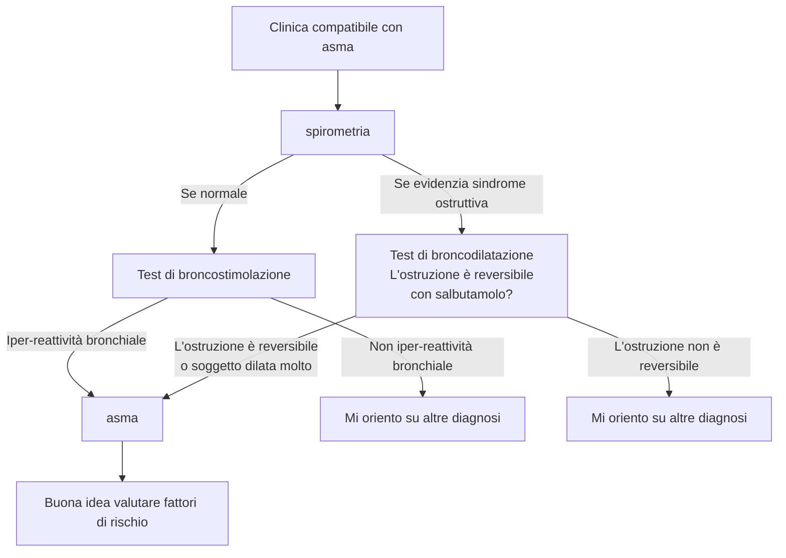

<!-- Docente: Stefano Nava -->

<!--
Libri consigliati da Nava

Atul Gawande
	Better
	The Checklist
	Being Mortal
	Complications

Jerome Groopman
	How doctors think

Samuel Shem
	La casa di Dio
-->
\clearpage
\part{Pneumologia}

# Come mai ci ammaliamo?
- Fattori di rischio per patologie respiratorie \marginnote{Ma non solo, i fattori di rischio sono trasversali... Siamo complicati e tutto è collegato}
	- Fumo di sigaretta
	- e-cigarettes (particolarmente nei giovani!)
	- Inquinamento ambientale (aria + acqua + suolo)^[Traffico + fabbriche + combustibili + trasformazione chimicofisica di agenti (da sole, umidità, radiazioni...) Questo produce inquinanti sia disciolti nell'aria, che inquinanti "pesanti" che si depositano nel terreno e entrano negli organismi sottoforma di acqua, alimenti...] e [materia particolata](https://it.wikipedia.org/wiki/Particolato) (PM~10~, PM~2.5~, PM~0.1~)
		- Produzione di inquinanti specifici a seconda delle attività
			- NO~2~, Biossido di azoto (da combustione ⇒ motori a combustione)
			- SO~2~, Biossido di zolfo
	- Inquinamento domestico^[Aria viziata + vapori + fumo + esalazioni chimiche presenti all'interno delle case]
	- Rischio lavorativo
		- Esposizione all'amianto
		- Esposizioni a fumi derivanti da errato (o doloso) smaltimento di sostanze
		- Esposizione a sostanze tossiche senza appropriati DPI
	- Obesità
	- Infezioni
		- TBC come "capitano tra le cause di morte"
			- Ceppi multiresistenti presenti in 63 paesi
			- 1/3 della popolazione mondiale è infetto
	- Tenore sociale
		- ↓ tenore sociale ⇔ ↑ mortalità in malattie non comunicabili
	- Predisposizione genetica

<!-- ven 5 mar 2021, 14:19:49, CET -->
# Asma
- Asma è patologia molto eterogenea \marginnote{È molto multifattoriale! C'entrano i geni, l'ambiente, i fattori di rischio, la fortuna e l'esposizione...}
- \pat{asma} --- malattia infiammatoria cronica delle vie aeree (OMS)
	- Abbondante ruolo della componente cellulare
	- Se individuo è _suscettibile_: infiammazione ⇒ broncospasmo, tosse e dispnea (> notte e prima mattina)
	- Infiammazione cronica può causare ↑ reattività bronchiale in risposta a stimoli esterni (fisici e chimici)
- Prevalenza stimata: 5--10% della popolazione mondiale (~ 300M persone)
	- \> prevalenza in popolazione migrante (per nuova esposizione ad allergeni locali) e spesso + grave e mal controllato (tendenzialmente > difficoltà di accesso alle cure e < livello socioeconomico)
	- Impatto su QoL: dipende
		- Se ben curata: non invalidante
		- Se non ben gestita: una buona % di pz. la ritiene una patologia che, in qualche aspetto di vita, ha impatto

## Presentazione clinica
- Presentazione tipica:
	- > 1 sintomo tra sibilo, dispnea, tosse, senso di costrizione toracica
	- Sintomi esacerbati notte/mattino
- Intensità dei sintomi variabile nel tempo
- Possibili fattori scatenanti
	- \goldstandard Allergeni (sopratutto domestici^[Cane, gatto, altri animali] ma non sottovalutare anche quelli ambientali^[Piante erbacee (> graminacee) arboree (oleacee, betulle) funghi, animali (cavallo...)])
	- Infezioni virali
	- Inquinanti (ambientali, _professionali_, fumo) \marginnote{15\% dei casi di asma è collegato a lavoro, > 20\% asmatici fuma}
	- Sforzo
	- Aria fredda
	- Risata
	- Esposizione ad irritanti (vapori, fumi, odori forti)

\redbox{Sintomi che riducono la probabilità che si tratti di \pat{asma}}{
- Tosse cronica
- Espettorazione cronica
- Dolore toracico (massimo oppressione)
- Stridio inspiratorio
}

### Fattori di rischio
- Maggiori
	- Predisposizione genetica
	- Iperreattività ambientale
	- Atopia \marginnote{\emph{Atopia} = predisposizione genetica a sviluppare alcune reazioni anafilattiche}
	- Fattori ambientali
		- Allergeni
		- Sensibilizzanti professionali
		- Fumo
		- Inquinamento atmosferico
		- Pregresse infezioni delle vie respiratorie (particolarmente nei primi anni di vita): rinovirus e virus respiratorio sinciziale
- Minori
	- Sesso, etnia, obesità
	- Stress e fattori psicosociali (ansia, depressione)

## Fisiopatologia
- Nella fisiopatologia dell'asma ci sono 2 attori principali
	1. Infiammazione
	2. Risposta del muscolo liscio all'infiammazione
- __L'eziologia di base è, essenzialmente, infiammatoria__
	1. Asma con risposta di tipo 2 (mediata dalla risposta di ipersensibilità di tipo 1)
		- Early onset (atopico)
		- Late onset (eosinofilo)
		- Da esercizio fisico (EIA)
		- Da insorgenze particolari
			- Da \far{asa}
			- Perimestruale
	2. Asma con risposta di tipo non-2 (mediata da meccanismi non particolarmente noti)
		- A principale componente neutrofilica
		- A principale componente ??
		- A componente mista

\ 

- A questo si aggiunge l'azione del muscolo liscio e la risposta che questo ha verso l'infiammazione \todo{questa parte da sbobine + iperreattività}

## Classificazione dei vari tipi di asma

### Asma di tipo 2
- \todo{fisiopatologia}
- __Risposta mediata da una risposta di ipersensibilità di tipo 1__
	- TH~2~
	- Eosinofili
- Per la sua fisiopatologia spesso è associato ad eventi allergici o ad agenti stimolanti esterni
- Difficilmente controllabile

#### Early onset (atopico)
- Storia
	- Esordio precoce (pz. ped o giovane)
	- Storia di sintomi atopici o di familiarità per atopia
- Clinica
	- Sintomatologie da lieve a severa
	- Allergeni che stimolano sintomi asmatici
	- Associato a dermatite atopica, congiuntivite allergica
- Biomarcatori
	- ↑ IgE totali + per allergeni stimolanti
	- Marcatori di infezione T~2~

#### Late onset (eosinofilo)
- Storia
	- Esordio in età adulta (anche molto severo)
	- Quasi mai sintomi atopici
	- Storia di poliposi nasale, sinusite cronica
	- Scarsa familiarità per asma o atopia
- Clinica
	- Spesso severo
	- Esordio improvviso
- \todo{manca roba}

#### Da esercizio fisico
- Storia
	- Possibile atopia
	- Insorgenza chiaramente riferita ad un evento in cui pz. si è sforzato
- Clinica
	- Spesso compresenza di asma lieve/moderato
- Biomarcatori
	- Non disponibili
- Risposta
	- Buona risposta a \far{β2-agonisti} e \far{anti-leucotrienici}

#### Asma con insorgenza particolari

##### Asma da aspirina
- Storia
	- Allergia all'\far{asa}
- Clinica
	- Esordio molto acuto
	- Grave peggioramento se assunta \far{asa}
- Risposta
	- Scarsa a steroidi inalatori
	- Necessari steroidi ad alte dosi o addirittura adrenalina

##### Asma perimestruale o da gravidanza
- Donna asmatica _può riferire_ peggioramento in
	- Periodi premestruali
	- Gravidanza

##### Asma da esposizione professionali

### Asma di tipo non-2
- \todo{fisiopatologia}

#### Asma da obesità
- Storia
	- F > M
	- Esordio in età adulta
- Clinica \todo{}
	- Spesso obesità
	- Minima atopia
	- Molto sintomatici
- Biomarcatori
	- Non chiaro
- Clinica \todo{}

## Diagnosi

### Test di broncostimolazione \todo{}

- Quantificazione dell'asma: valuto quanta `metacolina` è necessaria a ridurre del 20% il VEMS (PD~20~)

| PD~20~ | Classificazione |
|---|---|
| FUCK | FUCK FUCK FUCK |

### Test di broncodilatazione \todo{}
- Naturalmente se spirometria evidenzia ostruzione non posso fare un test che potrebbe chiudere i bronchi, o ammazzo il paziente ⇒ test di broncodilatazione
- Se ho broncodilatazione marcata mi posso aspettare anche una bronco-costrizione marcata ⇒ sospetto comunque asma

### Valutazione dei fattori di rischio
- Valutare rischio allergologico
	- __Prick test__ per identificare allergie (I livello)
	- Dosare le IgE (II livello, molto costoso!) per avere quantificazione
		- Sierologia delle IgE totali (test PRIST)
		- Sierologia delle IgE specifiche (test RAST)

## Terapia
- La terapia generale per l'asma si fonda su 3 pilastri
	- \farf{β2-agonisti}
		- Long acting (\far{laba}) --- ~ 12h
		- A corta durata --- ~ 4--6h
	- Steroidi __inalatori__
		- Terapia con aerosol è il top
			- > concentrazioni locali
			- ↓ farmaco in circolo ⇒ < effetti collaterali
			- Non effetto epatico
			- Non problemi di assorbimento
		- Spiegare bene la tecnica di inalazione!
	- Eventualmente anti--colinergici
- Per scegliere la terapia: 2 fasi
	1. Definire la gravità! 5 step (valutare, secondo linee guida: sintomatologia + attacchi notturni + ↓ FEV~1~)
		1. Asma intermittente
		2. Asma lieve persistente
		3. Asma moderato persistente
		4. Asma grave persistente
		5. Asma molto grave
	2. Valutare una terapia anti-infiammatoria a seconda dello step di gravità
		- Se lieve/intermittente → tentativo di tp. al bisogno (\far{β2-agonisti}, non per forza laba + \far{steroidi} inalatori)
			- Valutare allergie! Ha senso tp. antistaminica? Magari stagionale?
		- Se persistente → tp. cronica (\far{laba} + \far{steroidi} inalatori a dosi basse)
		- Se grave → tp. cronica con dose medio/alta + considerare anticolinergici
		- Se asma totalmente refrattario a tp. convenzionale → considerare farmaci biologici (Ab monoclonali anti IgE)
- Considerare cambiamenti se riacutizzazione
	- Distinguere una riacutizzazione da un asma che viene male controllato
		- Il pz. è compliante alla tp.? Se sì sospettiamo riacutizzazione
		- Ci sono state esposizioni a fattori che possono produrre riacutizzazzioni?
	- Se riacutizzazione lieve/moderata spesso si può controllare con aumento della dose
	- Ospedalizzazione se _riacutizzazione grave_
		- Monitoraggio sopratutto nelle prime fasi

### Terapia per asma grave refrattario \todo{Fare parte da sbobba}
- \far{omalizumab}
- \far{mepolizumab}

# Polmoniti: inquadramento e diagnosi
- \todo{primi 20 min}
- \todo{conclusioni}

## Patogenesi
- \pat{polmonite} --- processo infiammatorio a carico del parenchima polmonare, solitamente sostenuto da batteri, virus, funghi o protozoi

## Clinica

### Presentazione tipica
- Sintomi tipici
- Sintomi atipici
- Segni tipici --- tachipnea, tachicardia, ridotta espansibilità, ↑ FVT, ottusità plessica, soffio bronchiale, crepitii, sibili, sfregamenti pleurici
- Nell'anziano --- comparsa o aggravamento di uno stato di confusione

### Classificazione
- Clinica
	- (>) Acquisita in comunità (CAP)
	- Acquisita in ospedale (HAP) --- dopo > 48h da ricovero e non presente all'ingresso
		- Associata a lungodegenza (HCAP^[Health Care Acquired Pneumonia])
		- Associata a ventilazione (VAP)
- Anatomo--patologica
	- Lobare
	- Broncopolmonite
		- Interessamento __albero bronchiale + parenchima__
		- Tipica sg. defedati o con < competenza immunitaria
		- Sostenuta da \todo{}
			- Gram + 
			- Gram - 
			- Anaerobi
	- Interstiziale
		- Interessamento principalmente dell'interstizio (interstizio alveolare, connettivo attorno all'albero bronchiale, pareti alveolari)
		- Sostenuta da \todo{}
			- Batteri: Micoplasma pneumonie, Clamidia, Legionella
			- Funghi: Coxiella Burneti
			- Virus: Sars-CoV-2

#### CAP
- \todo{Agenti eziologici principali da slide}
	- _Streptococcus pneumoniae_
	- _Haemophilus influenzae_

##### CAP atipiche

||CAP tipica | CAP atipica |
|-|-|-|
|Anamnesi| Esordio brusco | Esordio lento |
|Rx | Alveolare/lobare | Interstiziale |
|EO | Addensamento | Sfumati o assenti |
|Età | Tutte | Prevalentemente giovani |
|Dolore pleurico | Spesso |Raro|
|Leucociti| > 10K--12K | Normale |
|Espettorato | Purulento o rugginoso | Mucoide |

#### HAP
- Insorgenza early onset vs late onset
	- Precoce: > probabilità di patogeni sensibili
	- Tardiva: > probabilità di multi drug resistance
- Principali agenti che sostengono le HAP
	- Pseudomonas aeruginosa
	- Klebsiella pneumoniae
	- Enterobacter
	- Serratia
	- Acinetobacter
	- Stenotrophomonas maltophilia
	- MRSA (sopratutto USA)
	- Streptococcus penumoniae (ma molto più tipico di CAP)
	- Hemophilius influenzae
	- Legionella pneumophilia
	- Funghi e virus

#### HCAP
- \todo{principali agenti coinvolti}
	- Polmoniti da aspirazione (!!) e ab ingestis

### Diagnosi
- Esami del sangue
	- Leucocitosi o lecuopenia (a seconda dell'ezioologia
	- \todo{}
- EGA
	- Ipossiemia e/o insufficienza respiratoria
	- Attenzione: possibile alcalosi respiratoria se pz compensa con ↑ FR (mascherando falsamente i valori!)
- RX positivo assolutamente!
	- Non si può (statisticamente) fare diagnosi solo con EO
- Metodiche diagnostiche per capire agente patogeno (nel 60% dei casi l'eziologia rimane sconosciuta)
	- Non invasive (da preferire assolutamente se sospetto polmonite!)
		- Esame espettorato
			- 1--2 ml di escreato emesso spontaneamente
			- Al mattino a digiuno, con bocca sciacquata con cloroxidina per evitare contaminazioni
			- Consegna entro 2h, conservato a 4°C
			- Molto face rischio di contaminazione
			- Segue esame colturale (indicazione pereliminare a 1gg, negatività a 2 gg, positività a 3 gg (tardissimo! tp. va cominciata in poche _ore_!)
		- Coltura di espettorato o broncoaspirato \todo{unire sezioni}
		- Emocoltura
			- Non ha molto senso (non è significativo) in sg. con febbre bassa (< 38°C) o senza sintomatologia importante
			- Se si fa, se ne fanno almeno 3 seriate a distanza di 15--30 min
			- Spesso ci sono interferenze
				- Stafilococcus epidermidis o contaminazione da flora batterica cutanea
				- Antibiotico terapia (emocoltura _prima_)
		- Sierologia
		- Ricerca _degli antigeni_ nelle urine
			- Esame di 1/o livello, molto affidabile e provante
			- Di fatto ha senso sempre, anche se si ricerca solo per:
				- Staphilococcus pneumoniae (_ottimo_ in CAP/polmoniti lobari)
				- Legionella (rara, ma se c'è è grave e bisogna riconoscerla in tempo!)
			- Preferibilmente primo mitto
			- Può essere conservato per 48h a temperatura ambiente
		- Broncoaspirato
			- > 1 ml di materiale recuperato da aspirazione tracheale
			- Consegna entro 2h
			- Sempre possibili (anche se molto meno di esame dell'escreato) contaminazioni e/o falsi negativi da tp. antibiotica
			- Segue esame colturale
	- Invasive

##### Staging della gravità
- È complicato valutare la gravità e stabilire la prognosi
- Ci sono alcuni indici per lo staging e stratificare la prognosi (PSI, CURB65, CRB65) ma non è assolutamente detto che siano indicativi
- Per decidere cosa fare ha più senso una valutazione clinica
	- Criteri minori (almeno ammissione)
		- Tachipnea (spesso compensatoria!)
		- PaO~2~ < 60 mmHg o SpO~2~ < 92%
		- Focolai multipli
		- Disorientamento
		- Leucopenia
		- Trombocitopenia
		- Urea > 20 mg/dl
		- Ipotermia (abbiamo infezione!)
		- Ipotensione che necessita fluidi
	- Criteri maggiori (ricovero in TI)
		- Shock settico
		- Ventilazione meccanica
