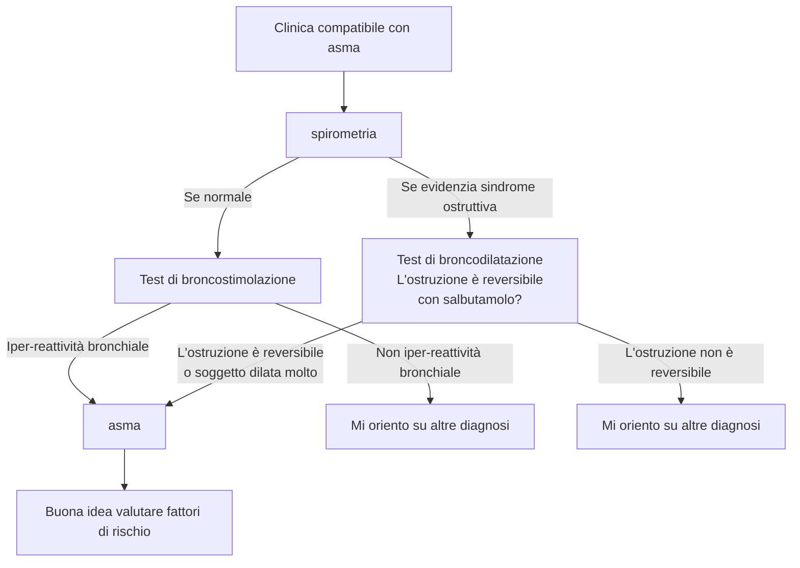
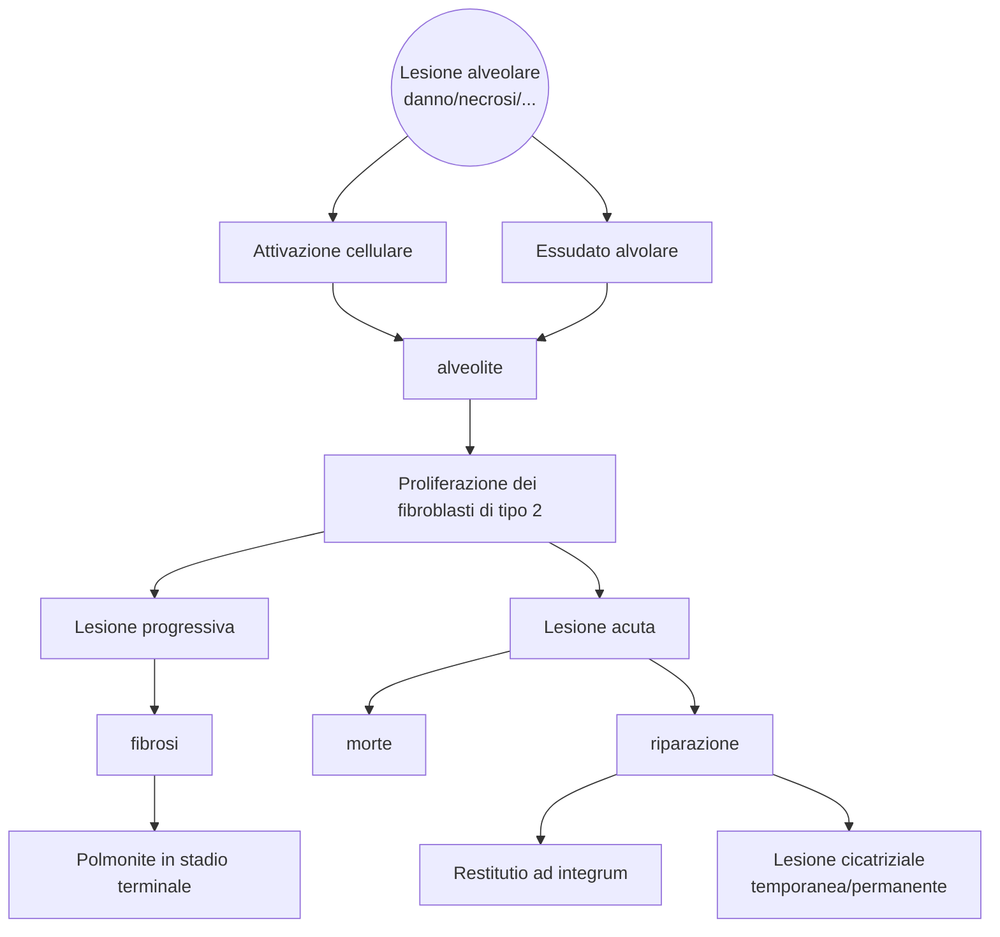

<!-- Docente: Stefano Nava -->

<!--
Libri consigliati da Nava

Atul Gawande
	Better
	The Checklist
	Being Mortal
	Complications

Jerome Groopman
	How doctors think

Samuel Shem
	La casa di Dio
-->
\clearpage
\part{Pneumologia}

# Come mai ci ammaliamo?
- Fattori di rischio per patologie respiratorie \marginnote{Ma non solo, i fattori di rischio sono trasversali... Siamo complicati e tutto è collegato}
	- Fumo di sigaretta
	- e-cigarettes (particolarmente nei giovani!)
	- Inquinamento ambientale (aria + acqua + suolo)^[Traffico + fabbriche + combustibili + trasformazione chimicofisica di agenti (da sole, umidità, radiazioni...) Questo produce inquinanti sia disciolti nell'aria, che inquinanti "pesanti" che si depositano nel terreno e entrano negli organismi sottoforma di acqua, alimenti...] e [materia particolata](https://it.wikipedia.org/wiki/Particolato) (PM~10~, PM~2.5~, PM~0.1~)
		- Produzione di inquinanti specifici a seconda delle attività
			- NO~2~, Biossido di azoto (da combustione ⇒ motori a combustione)
			- SO~2~, Biossido di zolfo
	- Inquinamento domestico^[Aria viziata + vapori + fumo + esalazioni chimiche presenti all'interno delle case]
	- Rischio lavorativo
		- Esposizione all'amianto
		- Esposizioni a fumi derivanti da errato (o doloso) smaltimento di sostanze
		- Esposizione a sostanze tossiche senza appropriati DPI
	- Obesità
	- Infezioni
		- TBC come "capitano tra le cause di morte"
			- Ceppi multiresistenti presenti in 63 paesi
			- 1/3 della popolazione mondiale è infetto
	- Tenore sociale
		- ↓ tenore sociale ⇔ ↑ mortalità in malattie non comunicabili
	- Predisposizione genetica

<!-- ven 5 mar 2021, 14:19:49, CET -->
# Asma
- Asma è patologia molto eterogenea \marginnote{È molto multifattoriale! C'entrano i geni, l'ambiente, i fattori di rischio, la fortuna e l'esposizione...}
- \pat{asma} --- malattia infiammatoria cronica delle vie aeree (OMS)
	- Abbondante ruolo della componente cellulare
	- Se individuo è _suscettibile_: infiammazione ⇒ broncospasmo, tosse e dispnea (> notte e prima mattina)
	- Infiammazione cronica può causare ↑ reattività bronchiale in risposta a stimoli esterni (fisici e chimici)
- Prevalenza stimata: 5--10% della popolazione mondiale (~ 300M persone)
	- \> prevalenza in popolazione migrante (per nuova esposizione ad allergeni locali) e spesso + grave e mal controllato (tendenzialmente > difficoltà di accesso alle cure e < livello socioeconomico)
	- Impatto su QoL: dipende
		- Se ben curata: non invalidante
		- Se non ben gestita: una buona % di pz. la ritiene una patologia che, in qualche aspetto di vita, ha impatto

## Presentazione clinica
- Presentazione tipica:
	- > 1 sintomo tra sibilo, dispnea, tosse, senso di costrizione toracica
	- Sintomi esacerbati notte/mattino
- Intensità dei sintomi variabile nel tempo
- Possibili fattori scatenanti
	- \goldstandard Allergeni (sopratutto domestici^[Cane, gatto, altri animali] ma non sottovalutare anche quelli ambientali^[Piante erbacee (> graminacee) arboree (oleacee, betulle) funghi, animali (cavallo...)])
	- Infezioni virali
	- Inquinanti (ambientali, _professionali_, fumo) \marginnote{15\% dei casi di asma è collegato a lavoro, > 20\% asmatici fuma}
	- Sforzo
	- Aria fredda
	- Risata
	- Esposizione ad irritanti (vapori, fumi, odori forti)

\redbox{Sintomi che riducono la probabilità che si tratti di \pat{asma}}{
- Tosse cronica
- Espettorazione cronica
- Dolore toracico (massimo oppressione)
- Stridio inspiratorio
}

### Fattori di rischio
- Maggiori
	- Predisposizione genetica
	- Iperreattività ambientale
	- Atopia \marginnote{\emph{Atopia} = predisposizione genetica a sviluppare alcune reazioni anafilattiche}
	- Fattori ambientali
		- Allergeni
		- Sensibilizzanti professionali
		- Fumo
		- Inquinamento atmosferico
		- Pregresse infezioni delle vie respiratorie (particolarmente nei primi anni di vita): rinovirus e virus respiratorio sinciziale
- Minori
	- Sesso, etnia, obesità
	- Stress e fattori psicosociali (ansia, depressione)

## Fisiopatologia
- Nella fisiopatologia dell'asma ci sono 2 attori principali
	1. Infiammazione
	2. Risposta del muscolo liscio all'infiammazione
- __L'eziologia di base è, essenzialmente, infiammatoria__
	1. Asma con risposta di tipo 2 (mediata dalla risposta di ipersensibilità di tipo 1)
		- Early onset (atopico)
		- Late onset (eosinofilo)
		- Da esercizio fisico (EIA)
		- Da insorgenze particolari
			- Da \far{asa}
			- Perimestruale
	2. Asma con risposta di tipo non-2 (mediata da meccanismi non particolarmente noti)
		- A principale componente neutrofilica
		- A principale componente ??
		- A componente mista

\ 

- A questo si aggiunge l'azione del muscolo liscio e la risposta che questo ha verso l'infiammazione \todo{questa parte da sbobine + iperreattività}

## Classificazione dei vari tipi di asma

### Asma di tipo 2
- \todo{fisiopatologia}
- __Risposta mediata da una risposta di ipersensibilità di tipo 1__
	- TH~2~
	- Eosinofili
- Per la sua fisiopatologia spesso è associato ad eventi allergici o ad agenti stimolanti esterni
- Difficilmente controllabile

#### Early onset (atopico)
- Storia
	- Esordio precoce (pz. ped o giovane)
	- Storia di sintomi atopici o di familiarità per atopia
- Clinica
	- Sintomatologie da lieve a severa
	- Allergeni che stimolano sintomi asmatici
	- Associato a dermatite atopica, congiuntivite allergica
- Biomarcatori
	- ↑ IgE totali + per allergeni stimolanti
	- Marcatori di infezione T~2~

#### Late onset (eosinofilo)
- Storia
	- Esordio in età adulta (anche molto severo)
	- Quasi mai sintomi atopici
	- Storia di poliposi nasale, sinusite cronica
	- Scarsa familiarità per asma o atopia
- Clinica
	- Spesso severo
	- Esordio improvviso
- \todo{manca roba}

#### Da esercizio fisico
- Storia
	- Possibile atopia
	- Insorgenza chiaramente riferita ad un evento in cui pz. si è sforzato
- Clinica
	- Spesso compresenza di asma lieve/moderato
- Biomarcatori
	- Non disponibili
- Risposta
	- Buona risposta a \far{β2-agonisti} e \far{anti-leucotrienici}

#### Asma con insorgenza particolari

##### Asma da aspirina
- Storia
	- Allergia all'\far{asa}
- Clinica
	- Esordio molto acuto
	- Grave peggioramento se assunta \far{asa}
- Risposta
	- Scarsa a steroidi inalatori
	- Necessari steroidi ad alte dosi o addirittura adrenalina

##### Asma perimestruale o da gravidanza
- Donna asmatica _può riferire_ peggioramento in
	- Periodi premestruali
	- Gravidanza

##### Asma da esposizione professionali

### Asma di tipo non-2
- \todo{fisiopatologia}

#### Asma da obesità
- Storia
	- F > M
	- Esordio in età adulta
- Clinica \todo{}
	- Spesso obesità
	- Minima atopia
	- Molto sintomatici
- Biomarcatori
	- Non chiaro
- Clinica \todo{}

## Diagnosi

### Test di broncostimolazione \todo{}

- Quantificazione dell'asma: valuto quanta `metacolina` è necessaria a ridurre del 20% il VEMS (PD~20~)

| PD~20~ | Classificazione |
|---|---|
| FUCK | FUCK FUCK FUCK |

### Test di broncodilatazione \todo{}
- Naturalmente se spirometria evidenzia ostruzione non posso fare un test che potrebbe chiudere i bronchi, o ammazzo il paziente ⇒ test di broncodilatazione
- Se ho broncodilatazione marcata mi posso aspettare anche una bronco-costrizione marcata ⇒ sospetto comunque asma

### Valutazione dei fattori di rischio
- Valutare rischio allergologico
	- __Prick test__ per identificare allergie (I livello)
	- Dosare le IgE (II livello, molto costoso!) per avere quantificazione
		- Sierologia delle IgE totali (test PRIST)
		- Sierologia delle IgE specifiche (test RAST)

## Terapia

\ 

- La terapia generale per l'asma si fonda su 3 pilastri
	- \farf{β2-agonisti}
		- Long acting (\far{laba}) --- ~ 12h
		- Short acting (\far{saba}) --- ~ 4--6h
	- Steroidi __inalatori__
		- Terapia con aerosol è il top
			- > concentrazioni locali
			- ↓ farmaco in circolo ⇒ < effetti collaterali
			- Non effetto epatico
			- Non problemi di assorbimento
		- Spiegare bene la tecnica di inalazione!
	- Eventualmente anti--colinergici (\far{sama} e \far{lama})
- Per scegliere la terapia: 3 fasi
	1. \far{saba} al bisogno
	2. Definire la gravità! 5 step (valutare, secondo linee guida: sintomatologia + attacchi notturni + ↓ FEV~1~)
		1. Asma intermittente
		2. Asma lieve persistente
		3. Asma moderato persistente
		4. Asma grave persistente
		5. Asma molto grave
	3. Valutare una terapia anti-infiammatoria a seconda dello step di gravità per prevenire eventi acuti gravi
		- Se lieve/intermittente → tentativo di tp. al bisogno (\far{β2-agonisti}, non per forza laba + \far{steroidi} inalatori)
			- Valutare allergie! Ha senso tp. antistaminica? Magari stagionale?
		- Se persistente → tp. cronica (\far{laba} + \far{steroidi} inalatori a dosi basse)
		- Se grave → tp. cronica con dose medio/alta + considerare anticolinergici
		- Se asma totalmente refrattario a tp. convenzionale → considerare farmaci biologici (Ab monoclonali anti IgE)
- Considerare rapidamente cambiamenti additivi se riacutizzazione
	- Distinguere una riacutizzazione da un asma che viene male controllato
		- Il pz. è compliante alla tp.? Se sì sospettiamo riacutizzazione
		- Ci sono state esposizioni a fattori che possono produrre riacutizzazzioni?
	- Se riacutizzazione lieve/moderata spesso si può controllare con aumento della dose
	- Ospedalizzazione se _riacutizzazione grave_
		- Monitoraggio sopratutto nelle prime fasi

### Terapia per asma grave refrattario \todo{Fare parte da sbobba}
- \far{omalizumab}
- \far{mepolizumab}

# Polmoniti: inquadramento e diagnosi
- \todo{primi 20 min}
- \todo{conclusioni}
- Linee guida: @waterer_management_2011

## Patogenesi
- \pat{polmonite} --- processo infiammatorio a carico del parenchima polmonare, solitamente sostenuto da batteri, virus, funghi o protozoi

## Clinica

### Presentazione tipica
- Sintomi tipici
- Sintomi atipici
- Segni tipici --- tachipnea, tachicardia, ridotta espansibilità, ↑ FVT, ottusità plessica, soffio bronchiale, crepitii, sibili, sfregamenti pleurici
- Nell'anziano --- comparsa o aggravamento di uno stato di confusione

### Classificazione
- Clinica
	- (>) Acquisita in comunità (CAP)
	- Acquisita in ospedale (HAP) --- dopo > 48h da ricovero e non presente all'ingresso
		- Associata a lungodegenza (HCAP^[Health Care Acquired Pneumonia])
		- Associata a ventilazione (VAP)
- Anatomo--patologica
	- Lobare
	- Broncopolmonite
		- Interessamento __albero bronchiale + parenchima__
		- Tipica sg. defedati o con < competenza immunitaria
		- Sostenuta da \todo{}
			- Gram + 
			- Gram - 
			- Anaerobi
	- Interstiziale
		- Interessamento principalmente dell'interstizio (interstizio alveolare, connettivo attorno all'albero bronchiale, pareti alveolari)
		- Sostenuta da \todo{}
			- Batteri: Micoplasma pneumonie, Clamidia, Legionella
			- Funghi: Coxiella Burneti
			- Virus: Sars-CoV-2

#### CAP
- \todo{Agenti eziologici principali da slide}
	- _Streptococcus pneumoniae_
	- _Haemophilus influenzae_

##### CAP atipiche

||CAP tipica | CAP atipica |
|-|-|-|
|Anamnesi| Esordio brusco | Esordio lento |
|Rx | Alveolare/lobare | Interstiziale |
|EO | Addensamento | Sfumati o assenti |
|Età | Tutte | Prevalentemente giovani |
|Dolore pleurico | Spesso |Raro|
|Leucociti| > 10K--12K | Normale |
|Espettorato | Purulento o rugginoso | Mucoide |

#### HAP
- Insorgenza early onset vs late onset
	- Precoce: > probabilità di patogeni sensibili
	- Tardiva: > probabilità di multi drug resistance
- Principali agenti che sostengono le HAP
	- Pseudomonas aeruginosa
	- Klebsiella pneumoniae
	- Enterobacter
	- Serratia
	- Acinetobacter
	- Stenotrophomonas maltophilia
	- MRSA (sopratutto USA)
	- Streptococcus penumoniae (ma molto più tipico di CAP)
	- Hemophilius influenzae
	- Legionella pneumophilia
	- Funghi e virus

#### HCAP
- \todo{principali agenti coinvolti}
	- Polmoniti da aspirazione (!!) e ab ingestis

### Diagnosi
- Esami del sangue
	- Leucocitosi o lecuopenia (a seconda dell'ezioologia
	- \todo{}
- EGA
	- Ipossiemia e/o insufficienza respiratoria
	- Attenzione: possibile alcalosi respiratoria se pz compensa con ↑ FR (mascherando falsamente i valori!)
- RX positivo assolutamente!
	- Non si può (statisticamente) fare diagnosi solo con EO
- Metodiche diagnostiche per capire agente patogeno (nel 60% dei casi l'eziologia rimane sconosciuta)
	- Non invasive (da preferire assolutamente se sospetto polmonite!)
		- Esame espettorato
			- 1--2 ml di escreato emesso spontaneamente
			- Al mattino a digiuno, con bocca sciacquata con cloroxidina per evitare contaminazioni
			- Consegna entro 2h, conservato a 4°C
			- Molto face rischio di contaminazione
			- Segue esame colturale (indicazione pereliminare a 1gg, negatività a 2 gg, positività a 3 gg (tardissimo! tp. va cominciata in poche _ore_!)
		- Coltura di espettorato o broncoaspirato \todo{unire sezioni}
		- Emocoltura
			- Non ha molto senso (non è significativo) in sg. con febbre bassa (< 38°C) o senza sintomatologia importante
			- Se si fa, se ne fanno almeno 3 seriate a distanza di 15--30 min
			- Spesso ci sono interferenze
				- Stafilococcus epidermidis o contaminazione da flora batterica cutanea
				- Antibiotico terapia (emocoltura _prima_)
		- Sierologia
		- Ricerca _degli antigeni_ nelle urine
			- Esame di 1/o livello, molto affidabile e provante
			- Di fatto ha senso sempre, anche se si ricerca solo per:
				- Staphilococcus pneumoniae (_ottimo_ in CAP/polmoniti lobari)
				- Legionella (rara, ma se c'è è grave e bisogna riconoscerla in tempo!)
			- Preferibilmente primo mitto
			- Può essere conservato per 48h a temperatura ambiente
		- Broncoaspirato
			- > 1 ml di materiale recuperato da aspirazione tracheale
			- Consegna entro 2h
			- Sempre possibili (anche se molto meno di esame dell'escreato) contaminazioni e/o falsi negativi da tp. antibiotica
			- Segue esame colturale
	- Invasive

##### Staging della gravità
- È complicato valutare la gravità e stabilire la prognosi
- Ci sono alcuni indici per lo staging e stratificare la prognosi (PSI, CURB65, CRB65) ma non è assolutamente detto che siano indicativi
- Per decidere cosa fare ha più senso una valutazione clinica
	- Criteri minori (almeno ammissione)
		- Tachipnea (spesso compensatoria!)
		- PaO~2~ < 60 mmHg o SpO~2~ < 92%
		- Focolai multipli
		- Disorientamento
		- Leucopenia
		- Trombocitopenia
		- Urea > 20 mg/dl
		- Ipotermia (abbiamo infezione!)
		- Ipotensione che necessita fluidi
	- Criteri maggiori (ricovero in TI)
		- Shock settico
		- Ventilazione meccanica

<!-- Manca lezione di mer 11, ero in turno -->
# Argomento sconosciuto

<!-- lun 15 mar 2021, 16:05:58, CET -->
# Diffuse Lung Disease
- \pat{dld} (o Interstitial Lung Desease) --- gruppo _eterogeneo_ di patologie nelle quali un processo infiammatorio interessa la parete alveolare, che regredisce o viene soppiantata da connettivo (alterando quindi l'architettura e la funzionalità del parenchima
- Un numero enorme ed eterogeneo di patologie produce un quadro di DLD/ILD
	- Patologie del collagene/vascolari
	- Patologie da polvere inorganica o organica (_polmoniti da ipersensibilità_)
	- Agenti infettivi (sopratutto se immunodepressi)
	- Fattori ambientali
	- Farmaci
	- Forme idiopatiche o ereditarie
	- Patologie cardiache e renali
	- Complicanze di trapianti (host vs graft)
- Capire bene la suddivisione (uip, ipf, iip, primarie vs secondarie...)

## Meccanismo patogenetico comune

## Epidemiologia
- 15% pz.. ambulatoriali che chiedono consulenza per patologia respiratoria
	- Prevalenza: M > F (81% maschi vs 67% femmine)
	- Incidenza: ↑ per età > 55aa (Marcato aumento oltre settima decade)
		- Possibile inizio subdolo e misconosciuto con ritardo della diagnosi
- Quadri di gravità varabiabile
	- IPF è la più severa
	- \pat{sarcoidosi} è quella generalmente con prognosi più favorevole
- \todo{}

## Inquadramento anamnestico
- \todo{}

### Indagini di primo livello
- 6MWT o equivalenti (Sit--stand test) \todo{treshold di saturazione e sopravvivenza}
- Spirometria
	- Obiettivo: valutare se esiste un quadro di restrizione o se c'è altro
- RX: ok, ma non esclude nulla, al limite incoraggia ad altri approfondimenti
- \goldstandard TAC _ad alta risoluzione_ (ad alta risoluzione, altrimenti difficile distinguere se opacità è davvero _honeycombing_)
	- Indicaizioni tecniche
		- Essenziale chiedere che siano sezioni sottili
		- Senza contrasto
		- Prono e supino
		- Inspiratoria ed espiratoria
	- Pattern da ricercare per porre diagnosi
		- Bronchiectasie da trazione
		- Favo d'ape, o _honeycombing_, indicativo di \pat{ipf}
		- Opacità ground glass (patognomonico di \pat{nsip}\todo{}}

### Indagini di secondo livello
- BAL
	- Vedere se prevalgono leucociti (e se sì, quali e in che rapporto)
		- Alveolite linfocitaria
		- Alveolite neutrofila
		- Alveolite eosinofila
		- Alveolite globale (> linf, neu ed eos)
		- Alveolite macrofagica
		- Alveolite gigantocellulare (riscontro di elementi cellulari multinucleari)

\normalbox{BAL: valori normali}{
- DA SLIDE METTERE VALORI NORMALI
}

- Biopsia transbronchiale (risulta essenziale in < 15% dei casi, negli altri gli esami precedenti sono efficaci)

## Fibrosi Polmonare Idiopatica (IPF)
- \todo{Non so esattamente come prendere appunti in questa lezione}
- \todo{manca qualcosa, un po' tanto}
- \todo{vedere da sbobba}
- \todo{capire bene le distinzioni tra ipf, iip e nsip uip e altre cause. Credo IIF > IPF/NSIP/altre cause}
- \pat{ipf} --- patologia in cui si ha l'accumulo di materiale fibrotico nell'interstizio del parenchima polmonare a causa sconosciuta
- Esordio tipicamente acuto

### Terapia
- Non esistono farmaci che permettono di abbassare la mortalità, ma aumentano la qualità di vita (↓ riacutizzazioni, ↓ riduzione della CVF)
	- \far{nintedanib} --- \ini `tirosin-chinasi` intracellulare
	- \far{pirfenidone}
		- \ini produzione di collagene sostenuta da `TGF-β`
		- In vitro riduce mediatori \todo{}

## NSIP
- \pat{nsip} --- Non Specific Interstitial Pneumonia
- \todo{}
- Buona risposta a trattamento con steroidi
- \todo{}

## Interstiziopatie polmonari secondarie \todo{}
- DLD da causa nota
	- Pneumoconiosi da inalazione di polveri
		- Silicosi
		- Asbestosi
		- ...
	- Da droghe voluttuarie
		- \todo{mariuana e paraquat}
		- Cocaina \todo{}
		- Eroina
			- Granulomatosi da talco usato per tagliarla
	- Polmoniti eosinofile (ipereosinofilie polmonari)
		- Polmoniti da infiltrati eosinofili nel parenchima polmonare
		- Riscontro di ipereosinofilia _sempre_ nel BAL, _a volte_ anche nel sangue periferico
		- Ha principalmente 2 andamenti
			- Acuto (anche fatale se non diagnosticata per IR grave)
			- Cronico (esordio subdolo e spesso confuso con asma refrattario a terapia)
	- Aspergillosi broncopolmonare allergica (\pat{abpa})
		- DLD da colonizzazione delle vie aeree da parte di _Aspergillus fumigatus_ (fungo) e conseguente processo infiammatorio che si organizza nei polmoni
		- Ha un doppio andamento
			1. Stadio acuto (spesso confuso con asma^[Tipicamente: confuso con asma e le riacutizzazioni idem. Questo però porta a una mancata eradicazione dell'infezione da aspergillo, con un quadro assolutamente ingravescente, non risolvendo la causa di base])
				- Asma, ↑ IgE
				- Immediata reazione cutanea ad ag di Aspergillo
				- A Rx: infiltrati parenchimali, bronchiectasie centrali
			2. Stadio cronico \todo{controllare}
	- Da patologie collageno--vascolari (collagenopatie, vasculiti...)
		- \pat{granulomatosi di wegener}
		- \pat{sindrome di churg--strauss}
			- Spesso misconosciuta
			- Triade sintomatica: \todo{}
	- Da ipersensibilità ad un antigene
		- DLD dovuta a continua esposizione ad antigene verso cui si è sensibili (> 300 cause!! Anamnesi accurata è essenziale!)
		- Patogenesi: ipersensibilità → infiltrato (prima neutrofilico, poi \todo{cosa}) → granuloma → risoluzione (se trattamento) o fibrosi (se granuloma si organizza)
		- \todo{mi sono perso qualcosa}
	- Conseguente a \pat{sarcoidosi} \marginnote{\pat{sarcoidosi} --- Patologia multisistemica con eziologia sconosciuta che porta alla formazione di granulomi non necrotizzanti nel parenchima polmonare o nel mediastino}
	- Da farmaci
		- \far{amiodarone}
		- \far{metotrexato}
		- \far{bleomicina}
		- \far{nitrofurantoina}
		- Inibitori della `tirosin--kinasi`

## Sarcoidosi \todo{}

<!-- ven 19 mar 2021, 14:18:05, CET -->

# Versamento pleurico

\todo{Come al solito, prima di 20 minuti non si capisce l'argomento}

## Clinica
- EO
	- Ispezione: riduzione della motilità nell'emitorace sede del versamento
	- Palpazione: FVT ridotto
	- Percussione: ipofonesi/abolizione del SCP a seconda della disposizione del liquido e del decubito del pz
	- Auscultazione: MV ridotto/abolito in maniera simile a quello che succede al SCP
- Imaging
	- RX torace

## Eziologie principali
1. __Versamento da trasudato__ --- spesso bilaterale, conseguente a ↑ gradienti pressori o del fluido interstiziale
	- __CHF__^[75% dei casi bilaterale, quando monolaterale è più frequente nel lato dx. Spesso giallastro, pochi WBC. Se scompenso severo (classe IV) spesso è ribelle a diuretici]
	- __Epatopatie__^[Pressione pleurica negativa "risucchia" il liquido ascitico addominale verso il diaframma -- che spesso viene facilmente attraversato -- e poi verso lo spazio pleurico] (cirrosi)
	- __Problemi renali__: sindromi nefrotiche, glomerulonefriti...
	- __Dialisi peritoneale__
	- Ostruzione della vena cava superiore
	- Myxedema
	- Emboli polmonari
	- Sarcoidosi
	- Ipoalbuminemia
	- ...
- Versamento da essudato (spesso monolaterale, conseguente a infiammazione)
	- __Neoplasie dei polmoni__^[Il meccanismo è principalmente infiammatorio, ma non bisogna dimenticarsi che masse neoplastiche possano infiltrare/ostruire le vie linfatiche, portando a ridotto riassorbimento]
		- Ridotto versamento linfatico (← neoplasia)
	- __Patologie infettive__ a carico del parenchima polmonare (polmonite)
	- Embolia polmonare
	- Traumi ⇒ alterazioni della permeabilità
	- Secondari a problemi gastroenterici
	- Secondari a problemi ginecologici (es: postpartum)
	- Patologie del collagene e vasculiti
	- Da farmaci
	- Cause varie

## Diagnosi
- Iter:
	1. Sospetto clinico (SeS + EO)
	2. \goldstandard RX torace
		- Se visibile in proiezione std: > 200 ml
		- Proiezione laterale visualizza versamenti > 50 ml
	3. Toracentesi + analisi del liquido (50--100 ml)
		- Per capire il meccanismo scatenante
		- Per migliorare meccanica respiratoria
		- Seguire procedura appropriata (vedi video)
		- Non drenare > 1.5 lt (possibile \pat{edema polmonare} da riespansione)
		- Complicanze
			- Immediate: PNX, sanguinamento (safe spot: margine superiore)
			- A lungo termine: infezioni secondarie (sterilità!!!), emorragie non riconosciute/prevenute (anamnesi!!!)
	4. Eco se quadro "difficile" (versamento piccolo, per guidare toracentesi, per valutare versamenti saccati^[Versamenti che sono in sede da tempo e vengono circondati da un _cercine_ fibrotico]...)

\footnotesize
Tac torace non è mai misura di prima linea! Utile per valutare empiemi, ascessi, neoplasie, o se versamento recidiva o per valutare eventuali evoluzioni... Di fatto è una cosa che si usa per _seguire_ il versamento, non per diagnosticarlo.

Una TAC equivale da 300 a 500 Rx!
\normalsize

### Analisi del liquido della toracentesi
- Capire se si tratta di essudato e trasudato (> 1 dei __criteri di Light__):

| Criteri | Trasudato | Essudato |
|-|-|-|
|Proteine liquido pleurico/proteine sieriche | ≤ 0.5 | > 0.5 |
|LDH liquido pleurico/LDH sierico | ≤ 0.6 | > 0.6 |
|LDH liquido pleurico| ≤ 200 | > 200|

- Se essudato: valuto glucosio, pH, WBC e torbidezza del liquido (ci sono cellule, magari batteriche?)
	- Se glucosio < 60 mg/dl (poco) ⇒ è legittimo supporre una eziologia infiammatoria (pat infettive o neoplastiche)
		- \pat{tbc}
		- Versamento neoplastico
		- Artrite reumatoide
		- Versamento parapneumonico che si è complicato^[Polmonite → complciazione → infiammazione strong → versamento semplice (solo liquido) → versamento complicato (con germi) → empiema] (pH < 7.2 è spesso indicativo di questa condizione, pH ≤ 7 indica empiema!) \marginnote{\emph{Empiema} --- accumulo di essudato torbido e purulento a causa di grande presenza di PMN in una cavità}
	- Se glucosio normale/alto ⇒ ci si orienta su altre eziologie (vedi sopra)

## Complicanze
- Versamento semplice (solo liquido) → versamento complicato (con microorganismi) → empiema (con germi e pus (PMN morti)) → empiema saccato/organizzato (empiema stabilmente incapsulato da tessuto fibrinoso)

### Empiema pleurico
- Dividiamo l'empiema a seconda di quando si forma rispetto al focolaio pneumonico che verosimilmente ne è la causa
	- Parapneumonico: sincrono al focolaio
	- Metapneumonico: a distanza dal focolaio
- Fattori favorenti/di rischio
	- Età > 65aa
	- Diabete
	- Abuso di alcool e droghe
	- Scarsa igiene mentale
	- \todo{altri}
- \todo{}
- Batteriologia è complessa \todo{}
- Trattamento:
	- __Evacuazione__, se possibile (_Ubi pus, ibi evacua_)
		- Toracentesi > Drenaggio fisso > Chirurgia (a seconda dell'opportunità, della fattibilità e del singolo caso)
			- Chirurgia va considerata se fallimento delle alternative precedenti o se sepsi è persistente
		- Indicazioni al drenaggio (linee guida BTS)
			- Coltura/colorazione di gram + che indicano infezione pleurica certa
			- \todo{altre}
		- Ritardo in evacuazione ⇒ ↑ tempo di degenza, ↑ mortalità, ↑ necessità di terapie invasive
	- Ab a tronchi e osservazione

# Bronchiectasia
- \todo{fino alle }

## Diagnosi
- Anamnesi
- SeS
	- Tosse cronica con espettorato muco--purulento (sopratutto la mattina)
		- Francamente purulento nelle riacutizzazioni
	- Emottisi/emoftoe^[Flogosi del parenchima ⇒ erosioni dei vasi parenchimali ⇒ sanguinamento] (50--70% dei casi)
	- Malessere, febbre (remittente--intermittente durante riacutizzazioni), dispnea
- EO
	- Ottusità marcata e FVT aumentato nelle zone di ristagno di secreto
	- MV abolito/assente nelle aree ectasiche
	- Ronchi e rantoli in corrispondenza della lesione
- RX torace _assolutamente aspecifico, dice veramente poco_
	- In fasi di riacutizzazione_ speso riscontro di addensamenti/opacità generici, facilmente identificati/confusi come focolai broncopneumonici
	- Possibile aumento della trama vascolare
	- Possibile definizione del disegno bronchiale
	- Possibile riconoscimento di bronchi affastellati per perdita di volume areo
- \goldstandard __HRTC__
- Fibrobroncoscopia se
	- Esame espettorato non ci dice qual è causa scatenante per fare prelievo in sito
	- Rimuovere bronchi congestionati
	- \todo{}
- \todo{}

## Terapia
- Obiettivo: detergere le vie aeree rimuovendo secrezioni
	- Fisiochinesioterapia
		- Esercizi fisioterapeutici per drenaggi posturali
		- Tosse assistita
	- Cicli molto prolungati (12 mesi) di ab. a dosi subterapeutiche di \far{azitromicina}^[Macrolide ab. + antiinfiammatori. Attenzione: così ci si espone ad un'insorgenza di farmacoresistenze in ~ 20% dei casi. Valutare bene funzionalità epatica prima di cominciare un trattamento del genere] ⇒ ↓ riacutizzazioni
	- Mucolitici: non supportati da EBM (a meno che sg. non sia fumatore)

### Prognosi
- Accettabile/normale se
	- Diagnosi precoce
	- Buona gestione
	- Bronchiectasia altera poco la qualità di vita

# Fibrosi cistica
- Patologia autosomica recessiva dovuta a mutazione del gene `CFTR` (7q31.2) caratterizzata dalla __produzione di secrezioni esocrine molto dense__
	- 1/2.5K nati vivi (1/30 è portatore della mutazione)
- \todo{qualcosa?}

## Fisiopatologia
- CFTR codifica per un canale per il cloro, che non è funzionante nei sg. con FC
- La FC è sostenuta da 2 meccanismi fisiopatologici
	- Ispessimento dei secreti per mancata diluizione degli stessi (canale non funzionante ⇒ non escrezione di Cl^-^ ⇒ non idratazione dei secreti)
	- \todo{Mi sono perso secondo pilastro}

## Clinica
- Apparato respiratorio
	- Bronchiolite nel 1/o anno di vita (sibili, tosse secca simil--pertosse poi progressivamente produttiva e mucopurulenta)
	- Sindrome bronchiectasica ricorrente
	- Crescita batterica ⇒ polmoniti recidivanti
	- Sindrome ostruttiva progressiva
- Apparato g/i
	- Insufficienza pancreatica ⇒ malassorbimento
	- Ileo da meconio
- Infertilità
- Cirrosi biliare focale

## Diagnosi
- In primis sospetto clinico
- Conferma con
	- \goldstandard test del sudore ([Cl] > 60 mEq/l nel sudore?) \todo{soglie di test sudore}
	- PCR per amplificazione e valutazione delle mutazioni

## Prognosi e terapia
- Fluidificare muco! ⇒ bere molto + aerosol--tp.
- Profilassi ab. per riacutizzazioni (ma dipende un sacco da età, non si può cominciare profilassi ab. ad 1 anno)
- Macchina della tosse
	- Device che produce pressione positiva di insufflazione + pressione negativa rapida per generare un flusso espulsivo repentino che simula il colpo di tosse
- Studi ongoing su farmaci
- Trapianto bilaterale di polmoni aumenta aspettativa, che però ad oggi rimane ~ 30aa

# Cenni di O~2~--terapia

## O~2~ tp. in acuto
- O~2~ tp. spesso abusata
- In pz. non ipercapnici: SpO~2~ target deve essere 92--96%^[\TODO{JAMA oxygen icu randomized clincal trial effect on conservative vs conventional o2 tp. on mortality among patients in icu]
- O~2~ ha tossicità intrinseca
	- Tossicità cerebrale documentata
	- O~2~ $\propto$ ROS ⇒ danno cellulare e infiammazione
	- Danno polmonare diretto (alti flussi + ossidazione diretta)
	- ↑ O~2~ ⇒ vasocostrizione^[↓ NO, ↑ prostacicline PC12, ↑ endoteline] (coronarica, arteriolare e delle arterie cerebrali)

### Raccomandazioni per pz. non ipercapnici
- \todo{doi: 10.1136/bmjk4169}
	- SpO~2~ target: 96%
	- Mai SpO~2~ > 93% in pz. con stroke o IM
	- 90--92% tp. è ancora accettabile, valutare bene se incominciarla

![img/o2tp.png]\ 

### Raccomandazioni per pz. ipercapnici
- \todo{BMJ 2010;341:c5462}

## Long Term O~2~ therapy (LTOT)
- EBM indica che LTOT è indicata solo in BPCO con insufficienza respiratoria cronica
	- Possibile uso off-label (cure palliative, fibrosi polmonari, disordini neuromuscolari)
- Bisogna che ci sia ipossia ben documentata in stabilità clinica
	- Stabile nelle ultime settimane
	- EGA multipli (> 3 a riposo) che evidenzino
		- PaO~2~ < 55 mmHg
		- 55 mmHg < PaO~2~ < 60 mmHg con almeno una condizione aggiuntiva
			- Ematocrito > 55%
			- Cuore polmonare cronico
			- Cardiopatia ischemica
			- Aritmia severa a rischio (CHF, cardiopatia ipertrofica...)
			- \todo{manca una condizione}
- LTOT deve essere fatta almeno per 15 h/die, altrimenti non si ha miglioramento statistico di mortalità e morbilità
- Ocio ai rischi, spiegarli a pz.

## O~2~ tp. in voli aerei per pz. ipercapnici
- "Salve dottore, sono BPCO e devo andare in aereo. Che faccio?" 
	- In aereo la cabina è pressurizzata come se si fosse a 2400 mt ⇒ ↓ pO~2~
- A spanne:
	- SpO~2~ a livello del mare > 95%: no O~2~ tp. per viaggio
	- SpO~2~ a livello del mare < 92%: sì O~2~ tp. per viaggio
	- Se 92--95: parliamone
