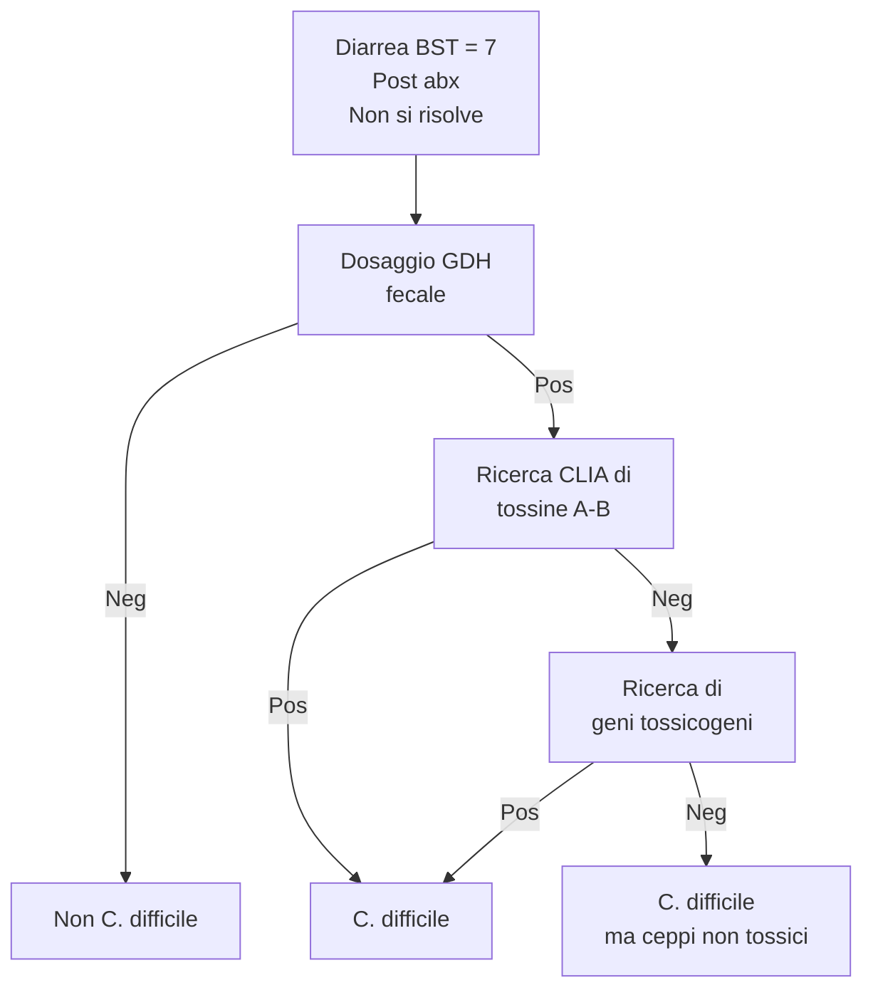

\clearpage
\part{Microbiologia Clinica}

# Introduzione
- Obiettivo della microbiologia _clinica_ è mettere il microorganismo __nel quadro clinico di un paziente__

## Concetti sparsi da tenere a mente
- _Colonizzato_ da un morg e _infettato_ da un morg sono due cose mooolto diverse. Nessuna di queste è sinonimo con malattia
	- __Colonizzazione__ --- presenza di morg nei tessuti. Non è detto che porti automaticamente a patologia, perché la colonizzazione è solo _uno dei tanti_ fattori che sono necessari ma non sufficienti per produrre patologia
		- Non va _mai_ trattata^[Ogni individuo ha % differenti di colonizzazione da parte di morg patogeni (Nesseria meningitidis (0-15% tra 0--18aa), Staphylococcus aureus cutaneo (35-40%), Haemopylus influenzae (5-10%) Streptococcus pneumoniae (0-50%). Non per questo il 50% delle persone vive con una polmonite -- e questo per una miriade di ragioni: ruolo protettivo delle altre specie del microbiota che competono, localizzazione della colonizzazione, immunocompetenza, condizioni sfavorevoli per l'infezione, mangiamo tanta frutta, chi più ne ha più ne metta]
		- Colonizzazione _può venire sorvegliata_ in funzione di
			- Contesto clinico
			- __Il morg colonizzante è abx resistente__ (_sempre_ osservazione)
	- __Infezione__ --- processo caratterizzato da _penetrazione e moltiplicazione nei tessuti_ di microorganismi patogeni
	- __Malattia__ --- quadro di segni e sintomi che derivano da una infezione

> __Colonizzazione vs infezione: un esempio__ --- lo _Pseudomonas aeruginosa_ è un batterio spesso presente nel condotto uditivo esterno di persone adulte sane (lo si ritrova nel 60% della popolazione) ma in alcuni casi può divenire la causa di otiti esterne purulente. In caso di otite può essere utile effettuare un tampone auricolare a seguito del quale un antibiogramma mostrerebbe la presenza dello pseudomonas plurisensibile. Solo in tal caso, quando il paziente è chiaramente sintomatico, possiamo somministrare una terapia antibiotica (es. Augmentin), mentre è assolutamente da evitare l’utilizzo di antibiotico contro pseudomonas aeruginosa quando il paziente è sano e non presenta sintomi. La colonizzazione a differenza dell’infezione non va trattata.
>
>Non solo: prendiamo l'esempio dello _Strepto pneumoniae_ che può portare, se infetta, alle CAP^[Community-Acquired Pneumoniae] (il 75% delle CAP sono imputabili allo Strepto). Ora, un paziente che sviluppa i sintomi tipici della polmonite si reca in genere in pronto soccorso, dove viene effettuata emocoltura ed esame dell’escreato. Immaginiamo che risulti la presenza di pneumococco nell'espettorato: la prima cosa che può saltare in mente è diagnosticare la polmonite da pneumococco e trattare la malattia come tale; tuttavia, per evitare errori è bene considerare che c’è una percentuale (0-50%) di individui in cui lo pneumococco colonizza di norma le alte vie aeree e in questo caso si deve assolutamente evitare l’errore di trattare una colonizzazione. Per questo motivo è importantissimo quantificare il numero delle colonie presenti sulla placca di coltura e scegliere di conseguenza la giusta soluzione terapeutica, eventualmente corroborata poi dal risultato dell'emocultura. _È bene tenere a mente che la semplice colonizzazione da Strepto pneumoniae non costituisce un fattore di rischio per lo sviluppo della polmonite._

- La carica batterica viene quantificata in _Colony-Forming Unit_, ovvero unità batteriche capaci di replicarsi. __La carica batterica è il fattore da guardare per tracciare la linea tra colonizzazione e infezione__
	- __Si considera come potenzialmente patogeno un microorganismo presente > 1 $\times$ 10^5 CFU/ml__ -- perché siamo normalmente _colonizzati_ da moltissime specie batteriche differenti
	- Si considera come patogeno un morg presente in < CFU/ml se è in un _pz_ sintomatico _con anamnesi positiva per pregressa abx tp.._ (Es: ho pz. che ha già cominciato abx per sospetta UTI 3gg fa che si presenta oggi con sintomi da UTI)
	- Alcuni pz. possono essere costitutivamente a rischio di ipercolonizzazione (anziani, pz cateterizzati --urinario, vascolare, PEG...--, sg. con stili di vita a rischio...)

- Sg. _colonizzati_ da patogeni abx-resistenti necessitano di particolari cautele operative per evitare cross-colonizzazione di altri pz. tramite operatore. Se pz. viene _infettato_ da patogeno abx-resistente siamo nei cazzi
	- Abx-resistenza si sviluppa molto in fretta: entro 6m--3aa da uscita di nuova molecola si trovano già i primi ceppi resistenti
	- Problema tremendo: __morg che producono carbapenemasi__ (_CPE_), contro cui i `carbapenemi` (ultima frontiera) non sono più sufficienti
	- 🚨 In pz. a rischio __bisogna fare sorveglianza attiva e isolare pz. colonizzati da ceppi abx-res!__

> __Geni che vanno sempre cercati per resistenza ai `carbapenemi`__ --- 
Solitamente da _tampone rettale_ da fare a tutti i ricoverati. SI cerca
>
>| Gene | |
>|-|-|
>|KPC|Klebsiella pneumoniae carbapenemase|
>|VIM|Verona Integration-encoded Metallo βlactamase|
>|NDIM|New Delhi Metallo βlactamase|
>|IMP|IMiPenemase|
>|OXA-48| Carbapenem-hydrolising OXAciclinase-48|
>
> tramite metodiche rapide (_test molecolari_, risultato in ~ 2h)

- 🧠 __TRATTARE IL PAZIENTE, NON IL REFERTO/MONITOR. Il referto ha senso se è supportato da un quesito e un quadro clinico ben preciso__
	- Se manca il quadro clinico che supporta il referto, farsi bene qualche domanda: ci stiamo prendendo? Le due cose sono correlate? Non ci stiamo capendo un tubo di quello che sta succedendo? Ragionare!
	- Se c'è un sintomo ma manca il risultato del referto, farsi bene qualche domanda: ci stiamo prendendo? Non ci stiamo capendo un tubo? Il risultato è attendibile? Ragionareeeee!
	- CHIEDERE UN ESAME SSE SAPPIAMO COSA FARE CON IL RISULTATO, QUALUNQUE ESSO SIA. Non chiedere tutti gli esami possibili perché vuol dire che stiamo andando a caso^[Peraltro, non sapremmo poi cosa fare: come possiamo correlare i risultati borderline che inevitabilmente troviamo? Senza contare tutti quei test che hanno sensibilità e/o specificità non esattamente stellari, e quindi vanno ordinati solo se la pretest probability è abbastanza alta da giustificare il rischio di falsi negativi, e questo lo stabiliamo CON LA CLINICAAAA e GUARDANDO IL PAZIENTE e PARLANDO CON LORO e FACENDO UNA VISITA COME SI DEVE]

> __Una storiella sulla pretest probability e sul chiedere esami alla boia__ --- Si immagini di studiare 2 popolazioni molto diverse tra loro: una popolazione è costituita da un convento di suore di clausura, chiuse in clausura dalla fine della Seconda guerra mondiale, l’altra popolazione è costituita da un gruppo di ballerine del Crazy Horse di Parigi. Si procede ad effettuare uno screening per la sifilide (per il quale ipotizziamo -- come peraltro è la realtà -- che specificità e sensibilità siano < 100%). In seguito al test risultano positive 3 suore e 3 ballerine: cosa concludiamo? L’ipotesi più probabile, considerando l'habitus di questi due gruppi, è che le 3 suore risultate positive siano 3 falsi positivi. MA attenzione: non è detto (😏), quindi SEMPRE TESTA COLLEGATA

# Infezioni respiratorie

## Infezioni delle basse vie respiratorie
- Infezioni di trachea bassa, bronchi, polmoni e annessi (pleure)
- Identifichiamo 6 quadri clinici principali
	1. Polmonite
	2. Bronchiolite
	3. Tracheo-bronchite
	4. Pleurite
	5. Empiema pleurico
	6. Ascesso polmonare

### Tracheo--bronchiti
- Infezione "di confine" tra alte e basse vie respiratorie
- Quadro di _flu-like illness_
- Periodo: ottobre--primavera

> __Flu--like illness vs influenza__ --- bisogna distinguere le forme simil-influenzali (comuni) da reale influenza (meno comune)
>
>- Flu-like: forme da raffreddamento che si contraggono in periodo ottobre--marzo. Meno gravi che influenza
>- Influenza: forma tendenzialmente molto più grave. Eziologia: virus influenzali. Si contrae durante lo specifico picco epidemico

- L'eziologia è in funzione dell'età
	- Bambino in età prescolare (ez _tendenzialmente_ virale)
		- __RSV__
		- hMPV (Human MetaPneumoVirus)
		- Rhinovirus
		- Adenovirus
		- Coxakievirus
		- Virus influenzali e parainfluenzali
	- Adulti, anziani, immunodepressi (ez _tendenzialmente_ batterica)
		- Haemophilus influenzae B
		- Streptococcus pneumoniae
		- Bordetella pertussis
		- Moraxella catarrhalis

> __Considerazioni particolari su sg. immunodepressi__ --- Il soggetto immunodepresso è un soggetto con una parziale competenza del sistema immunitario: le cellule immunitarie sono numerose, dunque, un soggetto può avere un deficit che interessa solo alcune branche della risposta immunitarie, oppure può avere un deficit di tipo globale. __Il tipico esempio di paziente immunodepresso è il soggetto che riceve un trapianto di cellule staminali ematopoietiche, il quale deve andare incontro ad una forte terapia immunosoppressiva per garantire un corretto sviluppo cellulare; ancora, altri esempi sono dal paziente neoplastico e dal paziente in dialisi__. Il soggetto immunodepresso è un soggetto abbastanza difficile da trattare ed è opinione comune che sia IL paziente, ovvero, il paziente su cui bisogna investire, proprio perché è difficile trattarlo e perché rischia di morire. Tuttavia bisogna sempre tenere presente che essi sono numericamente poco rilevanti (meno dell’1% dei pazienti che frequentano un normale ospedale) e caratterizzati da una "microbiologia collaterale", ovvero, circoscritta unicamente al soggetto immunodepresso stesso e non considerabile per la maggioranza.

### Bronchioliti
- Se un pz. ha bronchiolite, ha anche la bronchite (continuo anatomico)
- Eziologie principali sono virali
	- Virali
		- __RSV__ (Periodo RSV: nov--mar, quadri particolarmente rilevanti per severità (fino a insufficienza respiratoria) in < 6aa. Molto contagioso. Recentemente, per via di aumento dell'uso della PCR multiplex, si è scoperto che in realtà è responsabile di molti quadri anche dell'adulto, precedentemente sottodiagnosticati)
		- hMPV
		- Virus parainfluenzali
	- Batteriche
		- Mycoplasma pneumoniae
		- Bordetella pertussis

> __Bordetella pertussis__
>
> Batterio che attualmente ha buona copertura vaccinale, ma in calo ⇒ ↑ casi neonatali in periodo pre-vaccinale (< 3m) o adulti particolarmente gravi^[La pertosse, così come tutte le malattie esantematiche, è una malattia dell'infanzia: tutte le malattie dell'infanzia se prese da adulti hanno severità clinica molto maggiore]. I dati in Ita sulla pertosse sono _molto_ sottostimati, causa del fatto che solo 1 caso su 3 viene notificato (in ER)
>
> La diagnosi si fa attraverso (sensibilità ↓)
>
>- __Ricerca di  anticorpi anti-tossina__ (metodo diagnostico di riferimento, in quanto la patologia sintomatica è causata dalla tossina prodotta dalla _Bordetella_ e si manifesta con ritardo, quando l'infezione è già in fase calante)
>- PCR su reperto di alte/basse vie aeree (come al solito, più è basso meglio è; ma è più invasivo -- inoltre potrebbe essere oversensibile e portare a trattare colonizzazioni concomitanti e non infezioni)
>- Esame colturale su terreno

### Polmoniti

#### Breve patofisiologia
0. In qualche modo il patogeno supera le barriere meccaniche (anatomia delle vie aeree, ciglia, muco, diramazioni bronchiali, macrofagi residenti, ascensore mucociliare)
1. Inizio della risposta infiammatoria locale e sistemica
	- TNF, IL1 ⇒ febbre
	- IL8 e chemochine infiammatorie ⇒ leucocitosi
	- Mediatori infiammatori ⇒ stravaso dai capillari ⇒ edema a vario grado di intensità (aspetto all'RX, rantoli, ipossiemia, ↑ drive respiratorio, emottisi o emoftoe...)
	- Possibile broncospasmo mediato dai fattori infiammatori
	- Si può avere attivazione di piastrine e cascata della coagulazione ⇒ ↑ rischio CV/cerebrovascolare
2. Risposta infiammatoria ⇒ ↓ compliance polmonare E ↓ capacità di scambio ⇒ insufficienza respiratoria
3. Insufficienza respiratoria ⇒ ☠️

#### Classificazione della polmonite
1. Classificazione epidemiologica
	- CAP (Community Acquired Pneumonia)
		- Community ⇒ non ricovero nei 15gg precedenti comparsa sintomi
		- 3 casi di CAP/1K abitanti
		- Epidemiologia tipica: 90% anziani, 10% bambini
		- Picco di casi: ott-apr
	- HAP (Hospital Acquired Pneumonia)
		- Polmonite insorta dopo 48h dall'assistenza
		- Pz. a rischio di aspirazione sono a > rischio
	- VAP (Ventilator Acquired Pneumonia
		- In pz. intubati: x4 RR di sviluppare polmonite. Rischio maggiore nei primi 5gg, plateau a ~2s; ma il 70% dei pz. intubati > 30gg ha VAP
		- Pz. più a rischio:
			- Colonizzazione flora orale (per rischio di trasmissione diretta durante IOT)
			- Aspirazione
			- Compromissione immunocompetenza
	- H-CAP (Healtcare-related Community Acquired Pneumonia)^[CAP acquisite da microorganismi tipici (per specie o per resistenza) delle HAP]

| | Eziologia adulta | Eziologia pediatrica |
|-|-|-|
|CAP| __Infezione batteriche:__ _Streptococcus pneumoniae_, Mycoplasma pneumoniae, Chlamydia pneumonae, Legionella pneumoniae, Haemophilus influenzae\
__Infezioni virali:__ Influenza A\|B\|C, hRSV| Principalmente virale, oppure per Streptococcus agalactiae, Streptococcus pneimonia, Streptococcus aueus|
|HAP| __Infezioni batteriche:__ Pseudomonas aeruginosa, MRSA, Enterobatteriacea, Gram^-^ (A baumanni o Burkholderia cepacia), Klebsiella pneumonae CRE-res, Legionella pneumophila|
|VAP|__Infezioni batteriche__: Strepto penumoniae ed altri strepto, Haemophilus influenzae, Staf aureus\
__Infezioni batteriche con MDR__: _Pseudomonas aeruginosa, MRSA_, Acinetobacter, Enterobacteriace CPE-resistenti, Legionella\
__Altre infezioni__: Aspergillus|

2. Classificazione eziologica
	- Polmoniti batteriche
	- Polmoniti virali
	- Polmoniti fungine
3. Classificazione anatomo--patologica\

	- Polmonite lobare o alveolare (_"tipica"_)
		- Eziologia prevalentemente batterica
		- Rx: radiopacità parenchima polmonare ben limitato
	- Polmonite interstiziale (_"atipica"_)
		- Eiologia prevalentemente virale _oppure_ Mycoplasma pneumonae, Chlamydia pneumoniae, Legionella pneumophila
		- Rx: radiopacità diffusa tipo "ground glass" per interessamento _dello stroma_, per via del processo infiammatorio

#### Diagnosi
- SeS orientativi all'EO (non eccezionalmente sens/spec)
	- Confusione nell'anziano^[Generalmente l'anziano ha sempre clinca più sfumata]
	- Segni di dirstress respiratorio
	- Segni di addensamento parenchimale
	- Crepitii, specie alle basi
- __Rx è suggestivo__
- Diagnosi microbiologica: __da reperto rappresentativo delle vie aeree__ in cui il patogeno viene _in qualche modo_ (coltura, PCR, __PCR multiplex__) evidenziato. In generale: più un reperto è distale, più l'ambiente è fisiologicamente sterile e quindi più la diagnostica è sensible
	- Espettorato o espettorato indotto
		- Bisogna sempre fare, prima della coltura, il __test di idoneità dell'espettorato alla coltura__: un espettorato è idoneo se, alla microscopia ottica con blu di metilene, si hanno 2 caratteristiche:
			1. $\frac{\text{Globuli bianchi}}{\text{Cellule epiteliali}} > 2$
			2. Pochissime cellule salivari (≡ il campione non è stato contaminato con contenuto orale)
	- Aspirato naso--faringeo
	- Aspirato tracheo--bronchiale
	- BAL
	- Spazzolatura endobronchiale
- Valutare sempre carica batterica (esame colturale _semiquantitativo_) per distinguere colonizzazione da infezione^[Morg è considerato patogeno se _alla coltura_ sono presenti > 10^5^ UFC/mL. Tenere sempre presente che test diversi hanno soglie di patogenicità diverse: una PCR è per sua natura estremamente più sensibile rispetto alla coltura, per cui considereremo patogeno un organismo che alla PCR ha concentrazione > 10^9^ UFC/mL)]

### Focus su alcuni patogeni di interesse respiratorio

#### Legionella
- Legionella è patogeno che produce polmoniti atipiche, con incidenza complessiva molto bassa (~0.5% di tutte le polmoniti)
- Batterio termofilo
- Contagio tramite __inalazione di aerosol infetto__, no trasmissione interumana. Principale setting di contagio: ospedaliero^[Non tralasciare l'importanza degli aspetti medico--legali! In ambienti a rischio particolare (reparti in cui si ricoverano/transitano pz. particolarmente fragili) necessario continuo monitoraggio ambientale, controlli q.3m e filtri appositi nei sistemi di condizionamento dell'aria]
- Principale sierotipi in ITA: Legionelle sierogruppo 1 (1/16)
- Ha clinica sfumata, non si presenta come la "classica" polmonite
	- No tosse produttiva, toracoalgia, brividi, febbre, dispnea
	- Quadro di malessere generale: astenia, febbricola
- Saggi per diagnosi
	- Coltura su terreno selettivo BYCE (terreno selettivo va appositamente richiesto, non routinario)
	- IgG e IgM (sia in fase acuta che convalescente)
	- __Rilevazione ag urinario__
		- Antigenuria comincia > +3gg _da insorgenza sintomi_, picco a +5--10gg
		- Entità dell'antigenuria è proporzionale a gravità
		- Antigenuria può persistere per mesi in pz. immunocompromessi
	- PCR per DNA
- Terapia con `macrolidi`, `tetraciclina`, `chinoloni`

#### Coronavirus
- Virus a RNA a singolo filamento con polarità + ed envelope. Hanno in superficie _proteine S_ (_spike_) disposte a corona, da cui il nome
- Prima comparsa: Cina, 2003 -- verosimilmente tramite salto di specie
- Finora (gen 2020) sono conosciuti 7 ceppi di coronavirus patogeni per l'uomo (Human Coronavirus -- HCoV)
	1. HCoV-229E (> prevalenza, 2/a causa di raffreddore^[I virus che portano al raffreddore hanno temperatura di crescita ottimale tra 34 ِ± 1°C: ecco perché si dice che chi prende freddo prende il raffreddore: semplicemente perché raffreddando le vie aeree si favorisce la crescita del patogeno])
	2. HCoV-0C43
	3. HCoV-NL63
	4. HCoV-HFU1
	5. SARS-CoV, 2002 (Severe Acute Respiratory Syndrome)
	6. MERS-CoV, 2012 (Middle-East Respiratory Syndrome)
	7. SARS-CoV-2 o ancora nCoV-19 (🖕 🦠), dicembre 2019

> __SARS__\
>
>- Polmonite atipica
>- Febbre > 38°C
>- __[ARDS](https://www.msdmanuals.com/it-it/professionale/medicina-di-terapia-intensiva/insufficienza-respiratoria-e-ventilazione-meccanica/insufficienza-respiratoria-acuta-ipossiemica-insufficienza-respiratoria-acuta-ipossiemica,-sindrome-da-distress-respiratorio-acuto?query=Sindrome%20da%20distress%20respiratorio%20acuto%20(ARDS))^[Insufficienza respiratoria acuta ipossiemica refrattaria a O~2~tp.]con mortalità del 9.6%__

##### SARS-CoV-2
- Incubazione: 1--14gg, media 5--6 giorni
- SeS caratteristici
	- Sintomi flu-like: febbre, tosse, brividi, mialgia, faringodinia, rinorrea, cefalea
	- Ageusia/anosmia
	- Meno comuni: sintomi GI, confusione o AMS
	- "Desaturazione felice"^[Continua desaturazione a riposo senza dispnea, con pz. che non se ne accorge per compenso, fino a quando non arriva difficoltà respiratorie anche severe] ± dispnea
	- Quadro obiettivo di polmonite
- Diagnosi: _a seconda del timing_^[Bisogna scegliere molto bene il timing, pena il rischio di falsi negativi] con __rtPCR__ di tampone rinofaringeo/BAL/aspirato tracheale, RDT-Ag su tampone rinofaringeo^[__Eseguire a profondità di 4cm in adulto o 2.5 bambino: studi randomizzati dimostrano ottima sensibilità__] o espettorato salivare^[Meh, risultati _molto_ più deludenti], sierologia IgM o IgG\

- Fattori di rischio per malattia severa
	- \> 65aa
	- Condizioni polmonari pre-esistenti
	- DM
	- Ipertensione (o storia di)
	- Patologie cardiovascolari (o storia di)
	- BMI ≥ 30
	- Verosimilmente: uso di farmaci immunomodulanti (TNF-ini, IL-ini, agenti anti-LfcB)
	- Verosimilmente: tp immunosoppressiva
	- Verosimilmente: HIV con CD4 < 200 cellule/μL o conta sconosciuta
- Previsioni sul futuro (ottobre 2021, poco prima di arrivo della variante omicron): per uscirne Covid19 deve diventare endemia
	- Immunità al contagio (da vaccino o post-infettiva) _dura poco_ (~ qualche mese)
	- Bisogna trovare qualcosa che riduca _la trasmissione_, pena il ritrovarsi con virus endemico. Si può convivere con questo, se si trova qualcosa che freni la malattia grave
	- Herd immunity mai raggiunta per infezioni respiratorie: immunità dura poco, trasmissione è troppo facile
	- Tenere _continuo e puntuale_ monitoraggio di varianti, per _anticipare_ l'emersione di varianti potenzialmente incontenibili capaci di cambiare completamente le regole del gioco (aehm... Omicron?)

# Infezioni G/I
- Contenuto di microorganismi intestinali pesa ~2kg in individuo normopeso (per la maggioranza costituisce il microbiota)
- _Principale_ meccanismo di trasmissione: circuito oro-fecale
- Numerose difese meccaniche all'ingresso di morg esterni
	- Bocca
		- Saliva con lisozima
		- Continuo passaggio di liquidi
		- Flora residente ecologicamente competitiva
	- Stomaco
		- pH = 2.5 ± 1
	- Intestino
		- Continuo passaggio di contenuto
		- Muco + IgA
		- Tessuto linfoide (_placche di Peyer_)
		- Turnover dell'epitelio
		- Flora residente ecologicamente competitiva
- Molti dei patogeni che infettano il tratto gastroenterico sono zoonotici

> __Zoonosi monitorate annualmente per direttiva EU__ (2003/99/EC List A)
>
>A1.  Campylobacter  
A2.  Salmonella  
A3.  Listeria  
A4.  E. coli Shiga-toxin producing (STEC)  
A5.  Brucella  
A6.  Trichinella  
A7.  Echinococcus  

## Sindromi cliniche

----------- ------------------------------------
Stomaco		Gastrite cronica (_H pylori_)\
			Ulcera peptica\

Intestino	Diarrea (numerosi patogeni)\
			Dissenteria (numerosi patogeni)\
			Febbre enterica (_Salmonella tiphy_ e _S. parathipy_ tipo A e C\
------------------------------------------------

- Infezioni del tratto superiore
	- Gastrite (cronica): stato infiammatorio (continuo) della mucosa gastrica
	- Ulcera peptica: lesione micro o macroscopica della mucosa gastrica _o duodenale_
- Infezioni del tratto infeiore
	- Diarrea: ↑ eliminazione e fluidità delle feci
	- Dissenteria: diarrea mucosanguinolenta (spesso con febbre, tenesmo^[In generale: contrazione di sfintere accompagnata da continua urgenza (es: tenesmo vescicale, tenesmo rettale...)], crampi addominali, riscontro istologico di tappeto d neutrofili)
	- Febbre enterica: infezione sistemica causata da patogeni gastroenterici (_Salmonella  typhi_, _S. paratyphi_ tipo A e C). Poco frequente in primo mondo, da tenere in considerazione in secondo e terzo mondo)

## Patogeni responsabili di infezioni dello stomaco

### _Helicobacter pylori_
- Bacillo Gram^-^, spiraliforme, mobile (ha flagelli polari), microaerofilo^[_Predilige_ ambienti a minore tensione di O~2~]
- Solitamente porta a __sindrome dispeptica__, ovvero manifestazione _sindromica_ caratterizzata essenzialmente da _dispepsia_^[Termine generico per indicare epigastralgia accompagnata da una qualche sintomatologia gastrica (difficoltà digestive, ulcerazioni, bruciore, senso di pienezza, nausea...). In questo caso si usa volutamente un termine generico per indicare la sindrome da infezione da H. pylori, perché questa da persona a persona varia molto in termini di intensità e manifestazione clinica]
	1. Colonizzazione della mucosa gastrica
		- Flagelli e adesine consentono di ben attaccarsi alla mucosa
		- __Attività ureasica__^[Urea -- `ureasi` → ammonio + __bicarbonato__] che, producendo bicarbonato ⇒ alcalinizzazione dell'ambiente (fino a pH ~ 6.5--7)
	2. Produce tossine che ledono direttamente la mucosa[^hptox]
		- Tossina _VacA_ (tossina VACuolizzante A)
			- È _porina_, induce apoptosi
		- Tossina _CagA_ (Cytotoxic Associated Gene A)
			- Tossina citotossica, potenzia effetto lesivo

- Non tutti gli H. pylori producono le stesse tossine, individuiamo 2 profili essenziali

| Genotipo | Evoluzione |
|-|-|
| VacA^+^, CagA^+^ (tipo I)| Alta patogenicità, potenziale cancerogenesi su lungo periodo |
| VacA^±^, CagA^-^ | Patogenicità ridotta |
| VacA^-^, CagA^-^ (tipo II)| Evoluzione silente e/o benigna |

- Diagnosi: UBT per sospetto + PCR o ricerca di Ag
	- Test diretti
		- Biopsia (una volta, ai tempi)
		- PCR
		- Ricerca di Ag (ELISA, test immunocromatografici) nelle feci, ma l'eliminazione dell'ag non è costante e la rilevabilità dipende da frequenza e volume dei moviment intestinali. Per ovviare al problema: rifare x3 volte il test in 10gg
	- Test indiretti (non invasivi)
		- _Urea breath test_: pz. ingerisce urea marcata con ^13^C. Se c'è H. pylori, viene metabolizzata in bicarbonato + ^13^CO~2~, rilevabile in espirio tramite spirometria apposita. Se H. pylori non c'è, si ritrova urea marcata nelle urine
		- Sierologia: inutile per Dx, solo interesse epidemiologico (sieroprevalenza > 60% in pz. occidentali, ↑ in Africa o India)

## Patogeni responsabili di infezioni del tratto intestinale
- Le infezioni dell'intestino portano a _diarrea o dissenteria_ a seconda della tipologia^[Naturalmente la divisione per meccanismo patologico non è esclusiva: ovviamente nella realtà c'è sovrapposizione tra i 3 meccanismi, e un dato morg spesso provoca patologia per più di un meccanismo: non è che l'adenovirus, listato come patogeno che provoca diarrea non infiamamtoria, non riuscirà mai e poi mai a provocare diarrea _anche_ per azione infiammatoria, anzi. La realtà è complicata, e la suddivisione "didatticamente netta" è una necessaria semplificazione della realtà, dove più categorie coesistono all'interno dello stesso processo patologico]
	1. __Non infiammatorie__: il contenuto del lume intestinale, per ragioni pro-osmotiche o pro-secretorie imputabili alla produzione di tossine del aptogeno, _diventa più liquido_ ⇒ ↑ contenuto liquido delle feci ⇒ __diarrea "osmotica"__
		- __Azione pro--secretoria__: attivazione permanente di _adenilato-ciclasi_ o _guanilato-ciclasi_ ⇒ ↑ cAMP e cGMP ⇒ attivazione dei canali ⇒ __secrezioni di ioni nel lume intestinale__
		- __Azione pro--osmotica__: Danneggiamento o ricopertura dei villi ⇒ impedito riassorbimento di ioni
	2. __Infiammatorie__: la mucosa intestinale _viene danneggiata_ dall'azione del patogeno ⇒ infiammazione ⇒ _functio laesa_ ⇒ __dissenteria__
	3. __Invasive__: la mucosa intestinale viene danneggiata (_functio laesa_) e un patogeno supera la barriera mucosale  entrando in circolo ⇒ __dissenteria e quadro patologico più diffuso e severo__

------------------------
Mecccanismo _primario_		Tipo		Patogeno
-------------------------	----------- -----------------------------------
Non infiammatorio			Batteri		E coli ET o EP
										Vibrio choleare\
										Yersinia spp\

							Protozoi	Giardia intestinalis\
										Cryptosporidium parvum\

							Virus		Rotavirus\
										Norovirus\
										Adenovirus\

Infiammatorio				Batteri		E coli EH\
										Salmonella enteritidis\
										Campylobacter jejuny\
										Shigella spp\
										C. difficile\

							Elminti		Tenia solium e saginata\
										Echinococcus granulosus\
										Anisakis simples\
										Difillobotrium Latum\

Invasivo					Batteri		E coli EI o EH o STEC\
										Salmonella thyphi + paratyphi A|B|C\

							Protozoi	Entoamoeba hystolitica\
------------------------

### _Campylobacter_
- Bacilli Gram^-^, elicoidali, asporigeni, mobili, microaerofili, termofili (crescono a 42°C)
	- Ossidasi^+^ (hanno catena respiratoria) ⇒ terreni selettivi per batteri ossidasi^+^ permettono agile distinzione dei Campylobacter vs altri batteri fecali
- Campilobacteriosi è patologia g/i più frequente dal 2005 (64.1 casi/100K abitanti IT al 2018)
- Serbatoio zoonotico: pollame > mucche (ingestioni di carni contaminate o latte non pastorizzato)
- Diagnosi: __fecal swab__^[Necessario che raggiunga il lab entro 1--2h da prelievo, conservato a +4°C max 48h] + coltura in terreno Karmali^[Terreno selettivo con `vanco` + `cefoperazone` + `cicloeximide` + componenti che aumentano aerotollerabilità (carbone vegetale [ridurre ROX] ematina e sodio piruvato] a 42°C x8h

### Genere _Salmonella_
- Salmonelle a seconda della specie producono 2 quadri
	1. Salmonellosi minori --- gastroenteriti (>)
		- Salmonellosi è seconda causa di gastroenterite dopo Campylobacter
		- Trasmissione per ingestione di cibi contaminati (uova e carne): i serovar minori sono ubiquitari nell'allevamento. Particolarmente prone a trasmissione situazioni in cui si interrompe la catena del freddo per tempi prolungati (mense, meno nella ristorazione domestica)^[Questo perché basse temperature o alte temperature impediscono la crescita, e l'infettività è carica batterica-dipendente ⇒ tanto tempo a temperatura ambiente non è buono!]
	2. Salmonellosi maggiori --- infezioni sistemiche (_Salmonella thyphi_ o _Salmonella parathypi_ serovar A|B|C)
		- Serovar _invasivi_ ⇒ infezioni sistemiche con quadri diffusi e potenzialmente gravi  
		
		- Trasmissione uomo--uomo tramite circuito orofecale
- Diagnosi: coltura su terreno di Hecktoen e conferma con spettrometria di massa

### Genere _Shigella_
- Enterobatterio Gram^-^, anaerobio facoltativo, immobile parassita esclusivo dell'uomo
- Produce quadri di enterite/colite emorragica + crampi addominali, febbre
- Patogenesi __tossina SHIGA__ (citotossica) che danneggia la mucosa, permettendo l'ingresso dentro gli enterociti, ma l'uscita dal polo vascolare è improbabile

- Diagnosi: coltura su terreno di Hecktoen e conferma con spettrometria di massa

> __Terreno di Hecktoen__
Terreno sia per Shigelle che Salmonelle, quindi selettivo ma non conduce a ddx (⇒ deve seguire altro metodo diagnostico, pes spettrometria _MALDI-ToFF_ o con ulteriore coltura specifica per singolo batterio). Terreno specifico con sali biliari (Shigelle e Salmonelle sono intestinali, quindi sono resistenti ai sali biliari)

### _Escherichia coli_
- Bacillo Gram^-^, ve ne sono 
	#. EHEC o STEC --- Enteroemorragico o secernente tossina Shiga-like toxins 1|2 ("_verotossina 1|2"_)
	#. EIEC --- Enteroinvasivo
	#. ETEC --- Enterotossicogeno
	#. EPEC --- EC enteropatogeno
	#. EAEC --- Enteroaderente
- Normale colone del tratto intestinale di uomo e bovini
- Quadro di presentazione vario
	- Infezioni alimentari da batterio esogeno
	- Meningite neonatale (contratto da canale del parto contaminato, in più BEE è _estremamente_ immatura, un botto di roba dà meningite neonatale)
	- Infezioni che disseminano (particolarmente in pz. a rischio)
		- UTI
		- Infezioni addominali
		- Infezioni respiratorie
	- Sindrome emolitico--uremica da STEC

> __Sindrome emolitico--uremica__ (HUS) da STEC o Shigelle  
Sindrome caratterizzata da triade
>
>- Piastrinopenia
-Anemia emolitica
- IRA
>
>La patogenesi è imputabile alla _tossina di Shiga_ o _tossina Shiga-like_: danno emorragico ⇒ stravaso in circolo dei batteri ⇒ tossina Shiga in circolo ⇒ __danno endoteliale__ ⇒
>
>- Attivazione piastrinica (⇒ piastrinopenia)
>- Emolisi massiva
>- Conseguente IRA (cui compartecipa un danno diretto della tossina di Shiga all'epitelio glomerulare
>
> Sintomi a +3--8gg, mortalità 3-5%. Contaminazione da carni/prodotti bovini non ben cotti/pastorizzati (necessario > 70°C, una bistecca al sangue raggiunge i 51--54°C...)

- Diagnosi^[Notare bene: non ha senso colturare, E. coli è residente... Se la coltura viene positiva per E. coli sai che roba...]
	- EPEC, ETEC, EAEC: normalmente non necessaria, quadri autolimitanti
	- EHEC: PCR specifica o __test immunocromatografici per ricerca di Shiga-like toxins 1|2__, _da non mancare specie se sospetto HUS!_ (😵)

### Genere _Yersinia_
- 2 specie: _Y. enterolitica_ e _Y pseudomembranosa_
- 4 quadri
	#. Enteriti emorragiche (>)
	#. Poliartrite reattive in sg. predisposti (HLAB27^+^)
	#. Adenite mesenterica che sembra appendicite acuta
	#. Setticemia in immunocompromessi(
- Poco frequenti in Ita, reservoir sono suini (carne infetta)
- Ricerca: coltura su terreno CIN 32°C x48h, positiva se colonie rosse con alone trasparente

### _Vibrio Cholerae_
- Vibrione (forma a virgola) Gram^-^
- Svariati serovar, tutti creano forme di diarrea^[Andiamo da forme deboli, a forme medio/moderate che diventano gravi --anche rapidamente-- se non si ha accesso a cure mediche di base (diarrea profusa/issima + vomito ⇒ __acidosi, ipokaliemia, crampi muscolari ⇒ disidratazione, squilibri elettroligici__)]
	- Pandemici (settima pandemia ancora in corso, dal 1961)
		- Vibrio choleae 01 (principale responsabile delle panemie)
		- Vibrio cholerae 0139 (per ora limitato a SE Asia)
	- Non pandemici
- Principale riserva: acque infette, intestino umano
- Circuito orofecale

### _Clostridium difficile_
- Gram^+^, anaerobio obbligato, mobile (ha flagelli), normale colone della mucosa
- Alcuni ceppi di C difficile producono _tossina A|B_
- Patogeno emergente per uso sconsiderato di abx, che hanno favorito ceppi resistenti per pressione selettiva. _Il problema è iatrogeno_
	- USA: 250K casi/anno con 14K morti, EU: 500K casi/anno
	- Nei ricoverati in H con abx: 7--25% sono colonizzati, di cui il 2--8% da un ceppo produttore di tossina
- Pz. __colonizzati da _C. difficile_, con diarrea post abx che non recede__ si parla di __CDAD__ (Clostridium-Difficile-Associated-Diarrhea)
	0. Uso sconsiderato di abx altera il microbiota
	1. Il microbiota perde competitività verso C. difficile
	2. C. difficile esplode: quella che era una colonizzazione diventa infezione e patologia
	3. C. difficile, in seguito ad azione di tossine A|B, infiamma e distrugge la mucosa ⇒ quadri diarroici che non recedono
- Diagnosi: da sospetto di pz. con diarrea (Bristol Stool Chart = 7) post-abx protratta si fa sequenza di test per
	- Verificare presenza di _glutammato deidrogenasi_ (GDH), prodotta da tutti i ceppi di C. difficile
	- Ricerca, se campione è GDH^+^, di tossine (C. difficile è colone normale, siamo interessati a specie tossiche, quindi patogene, e resistenti)

- Tp.: ci vuole abx _specifico_ e pregare che risolva, altrimenti FMT
	- `metronidazolo` di solito, ma siccome il problema è causato in primis da abx non si può sperare che questi siano anche la soluzione definitiva
	- Se abx non eradicano, si fa __Fecal Microbiota Transplant__  per ripristinare eubiosi (efficacia > 97%)
		1. Tp. abx per eradicare microbiota
		2. Recupero di flora batterica da __donatore certificato__ (_superdonor_) che ha flora batterica sana
		3. Coltura della flora
		4. Inseminazione della flora in ricevente mediante endoscopia

# Infezioni del torrente cardiociroclatorio (BSI)
- Le BSI sono causate principalmente da __batteri e funghi__
	- Circolo è normalmente sterile, quindi sono problematiche cariche virali anche basse (in BSI, già 10--33 CFU/mL)
	- Basse cariche virali sono anche problematiche per scarsa sensibilità della diagnostica
- I quadri clinici di BSI sono (gravità crescente)  
	1. __Batteriemia__
	2. __Setticemia__ --- _massiccia batteriemia + tossiemia_, con possibilità di disseminazioni ed infezioni secondarie di organi e tessuti
	3. __Sepsi__ --- _setticemia + disfunzione d'organo_ causata dalla combo infezione e risposta infiammatoria sfuggita di mano (SIRS)
	4. __Shock settico__ --- _sepsi + shock_

> __Sepsi e SIRS__  
>
>Sepsi : vedi sopra  
>SIRS : Sindrome da Risposta Infiammatoria Sistemica in cui si ha >2 tra  
>
>- FC > 90bpm
- Non eupnea (tachi/bradi)
- Non normotermia (< 36 o > 39)
- Leucopenia o leucocitosi o neutrofili immaturi ↑ 10%
>
> La SIRS _complica_ tantissime forme di sepsi, ma complica anche quadri che non hanno eziologia infettiva che per altri motivi attivano massicciamente il sistema immunitario
> {width=50%}

- Evoluzione da batteriemia verso sepsi può essere anche _molto rapida_ (< 24h): il management _della sepsi_ nelle prime 12h è quindi essenziale, la giusta abxtp entro 24h riduce la letalità di 20--30%
- I pz. con BSI sono a grande rischio di complicazioni e di difficile gestione
	- La loro fisiologia è alterata dal processo patologico ± risposta immunitaria stessa
	- La loro fisiologia _può essere_ alterata da intervento iatrogeno (es: uso di `vanco` per trattare sospetto di MDR-Gram^+^, ma vanco è nefrotossica e aumenta la porbabilità di danno renale che già l'alterazione fisiologica può aver reso dietro l'angolo)

## Batteriemia
- Anomalia frequente (5K colture positive/giorno in ITA^[I dati nella sbobina sono tipci della Romagna (100 colture positive/1,125M abitanti), 5.3K è il numero che si ottiene scalando il rapporto su 60M]), con cause sia patologiche che iatrogene
	- __Endocardite batterica o sostituzione valvolare__: vegetazioni di fibrina e batteri, in situazione in cui si ha pro-coagulabilità e/o disturbanza di flusso sono situazione ideale per creare depositi _statici_ che favoriscono la crescita batterica^[Basti pensare che si usano terreni su base agar--sangue per crescere praticamente tutto] _(pes: valvole stenotiche che portano a flusso non laminare e a coaguli colonizzabili ("emboli settici"), sostituzioni valvolari protesiche che aprono il fianco a biofilm...)_
	- __Infezioni focali__: non è detto che contenimento immunitario sia immediatamente efficace, si può avere (sperabilmente poco e solo iniziale) stravaso
	- __Materiali protesici o cateterismi a permanenza__ (CVP, [Midline](https://it.wikipedia.org/wiki/Midline), PICC, CVC...): identico discorso rispetto all'endocardite, se non che qui si aggiunge anche la potenza del biofilm
	- __Estrazioni dentarie__: la bocca fa letteralmente schifo, è piena di roba tremenda (anche batteri anaerobici che portano a sepsi se per sfiga colonizzano davvero)
	- __Manovre strumentali invasive__: grazie mille
- Batteriemia può essere: transitoria (👌), intermittente (😐) o continua (😷)
	- Transitoria: tendenzialmente no prob, fenomeno frequente e se sg. imunocompetente non è preoccupante in quanto cariche infettanti basse sono molto efficacemente contenute da SI
	- Intermittente: da infezioni circoscritte (ascessi) e/o focali (polmoniti, osteomieliti, diverticoliti)
	- Continue: rischio di setticemia → sepsi (se capacità infettante > capacità SI di arginare l'infezione)

## Sepsi
- __Sepsi__ --- Setticemia + SIRS ⇒ disfunzione multiorgano evolutiva
- Grande problema: 27K casi/anno nel mondo con 8K morti. _Shock_ settico ha mortalità del 70%
- Giusta abxtp in prime 24h riduce la mortalità del 20--30%

> __Catena degli eventi della sepsi__  
La sepsi non deriva per forza dalla batteriemia, ma tendenzialmente la setticemia è precursore della sepsi. La setticemia, però, non è detto che venga da batteriemia ma qualsiasi altra causa infiammatoria può portare a setticemia (sepsi da UTI, da polmoniti...)

- Cause: infezioni tratto respiratorio (35%) > UTI (25%) > infezioni GI (11%) > infezioni cutanee (11%) > infezioni dei tessuti molli (11%)
- I morg che portano alla sepsi sono vari, e dipendono fortemente dal setting assistenziale. In ITA: prevalentemente batteriche, ↓ quelle imputabili a Gram^+^ e ↑ quelle imputabili a Gram^-^

----------------
Eziologia			Morg causativi principali
------------------- ------------------------------------
Batteriche			__Gram^-^__ (in ↑) \
					Enterobacteriace (E. coli, Klebsiella)\
					Acinetobacter\
					Pseudomonas\
					__Gram^+^__ (in ↓)\
					Staf aueus, sopratutto MRSA\
					Enterococchi (↑ sopratutto `vanc`-resistenti)\

Miceti				Candide (albicans, parapsilosis, glabrata, krusei)^[Candidosi è un problema particolarmente in 2 categorie di pz.: (1) immunocompromessi; (2) pz. sottoposti a chirurgia addominale fortemente demolitiva]\
----------------

## Diagnosi di BSI
- __Per diagnosticare setticemia il gold standard è [l'emocoltura](#emocoltura)__
- __Indicatori di sepsi o setticemia__
	- Febbre
	- Segni focali di infezione
	- Tachicardia, ipertensione, tachipnea
	- Brividi
	- Alterazioni nella conta dei bianchi
	- Stato confusionale
	- Marker di flogosi: ↑↑ PCR, lattati, PCT^[Procalcitonina, suggestiva per abxtp se > 0.5 μg/ml]

### Emocoltura
- Test diagnostico in cui si raccoglie sangue in flacone con _brodo eugonico_ (brodo che, in teoria, accomoda la crescita di qualsiasi cosa)
- Ci sono flaconi con brodo specificamente composto per assicurare la crescita di determinati patogeni
	- Aerobic
	- Anaerobic
	- Micobatteri
	- Flacone pediatrico
	- Flaconi dedicati a crescita delle candide
	- Flaconi Plus → contengono resine o carboni che neutralizzano abx sierici, ma non hanno grande efficacia
- Le cariche batteriche in CFU sono molto basse: sono necessari accorgimenti per condurre l'esame in modo ottimale
	- Attenzione all'asepsi in fase di prelievo^[Ottima pratica di disenfezione della cute (pulire area cutanea centro → periferia, mai tornare indietro, alcol > 70%; successivamente disinfettare cute con impacco di clorexidina 2% x30''), buona pratica di prelievo, disinfettare il tappo della bottiglia da emocoltura che non è semolice]
	- Prelevare un volume di sangue appropriato (adu: > 10--15 ml per set; ped: 2--4 ml per set)
	- Prelevare il sangue prima dell'inizio di tp. abx, anche empirica
	- Effettuare più prelievi ravvicinati (2--3) e colturare tutti e tre. Considerare patogeni che positivizzano almeno il 50% dei flaconi
		- Questo aumenta la sensibilità (80% con 1 prelievo, 88% con 2 prelievi, 96% con 3 prelievi)
		- Questo permette di differenziare contaminazioni del campione da batteri realmente responsabili di infezione^[Se viene rilevato S. epidermidis (normale componente del microbiota cutaneo) solo in uno o due flaconi su sei, probabilmente si tratta di un falso positivo, dovuto ad una non corretta disinfezione della cute prima del prelievo]
	- Inviare campioni subito in microlab, se non possibile conservarli a _temperatura ambiente_ max 16--18h: __mai refrigerati!__ (a basse temp i batteri non crescono!)
- Come tutti gli esami, interpretare il risultato in funzione di contesto clinico
	- Il tempo di positivizzazione dell'emocoltura è proporzionale alla carica batterica
	- Tenere sempre presente la posssibilità che esistano fattori confondenti che rendono positivo l'emocoltura pur non essendo causa della setticemia^[Effettuando un prelievo da un catetere centrale a permanenza, se sul device è presente una vegetazione batterica (per esempio una patina di biofilm con stafilococchi) questa viene rilevata nelle analisi, ma non è responsabile della batteriemia]
	- Tenere sempre presente che c'è una quota non evitabile di falsi positivi (~ 2%)^[prevalentemente costituita da STAFILOCOCCHI COAGULASI NEGATIVI, BACILLUS spp, CORYNEBACTERIUM spp, PROPIONIBACTERIUM spp, AEROCOCCUS spp, MICROCOCCUS spp)]
- Percorso diagnostico (almeno 6/12h, 24h per avere dati di abx-resistenza ⇒ necessario iniziare tp. empirica _prima_ di sapere il risultato. La tp. abx viene progressivamente raffinata mano a mano che le info provengono da fase (1) e fase (3))
	0. Prelievo
	1. Incubazione automatica^[Per dichiarare un campione neg si deve aspettare 5gg di incubazione e verificare che non si abba crescita batterica durante l'incubazione (= non viene mai prodotta CO~2~ nell'incubatrice)], per rilevare solo la _positività del campione_ (= presenza di batteri nella boccetta) se durante incubazione si ha produzione di CO~2~).
	2. Boccette postiive vengono seminate su terreno di coltura (12h)
	3. Il terreno viene esaminato
		- Identificato il patogeno
			- Microscopia con Gram stain per identificazione
			- __Spettrometria di massa MALDI-ToF__ (se si usa MT la boccetta viene incubata più aggressivamente [37°C e prelevati volumi di sangue maggiorati] in modo che le colonie facciano biofilm, e si studia l'analita prelevato dal biofilm; se si ha 1 solo morg in 6h si ha il risultato)
		- Antibiogramma (necessaria coltura pura, quindi più tempo per operazioni di laboratorio)
		- OPPURE __su coltura incubata viene fatta PCR multipelx pe identificare patogeno ± geni di resistenza (a seconda del tipo di pannello disponibile in LAB)

> __Come scelgiere una tp. abx empirica__  
La terapia empirica si dovrebbe basare sui dati locali di sorveglianza microbiologica, la quale dipende sia dall’area geografica in cui ci si trova, sia dal reparto dell’ospedale. Nel reparto di medicina interna dell’ospedale di Ravenna per esempio, il 95% delle sepsi sono dovute ad E. coli resistente ad aminoglicosidici, in un altro ospedale questa percentuale può essere più bassa; in un reparto di rianimazione post-chirurgica la maggior parte dei casi di sepsi è dovuta a candidosi. È quindi fondamentale che i laboratori di microbiologia forniscano dati aggiornati mensilmente sulle resistenze e l’epidemiologia delle infezioni.

# Infezioni cardiache
- Problema clinico, ma ci sono relativamente pochi casi
- 3 quadri

|| Regione cardiaca infiammata | Eziologia | Note |
|-|-|-|-|
| Endocardite | Endocardio | Varia |Una delle cause che trasforma una batteriemia transitoria in permanente|
|Miocardite| Miocardio | Principalmente virale | Diagnosi istologica/anatomopatologica su biopsia |
|Pericardite|Pericardio | Principalmente virale| Diagnosi istologica/anatomopatologica su biopsia |

## Endocarditi
- __Endocardite__ (EI) --- infezione di valvole cardiache o qualsiasi altra area dell'endocardio
- Sg con aumentato rischio cardiovascolare sono più a rischio
	- Preesistenti lesioni cardiache
	- Sg. con emodinamica peri--valvolare turbolenta^[Questo perché un flusso perturbato favorisce coagulazione, e i coaguli sono terreno _perfetto_ per i batteri (batteri ♥️ sangue, basti pensare che sull'agar--sangue cresce di tutto...)]
		- Sostituzioni valvolari (meccaniche o biologiche)
		- Malattie valvolari degenerative
	- Esiti di malattia reumatica
- Principale eziologia: tutti i batteri residenti sulla cute, che possono facilmente entrare in circolo in modo parenterale
	- ⭐️ Streptococchi viridanti^[Viridanti = __verdi__ su agar--sangue. Si identificano colturandoli su agar-sangue con colonie verdi circondate da alone chiaro di parziale emolisi]
	- Gram^-^ HACEK
		1. Haemophilus spp
		2. Actinobacillus actinomycetemicomitans
		3. Cardiobacterius hominis
		4. Eikenella corrodens
		5. Kingella kinage
	- Staph aureus

## Miocarditi
- Eziologia principalmente, ma non solo, virale
	- Virus
		- ⭐️ Enterovirus (particolarmente Coxackie)
		- Parvovirus B19
		- HHV6
	- Batteri (miocardite non da infezione, ma dall'effetto delle tossine prodotte)
		- Staf aureus
		- Corynebacterium difphteriae
	- Protzoi emoflagellati
		- Trypanosoma cruzii
		- Trichinella spiralis

### Trypanosoma cruzii e Malattia di Chagas
- __Malattia di Chagas__ --- forma severa di infezione da Trypanosoma cruzii
	- Vettore: cimice ematofaga (ci infettiamo se ci punge o se caga su quello che poi mangiamo)
	- Frequente in: sud America, area Amzzonica (zone in cui è endemico, perché lì la cimice ha la temperatura giusta per vivere. Al di fuori di queste zone si trovano casi in persone provenienti)
	- Andamento bifasico
		1. Fase acuta (4s--8s) --- con miocardite (100% casi), spesso asintomatica. Se sintomatica:
			- Sintomi aspecifici di infezione
			- Sintomi cardiaci (le larve colonizzano _anche_ i cardiomiociti, che vengono danneggiati e questo rappresenta il principale perno patofisiologico): tachicardia, soffi di nuova insorgenza, ↑ rischio di morte improvvisa
			- Chagoma (nodulo infiammatorio specifico in questo quadro) nel punto di inoculo
			- Segno di Romaña: chagoma nell'occhio
		2. Fase cronica (lunghissssima) --- parassitemia che rimane, nella maggioranza dei casi senza effetti. _Se_ ci sono sequele a lungo termine, queste sono
			- Cardiache: disturbi di condiuzione, della contrattilità, cardiomiopatia dilatativa ± scompenso, ↑ rischio di morte improvvisa
			- GI: megaesofago, megacolon

  

## Pericarditi
- Infiammazione del pericardio
	- Pericardite secca: senza essudazione
	- Pericardite umida: con versamento pericardico, spesso purulento (che naturalmente va rimosso il prima possibile per rischio ostruttivo)
- Eziologia: virale nel 95% dei casi
	- Virale: non è importante l'agente eziologico, tanto non cambia il management: `cortisone` e sorveglianza in funzione del quadro clinico
	- Batterica
		- Saph aureus
		- Strepto pyogene
		- Strepto pneumoniae
		- Enterobacteriacee
		- Pseudomonas aeruginosa
		- Haemophilus influenzae
		- Mycobacterium tubercolosis che dissemina (pericarditi croniche)

## Diagnosi
- Di fatto: non cambia tanto da BSI

### Di endocardite
- Diagnosi: bisogna capire qual è l'agente patogeno, quindi __emocoltura__
- Ci sono anche PCR specifiche per infezioni endocardiche

### Di miocardite o pericardite
- 2 metodiche alternative
	1. Ricerca diretta della noxa
		- Miocarditi: Biopsia miocardica (pesare bene rischio/beneficio! È una procedura rischiosa)
		- Pericarditi: Coltura su liquido pericardico (ma raramente è efficace, solitamente è purulento e il liquido purulento ha batteri uccisi)
	2. Ricerca sierologica
		- Miocarditi protozoarie: Ab anti-trypanosoma in sg. provenienti da aree in cui è endemico e con sintomi
		- Pericarditi virali: IgG o IgM contro enterovirus (causa più frequente, solitamente si arriva tardi e quindi si trovano solo IgG -- ma tanto sempre `cortisone`e via)

# Infezioni del SNC
_In ordine di importanza clinica (gravità + frequenza) calante_

1. Meningite --- infiammazione delle meningi
2. Encefalite --- infezioni del parenchima encefalico
3. Mieliti --- infiammazioni del midollo spinale
4. Ascessi cerebrali --- Ascesso^[Raccolta di essudato purulento dentro ad un tessuto] nel cervello (🤯)

## Vie di ingresso
- SNC è (deve essere) "il più sterile tra i distretti sterili"
- 3 (+1) vie di ingresso principali
	1. Via ematica con superamento della BEE
	2. Continuità anatomica^[Esempio: otiti e sinusiti batteriche che possono evolvere in meningiti per una trasmissione "per continuità"]
	3. Via intranervosa^[Esempio: Herpes, Varicella, Rabbia]
	4. Trauma con contaminazione diretta
- Quadro non da sottovalutare assolutamente
	- Le sequele neurologiche possono essere anche gravi!
	- Ci può essere un importante problema epidemiologico

## Meningiti

### Classificazione
- Modalità di insorgenza
	- Acuta (maggioranza dei casi: PS)
	- Subacuta e cronica (distinguerle è una competenza ultraspecialistica)
- Eziologia (solite 5)
	- Batteriche
	- Virali
	- Micotiche
	- Protozoarie
	- Elmintiche
- __Caratteristiche obiettive del liquor__ (distinzione più importante in MEU)
	- Liquor limpido → eziologia virale _oppure_ TBC (può anche essere colorato, solitamente giallo (xantocromia), per emorragie o farmaci). Qui studiare la noxa ha importanza relativa, se escludiamo TBC le meningiti virali si trattano anche senza sapere la noxa -- tanto tp. virali specifiche sono poche
	- Liquor torbido → eziologia batterica (con neutrofili, indicazione di flogosi secondaria a batteri piogeni). Qui bisogna capire precisamente la noxa per impostare abxtp meno empirica possibile!

> __Meningite in MEU__  
> La gestione della meningite in MEU si basa su alcuni cardini
>
>- Il sospetto iniziale è clinico, con i soliti SeS  
>
>- Il trattamento abx va cominciato subito, prima di sapere la reale eziologia
>- Se è a liquor torbido, l'eziologia reale va assolutamente stabilita
>	- Alcune eziologie batteriche sono molto contagiose (_meningococco_) ⇒ bisogna attuare contenimento epidemiologico con isolamento e abxprofilassi dei contatti -48h (trasmissione tramite droplets)
>	- Alcune eziologie batteriche non danno contatti
>	- Impostare una abxtp il meno empirica possibile
>	- Bisogna avere info su abxresistenza

### Focus su meningiti a liquor torbido
- Sono tutte batteriche^[Le meningiti a liquor limpido sono o virali o imputabili a MTB]
- Alla rachicentesi osserviamo la triade che rende probabile l'eziologia batterica: __liquor torbido + iperproteinorriaghia e ipoglicorrachia__
	1. Liquor torbido → alta cellularità in un liquido che deve essere limpido ⇒ neutrofili
	2. Ipeproteinorrachia → degranulazione dei granulociti ⇒ lisi cellulare + contenuto dei granuli stessi
	3. Ipoglicorrachia (< 60% glicemia) → metabolismo batterico

### Eziologia meningiti batteriche a liquor torbido
  

## Focus sui patogeni di interesse per il SNC
> __Arthropode--borne virus__  
> Patologie trasmesse da artropodi ematofagi, la cui _gran parte_ a qualche punto della storia naturale interessa SNC
> 
> - Trasmessi da zinzelle
> 	- Zika Virus
> 	- Chikungunya Virus
> 	- Dengue Virus
> 	- West Nile Virus (WNV)
> - Flebotomi
> 	- Virus Toscana (TOSV)
> 	- Leishmania
> - Zecche
> 	- Tick-borne encephalitis virus (TBEV)
> 	- CCHFV -- Chrimean--Congo Haemorrhagic Fever

### TOSV
- Virus trasmesso da un pappatacio estivo (picco giugno--ottobre)
- Con aumento delle temperature l'area in cui si ritrova si sta espandendo
- Toscana Virus è responsabile di 80% meningiti estive a liquor limpido in Ita
	- La maggioranza delle meningiti è autolimitante
	- Encefalite può essere complicanza

### WNV
- WNV è Flaviviridae, ssRNA(+)
- Trasmissione sostenuta da zanzara del genere _🍑lex_ (ciclo zoonotico: uccelli infetti → zanzara → uomo)
	- Outbreak in EU connessi con numero di uccelli migratori e zanzara _Culex_ provenienti dall'Africa: in inverno in EU non ci sono temperature sufficienti per vita della zinzella
	- In ITA: endemico nella stagione estiva nelle zona orientale del Po (per combo zanzara + uccelli migratori)
- Picco di trasmissione ITA: apr → ott
- Sintomatologia è molto variabile, si muove su uno spettro compreso tra 3 manifestazioni cardine
	1. Asintomatica (80%)
	2. West Nile Fever (WNF)
		- Febbre 39°C autolimitante
		- No sequele
	3. West Nile Neurological Disease (< 1%, 1/150)
		- Quadro neurologico severo: meningoencefalite, paralisi flaccida, convulsioni, coma
		- Febbre, astenia servera, torpore
		- Disturbo sensorio
		- Mortalità: 10% (~0.1% casi totali)
- Immunità post-infezione verosimilmente a vita

### TBEV
- TBEV è Flavivirus
- Trasmesso da zecca ematofaga (contatto con zecca continua ad essere evento raro)
- Picco dei casi: lug
- Andamento bifasico: sintomi, pausa, sintomi
	1. Picco febbrile (+7gg)
	2. Intervallo asintomatico (7gg)
	3. Meningite oppure meningoencefalite oppure encefalomielite

### Rabbia
- Trasmesso da morso (saliva) di mammiferi infetti (cani, pipistrelli, mucche, volpi)
- Mortalità in assenza di trattamento: 99%
- Necessaria _immediata_ profilassi (Ig + vaccino) dopo _sospetta_ esposizione
- Virus, dopo essersi replicato localmente nella sede del morso, risale lungo le terminazioni nervose per stabilirsi nel SNC
- SeS (incubazione 2--12 settimane)
	1. Fase prodromica: sintomi flu-like, parestesia nella sede del morso
	2. Fase di latenza: idro_fobia_ (laringospasmo doloroso alla vista dell'acqua). Stato mentale alterato (maggioranza sprimenta paranoia, allucinazioni delirio; una parte invece sintomatologia opposta)
	3. Fase terminale con sintomi neurologici: il virus _ha colonizzato il SNC_ con sitomi neurologici + _cambio di comportamento_!

## Diagnosi
- In infezioni SNC i materiali patologici rappresentativi sono __liquor e sangue__
	- Liquor: perfetto per infezioni che si localizzano in spazio subaracnoideo (__meningiti__^[Meno rappresentativo per encefaliti, per quello servirebbe biopsia encefalica. Valutare _estremamente_ bene rapporto r/b!])
		- Liquor torbido
			- Microscopia a fresco del liquor + microscopia con colorazione di Gram + coltura su terreni ± selettivi
				- Agar-sangue: eugonico in funzione della tensione di ossigeno (aerobici, anaerobici o microaerofili)
				- Tayer--Martin: meningococco (nesseria)
				- Agar--cioccolato: emofili
				- Agar--Sabouraud: funghi e muffe
				- Terreni di arricchimento (BHI o BSD) se necessitiamo di avere > carica
		- Liquor limpido oppure non ci stiamo capendo una sega e abbiamo bisogno di un piano B oppure abbiamo una fretta indiavolata perché il pz. non sta proprio super bene?
			- Tranquilli! Ci sono sempre le classiche metodiche che abbiamo per identificare qualcosa che proprio non si capisce (__PCR multiplex per batteri + virus + funghi__ sono la risposta a ogni problema quando si hanno i money)
		- Su liquor si può fare sierologia per Ig se sospettiamo eziologia virale (naturalmente se contatto > 7--10gg)
			- Valutando il rapporto Ig~liquor~/Ig~sangue~ ("indice di barriera") si riesce a tenere monitorato l'evoluzione del danneggiamento della BEE -- e quindi il progredire della patologia
	- Sangue: ha senso in patologie che secondariamente interessano SNC per diffusione (molte meningiti), perché naturalmente non è indicativo in sé per sé
		- Se richiesto, richiedere sempre emocoltura aerobi e anaerobi
		- Sierologia su sangue per IgM|G ha senso se si sospetta eziologia virale

> __Rachicentesi: indicazioni operative__  
>
>- Effettuare prima dell'inizio abxtp
>- Prelievo tra L4--L5
>- 10ml prelevati goccia per goccia

- Antigene urinario (immunocromatografia) per pneumococco è buon esame in sospetto di meningiti di comunità, visto che pneumococco è nella top-2 eziologie dall'1aa in su

# UTI
- __UTI__ --- qualsiasi cosa che va da pelvi renale a meato urinario (alte bad, basse meh
	- Alte: nefriti, pielonefriti, ascessi renali
	- basse: ureterite, cistite, prostatite
- Condizioni frequentissime causate da batteri, elminti o virus
- Le UTI si originano da morg che arrivano o per via ascendente o per via ematica
	- Via ascendente: da contiguità anatomica tra retto o perineo e meato urinario
		- F > M per vicinanza anaatomica
		- I batteri devono essere mobili
		- I morg devono vincere il flusso di urina (continuo pelvi → vescica; intermittente vescica → meato)
	- Via ematica: da batteriemia che si diffonde al rene
		- Batteriemia persistente > batteriemia transitoria/intermittente
		- Tipicamente: _M tubercolosis_ e _Stafilococcus aureus_
- Meccanismi di difesa del tratto urinario sono molteplici
	- Flusso urinario (diuresi protegge da colonizzazione batterica, perché forza ricambio)
	- Peristalsi ureterare
	- Valvola vescico--ureterale
	- Turnover dell'epitelio del tratto urinario
	- pH acido < 6
	- IgA secretorie prodotte dall'epitelio
	- Competizione con flora residente (solo in tratto distale -- in cui concentrazione è peraltro crescente verso il meato-; il tratto pre-vescicale _deve essere_ sterile)

| Flora maschile | Flora femminile |
|-|-|
|Staph spp| Staph spp|
|Corynebacterium|Corynebacterium|
|Enterobacteriace|Enterobacteriace|
|Mycobacterium smegmatis|Mycobacterium smegmatis|
||Lactobacillus|
||Svariati anaerobi|
||Candida spp|

> __Vaginite e vaginosi__  
>
>Vaginite
	: Processo flogistico acuto caratterizato da perdite e dolore
>
>Vaginosi
	: Disbiosi del microbiota vaginale che provoca dolori (perdite o coito doloroso)
>
> Questi stati sono prevenuti dall'eubiosi del microbiota vaginale, che coinvolge più attori rispetto a quello maschile

### Fattori di rischio dell'host
1. Brevità dell'uretra nelle donne
2. Situazioni di incompleto svuotamento vescicale
3. __Cateterizzazione__ (favorisce anche la risalita microbica)
4. Gravidanza: l'anatomia della pelvi si modifica, viene favorita la risalita batterica
	- Monitorare donna in gravidanza! (urinocultura q3m)
5. Menopausa: il microbiota vaginale viene riorganizzato, con una eubiosi completamente nuova

### Principali eziologie delle UTI

#### Eziologie tipiche della via ascendente
- Batteri
	- Patogeni convenzionali
		- E. coli (> UTI di comunità)
		- Staph saprofiticus
		- Staph aureus
		- Enterococchi
		- Enterobatteri (Klebsiella spp, Proteus spp, Clitrobacter spp)
		- Pseudomonas aeruginosa
	- Patogeni opportunisti
		- Candida albycans
		- Corynebacterium urealitycum
	- Patogeni contaminanti fisiologicamente presenti (vedi composizione eubiotica della flora a seconda del sesso)
		- Lactobacilli
		- Corinebacteri (tranne C. urealyticum, che non deve esserci)
		- Streptococchi viridanti
		- Stafilococchi coagulasi^-^ (tranne S saprofiticus, che non deve esserci)

#### Eziologie tipica della via ematogena
- Batteri
	- Staph aureus (ascessi renali)
	- Mycobacterium tubercolosis (tubercolosi urinaria: rara ma da considerare)
	- Leptospira interrogans (solo alcuni serovar hanno capacità patogene)
- Elminti
	- Schistosoma haematobium

> ___Leptospira interrogans_ e leptospirosi__  
La Leptospira interrogans è una spirocheta. Alcuni sierogruppi hanno capacità patogene ed è un
batterio zoonotico. Essa circola in maniera inapparente, senza produrre malattia in molti animali (ad esempio ratto, vacca e maiale), ma in alcune situazioni si può venire a contatto con un sierotipo patogeno e acquisirlo.
La leptospirosi è una malattia abbastanza seria, è invasiva e ha prognosi importante. Purtroppo, essendo la diagnosi difficoltosa, essa viene formulata tardivamente. Ne consegue che il trattamento viene somministrato quando la malattia è già in uno stadio avanzato, cosa che ne riduce l’efficacia. Solitamente, l’infezione è acquisita venendo in contatto con acque contaminate da urine di ratto; la congiuntiva è la porta d’ingresso della leptospira, da cui essa, attraverso il circolo, arriva al rene, dove viene ultrafiltrata, per poi passare nelle urine.

#### Eziologie virali
- Hantavirus
- Poliovirus umano BK (cistite emorragica in immunocompromessi)
- Virus JC (cistite emorragica in immunocompromessi)

### Focus su patogeni principali

#### Schistosoma haematobium
- Elminta che diffonde per via ematogena
- Infezione ("schistosomiasi")
	1. Forma intestinale (tipica di altre specie, presenti in in America centrale e Asia)
	2. __Forma urogenitale__ (tipica di Schistosoma haematobium, presente in alcune aree EU tra cui Corsica e Sardegna + Africa (90% dei casi totali) e medio oriente)
		- Solitamente asintomatica
		- Talvolta provoca ematuria franca a lavatura di carne (o macroscopica)/disuria^[Difficoltà ad iniziare minzione, nonostante stimolo minzionale]
		- Possibili complicanze a lungo termine: K vescicale
- Ciclo vitale assurdamente complesso (come in tutti gli elminti) che coinvolge molluschi acquatici nei quali si riproduce e poi passa ai bacini d'acqua che ospitano detti molluschi, infettando i bagnanti
- Diagnosi: __ricerca delle uova a livello urinario__ o della parete vescicale
	- Ricerca delle uova in urine
		- Urine da mitto del primo pomeriggio
		- Mitto deve essere post-esercizio fisico (favorisce contrazione parete vescicale e si ha maggior concentrazione delle uova
	- Biopsia della parete vescicale per ricercare le uova
	- Sierologia
		- Alta sensibilità in generale, ma non si distinguono le varie specie
		- Ha senso se correlata con storia epidemiologica di viaggi/residenza in zone in cui una _certa specie_ è nota essere prevalente, ma diventa un approccio infattibile se sg. si è trovato in paesi in cui più specie sono molto diffusi

#### Hantavirus
- _Famiglia_ di virus che hanno serbatoio nei roditori. Specie di interesse medico sono 4:
	1. Hantaan (5--15% mortalità), presente in Asia e Russia
	2. Dobrova (5--15% mortalità, presente nei Balcani
	3. Seoul (1% mortalità) ubiquitario
	4. Puumala (1% mortalità) presente in EU
- Contatto interumano per aerosolizzazione di secrezioni infette (feci, urine, altro)
- Epidemiologia
	- Infezione in ↑ (motivo non chiaro: realmente in aumento o più ricercata?)
	- In ITA: tutti i casi sono stati di importazione, ma verosimilmente sono sottorappresentati perché non sono cercati
- Quadro clinico da non sottovalutare: febbre emorragica con sindrome renale o nefropatia
- Diagnosi: sierologia su campione ematico

#### Poliovirus umano BK
- Responsabile di 2 quadri tipici di individui immunocompromessi (raro in pz. normali)
	1. Nefropatia in trapiantati di rene _associata a casi di rigetto_
	2. Cistite emorragica nei trapiantati di midollo
- Diagnosi: tricky
	- 🔝 biopsia renale per ricerca di genoma a livello del tessuto
	- Tecniche non invasive
		- Ricerca di decoy cells nelle urine
		- Viral-load sierico + viral-load urinario

### Diagnostica
- Metodica principe per diagnosticare UTI è __urinocoltura + esame delle urine__ (quest'ultimo serve per aumentare sensibilità di urinocoltura (conferma della flogosi) e interpretare correttamente i risultati colturali)

#### Urinocultura

##### Prelievo
- Accurata detersione dei genitali esterni
- Mitto prelevato _prima_ di inizio abxtp
- Raccogliere il mitto intermedio (parte centrale della minzione)
	- Mitto iniziale è carico di batteri contaminanti vie delle vie urinarie inferiori
	- Mitto intermedio è rappresentativo del contenuto vescicale

##### Trasporto
- Prima possibile
- Se non è possibile il trasporto, max 24h a temp. ambiente (ma più passa il tempo, più contenuto e carica batterica del campione si modificano, allontanandosi dalla situazione in vivo)
	- Naturalmente ci sono tempi logistici nel trasporto del campione, che viene per questo tagliato con opportuna (a seconda del volume di urina) quantità di acido borico per _inibire_ la crescita batterica (ma non troppo da uccidere i batteri, altrimenti avremo falsi negativi)

##### Diluizione e coltura
- Diluizione e semina della piastra sono automatiche
- Semina di 1 μL effettuata con geometria "ad alberello" su terreni cromogeni per velocizzare l'identificazione del genere
- La lettura è automatizzata e il cutoff per positività è 10^4^ UCF/mL

| Risultato test | Carica | # Colonie |
|-|-|-|
| Piastra negativa | < 10^4^ UCF/mL | 10--40|
| Piastra positiva | > 10^4^ UCF/mL | 40--70|
| | > 10^5^ UCF/mL | > 70 |

- Viene valutata la presenza di popolazione polimicrobica, situazione rara in quanto le UTI solitamente sono da imputare _ad una sola specie_
	- ≥ 3 specie _patogene_ differenti ⇔ prelievo "sporco", non correttamente effettuato
	- I normali coloni del microbiota del UT vengono refertati, spetta al medico considerarli esclusi dal processo patologico

# Infezioni ossee e di protesi articolari

## Infezioni ossee

## Infezioni protesiche
- Infezioni protesiche sono un problema principalmente per 2 ragioni
	- ↑ numero complessivo di protesi impiantate (per aumento di età e business)
	- __Protesi non sono vascolarizzate: non c'è risposta flogistica__
- Epidemiologia: si infettano
	- ~ 2% protesi del ginocchio
	- ~ 1.5% protesi d'anca
	- ~2% fratture chiuse riparate con dispositivi di osteosintesi (chiodi, placche, fili)
	- ~30% fratture aperte riparate con dispositivi di osteosintesi
- La diagnosi eziologica delle infezioni protesiche è complicata, e spesso futile (si procede senza diagnosi microbiologica certa)
	- Eziologie microbiologiche sono tantissime, i più frequentemente isolati sono __strepto spp coagulasi^-^__ (ma alcune specie sono normali coloni del microbiota umano, non sempre quindi è facile distinguere una infezione da una colonizzazione o da una contaminazione)
		- > certezza eziologica se si riscontrano Strepto aureus o viridanti
	- Spesso eziologia polimicrobica
	- Non essendo vascolarizzate, a meno di recupero di specimen _direttamente dalla protesi_ non è detto che infezioni protesiche in atto diano positività di campione microbiologico
	- Recupero di specimen (spesso, tra l'altro, si tratta di biofilm -- quindi una struttura molto stabile) direttamente dalla protesi non è subito facile
		- Distaccare il biofilm dal substrato protesico tramite sonificazione
		- Distaccare il biofilm dal substrato protesico tramite solventi (eluizione in soluzione riducente)

### Classificazione delle infezioni protesiche in base al tempo di insorgenza

  

### Diagnosi di infezione protesica
- Diagnosi di infezione acuta
	- Onset < 1m da intervento
	- Clinica evidente: febbre e infiammazione nel sito di impianto
- Diagnosi di infezione ritardata
	- __Criteri diagnostici__
		- 1 maggiore; _oppure_
		- 3 minori; _oppure_
		- 1 minore + coltura positiva

| Criteri maggiori | Criteri minori |
|-|-|
|Fistola che collega capsula articolare all'esterno + fuoriuscita di pus| Dolore articolare persistente + riduzione capacità di movimento|
|Esame colturale positivo per stesso microorganismo su ≥ 2 campioni bioptici periprotesici diversi | VES e PCR indicativi di flogosi|
||Coltura pos su 1 campione bioptico o di liquido sinoviale (preferito per < invasività)|
||Alterazione chimico--fisica del liquido sinoviale con bianchi > 1000/μL oppure PMN^[Polimorfonucleati, termine collettivo per indicare i granulociti -- solitamente neutrofili] > 0.5 mg/dL)

- Diagnosi di infezione tardiva

> __Come interpretare clinicamente un referto di un'artrocentesi__
>
> - Isolare un germe piogenico sicuramente patogeno (eg S. aureus) indica verosimilmente un'infezione
> - Isolare un germe a patogenicità medio-bassa (eg S. coagulasi^-^) è una situazione più dubbia
>	- Richiedere più campioni. Se ho più campioni positivi, allora propendo verso infezione
>	- Considerare il quadro clinico complessivo: ha senso?

### Modalità di raccolta del campione
- Raccolta del campione preoperatorio (solitamente per confermare sospetto di infezione ritardata e decidere se espiantare)
	- Raccolta di liquido sinoviale con artrocentesi, poi coltura
	- Emocoltura
- Raccolta del campione intraoperatorio (solitamente se si è già deciso di espiantare)
	- Artrocentesi intraoperatoria, poi coltura
	- Biopsia periprotesica (≥ 3 biopsie distinte, il top sono 5--6)
	- Coltura dell'elemento protesico espiantato (logisticamente è un po' indaginoso mantenere la protesi espiantata non contaminata dall'ambiente)

> __Artrocentesi: modalità di esecuzione__  
> La procedura va fatta in asepsi. La capsula articolare __va lasciata chiusa__ durante il prelievo, quindi
>
> - Aspirazione articolare percutanea ecoguidata
> - Aspirazione a cielo aperto ma con capsula articolare chiusa intraoperatoria
>
> In entrambi i casi il liquido sinoviale viene diviso in 2 aliquote
>
> 1. Un'aliquota va inoculata in flaconi da emocoltura per aerobi e anaerobi: verrà incubata e colturata
> 2. Un'aliquota in contenitore sterile con anticoagulante per analisi chimico--fisiche (conta dei bianchi e formula)
>
> Se si sospetta morg a crescita lenta si fa un passaggio in brodo eugonico di arricchimento prima della coltura (fino 14gg), per aumentare la carica patogena del campione -- che diventa torbido -- e la sensibilità dell'esame. Questo è ottimale anche se il pz. ha già iniziato abxtp (di fatto sempre in questi casi).

# Focus su patogeni particolari

## Mycobacterium Tubercolosis
- Infezione primaria: tosse secca, produttiva, emottisi, febbricola, calo ponderale, sudorazione notturna
- Spesso inizio graduale: non ricerca di attenzione medica fino a quadro conclamato
	- Infezione apparente
	- Età alla diagnosi: giovani adulti
	- Privilegia contesti di povertà socioeconomica o scarsa igiene o maluntrizione
- __Non solo il polmone è l'organo bersaglio!__
	- __Polmone__ (80% dei casi)
		- TBC "aperta": il tubercolo polmonare si apre su via aerea: il sg. è ialtamente nfettante
		- TBC "chiusa": il tubercolo polmonare _non_ si apre su via aerea: il sg. non è infettante anche se tossisce
	- Rene (con UTI)
	- Ossa
	- Addome
	- Diffusa a molteplici distretti ("TBC miliare")
		- Capace di colonizzare essenzialmente _ogni distretto corporeo_
- Storia naturale
	1. Infezione primaria
		- SeS di cui sopra
		- Granuloma
		- Contenimento del granuloma con batteri _ancora vitali_ all'interno
	2. 90--95% sviluppano forma indolente: LTBI (Latent TB Infection)
		- Situazione "congelata": infezione continua, ma si è completamente asintomatici e non contagiosi
	3. ~10% si ha riattivazione sse cala contenimento immunitario (HIV, immunocomp)/calo della cenestesi per qualche ragione...

### Diagnostica nella TBC
- TBC attiva (presentante sintomi)
	- Identificazione di batterio in _materiale biologico_ rappresentativo^[Volutamente generale: spesso l'organo bersaglio è il polmone, per cui si diagnostica su espettorato; ma non è detto che sia questo il caso per cui bisogna scegliere un campione biologico rappresentativo della patologia in atto]
		1. Microscopia diretta (😐)
			- Colorazione di Ziehl--Neelsen specifica per batteri alcol-acido resistenti (come _tutti_ i Mycobacterium spp)
			- In colorazione ZN i micobatteri sono rossi su fondo blu
			- __Utilissima per diagnosticare riattivazioni della malattia!__ Test molecolari rimangono positivi per sempre, finché c'è batterio!
		2. Coltura per _almeno 6 settimane_ (con rischio di diffusione in comunità di TBC!) (👎)
			- Terreno solido di Lowenstein--Jensen _oppure_ terreno liquido
				- Terreno solido permette, valutando la morfologia della colonia, _ad un operatore esperto_ di vedere se si tratta di TBC
				- Terreno liquido permette di colturare campioni anche molto contaminati (terreno solido si liquefa)
			- Coltura per tempi mooolto lunghi: i Micobatteri crescono molto lentamente per via del fatto che hanno la parete cerosa
		3. Metodiche molecolari (🔝) con macchinari specifici (che costano assai, però)
			- Pannelli PCR per cercare DNA
			- Sono specie-specifici
			- Permettono di valutare abx-resistenza (da anni TBC resiste a `rifampicina`, sta emergendo resistenza a `streptomicina` e `isoniazide`)
				- TBC-MDR: resistenza a ≥ 2 abx
				- TBC-XDR: resistenti a 3+ abx
				- TBC completamente resistenti a farmaci
			- Molto rapidi: < 1h
			- Rimangono positivi anche dopo risoluzione: in questi casi microscopia è significativa per vedere se c'è riattivazione
- TBC latente (non presentante sintomi)
	- Mantoux, ovvero test per la _tubercolina_ in vivo nel quale si valuta l'ipersensibilità locale (se viene pomfo +48h) dopo iniezione __intradermica__ di tubercolina (non più, oramai)
	- Test IGRA (immunotest specifici ex-vivo): test immunitari in provetta nei quali si testa _sia_ la risposta ad un Ag addizionato dopo il prelievo (in questo caso, Ag di TBC) che competenza immunitaria mediante test di stimolazione linfocitaria con IFNγ in provetta contenente solo linfociti. Si considera valido il test solo se la provetta di stimolazione linfocitaria vede una grande replicazione de LFC (altrimenti, se i lfc non sono reattivi in partenza, non posso pensare di diagnosticare una infezione latente usando un test che si basa sulla reattività linfocitaria ad un dato antigene)
		- Test QuantiFERON
		- T-SPOT.TB

## Infezioni fungine

### Infezioni in pz. immunocompetenti
- Non frequenti
- Possono portare a situaizoni problematiche

  

### Infezioni opportuniste
- __Infezioni opportuniste__ --- infezioni che non si hanno in pz. immunocompetenti, ma si hanno quando la noxa, quella bastarda, coglie _l'opportunità_ di una ridotta performance immunitaria in particolari categorie di pz.
	- Neutropenici
	- Immunocomp non neutropenici
	- Pz. con malattie oncoematologiche (incidenza a +1a da diagnosi: 1.9%)
	- Pz. peri-trapianto di midollo (incidenza a +1a da distruzione del SI originario: 6.22%)
	- Pz. con MOF ricoverati in setting ad alto rischio (UTI)
- Sono date principalmente da 3 specie di _funghi che si trovano normalmente nell'ambiente_
	- Aspergilli spp
	- Mucorales
	- Fusarium spp
- Infezioni invasive solitamente sono severe, peggiorano fortemente la prognosi del paziente: si ha crollo della sporavvivenza del 50% a +10m da diagnosi, del 75% a +20m poi relativa stabilizzazione

> __Infezioni opportuniste invasive in pz. oncoematologici__  
>
>
>
>
>
>

### Diagnostica delle infezioni fungine\
- 3 percorsi diagnostici
	1. Diagnosi classica in 2 passi: microscopia diretta per diagnosi preliminare, coltura per conferma
		1. __Microscopia diretta su specimen colorato__ con Lattofenolo Cotton Blu
			- I funghi sono grandi e hanno morfologia ben caratteristica ⇒ MO è efficace
			- Siccome le infezioni opportuniste vengono da normali contaminanti ambientali, bisogna sempre considerare possibilità di contaminazione del campione
				- Considerare modalità di prelievo
				- Considerare pretest probability: chi è il pz. che sto analizzando? Immunocompromesso con polmonite intubato o 18enne con tossina?
				- Considerare il tipo di specimen: BAL o sputo raccolto per terra?
		2. __Per avere certezza faccio coltura di conferma__: se cresce muffa, allora sono abbastanza certo che non sia stata un po' di muffetta dell'aria ma che sia stata presa dal pz.
			- Consente individuazione della specie sulla base di caratteristiche macroscopiche (colore, geometria della crescita, caratteristiche microscopiche delle ife...)
	2. Coltura + MALDI-ToF (ma + complicato rispetto a batteri)
	3. ⭐️ __Identificazione diretta di Ag nello specimen raccolto__ (BAL o siero) con 2 test insieme
		- __Test del galattomannano__
			- Galattomannano è componente di parete dei miceti che viene rilasciato o in circolo o nel microambiente circostante
			- Marker abbastanza sensibile (🥳): precede anche di -7gg la manifestazione clinica
			- Marker poco specifico (😕)
				- Svariati morg, non solo funghi, lo rilasciano
				- Alcuni abx prodotti da funghi ne hanno al loro interno, nonostante processi di purificazione (es: `piptazo`^[`piperacillina + tazobactam` (βlattamico + inibitore delle βlattamasi)]
		- __Test del βD-glucano__
			- Specifico ma non molto sensibile: utile per monitoraggio di pz. a rischio di sviluppare infezioni da lieviti, in particolare candidosi (test q14gg)

#### Aspergillosi
- _Imaging_ (TC): halo sign è patognomonico  

