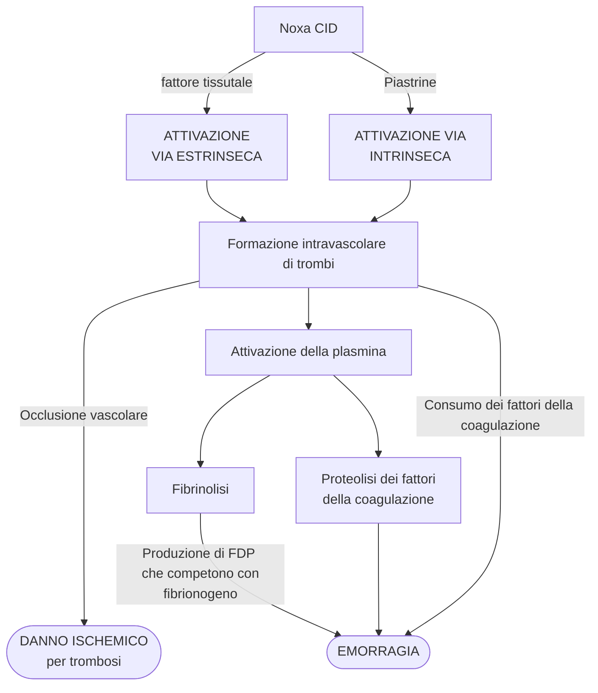
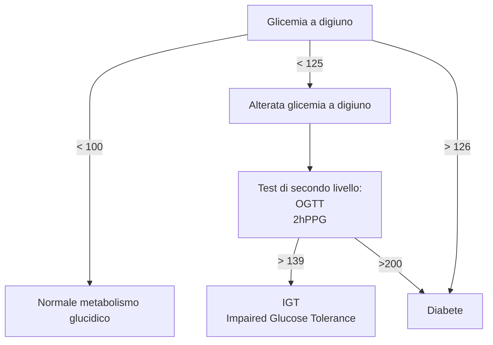

<!-- Mon  2 Nov 09:29:30 CET 2020 -->
<!-- Davide Trerè -->

\part{Medicina di laboratorio}

\footnotesize
_I vari argomenti sono stati scelti principalmente valutando in quali ambiti le _indagini di laboratorio_ svolgono un ruolo _imprescindibile_ nella clinica. Tuttavia, l'argomento di _medicina di laboratorio_ è _estremamente_ più ampio e variegato: di fatto tocca ogni ambito della clinica_
\normalsize

# Proteine sieriche e indici di flogosi
- Le proteine sieriche^[Siero = plasma privato dei fattori di coagulazione. __Se__ si facesse l'elettroforesi del plasma e non del siero si avrebbe un picco aggiuntivo (tra picchi β e γ) rappresentato  appunto dal `fibrinogeno`] sono qualitativamente limitate, ma clinicamente molto utili (e accessibili)
	- __Poche tipologie__ (2 gruppi), prodotte prevalentemente da fegato > plasmacellule > sistema monocito--macrofagico > mucosa intestinale (apolipoproteine) > proteine prodotte da ghiandole \asidefigure{img/tracciato-elettroforetico-proteine-sieriche.png}{Questa separazione delle proteine sieriche è ottenuta mediante tecniche elettroforetiche, sfruttando lo specifico rapporto massa/carica (NB: proteine sono Pr\textsuperscript{-})}
		1. Albumin\underline{a}^[Solubile in acqua] (~ 60%, 1 banda elettroforetica)
		2. Globulin\underline{e}^[Solubili in soluzioni saline diluite] (~ 55%, 4 bande elettroforetiche)
			- α--globuline (divisa in 2 gruppi, α~1~ e α~2~)
            - β--globuline
            - γ--globuline
    - Grandi informazioni cliniche a fronte di un approccio d'esame molto facile ed economico (prelievo venoso)


## Albumina
- Principale trasportatrice di sostanze insolubili in acqua (è carrier)
	- Bilirubina
	- NEFA
	- Ormoni insoluibili (TX, T3, T4, cortisolo, ADH)
	- Farmaci (salicilati, warfarin, clofibrato, fenilbutazione
	- Ca^++^ sierico (40% del Ca sierico gira legato)
- Principale determinante della pressione oncotica del plasma
	- ↓ albuminemia (_nefropatia con proteinuria, ustioni..._) ⇒ ↓ P oncotica plasmatica ⇒ alterazione di processi di riassorbimento
- Emivita: 14--20gg

## Globuline

### Globuline α
- __Gruppo α1__
	1. `AAT` (`α1-antitripsina`)
		- È anti--proteasi abbastanza^[Ha > specificità verso la `tripsina`, ma è efficace anche contro elastasi, collagenasi, chimotropsina, plasmina, trombina] aspecifica: ha obiettivo quello di controllare, inattivandone una parte, l'azione istolesiva delle proteasi
        - Tipica di fase acuta di flogosi
        - Deficit di `AAT` ⇒ enfisema polmonare ed epatopatie
            - BPCO ed enfisema a 30--40 aa, provocata da mancata inibizione di elastasi rilasciata in risposta ad agenti irritanti aerei (quadro tipico di ambienti urbani e tempi moderni, con esposizione cronica)
            - Epatopatia che può esitare in cirrosi o epatocarcinoma. Insorgenza in età ped. Ez: AAT viene prodotta, ma mutata, non venendo eliminata ⇒ accumulo nel RE di AAT ⇒ stimolo istolesivo
		- Il deficit è solitamente ereditario (autosomico recessivo). Conosciute > 75 variazioni del gene che codifica per AAT (14q32.1^[Remember _nomenclatura di Parigi_: cromosoma 14, braccio lungo, regione 3, banda 2, sottobanda 1]):
            - Variante M --- wild type. Prevalenza in omozigosi in > 90% popolazione sana
			- Variante Z --- in omozigosi porta a quadro patologico, in eterozigosi non dà sintomi (per compensazione di dose)
			- Variante S --- in omozigosi c'è comunque funzionalità discreta, clinicamente pericolosa se in eterozigosi con variante Z (⇒ enfisema in sg. particolarmente esposti (es: fumatori))
            - Variante Null --- enzima non prodotto, grande rischio clinico
	3. `α1-fetoproteina`
		- Sintetizzata da sacco vitellino e dal fegato fetale (dopo 4/o mese-16/ma settimana)
		- Alterazioni nella quantità sono associate a patologie:
			- ↑ in gravidanza: difetti tubo neurale, spina bifida, gravidanza gemellare
			- ↓ in gravidanza: sindrome di Down
			- ↑ in età adulta: epatocarcinoma
	2. `α1-glicoproteina acida` (orosomucoide)
		- _Verosimile_ ruolo in risposta immunitaria (fase acuta)
		- È inibitore del progesterone (?)
	4. `α-lipoproteine` (HDL)
- __Gruppo α2__
    1. `α2-macroglobulina`
		- Anti--proteasi decisamente aspecifica. Ha azione fondamentale (mai trovati deficit congeniti)
        - Grandissimo peso molecolare (800KD): nei casi di grave proteinuria rimane nel sangue periferico comunque
    2. `Aptoglobina` 
		- Legante di Hb libera circolante^[Cosa, questa, che è marker di eritrolisi] per evitare deplezione di Fe con urine (Hb è piccola, passerebbe) e microemoglobinuria
		- Se Hb libera da crisi emolitica > capacità di legame di aptoglobina ⇒ emoglobinuria^[Clinicamente si presenta con segno caratteristico delle "urine color coca-cola"]
		- Una variazione di aptoglobina è spia di situaizoni patologiche
			- ↓ aptoglobina ⇔ emolisi intravascolare o eritrolisi severa (+/- emoglobinuria)
			- ↑ aptoglobina ⇔ neoplasia, trauma, infiammazione
	3. `α2-antiplsmina`
		- \ini fibrinolisi da `plasmina`
	3. `ceruloplasmina`
		- Trasportatrice di Cu
	4. `Vit. D BP`
	5. Lipoproteine VLDL pre-β

### Globuline β
1. `transferrina`
	- Principale proteina deputata a trasporto di __Fe^3+^__ nel plasma, al quale è _estremamente_ affine
	- Variazioni di transferrina sono spia di patologie
		- ↑: aumento compensatorio se sideropenia (per conservare Fe), in gravidanza, in tp. estroprogestinica
		- ↓: sindrome nefrosica
2. Fattore C3 del complemento
3. `antitrombina 3`
	- \ini cascata coagulativa in risposta immunitaria innata (\ini fattore 2 (_trombina_), 9, 10, 11, 12)
4. `β2-microglobulina`
	- Catena leggera degli antigeni del MHC di tipo 1^[Complesso proteico costituito da 2 catene, di cui una è appunto la β2-microG, presente sulla membrana cellulare di _ogni cellula nucleata_. Ha il compito di legare gli antigeni e presentarli ai LFC citotossici (CD8+), funzionando di fatto come "spia" che testimonia l'infezione di una cellula nucleata da parte di un dato Ag. Di fatto, mentre MHC2 viene utilizzato per presentare tutto quello che viene trovato dal monitoraggio immunitario dell’ambiente extracellulare dalle cellule APC, MHC1 viene usato per presentare tutto quello che viene trovato dal monitoraggio immunitario che ogni cellula compie su sé stessa. In questo contesto, la microglibulina ha la funzione di stabilizzare la catena pesante.]
5. β-lipoproteine LDL

### Globuline γ
1. __Immunoglobuline__ (IgG > IgA > IgM, IgE e IgD molto poco rappresentate)
2. __Fibrinogeno__ \marginnote{Solo nel \emph{plasma}, non nel \emph{siero}!}
3. __`PCR`__ (Proteina C Reattiva)

#### `PCR`
- Ha ruolo attivo e importante nel contesto dell'infiammazione:
	- Reagisce con una grandissima varietà di polisaccaridi di membrana di molti patogeni differenti, __attivando la _via classica_ del complemento__^[Tipicamente reagisce con il polisaccaride C della parete cellulare di _S. pneumoniae_, da qui il nome]
	- È opsonina (favorisce clearance cellulare)

## Quadri clinici che comportano variazione del tracciato elettroforetico


1. Infiammazione
	- Infiammazione acuta
		- \goldstandard __↑ aptoglobina (picco α2)__
		- N/↑ AAT (picco α1)
	- Infiammazione cronica
		- ↑ _a base larga_ delle γ-globuline
2. Insufficienza epatica
	- ↓ proteine di produzione epatica (↓ albumina, ↓ α1, ↓ α2, ↓ β)
	- ↑ reale e/o relativo delle γ-glob
		- ↑ reale se epatite ad ez. settica o virale
		- ↑ relativo (calano gli altri picchi, ma non aumentano le γ) se epatite ad altra eziologia
			- Rapporto albumina:γ=1.2~1.7:1, in epatopatia impegnativa albumina:γ=0.5:1
3. Sindrome nefrosica (glomerulopatia con perdita di capacità di filtrazione)
	- ↓ albumina (⇒ albuminuria + edemi per ↓ p. oncotica sangue)
		- ⇒ ↑ relativo picco α2 (per calo picco α1)
	- ↑ picco β, principalmente VLDL (per tentativo epatico di mantenere pressione oncotica)
4. Anemie sideropeniche
	- Lieve ↑ β-glob (β1) per ↑ compensatorio della transferrina
5. Gammopatie monoclonali
	- Picco _"a base stretta"_ nella zona delle γ-glob
6. Deficit di AAT
	- ↓/scomparsa di picco di α1-globuline

## Indici di flogosi
- La flogosi non si sviluppa solo a seguito di patogeni esterni, ma a seguito di tutte le condizioni che producono lesione o stress tissutale^[Che sono il primum movens della flogosi, di fatto. I patogeni esogeni producono infatti stress/lesione, ma oltre alle infezioni bisogna ricordare reazioni immunoallergiche, ipossia/infarto, traumi, ustioni, intervernti chirurgici, neoplasie...]
- L'infiammazione si sviluppa in 2 fasi successive: fase acuta (coinvolge l'immunità innata) e fase prolungata (coinvolge l'immunità adattativa)
	1. Fase acuta (veloce, aspecifica, standardizzata
		- Eventi sistemici caratteristici (febbre, anoressia, sonnolenza, leucocitosi, ↑ ACTH, ↑ cortisolo, ↑ adrenalina)
		- Variazione di proteine sintetizzate da fegato (_"proteine della fase acuta_")
	2. Fase prolungata (onset lento, specifica vs patogeno, duratura e -- si spera -- risolutiva)

### Risposta in fase acuta
- Durante la fase acuta il fegato, stimolato da IL-6, produce ~ 30 proteine coinvolte a vario titolo (pro e anti infiammatorio, opsonine, agenti chemiotattici...) nel processo
	- Antiproteasi con azione anti-infiammatoria
		- AAT (α1-AAT)
		- α1 antichimotripsina
		- α2-macroglobulina
	- Fattori della coagulazione favorenti l'emostasi
		- Fibrinogeno (β e γ)
		- Protrombina
	- Inibitori della coagulazione
		- Antitrombina 3^[Proteasi che disattiva i fattori della coagulazione] (β)
		- Plasminogeno (β2)
	- Opsonine
		- FC3 del complemento (β2)
		- PCR
	- Scavengers dei residui (↑ clearance) e Pr con azione antiossidante
		- Aptoglobina (α2)
		- Ceruloplasmina (α2)
		- Emopressina
		- PCR
		- SAA -- proteina Serica dell'Amiloide^[Famiglia di apolipoproteine che si legano alle HDL per rimuovere il colesterolo nei tessuti danneggiati dall'infiammazione]
	- Proteine leganti metalli (prevengono perdite di Fe e lo sottraggono ai batteri)
		- Emopressina
		- Ceruloplasmina
		- Ferritina
	- Proteine con altra azione
		- α1 glicoproteina acida (carrier per steroidi)
- __Gli indici di flogosi sono parametri molto sensibili, ma poco specifici__
	- Se sono alterati, la ragione va _sempre_ cercata, perché molto molto probabilmente c'è
	- Se non sono alterati, non stiamo comunque tranquilli: potrebbe comunque esserci una patologia non manifesta

### PCR
- __↑ PCR > 10 mg/L è patognomonico__ (sensibile ma poco specifico) __di risposta flogistica di fase acuta in atto__
	- In assenza di infiammazione PCR $\simeq$ 1 mg/L (_sempre_ < 10 mg/L). Non correlazione con età o fattori individuali
	- Cala in fretta: ha emivita breve, velocità di eliminzione costante ⇒ PCR dipende _solo_ da sintesi epatica
	- Aumenta in fretta: Sintesi è rapida: ↑ dopo 6--8h da inizio, raddoppia ogni 8--9h, picco a 48h dopo inizio

### VES
- VES (Velocità di EritroSedimentazione, [mm/h]) = velocità con cui emazie del sangue reso incoagulabile sedimentano in colonna verticale
	- Fisiologicamente VES è $\propto$ massa eritrocitaria e $1/\propto$ viscosità del liquido: $$VES = \frac{2r^2(\rho_{eritrociti} - \rho_{fluido})g}{9\eta}$$^[$r$ = raggio; $\rho_{eritrociti}$ = densità degli eritrociti sospesi; $\rho_{fluido}$ = densità del fluido di sospensione; $g$ = accelerazione di gravità, $\eta$ = viscosità del fluido di sospensione]
	- Flogosi ⇒ produzione delle proteine di fase acuta ⇒ ... ⇒ aggregazione degli eritrociti favorita ⇒ ↑ VES
		- Svariate Pr^-^ (fibrinogeno, Ig) incasinano la carica superficiale degli eritrociti che, mediante _forze di Van der Waals_, tende a mantenerli separati ⇒ gli eritrociti si aggregano e formano rouleaux
		- I rouleaux sedimentano più facilmente
- I vn. dipendono da __sesso, età e conta eritrocitaria__ (tanti er. sedimentano prima)

|| VES (mm/h)|
|-|-|
|Neonato| 2 |
| M < 50 | 15 |
| F < 50 | 20, ↑ durante mestruazioni|
| M > 50 | 20 |
| F > 50 | 30 |

- Per la sua grande influenza rispetto ad altre condizioni la VES è un parametro poco standardizzabile ⇒ è indice di flogosi di seconda scelta
	- È debolmente proporzionale all'entità flogogena (= varia più approssimativamente della PCR, la correlazione con lo stimolo è molto più lasca) ⇒ non eccezionale per monitorare quantitativamente l'andamento della flogosi
	- È più lenta della PCR a modificarsi
	- Stati patologici, anche non manifesti, possono compensarne la variazione
		- Policitemia A ↑ $\eta$ (viscosità) ⇒ ↓ VES
		- $\rho_{fluido}$ dipende da tanti fattori
		- $\rho_{eritrociti}$ può variare in condizioni di anemia, anche misconosciuta

### Risposta in fase cronica

# Funzione emostatica
- __Emostasi__ --- processo che interrompe la fuoriuscita di sangue
	- Eccesso di emostasi ⇒ trombosi ⇒ ⚰️
	- Emostasi inefficace ⇒ emorragia ⇒ ⚰️
- L'emostasi è innescata dal contatto del sangue con sostanze diverse da quelle presenti sull'endotelio
- L'emostasi è un processo in 2 fasi
    1. __Emostasi primaria__ (aggregazione piastrinica, pochi secondi) --- formazione di un tappo emostatico primario e ↓ locale della pressione emostatica mediante vasocostrizione a monte
    2. __Emostasi secondaria__ (sistema della coagulazione, minuti) --- formazione i un tappo emostatico secondario grazie alla fibrina, capace di resistere ad una normale pressione emostatica

## Fasi dell'emostasi

### Emostasi primaria
0. Danno, con conseguente stravaso delle piastrine
1. Contatto delle piastrine con il connettivo sottoendoteliale
2. Contatto con connettivo ⇒ __attivazione delle piastrine__
	1. Adesione al connettivo
		- L'adesione al collagene del connettivo è mediata da recettori specifici (`Gp1a` e `Gp2a`). Contemporaneamente, il recettore `Gp1b` si lega al `vWF` (fattore di Von Willebrand, esposto dagli endoteliociti in caso di danno^[Deficit congenito di questo fattore produce la \pat{malattia di von Willebrand} (frequenza 1/1000, trasmissione autosomica dominante dovuta a mutazioni sul cromosoma 12), che rappresenta la prima coagulopatia in assoluto. Molti casi asintomatici o paucisintomatici (per penetranza incompleta)]) il quale a sua volta è legato al collagene

		{size=50%}

	2. Rimaneggiamento del citoscheletro ⇒ cambiamento di forma + produzione di pseudopodi, per facilitare l'adesione
	3. Rilascio di sostanze vasoattive dei _corpi densi_ e _granuli α_ (`ADP`, `TXA2` trombossano^[La produzione di trombossani è inibita da farmaci come l'aspirina, i quali inibiscono (più o meno selettivamente) l'enzima `cicloossigenasi` (`COX`). Fisiologicamente acido arachidonico $\xrightarrow{\texttt{COX 1}}$ Prostaglandine (mediatori infiammatori) $\xrightarrow{\texttt{COX 2}}$ trombossani (stimolatori d'aggregazione)])
		- Induzione vasocostrizione a monte
		- Agenti pro-coagulanti e \ini fibrinolisi
3. Aggregazione delle piastrine attivate grazie al `fibrinogeno`
	- ADP unisce i rececttori `Gp2b` e `Gp3a` in un unico complesso, il quale è capace di legare il `fibrinogeno`
	- Si creano i legami tra piastrine: piastrina-`gp2b`-`gp3a`-fibrinogeno-`gp2b`-`gp3a`-piastrina


#### Le piastrine
- I protagonisti dell'emostasi primaria sono le sono le __piastrine__: frammenti cellulari che derivano dalla frammentazione dei __megacariociti__^[Megacarioblasto midollare → megacariocita → piastrine] estremamente reattivi
	- Sono molto _reattive e molto veloci_, e questo consegue dalla compresenza di una particoalre membrana molto invaginata, un reticolo liscio molto attivo e un sistema citoscheletrico dinamico
		- La membrana delle piastrine non è circolare, ma invaginata centinaia di volte (__sistema canalicolare aperto__) ⇒ ↑ superficie di contatto con ambiente esterno
		- Il reticolo endoplasmatico liscio (__sistema tubulare denso__) è _subito a contatto con la membrana_ e molto attivo nello stoccare sostanze regolanti la coagulazione
		- Il citoscheletro è particolarmente dinamico ⇒ cambiamento veloce della morfologia cellulare per fare da tappo
	- Al loro interno contengono _corpi densi_ e _granuli α_^[Proteine adesive, fattori della coagulazione, inibitori della fibrinolisi, modulatori di crescita...], che contengono sostanze necessarie a regolare la coagulazione
    - 150K--400K per mm^3^

### Emostasi secondaria
- Obiettivo: __convertire il fibrinogeno in fibrina__, polimero filamentoso e insolubile che consolida il tappo emostatico primario già formato e produce il tappo emostatico secondario; più robusto, fitto e denso (quindi stabile e resistente)
- La conversione del fibrinogeno in fibrina avviene grazie al fattore __IIa__ (__`trombina`__)
- Per arrivare a produrre la trombina (forma attiva della _`protrombina`_) vi è un processo a cascata (_cascata della coagulazione_) diviso in 2 vie (le quali convergono in una porzione comune
	1. __Via intrinseca__ --- via percorsa quando il sangue si trova con una superficie diversa da quella endoteliale
	2. __Via estrinseca__ --- via percorsa sotto lo stimolo del _fattore tissutale FT_ (`tromboplastina`), presente in tutte le cellule e liberato fuori in caso di danno
- Gli attori della cascata (_fattori della coagulazione_) sono prodotti dal fegato
	- Sono tutti in bassa concentrazione nel sangue
	- Fibrinogeno è unico fattore presente in alta concentrazione

#### Cascata della coagulazione
- Evento centrale: attivazione della trombina che trasforma il fibrinogneo (già attaccato alle pareti delle piastrine) in fibrina solubile. Questa, mediante l'intervento del fattore XIII e del Ca^++^, viene stabilizzata e si forma il tappo stabile

{height=400 width=100%}

- La cascata coagulativa deve essere una bomba ben regolata: deve esplodere in fretta (tanto fibrinogeno, fast) ma solo in caso di necessità
	- ⇐ Fattori presenti in bassa concentrazione
	- ⇐ Meccanismi di auto-feedback negativo che fanno in modo che i fattori coinvolti terminalmente blocchino i fattori coinvolti preliminarmente
	- ⇐ Sistemi di inibizione naturale
		- `antitrombina 3` (azione potenziata da eparina)
		- `proteina C`^[Non confondere con PCR, proteina c _reattiva_] attivata e `proteina S` (attivata dalla `trombina`)

- La cascata coagulativa produce
	- Fibrina insolubile
	- Firinopeptidi A e B (da taglio catalitico per attivare il fibrinogeno^[Come se il fibrinogeno avesse le pile inserite separate dagli elettrodi dalla plastichina: prima dell'uso la plastichina (fibrinopeptidi) va staccata, no? Una volta staccata la plastichina abbiamo fatto la fibrina e questa si lega (operativamente perché i fibrinopeptidi A e B oscuravano precedentemente i siti di legame della fibrina)] in fibrina)

> __Doppia azione pro e anticoagulante della trombina__ ---
> La trombina ha azione sia anti che procoagulante, per garantire un equilibrio efficace nelle diverse condizioni e non solo un effetto pro-coagulante incontrollabile
>
>- fibrinogeno $\xrightarrow{\texttt{trombina}}$ fibrina solubile
>- Trombina → trombomodulina → proteina C attiva ⇒ inibizione del fattore VIII

##### Dipendenza dalla vitamina K
- Alcuni fattori della coagulazione (II, VII, IX, X) dipendono, per funzionare, dalla __vitamina K__ (_vitamina K--dipendenti_)
	- La vitamina K costituisce un substrato essenziale per uno degli enzimi che fanno modificazioni post-traduzionali^[Carbossilazione carbonio γ, operata dall'enzima `γ-glutamil-carbossilasi` in presenza di vitamina K, CO~2~, O~2~]
		- La carbossilazione laterale permette ai fattori di assumere carica negativa, permettendo il legame con il Ca^++^, il quale a sua volta -- essendo positivo -- si lega alla parete cellulare della piastrina (caratterizzata da avere fosfolipidi di membrana carichi negativamente)
- I farmaci _dicumarolici_ (es \far{warfarin}) bloccano la riduzione della vitamina K^[La vitamina K deve essere ridotta per essere usata (sia quella proveniente dalla dieta che quella "riciclata" dal ciclo della vitamina K del fegato], impedendone l'attivazione ⇒ interferiscono indirettamente con cascata coagulativa

\normalbox{Sostanze ad azione coagulante (in solo setting laboratoriale)}{
Svariate sostanze, che vengono scelte a seconda dell'esame ematochimico da fare per non creare interferenze durante l'esame stesso

\begin{itemize}
\tightlist
\item Sostanze chelanti il calcio
  \begin{itemize}
  \tightlist
  \item Citrato
  \item Ossalato
  \item EDTA (acido etildinamico tetracetico)
  \end{itemize}
\item Inibitori della trombina
  \begin{itemize}
  \tightlist
  \item Eparina
  \end{itemize}
\end{itemize}
}

##### Cascata coagulativa in vivo: modello ad una via
- La cascata di coagulazione a 2 vie (estrinseca + intrinseca) è un modello corretto in lab, ma non applicabile nella clinica
	- In vivo il fattore VII ha una rilevanza molto minore (una mancanza non produce emorragia, sebbene alteri il PT)
- Clinicamente è importante principalmente __la via estrinseca, perché l'inizio di coagulazione in vivo si ha realmente con la liberazione di `tromboplastina`__
	- Tuttavia una mancanza di fattore VII o IX produce sindrome emorragica
- Si propone un modello unico, che è __essenzialmente la via estrinseca con l'intervento dei fattori VII e IX__, ritenuto un modello clinicamente accurato
	- Notare dipendenza da fattori VII e IX
	- Notare un effetto potenziante della trombina sui fattori iniziali (feedback positivo che autosostiene l'esplosione)
	- Notare che si mantengono le medesime potenzialità di down-regolazione che si avevano nel modello a 2 vie

\ 

## Fibrinolisi
- __Fibrinolisi__ --- processo di smantellamento del tappo di fibrina insolubile, quando questo ha esaurito la sua funzione
- Il protagonista della fibrinolisi è la `plasmina`, forma attiva del proenzima `plasminogeno` che dissolve la rete di fibrina
- La cascata fibrinolitica è attivata da sostanze prodotte a seguito della riparazione cellulare: `t-PA`, fattori di contatto (`XII`, `XI`, `HMWK`, `callicreina`)

\ 

- La fibrinolisi produce
	- FDP (monomero della fibrina)
	- D-dimero (dimero di _frammenti D_ di fibrina)

## Deficit emostatici e manifestazione clinica
- Deficit emostatici si traducono in 2 quadri clinici opposti: emorragia e trombosi

### Emorragia
- Emorragia --- sanguinamento dovuto a incapacità di eseguire emostasi

#### Identificazione dei quadri clinici
- __Petecchie__ --- piccole emorragie rosso--violacee capillari _"a capocchia di spillo_" (1--2 mm)
- __Porpore__ --- emorragie con versamento > 3mm formato da confluenza di svariate petecchie
- __Ecchimosi__ --- versamenti sottocutanei di diametro 1--2 cm. Non dolorosi. Colore dipendente da stadio di metabolismo dell'Hb: rosso-blu → viola → verde-blu → giallo oro
- __Ematomi__ --- versamenti emorragici più profondi, spesso dolorosi in quanto alterano l'anatomia (possono dissecare fasci muscolari)
- __Versamenti in cavità__ --- distinti in funzione della cavità
	- Emotoace
	- Emartro
	- Emopericardio
	- Emoperitoneo
- __Sanguinamenti da distretti specifici__
	- Gengivorragia
	- Epistassi
	- Emottisi (sangue nell'espettorato)
	- Ematemesi (sangue nel vomito)
	- Melena (sangue nelle feci)
	- Ematochezia (feci _striate_ di sangue)
	- Ematuria (eritrociti nelle urine, micro o macro a seconda se sia distinguibile a occhio nudo o no)
	- Menorragia (mestruazioni abbondanti)
	- Metrorragia (emorragia uterina o vaginale che non corrisponde al flusso mestruale)
- __Pensare a patologia dell'emostasi se manifestazione emorragica è__
	- Non associata a trauma
	- Non proporzionale al trauma subito

### Trombofilia
- __Trombofilia__ (_stato ipercoagulabile_ o _stato di ipercoagulabilità_) -- abnorme e anormale tendenza a tromboembolismo arterovenoso

#### Deficit degli inibitori naturali della coagulazione
- Deficit dei naturali inibitori della cascata coagulativa: __`antitrombina 3`__, `proteina C`, `proteina S`
	 - RR = x5--x7
	 - Pz.. tipico: sg. giovane (20aa) con trombosi ricorrenti e anamnesi familiare fortemente positiva
- Condizioni autosomiche dominanti a penetranza variabile, omozigosi incompatibile con la vita
- Prevalenza < 0.5% (prevalenza < 10% nei pz. trombofilici)

#### Mutazione del gene del fattore V (mutazione di Leiden)
- Mutazione puntiforme in cromosma 1 nella regione codificante per il _fattore V_
- Fattore V mutato mantiene capacità pro-coagulazione ma non può venire legato da proteina C (la mutazione è proprio nel sito di legame)
	- Eterozigos: x5--7 RR di tromboembolia
	- Omozigosi: x80 RR di tromboembolia
- Epidemiologia: più frequente in Nord EU
	- Incidenza > 15% popolazione svedese
	- Incidenza ~ 2--3% in popolazione Ita sett, ↓ Ita centrosud
	- Incidenza in pz. affetti da tromboembolismo: 1/4

#### Mutazioni del gene della protrombina
- Mutazione puntiforme in cromosoma 11, nella regione non codificante del gene per la protrombina (la mutazione è nel promoter 3'-terminale)
- Vengono prodotti mRNA molto stabili ⇒ ↑ sintesi di protrombina (130%)
- Epidemiologia a gradiente: maggiore incidenza in sud EU, cala salendo verso nord

#### Iperomocisteinemia
- Iperomocisteinemia provoca trombosi per meccanismi ancora non chiari
	- Favorisce il rilascio di fattori tissutali ⇒ innesco per via estrinseca?
	- ↓ espressione trombomodulina?
	- \ini proteina C?
	- \att diretta di fattori V e XII?
- Causa
	- Alterazione della via metabolica che metabolizza omocisteina
	- ↓ coenzimi necessari al metabolismo omocisteina (B12, acido folico, B6)
	- Insufficienza renale
	- Condizioni favorenti: età, stile di vita sesso maschile
- Epidemiologia
	- Associata a ↑ rischio arterosclerotico
	- Incidenza in popolazione generale: 4.8%
	- Incidenza in pz. trombofilici: 10%

#### Sindrome da anticorpi antifosfolipidi
- Sindrome autoimmune (spesso associata ad altre condizioni autoimmuni) ⇒ produzione di anticorpi che bersagliano i fosfolipidi (e tutti i fattori di coagulazione sono fosfolipidi 😕)
	- Diagnosi: dosare Ab specifici prodotti
		- Anticoagulante lupico LAC
		- Anticorpi anticardiolipina aCL
		- Anticorpi anti 2β-glicoproteina 1
- Situazione paradosso: si potrebbe supporre una inabilità a percorrere la cascata coagulativa (infatti _in vitro_ si ha ↑ PT e ↑ aPTT), _ma in vivo si ha ↑↑ rischio tromboembolico!_
- Condizione _acquisita_, anamnesi familiare negativa

### CID (Coagulazione Intravascolare Disseminata)
- __CID__ (_coagulopatia da consumo_, o _sindrome da defibrinazione_) --- Situazione di estrema gravità clinica caratterizzata dalla contemporanea presenza di __emorragia diffusa e trombofilia__, a seguito di consumo di tutti i fattori della coagulazione
	- Emorragia diffusa ⇒ ↓ perfusione
	- Trombosi diffusa ⇒ infarti diffusi ⇒ ipossia



- La CID è secondaria ad una _noxa_ che attiva massivamente, ed erroneamente, la cascata coagulativa
	1. __CID da liberazione del fattore tissutale FT__
		- Danno tissutale esteso (grandi traumi, grandi ustioni, grande chirurgia, sepsi)
		- Complicanze ostetriche (distacco intempestivo di placenta, embolia di liquido amniotico...)
		- Neoplasie (necrosi ⇒ rilascio fattore tissutale)
	2. __CID da danno endoteliale diffuso__
		- Immunocomplessi bersaglianti l'endotelio (eventualità teoricamente possibile in malattie autoimmuni sistemiche)
		- Endotelite da varie cause (infettive, traumatiche, anossia, acidosi): gli endoteliociti sono molto delicati
	3. __CID da immissione in circolo di sostanze ad azione diretta che attivano i fattori della coagulazione__
		- Veleno della vipera di Russel → fattore 10
		- Pancreatite acuta ⇒ rilascio di tripsina → \att fattore X e fattore II
- Si distinguono 3 manifestazioni cliniche della CID: acuta, subacuta e cronica
	1. _CID acuta_ --- manifestazione prevalentemente emorragica, mortalità consegue a emorragia
	2. _CID subacuta_ --- predomina sindrome ischemica che colpisce _il microcircolo_ di vari distretti (cervello > cute > rene > polmone > intestino)
	3. _CID cronica_ --- solo laboratoristica e non clinica
- La diagnosi è clinica e di laboratorio
	- Eziologia/storia clinica compatibile con CID
	- ↑ aPTT e PT (testimonianza di deplezione dei fattori della coagulazione)
	- Poche piastrine (< 50K suggestivo)
	- ↑ D-dimero, ↑ FDP (testimonianza di fibrinolisi, quindi che ci sono stati trombi)
	- Poco fibrinogeno (testimonianza di trombi)

## Diagnostica di laboratorio per valutare l'emostasi
- Da richiedere
	- Per ogni pz. con problemi di coagulazione (testare emostasi primaria _ed eventualmente_ secondaria)
	- Per ogni pz. da sottoporre a intervento chirurgico (testare emostasi primaria _e_ secondaria)

### Diagnostica nei disturbi dell'emostasi primaria
- Test di primo livello
	1. Tempo di sanguinamento
	2. Conteggio delle piastrine
- Test di secondo livello (_ottenere consulto ematologico!_)
	3. Test di aggregazione piastrinica
	4. Test di adesione piastrinica

#### Tempo di sanguinamento
- Misurazione del tempo di sanguinamento (minuti) in _condizioni std_ \marginnote{Il tempo di sanguinamento è un esame grossolano che non tutti considerano valido ma può essere considerato un primo esame di partenza per capire quantomeno se il problema riguarda l'emostasi primaria o secondaria}
	- 40 mmHg di pressione venosa (mantenute con sfigmomanometro impostato e chiuso=
	- Piccola incisione (1 mm) su superficie volare (anteriore) dell'avambraccio (previentivamente sterilizzato)
	- Pulire periodicamente il braccio, per rimuovere il sangue ma _non toccare i margini della ferita_
- Tempo ottimale: __5--6 minuti__, se ≥ 10' ritenere emostasi _primaria_ insufficiente
	- N.B: questo test non ci dà nessuna indicazione in merito ad emostasi secondaria, che è un processo che non si osserva nelle prime fasi. L'arresto del flusso superficiale è imputabile _solo_ ad emostasi primaria

#### Conteggio delle piastrine
- Ottenibile con banale emocromo

|Conta piastrinica (/μl) | Relazione con tempo di sanguinamento|
|---|---|
|150K-400K (normale)|  |
|50K--100K| Tempo di sanguinamento lievemente allungato, non sintomi emorragici|
|< 50 K| Tempo d sanguniamento notevolmente allungato. Porpore cutanee dopo traumi minimi e sanguinamenti a livello mucoso in seguito a piccoli interventi|
|< 20 K | Notevole rischio di sanguinamenti spontanei intracranici ed emorragie mortali |

- La conta piastrinica permette di distinguere tra piastrinopenia vs piastrinopatia
    - Piastrinopenie: ↑ tempo di sanguinamento, ↓ conta piastrinica
    - Piastrinopatie: ↑ tempo di sanguinamento, = conta piastrinica (o comunque non ridotta)


#### Test di aggregazione piastrinica
- Plasma posto in provetta con sostanze aggreganti (es: `ADP`). Provetta posta davanti a fonte luminosa e fotometro misura intensità della luce che attraversa il campione, collegata indirettamente con la quantità di piastrine
	- Condizioni fisiologiche: piastrine si aggregano e precipitano sul fondo ⇒ ↑ limpidezza campione ⇒ ↑ intensità luce rilevata
	- Condizioni patologiche: le piastrine non aggregano e non precipitano (campione rimane torbido)
- L'aggregazione piastrinica efficace vede coinvolti 3 attori (la cui presenza e funzionalità è quindi valutata dal test)
	- Complesso recettoriale `Gp2b` - `Gp3a` (se assenti: \pat{tromboastenia di glanzmann})
	- `fibrinogeno`

#### Test di adesione piastrinica
- Plasma posto in provetta con antibiotico \far{ristocetina}, adiuvante l'adesione (pertanto dismesso dalla pratica). Provetta posta davanti a fonte luminosa e fotometro misura intensità della luce che attraversa il campione, collegata indirettamente con la quantità di piastrine
	- Condizioni fisiologiche: `ristocetina` attiva recettori per `Gp1b` per il `vWF` (fattore di Von Willebrand) ⇒ le piastrine si legano al vWF e precipitano (normalmente sarebbero capaci di aderire al collagene) ⇒ ↑ limpidezza campione ⇒ ↑ intensità di luce rilevata

### Diagnostica nei disturbi dell'emostasi secondaria
1. aPTT --- Tempo di Tromboplastina Parziale Attivata (via intrinseca + comune)
2. PT (o INR) --- Tempo di protrombina (via estrinseca + via comune)

| | | |
|:-|:-|:-:|
|aPTT ok| PT ok | Corretto funzionamento della cascata coagulativa |
|aPTT ↑| PT ok | Problema in via intrinseca: anomalie in fattori XII, XI, __IX e VIII__^[Quadro tipico di pz. emofiliaco: fattore XII non ha grande rilevanza in vivo, fattore XI è rarissimo sia deficitario ⇒ rimane deficit di fattori IX e VII, tipico dell'emofilia]|
| aPTT ok| PT ↑ | Problema in via estrinseca: anomalia nel fattore VII (anche quello con emivita più corta e K dipendente) |
| aPTT ↑| PT ↑ | Carenza dei fattori I, II, V, VIII, X (molto rara) OPPURE epatopatia con insufficienza (indicativo PT > aPTT^[Il fattore VII è quello con minore emivita ⇒ si allunga prima il PT di aPTT se fegato smette di produrlo, perché il fattore VII è il primo che muore]) OPPURE carenza di vit K^[Fattore VII è k-dipendente ⇒ si allunga prima PT poi segue aPTT] |

#### aPTT
- Valutazione di __via intrinseca__ e __via comune__ (fattori I, II, V, __VIII__, X, __IX, XI, XII__, HMWK, PK)
	0. Plasma viene _citrato_: l'aggiunta di citrato (chelante del calcio) impedisce la coagulazione
	1. Al plasma vengono aggiunti
		- Calcio → riparte coagulazione
		- Sostituti piastrinici (miscela fosfolipidica) → la coagulazione si sviluppa sulla parete piastrinca, e il plasma di piastrine non ne ha
		- Eventauli adiuvanti (es: caolino)
	2. Si cronometra il tempo dall'aggiunta dei fattori (inizio coagulazione) a quando il coagulo fibrinoso diventa visibile ad occhio nudo (coagulazione completa)
- L'aPTT non viene espressa in secondi, ma in un rapporto in funzione dell'aPTT di un sg. sano (aPTT ratio) __⇒ vn aPTT = 1__

#### PT (INR)
- Valutazione di __via estrinseca__ e __via comune__ (fattori I, II, V, __VII__, X)
	0. Plasma viene _citrato_
	1. Al plasma viene aggiunto
		- Calcio → riparte coagulazione
		- Tromboplastina tissutale (fattore tissutale che attiva via estrinseca, essendo già fosfolipidica mima sufficientemente bene la presenza di piastrine) o altro attivatore della via estrinseca
	2. Si cronometra il tempo per raggiungere coagulazione visibile a occhio nudo (tendenzialmente metà di aPTT)
- Dipende caratteristicamente dal fattore VII, che è anche quello con minore emivita tra tutti ⇒ sensibile a una diversità di quadri
	- Anomalie del fattore VII
	- Epatopatia con insufficienza (f. VII prodotto da fegato)
	- Carenza/anomalia di vit. K, anche voluta tramite farmaci (f. VII è k-dipendente -- motivo per il quale si usa l'INR per monitorare pazienti in TAO con antagonisti della vitamina K)
- PT espresso come ratio vs soggetto sano (PT ratio) ⇒ __vn PT = 1__
- Quando PTratio viene corretto secondo std internazionali in funzione di efficacia dei reagenti pro-coagulanti si parla di INR (International Normalized Ratio) $$INR = PTratio^{ISI} = \frac{PT_{paziente}}{PT_{controllo}}^{ISI}$$^[ISI = International Sensitivity Index, indice che misura la capacità di attivare la cascata di coagulazione del reagente usato]
	- INR > 1.5 per avere effetto anticoagulante efficace (INR ≤ 1 ⇒ tp. anticoagulante inefficace)
	- INR < 4 o forte rischio di emorragia spontanea

|Patologia| Range accettabile | Target terapeutico |
|-|-|-|
|Profilassi tromboembolica venosa | 1.5--2.5| 2|
|Trattamento TVP, embolia polmonare, fibrillazione atriale | 2--3|2.5|
|Valvulopatia, cardiomiopatia dilatativa | 2--3|2.5|
|IM|2--3|2.5|
|Protesi valvolare biologica | 2--3|2.5|
|Protesi valvolare meccanica|2.5--3.5|3|
|Sindrome da anticorpi antifosfolipidi |3--4|3.5|

> __Emofilia__ --- malattia genetica X-linked con eredità _recessiva_ caratterizzata da quadri emorragici. È alterato il gene che porta alla sintesi del fattore VII (_emofilia A_) del fattore IX (_emofilia B_)
>
> \
>
> I pz. con emofilia tendono ad avere sintomi emorragici, tipicamente l'emartro (se non si ha manifestazione lieve, dove emartro è tipicamente assente). C'è un rischio continuo di emorragia anche se la patologia è trattata (con trasfusioni di sangue e/o di fattori VII e IX). Ogni caduta, specialmente trauma cranico, in questi pz. merita accesso in PS per imaging. Grande rischio in interventi chirurgici e necessaria quotidiana attenzione a traumi. Il 44% dei pazienti ha un livello di gravità importante, con emorragie spontanee fin dalla prima infanzia, emartri e una media di 35 episodi emorragici all’anno (più di due al mese). Il 24% dei casi ha una forma moderata di emofilia, con sintomatologia più sfumata, e infine il 32% ha una forma lieve, in cui gli emartri sono generalmente assenti.
>
> Necessario dosare quantitativamente i fattori VIII e IX per capire se emofilia A o B, entità e capire quale fattore mancante è da trasfondere.


### Diagnostica per la valutazione della fibrinolisi
- In laboratorio si hanno essenzialmente 2 esami per valutare l'entità della fibrinolisi
	1. Dosaggio dei fibrinopeptidi A e B (segno di attivazione del fibrinogeno ⇒ marker di coagulazione in atto)
	2. Dosaggio del D-dimero (prodotto durante il taglio della fibrina ⇒ marker del fatto che c'erano trombi)
		- __> specificità__ per attività fibrinolitica

### Recap degli esami

#### Alterazione emostasi primaria

| | Conta piastrinica | tempo di sanguinamento | pt | aptt |
|-|-|-|-|-|
|Trombocitopenie| - | + | N | N |
|Trombocitopatie|   |   |   |   |
|Sindrome di Bernard-Soulier | - |+ |N|N|
|Malattia di von Willebrand|N|+|N|+|
|Sindrome di Glanzman|N|+|N|N|

#### Alterazione emostasi secondaria
| | Conta piastrinica | tempo di sanguinamento | pt | aptt |
|-|-|-|-|-|
|Emofilia A e B | N|N|N|+|
|Epatopatia|N|N|+|+|
|Deficit vit. K|N|N|+|+|
|CID|-|Variabile|+|+|

# Dislipoproteinemie
- Le lipoproteine veicolano lipidi nel sangue periferico
- La struttura è tipica
	- __Un nucleo centrale__: contiene i 3g esterificati
	- __Una superficie esterna__ a 3 componenti
		- Apolipoproteine (con ruolo strutturale e funzionale)
			- Fungono da impalcatura e tengono insieme i lipidi
			- Permetteno l'interazione dell'apolipoproteina con _appositi recettori_
			- Funzionano da coenzimi (contribuiscono all'attivazione di enzimi)
		- Fosfolipidi
		- Colesterolo non esterificato

## Classificazione delle lipoproteine
- Le apolipoproteine vengono classificate in 5 classi in funzione della densità (crescente), determinata dal rapporto lipidi/proteine

| | |Lipidi/proteine (componente prevalente)| Picco elettroforetico^[Notare che la distanza percorsa dalla semina è direttamente proporzionale alle proteine: più una apolipoproteina è ricca in Pr^-^, più si allontana dal punto di semina]|
|-|-|-|-|
|Chilomicroni||99:1 (trigliceridi esterificati)|Picco γ|
|VLDL|Very Low Density|92:8 (trigliceridi)|Picco pre-β^[Posizionato tra picco α e β]|
|IDL|Intermidiate Density|85:15 (colesterolo esterificato)|Picco pre-β|
|LDL|Low Density|80:20 (colesterolo esterificato)|Picco β|
|HDL|High Density|50:50 (Pr)| Picco α|


## Trasporto delle lipoproteine
- Didatticamente si divide il trasporto dei lipidi secondo 3 sistemi (ma nella realtà le cose non sono separate, sono un sistema unico)
	- Trasporto dei lipidi di origine esogena
		1. Forniscono trigliceridi alimentari direttamente al tessuto muscolare e adiposo
		1. Trasportano il colesterolo _alimentare_ al fegato
			- Sintesi della membrana cellulare degli epatociti (turnover)
			- Sintesi degli acidi biliari primari
			- Sintesi delle lipoproteine per il trasporto endogeno
	- Trasporto dei lipidi di origine endogena
		1. Trasportano i 3g in periferia (muscolo, adipe, tessuto ghiandolare, gonadi)
	- Trasporto inverso del colesterolo
		1. Riporta al fegato il colesterolo periferico

\ 

### Trasporto dei lipidi esogeni
1. I __chilomicroni__, con colesterolo e 3g alimentari, sono sintetizzati negli enterociti. Espongono __ApoB-48__
2. Vanno nel sangue periferico, dove acquisiscano apolipoproteine dalle HDL (__ApoC2 e ApoE__)
3. ApoC2 attiva l'enzima `lipoproteina lipasi` (__LPL__), esposto nel lato luminale degli endoteliociti del tessuto muscolare e adiposo ⇒ rilascio di quota lipidica per idrolisi dalla LPL
4. Quello che rimane del chilomicrone (_"chilomicrone remnant"_) cede ApoC2 alle HDL, non ne necessita. Migrano a livello epatico, dove vengono captati e cedono lì le rimanenze della quota lipidica (colesterolo e 3g alimentari)

### Trasporto dei lipidi endogeni
5. Il fegato è in grado sia di recuperare il colesterolo che di  neo-sintetizzarlo (grazie ad `HMG-CoA reduttasi`^[Catalizza la condensazione di Acetil-CoA]). Il colesterolo (esogeno recuperato ed endogeno sintetizzato) viene montato nelle VLDL, le quali espongono __ApoB100__. Le VLDL escono verso il circolo
6. Le VLDL assumono __ApoC2 e ApoE__ dalle HDL circolanti
7. ApoC2 attiva la LPL e cede quota lipidica alla periferia
	- Di fatto si ha un 2/o passaggio verso il tessuto muscolare e adipe

	Per perdita di quota lipidica (poco densa) aumenta la % di quota proteica ⇒ cresce la densità delle apolipoproteine (VLDL → IDL)
8. Le IDL cedono lipidi alle HDL (dalle quali ricevono in cambio colesterolo esterificato che hanno prelevato in periferia). La cessione della quota lipidica le rende LDL
	- Le LDL cedono tutte le apolipoproteine alle HDL, non necessitandone più
	- Una quota di LDL continua a cedere
9. Le LDL ritornano al fegato dove vengono ricaptate grazie al recettore per la __ApoB100__ (che hanno mantenuto per tutto il periodo

> __Recettore epatico per le LDL__ --- la quantità di recettore per LDL espressa dagli epatociti è in funzione della quantità di colesterolo epatico
>
>- Tanto colesterolo in epatocita ⇒ espressi pochi recettori ⇒ ↓ captazione LDL ⇒ ↑ colesterolemia
>- Poco colesterolo in epatocita ⇒ espressi molti recettori ⇒ ↑ captazione LDL ⇒ ↓ colesterolemia
>
>La quantità di LDL-receptor influenza quindi inversamente la colesterolemia, con obiettivo di compensare la variazione di colesterolo epatico
>
>Farmacologicamente, per calare la colesterolemia si interviene con meccanismi farmacologici per ridurre il colesterolo epatico e incentivare quindi l'espressione di LDL-receptor
>
>- _Colestiramina_ e _colestipolo_ che impediscono la ricaptazione degli acidi biliari (sintetizzati a partire da colesterolo epatico) → espulsione degli acidi biliari con le feci
>- _Statine_ che inibiscono l'HMG-CoA-sintasi, inibendo la sintesi di colesterolo endogeno

### Trasporto inverso del colesterolo
10. In circolo nascono le HDL da colalescenza di apolipoproteine e fosfolipidi. A seconda del tipo di apolipoproteina si distinguono 2 tipi di HDL
	- __ApoA2__: sintetizzata esclusivamente da fegato
	- __ApoA1__: sintetizzata da fegato o intestino

	Le HDL al momento sono prevalentemente vuote, mancano di quota lipidica (sono ancora solo impalcatura proteica)
11. Le HDL vuote (immature) prelevano il colesterolo circolante, compreso quello proveniente dalle __cellule schiumose__ (macrofagi che digeriscono il colesterolo che, una volta circolante, si è successivamente depositato nel vaso)
	- Il prelievo è reso possibile da specifico enzima LCAT (lecitina-colesterolo acil transferasi) che esterifica il colesterolo _dentro_ la HDL

	Con l'aggiunta della quota di colesterolo sono ora mature
12. La HDL viene captata a livello epatico da apposito recettore scavenger __SR-B1__
13. Le HDL, quando sono mature ma ancora in circolo, cedono colesterolo alle IDL circolanti, nell'ambito del trasporto endogeno quando IDL → LDL (8). Inoltre, cedono anche apolipoproteine secondo necessità (6 e 2) -- fungono quindi anche da serbatoio apolipoproteico, visto che ne abbondano

## Lipoproteine e malattia cardiovascolare
- La lipoproteinemia è direttamente correlata con il rischio di morte per patologie cardiovascolari o cerebrovascolari
	- ↑ 1% colesterolemia ⇒ incidenza di cardiopatia ischemica ↑ 2--3% ([studio Framingham](https://it.wikipedia.org/wiki/Framingham_Heart_Study), 1948)
- ↓ lipoproteinemia ⇒ ↓ rischio cardiovascolare (sia in sg. _con e senza_ precedenti eventi cardiovascolari)
- Studi prospettici concludono che colesterolo HDL ha valore protettivo, mentre colesterolo LDL porta ad aumento verso rischio cardiovascolare
	- Le HDL portano verso il fegato il colesterolo in eccesso
	- Le HDL hanno un ruolo antiossidante (impediscono l'ossidazione delle LDL subintimali) e riducono la capacità di richiamare monociti
	- Le HDL inibiscono l'espressione di molecole di adesione nell'endotelio

### Aterogenesi
- Aterogenesi --- genesi di placche aterosclerotiche (composte da quota lipidica, proteine e tessuto fibroso) che portano all'infiammazione, indurimento e al danneggiamento irreversibile (_sclerosi_) della parete arteriosa
	0. __Danno endoteliale__
		- Da stress meccanico ripetuto (es: ipertensione)
		- Da perdita della permeabilità o dell'elasticità dell'endotelio (età)
		- Da iperlipidemia (tante LDL possono avere esse stesse azione lesiva diretta nelv aso)
		- Da fattori di rischio (alto consumo di lipidi, fumo, solita roba)
	1. __Insudazione delle LDL__ dal lume nello spazio subintimale
	2. In questo ambiente, differente da quello vascolare, la quota lipidica viene ossidata. Questo rappresenta uno __stimolo flogistico__
	3. La flogosi richiama monociti, che dal lume entrano nell'intima. Qui si trasformano in macrofagi e inizia la reazione flogistica vera e propria
		- I macrofagi producono TNFα e IL1 ⇒ vengono espresse le molecole di adesione (E-selectine, VCAM, ICAM) ⇒ si sostiene e potenzia il processo infiammatorio richiamando altri monociti^[Il fatto che ci sia una componente infiammatoria apre la strada per farmaci anti-infiammatori, ma l'ambiente subintimale è _estremamente_ difficile da raggiungere, senza contare che la placca stessa può chiudere o impedire l'accesso]
	4. Le LDL ossidate non sono un buon pasto per i macrofagi, che nel tentativo di fagocitarle diventano __cellule schiumose__
	5. Le cellule schiumose e il continuo danno sono il punto di partenza per lo svilupparsi della placca aterosclerotica, la quale si consolida, viene infiltrata da altri attori, si ispessisce per fibrosi (come meccanismo difensivo per infiammazione protratta) e progressivamente occlude/altera il flusso (se non se ne staccano dei pezzi per _shear stress_ dovuto al flusso ematico, o se non contribuisce a dissecare il vaso allargando il danno primigenio...)

<!-- {width=50%} -->

> __Potenzialità diagnostiche verso l'aterosclerosi che considerare come caratteristico lo stimolo flogogeno ha__ -- Dal punto di vista laboratoristico stanno emergendo gli indici di flogosi come indicatori indiretti di aterosclerosi silente. La proteina C reattiva (PCR) potrebbe trovare applicazioni importanti anche in questo contesto, ma il suo grande limite è l’aspecificità. L'attenzione della ricerca si sta spostando su come rendere la PCR più specifica per i vari contesti

## Diagnostica di laboratorio per le dislipoproteinemie
- Dosare le 5 classi di lipoproteine non è cost--effective nella maggioranza dei casi, è riservato a situazioni specifiche
- Routinariamente si dosano i 3G totali, colesterolo totale, la frazione di HDL e gli altriv alori si ricavano per differenza (_assetto lipidico_)
	- VLDL + IDL = 1/5 3G totali
- La quota lipidica LDL più bassa è, meglio è (impossibile definire _valori normali_, ma solo soglie più o meno accettabili rispetto al rischio)
	- Colesterolo totale < 200 mg/dL adulto, < 180 mg/dL nel giovane
		- LDL < 130 mg/dL
		- HDL > 35 mg/dL (M), HDL > 45 mg/dL (F)
		- Colesterolo totale/HDL < 5
		- LDL/HDL < 3
	- 3G totali > 150 mg/dL, < 200 mg/dL
- L'assetto lipidico entra in una _costellazione_ di altri fattori di rischio per definire complessivamente il rischio cardiovascolare -- e come tale andrebbe ottimizzato insieme agli altri per minimizzare il rischio
	- Età, sesso, fattori genetici
	- Lipidemia, PA, comorbidità (diabete, obesità), stile di vita, alimentazione)

	Sg. con RR 4--20% vanno considerati per monitoraggio in ambito cure primarie con opportuna frequenza (6m) per valutare tempestivamente variazioni nel rischio e suggerire modifiche appropriate

# Diabete
- Diabete è quadro clinico caratterizzato, classicamente, dalla triade sintomatica di _iperglicemia_, _poliuria_ (urine frequenti) e _polidipsia_ (urine abbondanti)
- Individuiamo 2 tipologie di diabete, sulla base del contenuto zuccherino delle urine
    - \pat{diabete mellito} (>) --- ↓ attività dell'insulina, porta alla produzione di urine zuccherate
    - \pat{diabete insipido} (<) --- causato da deficit di ADH ⇒ urine insapori e particolarmente ipotoniche

\footnotesize
Vista l'estrema prevalenza del diabete mellito quando ci si riferisce generalmente al diabete ci si riferisce alla forma di diabete mellito.
\normalsize

\normalbox{ADH e diabete insipido}{
Ormone secreto dalla adenoipofisi, prodotto dal sovrastante ipotalamo (insieme all'\texttt{ossitocina}, dalla quale l'\texttt{ADH} differisce solo per un aa)

\texttt{ADH} ha come target il rene (tubulo distale e nefrone), \textbf{stimolando il riassorbimento tubulare di H\textsubscript{2}O} (perché ADH stimola il riassorbimento di Na\textsuperscript{+}). Questo spiega come mai vengono prodotte urine \emph{molto diluite} e \emph{molto ipotoniche}.

Il \emph{diabete insipido} ha 2 cause:

\begin{itemize}
\tightlist
\item \textbf{Causa neurogenica} (\textgreater) --- ADH non viene prodotto dall'ipotalamo
\item \textbf{Causa nefrogenica} (\textless) --- ADH viene prodotto, ma non ha effetto a livello periferico
\end{itemize}

DDx tramite contenuto di glucosio nelle urine per verificare il quadro di diabete insipido, seguita da dosaggio ADH per differenziare la forma neurogenica (ADH assente o ridotto) da quella nefrogenica (ADH conservato)
}

## Diabete mellito
- Fisiologicamente lo zucchero nelle urine deve essere assente, perché _carrier_ appositi recuperano tutto il contenuto di glucosio dalla preurina
- Ad elevate glicemie, la filtrazione supera la capacità di riassorbimento del carrier ⇒ glicosuria
    - Attività osmotica del glucosio ⇒ richiamo d'acqua ⇒ poliuria e polidipsia

### Epidemiologia
- Diabete è _emergenza sanitaria_ (secondo OMS) per incidenza (~ 6% in ITA, di cui solo la metà è correttamente diagnosticato) \marginnote{Circa 1 adulto ogni 16!}
- Il ridotto tasso di diagnosi dipende dal fatto che il quadro clinico insorge in maniera lenta e silente

### Eziopatogenesi
- Causa di base del diabete mellito è __iperglicemia__
- Causa dell'iperglicemia: __ridotta attività biologica dell'insulina__, _l'ormone anabolizzante e ipoglicemizzante per eccellenza_^[Domanda: come mai, se l'insulina ha effetti sul metabolismo glucidico, proteico e lipidico una sua carenza produce subito effetti principalmente in ambito del metabolismo glucidico? Perché negli altri ambiti metabolici ci sono ormoni agonisti che vicariano la funzione insulinica se questa è ridotta, mentre l'unico ormone ipoglicemizzante è l'insulina e tantissimi altri la alzano. Cortisolo, glucagone, somatostatina, adrenalina, ACTH, GH e tiroxina ↑ glicemia.]
- La causa della disfunzione insulinica è quella che distingue i 2 tipi di DM

>__Sintesi dell'insulina__ --- Tramite tagli proteolitici: preproinsulina (110aa) → proinsulina (86aa e 2 catene, catena A (21aa) e catena B (30a)) + peptide di connessione (35aa) → insulina (51aa bicatenaria (21 + 30)) e distacco dell'ex peptide di connessione che prende il nome di peptide C (31aa). Le 2 catene da 21 e 30aa sono unite da ponti disolfuro
>
> __Ruolo del peptide C__ --- non ha azione biologica in circolo, serve solamente a permettere il corretto ripiegamento della proinsulina. È tuttavia un utile indicatore diagnostico in quanto il rapporto insulina:peptide C = 1:1

#### Ruolo fisiologico dell'insulina

\begin{figure}[H]
\centering
\includegraphics{img/insulina-ruolo-periferico.png}
\end{figure}

0. ↑ glicemia stimola l'esternalizzazione dei trasportatori `GLUT`~`2`~ per il glucosio
1. Nelle cellule β-pancreatiche il glucosio viene trasportato nella cellula dove
	- Induce trascrizione di insulina
	- Induce rilasciamento dell'insulina già pre-prodotta e stoccata in vescicole, mediante la loro fusione con la membrana cellulare
2. L'insulina, a livlelo periferico, attiva cascate intracellulari mediante l'attività _tirosin--chinasica_ del recettore
    - \att trascrizione di geni
    - ↑ sintesi proteica
    - ↑ metabolismo
	- Esternelizzazione recettori (particolarmente GLUT-4, che erano preventivamente prodotti ma mantenuti interni) per glucosio ⇒ ↓ glicemia

### Classificazione
1. Diabete mellito di tipo 1 (T1DM)
2. Diabete mellito di tipo 2 (T2DM)
3. Diabete gestazionale
4. Diabete da causa nota

#### T1DM
- Diabete __derivante da grave mancanza di insulina__ a seguito da riduzione della massa globale di cellule β insulari
- Patogenesi: distruzione delle cellule β a seguito di reazione autoimmune, che determina un quadro di insulinite destruente e di produzione di autoanticorpi
    - __Insulinite__ -- cellule β si infiltrano di linfociti CD8+, CD4+, macrofagi che distruggono il parenchima
	- __Autonticorpi circolanti__ contro cellule insulari o contro insulina
- Fortemente sintomatico: _sindrome delle 3 P_ (poliuria + polidipsia + polifagia)
    - Poliuria (diuresi osmotica da glicosuria)
	- Polidipsia (sete intensa per compensare perdita della poliuria)
	- Polifagia (aumento dell'appetito, _"fame nell'abbondanza"_^[Dovuta a compensare il deficit anabolico che la disfunzione insulinica induce: la mancanza produce uno shift verso il metabolismo principalmente catabolico con atteggiamento compensatorio di polifagia per introdurre più nutrimento, compensando così la mancata produzione energetica a seguito di una impossibilitata glicolisi])
	- Progressivo calo ponderale (consumo delle riserve lipidiche per produrre energia)
	- Astenia (a riserve depauperate)
    - Chetoacidosi (da ↑ catabolismo dei lipidi per lipolisi)
		- βox continuativa porta alla produzione di un __eccesso di acetil--CoA__^[In caso di mancanza di glucidi, ACoA + acido ossalacetico entrano nel ciclo di Krebs. Il problema comincia quando si esauriscono le riserve di acido ossalacetico, che abbiamo un accumulo di ACOA] ⇒ accumulo e condensazione di ACoA in corpi chetonici (ac. aceotoacetico, β-idrossibutirrico, acetone) ⇒ acidosi metabolica
- T1DM è multifattoriale: oltre alla chiara componente autoimmune nel determinarlo c'è predisposizione genetica e ruolo ambientale
    - Predisposizione genetica avvalorata da una concordanza decisa (35--50%, in alcuni sg. fino a 70%) tra gemelli omozigoti
		- Forte _associazione_ con antigeni di istocompatibilità di classe II (HLA2), particolarmente forme alleliche DR3 e DR4
    - L'importanza da fattori ambientali è avvalorata, sebbene non perfettamente chiara, da studi che dimostrano che pz. che vivono in zone a bassa insorgenza di diabete che migrano vedono aumentare la loro incidenza di diabete. Non si sa quali siano questi fattori però
        - Infezioni batteriche?
		- Infezioni virali? (Coxsackie B, Citomegalo, EBV, Parotite ROtavirus)
        - Alimenti?
        - Tossine?

#### T2DM
- Diabete causato da una resistenza periferica all'azione dell'insulina per motivi sconosciuti
- ~ 80--90% delle forme diabetiche
- Manifestazione _tipica_: > 40aa
- Andamento a 3 fasi, con progressivo ↑ resistenza ad insulina
    1. Glicemia normale, elevati livelli di insulina
		- Già segno di resistenza periferica: per ottenere controllata glicemia sono necessari > livelli di insulina
    2. Aumento della resistenza all'insulina
		- Iperglicemia postprandiale nonostante > insulinemia
		- Tentativo di ipersecrezione compensatoria danneggia progressivamente il pancreas endocrino
    3. Riduzione della secrezione di insulina
		- Il pancreas perde capacità compensatoria per danneggiamento continuo da sforzo
		- ↓ insulinemia (sotto i valori basali per sg. sano) ⇒ iperglicemia a digiuno
- Complicanza più grave: __coma iperosmolare__
	- Iperglicemia gravissima (anche > 1000 mg/dl) ⇒ poliuria che, se non compensata con idratazione, produce  ipovolemia ⇒ ipernatremia e sangue iperosmolare ⇒ obnubilamento del sensorio fino a coma (imputabile a condizioni iperosmlari che danneggiano fisicamente il SNC)
    - Difficile trattamento, quando si manifesta il danno nervoso tende ad essere avanzato

#### Diabete di tipo 1.5 (LADA)
- Diabete autoimmune adulto a tarda insorgenza (LADA --- Latent Autoimmune Diabetes in Adults o Late-onset Autoimmune Diabetes of Adulthood)
- Medesime caratteristiche di diabete di tipo 1 ma insorge in età adulta
	- _Insulinodipendenza_ da deficit che si sviluppa in pochi mesi, ma non presenta resistenza periferica (come T1)
	- Ha genesi autoimmune, si trovano autoanticorpi (come T1)
	- Rara la chetoacidosi (come T2)
	- Insorgenza in età adulta, solitamente > 25aa (come T2)

#### Diabete gestazionale
- Iperglicemia diabetica che si sviluppa durante la gravidanza, per scomparire dopo e ripresentarsi, con sempre > probabilità, in eventuali gravidanze successive
    - ~ 7% delle gravidanze
    - 30--60% delle pazienti sviluppa T2DM nei 10--15 aa successivi a gravidanza
- Verosimilmente imputabile ad alterazioni ormonali tipiche della gravidanza
- Il feto, per via dell'__iperglicemia materna__, produce più insulina, la quale ha effetto anabolizzante ⇒ ↑ dimensioni e peso
    - Complicanze nel parto (le 7 P del Parto Precipitoso)
    - Rischio di obesità
	- Figlio ha ↑ rischio di sviluppare DM nel corso della vita
- Test di screening nella 24/ma--28/ma settimana

| Gli | Soglie di glicemia per screening (bolo 50g di glucosio) | Soglie di glicemia per diagnosi (bolo 100g di gluocisio) |
|-|-|-|
|Digiuno|-|105 mg/dl|
|1h|140 mg/dl (proseguire con test diagnostico)|190 mg/dl|
|2h|-|165 mg/dl|
|3h|-|145 mg/dl|

### Complicanze a distanza
- Complicanze in acuto sono rare in DM, perché tendenzialmente viene gestito in maniera _accettabile_ tanto da avere complicanze più croniche che acute
	- La chetoacidosi del T1 è sempre più rara in sg. complianti con tp. e capaci di self-care
	- Il coma iperosmolare del T2 è davvero raro
- Pz soggetto a complicanze che, progressivamente, ↓ qualità di vita e aspettativa -- se il DM non viene correttamente gestito
    - __Complicanze vascolari__
        - __Microangiopatia diabetica__ --- iperglicemia persistente ⇒ ispessimento della membrana basale capillare ⇒ ↓ diffusione
            - Impedimento della diffusione di O~2~ e nutrimenti ⇒ __sofferenza del parenchima__
            - __Retinopatie, neuropatie, nefropatie__, ritardo dei processi di guarigione
        - Macroangiopatia diabetica --- __aterosclerosi__ (iperglicemia incoraggia la formazione di LDL)
            - __Coronaropatie__
            - __Ictus__
            - __Vasculopatie periferiche__ (arti inferiori soprattutto)
		- Complicanze infettive
			- I batteri adorano ambienti dolci: ↑ rischio settico, ↑ UTI...
    - Necessaria gestione medica continua
        - Qualità della vita, tra medicine e visite di controllo
        - Costo sociale
        - Compliance del paziente

### Test di laboratorio

#### Test diagnostici



1. Glicemia a digiuno (8h)

| Glicemia | Diagnosi |
|-|-|
| < 100 mg/dl | Normale metbaolismo glucidico |
| < 125 mg/dl | Alterata glicemia a digiuno |
| ≥ 126 mg/dl | Diabete |

2. OGTT^[Oral Glucose Tolerance Test] -- Curva di carico glicemico se alterata glicemia a digiuno (test di approfondimento o conferma) \asidefigure{img/curva-carico-glucidico.png}{}
    - Prelievo a digiuno
    - Carico di glucosio (75g)
    - Prelievo ogni 30' per dosare glicemia
	- Studio della morfologia della curva

3. 2hPPG^[2h Post Prandial Glucose]  -- Glicemia a 2h dal pasto
    - Purtroppo solitamente OGTT è mal tollerato da pz., in quanto lungo e indaginoso ⇒ possibile sostituzione con __glicemia a 2h dal bolo__ ("_2hPPG_"^[_2--hours Post Prandial Glucose_], sempre 75g)
        - Particolarmente indicato se pz. è in zona a rischio (IGT) e/o poco compliante: meglio test meno accurato ma ripetibile per la collaborazione del pz. piuttosto che un test più accurato ma che il pz. non ripeterà mai più perché si stufa di farsi bucare per una mattinata

| Glicemia (2hPPG) | Diagnosi |
| :---:       | :---: |
| < 140 mg/dl | Normale metabolismo |
| < 200 mg/dl | Intolleranza^[Alterata capacità metabolica] al glucosio (IGT - Impaired Glucose Tolerance) |
| ≥ 200 mg/dl | Diabete franco |

##### Test occasionali

\footnotesize
Test condotti per altre ragioni che possono dare indicazioni in merito al diabete
\normalsize

- __Glicemia casuale__ tendenzialmente poco significativa, occorre fare glicemia a digiuno e, se dubbia, 2hPGG
- __Glicosuria__ --- glicosuria correlata con glicemia > 200 mg/dl. Routinario per ogni esame delle urine

#### Test per caratterizzare la patologia
- Per diagnosi di T1DM
    - Chetonemia e chetonuria
    - Ricerca di anticorpi specifici
        - Anti cellule β pancreatiche (ICA --- Islet Cell Antibodies)
        - Antininsulina (IAA --- Insulin Auto Antibodies)
        - Anti GADA^[Acido Glutammico Decarbossilasi, un enzima specifico delle cellule β-pancreatiche] (anti-GAD65)
		- Anti-tirosinfosfatasi (IA2)
        - Anti ZnT8 \marginnote{\texttt{ZnT8} è proteina di membrana presente nei granuli secretori dei granuli di insulina}
	- Tipizzazione degli antigeni HLA, [a volte c'è correlazione](#t1dm)
- Per diagnosi di T2DM
	- Insulinemia (per vedere in quale fase della storia naturale si trova il pz.)
		- Insulinemia = 0 → T1DM
		- Insulinemia aumentata → fase di compenso 1 o 2, a seconda della glicemia (normale o aumentata postprandiale)
		- Insulinemia ridotta → fase 3 con perdita di compenso
- Per diabete da causa nota
    - Diagnosi molecolare per valutare le cause genetiche

#### Test per il monitoraggio del pz. diabetico
- Glicemia (automisurazione) e glicosuria, per verificare andamento della gestione e aggisutare tp.
- Insulinemia (per valutare evoluzione clinica)
    - ⚠️ Dosare Peptide C (per valutare la produzione di insulina _endogena_ in pz. che fanno uso di insulina a scopo terapeutico)
- Dosaggio Hb glicata (HbA1c)^[ I globuli rossi hanno un grande bisogno di zuccheri: il loro metabolismo dipende dalla glicolisi anaerobia che, avendo una resa di sole 2 molecole di ATP, non è sicuramente il metodo più efficiente, tra quelli esistenti, per produrre energia. La grande dipendenza che i globuli rossi hanno per il glucosio, ha fatto sì che essi si svincolassero dal controllo dell’insulina: queste cellule assumono glucosio indipendentemente dalla quantità di insulina prodotta dal pancreas. In un paziente diabetico, il globulo rosso vive in una “condizione di abbondanza”: quantità enormi di zucchero entrano all’interno dell’eritrocita, legandosi all’emoglobina permenentemente (__glicazione__ dell'Hb)]
	- Target: < 7% di Hb totale
    - Hb ha 120 gg vita: Hb glicata ha valore per indicare l'andamento della glicemia _nell'ultimo mese/mese e mezzo_
    - Utile per valutare la compliance del pz. su lunghi periodi
    - Albumina glicata se difetti di Hb (eg anemie.) Tuttavia è indicativo dello stato glicemico per i 15--20 giorni precedenti il prelievo
- Indici di funzionalità renale (per valutare danni renali)
- Assetto lipidico (per valutare colesterolo [totale e frazionato], trigliceridi e tenere monitorate il rischio cardiovascolare)
    - A questo si deve accompagnare una valutazione globale del rischio cardiovascolare

\redbox{Target del trattamento del pz. diabetico}{

\begin{itemize}
\tightlist
\item Glicemia a digiuno \textless{} 120 mg/dl
\item HbA1c \textless{} 7\%
\end{itemize}

\footnotesize
Non tanto per evitare le complicanze \emph{tout court}, quanto per rimandarne l'insorgenza quanto più possibile
\normalsize
}

\yellowbox{Screening per il diabete}{
\begin{itemize}
\tightlist
\item
  Al momento non sono previsti, ma non sarebbe una cattiva idea
  introdurli

  \begin{itemize}
  \tightlist
  \item
    Un gran numero di pz. non è consapevole dei livelli anormali di
    glicemia per via dell'esordio silente
  \item
    Mediamente: \textasciitilde{} 10aa tra glicemia elevata e prima
    insorgenza dei sintomi

    \begin{itemize}
    \tightlist
    \item 50\% pz. T2DM presentano una complicanza (spesso vascolare) come \emph{primo segno}
      clinico del diabete!
    \end{itemize}
  \end{itemize}
\item
  Proposta: screening di glicemia a digiuno

  \begin{itemize}
  \tightlist
  \item
    Glicemia a digiuno ogni 3aa per pz. ≥ 45aa (maggioranza del diabete
    è T2DM)\footnote{Questo ridurrebbe la latenza alla diagnosi a
      mediamente 1.5 anni!}
  \item
    Soggetti a rischio: opportuno iniziare screening precoce
  \end{itemize}
\end{itemize}
}

# Equilibrio acido--base
- Il pH deve rimanere costante (7.4 ± 0.05) per 3 ragioni
	1. Gli enzimi, al di fuori di questo pH, non funzionano
	2. Le specie chimiche che agiscono da tampone non servono solo a tamponare le variazioni, ma anche ad altri processi fisiologici, e non devono esaurirsi
	3. Bisogna mantenere una quantità di cariche tale da non impattare sulla conduzione elettrica (cuore, muscoli, SNC) -- e lo ione H^+^ è, naturalmente, carico; come tutti gli altri ioni poi

## Il sistema fisiologico per compensare variazioni di pH
- Le variazioni di pH vengono compensate mediante un sistema di regolazione che prevede 3 attori

| | Tempo di attivazione | Picco di efficacia |
|-|-|-|
| Tamponi ematici | Secondi | 1--2h |
| Polmoni | Minuti | 12--24h |
| Reni | Ore | 3--4gg |

### Tamponi ematici
- I sistemi tampone sono costituiti da una coppia acido debole + base forte (>>) _oppure_ acido forte + base debole (<), per riuscire _sia_ ad accettare _che_ cedere protoni
	- Sistemi tampone chiusi (= con componenti esauribili)
		1. Sistema H-proteina/Na-proteina
		2. Sistema emoglobina ridotta/emoglobina ossigenata
		3. Sistema fosfato bisodico/fosfato monosodico
		4. Sistema fosfato monopotassico/fosfato bipotassico
	- Sistemi tampone aperti (= con componenti rigenerabili in quanto scambiabili con ambiente)
		5. __Sistema bicarbonato/acido carbonico__ (H~2~CO~3~ ↔ H^+^ + HCO~3~^-^ ↔ CO~2~ + H~2~O) $$pH = pK^{'} + \log{\frac{HCO_3^{-}}{PaCO_2}}$$
			- Le reazioni del sistema sono catalizzate dall'`anidrasi carbonica`
			- La CO~2~ viene scambiata con l'ambiente regolando la ventilazione (regolazione rapida, ma limitata 
			- L'HCO~3~^-^ viene eliminato tramite le urine
			- Perché il pH venga mantenuto a 7.4, l'eq. di Henderson--Hasselbach ci dice che [HCO~3~^-^]:[H~2~CO~3~] = 20:1
- Il sistema più efficace è quello aperto, in quanto il compenso polmonare e renale lo rendono estremamente più flessibile
	- Compenso polmonare
		- Onset rapido
		- Efficace ma non illimitato: è comunque limitato dalla capacità respiratoria individuale
	- Compenso renale
		- Onset tardivo
		- Ha molti meno limiti funzionali, in quanto ha 3 meccanismi
			1. __Riassorbimento di bicarbonato__ dal lume tubulare per riversarlo nel torrente circolatorio
				- `Anidrasi carbonica` delle cellule del tubo recupera l'acido carbonico dal versante tubulare convertendolo in H^+^ e ione bicarbonato, il quale entra nella cellula e viene trasportato nel versante ematico
			2. Generazione di bicarbonato ex-novo
				- L'acido carbonico _dentro_ le cellule tubulari viene scisso in bicarbonato e H^+^, il primo va verso il sangue, il secondo va a neutralizzare gli ioni fosfato HPO~4~^-^ presenti nella preurina
				- Questo tipo di compenso si esaurisce se si esauriscono, nella preurina, gli anioni che attraggono H^+^
			3. Escrezione di specie acide \label{escspecieacidecompensorenale}
				- Le cellule tubulari producono verso il lume ioni ammonio NH~3~
				- Gli ioni ammonio autoprodotti fungono da antecettore degli ioni H^+^ per formare NH~4~^+^ per sfruttare il meccanismo (2)


## Quadri patologici
- Acidosi/alcalosi __metaboliche__: imputate ad una variazione primitiva nella concentrazione di __bicarbonato__, e la CO~2~ varia per compenso
- Acidosi/alcalosi __respiratoria__: imputate ad una variazione primitiva nella concentrazione di __CO~2~__, e il bicarbonato varia per compenso

### Acidosi respiratoria
- Acidosi provocata da ↑ di paCO~2~ in sangue arterioso (_ipercapnia_)
- Eziologia principe: diminuzione ventilazione alveolare
- Viene compensata mediante il compenso renale che porta a ↑ bicarbonati ematici (e ad un calo nella loro escrezione)
	- Esaurite le capacità di compenso questo rapporto non è più valido!!
- Quadro laboratoristico
	- EGA
		- pH < 7.36 o normale
		- PaCO~2~ > 45 mmHg
			- __↑ 10 mmHg di paCO~2~ ⇒ ↑ 1 mEq bicarbonato__ (in acuto, ↑ 3--4 mEq in cronico)
		- Iperkaliemia (↑ H^+^ extracellulare tende a farli entrare nel compartimento cellulare; per fare ciò "spingono" all'esterno ioni K^+^, dei quali prendono il posto^[Di fatto gli ioni K^+^ vengono buttati fuori dalla cellula stessa, per evitare l'accumulo intracellulare di cationi])
	- Urine
		- pH acido
		- ↓ bicarbonati escreti
		- ↑ NH~4~Cl (vedi meccanismo 3 del compenso renale pag. \pageref{escspecieacidecompensorenale})

### Alcalosi respiratoria
- Alcalosi provocata da ↓ paCO~2~ in sangue arterioso (_ipocapnia_)
- Eziologia principe: aumento ventilazione alveolare
- Viene compensata mediante il compenso renale che porta a ↓ bicarbonati ematici (e ad un aumento della loro escrezione)
	- Esaurite le capacità di compenso questo rapporto non è più valido!!
- Quadro laboratoristico
	- EGA
		- pH > 7.44 o normale
		- PaCO~2~ < 35 mmHg
			- __↓ 10 mmHg di paCO~2~ ⇒ ↓ 2 mEq bicarbonato__ (in acuto, ↓ 5 mEq in cronico)
		- Ipokaliemia
	- Urine
		- pH alcalino
		- ↑ bicarbonati escreti
		- ↓ NH~4~Cl e altre specie acide escrete

### Acidosi metabolica
- Acidosi provocata da ↓ bicarbonati ematici
- Viene compensata in 2 modi: o iperventilando o aumentando i bicarbonati (se la funzionalità renale non è compromessa)
	- __Ridurre la paCO~2~__ tramite iperventilazione^[Notare che un pz. che iperventila può trovarsi in 2 situazioni diverse: se la causa è l'iperventilazione, allora parleremo di alcalosi respiratoria; se l'iperventilazione è una conseguenza allora vedremo un quadro di acidosi metabolica]
	- __Aumentare i bicarbonati ematici__ tramite un aumento del riassorbimento (1) e una loro produzione ex-novo (2). Questo succede solo se il rene non è esso stesso causa della perdita di bicarbonati^[Per cui, se la causa primigenia è una disfuzione renale, si avrà solo il compenso respiratorio dell'acidosi metabolica]
- Quadro laboratoristico
	- EGA
		- pH < 7.36 o normale
		- Bicarbonati diminuiti < 23 mEq/L
			- __↓ 1mEq bicarbonati ⇒ ↓ PaCO~2~ di 1.2 mmHg__^[In questo caso non distinguiamo tra condizione acuta e cronica, che vengono compensati sempre allo stesso modo, perché il polmone si attiva sempre molto velocemente]
		- Frequentemente iperK
	- Urine
		- Urine acide
		- ↓ bicarbonati escreti
		- ↑ specie acide escrete (NH~4~Cl)

### Alcalosi metabolica
- Alcalosi provocata da ↑ bicarbonati ematici
- Viene compensata in 2 modi: o ipoventilando, o aumentando l'escrezione di bicarbonati (se la funzionalità renale non è compromessa)
	- __Aumentare la paCO~2~__ riducendo la ventilazione alveolare
	- __Diminuire i bicarbonati ematici__ impedendone il riassorbimento. Questo succede solo se il rene non è esso stesso causa dell'aumento dei bicarbonati
- Quadro laboratoristico
	- EGA
		- pH > 7.44 o normale
		- Bicarbonati aumentati > 25 mEq/L
			- __↑ 1 mEq bicarbonati ⇒ ↑ PaCO~2~ di 0.5--0.7 mmHg__
		- Frequentemente ipoK
	- Urine
		- Urine alcaline
		- ↑ bicarbonati escreti
		- ↓ specie acide escrete

### Come leggere l'EGA

|EGA| V.n |
|-|-|
|PaCO~2~| 40 ± 5 mmHg |
|HCO~3~^-^| 24 ± 1 mEq/L |
| pH | 7.4 ± 0.05 |

```{.mermaid}
flowchart TB
	pH[Valuto pH] -->|< 7.35| Acidosi[Situazione di \nACIDOSI]
	pH -->|> 7.45| Alcalosi[Situazione di \nALCALOSI]
	Acidosi -->|PaCo2 > | Respiratoria[Eziologia\n RESPIRATORIA]
	Acidosi -->| PaCo2 < | Metabolica[Eziologia \n METABOLICA]
	Alcalosi -->|PaCo2 < | Respiratoria
	Alcalosi -->|PaCo2 > | Metabolica
	Respiratoria --> compenso[[Calcolo il compenso teorico della specie opposta\n Compenso OK?]]
	Metabolica -->compenso
	compenso -->|Sì| semplice[Disturbo semplice \n ad eziologia unica]
	compenso -->|No| complesso[Disturbo complesso \n ad eziologia mista]
````

- Pro Tips:
	- Guardare sempre i dati _misurati_ (pH e PaCO~2~)
	- Se hai fretta: guarda le freccine!
		- Frecce concordi ⇔ alterazione metabolica
		- Frecce discordi ⇔ alterazione respiratoria
	- Il compenso va calcolato sempre!! Bisogna capire se il quadro che vediamo è completo o c'è sotto dell'altro -- anche perché, leggendo l'EGA in questo modo ci sarà sempre un _bias_ verso la diagnosi di una forma respiratoria
	- In acidosi metabolica calcolare sempre Anion Gap, per vedere se l'acidosi è imputabile ad una perdita di bicabronati (problema renale, anion gap conservato, ipercloremia compensatoria) o ad una introduzione/produzione di acidi compensati dai bicarbonati (problema non renale, anion gap ridotto, normocloremia, ipobicarbonatemia compensatoria)^[[https://youtu.be/FA3NmUJ7Wys](https://youtu.be/FA3NmUJ7Wys)]

| Disordine | Alterazione primaria | Risposta compensatoria attesa in acuto (in cronico) |
|-|-|-|
|Acidosi respiratoria | ↑ PaCo2 | +1 (+3--5) mEq/L dei bicarbonati per ogni +10 mmHg di Co2|
|Alcalosi respiratoria | ↓ PaCO2 | -2 (-5) mEq/L dei bicarbonati per ogni -10 mmHg |
|Acidosi metabolica | ↓ bicarbonati | -1.2 mmHg di Co2 per ogni -1 mEq/L dei bicarbonati |
|Alcalosi metabolica | ↑ bicarbonati | + 0.7 mmHg di Co2 per ogni +1 mEq/L dei bicarbonati |

# Studio della funzione epatica
<!-- Mon 23 Nov 09:22:31 CET 2020 -->
- Fegato è teatro della maggior parte delle reazioni metaboliche dell'organismo
	- Metabolismo glucidico, proteico e lipidico (ana + cata)
	- Regolazione dell'assetto lipidico
	- Metabolismo ed escrezione della bilirubina e acidi biliari
	- Detossificazione delle sostanze
	- Sintesi dell'urea
	- Deposito per vitamine e oligoelementi
- Occorre razionalizzare la scelta dei parametri da osservare (per costo e dispersione della diagnosi) ⇒ selezione di un pool di __esami di primo livello__ per individuare, indagare o seguire una accertata/sospetta epatopatia \marginnote{Indici di funzionalità epatica}
    1. Bilirubina totale e frazionata
    2. Enzimi epatici
		- Indicatori di danno epatocellulare (transaminasi)
		- Enzimi sierici indicatori di colestasi
    3. Proteine sieriche
    4. Fattori della coagulazione

## Bilirubina

### Metabolismo fisiologico della bilirubina


0. Eritrocita invecchia, sclerotizzandosi (= perdendo elasticità della membrana)
1. ≥ 120gg l'eritrocita viene riconosiuto dal __sistema reticolo--endoteliale__^[Sistema composto da svariati citotipi immunologicamente attivi -- circolanti e non (monociti, macrofagi, cellule di kupfer, microglia ecc...) -- particolarmente rappresentati nell'ambito dei vasi splenici] e fagocitato
2. L'Hb viene metabolizzata all'interno dei fagociti del SRE
	- L'`eme` viene staccato dalla `globina`
	- Il gruppo `eme` viene aperto e viene metabolizzato in `biliverdina`
	- `biliverdina` $\xrightarrow{\texttt{biliverdina reduttasi}}$ `bilirubina`
3. La bilirubina (liposolubile) __viene legata all'albumina__
4. Legata all'albumina viene immessa nel circolo e arriva all'epatocita, dove viene sequestrata e ne viene impedita la re-immissione in circolo tramite coniugazione della bilirubina con `proteina Z` e `ligandina` (proteine di origine extracellulare)
5.Una volta definitivamente intrappolata nell'epatocita viene di-__coniugata con acido glucuronico__ ⇒ diventa __idrosolubile__ (quindi _finalmente_ eliminabile)
7. Viene escreta dal polo biliare degli epatociti e trasportata, da trasportatori specifici (proteina carrier `MRP2`^[MultiDrug Resistance Associated Protein #2]), alle vie biliari dove verrà scaricata nell'intestino
8. Nell'intestino viene de-coniugata dai carrier
9. I batteri anaerobi intestinali la riducono, trasformandola in `urobilinogeno`
10. Ulteriormente ossdidata e trasformata per diventare `stercobilina` ⇒ eliminata con le feci (scure per la presenza di bilirubina)
    - Feci ipocoliche/acoliche: meno colorate
    - Feci normocolorate: scure da giusto apporto di bilinogeni fecali
11. Una parte dell'urobilinogeno non viene escreta, ma riassorbita (per la normale funzione intestinale) e ritorna indietro
	- Una parte ritorna al fegato, dove viene assorbita e ri-metabolizzata per l'escrezione
	- Una parte viene eliminata direttamente dal rene (le urine sono gialle proprio per la presenza di urobilinogeno)


### Bilirubinemia
- Bilirubinemia --- concentrazione ematica della bilirubinemia
    - Bilirubina diretta (_coniugata_ con ac. glucuronico ⇒ idrosolubile)
	- Bilirubina indiretta^[La denominazione diretta vs indiretta non origina da un significato fisiologico, sebbene rispetti la divisione coniugata e solubile vs non coniugata e insolubile, ma laboratoristico. La ragione è che la bilirubina solubile reagisce _direttamente_ con il reagente usato in laboratorio per misurarla; la bilirubina insolubile reagisce con il reagente solo se prima è aggiunto un reagente che la solubilizza (reagisce quindi _indirettamente_)]  (_non coniugata_ ⇒ non idrosolubile)
    - Bilirubina totale o _"frazionata"_ (diretta + indiretta)
- La maggioranza della bilirubina ematica è _indiretta_: la diretta, essendo idrosolubile, viene efficacemente eliminata

|Misurazione|__mg/dl__| μmol/L|
|---|---|
| Bilirubinemia totale | 0,1--1 mg/dl | 1,7--17 μmol/L |
| Bilirubina diretta | 0--0,2 mg/dl | 0--3,4 μmol/L |
| Bilirubinemia indiretta | 0.1--0.8 mg/dl| 0--13-6 μmol/L|

### Ittero
- Iperbilirubinemia ⇒ bilirubinemia totale > 1 mg/dl. Se bilirubinemia ≥ 2--2,5) mg/dl ⇒ \pat{ittero}
- Sulla base della forma di bilirubina più abbondante individuiamo 2 sotto-tipi
	- __Ittero da iperbilirubinemia prevalentemente indiretta__ (80--85% di bilirubina sierica è in forma non coniugata)
		- 🧠 _Sono, di fatto, gli itteri che derivano da un accumulo nella fase pre-epatica del metabolismo, perché la bilirubina diventa solubile dopo il passaggio epatico_
	- __Ittero da iperbilirubinemia diretta__ (> 50% bilirubina sierica è coniugata)
		- 🧠 _Sono, di fatto, gli itteri che derivano da una difficoltà nello smaltimento post-epatico_

#### Itteri da iperbilirubinemia prevalentemente indiretta
- Ittero da accumulo di bilirubina non idrosolubile (non coniugata, __indiretta__)
- Siccome la bilirubina diventa solubile _dopo_ essere passata dall'epatocita, l'eziologia dell'ittero da iperbil. indiretta è _prima_ del fegato
	1. Iperproduzione di bilirubina
	2. Difetti della captazione epatica della bilirubina
	3. Ridotta o assente attività della _glucuronil-transferasi_

> __Bilirubina urinaria nelle forme di iperbilirubinemia indiretta__ --- È importante considerare che nelle urine si ha un aumento di urobilinogeno ma una assenza di bilirubina, perché la bilirubina indiretta non riesce ad attraversare il filtro glomerulare, in quanto legata all’albumina (hanno un peso molecolare troppo altro per superare il filtraggio).
__Quindi, nelle forme di ittero causare da iperbilirubinemia indiretta, non rileveremo mai tracce di bilirubina nelle urine, cosa che accade nel caso della iperbilirubinemia diretta__, quando cioè la molecola è coniugata con acido glucuronico e idrosolubile e riesce ad attraversare il glomerulo.


##### Itteri da iperproduzione di bilirubina (ittero _pre-epatico_)
- Per aumentata emolisi (↓ vita media degli eritrociti per patologia ematologica)
    - Sferocitosi ereditaria
    - Anemia falciforme
	- Deficit da G6PD^[G6PD è enzima che è coinvolto nella produzione di NADH. Il NADH, a sua volta, è coinvolto nell'unica reazione di detossificazione dei perossidi che ha luogo negli eritrociti (quella operata da `glutatione`, GSH) ⇒ __↓ G6PD comporta inabilità di detossificare i perossidi ed espone gli eritrociti al danno ossidativo__]
- Per eritropoiesi inefficace ⇒ ↑ eritroblastolisi^[Distuzione degli eritrocicti per anomalie nella loro genesi]
    - Anemie (talassemia major, anemie francamente megaloblastiche)
    - ...
- Degradazione dell'eme in grandi raccolte extravascolari (raro)
	- Infarti tissutali
	- Emorragie interne
	- Degradazione di ematomi di dimensione estese

##### Itteri da difetti del sistema di captazione epatica
- Estremamente rari, non trattati


##### Itteri da ridotta o assente attività della `glucuronil-transferasi`

###### Ittero fisiologico del neonato
- ~ 5-7 gg dopo la nascita il 97% dei nati a termine ha un aumento della bilirubinemia ⇒ ittero
- Eziologia
    - Nella vita intrauterina la bilirubina fetale viene eliminata dalla placenta ⇒ attività glucuroniltranserasica ↓↓, in quanto non necessaria
    - Alla nascita la bilirubinemia aumenta finchè non aumenta di pari passo l'attività della `glucuroniltransferasi` (~ 7gg)
- Ittero fisiologico __sse bilirubina ≤ 20 mg/dl__, altrimenti (a causa della BEE immatura) precipita in aree cerebrali particolarmente lipofile (principalmente, ma non solo, i \a{nuclei encefalici della base} ⇒ danni irreversibili al neonato
- Tp.
	- Con farmaci induttoi della glucuronil transferasi (\far{fenobarbital} --- meh, non proprio il top nel nenoato)
	- Con __fototerapia__: illuminando il neonato con luce bianca o azzurra, tramite _fotoisomerizzazione_ la bilirubina indiretta viene convertita nella forma diretta

###### Sindrome di Gilbert
- Patologia autosomica recessiva relativamente frequente (8% popolazione) nella quale c'è una mutazione del gene UGT1, che codifica per la `glucuronil transferasi`
    - Incidenza: 8%, > per sesso maschile
    - Eziologia alternativa: deficit di `ligandina`
- Patologia cronica benigna
- Sintomi
    - Bilirubinemia lievemente ↑
    - Tendenzialmente subittero, ittero franco solo in condizioni di accentuato stress

###### Sindrome di Crigler-Najjar
- Patologia genetica rara che porta a deficit completi/molto marcati della `glucuronil transferasi`
    - Di tipo 1 --- completo deficit
        - Bilirubinemia: 20--50 mg/dl
    - Di tipo 2 --- deficit severo
        - Bilirubinemia: 6--20 mg/dl
- Terapia essenziale per evitare encefalopatia
	- \far{fenobarbital} (induttore della `g-trasnferasi`
	- Fototerapia
	- Trapianto di fegato in forme tipo 1

#### Ittero da iperbilirubinemia prevalentemente diretta
- Ittero da accumulo di bilirubinemia solubile (di-coniugata con ac. glucuronico, __diretta__)
- Siccome la bilirubina diventa solubile grazie al passaggio epatico, l'eziologia della iperbilirub. diretta è da ricercarsi o nel passaggio epatico o in quello che succede dopo
	1. Difetti ereditari della funzione escretoria epatica
	2. Itteri da epatopatia e danno degli epatociti
	3.(Sub)ostruzione delle vie biliari

##### Ittero da difetti ereditari nella funzione escretoria
- Condizioni rare, ereditarie, si manifestano dalla nascita e spesso gli accumuli di bilirubina sono modesti (= condizioni non particolarmente gravi)
	- Sindrome di Dubin--Johnson
		- Deficit di __MRP2__ che pora ad accumulo negli epatociti di bilirubina. Morfologicamente: deposito nerastro all'interno degli epatociti
	- Sindrome di Rotor
		- Autosomica recessiva, ha quadri più gravi, patogenesi non nota ma si hanno depositi intraepatocitari di bilirubina

##### Itteri epatocellulari

\ 

- Epatopatie acquisite (per tossine o infezioni da microorganismi) ⇒ danneggiamento del parenchima epatico ⇒ bilirubina diretta rilasciata in circolo
	- Danno al parenchima ⇒ distruzione degli epatociti con rilascio del loro contenuto
	- Danno al parenchima ⇒ non completa distruzione degli epatociti, ma perdita della polarità (polo vascolare vs polo biliare) e rilascio di quello che normalmente dovrebbe andare nel polo bilare verso il polo vascolare -- tra cui la bilirubina diretta
	- Danno al parenchima ⇒ non captazione della bilirubina indiretta
- SeS (intensità proporzionale al grado di danno degli epatociti)
    - Feci acoliche
	- Bilirubina diretta nelle urine (urine ipercromiche, _"color coca cola"_)
	- ↑ Urobilinogeno nelle urine (viene prodotto per via di quella poca bilirubina che raggiunge l'intestino, ma non viene più ricaptato causa danno epatico)
	- ↑ Bilirubina totale (↑ diretta, ↑ indiretta)
	- _SeS e Lab suggestivi per epatopatia_ (↑ ALT; ↑ AST)

##### Ittero ostruttivo

\ 

- Ittero dovuto ad ostruzione (ma più spesso sub ostruzione) delle vie biliari ⇒ ↑ pressione vie biliari ⇒ retrodiffusione della bilirubina
    - Neoplasia delle vie biliari
    - Stenosi cicatriziale post-infiammatoria
	- __Calcolosi elle vie biliari__ (>)
    - Tumore della papilla
    - Tumori compressivi esterni (es: testa del pancreas)
- SeS se ostruzione completa è patognomonico
	- Feci acoliche
	- Bilirubina diretta molto abbondante nelle urine
	- Urobilinogeno urinario assente (per impedito passaggio intestinale)
	- ↑ bilirubina totale
	- Laboratorio suggestivo di ostruzione: ↑ ALP, γ-GT
- SeS se subostruzione molto simile a quadro di ittero epatocellulare: occorre differenziarli con altri marker di danno epatico (↑ ALP in ostruzione)
	- Feci ipocoliche se subostruzione
	- Urobilinogeno presente se subostruzione
	- Bilirubina diretta nelle urine
	- ↑ bilirubinemia totale
	- SeS e Lab suggestivo per ostruzione (↑ ALP)

## Enzimi epatici
- __Gli enzimi__ specifici degli epatociti __sono macromolecole che fisiologicamente si trovano, e si devono trovare, all'interno della cellula ⇒ titolare enzimi in circolo è _indice sensibile e specifico_ di danno agli epatociti__

> __Enzimi intracellulari e neoplasie__ --- Fisiologicamente, gli enzimi intracellulari nel sangue periferico non devono esserci. Produrre enzimi è energeticamente molto dispendioso, e la loro funzione è essenziale: _"le cellule custodiscono gelosamente i propri enzimi"_. Oltre a situazioni di necrosi cellulare, l'unico altro momento in cui è comprensibile ritrovare enzimi in circolo è la divisione cellulare: quando una cellula si divide c’è un momento in cui il citoplasma, prima che le due cellule figlie richiudano la propria membrana, può liberare in circolo enzimi. Questa è una condizione che può verificarsi nelle neoplasie: c’è una proliferazione incontrollata e la stessa divisione cellulare può liberare in circolo una notevole quantità di enzimi (inoltre, nella neoplasia c’è anche necrosi dovuta all'apporto ematico non adeguato)

### Transaminasi
- Le `transaminasi` (o _`aminotransferasi`_) sono enzimi specifici degli epatociti coinvolti nel __trasporto di un gruppo amminico__ da un amminoacido ad un chetoacido
	1. `AST` o `GOT` (ASpartato aminoTransferasi o Transaminasi Glutamico--Ossalacetica Sierica)
	2. `ALT` o `GPT` (ALanina aminoTransferasi o Transaminasi Glutamico--Piruvica)

__Si valutano insieme__ perché mentre le __AST sono enzimi spiccatamente epatospeicifici__, le ALT non lo sono
	- Le AST sono specifiche per danno epatocitario
	- Le ALT aumentano la sensibilità della valutazione, pur essendo meno epatospecifiche

### Enzimi sierici indicatori di colestasi
- 2 enzimi epatici sono indicatori di __colestasi__ se sono titolati nel siero
	1. __ALP__ (fosfatasi alcalina)
	2. __γ-GT__ (γ-glutammil-transpeptidasi)
- _Isoforma^[4 isoforme totali: epatica, ossea, intestinale, placentale] epatica_ di ALP è specifica per danno da colestasi, γ-GT meno

> __γ-GT__ --- enzimi associati a
>
>- Epatite alcolica (alcolismo cronico induce enzimaticamente espressione di γ-GT)
>- Danno epatocellulare
>- Malattia epatica
>- Danno da colestasi
>- Obesità, diabete
>- Malattie pancreatiche
>- Malattie cardiache
>- Malattie renali
>- Malattie polmonari


> __DDx tra ittero epatocellulare, ittero ostruttivo e ittero subostruttivo__ --- Gli indicatori di colestasi permettono di distinguere un quadro di ittero epatocellulare (↑ AST, ALT) da un quadro di ittero subostruttivo (↑ ALP, γGT). La sola bilirubinemia totale non è efficace (elevata in entrambi i casi) e nemmeno la presenza di urobilinogeno (presente sia in caso di ittero epatocellulare che in caso di subostruzione biliare; assente in caso di ostruzione completa)

## Proteine sieriche
- La maggior parte delle proteine sieriche è prodotta dal fegato ⇒ titolarle (tramite [elettroforesi sierica](#proteine-sieriche-e-indici-di-flogosi)) permette di avere una sintesi dello stato funzionale del parenchima epatico
	- Normale rapporto albumina/globuline $$\frac{\text{Alb}}{\text{Glob}} = 1.2--1.7$$

\ 


| | Albumina | α | β | γ | alb/glob |
|-|-|-|-|-|
|Cirrosi | ↓ | ↓ 1, ↓ 2 | ↓ | ↑ se eziologia virale (Ig)| ↓ fino a 0.5 |

- In cirrosi l'aumento delle γglob è sia assoluto che relativo: occorre quindi valutare il rapporto albumina/globuline
	- Relativo perché calano le α, β e albumina causa danno epatico
	- Assoluto perché le Ig sono γglob
		- In caso di cirrosi epatica abbiamo ↑↑ IgA ⇒ picco γ copre il picco β

## Fattori della coagulazione
- La grande maggioranza di fattori che sono coinvolti nella cascata della coagulazione sono prodotti dal fegato
- __Epatopatia ⇒ ↓ capacità funzionale del parenchima ⇒ ↓ capacità produttiva dei fattori della coagulazione__ (fibrinogeno in primis) ⇒ __↑ tempi di coagulazione__
	- Fattore VII è quello con < emivita ⇒ PT si modifica prima di aPTT ⇒ __PT è indicatore di funzionalità epatica più sensibile di aPTT__, ma aPTT è da valutare perché una doppia alterazione è più sensibile di danno epatico (anche se non abbastanza da escludere, da sola, una coagulopatia)

# Studio della funzione renale
- Esame a basso costo, di facile esecuzione e di amplissimo spettro diagnostico (non certamente solo indicativo della funzinalità renale)
- 4 categorie di esami
    1. Esame delle urine
	2. Azotemia^[Concentrazione ematica di prodotti azotati non proteici]
    3. Clearance renale
    4. Prove funzionali

## Esame delle urine
- Caratteristiche fisiche
    1. Colore --- giallo/giallo paglierino
	2. Aspetto --- Limpido vs torbido
		- Limpido (ok)
		- Torbido (meh: infezione? Depositi? Sospensione?)
		- \>\> 2000: poliuria
	3. Volume prodotto (vn: 1300 ± 500 mL) ---  giorno/notte = 2/1. __Almeno 500 ml/giorno__ per eliminare i metaboliti e garantire la funzione renale
        - Oliguria se < 500 ml/giorno
        - Anuria se arresto completo dell'eliminazione di urina
        - Poliuria se >> 2000 ml/giorno
	4. Peso specifico^[Peso specifico = $\frac{\text{peso in grammi}}{\text{peso uguale volume in acqua distillata}}$] (vn: 1,014--1,026) --- grossolano indicatore della capacità di diluizione tubulare
		- Ipostenuria: urine meno concentrate
		- Iperstenuria: urine troppo concentrate


- Caratteristiche chimiche
	1. pH (vn: 6 ± 0.5)
		- ↓ se acidosi, ↑ se alcalosi ⇒ utilissimo indicatore per inquadrare precocemente quadri di questo tipo (variazioni fisiologiche tra 4.5--8 in funzione di equilibrio acido--base)
        - Possibile variazione del pH a seguito della dieta
    2. Glucosio (vn: assente/tracce)
		- Presente se iperglicemia costantemente > 200 mg/dL
    5. Corpi chetonici
        - Molecole prodotte dal catabolismo dei lipidi, indicativo di stati in cui viene preferita la via lipidica per produrre energia (`acido β-idrossibutirrico` > `acido acetacetico` > `acetone`)
        - La presenza è caratteristica di digiuno prolungato/ DM scompensato (T1 soprattutto)
    3. Proteine (vn: assente/tracce)
        - __Indicatore franco della funzionalità renale__
		- Normalmente le proteine sono __presenti in tracce__^[Solo quelle piccole passano il filtro glomerulare, una buona perte di queste poi viene riassorbita e quindi se ne devono trovare davvero poche] (max 150 mg/1800 ml giornalieri). __Proteinuria__ ⇒ __alterazione glomerulare O diminuita capacità di riassorbimento tubulare__. Le situazioni si discriminano con elettroforesi proteine urinarie e valutazione del loro peso molecolare
            - Problemi glomerulari ⇒ riscontro di proteine ad alto PM (il glomerulo lascia passare troppo)
            - Problemi di riassorbimento tubulare ⇒ riscontro proteine a basso PM (il tubulo riassorbe solo la roba più grande)
            - Problemi misti ⇒ riscontro di proteine ad alto e basso PM
			- Proteinuria da overflow ⇒ riscontro di proteinuria con proteine che hanno _PM specifico_ causata da sovraproduzione di quelle stesse proteine nel sangue (quindi è una situazione patologica, ma non conseguente a nefropatia)
				- Proteinuria di Bence Jones (PM tra 25.000 e 40.000) da plasmocitoma: sproporzione tra la produzione di catene pesanti e catene leggere, con accumulo di queste ultime nelle urine;
				- Overflow di mioglobina (PM 17.000)
				- Overflow di emoglobina (PM 64.000)
				- Overflow di lisozima (PM 14.500),
				- Overflow di α1-antitripsina (PM 45.000)
				- Overflow di α1-glicoproteina acida (PM 44.000).
        - Si distinguono 3 gravità di proteinuria
            - Poteinuria lieve (< 1g/die)
            - Proteinuria moderata (1--3 g/die)
            - Proteinuria grave (> 3g/die)
    4. Hb (VR: assente)
        - Normalmente non presente, anche perché in caso di emolisi viene captata dall'`aptoglobina` ⇒ emoglobinuria è indice di crisi emolitica importante, che ha superato le capacità di tamponamento dell'aptoglobina (SE contemporaneamente assenti eritrociti)
        - Se gli eritrociti sono presenti possiamo tranquillamente supporre che la presenza di Hb sia secondaria all'ematuria^[osmolarità urine è differente da quella del sangue, per cui gli eritrociti eventualmente presenti possono lisarsi])
    6. Bilirubina
		- Normalmente assente
		- Se presente indice di funzione epatica danneggiata. Se presente deve per forza essere diretta ⇒ alterazioni nella fase peri/postepatica del metabolismo della bilirubina
    7. Urobilinogeno
		- Normalmente presente
		- Se in quantità anormale: sospettare alterazione della funzione epatica
    8. Nitriti
		- Normalmente assenti
		- Se presenti: derivano da metabolismo batterico ⇒ indicatore _specifico ma non sensibile_ della presenza di batteri
- Esame microscopico del sedimento
    - Normalmente presenti
        - Sostanze minerali (eventualmente cristalli) --- no utilità/rilevanza diagnostica (né per patologia, né per valutazione del rischio -- se non in pz. con già confermata litiasi per definire la composizione dei calcoli stessi)
        - _isolate/rare_ cellule (dal tubulo, dall'epitelio di transizione, epiteliali squamose...)
    - Reperti patologici
        - Cilindri --- cilindri di materiale vario, formatisi "a stampo" a seguito della permanenza/pH/concentrazione delle urine nel lume del tubulo. Se abbondanti, sono indicativi di glomerulopatie
            - Amorfi (composizione proteica)
            - Cilindroidi (muco)
            - Cilindri cellulari (a composizione cellulare epiteliale, ematica, leucocitaria)
        - Muco --- non necessariamente patologico, ma è prodotto dalle cellule epiteliali della mucosa a seguito di stimolo irritativo. Se precipita nei tubulo costituisce _cilindroidi_
		- Eritrociti --- ritrovamento problematico, che non va assolutamente sottovalutato anche se di entità modestissima^[Sole condizioni "parafisiologiche": periodo mestruale o traumi da cateterismo vescicale]. Va _sempre_ indagata con scrupolo e attenzione, sopratutto se persistente. Un pz. con causa non definita non andrebbe dimesso fino ad accertamento (e  se possibile trattamento) dei motivi dell'ematuria. \marginnote{Ci interessa la presenza o meno di eritrociti. Una ulteriore classificazione (micro/macro) non è indicativa di una situazione meno o più patologica}
			- Ematuria microscopica (non visibile ad occhio nudo)
			- Ematuria macroscopica (visibile ad occhio nudo e caratterizza urine rosse ["a lavatura di carne"] o marroni [color "coca cola" o color "tè carico"])
		
        - Leucociti (leucocituria ⇒ _piuria_) --- urine di aspetto torbido
			- Normalmente assenti o molto rari
		- Batteri/parassiti --- urine di aspetto torbido. Patologica se > 10^5^ unità/mL. Se presenza patologica, è necessario fare indagini microbiologiche (urinocoltura) per valutare _tipo_ e _ab-resistenza_

## Azotemia
- Si valuta la concentrazione ematica di 3 composti azotati non proteici che __fisiologicamente devono essere eliminati dal rene__ in quanto tossici oppure inutili ⇒ se si riscontrano tutti e 3 nel sangue periferico vuol dire che il rene sta lavorando poco/male
    1. Urea (o, alternativamente BUN^[__BUN__ = Blod Urea Nitrogen: è la concentrazione delle sole molecole di azoto uremiche. Operativamente: si guarda uremia, e siccome urea (PM = 60) ha 2 atomi di azoto (PM = 14) si fa il rapporto $\frac{uremia}{60/2*14} = \frac{uremia}{2.14}$])
    2. Creatinina
    3. Acido urico
- __Un aumento di solo una sostanza non è indicativa__, perché ciascuno dei 3 può variare per cause indipendenti dal rene. Un aumento __di tutti e 3 gli indici__ è una valutazione _molto più specifica di una calo della funzionalità renale_ (IR)
    - Urea: può ↑ in dieta iperproteica, perché deriva dal catabolismo degli amminoacidi
    - Creatinina: $\propto$ massa muscolare, essendo esclusivamente endogena e prodotta dal fegato come substrato specifico ad uso del muscolo scheletrico
    - Acido urico: ↑ in alcuni quadri patologici (es \pat{gotta})

## Clearance renale
- Esame più sensibile (ma più complicato e indaginoso) dell'azotemia per valutare l'efficacia della funzionalità renale
	- Clearance ridotte sono indici ben più sensibili di danno renale rispetto a creatininemia aumentata, che si alza tardivametne
	- La creatininemia (_che non è la clearance della creatinina!_) si alza solo per clearance renali decisamente crollate. Cali medio--alti di clearance renale sono ben compensati, e si traducono in modesti aumenti della creatininemia^[]
- L'assunto di base è che la roba, fino a prova contraria, non sparisce nel nulla: __ogni sostanza completamente rimossa dal plasma si trova nelle urine__ ⇒ $C_{X}P=U_{X}V$, con
    - $C_X$ = Clearance renale della sostanza X (tasso di eliminazione/minuto specifico per la sostanza, correlata con grado di efficienza del rene)
    - $P_{X}$ = Concentrazione plasmatica della sostanza _X_
    - $U_{X}$ = Concentrazione urinaria della sostanza _X_
	- $V$ = Quantità di urina eliminata in unità di tempo (ml/min)^[Valutare correttamente il volume urinario è essenziale, ed è la cosa che rende più difficoltoso questo esame. Si chiede al pz., mettendo in conto inevitabili approssimazioni? Si fa misurare ad un operatore, richiedendo che per una mattinata il pz. pisci in modo controllato in una stanza di ospedale? Questo rende la clearance renale un esame non routinario -- di consuetudine si misura la creatinemia -- ma riservato a selezionati pz. con quadri patologici particolari]

    Da cui segue che $$Clearance = \frac{U_XV}{P_X}$$
- Viene valutata la clearance di 2 sostanze indicatrici[^buonindicatore]
	- \goldstandard `Inulina` (top del top, ma è esogena e quindi va iniettata, è un metodo indaginoso e ha senso farlo solo se necessitiamo di misurazioni estremamente precise) 
	- Creatinina (approssimativa, in quanto endogena e prodotta dal muscolo, ma comunque ben rappresentativa)
- I valori di riferimento vengono calcolati in termini di altezza, peso e superficie corporea (valutabile tramite _normogrammi di Dubos e Dubois_ ([vedi](https://www.my-personaltrainer.it/superficie-corporea.gif))

[^buonindicatore]: Una sostanza perché funzioni da buon indicatore deve\
\
- Non legarsi a proteine plasmatiche\
- Non essere metabolizzata\
- Essere completamente filtrata dal glomerulo\
- Non essere riassorbita nel tubulo\
- Essere facilmente dosabile\
- Non uccidere il pz.

## Prove funzionali del tubulo
- Metodiche alternative e più semplici (per il medico, non per il pz.) per misurare la __funzionalità tubulare__ controllando intake di liquidi e valutando il peso specifico delle urine prodotte
	1. Prova di concentrazione
		- Pz. viene coscientemente disidratato: cena priva di liquidi alle 18, intake di liquidi o alimenti proibito fino a fine esame. Si raccolgono 3 campioni di urina alle 0600, 0800 e 1000. Si valuta concentrazione e peso specifico in rapporto a valori std
		- Se le urine non sono adeguatamente concentrate (_urine iperstenuriche^[Peso specifico > 1025] in almeno uno degli ultimi due campioni_): il rene fa cagare
	2. Prova di diluizione
		- Pz. viene coscientemente iper-idratato: sg a digiuno da sera precedente, svuota vescica e beve 1.2L in 30'. Dopo 4h ogni 30' si raccolgono urine
		- Se le urine non sono adeguatamente diluite (_urine iso o ipostenuriche^[Peso specifico < 1003] in almeno uno dei 2 primi campioni_) il rene fa cagare
