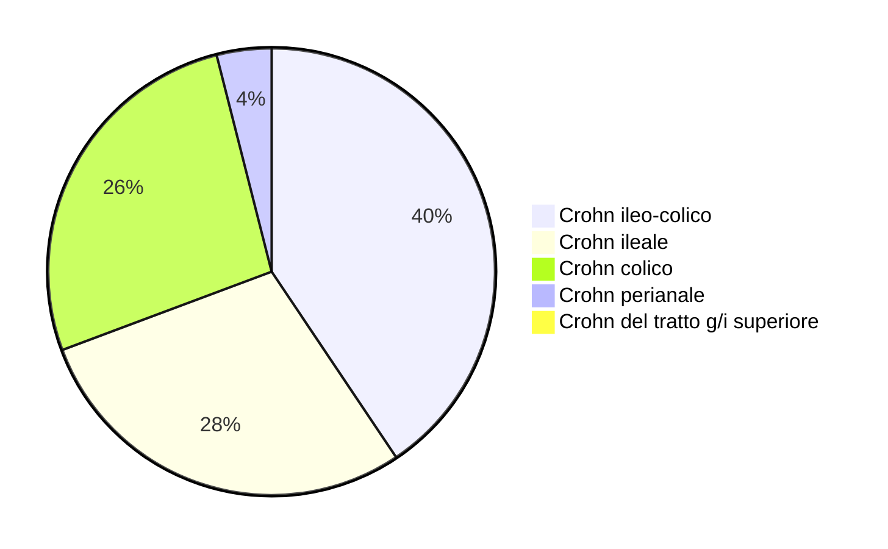

\clearpage
\part{Semeiotica generale}

# Semeiotica dell'addome

\begin{figure}
	\centering
	\begin{minipage}{.38\textwidth}
		\includegraphics{img/quadranti-addominali.png}
	\end{minipage}
	\begin{minipage}{.58\textwidth}
		\begin{itemize}
			\tightlist
			\item Ipocondrio dx: colecisti, fegato (lobo dx), flessura epatica del colon
			\item Epigastrio: stomaco, eofago, aorta, duodeno, pancreas (testa)
			\item Ipocondrio sx: milza, pancreas (coda)
			\item Fianco dx: rene dx, colon ascendente
			\item Mesogastrio: intestino tenue (digiuno ed ileo), grandi vasi addominali
			\item Fianco sx: rene sx, colon discendente
			\item Fossa iliaca dx: appendice, ovaio dx
			\item Ipogastrio: vescica, utero, colon, ileo terminale, uretere
			\item Fossa iliaca sx: ovaio sx, colon sigmoideo
		\end{itemize}
	\end{minipage}
	\caption{I 9 quadranti addominali con la proiezione degli organi sottostanti}
\end{figure}

\redbox{Considerazioni sulla diagnosi di addome acuto e sulla semeiotica chirurgica in generale, breakable=true}{
L'addome è la tomba del chirurgo. Diagnosticare con la sola clinica un addome acuto è particolarmente difficile: un medico \emph{esperto} fa diagnosi corretta solo il 75\% delle volte, e scendiamo al 50\% delle volte in caso di un medico giovane ed inesperto.

La causa dell'addome acuto rimane indeterminata nel 40\% dei pazienti. Quando si arriva in PS però al pz. qualcosa bisognerà pur dire, no, e qualcosa nella cartella va scritto che documenti la motivazione che sottende il piano di gestione del paziente che abbiamo scelto -- anche e sopratutto per via dell'aspetto medico--legale della pratica medica.

Per di più l'accuratezza diagnostica si riduce con l'aumentare dell'età. L'anziano ha una sintomatologia più sfumata, un quadro clinico più complesso ed intricato e minori meccanismi di compenso nel caso in cui qualcosa vada storto. Ha valori laboratoristici differenti e a volte confondenti, spesso influenzati dalla terapia e da altre condizioni patologiche sovrapposte, oltre che naturalmente dall'invecchiamento stesso.

Morale della favola: \textbf{fare diagnosi è spesso complicato, ma va fatto e va fatto bene: questo significa fare il medico. Non è vero che il bravo medico non usa indagini strumentali: il bravo medico usa esami strumentali con razionalità, con direzione ed intenzione e nelle occasioni in cui serve --- per confermare, smentire o dirimere un \emph{sospetto} diagnostico o una serie di alternative che però deve già avere nella sua testa}. Quando si chiede un esame bisogna avere ben chiaro il \emph{perché si sta richiedendo proprio quell'esame} e il \emph{cosa si farà dopo} a seconda del risultato dell'esame stesso

\begin{quote}
``Si fa l'esame strumentale quando si ha bene in mente a cosa può servire nella tua strategia di trattamento, perché un particolare dato che ci può dare quell'esame può cambiare, in un senso o nell'altro, la terapia. Altrimenti l'esame non serve a niente'' --- Silvio Laureti
\end{quote}

\tcblower

\begin{quote}
" I momenti fondamentali sono l’approccio al paziente, lo sguardo e l’impressione del primo impatto visivo. Poi bisogna andare a fare la diagnosi i cui fattori fondamentali sono la ricerca dell'obiettività, l'analisi della storia clinica e l’utilizzo di indagini strumentali di laboratorio. Una volta che abbiamo tutti i dati, fare una prognosi è decidere il timing dell'intervento, quale intervento, quale terapia e quando farlo.

Sono fondamentali, nell'approccio al paziente, solide conoscenze e preparazione, perché se non sappiamo nulla è inutile che guardate il paziente in cerca di aspetti che dovremmo conoscere. Guardando un paziente che ha una particolare postura mi si accende la lampadina e riesco a correlare la tipicità di tale postura ad altro perché lo so. \textbf{Ci vogliono solida conoscenza, preparazione, intuizione e vivacità mentale; avere l'abitudine d’ideare un piano di lavoro in maniera sistematica. Dobbiamo imporci un metodo per cui ad ogni step sappiamo già cosa fare successivamente, avendo bene in mente quale sarà la nostra strategia successivamente}." --- Silvio Laureti
\end{quote}
}

\greenbox{Come porre le domande al pz. durante l'anamnesi}{
Le domande da fare al paziente al fine di ottenere informazioni anamnestiche devono essere poste con molta intelligenza, ricordando che non sempre il paziente è a conoscenza del fatto che le informazioni da lui riportate sono di estrema importanza per il lavoro del medico. Bisogna ricordare che di fronte non si ha un medico o un intenditore di medicina. In alcuni casi i pazienti non conoscono molto bene la loro storia clinica (possono aver subito un intervento chirurgico senza sapere il motivo e il tipo di operazione). In altri casi bisogna vincere anche il pudore del paziente. Fare anche attenzione a porre domande senza suggerire la risposta, per evitare che il paziente risponda sulla base di quello che noi abbiamo detto.
}

- La diagnostica procede i classici 3 momenti^[Naturalmente tutto deve essere rapportato al paziente, ogni cosa va valutata come parte di un contesto e ogni dato va messo in relazione con tutti gli altri. Il paziente è uno, è un sistema complesso: la nostra analisi non può limitarsi ad un solo aspetto trascurando tutti gli altri]
	0. Quick look, impressione generale e facies del pz. È situazione critica o a rischio evolutivo?
	1. Anamnesi (APR + APP + familiare), con particolare focus su
	2. EO addominale (ma anche cardiologico!)
	3. Laboratorio + diagnostica strumentale

## Anamnesi
- APP + APR + familiare + farmacologica
	- Pregressi interventi di chirurgia addominale e tempistiche (acuzia o cronicità)
	- Pregressi problemi addominali e tempistiche (acuzia o cronicità)
	- Eventuali problematiche neoplasiche (magari quadro in evoluzione?)
	- Eventuali problematiche cardiologiche/polmonari (sintomi intestinali possono essere secondari)
	- Anamnesi farmacologica
		- Terapia anticoagulante (per stimare rischi)
		- Terapia con antidepressivi (↓ motilità intestinale ⇒ stipsi)
		- Terapia antidolorifica! (particolarmente in acuto)
- Approfondimento sulle caratteristiche del dolore

### Focus sull'indagine del dolore
- Una volta accertata la posizione del dolore la sua semeiotica è quella classica (OPQRST)
	- O (Onset) --- Improvvisa, graduale, aggravante
	- P (Palliation/provocation) --- Quali manovre/posizioni/manipolazioni provocano o alleviano il dolore
	- Q (Quality) --- Gravativo, trafittivo, a cintura, crampiforme; continuo o intermittente
	- R (Radiation) --- Localizzare il dolore. Si irradia?
	- S (Severity) --- Intensità del dolore (NRS). Cambia nel tempo? Come?
	- T (Time from onset) --- tempo dall'insorgenza
- Con riferimento al dolore addominale individuiamo 3 tipologie a seconda dell'origine
	1. __Dolore viscerale puro__ \asidefigure{img/dolore-viscerale-puro}{}
		- Non localizzato precisamente, simmetrico, riferito come vago (solitamente su linea mediana verticale o orizzontale)
			- Riferito come crampiforme o terebrante^[Terebrante = perforante, infiltrante, trafiggente, lacerante, a colpo di pugnale]
			- Pz. solitamente irrequieto, possibili sintomi neurovegetativi riflessi (sudorazione fredda, nausea)
		- Il dolore non cambia con i movimenti della parete addominale
		- Addome tendenzialmente trattabile
		- Peristalsi tendenzialmente conservata
		- Cause più frequenti
			- Iperperistaltismo (spasmo muscolatura liscia)
			- Colica renale
			- Calcoli ureterali
	2. __Dolore parietale__ (o somatico)
		- Dolore inizialmente ben localizzato, spesso asimmetrico. Se si evolve si diffonde a tutto l'addome
		- Addome tendenzialmente non trattabile (anche localmente), difeso alla palpazione \marginnote{\emph{Trattabile} = manipolabile alla palpazione con successo e senza dolore. Un addome non trattabile è ligneo, teso, senza escursione. Un addome non trattabile provoca contratture di difesa alla palpazione. Segno spesso di peritonite diffusa}
		- Peristalsi non conservata
		- Il dolore cambia con i movimenti della parete addominale
			- Il pz. solitamente sta fermo il più possibile in posizione antalgica
			- Solitamente respiro breve, per evitare movimenti dolorosi
			- Se dolore _si aggrava con tosse_ ⇒ sofferenza peritoneale
		- Cause più frequenti
			- Appendicite (Blumberg^[__Segno di Blumberg__ --- dolore di rimbalzo alla palpazione dell'addome elicitato quando, dopo aver palpato l'addome, viene rimossa bruscamente la mano.  Indice tendenzialmente di una infiammazione del peritoneo, poiché il dolore deriva dallo sfregamento dei foglietti sierosi che compongono il peritoneo che si realizza quando l'esaminatore ritira bruscamente la mano dopo una palpazione profonda] + nel punto di McBurney, o McBurney dolente alla digitopressione)
			- Processi infiammatori locali che si estendono
			- Interessamento del peritoneo (se diffuso)
	3. __Dolore riferito__ (viscero--parietale) \asidefigure{img/dolore-addominale-irradiato.png}{}
		- Dolore irradiato in zone non vicine alla struttura sofferente^[Il fatto che il dolore sia riferito in una regione completamente differente dalla sede dove si sta sviluppando la noxa patogena è spesso da imputare alla medesima origine embriologica delle due strutture]
		- Può essere sia superficiale (>) che profondo (<)
		- Cause più frequenti
			- Colica biliare --- irradiazione ipocondrio dx → spalla destra e da lì posteriormente verso il dorso
			- Colica renale --- irradiazione zona lombare → zone inguinale, coscia, genitali (grandi labbra o scroto)
			- Pancreatite acuta --- dolore a cintura (o a sbarra) nella regione addominale e dorso
			- Utero --- regione sotto-ombelicale e posteriore
			- Gastrite o esofagite --- irradiazione alla zona interscapolare

\redbox{Recap: il dolore addominale in un quadro di peritonite}{
In un quadro di peritonite mi aspetto
\begin{itemize}
\tightlist
\item Addome non trattabile (duro, ligneo, contratto e difeso). Se parzialmente trattabile: verosimilmente Blumberg +, Rotter +, otturatore + e Psoas +
\item Pz. in posizione antalgica, spesso fetale. Respira poco per limitare l'escursione di parete
\item Sintomi sistemici: febbre, nausea, vomito
\item Laboratorio
  \begin{itemize}
  \tightlist
  \item \textbf{↑ procalcitonina}
  \item Leucocitosi
  \item ↑ VES, ↑ PCR
  \item Segni indiretti
    \begin{itemize}
    \tightlist
    \item ↑ creatinina (sofferenza renale)
    \item ↑ transaminasi (sofferenza epatica)
    \item ↑ amilasi e lipasi (sofferenza pancreatica)
    \end{itemize}
  \end{itemize}
\item
  Per distinguere tra shock settico o cardiogeno (in entrambi ↑
  procalcitonina)
  \begin{itemize}
  \tightlist
  \item Nello shock settico ci sono altri marker infiammatori (IL2, IL6, L8, TNFα)
  \item Nello shock cardiogeno non troviamo altri marker
  \end{itemize}
\end{itemize}
}

## Esame obiettivo dell'addome
- Segue i classici 4 momenti:
	1. Ispezione
	2. Palpazione
	3. Percussione
	4. Auscultazione

### Ispezione
- Conformazione^[A tavolta (contratto per peritonismo),piano, a barca, scavato (cachessia), globoso, pendulo (obeso), batraciano (a botte da fluido ascitico), disteso (fluido o gas)] e simmetria dell'addome
- Cute: colore, aspetto, ferite o cicatrici chirurgiche, ecchimosi
	- Colore: ittero, pallore, rossore, striature
	- Ferite e cicatrici: indicatori di interventi o lesioni
		- Per cicatrici chirurgiche la posizione spesso è indice dell'intervento effettuato
		- Attenzione: nel tempo le metodiche chirurgiche (e quindi gli accessi) sono cambiati! (ora c'è preferenza verso laparotomia per quanto possibile)
	- Ecchimosi: indicatori di traumi o di altre situazioni cliniche
		- __Segno di Cullen__ --- ecchimosi periombelicale indidice di pancreatite, spesso necrotica (compare in 24-48h)
		- __Segno di Gray--Turner__ --- ecchimosi ai fianchi, indice di grande sanguinamento retroperitoneale (compare in 24--48h)
- Grado di distensione addominale^[La distensione addominale è sinonimo o di ↑ IAP o di una distensione dei visceri. Nel secondo caso, spesso è associata a fenomeni ostruttivi che causano una distensione e paralisi a monte dell'ostruzione stessa]
- Asimmetria (indice di ernia o grande neoplasia). Ci sono asimmetrie o dolore alla manovra di Valsalva? \marginnote{\emph{Manovra di Valsalva} = espirazione forzata a glottide chiusa}
- Mobilità dell'addome durante la respirazione (addome immobile o respiro superficiale può essere segno di sofferenza peritoneale)
- Ci sono contratture? (anche dovute alla posizione)
- Reticoli venosi superficiali? (nella zona periombelicale, anastomosi portocavali, _addome a caput medus\ae_)
- Ci sono zone pulsatili?

### Palpazione
- Ambiente caldo, pz. a suo agio (⇒ controllo del dolore appropriato), supino, braccia lungo i fianchi, posizione neutra per evitare contratture mascheranti
- Palpare con _mano a piatto_ (eventualmente con 2 mani per avere maggiore sensibilità tenendo rilassata quella inferiore). Garbo e cortesia.
- Cominciare la palpazione __nel quadrante più lontano a quello del dolore riferito__ (per evitare che dolore comprometta il resto dell'esame)

#### Palpazione superficiale
- Mano a piatto, pressione leggera
- Gli obiettivi della palpazione superficiale sono 3
	1. Rilevare se l'addome è trattabile -- e, nel caso, quanto -- o difeso \marginnote{\emph{Trattabile} --- addome morbido, esaminabile senza resistenza o dolore. Se la palpazione invece provoca dolore (e quindi anche una contrattura e/o un segno di difesa dell'addome) definiremo l'addome -- o il quadrante in cui questo succede -- non trattabile, annotando la presenza del segno di difesa nella localizzazione in cui si presenta. Un addome non trattabile è un addome talmente doloroso da rendere impossibile effettuare la palpazione profonda}
		- Contrattura di difesa vera: segno patologico
		- Contrattura di difesa falsa: contrattura prodotta da mani fredde, solletico, o per paura della manovra o del dolore
	2. Rilevare se si _evoca_^[Differenza sottile: con la palpazione non voglio _provocare_ il dolore, voglio _evocare_ un dolore eventualmente già presente] dolenzia e in che zona
		- Dolenzia alla palpazione superficiale è un segno di infiammazione già prolungata
	3. Ci sono masse apprezzabili di consistenza differente?

#### Palpazione profonda
- Mano a piatto (o mani sovrapposte) con sole ultime 4 dita. Esercitare pressione maggiore \marginnote{Possibile palpazione bimanuale (contemporaneamente anteriormente e posteriormente, nella manovra di ballottamento). Questo diventa utile per palpare particolarmente i reni e la milza}
- Possibile sse addome trattabile, altrimenti è troppo dolorosa
- Obiettivi
	1. Sentire profilo e consistenza degli organi addominali
		- Palpare fegato^[Mano di taglio ad uncino sotto l'arcata costale di destra. Il pz. fa una profonda inspirazione e gli organi ipocondriaci vengono spinti in basso. Se epatomegalia: si avverte il margine inferiore nel passaggio sotto le dita come uno "scatto"]
			- Epatomegalia è condizione frequente
			- Se si apprezza il fegato: com'è la superficie? Liscia (stasi), parenchimatosa (normale), nodosa e tagliente (cirrosi), irregolare (per noduli)...
		- Palpare colecisti
			- __Segno di Curvoisier--Terrier__ --- colecisti palpabile (⇒ ingrossata) ma distesa e __non dolente__ (altrimenti Murphy+). Indice di una possibile neoplasia del pancreas che preme sulla c duodenale e restringe l'uscita delle vie biliari a livello di \a{papilla di vater}
		- Palpare stomaco
			- Evento _estremameeente_ raro e non bello (palpabile solo se è contemporaneamente infiltrato l'omento, che permette fissità)
			- Valutare se c'è resistenza elastica (disteso per gas o alimenti?)
		- Palpare milza^[Pz. sul fianco dx, supino e con il braccio sx sollevato. In questa posizione: inspirazione profonda (che fa scendere la milza). Una palpazione spinta sotto l'arcata condrale di sinistra la spinge in basso, e la riusciamo a palpare con la mano posteriormente] (ballottamento bimanuale)
			- Normalmente non palpabile. Se palpabile ⇒ splenomegalia (segno prognostico negativo, da indagare)
			- Valutare bene splenomegalia in situazioni non associate ad epatopatie (tumori liquidi?)
		- Palpare rene (con manovra di ballottamento bimanuale) \marginnote{\emph{Manovra di ballottamento bimanuale (secondo Guyon)}: si usano due mani, una posta dorsalmente e una posta sopra, ma ventralmente. Si effettuano spinte posteriori verso l'alto, si apprezza un organo (se è ballottabile) con la mano ventrale}
			- Tendenzialmente molto poco palpabile
				- Posso chiedere a pz. di inspirare e trattenere per comprimere i visceri e facilitare la palpazione (che resta comunque difficoltosa)
				- più facilmente se sg. magro
			- Se palpabile o aumentato di volume: mi attendo superficie liscia. Sento masse?
		- Palpare colon
			- In fianco destro si sente un "laccio" (_corda colica_), segno contrazione spastica del colon per infiammazione)
			- Si registrano tumefazioni? (particolare attenzione nel \a{sigma}, sede della stragrande maggioranza delle patologie coliche)
		- Palpare globo vescicale
			- Se vuota: non palpabile, coperta dalla \oss{sinfisi}
			- Se palpabile: patologia tumorale? Globo vescicale per ritenzione urinaria? (allora dolore e urgenza di minzione alla palpazione)
		- Palpare pancreas
			- Normalmente non si sente nulla, solo tumefazioni molto grosse (molto raro e molto male)
			- Al limite: segno di Chauffard--Rivet
	2. Rilevare eventuali zone di dolenzia evocata \begin{figure} \centering \includegraphics{img/punti-dolenti-addome.png} \end{figure}
		- Punti e manovre per la colecisti
			- __Segno di Murphy__ (1) ---  con mano di piatto in ipocondrio dx, e punta delle dita nel punto colecistico (sotto la 10/ma costa dx): dolore alla inspirazione, tale da arrestarla bruscamente (anche noto, infatti, come _segno dell'arresto inspiratorio_). Indice di colecistite^[La colecisti infiammata viene spinta verso il basso durante l'inspirazione]
			- __Segno di Chauffard--Rivet__ (triangolo) --- dolore alla palpazione profonda del triangolo ipocondrio--epigastrico. Corrisponde alla proiezione del \a{duodeno}, della testa del \a{pancreas} e del \a{coledoco}
		- Punti e manovre appendicolari
			- __Segno di McBurney__ (2) --- dolore alla digitopressione del punto di McBurney (primo terzo della linea spino-ombelicale dx). Si accompagna spesso a dolore nel __punto di Lanz__^[Situato nel terzo laterale della linea che congiunge le spine iliache superiori anteriori] (3)
			- __Segno di Rovsing__ --- palpazione profonda della fossa iliaca sinistra. Se il dolore compare a dx ⇒ segno positivo e indice di appendicite acuta^[Questo succede perché tramite la palpazione profonda la \a{fascia} viene tesa, e questo provoca uno stiramento dell'appendicite (o perché viene sfregata dalla fascia stessa o perché è connessa alla fascia mediante connettivo lasso)]
			- __Segno di Campanacci__ --- dolore alla digitopressione del \a{punto di campanacci} ⇒ segno positivo e indice di appendicite acuta (che però è orientata diversamente^[Retrocecale, sottoepatica o mesoceliaca (dietro al meso ileale del mesocolon destro)]: in questo caso McBurney spesso negativo)
			- __Manovra dello psoas__ --- Dolore in in ipocondro e fianco dx se pz. invitato ad alzare la gamba dx tesa contro la nostra resistenza ⇒ indice di flogosi del peritoneo posteriore^[Questo perché lo \mus{psoas} decorre esternamente rispetto al colon dx, in adiacenza con cieco ed appendice. Se dolente è indice del fatto che il processo flogistico si è già espanso]. Il segno dello psoas spesso si accompagna a difficoltà/dolore alla deambulazione
			- __Manovra dell'otturatore__ --- a pz supino la gamba dx viene inclinata di 90°. Con ginocchio fermo il piede viene tirato verso di noi, il ginocchio vincolato e spinto lontano e la gamba viene intraruotata: se dolore indice di infiammazione espansa al peritoneo che ricopre l'otturatore
		- Punti ureterali  e segni renali \marginnote{Indice di calcolo renale}
			- __Punto ureterale superiore__ (4) --- ombelicale trasversa, a 3 dita trasverse (~ 5cm) dall'ombelico
			- __Punto ureterale medio__ (5) --- tra terzo medio ed esterno della linea bispino-iliaca (di fatto lateralmente al \mus{retto dell'addome})
			- __Punto ureterale inferiore__ --- sbocco dell'uretere in vescica (valutabile con esplorazione rettale/vaginale in M/F)
			- __Manovra di Giordano__ --- percussione decisa di taglio effettuata con bordo ulnare della mano sulla loggia renale. Se dolore ⇒ + e indice di litiasi renale
		- Segni di peritonismo
			- __Manovra di Blumberg__ --- Palpazione profonda e repentina rimozione della mano. Se si ha dolore al rimbalzo ⇒ segno positivo e indice di interessamento peritoneale^[Perché il dolore deriva dallo sfregamento dei foglietti sierosi che compongono il peritoneo], anche se ancora localizzato (altrimenti avremo addome non trattabile) \marginnote{Tendenzialmente la manovra di Blumberg si esegue in fossa iliaca destra, in corrispondenza del punto di McBurney, nell'EO. Se positivo ⇒ appendicite}
			- __Segno di Rotter__ --- stimolazione del peritoneo del \a{cavo di douglas}. Se dolore ⇒ segno positivo e indice  di flogosi avanzata (probabilmente anche purulenta, perché il pus si accumula nel cavo rettovescicale o rettovaginale
				- Esplorazione rettale e pressione verso l'alto nel maschio
				- Esplorazione vaginale e pressione verso il fornice nella donna
		- Ogni altro punto riferito dal pz. come dolorante
	3. Palpare eventuali masse non organiche
		- Aneurismi dei grandi vasi
		- Stazioni linfonodali profonde che si palesano per aumento di dimensione (particolarmente linfonodi ileo-cecali, linfonodi lombo-aortici)

### Percussione
- Seguire un ordine (non casuale)
	- Radiale da ombelico
	- Alto → basso

- 2 obiettivi principali
	1. Valutare il profilo e l'area degli organi
		- Utile sopratutto per gli organi parenchimatosi sottocondrali (\a{fegato} e \a{milza})
		- Utile per ricercare l'aia di timpanismo della bolla gastrica (\a{area di traube}), apprezzabile per un cambio da timpanismo gastrico a ottusità parenchimatosa \marginnote{Una riduzione dell'\a{area di traube} deve sempre destare sospetto, perché significa che almeno un'area circostante parenchimatosa è aumentata di volume. Questo può dipendere da una moltitudine di fattori (epatomegalia, cardiomegalia, versamento pericardico, versamento pleurico, splenomegalia...) In questo il campo viene ristretto se siamo capaci di capire quale confine gastrico è ridotto}
			- Confine gastro--epatico (apprezzabile)
			- Confine gastro--cardiaco (apprezzabile)
			- Confine gastro--polmonare (molto difficile da apprezzare, passiamo da timpanismo a timpanismo)
			- Confine gastro--splenico (apprezzabile)
			- Confine gastro--colico (difficile da apprezzare)
	2. Ricercare zone di timpanismo e di ottusità (attese o patologiche)
		- In condizioni fisiologiche
			- Alcune aree sono parenchimatose (vedi punto precedente)
			- Per il resto l'addome è diffusamente timpanico (_timpanismo entero-colico_), anche se sono possibili (particolarmente nella matassa intestinale) variabilità dovute alla pienezza del lume
		- In condizioni patologiche \marginnote{\emph{Attenzione!}: \textbf{una scomparsa di ottusità in zone che so essere parenchimatose è indice di perforazione!} (pneumoperitoneo)}
			- Iperimpanismo ⇒ raccolta di aria (es: addome meteorico per ansa intestinale distesa, o scomparsa dell'ottusità parenchimatosa sottocondrale)
			- Ottusità ⇒ parenchima solido o raccolta di liquido^[Differenziamo le due situazioni -- parenchima vs liquido -- in 2 modi: (1) guardando se l'area di ottusità diventa timpanica quando il sg. si gira in decubito laterale o (2) tramite il _segno del guazzamento_ (elicitato mediante [succussione](https://treccani.it/enciclopedia/succussione_(Dizionario-di-Medicina)) dell'addome). Per di più, un versamento liquido (specie se di entità notevole) porta ad un cambiamento del profilo addominale durante il cambio del decubito] (versamento o ascite)

### Auscultazione
- Borborigmi
	- Silenzio completo ⇒ paralisi intestinale (e solitamente peritonite, se escludiamo ileo paralitico reattivo)
	- Peristalsi normale ⇒ normale motilità intestinale
	- Iper-peristalsi ⇒ fase iniziale di una occlusione (spesso con suono squillante e metallico)
	- Rumori di "spruzzo" ⇒ stenosi forzata di un intestino che, però, è ancora peristaltico
- Soffi dei grandi vasi (particolarmente aorta) ⇒ turbolenza nel flusso

## Indagini strumentali

### Laboratorio
- Considerare curva enzimi cardiaci (`troponina`) se dolore è alto (+ ECG)
- Emocromo con formula + indici di funzionalità epatica e renale
	- Ematocrito e Hb (emorragia?)
	- Leucocitosi (causa infettiva? IL e TNFα?)
	- Creatinina (funzionalità renale)
	- Transaminasi (funzionalità epatica)
- Bilirubina (ittero ostruttivo?)
- Indici di colestasi (> γGT, > bilirubina (sopratutto indiretta), > fosfatasi alcalina)
- PCR e VES^[In condizioni normali, la componente proteica del plasma è tale da preservare la carica negativa di superficie delle emazie -- carica che spinge a mantenerle separate e in sospensione. Al contrario, quando nel corpo si instaurano processi flogistici, l'aumentata concentrazione ematica di proteine tipiche dell'infiammazione (tra cui il fibrinogeno e la proteina C reattiva) porta a un indebolimento delle forze elettrostatiche repellenti. I globuli rossi, di conseguenza, tendono ad aggregarsi, con formazione di rouleaux ad alta tendenza a precipitare] (infiammazione?)
- `procalcitonina` (se alta è correlata con SIRS! ⇔ shock) \marginnote{\emph{SIRS} = Sindrome da Risposta Infiammatoria Sistemica. Condizione patologica multifattoriale nella quale la risposta infiammatoria (elicitata da una qualsiasi causa, non per forza infettiva) produce uno stato infiammatorio che danneggia l'intero organismo, il quale perde la sua capacità omeostatica \\ \includegraphics{img/Sepsi-SIRS.png}}
- __β-HCG__ in donne in età fertile!

### Imaging
- RX
	- \goldstandard __Senza mdc (diretta)__: ottimo mezzo rapido ed efficace. Di 1/o livello!!
		- Distensione delle anse addominali (segno di ostruzione)
		- Livelli idroaerei (segno di ostruzione)
		- Cupola d'aria sottodiaframmatica se RX in posizione eretta (segno di perforazione)
	- Con mdc
		- Diretta con mdc
		- Clisma opaco
- Eco \marginnote{Ma attenzione! Eco è un esame la cui qualità e interpretazione dipende molto dall'operatore ⇒ richiedere operatore esperto!}
	- \goldstandard __Addome completo__
	- Regionale (anche con scansioni apposite a seconda delle necessità, es: eco-FAST^[Eco fatta velocemente con 5 scansioni: \a{spazio di morrison}, \a{pericardio}, \a{seno costofrenico sx}, \a{aorta}, \a{pancreas}, \a{cavo di douglas}], eco e-FAST...)
	- Con mdc (SonoVue, delle microsferette inserite in vena che aumentano o riducono l'ecogenicità di un tessuto)
	- Con metodiche particolari (Doppler) a seconda delle esigenze cliniche
- TAC (attenzione ad esposizione! 1 TAC $\simeq$ 250 Rx)
	- Con mdc
	- Senza mdc
- RMN
- Angiografia digitalizzata^[mdc in vaso tramite sonda inserita da radiologo interventista per valutare percorso e stato del vaso in cui la sonda è posizionata. Questa metodica, a seconda di cosa si introduce nel vaso oltre al mdc, permette di fare sia diagnosi (di trombi, occlusioni totali o parziali, stravasi, restringimenti del vaso...) ma anche terapia (se si usa stent, colle, embolizzazione...)]
	- Angiografia normale
	- Arteriografia selettiva (incannulato un vaso di medie dimensioni)
	- Arteriografia superselettiva (incannulato un vaso periferico di misura molto piccola)
- Scintigrafia
- PET
- Endoscopia
	- EGDS (Esofago Gastro Duodeno Scopia) --- endoscopia a visione frontale
	- ERCP (Colangio Pancreatografia Endoscopica Retrograda) --- endoscopia a visione laterale che ha come obiettivo quello di incannulare le vie biliari (con sfinterectomia della papilla) per visualizzare le vie biliari (anche con mdc) ed eventualmente rimuovere litiasi

### Metdiche strumentali aggiuntive
- Lavaggio peritoneale^[Lavaggio (partendo dalla regione sotto/sovra ombelicale o della fossa iliaca sx) della cavità peritoneale con 1L di Ringer Lattato e recupero del fluido di lavaggio per fare analisi laboratoriale (ricerca e conta degli eritrociti [\pat{emoperitoneo}], ricerca e conta di globuli bianchi [\pat{peritonite settica}], ricerca e conta di bile/fibre vegetali [\pat{peritonite stercoracea}]. Naturalmente un esame invasivo come questo porta una discreta fetta di rischi, principalmente operatore--dipendenti: questo significa che quando lo facciamo dobbiamo essere consapevoli delle possibili complicazioni e giocare di anticipo per monitorare il pz. e prevedere come agire in caso si verificassero imprevisti]

\footnotesize
Naturalmente ogni esame ha la sua logistica ed i suoi tempi. __Sulla base dell'urgenza e della stabilità del pz. occorrerà scegliere l'esame che ha allo stesso tempo il massimo potere diagnostico e le tempistiche più favorevoli.__

Particolarmente: in un pz. con addome acuto che è stabile potremo anche impiegare del tempo e richiedere una TAC. Se il paziente invece fosse instabile non possiamo sprecare tempo: dovremo invece propendere per esami più rapidi (idealmente bedside), come la eco FAST o il lavaggio peritoneale.
\normalsize

# Patologie intestinali di interesse internistico

## Pancreatite
- \pat{pancreatite} --- infiammazione del \a{pancreas} escorino dovuto ad un processo di autodigestione del parenchima operato dall'attivazione prematura degli enzimi digestivi che il pancreas esocrino stesso produce
	- Pancreatite acuta se insorgenza acuta
		- \pat{pancreatite acuta edematosa}
		- \pat{pancreatite acuta necrotico-emorragica}
	- Pancreatite cronica se il quadro non è acuto
- Cause principali
	- Patologie delle vie biliari (particolarmente: litiasi, ostruzioni da tumori)
	- Alcolismo acuto e cronico
	- Traumi
	- Chirurgia sulle vie biliari
	- Ischemia mesenterica
	- Uso di farmaci^[\far{azatioprina}, \far{6-mercaptopurina}, \far{asparaginasi}, \far{pentamidina}, \far{didanosine} e altri con ssociazione probabile e possibile]
	- Forme idiopatiche
	- Forme infettive
	- Alterazioni endocrinologiche (iperparatiroidismo) e metaboliche (ipertrigliceridemia, emocromatosi, gravidanza...)

### Clinica
- Da sospettare particolarmente se pz. riferisce uno stile di vita a rischio
	- Fumo
	- Alimentazione sregolata (abbondante e non salubre)
	- Abuso di alcol
	- > BMI, ipercolesterolemia
	- __Sindromi dismetaboliche importanti__
- S&S generali
	- Pz. intensamente addolorato, spesso non trova posizione antalgica
	- Possibile nausea
	- __Dolore a cintura in epigastrio__
- Le due tipologie di pancreatite acuta hanno una gravità differente
	- Edemtosa → dolore trafittivo che raggiunge rapidamente l'acme e si risolve in > 48h. Vomito, febbre, ittero, meteorismo e possible addome acuto
	- Necrotico emorragica → può evolvere in shock e tendenzialmente è molto pericoloso. Richiede assistenza intensiva
- La gravità del quadro di pancreatite acuta è oggettivabile con i __criteri di Ranson__ (valutati in 2 momenti)
	1. Valutazione all'accettazione (se ≥ 3 ⇒ prognosi sfavorevole)
		- Età > 55aa
		- Bianchi > 16K
		- Glicemia > 200 mg/dl
		- LDH > 350 U/L
		- GOT > 250 U/L
	2. Durante le prime 48h di degenza (se ≥ 3 ⇒ UTI)
		- Ematocrito cala del > 10%
		- Azotemia aumenta di > 5 mg/dl
		- Calcemia < 8 mg/dl
		- PaO~2~ < 60 mmHg
		- Deficit di basi > 4 mEq/l
		- Sequestro di liquidi > 6 lt

### Laboratorio
- Esami generici
	- Emocromo
	- Glicemia
	- Funzione epatica e renale
	- Albuminemia
	- VES e PCR
- Esami tipici per valutare la pancreatite
	- Lipasemia
	- Calcemia
	- Iso-amilasemia pancreatica
	- Amilasuria

### Esami strumentali
- Imaging
	- Rx diretto
	- __TAC__ (essenziale per vedere bene se c'è già necrosi. Se sì: cazzo)
	- __Eco__ (se vediamo pancreas edematoso per valutare meglio il quadro)

### Complicanze
- Polmonari
	- ARDS
	- Embolia polmonare
	- Ascessi/versamenti mediastinici
	- Polmoniti, atelettasia
- Cardiovascolari
	- Ipotensione → shock
	- Edema polmonare
	- Alterazioni ECG
	- Versamento pericardico
- Ematologiche
	- CID
	- Trombosi
- Renali
	- Iperazotemia e oliguria
- Metaboliche
	- Iperglicemia
	- Ipocalcemia
	- Ipertrigliceridemia
- Nervose
	- Encefalopatie
	- Stati psicotici
	- Retinopatia

### Terapia
- Idealmente: pz. va trattato in UTI
	- Se non possibile: monitoraggio continuo
- Essenzialmente è terapia di supporto
	- Appropriata terapia del dolore
	- Tp. ab. empirica per gestire complicanze infettive
	- Liquidi
	- Sng
	- Monitoraggio continuo
		- Pv classici
		- ECG
		- PVC cruenta se situazione grave per anticipare shock
		- Esami di laboratorio ripetuti
		- Imaging per capire se la situazione si sta evolvendo
- Sfinterotomia (CPRE) se l'eziologia è (o si sospetta che sia) ostruttiva. Chirurgia open come ultima ultima risorsa (gravi complicanze)

## Diarree
- \pat{diarrea} --- aumentato contenuto di acqua nelle feci. Questo comporta _necessariamente_ 3 conseguenze
	- Ridotta consistenza fecale
	- ↓ rapporto volume/peso (> 200 g/die)
	- ↑ frequenza della canalizzazione
- A seconda della causa che porta ad un aumentato contenuto acquoso individuiamo 4 meccanismi fisiopatologici (non mutualmente esclusivi)
	1. Diarrea osmotica --- presenza nel lume intestinale di soluti osmoticamente attivi che richiamano acqua
	2. Diarrea secretoria --- agenti endogeni si legano ai recettori di membrana della mucosa intestinale ⇒ ↑ cAMP cellulare ⇒ ipersecrezione verso il lume di elettroliti ⇒ richiamo di acqua nel lume
		- Agenti endogeni: calcitonina, prostaglandine, sali biliari...
		- Agenti esogeni: virus, tossine batteriche, farmaci, lassativi secretori
	3. Diarrea essudativa --- ridotto assorbimento di liquidi a causa dell'infiammazione della mucosa \marginnote{Ogni giorno transitano circa 9 litri di liquido nell'intestino, 7.8 dei quali vengono normalmente riassorbiti}
		- Lesione mucosale ⇒ impedito riassorbimento
			- Patologie infiammatorie croniche intestinali (\pat{morbo di crohn}, \pat{rettocolite ulcerosa}...)
			- Chemioterapia o radioterapia (per danno diretto)
		- Entità proporzionale a danno
	4. Diarrea da alterata motilità --- aumento o diminuzione del transito intestinale
		- Da aumento della motilità ⇒ ↓ tempo per assorbire acqua
		- Da riduzione della motilità ⇒ crescita batterica ⇒ irritazione ⇒ scarica diarroica per eliminare la crescita batterica

### Cause patologiche principali
- Assunzioni di sostanze lassative
	- Lassativi osmotici: PEG, sali di magnesio, Senna
	- Lassativi secretori
- Condizioni infiammatorie
	- Sindrome del colon irritabile
	- Morbo di Crohn
	- Rettocolite ulcerosa
	- Malattia diverticolare
	- Coliti (indeterminata, generica, linfocitica, collagenasica....)
- Deficit metabolici
	- Ipertiroidismo
	- Tireotossicosi
- Cause chirurgiche (iatrogene)
	- Fistole, stomie
	- Sindrome dell'intestino corto
	- Sindrome post-colecistectomia, post gastrectomia
	- Vagotomia
- Infezione
	- CMV, Clostridium difficile, TBC, AIDS
- Patologie pancreatiche (⇒ mancata solubilizzazione dei lipidi ⇒ malassorbimento)
	- Pancreatite cronica
	- Neoplasie pancreatiche

### Diarrea acuta
\footnotesize
Tendenzialmente autolimitanti (al massimo ben controllabili con farmaci)
\normalsize

- Tendenzialmente (70%) da cause infettive o tossinfettive
	1. Tossinfezioni alimentari
		- _Salmonella paratiphi_ (autolimitante in 1--4 gg)
		- _Stafilococcus aureus_ (nausea vomito e diarrea profusa, autolimitante in 24 h)
		- _Clostridium perfrigens_ (crampi addominali + dierrea, autoimitante in 24h)
		- _Bacillus cereus_ (autolimitante in breve tempo)
	2. Gastroenteriti infettive
		- Gastroenteriti batteriche con tossine
			- _E coli_ enterotossico
			- Shigelle
			- Salmonelle
			- Campylobacter
			- __Clostridium difficile__!
		- Gastroenteriti batteriche invasive (distruzione dell'epitelio)
			- _E coli_ enteroinvasivo
	3. Diarrea del viaggiatore
		- _E coli_
		- Salmonelle
		- Shigelle
		- Rotavirus o altri virus
- La rimanenza da altro tipo di reazioni
	1. sostanze esogene
	2. danneggiamento di parete (radiazioni, ischemia)
	3. reazioni infiammatorie (allergie, intolleranze, metalli pesanti, diverticolite)

### Diarrea cronica
- Cause funzionali (maggioranza)
	- Sindrome dell'intestino irritabile
	- Altre cause di alterata funzione intestinale
	- ...
- Cause _organiche_ \marginnote{Se sintomo risveglia il pz. di notte è indicazione del fatto che è organico e va indagato}
	- Cause infettive (solitamente non batteriche o virali)
		- _Enteamoeba histolityca_
		- _Giardia lamblia_ ⇒ \pat{giardiasi}^[Quadro non banale: spesso non viene cercato (anche perché gli esami e le procedure di conservazione per evidenziare una giardiasi non sono routinari]
		- ___Clostridium difficile___
	- Per malassorbimento
		- Celiachia
		- Insufficienza pancreatica
		- Intolleranza al lattosio
		- Resezioni intestinali
		- Crescita batterica ⇒ film
	- Cause infiammatorie
		- Colite ulcerosa
		- Crohn
	- Cause iatrogene
		- Antiiotici
		- Cause cardiovascolari
		- Chemioterapici
		- Lassativi (abuso o uso non corretto)
		- Farmaci neuropsichiatrici
	- Cause endocrine
		- Ipertiroidismo
		- Diabete
		- Tumori neuroendocrini secretori
		- ...

### Diagnosi
1. Esami ematochimici
	- Routinari (emocromo con formula, VES, PCR, elettroliti, sideremia, protidogramma)
	- Specifici
		- Test sierologico per celiachia
		- Test per intolleranza al lattosio
		- Test di funzionalità pancreatica
		- Sierologia per agenti infettivi
		- Dosaggio ormoni tiroidei
		- Dosaggio peptidi gastrointestinali
2. Esame delle feci
	- Ricerca di sangue occulto
	- Esame microbiologico
		- Colturale di virus e batteri
		- Studio parassitologico
	- _Quantificazione_ della `calprotectina` fecale \marginnote{\texttt{calprotectina} --- sostanza che si trova nelle feci dovuta alla granulazione dei neutrofili: è quindi indice di un processo infiammatorio in corso che si sta svolgendo nel tratto g/i}
		- Se abbondante: indice di un problema organico ⇒ proseguire iter diagnostico per cercare la causa dell'infiammazione (IBD)
		- Se scarsa: il problema è funzionale ⇒ trattare la sintomatologia (antispastici, bloccanti della motilità, fermenti, ab.)

## Malattie infiammatorie croniche intestinali (MICI o IBD)
- Tra le MICI individuiamo 2 (+1) gruppi di patologie fondamentali \asidefigure{img/crohn-colite.png}{}
	1. Colite ulcerosa
	2. Malattia di Crohn
	3. Coliti indeterminate
- Patogenesi non chiara. Multifattoriale
	- Predisposizione genetica (c'è familiarità^[Non c'è vera e propria ereditarietà, ma familiarità. Statisticamente se sg. ha parenti di primo grado affetti ha una maggiore probabilità di sviluppare MICI])
	- Condizione di infiammazione cronica
	- Fattori ambientali (fumo, dieta, farmaci)
	- Flora intestinale (disbiosi predispone a MICI)
	- Dieta
	- Altri fattori sconosciuti
- Patologie con insorgenza lunga ⇒ spesso esordio misconosciuto ⇒ 14% pz. ha avuto diagnosi in > 5aa
- In questi contesti __endoscopia e colonscopia sono metodi diagnostici fondamentali__
	- Aiuta nella d/d
	- Visualizzare lo stato della mucosa
	- È necessario superare la valvola ileo-ciecale, per osservare lo stato della parte distale dell'ileo e assicurarci che non sia interessato dall'infiammazione

### Anamnesi: principi generali
- APR, APP, _familiare_, farmacologica
- Dolore. Sveglia la notte?
- Abitudini e frequenza di scarico: stipsi (poco comune) o diarrea?
- Ci sono manifestazioni extra intestinali?
	- Atralgie ⇐ reazioni autoimmuni
	- Sintomatologia renale
	- Sintomatologia epatica
- Fattori di rischio
	- Stile di vita
	- Dieta
	- Fumo
	- Droghe
- Infezioni?

\greenbox{Differenze tra \pat{morbo di crohn} e \pat{colite ulcerosa}, breakable=true}{
\footnotesize
\begin{center}
Sono state sottolineate le differenze \emph{per la diagnosi differenziale}
\end{center}
\normalsize

\begin{longtable}[H]{@{}lll@{}}
\toprule
\begin{minipage}[b]{0.30\columnwidth}\raggedright
\strut
\end{minipage} & \begin{minipage}[b]{0.30\columnwidth}\raggedright
Crohn\strut
\end{minipage} & \begin{minipage}[b]{0.30\columnwidth}\raggedright
CU\strut
\end{minipage}\tabularnewline
\midrule
\endhead
\begin{minipage}[t]{0.30\columnwidth}\raggedright
Defecazione\strut
\end{minipage} & \begin{minipage}[t]{0.30\columnwidth}\raggedright
Frequente, talvolta steatorrea\strut
\end{minipage} & \begin{minipage}[t]{0.30\columnwidth}\raggedright
Frequente, spesso mucosanguinolenta\strut
\end{minipage}\tabularnewline
\begin{minipage}[t]{0.30\columnwidth}\raggedright
Tenesmo rettale\strut
\end{minipage} & \begin{minipage}[t]{0.30\columnwidth}\raggedright
Poco comune\strut
\end{minipage} & \begin{minipage}[t]{0.30\columnwidth}\raggedright
Molto comune\strut
\end{minipage}\tabularnewline
\begin{minipage}[t]{0.30\columnwidth}\raggedright
Febbre\strut
\end{minipage} & \begin{minipage}[t]{0.30\columnwidth}\raggedright
Comune\strut
\end{minipage} & \begin{minipage}[t]{0.30\columnwidth}\raggedright
Rara\strut
\end{minipage}\tabularnewline
\begin{minipage}[t]{0.30\columnwidth}\raggedright
Fistole\strut
\end{minipage} & \begin{minipage}[t]{0.30\columnwidth}\raggedright
Comuni, a volte primo sintomo\strut
\end{minipage} & \begin{minipage}[t]{0.30\columnwidth}\raggedright
Rari\strut
\end{minipage}\tabularnewline

\begin{minipage}[t]{0.30\columnwidth}\raggedright
Perdita di peso\strut
\end{minipage} & \begin{minipage}[t]{0.30\columnwidth}\raggedright
Frequente\strut
\end{minipage} & \begin{minipage}[t]{0.30\columnwidth}\raggedright
Rara\strut
\end{minipage} \tabularnewline

\begin{minipage}[t]{0.30\columnwidth}\raggedright
\underline{Interessamento dell'ileo}\strut
\end{minipage} & \begin{minipage}[t]{0.30\columnwidth}\raggedright
Possibile\strut
\end{minipage} & \begin{minipage}[t]{0.30\columnwidth}\raggedright
No\strut
\end{minipage} \tabularnewline

\begin{minipage}[t]{0.30\columnwidth}\raggedright
\underline{Infiammazione}\strut
\end{minipage} & \begin{minipage}[t]{0.30\columnwidth}\raggedright
Segmentale\strut
\end{minipage} & \begin{minipage}[t]{0.30\columnwidth}\raggedright
Continua\strut
\end{minipage} \tabularnewline

\begin{minipage}[t]{0.30\columnwidth}\raggedright
\underline{Complicanze}\strut
\end{minipage} & \begin{minipage}[t]{0.30\columnwidth}\raggedright
Intestinali (stenosi, ascessi) + sistemiche\strut
\end{minipage} & \begin{minipage}[t]{0.30\columnwidth}\raggedright
Non complicanze intestinali\strut
\end{minipage} \tabularnewline

\bottomrule
\end{longtable}

\tcblower

\begin{figure}[H]
\centering
\includegraphics{img/dd-cd-cu.png}
\end{figure}

}

### Terapia: principi generali
- Approccio \textsc{\#hashtag}
	- \textbf{H}ave a long term strategy
	- \textbf{A}llow to fully map the disease and its complications
	- \textbf{S}tratify patients according to prognosis
	- \textbf{H}ear the needs of the pt
	- \textbf{T}ailor therapy
	- \textbf{A}ppropriately monitor pt to maintain tight control over disease
	- \textbf{G}uess response tu therapy and change strategy _before_ symptoms or damage

### Morbo di Crohn
- \pat{morbo di crohn} --- patologia infiammatoria del tratto g/i a sospetta genesi autoimmune, caratterizzata da
	- Infiammazione segmentaria (segmenti infiammati seguiti da segmenti sani)
	- Interessamento (almeno potenziale) di tutto il tratto g/i
	- L'infiammazione interessa tutto lo spessore della parete intestinale
	- Manifestazioni secondarie extra--intestinali
- Siccome infiammazione interessa tutto lo spessore della parete intestinale (mucosa + sottomucosa) se questa è inveterata sono possibili restringimenti del lume e/o fistole

#### Classificazione
- Si classifica in funzione del tratto (o dei tratti) di intestino interessato dall'infiammazione

#### Sintomatologia
1. Sintomatologia comune
	- Diarrea (spesso anche notturna e a digiuno)
	- Dolore addominale, meteorismo
	- Perdita di peso
	- Febbre
	- Lesioni perianali
	- Ulcerazioni (→ fistole)
	- Manifestazioni extra--intestinali
	- Malassorbimento ⇒ sintomi da deficit nutrizionali
2. Sintomatologia specifica dipendente dalla regione interessata
3. Nei casi avanzati: manifestazioni extra--intestinali

##### Manifestazioni extra--intestinali
- Eziologia comune: manifestazioni autoimmuni
- Artropatie, principalmente SpA (\pat{spondiloartropatie sieronegative}^[Artripatie caratterizzate dalla mancanza nel siero del `fattore reumatoide`])
	- \pat{artriti} assiali (della colonna)
	- \pat{artriti} delle articolazioni periferiche (pauciarticolari se coinvolte ≤ 4 articolazioni (risoluzione se risoluzione di IBD); poliarticolari altrimenti)
	- \pat{sacroileite isolata}
- Cutanee
	- \pat{eritema nodoso}
	- \pat{pioderma gangrenoso}
- Oculari
	- \pat{uveite anteriore}
- Epatobiliari
	- \pat{colangite sclerosante}
	- \pat{epatite} ad eziologie autoiimmune

#### Decorso
- Tendenzialmente progressivo e ingravescente, con complicanze intestinali e manifestazioni sistemiche
- Fattori prognostici negativi
	- Esordio in giovane età
	- Fumo in giovane età
	- Infiammazione estesa che interessa anche il \a{tenue}
	- Ulcere profonde o patologia penetrante o stenosi del lume intestinale
	- Grande impatto sistemico con manifestazioni intestinali
	- Accessi perianali o ulcere nel pavimento pelvico
	- Necessità di \far{steroidi} già alla diagnosi per gravità del quadro

##### Complicanze
- Complicanze principali dovute a infiammazione cronica
	- Fistole
		- Fistole intestinali (comunicazioni tra due porzioni di intestino adiacenti tramite la formazione di un canale tra le due pareti)
		- Fistole perianali (\pat{malattia perianale}) sono manifestazioni frequenti (25%) e invalidanti
			- Fistola semplice → non ascessuata, superficiale, non interessa sfinteri, si risolve facilmente con intervento
			- Fistola complessa → ascessuata, profonda, interessa sfinteri o altri muscoli/organi (anche uretra), ha prognosi sfavorevole e peggiora tanto più rapidamente quanto più è grande
	- Ulcere
	- Stenosi che possono ostacolare o impedire il transito intestinale
	- Ascessi (fistole a fondo cieco che raccolgono pus). Gioca un ruolo il microbiota batterico
	- ↑ rischio di tumori (per infiammazione cronica)

\marginnote{Fistole perianali nella CD}{
- Solitamente gestita da equipe multidisciplinare
- Diagnosi
	1. RMN con mdc
	2. Ecografia endoscopica anorettale per conferma definitiva
	3. Valutazione intraoperatoria
- Trattamento dipende a seconda della complessità
	- Se fistola semplice: drenaggio con setone + ab.
	- Se fistola complessa: chirurgico + ab. + agenti anti-TNF
		- 3 pilastri della terapia chirurgica
			- Fornire continuo drenaggio delle secrezioni (solitamente con filo sintetico lasciato in sede all'interno della fistola) per evitare che si accumulino
			- Tentare riparazione chirurgica definitiva (non ledere gli sfinteri!)
			- Chirurgia ablativa (rimuovere tutto) se e quando necessario
}

#### Diagnosi
0. Valutazione clinica (anamnesi + EO) compatibili con IBD -- e, particolarmente, con \pat{cd}
1. Colonscopia fino ad ileo + biopsia + __SES-CD__
	- Visualizzazione con colonscopia (che si deve spingere fino ad \a{ileo}!) per vedere lo stato
	- Attribuzione dello score endoscopico (__SES-CD__^[Simple Endoscopic Score for Crohn's Disease]) per quantificare gravità secondo 4 aspetti
		- Quantità di ulcere da infiammazione
		- Grandezza delle ulcere
		- Superficie interessata dall'infiammazione
		- Presenza di restringimenti
	- Prelievo della mucosa su cui effettuare indagine istologica
		- ↑ spessore della mucosa
		- Profonde fessurazioni
		- Sottomucosa sovvertita dall'infiammazione
		- Granuloma epiteliodie (non sempre si vede, perché non sempre si preleva una quantità di tessuto sufficientemente profonda)
2. Indagini biochimiche
	- __`calprotectina`__ fecale --- proteina tipicamente rilasciata dai granulociti neutrofili ⇒ se si ritrova nelle feci è indice di patologie organiche a carico dell'intestino
	- __`PCR`__ --- indice di infiammazione generica, assolutamente aspecifica ⇒ poco specifica per IBD ⇒ associare assolutamente ad una clinica suggestiva
		- ↑ in morbo di Crohn, aumentata solo nelle forme più gravi di colite ulcerosa
3. Imaging
	- SICUS (_Small Intestine Oral Contrast Ultrasound_) --- ecografia con mdc della matassa intestinale, ben distinguibile grazie al mdc. Permette di visualizzare la struttura e lo spessore della parete
	- Entero-TAC con mdc e/v se si vogliono evidenziare le pareti
	- \goldstandard __Entero-RMN__ con 2 tipologie di mdc
		- Un mdc neutro per os
		- Un mdc paramagnetico e/v
	- Endoscopia con videocapsula

#### Terapia
- Tp. personalizzata su pz. per migliorare la sua qualità di vita (tp. si adegua a pz., non viceversa)
- Tp. deve avere come obiettivo quello di indurre e mantenere i periodi di remissione (clinica + endoscopica)
	- Se quadro complicato/acuto → terapia _top-down_ (si parte con alternative terapeutiche potenti per ridurre l'acuzia e si scala la terapia ad uno stato gestibile con terapie meno potenti)
	- Se quadro sostenibile → alternative terapeutiche più blande (devono essere sostenibili per lunghissimi periodi!) per mantenere la remissione
	- Se quadro si acuisce: passaggio tempestivo a terapia più aggressiva (_timely step-up_)
- Essenziale, oltre ad alternative terapeutiche, guardare pz. a tutto tondo, gestendo i fattori di rischio (dieta, stile di vita)

##### Chirurgia e rischio di recidiva
- Approccio chirurgico solamente in 2 condizioni
	1. Stenosi severa di un tratto ⇒ asportazione chirurgica (ma grande rischio di recidive! Tolto un tratto se ne infiamma un altro)
	2. Stenosi della valvola ileo--ciecale ⇒ resezione ileociecale
- Rischio di recidiva postoperatoria calcolato con __score di Rutgeerts__ (endoscopia a 6 mesi da intervento)
	- __i0__ → assenza di lesioni
	- __i1__ → mucosa normale, < 5 lesioni aftoidi
	- __i2__ → mucosa normale, ≥ 5 lesioni aftoidi
	- __i3__ → ileite aftoide
	- __i4__ → ulcerazioni diffuse/stenosi/noduli
- Il rischio a 5 anni è significativamente correlato ($p = 0.001$) con lo score di Rutgeerts
	- i0--i1 → a 3 anni > 80% dei pz. non ha recidiva
	- i2     → borderline
	- i3--14 → a 3 anni > 92% dei pz. ha avuto evoluzione grave

### Colite ulcerosa
- \pat{colite ulcerosa} --- patologia infiammatoria della mucosa colica. Parte dal retto e tende a risalire il colon. Individuiamo 3 specificazioni a seconda dell'area di interessamento\

	- Istologicamente: solo lo strato mucoso del colon è interessato
		- Strati sottomucosi non interessati
		- Grande infiltrato di neutrofili
		- Ascessi nelle cripte ghiandolari
- 2 parametri sono importanti per valutare la gravità del contesto patologico (e le opzioni terapeutiche)
	- Estensione dell'infiammazione
	- Gravità dell'infiammazione (scala di Mayo) \marginfig{imgmayo}

- Il decorso della patologia può essere anche molto differente \asidefigure{img/decorso-uc.png}{}
	1. Remissione dopo evento acuto iniziale
	2. Patologia cronica intermittente (acuzia → remissione → acuzia)
	3. Patologia cronica continua
	4. Aumento in severità
- L'obiettivo terapeutico è __prolungare i periodi di remissione__
	- Diagnosi precoce e definitiva
	- Appropriato intervento farmacologico
	- Prevenzione delle complicanze

\yellowbox{Diagnosi differenziale della colite ulcerosa}{
\begin{itemize}
\tightlist
\item Non tutte le coliti sono anche ulcerose
\item Entrano in d/d
  \begin{itemize}
  \item Altre coliti
  \item Infezioni (ameba, Escherichia coli emorragica, TBC, Yersinia
  \item Coliti da farmaci (FANS, abuso di steroidi)
  \item Coliti da vasculopatie (più probabili se \textgreater{} 40aa)
  \item Coliti secondari ad eventi ischemici
  \item \pat{ulcera solitaria del retto}
  \item Ulcere da radiazioni (più probabili se si fa radioterapia per tumori nel basso ventre)
  \end{itemize}
\end{itemize}

\tcblower

\begin{figure}[H]
\centering
\includegraphics{img/dd-colite-ulcerosa.png}
\end{figure}

}

# Semeiotica del cuore e dei grossi vasi

## Ispezione
- Ispezione generica del torace
	- Temperatura e colore della cute (pallore, marezzatura, rossore)
	- Umidità della cute
	- Simmetria del torace (statica e dinamica)
	- Cicatrici
- Morfologia della regione precordiale alla ricerca di \marginnote{Approfondire tutto quello che è di primo riscontro}
	- Asimmetrie
	- Prominenze (_bozze precordiali_)
		- Espressione di cardiopatie congenite (particolarmente se pz. giovane)
		- Espressione di aneurismi dell'arco (particolarmente se pz. anziano, anche se sempre più raro)
	- Depressioni
		- Conformazioni ossee (non preoccupanti). Es: _pectum escavatum congenitum_
		- Patologie che implicano gravi aderenze nella regione mediastinica (più grave)
- Individuazione dell'\a{itto della punta}^[Punto nel quale si apprezza un movimento dovuto alla sistole isometrica. Essendo il cuore posato sul diaframma, durante la sistole si muove ventralmente verso la parete toracica, producendo un movimento che a volte è visibile all'ispezione] (tendenzialmente: 5/o intercostale, 1cm interno linea emiclaveare)
	- Età --- più alto nei bambini, più basso nell'anziano
	- Costituzione --- nel longitipo è più basso e lateralmente, nel brachitipo è più in alto
	- Fase del respiro --- itto segue il diaframma, sopratutto se atto respiratorio è forzato
	- Posizione del pz. --- se decubito laterale sx, itto si sposta verso sx
	- Deformità del torace
	- Patologie concomitanti --- splenomegalia ⇒ più alto
- Ricerca di eventuali movimenti pulsatori nella regione mediastinica
	- Rientramento sistolico dell'itto della punta ⇔ aderenze tra foglietti pericardici e parete toracica (si vede anche il fremito)
	- Pulsazione aggiuntiva tra 4/o e 5/o intercostale ⇔ ipertrofia ventricolare dx
	- Pulsazione aggiuntiva nel 2/o intercostale sx ⇔ ectasia^[__Ectasia__ = dilatazione uniforme di struttura cava] della \art{polmonare}
	- Pulsazione aggiuntiva nel 2/o intercostale dx (e parasternale)⇔ aneurismi dell'aorta ascendente
	- Pulsazioni lungo il decorso dei vasi intercostali ⇔ coartazione aortica
- Ricerca di circoli collaterali cutanei

## Palpazione
- Metodica: Palmo della mano dx su superficie precordiale e si palpa in 2 step (pz. supino + pz. in ortostatismo)
- La palpazione è più efficace nell'espirazione (il cuore si avvicina alla parete toracica)
- Obiettivi
	- Ricercare aree di dolorabilità
		- Qualità del dolore
		- Cambia alla pressione/movimento? Sì ⇒ difficilmente cardiogeno
	- Ricercare prominenze
		- Prominenze ossee
		- Zone di algia intercostale (nevralgia, dolore pleurico, fratture... Correlare con traumi)
	- Caratteristiche dell'itto della punta
		- Estensione (≤ 2 cm^2^, altrimenti spia di ipertrofia ventricolare sx)
		- È  particolarmente apprezzabile (forza molto difficle da quanificare)? Sì ⇒ aumento dell'attività cardiaca^[Anemia, tireotossicosi, febbre, fistole arterovenosa, cirrosi, ogni altra situazione che aumenta l'attività cardiaca]
			- ↑ fisiologico: sforzo, stato emotivo
			- ↑ patologico: ipertrofia ventricolare sx (itto cupuliforme), ipertiroidismo, aneurisma
	- Sentire se ci sono pulsatilità abnormi (4)
		- Pulsazione nel II intercostale a dx ⇔ ipertensione del grande circolo (pulsazione da aumentato postcarico della \a{semilunare aortica})
		- Pulsazione nel II intercostale a sx ⇔ ipertensione del piccolo circolo (pulsazione da aumentato postcarico della \a{semilunare polmonare}
		- Pulsazioni sotto il processo xifoideo ⇔ ipertrofia ventricolare dx
		- Pulsazioni a livello laringeo (visibili a capo iperesteso) ⇔ aneurismi dell'arco aortico
	- Sentire vibrazioni (fremiti e sfregamenti)

		- Fremiti --- Sono di fatto l'equivalente palpatorio dei soffi, e derivano dallo stesso fenomeno (moto vorticoso del sangue che impatta sulle pareti vasali derivante dal passaggio di sangue in ambiti che sono ristretti o dilatati \marginnote{Sentire un fremito è molto complicato, e richiede esperienza e un tocco molto sensibile}
			- Fremito sull'itto puntale ⇔ insufficienza mitralica
				- Stenosi mitralica se il fremito è diastolico con rinforzo presistolico (?!)
			- Fremito sul focolaio aortico (con possibile irradiazione ai vasi) ⇔ stenosi aortica
			- Fremito sul focolaio polmonare ⇔ stenosi polmonare
			- Fremito continuo su II e III intercostale sx ⇔ dotto di Botallo pervio
			- Fremiti sistolici ⇔ aneurisma aorta
		- Sfregamenti --- sensazioni vibratorie più evidenti. Possono essere maggiormente evidenziare se pz. si inclina in avanti, facendo pressione con il proprio corpo sulla mano dell'esaminatore. Più evidente nel margine sternale (e parasternale?) sx e non correlati con ciclo cardiaco
			- Sfregamenti pericardici ⇒ pericardite acuta, infarto miocardico, uremia (per irritazione che uremia genera su foglietti) \marginnote{Si differenzia tra i due facendo mantenere al pz. l'apnea: se si sentono ancora sfregamenti sono pericardici}
			- Sfregamenti pleurici (raro) ⇒ versamento pleurico o pleurite
	- Valutare segni palpatori
		- __Riflesso epato-giugulare__ --- turgore delle giugulari alla palpazione del fegato. Segno di scompenso cardiaco^[Perché una palpazione grande in ipocondrio fa risalire la colonna di sangue, che non viene efficacemente smaltita dal cuore scompensato (particolarmente a destra) e quindi produce una distensione delle giugulari]

## Percussione
- Individuazione delle aie di ottusità assoluta e relativa ⇒ individuazione della superficie cardiaca
	- Aia di ottusità assoluta ⇒ superficie libera del cuore, non rivestita dai lembi polmonari
	- Aia di ottusità relativa ⇒ superficie del cuore coperta dai lembi polmonari
- Variazioni dell'aia cardiaca
	- Fisiologiche
		- Costutuzione (longilinea ⇔ cuore piccolo, brachilineao ⇔ cuore tozzo)
		- Fasi della ventilazione (lembi si espandono in inspirazione)
		- Decubito (dx vs sx)
	- Patologiche (rare)
		- ↑ aia se ipertrofia cardiaca (sx), versamento pericardico, fibrosi polmonare
		- ↓ aia se fibrosi polmonare

## Auscultazione

- Auscultazione di _aree_ (o focolai) di auscultazione, che corrispondono ad _aree_ in cui il suono causato dalla chiusura delle valvole cardiache si _propaga_
	1. __Area semilunare aortica__ (A) --- 2 intercostale, sulla parasternale dx \marginnote{A questo si aggiunge il focolaio di Erb (3/o intercostale sulla parasternale), sempre specifico della valvola aortica}
	2. __Area semilunare polmonare__ (P) --- 2 intercostale, sulla parasternale sx
	3. __Area tricuspidalica__ (T) --- 4 intercostale, sulla sternale
	4. __Area mitralica__ (M) --- itto della punta (5/o intercostale, emiclaveare sx)
- In ogni focolaio di auscultazione posso osservare, relativi alla valvola corrispondente:
	- Suoni fisiologici
		- Primo e secondo tono cardiaco (chiusura e apertura delle valvole)
		- Toni aggiuntivi o soffi parafisiologici in infanzia/ragazzi
	- Suoni patologici
		- Toni aggiuntivi
		- Soffi (passaggio del sangue in strutture -- valvole o vasi -- alterati)
		- Sfregamenti
		- Click
- Per ogni suono patologico lo si deve localizzare rispetto alle fasi del ciclo cardiaco in cui si percepisce il tono. La localizzazione è composta da 2 elementi
	- Proto- / meso- / para- (all'inizio/a metà/alla fine)
	- Sistolico o diastolico

### Toni cardiaci

\ 

- Sono 4
	- Solo S~1~ e S~2~ sicuramente fisiologici
	- S~3~ e S~4~ (ritmi di galoppo) sono tendenzialmente patologici, tranne in particolari demografie

#### Toni fisiologici
- S~1~ (o primo tono, o tono sistolico) \marginnote{"lub", o "tum"}
	- Sincrono con sistole ventricolare. Precede di qualche ms l'onda sfigmica (radiale o carotidea)
	- Rispetto a S~2~: > intensità, > durata
	- Costituito da più vibrazioni, indici delle 4 componenti che partecipano al tono
		- Contrazione isovolumetrica ventricolare ⇒ vibrazione dei lembi valvolari (1)
		- Chiusura della mitrale e della tricuspide (2)
		- Vibrazioni da eiezione in aorta e arteria polmonare (3)
		- Passaggio ematico vero e proprio in aorta e art. polmonare (4)
- S~2~ (o secondo tono, o tono diastolico) \marginnote{"dub", o "ta"}
	- Sincrono con diastole ventricolare
	- Rispetto a S~1~: < intensità ma più scoccante, < durata
	- Costituito da più vibrazioni, indice dei 2 eventi che lo producono (_praticamente_ coincidenti)
		- Chiusura della valvola aortica (A)
		- Chiusura della valvola polmonare (P)

\greenbox{Sdoppiamento del primo e del secondo tono}{
\footnotesize
\begin{center}
	La trattazione dello sdoppiamento dei toni è più complessa, e qui è davvero solo accennata per completezza
\end{center}
\normalsize
È possibile un allungamento delle componenti che compongono il primo o il secondo tono, facendo in modo che all'interno dello stesso tono si riscontrino 2 momenti ⇒ \emph{sdoppiamento del tono}

\begin{itemize}
\tightlist
\item Condizioni fisiologiche
  \begin{itemize}
  \tightlist
  \item Inspirazione forzata ⇒ sdoppiamento di S\textsubscript{2} (↑ flusso polmonare ⇒ sistole dx rallentata ⇒ ritardata chiusura della polmonare)
  \item Espirazione forzata ⇒ sdoppiamento di S\textsubscript{2} (meccanismo opposto)
  \end{itemize}
\item Condizioni patologiche
  \begin{itemize}
  \tightlist
  \item BBdx ⇒ sdoppiamento fisso o persistente di S\textsubscript{1} (la sistole a dx ritarda a causa del blocco di branca)
  \item Anche BBsx sdoppia paradossalmente S\textsubscript{2} (?!)
  \end{itemize}
\end{itemize}
}

#### Toni parafisiologici o patologici (toni di galoppo)
- III tono (protodiastolico)
	- Parafisiologico in bambini/giovani, patologico > 20--30aa
	- A singola componente (vibrazioni da riempimento rapido all'inizio della diastole ventricolare per sistole atriale vigorosa)
	- Raramente registrato
	- Possibile spia di ventricolo dilatato
- IV tono (presistolico, o telediastolico atriale) \marginnote{Di fatto anticipa leggermente S\textsubscript{1}}
	- Tendenzialmente patologico
	- A singola componente (sangue contro parete ventricolare eccessivamente rigida)

### Soffi
- Rumori __patologici__ causati dal passaggio turbolento (e non laminare) del sangue
- Rilevabili nelle pause (piccola pausa tra S~1~ e S~2~ e grande pausa tra S~2~ e S~1~)
- I soffi vengono distinti in 4 gruppi, a seconda che siano _da eiezione_ o _da rigurgito_
	- Soffi sistolici (rilevabili nella piccola pausa)
		- Da eiezione ventricolare
			- Soffio generato dal passaggio anterogrado del sangue tra le semilunari (si sentono in A e F)
			- Solitamente generati da 3 cause
				- ↑ velocità attraverso attraverso l'ostio valvolare (normale o ristretto)
				- Dilatazione postvalvolare
				- Gradiente pressorio transvalvolare per la presenza di stenosi lungo il decorso
		- Da rigurgito
			- Soffio generato dal passaggio retrogrado del sangue ventricolo → atrio
			- Generati da 2 cause
				- Insufficienza della valvola atrio-ventricolare^[Ostio atrio-ventricolare incontinente] (allora li sentirò nel focolaio T o M incontinente)
				- Difetti del setto interventricolare
	- Soffi diastolici (rilevabili nella grande pausa)
		- Da riempimento ventricolare (e da eiezione atriale)
			- Prodotti dal passaggio atrio → ventricolo attraverso
			- Solitamente generati da 2 cause
				- Stenosi valvole atrio-ventricolari
				- Una sistole atriale particolarmente intensa
		- Da rigurgito
			- Soffio generato dal passaggio retrogrado del sangue aorta → ventricolo
			- La causa solitamente è unica: incontinenza delle semilunari
- Del soffio si valutano 4 caratteristiche
	- Intensità (scala di Levine)
		- __Grado 1__ --- udibile solo con auscultazione attenta, esperta e con strumento sensibile
		- __Grado 2__ --- udibile se ascoltatore esperto
		- __Grado 3__ --- grado intermedio
		- __Grado 4__ --- grado intermedio/forte. Possibili fremiti.
		- __Grado 5__ --- estremamente udibile
		- __Grado 6__ --- udibile anche allontanando lo stetoscopio dal torace
	- Frequenza
	- Qualità
	- Localizzazione

### Sfregamenti
- Sfregamenti dei due foglietti pericardici durante la contrazione
- Possono essere sia palpati (come fremiti) che uditi
- Possono non essere assolutamente in relazione con il ciclo cardiaco
- Possono non essere irradiati (molto localizzati)
- Svolgendo pressione si possono accentuare
- Trucchi per migliorare l'acustica: tutto quello che avvicina il cuore alla parete toracica
	- Pz. seduto proteso in avanti, generando pressione gravativa con il fonendoscopio
	- ↑ pressione intratoracica (valsalva, inspirazione profonda)

# Semeiotica polmonare

\greenbox{Cose da tenere presente nell'anamnesi per problemi polmonari}{
\begin{itemize}
\tightlist
\item
	Classico 3+2 (APP, APR, APF, farmaci + allergie) + anamnesi sociale (lavoro, fattori di rischio)

  \begin{itemize}
  \tightlist
  \item
    Familiarità almeno per

    \begin{itemize}
    \tightlist
    \item
      Fibrosi cistica
    \item
      Asma
    \item
      Eczema
    \item
      Rinite allergica
    \item
      Patologie autoimmuni
    \end{itemize}
  \item
    APR

    \begin{itemize}
    \tightlist
    \item
      Chiedere se infezioni passate degne di nota (una su tutte: TBC?)
    \end{itemize}
  \end{itemize}
\item
  Quantificare i fattori di rischio

  \begin{itemize}
  \tightlist
  \item
    Fumo
  \item
    Inquinamento
  \item
    Esposizione professionale
  \end{itemize}
\end{itemize}
}

## Ispezione
- Colorazione della cute e temperatura
	- Cianosi centrale o periferica (segno di ipossia)
		- Centrale ↔ causa tendenzialmente respiratoria
		- Periferica ↔ causa tendenzialmente vascolare
- Conformazione del torace
	- Normale (smmetrico, ellittico e diametro a/p < diametro trasverso)
	- A botte (diametro a/p > diametro trasverso). Indice di \pat{enfisema polmonare}
	- Carenato (sviluppo di una prominenza tornale localizzata). Causa più frequente: crisi asmatica infante
	- Scavato (sterno scavato nel terzo inferiore)
	- Con forma differente per alterazioni della colonna (cifosi, scoliosi)
- Simmetria del torace a riposo
- Cinesia del torace
	- Simmetria
	- Movimenti paradossi (__uso dei muscoli accessori!__ ⇒ segno di respirazione laboriosa) \marginnote{La pronuncia è francese}
		- __Tirage__ --- rientro della cute intercostale, del giugulo e della regione lacerocervicali per uso dei muscoli accessori per ↑ pressione negativa e facilitare l'inspirazione
		- __Cornage__ --- espansione della cute intercostale, del giugulo e della regione laterocervicale in maniera contraria al tirage
		- __Segno di Hoover__ --- rientramento inspiratorio delle coste situate nella parte inferiore del torace che durante l'attività respiratoria vengono trascinate verso il basso dal diaframma. Indice di importante difficoltà respiratoria. Rilevabile alla valutazione palpatoria della cinesia dei quadranti respiratori inferiori come un avvicinamento dei pollici
- Si vedono vasi?
	- Reticolo vascolare ⇔ ostruzione della \ven{cava superiore}, frequentemente accompagnati da edema sottuctaneo e/o a mantellina
	- Turgore delle giugulari ⇔ \marginnote{Si valuta con pz. supino con busto inclinato in avanti di 30°--45°}
		- ostruzione della vena cava e ↑ pressione intratoracica
		- ↑ PVC (⇔ \pat{insufficienza cardiaca sx}, \pat{cuore polmonare}^[Ipertrovia del ventricolo dx secondaria a patologia polmonare]
- Altri segni o sintomi
	- Dita ippocratiche (associate a svariate patologie polmonari o cardiache -- ma non solo)

## Palpazione
- Palpazione diretta
	- Frequenza respiratoria \marginnote{La FR ideale dipende dall'età\begin{longtable}[]{@{}ll@{}} \toprule & FR ideale\tabularnewline \midrule \endhead Neonati & 30/ 60\tabularnewline Bambini & 21-30\tabularnewline Adolescenti & 18-24\tabularnewline Adulti & 12-20\tabularnewline \bottomrule \end{longtable}}
	- Valutazione dei polsi toracici (giugulo)
	- Fremiti da sfregamenti pleurici
	- Enfisema sottocutaneo? (segno della _neve fresca_)
	- Valutazione della cinesia del torace all'inspirazione profonda
		- Espansione simmetrica degli emitoraci?
		- I pollici si devono allontanare > 5 cm \marginnote{Una ridotta espansione bilaterale ⇔ enfisema, BPCO, fibrosi polmonare diffusa. Una ridotta espansione monolaterale ⇔ problematiche acute settoriali (versamento pleurico, PNX, collasso polmonare)}
		- Si valutano 4 campi polmonari\

			1. Motilità dei lobi superiori
			2. Motilità del lobo medio e della lingula
			3. Motilità dei lobi posteriori
			4. Motilità diaframmatica
- Palpazione mediata (FVT -- Fremito Vocale Tattile)
	- Obiettivo: assicurarsi che ci sia completa delle vie aeree ed integrità del parenchima
	- Valutazione
		- Esaminatore mano di taglio (lato ulnare) su uno dei campi polmonari posteriori
		- Pz. dice una parola con tante dentali (_"dica trentatrè!"_)
		- Esaminatore guarda se, in quel particolare campo polmonare, sente FVT
	- Normalmente si _deve_ registrare FVT alla corretta intensità
		- FVT accentuato (rispetto ad altri campi) ⇒ consolidamento parenchimale in quel campo (infiammazione, focolaio polmonitico, atelettasia, cancro, fibrosi, TBC)
		- FVT ridotto ⇒ enfisema
		- FVT abolito ⇒ ostruzione bronchiale o versamento pleurico

## Percussione
- Effettuata a pz. supino o seduto
- Il suono registrato alla percussione in un polmone sano viene detto __suono chiaro polmonare__
	- Suono chiaro polmonare ⇒ polmone sano
	- Ipertimpanismo ⇒ raccolta di aria nella cavità toracica (enfisema? PNX?)
	- Ottusità ⇒ consolidamento del parenchima (polmonite, cancro, fibrosi, infiammazione, TBC)
	- Suono _sordo_ (non ottuso e non timpanico) ⇒ interessamento delle pleure (versamento?)
- __La percussione è principalmente mediata__ (dito plessore e mano plessimetro che percuotono _gli spazi intercostali!_)
	1. Valutazione della risonanza
		- Percussione della clavicola
		- Percussione della regione sovraclavicolare
		- Percussione degli spazi intercostali anteriori dal 2/o al 6/o (ci fermiamo all'aia cardiaca ed epatica)
		- Percussione dell'apice dei polmoni (posteriormente sul trapezio, 5 cm laterali dalla linea mediana)
		- Percussione dal 1/o spazio posteriore all'11/mo (dove generalmente si trova la base polmonare)
	2. Ricerca delle basi polmonari
		- Segno: passaggio dal suono chiaro polmonare → ottuso
		- Generalmente situate ~ 11/ma costa (10°--12° spazio)
			- Base _più in basso_ ⇒ enfisema
			- Base _più in alto_ ⇒ patologia addominale
		- Si valuta anche la mobilità (ripetendo la ricerca delle basi con pz. in apnea)
			- Base ipomobile ⇔ neuropatia diaframmatica o elevazione o appiattimento del palmare

\yellowbox{Percussione diretta del torace}{
È possibile anche fare una percussione diretta (con solo un dito plessimetro), ma questa ha meno posto nell'EO polmonare. L'obiettivo è quello di apprezzare (grossolanamente) la risonanza del troace \begin{itemize} \tightlist \item Reperto atteso: da esterno a interno suono che da ottuso diventa timpanico \item Reperto patologico: suoni ottusi indice di consolidamento parenchimale (neoplasia, TBC) \end{itemize}
}

## Auscultazione
- Esecuzione
	- Pz. deve fare respiri profondi e a _bocca aperta_ (meno rumore)
	- Si effettua sempre il confronto con il suono del polmone controlaterale
- Obiettivo: auscultare i rumori respiratori fisiologici
	- __Murmure vescicolare__ (rumore durante inspirazione e prima parte della fase espiratoria dovuto al passaggio dell'aria nei bronchi minori e bronchioli)
		- Udibile sui campi polmonari
		- I:E = 3:1
		- Suono con intonazione acuta
	- __Respiro bronchiale__ (rumore caratteristico del passaggio dell'aria nei bronchi)
		- Udibile in collo/giugulo
		- I:E = 1:3
		- Suono con intonazione grave
	- __Respiro bronco--vescicolare__ (rumore misto da entrambe le componenti)
		- Udibile in apice polmone dx (dorso)
		- I:E = 1:1
		- Suono

\ 

### Auscultazione di rumori patologici
\marginqr{https://www.youtube.com/watch?v=0Ki7P6poIPI&ab_channel=SIMEDETcast-Pilloledimedicina}
- Modifica del murmure vescicolare
	- In intensità
		- Murmure vescicolare rinforzato da una parte se un polmone vicaria la funzione del controlaterale
		- Murmure vescicolare ridotto
			- Da riduzione della ventilazione
				- ↓ espandibilità
				- Enfisema (⇒ ↓ espandibilità)
				- Presenza di infiltrati o addensamenti parenchimatosi
			- Da riduzione della trasmissione
				- PNX
				- Versamenti pleurici
				- Grande cotenna pleurica che smorza il MV
	- In qualità
		- Aspro e raschiante se bronchite
		- Prolungato in fase espiratoria se c'è un ostacolo al deflusso dell'aria
- Soffi (MV auscultato dove non c'è)
	- Soffio laringeo (o stridore laringeo) ⇒ presenza di ostruzione molto alta che produce rumore
	- Soffio bronchiale
		- Aspro (polmonite)
		- Tubarico (auscultazione del respiro bronchiale sul lobo polmonare)
		- Cavitario (soffio per presenza di cavità, con tonalità grave in inspirazione e acuta in espirazione)
		- Anforico (soffio dal timbro metallico per PNX)
		- Dolce (soffio pleurico in caso di versamento pleurico)
- Ronchi, rantoli, crepitii, sibili
	- Ronchi (rumori secchi) --- dovuti a passaggio di aria attraverso bronchi substenotici o in spasmo^[\pat{bpco}, \pat{asma}, reazioni allergiche... ]. Particolarmente evidenti in espirazione
		- Tonalità bassa (russanti o fischianti) ⇒ originati da bronchi^[Alcuni autori definiscono i \emph{ronchi} come toni secchi a tonalità bassa (e quindi di provenienza bronchiale), mentre definiscono i \emph{sibili} come toni secchi di tonalità medio/alta (e quindi di provenienza bronchiolare). Il succo è che in entrambi i casi il suono è secco, indice di una stenosi ad un qualche livello dell'albero respiratorio. Personalmente preferisco questa divisione, che vede nel ronco un generico suono secco prodotto dal passaggio di aria attraverso un albero respiratorio che è stenotico in qualche punto, lasciando la determinazione del punto alla qualità del suono (russante vs gemente vs sibilante)]
		- Tonalità media (gementi) ⇒ originati da bronchioli
		- Tonalità alta (sibilanti) ⇒ originati da bronchioli terminali
	- Rantoli (rumori umidi) --- dovuti a passaggio di aria _attraverso_ materiale liquido, con formazione di bolle. Particolarmente evidenti in inspirazione
		- Tonalità bassa ⇒ originati da bronchi (\pat{bronchite})
		- Tonalità media ⇒ originati da bronchioli (\pat{bronchiectasia}^[Patologia in cui si riscontra una dilatazione irreversibile di una porzione dell'albero bronchiale])
		- Tonalità alta ⇒ originati da bronchioli terminali (\pat{epa}, \pat{polmonite})
	- Crepitii (o rantoli crepitanti) --- dovuti a schiocco di apertura degli alveoli che, a causa di un accumulo di liquido al loro interno che compromette l'attività del surfattante, si chiudono e si riaprono violentemente in inspirazione
		- Reperto tipico in insufficienza cardiaca sx/EPA
- Sfregamenti pleurici
	- Rumori patologici prodotti dallo sfregamento dei foglietti pleurici
	- Udibili sia in inspirazione che espirazione
	- Suono che è assimilabile al fruscio dei capelli, al cuoio piegato o al calpestio della neve fresca
	- Rumore di sfregamento influenzabile dalla pressione del fonendo ma non dai colpi di tosse
- Tosse
	- A volte esacerba/modifica ronchi e rantoli
	- Utile nel differenziare, nel dubbio, ronchi e rantoli da sfregamenti pleurici
	- Utile nel localizzare meglio addensamenti (sugli addensamenti alla tosse si sente un suono lacerante)
- Voce (_"dica trentatrè!"_)
	- Broncofonia --- trasmissione della voce intensa e risonante ma confusa. Indice di addensamento
	- Pettoriloquia --- voce ben distinguibile, indice di focolaio di addensamento
	- Egofonia --- "voce belante" (sopratutto toni alti). La si sente nel bordo superiore di un versamento pleurico
	- Anforica --- se ha risonanza anforica, segno di presenza di grosse cavità

# Principali patologie polmonari e dell'albero respiratorio

## Tosse
- Espirazione violenta a glottide chiusa con finalità di liberare le vie aeree da agenti irritnati
	0. Stimolo tussivo
		- Attivazione di zona sensibile afferente (sono un botto^[Faringe, laringe, biforcazione tracheale, biforcazioni bronchiali, pleura, pericardio, orecchio esterno, mediastino, peritoneo...])
		- Afferenza dell'impulso tramite il \ner{vago} ad un __centro tussigeno__
		- Impostazione della via efferente
	1. Inspirazione profonda
	2. Chiusura della glottide
	3. Espirazione per costruire pressione (> 300 mmHg)
	4. Apertura improvvisa della glottide ed espulsione dell'aria fino a 28 km/s
- Individuiamo 2 tipologie di tosse
	- Secca (non produttiva)
	- Grassa, o umida (produttiva)
	- Ad accessi, o convulsa (attacchi di tosse non controllabile)
	- Bitonale (tipica di invasione neoplastica del \ner{n. laringeo ricorrente})
	- Rauca (con laringite)
	- Fioca (inefficace)
	- Emetizzante (emottisi o emoftoe)
- La tosse può essere acuta o cronica
	- Acuta (< 3 settimane)
		- Se RX torace normale ⇒ infezione/infiammazione acuta (batterica, virale, inalazione di corpi estranei o irritanti)
		- Se RX torace patologico ⇒ polmonite, acuta da ipersensibilità, corpi estranei...
	- Cronica (> 8 settimane)
		- Se RX normale ⇒ cause extra polmonari (reflusso), asma, rinite, tabagismo, esposizione a polveri, effetto collaterale di farmaci (es \far{ace-inibitori})
		- Se RX patologico ⇒ tumore, TBC, malattie interstiziali, bronchiectasia
- Se tosse produttiva le caratteristiche dell'espettorato danno informazioni sul processo patologico
	- Colore
		- Bianco o mucoide (se non infezione)
		- Giallo ⇒ infezioni acute con presenza di neutrofili o eosinofili attivati
		- Purulento e verdastro ⇒ infezioni acute con presenza di neutrofili lisati
			- _Vomica_ --- emissione con tosse di abbondante quantità di escreto piogeno per apertura in via respiratoria di un ascesso o di un empiema
		- Rugginoso ⇒ eritrociti lisati (polmonite pnemococcica)
		- Rosa e schiumoso (emoftoe) ⇒ tumori polmonari, se presente da molto tempo; EPA se quadro acuto
	- Consistenza
		- Solido ⇒ ristagnante nei bronchi (in alcuni casi arrivano quasi a formare calchi)
	- Presenza di emazie \marginnote{Qui le cause principali vanno ricercate tra quelle oncologiche maligne (primarie o metastatiche), infezioni particolarmente pesanti o infiltranti che danneggiano i vasi (bronchiectasie, TBC, ascessi, micetoma...) e cause vascolari vere e proprie (infarto, vasculiti, traumi, corpi estranei, EPA, cause iatrogene...)}
		- Emoftoe: espettorato frammisto a sangue (molto preoccupante, vedi sopra)
		- Emottisi: emissione di sangue con tose

## Dispnea
- Dispnea --- percezione di difficoltà a respirare
	- Soggettiva (se sintomo)
	- Oggettiva (se accompagnata da segni di desaturazione, ipossia, cianosi, rumori patologici all'obiettività)
- Può aiutare un grading per oggettivare la gravità (1 (fiato corto mentre si cammina in fretta) → 5b (sg. non riesce a fare le azioni più elementari))
- Se insorgenza durante decubito laterale: _trepopnea_
	- Se trepopnea da causa cardiaca: pz. in decubito dx
	- Se tepopnea da causa polmonare: pz. in decubito corrispondente a polmone sano
- Le cause sono molteplici, e tanto più gravi quanto l'insorgenza è acuta
	- In minuti (moolto grave!!)
		- Embolismo polmonare
		- PNX (+dolore)
		- Cause psicogene (il pz. riesce a parlare senza problemi)
		- Asma
		- Ab ingestis
		- Insufficienza ventricolare sx acuta
		- Quadri di occupazione del mediastino (versamento pleurico, tamponamento cardiaco)
	- Ore--giorni
		- Polmonite
		- Asma
		- BPCO riacutizzata
		- Alterazioni elettrolitiche (acidosi)
	- Settimane--mesi
		- Anemia
		- Versamento pleurico
		- Disturbi neuromuscolari/di parete
	- Mesi--anni
		- BPCO
		- Fibrosi polmonari
		- TBC
		- Cause oncologiche

## Dolore toracico
- Dolore che può originare da
	- Pleura parietale
	- Parete toracica
	- Mediastino
	- (mai polmoni, non hanno recettori dolorifici)
- Se la causa è polmonare e non cardiaca: il dolore è esacerbato dal movimento o da tosse
- Localizzazione
	- Sulle coste (se coinvolge le prime 6 coste)
	- Su collo o spalle se coinvolge la pleura parietale
	- Epigastrio (se origina dalle ultime 6 coste)

## BPCO
- \pat{bpco} --- quadro patologico di infiammazione cronica delle vie aeree che produce una ostruzione cronica dell'albero respiratorio
	- Ostruzione bronchiale non reversibile alle PFR (questa è la differenza di base con l'\pat{asma})
	- Dispnea ingravescente
	- Tosse cronica (con o senza espettorato)

\greenbox{Epidemiologia della BPCO}{
\begin{itemize}
\tightlist
\item Prevalenza in fumatori ed ex fumatori
  \begin{itemize}
  \tightlist
  \item 10\% in fumatori \textgreater{} 40aa di età
  \item 25\% in fumatori \textgreater{} 80aa di età
  \end{itemize}
\item Nella top 5 delle cause di morte
\item Associata e complicata ad altre patologie
\end{itemize}
}

### Fattori di rischio
- Fumo di sigaretta
	- ↓ speranza di vita
	- Rischio principale: __accelerato decadimento della funzione respiratoria__
	- Fumo passivo: correlazione non chiara
	- Fumo sigaretta > fumo di sigaro o pipa
		- ≥ 2 sigarette/die è correlato con insorgenza di BPCO
- Inquinamento domestico
	- Tipico realtà socioeconomiche povere
	- Principalmente: mancanza di ventilazione degli ambienti e inalazione di prodotti di combustione
	- F>M
- Inquinamento ambientale
	- Correlazione non definitiva con _esordio_, ma definitiva con _riacutizzazione_
- Esposizione professionale ad irritanti
- Predisposizione individuale (> reattività a stimoli irritanti)
- Deficit genetico di `α1-antitripsina`
	- ↓ di `α1-antitripsina` correlato con BPCO enfisematosa
- Quadri patologici (eg \pat{asma}) tipicamente ostruttivi

### Patogenesi
- La patogenesi della BPCO avanza su 2 pilastri
	1. Bronchite cronica
		- Flogosi cronica delle vie aeree (bronchioli) ⇒
			- Ipertrofia del muscolo liscio
			- Iperplasia delle cellule mucipare caliciformi ⇒ ostruzione
			- Fibrosi
			- Infiltrato infiammatorio cronico
		- Subostruzione cronica delle vie aeree (non rientrante durante le PFR)
	2. Enfisema
		- Distruzione del tessuto elastico interstiziale del parenchima polmonare
			- ⇒ perdita del ritorno elastico → alterazioni della meccanica respiratoria
			- ⇒ distruzione del letto vascolare ⇒ ↓ diffusione ⇒ alterato rapporto perfusione/ventilazione ⇒ ipossiemia seguita da ipercapnia^[CO~2~ diffonde più facilmente, per quello l'ipercapnia arriva dopo]
- Dividiamo i pazienti con BPCO in 2 gruppi, a seconda di quale componente eziopatologica prevale
	- Pink Puffer (prevale la componente enfisematosa)
	- Blue Bloater (prevale la componente bronchitica)

\ 

### Clinica
- S&S
	- Sintomi specifici
		- Tosse cronica (con o senza espettorato)
		- Dispnea progressiva ingravescente con sforzo
	- Sintomi aspecifici
		- Astenia
		- Aumento (per ridotta attività fisica) o calo (per astenia) ponderale
- All'obiettività polmonare
	- Ispezione
		- Pz. spesso in posizione a "tripode", con evidente distress
		- Si può notare tirage e/o carnage, cianosi
		- Torace a botte
		- Turgore giugulare, edemi periferici
		- Segno di Hoover (respiro paradosso)
	- Palpazione
		- FVT ridotto o abolito
	- Percussione
		- Timpanismo
		- Basi polmonari ipomobili
	- Auscultazione
		- ↓ MV
		- Allungamento della respirazione per ostruzione
		- Ronchi e sibili
		- Crepitazioni (sopratutto alle basi)
- All'obiettività generale
	- Un quadro iniziale potrebbe non dare nessun segno
	- In caso di patologie avanzata si possono riscontrare segni di \pat{cuore polmonare}
		- Turgore giugulare
		- Scompenso ventricolare dx (perché il sangue che arriva al cuore dall'arteria polmonare è poco ossigenato)
			- Congestione epatica
				- Ascite
			- Edemi periferici
		- Dita ippocratiche

### Diagnosi
- Clinica suggestiva
- PFR suggestive per pattern ostruttivo non rientrante\

	- $\frac{\text{FEV}_1}{CVF} \le 0.7$
	- Rapporto che non migliora almeno del 30% dopo broncodilatatore (se migliora è asma)
	- La gravità del quadro ostruttivo (lieve, moderato, grave o molto grave) dipende dal rapporto osservato tra FEV~1~ e CVF
	- PFR utili anche per valutare decorso della patologia ostruttiva, se eseguite a intervalli regolari
- EGA per valutare lo stato di ventilazione polmonare (pO~2~, pCO~2~, equilibrio acido/base)
- RX torace smdc alla ricerca di
	- Componente flogistica
	- Appiattimento dei diaframmi ⇔ enfisema
	- Orizzontalizzazione delle coste ⇔ difficoltà respiratoria cronica (coste orizzontali aumentano lo spazio intercostale)
	- Aumento dello spazio retrosternale (visibile a rx laterali)
	- Ipertrasparenza (enfisema) o ipodiafania (bronchite) dei campi polmonari
- ECG per valutare il coinvolgimento cardiaco
	- Onda P polmonare (a punta e di ampiezza aumentata)
	- Onda P mitralica (larga e a "m", con incisura)

### Stadiazione
- Esiste un indice GOLD (0--4) che valuta lo stadio dell'insufficienza respiratoria cronica a seconda di
	- Severità
	- Performance delle PFR
	- Sintomi aggiunti (tosse, cronicità, espettorato, segni di scompenso cardiaco...)

### Terapia
1. Ridurre il rischio di complicanze
	- Interventi non farmacologici per ridurre i fattori di rischio
	- Vaccinazioni: tutte
2. O~2~ tp. cronica a domicilio per mantenere saturazione adeguata
3. Se situazione impegnativa: tp. farmacologica
	- β-agonisti
	- Anticolinergici
	- Cortisone

## Polmoniti

## Dispnea

## Insufficienza respiratoria

# Semeiotica dell'apparato urinario
- Molto della semeiotica dell'apparato urinario è in comune con quella addominale

## Ispezione
- Generale ispezione addominale
- Gonfiori o tumefazioni del fianco (o della fossa iliaca)
	- Ascessi/cisti renali
	- Idronefrosi/pionefrosi
	- Neoplasie
- Si vede il globo vescicale?
- Ci sono cicatrici chirurgiche?

## Palpazione

### Rene
- Si esegue con metodica bimanuale
	- Mano sx a piatto su dorso e mano dx di piatto su fianco omolaterale
	- Chiedere a pz. di inspirare e trattenere
	- Spingere contemporaneamente con entrambe le mani dai quadranti superiori a quelli inferiori

\ 

- Obiettivi
	- Estensione e forma
	- Consistenza (duro--elastica è normale)
	- Superficie (liscia è normale, bitorzoluta è patologico)
	- Ballottabilità del rene

### Vescica
- Prima superficiale e poi profonda in ipogastrio
	- Mi attendo: massa duro--elastica
	- Alla palpazione profonda: elicita dolore o necessità di minzione

### Esplorazione rettale
- Pz. sdraiato nel fianco in posizione genupettorale
- Identificare la prostata
	- Consistenza fisiologica: teso--elastica
	- Forma e grandezza: castagna

### Palpazione dei punti dolorosi
- Punti dolorosi renali (se dolore ⇒ distensione della capsula renale)
- Punti dolorosi ureterali (se dolore ⇒ distensione della capsula ureterale o della pelvi renale)

## Percussione
- Percussione in sé ha scarso significato, serve solo a delimitare l'aia renale (difficilissimo)
- Nella percussione rientra la __manovra di Giordano__ (Giordano + ⇒ tensione della capsula renale o ostruzione del bacinetto renale)

## Auscultazione
- Stetoscopio in punto ureterale (che è il polo vascolare) e si ricercano soffi relativi all'arteria renale

## Laboratorio
- Segni diretti sierici
	- Cretininemia
	- Azotemia
	- Elettroliti sierici
	- Proteinemia
- Segni indiretti sierici
	- VFG
	- Osmolarità sierica
	- Stato di trigliceridemia
	- Emocoltura
- Segni urinari
	- Aspetto e odore
	- Colore
	- Emazie
	- Elettroliti
	- Proteinuria/albuminuria/glicosuria
	- Sedimento
	- Citologia
	- __Clearance della creatinina__ per valutazione della VFG (90--120 ml/min, < 60 ⇒ insufficienza renale)

## Esami strumentali
- \goldstandard Eco
	- Studio dell'anatomia
	- Guidare eventuali iopsie
	- Studio angiografico (doppler)
	- Permette di fare scansioni appropriate a seconda della clinica (eg: prostata)
- TC
	- Valutazione dell'anatomia (ma non tutta, ci vuole RMN)
- RMN
	- Valutazione dell'anatomia
	- Valutazione della presenza di lesioni ureterali o parenchimali

# Principali sintomi e patologie dell'apparato urinario

# Malattie da glutine

# Clostridium difficile

# Iperpiressia

