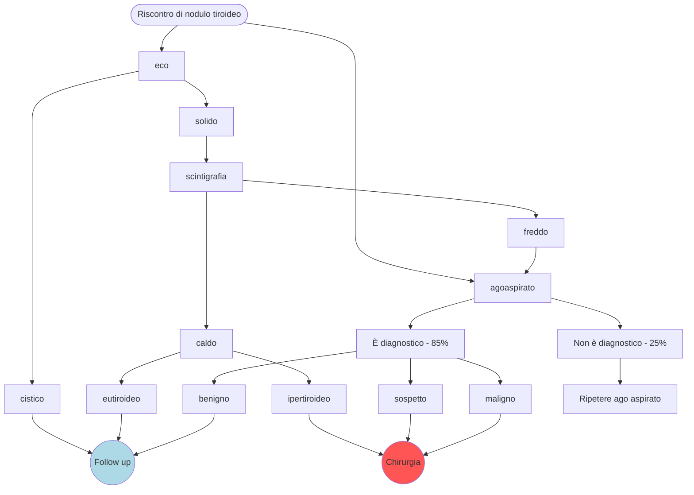

\clearpage
\part{Chirurgia generale e semeiotica chirurgica}
- __La decisione sull'eventuale approccio chirurgico del pz. deve essere presa soppesando i pro e i contro__
	- La situazione patologica può essere risolta solo chirurgicamente?
	- La situazione patologica va risolta in modo tempestivo? Quanto è urgente?
	- Il pz ha comorbidità importanti? \marginnote{E.g: cardiopatia ⇒ x10 rischio intervento generico}
	- L'intervento chirurgico ha il potenziale di risolvere la situazione in modo definitivo? E se no, il beneficio che produce è commisurato al rischio?
- La valutazione del paziente deve _sempre essere_
	- Metodica
	- Logica (non esami a caso)
	- Evidence based

# Cirrosi epatica

## Clinica
- \pat{cirrosi} --- modificazione progressiva e irreversibile del parenchima epatico in senso necrotico. Il parenchima viene poi sostituito, in seguito a processi di riparazione, con tessuto fibrotico cicatriziale, funzionalmente non attivo ⇒ perdita progressiva della funzione epatica
	- Cirrosi ben compensata ⇒ quadro asintomatico
	- Cirrosi non compensata ⇒ quadro sintomatico

### Esame obiettivo
- S&S
	- \textsc{\textbf{epatomegalia}}
		- Durante inspirazione è possibile apprezzare l'aumento di volume aptico
		- Altre cause di epatomegalia: steatosi, altra epatopatia pre--cirrotca
	- [\s{spider nevi}](https://upload.wikimedia.org/wikipedia/commons/4/42/Spider_nevus.jpg)
		- Lesioni vascolari con aspetto "a ragnatela", solitamente presenti nella regione delle spalle
		- Costituiti da un'arteriola centrale circondata da numerosi vasi
		- Alla digitopressione: virano verso il bianco
	- \s{ittero}/\s{subittero} (a seconda della gravità)
	- \s{ascite} ⇒ \s{addome batraciano}
	- Spesso \s{splenomegalia}
	- Spesso alterazioni ormonali e metaboliche (↓ testosterone, ↓ clearance di estrogeni)
		- ⇒ perdita della libido, ginecomastia, riduzione dei peli
	- Segni e sintomi generici: astenia
	- Segni e sintomi di contorno: torpore, confusione mentale, tremore, depositi di colesterolo
- Laboratorio
	- Spesso (50% cirrotici) si ha < Hb rispetto a sg. sano
	- ↑ Azotemia/ammoniemia
	- Sintesi proteica bassa (⇒ bassa osmolarità del sangue ⇒ edemi e ascite)
	- Bilirubina elevata ⇒ ittero
	- Alterazioni enzimatiche (↑ transaminasi)
	- Alterazioni dei fattori della coagulazione (> INR, PTT allungato^[PTT (PT Time, ProThrombin Time, Tempo di Protrombina) è il tempo necessario alla formazione del coagulo. Siccome il tempo dipende dalla quantità di materiale ematico e dal tipo di reagente per catalizzare la reazione si produce una misura derivata (l'__INR__, International Normalized Ratio) con lo scopo di esprimere il PTT in maniera standardizzata e del tutto indipendente dalla metodica con la quale si è calcolata la PTT])
	- Piastrinopenia
- Esami di secondo livello
	- Imaging (eco, TAC, RMN)
	- Elastografia (valutazione del grado di fibrosi del fegato)
	- Biopsia (per valutazione _istologica_ del fegato)

## Complicanze
- \pat{ipertensione portale} ⇒ anastomosi porto--cavali
	- \pat{varici esofagee} sanguinolente
	- \s{addome a caput medusae}
- \s{ascite}
	- ⇒ [\pat{sindrome compartimentale}](#sindrome-compartimentle) !
	- ⇒ Difficoltà respiratorie
	- ⇒ ↑ probabilità di \pat{pbs} (peritonite batterica spontanea) \marginnote{Questo può essere una conseguenza anche iatrogena, dall'intervento di paracentesi necessario per drenare il fluido ascitico}
	- ⇒ sequestro di liquido ⇒ ipovolemia relativa (↓ VCE)
- Encefalopatie (⇐ ammoniemia)
- Alterazioni ormonali e metaboliche ⇒ quadri patologici sovrapposti
	- \pat{emocromatosi}
	- \pat{tiroidite}
	- \pat{cirrosi biliare primitiva} (processo cirrotico (infiammazione ⇒ necrosi ⇒ fibrosi) a carico dei dotti biliari)
- \pat{sindrome epatorenale} (insufficienza renale secondaria a ipoperfusione renale)
- \pat{epatocarcinoma}

## Follow up
- Eco ogni 6 mesi
- Necessario f/u regolare per controllare periodicamente
	- Compenso della cirrosi
	- Non evoluzione verso forme cancerose
	- Monitoraggio dell' eventuale ipertensione portale

# Insufficienza renale cronica
- Patologia caratterizzata da una funzionalità renale non adeguata alle necessità dell'organismo
- Se compensata generalmente non produce sintomi acuti: la sintomatologia si produce se si perde il compenso

## Clinica
- Astenia, anoressia
- Vomito, diarrea, alitosi
- Alterazioni ossee
	- Osteomalacia
	- Osteite fibrosa
- Laboratorio
	- ↓ Hb
	- ↑ azotemia
	- Ionemia alterata: ↑ K^+^, ↑ P, ↑ Mg
	- ↑ creatinina (⇐ ↓ VFG)
	- Alterazioni nell'equilibrio del calcio (↓ Ca^++^ ematico), iperparatiroidismo ⇒ alterazioni ossee
	- ↑ glicemia

### Complicazioni
- Insufficienza cardiaca
- Pericardite uremica
- Coma uremico

## Dialisi
- Trattamento salvavita per pz. con insufficienza renale cronica
- 2 tipologie
	- Emodialisi
	- Dialisi peritoneale

### Emodialisi
- Setting: ospedaliero
- Macchina che, in maniera continua (a cicli di ~ 4h)
	- Preleva il sangue del pz., tramite accesso venoso
	- Fa passare il sangue in una serie di filtri che, __per osmosi__, rimuovono i metaboliti di scarto dal sangue
	- Reimmette il sangue nel pz.
- Mediamente il pz. con insufficienza renale cronica fa dialisi 3 volte a settimana
- Accesso vascolare di buona qualità è requisito essenziale per dialisi
	- Pz. che deve fare emodialisi in urgenza → CVC/CVP
	- Pz. che deve fare emodialisi continuativa → fistola arterovenosa costruita chirurgicamente
	- Se pz. non ha accesso venoso di buona qualità che rimane usabile per molto tempo: problema
- Trapianto > dialisi (idealmente ogni dializzato dovrebbe ricevere trapianto di rene)

### Dialisi peritoneale
- Setting: domiciliare (molto meglio tollerata da pz.)
- Macchina che, in maniera continua (spesso cicli notturni)
	- Inietta in addome un liquido "pulito" nell'addome del pz.
	- Il liquido permette scambi osmotici con il sangue che afferisce al peritoneo e all'addome
	- Recupera il liquido "sporco" dall'addome del pz.
- Necessita di catetere inserito in addome ⇒ attenzione a infezioni! Se si verificano possono arrivare alla peritonite!
- Generalmente efficacia ↓ nel tempo:
	- Primi anni di dialisi eseguiti con modalità peritoneale
	- Passaggio a emodialisi quando dialisi peritoneale perde efficacia

# Sindrome compartimentale dell'addome
- Sindrome patologica causata dall'__aumento della pressione addominale__ (IAP) __> 20 mmHg__ \marginnote{\emph{Ipertensione addominale} se 12 mmHg ≤ IAP < 20 mmHg}
- ↑ IAP è secondario a tante cause
	- Aumento di fluidi nel terzo spazio ed edema
	- Raccolta di fluido (spesso ascitico, da cirrosi)
	- Infiammazione degli organi addominali (pancreatite, peritonite)
	- Ascessi in addome (fegato, anse intestinali...)
	- Ernia/occlusione intestinale
	- Cause iatrogene
		- Mantenimento di pressioni elevate in addome per molto tempo (es: laparoscopia)
		- Terapia con fluidi molto aggressiva

## Clinica

\ 

## Complicanze
- ↓ postcarico ⇒ ↓ GC ⇒ ipoperfusione → ischemia
- Insufficienza renale (per ipoperfusione)
	- Anuria
- Peggioramento della dinamica inspiratoria (per ostacolo meccanico in inspirazione) → ARDS
- Acidosi metabolica + respiratoria (per peggioramento della dinamica renale e polmonare)
- Ischemia intestinale
- Instabilità emodinamica
- ↑ ICP → edema cerebrale

## Approccio terapeutico
- Gestire la situazione __rimuovendo la causa__
- Se IAP > 20 mmHg: indicazione alla decompressione chirurgica (apriamo la pancia)
	- Spesso addome viene mantenuto aperto per giorni (in condizioni di sterilità)
	- Possibile collegare l'addome aperto a meccanismi di aspirazione (_pompe VAC_) per ↓ pressione attivamente^[Esempio in cui questo ha successo: pz. trapiantati di fegato con pancreatite severa ⇒ ↑↑ IAP. IAP ridotta con successo tramite decompressione chirurgica + VAC)]
- Gestire le complicanze

# Ernia addominale
- __Ernia__: fuoriuscita di viscere (tutto o in parte) dalla cavità in cui è contenuto a causa di una debolezza delle strutture anatomiche che normalmente lo devono contenere
- Incidenza: ~ 5% (> bambini e anziani)
- Fattori di rischio
	- Gravidanza
	- Predisposizione anatomica (lassità congenita, ampiezza del bacino...)
	- Condizioni patologiche che ↑ IAP (tosse violenta, pianto, defecazione difficoltosa)
	- Sollevamento pesi

## Anatomia dell'ernia e classificazione
- L'ernia, genericamente, è costituita da 3 elementi principali \asidefigure{img/anatomia-ernia.png}{}
	1. \a{porta} --- punto attraverso il quale il viscere esce dalla cavità addominale
		- Se l'orifizio è precostituito: __ernia diretta__
		- Se l'orifizio è quello d'ingresso di un canale: __ernia indiretta__
	2. \a{sacco} --- parte del peritoneo che esce con il viscere
		- \a{colletto}: parte iniziale
		- \a{corpo}
		- \a{fondo} con tessuto adiposo (\a{lipoma preerniario}, utile per l'orientamento anatomico)
	3. \a{contenuto}
		- Erniano, naturalmente, solo __organi peritoneali e mobili__
		- Frequenti: tenue, sigma, a volte vescica
		- A volte: grande omento, appendice epiploica del colon
- A seconda del distretto addominale in cui si sviluppa l'erniazione, individuiamo
	- Ernia inguinale
	- Ernia ombelicale
	- Ernia femorale
	- Ernia diaframmatica
	- Altre tipologie di ernie

### Ernia inguinale
- Ernie addominali più comuni (75% di tutte le ernie addominali)

\normalbox{Anatomia del canale inguinale, breakable=true}{
\includegraphics{img/ernie-inguinali-1-1.jpg}

\tcblower

\begin{itemize}
\tightlist
\item Punti di forza
  \begin{itemize}
  \item Residuo fibroso dell'arteria ombelicale
  \item \tol{uraco}
  \item Vasi epigastrici inferiori
  \end{itemize}
\item
  Regioni di debolezza, delimitate lateralmente dai punti di forza di
  cui sopra
  \begin{itemize}
  \tightlist
  \item Fossetta mediale
  \item Fossetta media
  \item Fossetta laterale
  \end{itemize}
\end{itemize}
}

- A seconda della regione di debolezza attraverso la quale si sviluppa, l'\pat{ernia inguinale} è classificata in 3 tipologie
	- Se si sviluppa attraverso la fossetta mediale ⇒ \pat{ernia inguinale} indiretta obliqua interna
	- Se si sviluppa attraverso la fossetta media ⇒ \pat{ernia inginale} diretta
	- Se si sviluppa attraverso la fossetta laterale ⇒ \pat{ernia inguinale} indiretta obliqua esterna

### Clinica
- S&S
	- Dolore (punta d'ernia)
	- Tumefazione, che spesso diventa maggiormente apprezzabile se il pz., in posizione eretta, esegue la __manovra di Valsalva__^[Il pz. tossisce o trattiene il fiato contraendo i muscoli addominali (o fa qualsiasi altra cosa per ↑ IAP. Se ernia inguinale: mettendo un dito nel canale inguinale del pz. si sente la protrusione del viscere che aumenta]
- Dd (sopratutto in caso di ernia inguino--scrotale)
	- Idrocele (ma: alla transilluminazione scrotale non si apprezzano anse intestinali)
	- Varicocele (ma: alla palpazione si apprezza il \ven{plesso venoso pampiniforme})
- Nel considerare approccio chirurgico, bisogna considerare (rischio/beneficio)
	- Riducibilità manuale dell'ernia
		- Ernia riducibile tramite manovra di compressione digitale (\far{manovra per taxis}) ⇒ ↓ approccio chirurgico
		- Ernia non riducibile ⇒ ↑ approccio chirurgico
	- Quanto il dolore ("punta d'ernia") è impattante a seconda dello stile di vita del pz.
	- Fisiopatologia del pz.
		- Porta piccola ⇒ ↑ rischio complicanze
		- Eventuali comorbidità ⇒ ↑ rischio

### Complicanze
- Incarceramento (l'ernia diventa irriducibile _per taxis_ a causa di aderenze fibrotiche)
- Intasamento (accumulo di materiale fecale in ansa erniata ⇒ ostacolo al transito)
- Strozzamento ⇒ ischemia del viscere per compressione del suo peduncolo vascolare ⇒ problema!
- Rottura ⇒ tossiemia, peritonite batterica, shock tossico e sticazzi \marginnote{La rottura è accompagnata da altri segni e sintomi: segni clinici di peritonite, leucocitosi, addome duro, dolore diffuso a tutta la zona addominale...}

### Terapia
\footnotesize
Approccio in acuto, perché tendenzialmente la presentazione è acuta
\normalsize

- Primo tentativo di riduzione manuale
- Se non efficace: antidolorifico, miorilassante + borsa acqua calda in addome per rilassare la parete e ↓ dolore
- Secondo tentativo di riduzione manuale dopo tp.
- Se l'ernia non si riduce (_ernia incarcerata_): eco doppler o (meglio) TAC mdc per valutare flusso ematico (ed eventuale strozzamento) e contenuto
	- Se solo incarceramento o intasamento: _tendenzialmente_ non urgenza
	- Se anche strozzamento o rottura: urgenza!

# Shock
- \pat{shock} --- condizione solo inizialmente reversibile caratterizzata dal compromissione della perfusione d'organo con conseguente inadeguata ossigenazione tissutale
	- Danno cellulare → danno locale → danno sistemico (MOF)
- A seconda delle 3 eziologie possibili individuiamo 6 (+1) tipologie di shock \marginnote{Di fatto rispecchiano i 3 fattori che influenzano l'output cardiaco e l'efficacia della perfusione: la contrattilità cardiaca, il precarico e il postcarico, le resistenze periferiche totali: \begin{align*}Pressione &= \text{Resistenza} \times \text{Gittata Cardiaca}\\ &= R \times (FC \times \text{volume di eiezione})\end{align*} }
	- ↓ della contrattilità cardiaca
		1. __Shock cardiogeno__
	- ↓ del volume di eiezione
		2. __Shock ostruttivo__
		3. __Shock ipovolemico__
	- ↓ delle resistenze periferiche totali (shock distributivo)
		4. __Shock settico__
		5. __Shock anafilattico__
		6. __Shock neurogeno__ (+ __shock spinale__)

\normalbox{Shock caldi e freddi}{
Pur essendo una nomenclatura oramai superata, può capitare di sentir classificare lo shock in 2 gruppi a seconda dell'effetto che producono sulla TC

\begin{itemize}
\tightlist
\item Shock freddo --- da deficit di pompa o di volume (shock cardiogeno, ostruttivo o ipovolemico)
\item Shock caldo --- shock distribuiti
\end{itemize}
}

## Shock cardiogeno
- Shock causato da ↓ della capacità contrattile del cuore
- Cause
	- IM
	- Miocarditi
	- Patologie cardiache che danneggiano al parete muscolare

## Shock ostruttivo

## Shock ipovolemico
- Shock causato da ↓ del precarico per via di una grande perdita di liquidi non rimpiazzata
- Cause
	- Disidratazione
	- Vomito o diarrea abbondanti e protratti
	- Emorragia (shock emorragico)

### Shock emorragico
- Shock conseguente ad emorragia \marginnote{Emorragia --- perdita acuta di massa circolante}
	- VCE ~ 7% peso corporeo (8--9% in bambini, meno in obesi)
	- Attenzione a variabili confondenti
		- Età
		- Localizzazione anatomica e tipo della lesione
		- Eventuale terapia preospedaliera (infusiva o di controllo della PA)
		- Tempo dal trauma (se è un trauma)
		- Farmaci assunti che possono mascherare risposte

\greenbox{Risposte fisiologiche alla perdita di sangue}{
\begin{itemize}
\tightlist
\item Risposta emodinamiche (adrenergiche)
  \begin{itemize}
  \tightlist
  \item Vasocostrizione del circolo periferico (cute, muscoli, viscerale)
  \item ↑ FC
  \end{itemize}
\item Risposta cellulare
  \begin{itemize}
  \tightlist
  \item Passaggio da metabolismo ossidativo a quello anaerobio (⇒ ↑ lattati ⇒ ↓ pH)
  \end{itemize}
\end{itemize}

\textbf{Edema dei tessuti} --- se la condizione di vasocostrizione periferica permane talmente tanto da portare a morte cellulare (quindi ischemia) vengono rilasciati una grande quantità di mediatori profiniammatori, metaboliti, ioni: questo porta a una infiammazione pesante dei tessuti e ad un conseguente aumento della permeabilità endoteliale; quindi ad edema e raccolta di fluido nel terzo spazio e ad un peggioramento marcato del quadro emodinamico (già carente in prima battuta)
}

\yellowbox{Parametri vitali da monitorare}{

\begin{center}
	Monitorare in maniera \textbf{continua}!
\end{center}

\begin{itemize}
\tightlist
\item PA
\item FC (correlarla con età e farmaci assunti\footnote{Il pz. è β-bloccato? È giovane o anziano?... Robe così, ragionamento clinico}
\item FR
\item Perfusione della cute
  \begin{itemize}
  \tightlist
  \item Letto ungueale (è roseo?)
  \item Refill capillare (\textless{} 2s?)
  \item Colore della cute
  \end{itemize}
\item TC\footnote{A volte è il pz. stesso che riferisce di avere freddo}
\end{itemize}
}

### Classificazione dello shock emorragico

\ 

\footnotesize
__Naturalmente i valori assoluti vanno rapportati all'età e all'anatomia del pz__. Notare che bambini hanno un ottimo meccanismo compensatiorio finchè tutto d'un tratto non compensano più una ceppa, mentre gli anziani hanno spesso un pessimo meccanismo compensatorio che può risultare insufficiente ad affrontare anche perturbazioni di lieve entità.

L'emorragia di classe I è una urgenza medica, ma non richiede alcun reintegro se ben compensata

L'emorragia di classe > II sono emergenze mediche

L'emorragia di classe > III è una urgenza/emergenza chirurgica

L'emorragia di classe IV è pericolosa per la vita nell'immediato
\normalsize

### Trattamento
1. Fermare la foce emorragica
2. Ripristinare aggressivamente il VCE (con colloidi, cristalloidi, sangue) \marginnote{\emph{Cristalloidi} --- liquidi contenenti sali e zuccheri disciolti. Abbandonano facilmente il comparto intravascolare per passare nel terzo spazio, per cui nel caso vengano usati per riempimento volemico occorre somministranre una quantità superiore a quella persa realmente \\ \emph{Colloidi} --- liquidi con alto contenuto proteico. Contenendo molecole di grandi dimensioni rimangono efficacemente nello spazio intravascolare (sono infatti detti \emph{espansori del volume ematico})}
3. Agire per ripristinare la perfusione d'organo e l'ossigenazione periferica

## Shock settico
- Shock causato dal passaggio di liquido dal letto vascolare al terzo spazio a causa di eventi patologici causati da uno stato di sepsi severa

## Shock anafilattico
- Shock causato dal passaggio di liquido dal letto vascolare al terzo spazio a causa di una aumentata permeabilitò endoteliale, frutto di una anomala azione del sistema immuntario

## Shock neurogeno e shock spinale
- Shock neurogeno --- Shock causato dal calo repentino delle resistenze periferiche in un contesto di lesioni al SNC, che determinano la perdita del tono simpatico
- Shock spinale --- Shock causato dal calo repentino delle resistenze periferiche (con mancanza dei meccanismi di compenso) in un contesto di lesioni spinali (spesso alte) che determinano l'interruzione delle vie simpatiche

## Richiami di semeiotica del torace

### Linee di repere

\ 

- Regioni individuate dalle linee (le regioni di confine non sono di esclusiva pertinenza toracica, ma anche addominale o cervicale)
	- Regioni anteriori (dx e sx)
		- Regione sovraclaveare
		- Regione sottoclaveare
		- Regione mammaria
		- Regione ipocondriaca
	- Regioni posteriori (dx e sx)
		- Regione sovrascapolare
		- Regione scapolare (dx, intra e sx)
		- Regione sottoscapolare

### Segni e sintomi tipici della semeiologia del torace
- Dispnea (segno o sintomo)
	- Soggettiva: dispnea riferita non correlata a ↓ SpO~2~
	- Oggettiva: dispnea correlata a ↓ SpO~2~
- Dolore (sintomo)
	- Superficiale vs profondo
	- Localizzato vs genralizzato
	- Irradiante
	- Descritto come: spillo, pugnalata (trafittivo), pugno, peso (oppressivo), scoppio...
- Tosse (segno e sintomo)
	- Emoftoe: espettorato rosso chiaro
	- Emottisi: emissione di sangue con colpo di tosse
	- Vomica: emissione di pus con colpo di tosse
- Emantemesi

### EO del torace
\footnotesize
\begin{center}
Per ogni aspetto valutare sia situazione statica che dinamica!
\end{center}
\normalsize

1. Ispezione
	- Forma (normale, a botte)
	- Simmetria di ogni elemento
	- Mobilità e simmetria all'espansione
	- Cute e sottocute (colore, marezzatura, nevi, cicatrici, rilevi, ferite, corpi estranei)
2. Palpazione
	- Stimare mobilità dei campi superiori e inferiori
	- Ricerca di enfisema sottocutaneo
	- Fremito vocale tattile (_FVT_) \marginnote{\emph{FVT} --- Valutato ponendo la mano di taglio sui vari campi polmonari e apprezzando la vibrazione che si propaga dalle corde vocali all'albero respiratorio, al parenchima e alla nostra mano quando il pz. dice una parola con tante consonanti (solitamente "trentatrè")}
3. Percussione
	- Ricerca del _suono chiaro polmonare_ (SCP) in tutti i campi
		- Iperfonesi ⇒ ↑ aria^[BPCO, bolle aeree (> in pz. giovane (20--30aa), alto, maschio), pneumotorace (anche iperteso)]
		- Normofonesi ⇒ ok
		- Ipofonesi, ottusità relativa, ottusità completa ⇒ c'è "qualcosa" di non gassoso nel parenchima che si sta percuotendo (massa, fluido, versamento pleurico, parenchima consolidato per infiammazione...)
4. Auscultazione
	- Murmure vescicolare sui 4 campi a/p (presente, ridotto o abolito)
	- Ricerca di rumori aggiunti

### Diagnostica strumentale

#### Imaging
- RX torace
- TAC torace
- PET^[Tomografia ad Emissione di Positroni] torace
- Eco torace

#### Altri metodi
- BAL (Lavaggio bronco--alveolare) --- tramite broncoscopio (endoscopio apposito) si osserva l'albero delle vie aeree. Successivamente si introduce acqua e si aspira, per avere un campione del materiale profondo polmonare (solitamente per coltura). In alternativa, tramite modificazioni apposite, si può fare biopsia (solitamente per citopatologia)
- Toracentesi --- puntura del torace, solitamente per raggiungere lo spazio pleurico. Ha obiettivo sia diagnostico (qualità ed eventuale coltura del versamento) o terapeutico (ridurre eventuale versamento)
- Toracoscopia --- introduzione di toracoscopio tramite incisioni negli spazi intercostali, per avere accesso diretto per diagnosi o chirurgia

# Sindromi da occupazione del cavo pleurico
- _Sindrome_ --- presenza contemporanea di segni e sintomi caratteristici di una certa condizione

## PNX
- \pat{pneumotorace} --- presenza di aria nel cavo peurico
- 3 cause principali
	- Idiopatico
	- Post traumatico
	- Iatrogeno (secondario a procedure di pertinenza toracica, o CVC, o altro)
- Caratteristiche del PNX
	- Aperto vs chiuso --- se vi è una lesione che mette in comunicazione il cavo pleurico con l'esterno o no
	- Iperteso --- se si determina un meccanismo a valvola unidirezionale per cui la pressione intratoracica aumenta con ogni ispirazione senza diminuire con l'espirazione
		- È un grande problemone (emergenza!)
		- Generalmente si complica con scompenso cardiaco acuto da riduzione del precarico
- La diagnosi è clinica + imaging
	- S&S
		- FVT abolito, SCP aumentato (iperfonesi), MV ridotto/abolito
		- Possibile asimmetria del torace
		- Possibile ampliamento degli spazi intercostali
		- Possibile enfisema sottocutaneo
		- Dolore
		- Dispnea
		- Turgore giugulare
		- Shift mediastinico se PNX iperteso
	- Imaging (se dubbio o se abbiamo tempo, non se pz. instabile)
		- RX torace
		- TAC torace

\redbox{Cause tipiche del PNX iperteso}{
\begin{itemize}
\tightlist
\item Trauma (chiuso o penetrante)
\item Complicanza del PNX semplice
\item Iatrogena
  \begin{itemize}
  \tightlist
  \item Ventilazione meccanica a pressione positiva (per rottura di alveoli ⇒ produzione di bolle enfisematose più fragili e prone a rottura\}
  \item Complicanza riconosciuta di CVC
  \end{itemize}
\end{itemize}
}

- Terapia: drenaggio toracico
	- Temporanea: ago grande (14 G) nel secondo spazio intercostale a livello della linea emiclaveare; avanzare fino a superare la parete muscolare
	- Definitiva: drenaggio toracico con tubo a livello del quinto spazio intercostale, a livello della linea ascellare media
	- Se PNX aperto: medicazione sigillata su 3 lati + drenaggio toracico lontano dalla ferita

\redbox{Punto di sicurezza per attraversare lo spazio intercostale}{
\textbf{Il punto di sicurezza per attraversare la parete intercostale è il margine superiore della costa ⇒ scelgo lo spazio intercostale e sto aderente al margine superiore della costa inferiore}
}

## Versamento pleurico
- \pat{versamento pleurico} --- presenza di fluido nel cavo pleurico
- A seconda del tipo di fluido si classifica il versamento pleurico in
	- Trasudato → idrotorace
	- Essudato → empiema pleurico
	- Sangue → emotorace
	- Liquido chiloso → chilotorace
	- Urina → urinotorace
- La diagnosi è clinica, ed eventualmente con imaging
	- Pz preferisce decubito sul lato del versamento (per ridurre l'effetto del versamento sul parenchima polmonare grazie alla gravità)
	- FVT ridotto/abolito, SCP ridotto/abolito, MV ridotto/abolito
	- Dolore, dispnea ingravescente
	- Sintomi simili a pnx (alla fine patogenesi è identica, cambia solo la roba che si accumula nella cavità toracica)

#### Emotorace
- __Emotorace semplice__ --- poco sangue in cavità toracica
	- Causa
		- Lacerazioni polmonari
		- Lacerazioni di vasi di piccolo/medio calibro (intercostali, mammaria interna...)
	- Tendenzialmente autolimitante ⇒ spesso emostasi spontanea
	- Se clinica evidente: drenaggio toracico
- __Emotorace massivo__ --- molto sangue in cavo pleurico
	- Tendenzialmente: > 1500 ml o > 1/3 VCE
	- Causa
		- Traumi (penetranti > chiusi)
		- Lacerazioni di vasi di grosso calibro
	- 2 ordini di problemi che si sovrappongono
		- Dinamica respiratoria severamente compromessa
		- Ipovolemia marcata (shock di classe 2/3)

## Tamponamento cardiaco
- \pat{tamponamento cardiaco} --- raccolta di liquido all'interno della sacca del pericardio
- Pericardio è fibroso e difficilmente estensibile ⇒ se si riempe di sangue questo comprimerà cuore e grossi vasi
- Cause
	- Sanguinamento di vasi propri del pericardio (poca preoccupazione)
	- Lacerazione delle coronarie (grave)
	- Traumi/lacerazioni della parete cardiaca (catastrofico)

### Clinica
- S&S
	- Triade di Beck
		1. ↑ PVC cruenta
		2. ↓ PA (shock)
		3. Ovattamento dei toni cardiaci
	- Dolore toracico
- Complicanze
	- PEA ⇒ ACC
- Diagnosi
	- Eco FAST^[Focused Assisted Sonography for Trauma pt] per individuare con certezza il tamponamento \asidefigure{img/e-fast.png}{Sequenza degli step per effettuare una eco FAST. Nella versione Extended-FAST le immagini da ottenere sono di più}
	- Se e-FAST suggestiva per la presenza di liquidi in pericardio: assumere che siano sangue fino a prova contraria
- Terapia: pericardiocentesi per evacuare fluido
	- Se alla pericardiocentesi viene evacuato fluido non ematico: considerare coltura

## Lacerazioni del diaframma
- Spesso secondarie a traumi chiusi
- Non sono causa diretta di ingombro del cavo pleurico, ma un diaframma lacerato o con zone a minor resistenza ↑ probabilità di erniaizone dei visceri addominali (ileo/colon)

# Trapianto d'organo

## Introduzione al trapianto d'organo
- Trapianto d'organo è intervento salvavita
	- ↑ aspettativa di vita
	- ↑ qualità di vita (↓ dipendenza da cure)
- Purtroppo richiesta di organi > disponibilità. Fintanto che permane questa condizione:
	- Necessario privilegiare i riceventi che ottengono un outcome migliore (sopravvivenza + qualità di vita)^[Cutoff anche abbastanza rigidi (sopravvivenza a 5 anni > 50%)]
	- Necessario usare anche _"organi marginali"_, ovvero organi in condizioni non eccellenti (per età, patologie pregresse del donatore, stato funzionale...) che però risultano comunque utili se trapiantati sotto opportune condizioni
- Come per ogni procedura chirurgica bisogna valutare bene rischio/beneficio

### Scelta del donatore
- 2 categorie di donatori \marginfig{notoucheu}
	1. DBD --- Donatore deceduto di morte cerebrale (95% dei trapianti)
	2. DCD --- Donatore a cuore fermo (5% dei trapianti)
		- Donatore da morte cardiaca _uncontrolled_ (improvvisa)
		- Donatore da morte cardiaca _controlled_ (prevista e aspettata) \marginnote{Di fatto sono quei pazienti senza alcuna prospettiva di cura, dove si prende la decisione di evitare l'accanimento terapeutico perché non vi è nessuna possibilità di migliorare la situazione. Per la diminuzione dell'intensità di cura il pz. si aggrava e muore per ACC. In questo senso la morte è attesa, nel senso che non sono situazioni cliniche che terminano in ACC in maniera inaspettata}
- Nei donatori da morte cerebrale
	- Espianto degli organi non appena viene dichiarata la morte cerebrale
	- Tendenzialmente la famiglia acconsente all'espianto solo nel 60--80% dei casi
- Nei donatori da morte cardiaca
	- Espianto degli organi legalmente consentito dopo _no-touch period_ (ITA: 20 min^[In altri paesi il periodo di no--touch è sensibilmente infeirore (2, 5, 10 min)])
	- NtP ⇒ l'organo rimane per del tempo non perfuso ⇒ ↓ qualità d'organo. Sono quindi necessarie metodiche per perfondere l'organo (solitamente tramite macchine apposite)
- Necessario effettuare un bilancio tra qualità dell'organo e disponibilità
	- È raro trovare un organo di qualità ⇒ scegliere solo di trapiantare organi di qualità significa fare pochi trapianti, ma avere meno rischio di fallimento
	- È meno raro trovare un organo di qualità subottimale ⇒ scegliere di trapiantare organi di questo tipo significa fare più trapianti, ma esporsi ad un rischio di faillimento maggiore
- In linea generale di un donatore, per stabilire l'idoneità alla donazione degli organi, si studia
	- Anamnesi ed EO finalizzato all'espianto
	- Causa di morte
	- Eventuali patologie
	- Stato funzionale del donatore e dell'organo
		- Indici di funzionalità epatica (indici di epatonecrosi, di colestasi, AST, ALT, γGT-fosfatasi, bilirubina totale + frazionata...)
		- Indici di funzionalità renale (urea, creatinina)
		- EGA (pH, bicarbonato, elettroliti sierici, lattati, indici di danno d'organo...)
	- Eventuali infezioni trasmissibili col trapianto (sierologia virale)
	- Biopsia + citologia dell'organo per valutare lesioni neoplastiche/metastatiche e stato dell'organo
	- Esami strumentali
		- RX torace + addome
		- Eco torace + addome
		- TAC (?)
	- Ispezione cavità addominale e toracica subito prima dell'espianto

#### Donatore con criteri estesi (ECD) e organi marginali
- La progressione delle tecniche rianimetorie e di riperfusione ha permesso di sfruttare organi provenienti da un numero maggiore di donatori
- Ci sono criteri per quantificare la "qualità" del donatore
	- __Donatore ideale__
	- __Donatore marginale__ (donatore scelto con criteri estesi, o ECD^[Expanded Criteria Donor])
		- Età > 60 aa
		- 55aa > Età > 60aa, con almeno 2 criteri
			- Creatinina > 1.5 mg/dL
			- Ipertensione arteriosa (o storia di)
			- Morte per cause cerebro--vascolari
		- Criteri organospecifici a seconda dell'organo da donare
			- Score di Karpinski--Remuzzi > 4
			- Criteri specifici per il fegato
			- ...

\yellowbox{Come quantificare la qualità dell'organo\: EC donors, breakable=true}{
L'uso della biopsia è essenziale per capire le caratteristiche citologiche dell'organo che si ha intenzione di utilizzare. L'obiettivo è avere informazioni su 2 fronti
\begin{itemize}
\tightlist
\item Eventuale presenza di lesioni neoplasiche (primarie o metastatiche), ed eventualmente il loro grado
\item Stato funzionale dell'organo
  \begin{itemize}
  \tightlist
  \item Infiammazione
  \item Steatosi
  \item Fibrosi
  \end{itemize}
\end{itemize}

\tcblower

\textbf{Score di Karpinski--Remuzzi} per il parenchima renale --- prima di trapiantare il rene si computa uno \emph{score} che tenga in considerazione il danno nei 4 aspetti del parenchima renale: tubulo, glomerulo, vascolarizzazione ed interstizio.

Lo score di Karpinski ha variabilità 0--8, e permette di decidere se e quanti reni trapiantare in un singolo donatore in funzione del loro stato:

\begin{itemize}
\tightlist
\item Score 0--3 ⇒ Un rene ad un paziente
\item Score 4--6 ⇒ Due reni ad un paziente
\item Score ≥ 7 ⇒ I reni non sono adatti al trapianto
\end{itemize}

Considerazioni analoghe vengono fatte per il fegato, naturalmente andando a valutare le caratteristiche proprie del parenchima epatico (tra cui anche il grado di fibrosi e steatosi, che se macrovescicolare e > 40\% del tessuto esclude dalla donazione)
}

#### Donatore con patologie trasmissibili: quantificazione del rischio
- Ci sono essenzialmente 2 categorie di patologie trasmissibili con trapianto
	- Patologie microbiologiche
	- Patologie oncologiche
- Tramite la valutazione clinica, sierologica (+ eventualmente citopatologia, stadiazione e grading) si individuano 3 categorie di rischio del donatore
	1. Donatore a rischio standard ⇒ Ok donazione
	2. Donatore a rischio non standard trascurabile
	3. Donatore a rischio aumentato calcolato
	4. Donatore a rischio inaccettabile ⇒ No donazione
- La categoria e il tipo di rischio serve a stabilire
	- Se il donatore può donare l'organo (o a chi^[E.g: HCV + se dona a ricevente HCV+ non ha problemi, viceversa è a rischio accettabile su pz. HCV-])
	- Se sono necessarie particolari terapie dopo la donazione (eg: antiretrovirali, etc)
- Si sceglie se effettuare il trapianto in funzione del rapporto rischio/beneficio per il ricevente^[Es: un ricevente con insufficienza epatica con aspettativa di vita < 7gg si può tollerare anche un organo da donatore con rischio aumentato, anche perché l'alternativa altrimenti è morire mentre si è in lista]
- In caso di dubbi: l'equipe che ha in gestione donatore e ricevente si raffrontano con __second opinion nazionale__ (reperibile 24/7) \marginnote{Esiste un second opinion di riferimento per ogni possibile branca di dubbio: second opinion oncologo, anatomopatologo, infettivologo...}

##### Donatore con patologie microbiologiche
- Valutazione della sierologia per infezioni trasmissibili (almeno HIV, HBV, HCV)
- Attenzione a non sottovalutare virus molto prevalenti nella popolazione (EBV, CMV...): il ricevente sarà immunosoppresso!

##### Donatore con neoplasia
- La presenza di neoplasie non è controindicazione assoluta alla donazione, ma relativa
- __Se il donatore ha neoplasie__: valutare il rischio di trasmissione con trapianto \marginnote{Metà dei donatori ha > 60aa, e il rischio di manifestazioni neoplasiche cresce con l'età}
	- Tumore solido o liquido?
	- Valutare la sede del tumore primario: posso comunque trapiantare altri organi o ci sono metastasi diffuse?
	- Valutare lo stadio del tumore: possono esserci neoplasie che compromettono altri organi?

### Prima del prelievo d'organo
0. Anamnesi + EO + accertamenti citologici e strimentali sull'organo e sul pz.: TAC + eco + biopsia + patologia + ... __a caldo__ (top: a cuore battente/organi perfusi)
	- Studi bolognesi hanno dimostrato che organi anziani (donatore > 60aa) scelti aspettando il risultato degli esami strumentali e citologici _prima_ di interrompere la perfusione (_biopsia a caldo_) ↓ tempi di ischemia dell'organo ⇒
		- Hanno tassi di sopravvivenza simili a quelli ottenuti con organi più giovani
		- Hanno una migliore ripresa funzionale
1. Ispezione dell'interno della cavità addominale per valutare anomalie macroscopiche (neoplasie)
2. Ispezione dell'interno della cavità toracica in collaborazione con l'equipe che espianta gli organi toracici
3. Ispezioni delle stazioni linfonodali profonde
4. Perfondere e lavare gli organi (in accordo con le varie equipe chirurgiche, visto che vengono lavati tramite incannulamento dei grandi vasi)

### Prelievo d'organo
- Organo prelevato secondo la metodica chirurgica appropriata, espiantando appropriatamente anche le strutture anatomiche aggiuntive necessarie \marginnote{Inizio del \textbf{tempo di ischemia}}
	- Trapianto di fegato: \a{fegato}, \ven{vena porta}, \art{arteria epatica}, un segmento di \ven{vena cava} e le \ven{vv. sovraepatiche}
	- Trapianto di rene: \a{rene}, \a{uretere}, \ven{vena renale}, \art{arteria renale}
- Adottare le metodiche di preservazione appropriate per mantenere il graft nella maniera migliore possibile, a seconda di
	- Tipo di organo
	- Tipo di donatore (DCD vs DBD) \marginfig{imgdcdalgoritmo}
	- Situazione clinica dell'organo (è organo marginale da donatore ECD?)\todo{ref} \marginnote{\emph{ECD} = Extended Criteria for Donation}

#### Preservare il graft
\footnotesize
Non tutte le metodiche sono applicate correntemente nella pratica clinica routinaria o con qualsiasi organo. Alcune metodiche sono usate solamente per DCD, o in ambito di ricerca (per ora), o solo per alcuni tipi di trapianti, o alcune tecniche vengono combinate tra di loro in vari momenti dell'esecuzione dell'intervento, o solo in alcuni paesi. Insomma: \textbf{la situazione è molto variegata e dipende dalla casistica}
\normalsize

- 2 ordini di obiettivi principali
	1. Migliorare la funzionalità del trapianto e il suo outcome (standard nel caso dei DCD)
	2. Recuperare organi altrimenti non utilizzabili con successo
- Strategie per ridurre il danno ischemico del graft: \marginfig{atptissutaleconservazioneespianto}
	0. ↓ dei tempi di ischemia (calda e fredda) mediante appropriata organizzazione dei test, delle operazioni di espianto e di impianto, per quanto possibile. ECMO (anche regionale) quando non possibile
	1. CS --- Static Cold Storage in borsa sterile a 4°C (↓ metabolismo ⇒ ↓ danno ischemico) \marginnote{A 4°C l'attività metabolica scende al 10\% rispetto a quella che si ha in normotermia}
		1. Un sacchetto con organo + liquido di perfusione
		2. Un sacchetto con ghiaccio sterile per mantenere ipotermia
		3. Un sacchetto per mantenere sterilità del tutto
	2. Hyp --- Static Cold Hyperbaric Oxygenation
	3. PE --- Perfusione ipotermica senza ossigeno
	4. PE-Hyp --- Perfusione ipotermica con ossigeno iperbarico
	5. PE-O~2~ --- Perfusione ipotermica con ossigeno (HOPE)
	6. Perfusione in subnormotermia
	7. Perfusione in normotermia con il sangue tramite macchinari esterni (ECMO o altro)

- In Italia (sopratutto per __donatori DCD__) si usa sempre di più un approccio che prevede più tecniche di conservazione del graft a seconda del momento operatorio \marginfig{imgdcdalgoritmo}
	1. Perfusione in normotermia prima dell'espianto (ECMO) mentre si aspettano i risultati laboratoristici per valutare lo stato dell'organo, in maniera da evitare l'ischemia dopo la morte cardiaca
	2. CS per il trasporto del graft
	3. HOPE nel periodo tra l'arrivo al centro per l'impianto e l'impianto vero e proprio

\begin{figure}[p]
\centering
\includegraphics[angle=270, width=0.8\textwidth]{img/algoritmo-dcd-trapianti.png}
\caption{Algoritmo di selezione e gestione di un paziente DCD per la donazione degli organi (ITA)}
\label{imgdcdalgoritmo}
\end{figure}

- Tendenzialmente: quantità dei lattati $\propto$ danno funzionale del graft
- Tecniche di perfusione d'organo vengono utilizzate

### Termine del prelievo
- Ricomporre la salma nelle condizioni migliori possibili
- Compilare verbale di prelievo e checklist indicando anatomia, tempo di clampaggio, perfusione e farmaci

## Trapianto di fegato
1. Sezione del \tol{legamento falciforme}
2. Esposizione del piccolo omento per valutare l'anatomia arteriosa
3. Incisione della colecisti e lavaggio con soluzione fisiologica
	- Incannulamento dell'aorta e della vena cava
	- Clampaggio dell'aorta toracica discendente per evitare che la soluzione di lavaggio vada nel torace
	- Perfondere la soluzione di lavaggio
4. Isolare il fegato dalle strutture limitrofe (stomaco e pancreas)
5. Infusione di soluzioni che preservano gli organi + \far{eparina} (per evitare la formazione dei trombi nei vasi
6. Mettere ghiaccio in cavità addominale e arrivare a ~ 4°C
7. Clampaggio dei vasi ed espianto dell'organo in condizioni di ischemia fredda

\footnotesize
Secondo alcuni lavori: tempo di prelievo > 50 min ⇒ rischio di alterata ripesa funzionale dell'organo. La letteratura sembra dimostrare che il fegato risenta maggiormente del danno ischemico rispetto a quanto succede per i reni (valutato come quantità di complicanze che si producono)
\normalsize

## Trapianto di rene
- Il nuovo rene (o i nuovi reni a seconda dello score di Karpinski) __viene trapiantato in \a{fossa iliaca}__. Questo perché l'uretere più è corto meglio è vascolarizzato ⇒ ↓ rischio di complicanze
	- Uretere viene vascolarizzato dall'\art{arteria renale} (preservata nel graft) e dall'\art{iliaca interna} (non preservata nel graft)
	- Mancando parte dell'apporto vascolare un uretere lungo non potrebbe essere adeguatamente vascolarizzato ⇒ necessario uretere corto
	- Tendenzialmente: uretere trapiantato < 10cm per essere vascolarizzato correttamente dall'arteria renale
- Fasi dell'espianto
	1. Apertura della parete anteriore dell'aorta e separazione dei due osti
	2. Sezionamento della parete posteriore dell'aorta per ottenere un ostio per un rene e un ostio per l'altro
	3. Estrazione del rene e dell'uretere, preservando il tessuto circstante per mantenere una corretta vascolarizzazione
		- Particolare attenzione a prelevare l'uretere con parte di tessuto necessario per la sua vascolarizzazione, altrimenti complicanze
	4. Eliminazione del grasso attorno al rene prelevato
	5. Ispezione del rene per notare anomalie macroscopiche
		- Se rilevate anomalie: vanno rimosse e analizzate con biopsia per avere sicurezza di espiantare un organo sano
	6. Prelevare i vasi (arteria e vena renale) per due ragioni
		- Usarli in ricostruzione vascolare nel trapianto del rene
		- Mandarli a banche di tessuti per criopreservazione e utilizzo successivo
- Dopo la dialisi si valuta la velocità della ripresa funzionale dell'organo trapiantato
	- Si parla di __DGF__ (_Delayed Graft Function_) se il pz. post trapianto richiede ≥ 2 dialisi
	- In organi marginali DGF ~ 40%, anche se nella maggior parte dei casi poi l'organo ha ripresa funzionale
	- ↓ DGF ≡ ↓ complicanze e ↓ degenza
	- Ridurre i tempi di ischemia (tramite [metodiche di presevazione del graft](#preservare-il-graft) sempre migliori ha permesso di passare da DGF ~ 50% a DGF ~ 24%

## Trapianto da donatore vivente
- Questi trapianti sono "trapianti ideali": non si ha fretta, si può studiare il donatore in maniera accurata e si può valutare la compatibilità ⇒ generalmente risultati migliori
- MA > rischio per donatore ⇒ valutare accuratamente rapporto rischio/beneficio sia per donatore che per ricevente^[Per esempio: donare emifegato più piccolo (sx), oppure rene meno funzionale per non danneggiare eccessivamente anche il donatore], quantificando precisamente il rischio \asidefigure{img/rischio-morte.png}{Tabella con il rischio di morte per attività}
	- Rischio principale: perioperatorio (emorragia > problematiche cardiovascolari > embolia polmonare/infezioni)
	- Ragionare anche sul lungo periodo: donare un rene aumenta il rischio di mortalità per il donatore (> 10aa)?
		- Il donatore ha fattori di rischio/comorbidità che, combinati con avere meno parenchima funzionante, aumentano il rischio (sia nel breve che nel lungo periodo)? (età, ipertensione, diabete, obesità, fumo...)^[Paradossalmente in questi casi il donatore potrebbe riuscire a correggere alcuni suoi comportamenti a rischio: se è così di fatto la donazione porta cambiamenti positivi sullo stile di vita che possono contribuire ad abbassare il rischio anche per il donatore d'organo]
- ~ 300 trapianti di rene/anno (ancora pochi!)
- Nuove alternative terapeutiche e immunosoppressive hanno permesso di ampliare il bacino di donatori idonei
	- Opportune terapie antiretrovirali hanno permesso di sfruttare donatori con pregresse infezioni virali croniche (es: HCV) senza problemi
	- Opportune terapie di ricondizionamento e immunosoppressione permettono di sfruttare organi anche senza compatibilità ABO tra donatore e ricevente (~ 10% dei trapianti)

### Scelta della tecnica chirurgica per il trapianto di rene da donatore vivente
- Per il trapianto di rene da donatore vivente ci sono 4 principali tecniche chirurgiche
	1. Laparotomia (FULL-LAP)
	2. Laparotomia Hand--assisted (HA-LAP)
	3. Con accesso tramite incisione di ridotta estensione, ~ 10cm (MINI-OPEN)
	4. Con accesso tramite incisione completa (OPEN)
- Idealmente: scegliere la tecnica chirurgica in funzione delle problematiche specifiche del donatore in questione
- Nella realtà: linee guida dicono di scegliere la tecnica trovando equilibrio tra
	- Esperienza dell'equipe $\propto$ volume di attività del centro trapianti^[Tendenzialmente meno esperienza ⇒ approccio il più "diretto" possibile (Open o Mini--open, o HA-Lap), perché si ha maggior sicurezza che in laparotomia)]
	- Anatomia (tendenzialmente rene dx ha arteria renale corta ⇒ ci sono certe tecniche che si prestano meglio)
	- Problematiche specifiche del paziente

### Trapianto di fegato da vivente
- Il fegato è un organo che si può rigenerare ⇒ possibile trapianto di _porzioni_ del fegato
- Tendenzialmente > rischioso rispetto a trapianto di reni
- Riservato solitamente per l'ambito pediatrico (genitore che dona a figlio)
- Tecnica oramai meno diffusa (lo era < anni 2000). Adesso tendenzialmente la domanda per il fegato in Ita è soddisfatta _abbastanza_ bene da donatori cadavere con tecnica split da donatori giovani
	- Segmento II e III vengono dati ad un centro pediatrico
	- Lobo dx destinato ad adulto
- Chiave: rimuovere una quantità di parenchima sufficiente per il ricevente e non eccessiva per il donatore (rischio di sufficienza epatica post--operatoria^[Evenienza che si verifica se: (1) si rimuove troppo parenchima; (2) si verificano infezioni nel post-operatorio; (3) ci sono problemi nella rigenerazione del lobo espiantato da parte del donatore]). Non easy ⇒ rischio >
- Ci sono tecniche che cercano di ridurre il rischio per il donatore e migliorare l'outcome per il ricevente
	- Tecnica RAPID --- Il donatore dona il lobo sx, che viene trapiantato al posto del lobo sx malato del ricevente. Dopo 4 settimane si rimuove la parte dx malata (perché la parte sx è sufficientemente cresciuta)
	- Tecnica di Bologna --- Il donatore dona il lobo sx, che viene trapiantato al posto della milza del ricevente. Quando il fegato sano diventa funzionalmente più importante di quello malato (valutato tramite scintigrafia) si rimuove il fegato malato
		- Più indaginosa: sono necessari diversi interventi
		- Pz. selezionati (epatocarcinoma, cirrosi): sono pz. difficili da operare
		- Non è detto che sia risolutiva in pz. oncologici
			- Contemporanea presenza di fegato malato e sano espone al rischio di recidive tumorali se nel periodo di compresenza di entrambi gli organi si propagano metastasi al fegato trapiantato
		- Valutare bene il rischio di splenectomia in pz. che sarà immunosoppresso (> rischio di infezione)

# Addome acuto
- \pat{addome acuto} --- sindrome clinica acuta o rapidamente ingravescente caratterizzata da sintomi a localizzazione addominale
	- Dolore addominale è una delle cause di accesso più frequente in PS
	- Tra i pz. ricoverati per addome acuto
		- 3% della mortalità se ricovero non chirurgico (management solo medico)
		- 8% della mortalità se ricovero chirurgico (management non può essere solo medico, ma richiede necessariamente correzione chirurgica)

## Principali cause di addome acuto
1. Flogosi
	- Infiammazione di un organo endoaddominale^[appendicite, colecistite, diverticolite, pancreatite, gastrite, colite, peritonite...]
	- Patologie autoimmuni
2. Contaminazioni del peritoneo
	- Chiloperitoneo
	- Coleperitoneo
	- Emoperitoneo
	- Pneumoperitoneo
	- Peritonite stercoracea
3. Perforazioni di visceri cavi
4. Occlusione di visceri cavi
	- Da ostruzione
		- A causa intrinseca
			- Fecaloma
			- Oggetti esterni
		- Per problemi parietali
			- Tumori e polipi
			- Malattie infiammatorie (come \pat{morbo di crohn} o \pat{rettocolite ulcerosa} che determinano danni → fibrosi → ingombro parietale)
		- A causa estrinseca
			- Briglie aderenziali
			- Compressioni
	- Da strozzamento (→ problematica vascolare acuta)
		- Ernia strozzata
		- Volvolo
		- Invaginazione
	- Da ileo dinamico
		- Ileo dinamico postoperatorio
		- Ileo dinamico reattivo (secondario ad altre condizioni)
5. Problematiche acute vascolari (sopratutto delle \art{aa. mesenteriche} sup/inf) → ischemia
	- Infarto dei visceri cavi
	- Infarto degli organi parenchimatosi
	- Rottura di aneurismi o di grandi vasi
6. Cause ginecologiche (sempre dosare β-HCG in donna fertile con addome acuto!)
	- Gravidanza extrauterina
	- Manovre abortive clandestine
7. Altre patologie che producono un addome acuto secondario o reattivo
	- Problematiche polmonari (ileo paralitico metapneumonico)
	- Problematiche cardiologiche
	- Porfirie
	- Squilibri elettrolitici
	- ...
8. Causa iatrogena (complicazioni di procedure addominali)

### Cause di addome acuto di tipica competenza chirurgica
- Cause infiammatorie
	- Appendicite acuta
	- Colecistite in vari gradi
	- Pancreatite
	- Gastrite/gastroenterite
	- Ulcera
	- Colite
	- Diverticolite
- Cause non infiammatorie
	- Chiloperitoneo
	- Coleperitoneo (calcoli biliari in peritoneo)
	- Occlusioni intensinali
	- Perforazioni dei visceri
	- Ischemia e problematiche della vascolarizzazione
		- Infarto intestinale
		- Infarto splenico
		- Infarto epatico
	- Lesioni iatrogene
	- Neoplasie che si perforano
	- Cause ginecologiche
- Cause di mortalità correlate fortemente con addome acuto (con [$\chi^{2}$ < 0.01](https://it.wikipedia.org/wiki/Test_chi_quadrato))
	- __ASA elevato__ (punteggio di rischio anestesiologico che è correlato con la mortalità perioperatoria)
	- __Tempi di attesa pre intervento elevati__ (spesso PS)
	- Comorbidità gravi

## Diagnosi e clinica
- S&S
	- __Dolore addominale__
	- Disturbi della funzione intestinale, vomito
	- Febbre
	- Tachicardia
	- Possibile ipotensione (→ shock)
	- Sintomi aggiuntivi derivanti dalla causa principale che ha prodotto il quadro
- Obiettivo della diagnosi: __valutare se il disturbo all'origine dell'addome acuto è risolvibile in maniera spontanea (gestione medica) o se invece è necessaria una terapia chirurgica (urgente o differita)__
- Discriminare assolutamente se di origine cardiaca! (_tutti i dolori da punta del naso ad epigastrio vanno considerati come cardiogeni fino a prova contraria_)
	- EO cardiologico + anamnesi cardiologica
	- ECG
	- Enzimi cardiaci (curva troponinica)
- Segue una corretta, accurata e meticolosa [semeiotica dell'addome](#semeiotica-dell-addome) (pagina \pageref{semeiotica-dell-addome})

## Addome acuto, peritonite e shock
- Quadro tipico in cui me lo aspetto: addome a tavola, non trattabile, procalcitonina alta
- Lo shock (→ MOF) è una delle complicanze del pz. in peritonite, perché l'infiammazione destabilizza i 3 pilastri essenziali nel garantire la perfusione d'organo (pompa, volume e resistenze)
- I meccanismi spesso sono 2 (non mutualmente esclusivi)
	- Perdita di volume efficace per ↑ permeabilità dei vasi peritoneali
		- Flogosi e stasi ⇒ ↑↑ iperemia nel peritoneo per alterata permeabilità
		- Iperemia nel peritoneo ⇒ trasudato in cavità addominale + nel lume intestinale
		- trasudato⇒ deplezione del VCE
	- Stato settico ⇒ tossiemia ⇒ shock settico (caldo)
- Se MOF interessa 3 organi ⇒ probabilità dell'exitus ~ 80%

## Condizioni frequenti in urgenza di principale pertinenza chirurgica
- Occlusioni intestinali → perforazioni
	- Ileo meccanico
	- Ileo dinamico
- Appendicite
- Diverticolite
- Patologie neoplasiche in fase acuta

### Occlusioni intestinali
- Occlusione intestinale --- situazione patologica per cui il contenuto del canale digestivo incontra ostacolo alla progressione
	- \pat{ileo meccanico} se l'ostacolo è fisico
	- \pat{ileo dinamico} (o paralitico) se l'ostacolo è un'inattività funzionale (mancanza di peristalsi)
- Eziologia di ~ 20% addome acuto che si presentano in PS

#### Ileo meccanico
- Modificazioni fisiopatologiche in ileo meccanico tendono a ↑ probabilità di perforazione
	- Dilatazione delle anse a monte ⇒ assottigliamento di parete
	- Alterazione della mucosa
		- Flogosi locale catarrale
		- Ulcerazione
- Complicanza principale: __peritonite stercoracea__

##### Principali cause
1. Ostacolo all'interno del lume
	- Ostruzione
		- Fecaloma
		- Boli alimentari di fibre
		- Fitobezoari
		- Ovuli di drocaaa
	- Stenosi del lume per ↑ dello spessore di parete
		- Tumori/polipi che interessano la parete
		- Ripetuti processi infiammatori (anche subclinici) che esitano in fibrosi
		- Processi patologici specifici (spesso → infiammazione → fibrosi): \pat{morbo di crohn}, \pat{colite ulcerosa}
	- Intussecazione (ansa intestinale prolassa e si invagina dentro un'altra ansa)
2. Compressione esterna (masse tumorali stenosanti esterne, megalia degli organi addominali)
3. Cause anatomiche
	- Angolatura delle anse intestinali per aderenze fibrotiche cicatriziali^[Spesso questo è il risultato della manipolazione del viscere durante procedure chirurgiche. Questo produce flogosi e insulto meccanico alla parete, che durante la guarigione porterà alla formazione di tessuto fibroso, il quale ha la tendenza ad aderire a strutture circostanti, facendo sì che il viscere venga spostato in angoli strani. Il significato funzionale di questi residui fibrosi è quella di _confinare_ e coprire il danneggiamento, in maniera da mantenere circoscritti i danni della noxa patogena e impedire che il processo infiammatorio si espanda, interessando l'intera cavità]
	- Strangolamento
		- Causato da briglie che circondano "a cintura" il viscere
		- Complicanza di ernia
	- Volvolo (avvolgimento di un viscere attorno all'asse del mesentere ⇒ occlusione del lume + interruzione della vascolarizzazione)

###### Frequenza di presentazione

- Occlusioni del \a{tenue} (80%)

| Causa | Prevalenza |
|---|---|
|Aderenze postoperatorie | 50--75%|
|Tumore (primitivo o metastasi) | 10--15%|
|Ernia | 8--15%|
| Altro^[Morbo di Crohn, ematomi, calcoli biliari, bezoari...] | ~ |

- Occlusioni del \a{colon} \marginnote{Tendenzialmente le occlusioni sono più probabili a sx, per via del fatto che nella prima parte del colon le feci sono ancora morbide. Viceversa, se l'occlusione avviene nella parte dx del colon, spesso questa è da imputare a una neoplasia in fase avanzata (deve infatti essere particolarmente grande per produrre una occlusione nella prima parte del colon con le feci ancora morbide)}

| Causa | Prevalenza|
|---|---|
| Cancro (colon sx/sigma)^[] | 60% |
| Volvolo (del colon sx o del cieco) | 10--15%|
| Diverticoliti | 10% |
| Altro^[Fecalomi, ischemia...] | ~ |

##### Volvolo del colon
- Volvolo --- torsione del colon sull'asse mesenterico
	- Ostacolo meccanico → ostruzione
	- Ostacolo vascolare (⇐ strozzamento del peduncolo)
- Nella maggioranza dei casi (65%) interessa il \a{sigma} (sigma > cieco > colon trasverso)
- Tipico pz. anziano
- Fattori di rischio: tutto ciò che provoca una distensione parafisiologica del colon
	- Stipsi cronica ⇒ sfiancamento dei plessi mioenterici ⇒ dilatazione
	- Problematiche psichiatriche (uso di psicofarmaci)
	- Ridotta peristalsi o spinta propulsiva
	- Allettamento prolungato ⇒ ↓ forza della peristalsi
	- Dieta povera di fibre o che provoca grande distensione meteorica
	- Anatomia suscettibile (_dolicosigma_^[Sigma particolarmente lungo e mobile])
- Diagnostica
	- Anamnesi + EO
	- RX diretta addome + TAC mdc e/v per vedere se sofferenza vascolare \marginnote{L'imaging con TAC è essenziale per valutare il timing corretto dell'intervento!}
- Trattamento
	1. Conservativo (_manovra di decompressione trans-anale_)
		- Sonda in caucciù flessibile viene inserita nell'ano
		- Si spinge delicatamente la sonda fino a raggiungere il volvolo
		- La progressione della sonda ripristina la torsione e permette lo svuotamento repentino di aria dal colon
		- Sonda in sede > 12h per evitare recidiva (se si ripresenta, propendere per trattamento chirurgico)
		- Attenzione a non perforare! Delicatezza.
	2. Chirurgico
		- In urgenza se segni di sofferenza vascolare (super urgenza se pz. fragile)
	- Se non ci sono complicazioni consiste semplicemente nell'apertura e nella derotazione manuale
			- Alto rischio di recidive ⇒ si conclude con _colopessia_ (il sigma viene fissato a parete)
		- Colostomia decompressiva è ultima risorsa se intestino è marcatamente necrotico (le suture non terrebbero)
			- Mortalità ~  8% se intestino vitale
			- Mortalità ~ 53% se intestino non vitale

#### Ileo dinamico

##### Principali cause
1. Riflesso paralitico metapneumonico
2. Eccessiva manipolazione durante le procedure chirurgiche
3. Uso di farmaci (particolarmente oppiacei)
4. Traumi addominali (anche senza lesioni meccaniche dirette)
5. Immobilità prolungata

\yellowbox{Chirurgia fast--track}{
I punti 2 e 3 sono molto comuni durante gli interventi di chirurgia addominale. Per ridurne l'impatto, ove possibile, si decide di usare un approccio chirurgico detto \textbf{fast track}, caratterizzato da 2 pilastri:

\begin{itemize}
\tightlist
\item Uso di chirurgia laparoscopica
\item Non uso di oppiacei nel perioperatorio
\end{itemize}

Se l'approccio non è fast track è opportuno che nei successivi 3--4 gg dopo l'intervento il pz. venga mantenuto a digiuno per permettere la ripresa della peristalsi senza rischiare occlusione}

#### Clinica
- Quadro clinico tipico
	- Progressiva distensione addominale
		- Tendenzialmente tanto più simmetrica e diffusa quanto più distale è l'ostacolo^[Questo perché più l'occlusione è distale più lungo sarà il tratto disteso a monte]
	- Addome acuto
		- Dolore
			- Inizialmente continuo e crampiforme (acuisce con peristalsi)
			- Se continuo ⇒ sofferenza vascolare
		- Addome trattabile, dolente alla palpazione profonda
			- Addome non trattabile è segno di peritonismo o di complicanza vascolare diffusa
	- Timpanismo dell'addome alla percussione
	- Borborigmi ridotti o assenti
	- Chiusura totale o parziale dell'alvo a feci e/o gas
		- Parziale: situazione di sub--occlusione
			- Possibile situazione di _pseudodiarrea a spruzzo_^[Ahahaha] (situazione in cui si ha minimo passaggio di liquidi attraverso una sub-occlusione. Tipicamente iniziale
		- Totale: situazione di occlusione completa
	- Vomito \marginnote{Di fatto quello che si accumula da qualche parte deve uscire...}
		- Gastrico^[Con contenuto dello stomaco ⇒ trasparente, filametoso per muco e acido se in fase inter-digestiva o alimentare se in fase post-prandiale]/biliare^[Tipico colore giallo intenso o verde. Caratteristico se l'ostruzione è dopo la \a{papilla di water}] se occlusione alta (⇒ precoce)
		- Enterico^[Materiale biliare + maleodorante e denso. Non riconoscibile contenuto alimentare, in quanto in digestione] se occlusione dell'ileo
		- Fecaloide^[Di odore e aspetto simile a quello delle feci, per via dell'azione del microbiota intestinale (tipico dell'ultimo tratto dell'intestino)] se occlusione distale (⇒ tardo)
- Complicanze principali
	- Shock
		- Da SIRS
		- Da sequestro di liquidi nel lume occluso
			- In 24h dal lume intestinale passano ~ 7/8 lt, in gran parte destinati ad essere riassorbiti ⇒ grande deplezione se malassorbimento dovuto ad ostruzione
	- Squilibrio elettrolitico
		- Da sequestro di liquidi nel lume)
		- Da vomito

		Questo porta a ↓ conduttività elettrica ⇒ 2 gravi conseguenze
			1. ↑ rischio di aritmie per alterata conduttività cardiaca
			2. ↓ conduttività nervosa ⇒ peggioramento della paralisi

#### Diagnosi
- Anamnesi
	- APR, APP, AF
	- Interventi pregressi? (sosp. aderenze!! Molto frequenti) \marginnote{Studi testimoniano che in ~ 90\% delle autopsie si riscontrano aderenze. Ora, in tantissime situazioni sono assolutamente innocue, ma basta un lieve cambiamento della distensione delle anse (dovuto ad una causa assolutamente qualsiasi) per cambiare le cose, e far sì che una briglia che prima non dava nessun problema diventi particolarmente problematica. Maledette aderenze in addome.}
	- Alvo chiuso a feci _e gas_ è segno da non sottovalutare!
- EO
	- EO addominale classico
	- Indago il dolore
	- __Esplorazione rettale__
		- Peritonismo? (segno di Rotter)
		- Ampolla rettale deserta? (se così, corrobora un sospetto di ostruzione completa!)
- Esami strumentali
	- \goldstandard __All'RX diretto__
		- __Livelli idroaerei__
			- Localizzati a monte dell'ostacolo se ileo meccanico
			- Diffusi dappertutto se ileo dinamico
		- __Distensione delle anse addominali__
		- Infarcimento dei lobi polmonari per ↑ IAP
	- Mdc serve solo a localizzare la sede precisa (essenziale _sempre_ scegliere un mdc che non irrita il peritoneo!!)
		- RX con gastrografin (tramite sng) \marginnote{L'uso di gastrografin ha un doppio obiettivo: localizzare la lesione e anche favorirne la liberazione (il gastrografin ha anche effetto lassativo, e non irrita il peritoneo). Se vi è una sub-ostruzione si vede il classico aspetto "a torsolo di mela" del tratto interessato dall'occlusione}
		- Clisma opaco (se sospetto ostruzione bassa)
		- TAC addome con mdc e/v
			- Localizzare precisamente la sede (valutando il _salto di calibro_ quando le anse sono dilatate e quando acquattate)
			- Valutare se c'è sofferenza vascolare (anse non vasolarizzate ⇔ non evidenziate dal mdc)

#### Trattamento
- Continuo monitoraggio dei parametri per accorgerci tempestivamente di deterioramento (cardiaco ed emodinamico)
	- ECG
	- PA
	- Diuresi
	- Emocromo (↑ parte corpuscolata ⇔ disidratazione)
- Tp. di supporto se vogliamo/possiamo essere conservativi
	- Sng
	- Digiuno
	- Supporto idroelettrolitico
	- Plasma expander (albumina sopratutto)
- Se necessario (linee guide di Bologna): trattamento chirurgico
	- Management conservativo (ma bisogna che risoluzione in max 72h)
		- Non segni clinici di strozzamento
		- Non segni clinici di peritonite
		- TAC: non edema del mesentere
		- TAC: non liquido libero nella cavità addominale
		- TAC: non segni di sofferenza vascolare
	- Management chirurgico
		- > 1 dei criteri per il management medico non è rispettato
		- La situazione di occlusione non migliora dopo 72h di gestione non chirurgica (sng drena > 500 ml/die da stomaco)
		- La causa è organica

### Appendicite

\greenbox{Epidemiologia dell'appendicite}{
\begin{itemize}
\tightlist
\item \textasciitilde{} 8\% nella popolazione occidentale, incidenza max: 10--30aa
\item Se perforata è prima causa chirurgica di decesso nel mondo
\end{itemize}

L'età del pz. cambia di parecchio le carte in tavola

\begin{itemize}
\tightlist
\item Nel giovane: 20\% rischio di perforazione
\item Nell'anziano: 50\% rischio di perforazione. Diagnosi tardiva in 1/2 casi
\end{itemize}
}

- Solitamente la causa scatenante dell'infiammazione è un'ostruzione del lume ⇒ accumulo di muco ⇒ __infiammazione__
- 3 fasi
	1. Appendicite iperemico--catarrale
		- Infiltrazione flogistica ⇒ ↑ muco (_appendicite idropica_ quando appendice è infiammata e ostruita da muco)
		- Trattabile con tp. conservativa (medica): ab.+dieta+riposo
		- Regressione probabile
	2. Appendicite flemmonosa
		- Infiltrazione flogistica diffusa alla parete
	3. Appendicite gangrenosa, perforata o con ascesso periciecale
		- Escissione è unica opzione
		- Tendenzialmente: il processo infiammatorio prolungato ha provocato fibrosi attorno all'appendice stessa (_perforazione "coperta"_) ⇒ la dispersione del contenuto in addome è evenienza rara
			- Perforazione libera è molto rara
- S&S: tipicamente triade dolore + febbre + leucocitosi
	- Inizialmente dolore periombelicale e non importante, ~ < 3gg. Segue una localizzazione sempre più concentrata i FI dx
	- Rialzo febbrile (temp rettale per migliore approssimazione di quella centrale!)
	- Sintomi sistemici indicativi di flogosi mano a mano che infezione progredisce
	- Possibile sintomatologia riflessa (sopratutto alterazioni della minzione)
	- McBurney +, Rovsing +, otturatore +, psoas +
	- Se peritonismo/infezione in avanzamento: Blumberg +, Dumphy^[Dolore addominale secondario ad atto di tosse. Indice di interessamento peritoneale. Tendenzialmente è da preferire prima di ogni altra manovra palpatoria] +
	- Possibile alvo chiuso (nel caso: borborigmi ridotti o assenti, vomito)
	- Al laboratorio: leucocitosi

\yellowbox{Esami da richiedere}{
\begin{itemize}
\tightlist
\item Emocromo
\item Dosaggio β-HCG
\item RX addome diretto in piedi
\item Eco con operatore esperto (valutare raccolta ascessuale, ispessimento di parete, eventuali perforazioni...
\item TAC con mdc per osservare pareti dell'appendice (sono ispessite per infiammazione?), distensione dell'appendice, se c'è versamento o chiusura del lume. Essenziale se si sceglie approccio chirurgico
\item RMN per evitare esposizione a radiazioni (ma non richiedibile in urgenza tranne che per indagini neurologiche)
\end{itemize}
}

### Diverticolite

\greenbox{Epidemiologia della diverticolite}{
\begin{itemize}
\tightlist
\item M = F
\item 95\% dei casi la localizzaizone è sigmoidea (è il punto a > pressione endoluminale ⇒ estroflessione della mucosa è più semplice per via dell'aumentata pressione che si deve sviluppare durante la peristalsi)
\item Correlata con scarso introito di fibre (tipica mondo occidentale)
\item Diverticolosi\footnote{Presenza di diverticoli colici}(e quindi della possibilità di infiammazione) è legata all'età (\(\propto\))
  \begin{itemize}
  \tightlist
  \item 5\% a 40aa
  \item 30\% a 60aa
  \item 60\% a \textgreater{} 65aa
  \end{itemize}
\end{itemize}
}
- \pat{diverticolite} --- manifestazioni cliniche imputabili all'infiammazione dei diverticoli intestinali \marginnote{\emph{Diverticolo} =  formazione cava e sacciforme tappezzata da mucosa}
	- Diverticoli veri: costituiti da tutti gli strati della parete dell'organo
	- Diverticoli falsi: costituiti dall'estroflessione solo di mucosa e sottomucosa
- La diverticolosi può evolvere in 3 quadri clinici
	- Forma lieve
		- Dispepsia
		- Irregolarità dell'alvo
		- Dolore addominale postprandiale in FI sx, scompare dopo evacuazione
	- Diverticolite (forma conclamata)
		- Dolore in FI sx + peritonismo localizzato (→ diffuso)
		- Febbre, leucocitosi
		- Tumefazione della parete (si sente alla palpazione profonda se flogosi è estesa)
		- Possibili sanguinamenti
		- Possibili sintomi urogenitali (se processo flogistico si estende)
	- Malattia diverticolare complicata
		- Paralisi dell'ileo
		- Perforazioni intestinali
		- Peritonite (~ 30% dei casi complicati, capita se perforazione non coperta)
		- Sanguinamenti ed emorragie
		- Occlusione per processi infiammatori → fibrosi
		- Ascessi periverticolari
		- Fistole (tra cavità o tra cavità ed esterno (_fistole entero--cutanee_))
- La gravità del quadro clinico è oggettivata dalla __classificazione di Hinchey__ \marginnote{La classificazione di Hinchey è utile, particolarmente in urgenza, anche perché permette di valutare quanto conviene essere conservativi nell'approccio chirurgico}
	1. Sadio 1 --- ascesso confinato in spazio pericolico
	2. Sadio 2 --- ascesso a distanza dal colon (addomino-pelvico)
	3. Sadio 3 --- peritonite generalizzata purulenta
	4. Sadio 4 --- peritonite generalizzata stercoracea
- Diagnosi
	- In elezione
		- Colonscopia
		- Clisma opaco
		- Colonscopia virtuale
		- TAC mdc e/v
	- In urgenza (acuto)
		- NON colonscopia (distensione del colon ↑ rischio perforazione!)
		- __TAC mdc__ (entità infiammazione + classificazione di Hinchey)
- La soluzione definitiva è chirurgica (lavaggio peritoneale (Hinchey ≤ 2) o resezione (Hinchey = 3--4) -- @toorenvliet_laparoscopic_2010)
	- Se si opera un quadro particolarmente complicato il trattamento può essere solo demolitivo (rimozione + stomia)^[In questi casi il viscere rimane affondato nello scavo pelvico perché è talmente danneggiato da non poter permettere una efficace sutura tra la parte a monte e quella a valle del tratto danneggiato]
	- Diverticolite ha alto rischio di recidiva. Se questo succede si suggerisce un intervento in elezione, dove la possibilità di suturare il tratto a monte e a valle è maggiore (per mancanza di un grave processo infiammatorio in atto). Questo permette solitamente di attuare stomia + saltare di pacca i rischi di un intervento urgente

# Diagnosi di morte
- Morte: __cessazione irreversibile di tutte le funzioni _dell'encefalo_ __
- L'accertamento di morte è condotto secondo 2 metodiche
	1. Accertamento secondo criteri neurologici (accertamento di morte encefalica)
		- Ratio: i danni encefalici sono irreversibili
	2. Accertamento secondo criteri cardiologici (accertamento di morte cardiaca)
		- Ratio: l'assenza di perfusione dell'encefalo ha provocato danni encefalici irreversibili

\normalbox{Morte e altre lesioni neurologiche}{
\begin{itemize}
\tightlist
\item
  Coma irreversibile ≡ morte encefalica
\item
  Stato vegetativo ≡ morte della \a{corteccia} dell'encefalo (sg.
  decorticato\footnote{Senza alcuna capacità cognitiva o contatto con
    mondo esterno})
\item
  Coma profondo ≡ sg. con GCS 3
\end{itemize}

\tcblower

\begin{longtable}[H]{@{}ll@{}}
\toprule
Coma & Morte encefalica\tabularnewline
\midrule
\endhead
Condizione patologica di vita & Morte\tabularnewline
Irreversibilità è progonosi & È diagnosi\tabularnewline
Alterazione funzionale dell'encefalo & Disfacimento fisico
dell'encefalo\tabularnewline
Può non interessare tutto l'encefalo & Interessa
l'encefalo\tabularnewline
Si può risolvere anche senza esiti & È definitiva\tabularnewline
\bottomrule
\end{longtable}

}

## Diagnosi di morte secondo criteri neurologici
- La morte cerebrale viene diagnosticata se, per 2 volte consecutive a ≥ 6h di distanza^[Osservazione di 6h se ≥ 5aa, 12h se 1--4aa, 24h se < 1aa (obbligatorio rilevare assenza di flusso)] una commissione di 3 medici differenti^[Medico legale + neurologo + anestesista] riscontra:
	- Criteri clinici suggestivi di morte encefalica
		1. GCS = 3 (1+1+1)[^gcscalcolo]
		2. Abolizione dei riflessi del tronco encefalico (riflesso oculo--encefalico, riflesso corneale, riflesso trocheale, riflesso fotomotore, riflesso faringeo, riflesso oculo--vestibolare e test dell'apnea negativo)
		3. Test dell'apnea negativo --- il pz. intubato viene distaccato temporaneamente dal ventilatore finché pCO~2~ > 60 mmHg. Se il pz. ha a questo punto ventilazione spontanea ⇒ test apnea positivo
		4. TC > 32.2°C
	- Criteri strumentali suggestivi di morte encefalica
		5. EEG isoelettrico
		6. In alcuni scenari: assenza di flusso ematico cerebrale sopra al \a{sifone carotideo} (tramite angiografia o angioTAC) \marginnote{Usato in scenari dubbi, quindi ad esempio se c'è la presenza di sostanze psicotrope sedative che possono inibire i riflessi del tronco, o se ci sono situazioni cliniche particolarmente dubbie. Obbligatorio nei bambini (hanno > plasticità neuronale)}
- L'orario del decesso, se l'accertamento è concluso al tempo $t$, è fissato a $t-6h$, se le condizioni perdurano per tutta la durata dell'osservazione

[^gcscalcolo]: La Glasgow Coma Scale viene calcolata assegnando un punteggio a 3 aspetti: l'apertura degli occhi, la risposta verbale ad uno stimolo verbale e la risposta motoria allo stimolo doloroso

	|GCS| 1| 2| 3| 4| 5| 6|
	|---|---|---|---|---|---|---|
	| Apertura occhi| Nessuna (U)| Allo stimolo doloroso (P) | Allo stimolo verbale (V) | Spontanea (A) | N/A| N/A|
	| Risposta verbale| Nessuna| Suoni incomprensibili| Eloquio non coerente | Confusione, frasi sconnesse|Orientata e appropriata| N/A|
	| Risposta motoria allo stimolo doloroso| Nessuna | Estensione |Flessione| Ritrazione | Localizzazione| Obbedisce ai comandi|

## Diagnosi di morte secondo criteri cardiologici
- Segni e sintomi ACR
	- Non coscienza
	- Non respiro
	- Non polso centrale
- Asistolia in ECG ≥ 3 derivazioni per ≥ 20 min (_tanatogramma_) concluso lo sforzo rianimatorio

## Morte e donazione d'organo
- Una volta dichiarato morto un sg. può (se lui o famiglia per suo conto danno consenso) donare gli organi (se famiglia non da consenso, dopo diagnosi di morte encefalica il sg. viene estubato, si ha sospensione terapeutica → morte cardiaca)
- A seconda del criterio usato per accertare la morte individuiamo 2 tipologie di donatori
	1. DBD (_Deceased after Brain Death_) --- donatore la cui morte è secondaria a danni cerebrali, e quindi ha il cuore ancora battente (se viene garantito un supporto intensivistico)
	2. DCD (_Deceased after Circulatory Death_) --- donatore la cui morte viene accertata con criterio cardiocircolatorio, e quindi è a cuore fermo

### DCD
- Donatore la cui morte viene accertata secondo criteri cardiologici. Abbiamo 2 gruppi di DCD, in funzione della prognosi precedente la morte
	- Controlled DCDs --- donatori la cui morte cardiocircolatoria è attesa, a causa di una preventiva e concordata astensione terapeutica
	- Uncontrolled DCDs --- donatori per ACR non atteso
- L'espianto è possibile solo > no-touch period
- __Nei donatori DCD è imperativo adottare metodiche di preservazione degli organi__ (che, altrimenti, andrebbero incontro a tempi di ischemia troppo lunghi nell'attesa della logistica necessaria per garantire il trapianto)
	1. ECMO
	2. Perfusione normotermica regionale (normalmente riperfusi torace e reni)

### DBD
- Donatore la cui morte viene accertata secondo criteri neurologici ⇒ "_donatore morto a cuore battente_"

# Emorragie digestive
- L'emorragia digestiva viene classificata in _superiore_ o _inferiore_ a seconda di dove è situata rispetto al [\tol{legamento di treitz}](https://it.wikipedia.org/wiki/Legamento_di_Treitz)
	- Emorragie digestive superiori: cavo orale, esofago, stomaco, duodeno

		| Patologia | Prevalenza |
		|---|---|
		|Ulcera peptica^[gastrica, duodenale, stomale] | 47% (24%, 21%, 2%)|
		|Gastrite erosiva | 23% |
		|Varici esofagee | 10% |
		|[Lesioni di Mallory--Weiss](https://it.wikipedia.org/wiki/Lacerazione_di_Mallory-Weiss) | 7% |
		| Altro^[Esofagiti, duodenite, ulcere esofagee,  angiodisplasie, infarto intestinale (> anziano), altro] | ~ 21% |

	- \goldstandard Emorragie digestive inferiori: digiuno, ileo, colon

		| Patologia | Prevalenza |
		|---|---|
		|Diverticoli | 43% |
		|Angiodisplasie^[Malformazioni vascolari di piccola entità che interessano prevalentemente i piccoli vasi dell'intestino] | 20% |
		|Colite ulcerosa | 11% |
		|Tumori e polipi del colon | 9% |
		| Altro^[Proctite, colite ischemica, infarto intestinale (> anziano), altre cause] | ~ 21% |
- I sintomi classici dell'emorragia intestinale sono
	- \s{ematemesi} --- vomito di abbondante materiale ematico
		- Indice, tendenzialmente, di emorragia superiore di discreta entità
		- A seconda di quanto staziona nello stomaco il colore vira verso "posa di caffè" (per digestione di Hb)
	- \s{melena} --- perdita di materiale ematico digerito dall'ano
		- Origine: spesso stomaco
		- Colore caffeano
		- Può essere manifestazione di un sanguinamento antecedente di qualche giorno (se lento)
		- Tendenzialmente di modesta entità (altrimenti avremmo ematemesi)
	- \s{enterorragia} --- perdita di materiale ematico rosso vivo dall'ano
		- Tendenzialmente di modesta entità
		- Spesso mista a muco, pus, feci
	- \s{ematochezia} --- lieve perdita ematica tale da ricoprire la parte esterna delle feci
		- Sintomo sia di patologie benigne (emorroidi/ragadi) che di patologie molto gravi (tumori del colon)
	- \s{sanguinamento occulto} --- perdita ematica di sangue talmente lieve da non essere percepita dal pz. Richiede esame apposito (screening > 55aa) per essere individuato
	- S&S aspecifici: dolore addominale, sintomi sistemici, possibile shock a seconda dell'entità dell'emorragia
- __L'obiettivo principale della gestione è capire la gravità e l'urgenza del sanguinamento__. Attenzione a instabilità emodinamica (→ shock → ACR)! Valutare, prevenire e trattare in conseguenza
	- Capire se abbiamo tempo di indagare ulteriormente o la perdita di sangue è pericolosa per la vita nel breve periodo
	- Attenzione a fattori di rischio concomitanti
		- \far{fans}
		- Antiaggreganti/anticoagulanti
		- Anemia
		- Tp. anti-ipertensiva
		- Alcolismo
		- Chirurgia maggiore/traumi
		- Varici? Pz. epatopatico?
		- Vasculopatie?
	- Trattamento intensivo precoce se shock
- Fare una anamnesi e un EO meticolosi e accurati

## Anamnesi ed EO specifico per l'emorragia digestiva
- Valutare l'urgenza. Ho tempo o devo trattare subito perché temo instabilità emodinamica?
	- Se sanguinamento è ben controllabile o poco importante ⇒ ho tempo per la diagnostica
	- Se sanguinamento è abbondante o poco controllabile ⇒ prima controllo il sanguinamento e l'emodinamica, in un momento successivo procedo con la diagnostica
- Anamnesi
	- Atteggiamento generale
	- APP, APR, AF
	- Capire terapia (antipertensiva? anticoagulante?)
- EO
	- Ispeizione ano e perineo
	- _Esplorazione rettale_
	- Ispezione orofaringe
	- Visone materiale emesso (feci/vomito)
	- EO addominale
- Diagnostica strumentale
	- EDGS (EsofagoGastroDuodenoScopia)
		- Permette diagnosi
		- Permette trattamento
	- Colonscopia
		- Permette diagnosi
		- Più difficile che permetta trattamento
	- Videocapsula
		- Utile se metodiche endoscopiche non sono conclusivi
		- Particolarmente accurata per \a{digiuno} e \a{ileo} (non raggiunti da EDGS o colonscopia)
	- Angiografia
		- Utile se altre metodiche non sono suggestive
		- Utile per embolizzare la sede del sanguinamento
		- Svantaggio: rischio di dover embolizzare un vaso arterioso con produzione di area ischemica

\redbox{Pz. con emorragia gastrointestinale severa: tp. di prima linea}{
\begin{itemize} \tightlist \item Accesso venoso di grosso calibro \item ABC!! (+ anestesista se situa preoccupante ;)) \begin{itemize} \tightlist \item Intubazione se pervietà delle vie aeree è a rischio \begin{itemize} \tightlist \item Valutare sng per decomprimere stomaco (e valutare entità del sanguinamento quando in regressione) \end{itemize} \item Garantire ventilazione adeguata \item Mantenere circolo adeguato \begin{itemize} \tightlist \item Accessi periferici di grosso calibro per riempimento volemico aggressivo \item Se necessario inotropi + vasopressina e somatostatina per ridurre sanguinamento e mantenere una buona emodinamica \end{itemize} \end{itemize} \item Procedere con inibitori di pompa e antiacidi \item Tenere monitorata la quantità di Hb ed agire in conseguenza \end{itemize}
}

## Opzioni di trattamento

\footnotesize
Naturalmente le opzioni di trattamento dipendono in larga misura dalla sede del sanguinamento e dalla sua entità. Alcune terapie ($\star$) si possono attuare contemporaneamente all'endoscopia
\normalsize

1. Terapia iniettiva $\star$ --- tramite endoscopio si inietta con siringa in mucosa \far{adrenalina}, per avere vasocostrizione periferica
2. Terapia sclerosante --- iniettare nel vaso una _soluzione sclerosante_ che induce un processo infiammatorio ⇒ coagulo locale ⇒ chiusura dal vaso
3. Coagulazione
4. Utilizzo di clip metalliche che chiudono il vaso o sua legatura $\star$
5. Device appositi per avere emostasi
	- _Sonda di Blackemore_ per varici esofagee (sonda apposita che si gonfia in caso di sanguinamento attivo producendo emostasi per compressione
6. Se il sanguinamento è secondario ad altra patologia (es: ipertensione portale) si risolve il problema a monte (es: stent portali che ↓ pressione portale ⇒ decompressione delle varici)
7. Terapia chirurgica per bloccare il sanguinamento in sede (raro)

# Tiroide e semeiotica del collo
- Il collo (regione tra \oss{mandibola} e \oss{clavicola}) è anatomicamente divisibile in 3 regioni
	1. Regione anteriore --- tra le linee paramediane definite dal margine anteriore dello \mus{sternocleidomastoideo}
	2. Regione laterale --- tra le linee paramediane e il \mus{trapezio}
	3. Regione posteriore (nucale)
- Fisiologicamente nel collo non ci sono punti dolenti: se ci sono ⇒ patologia
	- Linfoadenopatie o linfoadeomegalie (anche secondarie)
	- Problemi alla tiroide
	- ...

## Reperti semeiotici fisiologici a un EO del collo
- Ispezione
	- Non turgore dei vasi
	- Conformazione del collo (fisiologica o patologica) \asidefigure{img/mononucleosi-collo-proconsolare.jpg}{Collo proconsolare}
		- Cilindrica
		- Collo proconsolare
		- ...
	- Verificare se ci sono soluzioni di continuo della cute
	- La tiroide è visibile? Gozzo?
- Percussione
	- Non rilevante
- Palpazione
	- Tiroide normalmente non palpabile. Se è palpabile ⇒ \pat{gozzo}
		- Gozzo di tipo 1 --- tiroide palpabile in pz. con capo esteso
		- Gozzo di tipo 2 --- tiroide palpabile in pz. in posizione normale
		- Gozzo di tipo 3 --- tiroide visibile a distanza
	- Noduli tiroidei?
		- Mobili, quantità, dove si collocano
	- Verificare se linfoadenopatie (quante, dove, consistenza)
- Auscultazione
	- Non soffi dei grandi vasi

## Tiroide
- Organo formato da 2 lobi (dx e sx) uniti da un istmo
- A volte presente un terzo lobo (\a{lobo piramidale}
- Vascolarizzazione
	- \art{carotide esterna} > \art{aa tiroidee superiori}
	- \art{succlavia} > \art{aa tiroidee inferiori}
- Microanatomia
	- Formazioni "a celletta", detti \a{follicoli tiroidei}
	- Follicoli contengono una sostanza (`colloide`) precursore degli ormoni T~3~ e T~4~
- Nei dintorni della tiroide vi sono strutture anatomiche che vanno preservate in caso di asportazione
	- Nervo \ner{laringeo ricorrente}
	- Muscolo \mus{platisma}
	- Muscolo \mus{sternoioideo}
	- Muscolo \mus{sternotiroideo}

### EO della tiroide e segni extratiroidei
1. APR, APP, APF
2. EO
	- Ispezione
		- C'è gozzo? Se sì, di che tipo. È ptosico o in sede?
		- Asimmetrie? Noduli o tumefazioni
	- Percussione
		- Applicazione poco rilevante
		- Utile solamente se voglio cercare masse tiroidee retrosternali
	- Palpazione
		- La tiroide è palpabile? Se sì, quantificare il tipo di gozzo (tipo 1 vs 2)
		- Se noduli: valutare posizione, dimensioni, consistenza, mobilità, dolorabilità
		- La palpazione provoca dolore?
	- Auscultazione
		- Ricerca di soffi laterali secondari a stenosi dei vasi
		- C'è soffio _nella_ ghiandola? Se sì: indice di neoangiogenesi (⇔ ipertiroidismo/sospetto oncologico)
	- __Ricerca di segni extrateroidei__ (secondari ad una disfunzione tiroidea)
3. Laboratorio
	- Dosaggio TSH reflex (dosaggio di TSH + dosaggio T~3~ e T~4~ sse TSH elevato)
	- ↑ `calcitonina` è oncomarker patognomico di \pat{carcinoma midollare della tiroide}
	- Ricerca di Ab anti-tiroide se sospettiamo processi autoimmuni
4. Esami strumentali
	- \goldstandard __Eco__ --- ricerca di lesioni
	- Scintigrafia (con I radioattivo e/v) --- quantificazione della funzionalità tiroidea
	- TAC e RMN --- studiare le caratteristiche della tiroide rispetto agli organi circostanti
	- Citologia con ago aspirato (spesso ecoguidata) --- per ricerca di cellule neoplasiche

#### Segni extratiroidei
- Esoftalmo
- Alterazioni cutanee o degli annessi
- Alterazioni dell'apparato vascolare
- Alterazioni dell'apparato gastroenterico
- Alterazioni dell'apparato nervoso/del comportamento
- Alterazioni ormonali/del ciclo mestruale
- Alterazioni metaboliche

### Gozzo tiroideo
- Il gozzo tiroideo lo si può avere in qualsiasi stato funzionale della tiroide (gozzo eutiroideo, ipotiroideo o ipertiroideo)
	- Gozzo eutiroideo: ingrossamento non è correlato ad un aumento di funzione
		- \pat{carcinoma della tiroide}, \pat{morbo di basedow}, \pat{tiroidite} acuta
	- Gozzo ipertiroideo: ingrossamento correlato ad aumento di funzione
		- \pat{adenoma tossico}, \pat{adenoma di brunner}, \pat{gozzo tossico multi-nodulare}, \pat{morbo di basedow}
		- Sintomatologia extratiroidea associata:
			- Esoftalmo
			- ↑ rate metabolico ⇒ calo ponderale, sudorazione abbondante, > TC
			- Tachicardia, palpitazioni, tachipnea
			- Pz. agitato, nervoso
			- Possibile diarrea e iperperistaltismo
			- Possibile mixedema
	- Gozzo ipotiroideo: ingrossamento correlato a diminuzione di funzione
		- \pat{carcinoma della tiroide} in stadio avanzato, \pat{tiroidite di hashimoto} ([tiroidite cronica autoimmune](https://it.wikipedia.org/wiki/Tiroidite_di_Hashimoto)^[Ha una fase iniziale paradossale di iperfunzione, nella quale i sintomi coincidono con l'ipertiroidismo])
		- Sintomatologia extratiroidea associata:
			- ↓ rate metabolico ⇒ aumento ponderale, < TC
			- Bradicardia, bradipnea
			- Bradipsichismo^[Rallentamento della cognizione] e bradilalia^[Rallentamento dell'espressione]
			- Possibile mixedema
			- Iperoteinemia e ipercolesterolemia

### Tumori tiroidei
- Tumori rari (2 casi ogni 100K persone)
- F > M
- Fattori di rischio
	- Eccesso di iodio
	- Carenza di iodio
	- irraggiamento della zona cervicale (anche secondario a radioterapia esterna per altra patologia tumorale
	- \pat{tiroidite di hashimoto}
- Principali tumori tiroidei
	- Benigni
		- \pat{adenoma follicolare} --- adenoma che mima il tessuto tiroideo sano
		- \pat{adenoma a cellule di hurtle}
		- \pat{adenoma papillifero}
	- Maligni
		- Ben differenziati
			- \pat{carcinoma papillifero} (79%)
			- \pat{carcinoma follicolare} (13%)
			- \pat{carcinoma midollare} (4%)
		- Non differenziati
			- \pat{carcinoma anaplastico} (1.5%)
		- Tumori mesenchimali della tiroide (angiosarcomi o fibrosarcomi)
- Tumori tendenzialmente trattati con tiroidectomia totale + terapia aggiuntiva

#### Quadro clinico tipico
- Nodulo all'EO
	- Consistenza più dura rispetto alla ghiandola, che non è palpabile
	- Non dolente
	- Accompagnato da linfoadenomegalia laterocervicale
	- Fisso rispetto ai piani sottostanti se avanzato ($\propto$ infiltrazione)
- Sintomi tardivi per infiltrazione a strutture circostanti
	- Disfagia se infiltrazione esofagea
	- Dispnea, tosse se infiltrazione tracheale
	- Raucedine, disfonia, paralisi corde vocali (se interessamento del n. \ner{ricorrente})

#### Algoritmo diagnostico per il ritrovamento di un nodulo tiroideo all'EO

#### Focus sui tumori tiroidei maligni
- \pat{carcinoma papillifero}
	- Insorgenza in età giovanile
	- Spesso (30--40%) plurifocale bilaterale
	- Tendenza a metastatizzare per via linfatica
	- Talvolta presente in forma occulta
		- In questi casi esordisce con linfoadenopatie e poi con manifestazioni tipicamente tiroidee
	- All'istopatologia: formazioni papillari contenute nei follicoli. Non capsulato ma con limiti evidenti
- \pat{carcinoma follicolare}
	- Picco d'incidenza verso i 30--40aa
	- Spesso capsulato. Se non capsulato è particolarmente infiltrante
	- Tende a metastatizzare per via ematica
- \pat{carcinoma midollare}
	- Origina dalle \a{cellule c} ⇒ produce `calcitonina`, `tireocalcitonina` (e `istamina`). A volte anche `serotonina` e `ACTH`
	- Forma sporadica vs familiare
		- Sporadica: 50--60aa
		- Familiare: 20--30aa
- \pat{carcinoma anaplastico}
	- Picco di insorgenza in età avanzata
	- Metastatizza precocemente
	- Non produce nè ormoni nè TG (è indiferenziato). A volte: ↑ TPA^[`tireoperossidasi`]
	- All'istologia: carcinoma indifferenziato a grandi cellule
- Tumori mesenchimali
	- Molto rari

## Paratiroidi
- 4 ghiandole (2 sup + 2 inf) posizionate posteriormente alla \a{tiroide}
- Funzione principale: produzione di `PTH` (`paratormone`)

### Iperparatiroidismo
- Iperproduzione di PTH
- A seconda dell'eziologia si individuao 3 tipi di iperparatiroidismo
	1. Iperparatiroidismo primario --- ↑ PTH da patologia delle paratiroidi
	2. Iperparatiroidismo secondario --- ↑ PTH compensatoria per ipocalcemia persistente
	3. Iperparatirodismo terziario --- ↑ PTH da iperplasia delle paratiroidi

#### Iperparatirodismo primario
- Cause
	- Adenoma singolo
	- Adenoma multiplo
	- Iperplasia delle paratiroidi
	- Carcinoma
	- Altre neoplasie che producono PTH (es: \pat{microcitoma polmonare})
- Manifestazioni cliniche: il PTH mobilizza il calcio
	- Osteoporosi
	- Calcinosi (pancreas, rene, articolari, delle articolazioni)
	- Calcificazioni delle pareti vasali ⇒ ipertensione
	- Litiasi (colecisti, rene)
- Laboratorio
	- Urine
		- Ipercalciuria^[Per saturazoine dei meccanismi di riassorbimento tubulare]
		- Iperfosfaturia
	- Sangue
		- ↑ PTH
		- ↑ Ca^++^, ↓ P~i~
- Indagini strumentali
	- Densiometria ossea mostra osteoporosi diffusa
	- Rx ossa lombari e femorali: fratture patologiche
	- Rx diretta: a volte calcolosi renale/nefrocalcinosi
	- Imaging del collo per localizzare causa
		- Eco
		- TAC
		- RMN
		- Scintifrafia
- Tp.
	- Se causa benigna: basta rimuovere la paratiroide nel quale c'è adenoma
	- Se causa maligna: si rimuove la paratiroide + emitiroide limitrofa + altro tessuto eventualmente con infiltrazioni + eventuale tp. aggiuntiva

#### Iperparatirodismo secondario
- Cause: tutte quelle che portano a ipocalcemia cronica
	- Insufficienza renale cronica
	- Carenza di vit. D
	- Sindromi di malassorbimento o denutrizione
	- Pseudoiperparatiroidismo (what)
- Clinica: PTH ⇒ ipercalcemia
	- Dolori ossei
	- Prurito
	- Calcificazioni vascolari
	- Debolezza muscolare
- Lab
	- Lieve ↑ PTH
	- Ipocalcemia, iperfosfatemia
	- Ipocalciuria, ipofosfaturia

#### Iperparatirodismo terziario
- Cause
	- Iperparatiroidismo seondario che con il tempo si evolve in adenoma
- Manifestazioni cliniche: gravi calcificazioni
	- Calcificazione vascolare
	- Calcificazioni periarticolari
	- Calcificazioni parenchimali

# Ittero
- Ruolo del fegato
	- Produzione e deposito di glicogeno
	- Sintesi e metabolismo degli acidi grassi
	- Sintesi delle proteine plasmatiche
	- Detossificazione chimica
	- Produzione e secrezione della bile

\greenbox{Ruolo della bile nella digestione}{
\begin{itemize} \tightlist \item Consentire l'assorbimento di sostanze lipofile (sali biliari le solubilizzano) \begin{itemize} \tightlist \item Lipidi \item Vitamina K \end{itemize} \item Eliminazione di metalli pesanti \item Eliminazione di diversi cationi organici (ormoni, farmaci) \item Eliminazione del colesterolo (una delle poche vie d'uscita) \item Eliminazione della bilirubina (metabolita finale dell'Hb) \end{itemize} }

- \pat{ittero} --- colorazione giallastra della cute e degli annessi dovuta ad un ↑ bilirubina ematica^[La bilirubina è molto affine all'elastina ⇒ si deposita facilmente nel connettivo (cute) e nelle sclere, già molto chiare. Il deposito solo nelle sclere è definito \pat{sub-ittero}] \marginnote{\emph{Bilirubina indiretta} (libera) = riversata direttamente dagli eritrociti nel torrente ematico. Viene trasportata dall'albumina, essendo lipofila \\ \emph{Bilirubina diretta} (coniugata) = nella forma coniugata con acido glucuronico. È quindi la versione già metabolizzata dal fegato della bilirubina libera, pronta per essere escreta}
	- Ittro (franco) ⇔ bilirubina > 4.5 mg/dl
	- Subittero ⇔ bilirubina > 1.7 mg/dl
- Individuiamo 3 tipologie di ittero
	1. Ittero pre-epatico --- ↑ Hb per ↑ emocateresi
	2. Ittero epatocellulare --- ↑ funzionalità epatica compromessa
	3. Ittero ostruttivo --- processo di secrezione della bile interrotto per ostruzione delle vie biliari

## Approccio semeiologico all'ittero di pertinenza chirurgica (ostruttivo)
- Cause di ostruzione delle vie biliari
	- Cause lente (brutte, a crescita lenta⇒ insorgenza sfumata)
		- Neoplasie delle vie biliari
		- Compressioni _ab extrinseco_ da carcinomi della testa del pancreas
	- Cause rapide (relativamebte benigne, rapide ⇒ insorgenza acuta) \marginnote{Murphy + all'EO!!}
		- Litiasi delle vie biliari
- Quadro clinico comune a tutti i tipi di ittero
	- Ittero/subittero
	- Prurito
	- Possibile epatomegalia alla palpazione
	- Urine ipercromiche e feci ipocoliche^[Questo perché normalmente la bilirubina viene trasformata per essere bloccata al di fuori del torrente ematico e viene espulsa con le feci (infatti è proprio quella che conferisce alle feci il colore marrone). Se rimane in forma idrosolubile, invece, viene espulsa con le urine. In sg. itterico la bilirubina rimane in circolo, si deposita e viene filtrata dal rene (⇒ urine ipercromiche) e non viene invece rimossa tramite le feci (⇒ ipocoliche)] (chiare o francamente bianche (_feci alcoliche_))

### Laboratorio
- ↑ bilirubinemia
- ↑ fosfatasi alcalina e γ-GT \marginnote{vedi medlab, reperto specifico delle forme ostruttive}
- ↓ livelli di vit. K (per corretto assorbimento serve bile!)
- Generalmente assenti segnali di sofferenza epatica (a meno che l'ittero non sia avanzato e abbia prodotto danni epatici)

### Diagnostica strumentale
- Eco addome
	- 1/o livello
	- Ottima sia per diagnosi che per planning chirurgico (approccio, vascolarizzazione, visualizzazione delle strutture)
	- Le vie biliari fisiologicamente non sono visibili ⇒ se le vediamo dilatate confermiamo l'ostruzione
		- Possibile vedere calcoli, se ci sono
- TC
- Colangio-Wirsung RM
	- Diagnostica non invasiva ⇒ nemmeno terapeutica
- ERPC --- Colangio-Pancreatografia Endoscopica Retrograda
	- Tecnica endoscopica per esplorare le vie biliari per via retrograda, incannulando la papilla duodenale per accedere alle vie biliari a partire dal duodeno
	- Ottima precisione (si inietta contrasto direttamente nelle vie biliari)
	- Per piccoli calcoli può essere risolutiva (per accedere alle vie biliari bisogna fare sfinterectomia della papilla, questo può aiutare il deflusso del calcolo
	- Possibili complicanze
		- Emorragiche
		- Pancreatiti
		- Perforazioni durante la sfinterectomia
- PTC --- Colangiografia Trans-epatica Percutanea
	- Cateterismo addomnale percutaneo per raggiungere le vie biliari e loro incannulamento + iniezione del contrasto
	- Ha potenziale terapeutico: alcune ostruzioni sono attraversabili dal filo guida che si usa, permettendo di superare l'ostruzione
	- Possibili complicanze
		- Si mancano le vie biliari e si becca il fegato ⇒ emorragie

# Patologie del pavimento pelvico

# Bibliografia {-}
