<!-- lun 26 apr 2021, 12:45:27, CEST -->

> _In tempi di pandemia, chi vuole imparare la semeiotica medica dal vivo o è un ladro o è una spia..._

[[toc]]

# Fondamenti della visita medica
1. Controllo infezioni
	- Disinfezioni superficie
	- Disinfezioni strumenti (stetoscopio, altro)
	- Eventuali precauzioni aggiuntive per infezioni note
	- Precauzioni aggiuntive secondo quanto necessario
2. Quick look
	- Facies coerente con età?
	- Impressione sullo stato di salute: buona o non buona?
	- Coscienza
	- Contenuto e organizzazione del pensiero
3. Colloquio iniziale
4. Parametri
5. Esami di sistemi/distretti specifici
	- Neuro
	- Testa
	- Occhi
	- Orecchie
	- Naso
	- Gola
	- Torace
	- Polmoni
	- Linfonodi
	- Cuore + cv
	- Addome
	- Muscoloscheletrico
	- Pelle
	- Genitourinario (con testimone)
	- Rettale (con testimone)
6. Comunicazione delle informazioni ottenute e della gestione imminente
	- Spiegazione dei reperti dell'EO
	- Valutazione di eventuali visite/esami aggiuntivi
	- Prescrizione di terapie
	- Colloquio con il pz. per assicurarsi che abbia _capito_ (eventualmente chiedere di ripetere/segnare)

# Basi dell'EO

## Ispezione e osservazione
- Quick look (osservazione generale)
	- Facies coerente con età
	- Impressione sullo stato di salute generale
	- Coscienza e stato mentale (AVPU)
	- Contenuto e organizzazione del pensiero
	- Igiene
	- Valutazione delle percezioni del pz.
	- Segni di distress emozionale
	- Segni di dolore o di movimento protetto o di sintomi autonomici che esprimono dolore (diaforesi)
	- Distress respiratorio (muscoli accessori?)
	- Posizione
- Ispezione della cute, delle mucose e degli annessi cutanei che sovrastano una certa regione
	- Colore (pallore, cianosi, ittero)
	- Temperatura
	- Idratazione e diaforesi
	- Consistenza (turgore, carta velina...)
	- Cicatrici segni di interventi chirurgici passati

## Palpazione
- Cosa usare per palpare
	- Punta delle dita: per massimo della sensazione tattile
	- Parte ulnare e quinto dito: per vibrazioni
	- Parte palmare: per valutazione della funzione e palpazione
	- Parte dorsale: temperatura
- Refill capillare
- Polso radiale^[Trick di Lamberto per il polso: usare più dita per massimizzare la superficie; successivamente esercitare una pressione alta (anche obliterante) e ridurla gradualmente finché non si sente chiaramente il polso]
- Palpare la zona anatomica di interesse con modalità specifica, tenendo parte dolorosa per ultima (dolore/difesa può alterare l'esame fisico)
- Valutare funzionalità motoria se appropriato

## Percussione
- Dovunque ci sia simmetria anatomica o funzionale la palpazione deve essere comparativa
- Tipologie di percussione
	- Percussione diretta (plessore su corpo)
	- Percussione indiretta (plessore su plessimetro)
	- Percussione auscultatoria (plessore su corpo + stetoscopio)
	- Percussione con pugno diretta (plessore è parte ulnare di mano a pugno su corpo)
	- Percussione con pugno indiretta (plessore è parte ulnare di mano a pugno su mano che è plessimetro)
- Ci sono 3 aspetti del tono percussorio da valutare
	- Intensità
	- Timbro
	- Durata

|Suono | Intensità | Timbro | Durata | Tipico di |
|-|-|-|-|-|
|Timpanico | Forte | Alta | Lunga | Zone che contengono aria (g/i) |
|Risonante | Forte | Basso | Lungo | Zone che contengono aria ma anche una quota di parenchima (polmoni)|
|Ottuso | Medio | Medio | Medio | Zone parenchimatose |
|Piatto|Bassa|Alto|Corta|Zone molto molto dense (muscoloscheletriche)|

## Auscultazione
- 2 parti
	- Diaframma (per suoni ad alta frequenza)
	- Campana (per suoni a bassa frequenza)
- Alcuni stetoscopi fanno sia da diaframma che da campana, a seconda della forza usata nella loro applicazione
	- Molta pressione ⇒ suoni ad alta frequenza
	- Bassa pressione ⇒ suoni a bassa frequenza

## Misurazione della pressione
- Misurare separatamente la pressione obliterante il polso e poi la PA con auscultazione
- Annotare la posizione in cui si misura (clino vs orto)
	- Se PA orto - PA clino > 20/10 ⇒ ipotensione ortostatica
- Notare se pressione durante inspirazione o espiraizone sono differenti
	- PA espirazione - PA inspirazione > 10 mmHg ⇒ polso paradosso (segno di BPCO o tamponamento cardiaco)

# Parametri vitali

|Parametro| v.n.| Ci cachiamo sotto se |
|-|-|-|
|PA | 120/80 | Urgenza se PAd > 120 o PAs > 180 mmHg (emergenza se segni franchi di danno d'organo) |
|FC (radiale + qualità del polso) | 60--100| > 150 |
|Temp (con sede) | < 37.5 |
|FR (+ stima del lavoro respiratorio e profondità) | 14--20 | ≤ 6 (o BLS) oppure > 30|
|SpO₂| 95--99% | < 92%
|Dolore (+ NRS e sede)| 0 |

# EO dell'apparato respiratorio

## Ispezione e palpazione
- Ispezione generale dell'atto respiratorio
	- FR
	- Impressione del lavoro respiratorio
	- Muscoli accessori, tirage, cornage
	- Rumori respiratori
	- Postura associata a distress respiratorio
- Geometria del torace
	- Torace a botte è solitamente associato a COPD o simili
	- Pectus escavatum o pectus carenatum sono solitamente anomalie genetiche
	- Cifosi/scoliosi (possono alterare dinamica respiratoria)
- Ispezioni per ferite chirurgiche
- Ispezioni di altri distretti correlati
	- Dita ippocratiche (segno di diversi e variegati quadri che portano, prevalentemente, ad ipossia cronica^[fibrosi polmonare, fibrosi cistica, carcinoma bronchiale, malattie cardiovascolari, malattie gastrointestinali, ipertiroidismo...])
	- Narici (polipi, epistassi, sono pervie?)
	- Lingua e mucose buccali (colore)
- Ispezione della faringe (dica aaaaaaa...) alla ricerca di segni di faringite

- Palpazione dei linfonodi della regione testa/collo e claveari alla ricerca di linfadenopatia (comparativamente)
	1. Seguendo il profilo da orecchie → mandibola → mento
		- Preauricolari
		- Giugulodicastrici
		- Sottomandibolari
		- Sottomentali
	2. Catene cervicali (anteriori e posteriori
		- Cervicali anteriori
		- Sopraclavicolari
	3. Linfonodi posteriori
		- Cervicali posteriori
		- Auricolari posteriori
		- Occipitali
	4. Ascellari
- Palpazione dei margini tracheali (deve essere nel mediastino)
- Palpazione della parete toracica alla ricerca di zone di dolorabilità (anteriore e posteriore)
- Valutazione della motilità degli emitoraci (~ 5cm)
- Fremito vocale tattile (anteriore e posteriore

## Percussione ed auscultazione
- Percussione dell'aspetto posteriore (spazi intercostali) alla ricerca di zone _non_ correttamente risonanti
- Percussione dell'aspetto anteriore (spazi intercostali) alla ricerca di zone _non_ correttamente risonanti

- Auscultazione del parenchima alla ricerca di
	- MV, respiro bronchiale, respiro broncovescicolare
	- Suoni patologici
		- Ronchi (rumori secchi)
			- Stridore
		- Rantoli (rumori umidi)
			- Crepitii
- Auscultazione dei campi posteriori (> 5 livelli)
- Auscultazione dei campi anteriori
- Auscultazione specifica per individuare consolidamento parenchimale
	- Broncofonia (sento per bene il suono della voce distinguendo quello che il pz. dice attraverso stetoscopio)
	- Egofonia (shift i → e o i → a durante auscultaizone)
	- Pettoriloquia (pz. sussurra, io sento quello che dice tramite stetoscopio)

# EO cardiologico

## Ispezione e palpazione
- Refill capillare (< 2'')
- Finger clubbing
- Polso radiale
- Xantelasma, arco corneale (ipercolesterolemia, iperlipidemia)
- Segno di de Musset (movimento ritmico della testa in sincrono con il polso, segno di rigurgito aortico)
- Polso carotideo
- Misurazione della JVP (distanza lungo l'asse Z dall'angolo di louis al punto più alto cui è visibile la giugulare interna
	- Posizionare il pz. in clinostatismo, con il torace ad un angolo di 30--45°
	- Chiedere al pz. di guardare dall'altra parte per esporre l'aspetto laterale del collo
	- Cercare la giugulare interna, visibile tra i due capi dello sternocleidomastoideo
	- Trovarne il punto più alto. Se non è visibile, considerare di alzare il pz. e spostarlo più verso una posizione seduta
	- Proiettare la stessa altezza _sopra_ la verticale condotta sull'angolo di Louis (II spazio intercostale, al termine del manubrio sternale e all'inizio dello sterno) e misurare l'altezza in cm
	- Aggiungere 5 cm (per tenere conto della porzione della giugulare interna sottostante la parte della clavicola)

- Ricerca palpatoria dell'itto della punta (normalmente: V spazio intercostale, lateralmente alla linea medioclavicolare -- se più laterale è spia di cardiomegalia)
- Ricerca palpatoria di fremiti sopra l'aia cardiaca
- Ricerca palpatoria di sollevamento parasternale (spia di ipertrofia ventricolare dx)
- Ricerca di aneurisma addominale (doppia palpazione all'altezza dell'ombelico sulle linee medioclavicolari, alla ricerca di una pulsazione interposta tra le mani)
- Edemi declivi
- Ricerca dei polsi periferici
	- Aorta addominale
	- Femorale
	- Popliteo
	- Tibiale posteriore
	- Dorsale del piede

_NB: la percussione di fatto ha posto solo nell'individuare la silhouette cardiaca, potendo quindi di fatto evidenziare solo una situazione di cardiomegalia_

## Auscultazione
- Focolai di auscultazione
	- A: aortica (II ICS sulla parasternale dx, → giugulo)
	- P: polmonare (II ICS sulla parasternale sx)
	- T: tricuspide (IV ICS, sulla parasternale sx)
	- M: mitrale (V ICS, sulla medioclavicolare sx^[Di fatto sull'itto della punta], → medio-ascellare)
- 2 suoni fisologici
	- S1: chiusura delle valvole atrioventricolari (lub)
	- S2: chiusura delle valvole aortica e polmonare (dub)
- 2 pause
	- S1 - S2: piccola pausa (sistole)
	- S2 - S1: grande pausa (diastole
- Ricerca di suoni aggiunti patologici (ritmi di galoppo)
	- S3: protodiastolico
	- S4: telediastolico (presistolico)
- Ricerca di sdoppiamenti dei suoni e correlazione con atti inspiratori
	- Sdoppiamento di S2 in inspirazione può essere fisiologico per ↑ precarico
- Ricerca dei soffi (indice di stenosi ⇔ flusso turbolento)
	- Soffi carotidei
	- Soffi dell'aorta addominale (punto di repere del polso del'aorta addominale)
	- Soffi delle arterie renali (sopraombelicale, 5cm laterali rispetto a linea mediana)
	- Soffi dell'arteria iliaca (sotto l'ombelico, dove si stimano le biforcazioni)
	- Soffi dell'arteria femorale (sul punto di repere del polso femorale)

## Rumori cardiaci patologici
- Video alternativo con un buon raccolto di suoni patologici e ottimo spiegone: [https://www.youtube.com/watch?v=kW9AvAvAuVI&t=202s](https://www.youtube.com/watch?v=kW9AvAvAuVI&t=202s)

# EO del letto vascolare periferico
- Prevalenza di patologie vascolari periferiche ↑ con età
- 2 principali patologie vascolari
	- Arteropatie periferiche (PAD) -- restringimento del lume arterioso da depositi grassi
		- SeS: dolore ad arti che peggiora con movimento e migliora con riposo, ↑ trigliceridemia, ↑ colesterolemia, segni consistenti con depositi lipidici (xantelasma, [arco corneale](https://it.wikipedia.org/wiki/Arco_senile)...)
	- Insufficienza venosa cronica (CVI) -- condizione di insufficienza valvolare venosa ⇒ ristagno di sangue
		- SeS: edemi declivi, cambiamento della consistenza della pelle, ulcerazioni, varicosità...
- Ricerca dei polsi, valutandone anche la qualità
	- Radiale
	- Ulnare
	- Brachiale
	- Aorta addominale (con stima della larghezza del lume^[Palpazione bimanuale con mani convergenti tentando di individuare le pareti dell'aorta e stimando la distanza alla quale si trovano le due mani])
	- Popliteo (se non si trova, ripetere la manovra a pz. prono)
	- Tibiale posteriore
	- Dorsale del piede
- Ricerca di soffi vascolari all'auscultazione
- Doppler + ABPI
- Considerare doppler venoso

## Doppler degli arti venosi e calcolo dell'ABPI
- L'onda del doppler è normlamente trifasica, e rispecchia i 3 momenti del circolo
	- centro → periferia (sistole e prima diastole)
	- periferia → centro (metà diastole)
	- centro → periferia (tarda diastole e presistole)
- Calcolare l'ABPI (Ankle--brachial Pressure Index) a destra e a sinistra

	ABPI = Psis gamba / Psis braccio

| ABPI value  | Interpretation                     | Action                        | Nature of ulcers, if present                   |
|-------------|------------------------------------|-------------------------------|------------------------------------------------|
| ≥ 1.3       | Abnormal Vessel hardening from PVD | Refer or measure Toe pressure | Venous ulcer use full compression bandaging    |
| 1.0 - 1.2   | Normal range                       | None                          |                                                |
| 0.90 - 0.99 | Acceptable                         | Na                            |                                                |
| 0.80 - 0.89 | Some arterial disease              | Manage risk factors           |                                                |
| 0.50 - 0.79 | Moderate arterial disease          | Routine specialist referral   | Mixed ulcers use reduced compression bandaging |
| < 0.50      | Severe arterial disease            | Urgent specialist referral    | Arterial ulcer no compression bandaging used   |

<!-- mar 27 apr 2021, 09:53:02, CEST -->

<!-- mer 28 apr 2021, 09:52:52, CEST -->

# Test di funzionalità polmonare (PFT)
- PFT vengono usati per __diagnosi di pneumopatia sintomatica__ o per seguire __pz con pneumopatia accertata o sospetta__ (specie se ad alto rischio specifico)
	- Trovare ragione di sintomi non diversamente spiegabili (ipercapnia, dispnea cronica, tosse non spiegata, ipossiemia cronica...)
	- F/u o iter diagnostico in pz. con alto rischio (fumo, esposizione professionale)
	- Stima del rischio chirurgico o prognosi in circostanze selezionati (per resezione polmonare in pz. con pneumopatia pregressa)
	- Monitorare progressione di pneumopatia
- I PFT sono divisi in 2 gruppi
	- PFT standard (propriamente detti)
		- Spirometria classica (flusso)
		- Misurazione dei volumi polmonari
		- DLCO (test di diffusione del monossido di carbonio)
	- PFT di fantasia (nel senso che non sono PFT) ma utili comunque
		- EGA
		- 6MWT
		- SpO₂ in esercizio
- 3 gruppi di pneumopatie a seconda dei risultati di PFT
	1. Pneumopatie ostruttive
		- BPCO (bronchite cronica ↔ enfisema)
		- Asma
		- Bronchiectasie
		- Fibrosi cistica
	2. Pneumopatie restrittive
		- Patologie interstiziali
		- Patologie della parete
		- Obesità
		- Patologie neuromuscolari
	3. Pneumopatie vascolari
		- Ipertensione polmonare
		- Patologie tromboemboliche croniche
- Info che ci danno i PFT
	- Pervietà vie aeree
	- Stato del parenchima (alveoli + interstizio)
	- Stato del letto vascolare
	- Stato della meccanica ventilatoria (diaframma, parete, controllo neurologico sulla muscolatura)

## Volumi polmonari

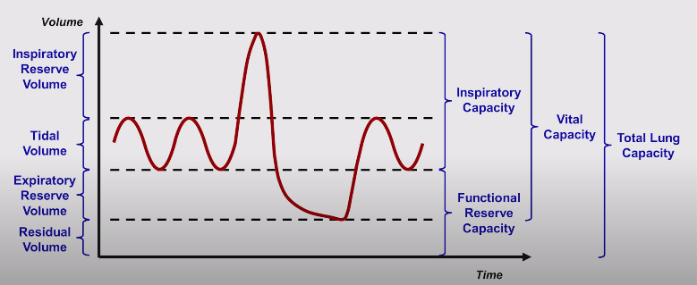

- __FVC__ --- Volume di aria scambiato durante una inspirazione massimale seguita da una espirazione massimale
- __FEV₁__ (VEMS in ita) --- Volume di aria durante il 1/o secondo di una espirazione massimale che segue una inspirazione massimale (nel contesto, quindi, della misurazione della FVC)
- __FEV₁ / FVC__ (indice di Tiffenau) --- rapporto che quantifica quanta % del volume totale si riesce a espirare in un atto massimale. Ci dice, di fatto, se ci sono difficoltà notevoli nel buttare fuori l'aria
	- Patologico se ≤ 0.8

## Diagnosi di pneumopatia con i PFT
- Di fatto, per diagnosticare le varie pneumopatie si usano 3 strimenti
	- __Indice di Tiffenau__ --- indica quanto velocemente l'aria esce (è ridotto nelle pneumopatie ostruttive)
	- __Volume polmonare totale__ (è ridotto nelle pneumopatie restrittive)
	- __DLCO__ --- indica se lo scambio alveolare è efficace (non lo è nelle pneumopatie vascolari)

|| FEV₁ | FVC |Tiffenau|
|-|-|-|-|
|Pneumopatia ostruttiva| Ok o ↓ | Ok (↓ se severa)| ↓ (per difficoltà espiratoria)|
|Pneumopatia restrittiva|Ok o ↓ | ↓ |↑ (per riduzione del parenchima)|

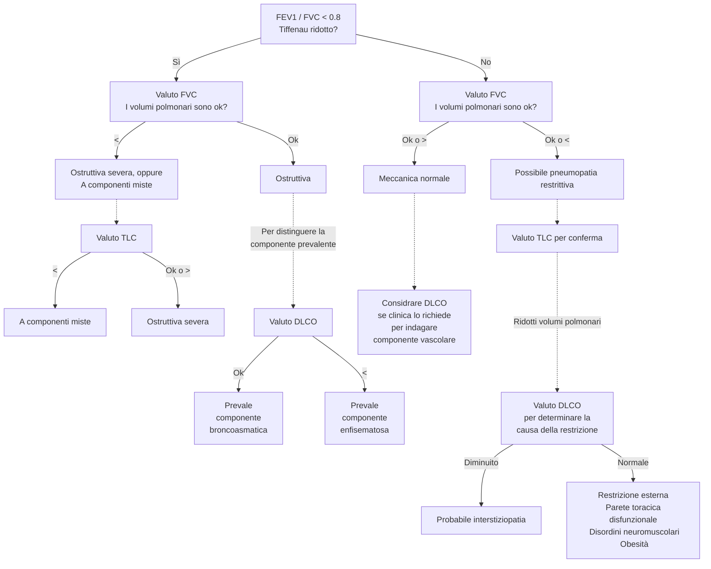

### Come interpreto il referto dei volumi polmonari
- Se i valori sono compatibili per un quadro ostruttivo e, dopo broncodilatatori, ↑ > 12--15% ⇒ si propende verso una ostruzione reversibile (asma)
- Pneumopatie vascolari non possono essere diagnosticate con spirometria da sola, sono a meccanica polmonare normale! ⇒ richiedo test di diffusione di CO

#### Come calcolo la TLC
- Per calcolare la TLC devo stimare anche il volume residuo (che non è scambiabile)
- 3 tecniche per stimare il volume residuo
	1. Metodi a diluizione di gas
		- Mixing dell'elio
		- Washout dell'azoto
	2. [Pletismografia corporea](https://it.wikipedia.org/wiki/Pletismografo)
	3. Stima radiografica (da RX torace o TC)

### Come interpreto il referto di una spirometria

- PEFR (Peak Expiratory Flow Rate) --- Flusso (l/min) massimo raggiunto durante espirazione. È di fatto la pendenza massima che si osserva nel grafico volume esalato/tempo, o il picco che si osserva in un tracciato spirometrico (siccome la spirometria è una misura (con segno) _di flussi di aria nel tempo_)

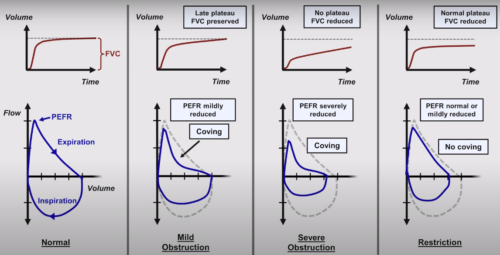

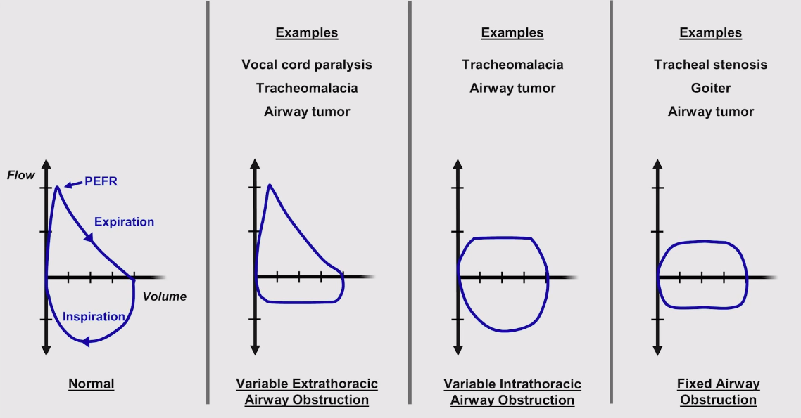

### Interpretazione del DLCO
- DLCO è una misura di quanto monossido gli alveoli scambiano per unità di pCO erogata ⇒ se mantengo una pCO nota durante l'erogazione del test posso __stimare la funzionalità del processo di _scambio alveolare_ __
- DLCO alterato in tutti i processi che compromettono lo _scambio_ alveolare
	- ↓ DLCO
		- Difetti del letto vascolare
		- ↑ parete alveolare
		- Enfisema (↓ superficie di scambio)
		- Interstiziopatie
		- Anemia
		- Ipertensione polmonare
	- ↑ DLCO
		- Esercizio (↑ output cardiaco)
		- Posizione
		- Asma (non chiaro come mai)
		- Emorragie polmonari
		- Policitemia
		- Lieve HF sinistra (↑ pressione polmonare senza che cali gittata)
- Utile come esame _di secondo livello_ per discriminare
	- In COPD la componente prevalente (blue bloater o pink puffer?)
	- In pneumopatie restrittive se la colpa è dell'interstizio o no
	- In una meccanica polmonare normale se la causa della pneumopatia è vascolare

## Casi clinici
- Video con casi clinici [https://youtu.be/6mZmpHycSuQ](https://youtu.be/6mZmpHycSuQ?t=289)

# PA cruenta
- Preparazione e calibrazione del circuito per la PA curenta [https://www.youtube.com/watch?v=mK58q8FW0-0](https://www.youtube.com/watch?v=mK58q8FW0-0)

# Come eseguire EGA
- [https://www.youtube.com/watch?v=Vo4PJBcNvDg](https://www.youtube.com/watch?v=Vo4PJBcNvDg)
	- Sede di elezione: radiale (se non franche controindicazioni, altrimenti femorale?)
	- Sento il polso con mano non dominante
	- Ago 30--45° gestito e avanzato con mano dominante _contro flusso_

# Come eseguire una pericardiocentesi
- [https://youtu.be/GcoAHYcngEw](https://youtu.be/GcoAHYcngEw)

# Cateterizzazione cuore destro e pressione polmonare cruenta
- [https://www.youtube.com/watch?v=nO_p_cSb1FQ](https://www.youtube.com/watch?v=nO_p_cSb1FQ)
- Interpretazione delle onde pressorie: [https://www.youtube.com/watch?v=SG0VvLX_WGs](https://www.youtube.com/watch?v=SG0VvLX_WGs)

# Come eseguire una toracentesi
- Video meh: [https://www.youtube.com/watch?v=n7MayQnfWMo](https://www.youtube.com/watch?v=n7MayQnfWMo)
- Video molto migliore di Nava: [https://www.youtube.com/watch?v=ivTyH09BcHg](https://www.youtube.com/watch?v=ivTyH09BcHg)

# Come interpretare RX torace
- Lezioni 1-8 della playlist: [https://www.youtube.com/playlist?list=PLYojB5NEEakU6vTUAoUeVhgRzQgaoSnFi](https://www.youtube.com/playlist?list=PLYojB5NEEakU6vTUAoUeVhgRzQgaoSnFi)

## Intro
- Ok CXR
	- EO toracico anormale
	- Valutazione di sintomi
	- Valutazione posizionamento linee/devices
	- Verificare corretta esecuzione post procedure toraciche invasive (intubazione OT, linee centrali, sondini, pacemaker, toracentesi, biopsia polmonare)
- No CXR
	- Preop routine
	- Screening o f/u in pz. ad alto rischio polmonare (meglio Chest CT)
- Da sapere
	- Ombre sono bianche
	- Dove RX passano abbiamo parti nere
	- Esposizione prolungata ⇒ immagine sottoesposta
	- Esposizione corta ⇒ immagine sovraesposta
- 4 categorie di materiali, da radiotrasparente (nero) a radiopaco (bianco)
	- Aria
	- Acqua
	- Ossa
	- Metallo
- 3 viste
	- __PA__ (posteroanteriore), che è la più comune
	- __Laterale__
	- __AP__ (anteroposteriore o "portable CXR"). Qualitativamente inferiore rispetto a vista PA, 
		- Distorsione delle strutture cardiache → essendo le strutture principali (sopratutto cardiache) più lontano dal rilevatore (che è sempre posto alle spalle del pz.) è una vista in cui possono esserci distorisioni delle dimensioni delle strutture più prossimali alla sorgente e lontane dal rilevatore
		- Le strutture mediastiniche sono più centrali e risentono meno di questo effetto

## Approccio sistematico all'interpretazione
0. Valutazione della qualità tecnica dell'RX
1. A --- Airways
2. B --- Bones + soft tissue
3. C --- Cardiac silhouette + mediastinum
4. D --- Diaphragm + gastric air bubble + pleura
5. E --- Effusions
6. F --- Lung Fields
7. Linee, tubi, indizi di chirurgia precedente

## Valutazione della qualità tecnica dell'RX
- La vista è appropriata, o ci sono degli shift/rotazioni?
	- Shift laterali → non tutte le strutture sono visibili
	- Vista lordotica^[Spostamento del pz. verso ↑ con raggi obliqui dal basso verso l'alto] (me ne accorgo perché gli apici polmonari sono falsamente visibili sopra la clavicola) → falso disallinamento delle strutture (apici vs clavicola), falsa deformazione delle strutture (ombra cardiaca) e dei volumi (volumi polmonari)
	- Rotazione lungo la linea mediana (me ne accorgo perché la linea interspinosa non divide a metà la linea condotta dalle porzioni mediali delle clavicole, come invece succede normalmente) → distorsioni di dimensioni e proporzione
- Valutazione della qualità dell'inspirazione
	- Importante valutare la qualità dell'inspirazione: altrimenti il mediastino e i polmoni possono essere pensati completamente distesi quando in realtà non lo sono, e dare falsa impressione di edema polmonare o ingrandimento del mediastino
	- _Se_ volumi polmonari sono normali ⇔ 9/10 coste posteriori visibili (o 6/7 coste anteriori visibili)
	- Non confondere una situazione di volumi polmonari patologicamente ridotti con una scarsa inspirazione: il senso clinico deve prevalere! (e magari PFT se dubbio)
- Valutare _esposizione_ (tempo e distanza dalla sorgente) e _contrasto_ (quanto i raggi hanno penetrato) per valutare
	- La penetrazione dei raggi è buona quando i contorni dei corpi vertebrali sono visibili

## A: Vie aeree
1. __Restrizione__
	- Restrizione ovraglottica non chiaramente visibile ad rx
	- Restrizione subglottica (segno della trachea "a campanile") ↔ croup e stenosi tracheale^[In adulti spesso viene sovrastimata a causa delle ombre proiettate dal mediastino, per cui valutare bene la qualità della radiografia + __correlarla per bene alla clinica__]
2. __Deviazione__
	- Causa principale: __ineguale pressione intratoracica nei due emitoraci__
		- Deviazione della trachea _dal_ sito patologico (spingono)
			- PNX (sopratutto se iperteso)
			- Versamento pleurico
			- Grandi masse (tumorali, grandi linfoadenomegalie o estreme dilatazioni atriali)
		- Deviazione della trachea _verso_ il sito patologico (tirano)
			- Fibrosi polmonare/pleurica
			- Atelettasia
			- Lobectomia
3. __Ostruzione__
	- Parziale (bronco dx > sx)

## B: Ossa e tessuti molli

### Ossa
1. Fratture
	- Costali (vista top)
		- Acute (basta guardare bene)
		- Riparate (addensamenti focali coerenti con formazioni calcifiche. Attenzione! Facile scambiarli per lesioni sclerosate)
	- Clavicolari (ok, ma non è vista ottimale)
	- Vertebrali  da compressione (vista L)
2. Deformità (cifosi, scoliosi)
3. Lesioni sclerosate (↑ densità ossea)
	- Focali vs diffuse
	- Interpretarle è difficile (consulto radiologico)
4. Lesioni litiche (↓ densità ossea)
	- Singole o multiple
	- Difficile interpretazione
5. Osteopenia (difficile, meglio lasciare il campo a radiologo)
6. Coste indentate
	- Indentazione della superficie superiore delle coste
		- Osteogenesi imperfetta
		- Connettivopatie
		- Pressione locale
		- Iperparatiroidismo
	- Indentazioni della superficie inferiore delle coste (\*)
		- Coartazione aortica
		- Ostruzione della succlavia
		- Alcune procedure chirurgiche

### Tessuti molli
7. Valutare lo stato dei tessuti molli
	- Enfisema sottocutaneo (si vede uno scollamento dei tessuti molli con zone che contengono aria)
	- Lesioni da schegge
8. Valutare se ci sono oggetti esterni (aiutarsi con più viste se dubbio)

## C: Mediastino e aia cardiaca

### Aia cardiaca
1. Cardiomegalia (vista PA! Altrimenti non capisco se è una distorsione dovuta alla vista)
	- (Max dimensione cardiaca orizzontale) / (Max dimensione toracica orizzontale) > 0.5
	- Eziologia: CHF, tamponamento caridaco
		- Non tutti i versamenti pericardici sono visibili all'RX, particolarmente se sono acuti
		- Segni di versamento pericardico: [water-bottle heart](https://heart.thecommonvein.net/wp-content/uploads/2019/12/30095c.8.jpg) (PA) e [oreo cookie sign](https://prod-images-static.radiopaedia.org/images/1436764/5bbea01430437883505ebc997ef7c8_big_gallery.jpeg)^[Il versamento pericardico è indicato dall'asterisco. Il segno dell'oreo si genera perché il fluido (la crema dell'oreo) è leggermente più radiopaco rispetto al grasso cardiaco e pericardico, che invece sono leggermente più radiodensi e vanno a costruire i biscottini] (Lat)
		- Eziologie del versamento: acute (cazzo) o croniche (cancro, alcune infezioni, collagenopatie)
2. Ingrandimento dell'atrio sx (angolo carenale > 90° + [segno della "doppia densità"](https://external-content.duckduckgo.com/iu/?u=https%3A%2F%2Fi2.wp.com%2F24.media.tumblr.com%2Ftumblr_mdkyaaaCuJ1ru4rx5o1_500.png&f=1&nofb=1) della bordo destro dell'ombra cardiaca^[Guardando il margine ottuso del cuore si notano due linee a livello del margine destro dell'atrio: una è il confine dell'atrio destro e una è il confine dell'atrio sinistro])
	- Eziologia: LHF, valvulopatia mitralica

### Mediastino
3. Ingrandimento del ventricolo destro (affollamento dello spazio retrosternale in vista lat)
	- Eziologia: ipertensione polmonare, valvulopatia polmonare, scompenso cronico (?)
4. Allargamento del mediastino (vista PA meglio, ma se AP non è una tragedia: mediastino è struttura centrale)
	- Diametro mediastinico > 8 cm
	- Attenzione a distorsioni della vista (valutare se c'è buono sforzo inspiratorio)
	- __Aggiungere sempre una vista Lat__ per distinguere la profondità e ipotizzare meglio l'eziologia
	- Eziologia
		- Mediastino anteriore (sotosternale) o superiore (apicale)
			- Cancro: Linfoma, timoma, teratoma
			- Tiroiditi
			- AA arco (ma poco) o ascendente (meglio)
		- Mediastino mediale
			- Linfadenopatia
			- Ingrandimenti pericardici
			- AA discendente
			- Esofago diatato
			- Ernia iatale
		- Mediastino posteriore
			- Masse perivertebrali (tumori neurogenici)

### Ilo polmonare
5. Ingrandimento dell'ilo polmonare
	- Si distingue che una massa è sovrapposta all'ilo e non si origina dall'ilo perché nel primo caso i vasi polmonari sono visibili
	- 3 gruppi eziologici entrano in ddx
		- Da cancro
			- Primario
			- Linfoma
			- Metastasi
		- Da infezione
			- TBC
			- Virus (es: EBV, pneumovirus)
			- Istoplasmosi
			- Micosi
			- Tularemia
		- Da altre cause
			- Sarcoidosi
			- Silicosi
			- Ipertensione polmonare
			- Aneurisma della polmonare
			- Cisti bronchiale

## D: Diaframma e pleura

### PNX
1. Valutare se PNX
	- Shift delle strutture se PNX massivo
	- Possibile segno (indiretto) del [solco costofrenico profondo](https://upload.wikimedia.org/wikipedia/commons/9/98/Pneumothorax_im_liegen.jpg) (correlato con PNX ipsilaterale)
		- Se COPD possibile falso segno
	- Se PNX di dimensioni ridotte: si evidenzia una linea verticale che rappresenta il bordo laterale del polmone; lateralmente alla linea si evidenzia una zona più scura (> aria)
		- < 2cm Piccolo PNX
		- > 2cm Grande  PNX
	- Preferire vista AP se sospetto clinico

### Pleura
2. Versamenti pleurici
	- 2 gruppi di eziologie di versamenti pleurici
		- Trasudatizie (sbilanci pressori a favore di filtrazione)
		- Essudatizie (da infezione o ostruzione linfatica)
	- Laterale vs bilaterale
	- Dimensione (se _versamento modesto si vede prima in vista Lat_ con segno dello smussamento dell'angolo costofrenico)
	- Libero o vincolato (possibile differenziare con vista PA in decubito laterale)
		- Libere → si forma menisco all'RX + shift verso il basso in decubito laterale
			- Attenzione! _Se sono libere, diventa essenziale avere il pz. correttamente posizionato_, altrimenti se il pz. è inclinato l'effusione può sembrare falsamente grande (me ne accorgo perché il menisco non è ben definito, ma sfocato) → difficile capire come l'effusione sta procedendo
		- Vincolate → si forma una figura con contorni ben delineati incompatibile con l'assetto del paziente + non shift (o shift parziale) se decubito cambia
			- Ez: aderenze > emotorace
			- A volte è difficile differenziarle da masse pleuriche
	- Valutare altri segni radiologici che possono indicare origine (cardiomegalia, ...)
	- Valutare alcuni casi particolari di versamenti pleurici
		- __Effusioni subpolmonari__ (non segno di smussamento dell'angolo costofrenico). Si riconoscono per una combinazione di caratteristiche
			- Diaframma in emitorace ipsilaterale è orizzontale
			- Solco costofrenico ipsilaterale è più angolato del normale
			- Solco orizzontale del polmone è più in alto del normale (⇐ versamento subpolmonare "spinge" in alto il polmone e lo comprime)
			- Se a sx: > distanza tra base polmonare e bolla gastrica\
		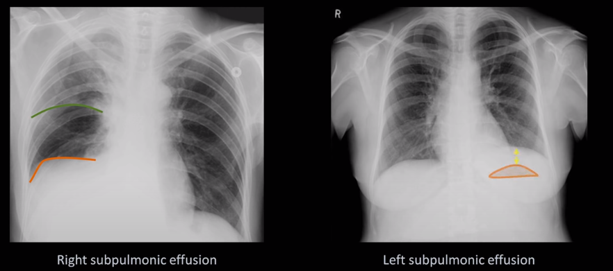
		- __Pseudotumore__ --- effusioni pleuriche vincolate particolarmente radiopache che danno l'impressione di essere una massa polmonare
			- Maggiormente comuni nei dintorni del solco orizzontale
			- Spesso contorni lisci
3. Generiche opacità pleuriche
	- Placche pleuriche (bilaterali, multifocali, simmetriche, spesso risparmiano l'angolo costofrenico)\
	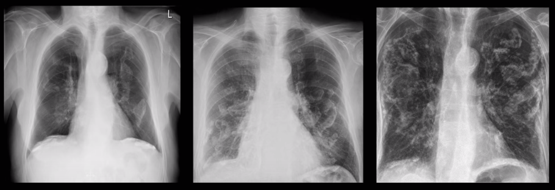
		- Esposizione all'amianto (placche pleuriche ⇒ asbestosi, ma non viceversa!)
	- Addensamenti pleurali (fibrosi, accumulo)
		- Infezioni
		- Precedente PNX
		- Esposizione professionale
		- Radiazioni
		- Tumori
	- Masse pleuriche
		- Metastasi (spesso di origine ematologica)
		- __Mesotelioma__

### Diaframma e sottodiaframma
4. Elevazione del diaframma
	- Da ↓ volumi polmonari (atelettasia, patologie restrittive)
	- Paralisi del nervo frenico
	- Epatomegalia, splenomegalia
	- Anormale muscolarizzazione del diaframma
5. Localizzazioni patologiche dell'aria
	- Falce d'aria sottodiaframmatica
	- Ernia iatale (sembra che ci sia aria nell'ombra cardiaca)
	- Enfisemi sottocutanei (spesso anche pneumomediastino)

## E: Polmoni (processi diffusivi)
1. Valutazione dei volumi polmonari
2. Opacità dei campi polmonari (spesso difficilissimo distinguere i sottotipi)
	- Opacità alveolari
	- Opacità interstiziali

### Valutazione dei volumi polmonari
- Almeno 9--10 coste posteriori visibili, altrimenti "scarsi volumi polmonari" (e conviene considerare la causa: scarso sforzo inspiratorio del pz. durante la presa dell'immagine, pneumopatie restrittive, effusioni subpleuriche, scarsa qualità dell'RX...)
	- Iperinflazione è sempre possibile (BPCO o crisi asmatica attiva)

### Opacità dei campi polmonari

| | Opacità alveolari | Opacità interstiziali |
|-|-|-|
| Distribuzione | Lobare, o segmentale, o diffusa, o a bat's wing | Non rispettano nessun confine |
| Margini | Sfumati | Relativamente netti |
| Cambiamento | Può essere rapido (~ ore) | Tendenzialmente cambiano lentamente |
| Descrizione | "Cotonosa", "nebbiosa", "a nuvola",... | Reticolare vs nodulare vs reticolonodulare |

#### Opacità alveolari
- Opacità da accumulo di fluido in alveoli o bronchioli terminali (≡ __edema polmonare__) OPPURE da __danno da altra causa__
- Eziologie
	1. Da edema
		- __Cardiogeno__ ad ↑ pressione polmonare (⇐ AHF, cardiomiopatia, IMA, aritmia, miocardite... Sostanzialmente tutto quello che può produrre scompenso sx)
		- __Non cardiogeno__ a pressione polmonare conservata (⇐ danno del parenchima polmonare che produce un quadro infiammatorio)
			- ARDS
			- SIRS
			- Sepsi severa
			- _Polmoniti_ (sopratutto multilobari (⇒ virali, da aspirazione) entrano in ddx, se sono lobari è facile differenziarle)
			- Altre forme di acute lung injury
			- Pancreatiti
			- Ustioni estese
			- Danno diretto (annegamento, da inalazione)
	2. Non da edema
		- Polmoniti
		- Emorragie alveolari

!(imgs/opacita-alveolari.png)

- A prima impressione:
	- Aspetto _"a nebbia"_, con margini molto sfumati
	- Possono rispettare i margini dei lobi (_opacità lobari_) o no (_opacità diffuse_)
- Ci sono 5 segni radiografici che permettono di individuare specificamente l'EP (eziologia 1) e ipotizzarne la causa (cardiogena vs non cardiogena)
	1. [Visualizzazione dei bronchi all'RX](http://www.svuhradiology.ie/wp-content/uploads/2015/05/AirBronchoCombo-450x263.jpg) → opacizzazione delle sacche alveolari che circondano i bronchi causa liquido
	2. [Ispessimento della parete bronchiale](https://upload.wikimedia.org/wikipedia/commons/6/6a/Peribronchial_cuffing.jpg)→ visualizzazione della sola _parete_ bronchiale (o come anello o come binari, a seconda di come sono orientati)
	3. [Linee di Kerley](https://upload.wikimedia.org/wikipedia/commons/5/56/Chest_radiograph_of_a_lung_with_Kerley_B_lines_-\_annotated.jpg) → linee sovrapposte ai campi polmonari indicative di edema interstiziale
		- Linee di Kerley di tipo A --- linee diagonali (lunghe 2--6 cm, spesse < 1mm) che partono dall'ilo polmonare)
			- Sono vasi linfatici congestionati e distesi
			- Se ci sono, ci sono anche almeno le linee B
		- __Linee di Kerley di tipo B__ --- linee orizzontali (1--2 cm) localizzate alla periferia (solitamente base) dei campi polmonari
			- Sono i setti interlobulari
			- Più comuni delle linee A
	4. Cefalizzazione → aumentata visibilità dei vasi polmonari apicali rispetto a quelli delle basi
		- Suggestivi di ↑ pressione sinistra (e quindi anche polmonare)
		- Segno molto soggettivo e lettore-dipendente (non molto utile per diagnosi oggettiva)
	5. [Bat's wing pattern](https://classconnection.s3.amazonaws.com/918/flashcards/637918/jpg/bat_wing_ii1353329825870.jpg) (pattern ad ali di pipistrello) → opacificazione bilaterale peri-ilare
		- Suggestivi di EP cardiogeno/polmonite virale/polmonite da aspirazione/altre condizioni

|                                | EP cardiogeno | EP (da altre cause) |
|--------------------------------|---------------|---------------------|
| Dimensione aia cardiaca        | ↑             | Normale             |
| Distribuzione delle opacità    | Omogenee      | Non omogenee        |
| Linee Kerley (B)               | Comuni        | Meno comuni         |
| Visualizzazione dei bronchi    |               | X                   |
| Ispessimento parete bronchiale | X             |                     |
| Versamento pleurico            | X             |                     |
| Cefalizzazione                 | X             |                     |
| Bat's wing pattern             | X             | X (eziologie spec.) |

#### Opacità interstiziali

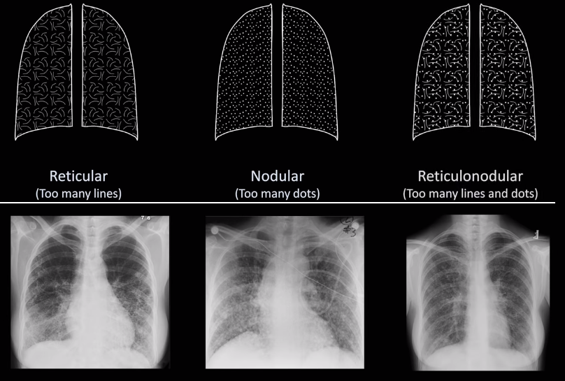

- DDx è spesso difficile e lunga ⇒ consulto specialistico (anche perché molta roba non si distingue dall'RX)

## F: Polmoni (processi focali)
- I processi focali vanno localizzati (più pratico usare quadranti (apicale, superiore, media, inferiore)) e distinti in
	- __Infiltrato__: opacità localizzata (alveolare vs interstiziale vs nodulare vs caviaria)
	- __Consolidazione__: opacità omogenea, larga, tipicamente coinvolge intero lobo
- Per individuare infiltrato:
	- __Silhouette sign__ (perdita del contorno, normalmente visibile, di strutture adiacenti -- utile per localizzare la foce)
	- __Spine sign__ (aumento di opacità dall'alto verso il basso dei corpi vertebrali in vista Lat, segno suggestivo di opacità delle basi)
- 4 principali gruppi eziologici possono produrre opacità focali
	1. Infezioni
		- __Polmonite infettiva__ (batterica, virale, fungina, micobatterica)
	2. Cancro
		- Primario
		- Secondario
		- Linfoma
	3. Problematiche vascolari
		- Infarto polmonare
		- Emorragia polmonare
		- Vasculiti
	4. Altro
		- Polmonite eosinofilica
		- ...

### Polmonite infettiva
- Eziologia più comune di opacità focali

| Sottotipo | Segni radiologici | Causa |
|-|-|-|
| Lobare | Consoliazione omogenea, broncogrammi, bordi definiti | Strepto, Klebsiella p., Haemophilus i.|
| Segmentale (broncopolmonite) | Opacità a chiazze, broncogrammi non comuni, bordi vaghi, frequentemente bilaterale | Staph au., Pseudomnas aeru., Klebsiella p., Haemophilus i. |
| Interstiziale (polmonite atipica) | Opacità reticolari, no broncogrammi | Micoplasma, __virus__, pneumocisti |
| Rotonda | Opacità sferica (sembra massa tumorale), bambini > adulti | Haemophilus i., Strepto |
| Cavitaria | Lesioni cavitarie, possibile (ma anche no) livelli idroaerei | TB, Staph au.|

### Noduli polmonari
- __Nodulo__: processo focale ben circoscritto, tendenzialmente rotondo, diametro < 3cm (> 3cm: "massa")
- Diventa essenziale avere storia radiografica per valutarli correttamente
- 3 gruppi eziologici per _noduli singoli_
	- Tumori (primari, secondari, linfoma, carcinoma)
	- Infezioni (granulomi polmonari, polmonite rotonda)
	- Congenite (malformazioni vascolari, cisti bronchiali)
- 4 gruppi eziologici per _noduli multipli_
	- __Tumori__ (> sospetto per metastasi o linfoma)
	- Infezioni
		- Polmoniti fungine
		- Micobatteri
		- Emboli settici
		- Parassitosi con trofismo polmonare
		- Artrite reumatoide
	- Vasculite
	- Amiloidosi

### Embolia polmonare
- Tipicamente embolia polmonare non produce cambiamenti evidenti a CXR (⇒ __non chiedo CXR per confermare il sospetto, al limite TC mdc!__)
- Raramente, larghi emboli possono produrre segni radiologici patognomonici
	- __Hampton's hump__ (opacità localizzata da infarto polmonare distale a vaso occluso dall'embolo)
	- __Westermark Sign__, o [ipovolemia focale](https://www.nejm.org/na101/home/literatum/publisher/mms/journals/content/nejm/2012/nejm_2012.366.issue-11/nejmicm1107936/production/images/large/nejmicm1107936_f1.jpeg) (riduzione della visualizzazione dei vasi polmonari a seguito di embolo occludente e conseguente ridistribuzione del flusso ematico)
	- __Fleishner sign__ (dilatazione dei vasi polmonari _a monte_ dell'embolo, spesso seguiti dal segno di Westermark subito dopo l'embolo stesso)

### Cavitazioni
- Di fatto ogni causa di necrosi polmonare
	- Polmonite cavitaria (staph, pseudomonas, klebsiella)
	- Aspergilloma (alla CT infiltrano i vasi)
	- Ascessi polmonari
	- TB
	- Metastasi polmonari (Squamous Cells Carcinoma)
	- Emboli polmonari settici
	- Infarti polmonari
	- Granulomatosi

## Bonus: Linee, tubi, device e chirurgia

# Come fare una ddx
- Ottimo video su yt sui 5 passi da seguire per [creare una ddx](https://www.youtube.com/playlist?list=PLYojB5NEEakVjF2SyCaFm4ofjEoaiNyTE) (ma molto "accademico")

# Approccio generale al paziente con...

## Tosse
- Framework per ddx (tosse cronica e acuta)

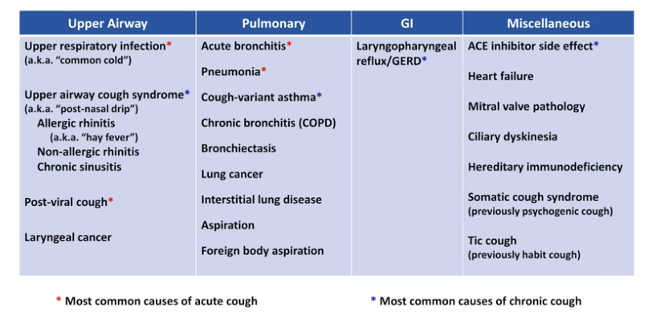

- Da capire in APP/APR
	- Durata e insorgenza
	- Produttiva vs non produttia
	- Sintomi accessori (respiratori/sistemici/infiammatori...)
	- Fattori di rischio polmonari/oncologici/cardiologici
- Da fare all'obiettività
	- Parametri vitali, particolarmente Sp, FC, _FR_
	- Fare sempre EO orecchio/gola/testa e collo + EO polmonare + EO cardiologico (JVP!)
	- Emocromo con formula se si sospetta infezione

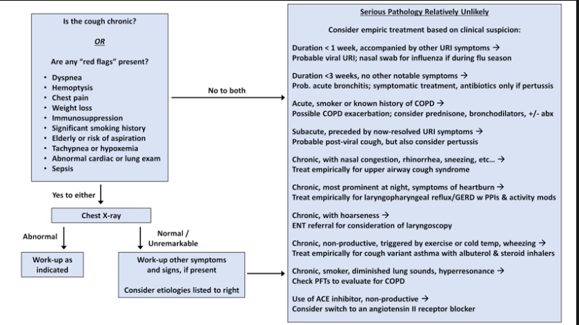

- Considerare consulto otorino se tosse persistente/non risolta dopo settimane
- Considerare RX/valutazioni specifiche per ricerca di eziologie alternative se tp empirica non risolve la situa

## Emottisi o emoftoe

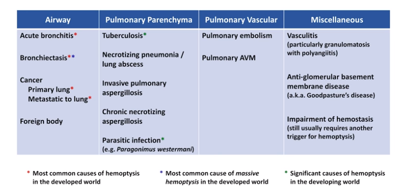

- Da capire in APP/APR
	- Durata e volume stimato della perdita ematica
	- Sintomi accessori (dispnea/dolore toracico/rash/atralgia/febbre/diaforesi/perdita di peso e loro andamento)
	- Storia di pneumopatie
	- Immunosoppressione
	- Fattori di rischio
	- Anamnesi familiare
	- Anamnesi sociale (lavoro + storia di viaggi)
	- Emottisi o ematemesi?
- Da capire in EO
	- Emottisi o ematemesi?
	- Parametri vitali (attenzione a PA)
	- EO polmonare
	- EO cardiaco
	- Obiettività linfonodi (sopratutto testa/collo/torace)
	- Ispezione della pelle
- LAB
	- Emocromo con formula + VES e PCR
	- INR (via estrinseca) + aPTT (via intrinseca)
	- CXR sempre, a meno che TC torace non sia necessaria (necessaria sempre a meno che CXR non confermi eziologia infettiva)

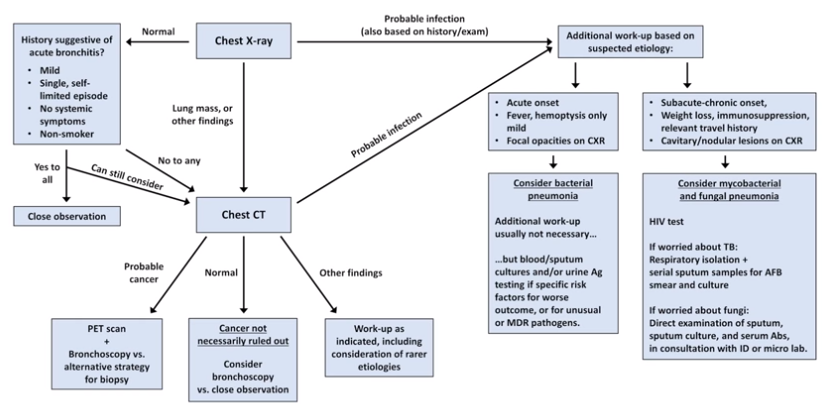

## Dispnea acuta

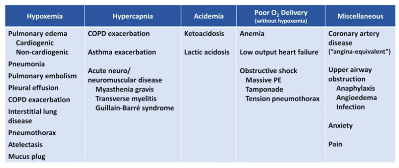
- In ogni pz. con dispnea
	- Parametri
	- APP, APR, APF accurata
	- Obiettività accurata: cardiorespiratoria + arti
	- Lab: emocromo con formula, lattati, VES, PCR (almeno). Troponina non è una cattiva idea
	- CXR (almeno)
- Valutare almeno questi gruppi eziologici (a seconda del corteo di SeS, Lab e imaging)
	- Polmonite
	- EP (cardiogeno o non cardiogeno?)
	- Sindrome da occupazione mediastinica (tamponamento, effusione pleurica, pneumo/emo/piotorace)
	- BPCO/asma (evento acuto)
	- Interstiziopatie polmonari
	- Embolia polmonare (specie se RX pulito ma ipossia; storia di TVP; fattori di rischio)
	- SCA

## Sincope
- Sincope e presincope hanno la medesima causa patofisiologica: __transitoria riduzione del flusso ematico cerebrale__ per uno di 3 meccanismi
	- Riflesse
	- Cardiogeniche
	- Ortostatiche

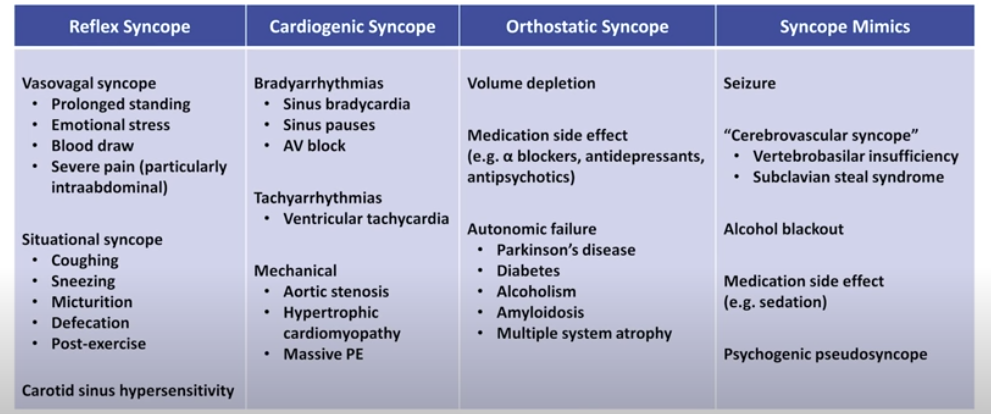

- Fare una buona APP (+APR)
	- È sincope, presincope o situazione che _sembra_ sincope ma non è?
		- Se crisi epilettica c'è spesso perdita del tono degli sfinteri, rara in sincope
		- In sincope ci può essere un movimento epilettiforme (che però è _ritmico_)
	- Cosa stava facendo prima?
	- In quanto tempo si ha avuto un pieno recupero del sensorio
		- Il recupero della sensorio è breve, una crisi epilettica ha uno stato postcritico che dura per del tempo
	- Fattori di rischio?
- Fare EO accurato
- Fare _sempre_ ECG (sincope cardiogenica può essere secondaria a problema cardiaco)
- Valutare se necessario esami di II livello

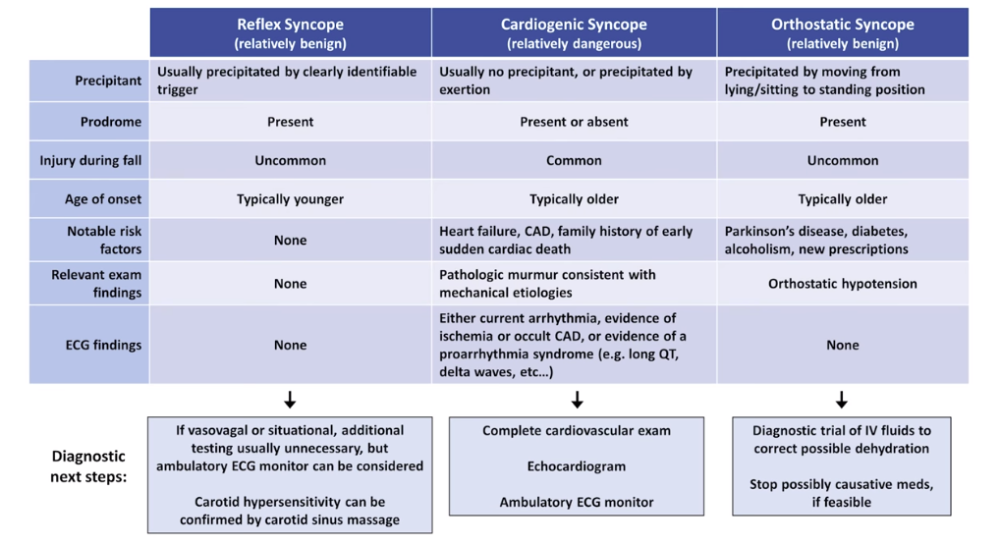

## Dolore toracico

## Ematuria

## Ittero

## Addome acuto

## Shock

## Vomito

## Perdita di peso non intenzionale

## Febbre da origine sconosciuta

## Mal di schiena (?!)

## Sanguinamento GI

# Shock

# AFib

# EO addominale

## Ispezione ed auscultazione

## Percussione

## Palpazione

## Valutazione del dolore addominale

## Esame rettale nel maschio

## Esame pelvico e vaginale

# Diarrea

# Pancreatite acuta

# Basi per interpretare una CT

# Imaging dell'addome

## RX addome

## CT addome

## US

# Suture
- [https://www.youtube.com/watch?v=Akyr4zlBS9E](https://www.youtube.com/watch?v=Akyr4zlBS9E)
