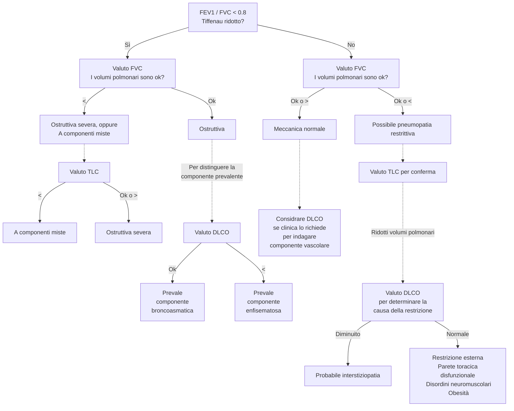

<!-- lun 26 apr 2021, 12:45:27, CEST -->

> _In tempi di pandemia, chi vuole imparare la semeiotica medica dal vivo o è un ladro o è una spia..._

[[toc]]

# Fondamenti della visita medica
1. Controllo infezioni
	- Disinfezioni superficie
	- Disinfezioni strumenti (stetoscopio, altro)
	- Eventuali precauzioni aggiuntive per infezioni note
	- Precauzioni aggiuntive secondo quanto necessario
2. Quick look
	- Facies coerente con età?
	- Impressione sullo stato di salute: buona o non buona?
	- Coscienza
	- Contenuto e organizzazione del pensiero
3. Colloquio iniziale
4. Parametri
5. Esami di sistemi/distretti specifici
	- Neuro
	- Testa
	- Occhi
	- Orecchie
	- Naso
	- Gola
	- Torace
	- Polmoni
	- Linfonodi
	- Cuore + cv
	- Addome
	- Muscoloscheletrico
	- Pelle
	- Genitourinario (con testimone)
	- Rettale (con testimone)
6. Comunicazione delle informazioni ottenute e della gestione imminente
	- Spiegazione dei reperti dell'EO
	- Valutazione di eventuali visite/esami aggiuntivi
	- Prescrizione di terapie
	- Colloquio con il pz. per assicurarsi che abbia _capito_ (eventualmente chiedere di ripetere/segnare)

# Ispezione e osservazione
- Quick look (osservazione generale)
	- Facies coerente con età
	- Impressione sullo stato di salute generale
	- Coscienza e stato mentale (AVPU)
	- Contenuto e organizzazione del pensiero
	- Igiene
	- Valutazione delle percezioni del pz.
	- Segni di distress emozionale
	- Segni di dolore o di movimento protetto o di sintomi autonomici che esprimono dolore (diaforesi)
	- Distress respiratorio (muscoli accessori?)
	- Posizione
- Ispezione della cute, delle mucose e degli annessi cutanei che sovrastano una certa regione
	- Colore (pallore, cianosi, ittero)
	- Temperatura
	- Idratazione e diaforesi
	- Consistenza (turgore, carta velina...)
	- Cicatrici segni di interventi chirurgici passati

# Palpazione
- Cosa usare per palpare
	- Punta delle dita: per massimo della sensazione tattile
	- Parte ulnare e quinto dito: per vibrazioni
	- Parte palmare: per valutazione della funzione e palpazione
	- Parte dorsale: temperatura
- Refill capillare
- Polso radiale^[Trick di Lamberto per il polso: usare più dita per massimizzare la superficie; successivamente esercitare una pressione alta (anche obliterante) e ridurla gradualmente finché non si sente chiaramente il polso]
- Palpare la zona anatomica di interesse con modalità specifica, tenendo parte dolorosa per ultima (dolore/difesa può alterare l'esame fisico)
- Valutare funzionalità motoria se appropriato

# Percussione
- Dovunque ci sia simmetria anatomica o funzionale la palpazione deve essere comparativa
- Tipologie di percussione
	- Percussione diretta (plessore su corpo)
	- Percussione indiretta (plessore su plessimetro)
	- Percussione auscultatoria (plessore su corpo + stetoscopio)
	- Percussione con pugno diretta (plessore è parte ulnare di mano a pugno su corpo)
	- Percussione con pugno indiretta (plessore è parte ulnare di mano a pugno su mano che è plessimetro)
- Ci sono 3 aspetti del tono percussorio da valutare
	- Intensità
	- Timbro
	- Durata

|Suono | Intensità | Timbro | Durata | Tipico di |
|-|-|-|-|-|
|Timpanico | Forte | Alta | Lunga | Zone che contengono aria (g/i) |
|Risonante | Forte | Basso | Lungo | Zone che contengono aria ma anche una quota di parenchima (polmoni)|
|Ottuso | Medio | Medio | Medio | Zone parenchimatose |
|Piatto|Bassa|Alto|Corta|Zone molto molto dense (muscoloscheletriche)|

# Auscultazione
- 2 parti
	- Diaframma (per suoni ad alta frequenza)
	- Campana (per suoni a bassa frequenza)
- Alcuni stetoscopi fanno sia da diaframma che da campana, a seconda della forza usata nella loro applicazione
	- Molta pressione ⇒ suoni ad alta frequenza
	- Bassa pressione ⇒ suoni a bassa frequenza

# Misurazione della pressione
- Misurare separatamente la pressione obliterante il polso e poi la PA con auscultazione
- Annotare la posizione in cui si misura (clino vs orto)
	- Se PA orto - PA clino > 20/10 ⇒ ipotensione ortostatica
- Notare se pressione durante inspirazione o espiraizone sono differenti
	- PA espirazione - PA inspirazione > 10 mmHg ⇒ polso paradosso (segno di BPCO o tamponamento cardiaco)

# Parametri vitali

|Parametro| v.n.| Ci cachiamo sotto se |
|-|-|-|
|PA | 120/80 | Urgenza se PAd > 120 o PAs > 180 mmHg (emergenza se segni franchi di danno d'organo) |
|FC (radiale + qualità del polso) | 60--100| > 150 |
|Temp (con sede) | < 37.5 |
|FR (+ stima del lavoro respiratorio e profondità) | 14--20 | ≤ 6 (o BLS) oppure > 30|
|SpO₂| 95--99% | < 92%
|Dolore (+ NRS e sede)| 0 |

# Esame obiettivo dell'apparato respiratorio

## Ispezione e palpazione
- Ispezione generale dell'atto respiratorio
	- FR
	- Impressione del lavoro respiratorio
	- Muscoli accessori, tirage, cornage
	- Rumori respiratori
	- Postura associata a distress respiratorio
- Geometria del torace
	- Torace a botte è solitamente associato a COPD o simili
	- Pectus escavatum o pectus carenatum sono solitamente anomalie genetiche
	- Cifosi/scoliosi (possono alterare dinamica respiratoria)
- Ispezioni per ferite chirurgiche
- Ispezioni di altri distretti correlati
	- Dita ippocratiche (segno di diversi e variegati quadri che portano, prevalentemente, ad ipossia cronica^[fibrosi polmonare, fibrosi cistica, carcinoma bronchiale, malattie cardiovascolari, malattie gastrointestinali, ipertiroidismo...])
	- Narici (polipi, epistassi, sono pervie?)
	- Lingua e mucose buccali (colore)
- Ispezione della faringe (dica aaaaaaa...) alla ricerca di segni di faringite

- Palpazione dei linfonodi della regione testa/collo e claveari alla ricerca di linfadenopatia (comparativamente)
	1. Seguendo il profilo da orecchie → mandibola → mento
		- Preauricolari
		- Giugulodicastrici
		- Sottomandibolari
		- Sottomentali
	2. Catene cervicali (anteriori e posteriori
		- Cervicali anteriori
		- Sopraclavicolari
	3. Linfonodi posteriori
		- Cervicali posteriori
		- Auricolari posteriori
		- Occipitali
	4. Ascellari
- Palpazione dei margini tracheali (deve essere nel mediastino)
- Palpazione della parete toracica alla ricerca di zone di dolorabilità (anteriore e posteriore)
- Valutazione della motilità degli emitoraci (~ 5cm)
- Fremito vocale tattile (anteriore e posteriore

## Percussione ed auscultazione
- Percussione dell'aspetto posteriore (spazi intercostali) alla ricerca di zone _non_ correttamente risonanti
- Percussione dell'aspetto anteriore (spazi intercostali) alla ricerca di zone _non_ correttamente risonanti

- Auscultazione del parenchima alla ricerca di
	- MV, respiro bronchiale, respiro broncovescicolare
	- Suoni patologici
		- Ronchi (rumori secchi)
			- Stridore
		- Rantoli (rumori umidi)
			- Crepitii
- Auscultazione dei campi posteriori (> 5 livelli)
- Auscultazione dei campi anteriori
- Auscultazione specifica per individuare consolidamento parenchimale
	- Broncofonia (sento per bene il suono della voce distinguendo quello che il pz. dice attraverso stetoscopio)
	- Egofonia (shift i → e o i → a durante auscultaizone)
	- Pettoriloquia (pz. sussurra, io sento quello che dice tramite stetoscopio)

# Esame obiettivo cardiologico

## Ispezione e palpazione
- Refill capillare (< 2'')
- Finger clubbing
- Polso radiale
- Xantelasma, arco corneale (ipercolesterolemia, iperlipidemia)
- Segno di de Musset (movimento ritmico della testa in sincrono con il polso, segno di rigurgito aortico)
- Polso carotideo
- Misurazione della JVP (distanza lungo l'asse Z dall'angolo di louis al punto più alto cui è visibile la giugulare interna
	- Posizionare il pz. in clinostatismo, con il torace ad un angolo di 30--45°
	- Chiedere al pz. di guardare dall'altra parte per esporre l'aspetto laterale del collo
	- Cercare la giugulare interna, visibile tra i due capi dello sternocleidomastoideo
	- Trovarne il punto più alto. Se non è visibile, considerare di alzare il pz. e spostarlo più verso una posizione seduta
	- Proiettare la stessa altezza _sopra_ la verticale condotta sull'angolo di Louis (II spazio intercostale, al termine del manubrio sternale e all'inizio dello sterno) e misurare l'altezza in cm
	- Aggiungere 5 cm (per tenere conto della porzione della giugulare interna sottostante la parte della clavicola)

- Ricerca palpatoria dell'itto della punta (normalmente: V spazio intercostale, lateralmente alla linea medioclavicolare -- se più laterale è spia di cardiomegalia)
- Ricerca palpatoria di fremiti sopra l'aia cardiaca
- Ricerca palpatoria di sollevamento parasternale (spia di ipertrofia ventricolare dx)
- Ricerca di aneurisma addominale (doppia palpazione all'altezza dell'ombelico sulle linee medioclavicolari, alla ricerca di una pulsazione interposta tra le mani)
- Edemi declivi
- Ricerca dei polsi periferici
	- Aorta addominale
	- Femorale
	- Popliteo
	- Tibiale posteriore
	- Dorsale del piede

_NB: la percussione di fatto ha posto solo nell'individuare la silhouette cardiaca, potendo quindi di fatto evidenziare solo una situazione di cardiomegalia_

## Auscultazione
- Focolai di auscultazione
	- A: aortica (II ICS sulla parasternale dx, → giugulo)
	- P: polmonare (II ICS sulla parasternale sx)
	- T: tricuspide (IV ICS, sulla parasternale sx)
	- M: mitrale (V ICS, sulla medioclavicolare sx^[Di fatto sull'itto della punta], → medio-ascellare)
- 2 suoni fisologici
	- S1: chiusura delle valvole atrioventricolari (lub)
	- S2: chiusura delle valvole aortica e polmonare (dub)
- 2 pause
	- S1 - S2: piccola pausa (sistole)
	- S2 - S1: grande pausa (diastole
- Ricerca di suoni aggiunti patologici (ritmi di galoppo)
	- S3: protodiastolico
	- S4: telediastolico (presistolico)
- Ricerca di sdoppiamenti dei suoni e correlazione con atti inspiratori
	- Sdoppiamento di S2 in inspirazione può essere fisiologico per ↑ precarico
- Ricerca dei soffi (indice di stenosi ⇔ flusso turbolento)
	- Soffi carotidei
	- Soffi dell'aorta addominale (punto di repere del polso del'aorta addominale)
	- Soffi delle arterie renali (sopraombelicale, 5cm laterali rispetto a linea mediana)
	- Soffi dell'arteria iliaca (sotto l'ombelico, dove si stimano le biforcazioni)
	- Soffi dell'arteria femorale (sul punto di repere del polso femorale)

## Rumori cardiaci patologici
- Video alternativo con un buon raccolto di suoni patologici e ottimo spiegone: [https://www.youtube.com/watch?v=kW9AvAvAuVI&t=202s](https://www.youtube.com/watch?v=kW9AvAvAuVI&t=202s)

# Esame obiettivo del letto vascolare periferico
- Prevalenza di patologie vascolari periferiche ↑ con età
- 2 principali patologie vascolari
	- Arteropatie periferiche (PAD) -- restringimento del lume arterioso da depositi grassi
		- SeS: dolore ad arti che peggiora con movimento e migliora con riposo, ↑ trigliceridemia, ↑ colesterolemia, segni consistenti con depositi lipidici (xantelasma, [arco corneale](https://it.wikipedia.org/wiki/Arco_senile)...)
	- Insufficienza venosa cronica (CVI) -- condizione di insufficienza valvolare venosa ⇒ ristagno di sangue
		- SeS: edemi declivi, cambiamento della consistenza della pelle, ulcerazioni, varicosità...
- Ricerca dei polsi, valutandone anche la qualità
	- Radiale
	- Ulnare
	- Brachiale
	- Aorta addominale (con stima della larghezza del lume^[Palpazione bimanuale con mani convergenti tentando di individuare le pareti dell'aorta e stimando la distanza alla quale si trovano le due mani])
	- Popliteo (se non si trova, ripetere la manovra a pz. prono)
	- Tibiale posteriore
	- Dorsale del piede
- Ricerca di soffi vascolari all'auscultazione
- Doppler + ABPI
- Considerare doppler venoso

# Doppler degli arti venosi e calcolo dell'ABPI
- L'onda del doppler è normlamente trifasica, e rispecchia i 3 momenti del circolo
	- centro → periferia (sistole e prima diastole)
	- periferia → centro (metà diastole)
	- centro → periferia (tarda diastole e presistole)
- Calcolare l'ABPI (Ankle--brachial Pressure Index) a destra e a sinistra

	ABPI = Psis gamba / Psis braccio

| ABPI value  | Interpretation                     | Action                        | Nature of ulcers, if present                   |
|-------------|------------------------------------|-------------------------------|------------------------------------------------|
| ≥ 1.3       | Abnormal Vessel hardening from PVD | Refer or measure Toe pressure | Venous ulcer use full compression bandaging    |
| 1.0 - 1.2   | Normal range                       | None                          |                                                |
| 0.90 - 0.99 | Acceptable                         | Na                            |                                                |
| 0.80 - 0.89 | Some arterial disease              | Manage risk factors           |                                                |
| 0.50 - 0.79 | Moderate arterial disease          | Routine specialist referral   | Mixed ulcers use reduced compression bandaging |
| < 0.50      | Severe arterial disease            | Urgent specialist referral    | Arterial ulcer no compression bandaging used   |

<!-- mar 27 apr 2021, 09:53:02, CEST -->

<!-- mer 28 apr 2021, 09:52:52, CEST -->

# Test di funzionalità polmonare (PFT)
- PFT vengono usati per __diagnosi di pneumopatia sintomatica__ o per seguire __pz con pneumopatia accertata o sospetta__ (specie se ad alto rischio specifico)
	- Trovare ragione di sintomi non diversamente spiegabili (ipercapnia, dispnea cronica, tosse non spiegata, ipossiemia cronica...)
	- F/u o iter diagnostico in pz. con alto rischio (fumo, esposizione professionale)
	- Stima del rischio chirurgico o prognosi in circostanze selezionati (per resezione polmonare in pz. con pneumopatia pregressa)
	- Monitorare progressione di pneumopatia
- I PFT sono divisi in 2 gruppi
	- PFT standard (propriamente detti)
		- Spirometria classica (flusso)
		- Misurazione dei volumi polmonari
		- DLCO (test di diffusione del monossido di carbonio)
	- PFT di fantasia (nel senso che non sono PFT) ma utili comunque
		- EGA
		- 6MWT
		- SpO₂ in esercizio
- 3 gruppi di pneumopatie a seconda dei risultati di PFT
	1. Pneumopatie ostruttive
		- BPCO (bronchite cronica ↔ enfisema)
		- Asma
		- Bronchiectasie
		- Fibrosi cistica
	2. Pneumopatie restrittive
		- Patologie interstiziali
		- Patologie della parete
		- Obesità
		- Patologie neuromuscolari
	3. Pneumopatie vascolari
		- Ipertensione polmonare
		- Patologie tromboemboliche croniche
- Info che ci danno i PFT
	- Pervietà vie aeree
	- Stato del parenchima (alveoli + interstizio)
	- Stato del letto vascolare
	- Stato della meccanica ventilatoria (diaframma, parete, controllo neurologico sulla muscolatura)

## Volumi polmonari

- __FVC__ --- Volume di aria scambiato durante una inspirazione massimale seguita da una espirazione massimale
- __FEV₁__ (VEMS in ita) --- Volume di aria durante il 1/o secondo di una espirazione massimale che segue una inspirazione massimale (nel contesto, quindi, della misurazione della FVC)
- __FEV₁ / FVC__ (indice di Tiffenau) --- rapporto che quantifica quanta % del volume totale si riesce a espirare in un atto massimale. Ci dice, di fatto, se ci sono difficoltà notevoli nel buttare fuori l'aria
	- Patologico se ≤ 0.8

## Diagnosi di pneumopatia con i PFT
- Di fatto, per diagnosticare le varie pneumopatie si usano 3 strimenti
	- __Indice di Tiffenau__ --- indica quanto velocemente l'aria esce (è ridotto nelle pneumopatie ostruttive)
	- __Volume polmonare totale__ (è ridotto nelle pneumopatie restrittive)
	- __DLCO__ --- indica se lo scambio alveolare è efficace (non lo è nelle pneumopatie vascolari)

|| FEV₁ | FVC |Tiffenau|
|-|-|-|-|
|Pneumopatia ostruttiva| Ok o ↓ | Ok (↓ se severa)| ↓ (per difficoltà espiratoria)|
|Pneumopatia restrittiva|Ok o ↓ | ↓ |↑ (per riduzione del parenchima)|

### Come interpreto il referto dei volumi polmonari
- Se i valori sono compatibili per un quadro ostruttivo e, dopo broncodilatatori, ↑ > 12--15% ⇒ si propende verso una ostruzione reversibile (asma)
- Pneumopatie vascolari non possono essere diagnosticate con spirometria da sola, sono a meccanica polmonare normale! ⇒ richiedo test di diffusione di CO

#### Come calcolo la TLC
- Per calcolare la TLC devo stimare anche il volume residuo (che non è scambiabile)
- 3 tecniche per stimare il volume residuo
	1. Metodi a diluizione di gas
		- Mixing dell'elio
		- Washout dell'azoto
	2. [Pletismografia corporea](https://it.wikipedia.org/wiki/Pletismografo)
	3. Stima radiografica (da RX torace o TC)

### Come interpreto il referto di una spirometria

- PEFR (Peak Expiratory Flow Rate) --- Flusso (l/min) massimo raggiunto durante espirazione. È di fatto la pendenza massima che si osserva nel grafico volume esalato/tempo, o il picco che si osserva in un tracciato spirometrico (siccome la spirometria è una misura (con segno) _di flussi di aria nel tempo_)

### Interpretazione del DLCO
- DLCO è una misura di quanto monossido gli alveoli scambiano per unità di pCO erogata ⇒ se mantengo una pCO nota durante l'erogazione del test posso __stimare la funzionalità del processo di _scambio alveolare_ __
- DLCO alterato in tutti i processi che compromettono lo _scambio_ alveolare
	- ↓ DLCO
		- Difetti del letto vascolare
		- ↑ parete alveolare
		- Enfisema (↓ superficie di scambio)
		- Interstiziopatie
		- Anemia
		- Ipertensione polmonare
	- ↑ DLCO
		- Esercizio (↑ output cardiaco)
		- Posizione
		- Asma (non chiaro come mai)
		- Emorragie polmonari
		- Policitemia
		- Lieve HF sinistra (↑ pressione polmonare senza che cali gittata)
- Utile come esame _di secondo livello_ per discriminare
	- In COPD la componente prevalente (blue bloater o pink puffer?)
	- In pneumopatie restrittive se la colpa è dell'interstizio o no
	- In una meccanica polmonare normale se la causa della pneumopatia è vascolare

## Casi clinici
- Video con casi clinici [https://youtu.be/6mZmpHycSuQ](https://youtu.be/6mZmpHycSuQ?t=289)

# PA cruenta
- Preparazione e calibrazione del circuito per la PA curenta [https://www.youtube.com/watch?v=mK58q8FW0-0](https://www.youtube.com/watch?v=mK58q8FW0-0)

# EGA
- [https://www.youtube.com/watch?v=Vo4PJBcNvDg]https://www.youtube.com/watch?v=Vo4PJBcNvDg)
	- Sede di elezione: radiale (se non franche controindicazoini, altrimenti femorale?)
	- Sento il polso con mano non dominante
	- Ago 30--45° gestito e avanzato con mano dominante _contro flusso_

# Pericardiocentesi
- [https://youtu.be/GcoAHYcngEw](https://youtu.be/GcoAHYcngEw)

# Cateterizzazione cuore destro e pressione polmonare cruenta
- [https://www.youtube.com/watch?v=nO_p_cSb1FQ](https://www.youtube.com/watch?v=nO_p_cSb1FQ)
- Interpretazione delle onde pressorie: [https://www.youtube.com/watch?v=SG0VvLX_WGs](https://www.youtube.com/watch?v=SG0VvLX_WGs)

# Toracentesi
- Video meh: [https://www.youtube.com/watch?v=n7MayQnfWMo](https://www.youtube.com/watch?v=n7MayQnfWMo)
- Video molto migliore di Nava: [https://www.youtube.com/watch?v=ivTyH09BcHg](https://www.youtube.com/watch?v=ivTyH09BcHg)
