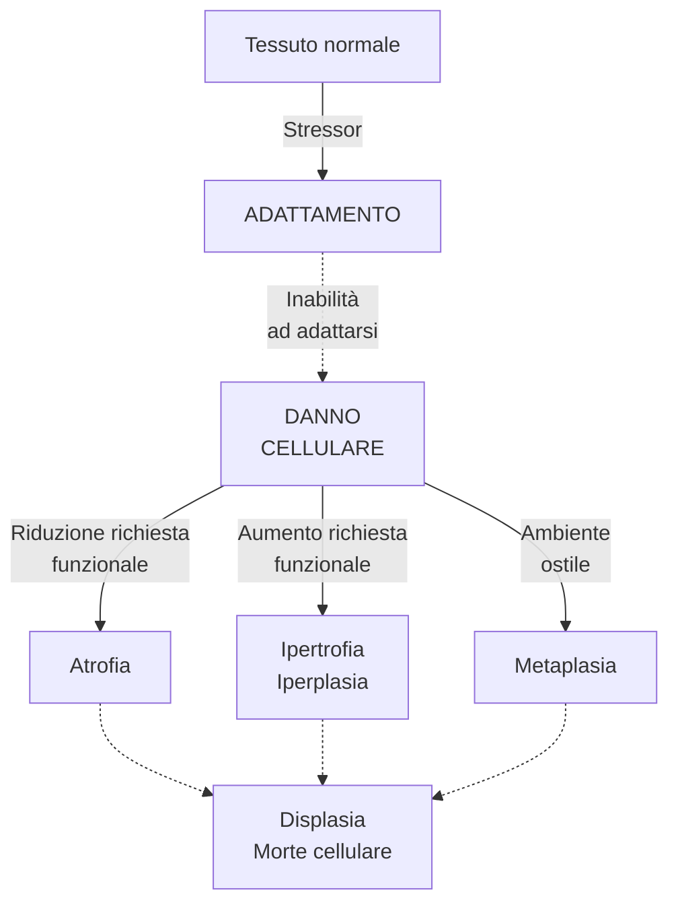

<!--
DALL'OLIO

Patologia cellulare ed extracellulare
    - Radicali liberi e ROX
    - Adattamenti cellulari
    - Morte cellulare
    - Degenerazioni cellulari ed extracellulari (steatosi, degenerazione vacuolare)
    - Patologie da accumulo
-->
<!-- Mon 05 Oct 2020 11:30:04 AM CEST -->

\clearpage

\part{Patologia cellulare ed extracellulare}

# Adattamenti cellulari e meccanismi di adattamento al danno

<!--  -->

- __Adattamenti cellulari__: processi che le cellule attuano per compensare stressor, ovvero stimoli che alterano il normale stato di omeostasi
	1. Atrofia
	2. Ipertrofia e iperplasia
	3. Metaplasia^[A volte si parla anche di __displasia__, ovvero di sviluppo anormale dovuto a stressor. Non è un vero e proprio adattamento, quanto più identifica una situazione in cui il danno viene completamente subito]
	4. Manifestazioni di fallimento nell'adattamento
		1. Displasia^[__Displasia__ --- termine generico che indica tessuto che si sviluppa in modo anormale disorganizzato, a seguito di uno stressor al quale non _è stato_ capace di far fronte. __Non è un processo di compensazione__, quanto una delle manifestazioni di fallimento dell'adattamento allo stress. Tendenzialmente si ha __perdita dei meccanismi di regolazione e controllo__ (nel differenziamento ± velocità di replicazione ± controllo nel numero ± altro) ⇒ displasia è di fatto l'_anticamera_ della trasformazione neoplastica]
		2. Morte cellulare
			- Apoptosi
			- Necrosi

> __Eziologie tipiche di danno cellulare__  
>
>- Eccessiva richiesta funzionale impossibile da soddisfare
>- Insufficiente richiesta funzionale
>- Stimolazione anormale
>- Ipossia o ischemia
>- Cause fisiche (temperatura, radiazioni, danno meccanico...)
>- Cause chimiche
>- Cause infettive
>- Cause immunitarie
>- Squilibri nutrizionali
>- Alterazioni genetiche
>- Neoplasie, che danneggiano le cellule sane circostanti

## Atrofia
- __Atrofia__ --- processo di riduzione di volume e funzionalità di un tessuto, a causa della riduzione del volume e/o del numero di cellule che compongono quel tessuto
- Il processo di atrofia può conseguire sia da cause fisiologiche che patologiche
	- Atrofia fisiologica
		- Nello sviluppo fetale: non tutti gli organi vengono portati fino alla nascita (es: notocorda, vasi ombelicali)
		- Atrofia del timo postadolescenziale
		- Atrofia di tessuti dell'apparato riproduttivo femminile (endometrio, epitelio vaginale, ghiandola mammaria) dopo la menopausa per ridotta stimolazione da estrogeni
	- Atrofia patologica
		- __Ridotta attività funzionale da disuso__: esempio classico è l'arto immobilizzato per lungo tempo, che perde massa muscolare; o gli astronauti che perdono massa dopo lunghe permanenze nello spazio
		- __Atrofia da ridotta perfusione__: atrofia conseguente ad un ridotto trofismo del tessuto (es classico atrofia a valle di una subocclusione di un'arteria)
		- __Atrofia da carenza nutrizionale__ (es: ___marasma___^[___Marasma___ = Carenza nutrizionale di proteine + carboidrati] o ___kwashiorkor___^[___Kwashiorkor___](https://it.wikipedia.org/wiki/Kwashiorkor) = Carenza nutrizionale di proteine + micronutrienti antiossidanti])
		- __Atrofia da perdita di stimolazione endocrina__: tipica di tessuti che, per mantenere un corretto trofismo, necessitano di una continua stimolazione endocrina (es: mammella, apparato genitale)
		- __Atrofia da compressione__: se una struttura cresce (eg tumore) e comprime i tessuti circostanti, questi possono atrofizzarsi
		- __Osteoporosi__ con il progredire dell'età

### Meccanismi alla base dell'atrofia
- I meccanismi con cui si realizza l'atrofia sono essenzialmente 2
	#. La __riduzione del volume delle cellule__ si verifica o per autofagia (= autodigestione controllata) o per degradazione delle proteine intracellulari ad opera del proteasoma
	#. La __riduzione del numero di cellule__ avviene tramite morte cellulare programmata

#### Riduzione del volume delle cellule

##### Degradazione delle proteine cellulari (Unfolded Protein Response)

\ 

#. Stress ⇒ accumulo di proteine mal-ripiegate
#. C'è tentativo di adattamento: ↑ produzione di chaperonine (HSP) per ri-naturare le proteine mal ripiegate
#. Se adattamento non efficace, si hanno 2 strade a seconda dell'entità del mancato adattamento
	- Distruzione delle proteine mal ripiegate ⇒ perdita di volume della cellula ⇒ atrofia
	- Innesco dell'apoptosi ⇒ ✝

##### Autofagia
- __Autofagia__ --- processo di autodigestione _controllato_: si formano vescicole che contengono componenti cellulari da eliminare^[Obiettivo: eliminare dalla cellula i componenti _non necessari_ per ridurre gli sprechi e portare la cellula ad una composizione interna razionalizzata, più essenziale e quindi più agile nel fronteggiare gli stressor esterni]

1. Si assembla il complesso di inziazione e di nucleazione (tramite molecola `BECLIN-1`)
2. Si forma quindi una membrana all'interno del citoplasma, inizialmente a forma di mezzaluna
3. Grazie alle `ubiquitin-ligasi LC3` la membrana a mezzaluna completa la chiusura ⇒ si forma una vescicola ("__autofagosoma__")
4. Nell'autofagosoma vengono inglobati, _con intenzione_^[Come esattamente vengano "scelti" i componenti cellulari ancora non è chiaro] diversi componenti cellulari, per recuperare i componenti di base (aa, acidi grassi...). A seconda di quali componenti cellulari vengono inglobati, distinguiamo
	- Mitocondri → mitofagia (per eliminare mitocondri invecchiati che producono molti ROX)
	- Aggregati proteici poliubiquitinati → aggrefagia
	- Microorganismi patogeni → xenofagia
	- Accumuli di grassi → lipofagia

#### Riduzione del numero di cellule
- Per [apoptosi controllata (vedi)](#apoptosi)

## Ipertrofia ed iperplasia
- Sono di fatto l'opposto dell'atrofia
	- __Ipertrofia__ --- ↑ volume delle cellule (tipico di tessuti perenni [secondo Bizzozzero](#rigenerazione))
		- In realtà _ricerche_^[@smithProteinTyrosinePhosphatase2017: _"Using the adult zebrafish as a novel screening platform, we identified MSI-1436 as a first-in-class regenerative medicine drug candidate. MSI-1436 is a naturally occurring aminosterol that inhibits protein tyrosine phosphatase 1B. Treatment of adult zebrafish by intraperitoneal injection of MSI-1436 increased the rate of regeneration of the amputated caudal fin, which is comprised of bone, connective, skin, vascular and nervous tissues and also increased the rate of adult zebrafish heart regeneration. Intraperitoneal administration of MSI-1436 to adult mice for 4 weeks after induction of myocardial infarction increased survival, improved heart function, reduced infarct size, reduced ventricular wall thinning and increased cardiomyocyte proliferation. [...] Doses effective at stimulating regeneration are 5-50-times lower than the maximum well tolerated human dose"_] dimostrano che è possibile indurre rigenerazione in tessuti perenni
	- __Iperplasia__ --- ↑ numero di cellule (tipico di tessuti labili o stabili [secondo Bizzozzero](#rigenerazione))
		- Iperplasia può essere un _preludio_ a trasformazione neoplastica, in quanto, di fatto, è una situazione in cui si ha un grande tasso replicativo di un certo tessuto (sebbene si mantenga il differenziamento)

### Ipertrofie fisiologiche
#. Ipertrofia da aumentata richiesta funzionale
	- Es: muscolo scheletrico in continuo esercizio → ↑ volume fibre muscolari
	- Ipertrofia del rene per asportazione del rene controlaterale^[In realtà questo è un caso misto: in caso di asportazione, il rene rimasto aumenta sia per ipertrofia che per iperplasia (↑ lunghezza dei tubuli, ma non aumenta il numero di nefroni)]
#. Ipertrofia da variazione dei livelli ormonali
	- Ipertrofia degli organi sessuali secondari durante pubertà
	- Ipertrofia (+iperplasia) della ghiandola mammaria durante gravidanza e allattamento (per ↑ estrogeni)

### Ipertrofie patologiche
#. Ipertrofia _patologica_ da aumentata richiesta funzionale
	- Es: cardiomiopatia ipertrofica secondaria a ipertensione di lunga data
#. Ipertrofia _patologica_ da squilibrio endocrino in tessuti ormone-sensibili
	- Endometrio femminile
	- Prostata
	- Gozzo tiroideo da carenza di iodio (compensata con ↑ TSH)
	- Ipertrofia della corteccia surrenalica da ↑ ACTH (___iperaldosteronismo___, ___morbo di Cushing___)

### Iperplasie fisiologiche
#. Iperplasia da stimoli ormonali fisiologici
	- Epitelio mammario durante pubertà e gravidanza
	- Muscolatura uterina durante gravidanza
	- Sintesi di eritrociti da ipossia (ipossia ⇒ ↑ eritropoietina)
#. Iperplasia compensatoria
	- Iperplasia in risposta ad epatectomia parziale
	- Iperplasia dopo nefrectomia monolaterale (si determina sia iperplasia, tramite allungamento dei tubuli; che ipertrofia dei glomeruli per compensare la capacità di filtrazione che si è persa)
	- Iperplasia dello strato corneo della cute in risposta a stress meccanici ripetuti (i calli, per intenderci)

### Iperplasie patologiche

> __Iperplasia patologica, metaplasia e neoplasie__  
> Entrambe _non_ sono manifestazioni neoplastiche, ma ne possono essere il preludio:
>
>- Iperplasia patologica → Se la fase della crescita massiva è già in essere, manca solo la perdita del controllo (± de-differenziamento) per rendere l'iperplasia patologica una neoplasia
>- Metaplasia → gli elementi staminali di un certo tessuto che cambiano programmazione e si differenziano verso un tipo di tessuto differente. Manca la proliferazione incontrollata per rendere la metaplasia una neoplasia

#. Iperplasia da stimoli ormonali patologici
	- Iperplasia adenomatosa dell'endometrio: nel periodo perimenopausale si può verificare, per squilibrio ormonale, ipertrofia dell'endometrio che produce sanguinamenti
	- Ipertrofia prostatica benigna, per squilibri nella sintesi di testosterone
#. Stimolazione iperplastica da fattori di crescita
	- Leucocitosi (↑ neutrofili) in risposta ad una infezione^[Vengono prodotti GF per avere una neutrofilia, per fronteggiare più efficacemente l'infezione]
	- Iperplasie del midollo osseo
		- ___Morbo di Cooley___ (una forma di β-talassemia major): __assente o ridotta sintesi delle catene β dell'Hb__ → anemia → stimolazione dell'eritropoiesi (grazie a `HIF`^[Hypoxia-Inducible Factor] e `eritropoietina` → iperplasia del midollo per far fronte a questa richiesta → deformità ossee per aumentato volume del midollo
	- Verruche da _Papilloma virus_ (il Papilloma immortalizza le cellule)
	- [Cheloidi](#aspetti-patologici-della-riparazione) (iperplasia connettivale durante la guarigione aberrante di una ferita)

## Metaplasia
- __Metaplasia__ --- sostituzione di un tessuto _già differenziato_ con un altro tessuto _differenziato_ più efficace a fronteggiare lo stressor

\ 

- Esempi classici di metaplasia
	1. Metaplasia nelle vie aeree di un sg. fumatore
		- Metaplasia in risposta a continua irritazione da agenti chimici + stress meccanico del particolato sottile sospeso
		- È metaplasia pavimentosa: epitelio cilindrico monostratificato → epitelio squamoso pluristratificato
	2. Calcoli nel coledoco o colecisti
		- Calcoli ⇒ irritazione (meccanica) ⇒ danno cellulare
		- Metaplasia pavimentosa: epitelio cilindrico monostratificato → epitelio squamoso pluristratificato
	3. Esofago di Barrett
		- Reflusso gastrico → risalita di succhi gastrici in esofago ⇒ danno da ustione chimica
		- Epitelio pavimentoso pluristratificato della mucosa esofagea → epitelio cilindrico monostratificato (simile a mucosa gastrica)

## Morte cellulare
- Insieme a displasia, rappresenta il fallimento nell'adattarsi al danno \marginfig{apoptosivsnecrosi}
	1. Morte per necrosi: morte _disordinata_, che produce _infiammazione_^[= esplodono in una nuvola di fiamme, producendo quanto più casino possibile, per incoraggiare la produzione di una risposta]
	2. Morte per apoptosi: morte _ordinata_, che produce la _minima quantità di infiammazione_^[= rilasciano meno DAMPS possibile, cercano di pulire mentre stanno morendo]
	3. Morti cellulari "particolari"
		- Anoikis
		- ENTosi
- Perché fallisca l'adattamento e la cellula muoia, si deve verificare un __danno irrecuperabile__. L'idea di "irrecuperabilità" è data dalla combinazione di __intensità__ e __durata__
	- Un danno è permanente per _grande intensità_ dello stimolo lesivo
	- Un danno è permanente per il _perdurare_ dello stimolo lesivo

> __Necrosi regolata__  
>L'apoptosi è una morte regolata, tuttavia anche alcune forme di _necrosi_ possono essere regolate. La differenza risiede nella pulizia della morte
>
>- Apoptosi: morte pulita, condotta cercando di minimizzare l'infiammazione. È per sua natura un processo _regolato_, perché sono necessarie operazioni in sequenza appropriata per minimizzare la produzione di DAMPS
>- Necrosi: morte sporca, condotta senza preoccuparsi dei DAMPS prodotti dalla morte cellulare ⇒ infiammazione, a volte anche attivamente ricercata
>
>La programmazione o meno della morte è un concetto che prescinde dalla strategia usata per morire: esistono, infatti, anche casi di __necrosi programmata__:
>
>- Necroptosi --- Anche "apoptosi caspasi-indipendente", è una morte al confine tra necrosi e apoptosi, passa tramite la costruizone di un complesso detto _necrosoma_. Le cause possono essere le stesse dell'apoptosi, rappresentando di fatto un processo che con l'apoptosi può essere in diretta competizione
>- Mithocondrial Pore Transition (MPT) regulated necrosis --- Necrosi ottenuta mediante porazione intenzionale della membrana mitocondriale, che prota alla dissipazione della ddp lì accumulata, con conseguente deplezione delle riserve di ATP
>- Parthanatos --- morte cellulare causata da una eccessivo consumo richiesta di NAD+. Questo succede solamente quando si evidenziano danni al DNA talmente estesi che i meccanismi di riparazione (_BER_ in primis) non riescono a riparare \oldfootnote{BER usa il macchinario molecolare della \texttt{PARP1} per riparare i danni, la quale è estremamente esosa di NAD+}
>- Piroptosi --- Morte _estremamente_ infiammatoria. Usa la caspasi-1, e produce una quantità di DAMP e PAMP molto elevata
>- Ferroptosi --- Causata da un eccesso di danno ossidativo, da perossidazione dei lipidi di membrana. Meccanismo che richiede lo ione ferro per procedere

### Meccanismi generali con i quali si esplica qualsiasi tipo di morte cellulare

- A prescindere dalla modalità con cui la cellula muore, la morte viene raggiunta per 3 tipologie di danno, quando queste diventano irreversibili
	1. ⭐️ Deplezione di ATP^[Ipossia protratta da ischemia è causa tipica ed esemplificativa: ipossia ⇒ ↓ fosforilazione ossidativa mitocondriale ⇒ non viene prodotta ATP, ma viene consumata ⇒ esaurimento delle riserve di ATP] (crisi energetica)
		- ⇒ Switch a glicolisi anaerobia ⇒ formazione di lattati ⇒ ↓ pH intracellulare ⇒ __addensamento della cromatina__ e __denaturazione delle proteine__
		- ⇒ ??? ⇒ distacco dei ribosomi ⇒ ↓ sintesi proteica ⇒ ??? ⇒ __deposizione dei lipidi intracellulari__ e formazione delle _figure di mielina_^[Le _figure mieliniche_ sono fosfolipidi ripiegati a formare strutture spiraliformi che ricordano la disposizione di mielina attorno ai neuroni]
		- ⇒ La pompa ATPasica Na^+^/K^+^ non funziona ⇒ uscita di K^+^, ingresso di Na^++^ ⇒ ingresso netto di acqua ⇒ __rigonfiamento della cellula__ (_oncosi_) e formazione dei _"bleb"_ di membrana ⇒ 
			- Rilascio di enzimi cellulari in circolo
			- Degenerazione vacuolare della cellula (la cellula si rigonfia e ha morfologia simile a quella dei vacuoli)
		- ⇒ Le pompe ATPasiche che, contro gradiente, devono mantenere il Ca^++^ intracellulare confinato in mitocondri e RE non funzionano più ⇒ ↑ Ca^++^ citosolico
	2. Perdita di omeostasi del Ca^++^
		- ↓ ATP ⇒ stop pompe ATPasiche ⇒ fuoriuscita del Ca^++^ da mitocondri + RE ⇒ ↑ Ca^++^ citosolico
		- ↑ [Ca^++^] ⇒ attivazione di enzimi Ca^++^-dipendenti: ATPasi, fosfolipasi, proteasi, endonucleasi ⇒ un gran casino, viene degradata ogni cosa: ATP, membrane, proteine del citoscheletro, cromatina...
	3. Danno mitocondriale ⇒ porazione della membrana mitocondriale^[\textbf{Il tipo di pori che si vengono a creare nei mitocondri è essenziale nel decidere se succederà apoptosi o necrosi}, in quanto entrambi i fenomeni passano per la porazione della membrana mitocondriale]
		- Porazione effettiva della membrana (formazione di MPTP^[Mitochondrial Permeability Transition Pores])
			- ⇒ perdita della _ddp_ transmembrana che è essenziale per stoccare l'energia per produrre ATP^[L'energia recuperata dalle specie chimiche che vengono ossidate durante la catena di trasporto degli elettroni, viene stoccata sottoforma di ioni H^+^ nello spazio transmembrana dei mitocondri. Il gradiente protonico viene poi usato per alimentare l'`ATP-sintasi` -- che è una proteina che pesca H^+^ nello spazio intermembrana e li fa uscire all'interno dei mitocondri, facendoli quindi viaggiare secondo gradiente -- per guadagnare l'energia sufficiente a legare il terzo gruppo fosfato all'ADP. Cfr Bchem Metabolica se proprio vuoi maggiori dettagli (ma perché?!).] ⇒ __inabilità a produrre ATP__
		- Apertura di pori preformati, la cui apertura è controllata dalle molecole `Bax`/`Bak` e `BCL2`
			- ⇒ fuoriuscita del __citocromo C__ ⇒ inizio della via apoptotica ([pathway intrinseco](#pathway-intrinseco))

### Necrosi
- Distinguiamo classicamente 5 tipi di necrosi
	1. __Necrosi coagulativa__ (_"a stampo"_) --- il tessuto preserva la propria compattezza e l'impronta del tessuto di origine^[Tipica dei tessuti infartuati, tranne il cervello (dove si ha necrosi colliquativa)]
	2. __Necrosi colliquativa__ --- il tessuto necrotico si liquefa, grazie al contributo della degranulazione dei neutrofili^[Tipica di qualsiasi cosa in cui ci sia pus]
	3. __Necrosi caseosa__ --- si arriva alla produzione di una sostanza bianca, poltacea, compatta; si preserva la compattezza ma non la forma
	4. __Necrosi gangrenosa__ --- necrosi + sovrapposizione batterica che porta a putrefazione^[Tipica di quando necrotizzano gli arti inferiori, pes da diabete]
	5. __Steatonecrosi__ --- necrosi per saponificazione dei grassi^[Tipica delle pancreatiti necrotico-emorragiche]

#### Necrosi coagulativa
- Tipica di tessuti infartuati che possono eseguire switch verso metabolismo anaerobico^[Infatti nel cervello ischemico si ha tipicamente necrosi colliquativa]. L'acidificazione del citoplasma attiva le idrolasi acide e si ha necrosi a stampo
	0. Ischemia ⇒ __switch a metabolismo anaerobio__
	#. Accumulo di lattati ⇒ ↓ pH
	#. Denaturazione delle proteine, comprese le __idrolasi acide lisosomiali__
		- Blocco del metabolismo
		- Denaturazione dell'ultrastruttura del nucleo
	#. Picnosi → carioressi → cariolisi, mentre il resto della cellula rimane "cristallizzato" nella conformazione in cui si trova
- Per rimozione del tessuto (per fagocitosi) necessari alcuni giorni. RaI/riparazione dipendente da tipologia di tessuto (labile o stabile vs perenne)
- Aspetti morfologici per riconoscerla
	#. Conservazione dell'architettura microscopica _MA mancanza di nuclei_
	#. Eventualmente rilevabile infiltrazione leucocitaria (neutrofili)

#### Necrosi colliquativa
- Conseguente a danno di membrana + attivazione degli enzimi litici ⇒ __autolisi della cellula__. Eziologia alternativa: danno da degranulazione dei neutrofili
	1. ↑ [Ca^++^] citoplasmatico
	2. Attivazioni degli enzimi litici
	3. Danno delle membrane e morte cellulare
- Aspetti morfologici per riconoscerla
	#. Architettura del tessuto difficilmente distinguibile, tutto liquefatto
	#. Possibili neutrofili

#### Necrosi caseosa
- Necrosi caseosa = necrosi coagulativa + necrosi colliquativa
- Al processo misto, sia coagulativo che colliquativo, si aggiungono 3 elementi, che rendono la materia necrotica di consistenza poltacea
	- Sclerosi (formazione di fibre)
	- Calcificazione
	- Formazione di caverne (cavità che si generano per espulsione di contenuto)
- Tipico: noduli di TBC polmonare

#### Necrosi gangrenosa
- Per crescita batterica su tessuto, che ne provoca la necrosi e la putrefazione
- 3 forme, in base alla causa della necrosi
	1. Secca: necrosi coagulativa (+ crescita batterica)
	2. Umida: necrosi colliquativa (+ crescita batterica)
	3. Gassosa: necrosi per produzione di gas dalla flora batterica che sta colonizzando (tipicamente _Clostridi_)

#### Steatonecrosi
- Tipica del pancreas, poiché sono necessari gli enzimi pancreatici per saponificare i grassi
	0. Danno cellulare ⇒ rilascio degli enzimi pancreatici (lipasi) e Ca^++^ che era intracellulare
	1. Le lipasi scindono acidi grassi
	2. Il gruppo -COOH degli acidi grassi si lega al Ca^++^ liberato dal danno cellulare ⇒ __saponificazione degli acidi grassi__

#### Morfologia al MO della necrosi
- Aspetto principale: modificazioni progressive del nucleo (picnosi → cariolisi → carioressi)^[ In nero i nuclei picnotici (frecce centrali), in rosso i nuclei in carioressi (frecce in alto a dx), in blu i nuclei scomparsi per cariolisi (a sx)]
	1. Picnosi: nucleo piccolo, addensato, molto basofilo
	2. Carioressi: il nucleo picnotico si frammenta
	3. Cariolisi: i frammenti nucleari scompaiono

#### Conseguenze della necrosi
- Locali
	- Infiammazione
	- Rigenerazione (se cellule necrotiche sono labili o stabili) → morfologia conservata, funzione conservata (_restitutio ad integrum_, RaI)
	- Riparazione (se cellule necrotiche sono perenni) → morfologia conservata, perdita di funzione
- Sistemiche
	- Fuoriuscita di enzimi cellulari^[Ecco perché si dosano enzimi cellulari come _marcatori di necrosi_ (o, generalizzando, di danno cellulare), es: troponina cardiaca, transaminasi (ASP, ALT), creatina-chinasi (marker di generico danno muscolare, ↑ in \pat{dmd])...]
	- Fuoriuscita di DAMPs ⇒ infiammazione anche sistemiche

### Apoptosi
- Morte cellulare _pulita_ (portata avanti in maniera da minimizzare l'infiammazione)
- Cause molto varie (il confine tra quali cause sono fisiologiche e quali sono patologiche è come al solito molto sottile ed estremamente dipendente dal contesto^[Il fenomeno apoptotico in sé è estremamente necessario alla vita, quando portato avanti _in modo regolato_: la patologia si origina quando, in eccesso o in difetto, si ha una perdita di controllo nei meccanismi apoptotici. Questo significa, per esempio, che una perdita nell'apoptosi può favorire patologie neoplastiche (per immortalizzazione di cellule e conseguente rischio elevato se si perdono i meccanismi di controllo nella replicazione cellulare); ma viceversa, anche un'apoptosi eccessivamente frequente può portare ad atrofia tissutale ed essere alla base di patologie degenerative come Alzheimer, Parkinson, Huntington... In sostanza, le due facce della medaglia (replicazione e morte cellulare) è necessario che siano in equilibrio per garantire un corretto stato di salute. Un eccesso o un difetto dovuto alla perdita di controllo di ciascuno dei due processi (morte o replicazione) può essere causa di patologia])
	- Perdita della stimolazione continua di GF necessari alla sopravvivenza
	- Determinazione di un equilibrio che, tra fattori di sopravvivenza e di morte, fanno vincere i secondi a scapito dei primi (situazione tipica di alcuni citotipi, eg linfociti in maturazione)
	- Apoptosi per fallimento delle pathway cellulari di riparazione dal danno
	- Attivazione esterna da TNF, FAS, garanzima B
	- ...
- 2 vie per l'esecuzione dell'apoptosi, a seconda di _dove si origini l'impulso apoptotico_
	1. [__Via intrinseca__](#pathway-intrinseco) --- l'impulso apoptotico proviene _dall'interno_ della cellula, tramite il rilascio dei citocromi C da parte dei mitocondri
	2. [__Via estrinseca__](#pathway-estrinseco) --- l'impulso apoptotico proviene _da fuori_ la cellula, tramite legame con recettori di membrana

> __Frammentazione del DNA nell'apoptosi e nella necrosi: differenze osservabili all'elettroforesi del materiale genetico__ \label{boxelettroforesi}  
>Nell'apoptosi la frammentazione del DNA è _regolare_, in quanto è eseguita da endonucleasi apposite che tagliano in maniera specifica e regolare il DNA, in appositi siti di taglio (si vedono picchi elettroforetici discreti, se si fa l'elettroforesi del materiale genetico della cellula morta per apoptosi)  
>Nella necrosi il DNA viene degradato e spezzettato in modo irregolare, in quanto il taglio viene svolto dalle endonucleasi attivate che tagliano il genoma in maniera aspecifica (si vede un _continuum_ all'elettroforesi, se si fa l'elettroforesi del materiale genetico della cellula morta per necrosi)

#### Pathways per l'esecuzione dell'apoptosi

\ 

- Ci sono 2 vie, estrinseca ed intrinseca, per l'_attivazione_ dell'apoptosi: entrambe convergono verso l'attivazione delle __caspasi esecutrici__. Da lì, l'apoptosi prosegue in modo unico
	1. Per via estrinseca o intrinseca viene attivata l'apoptosi
	2. Vengono percorse le vie intracellulari per l'attivazione delle __caspasi esecutrici__
	3. Le caspasi esecutrici smantellano proteine e l'intera architettura cellulare
		- Viene tagliata e smantellata l'intera struttura cellulare ⇒ formazione di vescicole (_"corpi apoptotici"_) che contengono residui della cellula
		- Viene flippata verso l'esterno i residui di __fosfatidilserina__ di membrana^[Componente della parete lipidica che normalmente è girata verso il versante citoplasmatico]: questo marca i corpi apoptotici che si stanno formando per la fagocitosi, minimizzando così la quantità di DAMPs prodotti. I macrofagi, quindi, se li pappano liberamente e senza troppo casino^[Se non si ha una fagocitosi veloce, però, dopo un po' anche i corpi apoptotici perdono la loro permeabilità di membrana, riversando il loro contenuto all'esterno e, quindi, andando a produrre un quadro di __necrosi secondaria__]
		- Viene tagliato -- e quindi perde funzione -- l'inibitore di una DNAsi tipica del processo apoptotico, che è quindi libera di smantellare il materiale genetico in maniera specifica, producendo la tipica regolarità in termini di lunghezza (vedi box pagina \pageref{boxelettroforesi})
	4. Si formano vescicole (_"corpi apoptotici"_) con appositi ligandi per i fagociti
	5. I fagociti si sbarazzano dei corpi apoptotici

##### Pathway estrinseco
0. Legame tra i fattori extracellulari (`TNF` e `FasL`^[Ligando del FAS], ma anche il `Garanzima B`^[Enzima iniettato dai lfc T citotossici]) e i recettori di membrana. Il legame porta i recettori a trimerizzare^[]
1. Recettori trimerici legano il `FADD`, una molecola adattatrice che trasduce il segnale
2. FADD, con la sua __attività autocatalitica__, dà inizio alla __cascata delle caspasi__^[Le caspasi sono delle __proteasi con una -Cis nel centro funzionale__, e tagliano le proteine in corrispondenza dei residui di -Arg. Sebbene siano centrali nella catena dell'apoptosi, le caspasi sono in realtà proteasi, per cui vengono usate anche in altri pathway cellulari (es: vengono usati nella maturazione delle citochine proinfiammatorie, e la sotto-famiglia che si occupa di quello è, non a caso, quella delle _caspasi proinfiammatorie_)]
	1. Si reclutano le __caspasi iniziatrici__, che attivano il meccanismo apoptotico (caspasi-2, __-8__ (⭐️), -9, -10)
	2. Le caspasi iniziatrici reclutano le __caspasi esecutrici__, che effettivamente demoliscono l'architettura cellulare (caspasi-3, -6, -7)
3. L'apoptosi procede per via comune (vedi sopra)

##### Pathway intrinseco
0. In condizioni normali l'apoptosi è _impedita_ da molecole^[`BCL2`, `BCL-x`] che __chiudono i pori normalmente presenti nella parete mitocondriale__, impedendo l'uscita dei citocromi
1. In caso eventi pro-apoptotici (mancanza di segnali di sopravvivenza, danno irrecuperabile al genoma...) si attiva una classe di molecole __`BH3-only`__ (_"sensori del danno"_), che mediano l'apertura dei pori mitocondriali
2. Pori mitocondriali aperti ⇒ fuoriuscita del `CytC`, che è _potente_ stimolatore pro-apoptotico
3. Ulteriore checkpoint: __perché l'apoptosi prosegua, è necessario che gli stimoli pro-apoptotici > stimoli anti-apoptotici__^[Questo è il consueto concetto di "bilancia molecolare": da una parte ci sono i fattori pro-apoptotici che spingono per fare andare la cellula in apoptosi; dall'altra ci sono i fattori anti-apoptotici che spingono per fare sopravvivere la cellula -- quello che succederà realmente dipende da chi vince a questo "braccio di ferro molecolare"]
	- Fattori _pro-apoptotici_ (__AIFs__, Apoptosis Inducing Factors)
		- Inibitori dei fattori anti-apoptotici (es: `SMAC-DIABLO`)
		- Citocromo C
	- Fattori _anti-apoptotici_ (__IAPs__, Inhibitors of ApoPtosis)
		- Inibitori delle caspasi
4. Se fattori pro-apoptotici > fattori anti-apoptotici: si ha commitment verso apoptosi, con la __formazione dell'apoptosoma__
	- Apoptosoma è complesso eptamerico formato da 7 dimeri di APAF-1 + CytC
5. Apoptosoma attiva le caspasi iniziatrici (particolarmente la caspasi-9)
6. Le caspasi iniziatrici attivano le caspasi effettrici
7. L'apoptosi procede per via comune (vedi sopra)

### Tipi particolari di morte cellulare

#### Anoikis
- __Anoikis__ (_"essere senza casa"_) --- apoptosi indotta dalla mancata adesione ad un substrato solido
    - Tipica dei tessuti solidi
    - Anche le cellule tumorali sono solitamente sensibili all'anoikis, salvo tumori molto avanzati/maligni
- Anoikis viene evitata, da cellule normalmente adese alla ECM, tramite la mediazione dell'__actina__, che in conformazione stirata permette la migrazione nel nucleo dei fattori di trascrizione YAP/TAZ
	- Se la cellula è adesa, le integrine sono collegate all'ECM ⇒ __l'actina citoscheletrica__ (legata alle integrine) è __in conformazione stirata__
		1. __L'actina in forma stirata cattura l'_inibitore_ del dimero YAP/TAZ__, che è quindi parcheggiato lì e non fa niente
		2. Il dimero YAP/TAZ, comunemente nel citoplasma, è libero di migrare nel nucleo e avviare la via di segnalazione intracellulare (__via HIPPO__) che porta al differenziamento e alla proliferazione
	- __Se la cellula non è adesa ⇒ actina citoscheletrica è in conformazione rilassata__
		1. L'actina non lega più l'inibitore di YAP/TAZ
		2. L'inibitore sequestra il dimero YAP/TAZ, che rimane nel citoplasma
		3. La mancanza di attivazione della via HIPPO porta all'apoptosi

> __Ruolo della compattezza dell'ECM e sua influenza nelle dinamiche di vita e differenziamento cellulare__ ---
> Una ECM compatta, a differenza di una ECM lasca, impone una forza differente sulla cellula, a tutti gli effetti _stirando_ l'impalcatura cellulare. Con meccanismi analoghi a quello YAP/TAZ questo determina un differente stimolo che porta la cellula a differenziarsi in modalità differente
>
>   
>
>#. Cellule epiteliali seminate su matrice morbida → struttura cava
>#. Cellule epiteliali seminate su matrice compatta → struttura piena
>#. Cellule epiteliali seminate su matrice _molto_ compatta → capacità migrante! ⚠️
>
> In aggiunta, sempre con meccanismi di sensibilità alla forma mediati dal livello di tensione del citoscheletro, si osserva una diversa potenzialità differenziativa a seconda che tipi di cellule diverse, per varia ragione, siano adese al substrato con una superficie più o meno grande (perché la superficie di adesione influenza la forma della cellula nel suo complesso, trasferendo le forze grazie al citoscheletro)
>
>  
> Metodi di coltura cellulare su ECM progressivamente più soffici permettono di capire il grado di malignità di una cellula: è tanto maggiore quanto più la cellula riesce a sopravvivere e differenziarsi in matrici progressivamente più lasche

#### Entosi
- __Entosi__ --- Processo per il quale una cellula (detta _guest_) viene inglobata in un'altra cellula (detta _host_) senza venire digerita, per sfuggire ad un ambiente sfavorevole
	- Possibile entosi in serie, tipo matrioska di cellule
- Il destino dell'host è differente a seconda delle circostanze
	- Morte dell'host dentro il guest
	- Uscire dopo un certo periodo, quando le condizioni dell'ambiente sono mutate
	- Permanere nell'host, portando frequentissimamente ad aneuploidia -- con danni genomici del caso
	- Duplicarsi all'interno dell'host

<!-- lun 26 ott 2020, 12:06:44, CET -->
# Patologie da accumuli extracellulari

## Calcificazioni
- Depositi di __idrossiapatite__^[Ca~10~(PO~4~)~6~(OH)~2~]
- Perché ci sia deposizione si deve avere una combo di 2 fattori
	- Eventuale esposizione di centri nucleatori (ioni o strutture compatibili con ioni) che incoraggiano la formazione del reticolato cristallino
	- Aumento (se non sistemico, quantomeno localizzato) di Ca e P~i~ (~ 60--70 mg/dl), che normalmente si trova ad un livello subcritico^[Non sufficiente, in condizioni standard, per formare depositi di calcio così, alla boia. L'unico punto in cui questa deposizione a queste concentrazioni viene permesso è l'ambiente, molto particolare e controllato, dell'osso]
- 2 tipi di calcificazioni patologiche: distrofiche e metastatiche
	- __Calcificazione distrofica__ --- calcificazione di tessuti morti o danneggiati. Necessita di centri nucleatori
		- Es: calcificazione in nodulo di TBC polmonare
		- Es: calcificazione in placca ateromasica
	- __Calcificazione metstatica__ --- depositi secondari a ipercalcemia che si verifica in tessuti sani, caratterizzati da pH lievemente alcalino (ovvero dove c'è poca CO~2~)
		- Es: calcificazione nella tonaca media di una grande arteria in sg. ipercalcemico, dove ci sono ↑ pO~2~

### Calcificazioni distrofiche
- Calcificazione in ambiente necrotico o in via di degenerazione
- Procedimento di accumulo del deposito distrofico in 2 fasi
	1. __Nucleazione__: eventuali ioni di Ca^+^ o PO~4~^-^, che si trovano in ambiente favorevole^[Ricordiamoci che nel tessuto necrotico c'è la liberazione di un sacco di roba che prima era intracellulare, tra cui gli ioni in questione], fungono da centri di nucleazione per nuovo calcio o fosfato, che si monta accanto, legandosi
		- Ambiente: se non sono già presenti ioni di fosfato e calcio, basta anche che ci sia un tessuto con strutture relativamente compatibili con gli ioni stessi che possono fornire una buona base per la nucleazione pur non essendoioni (fibre elastiche, fosfolipidi, collagene, tessuti con matrice digerita, __una preesistente colonia batterica__^[Vedi tartaro su denti: si deposita proprio in questo modo, la colonia batterica funge da centro di nucleazione]). Successivamente saranno gli ioni stessi a fornire la base per la nucleazione di altri ioni → fenomeno di __eptassia__
	2. __Propagazione__: altri atomi sono incoraggiati a depositarsi su questa struttura, producendo una struttura regolare, geometrica e tridimensionale tipica della deposizione cristallina

### Calcificazioni metastatiche
- Calcificazione secondaria ad una ipercalcemia in distretti con pH (relativamente) alcalino^[Primi esempi che devono venire in mente: intima dei grandi vasi (grosse arterie, vene polmonari...), reni, polmoni, cornea]
- Eziologie per ipercalcemia
	- ↑ produzione di PTH
		- Primario per iperplasia/tumore delle paratiroidi
		- Secondario per secrezione da tumori secernenti PTH (o sostanze PTH-like)
		- In risposta a ritenzione di fosforo per insufficienza renale
	- Distruzione di tessuto osseo per processi patologici^[Es in \pat{mieloma multiplo]]
	- Eccesso di vitamina D
	- Idiopatica

## Amiloidosi
- __Amiloidosi__ --- condizione tipica di un gruppo disparato di patologie che porta a __deposizione__ (locale o sistemica in più foci) __di materiale proteico insolubile nei tessuti__

\normalbox{Colorazioni per evidenziare al MO i depositi proteici}{
\begin{itemize}
\tightlist
\item \goldstandard \textbf{Rosso Congo}: se vetrino colorato con RC viene visto illuminato da luce polarizzata, i depositi proteici cambiano colore (fenomeno della \emph{birifrangenza}), altrimenti colorazione appare rosata
\item \textbf{Coloranti basici} (cristal-violetto, blu di metilene): i depositi proteici evienziano metacromasia\oldfootnote{Coloranti a dominante blu, però nelle zone dove c’è sostanza amiloide il tessuto assume colorazione color ciclamino}. Seconda scelta, ma tutti i nostri preparati saranno colorati in questo modo
\item Basate sullo iodio: i depositi vengono colorati in blu, proprio come succede con i polisaccaridi. Questa scelta di colorazione fu alla base dell'equivoco che aveva portato i patologi di fine '800 a definire i depositi proteici come ``amiloidi'' (= fatti di amido)
\end{itemize}
}

- Il materiale proteico (_"amiloide"_) che si accumula nell'amiloidosi è così composto
	- __Proteina amiloide__ (95%) --- materiale proteico ripiegato a β-foglietto, derivato a sua volta da altre proteine che, per svariati motivi, si cambiano il loro ripiegamento verso il β-foglietto, condensano e si depositano
	- __Componente P__ (o SAP, Serum Amyloid Protein) --- proteina prodotta dal fegato durante infiammazione in fase acuta
	- __Componenti minori__
		- GAG (acido ialuronico, conditrin-solfato...)
		- Apolipoproteina E
- Conseguenze del deposito: dipendenti dal tessuto
	- Conseguenze generali
		- ↑ difficotà degli scambi tra capillari e tessuti ⇒ possibili alterazioni del trofismo
		- Parziale o totale sostituzione del tessuto con aggregati amiloidi
	- Conseguenze tessuto-specifiche
		- Tratto GI → disturbi di motilità, malassorbimenti
		- Rene → proteinuria, IR, uremia
		- Cuore → aritmie, scompenso congestizio
		- SN → polineuropatie, Alzheimer
		- Altri tessuti → disturbi specifici (es, lingua: disturbi della fonazione)

### La proteina amiloide
- Origine della proteina amiloide: __materiale proteico erroneamente ripiegato a β-foglietto__. Si creano aggregati proteici molto stabili (ad uno stato energetico molto basso) difficilissimi da eliminare

\ 

- _A seconda di quale materiale proteico dà origine alla proteine amiloide_ distinguiamo diverse amiloidosi
	1. __Amiloidosi leggera__, o _primaria_
		- Si depositano: derivati delle catene leggere degli anticorpi
		- Causa: Solitamente secondaria a discrasia (= crescita alterata) delle plasmacellule o lfc B
			- Discrasia di cellule producenti anticorpi ⇒ eccesso di catene leggere rispetto a catene pesanti ⇒ accumulo
			- Possibile che accumulo non porti necessariamente a deposito^[Questo succede in alcune gammopatie monoclonali benigne (= patologie _benigne_ con iperproduzione di γ-globuline per iperplasia (per ora ancora benigna) di _un clone_ di cellule producenti globuline, solitamente plasmacellule], ma ad ↑ escrezione delle catene leggere mal ripiegate nelle urine (⇒ proteinuria con "_proteine di Bence-Jones_^[La proteina di Bence Jones è una proteina appartenente alla classe delle globuline (20 kDa). È di fatto la catena leggera di un anticorpo, distaccata dalle catene pesanti: le catene leggere chiamate "proteina di Bence Jones" sono diverse dalle catene leggere "usuali" che i linfociti B del corpo normalmente producono:. le Bence Jones sono libere, mentre le normali catene leggere sono legate alle catene pesanti corrispondenti a formare l'anticorpo]")
	2. __Amiloidosi A__
		- Si depositano: derivati di frammenti di proteina `SAA` (Serum Amyloid protein A), una proteina dell'infiammazione acuta prodotta dal fegato
		- Causa: particolari infiammazioni (TBC, linfoma di Hodgkin, infiammazione intestinale, uso parenterale di droghe...) protratte nel tempo
			- Infiammazione protratta ⇒ continua stimolazione epatica ⇒ ↑ SAA
			- I macrofagi tagliano la SAA e producono frammenti
			- Un frammento particolare di SAA (76 aa.) ha capacità amiloidogena: si ripiega a β-foglietto e può accumularsi
	3. __Amiloidosi associata ad emolisi__
		- Si depositano: derivati di β2-microglobulina
		- Causa: mancata filtrazione di β2-microglobulina (una componente dell'MHC1) durante emodialisi. Materia amiloide si deposita nel \a{tunnel carpale} (non si sa perché proprio lì)
	4. __Amiloidosi endocrina__
		- Si depositano: derivati di proteine il cui accumulo è favorito da un qualche tipo di disregolazione endocrina
			- Accumulo di calcitonina in tumori tiroidei
			- Accumulo di `amilina` nelle cellule β del pancreas solo ed esclusivamente nel T2DM (non chiaro come mai, verosimilmente perché in questo quadro patologico amilina viene glicata)
	5. Forme ereditarie di amiloidosi
		- Si depositano: derivati di proteine mutate, la cui mutazione è secondaria ad anomalie genetiche ereditarie
			- Accumulo di derivati di `transtiretina`^[Proteina routinariamente coinvolta in trasporto degli ormoni tiroidei] (per mutazioni puntiformi che le danno capacità amiloidogenica)
	5. __Amiloidosi sistematica senile__
		- Si depositano: derivati di proteine che, intrinsecamente, hanno una capacità amiloidogena (= proteine per le quali è più facile che si possa alterare il loro ripiegamento in senso di β-foglietto)
			- Transtiretina (evidentemente la transtiretina ha capacità amiloidogenica di per sè)

### Un esempio particolare di amiloidosi: la malattia di Alzheimer
- Amiloidosi localizzata nell'encefalo, caratterizzata da 2 reperti caratteristici: le __placche senili__ (vera deposizione amiloide) e gli __ammassi neurofibrillari__
	- __Placche senili__ --- deposizione in forma amiloide di un frammento del `peptide A-β`
	- __Accumuli neurofibrillari__ --- fasci di filamenti elicoidali accoppiati nel citoplasma dei neuroni, che dislocano o avvolgono il nucleo. Costituiscono, verosimilmente, il culmine di svariati processi patologici che interessano il neurone. L'accoppiamento dei filamenti elicoidali è causato da una iper-fosforilazione della `proteina τ`
- Alterazioni (placche senili + accumuli neurofibrillari) ⇒ __perdita progressiva delle funzioni cerebrali superiori__^[Se si fanno delle PET per valutare il consumo di glucosio, la differenza tra un sg. sano e un sg. con Alzheimer è drammatica:\
]
	- Progressiva perdita di memoria
	- Alterazioni del comportamento
	- Alterazioni emotive
	- (Progressivo isolamento dai propri cari ⇒ loop di perdita di funzioni comportamentali ed emotive)

#### Patogenesi
- Ci sono 2 elementi concomitanti che contribuiscono alla patogenesi: le placche senili e gli ammassi neurofibrillari
- Punto comune: le modificazioni alterano il microambiente neuronale e anche le dinamiche interne del neurone, portando a perdita di funzione

##### Patogenesi della formazione delle placche senili

\ 

0. I neuroni esprimono la __proteina di membrana APP__ (Amyloid Precursor Protein)
1. La proteina APP è soggetta al taglio da parte di 3 enzimi (α-, β- e γ- _secretasi_). I 3 enzimi la tagliano in posizione differente, e a seconda della combinazione di quali enzimi producono il taglio avremo 2 vie distinte
	- __Via non patogenica__: taglio di APP da parte della __α-secretasi e γ-secretasi__ ⇒ formazione di un residui proteico di dimensioni ridotte (`peptide p3`)
	- __Via patogenica__: taglio di APP da parte di __β-secreatasi + γ-secreatasi__ ⇒ formazione di un residuo proteico di 40 o 42 aa. (`peptide Aβ`) _estremamente_ amiloidogenico e prono al deposito^[La differenza tra il peptide da 40aa e 42aa la decide la γ-secretasi, che ha 2 siti di taglio a distanza di 2aa. La versione del peptide Aβ da 42 aa è _molto_ più amiloidogenica, e spesso questo è determinante verso le fasi iniziali]
2. __Se prevale abbondantemente l'azione della β-secretasi__: peptide Aβ >> capacità routinaria di smaltimento ⇒ formazione di oligomeri di peptide Aβ  ⇒ organizzazione degli oligomeri in accumuli extracellulari molto grandi ⇒ formazione delle __placche amiloidi__
3. Le placche amilodi alterano la dinamica del microambiente cerebrale:
	- Alterazioni della funzione sinaptica, perché sono un ostacolo
	- Azione pro-flogogena: attivano le cellule della microglia ⇒ ↑ danno locale _e_ neuronale
	- Interferiscono, sempre per ostacolo, tra i normali scambi tra comparto intravascolare e tessuto cerebrale

\normalbox{Ruolo delle secretasi nella via di segnalazione Notch}{
\begin{minipage}{0.6\textwidth}
Le secretasi hanno un ruolo anche al di fuori della processazione della proteina APP: sono coinvolte nella via di segnalazione Notch.
I recettori Notch sono costituiti da due componenti a cui si lega un ligando che però non è una molecola solubile, ma è anch’essa una molecola di membrana presentata dalla cellula che emette il segnale. Uno dei classici ligandi di Notch è Delta. Una volta che è avvenuto il legame si ha l’intervento di una secretasi, ad es. un’α-secretasi che taglia il recettore Notch nella porzione extracellulare. Questo complesso, formato dalla porzione extracellulare di Notch e da Delta, viene endocitato dalla cellula emittente dove svolge diverse funzioni. La γ-secretasi, invece, taglia il recettore Notch nella porzione interna, dentro alla membrana plasmatica. Il frammento che si libera nel citosol migra nel nucleo e attiva dei meccanismi di segnalazione.
La via di segnalazione Notch è estremamente importante nei processi di embriogenesi e sviluppo embrionale, ma anche nei tumori di origine ematologica
\end{minipage}
\begin{minipage}{0.4\textwidth}
\includegraphics{img/notch.png}
\end{minipage}
}

##### Patogenesi degli ammassi neurofibrillari
1. Il danno locale e neuronale porta ad un ↑ [Ca^++^] intraneuronale
2. ↑ [Ca^++^] ⇒ \att chinasi neuronali
3. Le chinasi __iperfosforilano la `proteina τ`__
4. Proteina τ iperfosforilata si organizza in __filamenti ad elica appaiati__, i quali alterano la dinamica citosolica del neurone:
	- __Ostacolano il sistema di trasporto microtubulare__ tipico dei neuroni ⇒ ↓ funzionalità sinaptica
	- Sono insolubili e molto grandi, tanto da -- a volte -- dislocare il nucleo ⇒ rischio di portare il neurone a morte cellulare

#### Predisposizione genetica
- Alzheimer è nella maggioranza dei casi sporadica (ha patogenesi multifattoriale)
- Esistono 4 loci genici che, se mutati, possono però dare forme di A. precoce con _eredità autosomica dominante_, perché favoriscono di molto il formarsi del peptide Aβ
	1. Mutazioni di `APP`
		- Possono favorire il taglio nel sito della β-secretasi
		- Possono sfavorire il taglio nel sito della α-s
		- Possono favorire il sito di taglio della γ-s che porta al peptide Aβ da 42aa
	2. Mutazioni nel gene della `Presenilina 1` o della `Presenilina 2`
		- Sono subunità della γ-s, possono favorire la processazione di APP verso il peptide a 42aa
	3. _Polimorfismo_^[Attenzione, non è una vera e propria mutazione!] #4 del gene della proteina `ApoE` (ApoE4), correlato con una maggiore predisposizione all'A. e a fattori sfavorenti il decorso clinico
		- Favorisce l'aggregazione dei peptidi Aβ
		- ↓ capacità di eliminazione degli aggregati amiloidi
		- ↓ neurogenesi
		- ↓ funzione in trasporto e metabolismo lipidico

<!-- mer 28 ott 2020, 11:09:56, CET -->
# Malattie da alterato ripiegamento proteico

## Malattie prioniche
- Patologie del SNC caratterizzate da un accumulo a livello encefalico di proteine mal-ripiegate
    - Il tipo di patologia è vario: possono essere sia genetiche che infettive che sporadiche^[Ovvero, essenzialmente, con insorgenza in soggetti che non hanno familiarità e non hanno comportamenti che li rendono suscettibili ad infezioni da prioni]
    - In ogni caso, sono accomunate dal fatto che l'agente eziologico è un accumulo di proteine mal ripiegate
        - In alcuni casi: il materiale si accumula in depositi simil-amiloidi

### Principali patologie da prioni

|Patologia|Ospite naturale|
|---|---|
|Scrapie|Pecore e capre|
|Encefalopatia trasmissibile dei visioni|Visoni|
|Chronic wasting disease|Cervi e alci|
|Encefalopatia spongiforme bovina (BSE)|Mucche|
|Encefalopatia spongiforme felina (FSE)|Gatti|
|__Kuru__|Uomo|
|__Malattia di Creutzfeld--Jakob__ (CJD)|Uomo|
|__Sindrome di Gerstmann--Straussler--Scheinker__ (GSS)|Uomo|
|__Insonnia familiare fatale__|Uomo|

- Malattie prioniche umane fino ad ora identificate sono 4:
	1. __Kuru__ --- malattia neurologica a trasmissione alimentare
		- Tipica di tribù della Papua Nuova Guinea, che eseguivano cannibalismo rituale
		- Oramai scomparsa per scomparsa delle pratiche cannibali associate a trasmissione
	2. __CJD__ (Encefalopatia Spongiforme Bovina, o colloquialmente "Sindrome della mucca pazza") ---  malattia neurologica tendenzialmente in forma sporadica, nella quale il parenchima cerebrale viene lesionato (→ encefalopatia) e le lesioni gli conferiscono un aspetto  lacunoso e spugnoso (→ spongiforme)
	3. __Sindrome di GSS__ --- simile a CJD
	4. __Insonnia familiare fatale__ (IFF) --- malattia prionica con eredità autosomica dominante, caratterizzata dallo sviluppo di insonnia e demenza progressivamente invalidanti fino ad exitus
- Le malattie prioniche umane possono trasmettersi in 3 modi:
	1. __Su base genetica__ (cioè causate da mutazioni su gene singolo, e si propagano nella prole con eredità mendeliana) 
	2. __Come malattia infettiva__ (cioè causate dal fatto che l'host viene in qualche modo in contatto con prioni esterni che causano patologia),
	3. __In modo sporadico__ (cioè in sg. che non hanno familiarità e per i quali non si riesce a ricostruire la storia di una possibile infezione)

### Patogenesi comune delle patologie prioniche

__Proteina prionica__ --- proteina normale che, se modificata, ha azione patologica

__Prione__ --- proteina prionica che ha subito modificazioni in senso patologico

- La normale proteina prionica ha subito mutazioni (che la trasformano in _prione_) __che rendono impossibile l'azione delle proteasi__ e la rendono estremamente^[Estremamente ma davvero, nel senso che è _veramente_ difficile sterilizzare qualcosa da prioni. Anche la sterilizzazione termica, o è fatta a temperature veramente alte, o è inefficace. Più efficace è la sterilizzazione chimica con solventi organici, in grado di rimuovere le proteine. Questo vuol dire che bisogna stare super attenti a non trasferire le infezioni prioniche, magari ancora nella decennale fase latente, in modo iatrogeno (e stare particolarmente attenti sopratutto con gli equipaggiamenti riutilizzabili che vanno in contatto con SNC] stabile
	- ⇒ accumulo nei tessuti ⇒ lesione \asidefigure{img/patogenesi-comune-proteasi.png}{Si vede una proteina prionica all'elettoforesi confrontata con un prione trattato all'elettroforesi: nel primo caso, se viene aggiunta la proteasi si ha una demolizione della proteina, nel secondo caso invece no. Essendo resistente alle proteasi, il prione si accumula, la proteina prionica originale invece no}
- La modificazione della proteina prionica in prione è tendenzialmente una __modificazione del ripiegamento__: nei prioni si trova una ridotta presenza di α-elica a favore di regioni a β-foglietto
	- A seconda del particolare ripiegamento scorretto che si viene a creare si può individuare un differente fenotipo della patologia prionica, che può presentare quindi varianti differenti
- Il prione ha __azione di chaperone perverso__: induce un ripiegamento a sua immagine e somiglianza di altre proteine prioniche, trasformandole in prioni (questo spiega eziologia infettiva)
	- Azione esponenziale: le proteine prioniche che diventano prioni a loro volta agiscono da chaperone
		- Iniziale periodo di latenza, anche molto lungo (~30aa)
		- Da insorgenza dei sintomi: degenerazione molto breve e sicura, da esito fatale (non guarigione, non terapia)
	- Azione di chaperone perverso confermata sperimentalmente: topo ko per proteina prionica _non sviluppano malattia prionica se a loro viene iniettata una quantità di prione che, in un sg. non-ko, porterebbe a patologia_
- Nelle forme genetiche: a questo si sovrappone la mutazione missnenso del gene che produce la proteina prionica (solitamente in regioni ad α-elica) portando al cambio di conformazione

### Prionoidi
- __Prionoidi__: Proteine che, se inoculate da soggetto malato a soggetto sano, in opportune condizioni sperimentali sono capaci di indurre nel soggetto sano la medesima aggregazione di proteine che caratterizza la patologia del soggetto malato
- Le proteine ad azione prionoide sono generalmente __chaperonine__, e questa è la base dell'intero meccanismo patogenetico delle patologie da prioni. Tuttavia, si è visto con la ricerca che questo meccanismo è __tipico di tante altre patologie neurodegenerative__ (Alzheimer, Parkinson, SLA...)

\ 

\normalbox{Prioni ed Alzheimer}{
Prima del 1985 30K persone nel mondo hanno ricevuto somministrazioni di GH da cadavere, non opportunamente trattata per assicurarsi l'assenza di prionoidi. Di queste, il 6.3% ha sviluppato la \pat{cjd} (incubazione 5--40aa), a causa dei prioni presenti nella preparazione.

8 di questi soggetti morti per CJD (36--51 aa) presentavano in aggiunta dei depositi di Aβ in sede vascolare, depositi \emph{tipici} della fase iniziale dell'\pat{alzheimer}. Una spiegazione verosimile è che, oltre ai prioni che hanno causato la CJD, nei preparati vi fossero anche le proteine prionoidi coinvolte nella patogenesi dell'Alzheimer. L'età rende verosimilmente incompatibile la loro condizione clinica con la possibilità che l'insorgenza dell'Alzheimer fosse precoce, perché anche nell'Alzheimer a insorgenza precoce l'età di insorgenza è quantomeno \textgreater{} 45aa }

# Dislipidemie

## Steatosi
- Accumulo di trigliceridi in citoplasma di cellule di organi parenchimatosi
    - __Fegato__
    - Intestino
    - Cuore
    - Rene

\normalbox{I lipidi, breakable=true}{
\begin{itemize}
\tightlist
\item Trigliceridi --- esteri di acidi grassi con glicerolo
\item Lipoproteine --- Complessi organici di lipidi e proteine. Abitualmente adibite, tra le altre cose, anche al trasporto dei lipidi. A seconda della quota lipidica e della composizione individuiamo 5 tipologie di lipoproteine principali (in ordine ↓ di dimensioni)
  \begin{itemize}
  \tightlist
  \item Chilomicroni
  \item VLDL
  \item ILDL
  \item LDL
  \item HDL
  \end{itemize}
\end{itemize}

\begin{longtable}[]{@{]
  >{\raggedright\arraybackslash}p{(\columnwidth - 6\tabcolsep) * \real{0.1022}}
  >{\raggedright\arraybackslash}p{(\columnwidth - 6\tabcolsep) * \real{0.0876}}
  >{\raggedright\arraybackslash}p{(\columnwidth - 6\tabcolsep) * \real{0.3869}}
  >{\raggedright\arraybackslash}p{(\columnwidth - 6\tabcolsep) * \real{0.4234}}@{}}
\toprule
\begin{minipage}[b]{\linewidth]\raggedright
\end{minipage} & \begin{minipage}[b]{\linewidth]\raggedright
Dimensioni
\end{minipage} & \begin{minipage}[b]{\linewidth]\raggedright
Costituiti da
\end{minipage} & \begin{minipage}[b]{\linewidth]\raggedright
Dove e come nascono
\end{minipage} \\
\midrule
\endhead
Chilomicroni & 500-800 nm & Trigliceridi esogeni & Intestino, per
assorbimento lipidi da dieta \\
VLDL & 30-80 nm & Trigliceridi (endogeni da fegato) + 25\% colesterolo &
Fegato \\
IDL & 30 nm & 45\% colesterolo & Da lipolisi VLDL in periferia \\
LDL & 15-25 nm & 70\% colesterolo & Da lipolisi ILDL in periferia \\
HDL & 5-12 nm & \textgreater{} 25\% colesterolo (ma piccolissimi) &
Formati in periferia per riportare colesterolo al fegato \\
\bottomrule
\end{longtable}

Le varie vescicole lipoproteiche sono organizzate in 2 vie di trasporto (esogena ed endogena, a seconda che l'origine dei lipidi sia la dieta o il fegato)

\begin{figure}[H]
\centering
\includegraphics{img/metabolismo-lipidi.png}
\end{figure}

Per rimozione della quota lipidica (che viene ceduta ad altre vescicole o in periferia) le vescicole acquistano densità, fino ad arrivare alle HDL (che, fatte oramai prevalentemente da colesterolo, hanno come obiettivo quello di riportare l'eccedenza al fegato in modo che venga usato per produrre i sali biliari).

Nel trasferimento di lipidi tra lipoproteine diventa essenziale l'azione dell'\texttt{LCAT}\oldfootnote{Lecitina-Colesterolo Acil-Transferasi} plasmatica, che aggiunge gruppi acilici al colesterolo per renderlo più idrofobico e facile da inserire nelle lipoproteine

Quando i chilomicroni o le VLDL raggiungono i capillari dei tessuti target (muscolare e adiposo) mediante \textbf{lipolisi}\oldfootnote{Processo di de-esterificazione degli acidi grassi dai 3G} vengono liberati acidi grassi liberi (FFA) che vengono rilasciati nel sangue per venire poi assorbiti nel target come mezzo per riserva energetica
}

### Eziologie della steatosi
1. __Ereditaria__ --- deficit genetici ⇒ accumulo di lipidi
    - Deficit di produzione di apolipoproteine ⇒ accumulo di lipidi in intestino, per mancato trasporto
	- Deficit di lipasi acida lisosomiale (⇒ \pat{tesaurismosi}, ovvero patologie da accumulo lisosomiale)
2. __Ormonale__
    - Diabete
    - Ipersecrezione di catecolamine, cortisone, ACTH, ormoni tiroidei
    - Abuso di tè o caffè
3. __Da ipossia__
    - Ischemia
    - Insufficienza respiratoria
    - Anemia, stasi
    - Intossicazione da cianuro
4. __Da tossici__
    - Aflatossine
    - Amantine
    - Vinblastina
    - Falloidina
    - Tossina difterica
    - CCl~4~
5. __Alimentari__
    - Da dieta iperlipidica
    - Da carenza di aa essenziali
    - Da carenza proteica
    - Da carenza di PUFA
    - Da carenza di vitamine del gruppo B

### Patogenesi della steatosi epatica

\ 

- La steatosi ha 4 macro-cause
	1. Sovraccarico di trigliceridi/acidi grassi (⇐ dieta, disregolazioni ormonali)
	2. ↑ sintesi di acidi grassi (⇐ etanolo, dieta povera di PUFA)
	3. ↓ ossidazione di acidi grassi (⇐ etanolo)
	4. ↓ secrezione epatica di trigliceridi (⇐ ipossia, tossici, dieta)

#### Da sovraccarico di trigliceridi
- __Da dieta iperlipidica__ (⇐ ↑ FFA (Free Fatty Acid) che arrivano al fegato)
- __Da ↑ lipolisi__ (tendenzialmente colpa di una disregolazione ormonale (↑ glucagone, ↑ nor/adrenalina, cortisolo, ACTH, ormoni tiroidei) che attiva la `lipasi ormone-sensibile`^[L'attivazione della lipasi fa parte del sistema fight-or-fly. Un aumento del metabolismo lipolitico può essere indotto anche da un eccessivo uso di stimolanti, come tè o caffè])
- __Da carenze alimentari__
	- Carenza di colina: ↓ sintesi di fosfolipidi
	- Carenza di vitamine del gruppo B: ↓ sintesi di colina

\ 

#### Aumento della sintesi di acidi grassi
- __Da eccesso di acetato__ (_etanolo_ → acetato → acetaldeide → acetil-CoA, substrato per neosintesi di acidi grassi)
- __Da carenza di PUFA nella dieta__, che stimola la sintesi compensatoria di acidi grassi non essenziali da parte del fegato

#### Ridotta ossidazione di acidi grassi
- __Da eccesso di NADH__ (che sostituisce gli acidi grassi come fonte di energia, permettendo il loro accumulo)
- __Da ipossia__, che \ini la β-ossidazione mitocondriale degli acidi grassi

#### Ridotta esportazione di trigliceridi
- __Da ipossia__ (che \ini la produzione delle apoproteine necessarie per l'esportazione, perché manca ATP)
- __Da tossici__ (che \ini la sintesi proteica -- e quindi, anche di lipoproteine -- con meccanismi specifici)
    - Aflatossine (\ini trascrizione/duplicazione del DNA)
    - α-amanitina (\ini RNA-pol-2)
	- Tossina difterica (inibitore dell'inizio della traduzione)
    - Dalloidina (\ini polimerizzazione dell'actina)
    - CCl~4~ (disorganizza il RE e il Golgi)
- __Da carenze alimentari__
	- Carenza di aa essenziali: non sintesi proteica ⇒ non sintesi delle apolipoproteine

### Morfologia delle lesioni da steatosi
- Cuore --- aspetto a _cor tigratum_ (strie di grasso alternate a bande di tessuto muscolare)
- Epatica
    - Macrovescicolare --- nell'epatocite vi è una sola gocciola lipidica non delimitata da membrana. Potenzialmente reversibile
    - Microvescicolare --- gocciole lipidiche dovute a danno dei fosfolipidi di membrana operato da danno radicalico

### Forme particolari di steatosi

#### Steatosi alimentari
#. Da carenze proteiche --- carenze proteiche ⇒ __↓↓ sintesi di apolipoproteine__ ⇒ inefficace gestione (con accumulo) di grassi
#. Da carenza di aa essenziali --- porta a carenze pooteiche
#. Da carenza di acidi grassi essenziali nella dieta --- fegato risponde ↑ sintesi di AG endogeni (naturalmente, non essenziali) provocando steatosi
#. Da carenza di colina --- ⇒ ↓ sintesi di fosfolipidi, essenziali per le apolipoproteine
#. Da carenza di vit. B12 o di acido folico --- ⇒ ↓ sintesi di colina

#### Steatosi non alcolica

##### Non Alcoholic Fatty Liver Desease (NAFLD) {#nafld}
- Steatosi di origine non chiara, che colpisce sg. che non fanno abuso d'alcool
- Solitamente correlata con obesità oppure T2DM
	- Obesità (causa può essere dieta ipercalorica?)
	- T2DM (causa può essere eccessiva funzione della `lipasi ormone-sensibile` per mancata inibizione ⇒ eccessiva lipolisi dell'adipe ⇒ iperlipidemia ⇒ ↑ 3G epatici)
		- Lipasi ormonesensibile viene attivata da ormoni dello stress + glucagone
		- Lipasi ormonesensibile viene inibita da insulina^[Significato funzionale: c'è un sacco di glucidi, usiamo quelli per produrre energia e al limite sintetizziamo lipidi per stoccare questa energia per lungo periodo] ⇒ in T2DM quest'azione è ridotta a causa dell'insulinoresistenza

##### Non-Alcoholic Steatohepatitis (NASH) {#nash}
- Condizione di steatosi + epatite
- Evolve facilmente in cirrosi per combinazione degli effetti lesivi di infiammazione + steatosi
- Patogenesi: teoria "del doppio colpo"
	1. Accumulo di trigliceridi per differenti cause (ormonali, alimentari) ⇒ seatosi
	2. Danno ossidativo da radicali liberi ⇒ infiammazione

#### Steatosi da etanolo

> __Vie epatiche di degradazione dell'etanolo__  
In ordine decrescente di importanza quantitativa (perché l'etanolo presenta un'affinità decrescente con gli enzimi che le 3 vie usano per il suo metabolismo)
>
>1. L'etanolo viene metabolizzato in **acetaldeide**  
>		a. Via dell'`alcool deidrogenasi` (ADH) 🔝
>			- Etanolo + NAD^+^ $\xrightarrow{\texttt{ADH}}$ acetaldeide + NADH + H^+^
>		b. Via del Sistema Microsomiale per l'Ossidazione dell'Etanolo (MEOS) 🙃
>			- L'etanolo viene *ridotto* nei microsomi (RE e Golgi) grazie ad appositi enzimi
>			- Etanolo + NADPH~2~ + O~2~ $\xrightarrow{\texttt{Citocromo P450} + \texttt{ATP}}$ acetaldeide + NADP + 2H~2~O
>		c. Via della `catalasi` 😶
>			- Etanolo + $\frac{1}{2}$ H~2~O~2~ $\xrightarrow{\texttt{catalasi}}$ acetaldeide + H~2~O
>2. Acetaldeide $\xrightarrow{\texttt{acetaldeide deidrogenasi}}$ **acido acetico** + NADH + H^+^ → acetato (per escrezione tramite urine

- Le cause per cui un aumentato ↑ consumo di etanolo porta a ↑ sintesi degli acidi grassi sono 5
	1. Forte produzione di NADH da metabolismo dell'etanolo ⇒ al posto di β-ossidare gli acidi grassi viene usato NADH come fonte energetica e __acidi grassi si accumulaano__
	2. __Aumento della sintesi di acidi grassi__, perché l'acetato (termine della catabolisi dell'etanolo) è substrato dell'enzima `Fatty Acid Syntase`
	3. __Aumento della sintesi dei trigliceridi__ per ↑ sintesi di glicerolo (il glicerolo deriva da vie che necessitano di NADH)
	4. __Azione tossica dell'acetaldeide__
		- Crea legami crociati tra aa. delle proteine ⇒ inibita sintesi proteica ⇒ inibita produzione di lipoproteine
		- Altera metabolosimo della metionina ⇒ ↓ sintesi `glutatione ridotto` ⇒ disregolazione dei fenomeni ossidoriduttivi intracellulari^[Il `glutatione ridotto` (GSH) è un tripeptide (con -Met) che ha funzionalità di controllo dei fenomeni ossidoriduttivi intracellulari]

## Ipercolesterolemia familiare
- Malattia genetica più frequente in popolazione EU (1/500 eterozigoti, 1/1M omozigoti). Eredità autosomica dominante 
- Segno clinico: notevole __ipercolesterolemia da LDL__ (che porta ↑↑ rischio CV/stroke)
	- ~ 500 mg/dL se eterozigoti per gene di ApoB100
	- ~ 1000 mg/dL (!) se omozigoti per gene (⇒ problematiche CV/stroke manifeste anche attorno a 10aa!)
- Patogenesi: funzione assente o ridotta del prodotto del __gene che codifica recettore epatico per `ApoB100`__ (recettore delle LDL)
	- ApoB100 è apolipoproteina di membrana delle LDL ⇒ __↑ quota di LDL in circolo, perché non si ha/si ha ridotta ricaptazione delle LDL__
	- Il recettore per ApoB100 è coinvolto nel signaling intracellulare degli epatociti per controllare quanto colesterolo viene prodotto ⇒ __perdita dei meccanismi per bloccare la produzione del colesterolo__
- Grande eterogeneità allelica: ci sono svariate mutazioni del gene^[] che si correlano con quadri clinici diversi
	1. __Classe I__ --- inibisce sintesi del colesterolo
	2. __Classe II__ -- inibisce trasporto del recettore dal RER → Golgi → membrana
	3. __Classe III__ --- inibisce legame recettore-LDL
	4. __Classe IV__ --- inibisce legame recettore-clatrina ⇒ inibisce endocitosi LDL
	5. __Classe V__ --- inibisce distacco del recettore dalle LDL ⇒ viene degradato insieme a loro ⇒ ↓ numerosità dei recettori per LDL

### Metabolismo del colesterolo (trasporto inverso)

#### Metabolismo extracellulare

  

10. In circolo nascono le HDL da colalescenza di apolipoproteine e fosfolipidi. A seconda del tipo di apolipoproteina si distinguono 2 tipi di HDL
	- **ApoA2**: sintetizzata esclusivamente da fegato
	- **ApoA1**: sintetizzata da fegato o intestino

	Le HDL al momento sono prevalentemente vuote, mancano di quota lipidica (sono ancora solo impalcatura proteica)
11. Le HDL vuote (immature) prelevano il colesterolo circolante, compreso quello proveniente dalle **cellule schiumose** (macrofagi che digeriscono il colesterolo che, una volta circolante, si è successivamente depositato nel vaso). Il prelievo è reso possibile da specifico enzima LCAT (lecitina-colesterolo acil transferasi) che esterifica il colesterolo *dentro* la HDL. Con l'aggiunta della quota di colesterolo sono ora mature
12. La HDL viene captata a livello epatico da apposito recettore scavenger **SR-B1**
13. Le HDL, quando sono mature ma ancora in circolo, cedono colesterolo alle IDL circolanti, nell'ambito del trasporto endogeno quando IDL → LDL (8). Inoltre, cedono anche apolipoproteine secondo necessità (6 e 2) -- fungono quindi anche da serbatoio apolipoproteico, visto che ne abbondano

#### Metabolismo intrepatocitario

  

> __Equilibrio tra colesterolo intraepatocitario, colesterolemia e recettori epatici per le LDL__  
La quantità di recettore per LDL espressa dagli epatociti è in funzione della quantità di colesterolo epatico
>
- Tanto colesterolo in epatocita ⇒ espressi pochi recettori ⇒ ↓ captazione LDL ⇒ ↑ colesterolemia
- Poco colesterolo in epatocita ⇒ espressi molti recettori ⇒ ↑ captazione LDL ⇒ ↓ colesterolemia
>
La quantità di LDL-receptor influenza quindi inversamente la colesterolemia, con obiettivo di compensare la variazione di colesterolo epatico

# Segnali di infiammazione sistemica
- ___SIRS___ --- Systemic Inflammatory Response Syndrome. Quadro caratterizzato da ≥ 2 di questi elementi
    - Tachicardia (> 90 bpm)
    - TC < 36°C o TC > 38.3°C
    - Tachipnea (FC > 20) oppure PaCO~2~ < 32 mmHg
	- Non eutermia (< 36 o > 38°C)
    - Conta leucocitaria < 4K o > 12K cellule/mm^3^
    - Presenza di > 10% neutrofili immaturi
- Molti DAMPS e/o PAMPS ⇒ __grande__ infiammazione _diffusa_ ⇒ "_tempesta citochinica_" ⇒ SIRS ⇒ shock settico ⇒ MOF per ipoperfusione ⇒ exitus

{width=50%}

## Principali recettori per DAMPS e PAMPS (PRR)
- I recettori PRR riconoscono _pattern_ di molecole che, evoluzionisticamente, sono state associate a situazioni di danno o presenza di patogeni
- Categorie principali:
	#. __TOLL-like__ receptors (membrana) → molto vari, riconoscono ampia gamma di molecole tipiche di danno o patogeniche (dsRNA [non interfering, però]; isole CpG non metilate [tipicamente batteriche]...)
		- Sono componenti del multiplo complesso di recettori che deve essere stimolato contemporaneamente per garantire l'attivazione dei lfc per l'amplificazione della loro risposta
	#. __NOD-like__ receptors (citoplasma) → molto vari, riconoscono ampia gamma di sostanze
		- Sono componenti del macchinario molecolare assemblabile dell'inflammasoma, uno dei pathway nelle cellule SI che promuove la loro attivazione
	#. __Recettori di tipo lectinico__ (membrana) → riconoscono zuccheri (tipo lectina, mannosio) caratteristici di parete batterica
	#. __RIG1-like receptors__ (intracellulari) → riconoscono RNA virale
- Il legame dei recettori PRR con DAMPS o PAMPS da loro riconosciuti porta, per svariate vie di segnalazione, all'attivazione della risposta immunitaria
	- Sintesi di citochine, tra cui [IFN](https://it.wikipedia.org/wiki/Interferoni)
	- Attivazione di fattori di trascrizione pro-infiammatori (es: NFkB)

> [__Inflammasoma__](https://it.wikipedia.org/wiki/Inflammasoma)  
>  

## Principali DAMPS
#. High Mobility Group 1 (HMGB1) --- famiglia di proteine dei nucleosomi, strettamente legata con la cromatina. Viene anche prodotta artificialmente dalle dendritiche per stimolare i meccanismi infiammatori, prerequisito di quelli riparatori del danno
#. Urato monosodico --- cristalli di... Beh... Urato monosodico
#. S~100~ calgranuline --- proteine leganti il calcio e che interagiscono con AGEr (recettore dei prodotti di glicazione avanzata)
#. Heat shock proteins (HSP) --- proteine solitamente intracellulari, se extracellulari sono DAMPS
#. Altro
	- ATP extracellulare
	- DNA self in punti in cui non deve essere (es: extracellulare)
	- Cristalli di colesterolo
	- Glucosio
	- Proteine βamiloidi
	- Asbesto, silicati
	- Raggi UV
