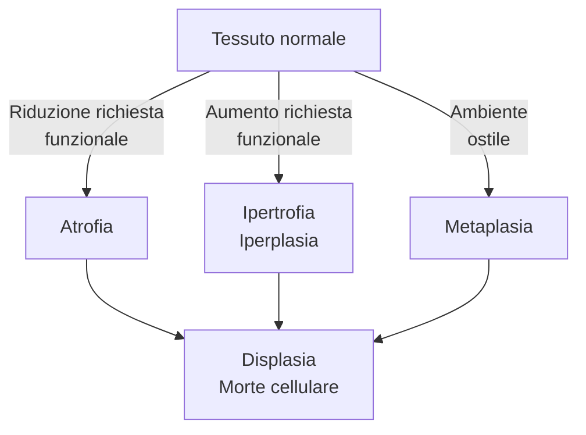

<!--
DALL'OLIO

Patologia cellulare ed extracellulare
    - Radicali liberi e ROX
    - Adattamenti cellulari
    - Morte cellulare
    - Degenerazioni cellulari ed extracellulari (steatosi, degenerazione vacuolare)
    - Patologie da accumulo
-->
<!-- Mon 05 Oct 2020 11:30:04 AM CEST -->

\clearpage

\part{Patologia cellulare ed extracellulare}

# Adattamenti cellulari e meccanismi di adattamento al danno

\ 

- __Adattamenti cellulari__: processi che le cellule attuano per compensare stressor, ovvero stimoli che alterano il normale stato di omeostasi
	1. Atrofia
	2. Ipertrofia e iperplasia
	3. Metaplasia \marginnote{A volte si parla anche di \textbf{displasia}, ovvero di sviluppo anormale dovuto a stressor. Non è un vero e proprio adattamento, quanto più identifica una situazione in cui il danno viene completamente subito}
	4. Manifestazioni di fallimento nell'adattamento
		1. Displasia
		2. Morte cellulare
			- Apoptosi
			- Necrosi

\normalbox{Eziologie tipiche di danno}{
\begin{enumerate}
\def\labelenumi{\arabic{enumi}.}
\tightlist
\item Ipossia o ischemia
\item Cause fisiche (temperatura, radiazioni, danno meccanico\ldots)
\item Cause chimiche
\item Cause infettive
\item Cause immunitarie
\item Squilibri nutrizionali
\item Alterazioni genetiche
\item Neoplasie, che danneggiano le cellule sane circostanti
\end{enumerate}

}

## Atrofia
- __Atrofia__ --- processo di riduzione di volume e funzionalità di un tessuto, a causa della riduzione del volume e/o del numero di cellule che compongono quel tessuto
- Il processo di atrofia può essere sia fisiologico che patologico
	- Atrofia fisiologica
		- Nello sviluppo fetale: non tutti gli organi vengono portati fino alla nascita (es: notocorda, vasi ombelicali)
		- Atrofia del timo
		- Atrofia di tessuti dell'apparato riproduttivo femminile (endometrio, epitelio vaginale, ghiandola mammaria) dopo la menopausa per ridotta stimolazione di estrogeni
	- Atrofia patologica
		- __Ridotta attività funzionale da disuso__: esempio classico è l'arto immobilizzato per lungo tempo, che perde massa muscolare; o gli astronauti che perdono massa dopo lunghe permanenze nello spazio
		- __Atrofia da ridotta perfusione__: atrofia conseguente ad un ridotto trofismo del tessuto (es classico atrofia a valle di una subocclusione di un'arteria)
		- __Atrofia da carenza nutrizionale__ (es: \pat{marasma}^[Carenza nutrizionale di proteine + carboidrati] o \pat{kwashiorkor}^[Carenza nutrizionale di proteine + micronutrienti antiossidanti])
		- __Atrofia da perdita di stimolazione endocrina__: tipica di tessuti che, per mantenere un corretto trofismo, necessitano di una continua stimolazione endocrina (es: mammella, apparato genitale)
		- __Atrofia da compressione__: se una struttura cresce (eg tumore) e comprime i tessuti circostanti, questi possono atrofizzarsi
		- __Osteoporosi__ con il progredire dell'età

### Meccanismi alla base dell'atrofia
- I meccanismi con cui si realizza l'atrofia sono essenzialmente 2
	- La __riduzione del volume delle cellule__ si verifica o per autofagia (= autodigestione controllata) o per degradazione delle proteine intracellulari ad opera del proteasoma
	- La __riduzione del numero di cellule__ avviene tramite morte cellulare programmata

#### Riduzione del volume delle cellule

##### Degradazione delle proteine cellulari (Unfolded Protein Response)

\ 

1. Stress ⇒ accumulo di proteine mal-ripiegate
2. C'è tentativo di adattamento: ↑ produzione di chaperonine (HSP) per ri-naturare le proteine mal ripiegate
3. Se adattamento non efficace, si hanno 2 strade a seconda dell'entità del mancato adattamento
	- Distruzione delle proteine mal ripiegate ⇒ perdita di volume della cellula ⇒ atrofia
	- Innesco dell'apoptosi ⇒ ✝

##### Autofagia
- __Autofagia__ --- processo di autodigestione _controllato_: si formano vescicole che contengono componenti cellulari da eliminare \marginnote{Obiettivo: eliminare dalla cellula i componenti \emph{non necessari} -- di fatto con l'obiettivo di ridurre gli sprechi e portare la cellula ad una composizione interna razionalizzata, più essenziale e quindi più agile nel fronteggiare gli stressor esterni}

1. Si assembla il complesso di inziazione e di nucleazione (tramite molecola `BECLIN-1`)
2. Si forma quindi una membrana all'interno del citoplasma, inizialmente a forma di mezzaluna
3. Grazie alle `ubiquitin-ligasi LC3` la membrana a mezzaluna completa la chiusura ⇒ si forma una vescicola ("__autofagosoma__")
4. Nell'autofagosoma vengono inglobati, _con intenzione_^[Come esattamente vengano "scelti" i componenti cellulari ancora non è chiaro] diversi componenti cellulari, per recuperare i componenti di base (aa, acidi grassi...). A seconda di quali componenti cellulari vengono inglobati, distinguiamo
	- Mitocondri → mitofagia (per eliminare mitocondri invecchiati che producono molti ROX)
	- Aggregati proteici poliubiquitinati → aggrefagia
	- Microorganismi patogeni → xenofagia
	- Accumuli di grassi → lipofagia

#### Riduzione del numero di cellule
- Per [apoptosi controllata (vedi)](#apoptosi)

## Ipertrofia ed iperplasia
- Sono di fatto l'opposto dell'atrofia
	- __Iperplasia__ --- ↑ numero di cellule (tipico di tessuti labili o stabili secondo Bizzozzero)
	- __Ipertrofia__ --- ↑ volume delle cellule (tipico di tessuti perenni secondo Bizzozzero)
- Iperplasia può essere un _preludio_ a trasformazione neoplastica, in quanto, di fatto, è una situazione in cui si ha un grande tasso replicativo di un certo tessuto

### Ipertrofie fisiologiche
1. Ipertrofia da aumentata richiesta funzionale
	- Es: muscolo scheletrico in continuo esercizio → ↑ volume fibre muscolari
	- Ipertrofia del rene per asportazione del rene controlaterale \marginnote{In realtà questo è un caso misto: in caso di asportazione, il rene rimasto aumenta sia per ipertrofia che per iperplasia (↑ lunghezza dei tubuli, ma non aumenta il numero di nefroni)}
2. Ipertrofia da variazione dei livelli ormonali
	- Ipertrofia degli organi sessuali secondari durante pubertà
	- Ipertrofia (+iperplasia) della ghiandola mammaria durante gravidanza e allattamento (per ↑ estrogeni)

### Ipertrofie patologiche
1. Ipertrofia _patologica_ da aumentata richiesta funzionale
	- Es: cardiomiopatia ipertrofica secondaria a ipertensione di lunga data
2. Ipertrofia _patologica_ da squilibrio endocrino
	- Endometrio femminile
	- Prostata
	- Gozzo tiroideo da carenza di iodio (compensata con ↑ TSH)
	- Ipertrofia della corteccia surrenalica da ↑ ACTH (\pat{iperaldosteronismo})

### Iperplasie fisiologiche
1. Iperplasia da stimoli ormonali fisiologici
	- Epitelio mammario durante pubertà e gravidanza
	- Muscolatura uterina durante gravidanza
	- Sintesi di eritrociti (ipossia ⇒ ↑ eritropoietina)
2. Iperplasia compensatoria
	- Iperplasia in risposta ad epatectomia parziale
	- Iperplasia dopo nefrectomia monolaterale (si determina sia iperplasia, tramite allungamento dei tubuli; che ipertrofia dei glomeruli per compensare la capacità di filtrazione che si è persa)
	- Iperplasia dello strato corneo della cute in risposta a stress meccanici ripetuti (i calli, per intenderci)

### Iperplasie patologiche
1. Iperplasia da stimoli ormonali patologici
	- Iperplasia adenomatosa dell'endometrio: nel periodo perimenopausale si può verificare, per squilibrio ormonale, ipertrofia dell'endometrio che produce sanguinamenti
	- Ipertrofia prostatica benigna, per squilibri nella sintesi di testosterone
2. Stimolazione iperplastica da fattori di crescita
	- Leucocitosi (↑ neutrofili) in risposta ad una infezione^[Vengono prodotti GF per avere una neutrofilia, per fronteggiare più efficacemente l'infezione]
	- Iperplasie del midollo osseo
		- \pat{morbo di cooley}: __assente o ridotta sintesi delle catene β dell'Hb__ → anemia → stimolazione dell'eritropoiesi (grazie a `HIF`^[Hypoxia-Inducible Factor] e `eritropoietina` → iperplasia del midollo per far fronte a questa richiesta → deformità ossee per aumentato volume del midollo
	- Verruche da _Papilloma virus_ (il Papilloma immortalizza le cellule)

## Metaplasia
- __Metaplasia__ --- sostituzione di un tessuto _già differenziato_ con un altro tessuto _differenziato_
- Metaplasia può essere __preludio a trasformazione neoplastica__, in quanto sono __gli elementi staminali__ di un certo tessuto che _cambiano programmazione_ e __si differenziano verso un tipo di tessuto differente__

\ 

- Esempi classici di metaplasia
	1. Metaplasia nelle vie aeree di un sg. fumatore
		- Metaplasia in risposta a continua irritazione da agenti chimici + stress meccanico del particolato sottile sospeso
		- È metaplasia pavimentosa: epitelio cilindrico monostratificato → epitelio squamoso pluristratificato
	2. Calcoli nel coledoco o colecisti
		- Calcoli ⇒ irritazione (meccanica) ⇒ danno cellulare
		- Metaplasia pavimentosa: epitelio cilindrico monostratificato → epitelio squamoso pluristratificato
	3. Esofagite di Barrett
		- Reflusso gastrico → risalita di succhi gastrici in esofago ⇒ danno da ustione chimica
		- Epitelio pavimentoso pluristratificato della mucosa esofagea → epitelio cilindrico monostratificato (simile a 

## Displasia
- __Displasia__ --- Tessuto che si sviluppa in modo anormale disorganizzato, a seguito di uno stressor al quale non _è stato_ capace di far fronte. __Non è un processo di compensazione__, quanto una delle manifestazioni di fallimento dell'adattamento allo stress
	- Tendenzialmente si ha __perdita dei meccanismi di regolazione e controllo^[Meccanismi di controllo = controllo nel differenziamento e/o velocità di replicazione e/o controllo nel numero e/o altro]__ ⇒ displasia è di fatto l'_anticamera_ della trasformazione neoplastica

## Morte cellulare
- Insieme a displasia, rappresenta il fallimento nell'adattarsi al danno \marginfig{apoptosivsnecrosi}
	1. Morte per necrosi: morte _disordinata_, che produce _infiammazione_^[= esplodono in una nuvola di fiamme, producendo quanto più casino possibile, per incoraggiare la produzione di una risposta]
	2. Morte per apoptosi: morte _ordinata_, che produce la _minima quantità di infiammazione_^[= rilasciano meno DAMPS possibile, cercano di pulire mentre stanno morendo]
	3. Morti cellulari "particolari"
		- Anoikis
		- ENTosi
- Perché fallisca l'adattamento e la cellula muoia, si deve verificare un __danno irrecuperabile__. L'idea di "irrecuperabilità" è data dalla combinazione di __intensità__ e __durata__
	- Un danno è permanente per _grande intensità_ dello stimolo lesivo
	- Un danno è permanente per il _perdurare_ dello stimolo lesivo
- I danni irrecuperabili che portano a morte cellulare sono essenzialmente 3:\

	1. \goldstandard Deplezione di ATP^[Ipossia protratta da ischemia è causa tipica ed esemplificativa: ipossia ⇒ ↓ fosforilazione ossidativa mitocondriale ⇒ non viene prodotta ATP, ma viene consumata ⇒ esaurimento delle riserve di ATP]
		- ⇒ Switch a glicolisi anaerobia ⇒ formazione di lattati ⇒ ↓ pH intracellulare ⇒ __addensamento della cromatina__ e __denaturazione delle proteine__
		- ⇒ ??? ⇒ distacco dei ribosomi ⇒ ↓ sintesi proteica ⇒ ??? ⇒ __deposizione dei lipidi intracellulari__ e formazione delle _figure di mielina_
		- ⇒ La pompa ATPasica Na^+^/K^+^ non funziona ⇒ uscita di K^+^, ingresso di Na^++^ ⇒ ingresso netto di acqua ⇒ __rigonfiamento della cellula__ (_oncosi_) e formazione dei _bleb_ di membrana
		- ⇒ Le pompe ATPasiche che, contro gradiente, devono mantenere il Ca^++^ intracellulare confinato in mitocondri e RE non funzionano più ⇒ ↑ Ca^++^ citosolico
	2. Perdita di omeostasi del Ca^++^
		- ↓ ATP ⇒ \ini pompe ATPasiche ⇒ fuoriuscita del Ca^++^ da mitocondri + RE ⇒ ↑ Ca^++^ citosolico
		- ↑ [Ca^++^] ⇒ attivazione di enzimi Ca^++^-dipendenti: ATPasi, fosfolipasi, proteasi, endonucleasi ⇒ un gran casino, viene degradata ogni cosa: ATP, membrane, proteine del citoscheletro, cromatina...
	3. Danno mitocondriale ⇒ porazione della membrana mitocondriale \marginnote{\textbf{Il tipo di pori che si vengono a creare nei mitocondri è essenziale nel decidere se succederà apoptosi o necrosi}, in quanto entrambi i fenomeni passano per la porazione della membrana mitocondriale}
		- Porazione effettiva della membrana (formazione di MPTP^[Mitochondrial Permeability Transition Pores])
			- ⇒ perdita della _ddp_ transmembrana che è essenziale per stoccare l'energia per produrre ATP^[L'energia recuperata dalle specie chimiche che vengono ossidate durante la catena di trasporto degli elettroni, viene stoccata sottoforma di ioni H^+^ nello spazio transmembrana dei mitocondri. Il gradiente protonico viene poi usato per alimentare l'`ATP-sintasi` -- che è una proteina che pesca H^+^ nello spazio intermembrana e li fa uscire all'interno dei mitocondri, facendoli quindi viaggiare secondo gradient -- per guadagnare l'energia sufficiente a legare il terzo gruppo fosfato all'ADP. Vedi Bchem Metabolica se proprio vuoi maggiori dettagli (ma perché?!).] ⇒ __inabilità a produrre ATP__
		- Apertura di pori preformati, la cui apertura è controllata dalle molecole `Bax`/`Bak` e `BCL2`
			- ⇒ fuoriuscita del __citocromo C__ ⇒ inizio della [via apoptotica](#pathway-intrinseco) (pathway intrinseco)

^[Le __figure mieliniche__ sono fosfolipidi ripiegati a formare strutture spiraliformi che ricordano la disposizione di mielina attorno ai neuroni]

\normalbox{Necrosi regolata}{
L'apoptosi è una morte regolata, tuttavia anche alcune forme di \emph{necrosi} possono essere regolate. La differenza risiede nella pulizia della morte

\begin{itemize}
\tightlist
\item Apoptosi: morte pulita, condotta cercando di minimizzare l'infiammazione. È per sua natura un processo \emph{regolato}, perché sono necessarie operazioni in sequenza appropriata per minimizzare la produzione di DAMPS
\item Necrosi: morte sporca, condotta senza preoccuparsi dei DAMPS prodotti dalla morte cellulare ⇒ infiammazione, a volte anche attivamente ricercata
\end{itemize}

La programmazione o meno della morte è un concetto che prescinde dalla strategia usata per morire: esistono, infatti, anche casi di \textbf{necrosi programmata}:

\begin{itemize}
\tightlist
\item \textbf{Necroptosi} --- Anche "apoptosi caspasi-indipendente", è una morte al confine tra necrosi e apoptosi, passa tramite la costruizone di un complesso detto \textbf{necrosoma}. Le cause possono essere le stesse dell'apoptosi, rappresentando di fatto un processo che con l'apoptosi può essere in diretta competizione
\item \textbf{Mithocondrial Pore Transition (MPT) regulated necrosis} --- Necrosi ottenuta mediante porazione intenzionale della membrana mitocondriale, che prota alla dissipazione della ddp lì accumulata, con conseguente deplezione delle riserve di ATP
\item \textbf{Parthanatos} --- morte cellulare causata da una eccessivo consumo richiesta di NAD+. Questo succede solamente quando si evidenziano danni al DNA talmente estesi che i meccanismi di riparazione (\emph{BER} in primis) non riescono a riparare \footnote{BER usa il macchinario molecolare della \texttt{PARP1} per riparare i danni, la quale è \emph{estremamente} esosa di NAD+
\item \textbf{Piroptosi} --- Morte \emph{estremamente} infiammatoria. Usa la caspasi-1, e produce una quantità di DAMP e PAMP molto elevata
\item \textbf{Ferroptosi} --- Causata da un eccesso di danno ossidativo, da perossidazione dei lipidi di membrana. Meccanismo che richiede lo ione ferro per procedere
\end{itemize}
}

### Necrosi
- Distinguiamo classicamente 5 tipi di necrosi
	1. __Necrosi coagulativa__ (_"a stampo"_) --- il tessuto preserva la propria compattezza e l'impronta del tessuto di origine^[Tipica dei tessuti infartuati, tranne il cervello]
	2. __Necrosi colliquativa__ --- il tessuto necrotico si liquefa, grazie al contributo della degranulazione dei neutrofili^[Tipica di qualsiasi cosa in cui ci sia pus]
	3. __Necrosi caseosa__ --- si arriva alla produzione di una sostanza bianca, poltacea, compatta; si preserva la compattezza ma non la forma
	4. __Necrosi gangrenosa__ --- necrosi + sovrapposizione batterica che porta a putrefazione^[Tipica di quando necrotizzano gli arti inferiori, pes da diabete]
	5. __Steatonecrosi__ --- necrosi per saponificazione dei grassi^[Tipica delle pancreatiti necrotico-emorragiche]

#### Necrosi coagulativa
- Tipica di tessuti infartuati che possono eseguire switch verso metabolismo anaerobico^[Infatti nel cervello ischemico si ha tipicamente necrosi colliquativa]
	0. Ischemia ⇒ __switch a metabolismo anaerobio__
	1. Accumulo di lattati ⇒ ↓ pH
	2. Denaturazione delle proteine, comprese le __idrolasi acide lisosomiali__
		- Blocco del metabolismo
		- Denaturazione dell'ultrastruttura del nucleo
	3. Picnosi → carioressi → cariolisi, mentre il resto della cellula rimane "cristallizzato" nella conformazione in cui si trova
- Per rimozione del tessuto (per fagocitosi) necessari alcuni giorni. Rigenerazione/riparazione dipendente da tipologia di tessuto (labile vs stabile vs perenne)
- Aspetti morfologici per riconoscerla
	- Conservazione dell'architettura microscopica MA mancanza di nuclei
	- Eventualmente rilevabile infiltrazione leucocitaria

#### Necrosi colliquativa
- Conseguente a danno di membrana + attivazione degli enzimi litici ⇒ __autolisi della cellula__. Eziologia alternativa: danno da degranulazione dei neutrofili
	1. ↑ [Ca^++^] citoplasmatico
	2. Attivazioni degli enzimi litici
	3. Danno delle membrane e morte cellulare
- Aspetti morfologici per riconoscerla
	- Architettura del tessuto difficilmente distinguibile, tutto liquefatto

#### Necrosi caseosa
- Necrosi caseosa = necrosi coagulativa + necrosi colliquativa
- Al processo misto, sia coagulativo che colliquativo, si aggiungono 3 elementi, che rendono la materia necrotica di consistenza poltacea
	- Formazione di fibre
	- Calcificazione
	- Formazione di caverne

#### Necrosi gangrenosa
- Per crescita batterica su tessuto, che ne provoca la necrosi e la putrefazione
- 3 forme, in base alla causa della necrosi
	1. Secca: necrosi coagulativa (+ crescita batterica)
	2. Umida: necrosi colliquativa (+ crescita batterica)
	3. Gassosa: necrosi per produzione di gas dalla flora batterica che sta colonizzando

#### Steatonecrosi
- Tipica del pancreas, poiché sono necessari gli enzimi pancreatici per saponificare i grassi
	0. Danno cellulare ⇒ rilascio degli enzimi pancreatici (lipasi) e Ca^++^ che era intracellulare
	1. Le lipasi scindono acidi grassi
	2. Il gruppo -COOH degli acidi grassi si lega al Ca^++^ liberato dal danno cellulare ⇒ __saponificazione degli acidi grassi__

#### Morfologia al MO della necrosi
- Aspetto principale: modificazioni progressive del nucleo (picnosi → cariolisi → carioressi) \asidefigure{img/morfologia-mo-necrosi.png}{In nero i nuclei picnotici (frecce centrali), in rosso i nuclei in carioressi (frecce in alto a dx), in blu i nuclei scomparsi per cariolisi (a sx)}
	1. Picnosi: nucleo piccolo, addensato, molto basofilo
	2. Carioressi: il nucleo picnotico si frammenta
	3. Cariolisi: i frammenti nucleari scompaiono

#### Conseguenze della necrosi
- Locali
	- Infiammazione
	- Rigenerazione (se cellule necrotiche sono labili o stabili) → morfologia conservata, funzione conservata (_restitutio ad integrum_)
	- Riparazione (se cellule necrotiche sono perenni) → morfologia conservata, perdita di funzione
- Sistemiche
	- Fuoriuscita di enzimi cellulari^[Ecco perché si dosano enzimi cellulari come _marcatori di necrosi_, es: troponina cardiaca, transaminasi (GPT, GOT), creatina-chinasi (marker di generico danno muscolare, ↑ in \pat{dmd})...]
	- Fuoriuscita di DAMPs ⇒ infiammazione anche sistemiche

### Apoptosi
- Morte cellulare _pulita_ (portata avanti in maniera da minimizzare l'infiammazione)
- Cause molto varie (il confine tra quali cause sono fisiologiche e quali sono patologiche è come al solito molto sottile ed estremamente dipendente dal contesto^[Il fenomeno apoptotico in sé è estremamente necessario alla vita, quando portato avanti _in modo regolato_: la patologia si origina quando, in eccesso o in difetto, si ha una perdita di controllo nei meccanismi apoptotici. Questo significa, per esempio, che una perdita nell'apoptosi può favorire patologie neoplastiche (per immortalizzazione di cellule e conseguente rischio elevato se si perdono i meccanismi di controllo nella replicazione cellulare); ma viceversa, anche un'apoptosi eccessivamente frequente può portare ad atrofia tissutale ed essere alla base di patologie degenerative come Alzheimer, Parkinson, Huntington... In sostanza, le due facce della medaglia (replicazione e morte cellulare) è necessario che siano in equilibrio per garantire un corretto stato di saulte. Un eccesso o un difetto dovuto alla perdita di controllo di ciascuno dei due processi (morte o replicazione) può essere causa di patologia])
	- Perdita della stimolazione continua di GF necessari alla sopravvivenza
	- Attivazione esterna da TNF, FAS
	- Apoptosi per fallimento delle pathway cellulari di riparazione dal danno
	- ...
- 2 vie per l'esecuzione dell'apoptosi, a seconda di _dove si origini l'impulso apoptotico_
	- [__Via intrinseca__](#pathway-estrinseco) --- l'impulso apoptotico proviene _da fuori_ la cellula, tramite legame con recettori di membrana^[Es: killing dei lfc T citotossici]
	- [__Via intrinseca__](#pathway-intrinseco) --- l'impulso apoptotico proviene _dall'interno_ della cellula, tramite il rilascio dei citocromi C da parte dei mitocondri

\normalbox{Frammentazione del DNA nell'apoptosi e nella necrosi: differenze osservabili all'elettroforesi del materiale genetico, label=boxelettroforesi}{
\begin{itemize}
\tightlist
\item Nell'apoptosi la frammentazione del DNA è \emph{regolare}, in quanto è eseguita da endonucleasi apposite che tagliano in maniera specifica e regolare il DNA, in appositi siti di taglio (si vedono picchi elettroforetici discreti, se si fa l'elettroforesi del materiale genetico della cellula morta per apoptosi)
\item Nella necrosi il DNA viene degradato e spezzettato in modo irregolare, in quanto il taglio viene svolto dalle endonucleasi attivate che tagliano il genoma in maniera aspecifica (si vede un \emph{continuum} all'elettroforesi, se si fa l'elettroforesi del materiale genetico della cellula morta per necrosi)
\end{itemize}
}

#### Pathways per l'esecuzione dell'apoptosi

\ 

- Ci sono 2 vie, estrinseca ed intrinseca, per l'_attivazione_ dell'apoptosi: entrambe convergono verso l'attivazione delle __caspasi esecutrici__. Da lì, l'apoptosi prosegue in modo unico
	1. Per via estrinseca o intrinseca vengono attivate le __caspasi esecutrici__
	2. Le caspasi esecutrici smantellano proteine e l'intera architettura cellulare
		- Viene tagliata e smantellata l'intera struttura cellulare ⇒ formazione di vescicole (\a{corpi apoptotici}) che contengono residui della cellula
		- Viene flippata verso l'esterno i residui di __fosfatidilserina__ di membrana: questo marca i \a{corpi apoptotici} che si stanno formando per la fagocitosi, minimizzando così la quantità di DAMPs prodotti. I macrofagi, quindi, se li pappano liberamente e senza troppo casino^[Se non si ha una fagocitosi veloce, però, dopo un po' anche i corpi apoptotici perdono la loro permeabilità di membrana, riversando il loro contenuto all'esterno e, quindi, andando a produrre un quadro di __necrosi secondaria__]
		- Viene tagliato -- e quindi perde funzione -- l'inibitore di una DNAsi tipica del processo apoptotico, che è quindi libera di smantellare il materiale genetico in maniera specifica, producendo la tipica regolarità in termini di lunghezza (vedi box pagina \pageref{boxelettroforesi})

##### Pathway estrinseco
0. Legame tra i fattori extracellulari (`TNF` e `FasL`^[Ligando del FAS], ma anche il `Garanzima B`^[Enzima iniettato dai lfc T citotossici]) e i recettori di membrana. Il legame porta i recettori a trimerizzare
1. Recettori trimerici legano il `FADD`, una molecola adattatrice che trasduce il segnale
2. FADD, con la sua __attività autocatalitica__, dà inizio alla __cascata delle caspasi__^[Le caspasi sono delle __proteasi con una -Cis nel centro funzionale__, e tagliano le proteine in corrispondenza dei residui di -Arg. Sebbene siano centrali nella catena dell'apoptosi, le caspasi sono in realtà proteasi, per cui vengono usate anche in altri pathway cellulari (es: vengono usati nella maturazione delle citochine proinfiammatorie, e la sotto-famiglia che si occupa di quello è, non a caso, quella delle _caspasi proinfiammatorie_)]
	1. Si reclutano le __caspasi iniziatrici__, che attivano il meccanismo apoptotico (caspasi-2, __-8__, -9, -10)
	2. Le caspasi iniziatrici reclutano le __caspasi esecutrici__, che effettivamente demoliscono l'architettura cellulare (caspasi-3, -6, -7)
3. L'apoptosi procede per via comune (vedi sopra)

##### Pathway intrinseco
0. In condizioni normali l'apoptosi è _impedita_ da molecole^[`BCL2`, `BCL-x`] che __chiudono i pori normalmente presenti nella parete mitocondriale__, impedendo l'uscita dei citocromi
1. In caso eventi pro-apoptotici (mancanza di segnali di sopravvivenza, danno irrecuperabile al genoma...) si attiva una classe di molecole __`BH3-only`__ (i __sensori del danno__), che mediano l'apertura dei pori mitocondriali
2. Pori mitocondriali aperti ⇒ fuoriuscita del `CytC`, che è _potente_ stimolatore pro-apoptotico
3. Ulteriore checkpoint: __perché l'apoptosi prosegua, è necessario che gli stimoli pro-apoptotici > stimoli anti-apoptotici__ \marginnote{Questo è il consueto concetto di "bilancia molecolare": da una parte ci sono i fattori pro-apoptotici che spingono per fare andare la cellula in apoptosi; dall'altra ci sono i fattori anti-apoptotici che spingono per fare sopravvivere la cellula -- quello che succederà realmente dipende da chi vince a questo "braccio di ferro molecolare"}
	- Fattori _pro-apoptotici_ (__AIFs__, Apoptosis Inducing Factors)
		- Inibitori dei fattori anti-apoptotici (es: `SMAC-DIABLO`)
		- Citocromo C
	- Fattori _anti-apoptotici_ (__IAPs__, Inhibitors of ApoPtosis)
		- Inibitori delle caspasi
4. Se fattori pro-apoptotici > fattori anti-apoptotici: si ha commitment verso apoptosi, con la __formazione dell'apoptosoma__
	- Apoptosoma è complesso eptamerico formato da 7 dimeri di APAF-1 + CytC
5. Apoptosoma attiva le caspasi iniziatrici (particolarmente la caspasi-9)
6. Le caspasi iniziatrici attivano le caspasi effettrici
7. L'apoptosi procede per via comune (vedi sopra)

### Tipi particolari di morte cellulare

#### Anoikis
- __Anoikis__ (_"essere senza casa"_) --- apoptosi indotta dalla mancata adesione ad un substrato solido
    - Tipica dei tessuti solidi
    - Anche le cellule tumorali sono solitamente sensibili all'anoikis, salvo tumori molto avanzati/maligni
- Anoikis viene evitata, da cellule normalmente adese alla ECM, tramite la mediazione dell'__actina__, che in conformazione stirata permette la migrazione nel nucleo dei fattori di trascrizione YAP/TAZ
	- Se la cellula è adesa, le integrine sono collegate all'ECM ⇒ __l'actina citoscheletrica__ (legata alle integrine) è __in conformazione stirata__
		1. __L'actina in forma stirata cattura l'_inibitore_ del dimero YAP/TAZ__, che è quindi parcheggiato lì e non fa niente
		2. Il dimero YAP/TAZ, comunemente nel citoplasma, è libero di migrare nel nucleo e avviare la via di segnalazione intracellulare (__via HIPPO__) che porta al differenziamento e alla proliferazione
	- __Se la cellula non è adesa ⇒ actina citoscheletrica è in conformazione rilassata__
		1. L'actina non lega più l'inibitore di YAP/TAZ
		2. L'inibitore sequestra il dimero YAP/TAZ, che rimane nel citoplasma
		3. La mancanza di attivazione della via HIPPO porta all'apoptosi

#### Entosi
- __Entosi__ --- Processo per il quale una cellula (detta _guest_) viene inglobata in un'altra cellula (detta _host_) senza venire digerita, per sfuggire ad un ambiente sfavorevole
	- Possibile entosi in serie, tipo matrioska di cellule
- Il destino dell'host è differente a seconda delle circostanze
	- Morte dell'host dentro il guest
	- Uscire dopo un certo periodo, quando le condizioni dell'ambiente sono mutate
	- Permanere nell'host, portando frequentissimamente ad aneuploidia -- con danni genomici del caso
	- Duplicarsi all'interno dell'host

<!-- lun 26 ott 2020, 12:06:44, CET -->
# Patologie da accumuli extracellulari

## Accumulo di materiale amiloide e Alzheimer?
\todo{tutta la lezione}

<!-- mer 28 ott 2020, 11:09:56, CET -->
# Malattie da alterato ripiegamento proteico

## Malattie prioniche
- Patologie del SNC caratterizzate da un accumulo di proteine mal-ripiegate
    - Il tipo di patologia è vario: possono essere sia genetiche che infettive che sporadiche^[Ovvero, essenzialmente, con insorgenza in soggetti che non hanno familiarità e non hanno comportamenti che li rendono suscettibili ad infezioni da prioni]
    - In ogni caso, sono accomunate dal fatto che l'agente eziologico è un accumulo di proteine mal ripiegate
        - In alcuni casi: il materiale si accumula in depositi simil-amiloidi

### Principali patologie da prioni

|Patologia|Ospite naturale|
|---|---|
|Scrapie|Pecore e capre|
|Encefalopatia trasmissibile dei visioni|Visoni|
|Chronic wasting disease|Cervi e alci|
|Encefalopatia spongiforme bovina (BSE)|Mucche|
|Encefalopatia spongiforme felina (FSE)|Gatti|
|Kuru|Uomo|
|Malattia di Creutzfeld--Jakob (CJD)|Uomo|
|Sindrome di Gerstmann--Straussler--Scheinker (GSS)|Uomo|
|Insonnia familiare fatale|Uomo|

\todo{focus sulle varie patologie}
}

- Storie della vCJD \todo{scrapie → spongiforme bovina → CJD}

### Patogenesi comune \todo{organizzare bene questa sezione da sbobba}

\footnotesize
__Proteina prionica__ ---  proteina normale che, se modificata, ha azione patologica

__Prione__ ---  proteina prionica che ha subito modificazioni in senso patologico
\normalsize

- La normale proteina prionica ha subito mutazioni (che la trasformano in _prione_) che rende impossibile l'azione delle proteasi ⇒ accumulo nei tessuti
  
    - \todo{Da sbobina diversa sensibilità alle proteasi della proteina normale e patologica}
- La modificazione della proteina prionica in prione è tendenzialmente una __modificazione del ripiegamento__: nei prioni si trova una ridotta presenza di α-elica a favore di regioni a β-foglietto
- Il prione ha __azione di chaperone__: induce un ripiegamento a sua immagine e somiglianza di altre proteine prioniche, trasformandole in prioni ⇒ azione esponenziale
    - Periodo di latenza molto lungo
    - Da insorgenza dei sintomi: degenerazione molto breve
- Nelle forme genetiche: a questo si sovrappone la mutazione del gene che produce la proteina prionica (solitamente in regioni ad α-elica)

\greenbox{Differente eziologia della patologia da prione}{
- Meccanismo di base: il prione è chaperone perverso, che induce in altre proteine un ripiegamento a sua immagine e somiglianza ⇒ presenza esponenziale di proteine prioniche nel soggetto

Questo da conto dei 3 principali meccanismi con cui si producono le patologie da prioni:

\begin{itemize}
\tightlist
\item Meccanismo genetico --- alterazioni nel gene che produce la proteina prionica a livello delle α-eliche ⇒ induce ripiegamento perverso
\item Meccanismo ``sporadico'' --- verosimilmente da un causale alterato ripiegamento di un \emph{pool} ristretto di proteine prioniche, che si trasformano in prioni ⇒ formazione di un pool di chaperoni alterati ⇒ decorso esponenziale
\item Meccanismo ``infettivo'' --- trasmissione da host a host di prioni
\end{itemize}
}

#### Prionoidi
- Le proteine ad azione prionoide^[Proteine che, se inoculate da soggetto malato a soggetto sano, in opportune condizioni sperimentali sono capaci di indurre nel soggetto sano la medesima aggregazione di proteine che caratterizza la patologia del soggetto malato] sono generalmente __chaperonine__, e questa è la base dell'intero meccanismo patogenetico delle patologie da prioni. Tuttavia, si è visto con la ricerca che questo meccanismo è __tipico di tante altre patologie neurodegenerative__

\ 

\normalbox{Prioni ed Alzheimer}{
Prima del 1985 30K persone nel mondo hanno ricevuto somministrazioni di GH da cadavere. Di queste, il 6.3% ha sviluppato la \pat{cjd}, a causa dei prioni presenti nella preparazione.

8 soggetti(36--51 aa) presentavano in aggiunta dei depositi di Aβ in sede vascolare, depositi _tipici_ della fase iniziale dell'\pat{alzheimer}. Una spiegazione verosimile è che, oltre ai prioni che hanno causato la CJD, nei preparati vi erano anche le proteine prionoidi coinvolte nella patogenesi dell'Alzheimer. L'età rende verosimilmente incompatibile la loro condizione clinica con la possibilità che l'insorgenza dell'Alzheimer fosse precoce, perché anche nell'Alzheimer a insorgenza precoce l'età di insorgenza è  > ~ \TODO{45aa}

# Dislipidemie

## Steatosi
- Accumulo di trigliceridi in organi parenchimatosi
    - __Fegato__
    - Intestino
    - Cuore
    - Rene

\todo{Box sui trigliceridi}
\normalbox{I trigliceridi}{
% - Trigliceridi --- esteri di acidi grassi con glicerolo
% \begin{figure}[H]
%     \centering
% \chemfig{}
% \end{figure}
% - Lipoproteine --- \todo{}. Si formano per progressiva cessione della quota lipidica (tranne le HDL, che riportano i grassi dai tessuti extraepatici al fegato)
% 
% ||Dimensioni|Costituiti da|Principali lipidi|Principali apoproteine|
% |Chilomicroni|500-800 nm|
% |VLDL|30-80 nm|
% |IDL|30 nm|
% |LDL|15-25 nm|
% |HDL|5-12 nm|
% 
% 
% 
\TODO{giro dei lipidi da sbobba, e controllare dispensa di biochimica. Aggiornarla se è il caso}
}

### Eziologie della steatosi
1. __Ereditaria__ --- deficit genetici ⇒ accumulo di lipidi
    - Deficit di apolipoproteine ⇒ accumulo di lipidi in intestino
    - Deficit di lipasi acida lisosomiale (⇒ \pat{tesaurismosi})
2. __Ormonale__
    - Diabete
    - Ipersecrezione di catecolamine, cortisone, ACTH, ormoni tiroidei
    - Abuso di tè o caffè
3. __Da ipossia__
    - Ischemia
    - Insufficienza respiratoria
    - Anemia, stasi
    - Intossicazione da cianuro
4. __Da tossici__
    - Aflatossine
    - Amantine
    - Vinblastina
    - Falloidina
    - Tossina difterica
    - CCl~4~
5. __Alimentari__
    - Da dieta iperlipidica
    - Da carenza di aa essenziali
    - Da carenza proteica
    - Da carenza di PUFA
    - Da carenza di vitamine del gruppo B

\missingfigure{flowchart della steatosi}

1. Sovraccarico di trigliceridi/acidi grassi
2. ↑ sintesi di acidi grassi (etanolo, dieta povera di PUFA)
3. ↓ ossidazione di acidi grassi (etanolo)
4. ↓ secrezione epatica di trigliceridi (ipossia, tossici, dieta)

#### Da sovraccarico di trigliceridi
- Da dieta iperlipidica (⇐ ↑ FFA (Free Fatty Acid) che arrivano al fegato)
- Da ↑ lipolisi (tendenzialmente colpa di una disregolazione ormonale (↑ glucagone, ↑ nor/adrenalina) che attiva la `lipasi ormone-sensibile`)

\ 

#### Aumento della sintesi di acidi grassi
- Da eccesso di acetato
- Da carenza di PUFA, che stimola la sintesi compensatoria di acidi grassi saturi

#### Ridotta ossidazione di acidi grassi
- Da eccesso di NADH (che sostituisce gli acidi grassi come fonte di energia)
- Da ipossia, che \ini la β-ossidazione degli acidi grassi

#### Ridotta esportazione di trigliceridi
- Da ipossia (che \ini la produzione delle apoproteine necessarie per l'esportazione)
- Da tossici (che \ini la sintesi proteica)
    - Aflatossine (\ini trascrizione/duplicazione del DNA)
    - α-amanitina (\ini RNA-pol-2)
    - Tossina difterica
    - Dalloidina (\ini polimerizzazione dell'actina)
    - CCl~4~ (disorganizza il RE e il Golgi)
### Morfologia della steatosi
- Cuore --- aspetto a _cor tigratum_ (strie di grasso alternate a bande di tessuto muscolare)
- Epatica
    - Macrovescicolare --- nell'epatocite vi è una sola gocciola lipidica non delimitata da membrana. Potenzialmente reversibile
    - Microvescicolare --- gocciole lipidiche \todo{}

# Segnali di infiammazione sistemica
- SIRS --- Systemic Inflammatory Response Syndrome. Quadro caratterizzato da ≥ 2 di questi elementi
    - Tachicardia (> 90 bpm)
    - TC < 36°C o TC > 38.3°C
    - Tachipnea (FC > 20)
    - Conta leucocitaria < 4K o > 12K cellule/mm^3^
    - Presenza di > 10% neutrofili immaturi \todo{riferimento articolo desktop}
- Molti DAMPS e/o PAMPS ⇒ __grande__ infiammazione _diffusa_ ⇒ "_tempesta citochinica_" ⇒ SIRS ⇒ shock settico ⇒ MOF per ipoperfusione ⇒ exitus

\todo{mi sono distratto per una mezzoretta, ma magari anche qualcosa di più. tipo la seconda ora}
