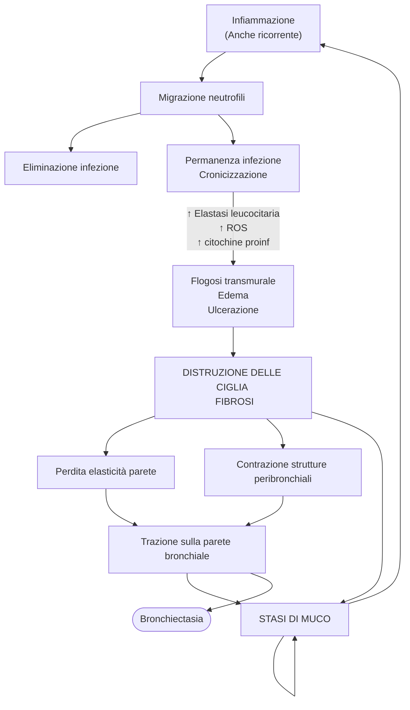

# Anatomia patologica del polmone
- Classificazione patologica consueta: entità ostruttive vs restrittive
	- P. __ostruttive__ → __ostruzione__ delle va
		- BPCO
		- Bronchiectasia
		- Asma
	- P. __restrittive__ → __riduzione__ del parenchima polmonare funzionalmente utile
		- Patologie destruenti il parenchima (__particolarmente dell'interstizio__)
		- Patologie della parete
		- Obesità grave
		- Patologie pleuriche
		- Cifoscoliosi
		- Malattie neuro-msk
		- Patologie dell'interstizio

## Patologie restrittive e dell'interstizio
- __Interstiziopatie__ --- Patologie eterogenee accomunate dalla distruzione dell'interstizio alveolare
- Fisiologicamente: 2 tipologie di interstizio, entrambi con capacità elastica che contribuiscono all'elasticità e complianza (fisiologicamente essenziali per la funzionalità) del parenchima
	1. __Interstizio portante__ (peribronchiale, pleurico, perivascolare)
		- Costituito da fibre di collagene di tipo 1 molto spesse
		- Tramite il ritorno elastico mantiene distese le strutture adiacenti
		- In continuità con l'interstizio settale
	2. __Interstizio settale__ (tra i setti alveolari)
		- Costituito dalla sola giustapposizione dei pneumociti e della membrana vasale +  componente cellulare specializzata (macrofagi, miofibroblasti, periciti) + gel polisaccaridico (con azione surfactante)
		- È spazio virtuale
		- Contribuisce all'elasticità del parenchima alveolare e al ritorno elastico dei polmoni
- Classificazione grossolana: idiopatiche vs secondarie
	#. Forme idiopatiche (<)
		- [UIP](#uip)
		- [NSIP](#nsip)
		- [AIP (Acute Interstizial Pneumonitis)](#aip)
		- [COP (Criptogenic Organizing Pneumonitis)](#cop), anche _bronchiolite obliterante_
	#. Forme secondarie (>)
		- Forme smoking-related
			- [Polmonite Interstiziale Desquamativa (DIP)](#dip)
			- [Pneumopatia interstiziale associata a bronchiolite respiratoria](#bronchiolite)
		- A malattie sistemiche (collagenopatie, LES, artrite reumatoide, sclerodermia...)
		- A farmaci (abx, antimetaboliti, alchilanti, anticonvulsanti, antiaritmici, antireumatici)
		- A inalazione di polveri organiche o inorganiche
		- A processi infettivi

> ℹ️ __Pneumonitis vs Pneumonia: come tradurre?__
>
>- __Pneumonitis__ (pneumopatia) → patologia polmonare in cui il processo patologico interessa il parenchima in modo diretto
>- __Pneumonia__ (polmonite) → patologia polmonare in cui vi è una eziologia microbiologica che altera la funzionalità del parenchima

### Interstiziopatie: aspetti generali

#### SeS
- Dove viene danneggiato l'interstizio c'è una clinica comune sebbene le entità patologiche siano eterogenee
	- Dispnea (↓ funzionalità del parenchima)
	- Crepitii fini
	- Tosse
	- Segni di IR
		- Ipossiemia → cianosi
		- Ippocratismo digitale
	- Segni gravi di patologia avanzata
		- Ipertensione polmonare (per danno del letto vascolare o modificazioni della sua pervietà)
		- HF dx per ↑ resistenze polmonari

#### Diagnostica
- Clinica tradizionale
- __HRTC__ (esame principe per studiare l'interstizio

#### Storia naturale
1. Fase acuta ⇒ danno tissutale
	- Agente eziologico produce un danno ⇒ __flogosi acuta__
	- Attivazione dei macrofagi polmonari
	- Organizzazione della risposta del SI (IL8, richiamo granulociti, richiamo altri attori dell'infiammazione)
		- Dilatazione vascolare
		- ↑ permeabilità vasale
		- Necrosi dei pneumociti tipo 1 ⇒ denudamento della membrana basale
	- Edema prima interstiziale e poi alveolare
	- __Danno tissutale__
2. Fase proliferativa (subacuta) ⇒ iniziale _riparazione_ del danno
	- Iperplasia dei pneumociti di tipo 2 per rimpolpare la popolazione citospecifica del parenchima
	- Eventuale infiltrato linfo/plasmacellulare
	- Proliferazione di macrofagi M2 + miofibroblasti (__inizale fibrosi settale ed intraalveolare__)
3. Fase di rimodellamento del parenchima ⇒ _riparazione_ del danno e riorganizzazione del parenchima in senso fibrotico
	- Riassorbimento dell'edema
	- Rilascio di fattori di crescita (FGF, TGF)
	- Attivazione dei miofibroblasti, che depongono fibre retiolari e collagene
	- __Sostituzione del tessuto danneggiato con tessuto fibrotico__

#### Pattern istologici durante l'evoluzione della storia naturale di una pneumopatia {#storiafibrosi}
1. __Danno alveolare acuto__ (± diffuso)
	- Causa: rilascio di citochine da macrofagi e polimorfonucleati ⇒ ↑ permeabilità vascolare (img: ↑ congestione vascolare) ⇒ edema del setto con _essudato_ proteico
	- Istologia (macroscopicamente: polmoni rossi ed infarciti di sangue, gonfi, edematosi, pesanti, _rigidi_)
		- Accumulo di granulociti
		- Diffusa necrosi
		- Deterioramento della membrana basale
		- Formazione di membrane ialine
	- Spesso causa IR acuta e grave (non sempre in proporzione ad area coinvolta causa shunt)
		- Essudato proteico si può combinare con detriti cellulari e formare la _"membrana ialina"_ che _ostacola gli scambi_ per ingombro meccanico
		- Essudato ostacola _attività surfactante_ ⇒ collasso alveolare (effetto shunt se diffuso! Sono cazzi amari!)
	- Radiologicamente (HRTC): diffusa opacità bilaterale in ambiti coinvolti
2. __Infiltrati cellulari infiammatori cronici__
	- Infiltrato cellulare cronico del parenchima alveolare da parte di _macrofagi, linfociti, plasmacellule_
	- Aggregati linfoplasmacellulari
	- Formazione di MALT
3. __Alveoli pieni__
	- Alveoli ripieni di materiale cellulare (solitamente macrofagi, fibroblasti) o proteico
	- Osservabile in situazioni che, in zona perialveolare, portano ad ↑ cellularità e/o deposito di materiale
		- Interstiziopatia da fumo
		- Danno alveolare
		- Riorganizzazione fibrotica di un territorio danneggiato o cicatriziale
		- Quadri di anomalo deposito di materiale proteico in alveolo (__*proteinosi alveolare polmonare*__, PAP)
			- Causa autoimmune
			- Cause secondarie (tumori, silicosi)
			- Ridotta funzionalità dei macrofagi (cause ereditarie^[Es: Il macrofago è responsabile dell’eliminazione dei detriti cellulari al termine del processo flogistico, questa sua funzione viene guidata dall’azione del fattore di crescita GMCSF sul suo recettore. Se l’interazione ligando-recettore è alterata il macrofago non esplica correttamente la sua funzione e si assiste ad un accumulo di proteine a livello alveolare], autoimmuni, pneumoconiosi (alterano la funzione macrofagica))
4. Noduli
	- Granulomi (es. silicosi)
	- Noduli di tessuto linfoide
	- TBC, sarcoidosi
5. Fibrosi
	- Pattern definitivo: è il termine (patologico) del rimodellamento polmonare. Parenchima oramai distrutto, dilatato e distorto
	- HRTC: pattern __a favo d'ape__ (__"honeycombing"__^[])
	- Distress respiratorio ingravescente e resistente, dinamica degli scambi potenzialmente compromessa

### Fibrosi polmonare idiopatica (UIP, Usual Interstitial Pneumonitis) {#uip}
- Rara, ma imprescindibile considerarla in ddx quando si sospetta fibrosi (perché è forma più grave di fibrosi, quindi merita sempre esclusione attiva)
- Patogenesi non ben compresa (è idiopatica...) ma verosimilmente è imperniata su 2 fattori:

	

	#. __Risposta disfunzionale ed aberrante ad uno stimolo flogogeno__, la quale perdura e si amplia
	#. __Alterata attività di riparazione post-flogosi__, che termina con una _riorganizzazione_ invece di una RaI
		- ⇐ Aberrazioni nella risposta da parte dei citotipi coinvolti (macrofagi, fibroblasti...)
		- ⇐ Aberrazioni nei mediatori che guidano la risoluzione della flogosi (TGF-β, FGF (>>))^[Sono tutti mediatori che funzionano con recettori tirosin-chinasici, ecco perché inibitori di tali r. sono utili come tp. per _rallentare la progressione_ (non guarigione): diminuiscono la velocità di deposizione della matrice fibrosa]
- Fattori di rischio (non correlati a priori, ma evidenziati a posteriori in modo retrospettivo)
	- Ambientali
		- Fumo di sigaretta
		- Infezioni virali (EBV, CMV, HHV8)
		- MRGE (non ↑ insorgenza, ma ↑ velocità di progressione)
		- Inalazione di polveri inorganiche/pesticidi
		- Correlato con specifiche popolazioni di microbiota polmonare
	- Mutazioni genetiche
		- Produzione di surfactante
		- Controllo dei processi di invecchiamento
	- Alterazioni epigenetiche
		- Geni che regolano la produzione di PG
		- Geni che regolano produzione di TGF-β
- Clinica ad esordio insidioso e molto confondibile con altre entità patologiche; anche mascherabile da patologia concomitante (che peggiora prognosi)
- Prognosi se non trattamento: tipicamente 3--5aa da dx. Generalmente grama, unica """soluzione""" è trapianto (ma trapianto allo stato attuale ha una quantità di problemi infinita)
- Diagnosi (a seconda della probabilità pretest): correlazione clinica + radiologica ± bioptica (transbronchiale/in toracoscopia, i campion*i* se v*engono* pres*i* va*nno* presi grandi e in più posizioni)
- Tp.: inibitori dei recettori tirosin-chinasici (`pirfenidone`) ± anti-GF (`nintedanib`, ab anti-FGF) ± trapianto per end-stage

#### Aspetti AP
- HRTC
	- Distribuzione dei focolai è irregolare
	- ⭐️ Quando più focolai, non è detto che tutti questi si trovino al medesimo punto della [storia naturale](#storiafibrosi) (ecco perché il campione bioptico non può semplicemente essere un aspirato)
	- Si possono evidenziare bronchiectasie da trazione
	- Pattern tipici
		- _Ground Glass_ → flogosi dell'interstizio e/o riempimento degli spazi alveolari
		- _Honeycombing_ → organizzazione fibrotica dell'interstizio flogosato + _distruzione del parenchima alveolare_
- Istologia (da biopsia)
	- Presenza abbondantissima di fibroblasti
	- Zone di fibrosi organizzata (± accanto a zone di parenchima normale)
	- Setti ispessiti
	- Sovrarappresentazione della muscolatura liscia
	- Pattern di honeycombing anche microscopico

### Pneumopatia interstiziale nonspecifica (NSIP, Non-Specific Interstitial Pneumonitis) {#nsip}
- In ddx con UIP ma meno aggressiva
	- ⭐️ __Distribuzione uniforme__ ed omogenea, sia nello spazio (_pochi_ focolai raggruppati) che nel tempo (focolai in evoluzione sincrona)
	- Minore, seppur sempre presente, fibrosi (flogosi e fibrosi settale, ma non honeycombing). La fibrosi è diffusa, non grossolana^[Non si evienziano, cioè, ampie aree di tessuto parenchimatoso sostituito in massa da tessuto fibrotico; si individuano leggere e diffuse sostituzioni dei setti visualizzabili come una opacità diffusa ad HRTC del parenchima, in quanto abbondantemente inferiori al potere di risoluzione della metodica]
	- Architettura polmonare tendenzialmente conservata (massimo ci sono _lievi_ bronchiectasie da trazione
	- _Responsiva a steroidi_

### Polmonite Criptogenica in riorganizzazione (COP, Cryptogenic Organizing Pneumonitis) {#cop}
- _Era_ anche detta, impropriamente, "bronchiolite obliterante"
- Caratteristica definente: alveoli pieni e chiusura degli stessi e dei bronchioli per ripienezza
- Pattern istologico (e HRTC) ad alveoli ripieni (ground glass e consolidamento)
	- Macrofagi
	- Fibroblasti
	- Materiale proteinaceo
- __Non evidente fibrosi *diffusa*__; se presente esclude diagnosi e orienta verso altre forme più aggressive
- Più foci (aspetto "patchy"), spesso sincroni
- Buona risposta a _tp. steroidea_ per lunghi cicli

### Polmonite interstiziale acuta (AIP, Acute Interstitial Pneumonitis) {#aip}
- __Pneumopatia rapidamente progressiva__ (morte in pochi mesi) e __che mostra fibrosi all'autopsia__
- Istologia: __danno alveolare acuto__ (fase acuta → proliferazione → organizzazione o RaI) __idiopatico__
- Idiopatico ⇒ sono state attivamente escluse altre cause (edema, membrane ialine, EP, trombi...)

### Interstiziopatie secondarie

#### Polmonite interstiziale desquamativa (DIP, Desquamative Interstitial Pneumonitis) {#dip}
- Pneumopatia __secondaria a fumo__
- Istologia coerente con quadri di flogosi cronica diffusa e fine (ddx con NSIP)
	- Distribuzione diffusa ed uniforme
	- __Pattern ad alveoli pieni ma da accumulo macrofagico diffuso__
		- Nucleo di media taglia
		- Cromatina aperta
		- Macrofagi possono contenere pigmenti bruni, particelle di ferro, corpi lamellari, detriti (_"smoker's-type macrophages"_)
	- Architettura polmonare generalmente conservata
	- Modesti infiltrati di lfc interstiziali e peribronchiali
	- Evoluzione delle lesioni è uniforme

#### Pneumopatia interstiziale associata a bronchiolite respiratoria {#bronchiolite}
- Pneumopatia __secondaria a fumo__
- Istologia: identica a DIP ma __localizzata a focolai__ peribronchiolari, quindi centrolobulari
	- Modesti infiltrati cronici attorno a bronchioli
	- Molti macrofagi in alveoli
	- Minima fibrosi interstiziale

#### Polmonite da ipersensibilità
- Definizione a ombrello: è polmonite da ipersensibilità tutte le polmoniti che sono legate ad __inalazione di antigeni organici__ (> 30 forme, categorizzate in funzione dell'antigene) __in un quadro di predisposizione del sg__
- Fisiopatologia: __deposizione di immunocomplessi__ (ipersensibilità di 3/o tipo) + __prolungamento della reazione__ (ipersensibilità di 4/o tipo)
	#. Inalazione dell'ag, protratta ed intensa + quadro di sensibilità anomala del sg. all'ag inalato
	#. Fattore iniziale: deposizione di immunocomplessi specifici contro Ag scatenante (ipersens 3/o)
	#. Mantenimento della risposta immunitaria contro l'ag (ipersens 4/o) ⇒ danno al parenchima
	#. Conclusione duplice, in funzione dell'entità del danno, di come questo progredisce, di quanto l'esposizione cronicizza (_migliora_ se si rimuove esposizione e con tp. appropriata!)
		- RaI (bene)
		- Organizzazione e fibrosi (meno bene)
- __La clinica può essere sia acuta (episodica) che cronica__
	- __Clinica acuta__ (episodio di grande inalazione) → febbre, dispnea, tosse, leucocitosi. Anche casi gravi, fino ad ARDS
	- __Clinica cronica__ (bassa esposizione protratta) → tosse, dispnea (sforzo poi riposo), IR decorso subdolo. Ricorda più una UIP/pneumoconiosi come manifestazione ed insorgenza
	- __Acuta su cronica__
- Istologicamente (e HRTC rispecchia questo)
	- Partenza attorno ai bronchioli per poi estendersi
	- Infiltrato flogistico cronico (lfc, plasmacellule, MALT acquisito^[Ecco perché alcune forme polmonari possono entrare in ddx con linfomi, se gli infiltrati linfoplasmocitici sono particolarmente grandi o diffusi]) con aspetti di organizzazione micronodulare (granulomi mal definiti in confine)
- Ddx da considerare (biopsia solida se è essenziale concludere il dubbio dx, in quanto compresenza MALT && fibrosi && __anamnesi__ è abbastanza caratteristico)
	- UIP se aspetto fibrotico è particolarmente rappresentato
	- Linfomi se aspetto plasmalinfocitico/MALT è particolarmente rappresentato

#### Interstiziopatia associata a collagenopatia
- Interstiziopati**a** e collagenopati**e**^[__Collagenopatia__ --- malattia sistemica immunomediata del connettivo (es: artrite reumatoide, sclerodermia, LES, polimiosite--dermatomiosite...] sono strettamente correlate, il coinvolgimento polmonare è frequente (10% dei casi di fibrosi è in interstiziopatia in collagenopatici)
- Non si ha un quadro AP specifico, ma in una collagenopatia si possono ritrovare tutti gli aspetti già evidenziati (UIP-like [fibrosi marcata e a focolai irregolari] o NSIP-like [fibrosi lieve e diffusa])
- Istologicamente gli aspetti essenziali permettono di fare ddx tra UIP vs NSIP vs collagenopatia
	- MALT acquisito molto abbondante (le collagenopatie sono immunomediate), fino a follicoli con centro germinativo
	- Fibrosi
	- Pleurite fibrinosa (generalmente specifico)

#### Polmonite da raggi
- Radiazione danneggia il parenchima circostante ⇒ flogosi ⇒ se ripetuta irradiazione c'è danno
- Prevalenza è in riduzione, campo irradiato ora è sempre più focalizzato sulla neoplasia

#### Pneumoconiosi
- __*Pneumoconiosi*__ --- Interstiziopatia legata ad inalazioni di polvere **in**organica
- Le pneumoconiosi si dividono in 2 gruppi in funzione della capacità fibrogenica dell'agente eziologico
	- __Fibrogeniche__ --- silicosi, asbestosi, pneumoconoiosi dei mintatori di carbone, berilliosi
	- __Non fibrogeniche__ --- siderosi, stannosi, baritosi
- La gravità della pneumoconiosi è correlata con la quantità dell'esposizione, ma la p. può progredire anche dopo la fine dell'esposizione se l'agente eziologico non è eliminabile

##### Asbestosi
- Le fibre di asbesto hanno caratteristiche tali da produrre grande danno
	- Sono fibrogeniche
	- Sono molto lunghe e sottili (particolarmente un tipo di fibra, gli _anfiboli_) ⇒ quando inspirati alloggiano molto in profondità
	- Sono impossibili da smantellare e digerire da parte dei macrofagi ⇒ sostengono una _flogosi frustrata_
- Istologia caratteristica
	- Corpi di asbesto (_"a bacchetta di tamburo"_) che si trovano in biopsie del parenchima
		- Patognomonico per esposizione
		- Criteri di Helsinky per quantificare la presenza di asbesto in funzione dei corpi/campo
	- Corpi ferruginosi (fibre di asbesto + proteine + ferro da Hb extravasata per danno)
	- Placche fibrose pleuriche o, addirittura, fibrosi pleurica diffusa (RX e TC) in direzione pleurica → centro, basi → apici (sopratutto nella cupola diaframmatica
	- Versamenti pleurici ricorrenti
- Associato fortemente a
	- Mesotelioma e k polmonare (sopratutto sei in associazione a fumo)
	- Altre neoplasie extramesoteliali
- Clinica ha esordio subdolo (asintomatico x10--15aa post esposizione)
	- Dispnea (sforzo [è spesso primo sintomo] → riposo)
	- Tosse
	- Crepitii
	- IR cronica (cianosi + ippocratismo digitale)
	- Toracoalgia plerritica
	- Quadro complicato
		- Ipertensione polmonare
		- HF dx

##### Silicosi
- Patologia conseguente ad esposizione a silicio e derivati
	- Forma amorfa se esposizione a derivati amorfi
	- Forma cristallina se esposizione a cristalli
- Patologia professionale > frequente nel mondo
- Lavorazioni ad alto rischio: miniera, fonderia, produzione di vetro o ceramica, industria chimica con solventi, lavorare in processi di sabbiatura
- Patologia cronica vs acuta. Hanno istologia differente
	- Cronica → 10--20aa di latenza (quadro più frequente
		- Pattern micronodulare o nodulare (visibile a TC)
		- Fibrosi prima non diffusa, ma circostante la componente macrofagica; poi con il proseguire la fibrosi si diffonde
	- Acuta → in settimane/mesi se forte esposizione ad elevate quantità di silicio
		- pattern ad alveoli pieni, per materiale lipoproteico (PAP, proteinosi alveolare polmonare)
		- Grande presenza di cellule del SI per fagocitosi frustrata
- Istologia

##### Silicotubercolosi
- Associazione silicosi + TBC e componimento delle due entità patologiche
	- Noduli con aree rammollate per necrosi caseosa (densi alla TC)
	- Cavitazione dei noduli silicotici
	- Silicosi peggiora performance macrofagica ⇒ spazio alla crescita di micobatteri (RR TBC è x2.8--x39, particolarmente se associate situazioni di rischio [es fumo, HIV])

## Patologia ostruttiva
- Patologia con danno che fa aumentare la __resistenza al flusso__ delle vie aeree, per una loro parziale o completa ostruzione a qualsiasi livello dell'albero

### BPCO
- __BPCO__ --- disturbo eterogeneo e progressivo, causato dall'ostruzione _irreversibile o solo parzialmente reversibile_ al flusso aereo
	- Triade di SeS caratteristica: tosse, dispnea da sforzo, ronchi sibilanti
	- Nella sua storia naturale frequentemente va incontro a riacutizzazioni^[Riacutizzazione BPCO ::= evento clinico caratterizzato da un peggioramento rispetto al basale di tosse oppure dispnea oppure espettorato che eccede la variabilità quotidiana e richiede modifiche del trattamento. Evento ad alta mortalità (16% muore durante riacutizzazione, dopo riacutizzazione mortalità a 5aa è 50% (25% in primo anno)). Si tratta con corticosteroidi po a basse dosi + abx in pz. ad alto rischio (riacutizzazione ↑ GOLD; o con > purulenza espettorato +  almeno 1 altro sintomo)]
	- M = F in paesi alto SES, M > F paesi a basso SES
- __Dimostrazione clinica è lento svuotamento dei polmoni durante espirazione forzata__ (PFR)
- Fattori di rischio
	- Fumo (attivo > passivo) --- 35% forti fumatori sviluppa BPCO. Rischio direttamente correlato con anni--pacchetto
	- Inquinamento ambientale
	- Inquinamento domestico
	- Esposizione occupazionale
	- Infezioni vie aeree in età pediatrica
- BPCO è patologia in cui ci si muove tra uno spettro di 2 fenotipi: bronchi(oli)tico ("blue bloater") ed enfisematoso ("pink puffer")

	

#### Aspetti AP dell'enfisematoso (pink puffer)
- __Enfisema__ ::= dilatazione anmmala e permanente degli spazi aerei distaii al bronchialo terminale, conseguente a distruzione dei setti interalveolari ed _in assenza di fibrosi grossolana_

	

- Processo fisiopatologico:
	#. Insulto infiammatorio che interessa __il parenchima__ e contestuale reazione flogistica (stress ossidativo, infiammazione, produzione di enzimi destruenti la matrice... Solita questione)
	#. Distruzione generalizzata del parenchima elastico (setti interalveolari ed alveoli) ma non fibrosi
	#. __Scompaginamento dell'architettura del parenchima__
		- Prima distorsione, poi collabimento delle vie aeree (per mancato ritorno elastico del parenchima che le mantiene pervie)
		- Distruzione dei setti alveolari ⇒ formazione di alveoli molto grandi, che per la minor tensione superficiale si gonfiano facilmente (Laplace)
		- Alterazione del network capillare e del rapporto V/Q

##### Classificazione AP
- Enfisema viene classificato in 4 sotto-tipi, in funzione di _quale_ area viene interessata
	1. __Centroacinare__ (anche centrolobulare) → __panacinare__ (anche panlobulare)
		- Enfisema (distruzione di alveoli → setti → vie **bronchiol**ari) che comincia dal centro dell'acino (da qui il nome **centro**acinare). Se il quadro patologico prosegue, va ad interessare anche la periferia, diventando **pan**acinare (interessando anche dotti e sacchi alveolari, precedentemente risparmiati)
		- 95% dei casi sintomatici
		- Quadri panacinari sono tipicamente legati a deficit di α1-antitripsina (>> se fenotipo ZZ o SS^[Tra l'altro in questi fenotipi l'α1-atps si accumula nel fegato, portando a > RR per epatopatia], partocolarmente deficitari nella funzione)
	3. Parasettale
		- Enfisema che interessa la porzione distale dell'acino, sopratutto in __peripleura + setti lobari e interlobulari__
		- Possibili dilatazioni anche _molto_ evidenti in periferia e zona peripleurica
	4. Irregolare
		- Enfisema che si forma in ogni punto dell'acino senza uno schema: si notano _focolai di distribuzione irregolare in parenchima normalmente espanso_
		- Spazio cicatriziale senza preciso disegno ⇒ dilatazione degli spazi aerei polmonari

##### Manifestazione clinica dell'enfisema
- 2 SeS principali: __iperinflazione ed espirazione forzata rallentata__
	- Iperinflazione ⇐ si distruggono i setti e si creano grandi spazi alveolari, che si gonfiano molto facilmente e, una volta gonfiati, non si riescono a sgonfiare. Questo porta il polmone a gonfiarsi, lavorando molto vicino al suo limite di massima espansione; il volume corrente sarà quindi scarso e il pz. compensa diventando pesantemente tachipnoico al minimo sforzo (quando non lo è già a riposo)
	- Espirazione forzata rallentata ⇐ 
		- Quando si espira si ha un grande flusso nelle piccole > medie > grandi v. a. -- le quali, perché __manca la fisiologica trazione elastica che il parenchima alveolare esercita sulle v.a.__, non riescono a stare aperte (↑ flusso ⇒ ↓ pressione)
		- Il danno flogistico porta ad un processo di __metaplasia mucipara__ degli epiteliociti delle v.a., che quindi si riempiono abnormemente di muco (fino a formazione di tappi di muco)
		- Il danno flogistico porta ad un infarcimento del parenchima che schiaccia le vie aeree che vi sono immerse
		- Si ha una (minima) metaplasia in senso fibrotico (↑ collagene e connettivo denso) per il danno flogistico ⇒ sostituzione della componente muscolare liscia ⇒ ↓ efficacia progressiva dei broncodilatatori (`LABA`/`SABA`)
- __Le alterazioni anatomiche si ripercuotono sull'albero vascolare ⇒ ↑ resistenze polmonari__ (i vasi viaggiano anatomicamente insieme alle v.a.)
	- Rimodellamento dell'albero vascolare con perdita del letto vasale
	- Ispessimento dell'intima (anche per fibrosi sottointimale e iperplasia dei mm lisci)
	- Perdita di elasticità dei rami arteriolari

#### Aspetti AP del bronchitico cronico (blue bloater)
- __Bronchite *cronica*__ ::= tosse produttiva persistente per ≥ 3mm in ≥ 2aa consecutivi in assenza di (1) patologie endobronchiali; (2) HF

	

- Processo fisiopatologico
	#. Insulto infiammatorio che interessa __le vie aeree__
	#. Rilascio di mediatori flogistici (IL13 e istamina)
		- Iperplasia delle ghiandole mucipare
		- Discinesia ciliare per danno di parete da flogosi
		- Modificazione dell'epitelio bronchiale verso la metaplasia squamosa
		- Azione flogistica peri-vie-aeree ed accumulo di infiltrato infiammatorio, con edema ed iperemia nella zona circostante la via (fino ad eventuale fibrosi peribronchiale)
	#. Distorsione del lume/rimodellamento delle v.a. + discinesia ciliare ⇒  __ristagno di muco__ (↑ riacutizzazioni infettive)
- Complicanze finali riflettono le modificazioni a/p
	- Ipertensione polmonare (per alterazione del letto vasale)
	- Trasformazione neoplastica (per la perdita di controllo della metaplasia)
	- Comorbidità
	- Interstiziopatie legate al fumo
		- UIP (frequente fumatori > 60aa). Considerarla sempre, BPCO può mascherarla
		- DIP
		- COP

### Bronchiectasie
- __Bronchiectasia__ ::= _quadro cronico a/p_ (non patologia!) che è lo step finale di molteplici patologie in cui si verifica una dilatazione permanente dei bronchi su base flogistica
- Le chiavi patogenetiche delle bronchiectasie sono 2, che si rinforzano a vicenda: __la trazione e distruzione delle v.a.__ e __la stasi di muco__ (da post-infezioni o da post-ostruzioni non risolte)

- Tutti i processi patologici che coinvolgono la flogosi delle v.a. possono portare a bronchiectasia
	- Bronchiectasie idiopatiche (40%)
	- Bronchiectasie secondarie (60%)
		- Congenite (15%)
			- Difetti strutturali grossolani della parete bronchiale
				- Tracheobroncomegalia (flaccidità degli anelli cartilaginei)
				- Broncomalacia (parziale o completa assenza delle cartilagini bronchiali negli ordini 4 > 8)
				- Sequestro polmonare intralobare
			- Difetti ultrastrutturali
				- Discinesia ciliare primaria (s. Kartagener: bronchiectasie + situs inversus + sinusite)
				- Altre sindromi particolari
			- Difetti metabolici
				- Fibrosi cistica
				- Deficit α1-AT
			- S. da immunodeficienza (tutte, ma notevoli quelle che ↓ IgA mucosali)
		- Acquisite (85%)
			- Post infettive (> RR in pz. con fattori di rischio per infezioni polmonari^[Basso SES,immunodeficienze secondarie, gravi patologie flogistiche polmonari (BPCO, asma grave, UIP), atopie sul polmone ([aspergillosi broncopolmonare allergica](https://www.msdmanuals.com/it-it/professionale/malattie-polmonari/asma-e-disturbi-correlati/aspergillosi-broncopolmonare-allergica)); collagenopatie, MICI, MRGE, Amiloidosi])
				- Polmoniti batteriche (_Klebsiella pneumoniae_, _Staph aureus_, _Pseudomonas_ gg, _Haemophilus_ gg, _Streptococcus pneumoniae_)
				- Polmoniti virali
				- TBC (mbt)
			- Post ostruttive
				- Corpo estraneo
				- Neoplasie a lenta crescita
				- Linfoadenopatie dell'ilo polmonare (che chiudono il bronco molto prossimalmente)

#### Clinica
- Misconosciuta, maggioranza dei casi all'esordio è paucisintomatica (sopratutto in forme acquisite)
- Sospetto se: ricorrenza di episodi broncopneumonici in stessa sede
- SeS
	- Tosse produttiva (mattina > sera, mucopurulenta se acuzia)
	- Febbre ricorrente
	- Dispnea, toracoalgia pleurica
	- Reperti flogistici _localizzati_ >> generalizzati
	- Emoftoe
- Complicazioni
	- Ascesso per accumulo mucopurulento → empiema
	- Emottisi massiva se distruzione di vaso magggiore
	- Micetoma in BC cistiche (aspergilloma sopratutto). Conferma img + microscopia (evidenziazione di ife settate e ramificate)
	- Alterato sviluppo fisico del bambino
	- IR
	- Ipertensione polmonare ⇒ HFdx

#### Aspetti a/p
- Macro (solitamente img)
	- Dilatazione da lieve ad ampia (x5/x6 calibro normale)
	- Dilatazione > frequente in lobi inferiori (gravità) e distali (parete sottile)
	- In base alla distribuzione della lesione bronchiectasica: b. localizzate vs diffuse
		- Localizzate: da cause circoscritte (post-ostruttive o post-infettive
		- Diffuse (multisegmentale, multilobale, spesso bilaterale): da cause generali (tipic congenite)
	- In base all'aspetto anatomico della bronchiectasia (imaging > reperto autoptico): classificazione di Reid
		- __Bronchiectasie cilindriche__ --- dilatazione uniforme del bronco (aspetto "a binario di tram" oppure "ad anello con castone"^[Castone è vaso arterioso che prende il mdc] a seconda del taglio rx)
		- __Bronchiectasie sacculari__ --- dilatazione progressiva che termina in struttura a sacco (aspetto "a grappolo d'uva", quadri solitamente gravi)
		- __Bronchiectasie varicose__ --- alternanza di stenosi e dilatazioni (non struttura regolare ad ogni taglio rx)
	- All'img in tagli coronali sono _possibili_ livelli idroaerei endobronchiali se ristagno di secrezioni/pus è consistente
- Micro: consistente con flogosi e alterazione del parenchima
	- Infiltrati flogistici
	- Danno di parete del bronco (disepitelizzazione dello strato specializzato ciliato, ulcerazione > metaplasia)
	- Iperplasia mm liscia
	- Fibrosi peribronchiale che trae e dilata
	- Stasi di muco fino a tappi mucopurulenti endobronchiali
	- Ipertrofia dei capillari

### Asma

## Tumori del polmone

## Tumori della pleura
