# Anatomia patologica del tratto gastrointestinale

## Anatomia fisiologica

### Esofago

A) Epitelio squamoso pluristratificato non cheratinizzato
	- Demarcazione netta tra mucosa esofagea e mucosa gastrica ("linea Z" o "giunzione squamooolonnare"). Ben visibile sia alla microscopia che all'endoscopia
B) Lamina propria
	- Molto ricca di vasi (emato e linfatici)^[⇒ tessuto molto suscettibile di metastasi]
	- Tessuto fibromuscolare
	- Tessuto ghiandolare
C) Strato mm liscio

### Stomaco
A valle dell’esofago ha origine la parete gastrica che è costituita dal cardias, dove si trova lo sfintere esofageo inferiore, il fondo, il corpo e la regione antrale, separati dall’angulus che è il punto di passaggio da una mucosa di tipo antrale ad una mucosa fundica e del corpo, e lo sfintere pilorico. La mucosa ha una struttura complessa costituita da ghiandole immerse in un connettivo lasso vascolarizzato ed in particolare la mucosa dello stomaco è diversa nella regione antrale e in quella corpo-fundica. La mucosa corpo-fundica è sempre ricca di sbocchi di ghiandole ed ha una componente ghiandolare costituita da cellule parietali e principali, mentre la mucosa antrale è costituita da ghiandole secernenti tubulari ramificate che hanno sempre gli sbocchi nella cavità gastrica ed è tappezzata da cellule secernenti mucina.

### Tratto vateriano

Nell’ampolla di Vater sboccano il dotto di Wirsung e il coledoco, talvolta anche il dotto di Santorini, che però più frequentemente sbocca nella papilla minor. Il pancreas è un organo retroperitoneale ed è in stretto rapporto con i vasi. Sotto la testa del pancreas, la quale si appoggia alla C duodenale, nasce dall’aorta il tripode celiaco. Il fegato è situato in ipocondrio destro e la comunicazione tra duodeno e fegato consiste nel legame con la colecisti, il cui contenuto verrà riversato nella papilla.
## Esofagiti comuni infiammatorie

### Esofagite da reflusso (MRGE, GERD)
- __MRGE__ ::= infiammazione del III inferiore dell'esofago
- Epidemiologia: 3--36%, comune in paesi ad alto SES, si manifesta in tutte l'età
- SeS: tipici e frequenti, ↑ dopo cibi scatenanti^[Succo pera, conservanti, cibi sott'aceto, caffè, cioccolato, cibi iperlipidici]. Caratteristicamente SeS migliorano dopo aver bevuto acqua o andando da clino ad ortostatismo
	- Pirosi
	- Rigurgito
	- Sapore amaro in bocca
	- Tosse cronica
	- Nausea e vomito
	- Specifici SeS ped: sintomici simil-asmatici, OSAS, carie dentarie
- Catena patologica
	1. Reflusso di materiale acido in esofago
	2. Insulto chimico sull'epitelio (che non è mucosa, quindi non resiste all'acido)
	3. Flogosi
	4. Metaplasia dell'epitelio esofageo in senso mucosale
	5. Lesioni erosive (→ displasia, ma già è [esofago di Barret](#barret)
- Aspetti istologici sono variabili in funzione della severità del reflusso (esofagite microscopica → esofagite macroscopica visibile all'endoscopia)
	- Ispessimento dello strato basale dell'epitelio
	- Infiammazione intraepiteliale (↑ eosinofili)
	- Edema intercellulare ("spongiosi" del tessuto) con cellule ben distaccate
	- ↑ lunghezza delle papille (segno morfologico di infiammazione)
- Colpisce solitamente il III distale, a livello della giunzione esofagogastica
- Tp. di prima linea: PPI

### Esofagiti disimmuni
- __Esofaggiti disimmuni__ --- Esofagiti idiopatiche a matrice disimmune
- Esistono più forme, la più frequente è __esofagite eosinofila__ 
	- __Elemento chiave: presenza eosinofili> 15/campo a forte ingrandimento__ (≥40x)
		- Formazione di microascessi (→ macroascessi) per degranulazione
		- Fibrosi della lamina proria
		- Localmente: ↑ mastociti, ↑ CD8+
	- Non risponde a PPI
	- Distribuzione: focale vs diffusa (quando macrolesioni all'endoscopia si vedono lesioni "ad anello", che interessano l'esofago circonferenzialmente)

### Esofagite infettiva
- Più frequenti in sg. immunodepressi (trapiantati, MICI, Chron, artrite reumatoide, neoplastici in chemio, HIV) o defedati (dializzati a lungo termine)

#### Esofagite da virus erpetici (CMV, HSV)
| | Esofagite da HSV | Esofagite da CMV |
|-|----|----|
| Lesioni endoscopiche (non sempre dirimenti) | Ulcere localizzate, bianche, a margini netti | Ulcere a carta geografica, irregolari, spesso depresse |
| Lesione microscopica (spesso più dirimente) | Cellule giganti multenucleati, nuclei vescicolosi ("nuclei viroidi") __in cellule epiteliali__| Cellule con nuclei viroidi __nell'endotelio capillare e nello stroma__ + cellula con nucleo unico e grande con attorno un alone chiaro ("a occhio di civetta", meno frequente)|
| Colorazione immunoistochimica | Specifica per proteine virali |
| 🔝 PCR su biopsia (ovviamente) | + per HSV | + per CMV |
| |  |  |

#### Esofagite da Candida
- Tra forme micotiche è quella a > frequenza
- Facile riconoscere all'endoscopia: __proliferaizone membranacea biancastra__ (aspetto "a ricotta") con altri rilievi obiettivi (spesso in mucosa orale/vaginale/della cervice)

	{width=50%}

- Se necessario, microscopia (in colorazione apposita) mostra ife settate lateralmente + spore fungine

## Esofagiti precancerose

### Esofago di Barrett {#barret}

  

- __Metaplasia__^[Sostituzione di un tessuto terminalmente differenziato con un altro terminalmente differenziato] per difendersi da stimolo irritativo cronico (epitelio esofageo del III inferiore → epitelio _mucosale_ colonnare con strutture ghiandolari ± strutture specifiche [globlet cells, cellule mucipare...])
- Meccanismo di formazione incerto, 3 ipotesi:
	1. Attivazione delle cellule basali dell'esofago (che sono multipotenti)
	2. Risalita di mucosa gastrica in esofago
	3. Stemcells da midollo osseo vanno a colonizzare la zona
- All'endoscopia __si classifica in base all'estensione della "risalita" mucosale in esofago__ c/o linea Z
	- Very short Barrett: < 1 cm
	- Short Barrett: < 3 cm
	- Long Barrett: > 3 cm

	e va anche descritta rispetto al quadrante dell'orologio interessato dalla risalita per seguirne il f/up. _Deve seguire la conferma istologica a/p_
- Metaplasia favorisce l'insorgenza di displasia, e displasia è lesione precancerosa (specificamente adenok in esofagite di Barrett)

#### Evoluzione displastica {#25anni}
> 📖  __Displasia__ --- la displasia si qualifica come __alterazione strutturale e citologica di un tessuto__. La diagnosi è istologica, e viene classificata in alto vs basso grado in funzione di: (1) atipia citologica; (2) alterazione del rapporto tra tipologie di cellule, che deve essere specifico per ogni tessuto^[Es: in endometrio il rapporto ghiandole:stroma = 1:4]; (3) architettura del tessuto
>
> __La displasia apre la porta alla trasformazione neoplastica__ (nell'istante in cui si sommano lesioni inizianti [p53, alterazioni cromosomiche] il danno è fatto)

- Per classificare l'esofagite di Barrett com **dis**plasia (e non **meta**plasia) bisogna che
	- Per scuola americana → mucosa specializzata colonnare *di tipo intestinale*
	- Per scuola europea   → mucosa di tipo colonnare, indipendentemente dal tipo
- La displasia si distingue in intestinale (>)/foveolare; basso/alto grado
	- __Displasia di basso grado__ --- alterazioni __citologiche ma non istologiche__, con moderato rischio di prosecuzione in adenok (da seguire < 6m)
		- Intestinale → goblet cells sempre presenti
		- Foveolare → goblet cells assenti, cellule cilindriche monostratificate, nuclei con aspetto "a matita"
	- __Displasia di alto grado__ --- alterazioni __citologiche e della struttura epiteliale__ (inversione del rapporto nucleo/citoplasma, cromatina aperta, figure mitotiche, stratificazione delle cellule, perdita di polarità, fenomeno back-to-back), con grande rischio di prosecuzione in adenok (da trattare)
		- Intestinale → si perde molto la differenziazione, simile a foveolare
		- Foveolare → si perde molto la differenziazione, simile ad intestinale

##### Displasia a basso grado intestinale

{width=48%} {width=48%}

- __Mucosa che ricorda epitelio di tipo colico__
- __Rapporto normale tra epitelio e stroma__
- Alterazioni citologiche
	- Nuclei stratificati, ma paralleli ⇒ si mantiene una polarità nella cellula
	- Nuclei scuri, cromatina addensata

##### Displasia ad alto grado intestinale

{height=48%}  

- Alterazioni strutturali dell'epitelio, che risulta affollato e disorganizzato
	- Strutture ghiandolari schiacciate assieme, senza regolarità nella disposizione e senza stroma che le separa (fenomeno _"back to back"_)
	- Componente epiteliale >> stroma
	- Le cellule perdono ogni tipo di allineamento e le cellule perdono la polarità
- Alterazioni citologiche
	- I nuclei sono tondi e non polarizzati
	- Nucleolo prominente
	- Cromatina aperta

##### Displasia a basso grado foveolare

{height=48%}  

- Il riconoscimento è difficile: è rara, ed è subdolamente simile ad un epitelio normale
	- Ghiandole ben delineate senza alterazione strutturale
	- Nuclei grandi ed atipici
- Elemento spesso dirimente: guardare epitelio superficiale, si nota evidente affollamento di nuclei + [profilo immunoistochimico specifico](#neoplasia-foveolare)

##### Displasia ad alto grado foveolare

##### Profilo immunoistochimico {#neoplasia-foveolare}
- Displasia foveolare ---r __MUC5AC__++ (marker per MUCina specifica di tipo 5AC), Ki67 +/++, MUC2-, CDX2-
- Displasia intestinale --- MUC5AC-, __MUC2+, villina+, CDX2+__, Ki67 +/++

## Neoplasie esofagee
- 2 entità patologiche principali
	- adenok ← tessuto ghiandolare (> frequenza EU e USA)
	- k squamoso ← tessuto epiteliale (> frequenza in aree con specifici fattori di rischio^[Abitudine a msticare foglie di betel, bassa % vaccinati HPV o alta prevalenza HPV] ("cintura del cancro esofageo": Asia, Turchia, Iran, Kazakistan, Cina + sudest Africa))
- Fattori di rischio si dividono in: alimentari, comorbidità ed anomalie geniche
	- Alimentari/ambientali --- amine aromatiche, consumo di alcool, tossine prodotte da funghi, cibi sotto aceto, bevande (molto) calde, infezioni da morg (EBV, HPV...)
	- Comorbidità eosfagee --- acalasia, danni da caustici, autoimmunità in distretto esofaeo
	- Anomalie geniche --- mutazioni p53, amplificazione ciclina-D1, mutazioni EFGR

> ℹ️  __Alterazioni tipiche k squamoso__ --- alterazioni differenti sono correlate con sviluppo del k squamoso in punti diversi del tratto g/i:
>
> 

### K squamoso
- K proveinente dall'__epitelio squamoso non cheratinizzato esofageo__
	- Epitelio esofageo è _simile_ a quello della cervice uterina (ma al contrario di questa, non fattibili screening)
- Metaplasia favorisce displasia; displasia è ultimo passo preneoplastico (attentissimo f/u). Displasia si distingue in alto vs basso grado
	- __Displasia a basso grado__ --- displasia confinata nel III basale dell'esofago
	- __Displasia ad alto grado__ --- displasia > 2/3 dello spessore dell'epitelio esofageo
- Metastatizzazione è possibile solo se k supera la membana basale (ma epitelio esofageo è molto possibile _e molto vascolarizzato (!)_, quindi il rischio è grande e i tempi per intervenire sono molto brevi)

- Istologicamente, osservando un preparato esofageo si individuano le consuete alterazioni tipiche di un tumore solido in espansione

	{width=66%}

	- Inversione del rapporto nucleo--citoplasma (che si manifesta come una > rappresentazione della colorazione blu all'EE-stain, perché il nucleo è basofilo)
	- Cellularità aumentata
	- Perdita del corretto disegno di costruzione dell'epitelio (perdita di polarità, perdita dell'organizzazione, perdita del corretto rapporto, perdita delle funzioni specifiche dell'epitelio)
		- In forme meno ben differenziate alcune caratteristiche riconducibili all'epitelio squamoso sono a volte riscontrabili
		- In forme molto scarsamente differenziate: _colorazione immunoistochimica per anticorpo p40_ per riconoscere la differenziazione squamosa
	- Abbondante presenza di cellule in mitosi
	- Aspetti di irregolarità nucleare (nuclei pleiomorfi, nucleoli prominenti, cromatina aperta)

#### Staging TNM

| | T | N | M |
|-|---|---|---|
|0 (is)| In situ |Non invade linfonodi|Non metastasi a distanza|
|1|Confinato alla sottomucosa|Metastasi in 1 o 2 linfonodi locoregionali|Metastasi a distanza|
|2|Invade la tonaca muscolare|Metastasi a 3+ linfonodi|
|3|Invade la tonaca avventizia|Metastasi in 7+ linfonodi|
|4|Invade strutture adiacenti|

  

- In funzione di indice TNM (particolarmente T) si individua
	1. __K superficiale__ in situ (T1 N0+ M0) ---  limitato a mucosa o sottomocuosa, con o senza metastasi linfonodali (metastasi sse k di provenienza sottomucosale)
		- Forme intraepiteliali: sopravvivenza 5aa 100%
		- Forme sottomucosali: sopravvivenza a 5aa 50--60%
	2. __K invasivo (anche "avanzato")__ (T2+ N0+ M0+)

#### Approccio terapeutico
1. Valutazione ecoendoscopica per capire approccio alla mucosa

	
2. Stadiazione TNM (biopsia + TC/PET)
3. Valutazione clinica delle comorbidità
4. Valutazione dell'approccio terapeutico
	- T0 può essere trattato anche solo con epiteliectomia
	- In generale approccio ch molto difficile!^[Esofago è organo molto lungo e cavo, complicato rimuoverne un pezzo e preservare i rapporti anatomofunzionali], spessissimo bisogna trattare con radiochemio **neo**adiuvante
		- Problema: irradiazione della parete esofagea, che è molto sottile, spessissimo porta a reazioni flogistiche che esitano in fibrosi (anche estesa). Questo (1) altera la funzione dell'esofago sano; (2) nasconde o protegge eventuali residui tumorali; (3) induce una anomala cheratinizzazione dell'epitelio che tenta di proteggersi
	- Ch riservata a __T2- N0 M0 toracici__ oppure a __k down-staged dopo tp. neoadiuvante__ (evento rarissimo per T4/N3+/M1)

	
5. Verifica in f/u (img + a/p) per valutare risposta ed __eventuali residui tumorali__ (fattore prognostico più importante). Si determina lo __score di Mandard__ per correlare lo stato post-terapia con prognosi

| | Score di Mandard (TRG) | Descrizione del residuato patologico | Prognosi |
|-|-|---|-|
| Mandard good responders | 1 | Nessun residuo di cellule cancerose da nessuna parte, risposta completa | Buona    |
|                         | 2 | Singole cellule tumorali isolate, o piccoli gruppi di cellule cancerose |          |
| Mandard poor responders | 3 | Cancro residuale, ma abbondante fibrosi circostante                     |          |
|                         | 4 | Fibrosi residuale, ma abbondante cancro circostante                     |          |
|                         | 5 | Nessuna fibrosi con esteso cancro residuo                               | Infausta |

### Adenok esofageo
- K derivante da epitelio ghiandolare
- Tipicamente deriva __dalla giunzione esofagogastrica__, e particolarmente in pz. che hanno displasia di Barrett(anche misconosciuta!)
- Classificazione anatomica (__di Siewert__) in funzione dell'estensione del tumore rispetto alla linea Z

	

	- Tipo 1 --- pertinenza esofagea ⇒ stadiato e approcciato come k esofageo (ch esofagea)
	- Tipo 2 --- circostanti la giunzione, ma ritenuti di pertinenza esofagea
	- Tipo 3 --- pertinenza gastrica ⇒ stadiato e approcciato come k gastrico (gastrectomia totale + escissione dei linfonodi di riferimento)

#### Staging
1. Valutazione endoscopica esatta (in cm dall'arcata dentaria) della sede del tumore
2. [Caratterizzazione a/p del preparato]{#apadenok}
3. Valutare l'approfondimento dell'adenok nell'epitelio[^clas]

	

	| Stadio | | % di metastasi linfonodale in casi ch resecati| % di metastasi linfonodale in casi non ch resecati |
	|-|---|-|-|
	|M1| Invasione della porzione supreficiale della __mucosa__ (displasia di alto grado/adenok in situ)| 0% | 2--3%|
	|M2| Invasione di > 2/3 della mucosa |
	|M3| Invasione della mucosa e della prima porzione della _muscolaris mucosae_| 8% |
	|SM1| Invasione del 1/3 sup della __sottomucosa__| 17% | 37--53%|
	|SM2|Invasione dei 2/3 della sottomucosa| 28% |
	|SM3| Interessamento di tutta la sottomucosa | 49% |
4. Stadiazione TNM (non trattata)

[^clas]: Questa classificazione non si limita al k esofageo, ma può essere usata per tutti i tumori epiteliali dell'apparato g/i per valutare l'invasione della mucosa e della sottomucosa. Tuttavia:

	1. Ci sono treshold diversi per gli spessori di invasione in funzione del tratto g/i interessato (in tabella quelli relativi all'esofago): per lo stadio SM1, ad esempio, stomaco < 300 μm, esofago < 100 μm, colon 1/3 superiore
	2. In funzione del tratto g/i considerato a parità di staging si ha un rischio differente di metastasi linfonodale e di secondarismi a distanza (in tabella i le % di metastasi linfonodali specifiche per adenok esofageo). Tendenzialmente: RR adenok esofago > RR k gastrico > RR k colorettale

	Questo ci dice che __a seconda dell'organo o del tratto considerato dal processo patologico, gli stadi di infiltrazione della parete hanno un diverso significato__

#### Valutazione a/p {#apadenok}
- Necessaria un campione bioptico rappresentativo, ma è complicato
	- Come al solito possono coesistere aree di displasia o tumore di grado differente, per cui non è facile fare buona biopsia se la lesione non è endoscopicamente ben visibile (e anche in questo caso la multifocalità è comunque un problema). Per di più, alcune aree di mucosa di Barrett possono ri-epitelizzarsi se tp. con PPI, nascondendo una zona potenzialmente problematica

- Valutare il grado di displasia dell'epitelio e il grado di differenziazione
	- Ben differenziato
	- Moderatamente differenziato
	- Scarsamente differenziato
- Valutare l'aspetto istolotico
	
	| Forma | | |
	|-|---|-|
	|Tubulopapillare | Prevalenza di differenziazione ghiandolare di tipo tubullare o papillare (papillare = presenza di asse vscolostromale che sostiene tappeto di epitelio neoplastico) |  |
	|Mucinosa| Adenok in cui 50%+ della massa neoplastica^[Se mucina consiste < 50% della massa cellulare si parla di adenok con microaree mucinose ma non adenok mucinoso] è costituito da laghi di mucina _extracellulare_ | |
	|Signet-ring| Morfologia non tipica del solo adenok esofageo (anche in mammella, polmone, colon, stomaco). Le cellule tumorali sono molto poco coese (rischiosissimo!) e producono mucina _intracellulare_, assumendo una forma di anello con castone| |
- Valutare profilo immunoistochimico
	- Ki67 ++, p53 mutato +/++, ma anche p53-- (comunque correlato con rischio di cancro)
	- Citocheratina 7 - (tipica di strutture ghiandolari _non coliche_)
	- Citocheratina 20 +  (tipica di strutture ghiandolare coliche)
	- CDX2 +

  

#### Terapia
- Ab (immunotp sembra sempre più promettente
	- m-Ab anti HER2 (`trastuzumab` e `pertruzumab`) usato in forme in cui non c'è indicazione ch come prima linea nei k (partito dalla mammella)
	- K è molto più responsivo se non esprime PDL1 (azione del SI non viene silenziata)
- Ch
	- Lo staging permette -- __anche guardando tutto il contesto anamnestico__ -- in quali casi il pz. beneficia della minich/ch open/non indicazione ch
	- Principale indicazione ch: situazione _non_ avanzata; quindi displasia di alto grado/adenok in situ, perché se nel f/u il tumore fa upstage già in stadio M3 si ha rischio non trascurabile di diffusione (8% dei casi)

## Gastriti
- Classificazione di Vienna delle gastriti: acute vs croniche
	- Acute (infiltrato infiammatorio erosivo della mucosa gastrica)
	- Croniche
		- Semplice → non danno alla mucosa nativa
		- Atrofica → danno alla mucosa nativa^[Questo non implica per forza una perdita completa della produzione dei secreti ghiandolari, dipende da quanta porzione della mucosa originale viene danneggiata ed in che modo] con conseguente regressione
			- Forma non metaplastica
			- Forma metaplastica

### Gastriti acute e croniche

#### Gastrite acuta
- Patologia estremamente frequente
- Si risolve la gastrite quando si rimuove la noxa patogena
- Acuta ⇒ infiltrato infiammatorio erosivo della mucosa (sia dell'epitelio superficiale che delle ghiandole), generalmente neutrofilo ed _eosinofilo_^[Quando si riscontra cospicua componente eosinofila valutare sempre la possibilità di un _danno acuto da farmaci_, che può scatenare questo effetto]
- SeS: caratteristico dolore postprandiale urente in ipocondrio/fianco dx

#### Gastrite cronica semplice
- Mucosa __non__ atrofica con infiltrato infiammatorio e componente granulocitaria && __andamento cronico__
- Cause. HP, farmaci, reflusso biliare

#### Gastrite cronica atrofica
- Gastrite con andamento cronico e regressione della mucosa ("atrofia"), spesso associato a fenomeni flogo--fibrotici
- Aspetto solitamente multifocale, antro è sempre interessato
- Forma metaplastica vs non metaplastica
	- Metaplastica --- metaplasia importante, si riconoscono goblet cells e mucosa che assomiglia a quella dell'ileo (metaplasia "completa", notabili cellule di Paneth) o a quella del colon ("incompleta", notabili ghiandole tappezzate da cellule, goblet cells sparse)

		 
	- Non metaplastica
- Grado di atrofia: mucosa residua/mucosa totale
	- Lieve --- residua > 2/3
	- Moderata --- residua > 1/2
	- Grave --- metaplastica > 2/3

### Gastriti autoimmuni
- Infiammazione cronica dello stomaco mediata da
	- lfc T CD4+ (fase precoce)
	- Ab anti-cellule parietali e anti-fattore intrinseco (fase florida e tardiva)

	Tipicamente interessa corpo e fondo
- F > M, 1--2% degli anziani viene colpito
	- Spesso associaa ad aplotipi HLA-B8 e HLA-DR3
- SeS (dipendenti dalla [fase della storia naturale](#gasn)
	- Anemia microcitica/sideropenica non altrimenti spiegata (spesso I segno)
	- ↓/x secrezione gastrica
	- ↑ gastrina sierica^[Per iperplasia cellule G antrali ⇒ ↑ gastrina ⇒ iperplasia delle cellule enterocromaffini (ECL) della mucosa ossintica per stimolazione della gastrina. Valutare la morfologia della mucosa ossintica, cioè quella del tratto corpo--fundico, l'iperplasia è ben visibile]

#### Storia naturale {#gasn}
1. Fase precoce: attacco immunomediato
	- __Infiltrato linfoplasmocitico T CD4+__ che aggrediscono specificamente cellule della mucosa ossintica
	- Mucosa limitrofa colma il danno citonecrotico, ma con __metaplasia di tipo antrale__ (sarebbe impossibile ripristinare mucosa ossintica, cellule sono terminalmente differenziate)
	- In aggiunta: __metaplasia di tipo intestinale vero__ con goblet cells
2. Fase florida: perdita della mucosa ossintica → metaplasia
	- Si perde, più o meno estesamente, la mucosa ossintica (atrofia conclamata) ⇒ all'endoscopia: appiattimento del disegno ghiandolare e assottigliamento della mucosa
	- Osservazione di aree metaplastiche (sia di tipo intestinale che di tipo pancraatico)
	- Iperplasia mucosale ⇒ ↑ gastrina ⇒ iperplasia delle cellule enterocromaffini (ECL). Quest'ultima può essere (gravità ↑)
		- Iperplasia di tipo lineare → nella ghiandola gastrica ci sono 7+ elementi endocrini a filiera
		- Iperplasia di tipo micronodulare → nella ghiandola ci sono noduli di ECL < 150 μn (macronodulare se noduli > 150 μn)
		- Carcinoide intramucoso
		- Carcinoide intramucoso invasivo (≡ NET, NeuroEndocrine Tumors)
3. Fase tardiva
	- totale atrofia della componente ossintica
		- Carenza B12 ⇒
		- ⇒ Carenza di Fe
	- Mucosa del fondo completamente sostituita da mucosa metaplastica (pseudopilorica vs intestinale vs pancreatica)
	- Possibile comparsa di polipi e, nel tempo, di displasia

#### A/p

{width=48%} {width=48%}

### Gastriti ambientali
- Interessano _sempre_ l'antro; oltre a questo possono interessare qualsiasi altra parte di mucosa gastrica
- Molto frequente (H pylori >>)

#### Gastrite da _Helicobacter pylori_
- Gastrite più frequente nei paesi occidentali
- Spesso esordio molto sintomatico (con ulcera peptica)
- Se infezione è di lungo corso e cronicizza ci sono due scenari alternativi
	- Gastrite cronica semplice → gastrite cronica atrofica → metaplasia → displasia ± cancro
	- MALT (↑ rr)
- Istologia della mucosa gastrica: normalmente non sovvertimento della struttura, ma segni di grande infiammazione (al limite epitelio ghiandolare ± rovinato)
	- Massiccio infiltrato linfocitario (10--20 per campo ad alto ingrandimento)
	- A volte infiltrato si organizza in strutture a follicolo (molti follicoli in mucosa gastrica sono molto suggestivi per Hp)
	- Abbondanti granulociti neutrofili che aggrediscono le strutture ghiandolari
	- Bacilli Hp hanno forma bastoncellare e sono abbastanza grandi, visibili in H&E-stain a campi ad alto ingrandimento

## Displasia gastrica
- Displasia gastrica ≡ neoplasia intraepiteliale
- Quando neoplasia supera la membrana basale della ghiandola _la si considera già invasiva_
- Consueta divisione: basso vs alto grado
	- Basso grado → alterazioni citologiche, nulla/minima alterazione strutturale
		- ↑ proliferazione
		- ↑ strati
		- Figure mitotiche
		- Rapporto tra le ghiandole e le altre strutture epiteliali sostanzialmente conservato
	- Altro grado → alterazioni citologiche _e_ strutturali
		- Coalescenza delle strutture (back to back)
		- Sovvertimento dell'architettura dell'epitelio

## Neoplasia gastrica
- Profilo molecolare molto complesso e variabile

	

### Early gastric cancer (EGC)
- __K gastrico infiltrante precoce__ la cui caratteristica definente è che interessa __esclusivamente la mucosa e sottomucosa, ma non raggiunge la tonaca muscolare__ ("early" è confondente^[(Wiki) Il nome di tale forma tumorale, coniato in Giappone, significherebbe "precoce", dando così un concetto temporale, che non sarebbe corretto, come non è corretto neppure il concetto di interessamento dei linfonodi, che riguardano una parte delle forme che variano dal 4% al 14% secondo i vari studi. Il concetto non è legato neanche alla dimensione del tumore o alla sua durata: vi sono dei tumori che interessano tutto lo stomaco, dal cardias al piloro, pur senza approfondirsi, oppure diagnosticati dopo un mese dalla loro formazione o anche dopo anni (viceversa esistono tumori dello stomaco diagnosticati precocissimamente ma che hanno già invaso tutta la parete: questi non rientrano nella casistica dell'EGC. Il concetto di precoce è essenzialmente limitato alla velocità con cui viene diagnosticato], altri nomi migliori sono __k di superficie__, k intramucoso, superficial cancer, microinvasing cancer)
	- Limitato alla mucosa --- T1a (può comunque dare metastasi lfnd)
	- Arriva alla sottomucosa --- T1b (può comunque dare metastasi lfnd)
- M > F, picco d'incidenza 50--70aa
	- ↓ USA ed EU
	- Incidenza alta in JP, CN, KR
- Sopravvivenza 5aa ~ 45% (40% se metastasi lfnd)
- 3 (+1) tipologie in funzione dell'apparenza macroscopica
	#. __Protrudente__
	#. __Superficiale__
		A) Forma elevata (rilevata ma non protrudente)
		B) Forma piatta (all'endoscopia visibile solo durante peristalsi, come effetto a tavola sull'onda del mare)
		C) Forma depressa (ulcerazione di una forma piatta)
	#. __Forma escavata__
	#. __Forme miste__

### K gastrico avanzato
- __K gastrico che raggiunge, ed infiltra, la tonaca muscolare__
- Sopravvivenza 5aa ~ 20%
- Spessissimo si trovano lesioni _ulcerate_ o _ulcero--vegetanti_, con abbondante componente necrotica

#### Classificazione: WHO 2019
- Adenok
	#. Papillare (composto da strutture con asse vascolostromale rivestito da epitelio neoplastico stratificato)
	#. Tubulare (composto da strutture ghiandolari ben differenziate)
	#. Mucinoso (laghi extracellulari di mucina compongono > 50% massa tumorale)
- Forme scarsamente coese (malissimo!)
	#. A signet ring (mucina intracellulare fa assumere la forma ad anello con castone)
	#. Istiocitoidi (cellule atipiche, morfologicamente simili ad istiociti^[Cellula mesenchimale indifferenziata capace di generare tutti gli elementi connettivali e del sangue]
	#. A piccole cellule
	#. Linfocitosimili
	#. A cellule eosinofile
- Forme miste
- Istotipi speciali
	#. Adenosquamoso
	#. Adenok con stroma linfoide (EBV-correlato)
	#. Micropapillare
	#. Epatoide
	#. Adenok delle gh fundiche

### K gastrico diffuso ereditario
- Fa parte di un quadro sindromico a trasmissione autosomica dominante (mutazione del gene CDH1 che codifica per E-caderina)
	- K gastrico istotipo signet-ring
	- k mammario istotipo lobulare
- Manifestazione in giovane età
- Metastasi precoce (non appena signet ring riesce ad abbandonare la membrana basale della ghiandola gastrica dalla quale origina)
- Trattato con gastrectomia profilattica

## Malattia celiaca
- __Celiachia__ ::= patologia autoimmune verso il glutine che determina una infiiammazione intestinale cronica
- Necessaria predisposizione genetica (non sufficiente, verosimilmente necessario un trigger esogeno -- es. virosi^[Adenovirus 12?])
	- HLA aplotipo DQ2/DQ8
	- 70--80% concordanza in gemelli monovulari
- Prevalenza in popolazione _generale_: 1%
- La celiachia produce un danno diretto all'epitelio intestinale da reazione autoimmune T-CD4+-mediata, che induce __atrofia dei villi__
- L'intensità della clinica può essere molto variabile (modello ad iceberg)
	- Celiachia silente --- scarsissima sintomatologia, anche occasionale (>>>)
	- Celiachia paucisintomatica --- sintomi minori e aspecifici ma istologia/sierologia positiva (>>)
	- Celiachia manifesta --- sintomatologia franca, sierologia positiva, istologia positiva (>)

<!--
12 domande che un celiaco fa a MMG

- Cos'è la celiachia
- Trend degli ultimi decenni
- Quale è il quadro clinico
- Come porre diagnosi
- Tp
- Altri disturbi collegati all'introduzione di glutine
- Gluten sensitivity
- Allergia ail frumento
- Cosa fare se penso di avere alterata sensibilità al glutine
- Utile screening familiari? Esistono categorie a rischio? Bisogna mettere tutti a dieta?
- Rischi connessi a celiachia e chi è più esposto
- Difficoltà nel seguire una dieta senza glutine (GFD)
-->

### Patofisiologia
^[tTGase = transglutaminasi, coinvolta nella processazione del glutine]  

### Clinica
- Sintomi g/i
	- Malassorbimento
	- Alvo diarroico cronico o riccorrente
	- Gonfiore → dolore addominale postprandiale
- Sintomi generali
	- Astenia
	- Ritardo nell'accrescimento (ped/ado) o perdita di peso (adu)
- Sintomi atipici
	- Anemia
	- Dermatite _erpetiforme_^[{width=33%} Quasi tutti i pazienti che hanno la dermatite erpetiforme, anche se non hanno sintomi gastrointestinali, hanno evidenza istologica di celiachia e sono a rischio di linfoma dell'intestino tenue] (attenzione, bolle possono essere anche grattate via, quindi assenti all'obiettività), stomatiti
	- Transaminasi mosse
	- Osteoporosi, ipoatrofia muscolare
	- Altri disturbi autoimmuni
	- Irritabilità, cefalea

### Diagnosi

```mermaid
flowchart
	sint("Sospetto da SeS") --> test("🩸 IgA anti-tTG \n 🩸 IgA totali")
	test --> pos{{"IgA anti-tTG pos \n IgA tot pos"}}
	test --> neg{{"IgA anti-tTG neg \n IgA tot neg"}} -----> non[["Non celiachia"]]
    test -->indet{{"IgA anti-tTG neg \n IgA tot pos"}} -->secliv{{"Test ematici II livello"}} -->|"Pos"| biopsia
    secliv -->|Neg| non

	pos -->|"Titolo > 10x normale"| test2{{"🩸 Ab anti endomisio (EMA)\n 🧬 HLA DQ8/DQ2"}}
	pos -->|"Titolo < 10x normale"| biopsia("Biopsia") -->|"Marsh 2-3"| diagnosi

	test2 -->uno("EMA± \n HLA-") --> boh("Inconclusivo\n considerare biopsia")
	test2 -->due("EMA+ \n HLA+") --> diagnosi[["Celiachia"]]
	test2 -->tre("EMA- \n HLA+") --> biopsia
```

### A/p

#### Morfologia endoscopica
- Mucosa che non è soffice e villosa (come normale, aspetto _"vellutato"_), ma con aree appiattite ad aspetto irregolarmente nodulare (_"scallopping"_)
- Mucosa ad aspetto flogosato (rossa, gonfia, strutture fini che si ingrossano per edema)
	- I villi da fini tendono ad ingrossarsi e poi ad appiattirsi, dando l'aspetto nodulare di cui sopra

#### Istologia
- ⭐️ __Atrofia dei villi intestinali__ da danno T-CD4+-mediato
	- ↑↑ lfc T in campi ad alto ingrandimento (normalmente: 1 lfc T / 20 cellule epiteliali)
	- Localizzazione dei lfc T _sostanzialmente_ nell'epitelio superficiale ("TILs", "lfc T intraepiteliali"), non nell'asse vascolostromale del villo

![Nella prima colonna: istologia H&E. Nella seconda colonna: immunoistochimica per lfc T. __(A, B)__ --- aumento specifico di lfc T _molto_ marcato, ma villi sono ancora abbastanza normali: ce ne sono alcuni più allargati e contorti, ma mantengono una struttura tutto sommato conforme e hanno un rappporto di profondità villi:cripte = 2/3. __(C, D)__ ---  i villi sono già più allargati e le cripte meno numerose e profonde: l'altezza del villo è circa il doppio della profondità della cripta (distorsione della struttura ghiandolare). All'immunoistochimica la densità di lfc è >, e più diffusa. __(E, F)__ --- struttura ghiandolare completamente sovvertita, villi non identificabili, si evince un aspetto nodulare della mucosa (cd _scalloping_). La mucosa è ipertrofica e chiaramente infiltrata da lfc (dimostrato dall'immunoistochimica)](img/istologiaceliachia.png)

##### Scoring istologico delle lesioni: Villanacci--Corazza--Volta
A) Non atrofia, ma aumento di lfc T intraepiteliali
B) Allargamento franco della struttura del villo
	i. Allargamento franco
	ii. Appiattimento ed atrofia

##### Scoring istologico delle lesioni: Marsh score
i. ↑ lfc intraepiteliali
ii. ↑ lfc intraepiteliali e iperplasia delle cripte (molto difficile da valutare)
iii. ↑ lfc intraepiteliali e atrofia dei villi (progressiva)

### Altre forme _non_ celiache, ma adiacenti a questo ambito patologico
- Alterata sensibilità al glutine (anche "intolleranza", spesso rif)
	- Quadro aspecifico di SeS simil-celiaci, sierologia neg, ma franco miglioramento in dieta gluten-free
	- Istologia nn, fatto salvo (1) > aspecifico eosinofili; (2) modesto > CD4+ localizzato _alla base_ della tonaca muscolare; (3) piccoli (3-4) cluster di lfc T nell'epitelio dei villi
- Allergia al frumento
	- ↑ IgE sieriche
- Ipersensibilità al glutine non celiaca
	- Da immunità innata
	- SeS anche importanti

## Malattia di Whipple
- __*Rara* malattia multisistemica causata dall'infezione del batterio *Trhoperyma wipplei*__
- Clinica simile a patologia celiaca, ma frequente interessamento di altri distretti (può anche esordire con SeS non g/i e poi localizzarsi)
- Elemento diagnostico: __macrofago con specifiche inclusioni di Trhoperyma evidenti ad un'appropriata e [*specifica* colorazione]{#pasdiastasi}__ (quindi essenziale sospetto diagnostico)
- Siccome patofisiologicamente l'infiammazione gioca un ruolo importante, va posta in ddx con MICI/Chron (ddx tosta)

### Storia naturale
0. Introduzione di Trhoperyma wipplei per via gastroenterica
1. Localizzazione del T. _più frequentemente_ in sede intestinale
2. Lesioni ulcerative in piccolo intestino (chiazze con liquido sieroematico sparse, visibile ad videoimg intestinali)
3. Possibili quadri extraintestinali in qualsiasi punto della storia naturale della patologia
	- SN: encefalopatia, lesioni granulomatose occupanti spazio
	- SI: linfadenopatia (anche in zone profonde non studiabili all'EO, tipo retroperitoneali ⇔ ddx urgente con neoplasia maligna)
	- CV: endocardite
	- GI: quasi sempre interessata mucosa del tenue. Con la progressione possibile estensione al mesentere

### Clinica
- Perdita di peso ingiustificata, astenia
- Diarrea
- Ipoalbuminemia
- Dolori aa
- Anemia
- Linfoadenopatia
- Dolore addominale
- Pigmentazione cutanea
- Febbre
- Segni neuro

### Diagnosi {#pasdiastasi}
1. RM (⭐️)/TC/PET
	- Riscontro di > spessore delle anse -- sopratutto all'RM --, segno aspecifico di infiammazione (ddx: MICI)
	- Linfoadenopatia (ddx: neoplasia)
2. Endoscopia del tenue (capsula)
	- Riscontro di chiazze rosse, liquido sieroematico
	- Riscontro di chiazze gialle, segno di accumuli lipidici in sottomucosa
3. Biopsia del tenue
	
	- Microscopia con colorazione _apposita_ per Trhoperyma wipplei
		- Isto consistente con massiccia flogosi della mucosa del tenue
			- Displasia dei villi, che sono piatti, rigonfi, cripte assenti, con asse vascolostromale assente
			- Disepitelizzazione dell'aspetto luminale della mucosa
			- Ampio infiltrato macrofagico
		- Colorazione PAS modificata
			1. Pretrattamento con _diastasi_ che digerisce glicogeno
			2. Colorazione con PAS (Acido Periodico di Schiff) che evidenzia mucolipopolisaccaridi: le inclusioni eventualmente evidenti in macrofagi sono a questo punto diagnostiche, in quanto non possono essere depositi di glicogeno in quanto digerito dal pretrattamento con diastasi
	- PCR (feci|saliva|biopsia) per dirimere dubbio

### Trattamento
- Se non trattata è pato progressiva e letale
- Abx per lungo corso (1+ anni)
	- Attacco: `ceftriaxone` o `penicillina` (ci sono alternative se allergia)
	- Mantenimento: `trimetoprim` + `sulfametossazolo` (ci sono alternative se allergia)

## Neoplasie del piccolo intestino e dell'ampolla del Vater

### Lesioni preneoplastiche della papilla di Vater
- Rare, ma sintomatiche quando presenti
- Pz. tipico è anziano, quindi gestione ch è spesso controindicata per r/b

#### Adenoma interstiziale della papilla di Vater
- WHO 2019 suddivide l'**adenoma** (preneoplastico) interstiziale della papilla in 2 sottotipi a seconda di quale regione viene interessata dalla lesione preneoplastica
	1. Tipo intestinale (> frequenza, benigna)
	2. Tipo pancreato--biliare (< frequenza, maligna)

##### Tipo intestinale
- Lesione polipoide che protrude verso l'aspetto intestinale e occlude, ab estrinseco, la papilla. __L'epitelio dell'adenoma è di tipo intestinale__, con [tutte le caratteristiche citologiche, istologiche, immunoistochimiche ed anatomiche già viste](#25anni)
	- Adenoma con epitelio di tipo intestinale -- sebbene spesso con importante displasia: goblet cells
	- Fenotipo dell'adenoma^[CK = citocheratina]: CK7-, CK20+, CDX2++ (identico a quello di [displasia intestinale che abbiamo già visto nel contesto del Barret](#neoplasia-foveolare)
	- Displasia classificata in basso (>) vs alto grado (<)
- Patologia __benigna__ (se non alto grado, che è sempre problematico per definizione) tipica dell'anziano
	- Nel 60% dei casi insorge in pz. con [FAP](https://www.msdmanuals.com/it-it/professionale/disturbi-gastrointestinali/tumori-del-tratto-gastrointestinale/poliposi-adenomatosa-familiare) o portatori di mutazioni di APC/KRAS
- SeS: (sub)__ittero__, nausea, calo ponderale
- Dx: endoscopica con biopsia se diventa necessario caratterizzare bene la lesione

##### Tipo pancreatobiliare
- Lesione precancerosa della papilla che interessa prevalentemente il l'aspetto pancreatobiliare della regione vateriana. L'epitelio ha un grado di displasia solitamente alto, frequentemente precede l'[adenok infiltrante della regione ampollare](#adenokampollare)
- Molto più problematica
	- Frequentemente displasia di alto grado
	- La storia naturale prosegue verso adenok
	- A differenza dell'epitelio intestinale, che tendenzialmente si rivolge verso il lume ed è molto visibile in endoscopia, questa lesione interessa frequentemente la regione intraduttale; quindi la comprensione che determina sulla via pancreatica è interna al parenchima stesso e non visualizzabile in endoscopia
- Immunofenotipo: CK7+, __CD20-__, CDK20+/±

### Lesioni neoplastiche

#### Adenok infiltrante della regione ampollare {#adenokampollare}
- __Adenok che deriva dalla prosecuzione della storia naturale dell'adenoma interstiziale della papilla__ (intestinale o pancreaticobiliare)
- Rare
- M > F, età media a dx: 60--80aa
- SeS: ostruzione delle vie biliari (ittero, ↑ bilirubina indiretta, ↑ fosfatasi alcalina) + anemia
- Macroscopicamente si individuano 3 forme in base all'aspetto che la lesione ha l'endoscopia
	- Eosfitiche (protrudenti in duodeno)
	- Esofitiche ulcerate
	- Ulcerate
- 2 sottotipi, in funzione dell'adenoma che ne è il progenitore (entrambi CDK2+/++)
	- Tipo intestinale (CK7-, CD20+)

		

		- Aspetto tubulare, sovrapponibile a quello colico
		- Ghiandole con epitelio colonnare, nuclei allungati, goblet cells, cellule di Paneth
		- Atipia citologica
	- Tipo pancreaticobiliare (CK7+, CD20-)

		

		- Aspetto da lineage biliopancreatico: strutture che ricordano ghiandole, dotti biliari o dotti pancreatici
		- Intensa desmoplasia^[Desmoplasia = crescita di tessuto fibroso o connettivo]: il tumore stesso produce tessuto fibrotico che va a rimpiazzare lo stroma
- Ogni adenok ha sostanzialmente le stesse sottovarianti istologiche
	- Adenosquamoso
	- k a cellule chiare
	- Adenok mucinoso
	- K neuroendocrino di alto grado
	- K a signet cell
- Diffondono aggressivamente per via linfatica __ma anche, come molti tumori pancreatobiliari, per via perineurale__
	- Diffusione perineurale ⇒ dolore (molto e di difficilissima gestione)
	- __Metastasi possibile già se infiltra la muscolaris mucosae__ (già solo in T1!)
	- Infiltrano spesso pancreas, duodeno, vie biliari
	- Duodenocefalopancreasectomia è approccio ch necessario proprio per questo motivo (r/b da considerare bene, non tutti i pz. tollerano uno stress ch così grande)

#### Neoplasie extra--ampollari (dal duodeno all'ileo terminale)
- Rare
- Prevalenza > in sg. con patologie infiammatorie del piccolo intestino (celiachia, MC) o altri fattori di rischio (FAP)
- Spesso diagnosticate tardivamente: per via dello spazio che c'è in addome quando danno SeS (es: dolore, occlusione, malassorbimento, calo ponderale) spesso è già tardi
	- Sopravvivenza media: 40 mesi (in ↑ con nuove immunotp.)

## MICI idiopatiche
- MICI (IBD) sono essenzialmente 2: RCU e MC

### Differenze cliniche tra RCU e MC

| | RCU | MC |
|-|-|-|
| Familiarità^[RR x3--x15 se familiarità+] |+|+|
| Indicdenza | 5/100K | 5/100K |
| Durata | Cronica | Cronica |
| Età alla dx | 12-18; 30-50 | 12-18; 30-50 |
| Localizzazione | __Colon__ (ano → valvola ileociecale). Generalmente il retto viene interessato per primo e viene interessato _quasi_ sempre. Non prosegue oltre la valvola ileociecale, ma può produrre una _ileite distale_ dovuta al reflusso di materiale fecale dal colon all'ileo (che però non va confuso con la RCU stessa). Spesso si presenta come "total colitis", interessando tutto l retto; ma può interessare anche solo segmenti continui con il retto| __Tutto il tratto G/I__ (bocca → ano). "Enterite segmentaria": > 50% interessato ileo terminale con quadro simil-appendicolare, 20% interessa solo colon (e qui può mimare RC), 15% solo nell'ano (alta SP per MC), 15% solo nel tenue|
| Evoluzione clinica | Estensione dell'infiammazione è continua, progressiva, ordinata e retrograda dal retto. Interessa i tratti più superficiali (mucosa > sottomucosa), poi essendo cronica può naturalmente progredire | Infiammazione tipicamente multifocale e segmentaria. Infiammazione a tutta parete in partenza|
| Profilo genetico | Geni DR2 | Geni DR5 DQ1 |
| Ambiente | Stress, infezioni? | Fumo di sigaretta, infezioni?, conservanti dei cibi?, + attività T-suppressor? | Associata ad | Altra patologia autoimmune (uveite, eritema nodoso, tiroiditi), diabete, colangite sclerosante | Patologie della zona perianale, fistole |
| SeS | Diarrea muco--ematica, febbre, dolore, anemia, astenia| Dolore in fossa iliaca dx simil--appendicolare^[Tant'è che spesso viene fatta appendicectomia ed è il patologo che pone sospetto di MC]. Diarrea intermittente, fasi di alvo stitico|
| Lab | calprotectina fecale ++, ANCA sierici +| VES+, PCR+, possibile calprotectina fecale +, AB-anti saccaromyces cerevisiae^+^ (ASCA^+^) |
| Endoscopia e morfologia anatomica |  ||

### Ddx

> ℹ️  Inquadrare la patologia per distinguere MICI (che necessitano di tp. immunomodulante) da altre cause (che necessitano altre tp. e per le quali, es infezioni, immunomodulare è molto controproducente)
>
>- Clinica e Lab
>- Endoscopia
>- Biopsia
>- Radiografia

- Cause infettive
	- Piccolo intestino ed ileo terminale → Yersinia, TBC, Histoplasmosi, Salmonella
	- Colon → Cdiff, CMV, EColi, Campylobacter, amebiasi
- Cause non infettive
	- Patologie granulomatose
		- Sarcoidosi
		- Vasculiti
		- Immunodeficienza Comune variabile
	- Altre patologie che producono ulcerazioni nella mucosa G/I
		- Sindrome di Bechet
	- Altre maalttie infiammatorie croniche aspecifiche
		- Diverticolite
		- Colite segmentaria
		- Danni da farmaci (FANS, immunosopp)
		- Forme ischemiche
		- Sindrome dell'ulcera solitaria del retto

> Dopo tanti anni dall'insorgenza, i quadri di MC e RCU si sfumano sempre di più. È quindi essenziale ricostruire l'intera storia clinica _e bioptica_ del pz., risalendo e studiando i primi vetrini. A volte succede che, dopo tanti anni e ristudiando l'intero set bioptico, si cambi dx, da MC a RCU o viceversa

### Istologia RCU

#### Fase attiva
- Intenso infiltrato infiammatorio misto che aggredisce la parte superiore dell'epitelio
	- Cripte ⇒ formazione di ascessi criptici
		- Quando si ha ascesso criptico è possibile che si evidenzi un granuloma: questo non deve indurre a dx MC, perché è un granuloma perighiandolare e non a tutta parete. Si parla di RCU con aspetti Crohn--like
	- Ghiandole ⇒ deplezione mucipara e aumento del contenuto acquoso del lume (perché non più usato per fare muco). Le ghiandole rispondo all'insulto infiammatorio in 2 modi: (1) "branching", si diradano in più direzioni e si vede perché i fondi ghiandolari non collimano con lo sbocco; (2) "gap", in cui il fondo ghiandolare si allontana dalla muscolaris e la ghiandola si accorcia. Linfociti/plasmacellule ++ tra parte basale della ghiandola e muscolaris
	- Perdita della muscolaris mucosae (mai oltre)
- Ulcere superficiali
- Aspetti di _riorganizzaione_ immediata, raramente RaI

#### Fase remissiva
- Edema e fibrosi della lamina propria, con mucosa gravemente insultata che spesso rimane atrofica e disorganzizata
- Infiltrato infiammatorio cronico non più solo sulle cripte
- Componente ghiandolare mucipara rigenerata
- Duplicazione delle cripte (branching)
- Perdita progressiva della muscolaris
- Frequente metaplasia (sopratutto delle cellule di Paneth)

### Istologia MC

#### Fase attiva
- Intenso infiltrato infiammatorio follicolare a tutta parete (loc caratteristica ma non esclusiva: plesso mioenterico)
- Granulomi epitelioidi di dimensioni mediopiccole (non caseificanti, non necrotizzanti [utili per ddx TBC])
- Evidenza isto di fistole
- Eosinofili ++
- Generalmente ghiandole indenni

#### Fase remissiva
- RaI migliore rispetto a RCU
- Alcune ghiandole o tratti di mucosa sono ad abito iperplastico, perché rigenerano, con atipie nucleari simil-displastiche ma che non derivano da una displasia vera e propria, quanto più dal preocesso di rai
- Infiltrato infiammatorio cronico
- Infiltrato parietale di tipo follicolare, talvolta residuano granulomi

### Tp.
- Immunosoppressori (es `azatioprina`) + steroidi
- In MC: ini-TNFα (`infliximab`)
- Ch è ultima spiaggia se gestione medica fallisce
	- RCU se acuzie ch o biopsia che mostra displasia (specie se multifocale): colectomia radicale e J-pouch ileoanale
	- MC se occlusione completa

### Complicanze

> Sono sia acute che croniche, e la divisione tra RCU e MC è di massima. I quadri possono essere sfumati, e le complicanze -- per quanto più tipiche di un certo quadro -- non sono di questo esclusive

- RCU
	- Emorragie intestinali massive in casi iperacuti (rimuovere tutto il colon)
	- Megacolon tossico^[caratterizzata da un'abnorme distensione del colon che causa il danneggiamento del plesso mioenterico di Auerbach. Con il danno dei plessi nervosi collocati nella parete dell'organo questo perde la coordinazione motoria con accumulo e ristagno di feci e metaboliti tossici, nonché aumento della flora microbica. Il colon in questa condizione patologica può raggiungere dimensioni considerevoli. Nelle prime 48 ore la terapia è esclusivamente medica. Anche in caso di miglioramento temporaneo, viene quasi sempre eseguita una colectomia totale, con un'ileostomia definitiva o, alternativamente, un'anastomosi ileo-rettale o ileo-anale con pouch. Sono interventi complicati perché la parete del colon, essendo questo estremamente allargato, è della consistenza simile alla carta bagnata, _estremanente_ prona a rompersi. Se succede, ++ mortalità]
	- Perforazione intestinale
	- Displasia piatta oppure associata a lesioni di massa, "DALM" (RR +/++ in 3 casi: (1) pz con patologia 10+ aa; (2) alternanza tra acuzia e risposta alla tp.^[Perchè si ha altenanza tra necrosi e rigenerazione]; (3) pancoliti)
		- Spesso multifocale
		- Quando presente e multifocale: forte indicazione ch a colectomia totale
		- Va seguita in aggressivo f/up endoscopico perché può evolvere in k/adenok (spesso forma signet ring, male!)
		- NON è polipo (che in sg con RCU ha medesimo valore prognostico che in sg. sano) e da questo va differenziato. Se presente polipo sessile c'è indicazione a bipsare l'area circostante per vedere se ci sono focolai infiammatori e/o displastici, che + indicazione a colectomia
		- Se piatta: difficilissima da trovare all'endoscopia, ma ugualmente predisponente per k
- MC
	- Stenosi intestinale → occlusione ed addome acuto
	- Fistole (perianali, enterocutanee, enteroviscerali)
	- Malassorbimento
	- Linfomi intestinali
	- K colorettale

#### Displasia e neoplasia in RCU
- Tipico reperto in f/u delle RCU longstanding (10+ aa)
- Va classificata in 4 forme (1 riparativa, 3 pre/neoplastiche)
	i. Displasia da riparazione (anche "displasia indefinita")
		- Displasia dovuta a (tentativo di) RaI
		- Potrebbe evolvere verso displasia preneoplastica
		- Hallmarks classici di displasia ma in un contesto infiammatorio: cellularità +/++, ± atipia nucleare, stratificazione, infiltrato infiammatorio reattivo, __non interessamento dell'epitelio superficiale__
		- Siccome non permette di giudicare efficacemente se l'atipia viene da una displasia preneoplastica (male) o dalla rigenerazione dell'epitelio (bene), va seguita in f/up in funzione del giudizio del patologo
			- Probabilmente preneoplastica → f/up endoscopico e bioptico dopo 3--6m
			- Probabilmente reattiva → f/up endoscopico e bioptico 6--12m
	ii. Displasia di basso grado
		- Hallmarks: __displasia con interessamento dell'epitelio superficiale__
	iii. Displasia di alto grado
		- Hallmarks: atipia ++, nucleo >> citoplasma, ghiandole fortemente distorte ed irregolari in back to back
	iv. Adeno

## Polipi del colon
- Polipo _intestinale_ ::= tutto quello che protrude da mucosa

> __Classificazione di Parigi__ per oggettivare la descrizione delle lesioni polipoidi all'endoscopia
>
Per oggettivare la descrizione delle lesioni polipoidi, sulla base della morfologia endoscopica, si usa la  __classificazione di Parigi__
>
>
>
>- Polipoidi = protrudenti
>- Non polipoidi rilevate
>- Non polipoidi = piatte (difficili da valutare se toilet non perfetta ee endoscopista esperto)

### Polipi infiammatori
- Aree di infiammazione con successiva iperplasia
- Associate a MICI o si trovano vicino ad aree ulcerate per patologia d'altra natura
- Istologia: aspetti infiammatori
	- Tessuto di granulazione
	- Infiltrato infiammatorio molto ricco
	- Abbondante vascolarizzazione
	- Ghiandole non displastiche ma alterate nella struttura per infiammazione

### Polipi amartomatosi (polipi giovanili)
- Bambini >> adulti
- Spesso causa di subocclusioni intestinali per ridotto lume dell'intestino
- Non neoplastici
- Istologia: blanda infiammatoria
	- _Citologia benigna_
	- Componente infiammatoria, spesso non eccessiva
	- Iperplasia delle ghiandole
	- Ghiandole dilatate, cistiche con muco, con ramificazioni
- Se si erodono in superficie innescano flogosi (con granuloma) e sono iperemici

### Polipi iperplastici
- In assoluto i più frequenti (75%)
- 3 tipi di lesioni con crescente atipia
	- Polipi iperplastici (retto e sigma > altre sedi)
	- Lesione polipo serrato--sessile (colon *dx* > colon trasverso e prossimale)
	- Adenoma serrato tradizionale (raro)
- Frequentemente associati a neoplasia colica in altre sedi ⇒ quando trovate sono una spia per indagare il colon
- Sono poco rilevati, quindi possono essere non notati in endoscopia se toilette intestinale non è perfetta
- Iperplasia dovuta a 2 fattori
	- Non rispetto dei segnali di senescenza
	- Elevato turnover delle cellule
- Istologia: da proliferazione innocua
	- Non atipia
	- Gh tubulari semplici
	- Anomala proliferazione dello strato basale, l'iperlasia è lì
- Lesione che va seguita nel tempo ⇒ f/u eco q5a (cancerogenesi, se avviene, impiega 10aa)

#### Polipo serrato sessile
- Polipo con aspetto sessile^[In medicina, di formazione sporgente, normale o patologica (polipo, verruca o altro), caratterizzata da una larga base d'impianto su un tessuto o su un organo (contrapp. a peduncolato). ]
- Posizione tipica: __colon dx__ > colon trasverso e distale
- Protrudono poco ⇒ necessaria ottima toilette
- Per dx: bisogna biopsiare __l'intero polipo fino alla sottomucosa__, non solo la parte superiore (l'informazione dirimente è nella parte basale)
- Istologia: gh con aspetto sessile
	- Ghiandola con una di 2 morfologie tipiche: a T o a L
		- Aspetto a T rovesciata (slargamento bilaterale della zona basale)
		- Aspetto a L rovesciata (slargamento monolaterale della zona basale)
	- Gh producono muco
	- A volte goblet cells nelle cripte
- + RR sviluppo neoplasie ⇒ f/u eco q2a

### Adenoma serrato
- Lesione precancerosa
- Raro
- Colon sx
- Donne anziane
- Protrudente
- Circa 20% dei K del colon prossimali insorgono da lesioni serrate ⇒ richiede trattamento (anche perché precancerosa)
- Istologia 2 componenti: papillare + adenomatosa
	- Componente adenomatosa preponderante
	- Componente papillare frondosa

> __Sdr poliposi iperplastica__  
Dx quando
>
>- 5 polipi iperplastici prossimali al sigma, di cui 2 10+ mm
>- Presenza di polipi iperplastici prossimali al sigma ee familiarità per I grado per poliposi iperplastic
>- 30+ polipi distribuiti in tutti i settori
>
>Patologia che predispone a neoplasie

## Adenomi e K del colon
- __Adenoma è displastico per definizione__: lesione con significato _sempre_ preneoplastico (tecnicamente è __pT~is~__)
- Displasia: distinta in alto grado vs basso grado (in base ad atioia) con __score di Kudo__, che valuta il pit pattern alla morfologia endoscopica
	- Displasia valutata sulla base del "_pit pattern_", ovvero del pattern di sbocco delle gh
	- Pit pattern sono 5, descritti per displasia crescente con __score di Kudo__ (I--V)

		

		- Basso grado → displasia intraepiteliale
		- Alto grado → displasia severa/grave
	- + Score di Kudo ⇔ + RR sviluppo K
- Istologia: sempre displastica
	- Atipia citologica dovunque, in ogni gh
	- Gh affastellate, con aspetto back to back (c'è stroma intergh) o addirittura gh coalescenti (aspetto a gh unica per perdita dello stroma)
	- MAI superamento della __muscolaris mucosae__. Se c'è: __adenoma cancerizzante del colon__ (pT1)

### Adenoma cancerizzante del colon (pT1)
- __Se si ha evidenza istologica di superamento della muscolaris mucosae la questione cambia__, diventa adenoma cancerizzante __pT1__ (K del colon o K colorettale)
- In base al superamento della mm si decide come trattare la mucosa circostante (continuare resezione? Lasciare così?)
- Rimozione endoscopica di un pT~is~ è curativa, per un pT1NxMx il discorso è più tricky: bisogna stratificare ulteriormente il rischio per fare valutazione r/b più accurata
	- Endoscopia potrebbe non essere sufficiente se grande invasione della muscoalris (potrei dover rimuovere colon a scopo profilattico!)
	- Posso anche rimuovere un pT1, ma poi arrivo ad un pT0NxMx (perché N ed M non sono stati studiati), e l'NxMx mi lascia un mucchio di dubbi. Che ho ottenuto?
	- Valutare approccio per polipo pT1 in base a __microstadiazione__, ovvero approfondimento della capacità espansiva della neoplasia in funzione dell'atteggiamento istologico rispetto all'epitelio sul quale la neoplasia si innesta
		- _Per lesione peduncolata_ → criteri di Haggit (valutano quanto la neoplasia si espande a peduncolo/epitelio)
		- _Per lesione sessile_ → mega casino, la situazione è intermedia. Si usano i criteri di Haggit, ma mancando il peduncolo l'upstage è molto più rapido: appena ci si approfonda un po' si passa da level I a level IV
		- _Per lesione piatta_ → criteri di Kikuchi
	- __In base ad caratteristiche istologiche e la microstadiazione si classifica il rischio__
		- Adenoma cancerizzato a basso rischio (trattamento conservativo dopo valutazione r/b)
			- Microstadiazione: rischio basso
			- Adenok WD
			- Escludibile invasione vascolare o ematica
			- Distanza tra punto di massima infiltrazione e base di resezione > 1mm
		- Adenoma cancerizzato ad alto rischio (trattamento aggressivo [finanche colectomia e linfadenectomia profilattica] dopo valutazione r/b)
			- Microstadiazione: rischio alto
			- Adenok PD
			- Distanza tra punto di massima infiltrazione e base di resezione < 1mm
			- Trombosi neoplastica endovascolare
			- __Budding tumorale__  ::= situazione in cui si trovano gruppi di 5- cellule neoplastiche PD/UD che si trovano sul fronte invasivo della neoplasia, con tendenza al distaccamento. Indice di grande capacità infiltrativa

#### Microstadiazione di una lesione peduncolata (Paris type 1)
- Per la lesione *peduncolata* si usano i __criteri di Haggitt__, che danno un profilo di rischio in base alla tipologia d'invasione dello stroma *del peduncolo* e della *muscolaris mucosae*

| Risk  | Haggitt   | |
|---|-|---|
| Basso | Level 0   | pT~is~ |
|       | Level I   | K che infiltra la sottomucosa, ma è limitato alla testa del polipo |
|       | Level II  | K che invade il collo della lesione adenomatosa |
| Alto  | Level III | K che invade ogni parte del peduncolo |
|       | Level IV  | K che trapassa la sottomucosa e impegna tutta la regione del peduncolo __senza infiltrare la tonaca muscolare propria__ |

#### Microstadiazione di una lesione piatta (Paris type 2/3)
- Microstadiazine di Haggitt impossibile, non avendo il peduncolo

| Risk | Kikuchi | |
|---|-|---|
| Basso? | SM1 | Neoplasia confinata nella parte superficiale della mucosa |
|        | SM2 | Neoplasia confinata nella metà superiore della mucosa |
| Alto?  | SM3 | Neoplasia infiltra tutto lo spessore della mucosa |

## Cancro colorettale (CRC)
- 3/o tumore più comune (RR lifetime di sviluppare CRC: ~ 5%), 2/o per mortalità (bias di frequenza?)
- Sporadico (65%) > familiare (25%) > ereditario (5%)^[Instabilità microsatellitare, metilazioni MLH1, sdr di Linch]
- Siccome la maggioranza dei casi è sporadica la prevenzione endoscopica è l'unico strumento efficace -- __particolarmente se FdR familiari o ereditari, dove il protocollo di monitoraggio endoscopico dev'essere necessariamente più aggressivo__
	- Polipo adenomatoso +RR (screening q5a)
	- Adenok su polipo ++ RR (screening q2a)
- Prognosi: valutazione multifattoriale
	- Cenestesi precedente
	- [Tipo istologico](#tisto) del tumore
	- Differenziamento (WD, PD, UD)
	- Stadio patologico (predittore forte)
	- Invasione linfatica vs vascolare vs perineurale
	- Metastasi? Linfonodali? Budding?
		- Quanti linfonodi sono interessati? Bonifica ok per team gastro OSO se > 12 lfnd resecati
	- Mutazioni
		- KRAS
		- BRAF
		- Instabilità microsatellitare
		- Richieste onco caso-specifiche?

### Tipi istologici {#tisto}
1. Adenok (NOS, Non altrimenti specificabile)
	- Adenok non mucinoso
	- Adenok mucinoso (50+% massa neoplastica è mucina)
2. K
	- K signet-cell
	- K midollare
	- K micropapillare
3. Adenok serrato (KRAS^mut^, BRAF^mut^)
	- A grandi cellule
	- A piccole cellule (metastasi di microcitoma plmonare)
	- Neuroendocrino PD
	- Squamoso
4. K adenosquamoso (50% componente adenomatosa e 50% componente squamosa)
	- Spindle cell
	- Misto
	- UD
