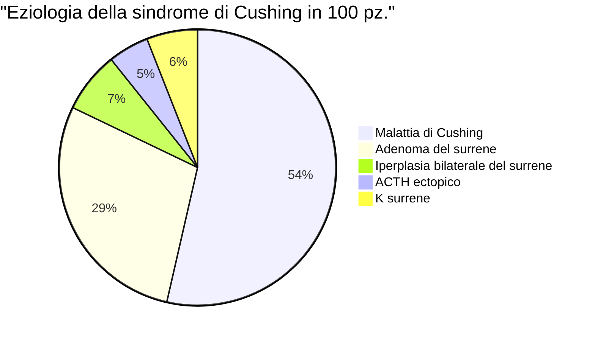

<!--
Prof. Umberto Pagotto

- Meglio frequentare
- Libro
	- * Slide lezione, molto complete e aggiornate
	- Textbook of Endocrinology Williams
-->

\part{Endocrinologia}

# Il sistema endocrino

- Il sistema endocrino è _un sistema diffuso_: __usa molecole segnale__ (_ormoni_) __per regolare in modo unitario lo stato funzionale di altre cellule__ (_cellule bersaglio_), mediante l'azione su loro specifici _recettori_; __con l'obiettivo di mantenere l'omeostasi__
	- Altamente integrato con altri sistemi
	- Capace di accendersi e spegnersi sulla base di _feedback_

```mrmaid
flowchart TB
	segnale --> cellula[Cellula endocrina] -->|ormone| bers[Cellula bersaglio] --> eff[Effetto] -->|feedback| cellula
```
- La regolazione endocrina è espletata tramite __assi endocrini__

\missingfigure{assi endocrini}

\todo{tabellona recap funzioni ormoni}

| Funzione corporea | Ormone |
|-|-|
| TODO da slide | Fare recap funzione degli ormoni|
| Crescita e sviluppo neuropsichico | Ormoni tiroidei |
| Crescita e svuluppo somatico | Vai pianooooooooo |
| Riproduzione | 

## Le ghiandole endocrine

## Trasporto degli ormoni nel sangue
- Alcuni ormoni viaggiano liberi nel sangue, altri viaggiano accompagnati da proteine
	- Trasportati liberi
		- Se hanno azione potentissima, e il loro rilascio va misurato in modo molto raffinata
	- Trasportati legati (a _binding proteins_ specifiche)
		- Se necessari _reservoir_ di ormoni
		- Se sono poco solubili

## Classificazione degli ormoni
1. Per struttura chimica
	- Peptidici
	- Steroidei
	- Da amminoacidi
	- Da acidi grassi polinsaturi
2. \todo{}

## Meccanismi recettoriali

### Recettori di membrana

### Recettori nucleari

## Tecniche laboratoriali per la misurazione degli ormoni
- Principio di base: __immunoassay__ (RIA, FIA, IRMA, ELISA, ECLIA, CLIA)
- \todo{IIa ora lezione del 5 ottobre}

# Ritmi di secrezione ormonale
<!-- Wed Oct  6 14:06:32 CEST 2021 -->

## FSH e LH

### Ciclo ovarico

> __Ovario policistico__ --- sitauzione patologica per cui si ha presenza di follicoli che non arrivano a maturazione completa e non regrediscono; ma, essendo ognuno dei follicoli circondato da cellule della teca, si ha iper-produzione di androgeni

0. Altre cose prima
1. Picco dell'LH
	- Anticipa ovulazione
	- Stimola produzione di `progesterone`

## Testosterone
- Picco la mattina presto^[Siamo animali diurni]
- Picchi secondari durante il giorno (17--18 /24h)

## TSH
- 2 grandi sincronizzatori
	- Temperatura
	- concentrazione di iodio

## Cortisolo

> Senza cortisolo si muore :(

# L'ipofisi

> Mediamente, a fine vita, ~ 10% sg. ha masse ipofisarie, diagnosticate solamente in una minoranza dei casi (< 2%)

## Anatomia dell'ipofisi
- Ipofisi anteriore \todo{anatomia}
	- Vascolarizzazione molto raffinata, per plessi
	- Mosaico di cellule, ogni cellula produce un ormone specifico
- Ipofisi posteriore

# Tumori ipofisari
- tumori ipofisari \missingfigure{img idelson su tipo di adenoma e ormoni ipofisari prodotti}
- micro vs macro
- L'adenoma dà 2 ordini di problemi
	1. Ipersecrezione ormonale (se adenoma secernente)
	2. Sintomi da decompressione
		- Ipopituitarismo (perché l'adenoma, essendo l'ipofisi contenuta nella sella turcica, cresce _a scapito_ del tessuto ipofisario sano)
		- Sintomi neurologici (perché l'adenoma in espansione comprime il tessuto encefalico)
			- Emianopsia
			- ↓ visus
			- Compressione del 3/o nervo cranico
			- Cefalea
			- Epilessia

## Prolattinomi (e iper-prolattinemie)

### Iperproalattinemie
- Iperprolattinemia (prolattina > 25 ng/ml) può avere 3 cause^[Nella clinica, prima di pensare ad una causa patologica, vanno escluse cause fisio e farmacologiche]
	1. Causa fisiologica
		- Coito
		- Esercizio fisico
		- Allattamento (anche manomissione dei capezzoli, es piercing)
		- Gravidanza
		- Sonno/sterss
	2. Causa farmacologica
		- Antipsicotici
		- Antidepressivi
		- Ini delle monoamminoossidasi
		- Procinetici
		- H2-antagonisti
		- Oppioidi
		- Anti-ipertensivi
		- ...
	3. Causa patologica (tumorale)
		- Microprolattinomi
		- Macroprolattinomi
		- Pseudoprolattinoma (neoplasia non PRL-secernetne che, deviando il peduncolo (?!?!) produce ↑ PRL)
	4. Idiopatica (naturalmente è diagnosi di esclusione)

\missingfigure{img con frecciona e livelli di prl}

### Prolattinomi
- Micro-prolattinoma: F > M (20:1)
	- Spesso secondario a disordini del ciclo
- Macro prolattinoma F = M (1:1)

### Clinica
- Sospetto clinico se
	1. C'è alterazione asse ipotalamo-ipofisario
	2. C'è una o più manifestazioni secondarie
		- Donna
			- Alterazioni del ciclo (amenorrea, oligom., polimenorrea)
			- Sterilità/infertilità
			- Galattorrea^[Secrezione dal capezzolo _marcatamente_ bianco latte, non semitrasparente]
			- Iperandrogenismo
		- Uomo
			- Deficit erettile
			- perdita della libido
			- ginecomastia
			- Galattorrea
		- Entrambi i sessi
			- Sintomi da lesione espansiva ipofisaria (cefalea, deficit del visus)

> __Oligomenorrea__
>
>- Lieve → < 35gg
- Moderata → > 35gg, < 60gg
- Severa → > 60gg
- Amenorrea → ≥ 6mesi

### Accertamenti diagnostici
- Quantificazione della prolattina e degli spike \todo{}
	- Corretta tecnica
	- Effetto gancio
- Se iperprolattinemia è confermata
	1. Escludere altre cause (fisio, farmacologica, altre patologie) \todo{elenco di patologie correlate} 
	2. Studiare funzionalmente ipofisi __con RMN con contrasto__

### Terapia
- Tp. di prima linea: __farmacologica di tipo dopaminergico__
	- Farmaci: \far{bromocriptina} e \far{cabergolina} (antagonisti del recettore 2 della dopamina) x5aa e poi si vede se iperprolattinemia ritorna (50--60% ritorno se tp. non viene mantenuta)
	- Scelta largamente preferibile a nch se micro, anche se nch rimane alternativa
	- Obbligatoria se macro: determina shrinking del tumore
- Tp. di seconda linea: nch
	- Macro
		- Se resistente alla terapia dopaminergica (male male male)
		- Se intolleranza alla tp. medica
		- Se rinoliquorrea
		- Se lesioni evolutive
	- Micro
		- Se resistenza alla tp. medica (male male)
		- Se intolleranza alla tp. medica
		- Scelta del pz.

### Iperprolattinemia e gravidanza
- Se micro
	- Ok se sotto controllo, si può sospendere tp. momentaneamente e si monitora situa
- Se macro

CASO CLINICO DA SLIDE

## Acromegalia
- Sindrome determinata da prolungata e cronica esposizione ad elevati livelli ematici di GH e del suo mediatore periferico, la somatomedina C
- Cause
	- Ipofisarie
	- Extraipofisarie
	- Eccessiva secrezione di GHRH

- Sospetto clinico se
	- Facies
	- Fatttori di rischio
- Complicanze (quali portano all'exitus?)
	- Curve di sopravvivenza

### Diagnosi
1. Misurazione di IGF1 (prodotto in risposta al GH, ma molto più stabilmente)
	- Calibrato per peso, età e genere!
2. OGTT (curva da carico di glucosio) ⇒ ↓ GH
	- 75g
	- Mi aspetto un calo di GH, fisiologicamente (essendo il GH controinsulare) ⇒ nell'acromegalia il GH rimane costante o sale
3. Misurazione della PRL
	- Obiettivo: escludere tumori misti secernenti

#### Valutazione delle complicanze che porta l'acromegalia
- Parametri lipidici: valutare lipidemia
- Ecocardio + ECG da sforzo: stimare fitness cv
- Colonscopia: valutare se ci sono polipi
- Polisonnografia: valuare se OSAS
- Doppler vasi cranici: per stimare rischio di ictus
- Eco prostatica/mammofrafia: stimare rischio di tumore
- Densitometria ossea: stimare rischio osteoporosi

### Terapia
\missingfigure{copiare flowchart terapia, ma se ch bravo, approccio ch > gestione farmacologica}


- Tp. farmacologica
	- Analoghi della somatostatina
	- Antagonisti del GH (analoghi del gh che impediscono la dimerizzazione del recettore)


# Diabete

## Diabete insipido

<!-- Fri Oct  8 16:21:26 CEST 2021 -->

# Iponatremia
- Iponatremia: [Na] plasmatica < 135 mmol/l (severa se ≤ 120 mmol/l, x60 mortalità!)
- Cause
	- $\star$ Farmaci! (spessissimo ⇒ SIADH)
	- Scompenso cardiaco
	- Disidratazione
	- Insufficienza epatica
	- lesioni cerebrali
	- Insufficienza renale
	- SIDAH non da farmaci (Sindrome da Inappropriata Secrezione di Adh)
	- Iatrogena (idratazione e/v)
- SeS
	- \todo{}
- Cause \todo{da slide}
	- Se ipovolemia
	- Se euvolemia
	- Se ipervolemia
		- Insufficienza cardiaca
		- Insufficienza epatica
		- Sindrome nefrosica

## SIADH

## Terapia
- In urgenza
	- ⚠️  Soluzione salina ipertonica nelle forme eu/ipervolemiche (attenzione! Si ammazza la gente se la sodiemia sale rapidamente! Lisi cellulare)
	- Soluzione salina isotonica nelle forme ipovolemiche
- Farmacologica (a metà tra urgenza e cronico)
	- Tolvaptan
- In cronico
	- Restrizione idrica

# Obesità
- Obesità --- ipertrofia e/o iperplasia del tessuto adiposo
- Cause
	- Apporto calorico > Spesa energetica ("di aria non si ingrassa")
	- 

## Meccanismi che governano l'assuzione di cibo

\missingfigure{img megagicante schema cervello ormoni vie organi addominali}

- meccanismi centrali
- meccanismi di feedback periferici e petpdi prodotti dal tratto gi
- segnali di sazietà

### Boh

#### Grelina

#### GLP1

### Segnali di benessere

#### Leptina
- Legame leptina - fertilità (per fare figli ci vuole energia, ma sopratutto _riserva_ energetica (quindi adipe!))
- controllo dell'alimentazione insieme all'insulina (entrambi sono segnali di pienezza e abbondanza)
- [leptina] proporzionale a qtà tessuto adiposo

## Fisiopatologia dell'obesità

### Tessuto adiposo

#### Tessuto adiposo bianco

#### Tessuto adiposo bruno

#### Gli adipociti
- Obesità → infiammazione costante a bassa intensità → citochine prodotte dai macrofagi → alterazione, in periferia (muscolo in primis) dei pathway intracellulari dell'insulina → instaurazione del'insensibilità periferica all'insulina nei tessuti che normalmente doverebbero essere a lei sensibili

##### Capacità secretorie dell'adipocita

## Patogenesi
- con classificazione

## Gestione clinica
- sindrome metabolica
- anamnesi
	- familiare
	- fisiologica
	- patologica remota
	- patologica prossima
	- farmacologica

### Valutazione diagnostica

## Terapia

\missingfigure{img terapia diabete tabella strategia in funzione di bmi}

- Caratteristiche
	- Target è SNC, lì c'è la centralina del comportamento alimentare
	- Deve modulare il segnale cevello → tratto GI
	- Deve permettere un approccio politerapico (rischio CV)

### Standard italiani

### Tp farmacologica

#### Naltrexone-Bupropione

\missingfigure{img meccanismo azione naltrexone bupropione}

- Bupropione stimola effetto anoressizzante tramite recettori POMC
- Naltrexone serve a bloccare β-endorfina, che normalmente inibirebbe POMC
- Buon farmaco per l'obeso che riversa _aspetti emotivi e gratificazione_ nel cibo, perché blocca l'azione degli oppioidi endogeni

\todo{mancano altri farmaci}

#### Semaglutide

#### Nuove frontiere
- studio surpass 2 con glucagone in associazione con altro

### Tp. bariatrica

# Magrezze

## Classificazione

## Magrezze da alterato comportamento alimentare

### Bulimia nervosa
- 50% bulimic* non è obes*

### Anoressia nervosa

# Diabete numero 2?
- Il diabete è patologia caratterizzata da 3 aspetti _principali_:
	1. Iperglicemia
	2. Deficit insulinico (secretorio o che non agisce)
	3. Suscettibilità a complicanze principalmente micro- e macrovascolari ma anche metaboliche, neurologiche...

## Complicanze

<!-- Tue Oct 19 14:00:00 CEST 2021 -->
### Piede diabetico
- Patogenesi
	0. Danno vascolare (micro e macro) e nervoso da diabete
	1. Alterata innervazione motoria
		- ⇒ perdita della struttura muscolare
		- ⇒ perdita della sensibilità e della propriocezione, dei riflessi
		- ⇒ perdita dell'equilibrio trofico e omeostatico del piede (cute, unghie)
	2. Perdita della struttura  ⇒ incapacità di sopportare efficacemente il carico ⇒ deformazione sotto carico pressiorio
	3. Deformazione da carico + perdita della sensibilità ⇒ ulcerazione
	4. Permanenza dell'ulcera + non sensibilità + perdita dell'equilibrio omeostatico di distretti periferici ⇒ complicanze anche gravi
		- Pericolo di infezioni necrotizzanti (gram -, risalenti)
		- Difficilissimo recupero, ferite al piede non guariscono più
		- ↓ aspettativa di vita
- Prevenzione
	- valutazione ispettiva costante (podologo in team!)
	- Valutazione sensibilità vibratoria + dolorifica
	- Podografia se rischio
- Comunicare pratiche corrette
	- Cosa non fare
	- Cosa fare
		- Igiene accuratissima del piede e quotidiana
		- Scarapa morbida

### Nefropatia diabetica
- Patogenesi: da microvasculopatia
- Segni
	- Ipertensione
	- Proteinuria
	- Progressiva IR
- Stadiazione
	1. Ipertrofia per iperfuzione compensatoria
	2. Danno anatomico glomerulare
	3. Nefropatia diabetica incipiente
	4. Nefropatia diabetica conclamata
- Gestione clinica
	- Valutare _sempre_: GFR e creatinina

## Terapia
- __Riferirsi a LG Società Italiana di Diabetologia__: @LineaGuidaSID2021

### Principi terapeutici
\missingfigure{target terapeutici}

### Dieta
\missingfigure{tabella indicazioni generali per composizione ottimale della dieta per pz. diabetico}
- Dieta deve essere __ipocalorica__ ed __ipolipidica__
	- Il pz. diabetico non ha necessità di dieta ipo-carboidatica (carboidrati devono essere 45--60% intake)
		- Occorre ridurre carboidrati semplici (ad assorbimento breve ⇒ picchi glicemici), o prevedere associazione con fibra
		- Carboidrati complessi _a lento assorbimento_ sono ok
- Prevedere 5 pasti (se non insulino-tp., altrimenti meglio 3 pasti)

### Interventi non farmacologici
- Esercizio fisico

### Farmaci

#### Metformina
- Razionale terapeutico: agente insulino-sensibilizzante

#### GLP1-RA (GLP1 Receptor Agonist)
- Razionale terapeutico
- Meccanismo di funzionamento
- Anche:
	- Analoghi di GLP1
	- Gliptine

#### Sulfaniluree

#### Inibitori degli enzimi intestinali
- \ini assorbimento intestinale del glucosio
- Effetti non graditi: da ↑ contenuto osmotico del lume intestinale (vomito, flatulenza, diarrea, dolore)

#### Personalizzazione della tp. anti-diabetica
- Flowchart
	- Ridurre perdita di peso
	- Ridurre glicemia
	- Con rischio cardioascolare
	- Con HF
	- Con CKD

#### Terapia insulinica
- Principi terapeutici
	- Metodiche di somministrazione
	- Differenti durate di aziine
- Come fare conta carboidrati per decidere unità di insulina

<!-- Wed Oct 20 16:13:11 CEST 2021 -->

### Chetoacidosi diabetica in acuto
- Situazione di emergenza caratterizzta da
	- Cheto --- Chetoniemia ≥ 3 mmol/l O chetonuria (> 2 unità in stick urine standard)
	- Acidosi --- Bicarbonati < 15 mmol/l E/O pH venoso < 7.3
	- Diabetica --- BGL > 11 mmol/L O DM noto
- Flowchart patogenesi

#### Terapia
1. Correzione del bilancio idrico
2. Correzione dell'iperglicemia
3. Correzione della disioniemia
4. Ripristino delle riserve di glucosio perse con l'insulina
5. Ab terapia

## Ipoglicemia

### Sintomi


- Triade di whipple

### Cause di ipoglicemia

#### Ipoglicemie funzionali

#### Ipoglicemie endogene

#### Sindrome da dumping

#### Insulinomi

# Tiroide

## Tumori tiroidei
- Noduli tiroide non sono preoccupanti
- \todo{mancano 2 lezioni}

### Percorso diagnostico

<!-- Mon Oct 25 14:09:36 CEST 2021 -->
### K midollare della tiroide
- Epidemiologia
	- 5--10% neoplasie tiroidee, spesso familiare con alta^[90-95% di penetranza in portatori di mutazioni puntiformi protooncogene del gene RET. Mutazioni del gene RET che Cys → Arg permettono una inappropriata dimerizzazione -- e quindi attivazione della catena intracellulare a loro competente -- con altri geni RET mutati (tramite ponti -S=S-, che in questa maniera sostengono la proliferazione aberrante della cellula] penetranza
	- Andamento piuttosto aggressivo, con infiltrazione locale + metastatica (per via linfatica ed ematica): 50% di sopravvivenza a 10aa
- \todo{capire bene in che relaizone sono il k midollare e le men2}

# Patologie del surrene

## Intro

### Anatomia del surrene

### Steroidogenesi

### Asse ipotalamo → ipofisi → surrene

## Ipercortisolismo (sindrome di Cushing)
- Eziologia della sindrome è multipla



### Eziologie

### Segni e sintomi
- Strie rubre

### Diagnostica
- i 3 test
	- cortisolo libero urinario
	- Test 1mg desametasone
	- dosaggio cortisolo h23
- Test diagnostici più raffinati

- Casiclinici

### Management
- Tp. chirurgica
	- Indicazioni
	- Svantaggi
- Tp. medica: \far{pasireotide}

- casoclinico M58aa ipopotassiemia ingravescente resistente a tp.

### Corticosteroidi di sintesi e terapia razionale

- \todo{tabella principi css}
- Cushing iatrogeno: rapida insorgenza e clinica conclamata e generalmente più severa

| CSS | Nome commerciale |
|-|-|

## Iperaldosteronismo

### Anatomia

