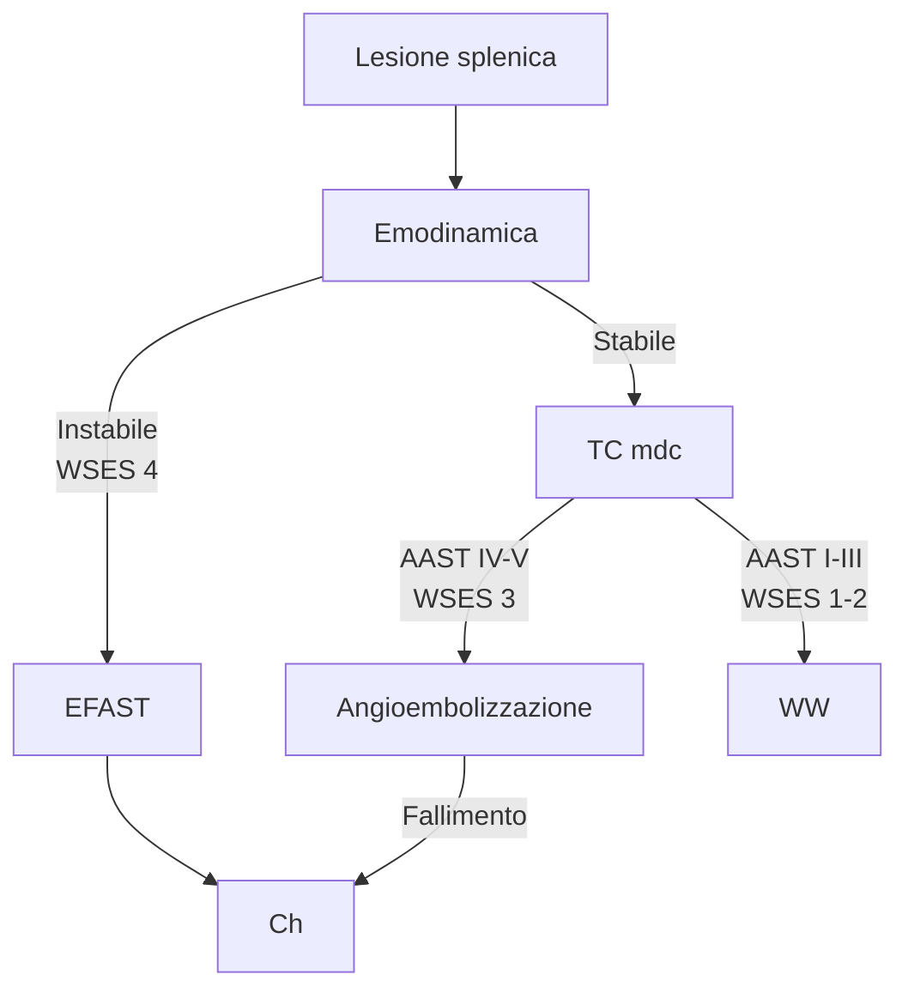

# Milza

{width=49%}
{width=49%}

* ~ 1/3 ha una milza accessoria fisiologicamente indipendente
* Il circolo dei quadranti superiori dell'addome (fegato, stomaco pancreas, milza) è interconnesso e abbondante, perché **origina e defluisce in comune dai medesimi tronchi arteriosi e venosi** (tripode celiaco e v porta) **con molti circoli collaterali e interconnessi**
* Fisiologicamente la milza ha 3 funzioni
	1. Emocateresi delle RBC
	2. Organo linfoide secondario
	3. Serbatoio di PLT (~1/3 sono sequestrate nel parenchima splenico). In caso di ipersplenismo il sequestro può arrivare a +90% plt e 50% rbc

###### Principali patologie spleniche

: In grassetto le cause di principale pertinenza ch

| Funzionalità splenica | Cause           |                                                              |
| :-------------------: | --------------- | ------------------------------------------------------------ |
|          Ipo          | **Oncologiche** | - Leucemia acuta - Linfoma NH - K mammario         |
|                       | Ematologiche    | - Anemia falciforme - Tpx midollo                       |
|                       | Epatiche        | - Htn portale - Epatopatia (alcolica, NAFLD) - Epatiti - Cirrosi - Cirrosi biliare |
|                       | GI              | - MICI - Celiachia - Whipple                       |
|                       | AI              | - LES - AR                                              |
|                       | Altro           | - Vasculopatie - AIDS - Amiloidosi - Tox - **Trauma** - **Cisti spleniche** |
|         Iper          | Primarie        | - Iperplasia - Splenomegalia idiopatica - Anemie - Trombocitopenie  |
|                       | Secondarie      | - Cirrosi post epatitica - Malattie infettive (mononucleosi, malaria) - Htn portale - Potus - Neo ematologiche - **Malattie emolitiche** - Emangioma splenico - **Aneurisma aa splenica** - Amartoma splenico |

### Trauma splenico

* La rottura splenica è la principale complicanza del trauma addominale chiuso (spesso associata ad altre lesioni viscerali)

###### Classificazione della gravità del trauma splenico (WSES)

| Lesione  | WSES Class | AAST[^fn-aast] (severità radiologica della lesione) | Emodinamica | Approccio |
| -------- | ---------- | --------------------------------------------------- | ----------- | --------- |
| Minore   | 1          | I-II                                                | Stabile     | WW        |
| Moderata | 2          | III                                                 | Stabile     | WW        |
|          | 3          | IV-V                                                | Stabile     | Angioemb  |
| Severa   | 4          | I-V                                                 | Instabile   | Ch        |

[^fn-aast]: 

> 🟠 La milza può rompersi in 2 tempi: si ha lesione, periodo di pausa ("periodo latente di Baudet", fino a +2w) e rottura

###### Gestione

###### Approccio ch

* **Open** --- ad oggi l'approccio ancora più sicuro e raccomandato (spesso traumi splenici sono associati ad altre lesioni)
* **VLS** --- solo per pz selezionati stabili. Si può fare splenectomia parziale o *splenorafia* (sutura della milza)
* Tt conservativo --- solo per pz selezionati stabili. Si ha sempre R/splenectomia per complicanze successive (FAV, aneurismi, cisti, ematomi sottocapsulari persistenti)

### Aneurisma dell'arteria splenica

* Raro, prevalenza < 1%
* Cause: aterosclerosi, traumi, infezioni, connettivopatie, vasculopatie, htn portale, htn
* Possono essere asintomatici (> 80%) o sintomatici (S/ generici di malessere addominale fino a dolore/shock se rottura)
* Dx è spesso incidentale; va approfondito con studio TC o RM mirato

###### Indicazioni a tto

* Diametro > 2cm, spp se in rapida espansione (principale correlato con R/rottura)
* Giovane (spp F fertile)
* Clinica sintomatica

###### Tto

1. Approccio **angiografico**
2. Approccio **chirurgico**
	* Legatura semplice senza ricostruzione (aneurisma grande)
	* Legatura a monte e a valle, con ricostruzione del vaso
	* Splenectomia (sse multipli o troppo vicini ad ilo per legatura)

### Cisti spleniche
