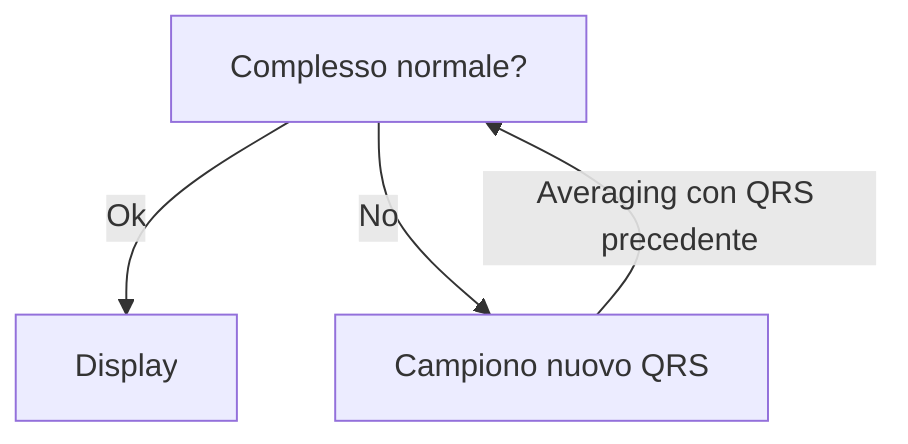

<!-- Tue Mar  1 18:51:13 CET 2022 manca la prima parte  --> 
# Prelievo dei segnali bioelettrici

## Fisiologia essenziale
- 3 evidenze fisiologiche di partenza
	#. Nella maggior parte delle cellule è rilevabile una ddp tra interno ed esterno (~ -85 mV, interno negativo)  
	
	#. La ddp è mantenuta grazie ad una differente concentrazione di ioni tra i due lati della membrana. Similmente, la sua variazione è imputabile ad un flusso (verso l'interno e/o verso l'esterno) di questi ioni. L'entità della ddp che gli ioni determinano è data dall'equazione di Nerst: $$\boxed{E=\frac{-RT}{zF}\log{\frac{C_{ext}}{C_{int}}}}$$
	#. La variazione di ddp (depolarizzazione → ripolarizzazione) rappresenta un segnale per la cellula, che risponde appropriatamente secondo la sua funzione (es: miocita si contrae)  
	
- Il flusso degli ioni è impedito dalla presenza di una membrana semipermeabile; la semipermeabilità è data da appositi canali che si aprono al momento opportuno
- Ogni cellula è un dipolo: gli ioni si dispongono in modo tale da spalmarsi sulla membrana -- che acquisisce quindi uniformemente carica (negativa da un lato, positiva dall'altro) -- mantenendo una zona intermedia (la membrana lipidica, appunto) nella quale non essendoci carica si crea un _campo elettrico_
- Il PdA (depolarizzazione → ripolarizzazione) di una superficie polarizzata chiusa può essere modellizzato, rispetto ad un punto P _lontano_, anche solo __come un dipolo che si sposta__

  

- La variazione del potenziale di una struttura complessa (es tutto il cuore) è modellizzabile, rispetto ad un punto P _lontano_, __come un dipolo unico che si sposta, a sua volta costruito dalla somma vettoriale dei singoli fronti di depolarizzazione che si spostano di ogni cellula che compone quella struttura__. Questo è il cambiamento registrato all'ECG
	- Se il fronte di depolarizzazione (positivo) si _avvicina_ al probe  → deflessione positiva
	- Se il fronte di ripolarizzazione (negativo) si _allontana_ dal probe → deflessione positiva
	- Se il fronte di depolarizzazione (positivo) si _allontana_ dal probe → deflessione negativa
	- Se il fronte di ripolarizzazione (negativo) si _avvicina_ al probe  → deflessione negativa

  

## Acquisizione del segnale bioelettrico

### Circuito di acquisizione
- Introduzione su quello che diamo normalmente per scontato
- Fourier
- Curva di risposta del sistema
- Concetto di banda passante (tra 0.05 Hz e 100 Hz, o tra 0.05 - 40 hz)
	- F1 = 0.05 Hz
	- F2 = 100 Hz
- Come effettivamente campioniamo
	- Linea di campionamento
	- Elettrodi
	- Amplificatore (mV → V quindi x10^3^)
	- Filtro --- dispositivo che elimina (↓↓ ampiezza) le armoniche di determinante frequenze, lasciando passare invariate le armoniche di altre frequenze^[__Attenzione: i filtri alterano l'ampiezza del segnale, pertanto se vengono usati bisogna sempre segnalarlo__, altrimenti non si è consci del fatto che l'ampiezza che si sta visualizzando, in realtà, non è quella reale]
		- Filtro passa-basso (passano le armoniche < f~taglio~)
		- Filtro passa-alto (passano le armoniche > f~taglio~
		- Filtro passa-banda (passano le frequenze comprese tra 2 frequenze di taglio)
		- Filtro notch (circuito di 2 filtri costruito in modo che passino tutte le armoniche _tranne_ quelle di determinato range di frequenze)
	- Alimentatore
	- Digitalizzazione del segnale (quantizzazione + codifica + memorizzazione)
		- Frequenza di campionamento (F~C~) ⇒ risoluzione in larghezza
			- $F_C$ > 200 Hz (per [th di Shannon](https://en.wikipedia.org/wiki/Shannon%E2%80%93Hartley_theorem)^[Per non perdere info, nel campionamento di un segnale analogico la frequenza di campionamento dev'essere > doppia della frequenza dell'armonica di ordine più alto che compone il segnale ⇒ nell'ecg almeno 200 Hz]) pena campionamento errato (fenomeno dell'[_aliasing_](https://it.wikipedia.org/wiki/Aliasing))
			- Oggi F~C~ è easy > di 200Hz (che bella la tecnologgggia)
		- Spazio di memoria (risoluzione in ampiezza)
			- Oggi vengono usati 12-16bit per la memorizzazione del valore del segnale campionato ⇒ risoluzione in ampiezza di 1/2^12--16^ V
			- Non necessario che la risoluzione in ampiezza sia > dell'errore dello strumento
	- Ricostruzione della continuità del segnale, che ora è digitale (interpolazione)

<!-- Tue Mar  8 18:09:41 CET 2022 --> 
### Disturbi del segnale
- 2 tipologie di disturbi
	#. Disturbi di rete (dovuti a rete elettrica di alimentazione)
		- Disturbo uguale a sé stesso in frequenza ed ampiezza (frequenza è quella della rete di alimentazione, 50Hz)
		- 2 cause: elettrostatica o elettromagnetica
			#. Elettrostatica → Siamo immersi in campo elettrico, e noi siamo dei conduttori
			#. Elettromagnetica → Siamo immersi in campo magnetico, che è variabile; questo induce una variazione nel campo elettrico e noi conduciamo questa variazione
		- __Per eliminare i disturbi bisogna eliminare le cause__^[__Tendenzialmente bisogna allontanare__ da cavi, isolare l'ambiente con gabbia di faraday (che risolve il problema elettrostatico, ma non quello elettromagnetico)...]; filtrare il segnale è una seconda scelta (perché si altera il segnale, filtrando frequenze simili a quella del disturbo
	#. Disturbi non di rete (disturbo da altra origine
		- Disturbo di frequenza ed ampiezza variabile nel tempo (pseudocasuale)
		- Cause
			#. Processi bioelettrici (principalmente contrazione muscolare del pz.)
		- __Per eliminare i disturbi non di rete si media il segnale__ tra i successivi complessi QRS[^aincrementale]: la casualità del disturbo giustifica questo approccio, in quanto le variazioni stocastiche si cancelleranno a vicenda^[In aggiunta di questo, si possono filtrare segnali di apposita frequenza (bisogna però sempre sapere che cosa si vuole filtrare: la contrazione muscolare ha una determinata banda di frequenze, di solito)]

[^aincrementale]: Algoritmo dell'averaging incrementale:  

> In derivazioni differenziali il disturbo, se è uguale, non è un gran problema perché si elimina (_"disturbo di modo comune"_); tuttavia, questo è vero sse i punti di contatto hanno la stessa impedenza di contatto. Il segnale della gamba destra (__"pilotaggio della gamba destra"__) è un secondo approccio: il disturbo letto viene re-immesso tramite l'elettrodo della gamba dx, con segno opposto -- ma, anche qui, l'elettrodo deve avere la medesima impedenza degli altri

## Sicurezza del paziente: micro e macro-shock, impianti a norma
_Obiettivo: evitare eventi avversi, di tipo elettrico (micro o macro, a seconda della ddp che li genera) durante il campionamento del segnale; perché questi eventi possono mettere a diverso titolo a rischio il pz._

- Evitare che il pz. sia soggetto a ΔV (principalmente evitare contatto con tensione di rete: contatto fase^[±310V CA, 220V di V~efficace~] + neutro)
- Evitare che il pz. sia connesso a terra: basta anche solo che tocchi la fase, e la terra chiuderà il circuito (con il pz. in mezzo 😕)
- Evitare (calzature _e_ pavimento antistatici^[Calzature conduttrici + pavimento con trama elettrica conduttrice e allacciata a terra]) che ci siano modi per accumulare carica elettrica (formalmente: accumulare ddp)

## Defibrillatore

  

- Primo trasformatore: 220V CA → 12V CC
- Il trasformatore si carica (necessita di corrente continua)
- Oscillatore: rende la corrente in uscita dal condensatore variabile
- Secondo trasformatore: 12V CC → 1KV CA
- Pulsanti per chiudere il circuito

## Come riconoscere automaticamente i complessi QRS
1. __Metodo soglia__: tutto quello > di un certo voltaggio è QRS
	- MA: se baseline non è isoelettrica questo ragionamento non ha senso!
2. __Calcolo la velocità di variazione del segnale__: il QRS varia rapidamente, quindi si fa la derivata (_differenziazione_) del segnale e questo enfatizza i punti di maggior variazione. Successivamente ribalto i segnali negativi, calcolo l'inviluppo (è, di fatto, _integrazione_) e controllo che il segnale ottenuto sia > di una certa soglia

  
