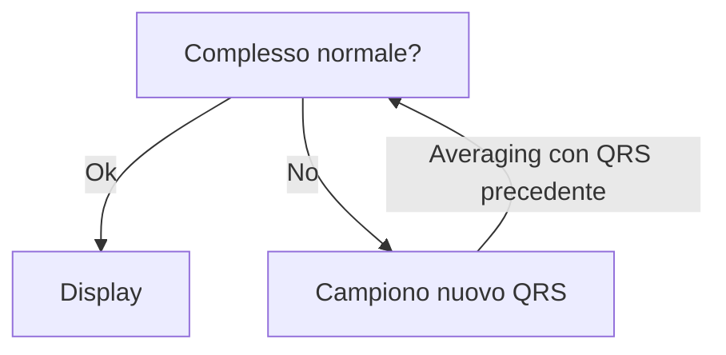

<!-- Tue Mar  1 18:51:13 CET 2022 manca la prima parte  --> 
# Prelievo dei segnali bioelettrici

## Fisiologia essenziale
- 3 evidenze fisiologiche di partenza
	#. Nella maggior parte delle cellule è rilevabile una ddp tra interno ed esterno (~ -85 mV, interno negativo)  
	{width=40% .centering}
	#. La ddp è mantenuta grazie ad una differente concentrazione di ioni tra i due lati della membrana. Similmente, la sua variazione è imputabile ad un flusso (verso l'interno e/o verso l'esterno) di questi ioni. L'entità della ddp che gli ioni determinano è data dall'equazione di Nerst: $$\boxed{E=\frac{-RT}{zF}\log{\frac{C_{ext}}{C_{int}}}}$$
	#. La variazione di ddp (depolarizzazione → ripolarizzazione) rappresenta un segnale per la cellula, che risponde appropriatamente secondo la sua funzione (es: miocita si contrae)  
	{.centering}
- Il flusso degli ioni è impedito dalla presenza di una membrana semipermeabile; la semipermeabilità è data da appositi canali che si aprono al momento opportuno
- Ogni cellula è un dipolo: gli ioni si dispongono in modo tale da spalmarsi sulla membrana -- che acquisisce quindi uniformemente carica (negativa da un lato, positiva dall'altro) -- mantenendo una zona intermedia (la membrana lipidica, appunto) nella quale non essendoci carica si crea un _campo elettrico_
- Il PdA (depolarizzazione → ripolarizzazione) di una superficie polarizzata chiusa può essere modellizzato, rispetto ad un punto P _lontano_, anche solo __come un dipolo che si sposta__

  

- La variazione del potenziale di una struttura complessa (es tutto il cuore) è modellizzabile, rispetto ad un punto P _lontano_, __come un dipolo unico che si sposta, a sua volta costruito dalla somma vettoriale dei singoli fronti di depolarizzazione che si spostano di ogni cellula che compone quella struttura__. Questo è il cambiamento registrato all'ECG
	- Se il fronte di depolarizzazione (positivo) si _avvicina_ al probe  → deflessione positiva
	- Se il fronte di ripolarizzazione (negativo) si _allontana_ dal probe → deflessione positiva
	- Se il fronte di depolarizzazione (positivo) si _allontana_ dal probe → deflessione negativa
	- Se il fronte di ripolarizzazione (negativo) si _avvicina_ al probe  → deflessione negativa

  

## Acquisizione del segnale bioelettrico

### La derivazione
- __Derivazione__ --- direzione lungo la quale misuriamo la variazione di intensità del campo elettrico
- ECG std: 12 derivazioni (10 elettrodi)
	#. Derivazioni bipolari (I, II, III)  
	
		- Differenziali: registrano la differenza tra il potenziale elettrico di 2 elettrodi
	#. Derivazioni unipolari precordiali (V~1~, V~2~, V~3~, V~4~, V~5~, V~6~)  
	
		- Unipolari: registrano il potenziale da un singolo elettrodo rispetto ad un punto virtuale ($R$), assunto come riferimento
	#. Derivazioni unipolari aumentate (aVR, aVF, aVL)  
	
		- Unipolari _aumentate_: sono unipolari, ma il punto di registrazione è anch'esso virtuale e il valore del potenziale in quel punto è calcolato usando gli altri 3 elettrodi reali

### Gli elettrodi

> ⚠️ __Considerazioni generali sull'applicazione degli elettrodi__  
>
>- Assicurarsi che la posizione anatomica degli elettrodi sia corretta
- Gli arti sono considerati isopotenziali rispetto alle radici degli arti stessi; quindi posizionare gli elettrodi alla base degli arti oppure lungo gli arti porta allo stesso risultato
- Pulire sempre la cute per togliere il sebo; rimuovere annessi cutanei
- Collegare il filo all'elettrodo _prima_ di applicare l'adesivo al paziente; specialmente, questo, se il cavo si innesta con un bottone. Questo previene lo schiacciamento e la fuoriuscita del gel conduttore che sta tra la cute e la parte metallica dell'adesivo
- Se si prevede di fare rilevazioni seriate: lasciare adesi gli elettrodi per garantire coerenza nei punti di campionamento del segnale
- Evitare prominenze ossee, l'adesione degli elettrodi non è ottimale

- Gli elettrodi vengono disposti secondo uno schema preciso
	#. __Elettrodi periferici__ → disposti da braccio sx lungo gli altri in sequenza: 🟨 🟥 ⬛️ 🟩 (GIRONEVE)
	#. __Elettrodi precordiali__ → disposti su sterno e precordio
		- C~1~ → 4/o intercostale, sulla parasternale dx
		- C~2~ → 4/o intercostale, sulla parasternale sx
		- C~4~ → 5/o intercostale, sulla medioclavicolare sx (itto della punta)
		- C~6~ → 5/o intercostale, sull'ascellare media
		- C~3~ → punto medio tra C~2~ e C~4~
		- C~5~ → punto medio tra C~4~ e C~6~
	#. __Precordiali per derivazioni posteriori__ (15 derivazioni)
		- C~7~ → 5/o intercostale, sull'ascellare posteriore
		- C~8~ → 5/o intercostale, angolo della scapola
		- C~9~ → 5/o intercostale, paravertebrale sx (oppure omolaterale)
	#. __Posizionamento a dx__
		- C~1,2~ → posizione invertita
		- C~3,4,5,6~ → specularmente alle posizioni normali, ma a dx. Indicare sul tracciato la derivazione come V~#~R

### Circuito di acquisizione

  

#### Composizione del segnale
- __Il segnale__, essendo periodico (con frequenza $f$) e continuo, __può essere rappresentato mediante una appropriata combinazione lineare di funzioni sinusoidali di frequenza $kf \text{ con } k \in \mathbb{N}$__ ("[th di Fourier](https://it.wikipedia.org/wiki/Serie_di_Fourier)"). Ciascuna funzione di frequenza $kf$ è detta _armonica_
- __È stato dimostrato che, per non perdere _nessuna_ informazione diagnostica, è necessario registrare un segnale che sia composto da _tutte_ le armoniche nell'intervallo [0.05--100Hz]__
	- Per consentire l'acquisizione di tutte e sole le frequenze nel range utile (_"banda passante"_) si usa una combinazione di filtri: prima un passa-alto (F~taglio~ < 0.05 Hz) poi un passa-basso (F~taglio~ > 100 Hz). Questo produce un sistema con una buona risposta in termini di potenziale registrabile ($G(f)$) proprio nell'ambito della _banda passante_, anche se le frequenze agli estremi della banda sono registrate peggio rispetto a quelle centrali  
	
	- Tuttavia, l'ampiezza registrabile è comunque molto ridotta (< 5mV) ⇒ necessario amplificare (nell'ECG std oggi si amplifica x1000) il segnale prelevato

#### Acquisizione del segnale

  

- La presenza di molteplici strati con funzione resistiva e capacitiva altera le varie armoniche in maniera differente
	- La componente conduttiva agisce da __resistenza elettrica__, attenuando tutte le armoniche allo stesso modo ⇒ __↓ ampiezza__
	- La componente non conduttiva agisce da __condensatore__, opponendosi al passaggio della corrente in maniera inversamente proporzionale alla sua frequenza ($f$), nonché alla capacità ($C$)^[$$Z_C = \frac{1}{2 \pi f C}$$] che possiede ⇒ alterando diverse armoniche in maniera differente, __altera la morfologia d'onda__

#### Trasduzione ed amplificazione del segnale
- Amplificatore (mV → V quindi x10^3^)
- Filtro --- dispositivo che elimina (↓↓ ampiezza) le armoniche di determinante frequenze, lasciando passare invariate le armoniche di altre frequenze^[__Attenzione: i filtri alterano l'ampiezza del segnale, pertanto se vengono usati bisogna sempre segnalarlo__, altrimenti non si è consci del fatto che l'ampiezza che si sta visualizzando, in realtà, non è quella reale]
	- Filtro passa-basso (passano le armoniche < f~taglio~)
	- Filtro passa-alto (passano le armoniche > f~taglio~
	- Filtro passa-banda (passano le frequenze comprese tra 2 frequenze di taglio)
	- Filtro notch (circuito di 2 filtri costruito in modo che passino tutte le armoniche _tranne_ quelle di determinato range di frequenze)

#### Conversione analogico → digitale
- Digitalizzazione del segnale = quantizzazione + codifica + memorizzazione
	#. Digitalizzazione: campionare periodicamente il segnale analogico
		- Frequenza di campionamento (F~C~) ⇒ risoluzione in larghezza (permette di registrare variazioni del segnale una volta ogni 1/F~C~ secondi)
		- $F_C$ > 200 Hz (per [th di Shannon](https://en.wikipedia.org/wiki/Shannon%E2%80%93Hartley_theorem)^[Per non perdere info, nel campionamento di un segnale analogico la frequenza di campionamento dev'essere > doppia della frequenza dell'armonica di ordine più alto che compone il segnale ⇒ nell'ecg almeno 200 Hz]) pena campionamento errato (fenomeno dell'[_aliasing_](https://it.wikipedia.org/wiki/Aliasing))
		- Oggi F~C~ è easy > di 200Hz (che bella la tecnologgggia)
	#. Codifica del segnale + memorizzazione: trasformazione del valore campionato in un numero binario, stoccato poi in memoria
		- Lo spazio, in bit, con cui si decide di codificare il sengale è detto __risoluzione in ampiezza__ (permette di registrare variazioni minime nell'ordine di 1/spazio dedicato alla memorizzazione)
			- > risoluzione in ampiezza ⇒ > spazio di memorizzazione necessario
			- Non ha senso usare risoluzione in ampiezza > massimo errore dello strumento
		- Oggi vengono usati 12-16bit per la memorizzazione del valore del segnale campionato ⇒ risoluzione in ampiezza di 1/2^12--16^ V (minima variazione ΔV registrabile ~ 1/2^12-16^ V)
		- Non necessario che la risoluzione in ampiezza sia > dell'errore dello strumento

#### Interpolazione del segnale
- Ricostruzione della continuità del segnale, che ora è digitale (interpolazione)
	- Nei fatti il segnale viene integrato, costruendo una funzione matematica che sia il più aderente possibile ai punti discreti che sono stati campionati

<!-- Tue Mar  8 18:09:41 CET 2022 --> 
### Disturbi del segnale
- 2 tipologie di disturbi: _"di rete"_ o _"non di rete"_
	#. Disturbi di rete (dovuti a rete elettrica di alimentazione che produce campi elettrici e/o magnetici che alterano la misurazione)
		- Disturbo uguale a sé stesso in frequenza ed ampiezza (frequenza è quella della rete di alimentazione, 50Hz)
		- 2 cause: elettrostatica o elettromagnetica
			#. Elettrostatica → Siamo immersi in campo elettrico, e noi siamo dei conduttori
			#. Elettromagnetica → Siamo immersi in campo magnetico, che è variabile; questo induce una variazione nel campo elettrico e noi conduciamo questa variazione
		- __Per eliminare i disturbi bisogna eliminare le cause__^[__Tendenzialmente bisogna allontanare__ da cavi, isolare l'ambiente con gabbia di faraday (che risolve il problema elettrostatico, ma non quello elettromagnetico)...]; filtrare il segnale è una seconda scelta (perché si altera il segnale, filtrando frequenze simili a quella del disturbo^[Se si filtra, specificare sempre che filtro si ha scelto di usare per eliminare il disturbo di rete, perché si possono avere diversi artefatti: filtro notch può segnare falsa incisura del QRS, filtro passa-banda/alto/basso può alterare morfologia degli intervalli]
			
	#. Disturbi non di rete (disturbo da altra origine)
		- Disturbo di frequenza ed ampiezza variabile nel tempo (pseudocasuale)
		- Cause
			#. Processi bioelettrici (principalmente contrazione muscolare del pz.)
		- __Per eliminare i disturbi non di rete si media il segnale__ (filtrare i disturbi non di rete non ha senso^[Perché sono di frequenza non costante, quindi non saprei quali frequenze rimuovere]) tra i successivi complessi QRS[^aincrementale]: la casualità del disturbo giustifica questo approccio, in quanto le variazioni, essendo stocastiche, si cancelleranno a vicenda^[In aggiunta a questo, si possono filtrare segnali di apposita frequenza (bisogna però sempre sapere che cosa si vuole filtrare: la contrazione muscolare ha una determinata banda di frequenze, di solito)]  
		

[^aincrementale]: Algoritmo dell'averaging incrementale:  

> In derivazioni differenziali il disturbo, se è uguale, non è un gran problema perché si elimina (_"disturbo di modo comune"_); tuttavia, questo è vero sse i punti di contatto hanno la stessa impedenza di contatto. Il segnale della gamba destra (__"pilotaggio della gamba destra"__) è un secondo approccio: il disturbo letto viene re-immesso tramite l'elettrodo della gamba dx, con segno opposto -- ma, anche qui, l'elettrodo deve avere la medesima impedenza degli altri

### Processazione del segnale

### Come riconoscere automaticamente i complessi QRS
1. __Metodo soglia__: tutto quello > di un certo voltaggio è QRS
	- MA: se baseline non è isoelettrica questo ragionamento non ha senso!
2. __Calcolo la velocità di variazione del segnale__: il QRS varia rapidamente, quindi si fa la derivata (_differenziazione_) del segnale e questo enfatizza i punti di maggior variazione. Successivamente ribalto i segnali negativi, calcolo l'inviluppo (è, di fatto, _integrazione_) e controllo che il segnale ottenuto sia > di una certa soglia

  

## Acquisizione del segnale in particolari condizioni
- Principali ambiti di applicazione "particolari" dell'ECG:
	#. ECG sotto sforzo --- ECG prelevato mentre pz viene sottoposto a sforzo progressivo, di intensità ben definita, per riferire le alterazioni ECG-grafiche a ben definite condizioni di stress cardiovascolare
	#. Holter --- ECG continuo per 24--48h durante vita quotidiana
		- Per evitare l'enorme quantità di artefatti che si avrebbe (ma tanto si ha comunque): il segnale viene _sempre_ prelevato in modo differenziale tra coppia di elettrodi
		- Metodiche di analisi automatica aiutano il clinico, e sono necessarie per fare fronte alla cattiva qualità del segnale
- Problema principale: artefatti dovuti al movimento
	- Elettrodi più possibile prossimali e lontani da fasce muscolari
	- Cavi ed elettrodi ben stabilizzati con nastro
	- Pesante processazione del segnale, anche con aiuti semi-automatici (computer evidenzia tratti che medico deve classificare)

## Sicurezza del paziente: micro e macro-shock, impianti a norma
_Obiettivo: evitare eventi avversi, di tipo elettrico (micro o macro, a seconda della ddp che li genera) durante il campionamento del segnale; perché questi eventi possono mettere a diverso titolo a rischio il pz._

- Evitare che il pz. sia soggetto a ΔV (principalmente evitare contatto con tensione di rete: contatto fase^[±310V CA, 220V di V~efficace~] + neutro)
- Evitare che il pz. sia connesso a terra: basta anche solo che tocchi la fase, e la terra chiuderà il circuito (con il pz. in mezzo 😕)
- Evitare (calzature _e_ pavimento antistatici^[Calzature conduttrici + pavimento con trama elettrica conduttrice e allacciata a terra]) che ci siano modi per accumulare carica elettrica (formalmente: accumulare ddp)

## Defibrillatore

  

- Primo trasformatore: 220V CA → 12V CC
- Il trasformatore si carica (necessita di corrente continua)
- Oscillatore: rende la corrente in uscita dal condensatore variabile
- Secondo trasformatore: 12V CC → 1KV CA
- Pulsanti per chiudere il circuito

